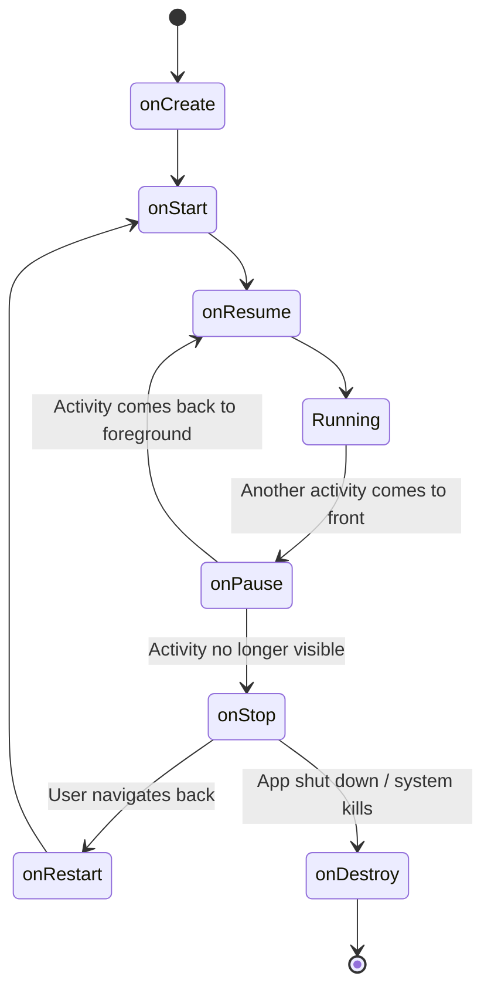
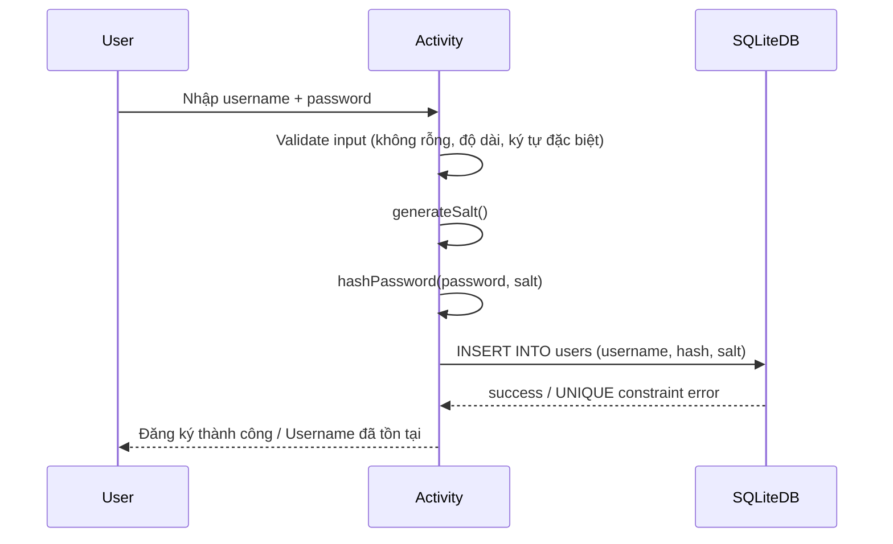
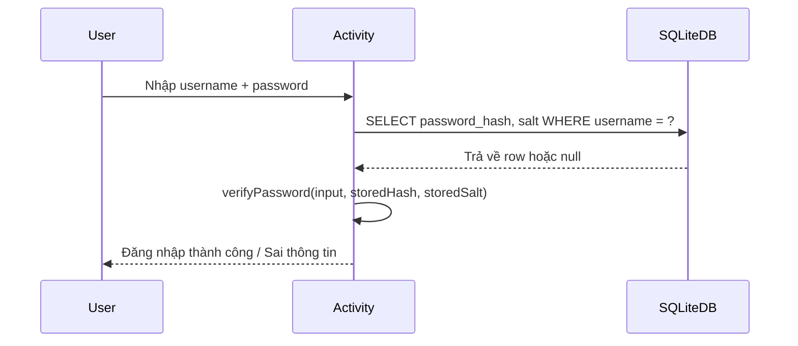

# Bài 8: Android

---

## 1. Kiến Trúc Ứng Dụng Android

### 1.1 Mô hình phân tầng

Ứng dụng di động Android được tổ chức theo kiến trúc nhiều tầng (layered architecture), tương tự mô hình 3-tier truyền thống:

```
┌─────────────────────────────────┐
│        Tầng Hiển thị (UI)       │  ← Activity, Fragment, View
├─────────────────────────────────┤
│        Tầng Xử lý (Logic)       │  ← Business logic, Workflow, Entities
├─────────────────────────────────┤
│        Tầng Dữ liệu (Data)      │  ← SQLite, SharedPreferences, Remote API
└─────────────────────────────────┘
```

- **Tầng Hiển thị**: Giao diện người dùng (UI), Activity, Fragment, các View component.
- **Tầng Xử lý**: Luồng nghiệp vụ (business workflow), xử lý logic, quản lý trạng thái, các thực thể (entities).
- **Tầng Dữ liệu**: Lưu trữ cục bộ (SQLite, SharedPreferences), truy cập dữ liệu từ xa (REST API, gRPC), đồng bộ hóa.

???+ info "Tại sao cần phân tầng?"
    Phân tầng rõ ràng giúp tách biệt trách nhiệm (Separation of Concerns), dễ kiểm thử từng tầng độc lập, và giảm coupling — đây là nguyên tắc cơ bản trong thiết kế phần mềm an toàn và bảo trì được.

---

### 1.2 Android Software Stack

Android không phải là một distro Linux thuần túy — nó *dựa trên* Linux kernel nhưng có stack riêng:

```
┌──────────────────────────────────────────┐
│              Applications                │  ← Java/Kotlin apps
├──────────────────────────────────────────┤
│          Application Framework           │  ← Activity Mgr, Content Providers...
├────────────────────┬─────────────────────┤
│      Libraries     │   Android Runtime   │  ← C/C++ libs | Dalvik VM + Core Libs
├────────────────────┴─────────────────────┤
│              Linux Kernel                │  ← Drivers, IPC, Security, Memory Mgmt
└──────────────────────────────────────────┘
```

#### Linux Kernel

Cung cấp các cơ chế nền tảng:

- **Security model**: UID/GID-based process isolation — mỗi app chạy dưới một Linux user riêng biệt.
- **Memory management**: Virtual memory, OOM killer.
- **Process management**: Mỗi app = một process riêng.
- **Network stack**: TCP/IP, socket.
- **Driver model**: Display, Camera, WiFi, Bluetooth, Binder IPC.

???+ warning "Lưu ý bảo mật"
    Vì Android dùng Linux kernel, các CVE liên quan đến kernel Linux (ví dụ: privilege escalation qua Binder IPC) trực tiếp ảnh hưởng đến Android. Theo dõi Android Security Bulletin tại https://source.android.com/docs/security/bulletin.

#### Libraries (C/C++)

Chạy ngầm, gồm 4 nhóm:

| Nhóm | Ví dụ |
|---|---|
| Bionic Libc | System C library tùy chỉnh cho Android (nhỏ hơn glibc) |
| Function Libraries | SQLite, WebKit, Media Framework, OpenGL ES |
| Native Servers | Surface Manager |
| Hardware Abstraction | HAL — lớp trừu tượng phần cứng |

#### Android Runtime (ART/Dalvik)

=== "Dalvik VM (cũ, trước Android 5.0)"

    - **Register-based** VM (khác với JVM stack-based) → hiệu quả hơn trên CPU nhúng.
    - Chạy file `.dex` (Dalvik Executable).
    - Tool `dx` trong SDK: chuyển `.class` Java → `.dex`.
    - Mỗi app chạy **một instance DVM riêng** trong process riêng.

=== "ART (Android Runtime, từ Android 5.0+)"

    - Thay thế hoàn toàn Dalvik.
    - **AOT (Ahead-Of-Time) compilation**: biên dịch `.dex` → native code lúc cài đặt.
    - **JIT + Profile-guided compilation** từ Android 7.0: kết hợp AOT và JIT.
    - Hiệu năng tốt hơn, GC được cải tiến.

???+ note "DVM vs JVM"
    | | DVM | JVM |
    |---|---|---|
    | Phát triển bởi | Google | Sun/Oracle |
    | Định dạng thực thi | `.dex` | `.class` / `.jar` |
    | Kiến trúc | Register-based | Stack-based |
    | Hỗ trợ Java libs | Một phần | Đầy đủ |
    | Môi trường | Thiết bị nhúng | General-purpose |

#### Application Framework

Các dịch vụ cấp cao cho developer:

| Component | Chức năng |
|---|---|
| Activity Manager | Quản lý vòng đời app, back stack, navigation |
| Content Providers | Chia sẻ dữ liệu giữa các app |
| Notification Manager | Hiển thị notification trên status bar |
| Resource Manager | Truy cập assets, strings, layouts |
| Window Manager | Quản lý các window, surface |
| Location Manager | GPS, network-based location |
| Telephony Manager | SMS, call state |

---

## 2. Lựa Chọn Nền Tảng Ứng Dụng

### 2.1 So sánh ba loại app

=== "Native App"

    **Phát triển cho platform cụ thể** (Android với Java/Kotlin, iOS với Swift/Objective-C).

    **Ưu điểm:**
    - Truy cập đầy đủ tất cả hardware API (camera, Bluetooth, NFC, sensor...)
    - Hiệu năng cao nhất
    - Được kiểm duyệt qua App Store → đảm bảo chất lượng và tương thích

    **Nhược điểm:**
    - Chi phí phát triển cao (phải viết riêng cho từng platform)
    - Cần cài đặt trên thiết bị
    - Yêu cầu kinh nghiệm với ngôn ngữ platform-specific

=== "Hybrid App"

    **Bản chất là web app đóng gói trong native wrapper** (ví dụ: React Native, Flutter, Cordova).

    **Ưu điểm:**
    - Codebase dùng chung cho nhiều platform
    - Cài đặt như native app, không cần trình duyệt
    - Có thể truy cập một số hardware API

    **Nhược điểm:**
    - Chậm hơn native app
    - Phụ thuộc vào framework bên thứ 3
    - Một số tính năng platform-specific có thể không đầy đủ

=== "Web App"

    **Chạy qua trình duyệt**, không cần cài đặt (PWA - Progressive Web App).

    **Ưu điểm:**
    - Không cần app store, cập nhật tức thì
    - Dễ phát triển và bảo trì (HTML/CSS/JS)
    - Không chiếm bộ nhớ thiết bị

    **Nhược điểm:**
    - Cần kết nối mạng và trình duyệt
    - Không có đầy đủ tính năng như native app
    - Không được liệt kê trong app store

---

## 3. Lập Trình Ứng Dụng Android

### 3.1 Các yếu tố cần xem xét trước khi phát triển

Trước khi code, cần phân tích môi trường đích:

**Hardware constraints:**
- Độ phân giải và kích thước màn hình → thiết kế layout responsive
- CPU (số nhân, kiến trúc ARM 32/64-bit) → tính toán nặng cần offload sang background thread
- RAM → tránh memory leak, dùng `WeakReference` hợp lý
- Storage → quản lý cache, tránh write không cần thiết

**Network & battery:**
- Băng thông hạn chế → nén dữ liệu, lazy loading
- Pin → tránh wakelock không cần thiết, dùng `WorkManager` cho background tasks

**Application concerns:**
- Caching strategy (in-memory vs disk)
- State management (ViewModel + LiveData / StateFlow)
- Data access pattern (Repository pattern)

---

### 3.2 Cấu trúc Project Android

Một Android project tiêu chuẩn có cấu trúc:

```
MyApp/
├── app/
│   ├── src/
│   │   ├── main/
│   │   │   ├── java/com/example/myapp/   ← Mã nguồn Java/Kotlin
│   │   │   ├── res/
│   │   │   │   ├── layout/               ← File XML bố cục UI
│   │   │   │   ├── values/               ← strings.xml, colors.xml, styles.xml
│   │   │   │   └── drawable/             ← Hình ảnh, icon (nhiều density)
│   │   │   └── AndroidManifest.xml       ← Mô tả ứng dụng
│   └── build.gradle                      ← Cấu hình build (dependencies, ProGuard)
└── build.gradle                          ← Project-level build config
```

---

### 3.3 AndroidManifest.xml — File quan trọng nhất

File này là "hợp đồng" giữa app và hệ thống Android. Mọi thứ app cần làm đều phải khai báo ở đây.

```xml
<?xml version="1.0" encoding="utf-8"?>
<manifest xmlns:android="http://schemas.android.com/apk/res/android"
    package="com.example.myapp"
    android:versionCode="1"
    android:versionName="1.0">

    <!-- SDK version constraints -->
    <uses-sdk android:minSdkVersion="21" android:targetSdkVersion="34" />

    <!-- Permissions khai báo tại đây -->
    <uses-permission android:name="android.permission.INTERNET" />
    <uses-permission android:name="android.permission.WRITE_EXTERNAL_STORAGE" />

    <application
        android:icon="@drawable/ic_launcher"
        android:label="@string/app_name"
        android:theme="@style/AppTheme"
        android:allowBackup="true">

        <!-- Activity chính -->
        <activity android:name=".MainActivity" android:label="@string/app_name">
            <intent-filter>
                <action android:name="android.intent.action.MAIN" />
                <category android:name="android.intent.category.LAUNCHER" />
            </intent-filter>
        </activity>

        <!-- Broadcast Receiver ví dụ -->
        <receiver
            android:name=".MyReceiver"
            android:exported="false"
            android:enabled="true">
            <intent-filter>
                <action android:name="android.intent.action.BOOT_COMPLETED" />
            </intent-filter>
        </receiver>

    </application>
</manifest>
```

**Các thành phần khai báo trong Manifest:**

| Thành phần | Tag | Mục đích |
|---|---|---|
| Activity | `<activity>` | Màn hình UI |
| Service | `<service>` | Background task không có UI |
| Broadcast Receiver | `<receiver>` | Nhận system/app broadcast |
| Content Provider | `<provider>` | Chia sẻ dữ liệu với app khác |
| Permission | `<uses-permission>` | Yêu cầu quyền từ hệ thống |

???+ danger "Bảo mật Manifest"
    `android:exported="true"` trên Activity/Receiver/Provider nghĩa là component đó có thể bị gọi từ **bên ngoài app** — đây là nguồn gốc của nhiều lỗ hổng Android (Intent hijacking, unauthorized access). Luôn đặt `exported="false"` trừ khi cố ý expose.

---

## 4. Các Thành Phần Cốt Lõi Android

### 4.1 Activity

Activity là thành phần đại diện cho một màn hình trong ứng dụng. Mỗi Activity kế thừa từ `android.app.Activity` (hoặc `AppCompatActivity`).

#### Vòng đời Activity



| Callback | Khi nào được gọi | Nên làm gì |
|---|---|---|
| `onCreate()` | App khởi tạo lần đầu | Inflate layout, init ViewModel |
| `onStart()` | Activity visible nhưng chưa focus | Đăng ký broadcast receiver |
| `onResume()` | Activity visible và có focus | Bắt đầu animation, camera |
| `onPause()` | Một Activity khác che lên | Lưu draft, dừng animation |
| `onStop()` | Activity hoàn toàn không visible | Hủy đăng ký, lưu dữ liệu nặng |
| `onDestroy()` | Activity bị hủy | Giải phóng tài nguyên |

#### Intent: Explicit vs Implicit

=== "Explicit Intent"

    Chỉ định rõ component đích. Dùng trong nội bộ app:

    ```java
    // Khởi chạy ProfileActivity từ MainActivity
    Intent intent = new Intent(this, ProfileActivity.class);
    intent.putExtra("userId", 123);
    startActivity(intent);
    ```

=== "Implicit Intent"

    Chỉ định action, để Android tìm component phù hợp:

    ```java
    // Mở URL trong browser
    Intent intent = new Intent(Intent.ACTION_VIEW);
    intent.setData(Uri.parse("https://example.com"));
    startActivity(intent);
    
    // Gửi email
    Intent emailIntent = new Intent(Intent.ACTION_SEND);
    emailIntent.setType("message/rfc822");
    emailIntent.putExtra(Intent.EXTRA_EMAIL, new String[]{"test@example.com"});
    startActivity(Intent.createChooser(emailIntent, "Chọn ứng dụng email"));
    ```

???+ warning "Bảo mật Intent"
    Implicit Intent có thể bị **Intent hijacking**: một app độc hại đăng ký handle cùng action và đánh cắp dữ liệu. Với dữ liệu nhạy cảm, **luôn dùng Explicit Intent**. Từ Android 12+, các `PendingIntent` mutable phải khai báo rõ ràng.

---

### 4.2 Service

Service chạy ngầm, không có UI. Dùng cho tác vụ dài hạn như phát nhạc, tải file, đồng bộ dữ liệu.

```java
public class MusicService extends Service {
    @Override
    public int onStartCommand(Intent intent, int flags, int startId) {
        // Xử lý lệnh phát nhạc
        return START_STICKY; // Hệ thống tự restart service nếu bị kill
    }

    @Override
    public IBinder onBind(Intent intent) {
        return null; // null nếu không cần bound service
    }
}
```

### 4.3 Broadcast Receiver

Nhận và xử lý các broadcast từ hệ thống hoặc app khác:

```java
public class BootReceiver extends BroadcastReceiver {
    @Override
    public void onReceive(Context context, Intent intent) {
        if (Intent.ACTION_BOOT_COMPLETED.equals(intent.getAction())) {
            // Khởi động lại service sau khi thiết bị boot
        }
    }
}
```

### 4.4 Content Provider

Cho phép chia sẻ dữ liệu có cấu trúc giữa các app thông qua URI:

```java
// Query danh bạ (cần permission READ_CONTACTS)
Cursor cursor = getContentResolver().query(
    ContactsContract.Contacts.CONTENT_URI,
    null, null, null, null
);
```

---

## 5. Cơ Sở Dữ Liệu SQLite Trong Android

### 5.1 Lưu trữ và cô lập dữ liệu

Mỗi app có thư mục sandbox riêng:

```
/data/data/<applicationId>/
├── databases/    ← SQLite database files
├── shared_prefs/ ← SharedPreferences XML files
├── files/        ← Internal file storage
└── cache/        ← Cache files
```

- Các app khác **không thể truy cập** thư mục này (trừ khi device bị root).
- Đây là Android sandbox model, dựa trên Linux UID isolation.

### 5.2 Khai báo permission

```xml
<!-- Đọc/ghi external storage (cần từ Android 6.0+: runtime permission) -->
<uses-permission android:name="android.permission.WRITE_EXTERNAL_STORAGE" />
<uses-permission android:name="android.permission.READ_EXTERNAL_STORAGE" />
```

???+ note "Từ Android 10+ (API 29)"
    Scoped Storage được áp dụng — app không còn có thể đọc/ghi tùy ý vào external storage. Phải dùng `MediaStore` API hoặc Storage Access Framework (SAF).

### 5.3 Sử dụng SQLiteOpenHelper

```java
public class DatabaseHelper extends SQLiteOpenHelper {
    private static final String DB_NAME = "app.db";
    private static final int DB_VERSION = 1;

    public DatabaseHelper(Context context) {
        super(context, DB_NAME, null, DB_VERSION);
    }

    @Override
    public void onCreate(SQLiteDatabase db) {
        db.execSQL(
            "CREATE TABLE users (" +
            "id INTEGER PRIMARY KEY AUTOINCREMENT, " +
            "username TEXT UNIQUE NOT NULL, " +
            "password_hash TEXT NOT NULL)"
        );
    }

    @Override
    public void onUpgrade(SQLiteDatabase db, int oldVersion, int newVersion) {
        db.execSQL("DROP TABLE IF EXISTS users");
        onCreate(db);
    }
}
```

**Truy vấn an toàn — dùng parameterized query:**

```java
// ĐÚNG: Parameterized query — tránh SQL Injection
String[] args = { username };
Cursor cursor = db.rawQuery(
    "SELECT * FROM users WHERE username = ?", args
);

// SAI: String concatenation — dễ bị SQL Injection
// db.rawQuery("SELECT * FROM users WHERE username = '" + username + "'", null);
```

???+ danger "SQL Injection trong Android"
    SQLite không miễn nhiễm với SQL Injection. Luôn dùng **parameterized queries** hoặc `ContentValues` với `insert()`, `update()`, `query()` của `SQLiteDatabase` thay vì `rawQuery()` với chuỗi nối trực tiếp.

---

## 6. ProGuard — Bảo Vệ và Tối Ưu App

### 6.1 ProGuard là gì?

ProGuard là một công cụ post-processing bytecode với 3 chức năng chính:

```
.class files ──► ProGuard ──► .dex tối ưu và obfuscated
                    │
                    ├── Shrink: Loại bỏ code/resource không dùng
                    ├── Optimize: Tối ưu bytecode
                    └── Obfuscate: Đổi tên class/method/field → khó reverse
```

**Tại sao cần ProGuard từ góc độ bảo mật?**

1. **Chống reverse engineering**: Kẻ tấn công dùng `apktool`, `jadx`, `dex2jar` để decompile APK. Obfuscation làm code decompiled trở nên khó đọc.
2. **Giảm attack surface**: Loại bỏ dead code → ít code = ít lỗ hổng tiềm ẩn.
3. **Ẩn logic nhạy cảm**: Algorithm, API keys hardcoded (dù tốt hơn là không nên hardcode).

???+ warning "ProGuard không phải silver bullet"
    ProGuard làm *chậm* quá trình reverse engineering, không *ngăn chặn* hoàn toàn. Các tool như `jadx` và `bytecode-viewer` vẫn có thể decompile và làm khó đọc có thể được phân tích với đủ kiên nhẫn. Không nên hardcode secrets vào APK dù có ProGuard.

### 6.2 Cấu hình trong `build.gradle`

```groovy
android {
    buildTypes {
        release {
            minifyEnabled true       // Bật shrink + obfuscate
            shrinkResources true     // Loại bỏ resource không dùng
            useProguard true
            proguardFiles getDefaultProguardFile('proguard-android.txt'),
                         'proguard-rules.pro'
        }
        debug {
            minifyEnabled true      // Có thể bật để test
            useProguard false       // Tắt obfuscate khi debug để dễ đọc stack trace
            proguardFiles getDefaultProguardFile('proguard-android.txt'),
                         'proguard-rules.pro'
        }
    }
}
```

### 6.3 File `proguard-rules.pro`

File này cấu hình **ngoại lệ** cho ProGuard — những class nào **không được** đổi tên (vì được reference bằng reflection, annotation, hay từ thư viện bên thứ 3):

```proguard
# Giữ nguyên tên class Android Activity (framework cần tên chính xác)
-keep class * extends android.app.Activity

# Giữ nguyên tất cả class của Facebook SDK
-keep class com.facebook.** { *; }

# Giữ nguyên cho thư viện Google
-keep class com.google.** { *; }

# Giữ nguyên Support Library
-keep class androidx.** { *; }
-keep interface androidx.** { *; }

# Quan trọng: Giữ các class dùng với Gson (serialization dựa trên reflection)
-keepattributes Signature
-keepattributes *Annotation*
-keep class sun.misc.Unsafe { *; }

# Giữ native method declarations
-keepclasseswithmembernames class * {
    native <methods>;
}

# Loại bỏ log trong release build (tốt cho bảo mật)
-assumenosideeffects class android.util.Log {
    public static * v(...);
    public static * d(...);
    public static * i(...);
}

# Suppress warnings cho thư viện không cần thiết
-dontwarn okio.**
-dontwarn javax.annotation.**
```

???+ tip "Lưu ý mapping.txt"
    ProGuard sinh ra file `mapping.txt` ghi lại bản đồ đổi tên. File này **cực kỳ quan trọng** để đọc stack trace từ production crash. Lưu trữ `mapping.txt` cùng với mỗi release build — nếu mất file này, stack trace trên Crashlytics sẽ không thể decode.

---

## 7. Vấn Đề An Toàn Ứng Dụng Android (OWASP Mobile)

Đây là phần bài giảng chỉ nhắc đến ProGuard như một biện pháp bảo vệ. Phần sau mở rộng thêm các vấn đề bảo mật thực tế.

### 7.1 OWASP Mobile Top 10 (2023)

| # | Tên | Mô tả ngắn |
|---|---|---|
| M1 | Improper Credential Usage | Hardcode credentials, lưu token không an toàn |
| M2 | Inadequate Supply Chain Security | Thư viện bên thứ 3 có lỗ hổng |
| M3 | Insecure Authentication/Authorization | Bypass auth, IDOR |
| M4 | Insufficient Input/Output Validation | SQLi, XSS in WebView |
| M5 | Insecure Communication | Không dùng TLS, certificate pinning yếu |
| M6 | Inadequate Privacy Controls | Thu thập dữ liệu nhạy cảm không cần thiết |
| M7 | Insufficient Binary Protections | Không obfuscate, dễ repackage |
| M8 | Security Misconfiguration | Exported components, debug mode in production |
| M9 | Insecure Data Storage | Lưu PII vào SharedPreferences dạng plaintext |
| M10 | Insufficient Cryptography | Dùng MD5/SHA1, IV cứng, ECB mode |

### 7.2 Các lỗ hổng thường gặp trong Android app

#### Insecure Data Storage

```java
// SAI: Lưu password vào SharedPreferences plaintext
SharedPreferences prefs = getSharedPreferences("auth", MODE_PRIVATE);
prefs.edit().putString("password", userPassword).apply();

// ĐÚNG: Dùng Android Keystore + EncryptedSharedPreferences
MasterKey masterKey = new MasterKey.Builder(context)
    .setKeyScheme(MasterKey.KeyScheme.AES256_GCM)
    .build();

SharedPreferences encryptedPrefs = EncryptedSharedPreferences.create(
    context, "secret_prefs", masterKey,
    EncryptedSharedPreferences.PrefKeyEncryptionScheme.AES256_SIV,
    EncryptedSharedPreferences.PrefValueEncryptionScheme.AES256_GCM
);
```

#### Insecure Communication

```java
// SAI: Trust all certificates (thường thấy khi dev lazy fix SSL error)
TrustManager[] trustAllCerts = new TrustManager[]{
    new X509TrustManager() {
        public void checkClientTrusted(X509Certificate[] chain, String authType) {}
        public void checkServerTrusted(X509Certificate[] chain, String authType) {}
        public X509Certificate[] getAcceptedIssuers() { return new X509Certificate[]{}; }
    }
};
// → Toàn bộ TLS protection bị vô hiệu hóa → MITM trivial

// ĐÚNG: Certificate Pinning với OkHttp
OkHttpClient client = new OkHttpClient.Builder()
    .certificatePinner(new CertificatePinner.Builder()
        .add("api.example.com", "sha256/AAAAAAAAAAAAAAAAAAAAAAAAAAAAAAAAAAAAAAAAAAA=")
        .build())
    .build();
```

#### Exported Component Vulnerability

```xml
<!-- SAI: Activity exported = có thể bị gọi từ bất kỳ app nào -->
<activity android:name=".AdminActivity" android:exported="true" />

<!-- ĐÚNG: Thêm permission check -->
<activity android:name=".AdminActivity"
    android:exported="true"
    android:permission="com.example.ADMIN_PERMISSION" />
```

---

## 8. Bài Tập: Login/Register App với SQLite

Đề bài yêu cầu xây dựng app với:
- Đăng ký / Login / Logout dựa trên SQLite
- Sử dụng ProGuard

### Thiết kế an toàn

**Q: Lưu mật khẩu trong SQLite như thế nào cho an toàn?**

**A:** Không bao giờ lưu plaintext. Cần hash + salt:

```java
import java.security.MessageDigest;
import java.security.SecureRandom;
import java.util.Base64;

public class PasswordUtils {

    // Tạo salt ngẫu nhiên
    public static String generateSalt() {
        SecureRandom random = new SecureRandom();
        byte[] salt = new byte[16];
        random.nextBytes(salt);
        return Base64.getEncoder().encodeToString(salt);
    }

    // Hash password với salt dùng SHA-256
    // (Thực tế production nên dùng BCrypt/Argon2)
    public static String hashPassword(String password, String salt) throws Exception {
        MessageDigest md = MessageDigest.getInstance("SHA-256");
        md.update(Base64.getDecoder().decode(salt));
        byte[] hash = md.digest(password.getBytes("UTF-8"));
        return Base64.getEncoder().encodeToString(hash);
    }

    // Kiểm tra password
    public static boolean verifyPassword(String inputPassword,
                                          String storedHash,
                                          String storedSalt) throws Exception {
        String inputHash = hashPassword(inputPassword, storedSalt);
        return inputHash.equals(storedHash);
    }
}
```

???+ tip "Production: Dùng BCrypt thay vì SHA-256"
    SHA-256 quá nhanh → dễ bị brute force với GPU. **BCrypt**, **Argon2id**, hoặc **PBKDF2** có built-in cost factor để làm chậm quá trình hash. Thư viện `jBCrypt` hoặc `Bouncy Castle` có thể thêm vào Android project.

**Schema SQLite cho bài tập:**

```sql
CREATE TABLE users (
    id INTEGER PRIMARY KEY AUTOINCREMENT,
    username TEXT UNIQUE NOT NULL,
    password_hash TEXT NOT NULL,
    salt TEXT NOT NULL,
    created_at INTEGER DEFAULT (strftime('%s', 'now'))
);
```

**Flow đăng ký:**



**Flow đăng nhập:**



---

## 9. Tài Liệu Tham Khảo & Mở Rộng

| Nguồn | Link |
|---|---|
| Android Developer Official | https://developer.android.com |
| Android Security Bulletin | https://source.android.com/docs/security/bulletin |
| OWASP Mobile Security Testing Guide | https://owasp.org/www-project-mobile-security-testing-guide/ |
| Stanford CS193A (Android) | https://web.stanford.edu/class/cs193a/ |
| Android Keystore System | https://developer.android.com/training/articles/keystore |
| ProGuard Manual | https://www.guardsquare.com/manual/home |
| R8 (thay thế ProGuard hiện đại) | https://developer.android.com/studio/build/shrink-code |

???+ info "R8 vs ProGuard"
    Từ Android Studio 3.4+, Google thay ProGuard bằng **R8** (tích hợp vào D8 compiler). R8 thực hiện shrinking, obfuscation và optimization trong một bước, nhanh hơn và tích hợp sâu hơn với Android toolchain. Cú pháp file rules tương thích với ProGuard.
