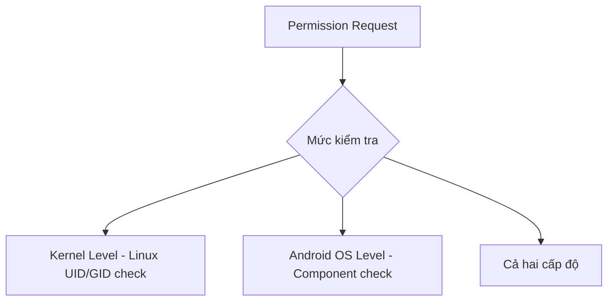
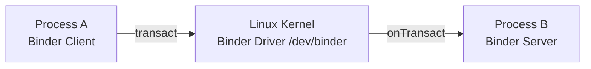
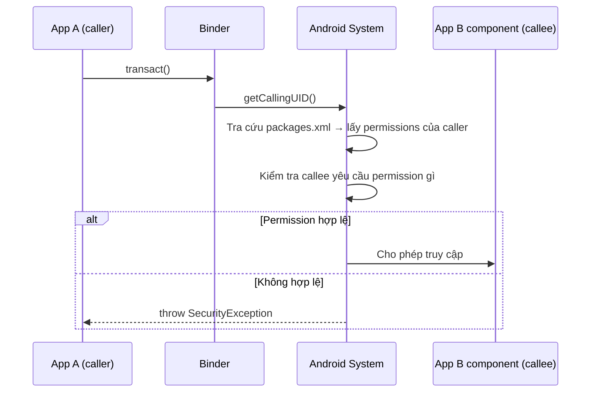
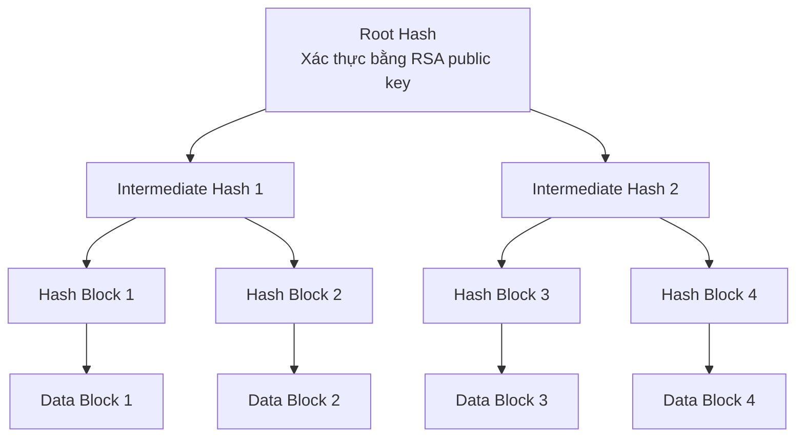
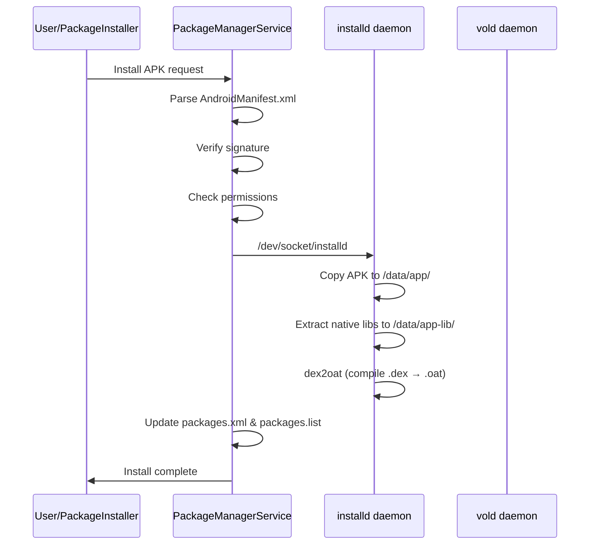

# Bài 9: Bảo mật Ứng dụng Android 

---

## 1. Mô hình an toàn Android (Android Security Model)

Android xây dựng bảo mật dựa trên 4 trụ cột chính:

- **Application Sandboxing** — cô lập ứng dụng ở cấp tiến trình và tập tin
- **Permission** — cơ chế kiểm soát quyền truy cập tài nguyên
- **IPC (Inter-Process Communication)** — cơ chế giao tiếp an toàn giữa các tiến trình
- **Code Signing & Platform Key** — xác thực nguồn gốc và tính toàn vẹn ứng dụng

---

## 2. Phân loại ứng dụng Android

Android phân biệt hai loại ứng dụng:

| Loại | Vị trí | Đặc điểm |
|---|---|---|
| **System app** | `/system/` | Cài sẵn với OS, read-only, không thể xóa/sửa |
| **User-installed app** | `/data/` | Phân vùng read-write, độc lập với nhau |

---

## 3. Application Sandboxing

### 3.1 Cơ chế cô lập bằng UID

Khi một ứng dụng được cài đặt, Android cấp cho nó một **UID (User ID)** duy nhất — còn gọi là **app ID**. Mỗi ứng dụng chạy như một Linux user riêng biệt, được cô lập ở **hai cấp độ**:

- **Cấp tiến trình (process)**: mỗi app chạy trong tiến trình riêng với UID riêng
- **Cấp tập tin (file)**: mỗi app có thư mục riêng tại `/data/data/<package>`, chỉ UID của app đó mới có quyền đọc/ghi

!!! info "Không có /etc/passwd"
    Android không dùng file `/etc/passwd` truyền thống. Thông tin UID được định nghĩa trong file nguồn:
    [`android_filesystem_config.h`](https://android.googlesource.com/platform/system/core/+/master/libcutils/include/private/android_filesystem_config.h)

### 3.2 Phân vùng UID

```
UID 0                   → root
UID 1000 (AID_SYSTEM)  → các dịch vụ hệ thống
UID >= 10000 (AID_APP) → ứng dụng người dùng
```

Quy tắc đặt username cho app:
- `app_XXX` — trong đó XXX là offset tính từ AID_APP
- `uY_aXXX` — trong môi trường multi-user, Y là Android user ID

**Ví dụ**: UID = 10037 → username = `u0_a37` (Y=0, XXX=37)

```bash
# Kiểm tra UID của một package cụ thể
pm list packages
dumpsys | grep -A18 "Package \[com.example.app1\]"

# Xem các tiến trình đang chạy với UID tương ứng
ps
```

### 3.3 Quản lý UID trong hệ thống

UID của ứng dụng được lưu tại hai file:

```
/data/system/packages.xml   → thông tin chi tiết (XML)
/data/system/packages.list  → thông tin dạng phẳng (flat)
```

Cấu trúc một dòng trong `packages.list`:

```
<package_name> <UID> <debug_flag> <data_dir> <seinfo_label> <GID_list>
```

**Ví dụ:**
```
com.google.android.email 10037 0 /data/data/com.google.android.email default 3003,1028,1015
```

Giải thích từng trường:

| Thứ tự | Ý nghĩa |
|---|---|
| 1 | Package name |
| 2 | UID của ứng dụng |
| 3 | Debug flag (1 = debug mode) |
| 4 | Đường dẫn thư mục data của app |
| 5 | SEInfo label (dùng bởi SELinux) |
| 6 | Danh sách GID bổ sung (tương ứng với các permission được cấp) |

### 3.4 Shared User ID

Hai hoặc nhiều ứng dụng có thể **chia sẻ cùng một UID** — gọi là **shared user ID**. Khi đó chúng:

- Chạy trong cùng một tiến trình
- Có thể chia sẻ dữ liệu với nhau

**Điều kiện bắt buộc**: các ứng dụng phải được **ký bởi cùng một code signing key**.

!!! warning "Lưu ý quan trọng"
    Nếu bạn thêm `sharedUserId` vào một app **đã được cài đặt**, hệ thống sẽ thay đổi UID của app đó và **vô hiệu hóa app** này. Do đó, shared user ID phải được thiết kế từ đầu, không thể thêm sau.

**Ví dụ**: `com.android.keyguard` và `com.android.systemui` cùng UID 10012:
```
com.android.keyguard  10012 0 /data/data/com.android.keyguard  platform 1028,1015,1035,3002,3001
com.android.systemui  10012 0 /data/data/com.android.systemui platform 1028,1015,1035,3002,3001
```

### 3.5 Quyền truy cập file giữa các ứng dụng

Thông thường, thư mục của app hoàn toàn private. Nếu muốn chia sẻ file, app có thể tạo file với flag:

- `MODE_WORLD_READABLE` → tương ứng bit `S_IROTH` — cho phép đọc
- `MODE_WORLD_WRITEABLE` → tương ứng bit `S_IWOTH` — cho phép ghi

```java
FileOutputStream fos = openFileOutput(FILENAME, Context.MODE_WORLD_READABLE);
fos.write(string.getBytes());
fos.close();
```

!!! danger "Deprecated & Nguy hiểm"
    `MODE_WORLD_READABLE` và `MODE_WORLD_WRITEABLE` đã bị **deprecated từ API 17** và bị loại bỏ hoàn toàn từ API 24 vì đây là một lỗ hổng bảo mật nghiêm trọng. Thay vào đó, hãy dùng **ContentProvider** hoặc **FileProvider** để chia sẻ dữ liệu một cách an toàn và có kiểm soát.

---

## 4. Permission (Quyền hạn)

### 4.1 Khái niệm

**Permission** là một chuỗi (string) định nghĩa khả năng thực hiện một tác vụ, ví dụ:

- Truy cập tài nguyên vật lý (camera, microphone, thẻ nhớ SD)
- Chia sẻ dữ liệu (danh sách liên lạc, lịch sử SMS)
- Cho phép ứng dụng thứ 3 khởi động/truy cập vào các component của app

Quyền hạn được khai báo trong file `AndroidManifest.xml`:

```xml
<manifest>
    <uses-permission android:name="android.permission.CAMERA" />
    <application>
        ...
    </application>
</manifest>
```

### 4.2 Các mức thực thi Permission

Permission có thể được kiểm tra ở nhiều cấp độ khác nhau trong hệ thống:



### 4.3 Permission Protection Level

Đây là thuộc tính quan trọng nhất của một permission, xác định **mức độ rủi ro** và **cách hệ thống quyết định có cấp hay không**:

=== "normal"

    **Rủi ro thấp** — Permission tự động được cấp khi cài đặt, không cần xác nhận từ người dùng.
    
    Ví dụ: `ACCESS_NETWORK_STATE`, `GET_ACCOUNTS`, `INTERNET`

=== "dangerous"

    **Rủi ro cao** — Có thể truy cập dữ liệu nhạy cảm hoặc kiểm soát thiết bị. Android hiển thị dialog yêu cầu người dùng **chấp thuận tường minh** (runtime permission từ Android 6.0+).
    
    Ví dụ: `READ_SMS`, `CAMERA`, `READ_CONTACTS`, `ACCESS_FINE_LOCATION`

=== "signature"

    **Chỉ cấp cho app được ký cùng key** với app khai báo permission đó.
    
    Ví dụ: `NET_ADMIN`, `ACCESS_ALL_EXTERNAL_STORAGE`
    
    Đây là **protection level mạnh nhất** — chỉ các app trong cùng "nhà phát triển" mới được cấp.

=== "signatureOrSystem"

    Cấp cho app **thuộc system image** hoặc **được ký cùng key** với app khai báo permission.
    
    - Giúp vendor không cần chia sẻ key với nhau trên các app cài sẵn
    - Từ Android 4.4 trở đi: app cần được cài tại `/system/priv-app/` thay vì `/system/app/`

### 4.4 Custom Permission

Ứng dụng bên thứ ba có thể **tự định nghĩa permission** với protection level tùy chọn:

```xml
<?xml version="1.0" encoding="utf-8"?>
<manifest xmlns:android="http://schemas.android.com/apk/res/android"
    package="com.example.app">

    <permission
        android:name="com.example.app.permission.PERMISSION1"
        android:label="@string/permission1_label"
        android:description="@string/permission1_desc"
        android:permissionGroup="com.example.app.permission-group.TEST_GROUP"
        android:protectionLevel="signature" />

</manifest>
```

!!! warning "Thứ tự cài đặt"
    Android chỉ cấp các permission đã được khai báo trước. Do đó, **ứng dụng định nghĩa permission phải được cài đặt trước** ứng dụng muốn sử dụng permission đó.

### 4.5 Yêu cầu Permission (uses-permission)

```xml
<?xml version="1.0" encoding="utf-8"?>
<manifest xmlns:android="http://schemas.android.com/apk/res/android"
    package="com.example.app">

    <uses-permission android:name="android.permission.INTERNET" />
    <uses-permission android:name="android.permission.WRITE_EXTERNAL_STORAGE" />

    <application android:name="SampleApp">
        ...
    </application>
</manifest>
```

### 4.6 Ánh xạ Permission → GID

Một điểm rất quan trọng trong cơ chế thực thi permission trên Android: **permission được ánh xạ sang GID** và gán vào danh sách GID bổ sung của tiến trình app. Tệp cấu hình ánh xạ này là:

```
/etc/permissions/platform.xml
```

Ví dụ nội dung `platform.xml`:
```xml
<?xml version="1.0" encoding="utf-8"?>
<permissions>
    <permission name="android.permission.INTERNET">
        <group gid="inet" />
    </permission>

    <permission name="android.permission.WRITE_EXTERNAL_STORAGE">
        <group gid="sdcard" />
        <group gid="sdcard_rw" />
    </permission>

    <assign-permission name="android.permission.MODIFY_AUDIO_SETTINGS" uid="media" />
    <assign-permission name="android.permission.ACCESS_SURFACE_FLINGER"  uid="media" />
</permissions>
```

Ánh xạ GID name → số được định nghĩa trong `android_filesystem_config.h`:

```c
#define AID_INET       3003  // can create AF_INET and AF_INET6 sockets
#define AID_SDCARD_RW  1015  // external storage write access
#define AID_SDCARD_R   1028  // external storage read access
```

Nghĩa là: **một app được cấp `INTERNET` → kernel cho phép app tạo socket vì tiến trình app có GID=3003 (inet)**.

Thẻ `<assign-permission>` làm **ngược lại**: gán quyền hạn cho tiến trình đang chạy với UID tương ứng (ví dụ: tiến trình `media` được tự động có `MODIFY_AUDIO_SETTINGS`).

### 4.7 Quản lý Permission qua Package Manager

Permission được gán lúc cài đặt bởi **Package Manager Service**, lưu trong:

```
/data/system/packages.xml
```

Ví dụ entry trong `packages.xml`:
```xml
<package name="com.google.android.apps.translate"
    codePath="/data/app/com.google.android.apps.translate-2.apk"
    userId="10204"
    installer="com.android.vending">
    <sigs count="1">
        <cert index="7" />
    </sigs>
    <perms>
        <item name="android.permission.READ_EXTERNAL_STORAGE" />
        <item name="android.permission.CAMERA" />
        <item name="android.permission.INTERNET" />
        <item name="android.permission.RECORD_AUDIO" />
        ...
    </perms>
</package>
```

### 4.8 Zygote và việc gán thuộc tính tiến trình

Tất cả ứng dụng Android đều có tiến trình cha là **Zygote**. Khi một app được khởi chạy, hệ thống **fork** từ Zygote và gán:

- UID tương ứng với app
- GID chính
- Danh sách GID bổ sung (từ ánh xạ permission → GID)

Điều này giúp **khởi động nhanh** vì Zygote đã pre-load toàn bộ thư viện Android runtime.

---

## 5. IPC — Inter-Process Communication

### 5.1 Vấn đề

Android chạy mỗi app trong sandbox riêng, nhưng đôi khi các tiến trình cần giao tiếp. Các cơ chế IPC truyền thống của Linux như **file, socket, pipe, semaphore, shared memory, message queue** đều có thể dùng, nhưng Android cần một cơ chế **an toàn và tích hợp với mô hình permission** hơn.

### 5.2 Binder — IPC mới của Android

**Binder** là cơ chế IPC đặc thù của Android, phát triển dựa trên **OpenBinder**.



Binder dựa trên kiến trúc **distributed component**, tương tự Windows COM hay CORBA trên Unix — nhưng **chỉ hoạt động trên một thiết bị** (không hỗ trợ RPC qua mạng).

### 5.3 Binder Security — Identity duy nhất

Các đối tượng Binder duy trì một **định danh duy nhất** xuyên suốt các tiến trình. Nếu:

- Tiến trình A tạo một Binder object
- Truyền cho tiến trình B
- B truyền tiếp cho tiến trình C

Thì tất cả lời gọi từ A, B, C đều được thực hiện **trên cùng một object trong không gian bộ nhớ của A**. Binder object có thể hoạt động như một **security token** — nền tảng của capability-based security trong Android.

### 5.4 Capability-based Security

!!! note "Capability-based vs ACL"
    Android Binder **không dùng ACL (Access Control List)**. Thay vào đó, nó dùng **capability model**: ứng dụng được cấp khả năng truy cập bằng cách trao cho nó một tham chiếu không thể giả mạo — vừa tham chiếu đến đối tượng tài nguyên, vừa đóng gói quyền truy cập.

**Binder token** = capability:
- Sở hữu Binder token → có toàn quyền truy cập Binder đó
- Không thể "đoán" hay giả mạo token của tiến trình khác

### 5.5 Service Manager và Service Discovery

Binder sử dụng **context manager** (còn gọi là **service manager**) để cho phép xác định dịch vụ:

1. **Service manager** khởi chạy khi boot
2. Các dịch vụ đăng ký với service manager (tên + Binder reference)
3. App muốn dùng dịch vụ → tra cứu theo tên → nhận Binder reference → gọi trực tiếp

Chỉ một số tiến trình hệ thống được đăng ký dịch vụ. Ví dụ: chỉ tiến trình có `UID=1002` (AID_BLUETOOTH) mới được đăng ký Bluetooth service.

```bash
# Liệt kê tất cả Binder services đã đăng ký
service list
```

Output ví dụ:
```
Found 79 services
  sip: [android.net.sip.ISipService]
  phone: [com.android.internal.telephony.ITelephony]
  nfc: [android.nfc.INfcAdapter]
  ...
```

### 5.6 Binder đảm bảo UID/PID không thể giả mạo

Binder đảm bảo rằng **UID và PID của caller không thể bị spoofed**. Điều này cho phép các dịch vụ hệ thống kiểm soát quyền truy cập:

```java
public boolean enable() {
    if ((Binder.getCallingUid() != Process.SYSTEM_UID)
            && (!checkIfCallerIsForegroundUser())) {
        Log.w(TAG, "enable() not allowed for non-active and non-system user");
        return false;
    }
    // ...
}
```

Quy trình kiểm tra permission khi một component bị gọi:



---

## 6. Code Signing & Platform Keys

### 6.1 Tại sao cần ký APK?

Android sử dụng chữ ký trên APK để đảm bảo:

- **Same origin policy**: update ứng dụng phải đến từ cùng một developer (cùng key)
- **Trust relationship**: thiết lập mối quan hệ tin cậy giữa các ứng dụng (shared UID)
- **Integrity check**: so sánh phiên bản hiện tại và phiên bản update

### 6.2 Platform Keys

Ứng dụng hệ thống (system app) được ký bởi **platform key**. Platform key được quản lý bởi:

- Nhà sản xuất thiết bị (OEM)
- Nhà mạng (carrier)
- Google (cho thiết bị Nexus/Pixel)
- Cộng đồng custom ROM (AOSP build)

### 6.3 Cấu trúc APK

APK thực chất là một **file ZIP** với cấu trúc mở rộng từ JAR:

```
apk/
├── AndroidManifest.xml
├── classes.dex
├── resources.arsc
├── assets/
├── lib/
│   ├── armeabi/
│   │   └── libapp.so
│   └── armeabi-v7a/
│       └── libapp.so
├── META-INF/
│   ├── CERT.RSA    ← Chứng chỉ + chữ ký
│   ├── CERT.SF     ← Signature file
│   └── MANIFEST.MF ← Digest của từng file
└── res/
    ├── anim/
    ├── drawable/
    ├── layout/
    └── ...
```

### 6.4 Quá trình ký — Java JAR Signing

**Bước 1**: `MANIFEST.MF` — chứa digest của mỗi file:
```
Manifest-Version: 1.0
Created-By: 1.0 (Android)

Name: res/drawable-xhdpi/ic_launcher.png
SHA1-Digest: K/ORd/ltoqSlgDD/9DY7aCNIBvU=

Name: res/menu/main.xml
SHA1-Digest: kC8WDilgurof+F2AxgcSSKDhjno=
```

**Bước 2**: `CERT.SF` — chứa digest của toàn bộ MANIFEST.MF và từng entry:
```
Signature-Version: 1.0
SHA1-Digest-Manifest: zboXjEhVBxEOz2ZC+B4OW2SWBxo=

Name: res/drawable-xhdpi/ic_launcher.png
SHA1-Digest: jTeE2YSL3uBd...

Name: res/menu/main.xml
SHA1-Digest: kSQDLtTE07cL...
```

**Bước 3**: `CERT.RSA` — chứa chứng chỉ X.509 và chữ ký số lên file `.SF`

Kiểm tra thủ công bằng OpenSSL:
```bash
# Tính hash của MANIFEST.MF
openssl sha1 -binary MANIFEST.MF | openssl base64

# Ký APK bằng jarsigner
jarsigner -keystore debug.keystore \
    -sigalg SHA1withRSA \
    test.apk androiddebugkey

# Verify chữ ký
jarsigner -keystore debug.keystore -verify -verbose -certs test.apk

# Xem thông tin certificate
keytool -list -printcert -jarfile test.apk

# Trích xuất certificate từ APK
unzip test.apk META-INF/CERT.RSA
openssl pkcs7 -inform DER -print_certs -out cert.pem < META-INF/CERT.RSA
```

### 6.5 Android Code Signing vs JAR Signing

| Đặc điểm | JAR Signing | Android APK Signing |
|---|---|---|
| Chuẩn cơ sở | JAR | JAR (mở rộng) |
| Khóa | X.509 | X.509 (có thể self-signed) |
| Entry không ký | Cho phép | **Không cho phép** — tất cả entry phải được ký |
| Nhiều signer | Cho phép | Tất cả entry phải cùng một signer |
| Tool | `jarsigner` | `signapk` |

```bash
# Ký APK bằng signapk
java -jar signapk.jar cert.cer key.pk8 test.apk test-signed.apk

# Chuyển đổi key sang định dạng pk8
echo "keypwd" | openssl pkcs8 -in mykey.pem \
    -topk8 -outform DER -out key.pk8 -passout stdin
```

!!! info "APK Signature Scheme v2/v3/v4"
    Từ Android 7.0, Google giới thiệu **APK Signature Scheme v2** — ký lên toàn bộ APK dưới dạng byte stream thay vì từng file riêng lẻ. Điều này ngăn chặn một số kiểu tấn công như **Janus vulnerability** (CVE-2017-13156). Hiện tại Android hỗ trợ v1, v2, v3 (key rotation), và v4 (incremental fs).  
    Tham khảo: [source.android.com/security/apksigning](https://source.android.com/docs/security/features/apksigning)

---

## 7. Component Security & Permission

Android app có 4 loại component, mỗi loại có cách bảo vệ riêng.

### 7.1 Activity

```xml
<manifest xmlns:android="http://schemas.android.com/apk/res/android"
    package="com.example.testapps.test1">

    <activity
        android:name=".Activity1"
        android:permission="com.example.testapps.test1.permission.START_ACTIVITY1">
        <intent-filter>
            ...
        </intent-filter>
    </activity>
</manifest>
```

Để app X gọi `Activity1`, app X phải khai báo:
```xml
<uses-permission android:name="com.example.testapps.test1.permission.START_ACTIVITY1" />
```

### 7.2 Service

```xml
<service
    android:name=".MailListenerService"
    android:permission="com.example.testapps.test1.permission.BIND_TO_MAIL_LISTENER"
    android:enabled="true"
    android:exported="true">
    <intent-filter>...</intent-filter>
</service>
```

!!! note "exported=true"
    Nếu Service có `exported="true"` nhưng **không khai báo permission**, bất kỳ app nào cũng có thể bind/start service đó — đây là một lỗi bảo mật phổ biến.

### 7.3 Content Provider

Content Provider hỗ trợ phân tách **quyền đọc và ghi**:

```xml
<provider
    android:name=".MailProvider"
    android:authorities="com.example.testapps.test1.mailprovider"
    android:readPermission="com.example.testapps.test1.permission.DB_READ"
    android:writePermission="com.example.testapps.test1.permission.DB_WRITE">
</provider>
```

#### URI Permission (Fine-grained Access)

Thay vì cấp quyền truy cập toàn bộ Provider, có thể cấp quyền **theo URI cụ thể**:

=== "grantUriPermissions=true (toàn bộ)"

    ```xml
    <provider
        ...
        android:grantUriPermissions="true">
    </provider>
    ```
    Cho phép grant quyền truy cập vào **bất kỳ URI** nào trong Provider.

=== "path — exact match"

    ```xml
    <provider ...>
        <grant-uri-permission android:path="/attachments/" />
    </provider>
    ```
    Chỉ cho phép truy cập URI `/attachments/` — **không** bao gồm các URI con.

=== "pathPrefix — prefix match"

    ```xml
    <provider ...>
        <grant-uri-permission android:pathPrefix="/messages/" />
    </provider>
    ```
    Cho phép truy cập tất cả URI bắt đầu bằng `/messages/`.

=== "pathPattern — regex-like"

    ```xml
    <provider ...>
        <grant-uri-permission android:pathPattern=".*public.*" />
    </provider>
    ```
    Cho phép truy cập tất cả URI chứa chuỗi `public`.

### 7.4 Broadcast Receiver

**Giới hạn ai được gửi broadcast đến Receiver:**

```xml
<!-- Trong AndroidManifest.xml -->
<receiver
    android:name=".UIMailBroadcastReceiver"
    android:permission="com.example.testapps.test1.permission.MSG_NOTIFY_SEND">
    <intent-filter>
        <action android:name="com.example.testapps.test1.action.MESSAGE_RECEIVED" />
    </intent-filter>
</receiver>
```

Hoặc đăng ký động trong code:
```java
IntentFilter intentFilter = new IntentFilter(MESSAGE_RECEIVED);
UIMailBroadcastReceiver rcv = new UIMailBroadcastReceiver();
myContext.registerReceiver(rcv, intentFilter,
    "com.example.testapps.test1.permission.MSG_NOTIFY_SEND", null);
```

**Giới hạn Receiver nào được nhận broadcast từ app:**
```java
// Chỉ broadcast đến receiver có quyền SEND_SMS
sendBroadcast(new Intent("com.example.NOTIFY"), Manifest.permission.SEND_SMS);
```

Receiver muốn nhận phải khai báo:
```xml
<uses-permission android:name="android.permission.SEND_SMS" />
```

---

## 8. Multi-User Support

- Android ban đầu thiết kế cho **single-user** → UID gắn với app, không phải user
- Từ Android 4.2: hỗ trợ **multi-user** (chỉ tablet)
- Từ Android 5.0: hỗ trợ multi-user trên nhiều loại thiết bị hơn
- Mỗi user có ID duy nhất, bắt đầu từ 0, thư mục riêng tại `/data/system/users/<user_ID>`
- UID của app trong môi trường multi-user: `uY_aXXX` (Y = Android user ID)

---

## 9. SEAndroid (SELinux for Android)

| Đặc điểm | DAC | MAC |
|---|---|---|
| Tên đầy đủ | Discretionary Access Control | Mandatory Access Control |
| Ai kiểm soát | User (chủ sở hữu file) | Policy do admin định nghĩa |
| Linh hoạt | Cao (user chuyển quyền tùy ý) | Thấp (policy cứng) |
| Bảo mật | Thấp hơn | Cao hơn |

**SELinux** là phiên bản MAC cho Linux kernel. **SEAndroid** là bản điều chỉnh của SELinux dành riêng cho Android, được tích hợp từ Android 4.3.

SEAndroid bổ sung một lớp kiểm soát bên trên cơ chế UID/GID truyền thống — ngay cả khi root, một tiến trình cũng có thể bị từ chối truy cập nếu SELinux policy không cho phép.

!!! info "Mở rộng"
    Tham khảo thêm về SEAndroid: [source.android.com/security/selinux](https://source.android.com/docs/security/features/selinux)

---

## 10. System Updates & Verified Boot

### 10.1 Cơ chế cập nhật hệ thống

**Over-the-Air (OTA)**:
1. Tải file ZIP có chữ ký code
2. Recovery OS biên dịch và áp dụng update
3. Recovery chỉ chấp nhận update được ký bởi nhà sản xuất thiết bị
4. Chữ ký được nhúng vào phần **Comment** của file ZIP

**Các hình thức cập nhật khác:**
- **Boot loader unlocking**: thay thế recovery + system image, cài update từ bên thứ 3 — dữ liệu user sẽ bị xóa
- **ADB (Android Debug Bridge)**: kết nối PC và cập nhật trực tiếp

### 10.2 Verified Boot

Từ Android 4.4, Android hỗ trợ **Verified Boot** dựa trên **dm-verity** (Linux Device-Mapper):

Cơ chế sử dụng **Hash Tree (Merkle Tree)**:
- **Nút lá**: hash của từng data block
- **Nút trung gian**: hash của các nút con
- **Nút gốc (root hash)**: hash tổng hợp toàn bộ cây



- Chỉ cần tin tưởng **root hash** → có thể xác thực toàn bộ phân vùng
- Mỗi block được kiểm tra **runtime** khi đọc
- Vì kernel thực hiện kiểm tra → quá trình boot cần xác thực kernel trước

!!! info "Android Verified Boot 2.0 (AVB)"
    Phiên bản hiện đại là **AVB (Android Verified Boot 2.0)**, được dùng từ Android 8.0+, hỗ trợ cả `vbmeta` partition và rollback protection. Tham khảo: [source.android.com/security/verifiedboot](https://source.android.com/docs/security/features/verifiedboot)

---

## 11. Package Management

### 11.1 Quá trình cài đặt APK



### 11.2 Package Verification

Android hỗ trợ **Package Verification** — một app có thể tự đăng ký làm **verifier** để kiểm tra APK trước khi cài:

```xml
<receiver
    android:name=".MyPackageVerificationReceiver"
    android:permission="android.permission.BIND_PACKAGE_VERIFIER">
    <intent-filter>
        <action android:name="android.intent.action.PACKAGE_NEEDS_VERIFICATION" />
        <action android:name="android.intent.action.PACKAGE_VERIFIED" />
        <data android:mimeType="application/vnd.android.package-archive" />
    </intent-filter>
</receiver>
```

Điều kiện để trở thành verifier:
1. Khai báo permission `PACKAGE_VERIFICATION_AGENT`
2. Thêm thẻ `<package-verifier>` với tên package và public key
3. Hệ thống phải có `Settings.Global.PACKAGE_VERIFIER_ENABLE = true`

**Google Play Protect** là triển khai thực tế của cơ chế này — kiểm tra APK với Google's cloud backend trước và sau khi cài đặt.

---

## 12. Câu hỏi ôn tập

??? question "1. Tại sao Android không dùng /etc/passwd?"
    Android dùng Linux kernel nhưng thiết kế lại cơ chế quản lý user/UID. Thông tin UID được hardcode trong `android_filesystem_config.h` thay vì `/etc/passwd`, vì Android muốn UID của hệ thống và app được xác định tại compile time (cho system components) hoặc tại install time (cho user apps), không cần quản lý user account theo kiểu Unix truyền thống.

??? question "2. Tại sao shared user ID phải được thiết kế từ đầu, không thể thêm sau?"
    Vì khi thêm `sharedUserId` vào app đã cài, hệ thống phải thay đổi UID của app. Tuy nhiên, toàn bộ dữ liệu app tại `/data/data/<package>/` được phân quyền theo UID cũ — app sẽ không còn truy cập được dữ liệu của chính nó. Hệ thống phát hiện xung đột và vô hiệu hóa app.

??? question "3. Sự khác biệt giữa capability-based security và ACL-based security trong Android Binder là gì?"
    - **ACL**: Có một danh sách tập trung quy định "ai được làm gì với tài nguyên nào". Cần tra cứu danh sách mỗi lần truy cập.
    - **Capability (Binder model)**: Việc *sở hữu* Binder token = *có quyền* truy cập. Không cần tra cứu danh sách tập trung. Token không thể bị forge vì kernel quản lý việc truyền token giữa các tiến trình. Điều này giúp cơ chế linh hoạt hơn và loại bỏ điểm tập trung dễ bị tấn công.

??? question "4. Tại sao signature protection level được coi là mạnh nhất?"
    Vì chỉ những app được ký bởi **cùng private key** với app định nghĩa permission mới được cấp quyền. Private key chỉ có developer mới có → không có app bên thứ 3 nào có thể tự xin và được cấp quyền này, bất kể người dùng có đồng ý hay không.

??? question "5. Điểm khác biệt quan trọng nhất giữa Android Code Signing và JAR Signing?"
    Trong JAR signing, một số entry trong file có thể không được ký hoặc được ký bởi signer khác nhau. Trong Android APK signing, **tất cả entry phải được ký bởi cùng một signer** — không có ngoại lệ. Điều này ngăn tấn công chèn file độc hại vào APK mà không ký lại.

??? question "6. dm-verity bảo vệ hệ thống như thế nào khỏi tấn công offline?"
    Kẻ tấn công có thể lấy thiết bị, boot vào recovery, và sửa đổi file hệ thống. dm-verity ngăn điều này bằng cách: mỗi block dữ liệu được hash, tất cả hash tạo thành Merkle Tree, root hash được ký bằng RSA private key của nhà sản xuất. Khi boot, kernel xác minh root hash bằng public key → nếu bất kỳ block nào bị sửa, hash không khớp → hệ thống từ chối boot hoặc cảnh báo.

---

## Tài liệu tham khảo & Mở rộng

- **Android Security Internals** — Nikolay Elenkov, No Starch Press, 2015 *(sách gốc của slide)*
- [Android Security Overview — source.android.com](https://source.android.com/docs/security/overview)
- [Android Permissions — developer.android.com](https://developer.android.com/guide/topics/permissions/overview)
- [Binder IPC Mechanism — Android Internals](https://source.android.com/docs/core/architecture/hidl/binder-ipc)
- [APK Signature Schemes](https://source.android.com/docs/security/features/apksigning)
- [SELinux for Android](https://source.android.com/docs/security/features/selinux)
- [Android Verified Boot 2.0](https://source.android.com/docs/security/features/verifiedboot)
