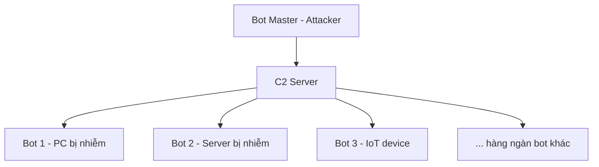
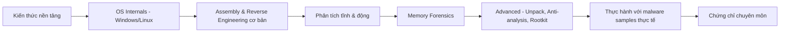

# Bài 1: Tổng quan về Mã độc

---

## 1. Mã độc là gì?

**Malware** (Malicious Software) là thuật ngữ chung chỉ bất kỳ phần mềm độc hại nào được thiết kế nhằm **gây hại, khai thác, hoặc xâm phạm** thiết bị, dịch vụ, hoặc mạng có thể lập trình được.

Tội phạm mạng sử dụng malware để:

- Trích xuất dữ liệu nhạy cảm (thông tin đăng nhập, số thẻ tín dụng, tài liệu nội bộ)
- Trục lợi tài chính (tống tiền, gian lận, khai thác tiền điện tử)
- Gián điệp, phá hoại hệ thống, hoặc thiết lập quyền kiểm soát lâu dài

---

## 2. Các kỹ thuật phát tán và lây nhiễm

Mã độc không tự nhiên xuất hiện trên hệ thống nạn nhân — chúng cần **vector lây nhiễm** (infection vector). Dưới đây là các kỹ thuật phổ biến:

=== "Qua mạng & Internet"

    **Email (Phishing):** Kẻ tấn công gửi email giả mạo đính kèm file độc hại (PDF, DOCX, EXE) hoặc chứa link dẫn đến trang web lây nhiễm. Đây là vector phổ biến nhất.

    **Ứng dụng nhắn tin:** Tương tự email, nhưng qua Telegram, Facebook Messenger, Zalo... Nạn nhân dễ tin hơn vì thấy từ "người quen".

    **Malvertising (Quảng cáo nhiễm độc):** Kẻ tấn công nhúng mã độc vào quảng cáo trực tuyến hợp pháp. Người dùng chỉ cần xem (hoặc click) quảng cáo là bị lây nhiễm.

    **Drive-by Download (Tải xuống tự động):** Khi người dùng truy cập trang web bị khai thác, mã độc tự động tải về và thực thi mà không cần người dùng nhấn gì.

    **Phishing & Quishing:** Phishing qua email/SMS; Quishing là QR code dẫn đến URL độc hại.

=== "Qua phần mềm & thiết bị"

    **Khai thác lỗ hổng (Exploits):** Tận dụng lỗ hổng chưa được vá trong hệ điều hành, trình duyệt, phần mềm (ví dụ: CVE trong SMB → WannaCry).

    **Cài đặt thủ công (Personal Installation):** Nạn nhân tự cài phần mềm crack, keygen, hoặc "phần mềm miễn phí" chứa malware đính kèm.

    **Scareware (Cửa sổ cảnh báo giả mạo):** Hiện thông báo giả "Máy bạn bị virus! Cài ngay phần mềm này để diệt!" → dụ người dùng tự cài malware.

    **Thiết bị lưu trữ ngoài (USB, ổ cứng di động):** USB bị nhiễm malware khi cắm vào máy sẽ tự chạy (autorun) hoặc lây qua file. Kỹ thuật này từng được dùng trong Stuxnet.

---

## 3. Phân loại mã độc

### 3.1 Virus máy tính

!!! info "Định nghĩa"
    **Computer Virus** là mã độc có khả năng **tự gắn (attach) vào file hợp pháp** và lây lan khi file đó được thực thi.

**Cơ chế hoạt động:**

1. Virus chèn code của mình vào file thực thi (EXE, COM, DLL...) hoặc boot sector.
2. Khi người dùng chạy file đó, virus code thực thi trước.
3. Virus tìm file khác để lây sang, đồng thời có thể thực hiện payload (xóa file, mã hóa, hiển thị thông báo...).

**Đặc điểm nổi bật:**
- **Cần host file** để tồn tại (khác với worm).
- **Cần sự tương tác của người dùng** để kích hoạt (mở file, chạy chương trình).
- Ví dụ nổi tiếng: CIH (Chernobyl), ILOVEYOU, Melissa.

**Nguyên nhân lây nhiễm:** Tải phần mềm không rõ nguồn gốc, mở file đính kèm email độc hại, dùng USB bị nhiễm.

---

### 3.2 Sâu máy tính (Worm)

!!! info "Định nghĩa"
    **Computer Worm** là mã độc có khả năng **tự nhân bản và lây lan qua mạng mà không cần file chủ (host file)** và không cần sự tương tác của người dùng.

**Cơ chế hoạt động:**

1. Worm khai thác lỗ hổng trong dịch vụ mạng (SMB, RDP, SSH...) để xâm nhập từ xa.
2. Sau khi vào được máy nạn nhân, nó tự sao chép bản thân sang máy khác trong mạng.
3. Quá trình này lặp lại theo cấp số nhân → phát tán cực nhanh.

**Đặc điểm nổi bật:**
- **Không cần host file** — tự tồn tại độc lập.
- **Không cần tương tác người dùng** — hoàn toàn tự động.
- Có thể làm tê liệt băng thông mạng chỉ bằng traffic lây lan.
- Ví dụ nổi tiếng: WannaCry (khai thác EternalBlue/SMB), Conficker, Morris Worm.

**Nguyên nhân lây nhiễm:** Lỗ hổng bảo mật chưa được vá trong hệ điều hành hoặc phần mềm mạng.

---

### 3.3 Trojan

!!! info "Định nghĩa"
    **Trojan** (Trojan Horse – Ngựa thành Troy) là phần mềm **giả mạo ứng dụng hợp pháp** nhưng bên trong chứa chức năng độc hại ẩn.

**Cơ chế hoạt động:**

1. Kẻ tấn công ngụy trang malware dưới dạng game, phần mềm tiện ích, keygen, crack...
2. Nạn nhân tự nguyện cài đặt vì tin đây là phần mềm hợp lệ.
3. Khi chạy, Trojan thực hiện hành vi độc hại: tạo backdoor, tải malware khác, đánh cắp dữ liệu...

**Đặc điểm nổi bật:**
- **Không tự sao chép** (không phải virus hay worm).
- Thường dùng để **tạo cửa hậu (backdoor)** cho hacker điều khiển từ xa.
- Là giai đoạn "Initial Access" phổ biến trong các cuộc tấn công APT.
- Ví dụ nổi tiếng: DarkComet RAT, njRAT, Zeus (banking trojan).

**Nguyên nhân lây nhiễm:** Tải phần mềm bẻ khóa, ứng dụng lậu, email giả mạo có đính kèm.

---

### 3.4 Ransomware

!!! danger "Định nghĩa"
    **Ransomware** (Mã độc tống tiền) là mã độc **mã hóa dữ liệu của nạn nhân** rồi yêu cầu tiền chuộc để cung cấp key giải mã.

**Cơ chế hoạt động:**

```
[Lây nhiễm] → [Trinh sát - liệt kê file quan trọng] 
→ [Mã hóa file (AES/RSA...)] → [Xóa shadow copy] 
→ [Hiện ransom note yêu cầu tiền chuộc (BTC/Monero)]
```

**Đặc điểm nổi bật:**
- Thường sử dụng mã hóa lai: **AES** (mã hóa file nhanh) + **RSA** (mã hóa AES key).
- Xóa **Volume Shadow Copies** để chặn khôi phục từ backup.
- Xu hướng hiện đại: **Double Extortion** — vừa mã hóa vừa đánh cắp dữ liệu, đe dọa công khai nếu không trả tiền.
- **Ransomware-as-a-Service (RaaS):** Nhóm tội phạm bán/cho thuê ransomware cho "affiliate", chia lợi nhuận.
- Ví dụ nổi tiếng: WannaCry, REvil, LockBit, Conti.

**Nguyên nhân lây nhiễm:** Phishing email, khai thác lỗ hổng RDP, tải phần mềm độc hại.

---

### 3.5 Spyware

!!! info "Định nghĩa"
    **Spyware** (Phần mềm gián điệp) là phần mềm **bí mật theo dõi hoạt động của người dùng** mà không có sự đồng ý của họ.

**Cơ chế hoạt động:**

1. Cài đặt ẩn trên máy nạn nhân (thường đi kèm phần mềm miễn phí — bundleware).
2. Thu thập thông tin liên tục ở nền: lịch sử duyệt web, thông tin đăng nhập, ảnh chụp màn hình, vị trí GPS...
3. Gửi dữ liệu thu thập về C2 server của kẻ tấn công.

**Đặc điểm nổi bật:**
- Hoạt động **hoàn toàn ẩn**, người dùng không hay biết.
- Một dạng đặc biệt là **Stalkerware** — dùng để theo dõi người thân, đối tác.
- **Pegasus** là ví dụ spyware cấp nhà nước cực kỳ tinh vi.

**Nguyên nhân lây nhiễm:** Cài phần mềm miễn phí bundled, quảng cáo độc hại, lỗ hổng zero-click.

---

### 3.6 Adware

!!! info "Định nghĩa"
    **Adware** là mã độc **hiển thị quảng cáo không mong muốn** trên trình duyệt hoặc ứng dụng của nạn nhân.

**Cơ chế hoạt động:**

1. Được cài cùng phần mềm miễn phí (freeware) hoặc qua extension trình duyệt độc hại.
2. Chèn quảng cáo vào các trang web nạn nhân duyệt, mở pop-up, redirect đến trang quảng cáo.
3. Thu thập hành vi duyệt web để phục vụ quảng cáo mục tiêu (targeted ads).

**Đặc điểm nổi bật:**
- Thường **không gây hại trực tiếp** nhưng làm chậm hệ thống, gây khó chịu.
- Có thể là **bước đệm** cho malware nguy hiểm hơn.
- Ranh giới giữa adware và spyware đôi khi rất mờ.

---

### 3.7 Rootkit

!!! warning "Định nghĩa"
    **Rootkit** là mã độc cho phép kẻ tấn công **kiểm soát hệ thống một cách bền vững và ẩn mình** khỏi các cơ chế phát hiện thông thường.

**Phân loại theo mức độ hoạt động:**

=== "User-mode Rootkit"
    Chạy ở **Ring 3** (user space). Hook các API của Windows để ẩn file, process, registry key. Dễ triển khai hơn nhưng cũng dễ bị phát hiện hơn so với kernel-mode.

=== "Kernel-mode Rootkit"
    Chạy ở **Ring 0** (kernel space). Sửa đổi trực tiếp cấu trúc kernel (SSDT hook, DKOM). Cực kỳ khó phát hiện vì cùng mức đặc quyền với OS. Ví dụ: TDL4 (Alureon).

=== "Bootkit"
    Lây nhiễm vào **MBR/VBR/UEFI**, thực thi trước cả hệ điều hành. Tồn tại ngay cả khi format ổ đĩa và cài lại OS. Ví dụ: Stoned Bootkit, LoJax (UEFI rootkit).

=== "Hypervisor Rootkit"
    Đặt toàn bộ OS vào trong máy ảo, kiểm soát ở lớp hypervisor. Lý thuyết là hoàn toàn trong suốt với OS. Ví dụ nghiên cứu: Blue Pill.

**Nguyên nhân lây nhiễm:** Lỗ hổng bảo mật leo thang đặc quyền, phần mềm không rõ nguồn gốc, tấn công firmware.

---

### 3.8 Backdoor

!!! info "Định nghĩa"
    **Backdoor** (Cửa hậu) là cơ chế cho phép kẻ tấn công **truy cập vào hệ thống từ xa bất cứ lúc nào mà không cần xác thực thông thường**.

**Cơ chế hoạt động:**

1. Sau khi xâm nhập ban đầu (qua exploit, trojan...), kẻ tấn công cài backdoor để **duy trì truy cập (persistence)**.
2. Backdoor lắng nghe kết nối từ C2 server hoặc chủ động kết nối ra ngoài (reverse shell) để tránh firewall.
3. Kẻ tấn công dùng backdoor để thực thi lệnh, tải file, lateral movement...

**Đặc điểm nổi bật:**
- Thường được **kết hợp với trojan hoặc rootkit** để ẩn giấu.
- Là công cụ chính của **APT (Advanced Persistent Threat)** để duy trì hiện diện lâu dài.
- Ví dụ: PlugX (APT), Cobalt Strike Beacon.

---

### 3.9 Keylogger

!!! info "Định nghĩa"
    **Keylogger** là mã độc **ghi lại mọi thao tác bàn phím** của người dùng để đánh cắp thông tin nhạy cảm.

**Phân loại:**

=== "Software Keylogger"
    Hook vào Windows API (`SetWindowsHookEx`, `GetAsyncKeyState`) để bắt keystroke. Hoặc dùng kernel driver để bắt ở mức thấp hơn.

=== "Hardware Keylogger"
    Thiết bị vật lý cắm giữa bàn phím và máy tính. Không thể phát hiện bằng phần mềm.

**Thông tin có thể thu thập:**
- Mật khẩu, số thẻ tín dụng
- Tin nhắn riêng tư, email
- Nội dung tìm kiếm, URL đã truy cập

**Nguyên nhân lây nhiễm:** Tải phần mềm độc hại, phishing, sử dụng máy tính công cộng bị cài keylogger.

---

### 3.10 Fileless Malware

!!! warning "Định nghĩa"
    **Fileless Malware** (Mã độc phi tập tin) là mã độc **không lưu file xuống ổ đĩa** mà chạy hoàn toàn trong bộ nhớ RAM, sử dụng các công cụ hợp pháp có sẵn trong hệ thống.

**Cơ chế hoạt động:**

```
[Phishing email / Exploit] 
→ [Chạy PowerShell/WMI/macro] 
→ [Tải payload từ C2 trực tiếp vào RAM] 
→ [Thực thi payload trong memory — không chạm ổ đĩa]
→ [Persistence qua registry/WMI subscription]
```

**Kỹ thuật phổ biến:**
- **Living off the Land (LotL):** Lạm dụng công cụ hợp pháp: PowerShell, WMI, certutil, regsvr32, mshta...
- **Process Injection:** Inject code vào process hợp pháp (explorer.exe, svchost.exe).
- **Reflective DLL Injection:** Load DLL từ memory mà không cần ghi ra đĩa.

**Tại sao khó phát hiện?**
- Không có file độc hại trên ổ đĩa → antivirus truyền thống dựa trên signature **bó tay**.
- Traffic mạng có thể HTTPS → không đọc được nội dung.
- Sử dụng công cụ hợp pháp → whitelist bypass.

---

### 3.11 Macro Malware

!!! info "Định nghĩa"
    **Macro Malware** là mã độc sử dụng **tính năng macro trong Microsoft Office** (Word, Excel, PowerPoint) để thực thi mã độc.

**Cơ chế hoạt động:**

1. Kẻ tấn công tạo file Office có macro VBA độc hại, gửi qua email phishing.
2. Nạn nhân mở file và bị dụ "Enable Content" (bật macro).
3. Macro VBA chạy → thường dùng PowerShell để tải payload thực sự từ C2.

**Đặc điểm nổi bật:**
- Dễ viết, không cần kỹ năng lập trình sâu.
- Lợi dụng tính năng hợp pháp của Office → khó block hoàn toàn.
- Microsoft đã **mặc định tắt macro** từ file tải từ internet (2022) → attacker chuyển sang ISO, LNK, OneNote.

---

### 3.12 Botnet

!!! info "Định nghĩa"
    **Botnet** là mạng lưới các máy tính bị nhiễm mã độc (**bot/zombie**), được điều khiển tập trung bởi kẻ tấn công thông qua **C2 (Command & Control) server**.

**Kiến trúc:**



**Ứng dụng của Botnet:**
- **DDoS (Distributed Denial of Service):** Hàng ngàn bot cùng flood traffic vào target.
- **Spam email:** Gửi hàng triệu email phishing/spam mỗi ngày.
- **Cryptojacking:** Dùng CPU/GPU của bot để đào tiền điện tử.
- **Click fraud:** Tạo click giả trên quảng cáo để trục lợi.
- **Credential stuffing:** Tấn công brute force tài khoản phân tán.

**Cơ chế C2:**
- **Centralized:** Bot kết nối đến server cố định → dễ bị takedown.
- **P2P:** Bot giao tiếp ngang hàng → khó triệt phá hơn.
- **Domain Flux (Fast Flux):** C2 domain thay đổi liên tục → khó block.

**Ví dụ nổi tiếng:** Mirai (IoT botnet), Emotet, TrickBot, Necurs.

---

### 3.13 Logic Bomb

!!! info "Định nghĩa"
    **Logic Bomb** là đoạn mã độc **nằm im (dormant)** trong hệ thống và chỉ kích hoạt khi **điều kiện nhất định xảy ra**.

**Điều kiện kích hoạt có thể là:**
- Ngày/giờ cụ thể (time bomb)
- Tên người dùng nhất định đăng nhập (hoặc không đăng nhập)
- File/thư mục cụ thể tồn tại hoặc bị xóa
- Số lần đăng nhập đạt ngưỡng

**Đặc điểm nổi bật:**
- Cực kỳ khó phát hiện vì **không hoạt động gì** cho đến khi trigger.
- Thường được **cài cắm bởi insider (nội gián)** — nhân viên bất mãn cài vào hệ thống công ty.
- Khi kích hoạt có thể xóa database, mã hóa dữ liệu, làm sập hệ thống.
- Ví dụ thực tế: Nhân viên ngân hàng cài time bomb kích hoạt sau khi họ bị sa thải.

---

### 3.14 Cryptojacking

!!! info "Định nghĩa"
    **Cryptojacking** là mã độc **lén sử dụng tài nguyên tính toán (CPU/GPU)** của nạn nhân để đào tiền điện tử (cryptocurrency mining) mà không có sự đồng ý.

**Hai hình thức:**
- **File-based:** Cài phần mềm đào coin trên máy nạn nhân (thường đi kèm phần mềm crack).
- **Browser-based:** Nhúng JavaScript đào coin vào trang web → bất kỳ ai truy cập web đó đều bị khai thác CPU trong lúc duyệt.

**Dấu hiệu nhận biết:**
- Máy chạy chậm bất thường
- CPU/GPU sử dụng 90-100% kể cả khi không làm gì
- Nhiệt độ máy tăng cao, quạt chạy liên tục
- Pin laptop hao nhanh

---

### 3.15 Malicious LLMs

!!! warning "Xu hướng mới"
    **Malicious LLMs** là các mô hình ngôn ngữ lớn (Large Language Models) bị **điều chỉnh hoặc xây dựng có chủ đích** để phục vụ mục đích tội phạm mạng.

**Các mô hình nổi bật:**
- **WormGPT:** LLM không có guardrail, chuyên tạo email phishing, malware code.
- **FraudGPT:** Tập trung vào gian lận tài chính, carding, tạo trang web lừa đảo.
- **Love-GPT:** Tạo persona giả để thực hiện romance scam.

**Ứng dụng độc hại:**
- Tạo email phishing cực kỳ thuyết phục, đúng ngữ pháp, cá nhân hóa cao (spear phishing).
- Tự động generate malware code, bypass detection.
- Tấn công social engineering quy mô lớn.
- Tạo deepfake nội dung để thao túng nạn nhân.

---

## 4. Phương pháp phân tích mã độc

=== "Phân tích tĩnh (Static Analysis)"

    **Không thực thi** mã độc, phân tích file trực tiếp.

    **Kỹ thuật:**
    - Kiểm tra metadata, strings, hash (MD5, SHA256)
    - Phân tích cấu trúc PE file (headers, sections, imports/exports)
    - Disassembly để đọc assembly code
    - Decompilation để lấy pseudo-code cấp cao hơn

    **Công cụ:** IDA Pro, Ghidra, Binary Ninja, PEiD, CFF Explorer, FLOSS (tự động extract strings)

    **Ưu điểm:** An toàn (không chạy mã độc), cho cái nhìn toàn diện về code.

    **Nhược điểm:** Tốn thời gian, bị cản trở bởi obfuscation/packing.

=== "Phân tích động (Dynamic Analysis)"

    **Thực thi** mã độc trong môi trường kiểm soát (sandbox/VM) và quan sát hành vi.

    **Quan sát:**
    - File system: file nào bị tạo/sửa/xóa?
    - Registry: key nào bị thêm/sửa (persistence)?
    - Network: kết nối đến IP/domain nào? C2 traffic?
    - Process: process nào được spawn, inject?

    **Công cụ:** Cuckoo Sandbox, ANY.RUN, Hybrid Analysis, Process Monitor, Wireshark, Regshot, x64dbg/OllyDbg

    **Ưu điểm:** Thấy hành vi thực tế, không bị cản trở bởi obfuscation.

    **Nhược điểm:** Mã độc có thể phát hiện sandbox và không hoạt động (anti-VM/anti-sandbox).

=== "Phân tích lai (Hybrid Analysis)"

    Kết hợp cả hai phương pháp:
    - Dùng static analysis để hiểu cấu trúc tổng thể
    - Dùng dynamic analysis để quan sát hành vi runtime
    - Dùng kết quả dynamic để hướng dẫn quá trình static (biết điểm quan trọng cần phân tích)

    Đây là phương pháp chuyên nghiệp nhất, dùng trong thực tế.

---

## 5. Thách thức trong nghiên cứu mã độc

Theo dữ liệu từ CrowdStrike:

| Thách thức | Số liệu |
|---|---|
| Chỉ 4% cảnh báo bảo mật được điều tra kỹ | Đội ngũ quá tải |
| 67% thời gian bị lãng phí do phân tích sai | Thiếu chất lượng phân tích |
| Mã độc evasive ngày càng phổ biến | Kẻ tấn công tinh vi hơn |

**Ba thách thức chính:**

1. **Đội ngũ chuyên gia quá tải:** Volume cảnh báo quá lớn, không đủ người phân tích.
2. **Giới hạn về thời gian:** Threat actor có thể gây thiệt hại trong vài phút; analyst không có đủ thời gian.
3. **Kẻ tấn công ngày càng tinh vi:** Dùng AI, obfuscation, anti-analysis, living off the land... để né tránh phát hiện.

---

## 6. Lộ trình trở thành Malware Analyst



**Chứng chỉ liên quan:**
- **GREM** – GIAC Reverse Engineering Malware: Chứng chỉ uy tín nhất trong lĩnh vực RE malware.
- **OSCP** – Offensive Security Certified Professional: Thiên về pentest nhưng nền tảng quan trọng.
- **GXPN** – GIAC Exploit Researcher and Advanced Penetration Tester.

**Công cụ cần học:**

| Loại | Công cụ |
|---|---|
| Disassembler/Decompiler | IDA Pro, Ghidra, Binary Ninja |
| Debugger | x64dbg, OllyDbg, WinDbg |
| Memory Forensics | Volatility, Rekall |
| Network Analysis | Wireshark |
| Sandbox | Cuckoo, ANY.RUN |
| YARA | Viết và chạy rule phát hiện malware |

---

## Câu hỏi ôn tập & Trắc nghiệm

**Câu 1.** Malware là gì?

- A. Phần mềm thương mại có lỗi
- B. Bất kỳ phần mềm nào được thiết kế để gây hại hoặc khai thác thiết bị, dịch vụ hoặc mạng
- C. Phần mềm miễn phí có quảng cáo
- D. Hệ điều hành bị lỗi

??? info "Đáp án & Giải thích"
    **Đáp án: B**

    Malware (Malicious Software) là thuật ngữ chung chỉ bất kỳ phần mềm độc hại nào được thiết kế nhằm gây hại hoặc khai thác thiết bị, dịch vụ hoặc mạng. Đây là định nghĩa chính xác nhất, không phụ thuộc vào loại cụ thể hay cơ chế hoạt động.

---

**Câu 2.** Điểm khác biệt cơ bản nhất giữa Virus và Worm là gì?

- A. Virus nguy hiểm hơn Worm
- B. Worm cần host file để lây lan, Virus thì không
- C. Virus cần host file để lây lan, Worm thì không và tự lan qua mạng độc lập
- D. Worm chỉ tấn công Windows, Virus tấn công mọi OS

??? info "Đáp án & Giải thích"
    **Đáp án: C**

    Đây là điểm phân biệt cốt lõi: Virus gắn vào file chủ (host file) và cần file đó được thực thi để lây lan — tức là cần sự tương tác của người dùng. Worm không cần host file, tự nhân bản và lan qua mạng bằng cách khai thác lỗ hổng, không cần bất kỳ hành động nào từ người dùng.

---

**Câu 3.** Trojan khác với Virus ở điểm nào?

- A. Trojan không cần người dùng cài đặt
- B. Trojan tự nhân bản qua mạng
- C. Trojan không tự sao chép nhưng giả mạo phần mềm hợp pháp
- D. Trojan chỉ tấn công macOS

??? info "Đáp án & Giải thích"
    **Đáp án: C**

    Trojan không có khả năng tự nhân bản (không phải đặc tính của nó). Thay vào đó, nó giả mạo ứng dụng hợp pháp để dụ người dùng tự cài đặt. Sau khi được cài, nó thực hiện hành vi độc hại ẩn giấu như tạo backdoor, đánh cắp dữ liệu.

---

**Câu 4.** Ransomware thường sử dụng kết hợp thuật toán mã hóa nào?

- A. MD5 + SHA1
- B. AES (mã hóa file) + RSA (mã hóa AES key)
- C. DES + 3DES
- D. Base64 + XOR

??? info "Đáp án & Giải thích"
    **Đáp án: B**

    Ransomware dùng AES (symmetric encryption) để mã hóa file nhanh vì AES rất hiệu quả với dữ liệu lớn. Sau đó AES key được mã hóa bằng RSA (asymmetric) — chỉ kẻ tấn công có private key RSA mới giải mã được AES key, từ đó giải mã file. Đây là kiến trúc hybrid encryption chuẩn.

---

**Câu 5.** "Double Extortion" trong ransomware là gì?

- A. Tấn công nạn nhân hai lần trong một tuần
- B. Mã hóa dữ liệu VÀ đánh cắp dữ liệu, đe dọa công khai nếu không trả tiền
- C. Yêu cầu tiền chuộc hai lần sau khi đã giải mã
- D. Dùng hai loại ransomware cùng lúc

??? info "Đáp án & Giải thích"
    **Đáp án: B**

    Double Extortion là chiến thuật ransomware hiện đại: kẻ tấn công vừa mã hóa dữ liệu (để ngăn truy cập) vừa đánh cắp dữ liệu trước khi mã hóa. Nếu nạn nhân có backup và không cần trả tiền để khôi phục, kẻ tấn công vẫn có thể đe dọa công khai dữ liệu nhạy cảm. LockBit, Conti, REvil đều dùng chiến thuật này.

---

**Câu 6.** Spyware khác Keylogger ở điểm nào?

- A. Spyware chỉ hoạt động trên mobile
- B. Keylogger thu thập mọi loại thông tin còn Spyware chỉ ghi bàn phím
- C. Spyware có phạm vi thu thập rộng hơn (vị trí, lịch sử web, ảnh chụp...), Keylogger chỉ tập trung vào thao tác bàn phím
- D. Không có sự khác biệt

??? info "Đáp án & Giải thích"
    **Đáp án: C**

    Keylogger là một dạng spyware đặc biệt, chỉ tập trung vào ghi lại keystrokes. Spyware là khái niệm rộng hơn, bao gồm nhiều hình thức theo dõi: vị trí GPS, lịch sử duyệt web, ảnh chụp màn hình, danh sách contact, micro/camera... Keylogger có thể được coi là một subset của spyware.

---

**Câu 7.** Rootkit kernel-mode nguy hiểm hơn user-mode vì lý do gì?

- A. Nặng hơn và tốn nhiều RAM hơn
- B. Hoạt động ở Ring 0, có cùng mức đặc quyền với OS, khó bị phát hiện và loại bỏ
- C. Lây lan nhanh hơn qua mạng
- D. Mã hóa dữ liệu mạnh hơn

??? info "Đáp án & Giải thích"
    **Đáp án: B**

    Kernel-mode rootkit hoạt động ở Ring 0 — mức đặc quyền cao nhất, ngang bằng với nhân hệ điều hành. Điều này cho phép nó sửa đổi trực tiếp cấu trúc kernel (DKOM, SSDT hook), khiến các API mà antivirus dùng để quét đều trả về kết quả đã bị giả mạo. User-mode rootkit ở Ring 3, dễ bị phát hiện hơn vì antivirus có thể bypass hook của nó.

---

**Câu 8.** Bootkit khác rootkit thông thường ở điểm nào?

- A. Bootkit chỉ tấn công Linux
- B. Bootkit lây nhiễm MBR/VBR/UEFI, thực thi trước cả OS, tồn tại ngay cả sau khi cài lại hệ điều hành
- C. Bootkit là rootkit nhẹ hơn, ít nguy hiểm hơn
- D. Bootkit không cần quyền admin để cài

??? info "Đáp án & Giải thích"
    **Đáp án: B**

    Bootkit lây nhiễm vào phần boot của ổ đĩa (MBR — Master Boot Record, VBR — Volume Boot Record) hoặc thậm chí UEFI firmware. Vì nó thực thi trước khi OS load, OS hoàn toàn không thể phát hiện hay ngăn chặn nó. Format ổ đĩa và cài lại OS cũng không loại bỏ được bootkit UEFI vì nó nằm trong chip firmware của bo mạch chủ.

---

**Câu 9.** Fileless Malware lợi dụng điều gì để tránh bị phát hiện bởi antivirus truyền thống?

- A. Mã hóa toàn bộ payload
- B. Hoạt động hoàn toàn trong RAM, không ghi file xuống ổ đĩa, sử dụng công cụ hợp pháp có sẵn
- C. Tắt antivirus trước khi hoạt động
- D. Cài đặt driver giả mạo

??? info "Đáp án & Giải thích"
    **Đáp án: B**

    Antivirus truyền thống dựa vào signature scanning trên file hệ thống. Fileless malware không để lại file nào trên đĩa → không có gì để scan. Kỹ thuật Living off the Land (LotL) dùng PowerShell, WMI, certutil... là những công cụ được Windows ký số hợp lệ, thường nằm trong whitelist của nhiều antivirus.

---

**Câu 10.** "Living off the Land" (LotL) trong bối cảnh fileless malware nghĩa là gì?

- A. Malware ẩn trong các file ảnh thiên nhiên
- B. Lạm dụng các công cụ và tiện ích hợp pháp có sẵn trong hệ điều hành (PowerShell, WMI, certutil...) để thực hiện hành vi độc hại
- C. Malware lây lan qua mạng nội bộ (LAN)
- D. Kỹ thuật bypass firewall

??? info "Đáp án & Giải thích"
    **Đáp án: B**

    LotL là chiến thuật attacker dùng những gì đã có sẵn trong hệ thống thay vì mang công cụ từ ngoài vào. PowerShell có thể download và execute payload; WMI có thể tạo persistence; certutil có thể decode base64... Vì đây là công cụ hệ thống hợp lệ, chúng ít bị nghi ngờ hơn.

---

**Câu 11.** Macro Malware thường được phát tán qua vector nào?

- A. Khai thác lỗ hổng SMB
- B. Email phishing đính kèm file Office có macro độc hại
- C. USB autorun
- D. DNS poisoning

??? info "Đáp án & Giải thích"
    **Đáp án: B**

    Macro malware chủ yếu phát tán qua email phishing với file Word/Excel/PowerPoint đính kèm. Khi nạn nhân mở file và click "Enable Content", macro VBA chạy. Macro thường không chứa payload thực sự mà dùng PowerShell/WMI để tải về từ C2 — kết hợp giữa macro malware và fileless malware.

---

**Câu 12.** Microsoft đã thực hiện biện pháp nào để giảm thiểu rủi ro từ Macro Malware?

- A. Xóa tính năng macro khỏi Office hoàn toàn
- B. Mặc định tắt macro cho file tải từ internet (Mark of the Web) từ năm 2022
- C. Yêu cầu đăng ký tài khoản Microsoft mới chạy macro
- D. Giới hạn macro chỉ chạy trong sandbox

??? info "Đáp án & Giải thích"
    **Đáp án: B**

    Năm 2022, Microsoft mặc định block VBA macro trong file Office được tải từ internet (có Mark of the Web — MOTW). Đây là thay đổi quan trọng. Tuy nhiên, attacker đã thích nghi bằng cách dùng ISO file, LNK file, OneNote... để bypass MOTW vì các format này không luôn bị gán MOTW.

---

**Câu 13.** Botnet được dùng để làm gì? (Chọn câu mô tả đầy đủ nhất)

- A. Chỉ để tấn công DDoS
- B. DDoS, phát tán spam, cryptojacking, click fraud, credential stuffing và nhiều mục đích khác
- C. Chỉ để đào tiền điện tử
- D. Chỉ để phát tán malware khác

??? info "Đáp án & Giải thích"
    **Đáp án: B**

    Botnet là cơ sở hạ tầng đa mục đích. Bot master có thể thuê botnet (Botnet-as-a-Service) cho nhiều loại tấn công khác nhau: DDoS để làm sập dịch vụ, spam để phát tán phishing, cryptojacking để kiếm tiền thụ động, click fraud để gian lận quảng cáo, credential stuffing để chiếm tài khoản.

---

**Câu 14.** Sự khác biệt giữa C2 Centralized và P2P Botnet là gì?

- A. Không có sự khác biệt về hiệu quả
- B. P2P botnet khó triệt phá hơn vì không có điểm C2 tập trung duy nhất để takedown
- C. Centralized botnet nhanh hơn vì ít bước truyền lệnh
- D. P2P botnet chỉ dùng cho spam

??? info "Đáp án & Giải thích"
    **Đáp án: B**

    Botnet centralized dễ bị takedown: cơ quan thực thi pháp luật hoặc ISP chỉ cần shut down C2 server là toàn bộ botnet mất liên lạc. P2P botnet (như Conficker, ZeroAccess) không có điểm tập trung — mỗi bot vừa là client vừa là relay, lệnh truyền peer-to-peer. Loại bỏ một bot không ảnh hưởng đến cả mạng.

---

**Câu 15.** Logic Bomb thường được cài cắm bởi ai và với mục đích gì?

- A. Script kiddie để học hỏi
- B. Thường bởi insider (nhân viên nội gián) để phá hoại sau khi rời công ty hoặc bị sa thải
- C. Hacker bên ngoài để gián điệp
- D. Antivirus để cách ly mã độc

??? info "Đáp án & Giải thích"
    **Đáp án: B**

    Logic Bomb đặc biệt nguy hiểm ở chỗ thường đến từ nội bộ. Nhân viên bất mãn có quyền truy cập hệ thống có thể cài logic bomb kích hoạt sau khi họ bị sa thải (ví dụ: kiểm tra xem tên họ có còn trong Active Directory không — nếu không, kích hoạt xóa database). Đây là insider threat điển hình.

---

**Câu 16.** Dấu hiệu nào sau đây KHÔNG phải dấu hiệu điển hình của Cryptojacking?

- A. CPU/GPU sử dụng cao bất thường
- B. Máy chạy chậm, nhiệt độ tăng
- C. Màn hình hiển thị thông báo đòi tiền chuộc
- D. Pin laptop hao nhanh hơn bình thường

??? info "Đáp án & Giải thích"
    **Đáp án: C**

    Thông báo đòi tiền chuộc là đặc trưng của Ransomware, không phải Cryptojacking. Cryptojacking hoạt động ẩn, kẻ tấn công không muốn bị phát hiện để có thể khai thác tài nguyên lâu dài nhất có thể. Dấu hiệu của cryptojacking là hệ thống chậm, CPU/GPU cao, nhiệt độ tăng — không có thông báo gì cho người dùng.

---

**Câu 17.** WormGPT, FraudGPT thuộc loại mối đe dọa nào?

- A. Ransomware thế hệ mới
- B. Malicious LLMs — mô hình ngôn ngữ lớn được điều chỉnh cho mục đích tội phạm mạng
- C. Fileless malware sử dụng AI
- D. Botnet điều khiển bằng AI

??? info "Đáp án & Giải thích"
    **Đáp án: B**

    WormGPT và FraudGPT là các LLM không có safety guardrail, được điều chỉnh (fine-tuned) hoặc xây dựng mới để phục vụ tội phạm mạng. Chúng giúp kẻ tấn công tạo email phishing không lỗi, viết malware code, thực hiện social engineering ở quy mô lớn — thấp hóa rào cản kỹ thuật cho tội phạm mạng.

---

**Câu 18.** Drive-by Download là gì?

- A. Tải file từ USB bị nhiễm
- B. Mã độc tự động tải về và thực thi khi người dùng chỉ truy cập một trang web, không cần nhấn gì
- C. Tải phần mềm crack từ torrent
- D. Download qua email đính kèm

??? info "Đáp án & Giải thích"
    **Đáp án: B**

    Drive-by Download khai thác lỗ hổng trong trình duyệt, plugin (Flash, Java cũ), hoặc OS. Khi nạn nhân truy cập trang web bị compromise, exploit code chạy và tải malware về máy mà không cần bất kỳ tương tác nào từ người dùng. Đây là lý do quan trọng phải cập nhật trình duyệt và OS thường xuyên.

---

**Câu 19.** Malvertising khác Drive-by Download ở điểm nào?

- A. Hoàn toàn giống nhau
- B. Malvertising sử dụng mạng quảng cáo hợp pháp để phát tán mã độc, có thể ảnh hưởng cả trang web uy tín; Drive-by Download thường là trang web đã bị compromise trực tiếp
- C. Drive-by Download chỉ xảy ra trên di động
- D. Malvertising yêu cầu người dùng click vào quảng cáo

??? info "Đáp án & Giải thích"
    **Đáp án: B**

    Malvertising nguy hiểm vì nó có thể xuất hiện ngay trên các trang web uy tín (New York Times, BBC từng bị ảnh hưởng) thông qua mạng quảng cáo của bên thứ ba. Kẻ tấn công mua quảng cáo và nhúng exploit vào. Một số malvertising yêu cầu click, một số tự động chạy (kết hợp với drive-by). Điểm khác biệt chính là vector: quảng cáo vs trang web bị hack trực tiếp.

---

**Câu 20.** Phân tích tĩnh (Static Analysis) có nhược điểm gì?

- A. Nguy hiểm vì phải chạy mã độc
- B. Tốn nhiều tài nguyên hệ thống
- C. Bị cản trở bởi packing và obfuscation; không thấy hành vi thực tế runtime
- D. Chỉ dùng được trên Linux

??? info "Đáp án & Giải thích"
    **Đáp án: C**

    Static analysis phân tích code mà không chạy nó. Khi malware được packed (UPX, custom packer), code thực sự bị nén/mã hóa — analyst chỉ thấy stub unpacker, không thấy payload thực. Obfuscation (làm rối code) cũng cản trở đáng kể. Ngoài ra, static analysis không thể thấy hành vi mạng, API call thực tế, hay điều kiện kích hoạt (như logic bomb).

---

**Câu 21.** Phân tích động (Dynamic Analysis) có nhược điểm gì?

- A. Không cần môi trường cách ly
- B. Mã độc có thể phát hiện môi trường sandbox/VM và từ chối hoạt động (anti-VM, anti-sandbox)
- C. Chỉ phân tích được malware trên Windows
- D. Không thể quan sát network traffic

??? info "Đáp án & Giải thích"
    **Đáp án: B**

    Nhiều malware hiện đại kiểm tra môi trường để phát hiện sandbox: kiểm tra tên process, số CPU core, dung lượng RAM, thời gian uptime, registry key của VMware/VirtualBox, sự hiện diện của công cụ phân tích... Nếu phát hiện đang chạy trong sandbox, malware sẽ hoạt động như phần mềm bình thường (hoặc không làm gì) để tránh bị phân tích.

---

**Câu 22.** IOC (Indicator of Compromise) là gì?

- A. Lỗ hổng bảo mật chưa được vá
- B. Bằng chứng kỹ thuật cho thấy hệ thống đã hoặc đang bị tấn công (hash, IP, domain, registry key...)
- C. Loại hình kiểm tra bảo mật định kỳ
- D. Công cụ phân tích malware

??? info "Đáp án & Giải thích"
    **Đáp án: B**

    IOC là những artifact kỹ thuật để nhận diện compromise: file hash (MD5/SHA256 của malware), IP address và domain của C2, registry key tạo bởi malware để persistence, mutex name, network signature... Sau khi analyst trích xuất IOC từ phân tích malware, chúng được đưa vào SIEM, firewall, threat intel platform để tự động phát hiện tấn công tương tự trong tương lai.

---

**Câu 23.** Công cụ nào sau đây dùng cho Memory Forensics (phân tích bộ nhớ)?

- A. IDA Pro
- B. Wireshark
- C. Volatility
- D. Ghidra

??? info "Đáp án & Giải thích"
    **Đáp án: C**

    Volatility là framework mã nguồn mở hàng đầu cho memory forensics. Nó có thể phân tích memory dump để tìm: process đang chạy, DLL được load, network connection, registry hive trong memory, mã độc inject vào process, và nhiều artifact khác. IDA Pro và Ghidra là disassembler/decompiler (static analysis), Wireshark phân tích network traffic.

---

**Câu 24.** YARA được dùng để làm gì?

- A. Phân tích network traffic
- B. Viết rule để nhận diện và phân loại malware dựa trên pattern (text, binary, regex)
- C. Debug malware ở runtime
- D. Tạo memory dump

??? info "Đáp án & Giải thích"
    **Đáp án: B**

    YARA là công cụ cho phép analyst viết rule để tìm kiếm file có pattern nhất định. Rule YARA có thể match dựa trên chuỗi text, byte sequence, regex, hoặc kết hợp điều kiện logic. Ví dụ: rule tìm file có cả string "ransomware_id" VÀ entropy cao (dấu hiệu mã hóa) VÀ import function CryptEncrypt. YARA được tích hợp rộng rãi trong sandbox, AV, SIEM.

---

**Câu 25.** Kỹ thuật "Process Injection" là gì?

- A. Tạo process mới từ malware
- B. Chèn code độc hại vào address space của process hợp pháp đang chạy để thực thi trong ngữ cảnh của process đó
- C. Làm crash process hệ thống
- D. Theo dõi process qua API hook

??? info "Đáp án & Giải thích"
    **Đáp án: B**

    Process Injection (như DLL Injection, Process Hollowing, Thread Hijacking) cho phép malware thực thi code trong ngữ cảnh của process hợp pháp (explorer.exe, svchost.exe, notepad.exe). Kết quả: traffic mạng từ malware xuất hiện từ svchost.exe → qua firewall dễ hơn; antivirus thấy process hợp lệ → ít nghi ngờ hơn.

---

**Câu 26.** Scareware hoạt động dựa trên nguyên tắc tâm lý nào?

- A. Khai thác lỗ hổng kỹ thuật trong trình duyệt
- B. Tạo cảm giác sợ hãi và khẩn cấp giả tạo để dụ người dùng tự cài malware hoặc mua phần mềm giả mạo
- C. Gửi email hàng loạt
- D. Khai thác lỗ hổng zero-day

??? info "Đáp án & Giải thích"
    **Đáp án: B**

    Scareware là social engineering kỹ thuật số. Nó hiển thị cảnh báo giả mạo (popup trông giống thông báo Windows/antivirus): "Máy bạn bị nhiễm 47 virus! Nhấn OK để diệt ngay!" → dụ nạn nhân cài "antivirus giả" thực ra là malware, hoặc mua phần mềm vô dụng. Hoạt động dựa trên khai thác tâm lý sợ hãi và thiếu kiến thức kỹ thuật.

---

**Câu 27.** Điều gì xảy ra khi WannaCry lây nhiễm một hệ thống?

- A. Chỉ theo dõi hoạt động người dùng
- B. Khai thác lỗ hổng EternalBlue trong SMB để tự lan, mã hóa file và đòi tiền chuộc bằng Bitcoin
- C. Tạo botnet để tấn công DDoS
- D. Cài keylogger để đánh cắp mật khẩu

??? info "Đáp án & Giải thích"
    **Đáp án: B**

    WannaCry (2017) là ransomware-worm kết hợp: nó tự lan qua mạng bằng cách khai thác EternalBlue (lỗ hổng SMBv1, được NSA phát triển và bị Shadow Brokers leak), đồng thời mã hóa file và đòi tiền chuộc. Trong vài giờ, nó lây nhiễm hàng trăm nghìn máy ở 150 quốc gia, đặc biệt tàn phá NHS (Dịch vụ Y tế Anh).

---

**Câu 28.** APT (Advanced Persistent Threat) có đặc điểm gì phân biệt với malware thông thường?

- A. APT tấn công nhanh hơn và rút lui ngay
- B. APT được thực hiện bởi tổ chức có nguồn lực cao, duy trì hiện diện lâu dài trong hệ thống mục tiêu, và có mục tiêu chiến lược cụ thể (gián điệp, phá hoại)
- C. APT chỉ dùng malware mã nguồn mở
- D. APT không để lại dấu vết nào

??? info "Đáp án & Giải thích"
    **Đáp án: B**

    APT thường được nhà nước bảo trợ hoặc là tổ chức tội phạm có tổ chức cao. Ba đặc điểm: **Advanced** — dùng 0-day, custom malware, kỹ thuật evasion tinh vi; **Persistent** — duy trì truy cập trong tháng/năm; **Threat** — có mục tiêu cụ thể (đánh cắp IP, phá hoại cơ sở hạ tầng). Ví dụ: APT28 (Fancy Bear/Nga), APT41 (Trung Quốc), Lazarus Group (Triều Tiên).

---

**Câu 29.** FLARE VM là gì?

- A. Công cụ phân tích network
- B. Bản phân phối Windows được tối ưu hóa sẵn cho malware analysis, với đầy đủ công cụ RE và forensics
- C. Sandbox tự động phân tích malware
- D. Chứng chỉ bảo mật của GIAC

??? info "Đáp án & Giải thích"
    **Đáp án: B**

    FLARE VM (FireEye Labs Advanced Reverse Engineering) là Windows distribution do Mandiant (trước là FireEye) phát triển. Nó tự động cài đặt hàng trăm công cụ malware analysis: IDA Pro free, x64dbg, Ghidra, FLOSS, PE-bear, Wireshark, Python với các library phân tích... Cài đặt trên máy ảo để phân tích malware an toàn.

---

**Câu 30.** Tại sao nên phân tích malware trên máy ảo thay vì máy thật?

- A. Máy ảo nhanh hơn máy thật
- B. Cách ly malware, dễ khôi phục snapshot khi bị nhiễm, quan sát hành vi mà không ảnh hưởng hệ thống thật
- C. Máy ảo có thêm nhiều công cụ phân tích
- D. Malware không chạy được trên máy ảo

??? info "Đáp án & Giải thích"
    **Đáp án: B**

    Nguyên tắc cơ bản trong malware analysis: **never run malware on bare metal**. Máy ảo cung cấp: (1) Isolation — malware không thể thoát ra ngoài (trừ VM escape exploit); (2) Snapshot — chụp ảnh trạng thái trước khi chạy, khôi phục ngay sau; (3) Monitoring — dễ dàng capture network, file system, registry thay đổi.

---

**Câu 31.** Reverse Engineering trong bối cảnh malware analysis có nghĩa là gì?

- A. Chạy malware ngược lại từ cuối về đầu
- B. Phân tích file thực thi đã biên dịch để hiểu cấu trúc, logic và hành vi của nó mà không có source code
- C. Xóa malware khỏi hệ thống
- D. Tạo ra phiên bản mới của malware

??? info "Đáp án & Giải thích"
    **Đáp án: B**

    Malware analyst không có source code của malware. Reverse engineering là quá trình phân tích binary (file EXE, DLL...) để hiểu nó làm gì: đọc assembly code qua disassembler (IDA, Ghidra), đặt breakpoint trong debugger để theo dõi execution flow, phân tích cấu trúc dữ liệu, thuật toán mã hóa... từ đó hiểu được cơ chế hoạt động, rút ra IOC.

---

**Câu 32.** Backdoor thường kết hợp với loại malware nào để tăng tính ẩn giấu?

- A. Adware
- B. Trojan hoặc Rootkit
- C. Worm
- D. Macro Malware

??? info "Đáp án & Giải thích"
    **Đáp án: B**

    Backdoor cần tồn tại lâu dài mà không bị phát hiện. Trojan thường là phương tiện lây nhiễm ban đầu — ngụy trang để người dùng tự cài. Rootkit ẩn giấu sự hiện diện của backdoor khỏi OS và antivirus. Kết hợp ba lớp (trojan để xâm nhập → backdoor để duy trì truy cập → rootkit để ẩn giấu) là kiến trúc điển hình của APT malware.

---

**Câu 33.** "Persistence" trong bối cảnh malware nghĩa là gì?

- A. Malware hoạt động liên tục, không nghỉ
- B. Kỹ thuật đảm bảo malware vẫn hoạt động sau khi hệ thống khởi động lại hoặc người dùng logout
- C. Malware kháng cự xóa bỏ bằng cách tự sao chép liên tục
- D. Tốc độ lây lan của malware

??? info "Đáp án & Giải thích"
    **Đáp án: B**

    Persistence là kỹ thuật để malware "sống sót" qua restart. Phương pháp phổ biến: thêm vào Registry Run key, tạo Scheduled Task, cài Windows Service, WMI subscription, startup folder, DLL hijacking, bootkit... Khi analyst phân tích malware, tìm cơ chế persistence là bước quan trọng để loại bỏ hoàn toàn.

---

**Câu 34.** Packing (đóng gói) trong malware có tác dụng gì?

- A. Giảm kích thước file để lây lan nhanh hơn qua mạng
- B. Nén và/hoặc mã hóa payload để bypass signature-based detection và cản trở static analysis
- C. Tăng tốc độ thực thi của malware
- D. Tạo nhiều bản sao của malware

??? info "Đáp án & Giải thích"
    **Đáp án: B**

    Packer (UPX, MPRESS, custom packer) compress và/hoặc mã hóa payload gốc của malware. File packed có hash hoàn toàn khác → bypass signature. Khi chạy, stub unpacker giải nén payload vào memory và thực thi. Static analysis chỉ thấy stub unpacker, không thấy malware thực sự. Analyst phải unpack (manual hoặc tự động) trước khi phân tích.

---

**Câu 35.** Polymorphic malware là gì?

- A. Malware tấn công nhiều loại OS khác nhau
- B. Malware tự biến đổi code (thường là phần mã hóa) sau mỗi lần lây nhiễm để thay đổi signature, trong khi logic cơ bản giữ nguyên
- C. Malware có nhiều payload khác nhau
- D. Malware tấn công cả phần cứng lẫn phần mềm

??? info "Đáp án & Giải thích"
    **Đáp án: B**

    Polymorphic malware có **mutation engine** thay đổi phần mã hóa/decryptor sau mỗi lần lây nhiễm (thay đổi key mã hóa, thêm junk code, hoán vị instruction...). Kết quả: mỗi instance có signature khác nhau → bypass signature-based AV. Tuy nhiên, **logic core** (payload thực sự) giữ nguyên → AV có thể dùng heuristic để phát hiện nếu decrypt và phân tích.

---

**Câu 36.** Metamorphic malware khác Polymorphic ở điểm nào?

- A. Metamorphic ít nguy hiểm hơn
- B. Metamorphic viết lại toàn bộ code (kể cả logic) sau mỗi lần lây nhiễm, không chỉ phần mã hóa; không cần decryptor cố định
- C. Metamorphic chỉ tồn tại trong lý thuyết
- D. Polymorphic thay đổi nhiều hơn Metamorphic

??? info "Đáp án & Giải thích"
    **Đáp án: B**

    Polymorphic giữ nguyên logic, chỉ thay đổi shell mã hóa → AV có thể phát hiện bằng cách giải mã và scan. Metamorphic là cấp độ cao hơn: **toàn bộ code được viết lại** qua semantic-preserving transformation (code transposition, instruction substitution, dead code insertion, register reassignment...). Mỗi instance hoàn toàn khác nhau về binary nhưng có hành vi tương đương. Cực kỳ khó phát hiện bằng signature.

---

**Câu 37.** Anti-Disassembly là kỹ thuật gì?

- A. Mã hóa toàn bộ binary
- B. Kỹ thuật chèn instruction hoặc dữ liệu gây nhầm lẫn cho disassembler, khiến output không chính xác
- C. Xóa symbol table khỏi binary
- D. Dùng ngôn ngữ lập trình hiếm để cản trở phân tích

??? info "Đáp án & Giải thích"
    **Đáp án: B**

    Disassembler đọc byte từ file và parse thành instruction. Anti-disassembly chèn các trap: jump vào giữa instruction (khiến disassembler parse sai từ đó về sau), dữ liệu được đặt trong code section (disassembler hiểu nhầm là instruction), overlapping instruction... Kết quả: IDA/Ghidra hiển thị code sai → analyst mất nhiều thời gian hơn để sửa.

---

**Câu 38.** Anti-Debugging kỹ thuật nào sau đây phổ biến nhất?

- A. Mã hóa toàn bộ payload
- B. `IsDebuggerPresent()`, timing check (đo thời gian thực thi — debugger làm chậm), kiểm tra process name của debugger
- C. Xóa symbol table
- D. Dùng non-standard calling convention

??? info "Đáp án & Giải thích"
    **Đáp án: B**

    Malware dùng nhiều trick để phát hiện debugger: Windows API `IsDebuggerPresent()` và `CheckRemoteDebuggerPresent()`, đọc PEB.BeingDebugged flag, timing attack (RDTSC — đo số clock cycle; khi có debugger sẽ chậm hơn nhiều), kiểm tra process list có OllyDbg, x64dbg, WinDbg không, hardware breakpoint detection... Khi phát hiện debugger, malware dừng hoạt động hoặc crash.

---

**Câu 39.** Sandbox Evasion khác Anti-VM ở điểm nào?

- A. Hoàn toàn giống nhau
- B. Anti-VM phát hiện môi trường ảo hóa (VMware, VirtualBox) cụ thể; Sandbox Evasion rộng hơn, bao gồm phát hiện môi trường phân tích tự động bất kể virtualization
- C. Sandbox Evasion chỉ dùng cho ransomware
- D. Anti-VM hiệu quả hơn Sandbox Evasion

??? info "Đáp án & Giải thích"
    **Đáp án: B**

    Anti-VM kiểm tra artifact của VMware/VirtualBox (registry key, process, driver, CPUID...). Sandbox Evasion rộng hơn: kiểm tra user activity (ít mouse movement → có thể là sandbox), thời gian uptime ngắn (sandbox thường khởi động mới), số file trên desktop (sandbox thường ít file), sự vắng mặt của tool như Office, browser (sandbox thường minimal)... Malware hiện đại dùng cả hai kết hợp.

---

**Câu 40.** Trong phân tích mã độc, "Indicators of Compromise" (IOC) được dùng để làm gì sau khi thu thập?

- A. Chỉ lưu trữ trong báo cáo nội bộ
- B. Đưa vào SIEM, firewall, threat intel platform để tự động phát hiện tấn công tương tự trong tương lai và chia sẻ với cộng đồng
- C. Dùng để tạo ra biến thể malware mới để nghiên cứu
- D. Chỉ để báo cáo cho cơ quan chức năng

??? info "Đáp án & Giải thích"
    **Đáp án: B**

    IOC có giá trị lớn khi được **chia sẻ và tự động hóa**. Sau khi analyst trích xuất IOC (hash, IP, domain, YARA rule, Snort signature...), chúng được đưa vào: SIEM để alert khi thấy IOC trong log, firewall/IPS để block traffic, Threat Intelligence Platform (MISP, OpenCTI) để chia sẻ với cộng đồng, EDR để hunt trên toàn fleet.

---

**Câu 41.** Công việc chính của Malware Analyst là gì?

- A. Viết phần mềm diệt virus thương mại
- B. Phân tích mẫu malware để hiểu cơ chế hoạt động, trích xuất IOC, viết báo cáo và đề xuất biện pháp phòng chống
- C. Tấn công hệ thống mục tiêu để tìm lỗ hổng
- D. Quản lý firewall và IDS/IPS

??? info "Đáp án & Giải thích"
    **Đáp án: B**

    Malware Analyst tập trung vào phân tích sau sự cố (hoặc chủ động): thu thập mẫu malware, phân tích tĩnh (cấu trúc, string, import) và động (hành vi khi chạy), trích xuất IOC để phát hiện tấn công tương tự, hiểu TTP của attacker, viết báo cáo kỹ thuật, đề xuất signature và biện pháp phòng thủ. Công cụ đặc trưng: IDA Pro, Ghidra, x64dbg, Volatility, YARA.

---

**Câu 42.** Threat Intelligence Analyst khác Malware Analyst ở điểm nào?

- A. Không có sự khác biệt
- B. Threat Intelligence Analyst tập trung vào bức tranh rộng hơn: theo dõi nhóm hacker, chiến dịch tấn công, TTP, cung cấp intelligence để hỗ trợ phòng thủ và ra quyết định chiến lược
- C. Threat Intelligence chỉ làm báo cáo quản lý
- D. Malware Analyst có vai trò cao cấp hơn

??? info "Đáp án & Giải thích"
    **Đáp án: B**

    Malware Analyst đi sâu vào kỹ thuật của từng sample. Threat Intelligence Analyst nhìn toàn cảnh: nhóm APT nào đang hoạt động? Chiến dịch nào đang nhắm vào ngành tôi? TTP của Lazarus Group là gì? Intelligence này giúp tổ chức chủ động phòng thủ, ưu tiên patch, và hiểu context của các cuộc tấn công. Nguồn: OSINT, dark web monitoring, partner sharing, malware analysis reports.

---

**Câu 43.** Chứng chỉ GREM (GIAC Reverse Engineering Malware) kiểm tra kỹ năng gì?

- A. Penetration testing và ethical hacking
- B. Kỹ năng reverse engineering malware: phân tích tĩnh, động, assembly, obfuscation, unpacking
- C. Quản lý hệ thống bảo mật mạng
- D. Lập trình phần mềm bảo mật

??? info "Đáp án & Giải thích"
    **Đáp án: B**

    GREM là chứng chỉ của GIAC (SANS Institute) chuyên về reverse engineering malware. Bài thi bao gồm: phân tích PE file, assembly x86/x64, nhận dạng packing, kỹ thuật obfuscation, anti-analysis bypass, phân tích malware Windows và web-based malware. Đây là một trong những chứng chỉ uy tín nhất và khó nhất trong lĩnh vực malware analysis.

---

**Câu 44.** Khi malware dùng kỹ thuật "Process Hollowing", điều gì xảy ra?

- A. Malware tạo process mới hoàn toàn
- B. Malware tạo process hợp pháp ở trạng thái suspended, unmmap code gốc của nó, rồi inject code độc hại vào address space đó và resume
- C. Malware xóa toàn bộ memory của process
- D. Malware thay đổi tên của process hợp pháp

??? info "Đáp án & Giải thích"
    **Đáp án: B**

    Process Hollowing (còn gọi là RunPE): tạo process hợp pháp (ví dụ svchost.exe) ở trạng thái SUSPENDED → unmap (hollow out) memory của process đó → inject malware code vào → resume. Task Manager thấy "svchost.exe" đang chạy — có vẻ bình thường. Nhưng code đang thực thi thực ra là malware. Kỹ thuật phổ biến trong RAT, ransomware, APT malware.

---

**Câu 45.** Ransomware-as-a-Service (RaaS) là mô hình kinh doanh như thế nào?

- A. Công ty bảo mật cung cấp ransomware để test hệ thống
- B. Nhóm tội phạm phát triển ransomware platform, cho "affiliate" thuê để tấn công, chia sẻ lợi nhuận từ tiền chuộc
- C. Chính phủ cung cấp ransomware cho nghiên cứu học thuật
- D. Startup cung cấp giải pháp phòng chống ransomware

??? info "Đáp án & Giải thích"
    **Đáp án: B**

    RaaS là criminalization of the cloud model: Core team phát triển ransomware, infrastructure, payment portal... Affiliate (thường không có kỹ thuật cao) thuê access, tự thực hiện tấn công, chia 20-30% tiền chuộc cho core team. Mô hình này scale cực kỳ nhanh và khó truy vết vì phân tách giữa developer và operator. LockBit, REvil, Conti đều hoạt động theo mô hình RaaS.

---

**Câu 46.** Mirai botnet nổi tiếng vì lý do gì?

- A. Là botnet đầu tiên trong lịch sử
- B. Chủ yếu lây nhiễm thiết bị IoT (camera IP, router...) dùng default credential và thực hiện DDoS kỷ lục
- C. Chỉ tấn công các tổ chức tài chính
- D. Dùng mã hóa AES để ẩn traffic C2

??? info "Đáp án & Giải thích"
    **Đáp án: B**

    Mirai (2016) quét internet tìm thiết bị IoT (camera IP, DVR, router) dùng default username/password (admin/admin, root/1234...). Sau khi chiếm, thiết bị trở thành bot. Mirai tạo botnet khổng lồ 600.000+ bot, thực hiện DDoS 620 Gbps vào Krebs on Security và 1.2 Tbps vào Dyn DNS — làm sập Twitter, Netflix, Reddit... Điều đáng lo: nguồn gốc của botnet này là thiết bị IoT thường không được cập nhật bảo mật.

---

**Câu 47.** Tại sao USB là vector lây nhiễm nguy hiểm trong môi trường air-gapped (không kết nối internet)?

- A. USB luôn bị nhiễm sẵn khi xuất xưởng
- B. Mạng air-gapped loại bỏ vector internet nhưng không loại bỏ vector vật lý; USB là cầu nối giữa môi trường bên ngoài và mạng cô lập
- C. USB có thể bypass firewall
- D. USB phát tán qua bluetooth

??? info "Đáp án & Giải thích"
    **Đáp án: B**

    Stuxnet (2010) — vũ khí mạng nhắm vào chương trình hạt nhân Iran — lây qua USB vì mạng điều khiển máy li tâm uranium hoàn toàn air-gapped. Ai đó (tình báo) đã đưa USB nhiễm Stuxnet vào cơ sở. Malware tự động chạy khi USB cắm vào Windows (qua lỗ hổng LNK file). USB attack tiếp tục nguy hiểm trong môi trường công nghiệp (ICS/SCADA).

---

**Câu 48.** Trong phân tích mã độc, "sandboxing" có nghĩa là gì?

- A. Chôn malware vào trong file cát để phân tích
- B. Chạy malware trong môi trường cách ly, kiểm soát, và tự động quan sát hành vi (file, registry, network, process)
- C. Mã hóa malware để lưu trữ an toàn
- D. Phân tích malware trên máy tính không có kết nối mạng

??? info "Đáp án & Giải thích"
    **Đáp án: B**

    Sandbox (hộp cát) là môi trường ảo hóa tự động phân tích malware: cho malware chạy trong thời gian giới hạn, monitor mọi hành động (API call, file I/O, registry, network...), sau đó tạo báo cáo tự động. Platform phổ biến: Cuckoo (mã nguồn mở), ANY.RUN (interactive), Hybrid Analysis, Joe Sandbox, Trellix Sandbox. Giúp analyst có bức tranh nhanh về hành vi trước khi đào sâu manually.

---

**Câu 49.** Điều gì làm cho Fileless Malware đặc biệt khó phát hiện hơn traditional malware?

- A. Fileless malware chạy nhanh hơn nên không thể track
- B. Không có file trên đĩa để scan; dùng công cụ OS hợp pháp; chỉ tồn tại trong RAM (mất khi reboot) → ít artifact để forensics
- C. Fileless malware mã hóa toàn bộ RAM
- D. Fileless malware không tạo network connection

??? info "Đáp án & Giải thích"
    **Đáp án: B**

    Ba lớp khó khăn: (1) Không file → AV signature-based bó tay; (2) Dùng PowerShell, WMI, certutil... — whitelist bypass; (3) Chỉ trong RAM → khi máy restart, malware biến mất, giảm đáng kể artifact để forensics. Phát hiện fileless malware cần: behavioral monitoring (process behavior, PowerShell script logging), memory forensics (Volatility), và EDR có khả năng ghi lại API call sequence.

---

**Câu 50.** Tại sao việc cập nhật hệ điều hành và phần mềm thường xuyên là biện pháp phòng chống malware quan trọng?

- A. Cập nhật làm tăng tốc độ máy tính
- B. Patch bảo mật vá các lỗ hổng mà malware (đặc biệt worm, exploit-based) khai thác để xâm nhập; nhiều vụ tấn công lớn khai thác lỗ hổng đã có patch nhưng chưa được áp dụng
- C. Cập nhật cài thêm antivirus
- D. Chỉ cần cập nhật antivirus là đủ

??? info "Đáp án & Giải thích"
    **Đáp án: B**

    WannaCry khai thác EternalBlue — lỗ hổng SMBv1 mà Microsoft đã phát hành patch (MS17-010) 2 tháng trước khi WannaCry bùng phát. Hàng trăm nghìn tổ chức bị tấn công vì chưa patch. Tương tự NotPetya, BlueKeep (RDP)... Patch management là lớp phòng thủ cơ bản nhưng hiệu quả cao, đặc biệt với malware dùng network exploit để tự lây lan (worm component).

---

**Câu 51.** Quishing là gì?

- A. Phishing qua ứng dụng nhắn tin
- B. Phishing sử dụng mã QR (QR code) để dẫn nạn nhân đến URL độc hại hoặc tải malware
- C. Tấn công bằng SQL injection qua form đăng nhập
- D. Kỹ thuật bypass captcha

??? info "Đáp án & Giải thích"
    **Đáp án: B**

    Quishing (QR + Phishing) là biến thể mới của phishing: thay vì link text dễ nhận ra, kẻ tấn công dùng QR code. QR code trong email, flyer giả mạo, poster... dẫn đến trang phishing hoặc tải malware. Email security gateway khó phân tích nội dung QR code hơn URL thuần. Người dùng quét bằng điện thoại (thường ít bảo mật hơn máy tính công ty) → bỏ qua bộ lọc doanh nghiệp.

---

**Câu 52.** Logic Bomb khác Scheduled Task hợp lệ ở điểm gì?

- A. Không khác gì, chỉ là tên gọi khác nhau
- B. Logic Bomb có intent độc hại và thường được cài cắm bí mật, thực hiện hành vi gây hại khi trigger; Scheduled Task là tính năng hệ thống hợp lệ
- C. Logic Bomb chỉ kích hoạt vào ngày 1/1 hàng năm
- D. Scheduled Task không thể bị lạm dụng bởi malware

??? info "Đáp án & Giải thích"
    **Đáp án: B**

    Về mặt kỹ thuật, malware có thể dùng Scheduled Task để implement Logic Bomb. Điểm khác biệt là intent và authorization: Logic Bomb được cài cắm bí mật, trái phép, với mục đích phá hoại. Thực tế, trong điều tra forensics, analyst thường phải kiểm tra Scheduled Task, WMI subscription, Registry run key... để tìm logic bomb hoặc persistence của malware.

---

**Câu 53.** Kỹ thuật "DLL Hijacking" trong malware hoạt động thế nào?

- A. Malware xóa DLL của hệ thống
- B. Đặt DLL độc hại cùng tên với DLL hợp pháp vào thư mục có độ ưu tiên load cao hơn, khiến ứng dụng hợp pháp load DLL độc hại thay vì DLL gốc
- C. Mã hóa DLL của hệ thống để gây sập
- D. Inject code vào DLL hệ thống đang chạy

??? info "Đáp án & Giải thích"
    **Đáp án: B**

    Windows tìm kiếm DLL theo thứ tự (DLL Search Order): thư mục ứng dụng, System32, Windows, PATH... Nếu application đặt trong thư mục mà user có quyền write, malware có thể đặt DLL độc hại cùng tên vào đó. Khi ứng dụng hợp pháp chạy và cần DLL đó, nó load DLL độc hại thay vì DLL gốc trong System32. Persistence technique phổ biến và khó phát hiện.

---

**Câu 54.** Browser-based cryptojacking (đào coin qua trình duyệt) hoạt động như thế nào?

- A. Cài extension độc hại để đánh cắp mật khẩu ví crypto
- B. Nhúng JavaScript khai thác CPU khi người dùng truy cập trang web, dùng tài nguyên máy nạn nhân để đào tiền điện tử cho kẻ tấn công
- C. Redirect traffic đến trang phishing ví tiền điện tử
- D. Đánh cắp private key từ ví crypto trên máy tính

??? info "Đáp án & Giải thích"
    **Đáp án: B**

    CoinHive (nổi tiếng nhất trước khi đóng cửa 2019) là thư viện JavaScript embed vào trang web. Khi visitor truy cập, JavaScript chạy trong browser tab và dùng CPU của họ để mine Monero (XMR — ưa thích vì privacy). Một số trang web dùng hợp pháp như alternative to ads (với thông báo), nhưng phần lớn là unauthorized. Dấu hiệu: browser tab chiếm CPU cao bất thường.

---

**Câu 55.** Tại sao Monero (XMR) được ưa thích hơn Bitcoin trong cryptojacking và ransomware?

- A. Monero nhanh hơn Bitcoin để giao dịch
- B. Monero có tính ẩn danh (privacy) cao hơn — transaction không thể trace; không thể biết địa chỉ người gửi/nhận hay số tiền
- C. Monero rẻ hơn Bitcoin để mua
- D. Monero không bị đánh thuế

??? info "Đáp án & Giải thích"
    **Đáp án: B**

    Bitcoin là pseudonymous — transaction public trên blockchain, có thể trace (cơ quan thực thi pháp luật đã thu hồi tiền chuộc Colonial Pipeline từ blockchain). Monero dùng Ring Signatures, Stealth Addresses, RingCT để ẩn hoàn toàn địa chỉ người gửi, người nhận và số tiền. Đây là lý do cryptojacker và một số ransomware gang chuyển sang XMR — khó trace hơn nhiều.

---

**Câu 56.** Trong SSDLC (Secure SDLC), giai đoạn nào liên quan trực tiếp đến phân tích mã độc?

- A. Requirements gathering
- B. Incident Response và Post-Incident Analysis — khi sản phẩm bị tấn công, phân tích malware giúp hiểu attack vector, cải thiện bảo mật cho vòng phát triển tiếp theo
- C. UI/UX Design
- D. User acceptance testing

??? info "Đáp án & Giải thích"
    **Đáp án: B**

    Malware analysis đóng vai trò trong SSDLC chủ yếu ở giai đoạn cuối (Operations & Monitoring, Incident Response). Khi sản phẩm bị tấn công bằng malware, phân tích kỹ thuật giúp: xác định attack vector (để close nó), cải thiện detection, viết threat model cho phiên bản tiếp theo. Ngoài ra, threat intelligence từ malware analysis ảnh hưởng giai đoạn Design (threat modeling) và Testing (red team scenarios).
