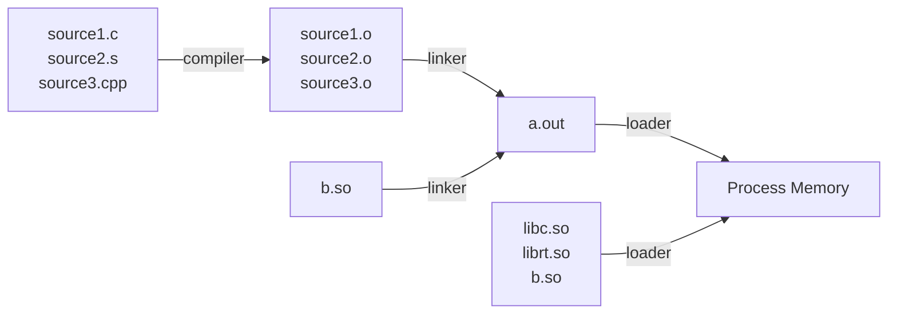
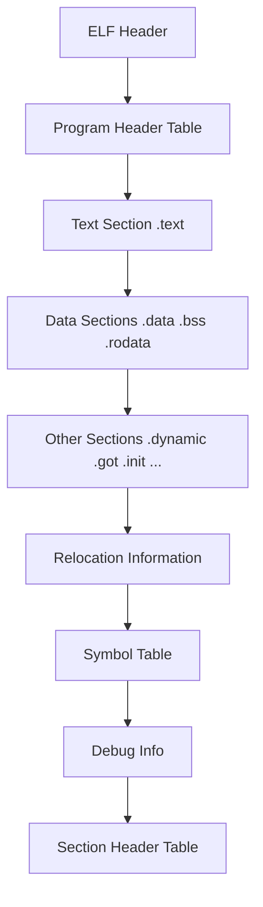
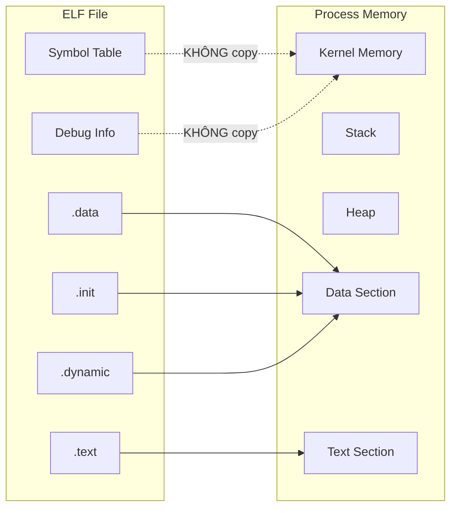
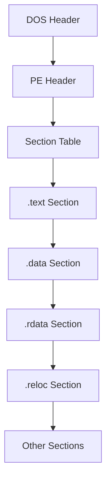

# Bài 2: Executable File Format

## Mục lục

- Compiler, Linker và Loader
- Định dạng ELF
- Định dạng PE
- Dead Space và Virus

---

## 1. Compiler, Linker và Loader

### 1.1 Tổng quan quy trình build



### 1.2 Compiler

Compiler chuyển đổi **source code** sang **binary machine code** (object code – mã máy nhị phân).

- Đầu vào: file nguồn `.c`, `.cpp`, `.s`, ...
- Đầu ra: file object `.o` (chưa thể chạy trực tiếp)
- Ví dụ compiler phổ biến: `gcc`, `Clang`, `vc_compilerCTP.exe`

!!! note "Lưu ý"
    File object (`.o`) chứa machine code nhưng **chưa hoàn chỉnh**: các tham chiếu đến hàm/biến từ file khác chưa được giải quyết. Đây là công việc của Linker.

### 1.3 Linker

Linker nhận các **object files** và **library files**, rồi kết hợp chúng thành một **executable file** hoặc **library file** duy nhất.

- Giải quyết các **symbolic references** (tham chiếu tên hàm, biến giữa các file object)
- Ví dụ: `GNU ld`, `lld`, `LINK.exe`

??? details "Hai loại linking"
    **Static linking**: toàn bộ code của thư viện được nhúng thẳng vào file thực thi. File lớn hơn nhưng độc lập hoàn toàn.

    **Dynamic linking**: file thực thi chỉ chứa *tham chiếu* đến thư viện; thư viện được nạp vào bộ nhớ lúc chạy. File nhỏ hơn, chia sẻ thư viện giữa các process.

### 1.4 Loader

Loader là một thành phần của **hệ điều hành**, chịu trách nhiệm **nạp file thực thi và các thư viện vào bộ nhớ** để khởi động một process mới.

**Hai loại loader:**

| Loại | Chức năng | Ví dụ |
|---|---|---|
| Executable loader | Nạp file thực thi | `execve` (system call) |
| Dynamic linking loader | Nạp thư viện động | `ld-linux.so` |

**Các bước Loader thực hiện:**

1. Sao chép **code** (text section) và **biến toàn cục** (data section) từ file vào bộ nhớ
2. Sao chép **arguments** và **environment variables** vào bộ nhớ
3. Khởi tạo **registers**
4. Nhảy đến điểm bắt đầu chương trình (`_start` function)
5. Nạp **dynamic libraries** (map code của thư viện động vào bộ nhớ)

### 1.5 Tại sao cần định dạng file chuẩn?

Để compiler, linker và loader hoạt động đúng với nhau, chúng phải **thống nhất về định dạng** của object file, executable file và library file.

Các định dạng phổ biến:

| Định dạng | Hệ điều hành |
|---|---|
| **ELF** (Executable and Linkable Format) | Linux/Unix (*nix) |
| **PE** (Portable Executable) | Windows |
| **Mach-O** | macOS (OS X) |

---

## 2. Định dạng ELF

### 2.1 Tổng quan

**ELF – Executable and Linkable Format** là định dạng chuẩn trên các hệ thống *nix (Linux, BSD, ...). ELF dùng cho:

- **Executables**: file chương trình có thể chạy trực tiếp
- **Object files**: đầu ra của compiler (`.o`)
- **Dynamic libraries / Shared libraries**: thư viện dùng chung (`.so`)
- **Core dumps**: snapshot bộ nhớ khi chương trình crash

### 2.2 Cấu trúc ELF



**Mô tả từng thành phần:**

=== "ELF Header"
    - Thông tin nhận dạng cơ bản của file
    - Bao gồm: magic number (`7f 45 4c 46`), kiến trúc CPU, endianness, entry point address, vị trí của Program Header Table và Section Header Table
    - Công cụ xem: `readelf -h <file>`

=== "Program Header Table"
    - Mô tả các **segment** (cách loader nạp file vào bộ nhớ)
    - Chứa vị trí (địa chỉ bộ nhớ) của các section `.text`, `.data`, ...
    - Dùng ở **runtime** (loader đọc bảng này)

=== "Section Header Table"
    - Mô tả vị trí và thông tin của từng **section** trong file
    - Dùng ở **link time** (linker đọc bảng này)
    - Công cụ xem: `readelf -S <file>`

=== "Text Section (.text)"
    - Chứa **machine code** của chương trình
    - Thuộc tính: **Readable + Executable** (không ghi được trong điều kiện bình thường)

=== "Data Sections"
    | Section | Nội dung |
    |---|---|
    | `.data` | Biến toàn cục **đã khởi tạo** (initialized global variables) |
    | `.bss` | Biến toàn cục **chưa khởi tạo** (uninitialized global variables) |
    | `.rodata` | Dữ liệu **read-only** (hằng số, string literals) |

=== "Other Sections"
    | Section | Nội dung |
    |---|---|
    | `.dynamic` | Thông tin dynamic linking |
    | `.got` | Global Offset Table – hỗ trợ dynamic linking |
    | `.init` | Code khởi tạo process (chạy trước `main()`) |

=== "Relocation Information"
    - Thông tin để linker/loader điều chỉnh địa chỉ khi ghép các file object hoặc nạp vào bộ nhớ tại địa chỉ khác nhau

=== "Symbol Table"
    - Chứa tên và địa chỉ của các **symbolic definitions** (hàm exported, biến toàn cục...)
    - Ví dụ: tên hàm `main`, `printf`, ...
    - **Không** được copy vào bộ nhớ khi chạy

=== "Debug Info"
    - Thông tin phục vụ debug (mapping giữa machine code và source code)
    - **Không** được copy vào bộ nhớ khi chạy

### 2.3 ELF File → Process Memory

Không phải tất cả các section trong file ELF đều được nạp vào bộ nhớ:



!!! warning "Quan trọng"
    - Các section **được** copy: `.text`, `.data`, `.init`, `.dynamic`
    - Các section **không** được copy: Symbol table, Debug info
    - Nếu không dùng PIC/PIE và ASLR, địa chỉ bộ nhớ của các section đã được **cố định** trong ELF header

### 2.4 Section Flags – Cờ thuộc tính Section

Mỗi section có một tập **flag bits** xác định quyền truy cập:

| Flag | Ý nghĩa |
|---|---|
| `A` (Alloc) | Section được cấp phát bộ nhớ khi chạy |
| `X` (Execute) | Section chứa code có thể thực thi |
| `W` (Write) | Section có thể ghi |

!!! danger "Cảnh báo bảo mật"
    **Flag bits** mới là thứ quyết định quyền truy cập, **không phải tên section**.
    Virus có thể sửa flag bits để biến section `.text` (thường là read-only + execute) thành **writable**, từ đó ghi code độc hại vào!

### 2.5 Công cụ phân tích ELF

```bash
# Xem ELF Header
readelf -h <executable>

# Xem thông tin các section
readelf -S <executable>

# Disassemble (dịch ngược machine code sang assembly)
objdump -d <executable>

# Dump hex thô
hexdump -C <executable>

# Xác định loại file
file <executable>
```

**Ví dụ output `readelf -h`:**

```
ELF Header:
  Magic:   7f 45 4c 46 01 01 01 00 ...
  Class:                             ELF32
  Data:                              2's complement, little endian
  Version:                           1 (current)
  OS/ABI:                            UNIX - System V
  Type:                              EXEC (Executable file)
  Machine:                           Intel 80386
  Entry point address:               0x8048330
```

---

## 3. Định dạng PE

### 3.1 Tổng quan

**PE – Portable Executable** là định dạng file thực thi chuẩn trên **Windows**.

- **PE32**: dành cho code 32-bit
- **PE32+**: dành cho code 64-bit
- Các định dạng cũ hơn tồn tại cho 16-bit DOS và Windows 3.1

### 3.2 Cấu trúc PE



**Các section phổ biến trong PE:**

| Section | Nội dung |
|---|---|
| `.text` | Machine code (code thực thi) |
| `.data` | Dữ liệu read/write (biến toàn cục) |
| `.rdata` | Dữ liệu read-only (hằng số, import table) |
| `.reloc` | Relocation data – dùng để xây dựng **IAT** (Import Address Table) |

### 3.3 DOS Header

DOS Header là phần đầu của file PE, có từ thời DOS.

- Nếu file PE được chạy trong **DOS command prompt**: chương trình nhỏ trong DOS Header sẽ được thực thi
- Với hầu hết file PE32 hiện đại: DOS header chứa một đoạn code nhỏ chỉ in ra thông báo:

```
This application must be run from Windows
```

rồi thoát. Đây chỉ là thông báo tương thích ngược, không có chức năng thực sự.

!!! info "So sánh ELF và PE"
    PE tương tự ELF về mặt khái niệm: đều có header, text/data section, relocation info, symbol table, debug info. Sự khác biệt chính là **cú pháp cấu trúc** và cách **loader của OS** xử lý.

---

## 4. Dead Space và Mối liên hệ với Virus

### 4.1 Dead Space là gì?

**Dead space** (không gian chết) là các vùng **trống hoặc không sử dụng** có mặt trong executable file.

Nguồn gốc của dead space:

- Phần đầu file ELF (padding bytes)
- Khoảng trống **giữa các hàm** (function padding)
- Khoảng trống **giữa các section** (section padding)
- Các lệnh **NOP** (no-operation) được chèn vào hàm để alignment
- Linker thường **align các section theo page boundary** (4KB hoặc 4096 bytes) để đơn giản hóa công việc của loader → sinh ra nhiều padding

!!! note "Page boundary alignment"
    Khi linker align section theo page boundary, nếu section chỉ dùng 100 bytes nhưng page là 4096 bytes, sẽ có **3996 bytes trống** – đây là dead space. Loader được đơn giản hóa vì chỉ cần map theo trang, không cần tính toán phức tạp.

### 4.2 Tại sao cần hiểu PE format khi học malware?

**Câu hỏi:** Tại sao chúng ta quan tâm đến chi tiết của PE file format?

**Trả lời:** Vì **virus writer** sẽ cố gắng lây nhiễm file PE theo cách khiến code của virus được thực thi, trong khi file PE trông vẫn bình thường từ bên ngoài. Nhiệm vụ của **phần mềm diệt virus** là phát hiện các virus được ngụy trang tinh vi này.

**Dead space là nơi lý tưởng để giấu virus** vì:

- Nằm trong file hợp lệ
- Không ảnh hưởng đến chức năng bình thường của chương trình
- Khó phát hiện nếu không phân tích kỹ cấu trúc file

!!! example "Ví dụ thực tế: CIH Virus"
    **CIH virus** (còn gọi là Chernobyl virus – 1998) là một ví dụ kinh điển:
    - CIH tự **chia nhỏ bản thân** thành nhiều phần
    - Giấu từng phần vào các **dead space giữa các PE section**
    - Kết quả: file bị nhiễm có **kích thước gần như không đổi** so với file gốc
    - Rất khó phát hiện bằng cách chỉ nhìn vào kích thước file

---

## Câu hỏi & Đáp án Trắc Nghiệm

**Câu 1.** Thứ tự đúng của quá trình build một chương trình C là?

- A. Linker → Compiler → Loader
- B. Compiler → Loader → Linker
- C. Compiler → Linker → Loader
- D. Loader → Compiler → Linker

??? info "Đáp án & Giải thích"
    **Đáp án: C**

    Source code → Compiler tạo object file → Linker ghép object files thành executable → Loader nạp executable vào bộ nhớ để chạy.

---

**Câu 2.** Compiler tạo ra loại file nào?

- A. Executable file (`.exe` hoặc `a.out`)
- B. Object file (`.o`)
- C. Shared library (`.so`)
- D. Script file

??? info "Đáp án & Giải thích"
    **Đáp án: B**

    Compiler chuyển source code thành binary machine code dưới dạng object file (`.o`). File này chưa thể chạy trực tiếp vì các tham chiếu bên ngoài chưa được giải quyết.

---

**Câu 3.** Nhiệm vụ chính của Linker là gì?

- A. Chuyển source code sang machine code
- B. Nạp file thực thi vào bộ nhớ
- C. Kết hợp các object file và library file thành một file thực thi
- D. Khởi tạo registers trước khi chạy chương trình

??? info "Đáp án & Giải thích"
    **Đáp án: C**

    Linker lấy các object file (`.o`) và library file, giải quyết các symbolic references giữa chúng, và kết hợp tất cả thành một executable file hoặc library file.

---

**Câu 4.** `ld-linux.so` là ví dụ của loại loader nào?

- A. Executable loader
- B. Dynamic linking loader
- C. Static linker
- D. Kernel loader

??? info "Đáp án & Giải thích"
    **Đáp án: B**

    `ld-linux.so` là dynamic linker/loader trên Linux, chịu trách nhiệm nạp các dynamic library (`.so`) vào bộ nhớ khi chương trình khởi động.

---

**Câu 5.** `execve` là ví dụ của?

- A. Compiler
- B. Linker
- C. Executable loader (system call)
- D. Dynamic library

??? info "Đáp án & Giải thích"
    **Đáp án: C**

    `execve` là một system call trên Linux, thuộc loại executable loader – nó nạp file thực thi vào bộ nhớ và bắt đầu thực thi process mới.

---

**Câu 6.** Loader thực hiện bước nào SAU KHI khởi tạo registers?

- A. Copy text section vào bộ nhớ
- B. Copy arguments vào bộ nhớ
- C. Nhảy đến hàm `_start` để bắt đầu thực thi
- D. Load dynamic libraries

??? info "Đáp án & Giải thích"
    **Đáp án: C**

    Thứ tự: (1) Copy text/data section → (2) Copy arguments/env vars → (3) Khởi tạo registers → (4) **Jump to `_start`** → (5) Load dynamic libraries.

---

**Câu 7.** Định dạng ELF được dùng trên hệ điều hành nào?

- A. Windows
- B. macOS
- C. Linux/Unix (*nix)
- D. Android

??? info "Đáp án & Giải thích"
    **Đáp án: C**

    ELF (Executable and Linkable Format) là định dạng chuẩn trên các hệ thống *nix như Linux, BSD. Windows dùng PE, macOS dùng Mach-O.

---

**Câu 8.** ELF format được dùng cho loại file nào? (chọn tất cả đúng)

- A. Executable files
- B. Object files
- C. Dynamic libraries
- D. Core dumps
- E. Tất cả các loại trên

??? info "Đáp án & Giải thích"
    **Đáp án: E**

    ELF định nghĩa format cho cả 4 loại: executables, object files, dynamic/shared libraries (`.so`), và core dumps (file snapshot bộ nhớ khi crash).

---

**Câu 9.** Magic number của file ELF là gì?

- A. `FF FE`
- B. `4D 5A` (MZ)
- C. `7F 45 4C 46`
- D. `CA FE BA BE`

??? info "Đáp án & Giải thích"
    **Đáp án: C**

    `7F 45 4C 46` tương ứng với `\x7FELF` – đây là magic bytes ở đầu mọi file ELF. `4D 5A` (MZ) là magic number của file PE (Windows).

---

**Câu 10.** Section `.bss` trong ELF chứa gì?

- A. Machine code
- B. Biến toàn cục đã khởi tạo
- C. Biến toàn cục chưa khởi tạo
- D. Dữ liệu read-only

??? info "Đáp án & Giải thích"
    **Đáp án: C**

    `.bss` (Block Started by Symbol) chứa uninitialized global variables. Đặc biệt, `.bss` thường không chiếm không gian trong file (chỉ lưu kích thước), nhưng khi nạp vào bộ nhớ sẽ được cấp phát và zero-initialized.

---

**Câu 11.** Section `.rodata` trong ELF chứa gì?

- A. Code thực thi
- B. Dữ liệu read-only (hằng số, string literals)
- C. Biến toàn cục có thể ghi
- D. Thông tin relocation

??? info "Đáp án & Giải thích"
    **Đáp án: B**

    `.rodata` (read-only data) chứa dữ liệu không thể sửa đổi khi chạy, ví dụ như các string literals (`"Hello World"`), hằng số (`const int`).

---

**Câu 12.** Section `.data` trong ELF chứa gì?

- A. Code thực thi
- B. Biến toàn cục đã được khởi tạo
- C. Biến toàn cục chưa khởi tạo
- D. Thông tin debug

??? info "Đáp án & Giải thích"
    **Đáp án: B**

    `.data` chứa initialized global variables – các biến toàn cục đã có giá trị khởi tạo cụ thể (ví dụ: `int x = 5;`).

---

**Câu 13.** Section `.got` trong ELF có chức năng gì?

- A. Lưu machine code
- B. Hỗ trợ dynamic linking thông qua Global Offset Table
- C. Lưu thông tin debug
- D. Chứa biến toàn cục chưa khởi tạo

??? info "Đáp án & Giải thích"
    **Đáp án: B**

    `.got` (Global Offset Table) là cơ chế giúp code tham chiếu đến các symbol trong thư viện động. Khi dynamic linker nạp thư viện, nó điền địa chỉ thực tế vào GOT.

---

**Câu 14.** Section `.init` trong ELF chứa gì?

- A. Code khởi tạo process, chạy trước `main()`
- B. Dữ liệu khởi tạo biến
- C. Thông tin để linker khởi tạo symbol table
- D. Code dọn dẹp khi process kết thúc

??? info "Đáp án & Giải thích"
    **Đáp án: A**

    `.init` chứa code được thực thi trong quá trình khởi tạo chương trình, **trước khi** hàm `main()` được gọi. Tương tự, `.fini` chứa code dọn dẹp chạy sau khi `main()` kết thúc.

---

**Câu 15.** Khi nạp ELF vào bộ nhớ, section nào KHÔNG được copy?

- A. `.text`
- B. `.data`
- C. Symbol table
- D. `.dynamic`

??? info "Đáp án & Giải thích"
    **Đáp án: C**

    Symbol table và debug info không được copy vào bộ nhớ khi chạy vì chúng chỉ cần thiết trong quá trình link/debug. Các section `.text`, `.data`, `.init`, `.dynamic` được copy vào bộ nhớ.

---

**Câu 16.** `Program Header Table` trong ELF được đọc bởi ai?

- A. Compiler
- B. Linker
- C. Loader
- D. Assembler

??? info "Đáp án & Giải thích"
    **Đáp án: C**

    Program Header Table mô tả các segment theo góc nhìn **runtime** – Loader đọc bảng này để biết cách nạp file vào bộ nhớ. Ngược lại, Section Header Table được Linker đọc ở link time.

---

**Câu 17.** `Section Header Table` trong ELF được đọc bởi ai?

- A. Loader
- B. Linker
- C. CPU
- D. OS kernel

??? info "Đáp án & Giải thích"
    **Đáp án: B**

    Section Header Table mô tả các section theo góc nhìn **link time** – Linker đọc bảng này để biết vị trí và loại của từng section khi ghép file. Loader dùng Program Header Table (mô tả segment).

---

**Câu 18.** Lệnh nào dùng để xem ELF header?

- A. `objdump -d <file>`
- B. `readelf -h <file>`
- C. `hexdump -C <file>`
- D. `file <file>`

??? info "Đáp án & Giải thích"
    **Đáp án: B**

    `readelf -h <file>` hiển thị ELF header. `-S` hiển thị section info. `objdump -d` disassemble. `hexdump -C` dump hex thô. `file` xác định loại file.

---

**Câu 19.** Lệnh nào dùng để disassemble (dịch ngược) một file ELF?

- A. `readelf -h`
- B. `hexdump -C`
- C. `objdump -d`
- D. `file`

??? info "Đáp án & Giải thích"
    **Đáp án: C**

    `objdump -d <file>` disassemble – chuyển machine code sang assembly để phân tích. Đây là công cụ rất quan trọng trong reverse engineering và malware analysis.

---

**Câu 20.** Flag `AX` trên một section ELF có nghĩa là gì?

- A. Section chỉ có thể đọc
- B. Section được cấp phát bộ nhớ và có thể thực thi
- C. Section có thể ghi và thực thi
- D. Section chứa thông tin archive

??? info "Đáp án & Giải thích"
    **Đáp án: B**

    `A` = Alloc (được cấp phát bộ nhớ khi chạy), `X` = Execute (có thể thực thi). Section `.text` thường có flag `AX`. `W` = Writable.

---

**Câu 21.** Virus có thể làm gì với flag bits của section ELF để lây nhiễm hiệu quả hơn?

- A. Xóa toàn bộ flag bits
- B. Sửa flag bits để biến section `.text` thành writable, từ đó ghi code độc hại vào
- C. Thêm flag bits để tăng kích thước section
- D. Copy flag bits sang section khác

??? info "Đáp án & Giải thích"
    **Đáp án: B**

    Section `.text` bình thường chỉ có quyền Read + Execute. Nếu virus sửa flag bit `W` (Writable), section `.text` có thể bị ghi đè bởi code độc hại. Đây là lý do tại sao antivirus cần kiểm tra flag bits thực tế chứ không chỉ dựa vào tên section.

---

**Câu 22.** Điều gì thực sự xác định quyền truy cập (read/write/execute) của một section ELF?

- A. Tên của section (`.text`, `.data`, ...)
- B. Vị trí section trong file
- C. Flag bits của section
- D. Kích thước của section

??? info "Đáp án & Giải thích"
    **Đáp án: C**

    Flag bits (W, A, X) mới là thứ quyết định quyền truy cập thực sự. Tên section chỉ là quy ước – không có cơ chế nào bắt buộc `.text` phải là execute-only hay `.data` phải là writable.

---

**Câu 23.** PE format là định dạng file thực thi của hệ điều hành nào?

- A. Linux
- B. macOS
- C. Windows
- D. FreeBSD

??? info "Đáp án & Giải thích"
    **Đáp án: C**

    PE (Portable Executable) là định dạng chuẩn trên Windows cho các file `.exe`, `.dll`, `.sys`, ...

---

**Câu 24.** PE32+ dùng cho loại code nào?

- A. 16-bit
- B. 32-bit
- C. 64-bit
- D. 128-bit

??? info "Đáp án & Giải thích"
    **Đáp án: C**

    PE32 dành cho code 32-bit, PE32+ dành cho code 64-bit. Các hệ Windows 64-bit hiện đại dùng PE32+.

---

**Câu 25.** Magic number của file PE (Windows executable) là gì?

- A. `7F 45 4C 46`
- B. `4D 5A` (MZ)
- C. `CA FE BA BE`
- D. `FF D8 FF`

??? info "Đáp án & Giải thích"
    **Đáp án: B**

    `4D 5A` tương ứng với ký tự `MZ` (viết tắt của Mark Zbikowski – kỹ sư Microsoft). Đây là magic bytes đầu mọi file PE. `7F 45 4C 46` là magic của ELF.

---

**Câu 26.** DOS Header trong file PE có chức năng gì khi chạy trên DOS?

- A. Không làm gì cả
- B. Thực thi một đoạn code nhỏ (thường in thông báo lỗi)
- C. Load Windows kernel
- D. Khởi tạo registry

??? info "Đáp án & Giải thích"
    **Đáp án: B**

    Khi file PE được chạy trong DOS command prompt, DOS header sẽ được thực thi. Với hầu hết file PE32 hiện đại, đoạn code này chỉ in ra `"This application must be run from Windows"` rồi thoát.

---

**Câu 27.** Section `.rdata` trong PE chứa gì?

- A. Code thực thi
- B. Dữ liệu read/write
- C. Dữ liệu read-only (hằng số, import table)
- D. Relocation data

??? info "Đáp án & Giải thích"
    **Đáp án: C**

    `.rdata` (read-only data) trong PE chứa các hằng số, string literals, và quan trọng là **import table** (danh sách các hàm được import từ DLL khác).

---

**Câu 28.** Section `.reloc` trong PE dùng để làm gì?

- A. Lưu code thực thi
- B. Chứa relocation data để xây dựng IAT (Import Address Table)
- C. Lưu debug symbols
- D. Chứa thông tin về version của file

??? info "Đáp án & Giải thích"
    **Đáp án: B**

    `.reloc` chứa relocation data, dùng khi file PE được nạp vào địa chỉ khác với **preferred base address** – loader cần điều chỉnh các địa chỉ tuyệt đối trong code.

---

**Câu 29.** Dead space trong executable file bao gồm những gì?

- A. Chỉ khoảng trống giữa các section
- B. Chỉ NOP instructions
- C. Khoảng trống đầu file, giữa các hàm, giữa các section, NOP instructions, và padding do alignment
- D. Chỉ padding do page alignment

??? info "Đáp án & Giải thích"
    **Đáp án: C**

    Dead space bao gồm nhiều loại: phần đầu file (ELF), khoảng trống giữa các hàm, giữa các section, NOP instructions được chèn vào, và đặc biệt là padding do linker align section theo page boundary.

---

**Câu 30.** Tại sao linker align các section theo page boundary?

- A. Để giảm kích thước file
- B. Để đơn giản hóa công việc của loader
- C. Để tăng tốc độ compiler
- D. Để tương thích với các hệ điều hành cũ

??? info "Đáp án & Giải thích"
    **Đáp án: B**

    Khi section được align theo page boundary (thường 4KB), loader chỉ cần map nguyên các trang bộ nhớ mà không cần tính toán phức tạp. Nhược điểm là tạo ra nhiều dead space (padding bytes không sử dụng).

---

**Câu 31.** CIH virus (Chernobyl) sử dụng kỹ thuật nào để lây nhiễm và khó bị phát hiện?

- A. Mã hóa toàn bộ file
- B. Thêm section mới vào PE file
- C. Chia nhỏ bản thân và giấu trong dead space giữa các PE section
- D. Thay thế hoàn toàn file gốc

??? info "Đáp án & Giải thích"
    **Đáp án: C**

    CIH virus (1998) nổi tiếng vì tự chia thành nhiều mảnh nhỏ và nhét vào các dead space giữa các PE section. Kết quả là kích thước file bị nhiễm gần như **không thay đổi** so với file gốc – rất khó phát hiện bằng cách so sánh kích thước.

---

**Câu 32.** Tại sao dead space là vị trí lý tưởng để giấu virus?

- A. Vì nó dễ dàng bị phát hiện
- B. Vì nó nằm trong file hợp lệ, không ảnh hưởng chức năng bình thường, khó phát hiện
- C. Vì nó luôn được thực thi khi chương trình chạy
- D. Vì nó có nhiều không gian lưu trữ

??? info "Đáp án & Giải thích"
    **Đáp án: B**

    Dead space hoàn hảo để giấu virus vì: (1) nằm trong file hợp lệ nên không bị nghi ngờ, (2) không ảnh hưởng chức năng bình thường của chương trình, (3) không làm thay đổi kích thước file, (4) khó phát hiện nếu không phân tích kỹ cấu trúc.

---

**Câu 33.** Mach-O là định dạng file thực thi của hệ điều hành nào?

- A. Linux
- B. Windows
- C. macOS (OS X)
- D. Android

??? info "Đáp án & Giải thích"
    **Đáp án: C**

    Mach-O (Mach Object) là định dạng file thực thi chuẩn trên macOS và iOS. Ba định dạng chính: ELF (*nix), PE (Windows), Mach-O (macOS/iOS).

---

**Câu 34.** Trong ELF, PIC/PIE là gì và tại sao liên quan đến địa chỉ bộ nhớ?

- A. PIC/PIE là loại virus đặc biệt
- B. PIC (Position Independent Code) / PIE (Position Independent Executable) cho phép code chạy ở bất kỳ địa chỉ nào, thường kết hợp với ASLR
- C. PIC/PIE là loại section đặc biệt trong ELF
- D. PIC/PIE là công cụ phân tích ELF

??? info "Đáp án & Giải thích"
    **Đáp án: B**

    PIC/PIE cho phép code không phụ thuộc vào địa chỉ tuyệt đối. Khi kết hợp với **ASLR** (Address Space Layout Randomization), OS có thể nạp chương trình vào địa chỉ ngẫu nhiên mỗi lần chạy – tăng bảo mật chống lại các cuộc tấn công như buffer overflow.

---

**Câu 35.** ASLR có liên hệ gì đến địa chỉ của các section trong ELF?

- A. ASLR cố định địa chỉ các section
- B. ASLR ngẫu nhiên hóa địa chỉ bộ nhớ mỗi lần chạy, làm cho địa chỉ trong ELF không còn chính xác tuyệt đối
- C. ASLR xóa section header table
- D. ASLR mã hóa nội dung các section

??? info "Đáp án & Giải thích"
    **Đáp án: B**

    Nếu không dùng PIC/PIE và ASLR, địa chỉ bộ nhớ của các section đã được cố định trong ELF. Khi bật ASLR, OS nạp chương trình vào địa chỉ ngẫu nhiên, nên địa chỉ trong ELF chỉ là **offset** tương đối.

---

**Câu 36.** Lệnh `file <executable>` có tác dụng gì?

- A. Liệt kê các file trong thư mục
- B. Xác định loại file (ELF, PE, script, ...)
- C. Hiển thị nội dung file dưới dạng hex
- D. Disassemble file

??? info "Đáp án & Giải thích"
    **Đáp án: B**

    Lệnh `file` kiểm tra magic bytes và metadata để xác định loại file, ví dụ: `ELF 64-bit LSB executable`, `PE32 executable`, `ASCII text`, ...

---

**Câu 37.** Trong quá trình dynamic linking, thư viện (`.so`) được nạp vào bộ nhớ khi nào?

- A. Khi compile
- B. Khi link
- C. Khi loader khởi động process
- D. Thư viện không bao giờ nạp vào bộ nhớ

??? info "Đáp án & Giải thích"
    **Đáp án: C**

    Dynamic libraries được nạp vào bộ nhớ **tại runtime** bởi dynamic linker (`ld-linux.so`). Loader map code của thư viện vào address space của process khi khởi động (hoặc lazily khi hàm lần đầu được gọi với lazy binding).

---

**Câu 38.** Điểm vào (entry point) của chương trình ELF thường là hàm gì?

- A. `main()`
- B. `_start`
- C. `init()`
- D. `entry()`

??? info "Đáp án & Giải thích"
    **Đáp án: B**

    Entry point thực sự của ELF executable là hàm `_start` (do C runtime library cung cấp), không phải `main()`. `_start` thiết lập môi trường (stack, arguments) rồi mới gọi `main()`.

---

**Câu 39.** Symbol table trong ELF chứa thông tin gì?

- A. Machine code của chương trình
- B. Tên và địa chỉ của các symbolic definitions như tên hàm, biến toàn cục
- C. Thông tin về dynamic libraries cần nạp
- D. Dữ liệu runtime của chương trình

??? info "Đáp án & Giải thích"
    **Đáp án: B**

    Symbol table lưu tên và địa chỉ của các hàm (exported functions), biến toàn cục, và các symbol khác. Đây là thông tin quan trọng cho linker và debugger, nhưng không cần thiết ở runtime nên không được copy vào bộ nhớ.

---

**Câu 40.** Core dump file trong ELF chứa gì?

- A. Chỉ chứa source code
- B. Snapshot của bộ nhớ process tại thời điểm crash
- C. Log của toàn bộ quá trình thực thi
- D. Thông tin về cấu hình hệ thống

??? info "Đáp án & Giải thích"
    **Đáp án: B**

    Core dump là snapshot của bộ nhớ process (registers, stack, heap, code) tại thời điểm chương trình bị crash (ví dụ segfault). Dùng để debug sau khi crash xảy ra.

---

**Câu 41.** Sự khác biệt chính giữa static linking và dynamic linking là gì?

- A. Static linking nhanh hơn dynamic linking
- B. Static linking nhúng toàn bộ thư viện vào executable; dynamic linking chỉ tham chiếu, thư viện nạp lúc runtime
- C. Static linking chỉ dùng trên Linux; dynamic linking chỉ dùng trên Windows
- D. Không có sự khác biệt

??? info "Đáp án & Giải thích"
    **Đáp án: B**

    Static: code thư viện được nhúng vào file → file lớn, độc lập, không cần thư viện bên ngoài. Dynamic: chỉ lưu tên thư viện/hàm → file nhỏ, chia sẻ được, nhưng cần thư viện đúng phiên bản khi chạy.

---

**Câu 42.** Trong phân tích malware, tại sao cần biết chi tiết về PE/ELF format?

- A. Để viết phần mềm nhanh hơn
- B. Vì virus lợi dụng cấu trúc file format để ẩn mình; hiểu format giúp phát hiện virus tinh vi
- C. Để tối ưu hóa compiler
- D. Để thiết kế CPU hiệu quả hơn

??? info "Đáp án & Giải thích"
    **Đáp án: B**

    Virus writer khai thác mọi chi tiết của PE/ELF format để ẩn code độc hại (dead space, section flags, ...). Antivirus và malware analyst cần hiểu sâu format để phát hiện các biến thể được ngụy trang tinh vi.

---

**Câu 43.** Khi nào địa chỉ của section trong ELF được **cố định** (không thay đổi giữa các lần chạy)?

- A. Luôn luôn cố định
- B. Khi không dùng PIC/PIE và ASLR bị tắt
- C. Khi dùng ASLR
- D. Khi dùng dynamic linking

??? info "Đáp án & Giải thích"
    **Đáp án: B**

    Địa chỉ cố định khi: (1) file không được biên dịch là PIC/PIE, VÀ (2) ASLR bị tắt. Trong trường hợp này, loader nạp chương trình vào đúng địa chỉ ghi trong ELF.

---

**Câu 44.** Trong ELF, sự khác biệt giữa "section" và "segment" là gì?

- A. Không có sự khác biệt
- B. Section là góc nhìn của linker (link time); segment là góc nhìn của loader (runtime)
- C. Section lớn hơn segment
- D. Segment chỉ tồn tại trong PE, không có trong ELF

??? info "Đáp án & Giải thích"
    **Đáp án: B**

    **Section** (Section Header Table): đơn vị của linker, mô tả chi tiết từng phần của file (`.text`, `.data`, ...). **Segment** (Program Header Table): đơn vị của loader, nhóm nhiều section lại và mô tả cách map vào bộ nhớ.

---

**Câu 45.** IAT (Import Address Table) trong PE dùng để làm gì?

- A. Lưu danh sách các function exported của file PE
- B. Lưu địa chỉ thực tế của các hàm được import từ DLL khi chạy
- C. Quản lý bộ nhớ heap
- D. Lưu thông tin debug

??? info "Đáp án & Giải thích"
    **Đáp án: B**

    IAT (Import Address Table) được loader điền vào khi nạp chương trình. Nó chứa địa chỉ thực tế của các hàm từ DLL (ví dụ: địa chỉ của `MessageBoxA` trong `user32.dll`). Code trong `.text` gọi hàm qua IAT thay vì địa chỉ cứng.

---

**Câu 46.** Lệnh `readelf -S <file>` hiển thị thông tin gì?

- A. ELF header
- B. Thông tin từng section (tên, địa chỉ, kích thước, flags)
- C. Disassembly code
- D. Dynamic linking dependencies

??? info "Đáp án & Giải thích"
    **Đáp án: B**

    `readelf -S` (viết tắt của `--sections`) hiển thị Section Header Table: tên section, loại (Type), địa chỉ trong bộ nhớ (Addr), offset trong file (Off), kích thước (Size), và flags (Flg).

---

**Câu 47.** Kích thước của file PE bị nhiễm CIH virus so với file gốc như thế nào?

- A. Lớn hơn đáng kể
- B. Nhỏ hơn
- C. Gần như không thay đổi
- D. Gấp đôi

??? info "Đáp án & Giải thích"
    **Đáp án: C**

    Đây chính là điểm đặc biệt của CIH: bằng cách nhét code vào **dead space có sẵn** thay vì thêm section mới, kích thước file **gần như không đổi** – rất khó phát hiện bằng cách kiểm tra kích thước.

---

**Câu 48.** Trong ELF, `entry point address` trong ELF header chỉ đến đâu?

- A. Hàm `main()`
- B. Địa chỉ đầu tiên của section `.text`
- C. Địa chỉ của hàm `_start` (điểm bắt đầu thực thi)
- D. Địa chỉ của dynamic linker

??? info "Đáp án & Giải thích"
    **Đáp án: C**

    Entry point address trong ELF header chỉ đến hàm `_start` – đây là điểm mà CPU bắt đầu thực thi khi process được tạo. `_start` không nhất thiết trùng với byte đầu của `.text`.

---

**Câu 49.** Tại sao antivirus không thể chỉ dựa vào tên section để xác định quyền của nó?

- A. Tên section quá dài
- B. Vì virus có thể sửa flag bits mà không đổi tên section, quyền thực sự do flag bits quyết định
- C. Vì ELF không có tên section
- D. Vì tên section bị mã hóa

??? info "Đáp án & Giải thích"
    **Đáp án: B**

    Không có cơ chế nào ràng buộc section `.text` phải là execute-only. Virus có thể sửa flag `W` để `.text` trở thành writable, sau đó ghi code độc hại vào. Antivirus phải kiểm tra **flag bits thực tế** trong Section Header Table.

---

**Câu 50.** Bộ ba công cụ cơ bản để phân tích file ELF trên Linux là?

- A. `gcc`, `ld`, `execve`
- B. `readelf`, `objdump`, `hexdump`
- C. `vim`, `nano`, `gedit`
- D. `ps`, `top`, `htop`

??? info "Đáp án & Giải thích"
    **Đáp án: B**

    - `readelf`: đọc metadata/cấu trúc ELF (header, sections, symbols, ...)
    - `objdump`: disassemble machine code sang assembly
    - `hexdump`: xem raw bytes của file ở dạng hex

    Ngoài ra còn có `file` để xác định loại file và `strings` để trích xuất chuỗi ký tự.
