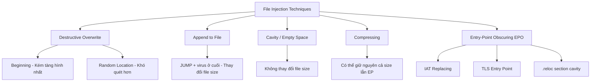
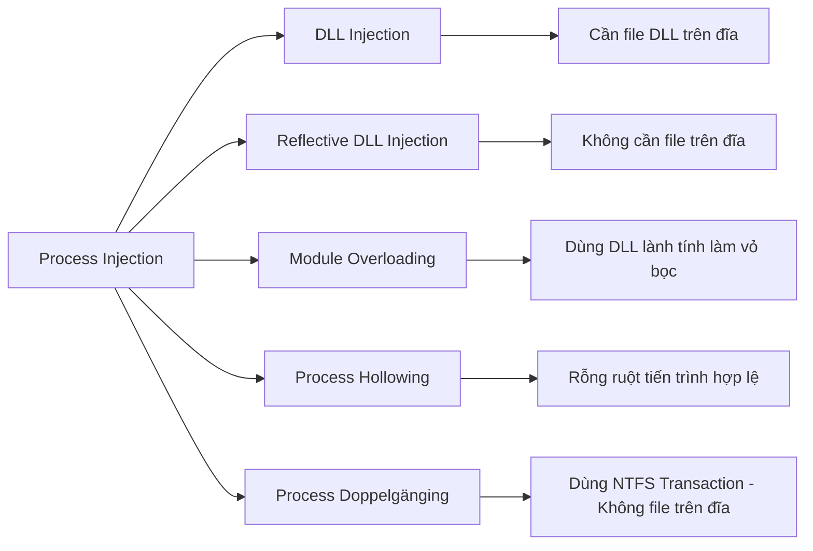

# Bài 3: Các loại malware

---

## 1. Virus Máy Tính (Computer Virus)

### 1.1 Định nghĩa

> **"A computer virus is code that recursively replicates a (possibly evolved) copy of itself."**
> — Péter Szőr, *The Art of Computer Virus Research and Defense*

Một cách đầy đủ hơn: **Virus máy tính là một chương trình độc hại tự gắn vào một file chủ (host file) và tự nhân bản khi file bị nhiễm được thực thi, thường biến đổi mã của chính nó để tránh bị phát hiện.**

### 1.2 Đặc điểm của Virus

**Ký sinh (Parasitic)**
Virus không thể tồn tại độc lập. Nó cần một "vật chủ" (host) — thường là file thực thi, tiến trình đang chạy — để gắn vào và lan truyền. Nếu không có host, virus không thể tự hoạt động.

**Tự nhân bản (Self-replicating)**
Khi file bị nhiễm được thực thi, virus cố gắng sao chép mã của mình vào các host khác. Đây là cơ chế lây lan chủ yếu.

**Vector tấn công "ngoại tuyến" (Offline attack vector)**
Virus không tự lan truyền qua mạng một cách tự động (khác với worm). Tuy nhiên, các file bị nhiễm có thể được truyền/tải xuống qua mạng, từ đó lây nhiễm sang máy khác. Đây là điểm khác biệt cơ bản giữa virus và worm.

---

## 2. Kỹ Thuật Tiêm Nhiễm File (File Injection Techniques)

### 2.1 Tổng quan

File thực thi (`*.exe`, `*.com`, `*.bat`, ...) là mục tiêu phổ biến nhất. Khi file bị nhiễm được thực thi, virus kích hoạt và nhân bản sang các file khác.

Các kỹ thuật tiêm nhiễm được phân loại dựa trên **vị trí virus code được đặt trong file**.

### 2.2 Mục tiêu cơ bản khi tiêm nhiễm file

- **Kích hoạt thực thi mã virus**: Đảm bảo virus code chạy được.
- **Tàng hình (Stealth)**:
    - Giữ nguyên kích thước file gốc.
    - Bảo toàn chức năng file gốc — giấu khỏi người dùng.
    - Giả vờ là code bình thường — giấu khỏi phần mềm antivirus.

---

### 2.3 Ghi đè phá hủy tại vị trí đầu file (Destructive Overwrite at Beginning)

**Nguyên lý:**
"Đầu file" (beginning) luôn chỉ vị trí bắt đầu của phần thực thi, có thể nằm sau phần header trong một số định dạng file. Virus có thể:

- Bảo toàn phần đầu file gốc, hoặc
- Phá hủy nó bằng cách ghi đè

!!! warning "Lưu ý quan trọng"
    Tính phá hủy luôn làm giảm khả năng tàng hình của virus.

**Hai phương pháp chính:**

1. **Thay thế toàn bộ file `*.exe` bằng file `*.exe` chứa virus** — File gốc mất hoàn toàn.
2. **Ghi đè chỉ phần đầu file `*.exe` lớn hơn virus** — Một phần code gốc vẫn còn nhưng bị hỏng.

```
Phương pháp 1: [Virus Code] (toàn bộ file)
Phương pháp 2: [Virus Code] [Program Code còn lại (bị hỏng)]
```

**Nhược điểm:**

- Không có tính tàng hình: file mất chức năng hoàn toàn, người dùng nhận thấy ngay.
- Antivirus dễ dàng phát hiện virus ngay tại đầu file.
- Phương pháp 1 thường thay đổi kích thước file → càng kém tàng hình hơn.
- Chỉ có thể phục hồi bằng cách khôi phục từ bản backup.

!!! example "Ví dụ thực tế: LoveLetter Worm"
    Sau khi đã nhân bản qua email, LoveLetter ghi đè mọi file có 32 phần mở rộng như `*.c`, `*.cpp`, `*.mp3`, `*.vbs`, v.v. Vì đã lan rộng ra nhiều hệ thống khác, nó không cần tàng hình nữa — đây là thiết kế phổ biến của worm.

---

### 2.4 Ghi đè phá hủy tại vị trí ngẫu nhiên (Destructive Overwrite at Random Location)

**Nguyên lý:**
Thay vì ghi đè tại đầu file, virus ghi đè tại một **vị trí ngẫu nhiên** trong file `*.exe`.

!!! example "Ví dụ: Russian Omud virus (còn gọi là virus 8888)"
    Virus này ghi đè tại một vị trí ngẫu nhiên trong file `*.exe`.

**Ưu điểm so với ghi đè đầu file:**
Antivirus phải tìm kiếm toàn bộ file để tìm virus — điều này đã vượt qua được phần mềm antivirus thế hệ đầu.

**Nhược điểm:**
- Kiểm soát chuyển sang virus có thể xảy ra, có thể không, hoặc chương trình có thể crash.
- Tính tàng hình đạt được nhưng đánh đổi bằng sự ổn định của chương trình.

```
[Program Code | Virus Code | Program Code]  ← virus nằm giữa, vị trí ngẫu nhiên
```

---

### 2.5 Thêm vào cuối file (Append to File)

**Nguyên lý:**
Đây là kỹ thuật phổ biến nhất với file `.COM` trong thời DOS, còn gọi là "normal COM virus technique".

**Cơ chế hoạt động:**

1. Một lệnh **JUMP** (hoặc "tricky jump") đến địa chỉ virus được ghi đè lên **vài byte đầu tiên** của file thực thi.
2. **Virus code được thêm vào cuối file**.
3. Các lệnh bị ghi đè được **lưu lại trong thân virus**.
4. Khi virus chuẩn bị kết thúc, nó **thực thi lại các lệnh đã lưu** rồi nhảy trở về vị trí tiếp theo sau chúng.
5. Chức năng của chương trình gốc được **bảo toàn** (tàng hình với người dùng).

```
[JUMP → Virus] [Program Code gốc] [Virus Code + saved instructions]
```

**Để thực thi thành công chương trình gốc:**
Virus thường sao chép mã ứng dụng vào một file tạm thời, sau đó gọi `system()` hoặc hàm tương tự để thực thi file đó. Phải truyền đúng các đối số dòng lệnh gốc!

!!! example "Ví dụ nổi tiếng"
    Virus **Vienna** và **Suicide** là các ví dụ điển hình của kỹ thuật này.

**Nhược điểm:**
- Lệnh JUMP tại đầu file dễ bị antivirus phát hiện.
- Kích thước file đã thay đổi.

---

### 2.6 Khai thác vùng trống trong file (Cavity / Empty Location)

**Nguyên lý:**
Trong nhiều file thực thi, tồn tại các vùng không gian được lấp đầy bằng **byte zero (`0x00`)** hoặc **ký tự ASCII blank**. Đây được gọi là **cavity** (hang trống).

**Cơ chế:**
- Virus tìm kiếm các cavity trong file.
- Điền virus code vào các cavity đó **mà không thay đổi kích thước file**.
- Nếu một cavity đủ lớn: toàn bộ virus code nằm ở đó.
- Nếu không đủ: virus bị **phân mảnh** vào nhiều cavity nhỏ, liên kết với nhau bằng các lệnh JUMP — gọi là **fractionated cavity virus**.

```
[JUMP] [Program Code] [Program Code] [Cavity → Virus Code]
```

**Ưu điểm:**
- Kích thước file **không thay đổi** — tàng hình cao hơn.

**Nhược điểm:**
- Lệnh JUMP hoặc điểm vào PE bị sửa đổi vẫn có thể bị antivirus phát hiện.
- Việc diệt nhiễm khó: làm thế nào biết cavity ban đầu chứa toàn byte zero hay ký tự ASCII blank?

---

### 2.7 Nén file (Compressing)

**Nguyên lý:**
Một kỹ thuật tinh vi hơn — không chỉ tìm chỗ trống mà **tự tạo ra chỗ trống**:

1. **Nén code ứng dụng gốc** để giải phóng không gian.
2. Điền vào không gian đã giải phóng bằng **virus code + decompressor code**.
3. Kích thước file **có thể không thay đổi**.
4. Thậm chí **entry point có thể không thay đổi**.

```
[PE Header | Entry Point (EP)] [Virus Code + Decompressor] [Compressed Program Code]
```

!!! info "Lưu ý thú vị"
    Một self-extracting archive hợp lệ sẽ có cấu trúc tương tự — đây là lý do virus dạng này khó phân biệt.

**Thách thức phát hiện:**
- Virus code có thể được nén, chỉ để lộ decompressor code trông như code bình thường.
- Kích thước file và entry point có thể không đổi.
- Hành vi ứng dụng được bảo toàn.

---

### 2.8 Che giấu điểm vào (Entry-Point Obscuring – EPO)

**Nguyên lý:**
Antivirus hiện đại kiểm tra kỹ PE file headers, entry points, và code được thực thi đầu tiên tại entry point. Virus EPO được thiết kế để **tránh mọi thay đổi tại các vị trí đó**.

**Cơ chế:**
Thay vì sửa entry point, virus EPO:
1. **Tìm một lệnh `call` trong file PE mục tiêu**.
2. **Hijack lệnh call đó** để gọi virus code thay vì hàm gốc.

```
Trước khi nhiễm:
[Program Code: call something]

Sau khi nhiễm:
[Program Code: call virus] → [Virus Code] → (trả về hàm gốc)
```

**Cơ chế bảo toàn:**
- Virus lưu lại các **registers** để bảo toàn tham số đang được truyền.
- Lưu lại địa chỉ đích của lệnh call gốc.
- Khi virus hoàn tất, phục hồi registers và nhảy về đích call gốc.

**Câu hỏi: Làm sao virus tìm được lệnh call?**

??? question "Trả lời"
    - Có thể **quét các binary opcodes** trong file. Tuy nhiên, dữ liệu hằng số trong code section có thể vô tình có cùng giá trị với opcode của lệnh call → dễ nhầm.
    - Virus được thiết kế tốt nhất sẽ **kiểm tra trường chứa địa chỉ đích của lệnh call** (call target field).
    - Bằng cách kiểm tra trường này, virus có thể xác minh đây thực sự là lệnh call hợp lệ trỏ đến một địa chỉ có nghĩa, không phải dữ liệu giả ngẫu nhiên.
    - Điều này giúp virus tìm đúng điểm hijack và tránh crash chương trình.

**Khai thác section `.reloc`:**
- Section `.reloc` trong PE format chứa thông tin dùng khi chương trình cần **relocation** (nạp lại tại địa chỉ khác).
- Relocation trong quá trình thực thi rất hiếm, nên `.reloc` thường **không được dùng** (ví dụ: trong các file được liên kết tĩnh).
- Điều này tạo ra một **cavity lớn** để virus sử dụng mà **không thay đổi kích thước file**.

---

### 2.9 EPO thay thế Import Table (Import Table-Replacing EPO)

**Nguyên lý:**
Khai thác **IAT (Import Address Table)** — bảng con trỏ hàm ghi lại các API mà ứng dụng đang sử dụng.

**Cơ chế:**

1. Virus **lưu lại một số con trỏ hàm** trong thân virus.
2. **Thay thế các con trỏ đó** trong IAT bằng con trỏ trỏ đến virus code.
3. Khi ứng dụng gọi API đó → virus code được gọi thay vì.
4. Sau khi virus đã nằm trong bộ nhớ, nó **phục hồi IAT gốc trong memory** để API hoạt động bình thường → tàng hình được duy trì.

```
IAT bị nhiễm:
GetProcAddress() → [StartVirus]
ExitProcess()    → [StartVirus]
FindFirstFileA() → [StartVirus]

Trong thân virus:
Saved Imports: GetProcAddress(), ExitProcess(), FindFirstFileA()
```

---

### 2.10 Semi-EPO: Unknown Entry Points (TLS Entry Points)

**Nguyên lý:**
Windows PE format có một entry point khác ngoài entry point chính — **Thread Local Storage (TLS) entry points**.

**Cơ chế:**
- Windows loader **tìm kiếm TLS entry points và thực thi chúng TRƯỚC entry point chính**.
- Virus có thể **thay đổi TLS entry points để trỏ đến virus code**.
- Kết quả: virus được thực thi trước cả chương trình chính, hoàn toàn không chạm đến entry point thông thường.

!!! example "Ví dụ"
    **W32/Chiton** là virus sử dụng kỹ thuật này.

---

## 3. Kỹ Thuật Tiêm Nhiễm Tiến Trình (Process Injection Techniques)

### 3.1 Tổng quan

**Process injection** là phương pháp thực thi mã tùy ý trong không gian địa chỉ của một tiến trình đang chạy khác.

**Tại sao nguy hiểm và được ưa dùng?**

- Có thể truy cập **bộ nhớ, tài nguyên hệ thống/mạng** của tiến trình bị nhắm đến.
- Có thể đạt được **đặc quyền nâng cao (elevated privileges)**.
- Thực thi được **che giấu dưới một tiến trình hợp lệ** → tránh bị phát hiện bởi các sản phẩm bảo mật.

### 3.2 Các loại Process Injection

- Process Hollowing
- Process Doppelgänging
- Process Herpaderping
- Thread Execution Hijacking
- Reflective DLL Injection
- Atom Bombing
- APC Injection (Asynchronous Procedure Call Injection)
- Hook Injection (API Hooking để thực thi mã độc)

---

### 3.3 DLL Injection

**Nguyên lý:**
Malware ghi đường dẫn đến DLL độc hại của nó vào không gian địa chỉ ảo của tiến trình khác, sau đó đảm bảo tiến trình đó tải DLL bằng cách tạo một **remote thread** trong tiến trình mục tiêu.

**Các bước thực hiện (Windows API):**

```
1. VirtualAllocEx       → Cấp phát bộ nhớ trong tiến trình mục tiêu
2. WriteProcessMemory   → Ghi đường dẫn DLL vào bộ nhớ vừa cấp phát
3. CreateRemoteThread   → Tạo thread trong tiến trình mục tiêu
   (CreateRemoteThread nội bộ gọi LoadLibrary để tải DLL)
```

**Luồng hoạt động:**
```
MALWARE PROCESS
    ↓ (1) Allocate memory in target
    ↓ (2) Write DLL path to target memory  
TARGET PROCESS ← (3) CreateRemoteThread → loads MALWARE DLL from DISK
```

#### Biến thể: Reflective DLL Injection

Thay vì ghi **đường dẫn đến DLL trên đĩa**, kỹ thuật này:
- Inject trực tiếp **binary thô của DLL từ bộ nhớ** vào virtual memory của tiến trình mục tiêu.
- Malware phải **tự ánh xạ (manually map)** DLL vào bộ nhớ.
- **Không cần file DLL trên đĩa** → khó bị phát hiện hơn.

#### Biến thể: Module Overloading / DLL Hollowing

1. Inject một **DLL Windows lành tính** vào tiến trình mục tiêu.
2. **Ghi đè `AddressOfEntryPoint`** của DLL lành tính vừa inject bằng shellcode.
3. Tạo thread mới trong tiến trình mục tiêu tại entry point của DLL lành tính → shellcode được thực thi.

---

### 3.4 Process Hollowing

**Nguyên lý:**
Tạo một tiến trình trong trạng thái **suspended** (tạm dừng), sau đó **unmapping/hollowing** (rỗng ruột) bộ nhớ của tiến trình đó, rồi thay thế bằng mã độc hại.

**Các bước thực hiện (Windows API):**

```
1. CreateProcess(CREATE_SUSPENDED)  → Tạo tiến trình trong trạng thái suspended
2. ZwUnmapViewOfSection             → Unmap (làm rỗng) bộ nhớ tiến trình
   hoặc NtUnmapViewOfSection
3. VirtualAllocEx + WriteProcessMemory → Ghi mã độc vào bộ nhớ đã làm rỗng
4. SetThreadContext                  → Sửa đổi luồng thực thi (cập nhật entry point)
5. ResumeThread                     → Tiếp tục thực thi tiến trình
```

**Kết quả:** Một tiến trình hợp lệ (ví dụ `svchost.exe`) đang chạy nhưng thực chất chứa mã độc bên trong.

---

### 3.5 Process Doppelgänging

**Nguyên lý:**
Kỹ thuật process injection nâng cao cho phép malware **thay thế một tiến trình hợp lệ bằng mã độc mà không ghi file nào ra đĩa**.

**Tại sao nguy hiểm?**

- **Không để lại dấu vết trên đĩa** → vượt qua AV scanning.
- **Không sửa đổi tiến trình hợp lệ** → khó phát hiện hơn.
- Malware có thể **giả mạo các tiến trình hệ thống** như `explorer.exe`, `svchost.exe`.

**Các bước thực hiện:**

```
1. Tạo NTFS Transaction (TxF)
   → Malware tạo một file ẩn trong một NTFS transaction.
   
2. Inject mã độc
   → Dùng NtCreateSection() để nạp mã độc vào bộ nhớ.
   
3. Rollback NTFS Transaction
   → Transaction bị hoàn tác, file biến mất khỏi đĩa,
     nhưng tiến trình vẫn còn hoạt động trong bộ nhớ.
     
4. Thực thi tiến trình giả mạo
   → NtCreateProcessEx() thực thi tiến trình với mã độc.
```

!!! danger "Kết quả"
    Malware chạy mà không có file vật lý trên đĩa → các công cụ bảo mật truyền thống rất khó phát hiện.

!!! example "Malware sử dụng kỹ thuật này"
    - **Osiris Banking Trojan**
    - **SamSam Ransomware**
    - **Cobalt Strike** (framework tấn công của hacker)

**Phát hiện và phòng chống:**

=== "Công cụ phát hiện"
    - **Volatility** — phân tích bộ nhớ tiến trình.
    - **YARA rules** — quét các tiến trình đáng ngờ.
    - **Moneta (Memory Scanner)** — nhận diện hành vi injection bất thường.

=== "Biện pháp phòng chống"
    - Vô hiệu hóa NTFS Transactions nếu không cần thiết.
    - Giám sát các tiến trình đáng ngờ sử dụng NTFS Transactions.
    - Dùng công cụ forensic để phát hiện Memory Injection.

---

## 4. So Sánh Tổng Quan Các Kỹ Thuật

### 4.1 So sánh các kỹ thuật tiêm nhiễm file



### 4.2 So sánh các kỹ thuật process injection



---

# Câu Hỏi Trắc Nghiệm

**Câu 1.** Định nghĩa chính xác nhất về virus máy tính theo Péter Szőr là gì?

- A. Một chương trình phá hủy dữ liệu trên máy tính
- B. Mã tự nhân bản đệ quy một bản sao (có thể đã tiến hóa) của chính nó
- C. Một chương trình lan truyền tự động qua mạng
- D. Mã độc ẩn trong file hệ thống

??? info "Đáp án & Giải thích"
    **Đáp án: B**

    Định nghĩa của Péter Szőr: *"A computer virus is code that recursively replicates a (possibly evolved) copy of itself."* Cụm "possibly evolved" nhấn mạnh virus có thể biến đổi mã khi nhân bản.

---

**Câu 2.** Đặc điểm "Parasitic" của virus máy tính có nghĩa là gì?

- A. Virus chỉ tấn công các file hệ thống
- B. Virus cần một "host" để gắn vào và lan truyền, không thể tồn tại độc lập
- C. Virus luôn gây hại trực tiếp cho dữ liệu
- D. Virus sử dụng băng thông mạng để lây lan

??? info "Đáp án & Giải thích"
    **Đáp án: B**

    Tính ký sinh (Parasitic) có nghĩa virus không tự hoạt động được mà cần gắn vào một host (file thực thi, tiến trình...). Đây là điểm phân biệt virus với worm — worm có thể tự hoạt động độc lập.

---

**Câu 3.** Điều gì phân biệt cơ bản giữa virus và worm về phương thức lây lan?

- A. Virus nguy hiểm hơn worm
- B. Worm gây hại dữ liệu còn virus thì không
- C. Virus không tự lan qua mạng, còn worm có thể tự lan truyền tự động qua mạng
- D. Virus chỉ tấn công Windows, worm tấn công mọi hệ điều hành

??? info "Đáp án & Giải thích"
    **Đáp án: C**

    Virus có "offline attack vector" — không tự lan qua mạng mà cần file bị nhiễm được truyền/tải xuống. Worm tự lan truyền qua mạng mà không cần sự tương tác của người dùng.

---

**Câu 4.** Mục tiêu "Stealth" trong thiết kế virus bao gồm những gì?

- A. Chỉ giữ nguyên kích thước file
- B. Giữ nguyên kích thước file, bảo toàn chức năng file gốc, và giả vờ là code bình thường
- C. Mã hóa toàn bộ virus code
- D. Xóa dấu vết trong registry

??? info "Đáp án & Giải thích"
    **Đáp án: B**

    Stealth trong thiết kế virus có 3 yếu tố: (1) Giữ nguyên kích thước file — để tránh bị phát hiện qua kiểm tra size. (2) Bảo toàn chức năng file — để người dùng không nghi ngờ. (3) Trông như code bình thường — để qua mặt antivirus.

---

**Câu 5.** Kỹ thuật ghi đè phá hủy đầu file (destructive overwrite at beginning) có phương pháp nào sau đây?

- A. Thay thế toàn bộ file `*.exe` bằng virus và ghi đè phần đầu file lớn hơn virus
- B. Thêm virus vào cuối file và ghi đè entry point
- C. Nén file gốc rồi chèn virus vào
- D. Tìm cavity trong file và điền virus vào

??? info "Đáp án & Giải thích"
    **Đáp án: A**

    Có hai phương pháp: (1) Thay thế hoàn toàn file `*.exe` bằng file virus. (2) Ghi đè chỉ phần đầu của file `*.exe` lớn hơn virus. Cả hai đều phá hủy file gốc và kém tàng hình.

---

**Câu 6.** Tại sao kỹ thuật ghi đè phá hủy đầu file kém tàng hình?

- A. Vì nó tạo ra file mới
- B. Vì file mất chức năng hoàn toàn và antivirus dễ tìm thấy virus tại đầu file
- C. Vì nó thay đổi registry
- D. Vì nó chỉ hoạt động trên Windows XP

??? info "Đáp án & Giải thích"
    **Đáp án: B**

    Hai lý do chính: (1) File bị nhiễm mất chức năng hoàn toàn → người dùng nhận ra ngay có vấn đề. (2) Antivirus quét đầu file sẽ tìm thấy virus dễ dàng vì đó là vị trí đầu tiên được kiểm tra.

---

**Câu 7.** Virus LoveLetter được nhắc đến trong bài như ví dụ của kỹ thuật nào và hành vi gì?

- A. Cavity virus — ghi đè vào vùng trống
- B. Mass mailer worm — sau khi nhân bản qua email, ghi đè file với nhiều phần mở rộng
- C. EPO virus — hijack lệnh call
- D. Reflective DLL Injection

??? info "Đáp án & Giải thích"
    **Đáp án: B**

    LoveLetter là mass mailer worm. Sau khi đã nhân bản sang nhiều hệ thống qua email, nó ghi đè 32 loại file (`*.c`, `*.cpp`, `*.mp3`, `*.vbs`...). Vì đã lan rộng rồi, không cần tàng hình nữa — thiết kế phổ biến của worm.

---

**Câu 8.** Virus Omud (8888) của Nga sử dụng kỹ thuật gì và ưu điểm của nó là gì?

- A. Ghi đè đầu file — nhanh hơn
- B. Ghi đè tại vị trí ngẫu nhiên — buộc antivirus phải quét toàn bộ file
- C. Cavity virus — không thay đổi kích thước file
- D. EPO — không sửa entry point

??? info "Đáp án & Giải thích"
    **Đáp án: B**

    Virus Omud ghi đè tại vị trí ngẫu nhiên trong file `*.exe`. Điều này buộc antivirus phải tìm kiếm toàn bộ file thay vì chỉ kiểm tra đầu file → đã vượt qua được antivirus thế hệ đầu vốn chỉ kiểm tra đầu file.

---

**Câu 9.** Trong kỹ thuật "Append to File", lệnh JUMP được đặt ở đâu và virus code ở đâu?

- A. Virus code ở đầu file, JUMP ở cuối
- B. JUMP ở đầu file (vài byte đầu tiên), virus code được thêm vào cuối file
- C. Cả JUMP và virus code đều ở cuối file
- D. JUMP ở giữa file, virus code phân tán khắp nơi

??? info "Đáp án & Giải thích"
    **Đáp án: B**

    Kỹ thuật append: JUMP (hoặc tricky jump) ghi đè lên vài byte đầu tiên của file thực thi để chuyển điều khiển sang virus code. Virus code được nối vào cuối file. Các lệnh bị ghi đè được lưu lại trong thân virus để khôi phục sau.

---

**Câu 10.** Sau khi thực thi xong, virus dạng "Append to File" bảo toàn chức năng chương trình gốc bằng cách nào?

- A. Không làm gì, chương trình gốc tự chạy
- B. Thực thi lại các lệnh đã lưu và nhảy trở về điểm tiếp theo sau chúng; hoặc sao chép code gốc ra file tạm rồi thực thi
- C. Gọi hàm của hệ điều hành để khôi phục file
- D. Giải nén file gốc từ trong virus

??? info "Đáp án & Giải thích"
    **Đáp án: B**

    Virus lưu các lệnh đã bị ghi đè. Khi hoàn tất, nó thực thi lại các lệnh đó rồi nhảy về vị trí tiếp theo. Hoặc: sao chép toàn bộ code ứng dụng ra file tạm, gọi `system()` để thực thi file tạm đó (kèm đúng đối số dòng lệnh gốc).

---

**Câu 11.** Virus Vienna và Suicide thuộc loại kỹ thuật tiêm nhiễm nào?

- A. Cavity virus
- B. EPO virus
- C. Append to file (normal COM virus technique)
- D. Compressing virus

??? info "Đáp án & Giải thích"
    **Đáp án: C**

    Vienna và Suicide là các ví dụ nổi tiếng của kỹ thuật "append to file", còn được gọi là "normal COM virus technique" vì rất phổ biến với file `.COM` trong thời DOS.

---

**Câu 12.** "Cavity" trong kỹ thuật tiêm nhiễm file là gì?

- A. Một lỗ hổng bảo mật trong hệ điều hành
- B. Vùng không gian trong file được lấp đầy bằng byte zero hoặc ASCII blank
- C. Phần header của file PE
- D. Vùng nhớ được cấp phát động

??? info "Đáp án & Giải thích"
    **Đáp án: B**

    Cavity là các vùng trống trong file thực thi, thường chứa byte `0x00` hoặc ký tự ASCII blank. Virus sử dụng các vùng này để điền code mà không thay đổi kích thước file.

---

**Câu 13.** "Fractionated cavity virus" là gì?

- A. Virus phân mảnh ổ cứng
- B. Virus bị chia nhỏ vào nhiều cavity, liên kết bằng lệnh JUMP
- C. Virus hoạt động trong RAM phân mảnh
- D. Virus tấn công nhiều file cùng lúc

??? info "Đáp án & Giải thích"
    **Đáp án: B**

    Khi không có một cavity đủ lớn cho toàn bộ virus, virus bị phân tán vào nhiều cavity nhỏ trong file. Một loader code ở đầu virus kết nối các phần này qua các lệnh JUMP.

---

**Câu 14.** Ưu điểm lớn nhất của cavity virus so với append virus là gì?

- A. Khó viết hơn
- B. Kích thước file không thay đổi
- C. Không cần entry point
- D. Hoạt động trên mọi hệ điều hành

??? info "Đáp án & Giải thích"
    **Đáp án: B**

    Ưu điểm cốt lõi của cavity virus: điền virus code vào các vùng trống sẵn có trong file → kích thước file không thay đổi. Đây là cải thiện lớn về tàng hình so với append virus làm tăng kích thước file.

---

**Câu 15.** Tại sao việc diệt nhiễm cavity virus lại khó khăn?

- A. Vì virus tự xóa sau khi nhân bản
- B. Vì không biết cavity ban đầu chứa byte zero hay ký tự ASCII blank gì
- C. Vì cavity nằm trong sector ẩn
- D. Vì cần key giải mã đặc biệt

??? info "Đáp án & Giải thích"
    **Đáp án: B**

    Vấn đề phục hồi: khi diệt nhiễm, không thể biết chắc cavity ban đầu chứa gì — toàn byte zero hay ký tự ASCII blank? Nếu khôi phục sai, file có thể bị hỏng.

---

**Câu 16.** Kỹ thuật "Compressing" virus hoạt động như thế nào?

- A. Nén file virus để nhỏ hơn
- B. Nén code ứng dụng gốc, dùng không gian giải phóng để chứa virus code và decompressor code
- C. Nén toàn bộ file bằng ZIP rồi thêm virus vào
- D. Nén header của file PE

??? info "Đáp án & Giải thích"
    **Đáp án: B**

    Quy trình: (1) Nén code ứng dụng gốc → giải phóng không gian. (2) Điền virus code + decompressor vào không gian vừa có. (3) Kết quả: kích thước file không đổi, entry point có thể không đổi.

---

**Câu 17.** Tại sao compressing virus khó phát hiện?

- A. Vì nó tự xóa sau 24 giờ
- B. Vì kích thước file và entry point có thể không thay đổi, và virus code có thể được nén thêm
- C. Vì nó ẩn trong firmware
- D. Vì nó sử dụng mã hóa AES

??? info "Đáp án & Giải thích"
    **Đáp án: B**

    Ba lý do khó phát hiện: (1) Kích thước file không đổi. (2) Entry point có thể không đổi. (3) Virus code có thể được nén thêm → chỉ để lộ decompressor code trông như code bình thường. Ngoài ra hành vi ứng dụng được bảo toàn hoàn toàn.

---

**Câu 18.** Cấu trúc của compressing virus trong file PE trông như thế nào?

- A. `[Virus Code] [Program Code] [Decompressor]`
- B. `[PE Header | EP] [Virus Code + Decompressor] [Compressed Program Code]`
- C. `[PE Header | EP] [Compressed Virus] [Program Code]`
- D. `[Program Code] [Virus Code] [PE Header]`

??? info "Đáp án & Giải thích"
    **Đáp án: B**

    Cấu trúc đúng: `[PE Header với EP trỏ đến Virus] [Virus Code + Decompressor Code] [Compressed Program Code]`. Entry point có thể trỏ đến virus hoặc không thay đổi tùy biến thể.

---

**Câu 19.** EPO (Entry-Point Obscuring) được thiết kế để tránh điều gì?

- A. Phát hiện qua kích thước file
- B. Phát hiện qua PE headers, entry points, và code tại entry point — tất cả không bị thay đổi
- C. Phát hiện qua hash của file
- D. Phát hiện qua chữ ký số

??? info "Đáp án & Giải thích"
    **Đáp án: B**

    Antivirus hiện đại kiểm tra kỹ PE headers, entry points, và code đầu tiên tại entry point. EPO được thiết kế để không thay đổi bất kỳ vị trí nào trong số này — thay vào đó hijack một lệnh call ở đâu đó sâu trong code.

---

**Câu 20.** Trong EPO, virus "hijack" cái gì để thực thi?

- A. Một lệnh `ret` (return)
- B. Một lệnh `call` trong file PE mục tiêu
- C. Một lệnh `jmp` trong entry point
- D. Một lệnh `int` (interrupt)

??? info "Đáp án & Giải thích"
    **Đáp án: B**

    EPO tìm một lệnh `call` trong file PE và thay đổi đích của lệnh call đó để gọi virus code thay vì hàm gốc. Khi thực thi đến đúng điểm đó trong chương trình, virus code sẽ được gọi.

---

**Câu 21.** Sau khi virus EPO hoàn thành, nó làm gì để duy trì tính tàng hình?

- A. Xóa bản thân khỏi file
- B. Phục hồi registers và nhảy về đích call gốc
- C. Tắt antivirus
- D. Xóa log hệ thống

??? info "Đáp án & Giải thích"
    **Đáp án: B**

    Virus EPO lưu registers (để bảo toàn tham số đang được truyền) và địa chỉ đích call gốc. Khi hoàn tất, nó phục hồi registers và thực hiện tricky jump về đích call gốc → chương trình tiếp tục bình thường.

---

**Câu 22.** Tại sao quét opcode `call` đơn thuần không đáng tin cậy để tìm lệnh call?

- A. Vì lệnh call rất hiếm trong code
- B. Vì dữ liệu hằng số trong code section có thể vô tình có cùng giá trị với opcode call
- C. Vì opcode call thay đổi theo phiên bản Windows
- D. Vì antivirus đã mã hóa opcode call

??? info "Đáp án & Giải thích"
    **Đáp án: B**

    Vấn đề: các hằng số, chuỗi, hoặc dữ liệu trong code section có thể vô tình có giá trị byte giống opcode của lệnh `call`. Virus thiết kế kém có thể hijack sai vị trí → crash chương trình. Virus tốt sẽ kiểm tra thêm trường địa chỉ đích để xác nhận đây thực sự là lệnh call hợp lệ.

---

**Câu 23.** Section `.reloc` trong PE format cung cấp cavity cho virus như thế nào?

- A. `.reloc` chứa code có thể bị xóa
- B. `.reloc` dùng cho relocation khi chương trình nạp lại — việc này rất hiếm, nên `.reloc` thường không dùng, tạo cavity lớn
- C. `.reloc` là section rỗng theo tiêu chuẩn
- D. `.reloc` chứa debug symbols không cần thiết

??? info "Đáp án & Giải thích"
    **Đáp án: B**

    Section `.reloc` lưu thông tin cần thiết nếu chương trình phải relocation (nạp lại tại địa chỉ khác). Trong thực tế, relocation rất hiếm xảy ra (đặc biệt với file liên kết tĩnh) → `.reloc` hầu như không bao giờ được dùng → tạo cavity lớn cho virus điền vào mà không thay đổi kích thước file.

---

**Câu 24.** IAT (Import Address Table) là gì và EPO dạng IAT-replacing hoạt động như thế nào?

- A. IAT là bảng mã hóa; virus giải mã để chạy
- B. IAT là bảng con trỏ hàm API; virus thay thế con trỏ hàm bằng con trỏ đến virus code, sau đó phục hồi IAT gốc trong memory
- C. IAT là danh sách file đã nhiễm
- D. IAT là header chính của file PE

??? info "Đáp án & Giải thích"
    **Đáp án: B**

    IAT ghi lại địa chỉ các hàm API mà ứng dụng gọi. Virus lưu một số con trỏ hàm, thay bằng con trỏ đến virus code. Khi ứng dụng gọi API đó → virus code chạy. Sau khi virus đã nằm trong bộ nhớ, nó phục hồi IAT gốc trong memory → API hoạt động bình thường, duy trì tàng hình.

---

**Câu 25.** TLS Entry Point được khai thác trong kỹ thuật Semi-EPO như thế nào?

- A. TLS entry point được mã hóa để ẩn virus
- B. Windows loader thực thi TLS entry points TRƯỚC entry point chính; virus thay TLS entry point để trỏ đến virus code
- C. TLS entry point được dùng để lưu trữ dữ liệu virus
- D. TLS entry point bị xóa để làm hỏng hệ thống

??? info "Đáp án & Giải thích"
    **Đáp án: B**

    Windows loader tìm kiếm và thực thi TLS entry points trước entry point chính. Virus thay đổi TLS entry point để trỏ đến virus code → virus chạy trước cả chương trình chính, không cần chạm đến entry point thông thường → tàng hình cao. Ví dụ: W32/Chiton.

---

**Câu 26.** Process Injection là gì và tại sao kỹ thuật này được ưa dùng bởi malware?

- A. Kỹ thuật tạo file thực thi mới; dễ lập trình
- B. Phương pháp thực thi mã tùy ý trong không gian địa chỉ của tiến trình khác; che giấu dưới tiến trình hợp lệ, có thể có đặc quyền cao
- C. Kỹ thuật nén malware; giảm dung lượng
- D. Phương pháp phá hủy process table của hệ điều hành

??? info "Đáp án & Giải thích"
    **Đáp án: B**

    Process injection thực thi mã trong không gian địa chỉ của tiến trình đang chạy khác. Lý do ưa dùng: (1) Truy cập bộ nhớ và tài nguyên của tiến trình mục tiêu. (2) Có thể đạt elevated privileges. (3) Thực thi được che giấu dưới tiến trình hợp lệ → qua mặt bảo mật.

---

**Câu 27.** Trong DLL Injection, ba bước Windows API chính theo đúng thứ tự là gì?

- A. `LoadLibrary → WriteProcessMemory → CreateRemoteThread`
- B. `VirtualAllocEx → WriteProcessMemory → CreateRemoteThread`
- C. `CreateRemoteThread → VirtualAllocEx → WriteProcessMemory`
- D. `OpenProcess → CreateThread → LoadLibrary`

??? info "Đáp án & Giải thích"
    **Đáp án: B**

    Đúng thứ tự: (1) `VirtualAllocEx` — cấp phát bộ nhớ trong tiến trình mục tiêu. (2) `WriteProcessMemory` — ghi đường dẫn DLL vào bộ nhớ vừa cấp phát. (3) `CreateRemoteThread` — tạo thread trong tiến trình mục tiêu; hàm này nội bộ gọi `LoadLibrary` để tải DLL.

---

**Câu 28.** Reflective DLL Injection khác DLL Injection thông thường ở điểm nào?

- A. Reflective dùng file DLL trên đĩa, DLL thông thường dùng bộ nhớ
- B. Reflective inject binary thô DLL từ bộ nhớ thay vì đường dẫn file trên đĩa — không cần file DLL tồn tại trên đĩa
- C. Reflective chỉ hoạt động trên 64-bit
- D. Reflective không dùng API Windows

??? info "Đáp án & Giải thích"
    **Đáp án: B**

    DLL Injection thông thường: ghi đường dẫn DLL trên đĩa vào bộ nhớ tiến trình mục tiêu → `CreateRemoteThread` gọi `LoadLibrary`. Reflective DLL Injection: inject trực tiếp binary thô của DLL từ bộ nhớ → malware tự ánh xạ DLL vào bộ nhớ mục tiêu → không cần file DLL tồn tại trên đĩa → khó phát hiện hơn.

---

**Câu 29.** Module Overloading (DLL Hollowing) thực hiện theo trình tự nào?

- A. Tạo DLL mới → inject vào tiến trình → thực thi
- B. Inject DLL lành tính → ghi đè entry point DLL bằng shellcode → tạo thread tại entry point đó
- C. Xóa DLL hệ thống → thay bằng DLL độc hại → khởi động lại
- D. Nén DLL gốc → thêm shellcode → giải nén khi chạy

??? info "Đáp án & Giải thích"
    **Đáp án: B**

    Đúng 3 bước: (1) Inject một DLL Windows **lành tính** vào tiến trình mục tiêu. (2) Ghi đè `AddressOfEntryPoint` của DLL lành tính đó bằng shellcode. (3) Tạo thread mới tại entry point của DLL lành tính → shellcode được thực thi. Kỹ thuật này dùng DLL hợp lệ làm vỏ bọc.

---

**Câu 30.** Process Hollowing được thực hiện như thế nào?

- A. Tạo process mới → inject DLL → thực thi
- B. Tạo process ở trạng thái suspended → unmap bộ nhớ → ghi code độc hại → set thread context → resume
- C. Tìm process đang chạy → inject code trực tiếp → không cần suspended
- D. Clone process hợp lệ → thay thế binary → thực thi

??? info "Đáp án & Giải thích"
    **Đáp án: B**

    Đúng 5 bước: (1) `CreateProcess(CREATE_SUSPENDED)` — tạo tiến trình treo. (2) `ZwUnmapViewOfSection` hoặc `NtUnmapViewOfSection` — làm rỗng bộ nhớ. (3) `VirtualAllocEx + WriteProcessMemory` — ghi mã độc. (4) `SetThreadContext` — cập nhật entry point. (5) `ResumeThread` — tiếp tục chạy.

---

**Câu 31.** API nào được dùng để "làm rỗng" bộ nhớ trong Process Hollowing?

- A. `FreeMemory` hoặc `DeleteSection`
- B. `ZwUnmapViewOfSection` hoặc `NtUnmapViewOfSection`
- C. `VirtualFree` hoặc `HeapFree`
- D. `CloseHandle` hoặc `TerminateProcess`

??? info "Đáp án & Giải thích"
    **Đáp án: B**

    `ZwUnmapViewOfSection` và `NtUnmapViewOfSection` là các hàm Native API của Windows dùng để unmap (gỡ ánh xạ) vùng nhớ của section khỏi không gian địa chỉ của tiến trình. Đây là bước cốt lõi trong Process Hollowing.

---

**Câu 32.** Process Doppelgänging sử dụng tính năng nào của Windows NTFS?

- A. NTFS Encryption (EFS)
- B. NTFS Transactions (TxF — Transactional NTFS)
- C. NTFS Compression
- D. NTFS Alternate Data Streams

??? info "Đáp án & Giải thích"
    **Đáp án: B**

    Process Doppelgänging khai thác **Transactional NTFS (TxF)** — tính năng cho phép tạo/sửa file trong một transaction có thể được commit hoặc rollback. Malware tạo file độc hại trong transaction, inject code, rồi rollback transaction → file biến mất khỏi đĩa nhưng process trong memory vẫn chạy.

---

**Câu 33.** Điều gì xảy ra sau bước "Rollback NTFS Transaction" trong Process Doppelgänging?

- A. Toàn bộ tiến trình bị hủy
- B. File độc hại biến mất khỏi đĩa nhưng tiến trình vẫn hoạt động trong bộ nhớ
- C. Hệ thống khởi động lại
- D. NTFS được format lại

??? info "Đáp án & Giải thích"
    **Đáp án: B**

    Đây là điểm mấu chốt của Doppelgänging: sau khi rollback, file độc hại không còn tồn tại trên đĩa → antivirus không tìm thấy file nào để quét. Nhưng tiến trình đã được tạo từ section (memory mapping) của file đó vẫn hoạt động → malware chạy hoàn toàn không có dấu vết trên đĩa.

---

**Câu 34.** Tại sao Process Doppelgänging nguy hiểm hơn Process Hollowing?

- A. Nhanh hơn và dùng ít RAM hơn
- B. Không để lại dấu vết trên đĩa (vượt qua AV scanning), không sửa đổi tiến trình hợp lệ
- C. Hoạt động trên mọi phiên bản Windows
- D. Không cần quyền Administrator

??? info "Đáp án & Giải thích"
    **Đáp án: B**

    Process Doppelgänging nguy hiểm hơn vì: (1) **Không file trên đĩa** → AV không thể quét. (2) **Không sửa đổi tiến trình hợp lệ** → khó phát hiện sự bất thường. Process Hollowing vẫn cần tạo tiến trình rồi sửa đổi nó.

---

**Câu 35.** Malware nào được nhắc đến là ví dụ sử dụng Process Doppelgänging?

- A. WannaCry, NotPetya, Stuxnet
- B. Osiris Banking Trojan, SamSam Ransomware, Cobalt Strike
- C. Zeus, Emotet, TrickBot
- D. Mirai, Conficker, Blaster

??? info "Đáp án & Giải thích"
    **Đáp án: B**

    Ba ví dụ được nêu trong tài liệu: **Osiris Banking Trojan**, **SamSam Ransomware**, và **Cobalt Strike** (framework tấn công của hacker chuyên nghiệp).

---

**Câu 36.** Công cụ nào được khuyến nghị để phát hiện Process Doppelgänging?

- A. Wireshark, Nmap, Metasploit
- B. Volatility, YARA rules, Moneta (Memory Scanner)
- C. IDA Pro, Ghidra, OllyDbg
- D. Snort, Suricata, Zeek

??? info "Đáp án & Giải thích"
    **Đáp án: B**

    Ba công cụ được đề xuất: (1) **Volatility** — phân tích bộ nhớ tiến trình (memory forensics). (2) **YARA rules** — tạo rule quét tiến trình đáng ngờ. (3) **Moneta (Memory Scanner)** — nhận diện hành vi injection bất thường trong bộ nhớ.

---

**Câu 37.** Biện pháp phòng chống nào được đề xuất cho Process Doppelgänging?

- A. Cài đặt firewall mạnh hơn
- B. Vô hiệu hóa NTFS Transactions nếu không cần, giám sát tiến trình dùng NTFS Transactions, dùng công cụ forensic
- C. Mã hóa toàn bộ ổ cứng
- D. Tắt tính năng Windows Update

??? info "Đáp án & Giải thích"
    **Đáp án: B**

    Ba biện pháp: (1) Vô hiệu hóa NTFS Transactions (TxF) nếu ứng dụng không cần — cắt đứt kỹ thuật tấn công này. (2) Giám sát tiến trình sử dụng NTFS Transactions — phát hiện hành vi bất thường. (3) Dùng công cụ forensic để phát hiện memory injection.

---

**Câu 38.** Kỹ thuật nào trong process injection cho phép tránh hoàn toàn việc ghi file lên đĩa?

- A. DLL Injection thông thường
- B. Process Hollowing
- C. Reflective DLL Injection và Process Doppelgänging
- D. Module Overloading

??? info "Đáp án & Giải thích"
    **Đáp án: C**

    Cả **Reflective DLL Injection** (inject DLL binary từ memory, không cần file DLL trên đĩa) và **Process Doppelgänging** (rollback NTFS transaction → không file trên đĩa) đều tránh hoàn toàn việc ghi file ra đĩa, khiến AV truyền thống khó phát hiện.

---

**Câu 39.** `SetThreadContext` trong Process Hollowing được dùng để làm gì?

- A. Thiết lập quyền ưu tiên thread
- B. Sửa đổi luồng thực thi (thường là cập nhật entry point để trỏ đến mã độc)
- C. Tạo thread mới trong tiến trình
- D. Đặt tên cho thread

??? info "Đáp án & Giải thích"
    **Đáp án: B**

    `SetThreadContext` cho phép sửa đổi context (bao gồm các register) của thread đang trong trạng thái suspended. Trong Process Hollowing, nó được dùng để cập nhật instruction pointer (EIP/RIP) để trỏ đến base address của mã độc vừa được ghi vào bộ nhớ.

---

**Câu 40.** API `NtCreateSection()` trong Process Doppelgänging dùng để làm gì?

- A. Tạo section mới trên đĩa cứng
- B. Tạo một section object trong bộ nhớ để nạp mã độc (từ file trong NTFS transaction)
- C. Cấp phát bộ nhớ cho tiến trình
- D. Tạo thread mới trong tiến trình

??? info "Đáp án & Giải thích"
    **Đáp án: B**

    `NtCreateSection()` tạo một **section object** — một vùng nhớ có thể được ánh xạ vào không gian địa chỉ của tiến trình. Trong Doppelgänging, nó được dùng để tạo section từ file độc hại đang trong NTFS transaction, trước khi transaction bị rollback.

---

**Câu 41.** Đặc điểm nào là điểm yếu chung của kỹ thuật "Append to File"?

- A. Không tương thích với file 64-bit
- B. Lệnh JUMP tại đầu file dễ bị antivirus phát hiện và kích thước file thay đổi
- C. Chỉ hoạt động trên DOS
- D. Quá phức tạp để lập trình

??? info "Đáp án & Giải thích"
    **Đáp án: B**

    Append virus có hai nhược điểm chính: (1) Lệnh JUMP tại vài byte đầu tiên của file rất dễ bị antivirus phát hiện — đây là vị trí đầu tiên được kiểm tra. (2) Kích thước file tăng lên (do virus code được nối vào cuối) → dễ bị phát hiện.

---

**Câu 42.** Trong ngữ cảnh bảo mật, "elevated privileges" có nghĩa là gì trong process injection?

- A. Tiến trình chạy nhanh hơn
- B. Malware có thể có quyền truy cập cao hơn bằng cách chạy trong context của tiến trình có đặc quyền cao
- C. Tiến trình được ưu tiên trong hàng đợi CPU
- D. File được lưu vào thư mục hệ thống

??? info "Đáp án & Giải thích"
    **Đáp án: B**

    Elevated privileges trong process injection: nếu malware inject vào một tiến trình đang chạy với quyền SYSTEM hoặc Administrator, malware đó thừa hưởng mức đặc quyền đó → có thể thực hiện các hành động mà bình thường bị từ chối (ghi vào thư mục hệ thống, sửa registry, v.v.).

---

**Câu 43.** Tại sao antivirus thế hệ đầu chỉ kiểm tra kích thước file lại không đủ để phát hiện virus?

- A. Vì virus luôn xóa file gốc
- B. Vì các kỹ thuật như cavity và compressing có thể giữ nguyên kích thước file
- C. Vì virus chỉ thay đổi timestamp, không thay đổi kích thước
- D. Vì antivirus không thể đọc file hệ thống

??? info "Đáp án & Giải thích"
    **Đáp án: B**

    Kỹ thuật cavity điền virus vào vùng trống sẵn có → kích thước không đổi. Kỹ thuật compressing nén code gốc rồi điền virus vào → kích thước không đổi. Kiểm tra kích thước file chỉ hiệu quả với append virus hoặc replace virus.

---

**Câu 44.** "Self-extracting archive" liên quan đến virus như thế nào?

- A. Virus tự giải nén sau 24 giờ
- B. Compressing virus có cấu trúc tương tự self-extracting archive hợp lệ, làm khó phân biệt
- C. Self-extracting archive luôn chứa virus
- D. Antivirus sử dụng self-extracting archive để diệt virus

??? info "Đáp án & Giải thích"
    **Đáp án: B**

    Cấu trúc của compressing virus `[decompressor + virus] [compressed code]` trông rất giống một self-extracting archive hợp lệ `[extractor code] [compressed payload]`. Điều này làm khó antivirus phân biệt file độc hại với file nén hợp lệ.

---

**Câu 45.** Kỹ thuật nào kết hợp được ưu điểm của "không thay đổi kích thước file" VÀ "không thay đổi entry point"?

- A. Append to File
- B. Cavity virus
- C. Compressing virus và EPO (đặc biệt khi dùng .reloc cavity)
- D. Destructive overwrite

??? info "Đáp án & Giải thích"
    **Đáp án: C**

    Compressing virus: kích thước không đổi, entry point có thể không đổi. EPO (dùng .reloc cavity): kích thước không đổi (cavity .reloc), entry point chính không bị sửa (call hijacking hoặc TLS). Đây là các kỹ thuật tàng hình cao nhất.

---

**Câu 46.** W32/Chiton là ví dụ của kỹ thuật nào?

- A. DLL Injection
- B. Process Hollowing
- C. Semi-EPO sử dụng TLS entry points
- D. Cavity virus

??? info "Đáp án & Giải thích"
    **Đáp án: C**

    W32/Chiton sử dụng kỹ thuật **Semi-EPO thông qua TLS (Thread Local Storage) entry points** — thay đổi TLS entry point để trỏ đến virus code, khai thác thực tế là Windows loader thực thi TLS entry points trước entry point chính.

---

**Câu 47.** Điểm mấu chốt khiến Process Doppelgänging khác biệt với Process Hollowing về mặt trace/evidence?

- A. Doppelgänging nhanh hơn
- B. Hollowing để lại tiến trình suspended trong log; Doppelgänging không để lại file trên đĩa nhờ rollback NTFS transaction
- C. Doppelgänging chỉ hoạt động trên Windows 10
- D. Hollowing cần quyền Admin; Doppelgänging không cần

??? info "Đáp án & Giải thích"
    **Đáp án: B**

    Điểm khác biệt chính về forensic: Process Hollowing vẫn tạo một tiến trình từ file thực thi hợp lệ trên đĩa (dù memory đã bị thay thế). Process Doppelgänging rollback NTFS transaction → file độc hại không tồn tại trên đĩa → không có gì để AV quét dựa trên file.

---

**Câu 48.** `CreateRemoteThread` trong DLL Injection thực sự làm gì "behind the scenes"?

- A. Tạo một tiến trình mới
- B. Gọi `LoadLibrary` trong tiến trình mục tiêu để tải DLL được chỉ định
- C. Sao chép bộ nhớ sang tiến trình mục tiêu
- D. Mở kết nối mạng đến tiến trình mục tiêu

??? info "Đáp án & Giải thích"
    **Đáp án: B**

    `CreateRemoteThread` tạo một thread mới trong tiến trình mục tiêu. Khi được gọi với `LoadLibrary` làm entry point của thread mới, thread đó sẽ thực thi `LoadLibrary(path_to_DLL)` trong context của tiến trình mục tiêu → tải DLL độc hại vào không gian địa chỉ của tiến trình mục tiêu.

---

**Câu 49.** Kỹ thuật nào trong các kỹ thuật file injection được coi là tàng hình NHẤT?

- A. Destructive overwrite at beginning
- B. Append to file
- C. EPO (đặc biệt kết hợp IAT-replacing hoặc .reloc cavity) và Compressing
- D. Random overwrite

??? info "Đáp án & Giải thích"
    **Đáp án: C**

    Xếp hạng tàng hình (thấp → cao): Destructive overwrite < Random overwrite < Append to file < Cavity < Compressing ≈ EPO. EPO (đặc biệt IAT-replacing và .reloc) và Compressing đạt tàng hình cao nhất vì: không thay đổi kích thước file, không thay đổi entry point, bảo toàn chức năng ứng dụng.

---

**Câu 50.** `NtCreateProcessEx()` trong Process Doppelgänging dùng để làm gì?

- A. Tạo process trong trạng thái suspended như `CreateProcess`
- B. Thực thi tiến trình từ section object đã tạo (chứa mã độc) — không cần file thực thi trên đĩa
- C. Clone một tiến trình đang chạy
- D. Tạo tiến trình với đặc quyền cao nhất

??? info "Đáp án & Giải thích"
    **Đáp án: B**

    `NtCreateProcessEx()` là Native API cho phép tạo tiến trình trực tiếp từ một **section object** thay vì từ file trên đĩa. Trong Doppelgänging, section này được tạo từ file độc hại đã được rollback khỏi NTFS → tiến trình chạy mã độc mà không có file thực thi tương ứng trên đĩa.

---

**Câu 51.** Tại sao virus phải truyền đúng "original command-line arguments" khi thực thi file tạm trong kỹ thuật Append to File?

- A. Vì hệ điều hành yêu cầu đối số dòng lệnh
- B. Vì không truyền đúng đối số có thể làm chương trình gốc hoạt động sai → người dùng phát hiện ra bất thường
- C. Vì đối số dòng lệnh chứa thông tin registry
- D. Vì đây là yêu cầu của API Windows

??? info "Đáp án & Giải thích"
    **Đáp án: B**

    Mục tiêu tàng hình đòi hỏi chương trình gốc chạy **đúng như người dùng mong đợi**. Nếu chương trình nhận sai đối số (hoặc không có đối số khi cần), nó có thể báo lỗi, hoạt động khác thường, hoặc crash → người dùng nhận ra có vấn đề → virus bị phát hiện.

---

**Câu 52.** Điều gì làm cho antivirus đời đầu bị đánh lừa bởi virus ghi đè tại vị trí ngẫu nhiên (Random Overwrite)?

- A. Antivirus đời đầu không thể đọc file `*.exe`
- B. Antivirus đời đầu chỉ kiểm tra đầu file; virus ở vị trí ngẫu nhiên không nằm ở đầu → không bị phát hiện
- C. Antivirus đời đầu chỉ quét file `.com`, không quét `.exe`
- D. Antivirus đời đầu không chạy trên Windows

??? info "Đáp án & Giải thích"
    **Đáp án: B**

    Antivirus đời đầu sử dụng phương pháp đơn giản: chỉ kiểm tra một số byte đầu tiên hoặc khu vực cố định của file. Virus Omud (8888) ghi đè tại vị trí ngẫu nhiên → có thể nằm ở giữa file, cuối file → antivirus đời đầu bỏ qua hoàn toàn.

---

**Câu 53.** Trong bối cảnh phòng thủ, tại sao cần dùng công cụ phân tích bộ nhớ (như Volatility) thay vì chỉ quét file để phát hiện Process Doppelgänging?

- A. Quét file nhanh hơn nhưng ít chính xác hơn
- B. Vì mã độc không tồn tại dưới dạng file trên đĩa — chỉ tồn tại trong bộ nhớ; chỉ phân tích bộ nhớ mới tìm được
- C. Volatility có thể phát hiện virus trong firmware
- D. Quét file chỉ hoạt động trên file mới tạo

??? info "Đáp án & Giải thích"
    **Đáp án: B**

    Sau khi NTFS transaction bị rollback, không còn file nào để quét trên đĩa. Mã độc chỉ tồn tại trong bộ nhớ tiến trình. Phân tích bộ nhớ (memory forensics) với Volatility có thể phát hiện bất thường trong cấu trúc tiến trình, các section không có file backing trên đĩa, hoặc code injection.
