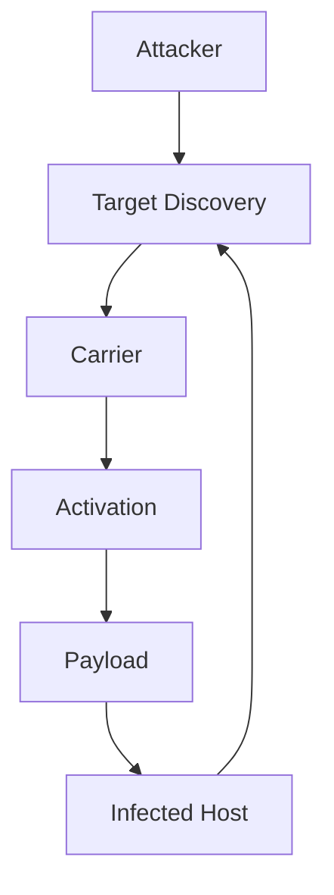
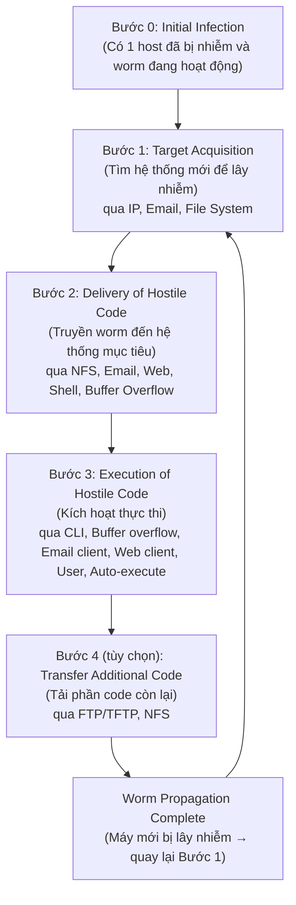

# Bài 4: Computer Worm: Cơ Chế Hoạt Động

## 1. Giới thiệu về Computer Worm

### Worm là gì?

Worm (sâu máy tính) là một loại phần mềm độc hại có khả năng **tự lan truyền** và **tự sao chép** mà không cần sự can thiệp của người dùng. Đây là điểm khác biệt cơ bản so với virus — virus cần đính kèm vào một file chủ, còn worm hoạt động độc lập.

!!! info "Định nghĩa"
    Worm là đoạn phần mềm lan truyền bằng cách khai thác lỗ hổng trong phần mềm/ứng dụng, có khả năng tự nhân bản và tự lan truyền qua Internet nhờ mô hình giao tiếp mở của mạng.

**Đặc điểm cốt lõi:**

- **Self-propagating (tự lan truyền):** Worm chủ động tìm kiếm và lây nhiễm sang máy chủ mới mà không cần sự giúp đỡ của người dùng (khác với virus).
- **Self-replicating (tự sao chép):** Worm tạo ra bản sao của chính nó trên hệ thống mục tiêu.
- **Lây lan qua Internet dễ dàng** nhờ vào mô hình giao tiếp mở (open communication model) của mạng.

---

## 2. Phân loại Worm

Worm được phân loại dựa trên **4 thành phần chính**:

```
1. Target Discovery  →  Cách worm tìm host mới để lây nhiễm
2. Carrier           →  Cách worm truyền bản thân đến mục tiêu
3. Activation        →  Cơ chế để worm thực thi trên mục tiêu
4. Payload           →  Hành động/mục tiêu mà worm thực hiện sau khi lây nhiễm
```



---

## 3. Target Discovery (Khám phá mục tiêu)

Đây là bước worm **tìm kiếm các host mới** để lây nhiễm. Có nhiều phương pháp khác nhau:

### 3.1 Scanning (Quét)

=== "Sequential Scanning"
    Quét tuần tự các địa chỉ IP theo thứ tự (ví dụ: 192.168.1.1, 192.168.1.2, ...). Dễ phát hiện vì tạo ra traffic bất thường theo pattern rõ ràng.

=== "Random Scanning"
    Quét ngẫu nhiên các địa chỉ IP trên Internet. Khó dự đoán hơn nhưng có thể tạo ra lượng traffic lớn bất thường.

### 3.2 Optimization (Tối ưu hóa quét)

- **Preference for local addresses:** Worm ưu tiên quét các địa chỉ trong cùng subnet vì các máy trong cùng mạng thường chạy cùng hệ điều hành và ứng dụng, do đó khả năng lây nhiễm cao hơn.
- **Permutation scanning:** Sử dụng phối hợp phân tán (distributed coordination) giữa nhiều host đã bị lây nhiễm để quét hiệu quả hơn, tránh quét trùng lặp.
- **Bandwidth-limited scanning:** Không chờ phản hồi từ mục tiêu, gửi gói tin và tiếp tục quét mục tiêu tiếp theo ngay lập tức — tăng tốc độ lan truyền đáng kể.

### 3.3 Pre-generated Target Lists (Danh sách mục tiêu được tạo trước)

Kẻ tấn công chuẩn bị sẵn danh sách địa chỉ IP của các mục tiêu tiềm năng trước khi phát tán worm. Điều này giúp worm tấn công chính xác và nhanh chóng hơn ngay từ đầu mà không cần mất thời gian quét.

### 3.4 Internal Target Lists (Danh sách mục tiêu nội bộ)

Worm **khám phá topology giao tiếp nội bộ** — tức là nó theo dõi các kết nối mà máy bị nhiễm đã thực hiện (ARP cache, DNS cache, file chia sẻ, ...) để tìm các host gần đó.

!!! warning "Nguy hiểm"
    Loại này **rất khó phát hiện** vì không tạo ra traffic quét bất thường. Để phát hiện, cần triển khai các sensor phân tán (highly distributed sensors) theo dõi hành vi bất thường trong nội bộ mạng.

### 3.5 Externally Generated Target Lists (Danh sách từ bên ngoài)

Sử dụng **metaserver** — các máy chủ bên ngoài lưu danh sách các server đang hoạt động (ví dụ: server game online). Worm tải danh sách này về và tấn công các host được liệt kê.

### 3.6 Passive Discovery (Khám phá thụ động)

Thay vì chủ động quét, worm **chờ nạn nhân tiếp cận nó**:

- Ví dụ: Trình duyệt chưa được vá lỗi (un-patched browser) kết nối đến web server đã bị nhiễm, và bị lây nhiễm qua JavaScript độc hại.
- **Contagion worms** dựa vào giao tiếp bình thường để lây lan — không tạo ra traffic bất thường trong giai đoạn target discovery, khiến chúng cực kỳ khó phát hiện.

---

## 4. Carrier (Phương tiện truyền tải)

Sau khi tìm được mục tiêu, worm cần **truyền bản thân đến hệ thống mục tiêu**:

=== "Self-Carried"
    Worm **tự chủ động truyền bản thân** sang mục tiêu như một phần của quá trình lây nhiễm. Đây là phương thức phổ biến nhất.

    *Ví dụ:* Code Red tự inject vào buffer của IIS và tự truyền sang host mới.

=== "Second Channel"
    Worm sử dụng **kênh giao tiếp thứ cấp** để tải phần còn lại của mình sau khi đã chiếm quyền kiểm soát ban đầu.

    *Ví dụ:* **Blaster worm** — kênh chính là RPC (Remote Procedure Call) để khai thác lỗ hổng, sau đó dùng **TFTP** (Trivial File Transfer Protocol) làm kênh thứ cấp để tải toàn bộ worm về.

=== "Embedded"
    Worm **nhúng bản thân vào luồng giao tiếp bình thường** — thêm vào hoặc thay thế các message bình thường (ví dụ: web request, email).

    - Thường được dùng bởi **passive worms**.
    - **Tàng hình cao** vì traffic trông như bình thường.

---

## 5. Activation (Kích hoạt)

Sau khi worm đã được truyền đến hệ thống mục tiêu, nó cần được **thực thi**:

### 5.1 Human Activation (Kích hoạt bởi người dùng)

Worm thuyết phục người dùng **tự thực thi** nó:

- **Chậm nhất** trong các phương thức kích hoạt.
- Thường qua email với file đính kèm hấp dẫn, hoặc file giả mạo.

!!! example "Ví dụ: MyDoom"
    MyDoom lan truyền qua email với tiêu đề hấp dẫn, khiến người dùng tự mở file đính kèm độc hại. Khi mở ra, worm tự sao chép và gửi email đến toàn bộ danh bạ.

!!! example "Ví dụ: ILOVEYOU (2000)"
    Email với tiêu đề "ILOVEYOU" và file đính kèm `LOVE-LETTER-FOR-YOU.TXT.vbs`. Người dùng nghĩ đây là file text nhưng thực ra là VBScript. Khi mở, worm gửi email đến toàn bộ danh bạ Outlook và ghi đè các file media.

### 5.2 Human Activity-Based Activation

Worm được kích hoạt khi người dùng thực hiện **một hành động thông thường không liên quan đến worm**:

- Khởi động lại máy (reset machine)
- Đăng nhập vào hệ thống (logging in)
- Scheduled process activation: Worm ẩn trong các chương trình auto-update không được ủy quyền (unauthorized auto-updater programs). Ví dụ: dùng DNS redirection attack để phục vụ file giả mạo đến máy tính.

### 5.3 Self Activation (Tự kích hoạt)

Worm **tự kích hoạt** bằng cách khai thác lỗ hổng trong các dịch vụ **luôn bật và sẵn có** (always-on services):

- Không cần bất kỳ sự tương tác nào từ người dùng.
- **Nhanh nhất** trong các phương thức kích hoạt.

*Ví dụ:* Code Red, Slammer, Sasser — tất cả đều tự kích hoạt bằng cách khai thác buffer overflow trong các dịch vụ mạng.

---

## 6. Payload (Tải trọng)

Payload là **hành động mà worm thực hiện** sau khi đã lây nhiễm thành công:

| Loại Payload | Mô tả | Ví dụ |
|---|---|---|
| Internet Remote Control | Biến máy nạn nhân thành bot dưới sự điều khiển của attacker | Botnet |
| Internet DoS | Sử dụng các máy bị nhiễm để thực hiện tấn công từ chối dịch vụ phân tán | DDoS attacks |
| Data Damage | Phá hủy hoặc làm hỏng dữ liệu | Chernobyl, Klez |
| Physical World Damage | Gây thiệt hại vật lý thực sự (phần cứng, cơ sở hạ tầng) | Stuxnet (không đề cập trong slide nhưng là ví dụ điển hình) |
| Human Control / Blackmail | Tống tiền nạn nhân | Ransomware precursor |

---

## 7. Động cơ của Kẻ Tấn Công (Attacker Motivations)

Tại sao kẻ tấn công tạo và phát tán worm?

=== "Cá nhân"
    - **Experimental Curiosity:** Tò mò thử nghiệm, muốn xem worm hoạt động như thế nào trong thực tế.
    - **Pride and Power:** Muốn thể hiện kỹ năng, khả năng gây hại, hoặc thu được quyền lực trong cộng đồng hacker.

=== "Kinh tế"
    - **Commercial Advantage:** Thu lợi bằng cách thao túng thị trường tài chính qua việc tạo ra thảm họa kinh tế nhân tạo.
    - **Extortion and Criminal Gain:** Đánh cắp thông tin thẻ tín dụng, tống tiền nạn nhân.

=== "Chính trị & Xã hội"
    - **Random Protest:** Phá vỡ mạng lưới và cơ sở hạ tầng để phản đối.
    - **Political Protest:** Tấn công có chủ đích vì lý do chính trị.
    - **Terrorism & Cyber Warfare:** Khủng bố mạng và chiến tranh không gian mạng giữa các quốc gia.

---

## 8. Lịch sử các Worm Nổi tiếng

### 8.1 Morris Worm (1988)

!!! info "Morris Worm — Worm đầu tiên quy mô lớn"
    - Lây nhiễm **6–10% toàn bộ host trên Internet** vào thời điểm đó.
    - Mục tiêu: Hệ thống **VAX và Sun Unix**.

| Thành phần | Chi tiết |
|---|---|
| Target Discovery | Quét subnet nội bộ (Topological) |
| Activation | Self Activation |
| Carrier | Self-Carried |
| Exploit | Buffer overflow trong dịch vụ `fingerd` |
| Payload | **Không có** — worm không chủ đích gây hại, nhưng sao chép quá nhiều làm hệ thống chậm và crash |

### 8.2 Code Red I (2001)

!!! danger "Code Red I — Tốc độ lây lan kinh hoàng"
    Ngày **19/7/2001**: Hơn **359.000 máy tính** bị lây nhiễm trong **chưa đầy 14 giờ**.

| Thành phần | Chi tiết |
|---|---|
| Target Discovery | Random Scanning |
| Activation | Self Activation |
| Carrier | Self-Carried |
| Exploit | Buffer overflow trong **Microsoft IIS Web Server** (Indexing Service) |
| Payload | Defacement website (hiển thị "Hacked by Chinese") |

**Lịch trình hoạt động của Code Red:**

```
Ngày 1–19 mỗi tháng:
  → Hiển thị thông báo "HELLO! Welcome to http://www.worm.com!" 
    trên các server tiếng Anh
  → Cố gắng lây nhiễm 100 máy ngẫu nhiên đồng thời (100 threads)

Ngày 20–27:
  → Dừng lan truyền
  → Tấn công DoS vào địa chỉ IP của www1.whitehouse.gov
```

**Hai phiên bản:**

=== "Code Red I v1 (12/7/2001)"
    - Dùng **static seed** cho bộ sinh số ngẫu nhiên.
    - Mỗi máy bị nhiễm luôn cố gắng lây nhiễm **cùng một tập địa chỉ IP**.
    - Kết quả: Lan truyền chậm, không gây hại lớn.
    - Memory-resident (chỉ tồn tại trong RAM, mất sau khi reboot).

=== "Code Red I v2 (19/7/2001)"
    - Dùng **random seed** → mỗi lần khởi động chọn tập IP khác nhau.
    - Kết quả: Lây lan cực kỳ nhanh — **2.000 host/phút** vào đỉnh điểm lúc 16:00 UTC.
    - Tăng trưởng theo hàm mũ từ 11:00–16:00 UTC.

### 8.3 Nimda (18/9/2001)

!!! warning "Nimda — Worm đa phương thức"
    Gây thiệt hại **530 triệu USD** chỉ trong tuần đầu tiên.

| Thành phần | Chi tiết |
|---|---|
| Target Discovery | Scanning + Email |
| Activation | Self Activation + User Action |
| Carrier | Self-Carried |
| Exploit | Microsoft IIS buffer overflow + nhiều vector khác |
| Payload | Defacement website |

**5 phương thức lan truyền của Nimda:**

1. **Tấn công IIS server** thông qua các client bị nhiễm (khai thác buffer overflow).
2. **Gửi email** đến danh bạ với file đính kèm là bản sao của worm.
3. **Sao chép qua network share** mở (open network shares).
4. **Chỉnh sửa web page** trên server bị nhiễm — nhúng JavaScript độc hại để lây sang client khi họ duyệt web.
5. **Quét backdoor** mà Code Red II để lại.

!!! note "Điểm đáng chú ý"
    Nimda có khả năng **lan truyền qua firewall** nhờ sử dụng nhiều vector tấn công khác nhau.

### 8.4 SQL Slammer / Sapphire (2003)

!!! danger "SQL Slammer — Worm nhanh nhất từng được ghi nhận"

| Đặc điểm | Chi tiết |
|---|---|
| Kích thước | Chỉ **376 bytes** — toàn bộ worm nằm trong **1 gói UDP duy nhất** |
| Exploit | Buffer overflow trong **MS SQL Server** |
| Giao thức | **UDP** (connectionless) thay vì TCP — không cần handshake |
| Tốc độ lây lan | **75.000+ host trong 10 phút** |
| Tốc độ đỉnh | Nhân đôi mỗi **8,5 giây** trong phút đầu tiên |
| Scanning rate | Hơn **55 triệu lần quét/giây** sau 3 phút |

**So sánh với Code Red:**

```
SQL Slammer:  Nhân đôi mỗi 8,5 giây  → 75.000 host trong 10 phút
Code Red:     Nhân đôi mỗi 37 phút   → 359.000 host trong 14 giờ

Slammer nhanh hơn Code Red khoảng 100 lần (2 bậc độ lớn)
```

!!! note "Tại sao dùng UDP?"
    UDP là connectionless — worm chỉ cần **gửi gói tin và quên đi**, không cần chờ TCP handshake (SYN-SYN/ACK-ACK). Điều này giúp tốc độ quét tăng lên đột biến. Nhược điểm: không đảm bảo gói tin đến nơi, nhưng với worm thì điều đó không quan trọng.

### 8.5 Witty (2004)

- **19/3/2004** — Khai thác buffer overflow trong module **ISS PAM** (Internet Security Systems Passive Analysis Module).
- Một gói UDP duy nhất khai thác lỗ hổng trong quá trình phân tích thụ động của các sản phẩm ISS.
- Worm "bandwidth-limited" tương tự Slammer.
- Chỉ có **12.000 host dễ bị tấn công** — toàn bộ bị lây nhiễm trong **75 phút**.
- **Payload nguy hiểm:** Từ từ làm hỏng các block ngẫu nhiên trên ổ đĩa.
- **Điều bất thường:** Phân tích telescope cho thấy worm được **nhắm mục tiêu vào một căn cứ quân sự Mỹ** và được phát tán từ một tài khoản ISP bán lẻ ở châu Âu.

### 8.6 SASSER Worm (2004)

- **29/4/2004** — Khai thác buffer overflow trong **Windows LSASS** (Local Security Authority Subsystem Service).
- Target Discovery: Quét ngẫu nhiên **TCP port 445**, có thể quét đến **1.024 địa chỉ đồng thời**.
- Payload: Có tiềm năng cài **rootkit** và **leo thang đặc quyền** (privilege escalation).

---

## 9. Mô hình Lan truyền Tổng quát



### Chi tiết từng bước:

**Bước 0 — Initial Infection:**
Mô hình bắt đầu với giả định đã tồn tại ít nhất **một hệ thống bị nhiễm** và worm đang hoạt động trên đó (patient zero).

**Bước 1 — Target Acquisition:**
Worm tìm kiếm các hệ thống mới để lây nhiễm qua:
- (a) Địa chỉ IP (scanning)
- (b) Địa chỉ Email (danh bạ)
- (c) File system traversal (duyệt file system để tìm host kết nối)

Ngoài ra, worm có thể **thụ động nhắm mục tiêu client** — ví dụ nội dung web bị trojaned trên server nhiễm Nimda.

**Bước 2 — Delivery of Hostile Code:**
Sau khi xác định mục tiêu, worm truyền bản thân qua:
- (a) Network file systems
- (b) Email
- (c) Web clients
- (d) Remote command shell
- (e) Payload của gói tin trong buffer overflow (như Slammer)

**Bước 3 — Execution of Hostile Code:**
Chỉ có code trên hệ thống là chưa đủ — cần được thực thi:
- (a) Gọi trực tiếp từ command line
- (b) Buffer overflow hoặc tấn công lập trình khác
- (c) Email clients
- (d) Web clients
- (e) User intervention (người dùng tự chạy)
- (f) Automatic execution (hệ thống tự chạy)

**Bước 4 — Transfer Additional Code (tùy chọn):**
Một số worm chỉ truyền một phần code ở bước 2 (ví dụ: shellcode nhỏ). Sau khi chiếm quyền, chúng tải phần còn lại qua:
- (a) FTP/TFTP
- (b) Network file systems

---

## 10. Benchmarks và Metrics Đánh giá Worm

Để đánh giá mức độ nghiêm trọng và hiệu quả của các biện pháp phòng chống:

| Metric | Mô tả |
|---|---|
| **Infection Size** | Phần trăm số node bị lây nhiễm trên tổng số host |
| **Reaction Time** | Thời gian từ khi phát hiện worm đến khi triển khai biện pháp kiểm soát — càng thấp càng tốt |
| **Penetration Ratio** | Số node bị lây nhiễm so với tổng số node trong domain khả dĩ — liên quan đến infection ratio |
| **False Positives/Negatives** | Tỷ lệ cảnh báo sai (false positive: cảnh báo nhầm) và bỏ sót (false negative: không phát hiện được worm thật) |

---

## Câu hỏi Trắc nghiệm

**Câu 1.** Điểm khác biệt chính giữa worm và virus là gì?

- A. Worm nguy hiểm hơn virus
- B. Worm có khả năng tự lan truyền mà không cần đính kèm vào file chủ
- C. Virus có thể lây qua mạng còn worm thì không
- D. Worm chỉ tấn công hệ điều hành Windows

??? info "Đáp án & Giải thích"
    **Đáp án: B**
    
    Worm là "self-propagating" — tự lan truyền mà không cần file chủ (host file). Virus phải đính kèm vào một file hoặc chương trình khác để lây lan. Đây là định nghĩa cơ bản nhất phân biệt hai loại mã độc này.

---

**Câu 2.** Trong phân loại worm, "Target Discovery" đề cập đến điều gì?

- A. Loại payload mà worm mang theo
- B. Cách worm truyền bản thân đến mục tiêu
- C. Cách worm tìm kiếm các host mới để lây nhiễm
- D. Cơ chế worm kích hoạt trên hệ thống mục tiêu

??? info "Đáp án & Giải thích"
    **Đáp án: C**
    
    Target Discovery là thành phần đầu tiên trong phân loại worm, mô tả cách worm xác định và tìm kiếm các host mới tiềm năng để lây nhiễm.

---

**Câu 3.** Permutation scanning là gì?

- A. Quét tuần tự các địa chỉ IP từ thấp đến cao
- B. Sử dụng phối hợp phân tán giữa nhiều host bị nhiễm để quét hiệu quả hơn
- C. Chỉ quét các địa chỉ IP trong cùng subnet
- D. Không chờ phản hồi từ mục tiêu khi quét

??? info "Đáp án & Giải thích"
    **Đáp án: B**
    
    Permutation scanning sử dụng distributed coordination — nhiều instance của worm trên nhiều host phối hợp với nhau để tránh quét trùng lặp và bao phủ không gian địa chỉ IP hiệu quả hơn.

---

**Câu 4.** "Bandwidth-limited scanning" có đặc điểm gì?

- A. Giới hạn băng thông mạng mà worm sử dụng
- B. Chỉ quét trong giờ thấp điểm để tránh bị phát hiện
- C. Không chờ phản hồi từ mục tiêu, gửi và quét tiếp ngay
- D. Quét giới hạn trong một dải băng thông IP nhất định

??? info "Đáp án & Giải thích"
    **Đáp án: C**
    
    Bandwidth-limited scanning có nghĩa là worm gửi gói quét và không chờ phản hồi — nó tiếp tục quét mục tiêu tiếp theo ngay lập tức. Điều này tối đa hóa tốc độ quét nhưng tên có thể gây nhầm lẫn. SQL Slammer là ví dụ điển hình.

---

**Câu 5.** Loại Target Discovery nào khó phát hiện nhất và tại sao?

- A. Random scanning — vì quét ngẫu nhiên
- B. Internal Target Lists — vì không tạo ra traffic quét bất thường
- C. Pre-generated Target Lists — vì danh sách được chuẩn bị trước
- D. Passive Discovery — vì chờ nạn nhân tự đến

??? info "Đáp án & Giải thích"
    **Đáp án: B (và D cũng rất khó)**
    
    Internal Target Lists khó phát hiện vì worm chỉ khai thác topology giao tiếp hiện có — không tạo traffic quét bất thường. Slide đề cập rằng để phát hiện loại này cần "highly distributed sensors". Passive/Contagion worms cũng rất khó vì "no anomalous traffic patterns during target discovery".

---

**Câu 6.** Contagion worm là gì?

- A. Worm lây qua tiếp xúc vật lý với thiết bị
- B. Worm dựa vào giao tiếp bình thường để phát hiện nạn nhân mới, không tạo traffic bất thường
- C. Worm gây ra các triệu chứng giống như bệnh truyền nhiễm trên máy tính
- D. Worm lây qua mạng nội bộ (LAN)

??? info "Đáp án & Giải thích"
    **Đáp án: B**
    
    Contagion worms thuộc nhóm Passive Discovery — chúng dựa vào giao tiếp bình thường của người dùng (như duyệt web, kết nối mạng) để lây lan sang máy mới, không tạo ra traffic quét bất thường.

---

**Câu 7.** Blaster worm sử dụng kênh nào làm kênh chính và kênh phụ?

- A. Kênh chính: TFTP; Kênh phụ: RPC
- B. Kênh chính: HTTP; Kênh phụ: FTP
- C. Kênh chính: RPC; Kênh phụ: TFTP
- D. Kênh chính: SMTP; Kênh phụ: HTTP

??? info "Đáp án & Giải thích"
    **Đáp án: C**
    
    Blaster worm sử dụng **RPC** (Remote Procedure Call) làm kênh chính để khai thác lỗ hổng, sau đó dùng **TFTP** (Trivial File Transfer Protocol) làm kênh thứ cấp để tải toàn bộ worm về máy nạn nhân. Đây là ví dụ điển hình của loại Carrier "Second Channel".

---

**Câu 8.** Loại Carrier nào được mô tả là "stealthy" (tàng hình) nhất?

- A. Self-Carried
- B. Second Channel
- C. Embedded
- D. Direct Transfer

??? info "Đáp án & Giải thích"
    **Đáp án: C**
    
    Embedded carrier nhúng bản thân vào luồng giao tiếp bình thường (web request, email), khiến traffic trông như bình thường. Slide mô tả đây là "relatively stealthy" và thường được dùng bởi passive worms.

---

**Câu 9.** Phương thức Activation nào chậm nhất?

- A. Self Activation
- B. Scheduled Process Activation
- C. Human Activation
- D. Human Activity-Based Activation

??? info "Đáp án & Giải thích"
    **Đáp án: C**
    
    Human Activation (thuyết phục người dùng tự thực thi worm) được mô tả là "the slowest activation approach" vì phụ thuộc vào hành vi của con người — người dùng phải mở email, click vào file đính kèm, v.v.

---

**Câu 10.** Phương thức Activation nào nhanh nhất?

- A. Human Activation
- B. Human Activity-Based Activation
- C. Scheduled Process Activation
- D. Self Activation

??? info "Đáp án & Giải thích"
    **Đáp án: D**
    
    Self Activation là "the fastest activation approach" vì worm tự khai thác lỗ hổng trong các dịch vụ luôn bật (always-on services) mà không cần bất kỳ tương tác người dùng nào.

---

**Câu 11.** MyDoom sử dụng phương thức Activation nào?

- A. Self Activation
- B. Human Activation
- C. Scheduled Process Activation
- D. Buffer Overflow Activation

??? info "Đáp án & Giải thích"
    **Đáp án: B**
    
    MyDoom là ví dụ điển hình của Human Activation — nó thuyết phục người dùng tự thực thi worm qua email với nội dung hấp dẫn.

---

**Câu 12.** Worm ILOVEYOU sử dụng file đính kèm có phần mở rộng gì?

- A. .exe
- B. .bat
- C. .vbs
- D. .com

??? info "Đáp án & Giải thích"
    **Đáp án: C**
    
    ILOVEYOU sử dụng file `LOVE-LETTER-FOR-YOU.TXT.vbs` — một VBScript ẩn sau phần mở rộng giả mạo `.TXT`. Khi Windows ẩn phần mở rộng đã biết, người dùng chỉ thấy `.TXT` và tưởng đây là file text vô hại.

---

**Câu 13.** Payload "Data Damage" được thực hiện bởi worm nào sau đây?

- A. Morris và Code Red
- B. Chernobyl và Klez
- C. Slammer và Sasser
- D. Nimda và Blaster

??? info "Đáp án & Giải thích"
    **Đáp án: B**
    
    Slide đề cập Chernobyl và Klez là ví dụ của payload Data Damage — phá hủy hoặc làm hỏng dữ liệu trên hệ thống bị nhiễm.

---

**Câu 14.** Morris Worm lây nhiễm bao nhiêu phần trăm host trên Internet?

- A. 1-2%
- B. 6-10%
- C. 15-20%
- D. 25-30%

??? info "Đáp án & Giải thích"
    **Đáp án: B**
    
    Morris Worm (1988) lây nhiễm 6-10% tất cả các host trên Internet vào thời điểm đó, mặc dù tổng số host còn rất nhỏ so với ngày nay. Đây là worm quy mô lớn đầu tiên trong lịch sử.

---

**Câu 15.** Morris Worm khai thác lỗ hổng nào?

- A. Buffer overflow trong IIS
- B. Buffer overflow trong dịch vụ fingerd
- C. SQL injection trong MS SQL Server
- D. Buffer overflow trong LSASS

??? info "Đáp án & Giải thích"
    **Đáp án: B**
    
    Morris Worm khai thác buffer overflow trong dịch vụ `fingerd` (finger daemon) trên hệ thống Unix. Đây là một trong những lỗ hổng bảo mật nổi tiếng đầu tiên được khai thác ở quy mô lớn.

---

**Câu 16.** Code Red I v2 lây nhiễm bao nhiêu máy tính trong vòng 14 giờ?

- A. 100.000
- B. 200.000
- C. 359.000
- D. 500.000

??? info "Đáp án & Giải thích"
    **Đáp án: C**
    
    Ngày 19/7/2001, Code Red I v2 lây nhiễm hơn 359.000 máy tính trong chưa đầy 14 giờ, với tốc độ đỉnh điểm là 2.000 host/phút lúc 16:00 UTC.

---

**Câu 17.** Sự khác biệt chính giữa Code Red I v1 và v2 là gì?

- A. v2 nhắm mục tiêu khác với v1
- B. v1 dùng static seed, v2 dùng random seed cho bộ sinh số ngẫu nhiên
- C. v2 có payload nguy hiểm hơn v1
- D. v1 chỉ tấn công Linux, v2 tấn công Windows

??? info "Đáp án & Giải thích"
    **Đáp án: B**
    
    Code Red I v1 dùng static seed nên mỗi máy bị nhiễm luôn cố lây nhiễm cùng tập IP → lan truyền chậm. v2 dùng random seed → mỗi khởi động chọn tập IP khác nhau → lan truyền nhanh và diện rộng hơn nhiều.

---

**Câu 18.** Code Red I tấn công DoS vào địa chỉ nào trong giai đoạn ngày 20-27?

- A. google.com
- B. microsoft.com
- C. www1.whitehouse.gov
- D. fbi.gov

??? info "Đáp án & Giải thích"
    **Đáp án: C**
    
    Trong giai đoạn ngày 20-27 hàng tháng, Code Red dừng lan truyền và tập trung tấn công DoS vào địa chỉ IP của `www1.whitehouse.gov` (White House website).

---

**Câu 19.** Nimda lan truyền qua bao nhiêu phương thức khác nhau?

- A. 2
- B. 3
- C. 4
- D. 5

??? info "Đáp án & Giải thích"
    **Đáp án: D**
    
    Nimda có 5 phương thức lan truyền: (1) tấn công IIS qua client bị nhiễm, (2) email tự gửi đến danh bạ, (3) sao chép qua network share, (4) chỉnh sửa web page nhúng JavaScript độc hại, (5) quét backdoor Code Red II.

---

**Câu 20.** Nimda gây thiệt hại bao nhiêu tiền chỉ trong tuần đầu tiên?

- A. 53 triệu USD
- B. 530 triệu USD
- C. 5,3 tỷ USD
- D. 53 tỷ USD

??? info "Đáp án & Giải thích"
    **Đáp án: B**
    
    Nimda gây thiệt hại 530 triệu USD chỉ trong tuần đầu tiên bùng phát (18/9/2001). Điều này một phần do Nimda tận dụng backdoor mà Code Red II để lại, giúp nó lây lan cực kỳ nhanh.

---

**Câu 21.** SQL Slammer (Sapphire) bao gồm bao nhiêu bytes code?

- A. 37 bytes
- B. 376 bytes
- C. 3.760 bytes
- D. 37.600 bytes

??? info "Đáp án & Giải thích"
    **Đáp án: B**
    
    SQL Slammer chỉ bao gồm 376 bytes code — toàn bộ worm nằm vừa trong một gói UDP duy nhất. Đây là một trong những worm nhỏ nhất và nhanh nhất từng được ghi nhận.

---

**Câu 22.** Tại sao SQL Slammer sử dụng UDP thay vì TCP?

- A. UDP an toàn hơn TCP
- B. UDP không cần quá trình bắt tay (handshake), cho phép gửi gói tin cực nhanh
- C. MS SQL Server chỉ hỗ trợ UDP
- D. TCP bị firewall chặn còn UDP thì không

??? info "Đáp án & Giải thích"
    **Đáp án: B**
    
    UDP là connectionless — không cần TCP three-way handshake (SYN-SYN/ACK-ACK). Worm chỉ cần gửi gói tin và tiếp tục quét mục tiêu tiếp theo ngay lập tức, đạt được tốc độ tối đa. Đây là lý do Slammer có thể đạt 55 triệu lần quét/giây.

---

**Câu 23.** SQL Slammer lây nhiễm bao nhiêu host trong 10 phút đầu tiên?

- A. 7.500
- B. 75.000
- C. 750.000
- D. 7.500.000

??? info "Đáp án & Giải thích"
    **Đáp án: B**
    
    SQL Slammer lây nhiễm hơn 75.000 host trong 10 phút, với tốc độ nhân đôi mỗi 8,5 giây trong phút đầu tiên.

---

**Câu 24.** So với Code Red, SQL Slammer nhanh hơn bao nhiêu bậc độ lớn?

- A. 1 bậc (10 lần)
- B. 2 bậc (100 lần)
- C. 3 bậc (1.000 lần)
- D. 4 bậc (10.000 lần)

??? info "Đáp án & Giải thích"
    **Đáp án: B**
    
    Slide nêu rõ: Slammer nhanh hơn Code Red "two orders of magnitude" (2 bậc độ lớn = ~100 lần). Code Red nhân đôi mỗi 37 phút, Slammer nhân đôi mỗi 8,5 giây.

---

**Câu 25.** Worm nào được phát hiện nhắm mục tiêu vào một căn cứ quân sự Mỹ?

- A. Sasser
- B. Slammer
- C. Witty
- D. Nimda

??? info "Đáp án & Giải thích"
    **Đáp án: C**
    
    Phân tích telescope (network telescope) cho thấy Witty worm (2004) được nhắm mục tiêu vào một căn cứ quân sự Mỹ và được phát tán từ một tài khoản ISP bán lẻ ở châu Âu, gợi ý đây là một cuộc tấn công có chủ đích.

---

**Câu 26.** SASSER worm khai thác dịch vụ nào của Windows?

- A. IIS (Internet Information Services)
- B. RPC (Remote Procedure Call)
- C. LSASS (Local Security Authority Subsystem Service)
- D. SMB (Server Message Block)

??? info "Đáp án & Giải thích"
    **Đáp án: C**
    
    SASSER khai thác buffer overflow trong Windows **LSASS** (Local Security Authority Subsystem Service) — dịch vụ xử lý xác thực người dùng trên Windows.

---

**Câu 27.** SASSER quét bao nhiêu địa chỉ IP đồng thời?

- A. 100
- B. 512
- C. 1.024
- D. 2.048

??? info "Đáp án & Giải thích"
    **Đáp án: C**
    
    SASSER có thể quét đến **1.024 địa chỉ đồng thời** trên TCP port 445, giúp nó lan truyền nhanh chóng.

---

**Câu 28.** Bước nào trong mô hình lan truyền worm là tùy chọn (không phải lúc nào cũng có)?

- A. Bước 1: Target Acquisition
- B. Bước 2: Delivery of Hostile Code
- C. Bước 3: Execution of Hostile Code
- D. Bước 4: Transfer of Additional Code

??? info "Đáp án & Giải thích"
    **Đáp án: D**
    
    Bước 4 (Transfer Additional Code) là tùy chọn — chỉ áp dụng khi worm chỉ truyền một phần code nhỏ (ví dụ: shellcode) trong bước 2 và cần tải phần còn lại sau khi đã chiếm quyền kiểm soát. Nhiều worm (như Slammer) truyền toàn bộ code trong một gói tin duy nhất.

---

**Câu 29.** Trong bước Delivery of Hostile Code, code được truyền qua con đường nào?

- A. Chỉ qua email
- B. Chỉ qua buffer overflow
- C. NFS, Email, Web client, Remote shell, Packet payload của buffer overflow
- D. Chỉ qua mạng nội bộ

??? info "Đáp án & Giải thích"
    **Đáp án: C**
    
    Delivery có thể xảy ra qua nhiều con đường: (a) Network file systems, (b) Email, (c) Web clients, (d) Remote command shell, (e) Packet payload của buffer overflow và các exploit lập trình tương tự.

---

**Câu 30.** "Penetration Ratio" trong benchmarks đo lường điều gì?

- A. Tốc độ worm xâm nhập vào hệ thống
- B. Số node bị lây nhiễm so với tổng số node trong domain khả dĩ
- C. Mức độ nguy hiểm của payload
- D. Thời gian để worm vượt qua firewall

??? info "Đáp án & Giải thích"
    **Đáp án: B**
    
    Penetration Ratio là tỷ lệ giữa số node thực tế bị lây nhiễm so với tổng số node trong toàn bộ "possible domain" (domain khả dĩ). Metric này liên quan đến Infection Size/Ratio.

---

**Câu 31.** "Reaction Time" trong context worm defense có nghĩa là gì?

- A. Thời gian worm phản ứng với các biện pháp chống đỡ
- B. Thời gian từ khi phát hiện worm đến khi triển khai biện pháp kiểm soát
- C. Thời gian worm cần để lây nhiễm một host mới
- D. Tốc độ phản hồi của hệ thống bị nhiễm

??? info "Đáp án & Giải thích"
    **Đáp án: B**
    
    Reaction Time là khoảng thời gian giữa thời điểm phát hiện worm và thời điểm triển khai các biện pháp kiểm soát (patch, block, quarantine). Reaction Time càng ngắn thì càng tốt vì worm lan truyền rất nhanh.

---

**Câu 32.** Động cơ nào sau đây KHÔNG được đề cập trong slide là lý do kẻ tấn công tạo worm?

- A. Experimental Curiosity
- B. Commercial Advantage
- C. Revenge (Trả thù cá nhân)
- D. Political Protest

??? info "Đáp án & Giải thích"
    **Đáp án: C**
    
    Slide liệt kê: Experimental Curiosity, Pride and Power, Commercial Advantage, Extortion and Criminal Gain, Random Protest, Political Protest, Terrorism, Cyber Warfare. "Revenge" (trả thù cá nhân) không được đề cập.

---

**Câu 33.** Worm nào đầu tiên trong lịch sử nhắm vào hệ thống Unix quy mô lớn?

- A. Code Red
- B. Morris Worm
- C. Nimda
- D. Slammer

??? info "Đáp án & Giải thích"
    **Đáp án: B**
    
    Morris Worm (1988) là worm quy mô lớn đầu tiên nhắm vào hệ thống VAX và Sun Unix. Đây được coi là worm đầu tiên trong lịch sử internet.

---

**Câu 34.** Payload của Morris Worm là gì?

- A. Xóa file hệ thống
- B. Defacement website
- C. Không có payload
- D. Đánh cắp mật khẩu

??? info "Đáp án & Giải thích"
    **Đáp án: C**
    
    Morris Worm không có payload cố ý — mục đích ban đầu của tác giả được cho là thực nghiệm. Tuy nhiên, do lỗi lập trình, worm tự sao chép quá nhiều lần, làm quá tải hệ thống và gây crash.

---

**Câu 35.** Witty worm có payload như thế nào?

- A. Xóa toàn bộ ổ đĩa ngay lập tức
- B. Từ từ làm hỏng các block ngẫu nhiên trên ổ đĩa
- C. Defacement website
- D. Không có payload

??? info "Đáp án & Giải thích"
    **Đáp án: B**
    
    Witty worm có payload là "slowly corrupt random disk blocks" — từ từ làm hỏng các block ngẫu nhiên trên ổ đĩa. Đây là payload nguy hiểm vì gây hỏng dữ liệu không thể phục hồi nhưng khó phát hiện ngay.

---

**Câu 36.** Witty worm khai thác lỗ hổng trong sản phẩm của công ty nào?

- A. Microsoft
- B. Cisco
- C. Internet Security Systems (ISS)
- D. Oracle

??? info "Đáp án & Giải thích"
    **Đáp án: C**
    
    Witty khai thác buffer overflow trong module **ISS PAM** (Internet Security Systems Passive Analysis Module) — một sản phẩm bảo mật của công ty ISS. Đây là trường hợp thú vị khi chính sản phẩm bảo mật lại có lỗ hổng.

---

**Câu 37.** Nimda khai thác backdoor của worm nào trước đó?

- A. Morris Worm
- B. Slammer
- C. Code Red II
- D. Blaster

??? info "Đáp án & Giải thích"
    **Đáp án: C**
    
    Một trong 5 phương thức lan truyền của Nimda là "scanning for Code Red II backdoor" — quét và khai thác các backdoor mà Code Red II đã để lại trên các hệ thống bị nhiễm trước đó.

---

**Câu 38.** Phương thức truyền tải "Second Channel" trong worm hoạt động như thế nào?

- A. Dùng hai giao thức khác nhau đồng thời để tăng tốc độ truyền
- B. Khai thác kênh chính để chiếm quyền, sau đó dùng kênh thứ cấp để tải phần code còn lại
- C. Truyền qua hai mạng vật lý khác nhau
- D. Mã hóa kép dữ liệu truyền tải

??? info "Đáp án & Giải thích"
    **Đáp án: B**
    
    Second Channel: kênh chính (ví dụ RPC của Blaster) được dùng để khai thác lỗ hổng và chiếm quyền kiểm soát ban đầu. Sau đó, kênh thứ cấp (TFTP của Blaster) được dùng để tải toàn bộ phần code worm về máy nạn nhân.

---

**Câu 39.** Tại sao Externally Generated Target Lists (từ metaserver) hiệu quả?

- A. Vì metaserver chứa danh sách tất cả IP trên Internet
- B. Vì danh sách từ metaserver chỉ gồm các server đang hoạt động thực sự, tránh lãng phí
- C. Vì metaserver được mã hóa nên không bị phát hiện
- D. Vì loại này quét nhanh nhất

??? info "Đáp án & Giải thích"
    **Đáp án: B**
    
    Metaserver (như server theo dõi game online) lưu danh sách các server đang thực sự hoạt động tại thời điểm đó. Worm tải danh sách này về và chỉ tấn công các target "sống" — hiệu quả hơn quét ngẫu nhiên vì không lãng phí thời gian vào IP không tồn tại.

---

**Câu 40.** Code Red I khai thác lỗ hổng nào trong IIS?

- A. SQL injection trong database IIS
- B. Buffer overflow trong Indexing Service của Microsoft IIS
- C. Cross-site scripting trong web interface IIS
- D. Directory traversal trong FTP service của IIS

??? info "Đáp án & Giải thích"
    **Đáp án: B**
    
    Code Red khai thác buffer overflow trong **Indexing Service** (dịch vụ lập chỉ mục) của Microsoft IIS Web Server — cụ thể là lỗ hổng trong file `idq.dll`.

---

**Câu 41.** Tại sao Code Red là "memory resident"?

- A. Vì nó chỉ tấn công RAM của máy tính
- B. Vì toàn bộ worm chỉ tồn tại trong RAM, không ghi ra ổ đĩa, và biến mất khi reboot
- C. Vì nó chiếm dụng toàn bộ bộ nhớ của máy bị nhiễm
- D. Vì nó được lưu trữ trong bộ nhớ đệm (cache) của router

??? info "Đáp án & Giải thích"
    **Đáp án: B**
    
    "Memory resident" nghĩa là worm chỉ tồn tại trong RAM — không để lại dấu vết trên ổ đĩa. Khi máy khởi động lại, worm biến mất. Đây là lý do Code Red I v1 không lây lan mạnh — mỗi lần reboot, toàn bộ quần thể worm bị xóa và phải bắt đầu lại từ đầu.

---

**Câu 42.** Loại tấn công "Internet DoS" như payload của worm thực hiện điều gì?

- A. Tấn công vào hệ thống cơ sở dữ liệu Internet
- B. Sử dụng các máy bị nhiễm để thực hiện tấn công từ chối dịch vụ phân tán (DDoS)
- C. Làm chậm kết nối Internet của nạn nhân
- D. Tắt hoàn toàn dịch vụ DNS

??? info "Đáp án & Giải thích"
    **Đáp án: B**
    
    Internet DoS như payload của worm biến các máy bị nhiễm thành botnet và dùng chúng để tấn công DDoS (Distributed Denial of Service) vào mục tiêu được chỉ định — làm tê liệt dịch vụ của mục tiêu đó bằng lưu lượng khổng lồ.

---

**Câu 43.** Khi nói đến "False Positives" trong context phát hiện worm, điều đó có nghĩa là gì?

- A. Worm phát hiện được một host đã bị nhiễm trước đó
- B. Hệ thống phát hiện cảnh báo nhầm về một hoạt động bình thường là worm
- C. Worm cố tình tạo ra các tín hiệu giả để đánh lừa IDS
- D. Phát hiện đúng worm nhưng sai phiên bản

??? info "Đáp án & Giải thích"
    **Đáp án: B**
    
    False Positive là khi hệ thống phát hiện xâm nhập (IDS) cảnh báo về một hoạt động bình thường như thể đó là hoạt động của worm. False Negative là khi worm thực sự hoạt động nhưng hệ thống không phát hiện được.

---

**Câu 44.** Một worm "contagion" có đặc điểm nổi bật gì trong giai đoạn Target Discovery?

- A. Tạo ra lượng traffic khổng lồ trong thời gian ngắn
- B. Không tạo ra traffic bất thường vì dựa vào giao tiếp bình thường
- C. Chỉ lây lan trong mạng nội bộ
- D. Phải có sự hỗ trợ từ server bên ngoài

??? info "Đáp án & Giải thích"
    **Đáp án: B**
    
    Contagion worms đặc biệt nguy hiểm vì chúng dựa vào "normal communication" để lây lan — không tạo ra traffic quét bất thường trong giai đoạn target discovery, khiến chúng gần như vô hình đối với các hệ thống phát hiện dựa trên anomaly detection.

---

**Câu 45.** Nimda có thể lan truyền qua firewalls vì lý do gì?

- A. Nimda có khả năng hack firewall
- B. Nimda sử dụng nhiều vector tấn công khác nhau, một số vector có thể xuyên qua firewall
- C. Firewall không thể chặn UDP traffic
- D. Nimda sử dụng port 80 (HTTP) vốn thường được mở

??? info "Đáp án & Giải thích"
    **Đáp án: B**
    
    Nimda sử dụng 5 phương thức lan truyền khác nhau — email, web, network share, IIS exploit, Code Red II backdoor. Ngay cả khi firewall chặn một vài phương thức, các phương thức khác (như email qua SMTP hoặc web qua HTTP) vẫn có thể lọt qua.

---

**Câu 46.** Trong mô hình lan truyền worm, bước nào xảy ra TRƯỚC khi code được thực thi?

- A. Target Acquisition → Transfer Additional Code → Delivery of Hostile Code
- B. Target Acquisition → Delivery of Hostile Code → Execution of Hostile Code
- C. Delivery of Hostile Code → Target Acquisition → Execution of Hostile Code
- D. Execution of Hostile Code → Delivery of Hostile Code → Target Acquisition

??? info "Đáp án & Giải thích"
    **Đáp án: B**
    
    Thứ tự đúng: (1) Target Acquisition → (2) Delivery of Hostile Code → (3) Execution of Hostile Code → (4 tùy chọn) Transfer Additional Code. Worm phải tìm mục tiêu trước, rồi truyền code đến mục tiêu, rồi mới kích hoạt thực thi.

---

**Câu 47.** Tại sao "Preference for local addresses" là chiến lược tối ưu hóa hiệu quả trong Target Discovery?

- A. Vì địa chỉ local dễ scan hơn địa chỉ remote
- B. Vì các máy trong cùng subnet thường chạy cùng OS và ứng dụng, tăng khả năng thành công
- C. Vì local traffic không bị firewall chặn
- D. Vì local bandwidth luôn lớn hơn external bandwidth

??? info "Đáp án & Giải thích"
    **Đáp án: B**
    
    Slide giải thích: "Same OS and applications in a sub-network" — các máy trong cùng subnet thường được triển khai bởi cùng một tổ chức, chạy cùng hệ điều hành và phần mềm. Nếu worm khai thác lỗ hổng của một ứng dụng cụ thể, các máy trong cùng subnet có khả năng cao cũng có ứng dụng đó.

---

**Câu 48.** SQL Slammer đạt tốc độ scanning tối đa là bao nhiêu sau khoảng bao lâu?

- A. 55 triệu scans/giây sau khoảng 3 phút
- B. 55 triệu scans/giây sau khoảng 30 phút
- C. 5,5 triệu scans/giây sau khoảng 3 phút
- D. 5,5 tỷ scans/giây sau khoảng 3 giây

??? info "Đáp án & Giải thích"
    **Đáp án: A**
    
    Slide mô tả: Slammer đạt full scanning rate "over 55 million scans per second" sau khoảng 3 phút. Sau đó tốc độ tăng trưởng chậm lại vì băng thông mạng trở thành bottleneck.

---

**Câu 49.** Lý do tốc độ tăng trưởng của Slammer chậm lại sau khi đạt đỉnh là gì?

- A. Hết các host dễ bị tấn công
- B. Các hệ thống antivirus bắt đầu phát hiện và chặn
- C. Băng thông mạng trở thành bottleneck — không đủ băng thông cho worm hoạt động
- D. Worm tự giới hạn để tránh bị phát hiện

??? info "Đáp án & Giải thích"
    **Đáp án: C**
    
    Slide giải thích: "significant portions of the network did not have enough bandwidth to allow it to operate unhindered" — lượng traffic khổng lồ mà Slammer tạo ra vượt quá khả năng của nhiều phần của mạng, gây tắc nghẽn và làm chậm tốc độ lan truyền.

---

**Câu 50.** "Unauthorized auto-updater programs" được sử dụng như một ví dụ của loại Activation nào?

- A. Self Activation
- B. Human Activation
- C. Scheduled Process Activation
- D. Human Activity-Based Activation

??? info "Đáp án & Giải thích"
    **Đáp án: C**
    
    Slide đề cập "Scheduled process activation" và liệt kê "Unauthorized auto-updater programs" cùng với ví dụ DNS redirection attack để phục vụ file độc hại như là các ví dụ của loại kích hoạt này — worm được thực thi theo lịch trình hoặc qua các tiến trình tự động.

---

**Câu 51.** Worm nào sau đây không có payload nguy hiểm?

- A. Chernobyl
- B. Code Red
- C. Morris Worm
- D. Witty

??? info "Đáp án & Giải thích"
    **Đáp án: C**
    
    Morris Worm không có payload — slide ghi rõ "Payload: None". Mặc dù gây ra hậu quả nghiêm trọng (làm crash hệ thống do sao chép quá nhiều), đây là hậu quả không cố ý.

---

**Câu 52.** Sự kiện nào được mô tả trong slide như là "Internet DOS: paper's dream realized"?

- A. Slammer làm tê liệt Internet năm 2003
- B. Code Red tấn công White House website
- C. Morris Worm làm sập toàn bộ hệ thống Unix
- D. Nimda lan qua firewall

??? info "Đáp án & Giải thích"
    **Đáp án: A (ngụ ý)**
    
    "Internet DOS: paper's dream realized" trong mục Payload ám chỉ khái niệm tấn công DoS quy mô Internet — điều mà các nhà nghiên cứu từng lý thuyết hóa ("paper's dream") nhưng chưa thấy trong thực tế, cho đến khi các worm như Slammer và Code Red hiện thực hóa điều đó.

---

**Câu 53.** Phương thức Target Discovery nào phụ thuộc hoàn toàn vào hành vi của người dùng?

- A. Random Scanning
- B. Pre-generated Target Lists
- C. Passive Discovery (Contagion Worms)
- D. Permutation Scanning

??? info "Đáp án & Giải thích"
    **Đáp án: C**
    
    Passive Discovery (bao gồm contagion worms) hoàn toàn phụ thuộc vào hành vi người dùng để phát hiện mục tiêu mới — ví dụ người dùng tự trỏ trình duyệt đến trang web bị nhiễm, khi đó worm mới "biết" đến máy của họ.
