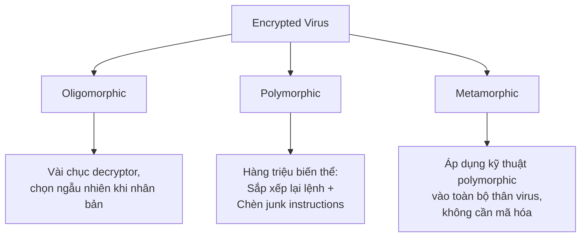
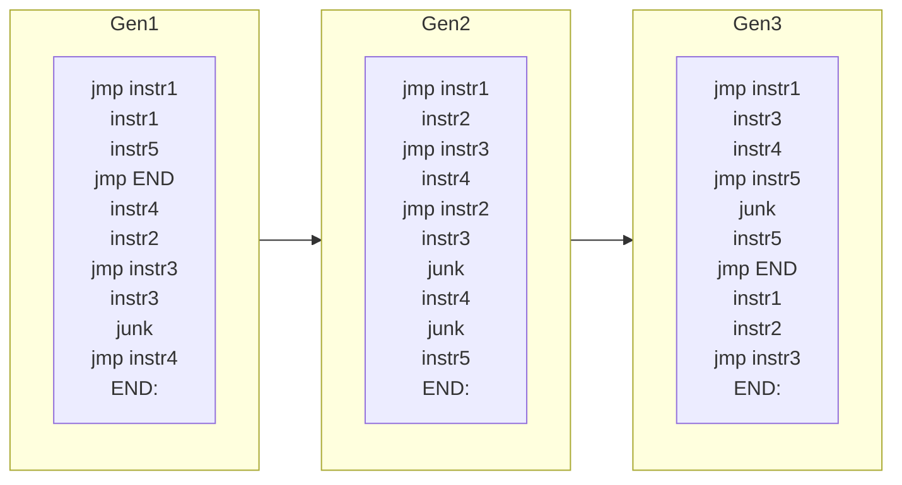

# Bài 6: Stealth Malware: Encrypted Viruses & Virus Obfuscation

## 1. Virus Mã Hóa (Encrypted Viruses)

### 1.1 Tại sao virus sử dụng mã hóa?

Virus mã hóa xuất hiện nhằm hai mục tiêu chính:

- **Chống phân tích (Anti-disassemble / Analysis-resistant):** Khiến cho việc đọc hiểu mã nguồn trở nên khó khăn, làm chậm quá trình phân tích của nhà nghiên cứu bảo mật.
- **Chống phát hiện (Anti-detection / Code-pattern detection resistant):** Làm cho các công cụ quét dựa trên chữ ký (signature-based) không thể nhận diện được mã độc vì phần thân virus đã bị mã hóa, không còn xuất hiện ở dạng plaintext.

!!! note "Quan trọng"
    Vì đoạn code giải mã (decryptor) luôn tồn tại ở dạng không mã hóa trong file, không có nhiều ý nghĩa khi chọn thuật toán mã hóa/giải mã phức tạp. Mục tiêu chính chỉ là làm chậm phân tích và đánh bại phát hiện dựa trên pattern, chứ không phải bảo mật tuyệt đối.

---

### 1.2 Mã hóa đơn giản (Simple Encryption)

Các virus mã hóa đầu tiên dùng thuật toán rất đơn giản, ví dụ điển hình là phép XOR giữa code với địa chỉ của nó.

**Virus Cascade** là virus mã hóa đầu tiên, sử dụng kỹ thuật XOR.

#### Tại sao XOR được ưa dùng?

XOR có hai đặc tính lý tưởng:

- **Tốc độ:** Cực nhanh ở cấp độ phần cứng.
- **Khả năng đảo ngược (Reversibility):** XOR hai lần với cùng một giá trị sẽ trả về giá trị ban đầu.

```
0xf247 XOR 0x0682 = 0xf4c5
0xf4c5 XOR 0x0682 = 0xf247
```

#### Ví dụ mã hóa thực tế (dựa trên Cascade)

Giả sử cần mã hóa đoạn code 4 byte tại địa chỉ `0x08084044`:

```
Code gốc:        0xc3c95f5e
XOR với địa chỉ: 0x08084044
XOR với độ dài:  0x00000004
─────────────────────────────
Kết quả mã hóa: 0xcbc11f1e
```

**Giải mã:**

```
Encrypted code:  0xcbc11f1e
XOR với độ dài:  0x00000004
XOR với địa chỉ: 0x08084044
─────────────────────────────
Code gốc:        0xc3c95f5e
```

---

### 1.3 Cấu trúc Decryptor (Bộ giải mã)

Decryptor là đoạn mã chạy trước, có nhiệm vụ giải mã phần thân virus trước khi thực thi. Nó luôn tồn tại ở dạng plaintext.

**Tóm tắt các bước hoạt động:**

=== "Bước mã hóa (Encryption)"

    1. Tìm một "cavity" (vùng trống) trong file đích và ghi nhớ địa chỉ của nó.
    2. Mã hóa toàn bộ thân virus dựa trên địa chỉ cavity và độ dài virus.
    3. Chèn (inject) thân virus đã mã hóa vào cavity đó.

=== "Bước giải mã (Decryption)"

    1. Nạp địa chỉ của đoạn virus code vào thanh ghi `ESI`.
    2. Nạp độ dài của virus vào `ESP`.
    3. Giải mã từng khối dựa trên giá trị `ESI` và `ESP`, ghi lại vào cavity.

!!! question "Tại sao dùng ESP để lưu độ dài virus?"
    Đây là một thủ thuật chống debug. Khi nhà phân tích cố gắng dùng debugger để theo dõi từng bước của decryptor, việc sử dụng stack pointer (`ESP`) sẽ gây rối loạn hầu hết các debugger thông thường vì ESP là thanh ghi cốt lõi để quản lý call stack.

    **Nhược điểm:** Chính lệnh `mov virus_length, %esp` lại trở thành một chữ ký đặc trưng (distinctive pattern / signature) nhận dạng virus Cascade.

---

### 1.4 Phân tích và phát hiện Virus mã hóa đơn giản

#### Cách phòng ngừa ở cấp OS

Hệ điều hành có thể ngăn ghi vào đoạn code thực thi (text segment). Virus có thể vượt qua bằng hai cách:

- **Workaround 1:** Giải mã vào một buffer trên stack hoặc heap, thay vì giải mã tại chỗ trong vùng text.
- **Workaround 2:** Thay đổi cờ (flag) của section `.text` thành writable.

#### Cách phát hiện tốt nhất

Phát hiện các **pattern của đoạn decryptor**, vì đây là phần không bị mã hóa. Ví dụ: lệnh đặc trưng `mov 0x0684, %esp` (độ dài 1668 byte của Cascade).

---

### 1.5 Mã hóa phức tạp hơn (Difficult Encryption)

**Ví dụ 1: Hai bộ mã hóa, hai bộ giải mã (Hai vòng, cùng loại)**

- Mã hóa: Encryptor 1 mã hóa thân virus, Encryptor 2 mã hóa tiếp theo thứ tự ngược lại.
- Giải mã: Cần hai decryptor chạy hai vòng.
- Hạn chế: Các decryptor vẫn có thể bị phát hiện.

**Ví dụ 2: Hai bộ mã hóa, hai bộ giải mã (Lồng nhau)**

- Encryptor 1 mã hóa **chính đoạn decryptor thứ hai**.
- Encryptor 2 mã hóa **thân virus**.
- Kết quả: Decryptor 1 giải mã ra Decryptor 2, rồi Decryptor 2 mới giải mã thân virus.
- Lợi thế: Phân tích tĩnh Decryptor 1 sẽ không có ích gì vì decryptor đó có thể rất phổ biến (xuất hiện cả trong phần mềm thương mại), gây khó khăn và cả false positive.

---

### 1.6 Phát hiện Virus Mã Hóa (Detecting Encrypted Viruses)

Vì thân virus được mã hóa, phương pháp phổ biến nhất là **phát hiện decryptor**.

**Các chỉ số nhận dạng decryptor:**

- **Vòng lặp chặt với lệnh XOR (Tight loops with XORs):** Tuy nhiên, nhiều virus khác nhau có thể dùng cùng thuật toán decryptor nhưng payload hoàn toàn khác nhau.
- **Độ dài virus đặc trưng (Unique virus length):** Tuy nhiên, virus có thể tự "đệm" thêm để có cùng độ dài với virus khác.

!!! warning "Nguy cơ False Positive"
    Một số phần mềm thương mại dùng wrapper chống reverse engineering trông giống hệt decryptor của Cascade. Điều này dẫn đến false positive khi quét.

**Vấn đề về phân bổ bộ nhớ:**

Khi OS chặn ghi trực tiếp vào text section, virus phải cấp phát bộ nhớ ở stack hoặc heap:

- **Cấp phát trên heap:** Cần code cấp phát không mã hóa → dễ phát hiện hơn (kết hợp lệnh malloc + lệnh giải mã = pattern tốt).
- **Cấp phát trên stack:** Ẩn tàng nhất, chỉ cần lệnh `sub $length, %esp`.

!!! question "DEP (Data Execution Prevention) có ngăn được virus không?"
    **Không.** OS cho phép user code thay đổi cờ thực thi (executable flag) của một memory page. Decryptor của virus có thể bao gồm một system call để bật cờ thực thi cho vùng stack/heap.

    Điểm khác biệt then chốt: Một phần virus (ví dụ decryptor) được chèn vào **text section** của file, nên nó luôn được thực thi. Buffer overflow injection thì chèn toàn bộ code vào stack/heap, nên DEP có thể ngăn chặn được.

**Các phương pháp phát hiện nâng cao:**

- **Emulation và Dynamic Analysis:** Hiệu quả nhưng tốn kém và thường là độc quyền.
- **Static Analysis + SDT (Software Dynamic Translation):** Một công cụ instrumentation có thể dump code ra sau khi giải mã xong. SDT decode chương trình vào một buffer khi nó chạy, cho phép kiểm tra code đã giải mã trong translation cache.

---

## 2. Tiến hóa của Virus Code (Virus Code Evolution)

Virus **Simile** là ví dụ điển hình về virus tiến hóa để đánh bại phát hiện dựa trên pattern. Mỗi lần nhân bản, nó tạo ra một chuỗi lệnh cấp phát bộ nhớ khác nhau trong decryptor thông qua các kỹ thuật obfuscation và sắp xếp lại code đơn giản, tránh bị phát hiện qua memory allocator code.

Phổ biến hơn là **đột biến chính đoạn decryptor** kết hợp dùng stack allocation.

---

### 2.1 Phân loại Virus theo Khả năng Đột biến Decryptor



---

## 3. Obfuscation (Làm rối code)

### 3.1 Khái niệm

Obfuscation là hành động cố ý tạo ra mã nguồn hoặc mã máy khó cho con người hiểu. Virus dùng obfuscation để vượt qua phần mềm diệt virus và cản trở phân tích thủ công. Mã hóa virus là một dạng obfuscation. Các dạng phức tạp hơn bao gồm: oligomorphic, polymorphic và metamorphic.

---

## 4. Oligomorphic Viruses

### 4.1 Khái niệm và lịch sử

Phát hiện virus mã hóa có decryptor đặc trưng là quá dễ dàng (theo quan điểm của người viết virus). Virus oligomorphic mang theo **vài chục decryptor** dưới dạng data; khi nhân bản, chọn một ngẫu nhiên, mã hóa thân virus với nó, rồi đặt cả thân virus lẫn decryptor vào file đích.

- **Whale:** Virus oligomorphic đầu tiên.
- **Memorial:** Virus oligomorphic trên Windows 95, tạo ra **96 decryptor** khác nhau, chọn một khi nhân bản.

### 4.2 Hạn chế

Mang theo nhiều decryptor làm tăng kích thước virus. Phát hiện 96 pattern khác nhau là một giải pháp không thực tế khi phải đối phó với hàng nghìn virus khác nhau, dẫn đến bùng nổ kích thước cơ sở dữ liệu pattern.

### 4.3 Phát hiện

Số lượng decryptor còn hạn chế nên vẫn có thể phát hiện bằng pattern matching. Tuy nhiên cần emulation, debugging, hoặc dynamic analysis để giải mã và phân tích thân virus.

---

## 5. Polymorphic Viruses

### 5.1 Khái niệm

Trong khi oligomorphic virus tạo ra hàng chục biến thể decryptor, **polymorphic virus tạo ra hàng triệu biến thể** bằng cách:

- **Sắp xếp lại lệnh (code rearrangements)**
- **Chèn các junk instruction (lệnh vô dụng)**

Virus polymorphic đầu tiên là **V2PX** (còn gọi là **1260**, vì chỉ có 1260 byte!), được tạo ra năm 1990 cho DOS.

---

### 5.2 Junk Instructions (Lệnh rác)

Junk instruction có thể là:

- Lệnh no-op (không làm gì)
- Lệnh sử dụng register hoặc memory không được dùng bởi decryptor

**Ví dụ decryptor gốc của Memorial:**

```asm
Decrypt:
    xor %al, (%esi)   ; giải mã 1 byte với key trong AL
    inc %esi          ; đến byte tiếp theo
    inc %al           ; trượt key
    dec %ecx          ; giảm bộ đếm
    jnz Decrypt       ; lặp lại nếu còn byte
```

**Sau khi chèn junk instructions:**

```asm
Decrypt:
    add %ebx, %edx    ; JUNK
    xor %al, (%esi)   ; giải mã byte với key trong AL
    dec %edx          ; JUNK
    inc %esi          ; đến byte tiếp theo
    mov (whocares), %edx ; JUNK
    inc %al           ; trượt key
    dec %ecx          ; giảm bộ đếm
    jnz Decrypt
```

**Biến thể khác với junk ở vị trí và lệnh khác nhau:**

```asm
Decrypt:
    add $4, %bh       ; JUNK
    xor %edx, %edx    ; JUNK
    xor %al, (%esi)   ; giải mã
    inc %esi          ; đến byte tiếp
    xchg %edx, %ebx   ; JUNK
    inc %al           ; trượt key
    cmp %ecx, %edx    ; JUNK
    dec %ecx          ; giảm bộ đếm
    jnz Decrypt
```

---

### 5.3 Instruction Variation (Biến thể lệnh)

Ngoài junk, có thể thay thế các lệnh bằng lệnh tương đương:

=== "Dùng inc/dec"

    ```asm
    inc %esi
    inc %al
    dec %ecx
    jnz Decrypt
    ```

=== "Dùng add/sub"

    ```asm
    add $1, %esi
    add $1, %al
    sub $1, %ecx
    jnz Decrypt
    ```

=== "Dùng loop"

    ```asm
    add $1, %esi
    add $1, %al
    loop Decrypt   ; ECX tự động giảm và kiểm tra bởi lệnh loop
    ```

---

### 5.4 Ví dụ: Virus 1260

Nhà nghiên cứu **Mark Washburn** tạo ra 1260 để chứng minh cho cộng đồng diệt virus thấy rằng các scanner dựa trên chuỗi ký tự (string-based) là không đủ. Ông đã chỉnh sửa virus Vienna hiện có, giới hạn junk instructions ở 39 byte, và thiết kế decryptor dễ sắp xếp lại thứ tự.

**Cấu trúc decryptor của 1260:**

Decryptor gồm 3 nhóm lệnh (group), mỗi nhóm có các lệnh có thể hoán đổi thứ tự cho nhau mà không ảnh hưởng kết quả:

- **Group 1 (Prologue):** 3 lệnh khởi tạo (mov key vào AX, mov offset vào DI, mov byte count vào CX)
- **Group 2 (Decryption loop body):** 2 lệnh giải mã (xor CX với [DI], xor AX với [DI])
- **Group 3 (Iteration):** 2 lệnh tăng con trỏ/key (inc DI, inc AX)
- **Lệnh loop:** không thuộc group nào, đứng cố định

Ngoài ra có **9 vị trí** có thể chèn junk instructions xuyên suốt decryptor.

**Số lượng biến thể:**

| Nguồn đa dạng | Số lượng |
|---|---|
| Sắp xếp lại lệnh trong nhóm | 3! × 2! × 2! = **24** biến thể |
| Vị trí chèn junk (9 vị trí, ~15 lệnh) | **Vài nghìn** cách |
| Lựa chọn lệnh junk (hàng trăm lệnh x86 + toán hạng) | **Hàng trăm nghìn** khả năng |
| **Tổng lý thuyết** | ~**1 tỷ** biến thể |

!!! info "Trên thực tế"
    Virus 1260 đơn giản hóa bằng cách chỉ cho phép tối đa 5 junk instructions mỗi vị trí và chỉ tạo ra vài trăm lệnh junk x86 có thể. Kết quả vẫn cho ra khoảng **1 triệu biến thể** từ một virus chỉ 1260 byte. Pattern-based detection là hoàn toàn vô vọng.

---

### 5.5 Register Replacement (Thay thế thanh ghi)

Đây là kỹ thuật polymorphic mà 1260 không sử dụng, nhưng rất hiệu quả. Nếu decryptor chỉ dùng 3 thanh ghi, virus có thể chọn bộ thanh ghi khác nhau cho từng lần nhân bản. Điều này thêm hàng chục biến thể nhân. Một decryptor chỉ 8 lệnh có thể tạo ra hơn **100 tỷ biến thể** chỉ bằng 4 kỹ thuật polymorphic đơn giản.

---

### 5.6 Polymorphic Mutation Engines

Việc tạo ra virus polymorphic hoạt động chính xác không mắc lỗi khi nhân bản là rất khó. Vì vậy, một số tác giả virus tạo ra **mutation engine** — công cụ biến virus mã hóa thông thường thành virus polymorphic.

**MtE (Dark Avenger Mutation Engine):** Engine đột biến đầu tiên, xuất hiện mùa hè 1991 tại Bulgaria.

MtE nhận đầu vào là: tham số về kích thước và vị trí file đích, con trỏ đến virus code cần mã hóa, con trỏ đến buffer để ghi output, bitmask cho biết thanh ghi nào cần tránh. Sau đó nó tạo ra polymorphic wrapper code bao quanh virus và nhân bản polymorphically.

MtE đặc biệt ở chỗ nó tạo ra nhiều **chuỗi obfuscation** để tính toán ra cùng một giá trị theo những cách cực kỳ khác nhau.

**Ví dụ MtE — đặt BP = 0x0d2b:**

```asm
mov $0xA16C, %bp
mov $0x03, %cl
ror %cl, %bp         ; Xoay phải BP 3 lần → BP = giá trị bí ẩn 1
mov %bp, %cx         ; Lưu vào CX
mov $0x856e, %bp
or  $0x740f, %bp     ; BP = giá trị bí ẩn 2
mov %bp, %si         ; Lưu vào SI
mov $0x3b92, %bp
add %si, %bp         ; BP := BP + giá trị bí ẩn 2
xor %cx, %bp         ; XOR với giá trị bí ẩn 1
sub $0xb10c, %bp     ; BP bây giờ có giá trị mong muốn (0x0d2b)
```

---

### 5.7 Phát hiện Polymorphic Viruses

Các scanner diệt virus vào 1990–1991 ban đầu không đối phó được. Giải pháp được thêm vào là **x86 virtual machine (emulator)** tích hợp trong scanner để giả lập một đoạn code ngắn, xem kết quả có khớp với decryptor đã biết không. Điều này thúc đẩy sự phát triển các **anti-emulation techniques** trong các virus "bọc giáp" (armored viruses).

Chìa khóa phát hiện: thân virus bắt buộc phải được giải mã về dạng plaintext tại một thời điểm nào đó. Do đó cần **dynamic analysis**; một SDT (Software Dynamic Translation) có thể chạy đến điểm giải mã rồi kiểm tra thân virus trong bộ nhớ SDT.

---

## 6. Metamorphic Viruses

### 6.1 Khái niệm

Metamorphic virus được định nghĩa là **body-polymorphic virus**: áp dụng kỹ thuật polymorphic cho **toàn bộ thân virus**, không chỉ decryptor. Không cần mã hóa để được xem là metamorphic. Thân virus thay đổi qua mỗi thế hệ, trở thành mục tiêu di động cho phân tích khi nó lan truyền.

---

### 6.2 Metamorphism: Source Code

Trên Unix/Linux, hầu như luôn có sẵn C compiler. Virus **Apparition** chèn các junk instruction ở cấp source code C vào virus rồi gọi trình biên dịch C. Lợi thế so với ASM level: tránh lỗi dùng nhầm register (vì compiler tự xử lý), và bản thân sự khác biệt giữa các phiên bản compiler, thư viện... đã tạo ra sự đa dạng thêm.

Trên Windows, virus **MSIL/Gastropod** hoạt động tương tự nhưng trên MSIL (Microsoft Intermediate Language), tận dụng .NET Framework để biên dịch.

---

### 6.3 Metamorphism: Register Replacement

Virus **Regswap** (Windows 95, tháng 12/1998) sử dụng metamorphism giới hạn trong việc thay thế thanh ghi.

**Hai thế hệ của Regswap:**

=== "Thế hệ 1"

    ```asm
    pop edx
    mov edi, 0004h
    mov esi, ebp
    mov eax, 000ch
    add edx, 0088h
    mov ebx, [edx]
    mov [esi+eax*4+1118], ebx
    ```

=== "Thế hệ 2"

    ```asm
    pop eax
    mov ebx, 0004h
    mov edx, ebp
    mov edi, 000ch
    add eax, 0088h
    mov esi, [eax]
    mov [edx+edi*4+1118], esi
    ```

**Phát hiện Regswap:** Dùng wildcard trong pattern scanner. Chỉ có các hex digit mã hóa thanh ghi là khác nhau. Cả hai biến thể đều khớp với pattern `5?B?04000000`.

---

### 6.4 Metamorphism: Module Permutation

Hoán đổi thứ tự các **module** (khối nhỏ) của virus. Hiệu quả nhất khi code được viết thành nhiều module nhỏ. 8 module tạo ra 8! = **40,320** hoán vị. Tuy nhiên, nếu dùng wildcard để che các địa chỉ và offset trong code, scanner vẫn có thể phát hiện bằng chuỗi tìm kiếm ngắn bên trong từng module.

---

### 6.5 Metamorphism: Instruction Permutation

Họ virus **Zperm** sắp xếp lại các lệnh riêng lẻ và chèn jump để giữ nguyên chức năng của code.

**Ba thế hệ Zperm:**



**Phát hiện:** Dùng SDT hoặc Phoenix Analysis Tool để "làm thẳng" (straighten) chuỗi jump thành straight-line code, rồi nhận dạng bằng pattern. Tuy nhiên, Zperm còn dùng thêm instruction replacement và junk insertion để thực sự metamorphic.

---

### 6.6 Metamorphism: Build-and-Execute

Virus **Zmorph** (đầu năm 2000) có cách tiếp cận độc đáo:

- Nhiều subroutine nhỏ được thêm vào cuối file PE.
- Chúng tạo thành một call chain.
- Mỗi subroutine là body-polymorphic (metamorphic).
- Mỗi subroutine xây dựng một đoạn virus code nhỏ trên stack.
- Khi xây dựng xong, điều khiển được chuyển đến vùng stack.
- Payload không bao giờ xuất hiện dưới dạng pattern thông thường trong file để scanner có thể quét.

---

### 6.7 Metamorphic Engines

Metamorphic engine là bộ nhân bản code có các heuristic tiến hóa tích hợp:

- Thay lệnh số học và load-store bằng lệnh tương đương
- Chèn junk instructions
- Sắp xếp lại lệnh
- Thay các hằng số nội tại bằng giá trị tính toán

**Đặc biệt:** Các hằng số nội tại (built-in constants) rất quan trọng với scanner dựa trên pattern. Engine biến đổi constants từ thế hệ này sang thế hệ khác khiến static analysis gần như bất lực.

**Ví dụ ba thế hệ do metamorphic engine tạo ra:**

=== "Thế hệ 1"

    ```asm
    mov dword ptr [esi], 55000000h
    mov dword ptr [esi+0004], 5151EC8Bh
    ```

=== "Thế hệ 2"

    ```asm
    mov edi, 55000000h        ; constant chưa thay đổi
    mov dword ptr [esi], edi
    pop edi                   ; junk
    push edx                  ; junk
    mov dh, 40h               ; junk
    mov edx, 5151EC8Bh        ; constant chưa thay đổi
    push ebx                  ; junk
    mov ebx, edx
    mov dword ptr [esi+0004], ebx
    ```

=== "Thế hệ 3"

    ```asm
    mov ebx, 5500000Fh        ; constant chưa thay đổi
    mov dword ptr [esi], ebx
    pop ebx                   ; junk
    push ecx                  ; junk
    mov ecx, 5FC000CBh        ; constant ĐÃ thay đổi
    add ecx, F191EBC0h        ; ECX bây giờ có giá trị gốc
    mov dword ptr [esi+0004], ecx
    ```

---

### 6.8 Điểm Yếu Chung của Metamorphic Viruses

Để biến đổi code qua từng thế hệ, metamorphic virus phải **tự phân tích lại** đoạn code đã biến đổi mà nó tạo ra. Điều này đòi hỏi phải dùng một số quy ước coding hoặc phát triển thuật toán đặc biệt để phát hiện chính các obfuscation của mình. Nghĩa là **trong chính cơ chế đột biến có một pattern**. Khi nhà nghiên cứu diệt virus phát hiện ra pattern đó, họ có thể dùng **Algorithmic Detection** — thuật toán đặc thù cho virus đó để trích xuất các lệnh quan trọng từ thân virus đã bị biến đổi.

---

## 7. Bảng Tổng Kết So Sánh

| Loại Virus | Cơ chế | Số biến thể | Phương pháp phát hiện |
|---|---|---|---|
| Simple Encrypted | XOR đơn giản, decryptor cố định | 1 (thay đổi theo địa chỉ) | Pattern matching trên decryptor |
| Oligomorphic | Mang sẵn ~vài chục decryptor | Vài chục | Pattern matching nhiều pattern + Emulation |
| Polymorphic | Tạo decryptor động với junk/reorder | Hàng triệu đến hàng tỷ | Emulation, SDT, Dynamic analysis |
| Metamorphic | Biến đổi toàn bộ thân virus | Vô số | Algorithmic detection, SDT |

---

## Câu Hỏi Trắc Nghiệm

**Câu 1.** Mục tiêu chính của việc mã hóa virus là gì?

- A. Giảm kích thước file virus
- B. Tăng tốc độ lây nhiễm
- C. Chống phân tích và chống phát hiện dựa trên pattern
- D. Bảo vệ code khỏi bị sao chép

??? info "Đáp án & Giải thích"
    **Đáp án: C**

    Mã hóa virus nhằm hai mục tiêu: Anti-disassemble (làm chậm phân tích) và Anti-detection (đánh bại phát hiện dựa trên code pattern). Kích thước và tốc độ lây nhiễm không phải mục tiêu của mã hóa.

---

**Câu 2.** Virus mã hóa đầu tiên trong lịch sử là?

- A. Simile
- B. Vienna
- C. Cascade
- D. Whale

??? info "Đáp án & Giải thích"
    **Đáp án: C**

    Cascade là virus mã hóa đầu tiên, sử dụng phép XOR để mã hóa/giải mã.

---

**Câu 3.** Tại sao XOR được sử dụng phổ biến trong mã hóa virus đơn giản?

- A. XOR là thuật toán phức tạp, khó bị phá vỡ
- B. XOR rất nhanh và có tính đảo ngược
- C. XOR tạo ra output ngẫu nhiên mỗi lần
- D. XOR không để lại dấu vết trong bộ nhớ

??? info "Đáp án & Giải thích"
    **Đáp án: B**

    XOR được ưa dùng vì tốc độ cao ở cấp phần cứng và tính đảo ngược: `A XOR K XOR K = A`. Không cần thuật toán phức tạp vì decryptor vẫn phải tồn tại ở dạng plaintext.

---

**Câu 4.** Trong ví dụ mã hóa Cascade, công thức mã hóa là gì?

- A. Code XOR Key = Encrypted
- B. Code XOR Address = Encrypted
- C. Code XOR Address XOR Length = Encrypted
- D. Code XOR Length = Encrypted

??? info "Đáp án & Giải thích"
    **Đáp án: C**

    Công thức là: `Code XOR Address XOR Length_of_code = Encrypted_code`. Việc dùng thêm địa chỉ làm cho pattern thay đổi theo từng file (file-dependent).

---

**Câu 5.** Tại sao hex patterns của Cascade là "file-dependent"?

- A. Vì virus thay đổi thuật toán mã hóa theo từng file
- B. Vì kết quả mã hóa phụ thuộc vào địa chỉ chèn virus, khác nhau giữa các file
- C. Vì virus đọc nội dung file để tạo key
- D. Vì mỗi file có độ dài khác nhau

??? info "Đáp án & Giải thích"
    **Đáp án: B**

    Vì công thức mã hóa dùng địa chỉ (address) của cavity, mỗi file có cavity ở địa chỉ khác nhau, nên cùng virus nhưng có pattern hex khác nhau trong từng file.

---

**Câu 6.** Tại sao Cascade dùng ESP để lưu độ dài virus?

- A. ESP là thanh ghi nhanh nhất trên x86
- B. Để cản trở việc debug bằng debugger thông thường
- C. Vì ESP có thể lưu trữ số nguyên lớn
- D. Để tránh dùng các thanh ghi general-purpose

??? info "Đáp án & Giải thích"
    **Đáp án: B**

    ESP là stack pointer, việc ghi đè ESP khiến hầu hết các debugger bị rối loạn vì chúng phụ thuộc vào ESP để theo dõi call stack. Tuy nhiên, lệnh `mov virus_length, %esp` lại tạo ra chữ ký đặc trưng cho Cascade.

---

**Câu 7.** Phương pháp tốt nhất để phát hiện virus mã hóa đơn giản là gì?

- A. Quét chữ ký trên thân virus đã mã hóa
- B. Phát hiện pattern của đoạn decryptor
- C. Kiểm tra kích thước file
- D. Theo dõi lưu lượng mạng

??? info "Đáp án & Giải thích"
    **Đáp án: B**

    Vì thân virus bị mã hóa không có pattern cố định, phương pháp tốt nhất là phát hiện decryptor — đoạn code luôn tồn tại ở dạng plaintext. Ví dụ: lệnh `mov 0x0684, %esp` là chữ ký của Cascade.

---

**Câu 8.** Khi OS ngăn ghi vào text section, virus mã hóa có thể làm gì?

- A. Dừng hoạt động
- B. Giải mã vào buffer trên stack/heap hoặc thay đổi cờ của section .text
- C. Gửi yêu cầu đến kernel để được cấp quyền
- D. Chỉ có thể hoạt động trên OS không có bảo vệ

??? info "Đáp án & Giải thích"
    **Đáp án: B**

    Có hai workaround: (1) giải mã vào buffer trên stack hoặc heap thay vì decrypt tại chỗ; (2) thay đổi flag của .text section thành writable.

---

**Câu 9.** DEP (Data Execution Prevention) có ngăn chặn virus mã hóa không?

- A. Có, DEP hoàn toàn ngăn chặn được
- B. Không, vì virus có thể dùng system call để bật cờ thực thi cho stack/heap
- C. Có, nếu virus không có decryptor
- D. Không, vì DEP chỉ áp dụng cho kernel mode

??? info "Đáp án & Giải thích"
    **Đáp án: B**

    OS cho phép user code thay đổi executable flag của memory page. Decryptor có thể gọi system call để enable executable flag cho stack/heap. DEP hiệu quả hơn với buffer overflow vì toàn bộ code injection ở stack/heap, còn virus có decryptor trong text section nên luôn được thực thi.

---

**Câu 10.** Mã hóa phức tạp dạng "hai bộ mã hóa lồng nhau" (Ví dụ 2) có lợi thế gì so với Ví dụ 1?

- A. Tạo ra nhiều biến thể hơn
- B. Decryptor 1 có thể giống phần mềm thương mại, gây khó phân tích và false positive
- C. Không cần decryptor
- D. Virus nhỏ hơn

??? info "Đáp án & Giải thích"
    **Đáp án: B**

    Trong Ví dụ 2, Decryptor 1 giải mã Decryptor 2, và Decryptor 1 có thể trông giống code bình thường (kể cả phần mềm thương mại có anti-debug wrapper), khiến phân tích tĩnh Decryptor 1 gần như vô nghĩa và dễ gây false positive.

---

**Câu 11.** Virus oligomorphic đầu tiên là gì?

- A. Cascade
- B. Whale
- C. Memorial
- D. Simile

??? info "Đáp án & Giải thích"
    **Đáp án: B**

    Whale là virus oligomorphic đầu tiên. Nó mang theo nhiều decryptor dưới dạng data và chọn một ngẫu nhiên khi nhân bản.

---

**Câu 12.** Virus Memorial tạo ra bao nhiêu decryptor khác nhau?

- A. 10
- B. 48
- C. 96
- D. 256

??? info "Đáp án & Giải thích"
    **Đáp án: C**

    Memorial là virus oligomorphic trên Windows 95 tạo ra 96 decryptor khác nhau, chọn một khi nhân bản.

---

**Câu 13.** Nhược điểm lớn nhất của virus oligomorphic là gì?

- A. Tốc độ lây nhiễm chậm
- B. Mang theo nhiều decryptor làm tăng kích thước virus
- C. Decryptor dễ bị phát hiện hơn
- D. Không thể mã hóa thân virus

??? info "Đáp án & Giải thích"
    **Đáp án: B**

    Mang theo vài chục đến hàng trăm decryptor dưới dạng data làm tăng đáng kể kích thước file virus.

---

**Câu 14.** Tại sao phát hiện 96 pattern cho Memorial là "không thực tế"?

- A. Các scanner không hỗ trợ nhiều hơn 10 pattern
- B. Phải đối phó với hàng nghìn virus, thêm 96 pattern sẽ gây bùng nổ kích thước database
- C. Các pattern của Memorial quá ngắn
- D. 96 pattern là quá ít để nhận diện chính xác

??? info "Đáp án & Giải thích"
    **Đáp án: B**

    Khi phải quản lý pattern cho hàng nghìn virus khác nhau, thêm 96 pattern chỉ cho một virus sẽ gây "pattern database size explosion" — bùng nổ kích thước cơ sở dữ liệu pattern.

---

**Câu 15.** Virus polymorphic đầu tiên là gì và được tạo ra năm nào?

- A. Cascade, 1988
- B. V2PX (1260), 1990
- C. MtE, 1991
- D. Simile, 1995

??? info "Đáp án & Giải thích"
    **Đáp án: B**

    V2PX, còn gọi là 1260 (chỉ 1260 byte), là virus polymorphic đầu tiên, được tạo ra năm 1990 cho DOS bởi Mark Washburn.

---

**Câu 16.** Đâu KHÔNG phải là junk instruction hợp lệ?

- A. Lệnh no-op
- B. Lệnh dùng register không được dùng bởi decryptor
- C. Lệnh XOR giải mã chính của decryptor
- D. Lệnh dùng memory location không liên quan

??? info "Đáp án & Giải thích"
    **Đáp án: C**

    Junk instruction phải là lệnh không ảnh hưởng đến chức năng của decryptor. Lệnh XOR giải mã chính là lệnh thiết yếu, không phải junk.

---

**Câu 17.** Virus 1260 có bao nhiêu nhóm lệnh (groups) trong decryptor?

- A. 2
- B. 3
- C. 4
- D. 9

??? info "Đáp án & Giải thích"
    **Đáp án: B**

    1260 có 3 nhóm: Group 1 (Prologue, 3 lệnh), Group 2 (Decryption, 2 lệnh), Group 3 (Iteration, 2 lệnh). Lệnh loop đứng riêng không thuộc group nào.

---

**Câu 18.** Số biến thể tạo ra chỉ từ việc sắp xếp lại lệnh trong các nhóm của 1260 là bao nhiêu?

- A. 12
- B. 24
- C. 48
- D. 120

??? info "Đáp án & Giải thích"
    **Đáp án: B**

    3! × 2! × 2! = 6 × 2 × 2 = **24** biến thể từ việc hoán đổi lệnh trong 3 nhóm (3 lệnh, 2 lệnh, 2 lệnh).

---

**Câu 19.** Trong 1260, có bao nhiêu vị trí có thể chèn junk instructions?

- A. 3
- B. 6
- C. 9
- D. 12

??? info "Đáp án & Giải thích"
    **Đáp án: C**

    Có 9 vị trí có thể chèn junk instructions xuyên suốt decryptor của 1260.

---

**Câu 20.** Về lý thuyết, 1260 có thể tạo ra bao nhiêu biến thể?

- A. ~1 triệu
- B. ~1 tỷ
- C. ~1 nghìn
- D. ~100 triệu

??? info "Đáp án & Giải thích"
    **Đáp án: B**

    Kết hợp 24 (reordering) × vài nghìn (vị trí junk) × hàng trăm nghìn (lựa chọn junk) = ~1 tỷ biến thể về lý thuyết. Thực tế 1260 đơn giản hóa còn ~1 triệu.

---

**Câu 21.** Kỹ thuật nào mà virus 1260 KHÔNG sử dụng?

- A. Sắp xếp lại lệnh trong nhóm
- B. Chèn junk instructions
- C. Register replacement
- D. Giới hạn kích thước junk ở 39 byte

??? info "Đáp án & Giải thích"
    **Đáp án: C**

    1260 không sử dụng register replacement. Nếu thêm kỹ thuật này, số biến thể sẽ tăng từ ~1 tỷ lên rất nhiều hơn.

---

**Câu 22.** Mark Washburn tạo ra virus 1260 nhằm mục đích gì?

- A. Tấn công hệ thống tài chính
- B. Chứng minh string-based scanner không đủ để nhận diện virus
- C. Kiểm tra hiệu năng phần cứng
- D. Nghiên cứu thuật toán mã hóa mới

??? info "Đáp án & Giải thích"
    **Đáp án: B**

    Washburn muốn chứng minh cho cộng đồng diệt virus thấy rằng các scanner dựa trên chuỗi ký tự (string-based / pattern-based) là không đủ để nhận diện virus.

---

**Câu 23.** Mutation engine MtE được tạo ra bởi ai và khi nào?

- A. Mark Washburn, 1990, Mỹ
- B. Dark Avenger, mùa hè 1991, Bulgaria
- C. Mark Ludwig, 1989, Đức
- D. Unknown, 1993, Nga

??? info "Đáp án & Giải thích"
    **Đáp án: B**

    MtE (Dark Avenger Mutation Engine) là mutation engine đầu tiên, được tạo ra mùa hè 1991 tại Bulgaria bởi Dark Avenger.

---

**Câu 24.** MtE nhận đầu vào là gì để tạo ra polymorphic wrapper?

- A. Chỉ cần thân virus
- B. Tham số kích thước, vị trí file, con trỏ virus, con trỏ buffer output, bitmask thanh ghi cần tránh
- C. Key mã hóa và thân virus
- D. Địa chỉ cavity và độ dài virus

??? info "Đáp án & Giải thích"
    **Đáp án: B**

    MtE là thiết kế modular, nhận nhiều tham số: kích thước và vị trí file đích, decryptor, con trỏ đến virus code cần mã hóa, con trỏ đến buffer output, bitmask cho biết thanh ghi nào cần tránh.

---

**Câu 25.** Kỹ thuật đặc biệt của MtE là gì ngoài chèn junk instructions?

- A. Sử dụng nhiều thuật toán mã hóa khác nhau
- B. Tạo nhiều chuỗi obfuscation tính cùng một giá trị theo cách rất khác nhau
- C. Thay đổi entry point của file
- D. Mã hóa decryptor thứ hai

??? info "Đáp án & Giải thích"
    **Đáp án: B**

    MtE tạo ra nhiều chuỗi obfuscation phức tạp để tính ra cùng một giá trị (ví dụ BP = 0x0d2b) theo những cách hoàn toàn khác nhau mỗi lần.

---

**Câu 26.** Cách scanner phát hiện polymorphic virus vào đầu thập niên 1990 là gì?

- A. Quét pattern trên toàn bộ file
- B. Thêm x86 virtual machine (emulator) để giả lập đoạn code ngắn
- C. So sánh hash của file
- D. Kiểm tra header của file PE

??? info "Đáp án & Giải thích"
    **Đáp án: B**

    Sau khi không đối phó được, scanner thêm x86 virtual machine (emulator) để giả lập các đoạn code ngắn và xác định xem kết quả có khớp với decryptor đã biết không.

---

**Câu 27.** Việc thêm emulator vào scanner dẫn đến hệ quả gì?

- A. Virus ngừng phát triển
- B. Thúc đẩy phát triển các kỹ thuật anti-emulation trong armored viruses
- C. Scanner trở nên hoàn hảo
- D. Virus chuyển sang tấn công mạng

??? info "Đáp án & Giải thích"
    **Đáp án: B**

    Việc emulator được thêm vào scanner thúc đẩy phát triển các kỹ thuật chống giả lập (anti-emulation) trong các "armored virus". Đây là cuộc chạy đua vũ trang liên tục giữa virus và antivirus.

---

**Câu 28.** Tại sao dynamic analysis là cần thiết để phát hiện polymorphic virus?

- A. Vì static analysis không thể đọc được file nhị phân
- B. Vì thân virus bắt buộc phải được giải mã về plaintext tại một thời điểm khi chạy
- C. Vì polymorphic virus chỉ hoạt động trong bộ nhớ
- D. Vì scanner không thể mở file bị mã hóa

??? info "Đáp án & Giải thích"
    **Đáp án: B**

    Chìa khóa là: thân virus bắt buộc phải được giải mã về dạng plaintext trước khi thực thi. Dynamic analysis (chạy thực tế hoặc emulate) có thể bắt được virus tại thời điểm đã giải mã xong.

---

**Câu 29.** Metamorphic virus khác gì so với polymorphic virus?

- A. Metamorphic dùng nhiều loại mã hóa hơn
- B. Metamorphic biến đổi toàn bộ thân virus, không chỉ decryptor; không cần mã hóa
- C. Metamorphic chỉ hoạt động trên Linux
- D. Metamorphic không thể nhân bản

??? info "Đáp án & Giải thích"
    **Đáp án: B**

    Polymorphic biến đổi decryptor; metamorphic biến đổi toàn bộ thân virus (body-polymorphic). Metamorphic không cần mã hóa để được phân loại là metamorphic.

---

**Câu 30.** Virus Apparition sử dụng kỹ thuật metamorphism nào?

- A. Register replacement
- B. Module permutation
- C. Source code metamorphism bằng C compiler
- D. Instruction permutation

??? info "Đáp án & Giải thích"
    **Đáp án: C**

    Apparition là source code metamorphic virus trên Unix/Linux, chèn junk variables ở cấp source code C rồi gọi C compiler để biên dịch.

---

**Câu 31.** Lợi thế của source code metamorphism so với ASM-level metamorphism là gì?

- A. Tạo ra nhiều biến thể hơn
- B. Tránh lỗi dùng nhầm register vì compiler tự xử lý; sự khác biệt compiler cũng tạo thêm đa dạng
- C. Không cần compiler trên máy nạn nhân
- D. Code nhỏ hơn

??? info "Đáp án & Giải thích"
    **Đáp án: B**

    Ở cấp ASM, metamorphic virus dễ mắc lỗi như dùng nhầm register đang được dùng ẩn bởi lệnh khác. Ở cấp source code, compiler tự lo việc phân bổ register, tránh được những lỗi này. Thêm vào đó, sự khác biệt giữa các phiên bản compiler và thư viện tạo thêm sự đa dạng miễn phí.

---

**Câu 32.** MSIL/Gastropod virus hoạt động như thế nào?

- A. Dùng C compiler để biên dịch lại virus
- B. Dùng .NET Framework để biên dịch MSIL (Microsoft Intermediate Language)
- C. Tự modify binary của chính nó
- D. Dùng PowerShell để tái tạo code

??? info "Đáp án & Giải thích"
    **Đáp án: B**

    MSIL/Gastropod là metamorphic virus trên Windows, hoạt động trên MSIL và tận dụng .NET Framework để biên dịch thành native code — tương tự Apparition nhưng dùng MSIL thay vì C.

---

**Câu 33.** Virus Regswap sử dụng kỹ thuật metamorphism nào?

- A. Junk instruction insertion
- B. Module permutation
- C. Register replacement
- D. Source code metamorphism

??? info "Đáp án & Giải thích"
    **Đáp án: C**

    Regswap (Windows 95, tháng 12/1998) sử dụng duy nhất kỹ thuật register replacement — thay thế tên các thanh ghi giữa các thế hệ.

---

**Câu 34.** Cách phát hiện Regswap là gì?

- A. Emulation
- B. Pattern scanner dùng wildcard để bỏ qua các byte mã hóa thanh ghi
- C. Hash comparison
- D. Behavioral analysis

??? info "Đáp án & Giải thích"
    **Đáp án: B**

    Vì chỉ có các byte mã hóa tên thanh ghi là khác nhau, scanner dùng wildcard (don't-cares) trong pattern có thể khớp cả hai biến thể. Ví dụ: `5?B?04000000` khớp cả hai thế hệ của Regswap.

---

**Câu 35.** 8 module tạo ra bao nhiêu hoán vị trong kỹ thuật module permutation?

- A. 256
- B. 5040
- C. 40320
- D. 362880

??? info "Đáp án & Giải thích"
    **Đáp án: C**

    8! = 8 × 7 × 6 × 5 × 4 × 3 × 2 × 1 = **40,320** hoán vị.

---

**Câu 36.** Kỹ thuật module permutation có thể bị vô hiệu hóa bằng cách nào?

- A. Emulation
- B. Dùng wildcard để che địa chỉ và offset trong các chuỗi tìm kiếm ngắn bên trong từng module
- C. Phân tích entropy
- D. Kiểm tra header file

??? info "Đáp án & Giải thích"
    **Đáp án: B**

    Scanner có thể tìm kiếm chuỗi ngắn bên trong từng module (không cần biết thứ tự module), dùng wildcard để bỏ qua các địa chỉ và offset thay đổi.

---

**Câu 37.** Họ virus Zperm sử dụng kỹ thuật gì?

- A. Source code metamorphism
- B. Register replacement thuần túy
- C. Sắp xếp lại lệnh riêng lẻ và chèn jump để giữ chức năng
- D. Module permutation

??? info "Đáp án & Giải thích"
    **Đáp án: C**

    Zperm dùng instruction permutation: sắp xếp lại thứ tự các lệnh riêng lẻ và chèn các lệnh jump để đảm bảo code vẫn thực thi đúng theo thứ tự mong muốn.

---

**Câu 38.** Cách phát hiện Zperm là gì và tại sao nó không hoàn toàn hiệu quả?

- A. Dùng SDT/Phoenix Analysis Tool để làm thẳng jump chain, nhưng Zperm còn dùng thêm instruction replacement và junk insertion
- B. Dùng emulation, và nó hoàn toàn hiệu quả
- C. Kiểm tra kích thước file, không hiệu quả vì Zperm thay đổi kích thước
- D. Pattern matching thông thường, không hiệu quả vì Zperm mã hóa toàn bộ

??? info "Đáp án & Giải thích"
    **Đáp án: A**

    SDT hoặc Phoenix Analysis Tool có thể "làm thẳng" jump chain thành straight-line code để nhận dạng bằng pattern. Tuy nhiên, Zperm còn kết hợp instruction replacement và junk instruction insertion, khiến nó thực sự metamorphic ngay cả sau khi jump chain đã được làm thẳng.

---

**Câu 39.** Virus Zmorph hoạt động theo cơ chế nào?

- A. Mã hóa toàn bộ thân virus bằng AES
- B. Thêm nhiều subroutine nhỏ vào cuối PE file, mỗi subroutine xây dựng đoạn code trên stack rồi chuyển thực thi lên stack
- C. Chèn code vào các DLL hệ thống
- D. Dùng kernel rootkit để ẩn mình

??? info "Đáp án & Giải thích"
    **Đáp án: B**

    Zmorph thêm nhiều subroutine nhỏ (body-polymorphic) vào cuối PE file, tạo thành call chain. Mỗi subroutine xây dựng đoạn virus code nhỏ trên stack. Khi xây dựng xong, thực thi chuyển lên vùng stack. Payload không bao giờ hiện ở dạng pattern thông thường trong file.

---

**Câu 40.** Metamorphic engine khác gì so với polymorphic mutation engine?

- A. Không có sự khác biệt
- B. Metamorphic engine biến đổi toàn bộ thân virus qua nhiều thế hệ, kể cả hằng số nội tại; polymorphic engine chỉ tạo wrapper decryptor
- C. Metamorphic engine chỉ dùng register replacement
- D. Polymorphic engine mạnh hơn

??? info "Đáp án & Giải thích"
    **Đáp án: B**

    Polymorphic mutation engine (như MtE) tạo ra polymorphic wrapper/decryptor. Metamorphic engine biến đổi toàn bộ thân virus từ thế hệ này sang thế hệ khác, bao gồm cả việc đột biến các hằng số nội tại theo thời gian.

---

**Câu 41.** Tại sao hằng số nội tại (built-in constants) quan trọng với metamorphic engine?

- A. Hằng số giúp virus nhận ra chính mình
- B. Các hằng số là mục tiêu đặc biệt của scanner dựa trên pattern; đột biến chúng làm static analysis khó/không thể
- C. Hằng số giúp tính toán địa chỉ mã hóa
- D. Hằng số xác định loại mã hóa được dùng

??? info "Đáp án & Giải thích"
    **Đáp án: B**

    Hằng số nội tại là mục tiêu đặc biệt của scanner vì chúng tạo ra pattern đặc trưng. Metamorphic engine đột biến các hằng số này (biến thành chuỗi tính toán phức tạp) khiến pattern-based static analysis gần như bất lực.

---

**Câu 42.** Điểm yếu chung của mọi metamorphic virus là gì?

- A. Kích thước file quá lớn
- B. Tốc độ lây nhiễm chậm
- C. Cơ chế đột biến bản thân chứa pattern — virus phải tự phân tích code đã tạo, tạo ra sự nhất quán có thể phát hiện
- D. Chỉ hoạt động trên một loại OS

??? info "Đáp án & Giải thích"
    **Đáp án: C**

    Để đột biến qua các thế hệ, metamorphic virus phải tự phân tích code đã biến đổi của mình, đòi hỏi các quy ước coding hoặc thuật toán đặc biệt. Điều này tạo ra một pattern trong cơ chế đột biến, và khi nhà nghiên cứu phát hiện pattern đó, có thể dùng algorithmic detection để nhận dạng virus.

---

**Câu 43.** Phương pháp "Algorithmic Detection" để phát hiện metamorphic virus là gì?

- A. Quét toàn bộ file tìm chuỗi byte cố định
- B. Dùng thuật toán đặc thù cho từng virus để trích xuất các lệnh quan trọng từ thân virus đã bị biến đổi
- C. So sánh hash của file với database
- D. Giám sát hành vi trong sandbox

??? info "Đáp án & Giải thích"
    **Đáp án: B**

    Algorithmic detection dùng thuật toán đặc thù cho từng virus cụ thể để trích xuất và nhận dạng các lệnh thiết yếu (vital instructions) từ trong thân virus dù nó đã bị biến đổi nhiều lần.

---

**Câu 44.** SDT (Software Dynamic Translation) giúp phát hiện virus như thế nào?

- A. Ngăn virus chạy hoàn toàn
- B. Decode chương trình vào buffer khi nó chạy, cho phép kiểm tra code đã giải mã trong translation cache
- C. Mã hóa lại virus để vô hiệu hóa
- D. Gửi báo cáo lên server trung tâm

??? info "Đáp án & Giải thích"
    **Đáp án: B**

    SDT decode chương trình vào một buffer khi nó chạy. Sau khi decryptor hoàn thành việc giải mã, thân virus có thể được kiểm tra trong translation cache/buffer của SDT mà không cần thực thi thật.

---

**Câu 45.** Cấp phát bộ nhớ trên stack ẩn tàng hơn heap vì lý do gì?

- A. Stack nhanh hơn heap
- B. Chỉ cần lệnh `sub $length, %esp` — không có lệnh cấp phát rõ ràng nào có thể dùng làm pattern
- C. Stack không thể được theo dõi bởi OS
- D. Virus trên stack không bao giờ bị swap ra disk

??? info "Đáp án & Giải thích"
    **Đáp án: B**

    Cấp phát trên heap cần gọi hàm như `malloc` — lệnh cấp phát rõ ràng kết hợp với code giải mã tạo ra pattern tốt để phát hiện. Trên stack, chỉ cần một lệnh `sub $length, %esp` là đủ — không tạo ra pattern đặc trưng nào.

---

**Câu 46.** Virus Simile nổi bật vì điều gì?

- A. Là virus metamorphic đầu tiên
- B. Mỗi lần nhân bản tạo ra chuỗi lệnh cấp phát bộ nhớ khác nhau trong decryptor, tránh phát hiện qua allocator code
- C. Sử dụng mã hóa AES 256-bit
- D. Tấn công BIOS

??? info "Đáp án & Giải thích"
    **Đáp án: B**

    Simile là ví dụ điển hình về virus tiến hóa để đánh bại phát hiện dựa trên pattern, đặc biệt ở chỗ nó tạo ra chuỗi lệnh cấp phát bộ nhớ khác nhau mỗi lần nhân bản thông qua code reordering và obfuscation đơn giản.

---

**Câu 47.** Ba loại virus theo khả năng đột biến decryptor, từ ít đến nhiều biến thể, là?

- A. Polymorphic → Oligomorphic → Metamorphic
- B. Oligomorphic → Polymorphic → Metamorphic
- C. Metamorphic → Oligomorphic → Polymorphic
- D. Simple → Oligomorphic → Metamorphic

??? info "Đáp án & Giải thích"
    **Đáp án: B**

    Thứ tự từ ít đến nhiều biến thể/phức tạp: Oligomorphic (vài chục) → Polymorphic (hàng triệu, chỉ đột biến decryptor) → Metamorphic (đột biến toàn bộ thân, vô số biến thể). Lưu ý: Metamorphic không nhất thiết dùng mã hóa.

---

**Câu 48.** Emulation để phát hiện virus có nhược điểm gì?

- A. Không thể chạy trên phần cứng thật
- B. Tốn kém (expensive) và thường là độc quyền (proprietary); có thể bị vô hiệu hóa bởi anti-emulation techniques
- C. Chỉ hoạt động với DOS virus
- D. Không thể phát hiện polymorphic virus

??? info "Đáp án & Giải thích"
    **Đáp án: B**

    Emulation và dynamic analysis là "expensive" (tốn tài nguyên tính toán) và thường là "proprietary" (độc quyền của từng hãng AV). Thêm nữa, virus có thể dùng kỹ thuật anti-emulation để phát hiện và né tránh emulator.

---

**Câu 49.** Trong kỹ thuật "Build-and-Execute" của Zmorph, tại sao payload khó bị phát hiện bởi scanner?

- A. Payload được mã hóa bằng RSA
- B. Payload không bao giờ xuất hiện hoàn chỉnh trong file — nó được xây dựng từng mảnh nhỏ trên stack tại runtime
- C. Payload nằm trong vùng nhớ kernel
- D. Payload chỉ tồn tại trong registry

??? info "Đáp án & Giải thích"
    **Đáp án: B**

    Mỗi subroutine chỉ xây dựng một đoạn nhỏ của virus code trên stack. Payload hoàn chỉnh chỉ được lắp ráp trong bộ nhớ tại runtime, không bao giờ xuất hiện như một pattern liên tục trong file để scanner có thể quét.

---

**Câu 50.** Điểm khác biệt then chốt giữa virus và buffer overflow code injection liên quan đến DEP là gì?

- A. Virus lớn hơn nên DEP không xử lý được
- B. Buffer overflow injection chèn toàn bộ code vào stack/heap nên DEP ngăn được; virus có decryptor trong text section nên luôn được thực thi bất kể DEP
- C. DEP chỉ áp dụng cho buffer overflow, không áp dụng cho virus
- D. Virus dùng mã hóa nên DEP không nhận ra được

??? info "Đáp án & Giải thích"
    **Đáp án: B**

    Đây là điểm khác biệt then chốt: Buffer overflow injection chèn **toàn bộ** shellcode vào stack/heap → DEP ngăn thực thi ở đó → Buffer overflow bị chặn. Virus chèn ít nhất decryptor vào **text section** của file → Decryptor luôn được thực thi → DEP không ngăn được bước đầu tiên. Sau đó, decryptor có thể dùng system call để bật executable flag cho stack/heap.

---

**Câu 51.** Cấu phát bộ nhớ trên heap để chứa code giải mã tạo ra pattern nào dễ bị phát hiện?

- A. Pattern của các lệnh XOR
- B. Kết hợp lệnh cấp phát bộ nhớ (như malloc) với các lệnh giải mã điển hình
- C. Pattern của lệnh JMP tới heap
- D. Không tạo pattern nào

??? info "Đáp án & Giải thích"
    **Đáp án: B**

    Cấp phát trên heap yêu cầu code cấp phát không mã hóa (như malloc/HeapAlloc). Kết hợp lệnh cấp phát bộ nhớ + lệnh giải mã điển hình tạo thành một code pattern đặc trưng có thể dùng để nhận dạng virus.

---

**Câu 52.** Tại sao phát hiện decryptor bằng "tight loops with XORs" có thể gây false positive?

- A. Nhiều virus dùng XOR khác nhau
- B. Phần mềm thương mại dùng anti-debug wrapper cũng có cấu trúc tương tự decryptor của Cascade
- C. XOR được dùng trong mã hóa SSL/TLS
- D. Compiler tối ưu hóa tạo ra vòng lặp XOR tự nhiên

??? info "Đáp án & Giải thích"
    **Đáp án: B**

    Một số phần mềm thương mại dùng anti-debug / anti-reverse-engineering wrapper trông rất giống decryptor của Cascade, dẫn đến false positive khi scanner nhận nhầm phần mềm hợp pháp là virus.

---

**Câu 53.** Khi một polymorphic virus kết hợp EPO (Entry Point Obscuring) với anti-emulation, tại sao việc phát hiện trở nên đặc biệt khó?

- A. EPO làm tăng kích thước file vượt giới hạn của scanner
- B. EPO trì hoãn việc thực thi decryptor đến rất muộn trong luồng thực thi; emulator thường chỉ giả lập một đoạn ngắn nên có thể không bao giờ đến đoạn decryptor
- C. EPO xóa decryptor khỏi file sau khi thực thi
- D. Anti-emulation làm hỏng emulator hoàn toàn

??? info "Đáp án & Giải thích"
    **Đáp án: B**

    EPO ẩn điểm vào của virus (không nằm ở entry point thông thường), trì hoãn thực thi decryptor. Emulator thường chỉ giả lập một số lượng lệnh hạn chế (ngắn). Kết hợp EPO + anti-emulation có thể khiến emulator dừng trước khi đến được decryptor, không bao giờ thấy code giải mã.
