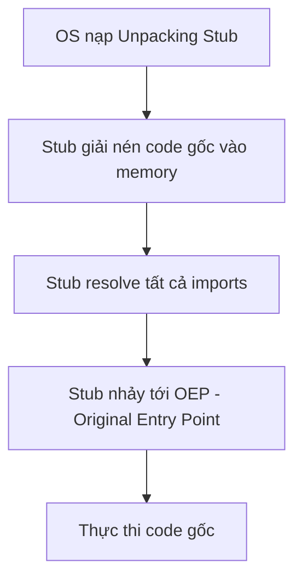
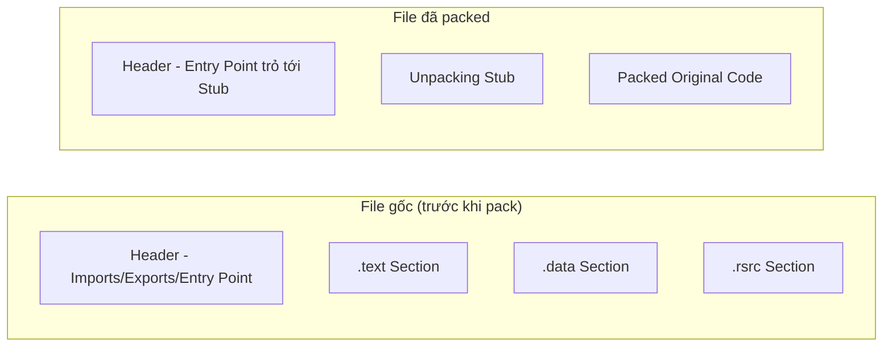

# Bài 7: Anti Dynamic Analysis

## 1. Anti-Debugging

### Tổng quan

Anti-debugging là kỹ thuật chống phân tích động được mã độc sử dụng nhằm:

- Nhận biết khi nào nó đang bị kiểm soát bởi một debugger.
- Cản trở hoạt động của debugger để làm chậm quá trình phân tích.

Khi mã độc phát hiện ra đang bị debug, nó có thể:

- Thay đổi luồng thực thi bình thường (rẽ sang code path khác).
- Chỉnh sửa code gây ra crash, làm cho nhà phân tích tốn thêm thời gian và công sức.

---

## 2. Windows Debugger Detection

### 2.1 Sử dụng Windows API

Windows cung cấp một số hàm API có thể được chương trình dùng để xác định xem nó có đang bị debug hay không. Một số hàm được thiết kế chuyên cho việc phát hiện debugger, một số khác được dùng lại (repurpose) cho mục đích này.

---

#### 2.1.1 `IsDebuggerPresent`

```c
BOOL WINAPI IsDebuggerPresent(void);
```

**Cơ chế hoạt động:**

- Kiểm tra trường `BeingDebugged` trong cấu trúc **Process Environment Block (PEB)** của tiến trình hiện tại.
- Nếu tiến trình đang chạy trong ngữ cảnh của debugger → trả về **khác 0 (nonzero)**.
- Nếu tiến trình KHÔNG bị debug → trả về **0**.

**Ghi chú:**

- Hàm này cho phép ứng dụng tự biết mình có đang bị debug không để thay đổi hành vi.
- Ví dụ: ứng dụng có thể gọi `OutputDebugString` để in thêm thông tin nếu phát hiện có debugger.
- Để kiểm tra tiến trình *khác* (remote process), dùng `CheckRemoteDebuggerPresent`.

---

#### 2.1.2 `CheckRemoteDebuggerPresent`

```c
BOOL WINAPI CheckRemoteDebuggerPresent(
    _In_    HANDLE hProcess,
    _Inout_ PBOOL  pbDebuggerPresent
);
```

**Tham số:**

- `hProcess`: Handle của tiến trình cần kiểm tra.
- `pbDebuggerPresent`: Con trỏ đến biến boolean — hàm sẽ đặt thành `TRUE` nếu tiến trình đang bị debug, `FALSE` nếu không.

**Lưu ý quan trọng:**

- Từ "remote" ở đây **không có nghĩa** là debugger nằm trên máy khác.
- "Remote" ở đây nghĩa là debugger nằm trong một **tiến trình song song, tách biệt**.
- `IsDebuggerPresent` chỉ dùng cho tiến trình đang gọi; `CheckRemoteDebuggerPresent` dùng cho bất kỳ tiến trình nào thông qua handle.

---

#### 2.1.3 `NtQueryInformationProcess`

```c
NTSTATUS WINAPI NtQueryInformationProcess(
    _In_      HANDLE           ProcessHandle,
    _In_      PROCESSINFOCLASS ProcessInformationClass,
    _Out_     PVOID            ProcessInformation,
    _In_      ULONG            ProcessInformationLength,
    _Out_opt_ PULONG           ReturnLength
);
```

**Cơ chế hoạt động:**

- Truy xuất thông tin về một tiến trình được chỉ định.
- Tham số `ProcessInformationClass` xác định loại thông tin cần lấy.
- Giá trị `ProcessDebugPort` (= `0x7`) sẽ trả về:
    - **0** nếu tiến trình không bị debug.
    - **Port number** (khác 0) nếu tiến trình đang bị debug.

---

#### 2.1.4 `OutputDebugString`

```c
void WINAPI OutputDebugString(_In_opt_ LPCTSTR lpOutputString);
```

**Cơ chế phát hiện debugger:**

```c
DWORD errorValue = 12345;
SetLastError(errorValue);
OutputDebugString("Test for Debugger");
if (GetLastError() == errorValue) {
    ExitProcess();       // Không có debugger → hàm thất bại → error code không đổi
} else {
    RunMaliciousPayload();  // Có debugger → hàm thành công → error code bị thay đổi
}
```

**Logic:**

- Gán một giá trị lỗi tùy ý bằng `SetLastError`.
- Gọi `OutputDebugString`.
- Nếu **có debugger** đính kèm: hàm thành công → error code sẽ bị thay đổi → `GetLastError()` ≠ `errorValue` → chạy payload độc hại.
- Nếu **không có debugger**: hàm thất bại → error code giữ nguyên → `GetLastError()` == `errorValue` → thoát.

---

### 2.2 Kiểm tra Cấu trúc Thủ công (Manually Checking Structures)

Mã độc thường **không tin tưởng** vào Windows API vì:

- API có thể bị **hook** bởi rootkit để trả về thông tin giả.
- Do đó, tác giả mã độc thường tự thực hiện kiểm tra tương đương API một cách thủ công ở cấp độ assembly.

---

#### 2.2.1 Kiểm tra `BeingDebugged` Flag

**Cấu trúc PEB (Process Environment Block):**

```c
typedef struct _PEB {
    BYTE  Reserved1[2];
    BYTE  BeingDebugged;    // <-- Flag quan trọng (offset 0x2)
    BYTE  Reserved2[1];
    PVOID Reserved3[2];
    PPEB_LDR_DATA Ldr;
    PRTL_USER_PROCESS_PARAMETERS ProcessParameters;
    BYTE  Reserved4[104];
    PVOID Reserved5[52];
    PPS_POST_PROCESS_INIT_ROUTINE PostProcessInitRoutine;
    BYTE  Reserved6[128];
    PVOID Reserved7[1];
    ULONG SessionId;
} PEB, *PPEB;
```

- PEB được trỏ tới qua địa chỉ `fs:[30h]` trong khi tiến trình chạy.
- `BeingDebugged` nằm tại **offset 0x2** trong PEB.

**Assembly kiểm tra (hai cách):**

=== "Mov method"

    ```asm
    mov eax, dword ptr fs:[30h]   ; EAX = địa chỉ PEB
    mov ebx, byte ptr [eax+2]     ; EBX = BeingDebugged flag
    test ebx, ebx
    jz NoDebuggerDetected         ; Nếu = 0 thì không bị debug
    ```

=== "Push/Pop method"

    ```asm
    push dword ptr fs:[30h]       ; Đẩy địa chỉ PEB vào stack
    pop edx                       ; EDX = địa chỉ PEB
    cmp byte ptr [edx+2], 1       ; So sánh BeingDebugged với 1
    je DebuggerDetected
    ```

---

#### 2.2.2 Kiểm tra `ProcessHeap` Flag

- `ProcessHeap` nằm tại **offset 0x18** trong PEB — trỏ tới heap đầu tiên của tiến trình.
- Trong heap header, trường `ForceFlags`:
    - Windows XP: offset `0x10`
    - Windows 7 (32-bit): offset `0x44`
- Khi **có debugger**: `ForceFlags` ≠ 0.
- Khi **không có debugger**: `ForceFlags` = 0.

```asm
mov eax, large fs:30h          ; EAX = PEB
mov eax, dword ptr [eax+18h]   ; EAX = ProcessHeap (offset 0x18)
cmp dword ptr ds:[eax+10h], 0  ; Kiểm tra ForceFlags (offset 0x10)
jne DebuggerDetected
```

---

#### 2.2.3 Kiểm tra `NtGlobalFlag`

- `NtGlobalFlag` nằm tại **offset 0x68** trong PEB.
- Khi **không có debugger**: giá trị = `0x0`.
- Khi **có debugger**: giá trị thường = `0x70`, bao gồm các flag:
    - `FLG_HEAP_ENABLE_TAIL_CHECK`
    - `FLG_HEAP_ENABLE_FREE_CHECK`
    - `FLG_HEAP_VALIDATE_PARAMETERS`

```asm
mov eax, large fs:30h          ; EAX = PEB
cmp dword ptr ds:[eax+68h], 70h ; Kiểm tra NtGlobalFlag
jz DebuggerDetected
```

---

### 2.3 Tìm kiếm Dấu vết Hệ thống (Checking for System Residue)

Khi phân tích mã độc, các công cụ debug để lại dấu vết trên hệ thống. Mã độc có thể tìm kiếm những dấu vết này để nhận biết môi trường phân tích.

**Các phương pháp:**

- **Registry keys:** Tìm kiếm khóa registry liên quan đến debugger, ví dụ:
  ```
  HKEY_LOCAL_MACHINE\SOFTWARE\Microsoft\Windows NT\CurrentVersion\AeDebug
  ```
- **File/thư mục:** Tìm kiếm file thực thi của các debugger phổ biến.
- **Process listing:** Duyệt danh sách tiến trình đang chạy để tìm debugger.
- **FindWindow API:** Tìm kiếm cửa sổ của debugger theo tên class:

```c
HWND WINAPI FindWindow(
    _In_opt_ LPCTSTR lpClassName,
    _In_opt_ LPCTSTR lpWindowName
);

if (FindWindow("OLLYDBG", 0) == NULL) {
    // Debugger Not Found
} else {
    // Debugger Detected
}
```

---

### 2.4 Nhận Diện Hành Vi Debugger (Identifying Debugger Behavior)

Debugger sử dụng breakpoint và single-step để theo dõi thực thi. Mã độc có thể phát hiện các hành vi này qua:

- **INT scanning**
- **Checksum checks**
- **Timing checks**

---

#### 2.4.1 INT Scanning

- **INT 3** (opcode `0xCC`) là software interrupt mà debugger dùng để đặt breakpoint.
- Khi đặt breakpoint tại một địa chỉ, debugger **thay thế byte đầu tiên** của lệnh tại đó bằng `0xCC`.
- Mã độc có thể **quét vùng code của chính mình** để tìm byte `0xCC`:

```asm
call next_line         ; Đẩy địa chỉ tiếp theo vào stack
next_line:
pop edi                ; EDI = địa chỉ hiện tại
sub edi, 5             ; Điều chỉnh về đầu vùng cần quét
mov ecx, 400h          ; Độ dài vùng quét
mov eax, 0CCh          ; Tìm byte 0xCC
repne scasb            ; Quét
jz DebuggerDetected    ; Nếu tìm thấy → có breakpoint → có debugger
```

---

#### 2.4.2 Code Checksums

- Mã độc tính **CRC hoặc MD5 checksum** trên một đoạn code của chính mình.
- Nếu debugger đặt breakpoint (thay byte bằng `0xCC`), checksum sẽ **thay đổi** so với giá trị gốc.
- Phát hiện sự thay đổi checksum → kết luận có debugger.

---

#### 2.4.3 Timing Checks

Tiến trình chạy chậm hơn đáng kể khi bị debug. Mã độc khai thác điều này.

**Hai chiến lược:**

1. Ghi timestamp → thực hiện vài thao tác → ghi timestamp → so sánh độ chênh lệch.
2. Ghi timestamp trước và sau khi raise exception — exception không có debugger xử lý rất nhanh, còn qua debugger thì chậm hơn nhiều.

=== "rdtsc Instruction"

    `rdtsc` (Read Time-Stamp Counter, opcode `0x0F31`) trả về số **tick kể từ lần reboot cuối** dưới dạng giá trị 64-bit trong `EDX:EAX`.

    ```asm
    rdtsc              ; Lần đọc 1
    xor ecx, ecx
    add ecx, eax
    rdtsc              ; Lần đọc 2
    sub eax, ecx       ; Tính hiệu
    cmp eax, 0xFFF0    ; Nếu hiệu lớn → debugger làm chậm
    jb NoDebuggerDetected
    ```

=== "GetTickCount"

    ```c
    a = GetTickCount();
    MaliciousActivityFunction();
    b = GetTickCount();
    delta = b - a;
    if (delta > 0x1A) {
        // Debugger Detected
    } else {
        // Debugger Not Found
    }
    ```

    `GetTickCount()` trả về số **millisecond kể từ lần reboot cuối**.

=== "QueryPerformanceCounter"

    Tương tự, gọi hai lần và so sánh hiệu — counter có độ phân giải cao hơn `GetTickCount`.

---

### 2.5 Can Thiệp Chức Năng Debugger (Interfering with Debugger Functionality)

Mã độc có thể sử dụng các kỹ thuật sau để cản trở hoạt động bình thường của debugger:

- **TLS Callbacks**
- **Exceptions**
- **Interrupt insertion**

---

#### 2.5.1 TLS Callbacks

- **TLS (Thread Local Storage) callbacks** là các subroutine được thực thi **trước** entry point của chương trình.
- Thông tin về TLS callback được mô tả trong **PE header**.
- Mã độc dùng TLS callback để **thực thi code bí mật trước khi debugger đặt breakpoint tại entry point**.
- Analyst cần chú ý đặt breakpoint ngay từ đầu quá trình load, không chỉ tại entry point.

---

### 2.6 Khai thác Lỗ hổng Debugger (Debugger Vulnerabilities)

#### 2.6.1 PE Header Vulnerabilities

- Mã độc chỉnh sửa **PE header** theo cách khiến OllyDbg crash khi tải file.
- OllyDbg báo lỗi: *"Bad or Unknown 32-bit Executable File"*.
- Tuy nhiên chương trình vẫn chạy bình thường bên ngoài debugger.

#### 2.6.2 OutputDebugString Vulnerability

- Khai thác **format string vulnerability** trong OllyDbg v1.1.
- Gọi `OutputDebugString` với chuỗi chứa toàn `%s`:

```c
OutputDebugString("%s%s%s%s%s%s%s%s%s%s%s%s%s%s");
```

- Nếu được thực thi, OllyDbg sẽ **crash** do cố gắng đọc chuỗi format không hợp lệ.

!!! warning
    Cảnh giác với các lệnh gọi `OutputDebugString` chứa chuỗi `%s` lặp lại bất thường.

---

## 3. Anti-Virtual Machine (Anti-VM) Techniques

### 3.1 VMware Artifacts

VMware để lại nhiều dấu vết trên hệ thống, đặc biệt khi VMware Tools được cài đặt:

**Tiến trình VMware:**

- `VMwareService.exe`
- `VMwareTray.exe`
- `VMwareUser.exe`

Mã độc có thể duyệt danh sách tiến trình và tìm chuỗi "VMware".

---

#### 3.1.1 VMwareService.exe

- Chạy VMware Tools Service, là tiến trình con của `services.exe`.
- Có thể phát hiện qua registry hoặc lệnh:

```cmd
net start | findstr VMware
```

Kết quả:
```
VMware Physical Disk Helper Service
VMware Tools Service
```

---

#### 3.1.2 File System và Registry

- Thư mục: `C:\Program Files\VMware\VMware Tools`
- Registry keys đặc trưng:

```
[HKEY_LOCAL_MACHINE\HARDWARE\DEVICEMAP\Scsi\Scsi Port 0\...]
"Identifier" = "VMware Virtual IDE Hard Drive"

[HKEY_LOCAL_MACHINE\SOFTWARE\Microsoft\Windows\CurrentVersion\Reinstall\...]
"DeviceDesc" = "VMware Accelerated AMD PCNet Adapter"

[HKEY_LOCAL_MACHINE\SYSTEM\ControlSet001\Control\Class\{...}]
"LocationInformationOverride" = "plugged into PS/2 mouse port"
"ProviderName" = "VMware, Inc."
```

---

### 3.2 Vulnerable Instructions

Một số lệnh x86 truy xuất thông tin phần cứng nhưng **không sinh ra interrupt** trong môi trường ảo hóa, tạo ra sự khác biệt có thể phát hiện:

- `sidt` — Store Interrupt Descriptor Table Register
- `sgdt` — Store Global Descriptor Table Register
- `sldt` — Store Local Descriptor Table Register
- `cpuid` — CPU Identification

---

#### 3.2.1 `sidt` — Red Pill Technique

- Lệnh `sidt` ghi **6-byte IDTR (Interrupt Descriptor Table Register)** ra vùng nhớ chỉ định.
- Mỗi processor chỉ có một IDTR, một GDTR, một LDTR.
- Địa chỉ base của IDT khác nhau giữa các môi trường:

| Môi trường | IDT Base Address |
|---|---|
| Windows thật | `0x8effffff` |
| Virtual PC | `0xe8xxxxxxx` |
| VMware | `0xffxxxxxxx` |

```asm
lea  eax, [ebp+Dst]
sidt fword ptr [eax]         ; Lưu IDTR vào bộ nhớ
mov  al, [eax+5]             ; Lấy byte thứ 5 (byte cao của base address)
cmp  al, 0FFh                ; VMware signature
jnz  short loc_401E19        ; Không phải VMware → bỏ qua
```

**Countermeasures:**

- Chạy trên máy **multi-core processor** (IDT có thể khác nhau mỗi core).
- **NOP-out** lệnh `sidt`.
- **Patch** lệnh jump phía sau kiểm tra.

---

#### 3.2.2 Querying I/O Communication Port

- Lệnh `in` đọc dữ liệu từ I/O port.
- **VMware giám sát** lệnh `in` và bẫy I/O đến port `0x5668` (chuỗi "VX" — VMware backdoor).

```asm
mov eax, 'VMXh'    ; Magic number
mov ecx, 0ah       ; Command: get VMware version
mov dx, 'VX'       ; Port 0x5668
in  eax, dx        ; Đọc từ port
cmp ebx, 'VMXh'    ; Nếu EBX = 'VMXh' → đang trong VMware
je  detected
```

**Countermeasure:** NOP-out lệnh `in` hoặc patch conditional jump.

---

#### 3.2.3 ScoopyNG

ScoopyNG là công cụ phát hiện VMware miễn phí thực hiện **7 loại kiểm tra**:

1. Kiểm tra lệnh `sidt` (Red Pill)
2. Kiểm tra lệnh `sgdt`
3. Kiểm tra lệnh `sldt` (No Pill)
4. Kiểm tra lệnh `str`
5. I/O backdoor port option `0xa`
6. I/O backdoor port option `0x14`
7. Bug trong VMware cũ chạy ở emulation mode

---

#### 3.2.4 Tweaking VMware Settings

VMware có một số tính năng không có tài liệu (undocumented) giúp giảm thiểu các kỹ thuật anti-VM. Thêm vào file `.vmx`:

```ini
isolation.tools.getPtrLocation.disable = "TRUE"
isolation.tools.setPtrLocation.disable = "TRUE"
isolation.tools.setVersion.disable = "TRUE"
isolation.tools.getVersion.disable = "TRUE"
monitor_control.disable_directexec = "TRUE"
monitor_control.disable_chksimd = "TRUE"
monitor_control.disable_ntreloc = "TRUE"
monitor_control.disable_selfmod = "TRUE"
monitor_control.disable_reloc = "TRUE"
monitor_control.disable_btinout = "TRUE"
monitor_control.disable_btmemspace = "TRUE"
monitor_control.disable_btpriv = "TRUE"
monitor_control.disable_btseg = "TRUE"
```

---

## 4. Packers và Unpacking

### 4.1 Packer Anatomy

- **Packer** nhận một file thực thi làm đầu vào và xuất ra một file thực thi đã được đóng gói.
- Hầu hết packer sử dụng **thuật toán nén** để nén code gốc.
- Mục đích: ẩn nội dung thực sự của mã độc khỏi phân tích tĩnh.

---

### 4.2 The Unpacking Stub



**Entry point** của file đã packed trỏ tới **unpacking stub**, không phải code gốc.

**Ba bước của unpacking stub:**

1. Giải nén (unpack) code gốc vào memory.
2. Resolve tất cả imports của code gốc.
3. Chuyển thực thi sang **OEP (Original Entry Point)**.

---

### 4.3 Quá trình Unpacking chi tiết

#### Bước 1: Loading the Executable

- File thực thi thông thường: OS loader đọc PE header, cấp phát memory cho từng section, copy sections vào memory.
- File đã packed: PE header vẫn được format để loader cấp phát memory → Unpacking stub sau đó giải nén code vào vùng nhớ đó.

#### Bước 2: Resolving Imports

- Windows loader **không thể đọc** thông tin import bị đóng gói.
- Unpacking stub tự resolve imports:
    - Gọi `LoadLibrary` cho mỗi DLL.
    - Gọi `GetProcAddress` cho từng hàm.
    - Điền địa chỉ vào import table.

#### Bước 3: The Tail Jump

- Sau khi hoàn tất, stub thực hiện **jump** tới **OEP**.
- Đây là bước chuyển giao thực thi cuối cùng.

---

### 4.4 Hình ảnh cấu trúc trước/sau packing



---

### 4.5 Nhận Diện Chương Trình Đã Packed

Các dấu hiệu nhận biết:

- **Rất ít imports**, đặc biệt nếu chỉ có `LoadLibrary` và `GetProcAddress`.
- Mở trong **IDA Pro**: chỉ một lượng nhỏ code được phân tích tự động.
- Mở trong **OllyDbg**: có cảnh báo chương trình có thể bị packed.
- **Tên section đặc trưng**: ví dụ `UPX0`, `UPX1`.
- **Kích thước section bất thường**: ví dụ `.text` section có `Size of Raw Data = 0` nhưng `Virtual Size ≠ 0`.

---

### 4.6 Các Phương Pháp Unpacking

=== "Automated Static Unpacking"

    - Chương trình tự động giải nén/giải mã file thực thi mà không cần chạy nó.
    - Nhanh nhất khi áp dụng được.
    - **PE Explorer** hỗ trợ plug-in static unpacker cho:
        - NSPack
        - Upack
        - UPX

=== "Automated Dynamic Unpacking"

    - Chạy file thực thi và để unpacking stub tự làm việc.
    - Hiện tại **không có công cụ automated dynamic unpacker tốt** công khai.

=== "Manual Dynamic Unpacking"

    Hai phương pháp thủ công:

    **Phương pháp 1 – Reverse Engineer thuật toán:**
    - Tìm hiểu thuật toán đóng gói.
    - Viết chương trình chạy ngược thuật toán đó để giải nén.

    **Phương pháp 2 – Dump từ memory:**
    - Chạy file packed → để stub tự giải nén vào memory.
    - **Dump tiến trình** ra khỏi memory.
    - Sửa PE header thủ công để hoàn thiện file.

---

## Câu hỏi Trắc nghiệm

**Câu 1.** Anti-debugging là gì?

- A. Kỹ thuật tối ưu hóa hiệu suất chương trình
- B. Kỹ thuật chống phân tích động giúp mã độc nhận biết và cản trở debugger
- C. Công cụ dùng để debug phần mềm
- D. Phương pháp mã hóa dữ liệu trong mã độc

??? info "Đáp án & Giải thích"
    **Đáp án: B**

    Anti-debugging là kỹ thuật được mã độc sử dụng để nhận biết khi nào nó đang bị kiểm soát bởi debugger, và/hoặc cản trở hoạt động của debugger nhằm làm chậm quá trình phân tích.

---

**Câu 2.** Hàm `IsDebuggerPresent()` kiểm tra trường nào trong cấu trúc PEB?

- A. `NtGlobalFlag`
- B. `ProcessHeap`
- C. `BeingDebugged`
- D. `ForceFlags`

??? info "Đáp án & Giải thích"
    **Đáp án: C**

    `IsDebuggerPresent()` tìm kiếm trường `BeingDebugged` trong cấu trúc Process Environment Block (PEB). Nếu khác 0 thì tiến trình đang bị debug.

---

**Câu 3.** `IsDebuggerPresent()` trả về giá trị nào khi tiến trình KHÔNG bị debug?

- A. -1
- B. 1
- C. Nonzero
- D. 0

??? info "Đáp án & Giải thích"
    **Đáp án: D**

    Khi tiến trình không đang chạy trong ngữ cảnh debugger, hàm trả về **0**. Khi đang bị debug, trả về giá trị khác 0.

---

**Câu 4.** Điểm khác biệt chính giữa `IsDebuggerPresent` và `CheckRemoteDebuggerPresent` là gì?

- A. `CheckRemoteDebuggerPresent` chỉ hoạt động trên Windows 10
- B. `IsDebuggerPresent` kiểm tra tiến trình hiện tại; `CheckRemoteDebuggerPresent` kiểm tra bất kỳ tiến trình nào qua handle
- C. `CheckRemoteDebuggerPresent` phát hiện debugger trên máy tính khác qua mạng
- D. Hai hàm hoàn toàn giống nhau về chức năng

??? info "Đáp án & Giải thích"
    **Đáp án: B**

    `IsDebuggerPresent` chỉ kiểm tra tiến trình đang gọi hàm. `CheckRemoteDebuggerPresent` nhận một process handle và kiểm tra tiến trình đó — "remote" ở đây nghĩa là tiến trình song song, không phải máy tính khác.

---

**Câu 5.** Khi dùng `NtQueryInformationProcess` với tham số `ProcessDebugPort (0x7)`, giá trị nào được trả về khi tiến trình KHÔNG bị debug?

- A. `0x7`
- B. `0xFF`
- C. `0`
- D. Port number

??? info "Đáp án & Giải thích"
    **Đáp án: C**

    Nếu tiến trình không bị debug, hàm trả về **0**. Nếu đang bị debug, một port number (khác 0) được trả về.

---

**Câu 6.** Trong kỹ thuật phát hiện debugger bằng `OutputDebugString`, logic hoạt động như thế nào?

- A. Nếu `GetLastError()` == giá trị tùy ý đã đặt → có debugger
- B. Nếu `GetLastError()` != giá trị tùy ý đã đặt → không có debugger
- C. Nếu `GetLastError()` == giá trị tùy ý đã đặt → KHÔNG có debugger (hàm thất bại → code không đổi)
- D. `OutputDebugString` luôn thay đổi error code

??? info "Đáp án & Giải thích"
    **Đáp án: C**

    Khi không có debugger, `OutputDebugString` thất bại → error code do `SetLastError` đặt vẫn được giữ nguyên → `GetLastError()` == giá trị tùy ý → kết luận không có debugger. Khi có debugger, hàm thành công → error code bị thay đổi → `GetLastError()` != giá trị tùy ý → kết luận có debugger.

---

**Câu 7.** Tại sao mã độc thường kiểm tra cấu trúc PEB thủ công thay vì dùng Windows API?

- A. API chạy chậm hơn so với truy cập trực tiếp
- B. API có thể bị hook bởi rootkit để trả về thông tin giả
- C. API không tồn tại trên một số phiên bản Windows
- D. Truy cập thủ công chính xác hơn

??? info "Đáp án & Giải thích"
    **Đáp án: B**

    Lý do chính là các API call có thể bị **hook bởi rootkit** để trả về thông tin giả (ví dụ luôn trả về "không bị debug"). Bằng cách truy cập trực tiếp cấu trúc PEB qua assembly, mã độc tránh được sự can thiệp này.

---

**Câu 8.** `BeingDebugged` flag nằm ở offset nào trong cấu trúc PEB?

- A. `0x0`
- B. `0x2`
- C. `0x18`
- D. `0x68`

??? info "Đáp án & Giải thích"
    **Đáp án: B**

    `BeingDebugged` nằm tại **offset 0x2** trong PEB. Địa chỉ PEB được trỏ bởi `fs:[30h]`, do đó kiểm tra thủ công sẽ truy cập `[PEB + 0x2]`.

---

**Câu 9.** Thanh ghi nào được dùng để tham chiếu vị trí PEB khi tiến trình đang chạy?

- A. `gs:[30h]`
- B. `ds:[30h]`
- C. `fs:[30h]`
- D. `es:[30h]`

??? info "Đáp án & Giải thích"
    **Đáp án: C**

    Trên Windows 32-bit, PEB được trỏ bởi **`fs:[30h]`**. Trên Windows 64-bit, sử dụng `gs:[60h]`.

---

**Câu 10.** Trường `NtGlobalFlag` trong PEB thường có giá trị bao nhiêu khi tiến trình đang bị debug?

- A. `0x0`
- B. `0x18`
- C. `0x70`
- D. `0xFF`

??? info "Đáp án & Giải thích"
    **Đáp án: C**

    Khi bị debug, `NtGlobalFlag` (offset `0x68` trong PEB) thường có giá trị **`0x70`**, bao gồm ba flag: `FLG_HEAP_ENABLE_TAIL_CHECK | FLG_HEAP_ENABLE_FREE_CHECK | FLG_HEAP_VALIDATE_PARAMETERS`.

---

**Câu 11.** `NtGlobalFlag` nằm ở offset nào trong PEB?

- A. `0x2`
- B. `0x18`
- C. `0x44`
- D. `0x68`

??? info "Đáp án & Giải thích"
    **Đáp án: D**

    `NtGlobalFlag` nằm tại **offset 0x68** trong cấu trúc PEB.

---

**Câu 12.** `ProcessHeap` trong PEB nằm ở offset nào?

- A. `0x2`
- B. `0x10`
- C. `0x18`
- D. `0x68`

??? info "Đáp án & Giải thích"
    **Đáp án: C**

    `ProcessHeap` nằm tại **offset 0x18** trong PEB, trỏ tới heap đầu tiên của tiến trình được cấp phát bởi loader.

---

**Câu 13.** Trường `ForceFlags` trong heap header nằm ở offset nào trên Windows 7 (32-bit)?

- A. `0x10`
- B. `0x18`
- C. `0x44`
- D. `0x68`

??? info "Đáp án & Giải thích"
    **Đáp án: C**

    Trên Windows 7 (32-bit), `ForceFlags` nằm tại **offset 0x44** trong heap header. Trên Windows XP, nó ở offset `0x10`.

---

**Câu 14.** Mã độc có thể tìm kiếm dấu vết của debugger trong registry ở key nào?

- A. `HKLM\SOFTWARE\Microsoft\Windows\CurrentVersion\Run`
- B. `HKLM\SOFTWARE\Microsoft\Windows NT\CurrentVersion\AeDebug`
- C. `HKLM\SYSTEM\CurrentControlSet\Services`
- D. `HKCU\SOFTWARE\Microsoft\Windows\CurrentVersion\Explorer`

??? info "Đáp án & Giải thích"
    **Đáp án: B**

    Key `HKEY_LOCAL_MACHINE\SOFTWARE\Microsoft\Windows NT\CurrentVersion\AeDebug` chứa thông tin về Just-In-Time debugger được đăng ký trên hệ thống — một dấu hiệu rõ ràng của môi trường phân tích.

---

**Câu 15.** Hàm `FindWindow("OLLYDBG", 0)` trả về `NULL` có nghĩa là gì?

- A. OllyDbg đang chạy và được phát hiện
- B. OllyDbg không được tìm thấy — không có debugger
- C. Hàm gặp lỗi
- D. OllyDbg bị ẩn

??? info "Đáp án & Giải thích"
    **Đáp án: B**

    `FindWindow` trả về `NULL` khi **không tìm thấy** cửa sổ với class name "OLLYDBG" — nghĩa là OllyDbg không đang chạy. Nếu khác `NULL`, đã phát hiện debugger.

---

**Câu 16.** INT 3 được dùng bởi debugger để làm gì?

- A. Kết thúc tiến trình
- B. Tạm thời thay thế một lệnh bằng software breakpoint và gọi debug exception handler
- C. Đọc thanh ghi CPU
- D. Ghi log ra file

??? info "Đáp án & Giải thích"
    **Đáp án: B**

    **INT 3** (opcode `0xCC`) là software interrupt dùng để đặt **breakpoint**. Debugger thay thế byte đầu tiên của lệnh tại địa chỉ cần break bằng `0xCC`, và khi CPU thực thi đến đó, interrupt được tạo ra và debugger được gọi để xử lý.

---

**Câu 17.** Opcode của INT 3 là gì?

- A. `0x0F31`
- B. `0xCC`
- C. `0x90`
- D. `0xFF`

??? info "Đáp án & Giải thích"
    **Đáp án: B**

    Opcode của INT 3 là **`0xCC`**. Đây là byte mà debugger viết vào địa chỉ muốn đặt breakpoint. `0x90` là NOP, `0x0F31` là rdtsc.

---

**Câu 18.** Kỹ thuật Code Checksums trong anti-debugging hoạt động như thế nào?

- A. Tính checksum của toàn bộ file trên đĩa
- B. Tính CRC/MD5 của một đoạn code trong bộ nhớ; nếu debugger đặt breakpoint, checksum sẽ thay đổi
- C. Kiểm tra hash của DLL hệ thống
- D. So sánh file thực thi với database virus

??? info "Đáp án & Giải thích"
    **Đáp án: B**

    Mã độc tính **CRC hoặc MD5 checksum** trên một đoạn code của chính mình trong bộ nhớ. Nếu debugger đặt breakpoint bằng cách thay byte bằng `0xCC`, checksum sẽ **không khớp** với giá trị gốc — từ đó phát hiện debugger.

---

**Câu 19.** Lệnh `rdtsc` trả về điều gì?

- A. Thời gian hệ thống hiện tại
- B. Số tick kể từ lần reboot cuối, dưới dạng 64-bit trong EDX:EAX
- C. Tần số CPU
- D. Số tiến trình đang chạy

??? info "Đáp án & Giải thích"
    **Đáp án: B**

    `rdtsc` (Read Time-Stamp Counter) trả về **số ticks kể từ lần reboot cuối cùng** dưới dạng giá trị 64-bit: phần cao trong `EDX`, phần thấp trong `EAX`.

---

**Câu 20.** Opcode của lệnh `rdtsc` là gì?

- A. `0xCC`
- B. `0x90`
- C. `0x0F31`
- D. `0x5668`

??? info "Đáp án & Giải thích"
    **Đáp án: C**

    Opcode của `rdtsc` là **`0x0F31`** (2 byte). Đây là lệnh được mã độc dùng phổ biến nhất cho timing check để phát hiện debugger.

---

**Câu 21.** Hàm `GetTickCount()` trả về điều gì?

- A. Số tick CPU
- B. Số millisecond kể từ lần reboot cuối
- C. Timestamp Unix
- D. Số giây kể từ lần reboot cuối

??? info "Đáp án & Giải thích"
    **Đáp án: B**

    `GetTickCount()` trả về số **millisecond** đã trôi qua kể từ lần khởi động hệ thống cuối cùng.

---

**Câu 22.** Tại sao timing check là phương pháp phổ biến để phát hiện debugger?

- A. Debugger thay đổi hệ thống clock
- B. Tiến trình chạy chậm hơn đáng kể khi bị debug do debugger xử lý các sự kiện
- C. Debugger tốn nhiều RAM khiến hệ thống chậm
- D. Timing check không bị ảnh hưởng bởi phần cứng

??? info "Đáp án & Giải thích"
    **Đáp án: B**

    Khi tiến trình bị debug, debugger phải xử lý các sự kiện, breakpoint, single-step — tất cả làm **tăng thời gian thực thi** đáng kể. Mã độc có thể đo sự chênh lệch thời gian này để phát hiện debugger.

---

**Câu 23.** TLS Callback là gì và tại sao mã độc sử dụng chúng?

- A. Callback gọi khi DLL được load; dùng để inject code
- B. Subroutine thực thi TRƯỚC entry point; dùng để thực thi code bí mật trước khi debugger đặt breakpoint tại OEP
- C. Hàm xử lý thread kết thúc; dùng để cleanup
- D. Callback của Windows scheduler

??? info "Đáp án & Giải thích"
    **Đáp án: B**

    **TLS (Thread Local Storage) callbacks** là các subroutine được OS gọi **trước khi thực thi đến entry point**. Mã độc dùng chúng để chạy code phát hiện debugger hoặc code độc hại trước khi analyst có cơ hội đặt breakpoint tại entry point.

---

**Câu 24.** PE Header Vulnerability trong OllyDbg gây ra hiệu ứng gì?

- A. OllyDbg bỏ qua các breakpoint
- B. OllyDbg crash khi tải file với thông báo lỗi về PE header không hợp lệ
- C. OllyDbg chạy file trong sandbox
- D. OllyDbg tự động patch file

??? info "Đáp án & Giải thích"
    **Đáp án: B**

    Kỹ thuật này chỉnh sửa PE header để khiến OllyDbg **crash** khi tải file, hiển thị lỗi "Bad or Unknown 32-bit Executable File". Tuy nhiên file vẫn chạy bình thường bên ngoài debugger.

---

**Câu 25.** Lỗ hổng `OutputDebugString` trong OllyDbg v1.1 được khai thác như thế nào?

- A. Gọi với chuỗi rất dài để gây buffer overflow
- B. Gọi với chuỗi chứa toàn format specifier `%s` gây format string vulnerability làm crash debugger
- C. Gọi nhiều lần liên tục để chiếm tài nguyên
- D. Gọi với null pointer

??? info "Đáp án & Giải thích"
    **Đáp án: B**

    Mã độc gọi `OutputDebugString("%s%s%s%s%s%s%s%s...")` — chuỗi toàn `%s` khai thác **format string vulnerability** trong OllyDbg v1.1, khiến debugger crash khi cố xử lý chuỗi format không hợp lệ này.

---

**Câu 26.** Ba tiến trình VMware điển hình mà mã độc tìm kiếm là gì?

- A. `VMware.exe`, `VMtools.exe`, `VMhost.exe`
- B. `VMwareService.exe`, `VMwareTray.exe`, `VMwareUser.exe`
- C. `vmrun.exe`, `vmnat.exe`, `vmnetdhcp.exe`
- D. `vmplayer.exe`, `vmware-vmx.exe`, `vmware-authd.exe`

??? info "Đáp án & Giải thích"
    **Đáp án: B**

    Ba tiến trình VMware phổ biến mà mã độc tìm trong process listing là: **`VMwareService.exe`** (VMware Tools Service), **`VMwareTray.exe`** (system tray icon), và **`VMwareUser.exe`** (user session agent).

---

**Câu 27.** Lệnh nào dùng để kiểm tra VMware Tools Service có đang chạy không?

- A. `sc query VMware`
- B. `tasklist | findstr VMware`
- C. `net start | findstr VMware`
- D. `wmic service list | findstr VMware`

??? info "Đáp án & Giải thích"
    **Đáp án: C**

    Lệnh `net start | findstr VMware` liệt kê các service đang chạy và lọc các service có tên chứa "VMware", phát hiện VMware Tools Service.

---

**Câu 28.** Registry key nào là dấu hiệu điển hình của VMware virtual hard drive?

- A. `HKLM\SOFTWARE\VMware, Inc.`
- B. `HKLM\HARDWARE\DEVICEMAP\Scsi\...` với Identifier = "VMware Virtual IDE Hard Drive"
- C. `HKLM\SYSTEM\CurrentControlSet\Services\VMware`
- D. `HKCU\SOFTWARE\VMware`

??? info "Đáp án & Giải thích"
    **Đáp án: B**

    Key `HKEY_LOCAL_MACHINE\HARDWARE\DEVICEMAP\Scsi\Scsi Port 0\...\Logical Unit Id 0` với giá trị `"Identifier" = "VMware Virtual IDE Hard Drive"` là dấu hiệu rõ ràng của môi trường VMware.

---

**Câu 29.** Lệnh x86 nào KHÔNG sinh ra interrupt khi truy xuất thông tin phần cứng, tạo ra sự khác biệt có thể phát hiện trong VM?

- A. `int 3`, `int 1`, `int 0`
- B. `sidt`, `sgdt`, `sldt`, `cpuid`
- C. `in`, `out`, `cli`, `sti`
- D. `rdmsr`, `wrmsr`, `hlt`

??? info "Đáp án & Giải thích"
    **Đáp án: B**

    Các lệnh **`sidt`, `sgdt`, `sldt`, `cpuid`** truy xuất thông tin phần cứng nhưng không sinh interrupt — VM phải mô phỏng (emulate) các lệnh này theo cách khác với phần cứng thật, tạo ra sự khác biệt có thể phát hiện.

---

**Câu 30.** Lệnh `sidt` làm gì?

- A. Store Instruction Descriptor Table
- B. Ghi nội dung 6-byte IDTR (Interrupt Descriptor Table Register) ra vùng nhớ chỉ định
- C. Kiểm tra IDT có hợp lệ không
- D. Set Interrupt Descriptor Table Register

??? info "Đáp án & Giải thích"
    **Đáp án: B**

    `sidt` (Store Interrupt Descriptor Table Register) ghi nội dung **6-byte IDTR** ra vùng nhớ được chỉ định — bao gồm base address và limit của IDT. Địa chỉ base của IDT khác nhau giữa máy thật và VM.

---

**Câu 31.** Địa chỉ base IDT đặc trưng của VMware là gì?

- A. `0x8exxxxxx`
- B. `0xe8xxxxxx`
- C. `0xffxxxxxx`
- D. `0x00xxxxxx`

??? info "Đáp án & Giải thích"
    **Đáp án: C**

    Trong VMware, byte cao của IDT base address thường là **`0xFF`** (dạng `0xffxxxxxx`). Windows thật thường có `0x8exxxxxx`, Virtual PC có `0xe8xxxxxx`.

---

**Câu 32.** Ba countermeasure để vô hiệu hóa kỹ thuật phát hiện VM qua `sidt` là gì?

- A. Cài đặt firewall, tắt mạng, dùng NAT
- B. Chạy trên multi-core, NOP-out lệnh sidt, patch lệnh jump sau kiểm tra
- C. Dùng 64-bit VM, tăng RAM, dùng SSD
- D. Cập nhật VMware, dùng VMware Workstation Pro, bật VT-x

??? info "Đáp án & Giải thích"
    **Đáp án: B**

    Ba biện pháp đối phó: (1) **Multi-core processor** (IDT có thể khác nhau mỗi core), (2) **NOP-out** lệnh `sidt`, (3) **Patch** conditional jump phía sau kiểm tra để luôn đi theo nhánh "không phải VM".

---

**Câu 33.** VMware I/O backdoor sử dụng port nào?

- A. `0x1234`
- B. `0x5658` (VX)
- C. `0x5668` (VX)
- D. `0x5566`

??? info "Đáp án & Giải thích"
    **Đáp án: C**

    VMware giám sát lệnh `in` đến **port `0x5668`** (tương ứng chuỗi "VX" trong ASCII). Magic number dùng là `'VMXh'`. Đây là VMware backdoor communication channel.

---

**Câu 34.** ScoopyNG thực hiện bao nhiêu loại kiểm tra phát hiện VM?

- A. 3
- B. 5
- C. 7
- D. 10

??? info "Đáp án & Giải thích"
    **Đáp án: C**

    ScoopyNG thực hiện **7 loại kiểm tra**: 3 kiểm tra sidt/sgdt/sldt, 1 kiểm tra str, 2 kiểm tra I/O backdoor port, và 1 kiểm tra bug trong VMware cũ.

---

**Câu 35.** Packer làm gì với một file thực thi?

- A. Mã hóa file và yêu cầu password để chạy
- B. Nhận file thực thi làm đầu vào, nén/biến đổi và xuất ra file thực thi mới chứa code đã được đóng gói
- C. Tách file thành nhiều phần nhỏ
- D. Thêm digital signature vào file

??? info "Đáp án & Giải thích"
    **Đáp án: B**

    Packer nhận **file thực thi làm input** → áp dụng thuật toán nén/biến đổi → xuất ra **file thực thi mới** chứa unpacking stub và code gốc đã đóng gói. Mục đích chính là ẩn nội dung thực sự của code.

---

**Câu 36.** Entry point của file đã packed trỏ đến đâu?

- A. Code gốc (Original Code)
- B. Unpacking stub
- C. Import table
- D. PE header

??? info "Đáp án & Giải thích"
    **Đáp án: B**

    Entry point của file packed **luôn trỏ tới unpacking stub**, không phải code gốc. Stub chịu trách nhiệm giải nén code gốc, resolve imports, rồi nhảy tới OEP.

---

**Câu 37.** Unpacking stub thực hiện ba bước theo thứ tự nào?

- A. Resolve imports → Giải nén code → Nhảy tới OEP
- B. Giải nén code → Nhảy tới OEP → Resolve imports
- C. Giải nén code gốc vào memory → Resolve imports → Nhảy tới OEP (Tail Jump)
- D. Load DLL → Giải nén → Copy sections

??? info "Đáp án & Giải thích"
    **Đáp án: C**

    Thứ tự đúng: (1) **Giải nén code gốc vào memory**, (2) **Resolve tất cả imports** bằng `LoadLibrary` + `GetProcAddress`, (3) **Tail Jump** tới OEP để bắt đầu thực thi code gốc.

---

**Câu 38.** Tại sao Windows loader không thể tự resolve imports của file packed?

- A. File packed dùng định dạng import table khác
- B. Thông tin import bị nén/mã hóa cùng với code — Windows loader không thể đọc thông tin đã bị đóng gói
- C. File packed không có import table
- D. Windows loader bị vô hiệu hóa bởi packer

??? info "Đáp án & Giải thích"
    **Đáp án: B**

    **Windows loader không thể đọc** thông tin import đã bị đóng gói (nén hoặc mã hóa). Do đó unpacking stub phải tự resolve imports bằng cách gọi `LoadLibrary` cho mỗi DLL và `GetProcAddress` cho mỗi hàm.

---

**Câu 39.** "Tail Jump" trong quá trình unpacking là gì?

- A. Lệnh jump ở cuối file thực thi
- B. Lệnh jump cuối cùng của unpacking stub để chuyển thực thi sang OEP sau khi hoàn tất giải nén
- C. Jump để thoát chương trình
- D. Jump đến exception handler

??? info "Đáp án & Giải thích"
    **Đáp án: B**

    **Tail Jump** là lệnh nhảy cuối cùng mà unpacking stub thực hiện sau khi đã hoàn tất việc giải nén và resolve imports — để **chuyển thực thi sang OEP** (Original Entry Point) của code gốc.

---

**Câu 40.** Dấu hiệu nào KHÔNG phải là dấu hiệu nhận biết file đã packed?

- A. Chỉ có `LoadLibrary` và `GetProcAddress` trong import table
- B. Tên section là `UPX0` hoặc `UPX1`
- C. File có nhiều imports từ nhiều DLL khác nhau
- D. `.text` section có `Size of Raw Data = 0` nhưng `Virtual Size ≠ 0`

??? info "Đáp án & Giải thích"
    **Đáp án: C**

    File có **nhiều imports từ nhiều DLL** là đặc trưng của file **chưa packed**. File packed điển hình chỉ có rất ít imports — thường chỉ `LoadLibrary` và `GetProcAddress` — vì stub tự resolve imports khi chạy.

---

**Câu 41.** Ba phương pháp unpacking chính là gì?

- A. Manual, automatic, hybrid
- B. Automated static unpacking, Automated dynamic unpacking, Manual dynamic unpacking
- C. Reverse engineering, memory dump, file patching
- D. IDA Pro, OllyDbg, PE Explorer

??? info "Đáp án & Giải thích"
    **Đáp án: B**

    Ba phương pháp: (1) **Automated static unpacking** — giải nén mà không chạy file, (2) **Automated dynamic unpacking** — chạy file và capture kết quả, (3) **Manual dynamic unpacking** — phân tích thủ công bằng debugger.

---

**Câu 42.** Công cụ nào hỗ trợ static unpacking plug-in cho NSPack, Upack, UPX?

- A. IDA Pro
- B. OllyDbg
- C. PE Explorer
- D. x64dbg

??? info "Đáp án & Giải thích"
    **Đáp án: C**

    **PE Explorer** đi kèm với các static unpacking plug-in mặc định hỗ trợ các packer phổ biến: **NSPack, Upack, UPX**.

---

**Câu 43.** Hai phương pháp manual unpacking phổ biến là gì?

- A. Dùng IDA Pro và OllyDbg
- B. Reverse engineer thuật toán packing và viết chương trình giải nén; HOẶC chạy để stub tự giải nén rồi dump memory
- C. Phân tích tĩnh và phân tích động
- D. Dùng antivirus và sandbox

??? info "Đáp án & Giải thích"
    **Đáp án: B**

    **Phương pháp 1:** Phân tích và reverse engineer thuật toán packing, sau đó viết chương trình chạy ngược lại để giải nén. **Phương pháp 2:** Chạy file packed để stub tự giải nén vào memory, dump tiến trình ra, sau đó sửa PE header thủ công.

---

**Câu 44.** Khi mã độc phát hiện đang bị debug, nó có thể làm gì? (Chọn tất cả đúng)

- A. Thay đổi luồng thực thi sang code path khác
- B. Tự xóa file khỏi đĩa
- C. Gây crash tiến trình
- D. Thực thi payload độc hại bình thường

??? info "Đáp án & Giải thích"
    **Đáp án: A và C**

    Khi phát hiện debugger, mã độc thường: (A) **Thay đổi luồng thực thi** sang code path vô hại hoặc (C) **Gây crash** tiến trình để ngăn analyst tiếp tục. Mục đích là làm chậm và gây khó khăn cho quá trình phân tích.

---

**Câu 45.** Kỹ thuật "INT scanning" trong anti-debugging quét tìm điều gì?

- A. Tất cả lệnh INT trong file thực thi
- B. Byte `0xCC` trong vùng code của chính mã độc để phát hiện breakpoint đã được đặt
- C. Số lần INT 3 được gọi
- D. Các interrupt handler bất thường

??? info "Đáp án & Giải thích"
    **Đáp án: B**

    INT scanning quét vùng code của chính mã độc trong bộ nhớ để tìm byte **`0xCC`** — opcode của INT 3. Nếu tìm thấy, điều đó có nghĩa debugger đã đặt breakpoint vào code của mã độc.

---

**Câu 46.** Lệnh `repne scasb` trong đoạn code INT scanning làm gì?

- A. Lặp và so sánh từng byte trong chuỗi với giá trị trong AL, dừng khi tìm thấy
- B. Lặp và copy dữ liệu
- C. Lặp và xóa byte
- D. Lặp và tính tổng các byte

??? info "Đáp án & Giải thích"
    **Đáp án: A**

    `repne scasb` (Repeat Not Equal Scan String Byte) lặp, mỗi lần **so sánh byte tại [EDI]** với **AL** (chứa `0xCC`), tăng EDI và giảm ECX. Dừng khi tìm thấy byte khớp hoặc ECX = 0. Nếu tìm thấy `0xCC` → có breakpoint.

---

**Câu 47.** Trong kỹ thuật Timing Check, tại sao raising an exception cũng có thể dùng để phát hiện debugger?

- A. Exception gây crash debugger
- B. Tiến trình không bị debug xử lý exception rất nhanh; debugger xử lý chậm hơn nhiều do phải xử lý event
- C. Exception thay đổi hành vi của debugger
- D. Exception không thể xảy ra khi có debugger

??? info "Đáp án & Giải thích"
    **Đáp án: B**

    Khi không có debugger, exception được xử lý trực tiếp bởi OS exception handler — **rất nhanh**. Khi có debugger, exception được gửi đến debugger để xử lý trước, tạo ra **độ trễ đáng kể** có thể đo được.

---

**Câu 48.** Thư mục nào là artifact điển hình của VMware Tools trên hệ thống Windows?

- A. `C:\Windows\System32\VMware`
- B. `C:\Program Files\VMware\VMware Tools`
- C. `C:\VMware\Tools`
- D. `C:\Users\Public\VMware`

??? info "Đáp án & Giải thích"
    **Đáp án: B**

    Thư mục cài đặt mặc định của VMware Tools là **`C:\Program Files\VMware\VMware Tools`** — đây là artifact mà mã độc có thể tìm kiếm để phát hiện môi trường VMware.

---

**Câu 49.** Kỹ thuật phát hiện VM qua I/O port, magic number nào được dùng để xác nhận đang trong VMware?

- A. `'VBOX'`
- B. `'VXxx'`
- C. `'VMXh'`
- D. `'VMWR'`

??? info "Đáp án & Giải thích"
    **Đáp án: C**

    Magic number **`'VMXh'`** (= `0x564D5868`) được dùng để xác nhận VMware. Code gửi magic number qua port `0x5668` và kiểm tra xem EBX có chứa `'VMXh'` trong phản hồi không — nếu có thì đang chạy trong VMware.

---

**Câu 50.** Điều gì xảy ra với IDA Pro khi phân tích file đã packed so với file bình thường?

- A. IDA Pro không thể mở file packed
- B. IDA Pro chạy chậm hơn bình thường
- C. Chỉ một lượng nhỏ code được IDA Pro nhận diện và phân tích tự động — phần lớn code vẫn bị ẩn
- D. IDA Pro tự động giải nén file

??? info "Đáp án & Giải thích"
    **Đáp án: C**

    Khi mở file packed trong IDA Pro, **chỉ một lượng rất nhỏ code** (thường là unpacking stub) được phân tích tự động. Code gốc vẫn đang ở dạng nén/mã hóa và IDA Pro không thể dịch ngược nó — đây là dấu hiệu nhận biết file packed.

---

**Câu 51.** `VMwareService.exe` là tiến trình con của tiến trình nào?

- A. `explorer.exe`
- B. `winlogon.exe`
- C. `services.exe`
- D. `svchost.exe`

??? info "Đáp án & Giải thích"
    **Đáp án: C**

    `VMwareService.exe` chạy **VMware Tools Service** và là tiến trình con của **`services.exe`** — Windows Service Control Manager process.

---

**Câu 52.** Phương pháp manual unpacking bằng memory dump yêu cầu bước nào sau khi dump?

- A. Mã hóa lại file dump
- B. Sửa PE header thủ công để hoàn thiện file thực thi
- C. Compress lại file
- D. Ký số file

??? info "Đáp án & Giải thích"
    **Đáp án: B**

    Sau khi dump tiến trình từ memory, PE header thường không còn nguyên vẹn (imports chưa được sửa đúng, section alignment có thể sai...). Analyst phải **sửa PE header thủ công** (sử dụng công cụ như ImportREC, OllyDump) để file có thể chạy độc lập.

---

**Câu 53.** Tại sao `CheckRemoteDebuggerPresent` được gọi là "remote" dù debugger có thể ở cùng máy?

- A. Vì hàm này ban đầu được thiết kế cho remote debugging qua mạng
- B. "Remote" chỉ đơn giản nghĩa là debugger nằm trong một tiến trình song song, tách biệt — không nhất thiết là máy khác
- C. Vì hàm chỉ hoạt động khi debug qua mạng
- D. Đây là lỗi đặt tên trong Windows API

??? info "Đáp án & Giải thích"
    **Đáp án: B**

    Microsoft làm rõ rằng "remote" trong `CheckRemoteDebuggerPresent` **không có nghĩa** debugger ở máy khác. Nó chỉ có nghĩa debugger nằm trong **tiến trình song song, tách biệt** với tiến trình đang được debug.

---

**Câu 54.** Khi IDA Pro chỉ nhận diện được một lượng nhỏ code, điều đó gợi ý điều gì về file đang phân tích?

- A. File bị hỏng
- B. File rất nhỏ
- C. File có thể đã được packed, và phần code lớn vẫn đang ở dạng nén
- D. IDA Pro phiên bản cũ không hỗ trợ file này

??? info "Đáp án & Giải thích"
    **Đáp án: C**

    Đây là dấu hiệu điển hình của **file packed**. IDA Pro chỉ phân tích được unpacking stub (phần nhỏ ở đầu), còn phần code gốc đang ở dạng nén hoặc mã hóa — IDA Pro không thể dịch ngược dữ liệu đó.

---

**Câu 55.** Trong cấu trúc PEB, trường nào chứa thông tin về heap đầu tiên của tiến trình?

- A. `BeingDebugged`
- B. `NtGlobalFlag`
- C. `ProcessHeap`
- D. `Ldr`

??? info "Đáp án & Giải thích"
    **Đáp án: C**

    Trường **`ProcessHeap`** (hay `Reserved4` trong một số định nghĩa) tại offset `0x18` trong PEB trỏ tới vị trí heap đầu tiên của tiến trình được cấp phát bởi loader. Khi debug, `ForceFlags` trong heap header này sẽ khác 0.
