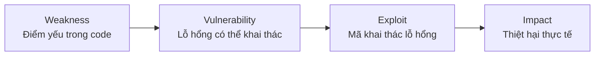
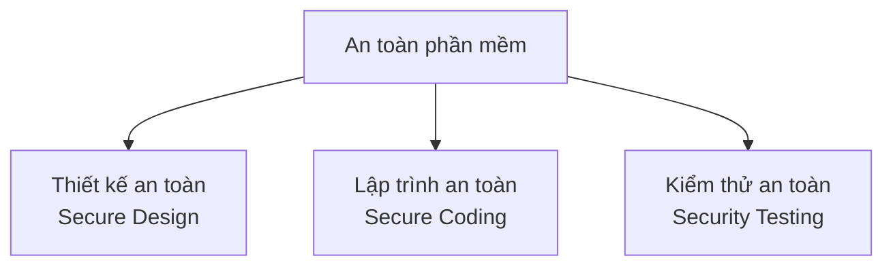
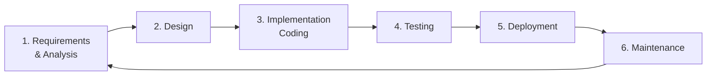
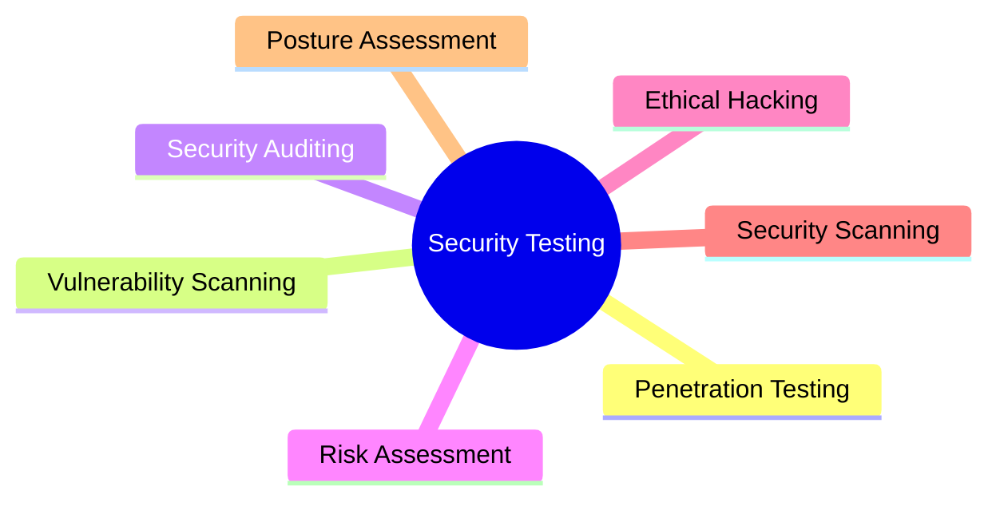
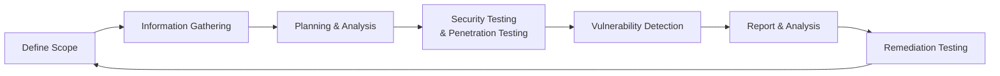
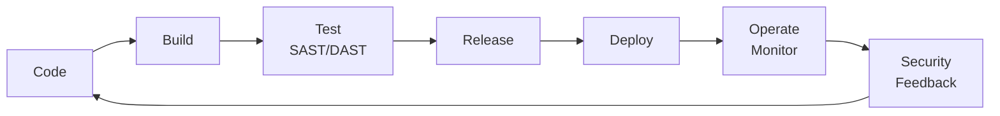

# Bài 1: Tổng quan 

---

## 1. Tổng Quan Môn Học

**Mã môn:** NT521
**Tên môn:** Lập trình an toàn và khai thác lỗ hổng phần mềm *(Secure Programming and Exploiting Vulnerabilities)*
**Số tín chỉ:** 4 tín chỉ
**Thời lượng:** 15 buổi × 3 tiết/buổi

---

## 2. Tại Sao Học Môn Này?

Phần mềm ngày càng hiện diện ở khắp nơi — từ ứng dụng di động, hệ thống ngân hàng, cho đến **hệ thống nhúng trong ô tô**. Bất kỳ phần mềm nào cũng có thể chứa lỗ hổng bảo mật nếu không được thiết kế và lập trình cẩn thận.

??? example "Ví dụ thực tế: Ô tô bị tấn công"
    Một chiếc ô tô hiện đại có thể bị tin tặc tấn công qua nhiều vector:

    **1. Hệ thống mở khóa không dây (Keyless Entry System)**
    - Lỗ hổng: Không có mã hóa đủ mạnh cho tín hiệu giữa chìa khóa và xe.
    - Tấn công: **Relay Attack** – kẻ tấn công chặn và phát lại tín hiệu vô tuyến để mở khóa xe mà không cần chìa khóa thật.

    **2. Phần mềm điều khiển động cơ (Engine Control Software)**
    - Lỗ hổng: Không kiểm tra tính toàn vẹn và xác thực mã nguồn.
    - Tấn công: Tiêm mã độc (code injection) vào hệ thống, gây lỗi điều khiển động cơ hoặc tắt động cơ khi xe đang chạy.

    **3. Hệ thống thông tin giải trí (Infotainment System)**
    - Lỗ hổng: Kết nối internet nhưng thiếu tường lửa và phân đoạn mạng (network segmentation).
    - Tấn công: Khai thác lỗ hổng từ infotainment để pivot sang các hệ thống quan trọng hơn như **phanh (brake)** hoặc **lái (steering)**.

---

## 3. Các Vị Trí Nghề Nghiệp Liên Quan

Kiến thức trong môn học này mở ra các hướng nghề nghiệp sau:

| Vị trí | Mô tả |
|---|---|
| Software Security Engineer | Xây dựng phần mềm với cơ chế bảo mật tích hợp |
| Vulnerability Analyst | Phân tích và đánh giá lỗ hổng bảo mật |
| Penetration Tester | Kiểm thử xâm nhập hệ thống |
| Malware Analyst | Phân tích mã độc |
| Secure Software Developer | Phát triển phần mềm theo tiêu chuẩn bảo mật |
| Security Auditor | Đánh giá bảo mật tổng thể hệ thống |
| Security Tools Developer | Phát triển công cụ bảo mật |
| Security Consultant | Tư vấn bảo mật cho tổ chức |
| Academic Researcher | Nghiên cứu học thuật về an toàn phần mềm |

---

## 4. Kiến Thức Nền Tảng

### 4.1 CWE – Common Weakness Enumeration

!!! info "CWE là gì?"
    **CWE (Common Weakness Enumeration)** là danh sách chuẩn hóa các **loại điểm yếu** phổ biến trong phần mềm và phần cứng có liên quan đến bảo mật.

    Một **"điểm yếu" (weakness)** là một điều kiện trong phần mềm, firmware, phần cứng hoặc thành phần dịch vụ mà, **dưới một số hoàn cảnh nhất định**, có thể góp phần tạo ra lỗ hổng bảo mật.

**Phân biệt CWE và CVE:**

- **CWE** → mô tả *loại* điểm yếu (ví dụ: CWE-79: Cross-site Scripting, CWE-89: SQL Injection)
- **CVE** → mô tả một *sự cố cụ thể* trong một phần mềm cụ thể (ví dụ: CVE-2023-34362)

> **CWE Top 25** là danh sách 25 điểm yếu phần mềm nguy hiểm nhất, được cập nhật hàng năm bởi MITRE. Đây là những điểm yếu dễ bị tìm thấy, dễ khai thác và có thể dẫn đến kẻ tấn công kiểm soát hoàn toàn hệ thống, đánh cắp dữ liệu, hoặc làm gián đoạn dịch vụ.

---

### 4.2 Lỗ Hổng (Vulnerability) Là Gì?

!!! info "Định nghĩa"
    Một **lỗ hổng (vulnerability)** là một **khiếm khuyết (flaw)** hoặc **điểm yếu (weakness)** trong:

    - Hệ thống máy tính
    - Phần mềm
    - Các quy trình bảo mật
    - Các kiểm soát nội bộ
    - Thiết kế hoặc triển khai

    …có thể bị **khai thác (exploited)** để vi phạm chính sách bảo mật của hệ thống.

**Phân biệt các khái niệm:**

```
Weakness (điểm yếu) → có thể dẫn đến → Vulnerability (lỗ hổng) → bị khai thác → Exploit (tấn công)
```



---

### 4.3 CVE – Common Vulnerabilities and Exposures

!!! info "CVE là gì?"
    **CVE (Common Vulnerabilities and Exposures)** là danh sách các **lỗ hổng bảo mật đã được công bố công khai**, mỗi lỗ hổng được gán một **mã định danh duy nhất** (CVE ID).

    Ví dụ: `CVE-2023-34362` → Lỗ hổng trong MOVEit Transfer, bị khai thác bởi nhóm ransomware Cl0p.

**Cấu trúc CVE ID:**
```
CVE - [NĂM] - [SỐ THỨ TỰ]
CVE - 2023  - 34362
```

**Một số CVE nổi bật năm 2023:**

| CVE ID | Phần mềm | Loại tấn công | CVSS |
|---|---|---|---|
| CVE-2023-34362 | MOVEit Transfer | RCE – Khai thác bởi Cl0p ransomware | 9.8 |
| CVE-2023-4966 | Citrix (Citrix Bleed) | Information Disclosure | 9.4 |
| CVE-2023-20198 | Cisco IOS XE | Privilege Escalation – 40,000 thiết bị bị xâm phạm | 10.0 |
| CVE-2023-22518 | Atlassian Confluence | Privilege Escalation – deploy Cerber ransomware | 9.8 |

!!! question "Hỏi: CVSS là gì?"
    **CVSS (Common Vulnerability Scoring System)** là hệ thống chấm điểm mức độ nghiêm trọng của lỗ hổng, từ 0.0 đến 10.0:

    - **0.0 – 3.9**: Thấp (Low)
    - **4.0 – 6.9**: Trung bình (Medium)
    - **7.0 – 8.9**: Cao (High)
    - **9.0 – 10.0**: Cực kỳ nghiêm trọng (Critical)

---

### 4.4 Thống Kê CVE Theo Năm

!!! warning "Xu hướng đáng lo ngại"
    - Năm 2023 ghi nhận **hơn 29,000 lỗ hổng** được công bố, tăng hơn **3,800 CVE** so với năm 2022.
    - Hơn **50%** trong số đó được đánh giá ở mức **High hoặc Critical**.

**Xu hướng tăng trưởng CVE:**

```
2012:  5,297
2013:  5,191
2014:  7,939
2015:  6,504
2016:  6,454
2017: 14,714
2018: 16,557
2019: 17,344
2020: 18,325
2021: 20,171
2022: 25,226
2023: 29,065  ← Kỷ lục mới
```

---

### 4.5 An Toàn Phần Mềm Là Gì?

!!! info "Định nghĩa"
    **An toàn phần mềm (Software Security)** là tập hợp các nguyên lý, kỹ thuật và quy trình nhằm **bảo vệ phần mềm khỏi các cuộc tấn công độc hại**, đảm bảo phần mềm vẫn **hoạt động đúng chức năng** ngay cả khi đối mặt với các rủi ro tiềm ẩn.

    > *"Software security is an idea implemented to protect software against malicious attack and other hacker risks so that the software continues to function correctly under such potential risks."*

**Ba trụ cột của an toàn phần mềm:**



**An toàn phần mềm là một phần của khả năng tin cậy (trustworthiness):**

- Một hệ thống **trustworthy** không chỉ hoạt động đúng trong điều kiện bình thường mà còn phải **chống chịu được tấn công** và **duy trì chức năng** trong điều kiện thù địch.

---

## 5. Vòng Đời Phát Triển Phần Mềm (SDLC)

!!! info "SDLC là gì?"
    **SDLC (Software Development Life Cycle)** là quy trình có cấu trúc mô tả các giai đoạn phát triển phần mềm từ lúc bắt đầu đến khi triển khai và bảo trì.



**Ý nghĩa từng giai đoạn:**

| Giai đoạn | Hoạt động chính |
|---|---|
| Requirements & Analysis | Thu thập yêu cầu, phân tích nghiệp vụ |
| Design | Thiết kế kiến trúc, cơ sở dữ liệu, giao diện |
| Implementation | Viết code theo thiết kế |
| Testing | Kiểm thử chức năng, hiệu năng, bảo mật |
| Deployment | Triển khai lên môi trường sản xuất |
| Maintenance | Vá lỗi, cập nhật, mở rộng tính năng |

---

## 6. Kiểm Thử Bảo Mật Phần Mềm

### 6.1 Các Nguyên Tắc Bảo Mật Cần Kiểm Thử

Một hệ thống bảo mật phải đảm bảo 6 nguyên tắc (CIA + AAA):

| Nguyên tắc | Giải thích |
|---|---|
| **Confidentiality** (Bảo mật) | Chỉ người có quyền mới truy cập được thông tin |
| **Integrity** (Toàn vẹn) | Dữ liệu không bị sửa đổi trái phép |
| **Availability** (Sẵn sàng) | Hệ thống luôn hoạt động khi cần |
| **Authentication** (Xác thực) | Xác minh danh tính người dùng |
| **Authorization** (Phân quyền) | Kiểm soát quyền truy cập |
| **Non-repudiation** (Chống chối bỏ) | Không thể phủ nhận hành động đã thực hiện |

### 6.2 Các Dạng Kiểm Thử Bảo Mật



| Phương pháp | Mô tả |
|---|---|
| **Penetration Testing** | Mô phỏng tấn công thực tế để tìm điểm yếu |
| **Vulnerability Scanning** | Dùng công cụ tự động quét lỗ hổng đã biết |
| **Security Auditing** | Đánh giá hệ thống so với tiêu chuẩn/chính sách |
| **Risk Assessment** | Đánh giá và định lượng rủi ro bảo mật |
| **Ethical Hacking** | Kiểm thử xâm nhập được ủy quyền hợp pháp |
| **Security Scanning** | Quét tổng thể cả hạ tầng và ứng dụng |
| **Posture Assessment** | Đánh giá tổng thể tư thế bảo mật của tổ chức |

---

## 7. SSDLC – Secure Software Development Life Cycle

!!! info "SSDLC là gì?"
    **SSDLC (Secure SDLC)** là phiên bản mở rộng của SDLC, trong đó **các hoạt động bảo mật được tích hợp vào từng giai đoạn** của vòng đời phát triển phần mềm, thay vì chỉ kiểm tra bảo mật ở giai đoạn cuối.

### 7.1 Nguyên Tắc "Shift Left" (Dịch Trái)

!!! tip "Shift Left là gì?"
    **Shift Left** là nguyên tắc đưa các hoạt động kiểm thử và bảo mật **càng sớm càng tốt** trong vòng đời phát triển — "dịch sang trái" trên timeline SDLC.

**Tại sao Shift Left quan trọng?**

- Chi phí sửa lỗi bảo mật **tăng theo cấp số nhân** theo thời gian phát hiện.
- Lỗi tìm thấy ở giai đoạn **Requirements** có thể sửa trong vài giờ.
- Lỗi tìm thấy ở giai đoạn **Production** có thể tốn hàng tuần và gây thiệt hại lớn.

```
Chi phí sửa lỗi theo giai đoạn (tương đối):

Requirements :  1x
Design        :  5x
Implementation: 10x
Testing       : 20x
Production    : 100x+
```

**So sánh SDLC truyền thống vs SSDLC với Shift Left:**

| Giai đoạn | SDLC truyền thống | SSDLC + Shift Left |
|---|---|---|
| Requirements | Chỉ phân tích chức năng | + Phân tích yêu cầu bảo mật, Threat Modeling |
| Design | Thiết kế kiến trúc | + Secure Design, Security Architecture Review |
| Implementation | Viết code | + Secure Coding Guidelines, SAST |
| Testing | Kiểm thử chức năng | + DAST, Penetration Testing, Fuzzing |
| Deployment | Triển khai | + Security configuration review |
| Maintenance | Vá lỗi thông thường | + Patch management, Vulnerability monitoring |

### 7.2 Chu Kỳ SSDLC Lặp Đi Lặp Lại



---

## 8. Các Khái Niệm Quan Trọng Trong An Toàn Phần Mềm

### 8.1 SAST và DAST

| | SAST | DAST |
|---|---|---|
| **Tên đầy đủ** | Static Application Security Testing | Dynamic Application Security Testing |
| **Phương pháp** | Phân tích **source code** mà không chạy chương trình | Kiểm thử ứng dụng **trong khi đang chạy** |
| **Thời điểm** | Giai đoạn phát triển (Shift Left) | Giai đoạn testing/staging |
| **Ưu điểm** | Phát hiện sớm, cover toàn bộ code | Phát hiện lỗi runtime, logic |
| **Nhược điểm** | Nhiều false positive | Cần app chạy được, coverage thấp hơn |
| **Ví dụ công cụ** | SonarQube, Checkmarx, Semgrep | OWASP ZAP, Burp Suite |

### 8.2 Fuzzing

!!! info "Fuzzing là gì?"
    **Fuzzing (Fuzz Testing)** là kỹ thuật kiểm thử tự động bằng cách cung cấp **dữ liệu đầu vào ngẫu nhiên, không hợp lệ hoặc không mong đợi** cho chương trình để tìm ra các crash, lỗi bảo mật, hoặc hành vi bất thường.

```python
# Ví dụ khái niệm fuzzing đơn giản
import random
import string

def generate_fuzz_input(length=100):
    # Tạo chuỗi ngẫu nhiên
    return ''.join(random.choices(string.printable, k=length))

for i in range(1000):
    test_input = generate_fuzz_input()
    try:
        target_function(test_input)  # Nếu crash → tìm thấy bug!
    except Exception as e:
        print(f"Bug found with input: {test_input[:20]}...")
```

### 8.3 Symbolic Execution

!!! info "Symbolic Execution là gì?"
    **Symbolic Execution** là kỹ thuật phân tích chương trình bằng cách thực thi với **giá trị ký hiệu (symbolic values)** thay vì giá trị cụ thể, nhằm khám phá **tất cả các đường thực thi có thể** của chương trình.

### 8.4 Threat Modeling

!!! info "Threat Modeling là gì?"
    **Threat Modeling** là quá trình **xác định, đánh giá và ưu tiên** các mối đe dọa tiềm ẩn đối với hệ thống ngay từ giai đoạn thiết kế, để đưa ra các biện pháp đối phó phù hợp.

Phương pháp phổ biến: **STRIDE**

| Loại đe dọa | Ý nghĩa | Vi phạm nguyên tắc |
|---|---|---|
| **S**poofing | Giả mạo danh tính | Authentication |
| **T**ampering | Sửa đổi dữ liệu | Integrity |
| **R**epudiation | Chối bỏ hành động | Non-repudiation |
| **I**nformation Disclosure | Lộ thông tin | Confidentiality |
| **D**enial of Service | Từ chối dịch vụ | Availability |
| **E**levation of Privilege | Leo thang đặc quyền | Authorization |

### 8.5 DevSecOps

!!! info "DevSecOps là gì?"
    **DevSecOps** = **Dev**elopment + **Sec**urity + **Op**eration**s**

    Là phương pháp tích hợp bảo mật vào pipeline CI/CD, biến bảo mật thành **trách nhiệm chung** của toàn bộ nhóm phát triển thay vì chỉ của đội bảo mật.



### 8.6 Zero-day và PoC

| Khái niệm | Giải thích |
|---|---|
| **Zero-day** | Lỗ hổng chưa được nhà sản xuất biết đến hoặc chưa có bản vá, kẻ tấn công có lợi thế tuyệt đối |
| **PoC (Proof of Concept)** | Mã/kỹ thuật chứng minh rằng một lỗ hổng có thể bị khai thác trong thực tế |

---

## 9. Nội Dung Chương Trình Môn Học

### Phần I – Thiết Kế và Phát Triển Phần Mềm An Toàn

| Buổi | Nội dung |
|---|---|
| 01 | Giới thiệu môn học |
| 02 | SDLC – Tổng quan quy trình phát triển phần mềm |
| 03 | SSDLC – Threat Model, Security Requirements, Secure Design, Common Flaws |
| 04 | DevSecOps |
| 05 | Program Analysis: Static Code Analysis, Coverage Testing |
| 06 | Kỹ thuật Fuzzing trong kiểm thử phần mềm |

### Phần II – Khai Thác Lỗ Hổng Phần Mềm

| Buổi | Nội dung |
|---|---|
| 07 | Portable Execution, Compiler, Shellcode, Code Injection, Overflow, Format String |
| 08 | Arc-injection Attack, Off-by-one |
| 09 | ASLR, DEP, ROP Chaining Attack |
| 10 | Heap Exploitation |
| 11 | Future Direction of Secure Software & Automation Exploitation |
| 12–14 | Báo cáo đồ án môn học |
| 15 | Ôn tập |

---

## 10. Đánh Giá Môn Học

```
Điểm Quá Trình (25%):
├── Bài tập thiết kế, phân tích + CTF: 40%
└── Đồ án môn học: 60%

Điểm Thực Hành (25%):
├── 06 bài Lab
└── Bài thực hành CTF

Điểm Cuối Kỳ (50%):
├── Câu hỏi về Đồ án: 30%
└── Thi lý thuyết (trắc nghiệm + tự luận): 70%
```

---

---

# Câu Hỏi Trắc Nghiệm

**Câu 1.** CWE là viết tắt của?

- A. Common Weakness Enumeration
- B. Cyber Weakness Evaluation
- C. Common Web Exploitation
- D. Critical Weakness Enumeration

??? done "Đáp án & Giải thích"
    **Đáp án: A**

    CWE = **C**ommon **W**eakness **E**numeration — Danh sách liệt kê các điểm yếu phổ biến trong phần mềm và phần cứng.

---

**Câu 2.** CVE là viết tắt của?

- A. Common Vulnerability Exposure
- B. Common Vulnerabilities and Exposures
- C. Cyber Vulnerability Enumeration
- D. Critical Vulnerability Exploitation

??? done "Đáp án & Giải thích"
    **Đáp án: B**

    CVE = **C**ommon **V**ulnerabilities and **E**xposures — Danh sách các lỗ hổng bảo mật đã được công bố công khai.

---

**Câu 3.** Sự khác biệt chính giữa CWE và CVE là gì?

- A. CWE dành cho phần cứng, CVE dành cho phần mềm
- B. CWE mô tả loại điểm yếu tổng quát, CVE mô tả lỗ hổng cụ thể trong một phần mềm cụ thể
- C. CWE có điểm CVSS, CVE thì không
- D. CWE do NIST quản lý, CVE do OWASP quản lý

??? done "Đáp án & Giải thích"
    **Đáp án: B**

    CWE là danh mục *loại* điểm yếu (ví dụ: SQL Injection là một loại). CVE là định danh cho *một sự cố cụ thể* trong một phần mềm cụ thể tại một phiên bản cụ thể.

---

**Câu 4.** Một "vulnerability" (lỗ hổng) được định nghĩa là?

- A. Bất kỳ lỗi lập trình nào gây crash chương trình
- B. Một khiếm khuyết hoặc điểm yếu có thể bị khai thác để vi phạm chính sách bảo mật
- C. Mã độc được chèn vào hệ thống
- D. Phần mềm không có tính năng mã hóa

??? done "Đáp án & Giải thích"
    **Đáp án: B**

    Vulnerability = flaw/weakness có thể bị *exploited* để vi phạm chính sách bảo mật. Không phải mọi crash hay lỗi đều là lỗ hổng bảo mật.

---

**Câu 5.** SDLC viết tắt của?

- A. Secure Development Life Cycle
- B. Software Design and Launch Cycle
- C. Software Development Life Cycle
- D. System Development and Lifecycle Control

??? done "Đáp án & Giải thích"
    **Đáp án: C**

    SDLC = **S**oftware **D**evelopment **L**ife **C**ycle — Vòng đời phát triển phần mềm.

---

**Câu 6.** SSDLC khác SDLC truyền thống ở điểm nào?

- A. SSDLC bỏ qua giai đoạn Testing
- B. SSDLC tích hợp các hoạt động bảo mật vào từng giai đoạn của vòng đời phát triển
- C. SSDLC chỉ áp dụng cho phần mềm nhúng
- D. SSDLC không có giai đoạn Deployment

??? done "Đáp án & Giải thích"
    **Đáp án: B**

    SSDLC (Secure SDLC) tích hợp bảo mật vào **mọi** giai đoạn thay vì chỉ kiểm tra bảo mật ở cuối quy trình.

---

**Câu 7.** "Shift Left" trong bảo mật phần mềm có nghĩa là?

- A. Chuyển đội bảo mật sang phòng ban khác
- B. Đưa các hoạt động bảo mật và kiểm thử càng sớm càng tốt trong vòng đời phát triển
- C. Ưu tiên bảo mật phần cứng hơn phần mềm
- D. Sử dụng công cụ kiểm thử từ trái sang phải

??? done "Đáp án & Giải thích"
    **Đáp án: B**

    Shift Left = "dịch sang trái" trên timeline SDLC, tức là phát hiện và giải quyết vấn đề bảo mật càng sớm càng tốt để giảm chi phí sửa lỗi.

---

**Câu 8.** Chi phí sửa lỗi bảo mật tăng như thế nào theo thời gian phát hiện?

- A. Tuyến tính (linear)
- B. Giảm dần
- C. Theo cấp số nhân (exponential)
- D. Không thay đổi

??? done "Đáp án & Giải thích"
    **Đáp án: C**

    Lỗi phát hiện ở giai đoạn production tốn chi phí gấp nhiều lần so với phát hiện ở giai đoạn requirements/design.

---

**Câu 9.** SAST là gì?

- A. Security Assessment and Scanning Tool
- B. Static Application Security Testing
- C. Systematic Application Security Test
- D. Software Analysis and Security Testing

??? done "Đáp án & Giải thích"
    **Đáp án: B**

    SAST = **S**tatic **A**pplication **S**ecurity **T**esting — Phân tích source code *mà không chạy* chương trình để tìm lỗ hổng.

---

**Câu 10.** DAST là gì?

- A. Dynamic Application Security Testing
- B. Data Analysis Security Tool
- C. Database Application Security Testing
- D. Distributed Application Security Testing

??? done "Đáp án & Giải thích"
    **Đáp án: A**

    DAST = **D**ynamic **A**pplication **S**ecurity **T**esting — Kiểm thử bảo mật bằng cách tương tác với ứng dụng *trong khi đang chạy*.

---

**Câu 11.** Điểm khác biệt chính giữa SAST và DAST là?

- A. SAST dùng cho web app, DAST dùng cho mobile app
- B. SAST phân tích code tĩnh (không chạy), DAST kiểm thử ứng dụng đang chạy
- C. SAST nhanh hơn DAST về mọi mặt
- D. DAST chỉ phát hiện được SQL Injection

??? done "Đáp án & Giải thích"
    **Đáp án: B**

    SAST = tĩnh (không cần chạy app). DAST = động (app phải đang chạy). Cả hai bổ sung cho nhau trong SSDLC.

---

**Câu 12.** Fuzzing là kỹ thuật kiểm thử bằng cách?

- A. Phân tích source code thủ công
- B. Cung cấp dữ liệu đầu vào ngẫu nhiên/không hợp lệ để tìm crash và lỗi bảo mật
- C. Mô phỏng tấn công mạng
- D. Kiểm tra chính sách bảo mật của tổ chức

??? done "Đáp án & Giải thích"
    **Đáp án: B**

    Fuzzing = tự động gửi input "bẩn" (random, malformed, unexpected) vào chương trình và quan sát kết quả. Nếu chương trình crash → tìm thấy bug tiềm năng.

---

**Câu 13.** DevSecOps là sự kết hợp của?

- A. Development + Security + Operations
- B. Design + Security + Operations
- C. Development + Security + Optimization
- D. Data + Security + Operations

??? done "Đáp án & Giải thích"
    **Đáp án: A**

    DevSecOps = **Dev**elopment + **Sec**urity + **Op**eration**s** — Tích hợp bảo mật vào toàn bộ pipeline CI/CD.

---

**Câu 14.** Trong 6 nguyên tắc bảo mật (CIA + AAA), "Non-repudiation" có nghĩa là?

- A. Mã hóa toàn bộ dữ liệu
- B. Người dùng không thể phủ nhận hành động đã thực hiện
- C. Hệ thống luôn sẵn sàng phục vụ
- D. Chỉ người có quyền mới truy cập được

??? done "Đáp án & Giải thích"
    **Đáp án: B**

    Non-repudiation (Chống chối bỏ) = đảm bảo rằng người thực hiện hành động không thể phủ nhận hành động đó (ví dụ: chữ ký số, audit log).

---

**Câu 15.** "Confidentiality" (Bảo mật) trong an toàn thông tin đề cập đến?

- A. Đảm bảo hệ thống luôn hoạt động
- B. Đảm bảo dữ liệu không bị sửa đổi
- C. Đảm bảo chỉ người có thẩm quyền mới truy cập được thông tin
- D. Xác minh danh tính người dùng

??? done "Đáp án & Giải thích"
    **Đáp án: C**

    Confidentiality = Tính bảo mật/riêng tư. Thông tin chỉ được tiết lộ cho những người có quyền.

---

**Câu 16.** "Integrity" (Toàn vẹn) trong an toàn thông tin đề cập đến?

- A. Đảm bảo hệ thống không bị tắt
- B. Đảm bảo dữ liệu không bị sửa đổi hoặc phá hủy trái phép
- C. Đảm bảo chỉ admin mới đăng nhập được
- D. Mã hóa đường truyền

??? done "Đáp án & Giải thích"
    **Đáp án: B**

    Integrity = Tính toàn vẹn. Dữ liệu phải chính xác và không bị thay đổi bởi bên không có quyền.

---

**Câu 17.** "Availability" (Sẵn sàng) trong an toàn thông tin đề cập đến?

- A. Phân quyền người dùng hợp lý
- B. Đảm bảo hệ thống và dữ liệu luôn sẵn sàng cho người dùng hợp lệ
- C. Mã hóa dữ liệu nhạy cảm
- D. Ghi lại nhật ký hành động người dùng

??? done "Đáp án & Giải thích"
    **Đáp án: B**

    Availability = Tính sẵn sàng. Hệ thống phải hoạt động và phục vụ người dùng hợp lệ khi họ cần (chống DoS/DDoS là một ví dụ).

---

**Câu 18.** "Zero-day vulnerability" là?

- A. Lỗ hổng được phát hiện vào ngày đầu tiên phần mềm ra mắt
- B. Lỗ hổng chưa được nhà sản xuất biết đến hoặc chưa có bản vá
- C. Lỗ hổng không thể khai thác
- D. Lỗ hổng được vá trong 0 ngày

??? done "Đáp án & Giải thích"
    **Đáp án: B**

    Zero-day = lỗ hổng mà nhà sản xuất có "0 ngày" để chuẩn bị trước khi bị khai thác. Rất nguy hiểm vì không có patch nào tồn tại.

---

**Câu 19.** "PoC" trong bảo mật phần mềm là viết tắt của?

- A. Point of Contact
- B. Proof of Concept
- C. Prevention of Compromise
- D. Protocol of Cybersecurity

??? done "Đáp án & Giải thích"
    **Đáp án: B**

    PoC = **P**roof **o**f **C**oncept — Mã hoặc kỹ thuật chứng minh rằng một lỗ hổng có thể bị khai thác trong thực tế.

---

**Câu 20.** CVSS là gì và khoảng điểm nào được coi là Critical?

- A. Common Vulnerability Scoring System; Critical từ 7.0 – 8.9
- B. Common Vulnerability Scoring System; Critical từ 9.0 – 10.0
- C. Cyber Vulnerability Security Score; Critical từ 8.0 – 10.0
- D. Common Vulnerability Scoring System; Critical từ 6.0 – 10.0

??? done "Đáp án & Giải thích"
    **Đáp án: B**

    CVSS điểm từ 0.0 đến 10.0. Critical = 9.0 – 10.0. High = 7.0 – 8.9. Medium = 4.0 – 6.9. Low = 0.1 – 3.9.

---

**Câu 21.** Relay Attack trên hệ thống Keyless Entry của ô tô hoạt động như thế nào?

- A. Kẻ tấn công crack mã PIN của chìa khóa
- B. Kẻ tấn công chặn và phát lại tín hiệu vô tuyến giữa chìa khóa và xe
- C. Kẻ tấn công cài phần mềm độc hại vào ECU
- D. Kẻ tấn công sử dụng brute force trên mã hóa AES

??? done "Đáp án & Giải thích"
    **Đáp án: B**

    Relay Attack = kẻ tấn công dùng 2 thiết bị để khuếch đại và chuyển tiếp tín hiệu RF giữa chìa khóa (trong nhà) và xe (ngoài đường), đánh lừa xe nghĩ chìa khóa đang ở gần.

---

**Câu 22.** Trong năm 2023, có bao nhiêu CVE được công bố?

- A. Hơn 18,000
- B. Hơn 25,000
- C. Hơn 29,000
- D. Hơn 35,000

??? done "Đáp án & Giải thích"
    **Đáp án: C**

    Năm 2023 ghi nhận hơn 29,000 CVE, tăng hơn 3,800 so với năm 2022 (25,226).

---

**Câu 23.** Phương pháp Threat Modeling nào sử dụng mô hình STRIDE?

- A. Phân tích rủi ro định lượng
- B. Xác định, đánh giá và ưu tiên các mối đe dọa theo 6 loại: Spoofing, Tampering, Repudiation, Information Disclosure, DoS, Elevation of Privilege
- C. Kiểm thử xâm nhập tự động
- D. Phân tích luồng dữ liệu

??? done "Đáp án & Giải thích"
    **Đáp án: B**

    STRIDE là mô hình threat modeling của Microsoft, mỗi chữ cái đại diện cho một loại mối đe dọa khác nhau.

---

**Câu 24.** "T" trong STRIDE đại diện cho mối đe dọa nào?

- A. Tracking (Theo dõi)
- B. Tampering (Giả mạo dữ liệu)
- C. Theft (Trộm cắp)
- D. Termination (Chấm dứt dịch vụ)

??? done "Đáp án & Giải thích"
    **Đáp án: B**

    STRIDE: **S**poofing, **T**ampering, **R**epudiation, **I**nformation Disclosure, **D**enial of Service, **E**levation of Privilege. Tampering = sửa đổi dữ liệu trái phép, vi phạm Integrity.

---

**Câu 25.** Penetration Testing khác Vulnerability Scanning như thế nào?

- A. Pentest dùng công cụ tự động, Vuln Scanning là thủ công
- B. Pentest mô phỏng tấn công thực tế và tìm cách khai thác, Vuln Scanning chỉ quét và liệt kê lỗ hổng đã biết
- C. Pentest chỉ kiểm tra mạng, Vuln Scanning chỉ kiểm tra ứng dụng
- D. Pentest không cần ủy quyền, Vuln Scanning cần ủy quyền

??? done "Đáp án & Giải thích"
    **Đáp án: B**

    Vulnerability Scanning = tự động quét, liệt kê lỗ hổng. Penetration Testing = chuyên gia thực sự cố gắng khai thác lỗ hổng để đánh giá impact thực tế.

---

**Câu 26.** Symbolic Execution là kỹ thuật phân tích chương trình bằng cách?

- A. Chạy chương trình với nhiều đầu vào ngẫu nhiên
- B. Thực thi với giá trị ký hiệu để khám phá tất cả đường thực thi có thể
- C. Dịch ngược binary về source code
- D. Theo dõi memory allocation trong runtime

??? done "Đáp án & Giải thích"
    **Đáp án: B**

    Symbolic Execution thay thế giá trị cụ thể bằng *ký hiệu đại số*, cho phép phân tích tất cả nhánh có thể của chương trình mà không cần chạy thực tế.

---

**Câu 27.** Môn NT521 được phân bổ điểm như thế nào cho phần thực hành?

- A. 10% thực hành
- B. 25% thực hành (06 bài Lab + CTF)
- C. 30% thực hành
- D. 50% thực hành

??? done "Đáp án & Giải thích"
    **Đáp án: B**

    25% điểm thực hành gồm 06 bài Lab và các bài thực hành CTF.

---

**Câu 28.** CTF trong môn học này là viết tắt của?

- A. Capture The Flag — dạng thi đấu bảo mật
- B. Code Testing Framework
- C. Cyber Threat Framework
- D. Critical Test Function

??? done "Đáp án & Giải thích"
    **Đáp án: A**

    CTF = **C**apture **T**he **F**lag — hình thức thi đấu bảo mật, người chơi giải các bài toán khai thác để tìm "flag" (chuỗi bí mật).

---

**Câu 29.** Trong SDLC, giai đoạn nào diễn ra sau Implementation?

- A. Design
- B. Requirements
- C. Testing
- D. Deployment

??? done "Đáp án & Giải thích"
    **Đáp án: C**

    Thứ tự SDLC: Requirements → Design → Implementation → **Testing** → Deployment → Maintenance.

---

**Câu 30.** Khái niệm "Ethical Hacking" có nghĩa là?

- A. Hack vì mục đích tài chính
- B. Kiểm thử xâm nhập được ủy quyền hợp pháp bởi chủ sở hữu hệ thống
- C. Phát triển phần mềm theo tiêu chuẩn đạo đức
- D. Chỉ hack hệ thống của chính mình

??? done "Đáp án & Giải thích"
    **Đáp án: B**

    Ethical Hacking (hay White Hat Hacking) = hacker được tổ chức **cấp phép** thực hiện tấn công để phát hiện lỗ hổng trước khi kẻ tấn công thực sự làm điều đó.

---

**Câu 31.** "Buffer Overflow" thuộc loại lỗ hổng nào trong CWE?

- A. Lỗi xác thực đầu vào
- B. Lỗi tràn bộ đệm — ghi dữ liệu vượt quá giới hạn của buffer được cấp phát
- C. Lỗi SQL Injection
- D. Lỗi cấu hình sai

??? done "Đáp án & Giải thích"
    **Đáp án: B**

    Buffer Overflow (tràn bộ đệm) xảy ra khi chương trình ghi dữ liệu vượt quá giới hạn của vùng nhớ được cấp phát, có thể cho phép kẻ tấn công kiểm soát luồng thực thi.

---

**Câu 32.** Buổi học nào trong NT521 sẽ đề cập đến kỹ thuật ROP Chaining?

- A. Buổi 07
- B. Buổi 08
- C. Buổi 09
- D. Buổi 10

??? done "Đáp án & Giải thích"
    **Đáp án: C**

    Buổi 09 đề cập đến ASLR, DEP và **ROP Chaining Attack** — kỹ thuật khai thác nâng cao vượt qua cơ chế bảo vệ DEP.

---

**Câu 33.** ASLR là gì?

- A. Advanced Secure Logging Requirement
- B. Address Space Layout Randomization — cơ chế ngẫu nhiên hóa địa chỉ vùng nhớ
- C. Application Security Layer Review
- D. Automated Security Level Rating

??? done "Đáp án & Giải thích"
    **Đáp án: B**

    ASLR = **A**ddress **S**pace **L**ayout **R**andomization — ngẫu nhiên hóa địa chỉ vùng nhớ (stack, heap, libraries) để khiến kẻ tấn công khó dự đoán địa chỉ cần nhảy tới.

---

**Câu 34.** DEP trong bảo mật phần mềm là viết tắt của?

- A. Data Encryption Protocol
- B. Data Execution Prevention
- C. Dynamic Exploit Prevention
- D. Default Execution Policy

??? done "Đáp án & Giải thích"
    **Đáp án: B**

    DEP = **D**ata **E**xecution **P**revention — cơ chế ngăn thực thi mã từ các vùng nhớ chỉ dành cho dữ liệu (như stack/heap), chống shellcode injection.

---

**Câu 35.** ROP trong "ROP Chaining Attack" là viết tắt của?

- A. Remote Operation Protocol
- B. Return Oriented Programming
- C. Runtime Object Poisoning
- D. Register Override Procedure

??? done "Đáp án & Giải thích"
    **Đáp án: B**

    ROP = **R**eturn **O**riented **P**rogramming — kỹ thuật khai thác sử dụng các "gadget" (đoạn code đã có sẵn kết thúc bằng `ret`) để vượt qua DEP mà không cần inject shellcode mới.

---

**Câu 36.** Format String vulnerability xảy ra khi nào?

- A. Khi chương trình sử dụng định dạng file sai
- B. Khi đầu vào người dùng được truyền trực tiếp làm format string trong hàm như printf() mà không có kiểm soát
- C. Khi chuỗi quá dài vượt quá giới hạn buffer
- D. Khi file cấu hình có định dạng sai

??? done "Đáp án & Giải thích"
    **Đáp án: B**

    Format String vulnerability: `printf(user_input)` thay vì `printf("%s", user_input)`. Kẻ tấn công có thể dùng `%x`, `%n` để đọc/ghi bộ nhớ tùy ý.

---

**Câu 37.** "Shellcode" trong khai thác lỗ hổng là?

- A. Script shell của hệ điều hành
- B. Đoạn mã máy nhỏ được inject vào bộ nhớ để thực thi sau khi khai thác thành công
- C. Mã nguồn của chương trình bị tấn công
- D. Script cấu hình firewall

??? done "Đáp án & Giải thích"
    **Đáp án: B**

    Shellcode = payload nhỏ (thường là machine code) được kẻ tấn công chèn vào bộ nhớ của chương trình mục tiêu. Mục tiêu phổ biến nhất là mở một shell (command prompt) cho kẻ tấn công.

---

**Câu 38.** Heap Exploitation khác với Stack-based Buffer Overflow như thế nào?

- A. Heap overflow không nguy hiểm bằng stack overflow
- B. Heap exploitation tấn công vùng nhớ heap (cấp phát động) thay vì stack (biến cục bộ, return address)
- C. Heap exploitation chỉ xảy ra trên Linux
- D. Heap exploitation không thể kiểm soát luồng thực thi

??? done "Đáp án & Giải thích"
    **Đáp án: B**

    Stack overflow nhắm vào return address trên stack. Heap exploitation nhắm vào cấu trúc quản lý bộ nhớ động (malloc/free metadata, function pointers trên heap).

---

**Câu 39.** "Off-by-one" là dạng lỗi gì?

- A. Lỗi tính sai giờ múi giờ
- B. Lỗi vòng lặp viết nhiều hơn (hoặc ít hơn) một byte/phần tử so với giới hạn, có thể gây tràn bộ đệm nhỏ
- C. Lỗi sai một bit trong mã hóa
- D. Lỗi phiên bản không tương thích

??? done "Đáp án & Giải thích"
    **Đáp án: B**

    Off-by-one = lỗi lập trình cổ điển khi điều kiện vòng lặp sai một đơn vị (ví dụ: `<=` thay vì `<`), có thể ghi vượt ranh giới buffer đúng 1 byte và gây ra lỗ hổng bảo mật.

---

**Câu 40.** Trong cấu trúc đánh giá môn NT521, điểm cuối kỳ chiếm bao nhiêu phần trăm?

- A. 25%
- B. 40%
- C. 50%
- D. 60%

??? done "Đáp án & Giải thích"
    **Đáp án: C**

    Điểm cuối kỳ chiếm 50%, gồm: 30% câu hỏi về Đồ án và 70% thi lý thuyết (trắc nghiệm + tự luận).

---

**Câu 41.** Infotainment system của ô tô có thể bị kẻ tấn công khai thác để làm gì ngoài việc kiểm soát chính hệ thống giải trí?

- A. Chỉ đánh cắp dữ liệu âm nhạc
- B. Pivot sang các hệ thống quan trọng như phanh hoặc lái do thiếu phân đoạn mạng
- C. Tăng tốc độ phát WiFi
- D. Thay đổi cài đặt điều hòa không khí

??? done "Đáp án & Giải thích"
    **Đáp án: B**

    Khi infotainment được kết nối cùng mạng nội bộ với ECU phanh/lái mà không có firewall/network segmentation, kẻ tấn công có thể dùng nó làm bàn đạp để tấn công các hệ thống an toàn quan trọng hơn.

---

**Câu 42.** "Code Injection" là dạng tấn công gì?

- A. Kẻ tấn công inject phần cứng độc hại vào bo mạch
- B. Kẻ tấn công chèn và thực thi mã độc hại trong ngữ cảnh của ứng dụng mục tiêu
- C. Kẻ tấn công sửa đổi file cấu hình
- D. Kẻ tấn công chặn kết nối mạng

??? done "Đáp án & Giải thích"
    **Đáp án: B**

    Code Injection bao gồm nhiều dạng: SQL Injection, Command Injection, LDAP Injection... Tất cả đều có chung đặc điểm là dữ liệu đầu vào không được kiểm soát được diễn giải như mã lệnh.

---

**Câu 43.** "Arc-injection Attack" (còn gọi là Return-to-libc) hoạt động bằng cách nào?

- A. Inject shellcode vào stack rồi thực thi
- B. Ghi đè return address để nhảy đến hàm hệ thống có sẵn (như system()) thay vì code của kẻ tấn công
- C. Tấn công vào heap metadata
- D. Exploit race condition trong kernel

??? done "Đáp án & Giải thích"
    **Đáp án: B**

    Arc-injection / Return-to-libc = ghi đè return address để trỏ vào hàm libc có sẵn (system, exec...) thay vì shellcode. Kỹ thuật này vượt qua DEP vì không inject code mới.

---

**Câu 44.** Trong SSDLC, "Threat Model" được thực hiện ở giai đoạn nào?

- A. Sau khi viết code xong
- B. Trong giai đoạn Testing
- C. Ngay từ giai đoạn Thiết kế (Design) / Phân tích yêu cầu (Requirements)
- D. Trong giai đoạn Deployment

??? done "Đáp án & Giải thích"
    **Đáp án: C**

    Threat Modeling cần thực hiện sớm — trong Requirements/Design — theo nguyên tắc Shift Left. Thực hiện sớm giúp phát hiện và xử lý rủi ro trước khi tốn công implement.

---

**Câu 45.** Trong bảo mật phần mềm, "Secure Design" bao gồm nguyên tắc nào sau đây?

- A. Viết code nhanh nhất có thể
- B. Principle of Least Privilege — cấp quyền tối thiểu cần thiết
- C. Không cần kiểm tra đầu vào nếu đã có firewall
- D. Tắt tất cả logging để tăng hiệu năng

??? done "Đáp án & Giải thích"
    **Đáp án: B**

    Một trong những nguyên tắc Secure Design quan trọng nhất là **Principle of Least Privilege** — mỗi thành phần, người dùng, process chỉ được cấp đúng quyền tối thiểu cần để hoàn thành nhiệm vụ.

---

**Câu 46.** "Security Posture Assessment" khác với Penetration Testing ở chỗ?

- A. Không có sự khác biệt
- B. Posture Assessment đánh giá tổng thể tư thế bảo mật của cả tổ chức (con người, quy trình, công nghệ), không chỉ khai thác kỹ thuật
- C. Posture Assessment chỉ kiểm tra phần cứng
- D. Pentest toàn diện hơn Posture Assessment

??? done "Đáp án & Giải thích"
    **Đáp án: B**

    Security Posture Assessment = cái nhìn toàn diện về bảo mật tổ chức gồm cả yếu tố con người (training, awareness), quy trình (policies, procedures) và công nghệ. Pentest chỉ tập trung vào khai thác kỹ thuật.

---

**Câu 47.** Trong thống kê CVE 10 năm, năm nào có số lượng CVE tăng đột biến đầu tiên vượt 14,000?

- A. 2015
- B. 2016
- C. 2017
- D. 2018

??? done "Đáp án & Giải thích"
    **Đáp án: C**

    Năm 2017 ghi nhận 14,714 CVE — tăng vọt so với 2016 (6,454), gần như gấp đôi. Đây là mốc chuyển biến lớn trong lịch sử công bố lỗ hổng.

---

**Câu 48.** Môn NT521 yêu cầu nhóm có bao nhiêu thành viên?

- A. 2 thành viên
- B. 3 thành viên
- C. 4 thành viên
- D. Tùy chọn, 2–5 thành viên

??? done "Đáp án & Giải thích"
    **Đáp án: B**

    Theo quy định môn học: nhóm gồm đúng **3 thành viên/nhóm**.

---

**Câu 49.** Hậu quả nếu nhóm sao chép bài của nhóm khác trong NT521 là gì?

- A. Trừ 50% điểm
- B. Cảnh cáo lần đầu
- C. 0 điểm cho bài đó
- D. Đình chỉ thi

??? done "Đáp án & Giải thích"
    **Đáp án: C**

    Theo quy định: "Sao chép bài nhóm khác → 0đ". Tương tự, không ghi đầy đủ thông tin nhóm cũng nhận 0 điểm.

---

**Câu 50.** Số buổi vắng tối đa được phép trong môn NT521 là bao nhiêu?

- A. 2 buổi
- B. 3 buổi
- C. 4 buổi
- D. 5 buổi

??? done "Đáp án & Giải thích"
    **Đáp án: B**

    Sinh viên được vắng tối đa **3/15 buổi** (tương đương 80% tham gia). Vượt quá sẽ bị cấm thi cuối kỳ theo quy chế đào tạo theo tín chỉ.

---

**Câu 51.** Theo CVE-2023-20198, thiết bị nào bị ảnh hưởng và có bao nhiêu thiết bị bị xâm phạm?

- A. Citrix — 10,000 thiết bị
- B. Cisco IOS XE — hơn 40,000 thiết bị
- C. Atlassian Confluence — 5,000 server
- D. PaperCut — 20,000 máy in

??? done "Đáp án & Giải thích"
    **Đáp án: B**

    CVE-2023-20198 là lỗ hổng privilege escalation mức CVSS 10.0 (tối đa) trên Cisco IOS XE, với hơn 40,000 thiết bị bị phát hiện đã bị xâm phạm.

---

**Câu 52.** Phần mềm điều khiển động cơ ô tô (Engine Control Software) dễ bị tấn công khi thiếu điều gì?

- A. Giao diện người dùng đẹp
- B. Kiểm tra tính toàn vẹn và xác thực mã nguồn
- C. Kết nối Bluetooth
- D. Camera hành trình

??? done "Đáp án & Giải thích"
    **Đáp án: B**

    Khi thiếu kiểm tra tính toàn vẹn (integrity check) và xác thực code (code authentication), kẻ tấn công có thể tiêm mã độc vào hệ thống điều khiển động cơ, gây nguy hiểm nghiêm trọng.

---

**Câu 53.** "Security Auditing" trong kiểm thử bảo mật là?

- A. Kiểm tra ngẫu nhiên không có chuẩn
- B. Đánh giá hệ thống một cách có hệ thống so với tiêu chuẩn bảo mật hoặc chính sách đã định
- C. Tấn công thực tế vào hệ thống
- D. Quét tự động bằng phần mềm

??? done "Đáp án & Giải thích"
    **Đáp án: B**

    Security Auditing = kiểm tra có hệ thống và tài liệu hóa, đối chiếu hệ thống với tiêu chuẩn (ISO 27001, NIST, PCI-DSS...) để tìm khoảng cách (gap) về bảo mật.

---

**Câu 54.** "Portable Execution" (PE) trong buổi 07 liên quan đến?

- A. Phần mềm chạy được trên USB
- B. Định dạng file thực thi trên Windows (.exe, .dll) — cần hiểu để phân tích và khai thác nhị phân
- C. Mã hóa di động
- D. Ứng dụng đa nền tảng

??? done "Đáp án & Giải thích"
    **Đáp án: B**

    PE (Portable Executable) = định dạng file thực thi chuẩn của Windows. Hiểu cấu trúc PE là nền tảng của reverse engineering và binary exploitation.

---

**Câu 55.** Trong DevSecOps, "Security as Code" có nghĩa là?

- A. Viết lại toàn bộ phần mềm bằng ngôn ngữ an toàn
- B. Tự động hóa các kiểm tra bảo mật và tích hợp chúng vào pipeline CI/CD như một phần của code
- C. Mã hóa toàn bộ source code
- D. Thuê chuyên gia bảo mật để review code

??? done "Đáp án & Giải thích"
    **Đáp án: B**

    Security as Code = các chính sách, kiểm tra bảo mật được định nghĩa và thực thi tự động trong pipeline CI/CD (SAST scan, secret detection, dependency check...) thay vì kiểm tra thủ công.
