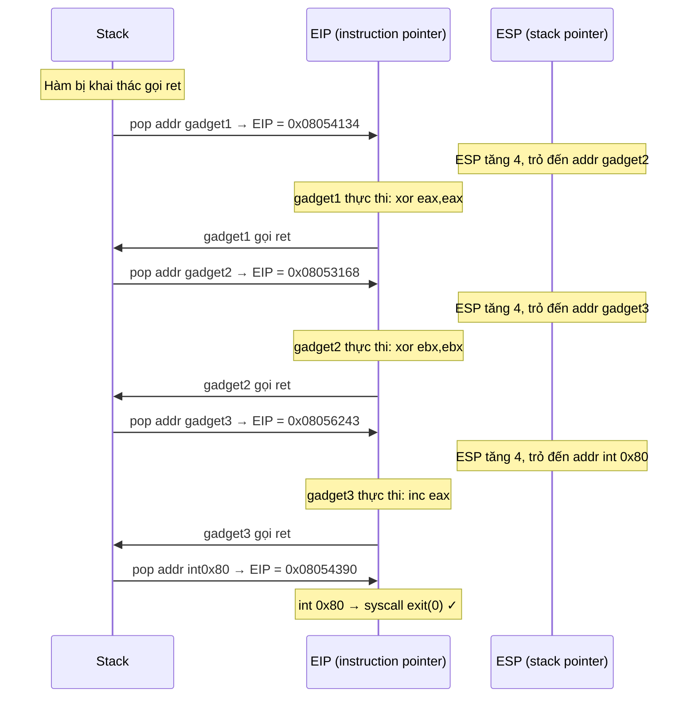
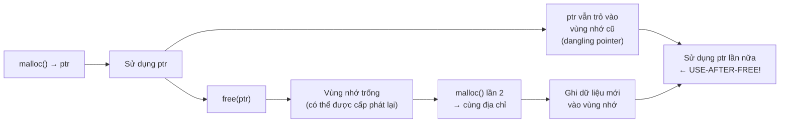

# Buổi 10: ROP & Heap Overflow

## Mục lục

1. [Tấn công ROP (Return Oriented Programming)](#rop)
2. [Khai thác lỗ hổng trên bộ nhớ Heap](#heap)
3. [Câu hỏi trắc nghiệm](#quiz)

---

## 1. Tấn công ROP (Return Oriented Programming) {#rop}

### 1.1 Nhắc lại – Buffer Overflow cơ bản

Khi khai thác lỗ hổng tràn bộ đệm (buffer overflow), trường hợp lý tưởng là:

- Kiểm soát được **return address** (không có stack canary).
- Có thể **truyền shellcode vào stack và thực thi** (biên dịch với `-z execstack`).

Tuy nhiên, trong thực tế tồn tại nhiều ràng buộc hơn:

| Tình huống | Kỹ thuật tương ứng |
|---|---|
| Off-by-one, buffer nhỏ, không ghi đè được return addr | Cần kỹ thuật phức tạp hơn |
| Stack không cho phép thực thi code | **Return-to-libc** hoặc **ROP** |
| Shellcode quá dài, phức tạp | ROP |

---

### 1.2 Tại sao cần ROP? – DEP/NX

**DEP (Data Execution Prevention)** – hay còn gọi là **NX (No-eXecute)**, **W^X** – là cơ chế bảo mật ngăn chặn việc thực thi code trên các vùng nhớ dữ liệu.

!!! info "Nguyên tắc W^X"
    Không có vùng nhớ nào được phép **vừa ghi (Write) vừa thực thi (Execute)** cùng một lúc. Hai quyền này loại trừ nhau.

**Phân loại permission vùng nhớ:**

```
Không có DEP:
  .text     → R-X (Read, Execute)
  .rodata   → R-- (Read)
  Heap      → RWX (Read, Write, Execute)   ← nguy hiểm!
  Stack     → RWX (Read, Write, Execute)   ← nguy hiểm!

Có DEP:
  .text     → R-X (Read, Execute)
  .rodata   → R-- (Read)
  Heap      → RW- (Read, Write)            ← không thực thi được
  Stack     → RW- (Read, Write)            ← không thực thi được
```

Khi DEP được bật, nếu attacker nhảy vào stack để thực thi shellcode → **Segmentation Fault**. Shellcode truyền vào stack không thể chạy.

Kiểm tra với `checksec`:
```bash
$ checksec ./binary
    Arch:     i386-32-little
    CANARY:   disabled
    FORTIFY:  disabled
    NX:       ENABLED      ← DEP đang bật
    PIE:      disabled
```

---

### 1.3 Bypass DEP – Ý tưởng ROP

**Return-to-libc** là tiền thân của ROP: nhảy vào các hàm sẵn có trong libc (ví dụ `system()`). Tuy nhiên có nhược điểm:

- Cần tìm đúng địa chỉ hàm libc.
- Có thể có tác dụng phụ không mong muốn.
- **ASLR** có thể làm địa chỉ libc thay đổi mỗi lần chạy.

**ROP – Return Oriented Programming** khắc phục bằng cách:

!!! tip "Ý tưởng cốt lõi của ROP"
    Thay vì inject code mới, **tái sử dụng các đoạn code có sẵn** trong chương trình (binary hoặc thư viện đã load). Mỗi đoạn nhỏ gọi là **gadget**.

---

### 1.4 Gadget là gì?

**Gadget** là một chuỗi các lệnh assembly liên tiếp có ý nghĩa, và **kết thúc bằng lệnh `ret`**.

```asm
; Ví dụ các gadgets:
pop eax
ret

xor ebx, ebx
ret

mov edx, eax
ret

int 0x80
ret
```

Nhiều gadgets được **nối (chain) với nhau** → tạo thành **ROP Chain**, tương đương với shellcode nhưng không cần vùng nhớ có quyền execute.

---

### 1.5 Tìm Gadget ở đâu?

Gadget có thể nằm ở:

1. **Trong các hàm thông thường** của binary.
2. **Ẩn bên trong các byte của lệnh khác** – do cách encode lệnh x86 (biến độ dài), một chuỗi byte có thể được decode theo nhiều cách.

**Ví dụ kỹ thuật:**
```
Lệnh gốc:  e9 5a c3 ff ff  →  jmp PC+0xffffc35a
Nhưng nếu bắt đầu đọc từ byte thứ 2:
            5a c3           →  pop edx; ret
```
→ Đây là một gadget hợp lệ dù không phải ý định ban đầu của lập trình viên!

**Công cụ tìm gadget:**

```bash
$ ROPgadget --binary ./smashme.bin --asm "popl %edx; ret"
Gadgets information
============================================================
0x0806eb0a : popl %edx; ret
0x08081736 : popl %edx; ret

Total opcodes found: 2
```

---

### 1.6 ROP Chain – Cơ chế hoạt động

**Câu hỏi: Làm sao để chain các gadget lại với nhau?**

**Trả lời:** Bằng cách sắp xếp **địa chỉ của các gadget** trên stack theo thứ tự thực thi mong muốn.

```
Mục tiêu: thực thi exit(0) tương đương shellcode:
  xor eax, eax   ; eax = 0 (syscall number cho exit)
  xor ebx, ebx   ; ebx = 0 (exit code)
  inc eax        ; eax = 1 (sys_exit = 1 trên x86 Linux 32-bit)
  int 0x80       ; gọi syscall
```

**Các gadget tương ứng:**
```
gadget1: xor eax, eax; ret   @ 0x08054134
gadget2: xor ebx, ebx; ret   @ 0x08053168
gadget3: inc eax; ret        @ 0x08056243
gadget4: int 0x80            @ 0x08054390
```

**Layout của stack khi exploit:**

```
Địa chỉ thấp (lower)
┌────────────────────────────┐
│         buf (filler)       │
├────────────────────────────┤
│         saved ebp          │
├────────────────────────────┤  ← return address bị ghi đè
│  0x08054134  (gadget 1)    │  ← esp trỏ vào đây khi hàm ret
├────────────────────────────┤
│  0x08053168  (gadget 2)    │
├────────────────────────────┤
│  0x08056243  (gadget 3)    │
├────────────────────────────┤
│  0x08054390  (int 0x80)    │
└────────────────────────────┘
Địa chỉ cao (higher)
```

**Cơ chế thực thi từng bước:**



!!! note "Nguyên lý then chốt"
    Lệnh `ret` thực chất là `pop eip` – nó lấy giá trị từ vị trí `esp` đang trỏ vào và gán cho `eip`, sau đó tăng `esp` lên 4. Đây chính là cơ chế mà ROP chain khai thác: mỗi gadget kết thúc bằng `ret` sẽ tự động "nhảy" tới gadget tiếp theo trong danh sách trên stack.

---

### 1.7 Ví dụ ROP nâng cao: sys_write

**Mục tiêu:** Gọi `write(1, str_addr, 13)` để in chuỗi ra stdout.

```asm
; Shellcode tương đương:
mov eax, 4          ; syscall number: sys_write
mov ebx, 1          ; fd = stdout
mov ecx, str_addr   ; địa chỉ chuỗi cần in
mov edx, 13         ; độ dài chuỗi
int 0x80
```

**Các gadgets tìm được:**

```asm
gadget1: pop eax; ret
gadget2: pop ebx; ret
gadget3: leal ecx, [esp+12]; ret   ; ecx = esp+12 (trỏ vào data trên stack)
gadget4: pop edx; ret
gadget5: int 0x80; ret
```

!!! warning "Lưu ý quan trọng"
    Không phải lúc nào cũng tìm được gadget gán trực tiếp giá trị cố định như `mov eax, 4`. Thay vào đó, dùng `pop eax; ret` và **đặt sẵn giá trị `4` trên stack** để gadget pop lên.

**Layout stack hoàn chỉnh:**

```
┌────────────────────────────┐
│         buf (filler)       │
├────────────────────────────┤
│  addr gadget1 (pop eax)    │  ← return addr bị ghi đè
├────────────────────────────┤
│  0x4                       │  ← giá trị cho gadget1 pop vào eax
├────────────────────────────┤
│  addr gadget2 (pop ebx)    │
├────────────────────────────┤
│  0x1                       │  ← giá trị cho gadget2 pop vào ebx
├────────────────────────────┤
│  addr gadget3 (lea ecx)    │
├────────────────────────────┤
│  addr gadget4 (pop edx)    │
├────────────────────────────┤
│  0xd (= 13)                │  ← giá trị cho gadget4 pop vào edx
├────────────────────────────┤
│  addr gadget5 (int 0x80)   │
├────────────────────────────┤
│  "hello world\n"           │  ← gadget3 dùng [esp+12] để trỏ vào đây
└────────────────────────────┘
```

---

### 1.8 Stack Pivoting

!!! info "Tự nghiên cứu thêm"
    **Stack Pivoting** là kỹ thuật thay đổi giá trị của `esp` (stack pointer) để trỏ tới một vùng nhớ khác mà attacker kiểm soát. Hữu ích khi không gian stack hiện tại không đủ để chứa ROP chain. Thường dùng gadget dạng `xchg esp, eax; ret` hoặc `mov esp, eax; ret`.

---

## 2. Khai thác lỗ hổng trên bộ nhớ Heap {#heap}

### 2.1 Cơ bản về bộ nhớ Heap

**Heap** là vùng bộ nhớ dùng cho **cấp phát động tại runtime**:

```c
// Cấp phát vùng nhớ
char *ptr = malloc(0x100);

// Sử dụng
fgets(ptr, 0x100, stdin);

// Giải phóng
free(ptr);
```

**Vị trí trong không gian bộ nhớ (32-bit):**

```
0xFFFFFFFF  ─── End of memory
               Stack         (phát triển xuống ↓)
0xbfff0000  ─── Top of stack
               ...
0x09104000  ─── Top of heap
               Heap          (phát triển lên ↑)
               .bss / .data
0x08048000  ─── .text segment (ELF)
               Libraries (libc)
0x00000000  ─── Start of memory
```

!!! warning "Đặc điểm quan trọng của Heap"
    - Kích thước **không cố định**, có thể tăng/giảm linh hoạt.
    - Dữ liệu **không tự hủy** khi hàm kết thúc (khác stack).
    - Phải **tự giải phóng** bằng `free()` (C) hoặc `delete` (C++), nếu không → **memory leak**.

---

### 2.2 Cấu trúc Heap Chunk (ptmalloc)

Glibc sử dụng **ptmalloc** để quản lý heap. Mỗi vùng nhớ được cấp phát/giải phóng được gọi là một **chunk**.

**Cấu trúc chunk đang sử dụng (allocated):**

```
struct malloc_chunk {
    size_t prev_size;  // Kích thước chunk trước (chỉ hợp lệ khi chunk trước đã free, P=0)
    size_t size;       // Kích thước chunk hiện tại (byte, align 8-byte)
                       // Các bit thấp là flags:
                       //   A: allocated in non-main arena
                       //   M: mmapped
                       //   P: previous-in-use (P=0 → chunk trước đã free)
    // Phần payload (data):
    // ...
};
```

```
Bộ nhớ thực tế (allocated chunk):
┌──────────────────┐
│   prev_size      │  ← *(ptr - 2)
├──────────────────┤
│   size | A M P=1 │  ← *(ptr - 1)   [P=1: chunk trước đang dùng]
├──────────────────┤
│                  │  ← ptr  (con trỏ malloc() trả về)
│    payload       │
│   (user data)    │
│                  │
└──────────────────┘
```

**Cấu trúc chunk đã giải phóng (freed):**

```
Freed chunk (thêm 2 con trỏ fd/bk để liên kết danh sách):
┌──────────────────┐
│   prev_size      │
├──────────────────┤
│   size | A M P=0 │  [P=0: chunk trước đã free]
├──────────────────┤
│   fd (forward)   │  ← con trỏ tới chunk free tiếp theo
├──────────────────┤
│   bk (backward)  │  ← con trỏ tới chunk free trước đó
├──────────────────┤
│   (unused)       │
└──────────────────┘
```

**Mục đích của cấu trúc này:**

- `fd/bk` tạo thành **doubly linked list** các chunk trống → giảm phân mảnh (fragmentation).
- Cho phép `malloc()` tìm chunk trống trong **O(1)**.
- Khi `free()` được gọi, kiểm tra chunk liền kề có trống không → **coalescing** (gộp lại).

---

### 2.3 Các phiên bản Heap Allocator

| Allocator | Sử dụng trong |
|---|---|
| **dlmalloc** | Trình cấp phát tổng quát |
| **ptmalloc** | **glibc** (Linux phổ biến nhất) |
| **tcmalloc** | Google Chrome, Go |
| **jemalloc** | FreeBSD, Firefox |
| **nedmalloc** | Game engines |
| **Hoard** | Multi-threaded apps |

---

### 2.4 Heap Overflow

**Cơ chế:** Tương tự stack overflow – ghi dữ liệu vượt quá kích thước chunk được cấp phát, ghi đè lên dữ liệu của chunk kế tiếp.

**Sự khác biệt so với stack overflow:**

!!! danger "Heap vs Stack Overflow"
    - **Không có stack canary** bảo vệ trên heap.
    - **Không có return address** để ghi đè trực tiếp.
    - Nhưng trên heap thường chứa **các struct, object, function pointer** → ghi đè những thứ này có thể chiếm quyền điều khiển luồng thực thi.

**Ví dụ tấn công Heap Overflow qua function pointer:**

```c
struct toystr {
    void (*message)(char *);  // function pointer – 4 bytes trên x86
    char buffer[20];           // dữ liệu
};
```

```c
// Cấp phát 2 object liên tiếp trên heap
struct toystr *coolguy = malloc(sizeof(struct toystr));
struct toystr *lameguy = malloc(sizeof(struct toystr));

coolguy->message = &print_cool;
lameguy->message = &print_meh;

// LỖI: fgets cho phép nhập tới 200 bytes nhưng buffer chỉ có 20 bytes!
printf("Input coolguy's name: ");
fgets(coolguy->buffer, 200, stdin);   // ← HEAP OVERFLOW!

printf("Input lameguy's name: ");
fgets(lameguy->buffer, 20, stdin);    // bình thường

coolguy->message(coolguy->buffer);
lameguy->message(lameguy->buffer);    // ← con trỏ hàm đã bị ghi đè!
```

**Phân tích layout heap:**

```
Trước khi overflow:
┌─────────────────────────┐
│ chunk header coolguy    │
├─────────────────────────┤
│ message = &print_cool   │  ← 4 bytes
│ buffer[20]              │  ← 20 bytes
├─────────────────────────┤
│ chunk header lameguy    │
├─────────────────────────┤
│ message = &print_meh    │  ← sẽ bị ghi đè!
│ buffer[20]              │
└─────────────────────────┘

Sau khi nhập 200 bytes vào coolguy->buffer:
┌─────────────────────────┐
│ chunk header coolguy    │
├─────────────────────────┤
│ message = &print_cool   │
│ AAAAAAAAAAAAAAAAAAAAAA  │  ← 20 bytes buffer
│ AAAA... (overflow)      │  ← tràn sang chunk lameguy
├─────────────────────────┤
│ AAAA... (header hỏng)   │  ← chunk header bị ghi đè
├─────────────────────────┤
│ 0x41414141 (= "AAAA")   │  ← message pointer bị ghi đè!
│ ...                     │
└─────────────────────────┘
```

→ Khi `lameguy->message(lameguy->buffer)` được gọi, chương trình nhảy tới địa chỉ `0x41414141` → crash, hoặc nếu attacker điền địa chỉ shellcode → **code execution**.

---

### 2.5 Use-After-Free (UAF)

**Định nghĩa:** Lỗ hổng xảy ra khi một vùng nhớ heap đã được **giải phóng (`free()`)** nhưng vẫn còn một **con trỏ (dangling pointer)** trỏ tới đó và tiếp tục được sử dụng.



**Dangling Pointer / Stale Pointer / Wild Pointer:**

!!! danger "Dangling Pointer"
    Là con trỏ còn tồn tại trong code, trỏ tới vùng nhớ đã được `free()`. Không có gì đảm bảo về dữ liệu tại địa chỉ đó sau khi free. Nếu `malloc()` sau đó cấp phát lại vùng nhớ đó, dữ liệu sẽ bị attacker kiểm soát thông qua dangling pointer.

**Mức độ phổ biến:**

UAF cực kỳ phổ biến – chỉ tính riêng Firefox, có hàng nghìn CVE liên quan. Thường xuất hiện nhiều nhất trong:
- Web browsers (Firefox, Chrome)
- PDF readers (Foxit Reader)
- Android kernel
- Bluetooth stack

**Khai thác UAF:**

```c
struct toystr {
    void (*message)(char *);
    char buffer[20];
};

struct person {
    int favorite_num;   // 4 bytes
    int age;            // 4 bytes
    char name[16];      // 16 bytes
};

// Bước 1: Cấp phát và free toystr → dangling pointer còn trỏ vào
struct toystr *victim = malloc(sizeof(struct toystr));
victim->message = &safe_function;
free(victim);  // victim vẫn là dangling pointer!

// Bước 2: Cấp phát struct person vào CÙNG vùng nhớ đó
struct person *p = malloc(sizeof(struct person));
p->favorite_num = 0x41414141;  // ghi vào cùng offset với message!

// Bước 3: Dùng dangling pointer để gọi message
// victim->message bây giờ = 0x41414141
victim->message(victim->buffer);  // nhảy tới 0x41414141 → kiểm soát EIP!
```

**Tại sao UAF là kỹ thuật khai thác ưa thích?**

!!! tip "Ưu điểm của UAF"
    1. **Không cần memory corruption** để khai thác – chỉ là quản lý con trỏ sai.
    2. Có thể dùng để **rò rỉ thông tin** (leak địa chỉ heap/libc).
    3. Có thể dùng để **kích hoạt memory corruption** hoặc chiếm `EIP`.
    4. Khó phát hiện bằng static analysis – chỉ xuất hiện ở một số trạng thái runtime nhất định.

---

### 2.6 Heap Spraying

!!! note "Heap Spraying không phải là lỗ hổng"
    Đây là một **kỹ thuật hỗ trợ khai thác**, giúp tăng xác suất thành công khi địa chỉ heap không xác định (do ASLR).

**Nguyên lý:**

Lấp đầy một lượng lớn heap bằng payload (shellcode hoặc ROP chain) → xác suất cao là bất kỳ địa chỉ nào trong heap cũng trỏ vào payload.

```c
char *filler = "AAAAAAA..."; // payload (shellcode/ROP chain)
for (int i = 0; i < 3000; i++) {
    char *temp = malloc(1000000);   // mỗi lần 1MB
    memcpy(temp, filler, 1000000);
}
// → 3GB của heap chứa đầy payload
// → địa chỉ 0x23456789 có 75% xác suất trỏ vào payload
```

**Hiệu quả trên kiến trúc 32-bit:**

- Không gian địa chỉ tối đa: 4GB (2³²).
- Spray 3GB → **75% xác suất** địa chỉ bất kỳ là hợp lệ.
- Dùng trong browser exploit qua JavaScript:

```javascript
// Ví dụ heap spray qua JavaScript trong trang HTML độc hại:
var memory = new Array();
for (var i = 0; i < 0x100; i++) {
    memory[i] = ROPNOP + ROP_CHAIN;
}
```

**Hạn chế trên 64-bit:**

!!! warning "64-bit"
    Không gian địa chỉ 64-bit là 2⁶⁴ ≈ 18.4 × 10¹⁸ bytes. Cần spray ~18,446,744 terabyte → **bất khả thi**. Heap spraying toàn bộ không hiệu quả trên 64-bit. Tuy nhiên, **targeted spray** (spray có chủ đích vào vùng nhớ cụ thể) vẫn hữu dụng khi đã biết trước một phần địa chỉ.

---

### 2.7 Metadata Corruption

**Nguyên lý:** Khai thác bằng cách phá vỡ **metadata của heap chunk** (các trường `size`, `prev_size`, `fd`, `bk`) để lừa trình cấp phát thực hiện **ghi tùy ý vào bộ nhớ**.

**Cấu trúc chunk và metadata:**

```
Allocated chunk:
┌──────────────────────────────────┐
│  prev_size    ← *(buffer - 2)    │
│  size (flags) ← *(buffer - 1)    │  ← Heap metadata
├──────────────────────────────────┤
│  payload      ← *buffer          │  ← User data
└──────────────────────────────────┘

Freed chunk:
┌──────────────────────────────────┐
│  prev_size    ← *(buffer - 2)    │
│  size (flags) ← *(buffer - 1)    │  ← Heap metadata
├──────────────────────────────────┤
│  fd           ← *buffer          │  ← Forward pointer
│  bk           ← *(buffer + 1)    │  ← Backward pointer
└──────────────────────────────────┘
```

**Kỹ thuật Heap Unlink:**

Khi `free()` được gọi và hai chunk liền kề đều trống, glibc sẽ **coalesce** (gộp) chúng bằng thao tác **unlink** từ doubly linked list:

```c
// Thao tác unlink (đơn giản hóa):
// P->fd->bk = P->bk
// P->bk->fd = P->fd
```

Nếu attacker ghi đè `fd` và `bk` của một chunk đã free (qua overflow), thao tác unlink sẽ thực hiện **ghi tùy ý**:

```
fd = địa chỉ muốn ghi
bk = giá trị muốn ghi
→ *(fd + 12) = bk  (ghi đè GOT entry, function pointer, v.v.)
```

!!! danger "Lưu ý"
    Kỹ thuật unlink cổ điển đã được **vá trong glibc** hiện đại (thêm các kiểm tra tính hợp lệ của `fd->bk == chunk` và `bk->fd == chunk`). Các kỹ thuật hiện đại phức tạp hơn nhiều (fastbin attack, tcache poisoning, house of X...).

---

## 3. Câu hỏi trắc nghiệm {#quiz}

---

**Câu 1.** DEP (Data Execution Prevention) ngăn chặn điều gì trong khai thác buffer overflow?

- A. Ghi đè return address trên stack
- B. Thực thi shellcode được inject vào các vùng nhớ dữ liệu như stack, heap
- C. Dò tìm địa chỉ hàm libc
- D. Sử dụng stack canary

??? info "Đáp án & Giải thích"
    **Đáp án: B**

    DEP/NX đảm bảo các vùng nhớ dữ liệu (stack, heap, .bss) chỉ có quyền Read/Write, không có quyền Execute. Do đó shellcode inject vào stack sẽ không thể chạy → Segmentation Fault. DEP không ngăn việc ghi đè return address, cũng không liên quan đến stack canary.

---

**Câu 2.** Nguyên tắc W^X có nghĩa là gì?

- A. Một vùng nhớ phải có cả quyền Write và Execute
- B. Không có vùng nhớ nào được phép vừa có quyền Write vừa có quyền Execute
- C. Chỉ vùng nhớ có quyền Execute mới được đọc
- D. Write trước, Execute sau

??? info "Đáp án & Giải thích"
    **Đáp án: B**

    W^X (Write XOR Execute) là nguyên tắc cơ bản của DEP: tại mọi thời điểm, một trang nhớ chỉ được có một trong hai quyền: hoặc là ghi được (Write) hoặc là thực thi được (Execute), không bao giờ cả hai cùng lúc. Điều này ngăn attacker inject và thực thi code tùy ý.

---

**Câu 3.** ROP (Return Oriented Programming) khác Return-to-libc ở điểm nào chính?

- A. ROP không cần biết địa chỉ của bất kỳ hàm nào
- B. ROP không cần dùng toàn bộ hàm, chỉ dùng các đoạn code nhỏ (gadget) kết thúc bằng `ret`
- C. ROP bypass được ASLR hoàn toàn
- D. ROP chỉ hoạt động trên kiến trúc 64-bit

??? info "Đáp án & Giải thích"
    **Đáp án: B**

    Return-to-libc nhảy vào đầu một hàm libc hoàn chỉnh (vd: `system()`). ROP linh hoạt hơn: tận dụng các đoạn code cực ngắn gọi là gadget (thường 1–3 lệnh + `ret`) từ bất kỳ đâu trong binary hoặc thư viện. Điều này cho phép "lập trình" hành vi tùy ý mà không cần hàm libc cụ thể.

---

**Câu 4.** Gadget trong ROP phải kết thúc bằng lệnh gì?

- A. `call`
- B. `jmp`
- C. `ret`
- D. `nop`

??? info "Đáp án & Giải thích"
    **Đáp án: C**

    Gadget **bắt buộc phải kết thúc bằng `ret`**. Lệnh `ret` thực chất là `pop eip`, nó lấy địa chỉ tiếp theo từ stack (tại vị trí `esp`) và nhảy đến đó. Đây là cơ chế "chuyển quyền điều khiển" từ gadget này sang gadget tiếp theo trong ROP chain.

---

**Câu 5.** Trong ROP chain, cơ chế nối (chain) các gadget với nhau dựa trên điều gì?

- A. Ghi địa chỉ của gadget tiếp theo vào thanh ghi `eax`
- B. Sắp xếp địa chỉ các gadget theo thứ tự trên stack
- C. Sử dụng lệnh `jmp` để nhảy giữa các gadget
- D. Liên kết địa chỉ gadget qua linked list

??? info "Đáp án & Giải thích"
    **Đáp án: B**

    Khi một gadget thực thi lệnh `ret`, nó pop địa chỉ tại vị trí `esp` vào `eip` và tăng `esp` lên 4. Nếu attacker đã sắp xếp sẵn địa chỉ của gadget tiếp theo tại `esp` (trên stack), `eip` sẽ tự động nhảy đến đó. Cứ thế tiếp diễn → chuỗi gadget được thực thi tuần tự.

---

**Câu 6.** Gadget ẩn (hidden gadget) trong x86 là gì?

- A. Gadget nằm trong vùng nhớ đã được mã hóa
- B. Gadget hình thành từ việc đọc giữa chừng các byte của lệnh assembly khác, do x86 dùng encoding biến độ dài
- C. Gadget chỉ có trong thư viện libc
- D. Gadget không có lệnh `ret`

??? info "Đáp án & Giải thích"
    **Đáp án: B**

    Kiến trúc x86 sử dụng độ dài lệnh biến đổi (variable-length instruction encoding). Điều này có nghĩa là cùng một chuỗi byte có thể được giải mã thành các lệnh khác nhau tùy vào điểm bắt đầu đọc. Ví dụ: byte `5a c3` trong một lệnh `jmp` dài hơn, nhưng nếu đọc từ offset đó trực tiếp, lại decode thành `pop edx; ret` – một gadget hợp lệ!

---

**Câu 7.** Công cụ nào sau đây thường được dùng để tìm ROP gadget trong binary?

- A. `gdb`
- B. `ROPgadget`
- C. `strace`
- D. `objdump` (chỉ duy nhất)

??? info "Đáp án & Giải thích"
    **Đáp án: B**

    `ROPgadget` là công cụ chuyên dụng tìm ROP gadget trong binary. Nó tự động quét toàn bộ binary (kể cả các gadget ẩn trong giữa các lệnh khác) và liệt kê địa chỉ của chúng. `objdump` chỉ disassemble theo cách thông thường, không tìm gadget ẩn.

---

**Câu 8.** Khi dùng gadget `pop eax; ret` trong ROP chain để gán giá trị `4` vào `eax`, attacker cần làm gì?

- A. Đặt giá trị `4` vào thanh ghi `ebx` trước
- B. Đặt giá trị `4` ngay sau địa chỉ của gadget trên stack
- C. Gọi hàm libc để set eax
- D. Không cần làm gì thêm

??? info "Đáp án & Giải thích"
    **Đáp án: B**

    Lệnh `pop eax` lấy giá trị từ vị trí `esp` đang trỏ tới và gán vào `eax`, đồng thời tăng `esp` lên 4. Do đó, để gadget `pop eax; ret` gán giá trị `4`, attacker phải đặt `0x00000004` ngay sau địa chỉ của gadget đó trên stack. Khi gadget chạy, `pop eax` sẽ lấy `4`, và `ret` sẽ lấy địa chỉ gadget tiếp theo.

---

**Câu 9.** Stack Pivoting trong ROP là kỹ thuật gì?

- A. Tăng kích thước stack để chứa nhiều gadget hơn
- B. Thay đổi giá trị `esp` để trỏ tới vùng nhớ khác mà attacker kiểm soát
- C. Đặt gadget xen kẽ với dữ liệu trên stack
- D. Dùng nhiều gadget `ret` liên tiếp

??? info "Đáp án & Giải thích"
    **Đáp án: B**

    Stack Pivoting thay đổi `esp` (stack pointer) sang một vùng nhớ khác – thường là heap hoặc vùng `.bss` – nơi attacker đã chuẩn bị sẵn ROP chain. Hữu ích khi không gian stack hiện tại quá nhỏ. Thường dùng gadget như `xchg esp, eax; ret` hoặc `mov esp, eax; ret`.

---

**Câu 10.** Vì sao ROP chain bypass được DEP/NX?

- A. ROP vô hiệu hóa bit NX trong page table
- B. ROP không inject code mới mà tái sử dụng code đã có trong vùng nhớ `.text` (có quyền execute)
- C. ROP chạy trên kernel mode
- D. ROP dùng syscall trực tiếp không qua user space

??? info "Đáp án & Giải thích"
    **Đáp án: B**

    DEP/NX chỉ ngăn thực thi code trong vùng nhớ **dữ liệu** (stack, heap). Các gadget của ROP đều nằm trong vùng `.text` của binary hoặc thư viện – vốn đã có quyền Execute (R-X). Do không inject code mới mà chỉ điều hướng thực thi qua các đoạn code sẵn có, ROP hoàn toàn bypass DEP.

---

**Câu 11.** Heap trong chương trình C phát triển theo hướng nào trong bộ nhớ?

- A. Từ địa chỉ cao xuống địa chỉ thấp (giống stack)
- B. Từ địa chỉ thấp lên địa chỉ cao
- C. Ngẫu nhiên
- D. Không phát triển, kích thước cố định

??? info "Đáp án & Giải thích"
    **Đáp án: B**

    Heap phát triển từ địa chỉ thấp lên địa chỉ cao (ngược chiều với stack). Mỗi lần `malloc()` cấp phát chunk mới, chunk đó sẽ nằm ở địa chỉ cao hơn các chunk trước. Điều này có nghĩa là nếu ghi tràn một chunk, dữ liệu tràn sẽ lan sang chunk ở địa chỉ cao hơn (chunk được cấp phát sau).

---

**Câu 12.** Trường `prev_size` trong heap chunk có ý nghĩa gì?

- A. Kích thước của chunk hiện tại
- B. Kích thước của chunk trước đó – chỉ hợp lệ khi chunk trước đã được free (P=0)
- C. Số lần chunk đã được cấp phát
- D. Con trỏ tới chunk trước

??? info "Đáp án & Giải thích"
    **Đáp án: B**

    `prev_size` chứa kích thước của chunk liền trước (về phía địa chỉ thấp hơn). Trường này **chỉ hợp lệ và được sử dụng khi chunk trước đó đã được `free()`** (tức là bit P=0 trong trường `size` của chunk hiện tại). Khi `free()` muốn coalesce với chunk trước, nó dùng `prev_size` để tính địa chỉ của chunk trước.

---

**Câu 13.** Trong ptmalloc, bit `P` trong trường `size` của heap chunk có ý nghĩa gì?

- A. Protected – chunk được bảo vệ
- B. Previous-in-use – P=1 nghĩa là chunk liền trước đang được sử dụng (allocated)
- C. Pointer – trỏ tới chunk tiếp theo
- D. Page – chunk được cấp phát từ mmap

??? info "Đáp án & Giải thích"
    **Đáp án: B**

    Bit `P` (Previous-in-use) = 1 có nghĩa chunk liền trước đang được **sử dụng** (allocated), do đó trường `prev_size` không có ý nghĩa. Khi P=0, chunk liền trước đã được `free()`, và trường `prev_size` hợp lệ, được dùng để coalesce.

---

**Câu 14.** Tại sao heap không có cơ chế bảo vệ như stack canary?

- A. Heap được bảo vệ bởi ASLR thay thế
- B. Heap không có return address để bảo vệ, và cấu trúc heap phức tạp hơn stack
- C. Stack canary quá tốn tài nguyên để áp dụng cho heap
- D. Heap không bao giờ bị overflow

??? info "Đáp án & Giải thích"
    **Đáp án: B**

    Stack canary được đặt giữa local variables và return address để phát hiện overflow **trước khi** return address bị sử dụng. Trên heap, không có cơ chế "return" tương tự – overflow trên heap gây hại theo cách khác (ghi đè object/function pointer của chunk kế tiếp). Kiến trúc heap cũng phức tạp và linh hoạt hơn stack.

---

**Câu 15.** Trong ví dụ Heap Overflow với `struct toystr`, `fgets(coolguy->buffer, 200, stdin)` gây ra lỗi vì lý do gì?

- A. `fgets` không hoạt động với heap
- B. Buffer chỉ có 20 bytes nhưng cho phép nhập tới 200 bytes
- C. `coolguy` chưa được khởi tạo
- D. `stdin` không hợp lệ

??? info "Đáp án & Giải thích"
    **Đáp án: B**

    `coolguy->buffer` chỉ được khai báo 20 bytes (`char buffer[20]`), nhưng `fgets` cho phép nhập tới 200 bytes. 180 bytes dư thừa sẽ tràn sang chunk tiếp theo (`lameguy`), ghi đè lên `lameguy->message` (function pointer) và dữ liệu của nó.

---

**Câu 16.** Use-After-Free (UAF) là lỗ hổng thuộc loại nào?

- A. Memory corruption (hỏng bộ nhớ)
- B. Logic error / pointer mismanagement (quản lý con trỏ sai)
- C. Integer overflow
- D. Format string vulnerability

??? info "Đáp án & Giải thích"
    **Đáp án: B**

    UAF **không nhất thiết cần memory corruption** để khai thác. Nó là lỗi logic trong quản lý vòng đời đối tượng: lập trình viên `free()` bộ nhớ nhưng vẫn giữ con trỏ và tiếp tục dùng. Đây là vấn đề thuần túy về quản lý con trỏ sai, không phải ghi vượt biên như heap overflow.

---

**Câu 17.** "Dangling pointer" là gì?

- A. Con trỏ NULL
- B. Con trỏ trỏ tới vùng nhớ đã được `free()` nhưng chưa được gán NULL
- C. Con trỏ tới stack
- D. Con trỏ tới địa chỉ cao nhất trong bộ nhớ

??? info "Đáp án & Giải thích"
    **Đáp án: B**

    Dangling pointer (còn gọi là stale pointer, wild pointer) là con trỏ vẫn giữ địa chỉ của một vùng nhớ đã được `free()`. Sau khi `free()`, vùng nhớ có thể được cấp phát lại cho mục đích khác. Nếu code tiếp tục đọc/ghi qua dangling pointer, hành vi sẽ không xác định và có thể bị khai thác.

---

**Câu 18.** Để khai thác UAF, attacker thường làm gì sau khi vùng nhớ bị `free()`?

- A. Ghi đè return address trên stack
- B. Gọi `malloc()` với một kiểu struct khác để chiếm lại vùng nhớ đó, sau đó thao tác qua dangling pointer
- C. Dùng heap spraying để lấp đầy heap
- D. Vô hiệu hóa stack canary

??? info "Đáp án & Giải thích"
    **Đáp án: B**

    Quy trình khai thác UAF điển hình: (1) `free()` object A → dangling pointer `p` vẫn trỏ vào; (2) `malloc()` object B có cùng kích thước → allocator cấp phát lại cùng vùng nhớ; (3) Ghi giá trị độc hại vào object B (ví dụ: địa chỉ shellcode vào vị trí tương ứng với function pointer); (4) Gọi method qua dangling pointer `p` → nhảy tới địa chỉ attacker kiểm soát.

---

**Câu 19.** Tại sao UAF phổ biến trong web browser?

- A. Browser dùng ngôn ngữ unsafe như Assembly
- B. Browser quản lý nhiều đối tượng DOM/JS phức tạp có vòng đời khó quản lý, dễ xảy ra free() sớm trong các race condition hoặc event handler
- C. Browser không dùng ASLR
- D. Browser chạy với quyền root

??? info "Đáp án & Giải thích"
    **Đáp án: B**

    Browser phải quản lý hàng nghìn đối tượng JavaScript/DOM với vòng đời phức tạp, garbage collection, event handler, và race condition. Khi một element bị xóa khỏi DOM trong lúc đang được tham chiếu bởi một event handler khác, UAF xảy ra. Engine JavaScript thường implement bằng C++ – không có memory safety built-in.

---

**Câu 20.** Heap Spraying có phải là lỗ hổng bảo mật không?

- A. Có, là lỗ hổng rất nghiêm trọng
- B. Không, đây là kỹ thuật hỗ trợ khai thác, không phải lỗ hổng
- C. Chỉ là lỗ hổng trên hệ điều hành Windows
- D. Là lỗ hổng trong heap allocator

??? info "Đáp án & Giải thích"
    **Đáp án: B**

    Heap Spraying **không phải là vulnerability hay security flaw**. Đây là một kỹ thuật (technique) được attacker sử dụng như một phần của exploit chain – cụ thể là để tăng khả năng payload nằm ở địa chỉ có thể đoán được trong heap, giúp bypass ASLR. Bản thân nó không gây hại nếu không kết hợp với lỗ hổng khác.

---

**Câu 21.** Heap Spraying giúp bypass cơ chế bảo mật nào?

- A. Stack Canary
- B. ASLR (Address Space Layout Randomization)
- C. DEP/NX
- D. RELRO

??? info "Đáp án & Giải thích"
    **Đáp án: B**

    ASLR ngẫu nhiên hóa địa chỉ của heap (và stack, libraries) mỗi lần chạy. Heap spraying phản công bằng cách lấp đầy một lượng cực lớn heap với payload → dù địa chỉ bắt đầu của heap ngẫu nhiên, xác suất một địa chỉ bất kỳ trỏ vào payload là rất cao (75% trên 32-bit khi spray 3GB).

---

**Câu 22.** Trên kiến trúc 32-bit, nếu spray 3GB payload vào heap (tổng không gian địa chỉ 4GB), xác suất một địa chỉ bất kỳ trỏ vào payload là bao nhiêu?

- A. 25%
- B. 50%
- C. 75%
- D. 100%

??? info "Đáp án & Giải thích"
    **Đáp án: C**

    3GB / 4GB = 75%. Nếu heap chiếm 3GB trong không gian địa chỉ 4GB, thì 3/4 = 75% địa chỉ bất kỳ trong không gian bộ nhớ sẽ trỏ vào vùng heap đã được spray.

---

**Câu 23.** Tại sao Heap Spraying toàn bộ không hiệu quả trên kiến trúc 64-bit?

- A. 64-bit có DEP mạnh hơn
- B. Không gian địa chỉ 64-bit (~18 exabyte) quá lớn để spray toàn bộ
- C. Heap allocator 64-bit dùng encryption
- D. ASLR trên 64-bit không thể bypass

??? info "Đáp án & Giải thích"
    **Đáp án: B**

    Không gian địa chỉ 64-bit là 2⁶⁴ ≈ 18.4 × 10¹⁸ bytes = ~18,446,744 terabyte. Để spray toàn bộ không gian này là hoàn toàn bất khả thi về mặt phần cứng và thời gian. Tuy nhiên, **targeted heap spray** (spray có chủ đích vào một vùng nhỏ đã biết offset) vẫn hữu ích.

---

**Câu 24.** Heap Spraying thường được dùng trong môi trường nào nhất?

- A. Kernel exploits
- B. Browser exploits qua JavaScript trong trang HTML độc hại
- C. Network protocol exploits
- D. Firmware exploits

??? info "Đáp án & Giải thích"
    **Đáp án: B**

    Heap Spraying được ứng dụng rộng rãi nhất trong **browser exploits**, vì: (1) Browser expose JavaScript API cho phép gọi `new Array()`, `new String()` v.v. để cấp phát heap; (2) Attacker có thể nhúng mã JS vào trang HTML độc hại; (3) Spray lượng lớn ROP chain/shellcode thông qua JavaScript trước khi kích hoạt lỗ hổng.

---

**Câu 25.** Metadata Corruption khai thác điều gì trong heap?

- A. Con trỏ hàm trong struct người dùng
- B. Các trường metadata của chunk (`size`, `prev_size`, `fd`, `bk`) để lừa heap allocator ghi tùy ý vào bộ nhớ
- C. Stack frame của hàm `malloc()`
- D. Thanh ghi CPU

??? info "Đáp án & Giải thích"
    **Đáp án: B**

    Metadata Corruption phá vỡ tính toàn vẹn của các trường quản lý nội bộ của heap chunk. Khi allocator thực hiện thao tác như coalescing (unlink), nó dùng `fd`/`bk` để cập nhật linked list. Nếu attacker ghi đè `fd` và `bk` với giá trị giả mạo, thao tác unlink sẽ thực hiện ghi tùy ý vào địa chỉ mong muốn.

---

**Câu 26.** Thao tác "coalescing" trong heap allocator là gì?

- A. Tách một chunk lớn thành nhiều chunk nhỏ
- B. Gộp các chunk trống liền kề lại thành một chunk lớn hơn để giảm phân mảnh
- C. Sao chép dữ liệu giữa các chunk
- D. Sắp xếp lại các chunk theo kích thước

??? info "Đáp án & Giải thích"
    **Đáp án: B**

    Coalescing (hay merging) là quá trình gộp các chunk trống liền kề nhau thành một chunk lớn hơn. Khi `free()` được gọi, allocator kiểm tra chunk liền trước và liền sau: nếu chúng cũng đang trống (free), chúng sẽ được gộp lại. Điều này giúp giảm fragmentation và tối ưu sử dụng bộ nhớ.

---

**Câu 27.** Trong heap unlink exploitation cổ điển, nếu attacker ghi đè `fd = addr_target` và `bk = value`, kết quả thao tác unlink là gì?

- A. `*addr_target = addr_target`
- B. Ghi `value` vào vùng nhớ gần `addr_target` (cụ thể là `*(addr_target + 12) = value` trên 32-bit)
- C. `*value = addr_target`
- D. Xóa `addr_target` khỏi bộ nhớ

??? info "Đáp án & Giải thích"
    **Đáp án: B**

    Trong unlink cổ điển: `fd->bk = bk` tức là `*(fd + 12) = bk`. Nếu `fd = addr_target - 12` và `bk = shellcode_addr`, kết quả là `*addr_target = shellcode_addr` – ghi đè một entry trong GOT hoặc function pointer. (Lưu ý: offset 12 vì `bk` là trường thứ 4 trong struct, offset 12 trên 32-bit).

---

**Câu 28.** Tại sao kỹ thuật heap unlink cổ điển không còn hoạt động trên glibc hiện đại?

- A. glibc hiện đại không có thao tác unlink
- B. glibc đã thêm kiểm tra tính hợp lệ: `fd->bk == chunk` và `bk->fd == chunk`
- C. Heap hiện đại dùng singly linked list thay vì doubly linked list
- D. Kỹ thuật này bị patch ở kernel level

??? info "Đáp án & Giải thích"
    **Đáp án: B**

    glibc đã thêm kiểm tra: trước khi unlink chunk P, allocator kiểm tra `P->fd->bk == P` và `P->bk->fd == P`. Nếu attacker ghi đè `fd` và `bk` giả mạo, hai con trỏ giả mạo này sẽ không trỏ ngược lại P → kiểm tra thất bại → `abort()`. Điều này làm vô hiệu kỹ thuật unlink cổ điển.

---

**Câu 29.** Lý do chính khiến UAF khó phát hiện bằng static analysis là gì?

- A. UAF code quá ngắn để phân tích
- B. UAF chỉ xảy ra ở một số trạng thái runtime cụ thể, không thể suy ra từ code tĩnh
- C. Compiler tự động loại bỏ dangling pointer khỏi code
- D. Static analyzer không đọc được heap

??? info "Đáp án & Giải thích"
    **Đáp án: B**

    Static analysis phân tích code mà không chạy chương trình. UAF phụ thuộc vào thứ tự thực thi cụ thể, race condition, và trạng thái runtime. Ví dụ: một dangling pointer chỉ trở thành nguy hiểm khi có `malloc()` sau đó cấp phát lại cùng vùng nhớ trong một code path cụ thể. Điều này rất khó suy luận thuần túy từ code tĩnh.

---

**Câu 30.** Phương pháp nào giúp tìm lỗi UAF hiệu quả hơn?

- A. Code review thủ công toàn bộ source code
- B. Symbolic Execution kết hợp Constraint Solver (như KLEE, SAGE)
- C. Kiểm tra checksec output
- D. Chạy thử với input ngẫu nhiên thông thường

??? info "Đáp án & Giải thích"
    **Đáp án: B**

    Symbolic Execution (thực thi biểu tượng) dùng các giá trị biểu tượng thay cho giá trị cụ thể, kết hợp Constraint Solver để khám phá nhiều đường thực thi có thể xảy ra, bao gồm các code path đặc biệt dẫn đến UAF. Kỹ thuật này hiệu quả hơn static analysis thuần túy hay fuzzing ngẫu nhiên để tìm UAF.

---

**Câu 31.** Lệnh `ret` trong x86 thực chất tương đương với lệnh gì?

- A. `jmp [esp]`
- B. `pop eip` (lấy giá trị từ `[esp]` vào `eip`, tăng `esp` lên 4)
- C. `push eip`
- D. `mov eip, [esp+4]`

??? info "Đáp án & Giải thích"
    **Đáp án: B**

    `ret` hoạt động như `pop eip`: đọc 4 bytes từ địa chỉ `esp` đang trỏ tới, gán vào `eip`, và tăng `esp` lên 4. Đây là lý do ROP chain hoạt động được: mỗi `ret` ở cuối gadget tự động "load" địa chỉ gadget tiếp theo từ stack vào `eip`.

---

**Câu 32.** `checksec` là công cụ dùng để làm gì?

- A. Kiểm tra memory leak
- B. Kiểm tra các cơ chế bảo vệ binary (canary, NX, PIE, RELRO...)
- C. Tìm gadget trong binary
- D. Debug chương trình

??? info "Đáp án & Giải thích"
    **Đáp án: B**

    `checksec` là công cụ (thường đi kèm với `pwntools`) kiểm tra binary có được biên dịch với các cơ chế bảo vệ nào: Stack Canary, NX/DEP, PIE (Position Independent Executable), RELRO (RELocation Read-Only), FORTIFY. Output của nó cho attacker biết cần bypass những gì.

---

**Câu 33.** PIE (Position Independent Executable) ảnh hưởng thế nào đến khai thác ROP?

- A. PIE không ảnh hưởng đến ROP
- B. PIE ngẫu nhiên hóa địa chỉ load của binary → địa chỉ gadget thay đổi mỗi lần chạy, khó hardcode
- C. PIE vô hiệu hóa lệnh `ret`
- D. PIE bảo vệ stack

??? info "Đáp án & Giải thích"
    **Đáp án: B**

    Khi PIE được bật, base address của binary được ngẫu nhiên hóa (giống ASLR cho thư viện). Điều này có nghĩa địa chỉ tuyệt đối của gadget thay đổi mỗi lần chạy. Attacker phải tìm cách leak địa chỉ runtime (address leak) trước để tính offset và xây dựng ROP chain với địa chỉ đúng.

---

**Câu 34.** Phân bổ bộ nhớ nào sau đây KHÔNG thuộc heap?

- A. `malloc(100)`
- B. `calloc(10, sizeof(int))`
- C. `int arr[100];` (biến local)
- D. `realloc(ptr, 200)`

??? info "Đáp án & Giải thích"
    **Đáp án: C**

    `int arr[100]` là biến local được khai báo trên **stack** (cấp phát tự động khi hàm được gọi, giải phóng khi hàm kết thúc). Còn `malloc()`, `calloc()`, `realloc()` đều cấp phát trên **heap** (cấp phát động, phải giải phóng thủ công bằng `free()`).

---

**Câu 35.** Trong ptmalloc, các trường `fd` và `bk` trong chunk đã free có tác dụng gì?

- A. Lưu địa chỉ của hàm `free()` và `malloc()`
- B. Tạo thành doubly linked list của các chunk trống – `fd` trỏ forward (chunk free tiếp theo), `bk` trỏ backward (chunk free trước đó)
- C. Lưu kích thước chunk tiếp theo
- D. Bảo vệ chunk khỏi overflow

??? info "Đáp án & Giải thích"
    **Đáp án: B**

    Khi chunk được `free()`, phần data của nó được dùng để lưu `fd` (forward pointer – trỏ tới chunk free tiếp theo trong bin) và `bk` (backward pointer – trỏ tới chunk free trước đó). Hai trường này tạo thành doubly linked list quản lý các chunk trống, cho phép `malloc()` tìm chunk phù hợp và thực hiện coalescing hiệu quả.

---

**Câu 36.** Kỹ thuật "Heap Spraying có chủ đích" (targeted spray) trên 64-bit là gì?

- A. Spray toàn bộ không gian địa chỉ 64-bit
- B. Spray vào một vùng heap nhỏ, cụ thể mà attacker đã biết offset hoặc đã leak địa chỉ
- C. Spray chỉ vào phần stack
- D. Spray bằng NOP sled

??? info "Đáp án & Giải thích"
    **Đáp án: B**

    Trên 64-bit, spray toàn bộ heap là bất khả thi. Nhưng nếu attacker đã có thông tin như: địa chỉ heap bị leak, biết offset của một con trỏ bị ghi đè, có thể spray vào vùng cụ thể đó để đảm bảo payload nằm ở địa chỉ có thể đoán được. Đây gọi là targeted spray.

---

**Câu 37.** Trong ví dụ ROP sys_write, gadget `leal ecx, [esp+12]` có tác dụng gì?

- A. Gán địa chỉ string trực tiếp vào ecx
- B. Gán cho `ecx` địa chỉ `esp + 12` – tức là tự tính địa chỉ của data trên stack (nơi string được đặt sẵn)
- C. Đọc giá trị tại `esp+12` vào `ecx`
- D. Tăng `ecx` lên 12

??? info "Đáp án & Giải thích"
    **Đáp án: B**

    `leal ecx, [esp+12]` (load effective address) gán cho `ecx` **địa chỉ** của ô nhớ tại `esp+12`, không phải giá trị tại đó. Điều này cho phép ROP chain tự tính địa chỉ của string "hello world" được đặt sẵn trên stack mà không cần biết địa chỉ tuyệt đối. Rất hữu ích khi ASLR chưa được bypass hoàn toàn.

---

**Câu 38.** Điều kiện nào cần thiết để khai thác heap overflow ghi đè function pointer?

- A. Chương trình phải có ASLR tắt
- B. Có một buffer ghi (write buffer) trên heap và một function pointer nằm trong chunk liền kề phía sau
- C. Stack canary phải bị vô hiệu hóa
- D. Chương trình phải chạy với quyền root

??? info "Đáp án & Giải thích"
    **Đáp án: B**

    Để khai thác heap overflow qua function pointer: (1) Phải có buffer có thể ghi tràn trên heap (thường do bounds check sai như `fgets(buf, 200, ...)` với `buf` chỉ 20 bytes); (2) Phải có một function pointer trong struct/object được cấp phát sau đó trên heap (do heap phát triển lên địa chỉ cao, chunk sau nằm ở địa chỉ cao hơn); (3) Chương trình phải gọi function pointer đó sau khi overflow.

---

**Câu 39.** Lỗ hổng "double free" thuộc loại nào?

- A. Stack overflow
- B. Incorrect use of heap – gọi `free()` hai lần trên cùng một con trỏ
- C. Integer overflow
- D. Use-after-free (hoàn toàn khác biệt)

??? info "Đáp án & Giải thích"
    **Đáp án: B**

    Double free xảy ra khi `free()` được gọi hai lần trên cùng một địa chỉ. Điều này làm hỏng cấu trúc free list của heap allocator. Trong ptmalloc, chunk có thể xuất hiện hai lần trong free list → lần `malloc()` tiếp theo có thể trả về cùng một địa chỉ cho hai caller khác nhau → dẫn tới heap corruption. Có thể được khai thác tương tự metadata corruption.

---

**Câu 40.** Tại sao trong ví dụ ROP chain `exit(0)`, cần dùng gadget `inc eax` thay vì `mov eax, 1`?

- A. Không tìm thấy gadget `mov eax, 1` trong binary
- B. `inc eax` nhanh hơn
- C. `mov eax, 1` bị cấm bởi DEP
- D. `inc eax` an toàn hơn

??? info "Đáp án & Giải thích"
    **Đáp án: A**

    Đây là thực tế của ROP: không phải lúc nào cũng tìm được gadget với lệnh chính xác mình muốn (như `mov eax, 1`). Attacker phải tổ hợp các gadget sẵn có. Vì có `xor eax, eax; ret` (eax=0) và `inc eax; ret` (eax=eax+1), nên chuỗi `xor eax,eax` → `inc eax` cho kết quả eax=1. Đây là bản chất "Turing-complete" của ROP.

---

**Câu 41.** `ptmalloc` là gì và được dùng ở đâu?

- A. Là thuật toán sắp xếp bộ nhớ trong Windows
- B. Là phiên bản heap allocator được dùng trong glibc (GNU C Library) – chuẩn trên các hệ thống Linux
- C. Là công cụ debug heap
- D. Là cơ chế ASLR cho heap

??? info "Đáp án & Giải thích"
    **Đáp án: B**

    `ptmalloc` (pthreads malloc) là phiên bản của `dlmalloc` được tối ưu cho đa luồng (pthreads), tích hợp vào glibc. Đây là heap allocator mặc định trên hầu hết các hệ thống Linux. Hiểu cấu trúc nội bộ của ptmalloc là nền tảng để khai thác các lỗ hổng heap.

---

**Câu 42.** Vì sao khai thác Heap phức tạp hơn Stack overflow truyền thống?

- A. Heap allocator có stack canary riêng
- B. Heap không có địa chỉ return để ghi đè trực tiếp; phải ghi đè function pointer, metadata, hoặc tận dụng UAF – đòi hỏi hiểu sâu về allocator internals
- C. Heap được bảo vệ bởi NX mạnh hơn stack
- D. Heap luôn bật ASLR

??? info "Đáp án & Giải thích"
    **Đáp án: B**

    Stack overflow kinh điển nhắm trực tiếp vào return address – điểm kiểm soát luồng thực thi rõ ràng. Heap không có cơ chế tương tự. Khai thác heap đòi hỏi: hiểu bố cục bộ nhớ tại runtime, tìm/tạo fake chunk, điều khiển hành vi của allocator, và thường cần kết hợp nhiều primitive (leak + write-what-where).

---

**Câu 43.** Trong context bảo mật, "attack surface" là gì?

- A. Bề mặt vật lý của máy chủ
- B. Tập hợp tất cả các điểm trong hệ thống mà attacker có thể tương tác để tấn công
- C. Diện tích màn hình của ứng dụng
- D. Số lượng bug trong code

??? info "Đáp án & Giải thích"
    **Đáp án: B**

    "Attack surface" là khái niệm chỉ tổng thể các entry point và điểm tương tác mà attacker có thể khai thác. Trong heap overflow, dữ liệu bị hỏng (corrupted) trên heap trở thành attack surface – bất kỳ đoạn code nào xử lý dữ liệu đó đều có thể là vector tấn công.

---

**Câu 44.** Kỹ thuật nào kết hợp ROP và Heap để thực hiện exploit phức tạp hơn?

- A. Chạy ROP chain từ vùng nhớ heap thay vì stack
- B. Spray ROP chain lên heap (heap spray), sau đó dùng bug để redirect EIP vào heap
- C. Đặt gadget trên heap
- D. Cả A và B đều đúng

??? info "Đáp án & Giải thích"
    **Đáp án: D**

    Cả hai kỹ thuật đều được dùng: (A) Stack pivoting cho phép ESP trỏ vào heap nơi ROP chain đã được đặt sẵn; (B) Heap spray đặt ROP chain/shellcode vào lượng lớn heap → tăng xác suất khi EIP được redirect. Trong exploit hiện đại, thường kết hợp cả hai.

---

**Câu 45.** Byte `\x90` trong context shellcode thường được gọi là gì và có tác dụng gì trong heap spray?

- A. Null byte – kết thúc chuỗi
- B. NOP (No Operation) – tạo "NOP sled" giúp EIP trượt về phía shellcode thật dù không nhảy chính xác vào đầu payload
- C. RET byte – thực hiện return
- D. Interrupt byte – gọi syscall

??? info "Đáp án & Giải thích"
    **Đáp án: B**

    `\x90` là opcode của lệnh `NOP` (No Operation) trên x86 – lệnh không làm gì, chỉ tăng EIP lên 1. Trong heap spray, payload thường là chuỗi dài NOP bytes + shellcode ngắn ở cuối. Kỹ thuật này gọi là "NOP sled": dù EIP nhảy vào bất kỳ đâu trong chuỗi NOP, nó sẽ "trượt" (sled) theo cho đến khi gặp shellcode thật.

---

**Câu 46.** Lỗ hổng nào sau đây KHÔNG thuộc nhóm "Heap-specific vulnerabilities"?

- A. Use-After-Free
- B. Heap Spraying
- C. Format String vulnerability
- D. Metadata Corruption

??? info "Đáp án & Giải thích"
    **Đáp án: C**

    Format String vulnerability liên quan đến hàm `printf()` và family – không đặc trưng cho heap. Còn UAF, Heap Spraying, và Metadata Corruption đều đặc trưng cho heap. (Lưu ý: Buffer Overflow cũng thuộc "common" nhưng có trên cả stack và heap; các loại kia là "heap-specific".)

---

**Câu 47.** Tại sao function pointer trong struct trên heap là mục tiêu hấp dẫn cho heap overflow?

- A. Function pointer dễ tìm hơn return address
- B. Ghi đè function pointer và buộc code gọi nó → kiểm soát EIP mà không cần stack overflow
- C. Function pointer không được bảo vệ bởi bất kỳ cơ chế nào
- D. Function pointer luôn nằm ở đầu struct

??? info "Đáp án & Giải thích"
    **Đáp án: B**

    Function pointer trong struct cho phép attacker kiểm soát luồng thực thi (EIP/RIP) **hoàn toàn qua heap**, bỏ qua stack canary và các bảo vệ stack khác. Khi struct được cấp phát trên heap và có hàm callback (function pointer), nếu chunk liền trước có thể overflow vào struct đó, attacker chỉ cần ghi đè function pointer với địa chỉ shellcode/gadget.

---

**Câu 48.** Thuật ngữ nào mô tả đúng nhất về UAF trong context lập trình C++?

- A. Dangling reference sau khi object bị destroy
- B. Memory leak khi quên delete
- C. Stack corruption do recursion sâu
- D. Null pointer dereference

??? info "Đáp án & Giải thích"
    **Đáp án: A**

    Trong C++, UAF thường xảy ra dưới dạng "dangling reference" hoặc "dangling pointer" – khi một object bị `delete` (destroy) nhưng có một pointer/reference khác vẫn trỏ tới nó và tiếp tục được sử dụng. Đặc biệt phổ biến trong code phức tạp với shared ownership không rõ ràng.

---

**Câu 49.** Nếu một binary có NX enabled nhưng không có ASLR, attacker có thể làm gì?

- A. Không thể khai thác được
- B. Dùng ROP với địa chỉ gadget cố định (không cần leak) vì binary load ở địa chỉ cố định
- C. Phải dùng heap spray
- D. Chỉ có thể gây crash

??? info "Đáp án & Giải thích"
    **Đáp án: B**

    Không có ASLR → binary và thư viện load ở địa chỉ cố định mỗi lần chạy. Điều này cho phép attacker hardcode địa chỉ gadget trong ROP chain mà không cần address leak trước. NX chỉ ngăn inject shellcode, nhưng ROP dùng code sẵn có ở địa chỉ biết trước → bypass NX thành công.

---

**Câu 50.** Tại sao UAF chiếm tỷ lệ cao nhất (khoảng 62%) trong các CVE khai thác browser (2009–2013) so với Heap Overflow và các loại khác?

- A. UAF dễ viết code khai thác hơn
- B. UAF không cần memory corruption, có thể dùng cho cả information leak lẫn code execution, và rất phổ biến trong engine JavaScript/DOM phức tạp
- C. Browser không có cơ chế bảo vệ chống UAF
- D. UAF bypass được tất cả các cơ chế bảo mật

??? info "Đáp án & Giải thích"
    **Đáp án: B**

    UAF là kỹ thuật khai thác "đa năng": (1) Không cần phá vỡ bộ nhớ (memory corruption) → bypass nhiều mitigation; (2) Dùng được cho cả **information leak** (đọc data từ vùng nhớ đã free, lấy địa chỉ heap/libc) lẫn **code execution** (chiếm function pointer); (3) Engine JavaScript và DOM trong browser cực kỳ phức tạp về quản lý vòng đời object → nhiều UAF bug tự nhiên xuất hiện.

---

**Câu 51.** Khi biên dịch với `-z execstack`, điều gì xảy ra?

- A. Stack được bảo vệ bằng canary mạnh hơn
- B. Stack được phép thực thi code (NX bị tắt cho stack) – cho phép shellcode trên stack chạy
- C. Stack size tăng lên
- D. ASLR bị tắt

??? info "Đáp án & Giải thích"
    **Đáp án: B**

    `-z execstack` là linker flag cho phép thực thi code trên stack (vô hiệu hóa NX cho stack). Trong môi trường học tập CTF, đây là cách đơn giản để thử shellcode injection trực tiếp mà không cần bypass DEP. Ngược lại, `-z noexecstack` (mặc định hiện nay) bật NX.

---

**Câu 52.** Công cụ nào sau đây hỗ trợ tốt nhất cho việc khai thác binary (CTF/pwn)?

- A. `Wireshark`
- B. `pwntools` (Python library)
- C. `Nmap`
- D. `Burp Suite`

??? info "Đáp án & Giải thích"
    **Đáp án: B**

    `pwntools` là thư viện Python được thiết kế chuyên cho binary exploitation (pwn). Nó cung cấp: interface giao tiếp với process/socket, packing/unpacking địa chỉ, tự động tìm gadget, cyclic pattern để tìm offset, và nhiều utility khác. Là công cụ tiêu chuẩn trong CTF pwn challenges.

---

**Câu 53.** Trong ví dụ khai thác UAF với `struct toystr` và `struct person`, điều kiện gì cần thiết để khai thác thành công?

- A. Hai struct phải có kích thước khác nhau hoàn toàn
- B. `sizeof(struct person)` phải bằng (hoặc xấp xỉ) `sizeof(struct toystr)` để malloc() cấp phát lại cùng vùng nhớ
- C. `struct person` phải được khai báo trước `struct toystr`
- D. Cần heap spray trước

??? info "Đáp án & Giải thích"
    **Đáp án: B**

    Heap allocator trả về chunk có kích thước phù hợp từ bin tương ứng. Nếu `sizeof(person) != sizeof(toystr)`, `malloc(sizeof(person))` có thể lấy chunk từ bin khác → không trùng địa chỉ với chunk `toystr` đã `free()`. Để đảm bảo cùng vùng nhớ được tái sử dụng, hai struct cần có kích thước phù hợp. Trong ví dụ: `toystr` = 4 (fp) + 20 (buf) = 24 bytes; `person` = 4 + 4 + 16 = 24 bytes → cùng kích thước!

---

**Câu 54.** "Bin" trong ngữ cảnh ptmalloc heap là gì?

- A. Thư mục chứa binary executable
- B. Danh sách (list) các chunk trống được nhóm theo kích thước, dùng để phân bổ lại nhanh
- C. Vùng nhớ dự phòng
- D. Bảng metadata của heap

??? info "Đáp án & Giải thích"
    **Đáp án: B**

    ptmalloc tổ chức các chunk trống vào các "bin" (giỏ/thùng) theo kích thước: fastbins (chunk nhỏ, đơn giản), smallbins, largebins, unsorted bin. Khi `malloc(n)` được gọi, allocator tìm bin chứa chunk có kích thước phù hợp nhỏ nhất → đạt O(1) hoặc O(log n) tùy loại bin.

---

**Câu 55.** Sự khác nhau cơ bản giữa heap overflow và stack overflow về tác động?

- A. Không có sự khác nhau
- B. Stack overflow thường ghi đè return address → kiểm soát EIP ngay lập tức; Heap overflow thường ghi đè dữ liệu/con trỏ trong các object → cần code path gọi đến dữ liệu bị hỏng
- C. Heap overflow luôn nguy hiểm hơn
- D. Stack overflow không thể bypass DEP

??? info "Đáp án & Giải thích"
    **Đáp án: B**

    Stack overflow có "target rõ ràng": return address – khi hàm `ret`, EIP ngay lập tức bị kiểm soát. Heap overflow phức tạp hơn: attacker ghi đè dữ liệu trong object kế tiếp, nhưng cần "trigger" – tức là có code path nào đó sau đó đọc/gọi dữ liệu bị hỏng. Điều này đòi hỏi hiểu sâu logic ứng dụng.
