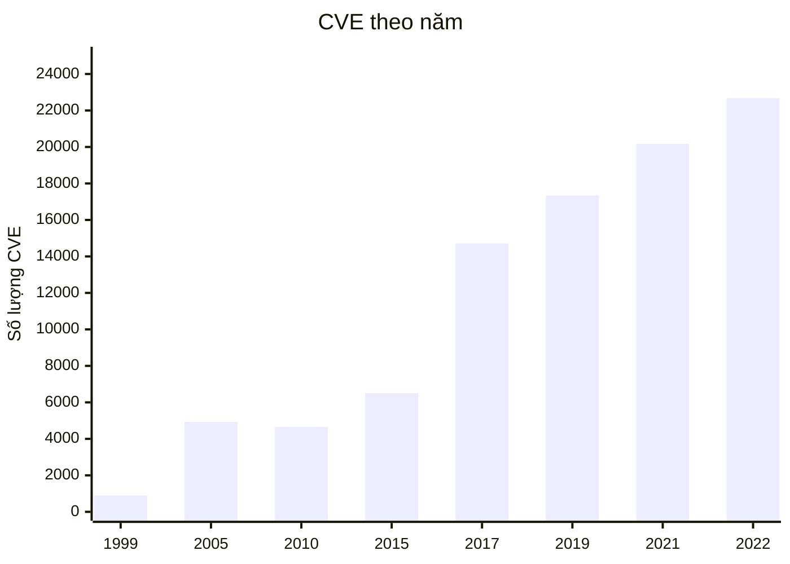
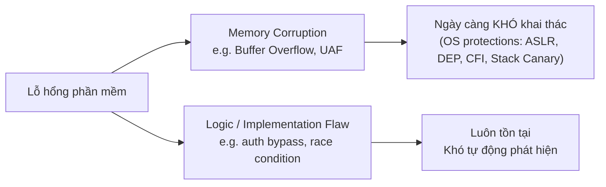
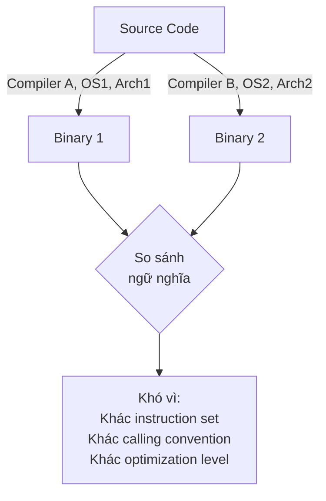
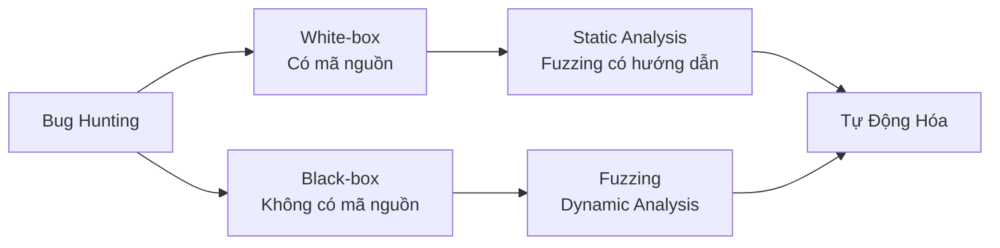
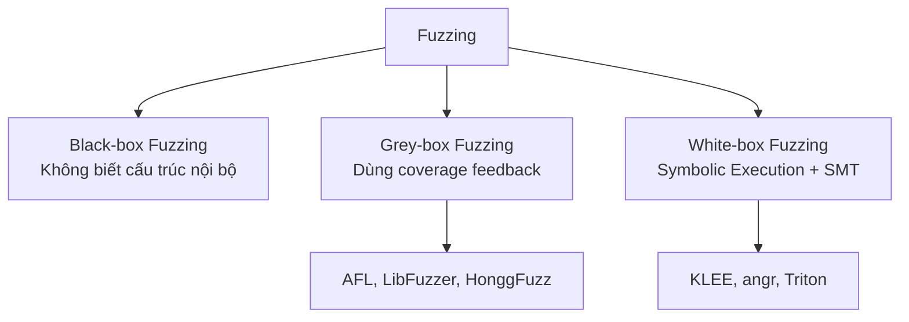
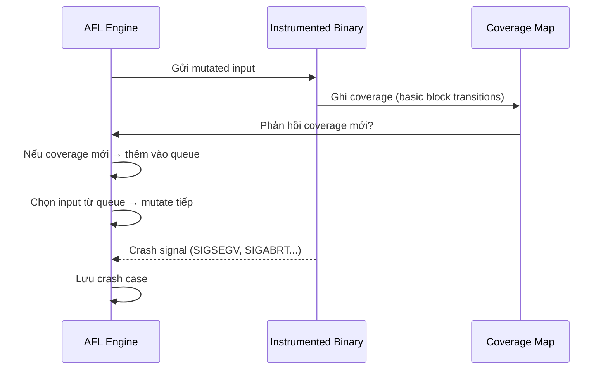
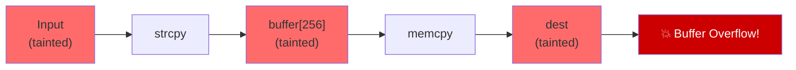
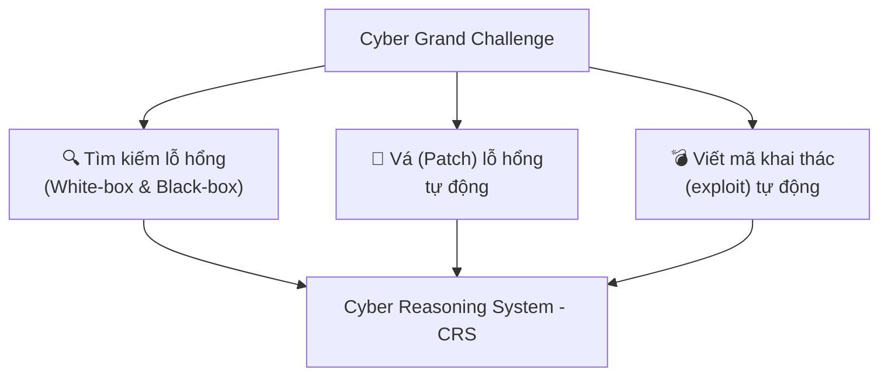
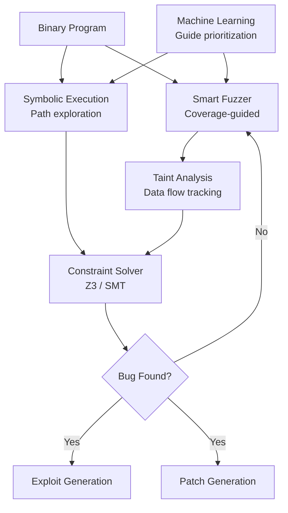
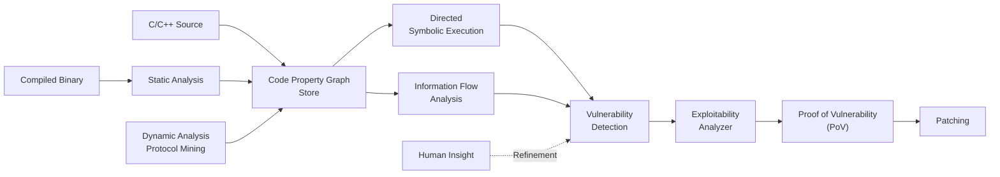

# Buổi 11: Các Hướng Tương Lai của Bảo Mật và Khai Thác Lỗ Hổng Phần Mềm

---

## 1. Thực Trạng An Toàn Phần Mềm

### 1.1 Số liệu CVE qua các năm

Số lượng lỗ hổng được công bố (CVE – Common Vulnerabilities and Exposures) tăng đột biến trong thập kỷ qua:

| Năm | Số CVE |
|-----|--------|
| 1999 | 894 |
| 2005 | 4.935 |
| 2010 | 4.653 |
| 2017 | 14.714 |
| 2019 | 17.344 |
| 2021 | 20.171 |
| 2022 | 22.671 |



!!! warning "Xu hướng đáng lo ngại"
    Số lỗ hổng được phát hiện và công bố **không có dấu hiệu giảm**. Điều này phản ánh sự phức tạp ngày càng cao của phần mềm hiện đại, không phải sự suy giảm chất lượng lập trình.

### 1.2 Tại sao phần mềm không bao giờ hoàn toàn an toàn?

??? note "Phân tích chi tiết"
    - **Độ phức tạp tăng dần**: Ứng dụng hiện đại tích hợp hàng trăm thư viện bên thứ ba, mỗi dependency là một bề mặt tấn công tiềm năng.
    - **Chi phí khai thác tăng**: Cần nhiều thời gian, tiền bạc và kỹ năng hơn để tìm và khai thác bug.
    - **Không gian bug vô hạn**: Dù công cụ phân tích tốt đến đâu, luôn tồn tại các lỗ hổng chưa được phát hiện.

### 1.3 Hai xu hướng đối lập trong tương lai



!!! info "Memory Corruption vs Logic Flaw"
    - **Memory Corruption** (tràn bộ nhớ, UAF – Use-After-Free): Các hệ điều hành hiện đại triển khai nhiều cơ chế phòng thủ như **ASLR** (Address Space Layout Randomization), **DEP/NX** (Data Execution Prevention), **Stack Canary**, **Control Flow Integrity (CFI)**... khiến việc khai thác ngày càng tốn kém, phức tạp và đòi hỏi chuỗi lỗ hổng (exploit chain).
    - **Logic/Implementation Flaw**: Lỗi ở tầng nghiệp vụ hoặc cài đặt (ví dụ: xác thực sai, xử lý trạng thái sai) **không bị ảnh hưởng** bởi các biện pháp bảo vệ bộ nhớ và sẽ **luôn tồn tại** trong tương lai.

---

## 2. Các Hướng Nghiên Cứu Tương Lai – An Toàn Phần Mềm

### 2.1 Kỹ Thuật Làm Rối (Obfuscation)

**Obfuscation** là kỹ thuật biến đổi mã nguồn hoặc mã nhị phân thành dạng khó đọc, khó phân tích mà vẫn giữ nguyên hành vi chức năng của chương trình.

**Mục tiêu:**
- Bảo vệ tài sản trí tuệ (IP protection)
- Chống lại kỹ nghệ đảo ngược (reverse engineering)
- Cản trở phân tích malware

**Các kỹ thuật phổ biến:**

| Kỹ thuật | Mô tả |
|----------|-------|
| **Renaming** | Đổi tên biến/hàm thành tên vô nghĩa |
| **Control Flow Flattening** | Biến cấu trúc điều khiển tuần tự thành state machine |
| **Instruction Substitution** | Thay lệnh đơn giản bằng chuỗi lệnh tương đương phức tạp hơn |
| **Dead Code Insertion** | Chèn mã không có tác dụng để gây nhiễu |
| **Opaque Predicates** | Chèn điều kiện rẽ nhánh mà kết quả đã biết trước (true/false) nhưng khó phân tích tĩnh |
| **String Encryption** | Mã hóa chuỗi ký tự và giải mã tại runtime |

```python
# Trước obfuscation
def calculate_price(quantity, unit_price):
    discount = 0.1 if quantity > 100 else 0
    return quantity * unit_price * (1 - discount)

# Sau obfuscation (minh họa đơn giản)
def x9f2(a3k, b7m):
    _v = (lambda q: 0.1 if q > 100 else 0)(a3k)
    return a3k * b7m * (1 - _v)
```

!!! question "Câu hỏi nghiên cứu mở"
    Obfuscation có thực sự bảo vệ phần mềm không? Nghiên cứu [1] (Schrittwieser et al., 2017) đặt câu hỏi: *"Liệu obfuscation có theo kịp sự tiến bộ của phân tích mã?"* – và câu trả lời là: **không hoàn toàn**, nhưng nó tăng đáng kể chi phí phân tích.

    Hướng nghiên cứu mới: Sử dụng **Reinforcement Learning** để tự động sinh ra chuỗi obfuscation tối ưu (Wang et al., IEEE TDSC 2022).

### 2.2 Phát Hiện Tương Đồng Mã (Code Similarity Detection / BCSD)

**Binary Code Similarity Detection (BCSD)** là bài toán so sánh các đoạn mã nhị phân để phát hiện:

- **Clone detection**: Tìm mã nguồn/nhị phân bị sao chép (vi phạm license)
- **Vulnerability propagation**: Một lỗ hổng trong thư viện X có xuất hiện trong firmware Y không?
- **Malware analysis**: Phần này của malware có tương đồng với mã độc đã biết không?

**Thách thức:**



**Các phương pháp tiêu biểu:**

| Công cụ / Paper | Phương pháp | Đặc điểm |
|-----------------|-------------|-----------|
| **BinDeep** | Deep Learning trên CFG | Cross-platform |
| **Codee** | Tensor Embedding | Binary code search |
| **JTrans** | Jump-aware Transformer | Xử lý control flow |
| **Asteria** | AST Encoding + Deep Learning | Cross-platform BCSD |

!!! tip "Tại sao BCSD quan trọng với bảo mật?"
    Khi phát hiện lỗ hổng CVE-XXXX trong thư viện OpenSSL, nhờ BCSD ta có thể quét hàng nghìn firmware IoT để xác định thiết bị nào đang dùng đoạn mã lỗi đó – **mà không cần mã nguồn** của firmware.

---

## 3. Các Hướng Nghiên Cứu Tương Lai – Khai Thác Lỗ Hổng

### 3.1 Tự Động Hóa Tìm Bug (Automated Bug Hunting)

**Vấn đề cốt lõi**: Tìm lỗ hổng là quá trình tốn nhiều thời gian – hàng giờ, ngày, tuần, thậm chí tháng. Giải pháp là **tự động hóa**.



### 3.2 Phân Tích Tĩnh – Static Code Analyzer

**Phân tích tĩnh** (Static Analysis) kiểm tra mã nguồn mà **không thực thi** chương trình.

**Ưu điểm:**
- Phát hiện lỗi sớm (early detection) trong SDLC
- Bao phủ 100% code paths về lý thuyết
- Không cần môi trường thực thi

**Nhược điểm:**
- **False positives** cao: cảnh báo sai nhiều
- **False negatives**: Bỏ lỡ nhiều lỗ hổng phức tạp
- Rất khó phát hiện **UAF (Use-After-Free)** và các lỗi liên quan đến trạng thái runtime

!!! example "Coverity – Công cụ phân tích tĩnh thương mại hàng đầu"
    Coverity (nay thuộc Synopsys) sử dụng các kỹ thuật phân tích luồng dữ liệu (data flow analysis) và phân tích luồng điều khiển (control flow analysis) để phát hiện:
    
    - **CWE-119**: Buffer Overflow (truy cập ngoài vùng bộ nhớ)
    - **CWE-416**: Use-After-Free
    - **CWE-476**: NULL Pointer Dereference
    - **CWE-401**: Memory Leak
    - Uninitialized variables, Missing return statements...

### 3.3 Fuzzing – Kỹ Thuật Kiểm Thử Ngẫu Nhiên Có Hướng Dẫn

**Fuzzing** là kỹ thuật tự động sinh ra dữ liệu đầu vào bất thường/ngẫu nhiên và đẩy vào chương trình để quan sát hành vi – đặc biệt là khiến chương trình **crash** (gặp lỗi không kiểm soát được).

!!! success "Tầm quan trọng của Fuzzing"
    Fuzzing được ghi nhận là nguồn gốc của **hơn 95%** lỗ hổng được tìm thấy trong khoảng 10 năm qua. Đây là kỹ thuật bug hunting hiệu quả nhất hiện tại.

**Phân loại Fuzzing:**



**Các bước cơ bản của Fuzzing:**

```
1. Chuẩn bị corpus (tập dữ liệu đầu vào ban đầu)
2. Mutation: Biến đổi ngẫu nhiên dữ liệu (bit flip, byte flip, splice...)
3. Thực thi chương trình với dữ liệu biến đổi
4. Quan sát: Crash? Hang? Coverage tăng?
5. Nếu crash → lưu test case → phân tích lỗ hổng
6. Nếu coverage tăng → ưu tiên mutate tiếp từ input này
7. Lặp lại vòng lặp
```

### 3.4 American Fuzzy Lop (AFL) – Fuzzer Huyền Thoại

**AFL** là một coverage-guided fuzzer mã nguồn mở, được phát triển bởi Michał Zalewski (Google), nổi tiếng vì đã tìm ra hàng nghìn lỗ hổng nghiêm trọng trong thực tế.

**Cơ chế hoạt động:**



**Các kỹ thuật mutation của AFL:**

| Kỹ thuật | Mô tả |
|----------|-------|
| **Bit flips** | Lật từng bit hoặc nhóm bit |
| **Byte flips** | Lật từng byte hoặc nhóm byte |
| **Arithmetics** | Cộng/trừ các giá trị số học nhỏ |
| **Known ints** | Thay bằng các giá trị đặc biệt (0, -1, INT_MAX...) |
| **Havoc** | Kết hợp ngẫu nhiên nhiều đột biến |
| **Splice** | Ghép 2 test case khác nhau |

!!! info "AFL với chương trình không có mã nguồn"
    Dù AFL hoạt động tốt nhất khi có mã nguồn (compile-time instrumentation), nó vẫn có thể dùng với binary không có mã nguồn thông qua **QEMU mode** (dynamic instrumentation) hoặc **Unicorn mode**, tuy nhiên với tốc độ thấp hơn đáng kể (~10x chậm hơn).

**Minh họa output của AFL:**
```
american fuzzy lop - process timing
  run time    : 0 days, 0 hrs, 8 min, 24 sec
  cycles done : 0
  last new path: 0 days, 0 hrs, 1 min, 59 sec

overall results
  total paths  : 812
  uniq crashes : 8          ← 8 crash patterns duy nhất
  uniq hangs   : 10

map coverage
  map density  : 3158 (4.82%)   ← % edge coverage
  count coverage: 2.56 bits/tuple

fuzzing strategy yields
  bit flips    : 447/75.5k
  byte flips   : 7/9436
  arithmetics  : 0/0
  havoc        : 0/0
```

### 3.5 Đặc Điểm Bug Hiện Đại

Khi các cơ chế phòng thủ ngày càng mạnh, các bug tồn tại trong phần mềm ngày càng có tính **chọn lọc và điều kiện kích hoạt phức tạp**:

- Bug chỉ xuất hiện khi **một chuỗi điều kiện rất đặc biệt** (very specific condition) được thỏa mãn đồng thời
- Fuzzing truyền thống (ngẫu nhiên) khó có thể "vô tình" tạo ra đúng chuỗi điều kiện đó
- Cần các kỹ thuật **tự hướng dẫn** (guided) thông minh hơn

!!! example "Ví dụ điều kiện kích hoạt phức tạp"
    Một lỗ hổng trong parser PDF chỉ kích hoạt khi:
    - File PDF có hơn 1000 trang
    - Trang 500 chứa annotation loại 3D
    - Font nhúng trong annotation đó có tên dài hơn 256 byte
    - Và người dùng zoom vào trang đó ở độ phóng đại > 200%

### 3.6 QIRA – Timeless Debugger

**QIRA** (QEMU Interactive Runtime Analyser) là một **"timeless debugger"** – cho phép quan sát và duyệt qua lịch sử thực thi của chương trình.

**Tính năng nổi bật:**
- Xem trạng thái chương trình tại **bất kỳ thời điểm nào** trong quá khứ
- Di chuyển **forward và backward** theo timeline thực thi
- Không cần đặt breakpoint trước – ghi lại toàn bộ execution trace
- Rất hữu ích khi phân tích crash hoặc hành vi phức tạp

??? tip "So sánh QIRA với GDB thông thường"
    | Tính năng | GDB | QIRA |
    |-----------|-----|------|
    | Di chuyển ngược (reverse) | Hạn chế (reverse-next) | Hoàn toàn |
    | Ghi lại toàn bộ trace | Không | Có |
    | Xem lịch sử syscall | Không | Có |
    | Overhead | Thấp | Cao hơn |
    | Phân tích offline | Không | Có |

### 3.7 Các Kỹ Thuật Nâng Cao

#### 3.7.1 Taint Analysis

**Taint Analysis** (phân tích vết bẩn) là kỹ thuật theo dõi **luồng dữ liệu từ nguồn không tin cậy** (user input) qua các phép biến đổi cho đến khi dữ liệu đó ảnh hưởng đến hành vi nguy hiểm (sink).



**Phân loại:**
- **Static Taint Analysis**: Phân tích tĩnh, không cần thực thi (nhanh, nhiều false positive)
- **Dynamic Taint Analysis**: Theo dõi tại runtime (chính xác hơn, overhead cao)

**Công cụ:** PANDA (Platform for Architecture-Neutral Dynamic Analysis), QIRA, Triton, angr

#### 3.7.2 Symbolic Execution + SAT/SMT Solving

**Symbolic Execution** thực thi chương trình với các **giá trị tượng trưng** (symbolic values) thay vì giá trị cụ thể, nhằm:
- Khám phá tất cả các nhánh thực thi
- Tự động sinh điều kiện đầu vào để đạt tới một điểm cụ thể trong code

```python
# Ví dụ minh họa Symbolic Execution
def vulnerable(x):          # x là symbolic
    if x > 100:             # tạo 2 path: x > 100 và x <= 100
        if x < 200:         # path con: 100 < x < 200
            crash()         # SMT solver tìm x thỏa mãn: x > 100 AND x < 200
                            # Ví dụ: x = 150
```

**SMT Solver (Satisfiability Modulo Theories):**
- Nhận các ràng buộc (constraints) từ symbolic execution
- Tìm giá trị cụ thể thỏa mãn các ràng buộc đó
- Công cụ phổ biến: **Z3** (Microsoft), CVC4, Boolector

!!! warning "Hạn chế của Symbolic Execution: Path Explosion"
    Số lượng paths tăng theo cấp số nhân với số điều kiện rẽ nhánh. Với chương trình thực tế có hàng triệu dòng code, symbolic execution đơn thuần là **không khả thi**. Giải pháp: kết hợp với fuzzing (hybrid fuzzing).

#### 3.7.3 Machine Learning trong Bug Hunting

Học máy được áp dụng để:
- **Tự động phân loại crash** (là lỗ hổng bảo mật hay chỉ là bug thường?)
- **Hướng dẫn fuzzer**: Ưu tiên mutation theo hướng "thú vị" hơn
- **Phát hiện lỗ hổng** từ mã nguồn/nhị phân qua mô hình NLP
- **Sinh exploit** tự động

---

## 4. DARPA Cyber Grand Challenge (CGC) và Tương Lai Tự Động Hóa

### 4.1 Tầm Nhìn của CGC

**DARPA Cyber Grand Challenge** là cuộc thi năm 2016, với mục tiêu phát triển hệ thống hoàn toàn tự động có khả năng:



!!! success "Ý nghĩa lịch sử"
    CGC 2016 là lần đầu tiên trong lịch sử, các hệ thống AI tự động thi đấu tấn công và phòng thủ lẫn nhau **hoàn toàn không có sự can thiệp của con người**, trong thời gian thực.

### 4.2 Mayhem CRS – Hệ Thống Lý Luận Không Gian Mạng

**Mayhem** (phát triển bởi ForAllSecure, đội gồm các nhà nghiên cứu từ CMU) đã **giành chiến thắng CGC 2016**.

**Kiến trúc của Mayhem:**



**Kỹ thuật cốt lõi:**

| Thành phần | Vai trò |
|------------|---------|
| **Smart Fuzzing** | Sinh đầu vào tự động, hướng dẫn bởi coverage |
| **Taint Analysis** | Xác định dữ liệu đầu vào ảnh hưởng tới điểm nào |
| **Constraint Solver** | Tìm đầu vào để kích hoạt điều kiện lỗ hổng |
| **ML** | Ưu tiên hóa các đường khám phá có tiềm năng |

### 4.3 MATE – Merged Analysis To Prevent Exploits

**MATE** là dự án tiếp nối, được **Galois** phát triển cùng **Harvard University** và **Trail of Bits** trong chương trình **DARPA CHESS** (Computers and Humans Exploring Software Security).

**Triết lý MATE: Human-Machine Hybrid**

!!! info "Tại sao cần kết hợp con người và máy?"
    - Hệ thống CGC thuần tự động chỉ hoạt động tốt trong **môi trường hạn chế và kiểm soát**
    - Phần mềm thực tế (web browser, enterprise app) phức tạp hơn nhiều
    - MATE kết hợp **automated analysis** với **human insight** để xử lý các lớp lỗ hổng phức tạp mà máy thuần không phát hiện được
    - DARPA cấp **8.6 triệu USD** cho dự án này (2019)

**Pipeline của MATE:**



---

## 5. Các Chủ Đề Nghiên Cứu Tại InSecLab (UIT)

??? note "Hướng nghiên cứu trong phòng lab"
    **An toàn phần mềm:**
    - Code Obfuscation
    - Code Similarity Detection

    **Khai thác lỗ hổng phần mềm:**
    - Tự động hóa khai thác lỗ hổng phần mềm (AEG – Automated Exploit Generation)
    - Các kỹ thuật Fuzzing nâng cao
    - Tự động hóa phát hiện lỗ hổng dùng Machine Learning
    - Fuzzing dùng Reinforcement Learning / Deep Learning
    - Phát hiện lỗ hổng bằng Deep Learning kết hợp Static Analysis & Symbolic Execution
    - Vá lỗ hổng phần mềm tự động (Automated Program Repair)

---

## 📝 50 Câu Trắc Nghiệm

---

**Câu 1.** Theo thống kê CVE, xu hướng số lượng lỗ hổng được công bố qua các năm là gì?

- A. Giảm dần do công nghệ bảo mật tiến bộ
- B. Ổn định, dao động quanh mức 5000/năm
- C. Tăng mạnh qua các năm, đặc biệt từ 2017 trở đi
- D. Tăng đến 2015 rồi giảm

??? info "Đáp án & Giải thích"
    **Đáp án: C**
    Từ 2017, số CVE tăng vọt: 2017 (14.714), 2019 (17.344), 2021 (20.171), 2022 (22.671). Nguyên nhân: phần mềm phức tạp hơn, có nhiều researcher và bounty program hơn.

---

**Câu 2.** Tại sao các khai thác dựa trên Memory Corruption sẽ ngày càng khó thực hiện?

- A. Vì lập trình viên đã học cách tránh lỗi bộ nhớ
- B. Vì các hệ điều hành hiện đại triển khai nhiều cơ chế bảo vệ (ASLR, DEP, CFI...)
- C. Vì antivirus hiện đại phát hiện 100% các exploit
- D. Vì không còn lỗ hổng bộ nhớ nào tồn tại

??? info "Đáp án & Giải thích"
    **Đáp án: B**
    OS hiện đại có ASLR (ngẫu nhiên hóa địa chỉ), DEP/NX (chống thực thi vùng dữ liệu), Stack Canary, CFI (kiểm soát luồng điều khiển)... khiến chi phí exploit chain tăng rất cao.

---

**Câu 3.** Loại lỗ hổng nào được dự đoán sẽ "luôn tồn tại" trong tương lai dù bảo mật tiến bộ?

- A. Buffer Overflow
- B. Use-After-Free
- C. Logic / Implementation Flaw
- D. Format String Vulnerability

??? info "Đáp án & Giải thích"
    **Đáp án: C**
    Logic/Implementation Flaw (lỗi nghiệp vụ, xử lý trạng thái sai) không bị ảnh hưởng bởi các cơ chế bảo vệ bộ nhớ và rất khó tự động phát hiện.

---

**Câu 4.** Obfuscation trong bảo mật phần mềm có mục đích chính là gì?

- A. Tăng tốc độ thực thi của chương trình
- B. Làm cho mã nguồn/nhị phân khó phân tích và reverse engineer hơn
- C. Giảm kích thước file thực thi
- D. Mã hóa dữ liệu người dùng

??? info "Đáp án & Giải thích"
    **Đáp án: B**
    Obfuscation biến đổi cấu trúc code thành dạng khó đọc trong khi vẫn giữ nguyên hành vi, nhằm bảo vệ IP và cản trở phân tích ngược.

---

**Câu 5.** Kỹ thuật obfuscation "Control Flow Flattening" hoạt động theo cơ chế nào?

- A. Đổi tên tất cả biến và hàm thành tên vô nghĩa
- B. Biến cấu trúc điều khiển tuần tự thành một state machine phẳng
- C. Chèn code chết (dead code) vào chương trình
- D. Mã hóa tất cả chuỗi ký tự

??? info "Đáp án & Giải thích"
    **Đáp án: B**
    Control Flow Flattening biến `if-else`, vòng lặp... thành một switch-case lớn với dispatch variable, phá vỡ cấu trúc điều khiển rõ ràng và khiến decompiler khó phân tích.

---

**Câu 6.** "Opaque Predicates" trong obfuscation là gì?

- A. Các hàm mã hóa ẩn
- B. Điều kiện rẽ nhánh có kết quả luôn đúng/sai nhưng khó phân tích tĩnh
- C. Các biến không được khởi tạo
- D. Lệnh nhảy không điều kiện

??? info "Đáp án & Giải thích"
    **Đáp án: B**
    Opaque Predicates là điều kiện mà lập trình viên biết trước kết quả (luôn true hoặc false), nhưng kẻ phân tích tĩnh không thể dễ dàng xác định, làm phức tạp việc phân tích luồng điều khiển.

---

**Câu 7.** Binary Code Similarity Detection (BCSD) được ứng dụng trong bảo mật để làm gì?

- A. Phát hiện malware dựa trên signature hash
- B. Phát hiện lỗ hổng đã biết lan truyền sang firmware/thư viện khác
- C. Tăng tốc độ biên dịch
- D. Nén binary để giảm kích thước

??? info "Đáp án & Giải thích"
    **Đáp án: B**
    Khi một lỗ hổng CVE được tìm thấy trong một thư viện, BCSD có thể quét hàng nghìn binary khác để phát hiện đoạn mã tương đồng – tức là phát hiện các sản phẩm bị ảnh hưởng mà không cần mã nguồn.

---

**Câu 8.** Thách thức chính của BCSD cross-platform là gì?

- A. Kích thước file binary quá lớn
- B. Cùng mã nguồn nhưng binary khác nhau hoàn toàn khi biên dịch trên CPU/OS/compiler khác nhau
- C. Cần kết nối internet để so sánh
- D. Chỉ hoạt động với file ELF

??? info "Đáp án & Giải thích"
    **Đáp án: B**
    Cùng source code, khi biên dịch với GCC vs Clang, x86 vs ARM, với các mức tối ưu hóa khác nhau, binary hoàn toàn khác nhau về cấu trúc instruction – khiến so sánh semantic thay vì syntactic là bắt buộc.

---

**Câu 9.** Fuzzing về cơ bản thực hiện điều gì?

- A. Phân tích mã nguồn không thực thi để tìm lỗi
- B. Sinh và đưa dữ liệu bất thường vào chương trình để phát hiện crash/lỗi không kiểm soát
- C. Mô phỏng tấn công mạng
- D. Kiểm tra hiệu năng của phần mềm

??? info "Đáp án & Giải thích"
    **Đáp án: B**
    Fuzzing tự động sinh dữ liệu đầu vào (thường là biến đổi từ corpus ban đầu), đẩy vào chương trình và quan sát xem chương trình có crash hay xử lý sai không.

---

**Câu 10.** Fuzzing được cho là nguồn gốc của bao nhiêu % lỗ hổng được tìm thấy trong 10 năm qua?

- A. 50%
- B. 70%
- C. 85%
- D. 95%

??? info "Đáp án & Giải thích"
    **Đáp án: D**
    Theo slide bài giảng, fuzzing được xem là nguồn gốc của hơn **95%** lỗ hổng được tìm thấy trong khoảng 10 năm qua – khẳng định đây là kỹ thuật bug hunting hiệu quả nhất hiện tại.

---

**Câu 11.** AFL (American Fuzzy Lop) là loại fuzzer thuộc loại nào?

- A. Black-box fuzzer (không có thông tin cấu trúc)
- B. White-box fuzzer (dùng symbolic execution)
- C. Grey-box fuzzer (dùng coverage feedback từ instrumentation)
- D. Model-based fuzzer

??? info "Đáp án & Giải thích"
    **Đáp án: C**
    AFL là **coverage-guided grey-box fuzzer**. Nó chèn instrumentation vào binary lúc compile để đo edge coverage, từ đó ưu tiên các input mở ra đường code mới.

---

**Câu 12.** AFL hoạt động tốt nhất trong điều kiện nào?

- A. Binary không có mã nguồn (black-box)
- B. Có mã nguồn để chèn instrumentation lúc compile
- C. Chạy trên môi trường ảo hóa
- D. Khi kết hợp với antivirus

??? info "Đáp án & Giải thích"
    **Đáp án: B**
    AFL đòi hỏi mã nguồn để đạt hiệu năng tối ưu thông qua compile-time instrumentation. Khi không có mã nguồn, dùng QEMU mode nhưng chậm hơn ~10x.

---

**Câu 13.** Kỹ thuật mutation "havoc" trong AFL là gì?

- A. Lật từng bit trong input
- B. Kết hợp ngẫu nhiên nhiều phép đột biến khác nhau
- C. Ghép 2 test case khác nhau lại
- D. Thay thế bằng các giá trị số nguyên đặc biệt

??? info "Đáp án & Giải thích"
    **Đáp án: B**
    Havoc là stage mutation mạnh nhất, kết hợp ngẫu nhiên nhiều loại đột biến (bit flip, arithmetic, substitution...) trong một lần chạy để khám phá không gian input rộng hơn.

---

**Câu 14.** QIRA được mô tả là "timeless debugger" – điều này có nghĩa là gì?

- A. Debugger chạy không giới hạn thời gian
- B. Có thể quan sát trạng thái chương trình tại bất kỳ điểm nào trong lịch sử thực thi và di chuyển forward/backward
- C. Không cần cài đặt, chạy trực tiếp từ internet
- D. Tương thích với mọi ngôn ngữ lập trình

??? info "Đáp án & Giải thích"
    **Đáp án: B**
    QIRA ghi lại toàn bộ execution trace, cho phép nhà nghiên cứu "du hành thời gian" trong lịch sử thực thi – xem trạng thái thanh ghi, bộ nhớ tại bất kỳ instruction nào đã qua.

---

**Câu 15.** Taint Analysis theo dõi điều gì trong chương trình?

- A. Hiệu năng CPU của từng hàm
- B. Luồng dữ liệu từ nguồn không tin cậy (user input) đến các điểm nguy hiểm (sink)
- C. Thứ tự khởi tạo biến
- D. Số lần hàm được gọi

??? info "Đáp án & Giải thích"
    **Đáp án: B**
    Taint Analysis đánh dấu ("taint") dữ liệu đến từ nguồn không tin cậy và theo dõi xem dữ liệu đó có chảy đến các sink nguy hiểm như `system()`, `memcpy()`, SQL query... không.

---

**Câu 16.** Công cụ PANDA được dùng cho mục đích gì trong bảo mật?

- A. Static code analysis
- B. Dynamic Taint Analysis – ghi lại và phân tích trace thực thi
- C. Phát hiện virus
- D. Quản lý lỗ hổng

??? info "Đáp án & Giải thích"
    **Đáp án: B**
    PANDA (Platform for Architecture-Neutral Dynamic Analysis) là nền tảng phân tích động dựa trên QEMU, cho phép dynamic taint analysis và ghi lại/phát lại execution trace.

---

**Câu 17.** Symbolic Execution khác với thực thi thông thường ở điểm nào?

- A. Chạy nhanh hơn
- B. Sử dụng giá trị tượng trưng (symbolic) thay vì giá trị cụ thể, để khám phá tất cả paths
- C. Không cần mã nguồn
- D. Chỉ phân tích code tĩnh

??? info "Đáp án & Giải thích"
    **Đáp án: B**
    Symbolic Execution gán biến ký hiệu (symbol) cho input, thực thi và xây dựng path condition cho mỗi nhánh. SMT solver sau đó tìm giá trị cụ thể thỏa mãn từng điều kiện.

---

**Câu 18.** "Path Explosion" là vấn đề gì của Symbolic Execution?

- A. File binary quá lớn để phân tích
- B. Số lượng đường thực thi tăng theo cấp số nhân với số điều kiện rẽ nhánh, làm hệ thống không thể xử lý
- C. Thiếu bộ nhớ RAM khi chạy
- D. Không tương thích với kiến trúc ARM

??? info "Đáp án & Giải thích"
    **Đáp án: B**
    Mỗi điều kiện if tạo ra 2 path. Với n điều kiện có 2^n paths. Chương trình thực tế có hàng triệu điều kiện → không khả thi nếu không có heuristic cắt tỉa.

---

**Câu 19.** Z3 là công cụ gì và được dùng trong lĩnh vực nào?

- A. Fuzzer của Microsoft
- B. SMT Solver của Microsoft, dùng để giải các ràng buộc trong symbolic execution
- C. Debugger cho Windows
- D. Static analyzer của Google

??? info "Đáp án & Giải thích"
    **Đáp án: B**
    Z3 là SMT (Satisfiability Modulo Theories) solver mã nguồn mở do Microsoft Research phát triển. Nó nhận các công thức logic và tìm giá trị thỏa mãn, ứng dụng rộng rãi trong program analysis.

---

**Câu 20.** DARPA Cyber Grand Challenge (CGC) được tổ chức năm nào?

- A. 2014
- B. 2016
- C. 2018
- D. 2020

??? info "Đáp án & Giải thích"
    **Đáp án: B**
    CGC diễn ra vào tháng 8 năm **2016**. Đây là lần đầu tiên các hệ thống CRS tự động thi đấu tấn công/phòng thủ hoàn toàn không có sự can thiệp của con người.

---

**Câu 21.** Hệ thống nào đã giành chiến thắng tại DARPA CGC 2016?

- A. CHESS
- B. MATE
- C. Mayhem
- D. Galois

??? info "Đáp án & Giải thích"
    **Đáp án: C**
    **Mayhem** của ForAllSecure (do các nhà nghiên cứu từ CMU phát triển) đã giành chiến thắng CGC 2016. Paper: "The Mayhem Cyber Reasoning System" (IEEE Security & Privacy, 2018).

---

**Câu 22.** CRS trong bối cảnh CGC là viết tắt của gì?

- A. Code Review System
- B. Cyber Reasoning System
- C. Critical Response Security
- D. Computer Risk Score

??? info "Đáp án & Giải thích"
    **Đáp án: B**
    **CRS – Cyber Reasoning System** là tên gọi cho các hệ thống tham gia CGC, có khả năng tự động tìm, vá và khai thác lỗ hổng.

---

**Câu 23.** Mayhem CRS sử dụng kết hợp những kỹ thuật nào?

- A. Antivirus + Firewall + IDS
- B. Smart Fuzzing + Taint Analysis + Constraint Solver + Machine Learning
- C. Static Analysis + Code Review + Penetration Testing
- D. Decompilation + Manual Analysis

??? info "Đáp án & Giải thích"
    **Đáp án: B**
    Mayhem kết hợp smart fuzzer được hướng dẫn bởi taint analysis và constraint solver (SAT/SMT), cùng với machine learning để ưu tiên hóa các đường khám phá.

---

**Câu 24.** Dự án MATE thuộc chương trình nào của DARPA?

- A. CGC (Cyber Grand Challenge)
- B. CHESS (Computers and Humans Exploring Software Security)
- C. DARPA SBIR
- D. DARPA AI Next

??? info "Đáp án & Giải thích"
    **Đáp án: B**
    MATE (Merged Analysis To Prevent Exploits) do Galois, Harvard và Trail of Bits phát triển, thuộc chương trình **DARPA CHESS**, nhận tài trợ 8.6 triệu USD (2019).

---

**Câu 25.** Triết lý chính của dự án MATE so với CGC thuần túy là gì?

- A. Hoàn toàn tự động hóa, không cần con người
- B. Kết hợp human insight với automated analysis để xử lý phần mềm thực tế phức tạp
- C. Chỉ dùng static analysis
- D. Tập trung vào web application

??? info "Đáp án & Giải thích"
    **Đáp án: B**
    CGC thuần tự động chỉ hoạt động trong môi trường kiểm soát. MATE nhận ra rằng phần mềm thực tế cần **human insight** (chuyên gia điều hướng) kết hợp với sức mạnh tự động hóa.

---

**Câu 26.** Static Code Analyzer có hạn chế gì so với Dynamic Analysis?

- A. Cần runtime environment
- B. Thường có nhiều false positives và bỏ lỡ các lỗi chỉ xuất hiện lúc runtime (như UAF)
- C. Chỉ hỗ trợ C/C++
- D. Cần quyền root để chạy

??? info "Đáp án & Giải thích"
    **Đáp án: B**
    Static analysis không thực thi code nên không biết giá trị runtime → nhiều false positive và false negative. UAF đặc biệt khó phát hiện tĩnh vì phụ thuộc vào thứ tự phân bổ/giải phóng bộ nhớ.

---

**Câu 27.** Coverity phát hiện lỗi nào theo mô tả trong bài giảng?

- A. SQL Injection và XSS
- B. Out-of-bounds access, uninitialized scalar, resource leak, missing return statement
- C. Lỗi mạng và giao thức
- D. Logic flaw và authentication bypass

??? info "Đáp án & Giải thích"
    **Đáp án: B**
    Giao diện Coverity trong slide hiển thị các lỗi: Out-of-bounds access (CWE-119), Uninitialized scalar variable, Resource leak, Missing return statement, Non-virtual destructor.

---

**Câu 28.** "Bug Hunting" được mô tả là tốn nhiều thời gian, giải pháp được đề xuất là gì?

- A. Thuê thêm nhân sự
- B. Tự động hóa (Automation) quá trình tìm bug
- C. Dùng nhiều ngôn ngữ lập trình an toàn hơn
- D. Chuyển sang kiến trúc microservice

??? info "Đáp án & Giải thích"
    **Đáp án: B**
    Bài giảng đặt câu hỏi "Cách nào để tìm bug nhanh hơn?" và trả lời: **Tự động hóa (Automation)** – đây là xu hướng chính của lĩnh vực.

---

**Câu 29.** AFL có thể sử dụng với binary không có mã nguồn không? Nếu có, thông qua cơ chế nào?

- A. Không, AFL bắt buộc cần mã nguồn
- B. Có, thông qua QEMU mode (dynamic instrumentation) với hiệu năng thấp hơn
- C. Có, thông qua static rewriting với hiệu năng tương đương
- D. Có, chỉ cần debug symbols là đủ

??? info "Đáp án & Giải thích"
    **Đáp án: B**
    AFL hỗ trợ **QEMU mode** cho binary không có mã nguồn bằng cách dùng dynamic instrumentation của QEMU để đo coverage, nhưng chậm hơn khoảng 10x so với compile-time instrumentation.

---

**Câu 30.** Trong output của AFL, "uniq crashes: 8" có nghĩa là gì?

- A. AFL đã crash 8 lần trong quá trình chạy
- B. Tìm thấy 8 crash patterns duy nhất (8 loại lỗi khác nhau về stack trace/location)
- C. Cần chạy thêm 8 lần nữa
- D. Có 8 test case trong corpus ban đầu

??? info "Đáp án & Giải thích"
    **Đáp án: B**
    AFL deduplicate các crash dựa trên stack trace và vị trí lỗi. "uniq crashes" = số crash patterns độc đáo, khác nhau về vị trí xảy ra lỗi – mỗi loại có thể là một lỗ hổng khác nhau.

---

**Câu 31.** "Coverage-guided fuzzing" có lợi thế gì so với "dumb fuzzing" (random hoàn toàn)?

- A. Không cần corpus ban đầu
- B. Ưu tiên các input mở ra code path mới, giúp khám phá code hiệu quả hơn
- C. Chạy nhanh hơn vì không cần đo coverage
- D. Không cần môi trường sandbox

??? info "Đáp án & Giải thích"
    **Đáp án: B**
    Bằng cách đo coverage (edge/block coverage) và ưu tiên input tăng coverage, coverage-guided fuzzer như AFL có thể khám phá sâu vào logic code thay vì ngẫu nhiên hoàn toàn.

---

**Câu 32.** Kỹ thuật "splice" trong AFL mutation là gì?

- A. Cắt bỏ một phần của input
- B. Ghép hai test case từ corpus lại với nhau tạo ra input mới
- C. Sao chép input nhiều lần
- D. Đảo ngược thứ tự byte

??? info "Đáp án & Giải thích"
    **Đáp án: B**
    Splice lấy một phần đầu của test case A và nối với phần cuối của test case B từ queue, tạo ra input hybrid có thể mở ra đường code mới.

---

**Câu 33.** Tại sao bug hiện đại ngày càng "khó" hơn để fuzzer thông thường tìm thấy?

- A. Binary ngày càng được encrypt
- B. Bug chỉ kích hoạt với điều kiện rất đặc biệt mà fuzzing ngẫu nhiên khó đạt tới
- C. Chương trình không còn crash khi gặp lỗi
- D. OS chặn tất cả crash signals

??? info "Đáp án & Giải thích"
    **Đáp án: B**
    Bug hiện đại có "very specific condition" – cần đúng chuỗi điều kiện phức tạp để kích hoạt. Fuzzer ngẫu nhiên có xác suất rất thấp tình cờ tạo ra đúng chuỗi đó.

---

**Câu 34.** Machine Learning được ứng dụng trong bug hunting theo những cách nào?

- A. Chỉ để phân tích log
- B. Hướng dẫn fuzzer, phân loại crash, phát hiện lỗ hổng từ code, sinh exploit
- C. Chỉ để báo cáo kết quả
- D. Thay thế hoàn toàn fuzzing

??? info "Đáp án & Giải thích"
    **Đáp án: B**
    ML ứng dụng đa dạng: hướng dẫn chiến lược mutation của fuzzer (RL-based), phân loại crash (là security bug không?), phát hiện lỗ hổng từ source/binary, hỗ trợ sinh exploit tự động.

---

**Câu 35.** Reinforcement Learning (RL) được áp dụng trong obfuscation như thế nào?

- A. Train model để detect obfuscated code
- B. Tự động sinh ra chuỗi obfuscation transformation tối ưu để maximize khó phân tích
- C. Dùng RL để deobfuscate code
- D. Tối ưu hóa compile-time obfuscation

??? info "Đáp án & Giải thích"
    **Đáp án: B**
    Wang et al. (IEEE TDSC 2022) đề xuất dùng RL để tự động tìm chuỗi obfuscation passes tối ưu, maximize sự khó khăn cho reverse engineer trong khi minimize overhead hiệu năng.

---

**Câu 36.** Trong output AFL, "map density: 4.82%" có ý nghĩa gì?

- A. 4.82% test cases gây crash
- B. 4.82% các edge trong control flow graph đã được khám phá
- C. Hiệu suất CPU là 4.82%
- D. 4.82% input hợp lệ được xử lý đúng

??? info "Đáp án & Giải thích"
    **Đáp án: B**
    AFL sử dụng bitmap để track edge coverage. Map density cho biết bao nhiêu % slot trong bitmap đã được "chạm" – tức bao nhiêu % cạnh trong CFG đã được thực thi ít nhất một lần.

---

**Câu 37.** Dự án Asteria giải quyết bài toán gì?

- A. Automatic exploit generation
- B. Cross-platform binary code similarity detection dựa trên AST encoding và deep learning
- C. Automated patch generation
- D. Malware classification

??? info "Đáp án & Giải thích"
    **Đáp án: B**
    Asteria (2021) dùng AST (Abstract Syntax Tree) encoding kết hợp deep learning để phát hiện tương đồng mã nhị phân cross-platform – một trong các phương pháp BCSD tiêu biểu.

---

**Câu 38.** DARPA CHESS là viết tắt của gì?

- A. Cybersecurity Hardware Embedded System Security
- B. Computers and Humans Exploring Software Security
- C. Cyber Hardening and Exploit Stopping System
- D. Comprehensive Heuristic Engine for Security Scanning

??? info "Đáp án & Giải thích"
    **Đáp án: B**
    **CHESS – Computers and Humans Exploring Software Security** là chương trình của DARPA nhằm phát triển công cụ kết hợp khả năng con người và máy móc để phát hiện lỗ hổng bảo mật.

---

**Câu 39.** Tại sao các hệ thống CRS trong CGC không thể trực tiếp áp dụng vào phần mềm thực tế như web browser?

- A. Web browser chạy trên Windows, không tương thích
- B. Phần mềm thực tế phức tạp hơn nhiều, cần human insight để định hướng phân tích
- C. Không đủ băng thông mạng
- D. CRS chỉ hỗ trợ binary 32-bit

??? info "Đáp án & Giải thích"
    **Đáp án: B**
    CGC được thiết kế cho các service đơn giản trong môi trường kiểm soát. Phần mềm thực tế (browser, enterprise app) có code base hàng triệu dòng, nhiều lớp abstraction và phụ thuộc – cần human knowledge để định hướng.

---

**Câu 40.** Code Property Graph (CPG) trong MATE là gì?

- A. Đồ thị vẽ coverage của fuzzer
- B. Cấu trúc dữ liệu hợp nhất AST, CFG, PDG của chương trình để phân tích toàn diện
- C. Graph database chứa CVE
- D. Biểu đồ call graph của binary

??? info "Đáp án & Giải thích"
    **Đáp án: B**
    CPG (Code Property Graph) hợp nhất nhiều đồ thị phân tích (AST, CFG, PDG, Call Graph) vào một cấu trúc duy nhất, cho phép query phức tạp để tìm lỗ hổng.

---

**Câu 41.** Trong Taint Analysis, "source" và "sink" là gì?

- A. Source là nơi bắt đầu chạy code, sink là nơi kết thúc
- B. Source là nguồn dữ liệu không tin cậy (user input), sink là điểm nguy hiểm có thể bị lợi dụng
- C. Source là file đầu vào, sink là file đầu ra
- D. Source là hàm allocate, sink là hàm free

??? info "Đáp án & Giải thích"
    **Đáp án: B**
    Source: nơi dữ liệu untrusted đến (stdin, network, file...). Sink: điểm nhạy cảm (memcpy, system(), SQL query...). Taint analysis kiểm tra có đường chảy từ source đến sink không.

---

**Câu 42.** Kết hợp Symbolic Execution với Fuzzing (Hybrid Fuzzing) có lợi thế gì?

- A. Chậm hơn nhưng chính xác hơn
- B. Dùng symbolic execution để vượt qua các điều kiện khó, fuzzing để bao phủ nhanh phần còn lại
- C. Loại bỏ hoàn toàn false positives
- D. Không cần corpus ban đầu

??? info "Đáp án & Giải thích"
    **Đáp án: B**
    Hybrid Fuzzing (ví dụ: DRILLER, QSYM) dùng fuzzer để khám phá nhanh, khi bị "stuck" thì gọi symbolic execution để tìm input vượt qua điều kiện khó, sau đó tiếp tục fuzzing với input mới đó.

---

**Câu 43.** CFI (Control Flow Integrity) bảo vệ chống lại loại tấn công nào?

- A. SQL Injection
- B. ROP (Return-Oriented Programming) và JOP chains – tấn công chuyển hướng luồng điều khiển
- C. Buffer Overflow trực tiếp vào stack
- D. Heap spray attacks

??? info "Đáp án & Giải thích"
    **Đáp án: B**
    CFI đảm bảo các lệnh call/jump/return chỉ nhảy đến các địa chỉ hợp lệ (trong danh sách cho phép), chặn kẻ tấn công sử dụng ROP gadgets để bypass DEP/NX.

---

**Câu 44.** Theo bài giảng, "exploit chain" liên quan đến vấn đề gì?

- A. Chain nhiều lỗ hổng nhỏ lại để tạo thành exploit lớn hơn
- B. Chi phí để thực hiện chuỗi khai thác này quá cao khi có nhiều biện pháp bảo vệ
- C. Cả A và B
- D. Kỹ thuật dùng nhiều CVE cùng lúc

??? info "Đáp án & Giải thích"
    **Đáp án: C**
    Khi một lỗ hổng đơn không đủ, cần chuỗi lỗ hổng (exploit chain). Tuy nhiên, với các cơ chế bảo vệ hiện đại, chi phí tìm và chuỗi đủ lỗ hổng trở nên cực kỳ cao.

---

**Câu 45.** ASLR (Address Space Layout Randomization) chống lại loại tấn công nào?

- A. SQL Injection
- B. Tấn công dựa trên địa chỉ cố định – kẻ tấn công không thể biết trước địa chỉ của stack, heap, library
- C. Network-based attacks
- D. Timing attacks

??? info "Đáp án & Giải thích"
    **Đáp án: B**
    ASLR ngẫu nhiên hóa vị trí của stack, heap, thư viện mỗi lần chạy, khiến kẻ tấn công không thể hard-code địa chỉ nhảy vào shellcode hay gadget.

---

**Câu 46.** JTrans được mô tả là "jump-aware transformer" – điều này giải quyết vấn đề gì trong BCSD?

- A. Phân tích code Java
- B. Transformer thông thường bỏ qua thông tin control flow jump – JTrans mã hóa thông tin nhảy để cải thiện so sánh
- C. Tăng tốc quá trình so sánh
- D. Hỗ trợ thêm kiến trúc CPU mới

??? info "Đáp án & Giải thích"
    **Đáp án: B**
    Instruction-level transformer bỏ qua context của control flow. JTrans encode thêm thông tin về jump targets và basic block structure vào representation, cải thiện độ chính xác BCSD.

---

**Câu 47.** Trong bài giảng, điều kiện nào khiến phát hiện UAF bằng static analysis là "rất khó"?

- A. UAF xảy ra ở kernel space
- B. UAF phụ thuộc vào trạng thái runtime (thứ tự alloc/free/use) không thể suy ra từ code tĩnh
- C. UAF chỉ xảy ra trong code multi-thread
- D. Static analyzer không hỗ trợ C++

??? info "Đáp án & Giải thích"
    **Đáp án: B**
    UAF (Use-After-Free) xảy ra khi pointer bị dùng sau khi vùng nhớ đã được free. Để phát hiện, cần biết thứ tự thực thi (object nào free trước, dùng sau không?) – thông tin này chỉ có tại runtime.

---

**Câu 48.** Phương pháp nào trong số sau đây là ví dụ về "Black-box fuzzing"?

- A. AFL với compile-time instrumentation
- B. LibFuzzer
- C. Đưa dữ liệu ngẫu nhiên vào API của chương trình mà không biết cấu trúc nội bộ
- D. Symbolic execution với SMT solver

??? info "Đáp án & Giải thích"
    **Đáp án: C**
    Black-box fuzzing không cần biết hoặc không quan sát internals của chương trình – chỉ gửi input và xem output/behavior bên ngoài. Ví dụ: Peach fuzzer với protocol definition.

---

**Câu 49.** Theo bài giảng, hai hướng nghiên cứu chính về Software Security (không phải exploitation) là gì?

- A. Intrusion Detection và Firewall
- B. Code Obfuscation và Code Similarity Detection
- C. Cryptography và Authentication
- D. Web Security và Mobile Security

??? info "Đáp án & Giải thích"
    **Đáp án: B**
    Slide liệt kê 2 hướng nghiên cứu chính về Software Security tại InSecLab: (1) **Code Obfuscation** – kỹ thuật làm rối, và (2) **Code Similarity Detection/BCSD** – phát hiện tương đồng mã.

---

**Câu 50.** Điều gì đặc biệt về cuộc thi CGC so với các CTF thông thường?

- A. Có nhiều đội tham dự hơn
- B. Các đội là hệ thống AI tự động thi đấu, không phải con người – hoàn toàn tự động tấn công và phòng thủ trong thời gian thực
- C. Chỉ thi về web security
- D. Diễn ra trong 24 giờ liên tục

??? info "Đáp án & Giải thích"
    **Đáp án: B**
    CGC là cuộc thi lịch sử: các **CRS (Cyber Reasoning Systems)** – tức AI bots – tự động vừa tấn công (tìm và khai thác lỗ hổng của đối thủ) vừa phòng thủ (vá lỗ hổng của mình) mà **không có sự can thiệp của con người**, ở tốc độ máy tính.

---

**Câu 51.** "Automated Exploit Generation (AEG)" là bài toán nghiên cứu gì?

- A. Tự động tạo antivirus signature
- B. Tự động sinh mã khai thác (exploit code) từ thông tin về lỗ hổng đã phát hiện
- C. Tự động cập nhật phần mềm
- D. Tự động viết unit test

??? info "Đáp án & Giải thích"
    **Đáp án: B**
    AEG nghiên cứu cách tự động hóa bước cuối của chu trình khai thác: từ thông tin lỗ hổng (bug report, crash dump) → tự động sinh exploit hoạt động được. Mayhem là một ví dụ thực tiễn.

---

**Câu 52.** Kỹ thuật "Instruction Substitution" trong obfuscation thực hiện điều gì?

- A. Xóa các instruction không cần thiết
- B. Thay một instruction đơn giản bằng chuỗi instruction tương đương nhưng phức tạp hơn
- C. Đổi thứ tự các instruction
- D. Mã hóa instruction thành dạng encrypted

??? info "Đáp án & Giải thích"
    **Đáp án: B**
    Ví dụ: `x = a + b` có thể thay bằng `x = a - (-b)` hoặc `x = (a XOR b) + 2*(a AND b)`. Ý nghĩa tương đương nhưng làm decompiler khó nhận ra pattern.

---

**Câu 53.** Tại sao "Dead Code Insertion" là kỹ thuật obfuscation hiệu quả?

- A. Vì nó làm chương trình chạy nhanh hơn
- B. Vì nó thêm code không bao giờ thực thi nhưng làm phân tích tĩnh phức tạp hơn
- C. Vì nó xóa code không cần thiết
- D. Vì nó tạo ra backdoor ẩn

??? info "Đáp án & Giải thích"
    **Đáp án: B**
    Dead code (code không bao giờ thực thi trong runtime) thêm "nhiễu" cho reverse engineer và decompiler. Phân tích tĩnh không biết code nào thực tế chạy, phải phân tích tất cả.

---

**Câu 54.** Trong CGC, các đội tham dự là những tổ chức nào theo bài giảng?

- A. Chỉ các công ty an ninh mạng
- B. UC Berkeley, MIT Lincoln Laboratory, Raytheon, FSecure, SRD International
- C. Chỉ các trường đại học
- D. Các cơ quan chính phủ

??? info "Đáp án & Giải thích"
    **Đáp án: B**
    Slide liệt kê các tổ chức tham dự CGC bao gồm: UC Berkeley, MIT Lincoln Laboratory, Raytheon Technologies, F-Secure, SRD International – mix giữa academia và industry.

---

**Câu 55.** "Automated Program Repair" (Vá lỗ hổng tự động) đặt ra những thách thức gì?

- A. Không có thách thức gì, đây là bài toán đã được giải
- B. Phải vá đúng lỗi, không làm hỏng chức năng hiện có, và patch phải nhỏ gọn/hiệu quả
- C. Chỉ khó với ngôn ngữ scripting
- D. Cần quyền admin

??? info "Đáp án & Giải thích"
    **Đáp án: B**
    Automated patch phải: (1) thực sự sửa lỗ hổng (không patch giả), (2) không gây regression – làm hỏng chức năng khác, (3) không tạo ra lỗ hổng mới, (4) patch nhỏ gọn để dễ review.

---

> 💡 **Ghi chú tổng kết**: Bài giảng phác thảo bức tranh tương lai của software security theo hai hướng: (1) **bảo vệ** code ngày càng tinh vi hơn (obfuscation, similarity detection), và (2) **tấn công/phòng thủ** ngày càng tự động hóa hơn (fuzzing thông minh, symbolic execution, ML, AEG). Xu hướng hội tụ là các hệ thống **hybrid human-machine** như MATE, nơi máy tính xử lý tầm quy mô còn con người cung cấp insight chiến lược.
