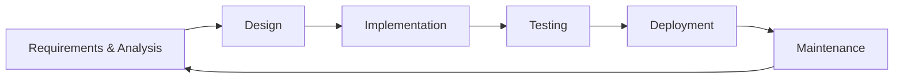
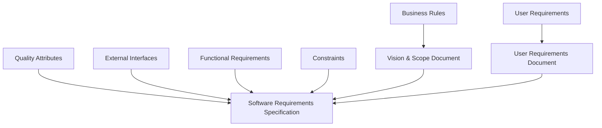
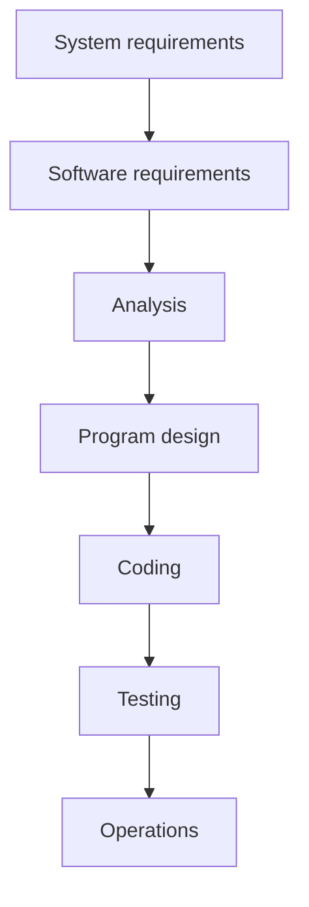
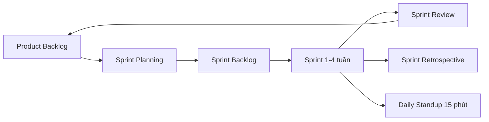
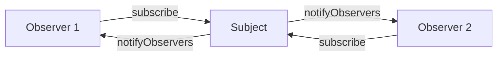
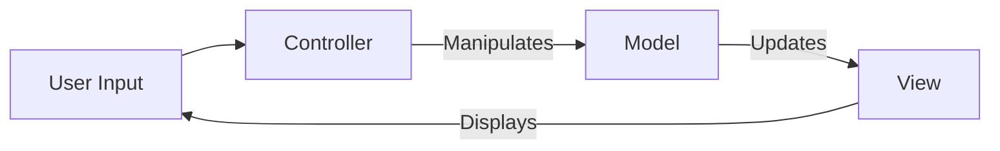
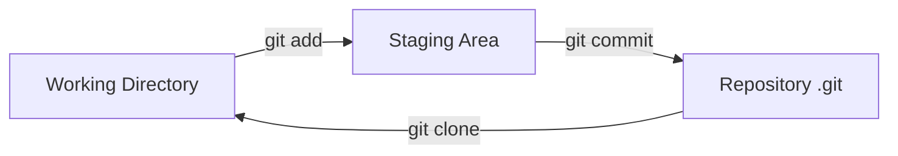
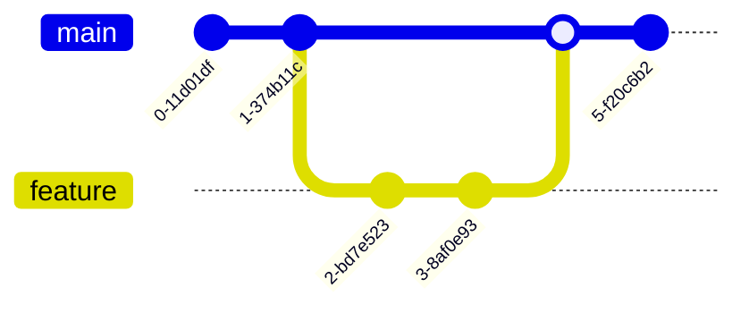
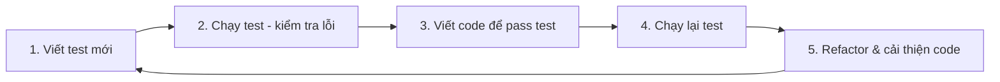

# Bài 2: Quy trình Thiết kế và Phát triển Phần mềm

---

## 1. Software Development Life Cycle (SDLC)

SDLC (Vòng đời phát triển phần mềm) là một quy trình có cấu trúc để xây dựng phần mềm, bắt đầu từ giai đoạn lên ý tưởng đến khi phân phối sản phẩm. SDLC không chỉ là lập trình — nó bao gồm toàn bộ các hoạt động: thu thập yêu cầu, thiết kế, kiểm thử, và bảo trì.



### 1.1. Các giai đoạn của SDLC

#### Giai đoạn 1 — Thu thập và Phân tích Yêu cầu

Đây là bước đầu tiên và quan trọng nhất. Mục tiêu là xác định rõ vấn đề cần giải quyết.

Các câu hỏi cốt lõi cần trả lời:

- Các vấn đề hiện tại là gì?
- Phần mềm cần làm được gì?
- Có thể phát triển trong ngân sách không?
- Rủi ro về lịch trình là gì?
- Phần mềm sẽ được kiểm tra và giao như thế nào?

**Đầu ra:** Tài liệu **SRS (Software Requirement Specification)** — đặc tả yêu cầu phần mềm chi tiết, được xác nhận bởi các bên liên quan.

**Người chịu trách nhiệm:** Sales, BA (Business Analyst), PM, khách hàng.

---

#### Giai đoạn 2 — Thiết kế (Design)

Dựa trên SRS, các kiến trúc sư và nhà phát triển thiết kế hệ thống ở hai cấp độ:

**HLD — High-Level Design (Thiết kế cấp cao):** Mô tả tổng thể kiến trúc hệ thống, gồm:

- Kiến trúc hệ thống (System Architecture)
- Thiết kế cơ sở dữ liệu
- Mô tả mối quan hệ giữa các module/dịch vụ

> Ví dụ HLD: Sơ đồ kiến trúc microservices của Uber với các thành phần như Kafka, Spark, HDFS, ML Fraud Detection, Pricing Surging...

**LLD — Low-Level Design (Thiết kế cấp thấp):** Đi sâu vào chi tiết từng thành phần:

- Data Flow Design
- Data Structure Design
- Algorithm Design
- Component-Level Design
- Architectural Design (chi tiết từng module)

> Ví dụ LLD: Sơ đồ ERD (Entity Relationship Diagram) với các bảng Orders, Products, Categories, Suppliers... hoặc Sequence Diagram mô tả luồng xử lý nghiệp vụ.

**Đầu ra:** Hồ sơ thiết kế, Flowchart, Diagram.

**Người chịu trách nhiệm:** Designer, BA.

---

#### Giai đoạn 3 — Hiện thực / Lập trình (Implementation)

Đây là giai đoạn dài nhất — lập trình viên viết code dựa trên tài liệu thiết kế HLD/LLD. Tất cả module được xây dựng trong giai đoạn này.

**Đầu ra:** Source code có chức năng đáp ứng yêu cầu.

**Người chịu trách nhiệm:** Developers.

---

#### Giai đoạn 4 — Kiểm thử (Testing)

Thực hiện kiểm thử trong môi trường test, bao gồm:

- **Functional testing** — kiểm tra chức năng đúng hay không
- **Integration testing** — kiểm tra các module tích hợp với nhau
- **Performance testing** — kiểm tra hiệu năng
- **Security testing** — kiểm tra bảo mật

Quá trình kiểm tra tiếp tục đến khi tất cả lỗi được sửa và vượt qua toàn bộ test case.

**Đầu ra:** Test case, Test plan, Bug Report.

**Người chịu trách nhiệm:** QA, Tester.

---

#### Giai đoạn 5 — Triển khai (Deployment)

Phần mềm được cài đặt lên **môi trường production** (môi trường thực tế của khách hàng). Product Manager phát hành phần mềm cho người dùng cuối.

**Đầu ra:** Tài liệu đặc tả hệ thống, hướng dẫn sử dụng, tài liệu cấu hình.

**Người chịu trách nhiệm:** DevOps.

---

#### Giai đoạn 6 — Bảo trì / Duy trì (Maintenance)

Sau khi phát hành, đội ngũ:

- Hỗ trợ khách hàng
- Gỡ lỗi phát sinh trên môi trường production
- Cải tiến tính năng
- Thu thập phản hồi từ khách hàng để lên kế hoạch phiên bản tiếp theo

---

### 1.2. Tài liệu SRS (Software Requirement Specification)

SRS là tài liệu quan trọng nhất kết thúc giai đoạn Requirements. Nó ghi lại:

- **Product scope** — mục tiêu, lợi ích kinh doanh
- **Product value** — tại sao sản phẩm quan trọng
- **Intended audience** — đối tượng người dùng
- **Intended use** — cách sử dụng
- **General description** — tóm tắt chức năng

SRS được tạo ra từ nhiều loại yêu cầu khác nhau:



---

## 2. Các Phương pháp Phát triển Phần mềm

### 2.1. So sánh tổng quan

| Tiêu chí | Traditional (Waterfall) | Agile |
|---|---|---|
| Phạm vi | Cố định (Fixed Scope) | Linh hoạt (Value-Driven) |
| Lập kế hoạch | Plan-Driven | Adaptive |
| Thay đổi yêu cầu | Khó thay đổi | Chào đón thay đổi |
| Tỷ lệ thành công | 14% | 42% (Standish Group 2015) |
| Tỷ lệ thất bại | 29% | 9% |

---

### 2.2. Waterfall (Thác Nước)

Mô hình truyền thống do **Winston W. Royce** giới thiệu, gồm 7 giai đoạn tuần tự:



**Khi nào nên dùng Waterfall:**

- Yêu cầu được xác định rõ ràng, ít thay đổi
- Khó tạo prototype để thử nghiệm sớm
- Biết trước toàn bộ yêu cầu trước khi bắt đầu
- Các vai trò được định nghĩa chặt chẽ
- Dự án dài hạn, chi phí cao, cần tài liệu hóa đầy đủ

**Các mô hình truyền thống khác:**

- Iterative Model
- Rational Unified Process (RUP)
- Spiral Model

---

### 2.3. Agile

Agile là phương pháp phát triển **linh hoạt, hướng khách hàng**. Ra đời từ **Agile Manifesto** năm 2001 do 17 nhà phát triển phần mềm tạo ra.

**4 giá trị cốt lõi của Agile Manifesto:**

1. **Cá nhân và tương tác** hơn là quy trình và công cụ
2. **Phần mềm hoạt động được** hơn là tài liệu đầy đủ
3. **Cộng tác với khách hàng** hơn là đàm phán hợp đồng
4. **Đáp ứng sự thay đổi** hơn là tuân theo kế hoạch

**12 nguyên tắc Agile (tóm lược):**

- Tập trung vào khách hàng
- Chấp nhận và thích ứng với thay đổi
- Thường xuyên phân phối phần mềm hoạt động được
- Hợp tác giữa người kinh doanh và lập trình viên
- Trao quyền cho đội ngũ có động lực
- Trao đổi trực tiếp là hiệu quả nhất
- Phần mềm hoạt động là thước đo tiến độ
- Làm việc với tốc độ bền vững
- Chú trọng kỹ thuật tốt và thiết kế tốt
- Đơn giản hóa
- Các nhóm tự tổ chức
- Liên tục cải thiện quy trình

#### Agile Scrum

Scrum là framework Agile phổ biến nhất.



**Các khái niệm quan trọng trong Scrum:**

- **Sprint:** Khoảng thời gian cố định (thường 2–4 tuần) để hoàn thành một tập các tính năng. Sprint end date không thay đổi.
- **Product Backlog:** Danh sách toàn bộ tính năng cần làm, được sắp xếp theo độ ưu tiên.
- **Sprint Backlog:** Tập con của Product Backlog được chọn cho sprint hiện tại.
- **User Story:** Mô tả tính năng từ góc nhìn người dùng theo mẫu:

```
As a <user|role>, I would like to <action>, so that <value|benefit>
```

> Ví dụ: *As a customer, I would like to filter products by category, so that I can find items faster.*

**Scrum Team:**

- Không quá 10 người (lý tưởng 3–9 người)
- **Product Owner** — "What" Guy: quyết định làm gì, ưu tiên gì
- **Scrum Master** — "How" Guy: đảm bảo quy trình, loại bỏ rào cản
- **Development Team** — thực thi

Scrum Master tổ chức **Daily Stand-up** hàng ngày, tối đa 15 phút, để điểm lại: đã làm gì, sẽ làm gì, có rào cản gì.

---

#### Agile Lean

Lean Software Development dựa trên nguyên tắc **Lean Manufacturing** (sản xuất tinh gọn của Toyota), tập trung vào **loại bỏ lãng phí** và tối đa hóa giá trị cho khách hàng.

**7 nguyên tắc Lean:**

| # | Nguyên tắc | Mô tả |
|---|---|---|
| 1 | **Eliminate Waste** | Loại bỏ 7 dạng lãng phí |
| 2 | **Amplify Learning** | Học nhanh qua sprint ngắn và phản hồi liên tục |
| 3 | **Decide as Late as Possible** | Trì hoãn quyết định đến khi có đủ thông tin |
| 4 | **Deliver as Fast as Possible** | Phân phối nhanh để nhận phản hồi sớm |
| 5 | **Empower the Team** | Mỗi người có quyền quyết định trong lĩnh vực chuyên môn |
| 6 | **Build Integrity In** | Đảm bảo phần mềm đáp ứng nhu cầu và duy trì giá trị lâu dài |
| 7 | **Optimize the Whole** | Suy nghĩ toàn cục, dài hạn |

**7 dạng lãng phí trong phát triển phần mềm:**

1. **Partially done work** — Công việc hoàn thành một phần
2. **Extra processes** — Quy trình dư thừa
3. **Extra features** — Tính năng dư thừa (không ai dùng)
4. **Task switching** — Hoán đổi nhiệm vụ liên tục
5. **Waiting** — Chờ đợi
6. **Motion** — Di chuyển không cần thiết
7. **Defects** — Lỗi phải sửa

**Tính toàn vẹn trong Lean:**

- **Perceived integrity (toàn vẹn nhận thức):** Khách hàng nói *"Đúng, đây chính xác là thứ tôi cần"*
- **Conceptual integrity (toàn vẹn khái niệm):** Phần mềm có thể phát triển dần theo nhu cầu theo thời gian

---

#### Các phương pháp Agile khác

- **Extreme Programming (XP):** Tập trung giải quyết các vấn đề chất lượng cụ thể của nhóm phát triển
- **Feature-Driven Development (FDD):** Phát triển được chia nhỏ và xây dựng theo từng tính năng (feature)

---

### 2.4. Câu hỏi thảo luận

??? question "Phương pháp Agile có phù hợp với các dự án critical systems (hệ thống yêu cầu an toàn cao) không?"
    **Trả lời:**

    Agile **không phải lúc nào cũng phù hợp** với critical systems (hệ thống hàng không, y tế, hạt nhân, tài chính lõi).

    **Lý do:**

    - Critical systems đòi hỏi **tài liệu hóa nghiêm ngặt** và **chứng nhận (certification)** từng giai đoạn — khó đạt được với sprint ngắn liên tục thay đổi.
    - Agile chấp nhận thay đổi yêu cầu liên tục, nhưng trong critical systems, một thay đổi nhỏ có thể đòi hỏi kiểm định lại toàn bộ hệ thống.
    - Các tiêu chuẩn như DO-178C (hàng không), IEC 61508 (công nghiệp) yêu cầu traceability đầy đủ từ yêu cầu đến code đến test — phù hợp với Waterfall/RUP hơn.

    **Tuy nhiên**, có thể kết hợp (**Agile + Safety**: ví dụ SAFe — Scaled Agile Framework) nếu tổ chức có quy trình nghiêm ngặt để đảm bảo mỗi increment đều được kiểm định đầy đủ.

---

## 3. Mẫu Thiết kế Phần mềm (Software Design Patterns)

### 3.1. Giới thiệu

Design Pattern là **giải pháp tái sử dụng được** cho các vấn đề thường gặp trong thiết kế phần mềm. Chúng không phụ thuộc vào ngôn ngữ lập trình cụ thể.

Định nghĩa gốc từ **Gang of Four (GoF)** — Erich Gamma, Richard Helm, Ralph Johnson, John Vlissides (1994):

> *"Program to an interface, not an implementation."*
> *"Favor object composition over class inheritance."*

**GoF chia thành 3 nhóm, 23 mẫu:**

| Nhóm | Mô tả |
|---|---|
| **Creational** (Khởi tạo) | Cách tạo đối tượng: Singleton, Factory, Abstract Factory, Builder, Prototype |
| **Structural** (Cấu trúc) | Cách kết hợp đối tượng: Adapter, Bridge, Composite, Decorator, Facade... |
| **Behavioral** (Hành vi) | Cách đối tượng giao tiếp: Observer, Strategy, Command, Iterator... |

---

### 3.2. Observer Pattern

Observer là mẫu **đăng ký – thông báo (subscription-notification)**, cho phép một đối tượng (Subject) thông báo tự động cho tất cả các đối tượng đang theo dõi nó (Observers) khi có thay đổi trạng thái.



**Cơ chế hoạt động:**

- Subject lưu danh sách các Observer
- Subject có phương thức `subscribe()` và `unsubscribe()`
- Khi trạng thái thay đổi, Subject gọi `notifyObservers()` để thông báo đến tất cả

**Ưu điểm:**

- Observer nhận thông báo **real-time** khi có thay đổi
- Hiệu quả hơn cơ chế **polling** (liên tục hỏi có thay đổi không)

---

### 3.3. Model-View-Controller (MVC)

MVC tách ứng dụng thành 3 thành phần độc lập:



| Thành phần | Vai trò |
|---|---|
| **Model** | Quản lý dữ liệu, logic nghiệp vụ, và các quy tắc của ứng dụng |
| **View** | Biểu diễn trực quan của dữ liệu (giao diện người dùng) |
| **Controller** | Trung gian: nhận input từ user, chuyển đổi và điều phối Model/View |

**Ưu điểm chính:** Mỗi thành phần có thể được build song song bởi các team khác nhau.

---

## 4. Hệ thống Quản lý Phiên bản (Version Control)

### 4.1. Giới thiệu

Version control (còn gọi: revision control, source control) là phương pháp quản lý các thay đổi trong tệp, lưu trữ lịch sử thay đổi theo thời gian.

**Lợi ích:**

- Phối hợp làm việc nhóm
- Truy vết và minh bạch (accountability)
- Làm việc độc lập trên nhánh riêng
- Đảm bảo an toàn dữ liệu
- Làm việc từ bất kỳ đâu

---

### 4.2. Ba loại VCS

#### Local VCS (LVCS)

Lưu trữ toàn bộ lịch sử thay đổi trong cơ sở dữ liệu trên máy cục bộ dưới dạng **delta** (sự khác biệt giữa các phiên bản). Khi cần khôi phục, các delta được đảo ngược.

**Hạn chế:** Không hỗ trợ cộng tác nhóm.

#### Centralized VCS (CVCS)

Sử dụng mô hình **server-client**. Kho lưu trữ đặt trên một server trung tâm. Mỗi lúc chỉ một người có thể làm việc trên một file (cơ chế lock/checkout).

**Hạn chế:** Nếu server sập, toàn bộ nhóm không làm việc được.

#### Distributed VCS (DVCS)

Mô hình **peer-to-peer**. Mỗi client có bản sao đầy đủ của toàn bộ repository (bao gồm cả lịch sử). Không cần khóa file.

**Ưu điểm:** Làm việc offline được, không phụ thuộc server trung tâm.

---

### 4.3. Git

Git là DVCS mã nguồn mở phổ biến nhất hiện nay. Điểm đặc biệt: Git lưu trữ dữ liệu dưới dạng **snapshot** (ảnh chụp toàn bộ trạng thái) thay vì delta. Nếu file không thay đổi, Git dùng link tham chiếu đến snapshot cũ thay vì tạo snapshot mới.

#### 3 giai đoạn và 3 trạng thái



**3 trạng thái của file:**

- **Modified:** File đã thay đổi trong Working Directory nhưng chưa stage
- **Staged:** File đã được đánh dấu để đưa vào commit tiếp theo
- **Committed:** Dữ liệu đã được lưu vào repository

#### Các lệnh Git cơ bản

```bash
# Cấu hình ban đầu
git config --global user.name "Tên"
git config --global user.email "email@example.com"

# Khởi tạo repository
git init <project-directory>

# Clone repository từ xa
git clone <repository-url> [target-directory]

# Xem trạng thái file
git status

# So sánh thay đổi
git diff

# Thêm file vào staging area
git add <file-path>
git add .  # Thêm tất cả file đã thay đổi

# Xóa file khỏi repository
git rm <file-path>
git rm --cached <file-path>  # Chỉ xóa khỏi staging, giữ lại file

# Commit thay đổi
git commit -m "Mô tả thay đổi"

# Đẩy lên remote
git push origin master
git push origin <branch-name>

# Kéo về từ remote
git pull
git pull origin <branch-name>
```

#### Branching (Phân nhánh)



```bash
# Tạo nhánh
git branch <parent-branch> <branch-name>
git checkout -b <branch-name>

# Xóa nhánh
git branch -d <branch-name>

# Liệt kê nhánh
git branch --list

# Gộp nhánh
git merge <branch-name>
git checkout <target-branch> && git merge <source-branch>
```

**Fast-Forward Merge:** Git tự động áp dụng commit từ nhánh nguồn vào nhánh đích mà không có xung đột.

**Merge Conflict:** Xảy ra khi Git không thể tự động gộp vì cùng một đoạn code bị chỉnh sửa ở hai nhánh khác nhau. Phải giải quyết thủ công.

#### File .diff

File `.diff` mô tả sự khác biệt giữa hai phiên bản của một file:

| Symbol | Ý nghĩa |
|---|---|
| `+` | Dòng được thêm vào |
| `-` | Dòng bị xóa |
| `/dev/null` hoặc blank | File được thêm hoặc xóa |
| `@@` | Bắt đầu một khối thay đổi mới |
| `index` | Hiển thị các commit đang so sánh |

#### Git vs GitHub

| | Git | GitHub |
|---|---|---|
| Bản chất | Phần mềm VCS phân tán | Dịch vụ hosting repository (Microsoft) |
| Giao diện | Command line | Web UI |
| Tính năng thêm | — | Code review, bug tracking, project management, pull requests |

---

## 5. Nền tảng Lập trình

### 5.1. Clean Code (Mã nguồn sạch)

Clean code là mã nguồn được viết để **dễ đọc và dễ hiểu** cho các lập trình viên khác, không chỉ cho máy.

**Đặc điểm:**

- Tuân theo quy tắc định dạng nhất quán
- Tổ chức tốt, module hóa
- Có comment và tài liệu đầy đủ
- Tên biến, hàm rõ ràng, có ý nghĩa

**Lợi ích:**

- Dễ bảo trì, chi phí thấp hơn
- Dễ kiểm thử tự động (unit testing)
- Dễ quét với công cụ tự động
- Dễ mở rộng và tái sử dụng

---

### 5.2. Methods, Functions, Modules, Classes

#### Hàm và Phương thức

Hàm và phương thức là khối code thực thi một tác vụ cụ thể, được viết một lần và dùng nhiều lần.

```python
# Định nghĩa hàm
def tinh_dien_tich(ban_kinh):
    pi = 3.14
    ket_qua = pi * ban_kinh * ban_kinh
    return ket_qua

# Gọi hàm
dien_tich = tinh_dien_tich(5)
print(dien_tich)
```

**Phân biệt:**

| | Phương thức (Method) | Hàm (Function) |
|---|---|---|
| Gắn với | Đối tượng (Object) | Độc lập |
| Sử dụng trong | OOP | Lập trình hàm / OOP |

**Đối số (Arguments) vs Tham số (Parameters):**

- **Parameters:** Biến trong định nghĩa hàm
- **Arguments:** Giá trị thực tế truyền vào khi gọi hàm

```python
def chao(ten, loi_chao="Xin chào"):  # ten, loi_chao là parameters
    print(f"{loi_chao}, {ten}!")

chao("Hưng", "Chào buổi sáng")  # "Hưng", "Chào buổi sáng" là arguments
```

#### Module

Module là tập hợp các hàm đóng gói trong một file, hoạt động độc lập và có interface để module khác tương tác.

```python
# circleClass.py
class Circle:
    def __init__(self, radius):
        self.radius = radius

    def circumference(self):
        pi = 3.14
        return 2 * pi * self.radius

    def print_circumference(self):
        c = self.circumference()
        print(f"Chu vi đường tròn bán kính {self.radius} là {c}")
```

#### Classes (Lớp)

Trong OOP, lớp là cách gom nhóm dữ liệu và chức năng. Một lớp có thể:

- Có biến lớp và biến đối tượng
- Kế thừa từ lớp khác (inheritance)
- Được khởi tạo nhiều lần thành các instance độc lập

!!! note "Lưu ý Python"
    Trong Python, không có `private` như Java/C++. Tuy nhiên, biến/phương thức bắt đầu bằng `_` (underscore) được quy ước là "private" và không nên truy cập từ bên ngoài class.

---

## 6. Đánh giá và Kiểm thử Mã nguồn

### 6.1. Code Review

Code review là quá trình **lập trình viên khác** xem xét mã nguồn và đưa ra phản hồi sau khi thay đổi đã hoàn tất.

**Mục tiêu:**

- Dễ đọc, dễ hiểu
- Tuân theo best practices
- Đúng định dạng
- Không có lỗi
- Có comment và tài liệu đầy đủ
- Clean code

**Các loại code review:**

| Loại | Mô tả |
|---|---|
| **Formal** | Họp chính thức để review toàn bộ mã |
| **Change-Based** | Review các thay đổi cụ thể (bug fix, user story, commit) — phổ biến nhất |
| **Over-the-Shoulder** | Reviewer quan sát trực tiếp khi dev viết code |
| **Email** | Hệ thống tự động gửi email khi có thay đổi |

---

### 6.2. Kiểm thử (Testing)

#### Functional Testing vs Non-Functional Testing

| | Functional Testing | Non-Functional Testing |
|---|---|---|
| Kiểm tra | Phần mềm có làm đúng không? | Phần mềm có phù hợp mục đích không? |
| Bao gồm | Unit test, Integration test | Performance, Security, Usability, Recovery |

#### Unit Testing

Kiểm thử từng đơn vị nhỏ nhất: dòng code, khối code, hàm, class.

**Framework cho Python:**

- **PyTest:** Tự động phát hiện file bắt đầu bằng `test_` hoặc kết thúc bằng `_test.py`, và hàm bắt đầu bằng `test_`
- **unittest:** Kế thừa class `TestCase`, ghi đè hoặc thêm phương thức `test_`

```python
# Ví dụ với PyTest
def cong(a, b):
    return a + b

def test_cong():
    assert cong(2, 3) == 5
    assert cong(-1, 1) == 0
```

#### Integration Testing

Kiểm thử các module riêng biệt khi kết hợp lại với nhau để tạo thành ứng dụng hoàn chỉnh.

#### Test-Driven Development (TDD)

TDD là phương pháp **viết test trước, viết code sau**. Quy trình 5 bước lặp lại:



---

## 7. Các Định dạng Dữ liệu

REST API sử dụng 3 định dạng chuẩn để trao đổi dữ liệu:

### 7.1. XML (Extensible Markup Language)

```xml
<?xml version="1.0" encoding="UTF-8"?>
<!-- Instance list -->
<vms>
    <vm>
        <vmid>0101af9811012</vmid>
        <type>t1.nano</type>
    </vm>
    <vm>
        <vmid>0102b88908023</vmid>
        <type>t1.micro</type>
    </vm>
</vms>
```

**Đặc điểm:**

- Tag do người dùng tự định nghĩa
- Hỗ trợ comment (`<!-- -->`)
- Hỗ trợ thuộc tính (attributes) trong tag
- Hỗ trợ Namespaces (xác định bởi URI)
- File kết thúc bằng `.xml`

---

### 7.2. JSON (JavaScript Object Notation)

```json
{
    "edit-config": "default-operation",
    "default-operation": "merge",
    "test-operation": "set",
    "some-integers": [2, 3, 5, 7, 9],
    "a-boolean": true,
    "more-numbers": [2.25e+2, -1.0735]
}
```

**Đặc điểm:**

- Kiểu dữ liệu: số, chuỗi, boolean, null, object, array
- **Không hỗ trợ comment**
- Khoảng trắng không quan trọng
- Dễ đọc, nhẹ hơn XML
- File kết thúc bằng `.json`

---

### 7.3. YAML (YAML Ain't Markup Language)

```yaml
---
edit-config:
  default-operation: merge
  test-operation: set
  some-integers:
    - 2
    - 3
    - 5
  a-boolean: true
  more-numbers: [225, -1.0735]
...
```

**Đặc điểm:**

- **Tập cha của JSON** — bộ phân tích YAML có thể đọc JSON
- Dùng **thụt lề** để xác định cấu trúc phân cấp
- Hỗ trợ comment (`# comment`)
- Bắt đầu bằng `---`, kết thúc bằng `...`
- Hỗ trợ chuỗi dài với cú pháp folding

---

### 7.4. Parsing và Serializing

- **Parsing:** Phân tích một chuỗi văn bản (XML/JSON/YAML) thành cấu trúc dữ liệu trong bộ nhớ
- **Serializing:** Ngược lại — chuyển cấu trúc dữ liệu trong bộ nhớ thành chuỗi văn bản

```python
import json

# Parsing (JSON string -> Python dict)
data = json.loads('{"name": "Hưng", "age": 22}')
print(data["name"])  # Hưng

# Serializing (Python dict -> JSON string)
output = json.dumps({"name": "Hưng", "age": 22}, indent=2)
print(output)
```

---

## 📝 Câu hỏi Trắc nghiệm

---

**Câu 1.** SDLC là viết tắt của?

- A. Software Design and Layout Cycle
- B. Software Development Life Cycle
- C. System Development and Launch Cycle
- D. Software Deployment and Launch Cycle

??? info "Đáp án & Giải thích"
    **Đáp án: B**

    SDLC — Software Development Life Cycle — là quy trình phát triển phần mềm từ lên ý tưởng đến phân phối và bảo trì.

---

**Câu 2.** Giai đoạn nào trong SDLC tạo ra tài liệu SRS?

- A. Design
- B. Testing
- C. Requirements & Analysis
- D. Deployment

??? info "Đáp án & Giải thích"
    **Đáp án: C**

    Cuối giai đoạn Requirements & Analysis, mô hình Waterfall đề xuất tạo tài liệu SRS (Software Requirement Specification).

---

**Câu 3.** Ai chịu trách nhiệm chính trong giai đoạn Testing?

- A. Developers
- B. DevOps
- C. QA, Tester
- D. BA, PM

??? info "Đáp án & Giải thích"
    **Đáp án: C**

    Theo bảng SDLC trong slide, giai đoạn Testing do QA (Quality Assurance) và Tester chịu trách nhiệm.

---

**Câu 4.** HLD trong thiết kế phần mềm là viết tắt của?

- A. Hardware Level Design
- B. High-Level Design
- C. Hybrid-Layer Design
- D. High-Logic Diagram

??? info "Đáp án & Giải thích"
    **Đáp án: B**

    HLD — High-Level Design — thiết kế cấp cao, mô tả kiến trúc tổng thể, cơ sở dữ liệu, và mối quan hệ giữa các module.

---

**Câu 5.** Low-Level Design (LLD) KHÔNG bao gồm thành phần nào sau đây?

- A. Data Structure Design
- B. Algorithm Design
- C. Business Requirements Document
- D. Data Flow Design

??? info "Đáp án & Giải thích"
    **Đáp án: C**

    LLD bao gồm: Data Flow Design, Data Structure Design, Algorithm Design, Component-Level Design, Architectural Design. Business Requirements Document thuộc giai đoạn Requirements.

---

**Câu 6.** Theo Standish Group CHAOS Report 2015, tỷ lệ thành công của dự án dùng Agile so với Waterfall là bao nhiêu?

- A. Agile 42%, Waterfall 14%
- B. Agile 14%, Waterfall 42%
- C. Agile 49%, Waterfall 57%
- D. Agile 9%, Waterfall 29%

??? info "Đáp án & Giải thích"
    **Đáp án: A**

    Agile: 42% thành công, 49% challenged, 9% thất bại. Waterfall: 14% thành công, 57% challenged, 29% thất bại.

---

**Câu 7.** Agile Manifesto được tạo ra vào năm nào và bởi bao nhiêu nhà phát triển?

- A. 1999, 12 người
- B. 2001, 17 người
- C. 2003, 10 người
- D. 2001, 12 người

??? info "Đáp án & Giải thích"
    **Đáp án: B**

    Agile Manifesto được 17 nhà phát triển phần mềm tạo ra năm 2001.

---

**Câu 8.** Trong Agile Manifesto, giá trị nào được ưu tiên hơn?

- A. Tài liệu chi tiết hơn phần mềm hoạt động
- B. Tuân theo kế hoạch hơn đáp ứng thay đổi
- C. Phần mềm hoạt động hơn tài liệu đầy đủ
- D. Hợp đồng cụ thể hơn cộng tác với khách hàng

??? info "Đáp án & Giải thích"
    **Đáp án: C**

    Một trong 4 giá trị Agile: *"Working software over comprehensive documentation"* — phần mềm hoạt động quan trọng hơn tài liệu đầy đủ.

---

**Câu 9.** Sprint trong Scrum thường kéo dài bao lâu?

- A. 1 tuần
- B. 1 tháng
- C. 2–4 tuần
- D. 3–6 tháng

??? info "Đáp án & Giải thích"
    **Đáp án: C**

    Sprint là khoảng thời gian cố định từ 2–4 tuần. Khoảng thời gian được xác định trước và hiếm khi thay đổi.

---

**Câu 10.** Trong Scrum, "Product Owner" có vai trò gì?

- A. "How" Guy — quyết định cách làm
- B. "What" Guy — quyết định làm gì và ưu tiên gì
- C. Quản lý server và deployment
- D. Viết test case

??? info "Đáp án & Giải thích"
    **Đáp án: B**

    Product Owner là "What" Guy — quyết định tính năng nào cần làm và ưu tiên thứ tự trong Product Backlog. Scrum Master là "How" Guy.

---

**Câu 11.** Số lượng thành viên tối đa của một Scrum Team là bao nhiêu?

- A. 5 người
- B. 7 người
- C. 10 người
- D. 15 người

??? info "Đáp án & Giải thích"
    **Đáp án: C**

    Scrum Team không được lớn hơn 10 người. Quy mô lý tưởng là 3–9 người, bao gồm cả Product Owner và Scrum Master.

---

**Câu 12.** Daily Stand-up trong Scrum giới hạn thời gian tối đa là bao nhiêu?

- A. 5 phút
- B. 10 phút
- C. 15 phút
- D. 30 phút

??? info "Đáp án & Giải thích"
    **Đáp án: C**

    Scrum Master tổ chức cuộc họp trực tiếp hàng ngày tối đa 15 phút để điểm lại tiến độ.

---

**Câu 13.** User Story trong Scrum có mẫu chuẩn nào?

- A. `As a <role>, I want <feature>, because <reason>`
- B. `As a <user|role>, I would like to <action>, so that <value|benefit>`
- C. `Given <context>, When <action>, Then <result>`
- D. `Feature: <name>, Scenario: <description>`

??? info "Đáp án & Giải thích"
    **Đáp án: B**

    Mẫu chuẩn: *"As a `<user|role>`, I would like to `<action>`, so that `<value|benefit>`"*

---

**Câu 14.** Nguyên tắc nền tảng nhất của Lean Software Development là gì?

- A. Amplify Learning
- B. Eliminate Waste
- C. Deliver as Fast as Possible
- D. Empower the Team

??? info "Đáp án & Giải thích"
    **Đáp án: B**

    Eliminate Waste (loại bỏ lãng phí) là nguyên tắc nền tảng cơ bản nhất của Lean.

---

**Câu 15.** "Task switching" trong 7 dạng lãng phí của Lean là gì?

- A. Tính năng không cần thiết
- B. Chuyển đổi qua lại giữa nhiều nhiệm vụ
- C. Đợi phê duyệt từ quản lý
- D. Di chuyển văn phòng

??? info "Đáp án & Giải thích"
    **Đáp án: B**

    Task switching — hoán đổi nhiệm vụ — là việc lập trình viên liên tục chuyển đổi giữa nhiều task khác nhau, làm giảm hiệu suất do context switching overhead.

---

**Câu 16.** Gang of Four (GoF) chia Design Patterns thành mấy nhóm?

- A. 2 nhóm
- B. 3 nhóm
- C. 4 nhóm
- D. 5 nhóm

??? info "Đáp án & Giải thích"
    **Đáp án: B**

    GoF chia thành 3 nhóm: Creational, Structural, và Behavioral, với tổng cộng 23 mẫu.

---

**Câu 17.** Observer Pattern thuộc nhóm nào trong GoF?

- A. Creational
- B. Structural
- C. Behavioral
- D. Functional

??? info "Đáp án & Giải thích"
    **Đáp án: C**

    Observer Pattern thuộc nhóm Behavioral (hành vi) — mô tả cách các đối tượng giao tiếp và thông báo cho nhau.

---

**Câu 18.** Ưu điểm chính của Observer Pattern so với cơ chế polling là gì?

- A. Tiêu tốn ít bộ nhớ hơn
- B. Observer nhận thông báo real-time mà không cần liên tục hỏi
- C. Dễ lập trình hơn
- D. Hỗ trợ nhiều ngôn ngữ hơn

??? info "Đáp án & Giải thích"
    **Đáp án: B**

    Cơ chế đăng ký-thông báo của Observer cho hiệu suất tốt hơn polling vì không cần liên tục kiểm tra trạng thái, mà được thông báo ngay khi có thay đổi.

---

**Câu 19.** Trong MVC, thành phần nào chịu trách nhiệm quản lý logic nghiệp vụ?

- A. View
- B. Controller
- C. Model
- D. Router

??? info "Đáp án & Giải thích"
    **Đáp án: C**

    Model quản lý dữ liệu, logic và các quy tắc của ứng dụng. View hiển thị dữ liệu. Controller là trung gian nhận input từ user.

---

**Câu 20.** Điểm khác biệt chính giữa Centralized VCS và Distributed VCS là gì?

- A. DVCS chỉ hỗ trợ Linux
- B. Trong DVCS, mỗi client có bản sao đầy đủ của toàn bộ repository
- C. CVCS không hỗ trợ phân nhánh
- D. DVCS không hỗ trợ merge

??? info "Đáp án & Giải thích"
    **Đáp án: B**

    Trong DVCS, mỗi client có bản sao đầy đủ (full clone) của repository bao gồm toàn bộ lịch sử. CVCS chỉ có một kho trung tâm, mỗi client chỉ checkout file cần làm.

---

**Câu 21.** Git lưu trữ dữ liệu dưới dạng nào — khác với các VCS truyền thống?

- A. Delta (sự khác biệt giữa các phiên bản)
- B. Snapshot (ảnh chụp toàn bộ trạng thái)
- C. Binary dump
- D. Compressed archive

??? info "Đáp án & Giải thích"
    **Đáp án: B**

    Git lưu dữ liệu dưới dạng snapshot. Nếu file không thay đổi, Git dùng link tham chiếu đến snapshot cũ thay vì tạo bản sao mới. Hầu hết các VCS khác lưu delta.

---

**Câu 22.** Lệnh nào dùng để thêm file vào staging area trong Git?

- A. `git commit`
- B. `git stage`
- C. `git add`
- D. `git push`

??? info "Đáp án & Giải thích"
    **Đáp án: C**

    `git add <file-path>` thêm file vào staging area. `git add .` thêm tất cả file đã thay đổi.

---

**Câu 23.** Lệnh `git rm --cached <file>` có tác dụng gì?

- A. Xóa file hoàn toàn khỏi máy tính
- B. Xóa file khỏi staging area nhưng giữ lại trên thư mục làm việc
- C. Xóa file khỏi remote repository
- D. Xóa toàn bộ lịch sử của file

??? info "Đáp án & Giải thích"
    **Đáp án: B**

    `git rm --cached` chỉ xóa file khỏi staging area (untrack), file vẫn còn trên đĩa trong working directory.

---

**Câu 24.** Lệnh `git push origin master` thực hiện điều gì?

- A. Kéo dữ liệu từ nhánh master về local
- B. Tạo nhánh master mới
- C. Đẩy nội dung từ kho lưu trữ cục bộ lên nhánh master của remote
- D. Gộp nhánh master vào nhánh hiện tại

??? info "Đáp án & Giải thích"
    **Đáp án: C**

    `git push origin master` cập nhật nội dung từ kho cục bộ lên nhánh master của remote repository (origin). Lệnh sẽ thất bại nếu có xung đột.

---

**Câu 25.** Fast-Forward Merge trong Git là gì?

- A. Gộp nhánh có xung đột, cần can thiệp thủ công
- B. Gộp nhánh tự động không có xung đột
- C. Gộp nhiều nhánh cùng lúc
- D. Xóa nhánh sau khi gộp

??? info "Đáp án & Giải thích"
    **Đáp án: B**

    Fast-Forward Merge là khi Git có thể tự động áp dụng các commit từ nhánh nguồn vào nhánh đích mà không có xung đột nào.

---

**Câu 26.** Trong file .diff, ký hiệu `+` có nghĩa là gì?

- A. Dòng bị xóa
- B. Dòng được thêm vào
- C. Bắt đầu khối thay đổi mới
- D. File mới được tạo

??? info "Đáp án & Giải thích"
    **Đáp án: B**

    Trong file .diff: `+` = dòng được thêm, `-` = dòng bị xóa, `@@` = bắt đầu khối mới.

---

**Câu 27.** Git và GitHub khác nhau như thế nào?

- A. Chúng là hai tên khác nhau của cùng một sản phẩm
- B. Git là phần mềm VCS; GitHub là dịch vụ hosting repository dùng Git do Microsoft cung cấp
- C. GitHub là phiên bản mới hơn của Git
- D. Git chỉ dùng cho Linux; GitHub dùng cho Windows

??? info "Đáp án & Giải thích"
    **Đáp án: B**

    Git là một hiện thực của DVCS (command-line tool). GitHub là dịch vụ cloud của Microsoft để lưu trữ repository Git, bổ sung thêm code review, bug tracking, project management, pull requests.

---

**Câu 28.** "Pull Request" là khái niệm do nền tảng nào giới thiệu?

- A. GitLab
- B. Bitbucket
- C. GitHub
- D. SourceForge

??? info "Đáp án & Giải thích"
    **Đáp án: C**

    GitHub giới thiệu khái niệm Pull Request — chuẩn hóa cách đề xuất thay đổi code vào nhánh chính của dự án.

---

**Câu 29.** Clean Code có lợi ích nào sau đây?

- A. Chạy nhanh hơn code thông thường
- B. Dễ kiểm thử tự động và bảo trì với chi phí thấp hơn
- C. Chiếm ít bộ nhớ hơn
- D. Không cần comment

??? info "Đáp án & Giải thích"
    **Đáp án: B**

    Clean code dễ kiểm thử với unit testing framework, dễ quét với công cụ tự động, và bảo trì với chi phí thấp hơn.

---

**Câu 30.** Phân biệt giữa Method và Function trong OOP?

- A. Method nhanh hơn Function
- B. Method gắn với một đối tượng; Function là khối code độc lập
- C. Function có thể có tham số; Method thì không
- D. Method chỉ dùng trong Python; Function dùng trong tất cả ngôn ngữ

??? info "Đáp án & Giải thích"
    **Đáp án: B**

    Method là khối code gắn với một object (trong OOP). Function là khối code độc lập, không gắn với object cụ thể.

---

**Câu 31.** Module trong lập trình là gì?

- A. Một hàm duy nhất thực hiện tác vụ phức tạp
- B. Tập hợp các hàm đóng gói trong một file, hoạt động độc lập
- C. Một class với nhiều phương thức
- D. Một biến toàn cục

??? info "Đáp án & Giải thích"
    **Đáp án: B**

    Module là tập các hàm được đóng gói thành một file, có interface để module khác tương tác, và dự kiến hoạt động độc lập.

---

**Câu 32.** Change-Based Code Review còn được gọi là gì?

- A. Formal Code Review
- B. Over-the-Shoulder Code Review
- C. Tool-assisted Code Review
- D. Pair Programming

??? info "Đáp án & Giải thích"
    **Đáp án: C**

    Change-Based Code Review còn được biết đến là "tool-assisted code review" — đánh giá các thay đổi cụ thể do bug, user story, commit.

---

**Câu 33.** Kiểm thử chức năng (Functional Testing) kiểm tra điều gì?

- A. Tốc độ thực thi của phần mềm
- B. Phần mềm có hoạt động đúng theo logic đã định nghĩa hay không
- C. Giao diện người dùng có đẹp không
- D. Khả năng phục hồi sau sự cố

??? info "Đáp án & Giải thích"
    **Đáp án: B**

    Functional Testing kiểm tra phần mềm có thực hiện đúng chức năng, từ Unit Testing đến Integration Testing. Non-functional testing mới kiểm tra performance, security, usability...

---

**Câu 34.** TDD là viết tắt của?

- A. Test-Driven Design
- B. Test-Driven Development
- C. Technical Design Document
- D. Task-Driven Deployment

??? info "Đáp án & Giải thích"
    **Đáp án: B**

    TDD — Test-Driven Development — phương pháp viết test trước, rồi mới viết code để pass test đó.

---

**Câu 35.** Bước nào đúng trong quy trình TDD?

- A. Viết code → Viết test → Refactor
- B. Viết test → Viết code → Refactor → Lặp lại
- C. Thiết kế → Viết code → Viết test
- D. Viết test → Deploy → Viết code

??? info "Đáp án & Giải thích"
    **Đáp án: B**

    Quy trình TDD 5 bước: (1) Tạo test mới → (2) Chạy test xem lỗi → (3) Viết code để pass test → (4) Chạy test → (5) Refactor và cải thiện.

---

**Câu 36.** XML là viết tắt của?

- A. Extended Markup Language
- B. Extensible Markup Language
- C. Extra Markup Language
- D. External Module Language

??? info "Đáp án & Giải thích"
    **Đáp án: B**

    XML — Extensible Markup Language — ngôn ngữ đánh dấu mở rộng, gói dữ liệu văn bản trong các tag đối xứng.

---

**Câu 37.** JSON KHÔNG hỗ trợ tính năng nào mà XML và YAML có?

- A. Kiểu dữ liệu số
- B. Kiểu dữ liệu boolean
- C. Comment
- D. Mảng (Array)

??? info "Đáp án & Giải thích"
    **Đáp án: C**

    JSON không hỗ trợ comment. XML hỗ trợ `<!-- comment -->`, YAML hỗ trợ `# comment`.

---

**Câu 38.** YAML là tập cha (superset) của định dạng nào?

- A. XML
- B. JSON
- C. HTML
- D. CSV

??? info "Đáp án & Giải thích"
    **Đáp án: B**

    YAML là superset của JSON — bộ phân tích YAML có thể đọc JSON, nhưng ngược lại không được.

---

**Câu 39.** Tệp YAML bắt đầu và kết thúc bằng ký hiệu gì?

- A. `{` và `}`
- B. `<yaml>` và `</yaml>`
- C. `---` và `...`
- D. `##` và `##`

??? info "Đáp án & Giải thích"
    **Đáp án: C**

    Tệp YAML bắt đầu bằng `---` (3 dấu gạch ngang) và kết thúc bằng `...` (3 dấu chấm), mỗi ký hiệu trên một dòng riêng.

---

**Câu 40.** "Parsing" trong bối cảnh định dạng dữ liệu là gì?

- A. Chuyển đổi cấu trúc dữ liệu thành chuỗi văn bản
- B. Phân tích chuỗi văn bản thành cấu trúc dữ liệu có ý nghĩa
- C. Nén dữ liệu để tiết kiệm không gian
- D. Mã hóa dữ liệu để bảo mật

??? info "Đáp án & Giải thích"
    **Đáp án: B**

    Parsing là phân tích một thông điệp (chuỗi XML/JSON/YAML) thành các cấu trúc dữ liệu trong bộ nhớ. Serializing là ngược lại.

---

**Câu 41.** Trong 3 trạng thái của Git, "Staged" có nghĩa là gì?

- A. File đã được commit vào repository
- B. File đã thay đổi và được đánh dấu để đưa vào commit tiếp theo
- C. File đang được push lên remote
- D. File bị xóa khỏi thư mục làm việc

??? info "Đáp án & Giải thích"
    **Đáp án: B**

    Staged = file đã được `git add`, nằm trong staging area, sẵn sàng để được `git commit`.

---

**Câu 42.** Lệnh `git pull` thực hiện những bước nào?

- A. Chỉ tải về lịch sử commit mới nhất
- B. Cập nhật kho cục bộ, cập nhật thư mục làm việc, và tạo commit mới
- C. Đẩy thay đổi local lên remote
- D. Tạo nhánh mới từ remote

??? info "Đáp án & Giải thích"
    **Đáp án: B**

    `git pull` thực hiện: (1) Cập nhật .git với commit và lịch sử mới từ remote → (2) Cập nhật working directory → (3) Tạo commit ở nhánh cục bộ với các thay đổi.

---

**Câu 43.** Khi Scrum Master chuyển nhánh trong Git, điều gì xảy ra với thư mục `.git`?

- A. Thư mục `.git` bị xóa và tạo lại
- B. Thư mục `.git` không thay đổi
- C. Thư mục `.git` được sao chép vào nhánh mới
- D. Thư mục `.git` bị khóa trong quá trình chuyển nhánh

??? info "Đáp án & Giải thích"
    **Đáp án: B**

    Khi chuyển nhánh, mã nguồn trong working directory và staging area thay đổi theo, nhưng thư mục `.git` (repository) **vẫn không đổi**.

---

**Câu 44.** PyTest tự động nhận diện test file theo quy tắc nào?

- A. File phải có tên `test.py`
- B. File bắt đầu bằng `test_` hoặc kết thúc bằng `_test.py`
- C. File phải được đặt trong thư mục `/tests/`
- D. File phải import module `pytest`

??? info "Đáp án & Giải thích"
    **Đáp án: B**

    PyTest tự động phát hiện file bắt đầu bằng `test_` hoặc kết thúc bằng `_test.py`, và bên trong tự động chạy các hàm bắt đầu bằng `test_` hoặc `tests_`.

---

**Câu 45.** Mô hình Waterfall phù hợp nhất với dự án nào?

- A. Startup muốn ra sản phẩm nhanh với yêu cầu thay đổi liên tục
- B. Ứng dụng mobile với người dùng đa dạng
- C. Hệ thống dài hạn với yêu cầu rõ ràng, ít thay đổi, cần tài liệu hóa đầy đủ
- D. Dự án R&D với nhiều thử nghiệm

??? info "Đáp án & Giải thích"
    **Đáp án: C**

    Waterfall phù hợp khi: yêu cầu được xác định rõ, ít thay đổi, dự án dài hạn chi phí cao, cần tài liệu hóa toàn bộ, và các vai trò được định nghĩa chặt chẽ.

---

**Câu 46.** Trong XML Namespaces, URI dùng để làm gì?

- A. Xác định vị trí file XML
- B. Xác định chuẩn/schema để diễn giải nội dung
- C. Mã hóa nội dung của tag
- D. Kết nối đến database

??? info "Đáp án & Giải thích"
    **Đáp án: B**

    Namespaces được xác định bằng Uniform Resource Names (URIs) để truy cập tài liệu bất kể vị trí và xác định cách diễn giải nội dung theo chuẩn nhất định (ví dụ: NETCONF 1.0).

---

**Câu 47.** Nguyên tắc "Optimize the Whole" trong Lean có nghĩa là gì?

- A. Tối ưu hóa từng module riêng lẻ
- B. Ưu tiên hiệu năng phần cứng
- C. Suy nghĩ dài hạn và toàn cục, ưu tiên Khách hàng > Công ty > Nhóm > Cá nhân
- D. Đặt deadline cho toàn bộ dự án

??? info "Đáp án & Giải thích"
    **Đáp án: C**

    Optimize the Whole: phần mềm phải được xây dựng nhất quán, không chỉ tối ưu từng phần riêng lẻ. Tư duy toàn cục, dài hạn, ưu tiên Khách hàng > Công ty > Nhóm > Cá nhân.

---

**Câu 48.** Loại kiểm thử nào kiểm tra tính bảo mật, hiệu suất, và khả năng phục hồi?

- A. Functional Testing
- B. Unit Testing
- C. Non-Functional Testing
- D. Integration Testing

??? info "Đáp án & Giải thích"
    **Đáp án: C**

    Non-functional testing kiểm tra những yếu tố ngoài chức năng: usability, performance, security, recovery, compliance...

---

**Câu 49.** Trong YAML, cấu trúc phân cấp được xác định bằng cách nào?

- A. Dấu ngoặc nhọn `{}`
- B. Dấu thẻ như XML `<tag>`
- C. Thụt lề (indentation)
- D. Dấu phẩy `,`

??? info "Đáp án & Giải thích"
    **Đáp án: C**

    YAML sử dụng thụt lề (indentation) để xác định cấu trúc phân cấp — đây là điểm khác biệt lớn nhất so với JSON (dùng `{}`) và XML (dùng tag).

---

**Câu 50.** Điều nào sau đây là ĐÚNG về Local VCS (LVCS)?

- A. Kho lưu trữ nằm trên server trung tâm
- B. Mỗi client có bản sao đầy đủ của repository
- C. Lưu trữ lịch sử thay đổi trong cơ sở dữ liệu trên máy cục bộ dưới dạng delta
- D. Hỗ trợ phân nhánh tốt nhất trong 3 loại VCS

??? info "Đáp án & Giải thích"
    **Đáp án: C**

    LVCS lưu trữ các **delta** (sự khác biệt giữa các phiên bản) trong một database đơn giản trên máy cục bộ. Không hỗ trợ cộng tác nhóm tốt.

---

**Câu 51.** "Conceptual Integrity" trong Lean Software Development đề cập đến điều gì?

- A. Phần mềm không có bug
- B. Code được viết theo một style nhất quán
- C. Phần mềm có thể phát triển dần theo nhu cầu khách hàng theo thời gian
- D. Tài liệu thiết kế nhất quán với code

??? info "Đáp án & Giải thích"
    **Đáp án: C**

    Conceptual Integrity = phần mềm có thể co giãn, phát triển dần dần tương ứng với nhu cầu của khách hàng theo thời gian. Perceived Integrity = khách hàng nói "đây chính xác là thứ tôi cần".

---

**Câu 52.** Trong YAML, comment được bắt đầu bằng ký hiệu nào?

- A. `//`
- B. `<!-- -->`
- C. `#`
- D. `/* */`

??? info "Đáp án & Giải thích"
    **Đáp án: C**

    YAML dùng `#` (dấu thăng) theo sau là khoảng trắng để bắt đầu comment, ở bất kỳ vị trí nào ngoại trừ giữa chuỗi dài.

---

**Câu 53.** Mô hình Waterfall nguyên bản gồm mấy giai đoạn và do ai giới thiệu?

- A. 5 giai đoạn, Kent Beck
- B. 6 giai đoạn, Martin Fowler
- C. 7 giai đoạn, Winston W. Royce
- D. 8 giai đoạn, Frederick Brooks

??? info "Đáp án & Giải thích"
    **Đáp án: C**

    Mô hình Waterfall nguyên bản gồm 7 giai đoạn: System requirements → Software requirements → Analysis → Program design → Coding → Testing → Operations. Do Winston W. Royce giới thiệu.

---

**Câu 54.** Trong Git, lệnh `git clone` truyền dữ liệu qua giao thức nào?

- A. FTP, HTTP, SCP, SFTP
- B. Local, SSH, Git, HTTP
- C. TCP, UDP, HTTP, HTTPS
- D. Bluetooth, WiFi, Ethernet, HTTP

??? info "Đáp án & Giải thích"
    **Đáp án: B**

    Git hỗ trợ 4 giao thức truyền chính: Local (đường dẫn local), SSH, Git protocol, và HTTP/HTTPS.

---

**Câu 55.** Điều gì xảy ra khi `git push` gặp xung đột?

- A. Git tự động resolve xung đột và push
- B. Git không thực hiện được lệnh push
- C. Git tạo nhánh mới để tránh xung đột
- D. Git overwrite dữ liệu trên remote

??? info "Đáp án & Giải thích"
    **Đáp án: B**

    `git push` sẽ không thực hiện được nếu có xung đột khi thêm các thay đổi từ kho cục bộ đến kho từ xa. Người dùng cần `git pull` trước để giải quyết xung đột.

---

**Câu 56.** Feature-Driven Development (FDD) khác Scrum ở điểm nào?

- A. FDD dùng sprint; Scrum dùng iteration
- B. FDD phát triển phần mềm theo từng tính năng (feature) riêng lẻ; Scrum theo sprint đa tính năng
- C. FDD không có backlog
- D. FDD chỉ phù hợp cho dự án nhỏ

??? info "Đáp án & Giải thích"
    **Đáp án: B**

    FDD quy định phát triển theo mô hình tổng thể được chia nhỏ, lên kế hoạch, thiết kế và xây dựng theo **từng tính năng** riêng biệt, khác với Scrum nơi mỗi sprint thường bao gồm nhiều tính năng.

---

**Câu 57.** Trong Lean, nguyên tắc "Decide as Late as Possible" có ý nghĩa gì trong thực tế?

- A. Trì hoãn toàn bộ dự án đến khi có đủ tiền
- B. Trì hoãn quyết định đến khi có đủ thông tin thực tế, tránh quyết định dựa trên suy đoán
- C. Để khách hàng quyết định mọi thứ
- D. Không lên kế hoạch trước

??? info "Đáp án & Giải thích"
    **Đáp án: B**

    Khi có sự không chắc chắn, tốt hơn là trì hoãn quyết định đến khi có đủ thông tin thực tế (facts) thay vì dựa trên ý kiến hay suy đoán (opinions/speculation). Ví dụ: không chọn tech stack quá sớm khi chưa rõ yêu cầu performance.

---

**Câu 58.** Tại sao "Deliver as Fast as Possible" lại quan trọng trong Lean?

- A. Vì khách hàng luôn muốn phần mềm không có bug
- B. Vì phân phối nhanh giúp nhận phản hồi sớm, giảm lãng phí, và đội có thể học nhanh hơn
- C. Vì deadline là yếu tố duy nhất của thành công
- D. Vì phân phối nhanh giảm chi phí server

??? info "Đáp án & Giải thích"
    **Đáp án: B**

    Deliver as Fast as Possible mang lại: khách hàng cung cấp phản hồi sớm, không để khách hàng đổi ý, lập trình viên học được nhiều hơn, mọi người quyết định nhanh hơn, ít lãng phí hơn.

---

**Câu 59.** Trong Git, khi bạn thực hiện `git checkout <branch-name>`, điều gì KHÔNG thay đổi?

- A. Nội dung thư mục làm việc (working directory)
- B. Nội dung khu vực staging
- C. Thư mục `.git` (repository)
- D. Con trỏ HEAD

??? info "Đáp án & Giải thích"
    **Đáp án: C**

    Khi chuyển nhánh, mã nguồn trong working directory và staging area thay đổi theo nhánh mới, nhưng thư mục `.git` vẫn không đổi.

---

**Câu 60.** Trong YAML, "flow syntax" là gì?

- A. Cú pháp dùng tag như XML
- B. Biểu diễn map và list theo kiểu ngắn gọn tương tự JSON/Python
- C. Cú pháp cho chuỗi dài nhiều dòng
- D. Định dạng dùng trong CI/CD pipeline

??? info "Đáp án & Giải thích"
    **Đáp án: B**

    Flow syntax trong YAML cho phép biểu diễn map và list theo cách ngắn gọn tương tự JavaScript/Python: `mylist: [1, 2, 3]` hoặc `mymap: {key: value}`.

---

**Câu 61.** Tại sao JSON không hỗ trợ comment được coi là một hạn chế?

- A. Vì file JSON sẽ lớn hơn nếu có comment
- B. Vì lập trình viên không thể giải thích mục đích của các cấu hình hay giá trị trong file JSON
- C. Vì comment làm chậm quá trình parsing
- D. Đây không phải hạn chế vì comment không bao giờ cần thiết

??? info "Đáp án & Giải thích"
    **Đáp án: B**

    Thiếu comment trong JSON khiến lập trình viên không thể giải thích cấu hình, ví dụ file `config.json` không thể ghi chú tại sao một giá trị được đặt như vậy. YAML và XML đều hỗ trợ comment nên thường được ưu tiên cho file cấu hình.

---

**Câu 62.** Trong quy trình SDLC, đầu ra của giai đoạn Design là gì?

- A. Source code
- B. Bug report và test case
- C. Hồ sơ thiết kế, flowchart, diagram (HLD và LLD)
- D. Tài liệu hướng dẫn sử dụng

??? info "Đáp án & Giải thích"
    **Đáp án: C**

    Đầu ra giai đoạn Design: Hồ sơ thiết kế, Flowchart, Diagram (bao gồm HLD và LLD). Người chịu trách nhiệm: Designer, BA.

---

**Câu 63.** REST API viết tắt của gì?

- A. Remote Execution State Transfer
- B. REpresentational State Transfer
- C. Resource Encoding Standard Transfer
- D. Reliable Endpoint State Transfer

??? info "Đáp án & Giải thích"
    **Đáp án: B**

    REST — REpresentational State Transfer — là kiến trúc API phổ biến nhất, dùng các phương thức HTTP (GET, POST, PUT, DELETE) và trao đổi dữ liệu qua XML, JSON, hoặc YAML.

---

**Câu 64.** Lệnh `git diff` được dùng để làm gì?

- A. Xem danh sách các nhánh
- B. So sánh sự khác biệt giữa các phiên bản file
- C. Xóa file khỏi staging area
- D. Kiểm tra trạng thái commit

??? info "Đáp án & Giải thích"
    **Đáp án: B**

    `git diff` là công cụ so sánh file, hiển thị sự khác biệt giữa các phiên bản. File không cần phải là file thuộc quản lý của Git.

---

**Câu 65.** Trong Scrum, Product Backlog khác Sprint Backlog như thế nào?

- A. Sprint Backlog bao gồm toàn bộ tính năng; Product Backlog chỉ gồm tính năng của sprint hiện tại
- B. Product Backlog là danh sách toàn bộ tính năng ưu tiên; Sprint Backlog là tập con được chọn cho sprint hiện tại
- C. Chúng giống nhau, chỉ khác tên
- D. Product Backlog do Scrum Master quản lý; Sprint Backlog do Product Owner quản lý

??? info "Đáp án & Giải thích"
    **Đáp án: B**

    Product Backlog = toàn bộ tính năng cần làm, sắp xếp theo độ ưu tiên, do Product Owner quản lý. Sprint Backlog = tập con của Product Backlog được team chọn để hoàn thành trong sprint hiện tại.

---

**Câu 66.** Trong OOP Python, biến/phương thức bắt đầu bằng `_` (underscore) có ý nghĩa gì?

- A. Là biến static (class variable)
- B. Được quy ước là "private", không nên truy cập từ bên ngoài class
- C. Là biến hằng số (constant)
- D. Là biến toàn cục (global)

??? info "Đáp án & Giải thích"
    **Đáp án: B**

    Python không có từ khóa `private` như Java. Quy ước: biến/phương thức bắt đầu bằng `_` được xem là private và không nên được tham chiếu từ bên ngoài class.

---

**Câu 67.** Trong mô hình MVC, Controller nhận input từ đâu và chuyển đến đâu?

- A. Nhận từ Model, chuyển đến View
- B. Nhận từ User, chuyển đến Model hoặc View
- C. Nhận từ View, chuyển đến Database
- D. Nhận từ Database, chuyển đến User

??? info "Đáp án & Giải thích"
    **Đáp án: B**

    Controller đóng vai trò trung gian: nhận input từ người dùng, chuyển đổi định dạng phù hợp rồi gửi đến Model (để cập nhật dữ liệu) hoặc View (để hiển thị).

---

**Câu 68.** Khi nào nên đóng gói một đoạn code vào hàm (encapsulation)?

- A. Chỉ khi code dài hơn 100 dòng
- B. Khi code thực hiện một tác vụ rời rạc, hoặc khi code được dùng nhiều lần
- C. Chỉ khi code có vòng lặp
- D. Khi code cần kết nối database

??? info "Đáp án & Giải thích"
    **Đáp án: B**

    Hai nguyên tắc đóng gói: (1) Code thực hiện một tác vụ rời rạc, dù chỉ xảy ra một lần, cũng là ứng viên tốt để đóng gói. (2) Code được dùng nhiều lần bắt buộc phải đóng gói.

---

**Câu 69.** `@@` trong file .diff có ý nghĩa gì?

- A. Địa chỉ email của người commit
- B. Ký hiệu trực quan bắt đầu một khối thông tin thay đổi mới
- C. Annotation cho metadata
- D. Ký hiệu xung đột merge

??? info "Đáp án & Giải thích"
    **Đáp án: B**

    `@@` là ký hiệu bắt đầu một "hunk" (khối thay đổi) mới trong file .diff. Trong một file có thể có nhiều `@@` nếu có nhiều vùng bị thay đổi.

---

**Câu 70.** Integration Testing đảm bảo điều gì mà Unit Testing không thể kiểm tra được?

- A. Từng hàm riêng lẻ hoạt động đúng
- B. Các module độc lập khi kết hợp với nhau vẫn hoạt động đúng
- C. Giao diện người dùng hiển thị đúng
- D. Hiệu năng hệ thống đạt yêu cầu

??? info "Đáp án & Giải thích"
    **Đáp án: B**

    Unit Testing kiểm tra từng đơn vị nhỏ độc lập. Integration Testing kiểm tra khi các đơn vị đó ghép lại với nhau — có thể mỗi unit pass nhưng khi kết hợp lại vẫn có lỗi do interface không khớp.

---

**Câu 71.** Nguyên tắc thiết kế nào được GoF nhấn mạnh: "Favor object composition over class inheritance"?

- A. Kế thừa (inheritance) luôn tốt hơn composition
- B. Nên ưu tiên kết hợp các đối tượng lại với nhau hơn là dùng kế thừa phân cấp sâu
- C. Không được dùng inheritance trong OOP
- D. Composition chỉ dùng được trong Python

??? info "Đáp án & Giải thích"
    **Đáp án: B**

    GoF khuyến nghị ưu tiên composition (kết hợp đối tượng) hơn inheritance (kế thừa) vì inheritance sâu tạo ra sự phụ thuộc chặt (tight coupling), khó thay đổi và bảo trì. Composition linh hoạt hơn.

---

**Câu 72.** Trong quy trình TDD, sau khi viết test mới, bước tiếp theo là gì?

- A. Viết code ngay để pass test
- B. Chạy test để xác nhận test đó hiện đang thất bại (red)
- C. Commit code lên repository
- D. Deploy lên staging environment

??? info "Đáp án & Giải thích"
    **Đáp án: B**

    Bước 2 trong TDD là **chạy test để xác nhận test thất bại** — đây là bước quan trọng để chứng minh test thực sự đang kiểm tra điều gì đó (nếu test pass ngay mà chưa viết code thì test đó vô nghĩa).

---

**Câu 73.** Extreme Programming (XP) tập trung giải quyết vấn đề gì?

- A. Tối ưu hóa hiệu năng phần cứng
- B. Các vấn đề chất lượng cụ thể mà nhóm phát triển phần mềm phải đối mặt
- C. Quản lý ngân sách dự án
- D. Tài liệu hóa đầy đủ cho mọi tính năng

??? info "Đáp án & Giải thích"
    **Đáp án: B**

    XP (Extreme Programming) hướng tới giải quyết các loại vấn đề cụ thể về **chất lượng** mà các nhóm phát triển phần mềm thường gặp, thông qua các thực hành như pair programming, continuous integration, test-first development.

---

**Câu 74.** Trong YAML, để ép một số được đọc như chuỗi, ta dùng cú pháp nào?

- A. `"0.1415"` (bao quanh dấu nháy)
- B. `!!str 0.1415`
- C. `str(0.1415)`
- D. `#str 0.1415`

??? info "Đáp án & Giải thích"
    **Đáp án: B**

    Trong YAML, `!!str` là một phần của "Failsafe" schema, dùng để ép kiểu — buộc parser đọc giá trị theo sau là chuỗi thay vì số. Ví dụ: `mynumericstring: !!str 0.1415`.

---

**Câu 75.** DevOps chịu trách nhiệm chính trong giai đoạn nào của SDLC?

- A. Requirements & Analysis
- B. Design
- C. Coding
- D. Deployment & Maintenance

??? info "Đáp án & Giải thích"
    **Đáp án: D**

    Theo bảng SDLC trong bài, giai đoạn Deployment & Maintenance do **DevOps** chịu trách nhiệm, tạo ra các tài liệu đặc tả hệ thống, hướng dẫn sử dụng, và tài liệu cấu hình.

---

**Câu 76.** Tại sao Git dùng link tham chiếu thay vì tạo snapshot mới khi file không thay đổi?

- A. Để tăng tốc độ push lên remote
- B. Để tiết kiệm không gian lưu trữ
- C. Vì Git không hỗ trợ lưu trữ file nhị phân
- D. Để tương thích với CVCS

??? info "Đáp án & Giải thích"
    **Đáp án: B**

    Khi file không thay đổi giữa các commit, Git không tạo snapshot mới (gây trùng lặp dữ liệu) mà dùng link tham chiếu đến snapshot cũ nhất. Điều này tiết kiệm không gian lưu trữ đáng kể.

---

**Câu 77.** Trong Agile, "Velocity" của team được đo bằng gì?

- A. Số dòng code viết được trong một sprint
- B. Số User Story Points hoàn thành trong một sprint
- C. Số bug được fix trong một tuần
- D. Số cuộc họp trong một sprint

??? info "Đáp án & Giải thích"
    **Đáp án: B**

    Velocity (vận tốc) của Scrum team thường được đo bằng tổng số **Story Points** hoàn thành trong một sprint. Đây là chỉ số giúp dự báo capacity cho các sprint tiếp theo. (Kiến thức mở rộng từ Agile Scrum framework)

---

**Câu 78.** Khi so sánh YAML và JSON, điều nào sau đây là ĐÚNG?

- A. JSON là superset của YAML
- B. YAML và JSON không liên quan gì nhau
- C. YAML là superset của JSON, bộ phân tích YAML có thể đọc JSON
- D. YAML chỉ dùng được trong Python

??? info "Đáp án & Giải thích"
    **Đáp án: C**

    YAML là tập cha (superset) của JSON — mọi JSON hợp lệ đều là YAML hợp lệ, nhưng không phải mọi YAML đều là JSON hợp lệ (vì YAML có thêm tính năng như comment, đa tài liệu trong một file...).

---

**Câu 79.** Trong SDLC, giai đoạn nào kết thúc một vòng lặp và chuẩn bị cho vòng lặp tiếp theo?

- A. Deployment
- B. Testing
- C. Maintenance
- D. Design

??? info "Đáp án & Giải thích"
    **Đáp án: C**

    Giai đoạn Maintenance: đội ngũ hỗ trợ khách hàng, gỡ lỗi, cải tiến, và thu thập thông tin mới — cuối cùng sẽ làm việc trên **vòng lặp tiếp theo của SDLC** và phiên bản tiếp theo của phần mềm.

---

**Câu 80.** Điều nào sau đây là đặc điểm của CVCS (Centralized VCS) nhưng KHÔNG có trong DVCS?

- A. Hỗ trợ phân nhánh
- B. Cơ chế khóa file (file locking) — chỉ một người làm việc trên một file tại một thời điểm
- C. Lưu lịch sử thay đổi
- D. Hỗ trợ merge

??? info "Đáp án & Giải thích"
    **Đáp án: B**

    CVCS dùng cơ chế **checkout/lock** — chỉ một người có thể làm việc trên một file tại một thời điểm. DVCS (như Git) không cần khóa file vì mỗi người chỉ chỉnh sửa bản sao cục bộ của mình.

---

**Câu 81.** Khi viết Unit Test với `unittest` trong Python, class test phải kế thừa từ class nào?

- A. `unittest.Test`
- B. `unittest.TestCase`
- C. `unittest.UnitTest`
- D. `unittest.BaseTest`

??? info "Đáp án & Giải thích"
    **Đáp án: B**

    Với framework `unittest`, bạn cần tạo class kế thừa từ `unittest.TestCase` và thêm các phương thức bắt đầu bằng `test_`.

    ```python
    import unittest

    class TestMyFunction(unittest.TestCase):
        def test_addition(self):
            self.assertEqual(2 + 2, 4)
    ```

---

**Câu 82.** Serializing khác Parsing ở điểm nào?

- A. Serializing nhanh hơn Parsing
- B. Serializing chuyển cấu trúc dữ liệu trong bộ nhớ thành chuỗi văn bản; Parsing làm ngược lại
- C. Chúng giống nhau hoàn toàn
- D. Serializing chỉ dùng cho XML; Parsing chỉ dùng cho JSON

??? info "Đáp án & Giải thích"
    **Đáp án: B**

    - **Parsing:** Chuỗi văn bản (XML/JSON/YAML) → Cấu trúc dữ liệu trong bộ nhớ
    - **Serializing:** Cấu trúc dữ liệu trong bộ nhớ → Chuỗi văn bản

---

**Câu 83.** Trong Git, lệnh `git branch -d <branch-name>` dùng để làm gì?

- A. Tạo nhánh mới
- B. Đổi tên nhánh
- C. Xóa nhánh
- D. Liệt kê tất cả nhánh

??? info "Đáp án & Giải thích"
    **Đáp án: C**

    `git branch -d <branch-name>` xóa nhánh được chỉ định. Dùng `-D` (chữ hoa) để force delete kể cả khi nhánh chưa được merge.

---

**Câu 84.** Trong SRS, "Intended Audience" mô tả điều gì?

- A. Đội ngũ phát triển phần mềm
- B. Đối tượng người dùng mà sản phẩm hướng đến
- C. Các bên liên quan (stakeholders) về mặt tài chính
- D. Nhà đầu tư của dự án

??? info "Đáp án & Giải thích"
    **Đáp án: B**

    "Intended Audience" trong SRS ghi rõ sản phẩm dành cho ai — đối tượng người dùng mục tiêu. Điều này ảnh hưởng đến thiết kế UX, ngôn ngữ giao diện, tính năng ưu tiên...

---

**Câu 85.** Điều nào sau đây KHÔNG phải là lợi ích của việc dùng Version Control?

- A. Cho phép phối hợp làm việc nhóm
- B. Tự động fix bug trong code
- C. Hỗ trợ truy vết và minh bạch
- D. Làm việc từ bất kỳ đâu

??? info "Đáp án & Giải thích"
    **Đáp án: B**

    VCS không tự động fix bug. Lợi ích của VCS: phối hợp nhóm, truy vết thay đổi, làm việc độc lập trên nhánh, đảm bảo an toàn dữ liệu, làm việc từ xa.

---

**Câu 86.** Theo Agile Manifesto, điều nào quan trọng hơn: "Processes and tools" hay "Individuals and interactions"?

- A. Processes and tools
- B. Individuals and interactions
- C. Chúng bằng nhau
- D. Tùy thuộc vào loại dự án

??? info "Đáp án & Giải thích"
    **Đáp án: B**

    Giá trị đầu tiên của Agile Manifesto: *"Individuals and interactions over processes and tools"* — con người và sự tương tác quan trọng hơn quy trình và công cụ.

---

**Câu 87.** Lệnh nào trong Git được dùng để xem danh sách tất cả các nhánh cục bộ?

- A. `git list`
- B. `git show branches`
- C. `git branch --list`
- D. `git checkout --all`

??? info "Đáp án & Giải thích"
    **Đáp án: C**

    `git branch` hoặc `git branch --list` liệt kê tất cả nhánh cục bộ. Nhánh hiện tại được đánh dấu bằng `*`.

---

**Câu 88.** Trong Scrum, điều gì KHÔNG được thay đổi trong suốt một Sprint?

- A. Thành viên nhóm
- B. Sprint end date và deliverable
- C. Danh sách bug cần fix
- D. Công cụ lập trình được dùng

??? info "Đáp án & Giải thích"
    **Đáp án: B**

    Sprint end date và deliverable của team **không được thay đổi** một khi Sprint đã bắt đầu. Đây là nguyên tắc quan trọng của Scrum để đảm bảo focus và predictability.

---

**Câu 89.** Trong YAML, danh sách (list/array) được biểu diễn bằng cách nào?

- A. Dùng dấu ngoặc vuông `[]` bắt buộc
- B. Mỗi phần tử bắt đầu bằng dấu gạch ngang `-` và khoảng trắng
- C. Dùng dấu phẩy `,` để phân cách
- D. Dùng số thứ tự `1.`, `2.`...

??? info "Đáp án & Giải thích"
    **Đáp án: B**

    Trong YAML, list được biểu diễn bằng `-` (dấu gạch ngang) theo sau là khoảng trắng và giá trị. Cũng có thể dùng flow syntax `[1, 2, 3]` như JSON.

---

**Câu 90.** Software Design Patterns không phụ thuộc vào điều gì?

- A. Độ phức tạp của vấn đề
- B. Ngôn ngữ lập trình
- C. Kích thước của dự án
- D. Kinh nghiệm của lập trình viên

??? info "Đáp án & Giải thích"
    **Đáp án: B**

    Design Patterns là giải pháp tổng quát, **không phụ thuộc vào ngôn ngữ lập trình** cụ thể. Observer Pattern, MVC, Singleton... đều có thể hiện thực trong Java, Python, Go, C#...

---

**Câu 91.** Trong mô hình Lean, "Extra Features" là dạng lãng phí gì?

- A. Lãng phí do chờ đợi
- B. Lãng phí do xây dựng tính năng mà người dùng không cần hoặc không dùng
- C. Lãng phí do di chuyển vật lý
- D. Lãng phí do lỗi phần mềm

??? info "Đáp án & Giải thích"
    **Đáp án: B**

    Extra Features (tính năng dư thừa) là một trong 7 dạng lãng phí của Lean — xây dựng tính năng không ai yêu cầu, tốn thời gian code, test, và maintain nhưng không tạo ra giá trị cho khách hàng. Lean khuyến khích MVP (Minimum Viable Product).

---

**Câu 92.** Khi thực hiện `git pull`, bước nào xảy ra CUỐI CÙNG?

- A. Tải commit mới từ remote
- B. Tạo commit ở nhánh cục bộ
- C. Cập nhật thư mục làm việc với nội dung mới nhất
- D. Xóa các file cũ

??? info "Đáp án & Giải thích"
    **Đáp án: C**

    Thứ tự `git pull`: (1) Cập nhật kho cục bộ `.git` với commit/lịch sử mới → (2) Cập nhật nhánh với nội dung mới → (3) Tạo commit mới ở nhánh cục bộ → (4) **Cập nhật thư mục làm việc với nội dung mới nhất**.

---

**Câu 93.** Tại sao "Over-the-Shoulder Code Review" hữu ích cho junior developer?

- A. Vì nó nhanh nhất trong các loại review
- B. Vì junior có thể học trực tiếp từ reviewer ngay lúc viết code và nhận phản hồi tức thì
- C. Vì nó không cần công cụ hỗ trợ
- D. Vì nó tiết kiệm thời gian họp

??? info "Đáp án & Giải thích"
    **Đáp án: B**

    Over-the-Shoulder: reviewer quan sát trực tiếp khi dev viết code. Đặc biệt hữu ích cho junior developer vì học được từ phản hồi ngay lập tức, không phải sau khi đã viết cả đống code sai.

---

**Câu 94.** Trong REST API workflow, thứ tự đúng khi tương tác với API bảo mật là gì?

- A. GET dữ liệu → Authenticate → POST thay đổi
- B. Authenticate (POST username/password, nhận token) → GET dữ liệu → Thay đổi dữ liệu → POST/PUT
- C. GET token → DELETE dữ liệu → POST mới
- D. PUT dữ liệu → GET kết quả → POST confirm

??? info "Đáp án & Giải thích"
    **Đáp án: B**

    Workflow REST API điển hình: (1) Chứng thực bằng POST username/password để nhận token → (2) GET trạng thái tài nguyên (kèm token) → (3) Chỉnh sửa dữ liệu nhận về → (4) POST/PUT để cập nhật trạng thái.

---

**Câu 95.** Trong Lean, nguyên tắc "Amplify Learning" được thực hiện qua cách nào?

- A. Tổ chức nhiều buổi training nội bộ
- B. Thực hiện các sprint ngắn để nhận phản hồi nhanh và tích lũy kinh nghiệm
- C. Thuê nhiều senior developer hơn
- D. Đọc nhiều sách về lập trình

??? info "Đáp án & Giải thích"
    **Đáp án: B**

    Amplify Learning được thực hiện qua sprint ngắn với phần mềm hoạt động được — developer học nhanh hơn, khách hàng phản hồi sớm hơn, tính năng được điều chỉnh kịp thời.

---

**Câu 96.** Trong cấu trúc XML, "XML Prologue" là gì?

- A. Dòng comment đầu tiên trong file
- B. Dòng đầu tiên `<?xml version="..." encoding="..."?>`
- C. Tag root của file XML
- D. Phần footer của file XML

??? info "Đáp án & Giải thích"
    **Đáp án: B**

    XML Prologue là **dòng đầu tiên** của file XML với cú pháp `<?xml version="1.0" encoding="UTF-8"?>`, khai báo phiên bản XML và encoding của file.

---

**Câu 97.** Điều nào sau đây là ĐÚNG về Sprint trong Scrum?

- A. Sprint có thể bị hủy giữa chừng nếu yêu cầu thay đổi
- B. Sprint end date linh hoạt, có thể kéo dài nếu cần
- C. Khoảng thời gian Sprint được xác định trước và hiếm khi thay đổi
- D. Mỗi Sprint bắt buộc phải là 2 tuần

??? info "Đáp án & Giải thích"
    **Đáp án: C**

    Khoảng thời gian Sprint (thường 2–4 tuần) được xác định trước khi bắt đầu và **hiếm khi thay đổi**. Sprint end date cũng không thay đổi. Sự ổn định này giúp team dự báo và cam kết deliverable.

---

**Câu 98.** Trong Git, "HEAD" trỏ đến điều gì?

- A. Commit đầu tiên trong lịch sử
- B. Nhánh chính (master/main)
- C. Commit hiện tại đang được checkout (thường là commit mới nhất của nhánh hiện tại)
- D. Remote repository

??? info "Đáp án & Giải thích"
    **Đáp án: C**

    HEAD là con trỏ đặc biệt trong Git, trỏ đến commit hiện tại đang được checkout. Thông thường HEAD trỏ đến commit mới nhất của nhánh đang làm việc. (Kiến thức mở rộng từ cấu trúc thư mục `.git`)

---

**Câu 99.** Theo bảng tổng kết SDLC, ai chịu trách nhiệm giai đoạn Analysis (Phân tích)?

- A. Developers, QA
- B. DevOps, Designer
- C. PM, BA, Senior Developer, Software Architect
- D. Sales, Customer

??? info "Đáp án & Giải thích"
    **Đáp án: C**

    Giai đoạn Analysis: PM (Project Manager), BA (Business Analyst), Senior Developer, và Software Architect chịu trách nhiệm. Đầu ra: Tài liệu Đặc tả Yêu cầu.

---

**Câu 100.** Câu hỏi tổng hợp: Một team startup 5 người làm ứng dụng di động, yêu cầu thay đổi liên tục theo phản hồi người dùng, muốn release tính năng mới mỗi 2 tuần. Phương pháp nào phù hợp nhất?

- A. Waterfall
- B. RUP (Rational Unified Process)
- C. Agile Scrum
- D. Spiral Model

??? info "Đáp án & Giải thích"
    **Đáp án: C**

    **Agile Scrum** phù hợp nhất vì:
    - Team nhỏ (5 người — nằm trong ngưỡng 3–9 của Scrum)
    - Yêu cầu thay đổi liên tục → Agile chào đón thay đổi
    - Muốn release 2 tuần/lần → đúng với chu kỳ sprint
    - Cần phản hồi nhanh từ người dùng → Sprint Review cho phép điều chỉnh liên tục
