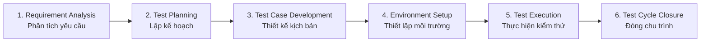
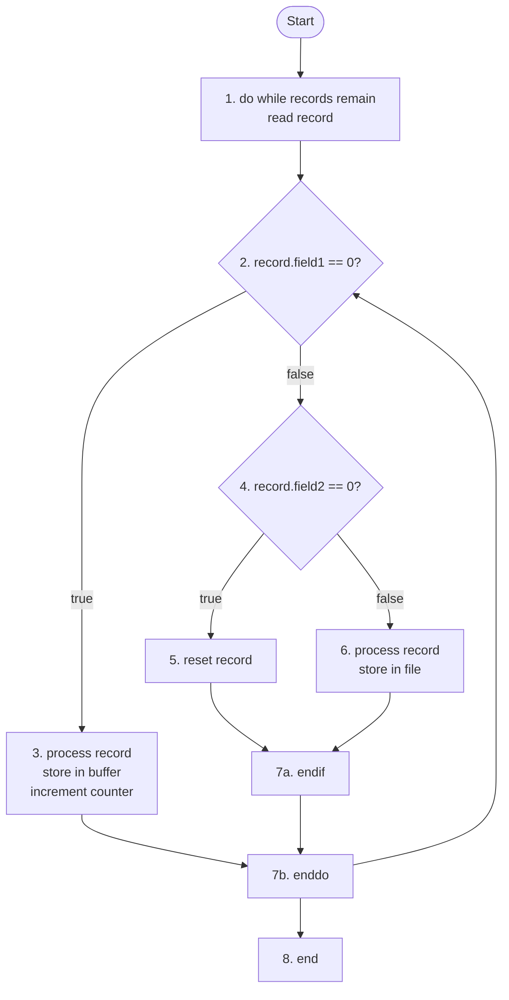
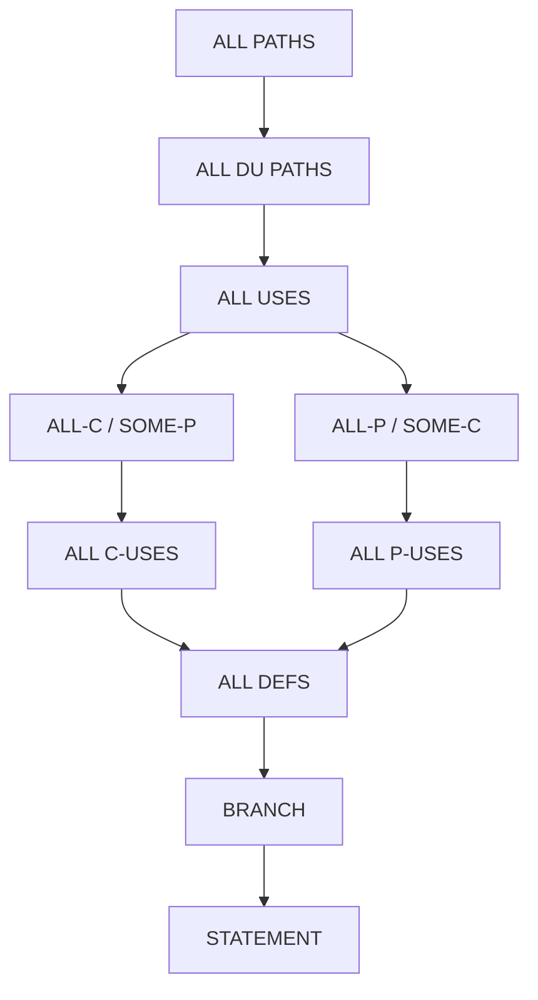
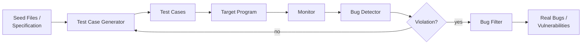
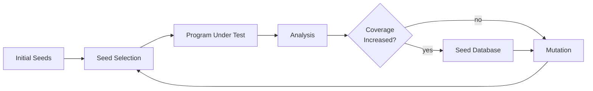
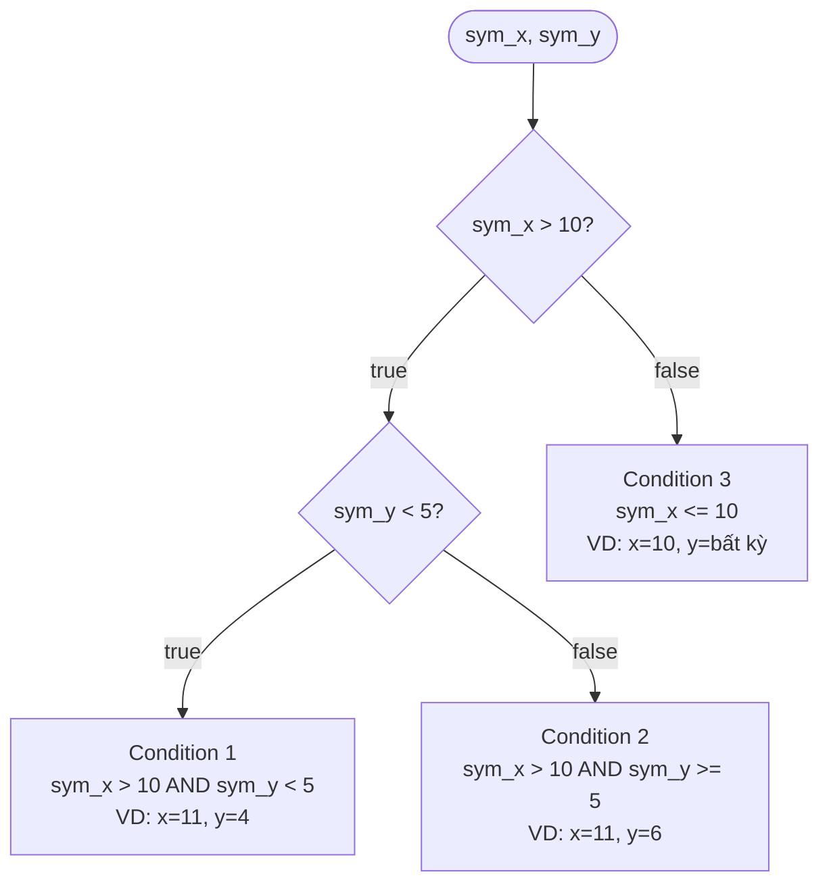
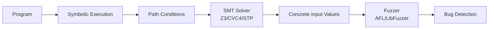

# Bài 5-6: Phân tích, Kiểm thử Phần mềm & Fuzzing Cơ bản

---

## 1. Kiểm thử Phần mềm (Software Testing)

### 1.1 Định nghĩa

Kiểm thử phần mềm là quá trình đánh giá và xác minh xem phần mềm hoặc ứng dụng có hoạt động đúng như mong đợi hay không. Mục tiêu chính:

- Phát hiện và sửa chữa các lỗi (bug)
- Đảm bảo chất lượng sản phẩm
- Thẩm định và xác minh phần mềm đáp ứng đúng yêu cầu đặt ra
- Cải thiện độ tin cậy của phần mềm

---

### 1.2 Phân loại kiểm thử

#### Theo cách thức kiểm thử

| Loại | Mô tả |
|---|---|
| **Black Box Testing** | Chỉ quan tâm đầu vào/đầu ra, không biết mã nguồn bên trong |
| **White Box Testing** | Dựa vào mã nguồn để kiểm tra logic, cấu trúc bên trong |
| **Gray Box Testing** | Kết hợp cả hai: có một phần kiến thức về cấu trúc bên trong |

#### Theo giai đoạn kiểm thử

```
Unit Testing → Integration Testing → System Testing → Acceptance Testing
```

- **Unit Testing**: Kiểm tra từng hàm/lớp nhỏ nhất một cách độc lập
- **Integration Testing**: Kiểm tra sự tương tác giữa các module sau khi ghép lại
- **System Testing**: Kiểm tra toàn bộ hệ thống hoàn chỉnh
- **Acceptance Testing**: Xác nhận phần mềm đáp ứng yêu cầu khách hàng, sẵn sàng triển khai

#### Theo mục tiêu kiểm thử

- **Functional Testing**: Kiểm tra các chức năng có hoạt động đúng yêu cầu không
- **Non-functional Testing**: Kiểm tra hiệu suất, bảo mật, độ tin cậy, khả năng sử dụng
- **Regression Testing**: Sau khi thay đổi code, đảm bảo các tính năng cũ không bị ảnh hưởng
- **Security Testing**: Kiểm tra khả năng chống tấn công xâm nhập, lỗ hổng bảo mật
- **Performance Testing**: Load test, stress test, scalability test
- **Usability Testing**: Đánh giá trải nghiệm người dùng, UI/UX

#### Theo mức độ tự động hóa

- **Manual Testing**: Tester thực hiện thủ công, phù hợp kiểm tra UI/UX
- **Automated Testing**: Dùng công cụ và script, phù hợp regression test, performance test

---

### 1.3 Quy trình kiểm thử (STLC)

Software Testing Life Cycle gồm 6 giai đoạn:



---

## 2. Kiểm thử Hộp Trắng (White Box Testing)

### 2.1 Chiến lược

Thiết kế test case dựa vào cấu trúc nội tại của đối tượng kiểm thử, đảm bảo tất cả câu lệnh, biểu thức điều kiện trong chương trình được thực hiện ít nhất một lần.

Gồm 3 kỹ thuật chính:
- **Basis Path Testing**
- **Control-flow / Coverage Testing**
- **Data-flow Testing**

---

### 2.2 Kiểm thử Đường dẫn Cơ sở (Basis Path Testing)

Được McCabe đề xuất năm 1976. Phương pháp này:

- Đảm bảo tất cả **independent path** (đường dẫn độc lập) đều được thực thi ít nhất một lần
- Cho biết **số lượng test case tối thiểu** cần thiết kế

> **Independent path**: Bất kỳ path nào bổ sung ít nhất một tập lệnh hoặc một biểu thức điều kiện mới so với các path đã có.

#### Xây dựng Control Flow Graph (CFG)

```
- Node: đại diện cho một hoặc nhiều câu lệnh xử lý
- Edge: đại diện cho một luồng điều khiển giữa các node
- Predicate node: node đại diện cho biểu thức điều kiện (if/while/for)
```



Tập path cơ sở cần test (ví dụ trên):

- **Path 1**: 1 → 2 → 5 (không còn record)
- **Path 2**: 1 → 2 → 3 → 4 → 2 → 5 (field1 == 0)
- **Path 3**: 1 → 2 → 3 → 6 → 7 → 4 → 2 → 5 (field2 == 0)
- **Path 4**: 1 → 2 → 3 → 6 → 8 → 7 → 4 → 2 → 5 (else)

Mỗi path tương ứng một test case → **4 test case tối thiểu**.

---

### 2.3 Kiểm thử Coverage (Phủ)

**Coverage** = tỉ lệ các thành phần thực sự được kiểm thử so với tổng thể.

| Cấp | Tên | Mô tả |
|---|---|---|
| 0 | Không có chiến lược | Kiểm thử tùy tiện, không có trách nhiệm |
| 1 | **Statement Coverage** | Mỗi câu lệnh được thực thi ít nhất 1 lần |
| 2 | **Branch Coverage** | Mỗi nhánh (true/false) của điều kiện đều được đi qua |
| 3 | **Condition Coverage** | Mỗi điều kiện con trong biểu thức phức được test cả true lẫn false |
| 4 | **Branch & Condition Coverage** | Kết hợp cấp 2 và cấp 3 |

#### Ví dụ minh họa

```c
float foo(int a, int b, int c, int d, float e) {
    float e;
    if (a == 0)          // Predicate 1
        return 0;
    int x = 0;
    if ((a == b) OR ((c == d) AND bug(a)))  // Predicate 2
        x = 1;
    e = 1 / x;
    return e;
}
```

- **Statement Coverage 100%**: `foo(1,1,1,1,1)` → đi qua tất cả câu lệnh
- **Branch Coverage 100%**: cần thêm `foo(1,2,1,2,1)` để nhánh false của Predicate 2 được đi
- **Condition Coverage 100%**: cần thêm `foo(1,2,1,1,1)` và `foo(3,2,1,1,1)` để phủ từng điều kiện con

!!! tip "Nguyên tắc quan trọng"
    Coverage càng cao → độ tin cậy của phần mềm càng cao. Với hệ thống lớn, branch coverage thường đạt 75–85%.

---

### 2.4 Kiểm thử Luồng Dữ liệu (Data-flow Testing)

Tập trung vào **chu kỳ sống của biến**: định nghĩa (define) → sử dụng (use) → hủy (kill).

#### Hệ thống ký hiệu

| Ký hiệu | Ý nghĩa |
|---|---|
| `d` | defined – biến được khai báo/gán giá trị |
| `k` | killed – biến bị hủy/ra khỏi scope |
| `u` | used – biến được sử dụng |
| `c` | c-use – dùng trong biểu thức tính toán |
| `p` | p-use – dùng trong biểu thức điều kiện |

#### Các pattern anomaly

| Pattern | Ý nghĩa |
|---|---|
| `dd` | Định nghĩa 2 lần không dùng ở giữa → **potential bug** |
| `du` | Định nghĩa rồi dùng → **bình thường** |
| `ud` | Dùng rồi định nghĩa lại → **bình thường** |
| `uk` | Dùng rồi hủy → **bình thường** |
| `dk` | Định nghĩa rồi hủy không dùng → **potential bug** |
| `~d` | Dùng biến chưa định nghĩa → **bug** |
| `k~` | Biến đã hủy được dùng → **bug** |

#### DU Path và DU Pair

- **DEF(S)**: tập biến được định nghĩa tại câu lệnh S
- **USE(S)**: tập biến được sử dụng tại câu lệnh S
- **DU Path** của biến X từ S đến S': đường đi trên CFG không có định nghĩa lại của X ở giữa
- **DU Pair** (S, S'): tồn tại ít nhất một DU path nối S và S'

#### Các chiến lược kiểm thử luồng dữ liệu



Mối quan hệ: chiến lược trên mạnh hơn chiến lược dưới (bao phủ nhiều hơn).

---

??? question "Câu hỏi: Cặp DU của biến `kq` trong hàm `ktNguyenTo`?"

    ```cpp
    bool ktNguyenTo(int n) {
        bool kq = false;  // DEF(kq) tại (1)
        if (n >= 2)
            kq = true;    // DEF(kq) tại (2)
        for (int i = 2; i <= sqrt(n) && kq == true; i++)  // USE(kq) tại (3) → p-use
            if (n % i == 0)
                kq = false;  // DEF(kq) tại (4)
        return kq;  // USE(kq) tại (5) → c-use
    }
    ```

    **Các cặp DU của `kq`:**

    - **(1, 3)**: DEF tại 1, USE tại 3 — path hợp lệ nếu `n < 2` (không qua DEF ở 2)
    - **(2, 3)**: DEF tại 2, USE tại 3
    - **(2, 5)**: DEF tại 2, USE tại 5 — khi không vào vòng lặp
    - **(4, 3)**: DEF tại 4, USE tại 3 — kiểm tra lại điều kiện vòng lặp
    - **(4, 5)**: DEF tại 4, USE tại 5 — khi `kq` bị đặt về false trong vòng lặp
    - **(1, 5)**: DEF tại 1, USE tại 5 — path khi `n < 2`, không qua DEF nào khác

??? question "Câu hỏi: Cặp DU của biến `heSo` trong hàm `tinhLuong`?"

    ```cpp
    float tinhLuong(int loaiNhanVien, int soGioLam) {
        float heSo = 1.0f;   // DEF(heSo) tại (1)
        if (loaiNhanVien == 1)
            heSo = 1.5f;     // DEF(heSo) tại (2)
            if (soGioLam > 40)
                heSo = heSo + 0.2f;  // USE+DEF(heSo) tại (3)
        else if (loaiNhanVien == 2)
            heSo = 1.2f;     // DEF(heSo) tại (4)
        return 1200000 * soGioLam * heSo;  // USE(heSo) tại (5)
    }
    ```

    **Các cặp DU của `heSo`:**

    - **(1, 5)**: Khi `loaiNhanVien` không phải 1 hay 2 → heSo=1.0 được dùng ở (5)
    - **(2, 3)**: heSo=1.5 được dùng trong phép cộng ở (3)
    - **(2, 5)**: heSo=1.5 được trả về ở (5) khi `soGioLam <= 40`
    - **(3, 5)**: heSo sau khi +0.2 được dùng ở (5)
    - **(4, 5)**: heSo=1.2 được dùng ở (5)

---

## 3. Kiểm thử Hộp Đen (Black Box Testing)

### 3.1 Đặc điểm

- Còn gọi là **specification-based testing**
- Tester chỉ quan tâm **WHAT** (phần mềm làm gì), không quan tâm **HOW** (làm như thế nào)
- Không cần truy cập mã nguồn

**Quy trình:**

```
Phân tích chức năng → Thiết kế test case → Thực thi → So sánh kết quả → Báo cáo
```

---

### 3.2 Phân vùng Tương đương (Equivalence Partitioning – EP)

**Ý tưởng**: Nếu một giá trị đại diện trong nhóm đúng thì các giá trị còn lại trong nhóm cũng đúng và ngược lại → giảm thiểu số lượng test case không cần thiết.

Hai giá trị tương đương khi:
- Tương tự nhau về mặt trực giác
- Đặc tả mô tả chương trình xử lý chúng như nhau
- Chúng dẫn chương trình đi cùng một nhánh
- Cho cùng kết quả với các giả thiết đã đưa ra

!!! example "Ví dụ: Xếp loại học bổng"
    Điều kiện: `diemTB >= 8` hoặc `(diemTB >= 7 && diemRL >= 80)`

    Các phân vùng:
    
    | Phân vùng | Loại |
    |---|---|
    | `ĐTB < 0` | Invalid |
    | `0 <= ĐTB < 5` | Valid – yếu/kém |
    | `5 <= ĐTB < 7` | Valid – trung bình |
    | `7 <= ĐTB < 8` | Valid – khá |
    | `8 <= ĐTB < 9` | Valid – giỏi |
    | `9 <= ĐTB <= 10` | Valid – xuất sắc |
    | `ĐTB > 10` | Invalid |
    
    Tối thiểu **7 test case** đại diện cho 7 phân vùng, bao gồm cả 2 invalid.

!!! warning "Lưu ý quan trọng"
    Tester phải nghĩ đến cả các trường hợp **không được đề cập** trong đặc tả (invalid partition). Đặc tả thường chỉ mô tả trường hợp hợp lệ, nhưng phải kiểm thử cả các trường hợp ngoài phạm vi.

---

### 3.3 Phân tích Giá trị Biên (Boundary Value Analysis – BVA)

Tập trung kiểm thử tại các giá trị **biên** giữa các phân vùng — nơi lỗi thường xảy ra nhất.

#### Standard BVA

Với biến `x` có miền `[min, max]`, chọn 5 giá trị:

```
min | min+1 | nom (trung bình) | max-1 | max
```

Số test case = `4n + 1` (n = số biến).

#### Robust Testing (mở rộng Standard BVA)

Thêm 2 giá trị ngoài biên: `min-1` và `max+1` (invalid).

Số test case = `6n + 1`.

#### Worst-case Testing

Kiểm tra **đồng thời** tất cả các biến tại biên. Số test case = `5^n`.

#### Robust Worst-case Testing

Tương tự Worst-case nhưng thêm các giá trị invalid. Số test case = `7^n`.

!!! example "Ví dụ: Kiểm tra tam giác (1 ≤ a,b,c ≤ 200)"
    Standard BVA: 4×3+1 = **13 test case**
    
    Worst-case: 5³ = **125 test case**
    
    Mẫu test case Standard BVA:
    
    | a | b | c | Kết quả mong đợi |
    |---|---|---|---|
    | 1 | 100 | 100 | Isosceles |
    | 2 | 100 | 100 | Isosceles |
    | 100 | 100 | 100 | Equilateral |
    | 199 | 100 | 100 | Isosceles |
    | 200 | 100 | 100 | Not a Triangle |

---

## 4. Fuzzing

### 4.1 Định nghĩa

Fuzzing là kỹ thuật phát hiện lỗi phần mềm bằng cách **tự động hoặc bán tự động** gửi dữ liệu đầu vào **không hợp lệ, ngẫu nhiên, hoặc bất ngờ** vào chương trình, sau đó theo dõi hành vi bất thường.

Dữ liệu đầu vào fuzzing thường là:
- Giá trị vượt quá biên
- Giá trị đặc biệt (null, 0, MAX_INT...)
- Chuỗi ký tự sai định dạng
- Dữ liệu không mong đợi theo protocol



---

### 4.2 Phân loại Fuzzing

#### Theo mức độ hiểu biết về chương trình

| Loại | Mô tả |
|---|---|
| **Blackbox Fuzzing** | Không biết cấu trúc bên trong, gửi input ngẫu nhiên |
| **Whitebox Fuzzing** | Có mã nguồn, kết hợp phân tích tĩnh/động |
| **Greybox Fuzzing** | Biết một phần cấu trúc (ví dụ: AFL dùng coverage feedback) |

#### Theo chiến lược tạo dữ liệu

| Chiến lược | Mô tả |
|---|---|
| **Mutation-based** | Lấy input mẫu hợp lệ rồi biến đổi ngẫu nhiên một phần |
| **Generation-based** | Sinh input từ đầu dựa trên đặc tả cú pháp/ngữ pháp (grammar) |

#### Theo phản hồi

- **Feedback-based**: Sử dụng thông tin thu được (coverage, trace) để hướng dẫn các lần thử tiếp theo
- **No-feedback**: Không quan tâm kết quả các lần trước, hoàn toàn ngẫu nhiên

---

### 4.3 Các kỹ thuật Fuzzing

#### Kỹ thuật Sinh mẫu (Sample Generation)

**1. Biến đổi ngẫu nhiên (Random Mutation / Blackbox Fuzzing)**

```python
def RandomFuzzing(input_seed):
    numWrites = random(len(seed) / 1000) + 1
    newInput = seed
    for i in range(numWrites):
        loc = random(len(seed))
        byte_value = random(255)
        newInput[loc] = byte_value
    result = ExecuteAppWith(newInput)
    if result == crash:
        print("bug found!")
```

**2. Biểu diễn cấu trúc ngữ pháp (Grammar Representation)**

Sinh input theo cú pháp được định nghĩa trước, ví dụ HTTP request:

```python
# SPIKE fuzzing code (grammar-based)
string("POST /api/blog/ HTTP/1.2\r\n")
string("Content-Length: ")
blocksize_string("blockA", 2)
block_start("blockA")
string('{"body": "')
string_variable("XXX")
string('"')
block_end("blockA")
```

**3. Thuật toán lập lịch (Scheduling Algorithms)**

Chọn seed nào để fuzz tiếp theo dựa trên tiềm năng khám phá node chưa được thăm. Ví dụ: seed gần nhiều node chưa thăm → ưu tiên hơn.

#### Kỹ thuật Phân tích Động (Dynamic Analysis)

- **Dynamic Symbolic Execution**: Kết hợp thực thi ký hiệu để hướng dẫn fuzzing
- **Coverage Feedback**: Dùng thông tin coverage để chọn và biến đổi seed hiệu quả
- **Dynamic Taint Analysis**: Theo dõi luồng dữ liệu taint để xác định vùng nhạy cảm

**Coverage-based Fuzzing:**



#### Kỹ thuật Phân tích Tĩnh (Static Analysis)

Yêu cầu truy cập mã nguồn:
- **Control-flow Analysis**: Phân tích đồ thị luồng điều khiển
- **Data-flow Slices**: Cắt lát luồng dữ liệu để xác định vùng nguy hiểm

---

### 4.4 Ưu điểm và Nhược điểm

!!! success "Ưu điểm"
    - Tìm được các lỗi nghiêm trọng nhất: crashes, memory leak, unhandled exception
    - Phát hiện lỗi mà hacker hay khai thác
    - Hiệu quả hơn các phương pháp kiểm thử khác khi xét về chi phí/lợi ích
    - Có thể tìm lỗi trong thời gian giới hạn mà kiểm thử thủ công bỏ qua

!!! danger "Nhược điểm"
    - Không thể xử lý hết mọi mối đe dọa an ninh
    - Kém hiệu quả với lỗi không gây crash (virus, worm, trojan...)
    - Không cung cấp nhiều kiến thức về hoạt động nội bộ phần mềm
    - Với input phức tạp (protocol, file format) → cần fuzzer thông minh hơn, tốn thêm công

---

### 4.5 Một số công cụ Fuzzing phổ biến

| Công cụ | Mô tả |
|---|---|
| **AFL (American Fuzzy Lop)** | Coverage-guided greybox fuzzer, rất phổ biến |
| **LibFuzzer** | In-process fuzzer của LLVM, tích hợp sanitizer |
| **Honggfuzz** | Feedback-driven fuzzer hỗ trợ hardware coverage |
| **OSS-Fuzz** | Google's continuous fuzzing service cho open source |
| **ClusterFuzz** | Distributed fuzzing infrastructure của Google |
| **Address Sanitizer** | Phát hiện memory errors, thường kết hợp với fuzzer |
| **Valgrind** | Dynamic analysis tool, phát hiện memory leak |

AFL đã tìm thấy lỗi trong hàng trăm dự án: OpenSSL, PHP, Mozilla Firefox, bash, nginx, tcpdump, ImageMagick, BIND, QEMU...

---

## 5. Symbolic Execution

### 5.1 Định nghĩa

Symbolic Execution (Thực thi Ký hiệu) là kỹ thuật phân tích chương trình trong đó các giá trị đầu vào **không phải giá trị cụ thể** mà là **ký hiệu đại diện** cho một tập hợp giá trị có thể có.

- Thay vì chạy `f(5)`, ta chạy `f(sym_x)` — sym_x đại diện cho mọi giá trị có thể
- Tại mỗi nhánh rẽ (if/while), tạo ra **path condition** (điều kiện đường đi)
- Sử dụng **SMT solver** (Z3, CVC4, STP) để tìm giá trị cụ thể thỏa mãn điều kiện đó

### 5.2 Ví dụ minh họa

```python
def check_value(x):
    if x > 0:
        y = x + 1
    else:
        y = x - 1
    return y
```

Symbolic execution với `x = sym_x`:

| Đường dẫn | Path Condition | Kết quả |
|---|---|---|
| Đường 1 | `sym_x > 0` | `y = sym_x + 1` |
| Đường 2 | `sym_x <= 0` | `y = sym_x - 1` |

```cpp
void check_input(int x, int y) {
    if (x > 10) {
        if (y < 5) {
            // Condition 1 satisfied!
        } else {
            // Condition 2 satisfied!
        }
    } else {
        // Condition 3 satisfied!
    }
}
```



### 5.3 Giải constraint bằng Z3

```python
from z3 import *

# Khởi tạo biến tượng trưng
x = Int('x')
y = Int('y')

# Điều kiện cho đường dẫn 1.1 (Condition 1 satisfied)
solver = Solver()
solver.add(x > 10, y < 5)

if solver.check() == sat:
    model = solver.model()
    print(f"Solution: x={model[x]}, y={model[y]}")
    # Output: x=11, y=4
```

---

??? question "Quiz: Coverage Analysis"

    ```c
    void foo(unsigned input) {
        if (input < UINT_MAX / 2) {
            unsigned len, s;
            char* buf;
            len = input + 3;
            if (len < 10)
                s = len;
            else if (len % 2 == 0)
                s = len;
            else
                s = len + 2;
            buf = malloc(s);
            read(fd, buf, len);
        }
    }
    ```

    **Hỏi**: Số lượng tối thiểu input để phủ Lines / Branches / Paths là bao nhiêu?

    **Trả lời:**

    | Tiêu chí | Số paths/branches | Số input tối thiểu |
    |---|---|---|
    | **Lines (Statement)** | 10 dòng | **3** (một input cho mỗi nhánh trong if-else-if-else) |
    | **Branches** | 3 nhánh chính + false của outer if | **3** |
    | **Paths** | 3 paths qua nhánh bên trong | **3** |

    **Hỏi tiếp**: Nếu dùng random fuzzing, cần kỳ vọng bao nhiêu input để chạm nhánh `input < UINT_MAX/2` là FALSE?

    **Trả lời:**

    UINT_MAX với 32-bit là 4,294,967,295. Vùng `input >= UINT_MAX/2` chiếm 50% không gian đầu vào → expected ~2 input. Nhưng nhánh đặc biệt trong vòng điều kiện lồng nhau (vd `len % 2 == 0` khi `len >= 10`) chiếm tỉ lệ rất nhỏ → random fuzzing cần rất nhiều input, trong khi symbolic execution chỉ cần **đúng 1 input** thỏa mãn path condition tương ứng.

    **Kết luận**: minimum # << expected # → random fuzzing không hiệu quả cho các nhánh deep/complex → cần Symbolic Execution.

---

### 5.4 Symbolic Execution-guided Fuzzing

Tại sao kết hợp?

- **Symbolic Execution đơn thuần**: Path explosion — số đường đi tăng theo hàm mũ
- **Fuzzing đơn thuần**: Không thể chạm đến các nhánh deep với điều kiện phức tạp
- **Kết hợp**: Symbolic Execution tạo path condition → Solver tìm input → Fuzzing dùng input đó để kiểm thử



**Lợi ích:**
- Tăng coverage: khám phá nhiều đường đi hơn, kể cả đường hiếm
- Tìm lỗi sâu hơn: buffer overflow, integer overflow, logic bug
- Tối ưu hóa: giảm số lượng test case không hiệu quả

**Hạn chế:**
- **Path explosion**: số path tăng theo hàm mũ với số nhánh
- Tốn tài nguyên tính toán (solver, memory)
- Khó áp dụng cho hệ thống có nhiều side-effect, I/O phức tạp

**Công cụ hỗ trợ:**

| Loại | Công cụ |
|---|---|
| Symbolic Execution | KLEE (C/C++), Manticore (EVM/x86/LLVM) |
| Fuzzing | AFL, LibFuzzer |
| Kết hợp | S2E (Selective Symbolic Execution) |

---

??? question "Câu hỏi thảo luận: Fuzzing ngẫu nhiên vs Symbolic Execution-guided Fuzzing"

    **Khi nào dùng Fuzzing ngẫu nhiên?**
    
    - Ứng dụng có không gian input đơn giản (file parser, image decoder)
    - Cần nhanh và tiết kiệm tài nguyên
    - Đã có corpus seed phong phú
    - Giai đoạn đầu của kiểm thử, cần coverage rộng nhanh
    
    **Khi nào dùng Symbolic Execution-guided Fuzzing?**
    
    - Chương trình có nhiều điều kiện rẽ nhánh phức tạp, lồng nhau sâu
    - Cần đạt coverage cao cho các nhánh khó trigger
    - Kiểm thử smart contract, protocol implementation
    - Khi fuzzing ngẫu nhiên đã bão hòa (không tìm thêm được bug mới)
    
    **Khi nào KHÔNG cần kết hợp?**
    
    - Input đơn giản, không có điều kiện phức tạp
    - Tài nguyên tính toán hạn chế và yêu cầu kiểm thử nhanh
    - Chương trình nhỏ, ít nhánh

??? question "Path Explosion — giải quyết như thế nào?"

    **Vấn đề**: Với n điều kiện rẽ nhánh, số path = 2^n. Với n=100, không thể duyệt hết.
    
    **Các kỹ thuật giảm thiểu:**
    
    1. **Selective Symbolic Execution (S2E)**: Chỉ thực thi ký hiệu cho phần code quan tâm, phần còn lại chạy concrete
    2. **Path merging**: Gộp các path có điều kiện tương tự lại
    3. **Heuristic path prioritization**: Ưu tiên path dẫn đến code chưa được cover
    4. **Loop summarization**: Tóm tắt vòng lặp thay vì unroll toàn bộ
    5. **Concolic execution (Concrete + Symbolic)**: Chạy cụ thể nhưng theo dõi ký hiệu song song, chỉ dùng solver khi cần flip nhánh

---

## 6. Câu hỏi Trắc nghiệm

**Câu 1.** Mục tiêu chính của kiểm thử phần mềm là gì?

- A. Chứng minh phần mềm không có lỗi
- B. Phát hiện lỗi, đảm bảo chất lượng và xác minh phần mềm đáp ứng yêu cầu
- C. Tối ưu hóa hiệu năng phần mềm
- D. Viết lại phần mềm từ đầu nếu có lỗi

??? info "Đáp án & Giải thích"
    **Đáp án: B**
    
    Kiểm thử phần mềm không thể chứng minh phần mềm hoàn toàn không có lỗi (Dijkstra: "Testing can show the presence of bugs, not their absence"). Mục tiêu là phát hiện lỗi, đảm bảo chất lượng, xác minh đáp ứng yêu cầu, và cải thiện độ tin cậy.

---

**Câu 2.** Black Box Testing khác White Box Testing ở điểm nào cơ bản nhất?

- A. Black Box nhanh hơn
- B. Black Box không cần biết mã nguồn, White Box cần
- C. White Box chỉ kiểm tra giao diện
- D. Black Box chỉ dành cho security testing

??? info "Đáp án & Giải thích"
    **Đáp án: B**
    
    Black Box (hộp đen) tập trung vào đầu vào/đầu ra, không quan tâm cấu trúc bên trong và không cần mã nguồn. White Box (hộp trắng) dựa vào kiến thức về mã nguồn để kiểm tra logic, luồng điều khiển bên trong.

---

**Câu 3.** Thứ tự đúng của các giai đoạn kiểm thử theo giai đoạn phát triển là:

- A. System → Unit → Integration → Acceptance
- B. Unit → Integration → System → Acceptance
- C. Acceptance → System → Integration → Unit
- D. Integration → Unit → System → Acceptance

??? info "Đáp án & Giải thích"
    **Đáp án: B**
    
    Kiểm thử tiến từ nhỏ đến lớn: Unit (từng hàm/lớp) → Integration (ghép các module) → System (toàn hệ thống) → Acceptance (xác nhận với khách hàng).

---

**Câu 4.** Regression Testing được thực hiện khi nào?

- A. Trước khi bắt đầu dự án
- B. Sau khi có thay đổi trong mã nguồn, để đảm bảo tính năng cũ không bị ảnh hưởng
- C. Chỉ khi phát hiện lỗi nghiêm trọng
- D. Sau khi triển khai sản phẩm lên production

??? info "Đáp án & Giải thích"
    **Đáp án: B**
    
    Regression Testing đặc biệt quan trọng trong Agile/CI-CD: mỗi khi code thay đổi (fix bug, thêm feature), cần chạy lại toàn bộ test cũ để đảm bảo không có regression (lỗi hồi quy).

---

**Câu 5.** Basis Path Testing do ai đề xuất và vào năm nào?

- A. Dijkstra, 1968
- B. McCabe, 1976
- C. Boehm, 1981
- D. Myers, 1979

??? info "Đáp án & Giải thích"
    **Đáp án: B**
    
    Thomas McCabe đề xuất Basis Path Testing năm 1976, đồng thời giới thiệu Cyclomatic Complexity (V(G)) như một thước đo độ phức tạp luồng điều khiển và số path cơ sở cần kiểm thử.

---

**Câu 6.** Trong CFG (Control Flow Graph), "Predicate Node" đại diện cho gì?

- A. Một hàm được gọi
- B. Một biểu thức điều kiện (if/while/for)
- C. Điểm bắt đầu chương trình
- D. Một vòng lặp vô hạn

??? info "Đáp án & Giải thích"
    **Đáp án: B**
    
    Predicate Node là node trong CFG đại diện cho một biểu thức điều kiện — nơi luồng điều khiển có thể rẽ nhánh (true/false). Đây là các điểm quan trọng trong Basis Path Testing và Branch Coverage.

---

**Câu 7.** Statement Coverage (phủ câu lệnh) yêu cầu gì?

- A. Mỗi nhánh true/false đều được thực thi
- B. Mỗi câu lệnh được thực thi ít nhất một lần
- C. Mỗi path từ đầu đến cuối đều được thực thi
- D. Mỗi biến được định nghĩa ít nhất một lần

??? info "Đáp án & Giải thích"
    **Đáp án: B**
    
    Statement Coverage (cấp 1) yêu cầu mỗi câu lệnh thực thi được trong code đều phải được chạy qua ít nhất một lần. Đây là mức coverage thấp nhất có ý nghĩa.

---

**Câu 8.** Với hàm `foo(a, b, c, d, e)`, test case `foo(0,0,0,0,0)` đạt được bao nhiêu % Statement Coverage nếu câu lệnh `if(a==0) return 0` ở đầu hàm?

- A. 100%
- B. 75%
- C. 42%
- D. 50%

??? info "Đáp án & Giải thích"
    **Đáp án: C**
    
    Khi `a==0`, hàm return ngay lập tức, chỉ thực thi ~5 câu lệnh trong tổng số 12. Theo slide: `foo(0,0,0,0,0)` đạt 42% statement coverage (5/12 câu lệnh).

---

**Câu 9.** Branch Coverage yêu cầu gì thêm so với Statement Coverage?

- A. Mỗi hàm phải được gọi ít nhất 2 lần
- B. Mỗi biểu thức điều kiện phải được đánh giá cả true lẫn false
- C. Tất cả paths phải được kiểm thử
- D. Mỗi vòng lặp phải chạy ít nhất 10 lần

??? info "Đáp án & Giải thích"
    **Đáp án: B**
    
    Branch Coverage (cấp 2) yêu cầu mỗi điểm quyết định (decision point) phải được kiểm thử cả hai nhánh: true và false. 100% statement coverage không đảm bảo 100% branch coverage.

---

**Câu 10.** Condition Coverage khác Branch Coverage ở điểm nào?

- A. Condition Coverage kiểm tra điều kiện đơn trong biểu thức phức
- B. Condition Coverage chỉ áp dụng cho vòng lặp
- C. Branch Coverage mạnh hơn Condition Coverage
- D. Không có sự khác biệt

??? info "Đáp án & Giải thích"
    **Đáp án: A**
    
    Branch Coverage quan tâm đến kết quả tổng thể của biểu thức điều kiện (true/false). Condition Coverage quan tâm đến từng điều kiện đơn trong biểu thức phức. Ví dụ: `(a==b) OR ((c==d) AND bug(a))` có 3 điều kiện đơn — mỗi cái phải được test cả true lẫn false.

---

**Câu 11.** Trong Data-flow Testing, ký hiệu `p-use` của biến nghĩa là gì?

- A. Biến được dùng trong phép tính (computation)
- B. Biến được dùng trong biểu thức điều kiện (predicate)
- C. Biến vừa được định nghĩa (pre-use)
- D. Biến được print ra màn hình

??? info "Đáp án & Giải thích"
    **Đáp án: B**
    
    `p-use` (predicate use) = biến được sử dụng trong biểu thức điều kiện như `if (x > 0)`, `while (kq == true)`. `c-use` (computation use) = biến dùng trong phép tính như `y = x + 1`.

---

**Câu 12.** Pattern anomaly nào trong Data-flow Testing là **potential bug**?

- A. `du` (define → use)
- B. `uk` (use → kill)
- C. `dd` (define → define lại không dùng ở giữa)
- D. `ud` (use → define lại)

??? info "Đáp án & Giải thích"
    **Đáp án: C**
    
    Pattern `dd` (double definition) là potential bug vì biến được gán giá trị nhưng chưa được dùng trước khi bị gán lại — giá trị đầu bị mất. Pattern `dk` (define → kill) cũng là potential bug (định nghĩa nhưng không dùng trước khi hủy).

---

**Câu 13.** DU Path của biến X từ câu lệnh S đến S' là gì?

- A. Bất kỳ đường đi nào từ S đến S'
- B. Đường đi từ S đến S' không có định nghĩa lại của X ở giữa
- C. Đường đi ngắn nhất từ S đến S'
- D. Đường đi từ S đến S' qua tất cả các node

??? info "Đáp án & Giải thích"
    **Đáp án: B**
    
    DU Path (Definition-Use Path) của biến X là đường đi trên CFG từ điểm định nghĩa S đến điểm sử dụng S' mà không có bất kỳ định nghĩa lại nào của X trên đường đó. Nếu có định nghĩa lại ở giữa, đường đó không phải DU path của X từ S.

---

**Câu 14.** Chiến lược kiểm thử luồng dữ liệu nào **mạnh nhất** (bao phủ nhiều nhất)?

- A. All-Defs
- B. All-Uses
- C. All-DU-Paths
- D. All-P-Uses

??? info "Đáp án & Giải thích"
    **Đáp án: C**
    
    Theo sơ đồ phân cấp trong slide: ALL DU PATHS > ALL USES > ALL-C/SOME-P hoặc ALL-P/SOME-C > ALL C-USES hoặc ALL P-USES > ALL DEFS > BRANCH > STATEMENT. All-DU-Paths là chiến lược mạnh nhất trong Data-flow testing.

---

**Câu 15.** Equivalence Partitioning (EP) giúp giải quyết vấn đề gì trong kiểm thử?

- A. Tăng tốc độ thực thi chương trình
- B. Giảm số lượng test case không cần thiết trong khi vẫn đảm bảo coverage
- C. Tự động sinh test case từ mã nguồn
- D. Phát hiện lỗi bảo mật trong mã nguồn

??? info "Đáp án & Giải thích"
    **Đáp án: B**
    
    EP chia không gian đầu vào thành các nhóm tương đương — nếu một giá trị trong nhóm đúng thì tất cả đều đúng. Thay vì test mọi giá trị, chỉ cần test một giá trị đại diện mỗi nhóm → giảm số lượng test case cần thiết mà vẫn phủ được tất cả các trường hợp.

---

**Câu 16.** Khi xếp loại học lực theo điểm [0,10], phân vùng tương đương cho bài toán này có bao nhiêu phân vùng (gồm cả valid và invalid)?

- A. 5
- B. 6
- C. 7
- D. 8

??? info "Đáp án & Giải thích"
    **Đáp án: C**
    
    5 phân vùng valid [0,5), [5,7), [7,8), [8,9), [9,10] + 2 phân vùng invalid (<0 và >10) = **7 phân vùng** tổng cộng. Phân vùng invalid quan trọng vì tester phải kiểm tra cả trường hợp ngoài đặc tả.

---

**Câu 17.** Standard BVA với hàm có **3 biến** độc lập tạo ra bao nhiêu test case?

- A. 9
- B. 13
- C. 15
- D. 25

??? info "Đáp án & Giải thích"
    **Đáp án: B**
    
    Công thức Standard BVA: `4n + 1` với n = số biến. Với n=3: `4×3 + 1 = 13` test case.

---

**Câu 18.** Robust Testing mở rộng Standard BVA bằng cách nào?

- A. Thêm test case ngẫu nhiên
- B. Thêm giá trị `min-1` và `max+1` (ngoài miền hợp lệ) cho mỗi biến
- C. Test tất cả tổ hợp biên cùng lúc
- D. Tăng gấp đôi số test case

??? info "Đáp án & Giải thích"
    **Đáp án: B**
    
    Robust Testing = Standard BVA + 2 giá trị invalid (`min-1` và `max+1`) cho mỗi biến → công thức `6n + 1`. Mục đích: kiểm tra xem chương trình xử lý đúng khi gặp input ngoài biên không.

---

**Câu 19.** Worst-case Testing với **n=2** biến tạo bao nhiêu test case?

- A. 9
- B. 25
- C. 49
- D. 13

??? info "Đáp án & Giải thích"
    **Đáp án: B**
    
    Worst-case Testing: `5^n`. Với n=2: `5^2 = 25` test case. Kỹ thuật này kiểm tra đồng thời nhiều biến tại các giá trị biên — có thể phát hiện lỗi xảy ra do kết hợp các biên.

---

**Câu 20.** BVA hiệu quả nhất trong trường hợp nào?

- A. Các biến đầu vào có quan hệ ràng buộc nhau phức tạp
- B. Các biến đầu vào độc lập nhau và mỗi biến có miền giá trị hữu hạn
- C. Chương trình không có điều kiện rẽ nhánh
- D. Chương trình xử lý chuỗi ký tự phức tạp

??? info "Đáp án & Giải thích"
    **Đáp án: B**
    
    BVA hiệu quả nhất với "các đối số đầu vào độc lập với nhau và mỗi đối số đều có một miền giá trị hữu hạn". Khi các biến có quan hệ ràng buộc nhau, BVA khó áp dụng và cần Decision Table hoặc các kỹ thuật khác.

---

**Câu 21.** Fuzzing là gì?

- A. Kiểm thử phần mềm bằng cách đọc mã nguồn
- B. Tự động gửi dữ liệu không hợp lệ/ngẫu nhiên vào chương trình để phát hiện lỗi
- C. Phân tích tĩnh mã nguồn để tìm lỗ hổng
- D. Kiểm thử hiệu năng dưới tải cao

??? info "Đáp án & Giải thích"
    **Đáp án: B**
    
    Fuzzing = kỹ thuật phát hiện lỗi bằng cách cung cấp dữ liệu không hợp lệ, không mong đợi, hoặc ngẫu nhiên vào chương trình, sau đó theo dõi hành vi bất thường (crash, hang, memory error...).

---

**Câu 22.** Fuzzing thuộc loại kiểm thử nào theo mặc định?

- A. White Box Testing
- B. Gray Box Testing
- C. Black Box Testing
- D. Unit Testing

??? info "Đáp án & Giải thích"
    **Đáp án: C**
    
    Fuzzing theo mặc định là kỹ thuật Black Box — không đòi hỏi quyền truy cập mã nguồn. Tuy nhiên, fuzzing cũng có thể được áp dụng trong White Box testing khi có mã nguồn (coverage-guided fuzzing).

---

**Câu 23.** Mutation-based Fuzzing khác Generation-based Fuzzing như thế nào?

- A. Mutation dùng AI, Generation dùng random
- B. Mutation biến đổi input mẫu có sẵn, Generation tạo input từ đặc tả/ngữ pháp
- C. Mutation chỉ dùng cho network protocol, Generation cho file format
- D. Không có sự khác biệt đáng kể

??? info "Đáp án & Giải thích"
    **Đáp án: B**
    
    **Mutation-based**: Lấy corpus seed (input hợp lệ) và biến đổi ngẫu nhiên một phần → nhanh, dễ tạo input hợp lệ một phần. **Generation-based**: Định nghĩa cú pháp/ngữ pháp của input format rồi sinh input mới từ đó → phức tạp hơn nhưng hiểu cấu trúc input tốt hơn.

---

**Câu 24.** AFL (American Fuzzy Lop) sử dụng kỹ thuật nào để hướng dẫn fuzzing?

- A. Symbolic Execution
- B. Coverage-guided greybox fuzzing (feedback từ code coverage)
- C. Pure random mutation không feedback
- D. Static analysis

??? info "Đáp án & Giải thích"
    **Đáp án: B**
    
    AFL là coverage-guided greybox fuzzer — sử dụng instrumentation để theo dõi code coverage (thường là edge coverage trong CFG). Seed nào tạo ra coverage mới thì được giữ lại trong corpus để fuzz tiếp. Đây chính là lý do AFL rất hiệu quả.

---

**Câu 25.** Loại lỗi nào Fuzzing **kém hiệu quả** nhất trong phát hiện?

- A. Buffer overflow
- B. Memory leak
- C. Logic error trong virus/worm không gây crash
- D. Null pointer dereference

??? info "Đáp án & Giải thích"
    **Đáp án: C**
    
    Fuzzing phát hiện lỗi thông qua hành vi bất thường như crash, hang, hoặc exception. Virus, worm, trojan thường không crash chương trình — chúng thực hiện logic ẩn bên trong mà fuzzer không thể quan sát được thông qua behavior monitoring thông thường.

---

**Câu 26.** Trong quy trình Fuzzing, thành phần nào có nhiệm vụ phân biệt lỗi thật và false positive?

- A. Test Case Generator
- B. Monitor
- C. Bug Filter
- D. Seed Corpus

??? info "Đáp án & Giải thích"
    **Đáp án: C**
    
    Theo sơ đồ kiến trúc Fuzzing: Bug Detector phát hiện bất thường → Bug Filter lọc để phân biệt real bugs/vulnerabilities với false positive → chỉ giữ lại lỗi thật.

---

**Câu 27.** Grammar-based Fuzzing (Generation-based) có lợi thế gì so với random mutation?

- A. Nhanh hơn nhiều lần
- B. Tạo ra input có cấu trúc đúng định dạng, dễ pass qua parser để test logic sâu hơn
- C. Không cần seed corpus
- D. Tự động phát hiện ngữ pháp của target

??? info "Đáp án & Giải thích"
    **Đáp án: B**
    
    Random mutation thường phá vỡ cấu trúc input → chương trình reject ngay ở parser mà không chạy vào logic sâu hơn. Grammar-based fuzzing định nghĩa cú pháp → sinh input có cấu trúc đúng → vượt qua parser → test được logic bên trong sâu hơn.

---

**Câu 28.** Address Sanitizer (ASan) thường được kết hợp với fuzzer để làm gì?

- A. Tăng tốc độ fuzzing
- B. Phát hiện memory errors (buffer overflow, use-after-free) trong quá trình fuzzing
- C. Tạo corpus seed tự động
- D. Phân tích mã nguồn trước khi fuzzing

??? info "Đáp án & Giải thích"
    **Đáp án: B**
    
    ASan là runtime memory error detector — nó instrument code để phát hiện: heap buffer overflow, stack buffer overflow, use-after-free, use-after-return, double-free... Kết hợp ASan + fuzzer: fuzzer tạo input → ASan phát hiện memory error mà không cần crash hoàn toàn chương trình.

---

**Câu 29.** Symbolic Execution khác với kiểm thử thông thường ở điểm cơ bản nào?

- A. Chạy chương trình nhanh hơn
- B. Biến đầu vào là ký hiệu (symbol) thay vì giá trị cụ thể, phân tích toàn bộ không gian đầu vào
- C. Không cần mã nguồn
- D. Chỉ áp dụng cho chương trình Python

??? info "Đáp án & Giải thích"
    **Đáp án: B**
    
    Symbolic Execution thay các giá trị cụ thể bằng ký hiệu (symbol). Khi chạy `f(sym_x)` thay vì `f(5)`, kỹ thuật này phân tích tất cả đường đi có thể xảy ra với mọi giá trị của x, tạo ra path conditions cho từng đường dẫn.

---

**Câu 30.** "Path Condition" trong Symbolic Execution là gì?

- A. Số lượng đường dẫn trong chương trình
- B. Tập hợp các ràng buộc (constraints) phải thỏa mãn để thực thi một đường đi cụ thể
- C. Điều kiện để chương trình biên dịch thành công
- D. Đường dẫn file của chương trình đang kiểm thử

??? info "Đáp án & Giải thích"
    **Đáp án: B**
    
    Path condition là tập hợp các điều kiện logic (ví dụ `sym_x > 10 AND sym_y < 5`) mà nếu thỏa mãn, chương trình sẽ đi theo một đường dẫn cụ thể. SMT solver sử dụng path condition để tìm giá trị đầu vào cụ thể kích hoạt đường đó.

---

**Câu 31.** SMT Solver được sử dụng trong Symbolic Execution để làm gì?

- A. Biên dịch chương trình
- B. Tìm giá trị đầu vào cụ thể thỏa mãn path condition
- C. Tối ưu hóa mã nguồn
- D. Quản lý bộ nhớ chương trình

??? info "Đáp án & Giải thích"
    **Đáp án: B**
    
    SMT (Satisfiability Modulo Theories) Solver như Z3, CVC4, STP giải các bài toán thỏa mãn ràng buộc. Trong Symbolic Execution: solver nhận path condition → tìm assignment các biến ký hiệu → cho ra giá trị cụ thể kích hoạt đường dẫn đó.

---

**Câu 32.** Với đoạn code sau, Symbolic Execution tạo ra bao nhiêu đường dẫn?

```python
def f(x, y):
    if x > 10:
        if y < 5:
            return 1
        else:
            return 2
    else:
        return 3
```

- A. 2
- B. 3
- C. 4
- D. 5

??? info "Đáp án & Giải thích"
    **Đáp án: B**
    
    3 đường dẫn:
    - Path 1: `x > 10 AND y < 5` → return 1
    - Path 2: `x > 10 AND y >= 5` → return 2
    - Path 3: `x <= 10` → return 3

---

**Câu 33.** Vấn đề "Path Explosion" trong Symbolic Execution nghĩa là gì?

- A. Chương trình bị crash trong quá trình phân tích
- B. Số lượng đường dẫn tăng theo hàm mũ với số điều kiện rẽ nhánh → không thể duyệt hết
- C. Bộ nhớ bị tràn khi chạy solver
- D. Các path condition mâu thuẫn nhau

??? info "Đáp án & Giải thích"
    **Đáp án: B**
    
    Với n điều kiện rẽ nhánh độc lập, số path = 2^n. Với n=50, số path > 10^15 — không thể duyệt hết trong thời gian hợp lý. Đây là hạn chế lớn nhất của Symbolic Execution, đặc biệt với chương trình lớn có vòng lặp và nhiều nhánh.

---

**Câu 34.** Tại sao kết hợp Symbolic Execution với Fuzzing lại hiệu quả hơn từng phương pháp riêng lẻ?

- A. Vì hai phương pháp cùng ngôn ngữ lập trình
- B. Symbolic Execution tạo input cho các nhánh khó trigger, Fuzzing khám phá rộng nhanh → bù đắp nhược điểm nhau
- C. Vì chi phí thực hiện giảm đi
- D. Vì không cần SMT solver khi kết hợp

??? info "Đáp án & Giải thích"
    **Đáp án: B**
    
    - Fuzzing ngẫu nhiên: nhanh, tìm được lỗi nông nhưng không chạm được nhánh deep
    - Symbolic Execution: tạo được input chính xác cho nhánh phức tạp nhưng bị path explosion
    - Kết hợp: Fuzzing khám phá rộng, khi bế tắc thì Symbolic Execution tạo input để flip nhánh mới → mở rộng coverage

---

**Câu 35.** Công cụ KLEE được sử dụng cho mục đích gì?

- A. Fuzzing network protocols
- B. Symbolic Execution cho chương trình C/C++
- C. Static analysis cho Java
- D. Coverage measurement

??? info "Đáp án & Giải thích"
    **Đáp án: B**
    
    KLEE là công cụ Symbolic Execution cho chương trình C/C++ chạy trên LLVM IR (Intermediate Representation). KLEE có thể tự động sinh test case phủ nhiều đường dẫn và phát hiện lỗi như division by zero, buffer overflow.

---

**Câu 36.** Coverage-based Fuzzing (như AFL) hoạt động theo nguyên tắc nào?

- A. Luôn chọn seed ngắn nhất để fuzz
- B. Giữ lại và ưu tiên seed tạo ra code coverage mới, loại bỏ seed không tạo coverage mới
- C. Chọn seed ngẫu nhiên hoàn toàn
- D. Chỉ fuzz các hàm có annotation @fuzz

??? info "Đáp án & Giải thích"
    **Đáp án: B**
    
    Coverage-guided fuzzing: mỗi khi một input kích hoạt code path mới (tăng coverage), nó được thêm vào corpus để tiếp tục fuzz. Input không tạo coverage mới bị deprioritize hoặc loại bỏ. Đây là feedback loop giúp AFL khám phá chương trình sâu hơn theo thời gian.

---

**Câu 37.** Concolic Execution là gì?

- A. Symbolic Execution chỉ cho các vòng lặp
- B. Kết hợp Concrete execution và Symbolic execution: chạy cụ thể nhưng theo dõi ký hiệu song song
- C. Symbolic Execution phân tán trên nhiều máy
- D. Symbolic Execution chỉ cho điều kiện đơn giản

??? info "Đáp án & Giải thích"
    **Đáp án: B**
    
    Concolic = **Con**crete + Sym**bolic**. Chương trình chạy với giá trị cụ thể (concrete) nhưng đồng thời theo dõi ký hiệu. Khi muốn khám phá nhánh khác, solver flip điều kiện path để tìm input mới. Kỹ thuật này tránh được nhiều vấn đề của pure symbolic execution.

---

**Câu 38.** Trong Data-flow Testing, "All-Uses" strategy yêu cầu gì?

- A. Tất cả các vòng lặp phải được thực thi
- B. Mỗi cặp DU (definition-use) của mỗi biến phải có ít nhất một test path
- C. Mỗi biến phải được sử dụng ít nhất một lần
- D. Tất cả các hàm phải được gọi

??? info "Đáp án & Giải thích"
    **Đáp án: B**
    
    All-Uses (AU) strategy yêu cầu: với mỗi cặp (definition, use) của mỗi biến, phải có ít nhất một test path đi từ điểm định nghĩa đó đến điểm sử dụng đó mà không có định nghĩa lại ở giữa. Đây là chiến lược mạnh hơn All-Defs nhưng yếu hơn All-DU-Paths.

---

**Câu 39.** Tester có kinh nghiệm khác tester ít kinh nghiệm trong ví dụ kiểm thử `ktNguyenTo` ở chỗ nào?

- A. Tester kinh nghiệm test nhiều giá trị hơn
- B. Tester kinh nghiệm dùng phân vùng tương đương để thiết kế test case có hệ thống, bao gồm cả invalid input
- C. Tester kinh nghiệm chỉ test số nguyên tố
- D. Tester kinh nghiệm test bằng cách đọc mã nguồn

??? info "Đáp án & Giải thích"
    **Đáp án: B**
    
    Tester ít kinh nghiệm chỉ test vài giá trị ngẫu nhiên (12, 47, 113...) mà không có chiến lược. Tester kinh nghiệm phân vùng tương đương: số không phải số nguyên (invalid), số nguyên âm (invalid), 0 (invalid), số nguyên tố (2, 3), số không phải nguyên tố (4, 9), sau đó áp dụng BVA cho các giá trị biên.

---

**Câu 40.** Phần mềm nào sau đây KHÔNG phải là một fuzzer?

- A. AFL (American Fuzzy Lop)
- B. Honggfuzz
- C. Valgrind
- D. LibFuzzer

??? info "Đáp án & Giải thích"
    **Đáp án: C**
    
    Valgrind là dynamic analysis framework — nó phát hiện memory errors, memory leaks, cache behavior thông qua việc chạy chương trình trong môi trường ảo hóa. Valgrind không sinh input để fuzz. AFL, Honggfuzz, LibFuzzer đều là fuzzer thực sự.

---

**Câu 41.** Scheduling Algorithm trong Fuzzing giải quyết vấn đề gì?

- A. Lên lịch chạy test tự động hàng ngày
- B. Quyết định seed nào trong corpus nên được fuzz tiếp theo để tối đa hóa khả năng khám phá code mới
- C. Phân phối công việc fuzzing trên nhiều máy
- D. Tối ưu thứ tự các biến thể mutation

??? info "Đáp án & Giải thích"
    **Đáp án: B**
    
    Scheduling algorithm quyết định seed nào được ưu tiên trong mỗi vòng lặp fuzzing. Ví dụ: seed có execution path gần nhiều unvisited node thì được ưu tiên hơn seed đã khai thác hết vùng code xung quanh. Đây ảnh hưởng lớn đến hiệu quả của fuzzer.

---

**Câu 42.** Dynamic Taint Analysis trong Fuzzing giúp gì?

- A. Phát hiện SQL injection tự động
- B. Theo dõi luồng dữ liệu từ input đến các điểm nhạy cảm, xác định phần nào của input ảnh hưởng đến điều kiện rẽ nhánh
- C. Mã hóa dữ liệu trong quá trình fuzzing
- D. Tạo báo cáo lỗi tự động

??? info "Đáp án & Giải thích"
    **Đáp án: B**
    
    Dynamic Taint Analysis đánh dấu (taint) các byte từ input và theo dõi chúng lan truyền qua chương trình. Khi biết byte nào của input ảnh hưởng đến điều kiện rẽ nhánh, fuzzer có thể chỉ mutation đúng vào bytes đó thay vì random toàn bộ → hiệu quả hơn nhiều.

---

**Câu 43.** Số test case Robust Worst-case Testing với n=2 biến là bao nhiêu?

- A. 25
- B. 36
- C. 49
- D. 64

??? info "Đáp án & Giải thích"
    **Đáp án: C**
    
    Robust Worst-case Testing: `7^n`. Với n=2: `7^2 = 49` test case. (Worst-case thêm invalid values: thay vì 5 giá trị/biến thì có 7: min-, min, min+, nom, max-, max, max+).

---

**Câu 44.** Câu nào đúng về mối quan hệ giữa Statement Coverage và Branch Coverage?

- A. 100% branch coverage đảm bảo 100% statement coverage
- B. 100% statement coverage đảm bảo 100% branch coverage
- C. Hai loại coverage không liên quan nhau
- D. Branch coverage luôn bằng statement coverage

??? info "Đáp án & Giải thích"
    **Đáp án: A**
    
    Nếu đạt 100% branch coverage (mọi nhánh true/false đều được đi qua), thì tự nhiên mọi câu lệnh cũng được thực thi → 100% statement coverage. Chiều ngược lại không đúng: 100% statement coverage không đảm bảo 100% branch coverage (có thể chỉ đi qua nhánh true mà bỏ qua false).

---

**Câu 45.** Data-flow Testing phát hiện được những loại lỗi nào mà Control-flow Testing có thể bỏ qua?

- A. Lỗi chia cho 0
- B. Biến khai báo nhưng không dùng, dùng biến chưa khởi tạo, gán đè giá trị chưa dùng
- C. Buffer overflow
- D. SQL injection

??? info "Đáp án & Giải thích"
    **Đáp án: B**
    
    Data-flow Testing tập trung vào chu kỳ sống của biến nên phát hiện được: biến khai báo nhưng không dùng (dk pattern), dùng biến chưa khởi tạo (~d pattern), gán lại biến trước khi dùng (dd pattern). Control-flow Testing quan tâm đến đường đi và nhánh, không quan tâm đến trạng thái biến.

---

**Câu 46.** Trong tương lai của Fuzzing, AI/ML được tích hợp chủ yếu để làm gì?

- A. Thay thế hoàn toàn lập trình viên
- B. Làm fuzzer thông minh hơn trong việc chọn seed, mutation strategy và hướng exploration
- C. Tự động vá lỗi phát hiện được
- D. Tạo báo cáo kiểm thử tự động

??? info "Đáp án & Giải thích"
    **Đáp án: B**
    
    Theo slide: "nhiều công cụ fuzzing tích hợp AI và ML để làm cho các công cụ sử dụng đơn giản hơn và thông minh hơn". ML được dùng để học pattern của input hợp lệ, dự đoán mutation nào có khả năng tạo coverage mới, tối ưu hóa seed selection...

---

**Câu 47.** Với chương trình có biến `unsigned` 32-bit, nếu chỉ 1 trong 2^32 giá trị kích hoạt một nhánh đặc biệt, fuzzing ngẫu nhiên cần kỳ vọng bao nhiêu lần thử?

- A. ~1,000
- B. ~1,000,000
- C. ~2,147,483,648 (2^31)
- D. ~4,294,967,296 (2^32)

??? info "Đáp án & Giải thích"
    **Đáp án: D**
    
    Nếu chỉ 1 trong 2^32 giá trị thỏa mãn điều kiện, xác suất hit mỗi lần = 1/2^32. Expected number of trials = 2^32 ≈ 4.3 tỷ lần thử. Đây là lý do fuzzing ngẫu nhiên rất kém hiệu quả với các điều kiện narrow như `input == UINT_MAX/2 + 3` trong khi Symbolic Execution tìm được ngay với 1 solver call.

---

**Câu 48.** S2E (Selective Symbolic Execution) giải quyết vấn đề path explosion như thế nào?

- A. Giới hạn thời gian chạy solver
- B. Chỉ thực thi ký hiệu (symbolic) cho phần code quan tâm, phần còn lại chạy concrete
- C. Bỏ qua các vòng lặp
- D. Chạy song song nhiều instance

??? info "Đáp án & Giải thích"
    **Đáp án: B**
    
    S2E dùng Selective Symbolic Execution: thay vì symbolize toàn bộ chương trình, chỉ áp dụng symbolic execution cho các phần code được chỉ định (ví dụ: driver code, crypto library) trong khi phần còn lại chạy concrete bình thường. Điều này giảm đáng kể số path cần khám phá.

---

**Câu 49.** Điểm yếu lớn nhất của Black Box Testing là gì?

- A. Quá tốn thời gian
- B. Không thể phủ hết mọi trường hợp và khó thiết kế test case hiệu quả khi không biết cấu trúc bên trong
- C. Yêu cầu mã nguồn
- D. Chỉ dùng được cho ứng dụng web

??? info "Đáp án & Giải thích"
    **Đáp án: B**
    
    Black Box testing không có định hướng rõ ràng vì không biết cấu trúc bên trong. Tester không biết có bao nhiêu nhánh, biến quan trọng, logic ẩn → khó thiết kế test case phủ hết → coverage thực tế thường thấp hơn expected.

---

**Câu 50.** Đâu là lý do chính khiến Fuzzing tìm được nhiều lỗi bảo mật quan trọng mà kiểm thử thông thường bỏ qua?

- A. Fuzzing chạy nhanh hơn kiểm thử thông thường
- B. Fuzzing tự động tạo ra hàng triệu input ngẫu nhiên, kể cả các trường hợp biên cực kỳ bất ngờ mà tester thủ công không nghĩ tới
- C. Fuzzing đọc được mã nguồn và hiểu logic
- D. Fuzzing dùng AI nên thông minh hơn

??? info "Đáp án & Giải thích"
    **Đáp án: B**
    
    Sức mạnh của Fuzzing nằm ở **quy mô và tính tự động**: chạy hàng triệu đến hàng tỷ input trong thời gian ngắn, bao gồm các giá trị cực kỳ bất thường mà tester thủ công không bao giờ nghĩ đến. Lỗi tìm được từ AFL trong các dự án lớn như OpenSSL, PHP, nginx là bằng chứng rõ ràng.

---

**Câu 51.** Trong Symbolic Execution, khi gặp điều kiện `while(x > 0)`, vấn đề gì xảy ra?

- A. Chương trình dừng vô điều kiện
- B. Vòng lặp được unroll vô tận tạo ra vô số path → loop không thể handle tốt bởi pure symbolic execution
- C. Symbolic execution bỏ qua vòng lặp
- D. Symbolic execution convert vòng lặp thành đệ quy

??? info "Đáp án & Giải thích"
    **Đáp án: B**
    
    Vòng lặp là thách thức lớn cho Symbolic Execution: mỗi iteration tạo ra path condition mới → về lý thuyết vô tận path. Các kỹ thuật giải quyết: loop bound (giới hạn số iteration), loop summarization (tóm tắt tác động của loop), hoặc kết hợp Concolic Execution.

---

**Câu 52.** Manticore được dùng để Symbolic Execution cho loại chương trình nào?

- A. Chỉ cho Python scripts
- B. EVM (Ethereum Virtual Machine), x86, LLVM IR
- C. Chỉ cho Java bytecode
- D. Chỉ cho Windows PE binaries

??? info "Đáp án & Giải thích"
    **Đáp án: B**
    
    Manticore hỗ trợ nhiều target: EVM (smart contracts trên Ethereum), x86/x64 binaries, LLVM IR. Đặc biệt hữu ích cho security analysis của smart contracts — một domain mà symbolic execution rất quan trọng vì lỗi trong smart contract có thể dẫn đến mất tiền thật.

---

**Câu 53.** Phương pháp kiểm thử nào phù hợp nhất để kiểm tra xem các module đã hoạt động đúng với nhau chưa sau khi tích hợp?

- A. Unit Testing
- B. Acceptance Testing
- C. Integration Testing
- D. Usability Testing

??? info "Đáp án & Giải thích"
    **Đáp án: C**
    
    Integration Testing được thiết kế chính xác cho mục đích này: kiểm tra sự tương tác giữa các module/component sau khi chúng được kết hợp lại. Phát hiện lỗi interface mismatch, data format không khớp, dependency sai...

---

**Câu 54.** Công thức Worst-case Testing tạo ra **125** test case ứng với bao nhiêu biến?

- A. 2
- B. 3
- C. 4
- D. 5

??? info "Đáp án & Giải thích"
    **Đáp án: B**
    
    Worst-case Testing: `5^n`. 5^3 = 125. Ví dụ trong slide là hàm kiểm tra tam giác với 3 biến (a, b, c): Worst-case Testing tạo ra 125 test case.

---

**Câu 55.** Tại sao performance testing (kiểm thử hiệu suất) được phân loại vào "non-functional testing"?

- A. Vì nó không cần mã nguồn
- B. Vì nó không kiểm tra chức năng logic mà kiểm tra thuộc tính hành vi như tốc độ, khả năng chịu tải
- C. Vì nó được thực hiện tự động
- D. Vì nó không cần test case

??? info "Đáp án & Giải thích"
    **Đáp án: B**
    
    Non-functional testing kiểm tra các thuộc tính "HOW" (chương trình hoạt động như thế nào) thay vì "WHAT" (chương trình làm gì). Performance testing kiểm tra tốc độ phản hồi, throughput, khả năng mở rộng — không phải tính đúng đắn của logic nghiệp vụ.
