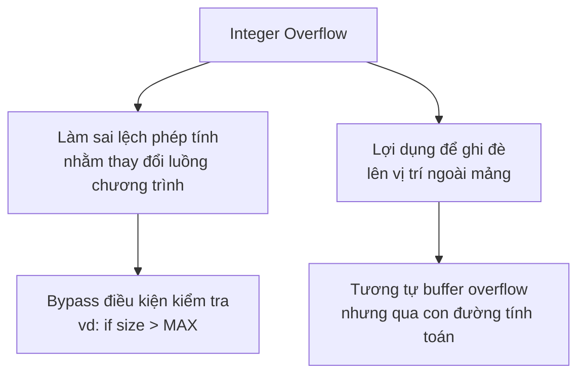
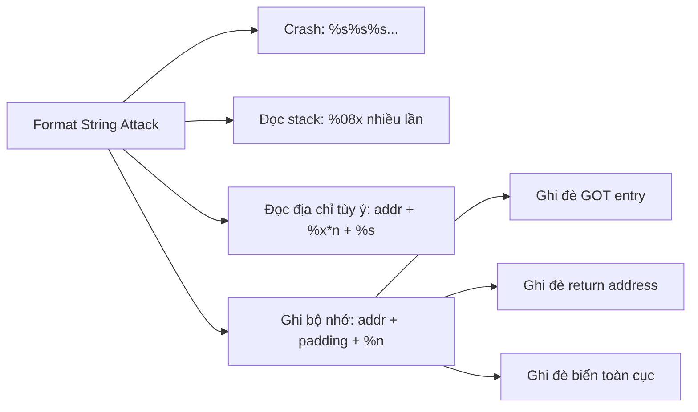

# Buổi 08: Tràn Số Nguyên & Chuỗi Định Dạng

## Ôn tập Buffer Overflow

??? question "Câu hỏi 1: Hàm nào gây ra lỗ hổng buffer overflow với `char buf[50]`?"
    **Đáp án: A và C**

    - `gets(buf)` — không giới hạn độ dài đầu vào, đọc cho đến khi gặp newline hoặc EOF → **luôn nguy hiểm**.
    - `fgets(buf, 50, stdin)` — giới hạn 50 byte → **an toàn**.
    - `scanf("%s", buf)` — không giới hạn độ dài → **nguy hiểm**.

    Đáp án đúng theo slide là **A** (và C cũng đúng về mặt kỹ thuật), nhưng đáp án được chọn thường là **A** vì `gets` không có tham số giới hạn.

??? question "Câu hỏi 2: Buffer overflow xảy ra sẽ ghi đè vào stack frame của hàm nào?"
    ```c
    int done() { printf("Not thing..."); }
    int test() {
        char buf[25];
        gets(buf);
        done();
    }
    int main() {
        printf("Hello");
        test();
    }
    ```
    **Đáp án: B – Stack frame hàm `test`**

    - `buf[25]` được khai báo trong `test()`, nên nằm trong stack frame của `test`.
    - Khi `gets(buf)` ghi vượt 25 byte, nó ghi đè lên các giá trị khác trong cùng stack frame đó: biến cục bộ, saved EBP, return address.
    - Stack frame của `main` và `done` **không bị ảnh hưởng trực tiếp** (trừ khi return address bị thay đổi để nhảy đến nơi khác).

??? question "Câu hỏi 3: Hệ thống bật ASLR, file dùng `gets` biên dịch với `-fno-stack-protector`, nhận định nào đúng?"
    **Đáp án: B**

    - `-fno-stack-protector`: tắt canary → **không có cơ chế phát hiện tràn stack**.
    - ASLR bật: địa chỉ stack, heap, libc bị ngẫu nhiên hóa → **khó thực thi shellcode trực tiếp** vì không biết địa chỉ chính xác.
    - **Vẫn có thể** ghi đè biến cục bộ trong cùng stack frame (không cần biết địa chỉ tuyệt đối).
    - Không thể dễ dàng truyền shellcode vì địa chỉ bị ngẫu nhiên.

??? question "Câu hỏi 4: Phương pháp xác định độ dài input để gây buffer overflow?"
    **Đáp án: A và B** (cả hai đều hợp lệ trong thực tế)

    - **A**: Đọc assembly → tìm khoảng cách giữa buffer và return address (ví dụ `sub esp, 0x1c`).
    - **B**: Debug với GDB → xem địa chỉ cụ thể, tính offset.
    - **C**: Tăng dần độ dài — phương pháp thực tế hay dùng với cyclic pattern (pwntools: `cyclic(100)`).

---

## 1. Lỗ Hổng Tràn Số Nguyên (Integer Overflow)

### 1.1 Định nghĩa

!!! info "Integer Overflow là gì?"
    **Integer Overflow** xảy ra khi một phép toán số học tạo ra một giá trị **vượt ra ngoài phạm vi biểu diễn** của kiểu dữ liệu đó — lớn hơn giá trị tối đa hoặc nhỏ hơn giá trị tối thiểu.

    Nói đơn giản: máy tính lưu số trong một số bit cố định. Khi kết quả phép tính vượt quá số bit đó, phần dư "tràn ra" và gây ra giá trị sai hoàn toàn so với mong muốn của lập trình viên.

### 1.2 Tại sao lại xảy ra?

Máy tính lưu số nguyên dưới dạng nhị phân với số bit cố định. Ví dụ kiểu `int` 32-bit:

```
int var = 25;
(25)₁₀ = (00000000 00000000 00000000 00011001)₂
```

Khi giá trị vượt quá 32 bit, bit cao nhất bị cắt bỏ (bị "tràn"), dẫn đến kết quả hoàn toàn sai.

**Biểu diễn số âm (Two's Complement):**

```
+127  = 0111 1111
+1    = 0000 0001
 0    = 0000 0000
-1    = 1111 1111
-2    = 1111 1110
-128  = 1000 0000
```

!!! warning "Vấn đề wrap-around"
    Với `signed int 8-bit`: `127 + 1 = -128` (tràn dương → âm)
    Với `unsigned int 8-bit`: `255 + 1 = 0` (tràn về 0)

### 1.3 Các kiểu dữ liệu trong C

| Kiểu dữ liệu | Kích thước (bytes) | Phạm vi | Format |
|---|---|---|---|
| `char` | 1 | -128 → 127 | `%c` |
| `unsigned char` | 1 | 0 → 255 | `%c` |
| `short` / `int` | 2 | -32,768 → 32,767 | `%i` hoặc `%d` |
| `unsigned int` | 2 | 0 → 65,535 | `%u` |
| `long` | 4 | -2,147,483,648 → 2,147,483,647 | `%ld` |
| `unsigned long` | 4 | 0 → 4,294,967,295 | `%lu` |
| `float` | 4 | 3.4e-38 → 3.4e+38 | `%f` |
| `double` | 8 | 1.7e-308 → 1.7e+308 | `%lf` |
| `long double` | 10 | 3.4e-4932 → 1.1e+4932 | `%lf` |

### 1.4 Ví dụ minh họa

```cpp
#include <iostream>
using namespace std;

int main() {
    int a = 4278190080;         // Vượt quá INT_MAX (2147483647) → tràn âm
    cout << "a = " << a << '\n';  // Output: a = -16777216

    unsigned int b = 4299360564;  // Vượt quá UINT_MAX (4294967295) → wrap-around
    cout << "b = " << b << '\n';  // Output: b = 4273796812 (hoặc giá trị khác)

    int c = 1;
    unsigned int d = 4294967295;  // UINT_MAX
    cout << "c - d = " << c - d << '\n';  // Kết quả: 2 (do arithmetic wrap-around)

    return 0;
}
```

!!! example "Giải thích kết quả"
    - `4278190080` vượt INT_MAX → CPU cắt bit, kết quả là số âm `-16777216`.
    - `c - d` = `1 - 4294967295`: với unsigned arithmetic, kết quả là `1 - (-1) = 2` theo modular arithmetic.

### 1.5 Cách khai thác Integer Overflow



**Ví dụ khai thác thực tế:**

```c
// Đoạn code dễ bị tấn công
void* allocate_buffer(unsigned int count, unsigned int size) {
    // Nếu count = 0x80000001, size = 2
    // count * size = 0x100000002 → tràn thành 2 (với 32-bit)
    unsigned int total = count * size;  // INTEGER OVERFLOW!
    void* buf = malloc(total);          // Cấp phát chỉ 2 bytes
    // Nhưng sau đó copy count*size bytes thật → heap overflow!
    memcpy(buf, input, count * size);
    return buf;
}
```

!!! danger "Thực tế: CVE BadAlloc (Black Hat USA 2021)"
    Lỗ hổng này ảnh hưởng đến hàng triệu thiết bị IoT/Embedded. Bộ cấp phát bộ nhớ (memory allocator) trong nhiều RTOS tính sai kích thước vùng nhớ cần cấp phát do integer overflow, dẫn đến heap overflow và RCE (Remote Code Execution).

---

## 2. Lỗ Hổng Chuỗi Định Dạng (Format String Vulnerability)

### 2.1 Chuỗi định dạng là gì?

**Format string** là một chuỗi ký tự chứa các **ký hiệu chuyển đổi (conversion specifiers)** dùng để định dạng dữ liệu đầu ra.

```c
#include <stdio.h>
#include <stdlib.h>

int main(int argc, char *argv[]) {
    char *format = "%s";
    char *arg1 = "Hello World!\n";
    printf(format, arg1);  // In: Hello World!
    return EXIT_SUCCESS;
}
```

### 2.2 Các hàm sử dụng format string

```c
#include <stdio.h>
int printf(const char *format, ...);
int fprintf(FILE *stream, const char *format, ...);
int sprintf(char *str, const char *format, ...);
int snprintf(char *str, size_t size, const char *format, ...);

#include <stdarg.h>
int vprintf(const char *format, va_list ap);
int vfprintf(FILE *stream, const char *format, va_list ap);
int vsprintf(char *str, const char *format, va_list ap);
int vsnprintf(char *str, size_t size, const char *format, va_list ap);
```

### 2.3 Các ký hiệu định dạng quan trọng

| Ký hiệu | Mô tả | Kích thước |
|---|---|---|
| `%d` | Số nguyên có dấu | 4 bytes |
| `%u` | Số nguyên không dấu | 4 bytes |
| `%x` | Số thập lục phân (hex) | 4 bytes |
| `%s` | Chuỗi ký tự (con trỏ) | pointer |
| `%c` | Ký tự đơn | 1 byte |
| `%n` | **Ghi số byte đã in** vào biến con trỏ | pointer |

**Ký hiệu xác định độ dài:**

| Ký hiệu | Độ dài | Kiểu |
|---|---|---|
| `hh` | 1 byte | `char` |
| `h` | 2 bytes | `short int` |
| `l` | 4 bytes | `long int` |
| `ll` | 8 bytes | `long long int` |

Ví dụ: `%hd` → đọc short int 2 bytes.

### 2.4 Ví dụ về định dạng nâng cao

```c
printf("%03d.%03d.%03d.%03d", 127, 0, 0, 1);
// Output: 127.000.000.001

printf("%.2f", 5.6732);
// Output: 5.67

printf("%#010x", 3735928559);
// Output: 0xdeadbeef

// %n: đếm số byte đã in
int n = 5;
printf("%s%n\n", "01234", &n);
// n = 5 (độ dài "01234")
```

### 2.5 Cơ chế hoạt động của printf trên stack

Khi gọi `printf("a=%d, b=%d, c at %08x\n", a, b, &c)`:

```
Stack layout (địa chỉ tăng dần):
┌──────────────────┐  ← ESP
│  addr of f_string│  (tham số 1: con trỏ format string)
├──────────────────┤
│        a         │  (tham số 2: giá trị a)
├──────────────────┤
│        b         │  (tham số 3: giá trị b)
├──────────────────┤
│       &c         │  (tham số 4: địa chỉ của c)
├──────────────────┤
│        c         │
│        b         │
│        a         │
│      0x1001      │  ← (biến cục bộ cũ hơn)
└──────────────────┘
```

**Vấn đề:** Khi thiếu tham số:

```c
// Code bị lỗi: thiếu &c
printf("a=%d, b=%d, c at %08x\n", a, b);  // Chỉ có 2 tham số, nhưng có 3 format spec
```

```
Stack layout:
┌──────────────────┐
│  addr of f_string│
├──────────────────┤
│        a         │  ← %d đầu tiên đọc đây (OK)
├──────────────────┤
│        b         │  ← %d thứ hai đọc đây (OK)
├──────────────────┤
│   UNKNOWN VALUE  │  ← %08x đọc đây (GIÁ TRỊ RÁC TRÊN STACK!)
└──────────────────┘
```

!!! warning "Lỗ hổng"
    `printf` **không kiểm tra** số lượng tham số thực sự được truyền vào. Nó cứ đọc stack theo số lượng `%specifier` có trong format string. Đây là nền tảng của format string vulnerability.

### 2.6 Khi người dùng kiểm soát format string

```c
#include <stdio.h>
#include <stdlib.h>

int main(int argc, char *argv[]) {
    char buf[100];
    fgets(buf, 100, stdin);
    printf(buf);          // ← LỖ HỔNG: format string do user kiểm soát!
    return EXIT_SUCCESS;
}
```

!!! danger "Tại sao nguy hiểm?"
    Lẽ ra phải viết `printf("%s", buf)`. Khi dùng `printf(buf)` trực tiếp, nếu `buf` chứa các ký hiệu như `%x`, `%s`, `%n`... thì `printf` sẽ **diễn giải chúng như format specifier** và đọc/ghi stack tùy ý.

### 2.7 Các kỹ thuật khai thác Format String

#### Kỹ thuật 1: Crash chương trình

```python
# Input: nhiều %s liên tiếp
python3 -c 'print("%s" * 100)' | ./format
```

!!! info "Cơ chế"
    Mỗi `%s` khiến `printf` lấy một giá trị từ stack, **xem đó là địa chỉ**, và cố đọc chuỗi tại địa chỉ đó. Nếu giá trị đó không phải địa chỉ hợp lệ → **Segmentation Fault**.

#### Kỹ thuật 2: Đọc dữ liệu trên stack

```python
# Input: "AAAA" + "%08x." * 10
python3 -c 'print("AAAA" + "%08x." * 10)' | ./format
# Output ví dụ:
# AAAA00000064.f7fb35a0.00f0b5ff.ffffcfbe.00000001.000000c2.ffffd0b4.ffffcfbe.ffffd0bc.41414141.
```

!!! info "Phân tích"
    - `AAAA` = `0x41414141` → xuất hiện ở cuối output (nằm trên stack vì buf là biến cục bộ).
    - 10 chuỗi `%08x` đọc 10 word (40 bytes) từ stack.
    - Kích thước input bị giới hạn bởi `fgets(buf, 100, stdin)` → tối đa đọc được `(100 - len("AAAA")) / len("%08x.") * 4 ≈ 76 bytes`.

#### Kỹ thuật 3: Đọc dữ liệu tại địa chỉ tùy ý

```
Input: <4-byte address> + "%x " * n + "%s"
```

```
Stack layout khi printf chạy:
┌─────────────────────┐ ← ESP
│  ptr to buf         │  ← printf đọc format string từ đây
├─────────────────────┤
│  [addr cần đọc]     │  ← buf[0..3]: 4 byte địa chỉ
├─────────────────────┤
│  ...%x ... %x ...   │  ← các %x "nhảy qua" các giá trị stack
├─────────────────────┤
│  %s                 │  ← %s cuối cùng sẽ đọc tại địa chỉ buf[0..3]
└─────────────────────┘
```

```python
# Giả sử địa chỉ cần đọc là 0x08041054
addr = b'\x54\x10\x04\x08'
payload = addr + b'%x ' * 9 + b'%s'
```

!!! tip "Cách tìm số %x cần thiết"
    Dùng kỹ thuật "AAAA + %08x" nhiều lần, đếm đến khi thấy `41414141` xuất hiện trong output. Số lần `%08x` trước đó = số `%x` cần dùng để "nhảy qua" đến vị trí buffer.

#### Kỹ thuật 4: Truy xuất tham số trực tiếp

```c
// Cú pháp: %<số thứ tự>$<format>
printf("%3$d", 1, 2, 3);  // Output: 3  (lấy tham số thứ 3)
printf("%1$s", "hello");  // Output: hello
```

!!! tip "Ứng dụng trong khai thác"
    Thay vì dùng nhiều `%x` để "nhảy qua" stack, dùng `%N$x` để truy xuất trực tiếp tham số thứ N:
    ```
    "AAAA%6$08x"  → đọc trực tiếp giá trị tại vị trí thứ 6 trên stack
    ```

#### Kỹ thuật 5: Ghi dữ liệu vào bộ nhớ với `%n`

`%n` là format specifier đặc biệt: **ghi số byte đã in ra trước đó** vào địa chỉ được chỉ định bởi tham số tương ứng.

```c
int count;
printf("Hello%n", &count);  // count = 5 (độ dài "Hello")
printf("Hi%n", &count);     // count = 2 (độ dài "Hi")
```

**Khai thác để ghi giá trị tùy ý:**

```python
# Muốn ghi giá trị 100 vào địa chỉ 0x08049704
# Cách: in đủ 100 ký tự trước %n

addr = b'\x04\x97\x04\x08'  # địa chỉ đích (little-endian)
# In 96 ký tự nữa (4 byte addr đã in rồi) = tổng 100
payload = addr + b'%96x' + b'%n'
```

!!! warning "Ghi giá trị lớn"
    Muốn ghi giá trị lớn (như địa chỉ 32-bit `0xdeadbeef`), cần in hàng triệu ký tự → dùng kỹ thuật **ghi từng byte** với `%hhn` (1 byte), `%hn` (2 byte):
    ```python
    # Ghi 2 byte thấp trước, 2 byte cao sau (hoặc ngược lại)
    payload = addr_low + addr_high + f'%{val_low}x%hn%{val_high - val_low}x%hn'.encode()
    ```



---

## Câu Hỏi Trắc Nghiệm

**Câu 1.** Kiểu `unsigned char` trong C có phạm vi giá trị là bao nhiêu?

- A. -128 đến 127
- B. 0 đến 255
- C. -256 đến 255
- D. 0 đến 127

??? info "Đáp án & Giải thích"
    **Đáp án: B**

    `unsigned char` là 1 byte (8 bit) không dấu → 2⁸ = 256 giá trị → 0 đến 255.

---

**Câu 2.** Integer Overflow xảy ra khi nào?

- A. Khi biến không được khởi tạo
- B. Khi phép toán tạo ra giá trị vượt ngoài phạm vi biểu diễn của kiểu dữ liệu
- C. Khi chia cho 0
- D. Khi truy cập mảng ngoài giới hạn

??? info "Đáp án & Giải thích"
    **Đáp án: B**

    Integer Overflow = kết quả phép tính lớn hơn MAX hoặc nhỏ hơn MIN của kiểu dữ liệu → bit bị cắt bỏ → giá trị sai.

---

**Câu 3.** Với `signed char` 8-bit, kết quả của `127 + 1` là bao nhiêu?

- A. 128
- B. 0
- C. -128
- D. -1

??? info "Đáp án & Giải thích"
    **Đáp án: C**

    `signed char` biểu diễn theo two's complement: `0111 1111` (127) + 1 = `1000 0000` = -128 (wrap-around từ dương tràn sang âm).

---

**Câu 4.** Với `unsigned int` 32-bit, kết quả của `4294967295 + 1` là bao nhiêu?

- A. 4294967296
- B. 1
- C. -1
- D. 0

??? info "Đáp án & Giải thích"
    **Đáp án: D**

    `UINT_MAX + 1 = 0` theo modular arithmetic 2³². Đây là unsigned overflow (wrap-around về 0).

---

**Câu 5.** Nguy hiểm chính khi integer overflow xảy ra trong hàm cấp phát bộ nhớ là gì?

- A. Chương trình dừng ngay lập tức
- B. Vùng nhớ được cấp phát nhỏ hơn thực tế cần, dẫn đến heap overflow
- C. CPU bị quá tải
- D. Stack bị xóa hoàn toàn

??? info "Đáp án & Giải thích"
    **Đáp án: B**

    Ví dụ: `count * size` tràn thành giá trị nhỏ → `malloc` cấp phát ít byte → nhưng chương trình sau đó copy dữ liệu với kích thước thực → ghi ngoài vùng nhớ được cấp phát → heap overflow. Đây là cơ chế của CVE BadAlloc.

---

**Câu 6.** Lỗ hổng CVE BadAlloc (Black Hat 2021) liên quan đến loại lỗ hổng nào?

- A. Buffer overflow trên stack
- B. Integer overflow trong memory allocator
- C. Format string
- D. Use-after-free

??? info "Đáp án & Giải thích"
    **Đáp án: B**

    BadAlloc ảnh hưởng đến bộ cấp phát bộ nhớ của nhiều RTOS (Real-Time OS) dùng trong IoT/Embedded, khai thác integer overflow khi tính kích thước vùng nhớ → hàng triệu thiết bị dễ bị tấn công.

---

**Câu 7.** Format string `%08x` có nghĩa là gì?

- A. In số hex, tối đa 8 ký tự
- B. In số hex, đệm 0 cho đủ 8 ký tự
- C. In 8 byte dưới dạng hex
- D. In địa chỉ 8 byte

??? info "Đáp án & Giải thích"
    **Đáp án: B**

    `%08x`: `0` = đệm bằng số 0, `8` = tổng chiều rộng tối thiểu 8 ký tự, `x` = hex. Ví dụ: `printf("%08x", 255)` → `000000ff`.

---

**Câu 8.** Format specifier `%n` dùng để làm gì?

- A. In số nguyên âm
- B. In ký tự xuống dòng
- C. Ghi số byte đã in ra trước đó vào biến con trỏ
- D. Đọc một số từ stdin

??? info "Đáp án & Giải thích"
    **Đáp án: C**

    `%n` là specifier đặc biệt: tham số tương ứng phải là `int*`, giá trị được ghi vào là số byte đã in ra tính đến thời điểm gặp `%n`. Đây là cơ sở của kỹ thuật ghi bộ nhớ qua format string.

---

**Câu 9.** Đoạn code nào sau đây có lỗ hổng format string?

- A. `printf("%s", buf);`
- B. `printf(buf);`
- C. `printf("%d %s", num, buf);`
- D. `fprintf(stderr, "%s\n", buf);`

??? info "Đáp án & Giải thích"
    **Đáp án: B**

    `printf(buf)` — dùng trực tiếp biến do user kiểm soát làm format string. Nếu `buf` chứa `%x`, `%s`, `%n`... thì printf sẽ diễn giải chúng. Đúng là phải dùng `printf("%s", buf)`.

---

**Câu 10.** Khi dùng `printf("%s%s%s%s%s")` không có tham số, điều gì xảy ra?

- A. Không có gì xảy ra, in ra chuỗi rỗng
- B. Compiler báo lỗi
- C. printf đọc giá trị từ stack, xem là địa chỉ, đọc chuỗi tại đó → có thể crash
- D. printf in ra địa chỉ của stack

??? info "Đáp án & Giải thích"
    **Đáp án: C**

    Mỗi `%s`: printf lấy 4 byte từ stack, coi đó là con trỏ char*, cố đọc chuỗi tại địa chỉ đó đến NULL. Nếu giá trị đó không phải địa chỉ hợp lệ → Segmentation Fault.

---

**Câu 11.** Input `"AAAA" + "%08x." * 10` nhằm mục đích gì?

- A. Crash chương trình
- B. Đọc 40 byte dữ liệu từ stack và tìm vị trí của chuỗi "AAAA" (0x41414141) trong output
- C. Ghi đè return address
- D. Leak địa chỉ heap

??? info "Đáp án & Giải thích"
    **Đáp án: B**

    - `AAAA` được lưu trên stack (là biến cục bộ `buf`).
    - 10 `%08x` đọc 10 word = 40 bytes từ stack, in ra dạng hex.
    - Khi thấy `41414141` trong output → biết đây là vị trí `buf` trên stack → xác định offset cần thiết cho các khai thác tiếp theo.

---

**Câu 12.** Format specifier `%hh` chỉ định độ dài bao nhiêu byte?

- A. 4 bytes
- B. 2 bytes
- C. 1 byte
- D. 8 bytes

??? info "Đáp án & Giải thích"
    **Đáp án: C**

    `hh` = 1 byte (`char`). Rất quan trọng trong khai thác: `%hhn` ghi 1 byte vào địa chỉ đích, cho phép ghi giá trị lớn mà không cần in hàng tỷ ký tự.

---

**Câu 13.** `printf("%3$d", 1, 2, 3)` in ra kết quả gì?

- A. `1`
- B. `2`
- C. `3`
- D. `123`

??? info "Đáp án & Giải thích"
    **Đáp án: C**

    Cú pháp `%N$` truy xuất trực tiếp tham số thứ N. `%3$d` = lấy tham số thứ 3 (= 3) và in dưới dạng số nguyên.

---

**Câu 14.** Tại sao kỹ thuật `%N$x` hữu ích hơn dùng nhiều `%x`?

- A. Nhanh hơn về mặt hiệu năng CPU
- B. Truy xuất trực tiếp vị trí trên stack mà không cần nhiều specifier trung gian, tiết kiệm không gian payload
- C. Ít gây crash hơn
- D. Chỉ hoạt động trên Windows

??? info "Đáp án & Giải thích"
    **Đáp án: B**

    Thay vì `%x%x%x%x%x%x%s` (6 specifier trung gian), chỉ cần `%6$s` để đọc trực tiếp tham số thứ 6. Quan trọng khi buffer nhỏ (ít byte input cho phép).

---

**Câu 15.** Trong kỹ thuật đọc địa chỉ tùy ý bằng format string, vai trò của `%x` trung gian là gì?

- A. In giá trị hex để debug
- B. "Nhảy qua" các giá trị trên stack để đến đúng vị trí địa chỉ cần đọc
- C. Kiểm tra ASLR
- D. Tạo ra heap spray

??? info "Đáp án & Giải thích"
    **Đáp án: B**

    Mỗi `%x` "tiêu thụ" một tham số (4 byte) trên stack. Dùng đúng số `%x` trung gian để printf "nhảy qua" các giá trị stack cho đến khi `%s` cuối cùng nhận được địa chỉ cần đọc (nằm đầu buffer).

---

**Câu 16.** Tại sao `printf(buf)` nguy hiểm hơn `printf("%s", buf)`?

- A. `printf(buf)` chậm hơn
- B. Khi `buf` do user kiểm soát, user có thể nhúng format specifier để đọc/ghi stack tùy ý
- C. `printf("%s", buf)` không in được ký tự đặc biệt
- D. `printf(buf)` tốn nhiều bộ nhớ hơn

??? info "Đáp án & Giải thích"
    **Đáp án: B**

    `printf("%s", buf)` — `buf` luôn được xử lý như chuỗi dữ liệu thuần túy, `%` trong `buf` không được diễn giải. `printf(buf)` — `buf` là format string, mọi `%x`, `%s`, `%n` đều được xử lý.

---

**Câu 17.** `snprintf` so với `sprintf` an toàn hơn vì:

- A. `snprintf` nhanh hơn
- B. `snprintf` có tham số giới hạn kích thước output, tránh ghi vượt buffer
- C. `snprintf` không hỗ trợ format specifier
- D. `snprintf` tự động thoát ký tự đặc biệt

??? info "Đáp án & Giải thích"
    **Đáp án: B**

    `snprintf(buf, size, format, ...)` — tham số `size` giới hạn số byte ghi vào `buf`. `sprintf` không có giới hạn → buffer overflow nếu output quá dài.

---

**Câu 18.** Biểu diễn two's complement của -1 với 8-bit là?

- A. `1000 0001`
- B. `1111 1110`
- C. `1111 1111`
- D. `0000 0001`

??? info "Đáp án & Giải thích"
    **Đáp án: C**

    Two's complement: đảo bit +1. `-1`: `0000 0001` → đảo = `1111 1110` → +1 = `1111 1111`.

---

**Câu 19.** Kết quả của `printf("%.2f", 5.6732)` là gì?

- A. `5.6732`
- B. `5.67`
- C. `5.70`
- D. `5.6`

??? info "Đáp án & Giải thích"
    **Đáp án: B**

    `%.2f` = in số thực với 2 chữ số thập phân, làm tròn: 5.6732 → 5.67.

---

**Câu 20.** Integer Overflow có thể dẫn đến hậu quả nào trong thực tế?

- A. Chỉ gây crash, không khai thác được
- B. Bypass kiểm tra điều kiện, cấp phát vùng nhớ sai kích thước, dẫn đến RCE
- C. Chỉ ảnh hưởng đến hiệu năng
- D. Chỉ xảy ra trên kiến trúc 32-bit

??? info "Đáp án & Giải thích"
    **Đáp án: B**

    Như CVE BadAlloc: integer overflow → malloc nhỏ → memcpy nhiều → heap overflow → RCE. Hoặc bypass `if (size > MAX)` khi size tràn thành giá trị nhỏ.

---

**Câu 21.** `%#010x` in số `3735928559` ra kết quả gì?

- A. `3735928559`
- B. `deadbeef`
- C. `0xdeadbeef`
- D. `00deadbeef`

??? info "Đáp án & Giải thích"
    **Đáp án: C**

    `#` = thêm prefix `0x` cho hex, `010` = tổng 10 ký tự, đệm 0. `0xdeadbeef` = 10 ký tự vừa khớp.

---

**Câu 22.** Khi khai thác format string để ghi giá trị lớn (ví dụ 0xdeadbeef), kỹ thuật nào hiệu quả hơn?

- A. In 0xdeadbeef ký tự trước `%n`
- B. Ghi từng byte hoặc 2 byte với `%hhn`/`%hn` và địa chỉ riêng cho từng phần
- C. Dùng nhiều `%n` liên tiếp
- D. Không thể ghi giá trị lớn

??? info "Đáp án & Giải thích"
    **Đáp án: B**

    In 3,735,928,559 ký tự là không thực tế. Giải pháp: ghi từng byte (dùng `%hhn`) hoặc từng word 2 byte (`%hn`) với các địa chỉ liên tiếp, mỗi lần điều chỉnh số ký tự đã in để ghi đúng giá trị byte cần thiết.

---

**Câu 23.** Hàm `gets()` bị coi là nguy hiểm vì:

- A. Chậm hơn `fgets`
- B. Không giới hạn độ dài đọc, đọc đến newline hoặc EOF → buffer overflow
- C. Không đọc được ký tự đặc biệt
- D. Chỉ đọc được 255 ký tự

??? info "Đáp án & Giải thích"
    **Đáp án: B**

    `gets(buf)` đọc đến khi gặp `\n` hoặc EOF, không quan tâm kích thước `buf` → luôn là lỗ hổng tiềm ẩn. Hàm này đã bị **loại bỏ khỏi C11 standard**.

---

**Câu 24.** Stack protector (`-fstack-protector`) bảo vệ bằng cách nào?

- A. Ngẫu nhiên hóa địa chỉ stack
- B. Đặt canary value giữa buffer và saved return address, kiểm tra trước khi return
- C. Mã hóa toàn bộ stack frame
- D. Chặn tất cả write operation vào stack

??? info "Đáp án & Giải thích"
    **Đáp án: B**

    Compiler thêm "canary" (giá trị ngẫu nhiên) ngay trước saved EBP/return address. Khi hàm return, kiểm tra canary còn nguyên không. Nếu bị ghi đè → abort(). `-fno-stack-protector` tắt cơ chế này.

---

**Câu 25.** ASLR (Address Space Layout Randomization) bảo vệ khỏi điều gì?

- A. Integer overflow
- B. Kẻ tấn công hardcode địa chỉ cố định (libc, stack, heap) trong payload
- C. Format string vulnerability
- D. Logic bug

??? info "Đáp án & Giải thích"
    **Đáp án: B**

    ASLR ngẫu nhiên hóa base address của stack, heap, và các thư viện mỗi lần chạy. Kẻ tấn công không biết địa chỉ chính xác của shellcode hay gadget → khó khai thác hơn.

---

**Câu 26.** Tại sao format string attack có thể leak địa chỉ bộ nhớ kể cả khi ASLR bật?

- A. ASLR không bảo vệ stack
- B. Dùng `%x` đọc giá trị thực tế trên stack, bao gồm con trỏ trỏ vào libc/stack đang chạy
- C. ASLR bị tắt khi dùng format string
- D. Không thể leak với ASLR

??? info "Đáp án & Giải thích"
    **Đáp án: B**

    ASLR ngẫu nhiên hóa địa chỉ, nhưng stack vẫn chứa **các con trỏ thực tế** (return address vào libc, stack pointer...). Đọc được những giá trị đó = leak địa chỉ thực → tính offset → biết địa chỉ libc tại runtime → bypass ASLR.

---

**Câu 27.** `long` trong C theo bảng slide có kích thước bao nhiêu byte?

- A. 2 bytes
- B. 4 bytes
- C. 8 bytes
- D. Tùy platform

??? info "Đáp án & Giải thích"
    **Đáp án: B**

    Theo bảng trong slide: `long` = 4 bytes, phạm vi -2,147,483,648 đến 2,147,483,647, format `%ld`. (Lưu ý: trên hệ 64-bit Linux `long` = 8 bytes, nhưng slide dùng bảng 32-bit).

---

**Câu 28.** `%s` trong format string đọc dữ liệu như thế nào?

- A. Đọc 4 byte và in dưới dạng ký tự
- B. Lấy 4 byte từ stack làm địa chỉ con trỏ, đọc chuỗi tại đó đến ký tự NULL
- C. Đọc 1 byte tại vị trí ESP
- D. In địa chỉ ESP hiện tại

??? info "Đáp án & Giải thích"
    **Đáp án: B**

    `%s` lấy tham số kiểu `char*`: 4 byte (32-bit) được pop từ tham số, coi là địa chỉ, đọc ký tự từ địa chỉ đó cho đến `\0`. Nếu không có tham số thực → đọc giá trị bất kỳ trên stack làm địa chỉ.

---

**Câu 29.** Điều kiện cần để khai thác format string vulnerability là gì?

- A. Phải có quyền root
- B. Người dùng phải kiểm soát được nội dung của chuỗi format string truyền vào hàm printf
- C. Chương trình phải chạy trên Linux
- D. Stack phải thực thi được (NX off)

??? info "Đáp án & Giải thích"
    **Đáp án: B**

    Điều kiện cốt lõi: user input được dùng trực tiếp làm format string (`printf(user_input)` thay vì `printf("%s", user_input)`). Không cần NX off, không cần root.

---

**Câu 30.** Khi nói "đọc dữ liệu trên stack" bằng format string, tối đa đọc được bao nhiêu byte nếu buffer là 100 byte và mỗi `%08x.` dài 9 byte?

- A. 100 bytes
- B. Khoảng 36 bytes (4 word từ (100-4)/9 ≈ 10 specifier)
- C. Không giới hạn
- D. 40 bytes (10 word × 4 byte)

??? info "Đáp án & Giải thích"
    **Đáp án: D**

    `fgets(buf, 100, stdin)` → tối đa 99 byte input. `"AAAA"` = 4 byte. Còn 95 byte → `95 / len("%08x.") = 95/9 ≈ 10` specifier. Mỗi `%08x` đọc 4 byte → 10 × 4 = **40 bytes** từ stack.

---

**Câu 31.** Lỗ hổng CVE-2022-1215 được tìm thấy trong thư viện nào?

- A. OpenSSL
- B. libinput
- C. glibc
- D. libpng

??? info "Đáp án & Giải thích"
    **Đáp án: B**

    CVE-2022-1215 là format string vulnerability trong `libinput` (thư viện xử lý input thiết bị trên Linux). CVSS score 7.8 (HIGH), ảnh hưởng phiên bản trước 1.18.2 và trước 1.19.4.

---

**Câu 32.** Two's complement được sử dụng để biểu diễn số âm vì lý do gì?

- A. Đơn giản hơn sign-magnitude
- B. Phép cộng và trừ hoạt động đồng nhất không cần xét dấu riêng, và chỉ có một biểu diễn cho số 0
- C. Biểu diễn được số lớn hơn
- D. Dễ đọc hơn cho con người

??? info "Đáp án & Giải thích"
    **Đáp án: B**

    Two's complement: phép cộng/trừ dùng cùng một mạch logic cho cả số dương lẫn âm. Sign-magnitude và 1's complement có hai biểu diễn cho 0 (`+0` và `-0`) gây phức tạp.

---

**Câu 33.** `scanf("%s", buf)` khác `fgets(buf, n, stdin)` ở điểm nào quan trọng về bảo mật?

- A. `scanf` nhanh hơn
- B. `scanf("%s")` không giới hạn độ dài, đọc đến whitespace → buffer overflow; `fgets` giới hạn n byte
- C. `fgets` không đọc được khoảng trắng
- D. `scanf` mã hóa input

??? info "Đáp án & Giải thích"
    **Đáp án: B**

    `scanf("%s", buf)` đọc đến whitespace, không giới hạn kích thước → buffer overflow. Phiên bản an toàn hơn: `scanf("%99s", buf)` (giới hạn 99 ký tự). `fgets` luôn giới hạn qua tham số n.

---

**Câu 34.** Khi phân tích output của `AAAA%08x.%08x...%08x`, ý nghĩa của việc `41414141` xuất hiện ở vị trí thứ N là gì?

- A. Đây là địa chỉ của biến `a`
- B. Buffer `buf` nằm ở vị trí tham số thứ N+1 của printf (tính cả tham số format string)
- C. Stack bị hỏng
- D. ASLR bị tắt

??? info "Đáp án & Giải thích"
    **Đáp án: B**

    `41414141` = hex của `AAAA`. Khi thấy ở output của `%08x` thứ N → buffer bắt đầu ở stack offset N. Sau đó dùng `%N$s` để đọc thẳng, hoặc đặt địa chỉ đích vào đầu buffer và dùng `%N$s`/`%N$n`.

---

**Câu 35.** Tại sao cần đặt địa chỉ cần đọc/ghi vào **đầu** payload trong format string attack?

- A. Vì printf đọc từ trái sang phải
- B. Vì địa chỉ cần nằm trong vùng stack mà printf sẽ "thấy" khi xử lý specifier
- C. Vì địa chỉ phải là byte đầu tiên của file
- D. Không cần thiết phải ở đầu

??? info "Đáp án & Giải thích"
    **Đáp án: B**

    Payload nằm trong `buf` (biến cục bộ trên stack). Khi printf xử lý specifier, nó đọc "tham số" từ stack. Đặt địa chỉ ở đầu `buf` → địa chỉ đó nằm tại vị trí stack mà `%s`/`%n` cuối cùng sẽ đọc.

---

**Câu 36.** CWE-134 mô tả loại lỗ hổng nào?

- A. Buffer overflow
- B. Use of Externally-Controlled Format String
- C. Integer overflow
- D. NULL pointer dereference

??? info "Đáp án & Giải thích"
    **Đáp án: B**

    CWE-134 = "Use of Externally-Controlled Format String" — tức là format string do nguồn bên ngoài (user, file, network) kiểm soát, không phải hardcode trong source code. Đây là mã lỗi chuẩn cho format string vulnerability.

---

**Câu 37.** Tại sao `%n` bị coi là nguy hiểm đặc biệt?

- A. Vì nó làm chậm chương trình
- B. Vì nó là specifier duy nhất **ghi** vào bộ nhớ thay vì chỉ đọc
- C. Vì nó làm crash chương trình ngay lập tức
- D. Vì nó không được hỗ trợ trên Linux

??? info "Đáp án & Giải thích"
    **Đáp án: B**

    Tất cả specifier khác (`%d`, `%x`, `%s`...) chỉ đọc từ stack. Duy nhất `%n` **ghi giá trị vào địa chỉ** được chỉ định. Điều này cho phép attacker ghi nội dung tùy ý vào bất kỳ địa chỉ nào (nếu kiểm soát format string).

---

**Câu 38.** Trong format string attack, mục tiêu ghi đè thường là gì?

- A. Code section của program
- B. GOT (Global Offset Table) entry, return address, function pointer
- C. CPU registers trực tiếp
- D. Kernel memory

??? info "Đáp án & Giải thích"
    **Đáp án: B**

    - **GOT entry**: ghi đè địa chỉ hàm libc (ví dụ `exit`) thành địa chỉ `system` → lần sau gọi `exit` = gọi `system("/bin/sh")`.
    - **Return address**: thay địa chỉ return thành shellcode/ROP gadget.
    - **Function pointer**: biến toàn cục chứa con trỏ hàm.

---

**Câu 39.** Để phòng chống format string vulnerability, biện pháp nào hiệu quả nhất?

- A. Dùng ASLR
- B. Luôn dùng format string cố định (`printf("%s", input)` thay vì `printf(input)`)
- C. Tắt tính năng `%n`
- D. Kiểm tra độ dài input

??? info "Đáp án & Giải thích"
    **Đáp án: B**

    Giải pháp gốc rễ: không bao giờ dùng input từ người dùng làm format string. Luôn dùng `printf("%s", buf)` thay vì `printf(buf)`. Một số compiler (GCC) cũng có warning `-Wformat-security` để phát hiện pattern này.

---

**Câu 40.** Lỗ hổng IBM Spectrum Scale CVE-2021-29740 thuộc loại gì và mức độ nghiêm trọng?

- A. Integer overflow, Medium
- B. Format string, High
- C. Buffer overflow, Critical
- D. Use-after-free, Low

??? info "Đáp án & Giải thích"
    **Đáp án: B**

    Slide đề cập CVE-2021-29740 là format string vulnerability trong IBM Spectrum Scale, được xếp loại **High Severity**, cho phép attacker thực thi mã tùy ý.

---

**Câu 41.** Khi khai thác buffer overflow trong hàm `test()`, phần tử nào trên stack frame bị ghi đè để kiểm soát luồng thực thi?

- A. Biến `a` trong `main()`
- B. Saved return address trong stack frame của `test()`
- C. Stack pointer (ESP)
- D. Code segment register (CS)

??? info "Đáp án & Giải thích"
    **Đáp án: B**

    Layout stack frame: `[buf][saved EBP][return address]`. Ghi đè vượt 25 byte của `buf` → vượt saved EBP → ghi đè return address → khi `test()` return, CPU nhảy đến địa chỉ attacker chỉ định.

---

**Câu 42.** `-fno-stack-protector` tắt cơ chế bảo vệ nào?

- A. ASLR
- B. NX bit
- C. Stack canary
- D. PIE (Position Independent Executable)

??? info "Đáp án & Giải thích"
    **Đáp án: C**

    `-fstack-protector` (bật mặc định) chèn canary. `-fno-stack-protector` tắt canary → không phát hiện được việc ghi đè stack frame. Không ảnh hưởng ASLR (OS feature) hay NX bit.

---

**Câu 43.** Số lượng CVE liên quan đến format string vulnerability theo slide là bao nhiêu?

- A. Khoảng 100
- B. Khoảng 751
- C. Khoảng 50
- D. Khoảng 2000

??? info "Đáp án & Giải thích"
    **Đáp án: B**

    Slide dẫn link MITRE CVE search cho "format string" → **751 CVE Records** (tính đến thời điểm bài giảng). Cho thấy đây là lớp lỗ hổng phổ biến và vẫn còn xuất hiện nhiều trong thực tế.

---

**Câu 44.** `double` trong C có kích thước bao nhiêu byte và format string nào?

- A. 4 bytes, `%f`
- B. 8 bytes, `%lf`
- C. 4 bytes, `%lf`
- D. 10 bytes, `%lf`

??? info "Đáp án & Giải thích"
    **Đáp án: B**

    `double` = 8 bytes (double precision IEEE 754), format string `%lf`. Phân biệt với `float` (4 bytes, `%f`) và `long double` (10 bytes, `%lf` với một số compiler).

---

**Câu 45.** Tại sao integer overflow đặc biệt nguy hiểm trong code kiểm tra điều kiện an toàn?

- A. Vì điều kiện if bị xóa khỏi bộ nhớ
- B. Giá trị tràn thành số nhỏ hơn MAX → vượt qua kiểm tra `if (size > LIMIT)` dù thực sự rất lớn
- C. Chỉ nguy hiểm khi debug mode
- D. Integer overflow không ảnh hưởng đến if statement

??? info "Đáp án & Giải thích"
    **Đáp án: B**

    Ví dụ: `LIMIT = 1000`. Nếu `size = 0x80000500` (> LIMIT thật sự) → tràn thành `0x500 = 1280`... hoặc nếu cộng thêm → kết quả nhỏ hơn LIMIT → vượt qua kiểm tra. Đây là attack vector phổ biến để bypass bounds checking.

---

**Câu 46.** `vprintf` khác `printf` ở điểm nào?

- A. `vprintf` nhanh hơn
- B. `vprintf` nhận danh sách tham số dạng `va_list` thay vì variadic args trực tiếp
- C. `vprintf` không hỗ trợ `%n`
- D. `vprintf` chỉ in ra stderr

??? info "Đáp án & Giải thích"
    **Đáp án: B**

    `vprintf(format, ap)` — `ap` là `va_list` (dùng khi bạn viết hàm wrapper nhận `...` và muốn forward sang printf). Cả hai đều có cùng lỗ hổng nếu `format` do user kiểm soát.

---

**Câu 47.** Để đọc nội dung tại địa chỉ `0xffffcfbe` bằng format string, payload phải bao gồm gì?

- A. Chuỗi hex `ffffcfbe` + `%s`
- B. 4 byte `\xbe\xcf\xff\xff` (little-endian) ở đầu, rồi đủ `%x` trung gian, rồi `%s`
- C. `%s` + địa chỉ ở cuối
- D. Chỉ cần `%s` là đủ

??? info "Đáp án & Giải thích"
    **Đáp án: B**

    - Địa chỉ phải ở dạng binary (4 byte raw, little-endian trên x86).
    - Phải đặt ở đầu buffer để nằm trên stack ở vị trí mà `%s` cuối cùng sẽ đọc.
    - Số `%x` trung gian = offset giữa ESP và vị trí buffer trên stack.

---

**Câu 48.** Tại sao format string attack vẫn xuất hiện nhiều trong thực tế dù đã biết từ lâu?

- A. Không có cách phòng chống
- B. Lập trình viên tiếp tục dùng `printf(user_input)` do thiếu hiểu biết hoặc code legacy
- C. Compiler không thể phát hiện
- D. Chỉ ảnh hưởng đến ngôn ngữ C cũ

??? info "Đáp án & Giải thích"
    **Đáp án: B**

    - Code legacy viết từ thập niên 90-2000 vẫn còn.
    - Lập trình viên không được đào tạo về secure coding.
    - GCC có warning `-Wformat-security` nhưng không phải lúc nào cũng được bật.
    - Một số ngôn ngữ/thư viện vẫn cho phép pattern này (Python `%` format cũng có rủi ro tương tự).

---

**Câu 49.** Trong bảng 2's complement 8-bit, giá trị nào có thể biểu diễn mà sign-magnitude không thể biểu diễn duy nhất?

- A. +127
- B. -128
- C. 0
- D. -0

??? info "Đáp án & Giải thích"
    **Đáp án: B**

    Two's complement 8-bit biểu diễn được -128 (`1000 0000`). Sign-magnitude có `1000 0000` = -0 (không có -128). Đây là lý do two's complement cho phạm vi rộng hơn 1 giá trị về phía âm.

---

**Câu 50.** Phương pháp nào trong số sau đây **không** phải là phương pháp khai thác format string vulnerability?

- A. Crash chương trình bằng `%s%s%s...`
- B. Đọc stack bằng `%x%x%x...`
- C. Ghi đè bộ nhớ bằng `%n`
- D. Tăng stack size bằng `alloca()`

??? info "Đáp án & Giải thích"
    **Đáp án: D**

    `alloca()` là hàm C cấp phát bộ nhớ trên stack, không liên quan đến format string vulnerability. Ba phương pháp còn lại (A, B, C) là các kỹ thuật khai thác format string tiêu chuẩn được đề cập trong bài.

---

**Câu 51.** Với hệ thống 32-bit, mỗi `%x` trong format string attack đọc bao nhiêu byte từ stack?

- A. 1 byte
- B. 2 bytes
- C. 4 bytes
- D. 8 bytes

??? info "Đáp án & Giải thích"
    **Đáp án: C**

    Trên x86 (32-bit), một "word" = 4 bytes. `%x` đọc 1 tham số kiểu `unsigned int` = 4 bytes. Nên `%x` × 10 = đọc 40 bytes từ stack.

---

**Câu 52.** Nếu input bị giới hạn 100 byte và ta dùng cú pháp `%N$x` thay vì nhiều `%x`, lợi ích là gì?

- A. Tốc độ nhanh hơn 10 lần
- B. Payload ngắn hơn nhiều, đọc được tham số ở vị trí xa hơn trong giới hạn input
- C. Tránh được ASLR
- D. Không có sự khác biệt

??? info "Đáp án & Giải thích"
    **Đáp án: B**

    Ví dụ: đọc tham số thứ 50 cần `%x` × 49 + `%s` = ít nhất 49 × 3 + 2 = ~150 byte (vượt giới hạn 100). Với `%50$s` chỉ cần 5 byte → tiết kiệm đáng kể.
