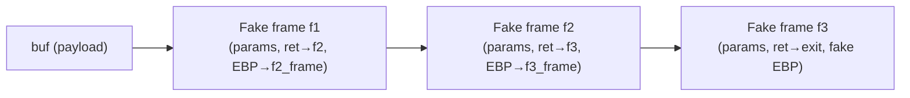

# Buổi 09: Off-by-one & Return-to-libc

## Tổng quan – Buffer Overflow và các biến thể

Khai thác lỗ hổng **tràn bộ đệm (buffer overflow)** trong trường hợp lý tưởng yêu cầu:

- Kiểm soát được **return address** (không có stack canary, có thể ghi đè đến vị trí return addr).
- Có thể truyền **shellcode** vào stack và thực thi (biên dịch với `-z execstack`).

Tuy nhiên, thực tế thường có nhiều ràng buộc hơn. Từ đó xuất hiện các kỹ thuật tấn công nâng cao:

| Kỹ thuật | Tình huống áp dụng |
|---|---|
| **Off-by-one** | Chỉ ghi đè được thêm 1 byte, không đủ để ghi đè return addr trực tiếp |
| **Return-to-libc** | Stack không cho phép thực thi code, hoặc shellcode quá dài/phức tạp |
| **ROP (Return Oriented Programming)** | Stack không cho phép thực thi, cần chuỗi gadget phức tạp hơn |

---

## Phần 1 – Tấn công Off-by-one

### Khái niệm

**Off-by-one** là lỗi lập trình xảy ra khi vòng lặp hoặc thao tác bộ đệm truy xuất **vượt ra ngoài giới hạn đúng 1 phần tử**. Lỗi này thường xảy ra do nhầm lẫn giữa `<` và `<=` khi kiểm tra điều kiện vòng lặp.

Mặc dù chỉ ghi đè được 1 byte ngoài phạm vi buffer, kẻ tấn công có thể lợi dụng đây để **thao túng gián tiếp** luồng thực thi của chương trình.

### Ví dụ lỗi điển hình

```c
void bar() {
    char buf[256];
    int i;
    for (i = 0; i <= 256; i++)  // Lỗi: dùng <= thay vì 
        buf[i] = getchar();
    // other statements...
}

void foo() {
    bar();
}
```

!!! danger "Vấn đề"
    Điều kiện `i <= 256` cho phép ghi vào `buf[256]`, nhưng `buf` chỉ có chỉ số hợp lệ từ `0` đến `255`. Byte thứ 257 này nằm **ngoài phạm vi mảng**, ngay tại vị trí của **saved EBP** của hàm `bar`.

    Dù chỉ 1 byte dư, nhưng điều này vẫn chưa đủ để ghi đè trực tiếp **return address** → cần tấn công **gián tiếp**.

### Cơ chế stack và saved EBP

Khi hàm `foo()` gọi `bar()`, stack có dạng (địa chỉ tăng từ dưới lên):

```
+------------------------+  ← địa chỉ cao hơn
| Return addr of foo     |
| Saved EBP of foo       |
| Local variables of foo |
+------------------------+
| Return addr of bar     |
| Saved EBP of bar       |  ← buf[256] sẽ ghi đè 1 byte thấp nhất tại đây
| buf[0..255]            |
| Other local vars bar   |
+------------------------+  ← địa chỉ thấp hơn
```

!!! info "Saved EBP là gì?"
    Khi một hàm được gọi, CPU lưu lại giá trị thanh ghi **EBP** (Extended Base Pointer) của hàm gọi vào stack để sau này khôi phục lại. Đây là cơ chế giúp chương trình biết "stack frame của hàm cha ở đâu".

### Tác động khi ghi đè 1 byte của saved EBP

Nếu byte thấp nhất (LSB – Least Significant Byte) của **saved EBP của `bar`** bị thay đổi thành `0x00` (hoặc giá trị nhỏ hơn), thì EBP sẽ trỏ tới **một vị trí thấp hơn** trong stack – cụ thể là đâu đó bên trong `buf`.

```
Trước tấn công:
  saved EBP của bar = 0xbffff4e0  → trỏ đúng vào stack frame của foo

Sau tấn công (ghi đè byte thấp = 0x00):
  saved EBP của bar = 0xbffff400  → trỏ vào đâu đó thấp hơn, nằm trong buf!
```

Hệ quả: Khi `bar` thực thi xong và trả về `foo`, CPU sẽ **restore EBP** từ giá trị đã bị thay đổi → `foo` sẽ không tìm được stack frame đúng của mình → không truy cập được biến cục bộ và **return address** chính xác.

### Khai thác: Giả mạo stack frame

Ý tưởng tấn công là **nhúng một stack frame giả (fake stack frame)** vào bên trong `buf`, rồi khiến `saved EBP` trỏ vào đó.

```
+------------------------+  ← địa chỉ cao hơn
| Return addr of foo     |
| Saved EBP of foo       |
| Local variables of foo |
+------------------------+
| Return addr of bar     |
| Saved EBP of bar (bị sửa → trỏ vào fake frame bên dưới)
+------------------------+
| [Fake stack frame      |  ← giả mạo stack frame của foo
|   fake return addr     |  ← địa chỉ attacker muốn nhảy tới
|   fake saved EBP       |
|   fake local vars      |
| ]                      |
| Other local vars bar   |
+------------------------+  ← địa chỉ thấp hơn
```

!!! success "Kết quả"
    Khi `foo` thực thi lệnh `ret`, CPU lấy return address từ **fake stack frame** mà attacker đã chuẩn bị → **kiểm soát hoàn toàn luồng thực thi**.

### Khai thác nâng cao: Kết hợp Injected Code

Attacker có thể đặt thêm **shellcode** ngay cạnh fake stack frame, và đặt **return address trong fake frame** trỏ vào shellcode đó:

```
+---------------------------+
| Return addr of bar        |
| Saved EBP of bar (sửa 1 byte) |
+---------------------------+
| Injected shellcode        |  ← code thực thi
| [Fake frame của foo]      |
|   ret addr → shellcode    |
|   fake EBP                |
| buf (padding)             |
+---------------------------+
```

### Ví dụ lỗi off-by-one khác

```c
void receive(int socket) {
    char buf[MAX];
    int nbytes = recv(socket, buf, sizeof(buf), 0);
    buf[nbytes] = '\0';  // Lỗi: nếu nbytes = MAX thì ghi ra ngoài mảng
    ...
}
```

!!! warning "Phân tích"
    Hàm `recv()` có thể trả về đúng `MAX` bytes (toàn bộ buffer). Khi đó `buf[MAX]` là truy xuất **ngoài mảng 1 byte** – đây là off-by-one. Nếu vị trí đó là saved EBP, tấn công tương tự có thể xảy ra.

### Tóm tắt Off-by-one

???+ summary "Tóm tắt"
    - Lỗi do dùng `<=` thay `<`, hoặc thiếu kiểm tra giới hạn nghiêm ngặt.
    - Chỉ cần ghi đè **1 byte** vào saved EBP là đủ để thao túng gián tiếp.
    - Attacker xây dựng **fake stack frame** bên trong buffer để kiểm soát return address.
    - Kết hợp với injected code hoặc Return-to-libc để thực thi code tùy ý.
    - Rất khó phát hiện và ngăn chặn vì lỗi chỉ sai lệch 1 đơn vị.

---

## Phần 2 – Tấn công Return-to-libc

### Khái niệm

**Return-to-libc** (còn gọi là **Arc Injection**) là kỹ thuật khai thác buffer overflow mà **không cần inject shellcode**. Thay vào đó, attacker **chuyển hướng luồng thực thi** sang các hàm có sẵn trong thư viện C chuẩn (**libc**).

!!! info "Libc là gì?"
    **libc** (C Standard Library) là thư viện cung cấp các hàm cơ bản cho chương trình C, bao gồm:
    - Xử lý chuỗi: `strcpy()`, `strlen()`, `strcmp()`,...
    - I/O: `printf()`, `scanf()`, `fopen()`,...
    - Quản lý bộ nhớ: `malloc()`, `free()`,...
    - Thực thi lệnh: `system()`, `execve()`,...

### Tại sao cần Return-to-libc?

| Vấn đề | Giải pháp |
|---|---|
| Stack được đánh dấu **non-executable** (NX/DEP) | Không inject shellcode được → dùng code đã có sẵn |
| Shellcode quá dài, không vừa buffer | Dùng hàm libc ngắn gọn |
| Shellcode quá phức tạp | Gọi trực tiếp `system()` |

### Ví dụ chương trình bị khai thác

```c
int main(int argc, char *argv[]) {
    char buf[4];
    strcpy(buf, argv[1]);  // Lỗi: không kiểm tra độ dài
    return 0;
}
```

!!! danger "Lỗi bảo mật"
    `strcpy()` **không kiểm tra kích thước đích**. Nếu `argv[1]` dài hơn 4 bytes, dữ liệu sẽ tràn ra ngoài `buf`, ghi đè saved EBP và return address của `main`.

    Chương trình được biên dịch với `-z noexecstack` (NX enabled) → không thể thực thi shellcode trên stack.

### Ý tưởng tấn công

Mục tiêu: Mở shell tương tác mà không truyền shellcode bằng cách gọi:

```c
system("/bin/bash");
```

Để làm điều này, attacker cần:

1. **Ghi đè return address** của `main` bằng **địa chỉ của hàm `system()`** trong libc.
2. **Đặt tham số** `/bin/bash` vào đúng vị trí mà `system()` sẽ đọc (ngay sau fake return address của `system`).

### Cấu trúc stack trước và sau khai thác

**Trước khai thác:**
```
+---------------------------+
| Other data in stack       |
| Return addr of main       |  ← địa chỉ hợp lệ
| Saved EBP                 |
| buf[4]                    |
+---------------------------+
```

**Sau khai thác:**
```
+---------------------------+
| Addr of "/bin/bash"       |  ← tham số thứ 1 của system()
| Return addr of system     |  ← sau khi system() xong trả về đâu (thường là exit)
| Address of system()       |  ← ghi đè return addr của main
| Saved EBP (overwritten)   |
| buf (padding)             |
+---------------------------+
```

!!! note "Tại sao tham số lại ở trên return address của system?"
    Theo **calling convention x86 (cdecl)**, khi một hàm được gọi, stack có dạng:
    ```
    [tham số 1] [tham số 2] ... ← nằm trên return address
    [return address]
    [saved EBP]
    [local variables]
    ```
    Do đó khi `system()` bắt đầu thực thi, nó sẽ đọc tham số từ `[ESP+4]` (ngay phía trên return address giả).

### Tìm địa chỉ cần thiết

**1. Địa chỉ hàm `system()`:**

```bash
$ gdb ./vulnerable_program
(gdb) run
(gdb) print system
$1 = {<text variable, no debug info>} 0xb7e5f430 <system>
```

**2. Địa chỉ chuỗi `/bin/bash`:**

???+ tip "Các cách tìm địa chỉ chuỗi `/bin/bash`"
    - **Cách 1:** Biến môi trường `SHELL=/bin/bash` thường tồn tại sẵn.
        ```bash
        (gdb) x/s *((char **)environ+i)  # i là thứ tự biến môi trường
        ```
    - **Cách 2:** Tự tạo biến môi trường chứa chuỗi mong muốn:
        ```bash
        export MYVAR="/bin/bash"
        ```
        Rồi dùng gdb để đọc địa chỉ của nó tương tự.

### Gọi chuỗi nhiều hàm (Chained Return-to-libc)

Đôi khi attacker cần thực thi **nhiều hàm libc liên tiếp** (ví dụ: `setuid(0)` → `system("/bin/bash")`). Kỹ thuật này gọi là **chaining**.

#### Nguyên tắc

- Mỗi hàm cần một **fake stack frame** riêng trong payload.
- Return address của hàm trước trỏ vào **đoạn code của hàm sau** (bỏ qua phần set-up stack của hàm sau để không làm hỏng fake frame).
- Saved EBP của từng hàm cần trỏ đúng vào vị trí EBP trong fake frame tiếp theo.

#### Sơ đồ chuỗi gọi hàm f1 → f2 → f3



#### Cấu trúc stack chi tiết

```
+-------------------------------+
| Parameters for f3             |
| Return addr for f3 (→ exit)   |
| Fake saved EBP of f3          |  ← f3's frame
| Local variables of f3         |
+-------------------------------+
| Parameters for f2             |
| Return addr for f2 (→ f3)     |
| EBP trỏ vào fake frame f3     |  ← f2's frame
| Local variables of f2         |
+-------------------------------+
| Parameters for f1             |
| Return addr for f1 (→ f2)     |
| EBP trỏ vào fake frame f2     |  ← f1's frame
+-------------------------------+
| Overwritten ret addr (→ f1)   |
| Overwritten EBP               |
| buf (padding)                 |
+-------------------------------+
```

!!! warning "Lưu ý quan trọng"
    Khi chaining, return address của mỗi hàm cần trỏ vào **sau phần prologue** (set-up stack) của hàm tiếp theo, để tránh hàm tiếp theo tự tạo stack frame mới làm hỏng fake frame đã chuẩn bị.

### Tóm tắt Return-to-libc

???+ summary "Tóm tắt"
    - Không cần shellcode → bypass NX/DEP.
    - Tận dụng các hàm libc như `system()`, `execve()` để thực thi lệnh hệ thống.
    - Cần biết địa chỉ chính xác của hàm libc và chuỗi tham số trong bộ nhớ.
    - Có thể kết hợp nhiều hàm thành chuỗi để thực hiện tác vụ phức tạp.
    - Là tiền thân của kỹ thuật **ROP (Return Oriented Programming)** hiện đại hơn.

---

## Biện pháp phòng chống

| Biện pháp | Mô tả |
|---|---|
| **Stack Canary** | Đặt một giá trị ngẫu nhiên giữa buffer và saved EBP/return addr. Nếu bị ghi đè → phát hiện ngay. |
| **Stack Randomization (ASLR)** | Ngẫu nhiên hóa địa chỉ stack mỗi lần chạy → attacker không đoán được địa chỉ. |
| **Library Randomization (ASLR)** | Ngẫu nhiên hóa địa chỉ load của libc → attacker không biết địa chỉ `system()`. |
| **StackGuard** | Công cụ biên dịch tích hợp canary tự động. |
| **StackShield** | Lưu return address ở vùng nhớ an toàn để so sánh trước khi ret. |

!!! tip "Lưu ý"
    Không có biện pháp nào là tuyệt đối. ASLR có thể bị bypass bằng **brute force** hoặc **information leak**. Canary không bảo vệ được off-by-one nếu chỉ ghi đè EBP mà không ghi qua canary.

---

## Câu hỏi & Trắc nghiệm

**Câu 1.** Lỗi Off-by-one thường xuất hiện do nguyên nhân nào sau đây?

- A. Sử dụng hàm `malloc()` không đúng cách
- B. Dùng `<=` thay vì `<` trong điều kiện vòng lặp khi duyệt mảng
- C. Quên khởi tạo biến
- D. Sử dụng con trỏ NULL

??? info "Đáp án & Giải thích"
    **Đáp án: B**
    Off-by-one xảy ra khi điều kiện lặp dùng `<=` thay vì `<`, khiến vòng lặp thực hiện thêm 1 lần, ghi vào `buf[N]` nơi `N` là kích thước mảng – nằm ngoài phạm vi hợp lệ.

---

**Câu 2.** Trong ví dụ `for(i = 0; i <= 256; i++) buf[i] = getchar();` với `buf[256]`, phần tử `buf[256]` nằm ở đâu trong stack (giả sử buf nằm liền kề saved EBP)?

- A. Trong vùng local variables của hàm
- B. Tại vị trí của saved EBP của hàm hiện tại
- C. Tại vị trí return address của hàm
- D. Nằm ngoài stack hoàn toàn

??? info "Đáp án & Giải thích"
    **Đáp án: B**
    Vì `buf` có 256 phần tử (index 0–255), `buf[256]` nằm ngay sau `buf` trong bộ nhớ. Nếu `buf` nằm liền kề `saved EBP`, thì `buf[256]` chính là byte thấp nhất (LSB) của `saved EBP`.

---

**Câu 3.** Tấn công Off-by-one ghi đè 1 byte vào saved EBP nhằm mục đích gì?

- A. Xóa toàn bộ stack frame hiện tại
- B. Làm cho EBP trỏ vào một vị trí attacker kiểm soát được (fake stack frame trong buf)
- C. Ghi đè trực tiếp return address
- D. Làm crash chương trình

??? info "Đáp án & Giải thích"
    **Đáp án: B**
    Ghi đè byte thấp nhất của saved EBP làm thay đổi địa chỉ mà EBP trỏ tới. Attacker chọn giá trị sao cho EBP trỏ vào vị trí trong `buf` – nơi attacker đã chuẩn bị một fake stack frame với return address tùy ý.

---

**Câu 4.** Sau khi saved EBP của `bar` bị ghi đè 1 byte thành `0x00`, điều gì xảy ra khi `bar` trả về `foo`?

- A. `foo` thực thi bình thường
- B. Chương trình bị segmentation fault ngay lập tức
- C. `foo` khôi phục EBP từ giá trị đã bị thay đổi → không tìm được đúng stack frame → không truy xuất được biến cục bộ và return address chính xác
- D. Stack bị xóa trắng

??? info "Đáp án & Giải thích"
    **Đáp án: C**
    Khi `bar` thực thi lệnh `leave` (tương đương `mov esp, ebp; pop ebp`), EBP sẽ được gán giá trị từ saved EBP đã bị thay đổi. Do đó `foo` nhìn thấy một stack frame sai → không tìm được return address đúng → attacker kiểm soát luồng.

---

**Câu 5.** Tấn công Return-to-libc còn có tên gọi khác là gì?

- A. Stack Smashing
- B. Arc Injection
- C. Heap Spray
- D. Format String Attack

??? info "Đáp án & Giải thích"
    **Đáp án: B**
    Return-to-libc còn được gọi là **Arc Injection** vì kỹ thuật này thay đổi "cung" (arc) thực thi – tức là luồng điều khiển chương trình – bằng cách nhảy đến hàm libc thay vì thực thi shellcode.

---

**Câu 6.** Return-to-libc được sử dụng để bypass biện pháp bảo vệ nào?

- A. Stack Canary
- B. ASLR
- C. NX (Non-Executable Stack) / DEP
- D. PIE (Position Independent Executable)

??? info "Đáp án & Giải thích"
    **Đáp án: C**
    NX/DEP đánh dấu stack là không thể thực thi code. Return-to-libc không inject code mới mà tái sử dụng code của libc đã nằm trong vùng nhớ thực thi → bypass NX/DEP hoàn toàn.

---

**Câu 7.** Trong kỹ thuật Return-to-libc, sau khi ghi đè return address, payload cần có thêm gì?

- A. Một NOP sled
- B. Return address giả của `system()` và địa chỉ chuỗi tham số (vd: `/bin/bash`)
- C. Toàn bộ shellcode `/bin/sh`
- D. Địa chỉ của hàm `main`

??? info "Đáp án & Giải thích"
    **Đáp án: B**
    Theo calling convention x86 (cdecl), khi `system()` được "gọi", stack phải có dạng: `[return addr của system] [tham số 1 = địa chỉ chuỗi]`. Attacker cần đặt đủ cả hai thứ này vào payload.

---

**Câu 8.** Trong GDB, lệnh nào được dùng để tìm địa chỉ hàm `system()` trong libc?

- A. `info system`
- B. `print system`
- C. `find system`
- D. `locate system`

??? info "Đáp án & Giải thích"
    **Đáp án: B**
    Lệnh `print system` trong GDB sẽ in ra địa chỉ của symbol `system`, ví dụ: `$1 = {<text variable, no debug info>} 0xb7e5f430 <system>`.

---

**Câu 9.** Để tìm địa chỉ chuỗi `/bin/bash` từ biến môi trường trong GDB, ta dùng lệnh nào?

- A. `print env SHELL`
- B. `x/s *((char **)environ+i)`
- C. `info environment`
- D. `show env`

??? info "Đáp án & Giải thích"
    **Đáp án: B**
    Lệnh `x/s *((char **)environ+i)` đọc chuỗi tại địa chỉ của biến môi trường thứ `i`. Bằng cách thử từng giá trị `i`, attacker tìm được biến `SHELL=/bin/bash` và lấy địa chỉ bộ nhớ của nó.

---

**Câu 10.** Đoạn code `buf[nbytes] = '\0';` trong hàm `receive()` có thể gây ra off-by-one khi nào?

- A. Khi `nbytes = 0`
- B. Khi `nbytes = sizeof(buf)` (nhận đúng MAX bytes)
- C. Khi socket bị ngắt kết nối
- D. Khi `buf` chưa được khởi tạo

??? info "Đáp án & Giải thích"
    **Đáp án: B**
    Nếu `recv()` trả về đúng `sizeof(buf)` = MAX bytes, thì `buf[MAX]` là truy xuất ngoài mảng 1 phần tử. Đây chính là off-by-one vulnerability.

---

**Câu 11.** Tấn công Off-by-one khác với tràn bộ đệm thông thường ở điểm gì?

- A. Off-by-one không sử dụng buffer overflow
- B. Off-by-one chỉ ghi đè được tối đa 1 byte ngoài phạm vi buffer thay vì ghi đè trực tiếp nhiều byte đến return address
- C. Off-by-one chỉ xảy ra trên heap
- D. Off-by-one không thể khai thác được

??? info "Đáp án & Giải thích"
    **Đáp án: B**
    Buffer overflow thông thường ghi đè nhiều byte, đủ để chạm tới return address. Off-by-one chỉ ghi thêm đúng 1 byte, thường chỉ đủ chạm tới 1 byte của saved EBP → phải tấn công gián tiếp qua fake stack frame.

---

**Câu 12.** Khi thực hiện Return-to-libc để gọi `system("/bin/bash")`, return address của hàm `system()` trong payload thường được đặt là gì?

- A. Địa chỉ của hàm `main`
- B. Địa chỉ của hàm `exit()` hoặc một địa chỉ hợp lệ để thoát sạch
- C. `0x00000000`
- D. Địa chỉ quay lại vùng buf

??? info "Đáp án & Giải thích"
    **Đáp án: B**
    Sau khi `system()` thực thi xong, nó cần trả về đâu đó. Đặt return address là `exit()` giúp chương trình thoát sạch mà không crash. Đặt `NULL` hay địa chỉ không hợp lệ sẽ gây segfault sau khi shell đóng.

---

**Câu 13.** Kỹ thuật Return-to-libc là tiền thân của kỹ thuật nào sau đây?

- A. Heap Spray
- B. Format String Attack
- C. ROP (Return Oriented Programming)
- D. Use-After-Free

??? info "Đáp án & Giải thích"
    **Đáp án: C**
    ROP là phiên bản tổng quát hóa của Return-to-libc: thay vì nhảy đến toàn bộ một hàm, ROP ghép các đoạn code ngắn kết thúc bằng `ret` (gọi là gadgets) để thực hiện tác vụ tùy ý – mạnh hơn và linh hoạt hơn Return-to-libc.

---

**Câu 14.** Stack Canary bảo vệ chống overflow như thế nào?

- A. Ngăn chặn việc ghi vào stack hoàn toàn
- B. Đặt một giá trị ngẫu nhiên giữa buffer và saved EBP/return address; kiểm tra trước khi hàm trả về
- C. Mã hóa toàn bộ stack
- D. Xóa stack sau mỗi lần hàm trả về

??? info "Đáp án & Giải thích"
    **Đáp án: B**
    Canary là một giá trị ngẫu nhiên được đặt ngay sau buffer (trước saved EBP). Nếu buffer bị tràn và ghi đè lên canary, giá trị canary thay đổi. Trước khi `ret`, chương trình kiểm tra canary → nếu sai thì abort.

---

**Câu 15.** Tại sao ASLR (Address Space Layout Randomization) làm khó tấn công Return-to-libc?

- A. ASLR mã hóa các hàm libc
- B. ASLR ngẫu nhiên hóa địa chỉ load của libc mỗi lần chạy → attacker không biết địa chỉ chính xác của `system()`
- C. ASLR vô hiệu hóa libc hoàn toàn
- D. ASLR đặt libc vào vùng nhớ không thể truy cập

??? info "Đáp án & Giải thích"
    **Đáp án: B**
    Return-to-libc đòi hỏi biết chính xác địa chỉ của các hàm libc. ASLR làm địa chỉ này thay đổi mỗi lần chương trình chạy → attacker không thể hardcode địa chỉ trong payload.

---

**Câu 16.** Trong calling convention x86 (cdecl), tham số của hàm được truyền bằng cách nào?

- A. Qua thanh ghi EAX, EBX
- B. Qua stack, được đẩy từ phải sang trái trước khi gọi hàm
- C. Qua thanh ghi ECX, EDX
- D. Qua một vùng nhớ toàn cục

??? info "Đáp án & Giải thích"
    **Đáp án: B**
    Trong cdecl (C declaration), tham số được push lên stack từ phải sang trái trước lệnh `call`. Khi hàm bắt đầu, `[ESP+4]` là tham số thứ 1, `[ESP+8]` là tham số thứ 2, v.v.

---

**Câu 17.** Trong chained Return-to-libc gọi f1 → f2 → f3, return address của f1 phải trỏ đến đâu?

- A. Đầu của hàm f2 (bao gồm cả phần prologue)
- B. Sau phần prologue của f2 để không làm hỏng fake stack frame đã chuẩn bị
- C. Địa chỉ của f3
- D. Địa chỉ của `exit()`

??? info "Đáp án & Giải thích"
    **Đáp án: B**
    Phần prologue của hàm (`push ebp; mov ebp, esp`) sẽ tạo stack frame mới, làm thay đổi ESP và EBP, có thể phá vỡ fake stack frame tiếp theo. Do đó cần nhảy vào **sau** prologue để bảo toàn fake frame.

---

**Câu 18.** Hàm `strcpy()` nguy hiểm vì lý do gì?

- A. Nó chạy chậm hơn `memcpy()`
- B. Nó không kiểm tra độ dài của chuỗi đích, có thể ghi vượt quá kích thước buffer
- C. Nó không hỗ trợ Unicode
- D. Nó yêu cầu quyền root để chạy

??? info "Đáp án & Giải thích"
    **Đáp án: B**
    `strcpy(dst, src)` sao chép toàn bộ `src` vào `dst` cho đến khi gặp `'\0'`, hoàn toàn không kiểm tra xem `dst` có đủ không gian không. Đây là nguyên nhân cổ điển gây buffer overflow.

---

**Câu 19.** Tùy chọn `-z noexecstack` khi biên dịch có tác dụng gì?

- A. Tắt stack canary
- B. Đánh dấu vùng nhớ stack là không thể thực thi code (NX)
- C. Tối ưu hóa stack
- D. Tắt ASLR

??? info "Đáp án & Giải thích"
    **Đáp án: B**
    `-z noexecstack` (linker flag) đặt bit NX (No-Execute) cho segment stack trong ELF binary → CPU sẽ từ chối thực thi bất kỳ code nào được đặt trên stack → shellcode inject thông thường thất bại.

---

**Câu 20.** Công cụ nào sau đây dùng để kiểm tra các biện pháp bảo vệ của một binary?

- A. `nm`
- B. `objdump`
- C. `checksec`
- D. `strings`

??? info "Đáp án & Giải thích"
    **Đáp án: C**
    `checksec` là công cụ kiểm tra nhanh các tính năng bảo mật của binary như: CANARY, FORTIFY, NX, PIE, RELRO. Trong slide đề cập kết quả checksec cho thấy NX ENABLED.

---

**Câu 21.** Khi khai thác Return-to-libc, tại sao attacker lại nhắm đến hàm `system()` thay vì tự viết shellcode?

- A. Vì `system()` nhanh hơn shellcode
- B. Vì `system()` luôn tồn tại trong bộ nhớ của process dưới dạng code thực thi, không cần inject code mới
- C. Vì shellcode bị antivirus phát hiện
- D. Vì `system()` không cần tham số

??? info "Đáp án & Giải thích"
    **Đáp án: B**
    Khi chương trình link với libc, `system()` đã được load vào vùng nhớ thực thi của process. Attacker chỉ cần biết địa chỉ và nhảy đến đó – không cần đưa code mới vào stack (vốn bị NX chặn).

---

**Câu 22.** Trong Off-by-one attack, byte bị ghi thêm thường là byte nào trong saved EBP bị ảnh hưởng?

- A. Byte cao nhất (MSB)
- B. Byte thấp nhất (LSB)
- C. Byte giữa
- D. Tất cả 4 byte

??? info "Đáp án & Giải thích"
    **Đáp án: B**
    Do stack tăng về phía địa chỉ thấp và buffer được điền từ địa chỉ thấp lên cao, byte ghi thêm sẽ ghi vào **byte thấp nhất (LSB)** của saved EBP (vì EBP trên x86 là 4 bytes, byte đầu tiên từ địa chỉ thấp là LSB).

---

**Câu 23.** Tùy chọn `-m32` khi biên dịch dùng để làm gì?

- A. Tối ưu hóa cho kiến trúc 32-bit
- B. Biên dịch ra binary 32-bit trên máy 64-bit
- C. Bật chế độ debug 32-bit
- D. Giới hạn bộ nhớ sử dụng xuống 32MB

??? info "Đáp án & Giải thích"
    **Đáp án: B**
    Trên máy 64-bit, gcc mặc định tạo binary 64-bit. Flag `-m32` yêu cầu tạo binary 32-bit, sử dụng calling convention x86 (cdecl) với EBP/ESP thay vì RBP/RSP – quan trọng khi thực hành các kỹ thuật tấn công stack cổ điển.

---

**Câu 24.** StackShield bảo vệ như thế nào khác với Stack Canary?

- A. StackShield mã hóa return address
- B. StackShield lưu bản sao của return address vào vùng nhớ an toàn riêng biệt và so sánh trước khi thực thi `ret`
- C. StackShield tắt hoàn toàn khả năng ghi vào stack
- D. StackShield và Canary hoàn toàn giống nhau

??? info "Đáp án & Giải thích"
    **Đáp án: B**
    StackShield lưu return address ra ngoài stack (vùng an toàn không thể bị overflow thông thường). Trước khi hàm return, nó so sánh return address trên stack với bản sao đã lưu → phát hiện nếu bị ghi đè.

---

**Câu 25.** Lệnh `export MYSHELL=/bin/bash` trong shell có tác dụng gì trong ngữ cảnh tấn công?

- A. Thay đổi shell mặc định của hệ thống
- B. Tạo biến môi trường chứa chuỗi `/bin/bash` trong bộ nhớ của process → attacker có thể dùng GDB tìm địa chỉ của chuỗi này để dùng làm tham số cho `system()`
- C. Cài đặt bash mới
- D. Tắt các biện pháp bảo mật

??? info "Đáp án & Giải thích"
    **Đáp án: B**
    Biến môi trường được lưu trong bộ nhớ của process khi chương trình chạy. Attacker có thể đặt chuỗi mong muốn (`/bin/bash`) vào biến môi trường, sau đó dùng GDB xác định địa chỉ bộ nhớ của chuỗi đó để sử dụng làm tham số.

---

**Câu 26.** Trong stack layout của x86, saved EBP nằm ở đâu so với return address?

- A. Saved EBP nằm phía dưới return address (địa chỉ thấp hơn)
- B. Saved EBP nằm phía trên return address (địa chỉ cao hơn)
- C. Saved EBP và return address cùng vị trí
- D. Vị trí của saved EBP không cố định

??? info "Đáp án & Giải thích"
    **Đáp án: A**
    Stack frame x86 từ thấp lên cao: `[local variables] [saved EBP] [return address] [parameters]`. Saved EBP nằm ở địa chỉ **thấp hơn** return address, do đó overflow từ buffer có thể ghi đè saved EBP trước khi chạm đến return address.

---

**Câu 27.** Tại sao tấn công Off-by-one rất khó ngăn chặn?

- A. Vì nó yêu cầu phần cứng đặc biệt
- B. Vì lỗi chỉ sai lệch 1 đơn vị rất dễ bỏ qua khi review code, và một số biện pháp bảo vệ như canary không phát hiện được nếu chỉ ghi đè EBP mà không đụng đến canary
- C. Vì không có công cụ phân tích tĩnh nào phát hiện được
- D. Vì nó không tạo ra bất kỳ lỗi nào trong quá trình chạy

??? info "Đáp án & Giải thích"
    **Đáp án: B**
    Lỗi `<=` thay `<` nhìn rất giống code đúng → dễ bỏ sót khi review. Hơn nữa, canary được đặt giữa buffer và saved EBP – nếu tấn công chỉ ghi đúng 1 byte vào saved EBP mà không đi qua canary thì canary không phát hiện được.

---

**Câu 28.** ROP (Return Oriented Programming) khác Return-to-libc như thế nào?

- A. ROP không sử dụng bộ nhớ của libc
- B. ROP ghép các "gadgets" nhỏ (đoạn code kết thúc bằng `ret`) thay vì nhảy vào toàn bộ một hàm, cho phép thực thi tác vụ phức tạp hơn
- C. ROP chỉ hoạt động trên Linux
- D. ROP và Return-to-libc hoàn toàn giống nhau

??? info "Đáp án & Giải thích"
    **Đáp án: B**
    Return-to-libc nhảy vào **toàn bộ hàm** libc. ROP chia nhỏ hơn, tìm các **gadgets** (2–5 instructions + `ret`) nằm rải rác trong binary hoặc libc, ghép chúng thành chuỗi để thực thi logic tùy ý mà không cần hàm hoàn chỉnh nào.

---

**Câu 29.** Hàm `recv()` trong đoạn code `int nbytes = recv(socket, buf, sizeof(buf), 0);` trả về giá trị gì?

- A. Số bytes đã gửi
- B. Số bytes đã nhận thực tế
- C. Kích thước của buffer
- D. Luôn trả về 0 nếu thành công

??? info "Đáp án & Giải thích"
    **Đáp án: B**
    `recv()` trả về số byte thực tế đã nhận được. Tham số thứ 3 (`sizeof(buf)`) là **tối đa** bao nhiêu byte được phép nhận – nhưng thực tế có thể nhận ít hơn hoặc đúng bằng số đó.

---

**Câu 30.** Trong payload tấn công Return-to-libc cho chương trình có `buf[4]`, padding trước return address thường có kích thước là bao nhiêu (giả sử không có canary)?

- A. 4 bytes
- B. 4 bytes (buf) + 4 bytes (saved EBP) = 8 bytes
- C. Đúng bằng kích thước của buf
- D. Tùy thuộc vào giá trị canary

??? info "Đáp án & Giải thích"
    **Đáp án: B**
    Để ghi đè return address, attacker cần điền đầy `buf` (4 bytes) + ghi đè `saved EBP` (4 bytes) = **8 bytes padding**. Sau đó là địa chỉ của `system()`, tiếp theo là fake return address, rồi địa chỉ chuỗi `/bin/bash`.

---

**Câu 31.** Trong đoạn code `for(i = 0; i <= 256; i++) buf[i] = getchar();`, nếu buf nằm cách saved EBP 8 bytes (có thêm biến cục bộ khác), off-by-one có còn khai thác được không?

- A. Vẫn khai thác được như cũ
- B. Không khai thác được vì byte ghi thêm rơi vào biến cục bộ khác, không chạm đến saved EBP
- C. Khai thác được nhưng cần kỹ thuật khác
- D. Chỉ phụ thuộc vào compiler

??? info "Đáp án & Giải thích"
    **Đáp án: B**
    Off-by-one chỉ ghi được 1 byte ngoài phạm vi. Nếu giữa `buf` và `saved EBP` còn có biến cục bộ khác, byte thêm sẽ ghi vào biến đó chứ không chạm tới saved EBP → không khai thác được theo cơ chế đã mô tả.

---

**Câu 32.** Biện pháp bảo vệ nào có thể ngăn cả Off-by-one lẫn Return-to-libc cùng lúc?

- A. Chỉ cần NX/DEP
- B. Kết hợp ASLR + Stack Canary + NX
- C. Chỉ cần Stack Canary
- D. Chỉ cần ASLR

??? info "Đáp án & Giải thích"
    **Đáp án: B**
    - **Canary** phát hiện overflow thông thường và một số off-by-one (nếu đi qua canary).
    - **ASLR** làm attacker không biết địa chỉ libc → cản Return-to-libc.
    - **NX** chặn shellcode inject.
    Kết hợp cả ba tạo lớp phòng thủ theo chiều sâu (defense in depth).

---

**Câu 33.** Lệnh `leave` trong assembly x86 tương đương với gì?

- A. `pop ebp; mov esp, ebp`
- B. `mov esp, ebp; pop ebp`
- C. `push ebp; mov ebp, esp`
- D. `pop ebp; pop esp`

??? info "Đáp án & Giải thích"
    **Đáp án: B**
    `leave` = `mov esp, ebp` (khôi phục ESP từ EBP) + `pop ebp` (khôi phục EBP từ saved EBP trên stack). Đây là phần **epilogue** của hàm, chuẩn bị cho lệnh `ret` tiếp theo.

---

**Câu 34.** Tại sao kỹ thuật "Fake Stack Frame" trong Off-by-one được gọi là tấn công gián tiếp?

- A. Vì attacker không cần trực tiếp viết vào stack
- B. Vì attacker không ghi đè trực tiếp return address mà thay đổi EBP để trỏ vào fake frame, từ đó gián tiếp kiểm soát return address khi hàm cha thực thi
- C. Vì tấn công xảy ra từ xa qua mạng
- D. Vì cần thêm một process khác để thực hiện

??? info "Đáp án & Giải thích"
    **Đáp án: B**
    "Gián tiếp" vì không thay đổi return address trực tiếp. Thay vào đó, attacker thay đổi EBP → khi hàm cha (foo) chạy, nó đọc return address từ fake frame (do EBP bị thay đổi) → kiểm soát gián tiếp.

---

**Câu 35.** Trong x86, thanh ghi EBP có vai trò gì?

- A. Lưu địa chỉ trả về của hàm
- B. Trỏ tới đỉnh của stack
- C. Trỏ tới đáy của stack frame hiện tại (base pointer), dùng để truy cập biến cục bộ và tham số một cách ổn định
- D. Lưu kết quả phép tính

??? info "Đáp án & Giải thích"
    **Đáp án: C**
    EBP (Extended Base Pointer) là điểm tham chiếu cố định trong stack frame. Biến cục bộ được truy cập qua `[EBP - offset]`, tham số qua `[EBP + offset]`. EBP không thay đổi trong suốt quá trình thực thi hàm (trừ khi bị tấn công).

---

**Câu 36.** Kỹ thuật nào giúp attacker thực thi `setuid(0)` rồi `system("/bin/bash")` để leo thang đặc quyền?

- A. Single Return-to-libc
- B. Chained Return-to-libc (gọi chuỗi nhiều hàm)
- C. Off-by-one đơn giản
- D. Stack Spray

??? info "Đáp án & Giải thích"
    **Đáp án: B**
    Chained Return-to-libc cho phép gọi nhiều hàm libc liên tiếp: đầu tiên `setuid(0)` để nâng quyền root, sau đó `system("/bin/bash")` để mở shell với quyền root.

---

**Câu 37.** Điều gì xảy ra nếu không cung cấp tham số cho `system()` trong payload Return-to-libc?

- A. `system()` tự động dùng `/bin/sh`
- B. Chương trình bị crash hoặc hành vi không xác định vì `system()` đọc dữ liệu rác tại vị trí tham số
- C. `system()` không làm gì và trả về 0
- D. `system()` mở terminal mặc định

??? info "Đáp án & Giải thích"
    **Đáp án: B**
    Nếu không đặt địa chỉ chuỗi hợp lệ vào đúng vị trí tham số trong stack, `system()` sẽ đọc giá trị rác và cố gắng thực thi một lệnh ngẫu nhiên → crash hoặc không xác định.

---

**Câu 38.** Công cụ CTF nào được đề cập trong tài liệu để học về binary exploitation?

- A. Metasploit
- B. Burp Suite
- C. CTF Wiki, Modern Binary Exploitation (MBE), Nightmare
- D. Wireshark

??? info "Đáp án & Giải thích"
    **Đáp án: C**
    Tài liệu đề cập các nguồn học Pwn CTF: **CTF Wiki** (ctf-wiki.org), **Modern Binary Exploitation – CSCI 4968** (RPISEC/MBE trên GitHub), **Nightmare** (guyinatuxedo.github.io), và NTU Computer Security.

---

**Câu 39.** Trong GDB, lệnh `x/s` có nghĩa gì?

- A. Thực thi chương trình
- B. Examine memory và hiển thị nội dung dưới dạng chuỗi ký tự (string)
- C. Export symbol table
- D. Extract section

??? info "Đáp án & Giải thích"
    **Đáp án: B**
    `x` trong GDB là lệnh **examine** (kiểm tra bộ nhớ). `/s` là format string – hiển thị nội dung tại địa chỉ đó dưới dạng chuỗi C (đọc đến khi gặp `'\0'`).

---

**Câu 40.** Tùy chọn `-z execstack` khi biên dịch có tác dụng gì?

- A. Tắt tối ưu hóa stack
- B. Cho phép thực thi code trên stack (ngược với noexecstack)
- C. Tạo stack lớn hơn
- D. Bật stack canary

??? info "Đáp án & Giải thích"
    **Đáp án: B**
    `-z execstack` đặt bit cho phép thực thi code trên stack. Trong môi trường học tập/lab, tùy chọn này được dùng để thực hành shellcode injection đơn giản mà không lo bị NX chặn.

---

**Câu 41.** Khi thực hiện chained Return-to-libc, saved EBP của f1 cần trỏ đến đâu?

- A. Saved EBP của f3
- B. Vị trí EBP trong fake stack frame của f2
- C. Địa chỉ bắt đầu của buf
- D. Địa chỉ `0x00000000`

??? info "Đáp án & Giải thích"
    **Đáp án: B**
    Khi f1 thực thi `leave`, nó sẽ `pop ebp` – giá trị popped sẽ là saved EBP của f1 trong fake frame. Để sau đó f2 hoạt động đúng, saved EBP của f1 phải trỏ đến vị trí EBP trong fake frame của f2.

---

**Câu 42.** Biện pháp phòng thủ nào TỐT NHẤT để ngăn lỗi off-by-one ở tầng phát triển phần mềm?

- A. Dùng ASLR
- B. Kiểm tra cẩn thận điều kiện vòng lặp, sử dụng hàm an toàn (`strncpy` thay `strcpy`, `fgets` thay `gets`), và áp dụng static analysis tools
- C. Dùng ngôn ngữ lập trình Assembly
- D. Tắt stack canary để dễ debug

??? info "Đáp án & Giải thích"
    **Đáp án: B**
    Biện pháp tốt nhất ở giai đoạn phát triển là **secure coding**: kiểm tra điều kiện biên chính xác, dùng hàm safe (có giới hạn kích thước), và chạy static analysis (như Coverity, Clang Analyzer) để phát hiện off-by-one tự động.

---

**Câu 43.** Trong stack x86, địa chỉ "tăng" theo hướng nào?

- A. Stack tăng về phía địa chỉ cao hơn khi push
- B. Stack tăng về phía địa chỉ thấp hơn khi push (stack grows downward)
- C. Stack tăng về phía địa chỉ cao hơn khi pop
- D. Stack không có chiều tăng cố định

??? info "Đáp án & Giải thích"
    **Đáp án: B**
    Trên x86, stack **grows downward** – mỗi lần `push`, ESP giảm đi (về phía địa chỉ thấp hơn). Do đó buffer được cấp phát ở địa chỉ thấp, saved EBP ở địa chỉ cao hơn, return address cao hơn nữa.

---

**Câu 44.** Nếu attacker tự tạo biến môi trường `export EXPLOIT="/bin/bash"` và chuỗi này nằm ở địa chỉ `0xbffffed0` trong bộ nhớ, attacker sẽ đặt giá trị nào vào vị trí tham số của `system()` trong payload?

- A. Chuỗi `/bin/bash` trực tiếp
- B. `0xbffffed0` (địa chỉ của chuỗi trong bộ nhớ)
- C. Độ dài của chuỗi (10 bytes)
- D. Địa chỉ của biến môi trường (không phải chuỗi)

??? info "Đáp án & Giải thích"
    **Đáp án: B**
    Hàm `system()` nhận **con trỏ đến chuỗi lệnh** (kiểu `char*`), không phải chuỗi trực tiếp. Do đó attacker cần đặt **địa chỉ bộ nhớ** `0xbffffed0` vào vị trí tham số, không phải chuỗi `/bin/bash`.

---

**Câu 45.** Điều nào sau đây ĐÚNG về sự khác biệt giữa heap overflow và stack overflow trong ngữ cảnh tấn công?

- A. Heap overflow không nguy hiểm
- B. Stack overflow ghi đè trực tiếp return address/saved EBP; heap overflow thường phá vỡ metadata của heap allocator hoặc con trỏ hàm lưu trên heap
- C. Heap overflow luôn dễ khai thác hơn
- D. Cả hai hoàn toàn giống nhau

??? info "Đáp án & Giải thích"
    **Đáp án: B**
    Stack overflow tấn công trực tiếp control flow qua saved EBP/return addr. Heap overflow phức tạp hơn: cần phá vỡ cấu trúc heap (chunk metadata, free list) hoặc ghi đè function pointer lưu trên heap. Cả hai đều nguy hiểm nhưng cơ chế khác nhau.

---

**Câu 46.** Trong bài giảng, ví dụ về off-by-one với `buf[nbytes] = '\0'` – điều gì xảy ra nếu attacker gửi đúng `MAX` bytes qua socket?

- A. Chương trình hoạt động bình thường
- B. `nbytes = MAX` → `buf[MAX]` được gán `'\0'` → ghi 1 byte `0x00` ra ngoài mảng, có thể ghi đè LSB của saved EBP thành 0
- C. Chương trình từ chối nhận thêm dữ liệu
- D. `recv()` trả về lỗi

??? info "Đáp án & Giải thích"
    **Đáp án: B**
    Khi `nbytes = MAX = sizeof(buf)`, `buf[MAX]` là off-by-one write. Giá trị ghi là `'\0'` = `0x00`. Nếu vị trí đó là LSB của saved EBP, byte thấp nhất bị đặt thành 0 → EBP bị thay đổi → có thể khai thác.

---

**Câu 47.** Tại sao việc gọi `system()` mở shell lại hữu ích cho attacker hơn là chỉ thực thi một lệnh đơn lẻ?

- A. Vì `system()` nhanh hơn
- B. Vì shell tương tác cho phép attacker tiếp tục tương tác với hệ thống sau khai thác, thực thi nhiều lệnh tùy ý, leo thang đặc quyền, v.v.
- C. Vì shell không cần quyền root
- D. Vì `system()` không bị ghi log

??? info "Đáp án & Giải thích"
    **Đáp án: B**
    Shell tương tác (`/bin/bash`) cung cấp **persistent access**: attacker có thể chạy bất kỳ lệnh nào, xem file, tạo backdoor, leo thang đặc quyền. Thực thi một lệnh đơn lẻ (như `id` hay `whoami`) ít có giá trị hơn nhiều.

---

**Câu 48.** Khi thực hành tấn công Return-to-libc trong môi trường lab, tại sao ASLR thường được tắt?

- A. ASLR làm chậm hệ thống
- B. ASLR ngẫu nhiên hóa địa chỉ libc và stack mỗi lần chạy, nên attacker không thể hardcode địa chỉ trong payload → cần tắt để học cơ chế cơ bản trước
- C. ASLR không hoạt động trên máy ảo
- D. ASLR chỉ áp dụng cho kernel

??? info "Đáp án & Giải thích"
    **Đáp án: B**
    Trong môi trường lab học tập, ASLR được tắt (`echo 0 > /proc/sys/kernel/randomize_va_space`) để địa chỉ libc ổn định, giúp học viên tập trung vào cơ chế tấn công cơ bản trước khi học kỹ thuật bypass ASLR.

---

**Câu 49.** Tổng kết: Điểm chung giữa Off-by-one và Return-to-libc là gì?

- A. Cả hai đều cần inject shellcode
- B. Cả hai đều là biến thể của khai thác buffer overflow nhằm kiểm soát luồng thực thi (control flow hijacking), dù cách thức khác nhau
- C. Cả hai chỉ hoạt động trên Windows
- D. Cả hai đều bị ngăn chặn hoàn toàn bởi stack canary

??? info "Đáp án & Giải thích"
    **Đáp án: B**
    Cả hai đều xuất phát từ lỗ hổng **memory corruption** (ghi ngoài phạm vi), đều nhằm mục tiêu cuối cùng là **kiểm soát EIP/return address**. Off-by-one dùng fake stack frame gián tiếp; Return-to-libc ghi đè trực tiếp return address nhưng không dùng shellcode.

---

**Câu 50.** Nếu một chương trình được biên dịch với đầy đủ ASLR + NX + Stack Canary + PIE, kỹ thuật tấn công nào vẫn còn khả thi nhất?

- A. Shellcode injection
- B. Return-to-libc đơn giản
- C. ROP chain kết hợp với information leak để bypass ASLR
- D. Off-by-one trực tiếp

??? info "Đáp án & Giải thích"
    **Đáp án: C**
    Với đủ 4 biện pháp bảo vệ: NX chặn shellcode, Canary phát hiện overflow lớn, ASLR+PIE ngẫu nhiên hóa địa chỉ. Kỹ thuật hiện đại nhất là **ROP + information leak**: dùng một lỗ hổng đọc bộ nhớ để leak địa chỉ thực tế của libc/binary, tính offset, rồi xây ROP chain với địa chỉ chính xác.
