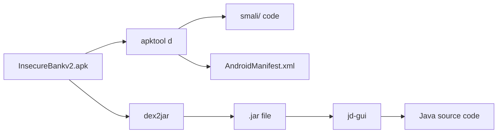
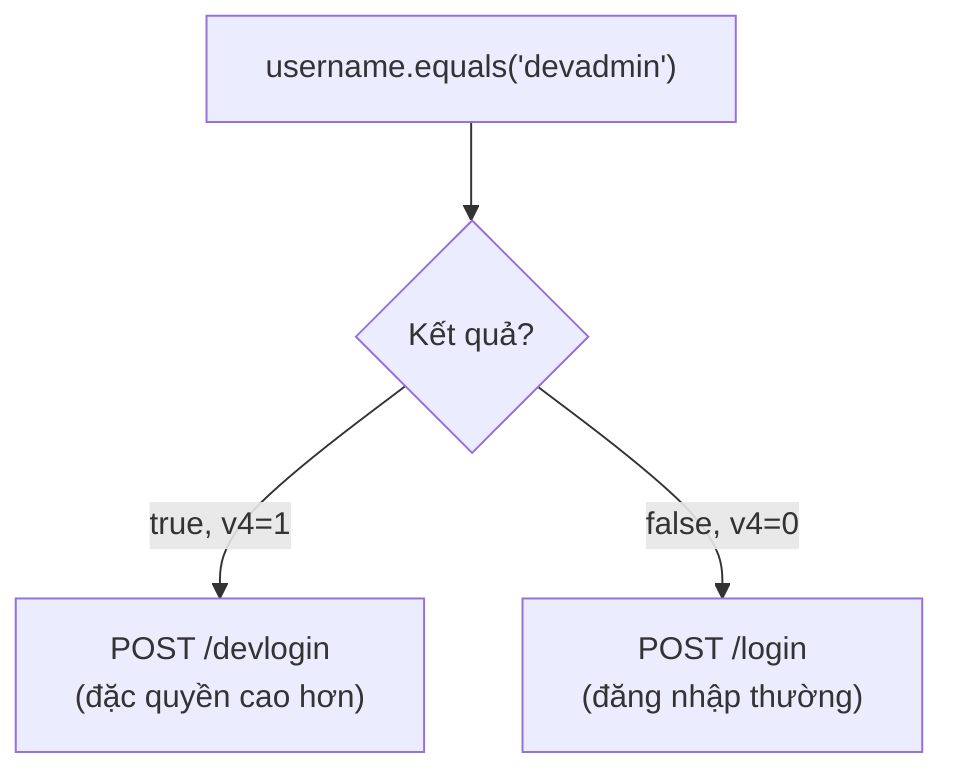
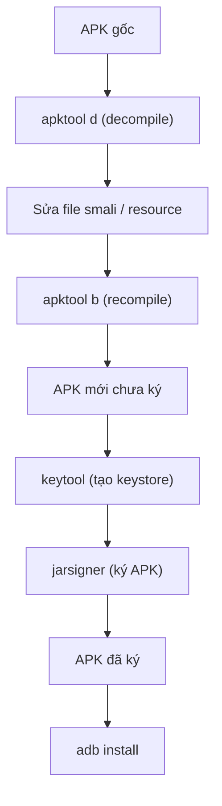

# L2: Android Mobile Pentest 101

## Bài 4: Dịch Ngược (Reverse Engineering)

## 1. Cấu trúc file APK

### APK là gì?

APK (Android Package Kit) là định dạng file dùng để phân phối và cài đặt ứng dụng trên Android, tương tự như `.exe` trên Windows. Việc cài đặt thủ công từ file APK (không qua Play Store) gọi là **sideloading**.

Về bản chất, APK là một **file ZIP** (dựa trên JAR format), có thể giải nén bằng bất kỳ công cụ unzip nào.

### Các thành phần bên trong APK

| Thành phần | Mô tả |
|---|---|
| `META-INF/` | Chứa danh sách file và chữ ký số của APK đã được sign |
| `lib/` | Thư viện native (`.so` files) cho từng kiến trúc CPU: `x86`, `x86_64`, `arm64-v8a`... |
| `res/` | Toàn bộ resource: XML layout, drawable (PNG/JPEG), string, style cho các độ phân giải khác nhau |
| `AndroidManifest.xml` | File khai báo metadata của app: tên, version, permissions, activities, services... |
| `classes.dex` | Mã nguồn đã biên dịch dưới dạng **Dalvik Executable (DEX) bytecode** |
| `resources.arsc` | Bảng resource đã biên dịch, được lưu không nén để truy cập nhanh lúc runtime |

### Thử giải nén APK

```bash
unzip InsecureBankv2.apk
```

Sau khi giải nén bạn sẽ thấy các file trên, nhưng lưu ý: `AndroidManifest.xml` và `classes.dex` ở dạng **binary đã biên dịch**, không đọc được trực tiếp bằng text editor.

!!! info "Tại sao cần decompile?"
    Sau khi unzip, các file như `classes.dex` vẫn ở dạng Dalvik bytecode – không phải Java source. Bạn cần các công cụ decompile để đưa chúng về dạng có thể đọc được.

---

## 2. Công cụ decompile

### APKTool

APKTool là công cụ chủ lực để decompile APK:

```bash
apktool d InsecureBankv2.apk
```

Sau lệnh này, thư mục `InsecureBankv2/` được tạo ra, bao gồm:

- `AndroidManifest.xml` – khôi phục về dạng XML đọc được
- `res/` – toàn bộ resource
- `smali/` – mã nguồn DEX được dịch ngược về **Smali** (assembly-level của Dalvik VM)

### Pipeline decompile hoàn chỉnh



| Công cụ | Chức năng |
|---|---|
| `apktool` | Decompile APK → Smali + resources |
| `dex2jar` | Chuyển `classes.dex` → `.jar` |
| `jd-gui` | Đọc `.jar` → hiển thị Java source |
| `ByteCode Viewer` | All-in-one: xem Smali, Java bytecode, hex... |

---

## 3. Smali – Ngôn ngữ assembly của Dalvik

### Smali là gì?

Smali là biểu diễn dạng text của Dalvik bytecode – tương tự như assembly đối với ngôn ngữ máy. Mỗi file `.smali` tương ứng với một `.class` Java.

!!! tip "Tại sao phải đọc Smali?"
    Nếu chỉ muốn đọc logic, dùng jd-gui xem Java source là đủ. Nhưng nếu muốn **patch** (sửa) chương trình, bạn **bắt buộc** phải sửa mã Smali – vì đó là thứ APKTool có thể recompile lại thành DEX.

### Cú pháp cơ bản của Smali

=== "Registers"

    Smali dùng thanh ghi (registers) thay cho biến:

    - `v0`, `v1`, `v2`... – local registers
    - `p0`, `p1`, `p2`... – parameter registers (`p0` = `this` với non-static method)

=== "Invoke"

    Gọi hàm trong Smali:

    ```smali
    invoke-virtual {v4, v5}, Ljava/lang/String;->equals(Ljava/lang/Object;)Z
    move-result v4
    ```

    Tương đương Java:
    ```java
    v4 = v4.equals(v5);  // trả về boolean (Z)
    ```

=== "Điều kiện"

    | Opcode | Ý nghĩa |
    |---|---|
    | `if-eqz vx, label` | Nhảy đến `label` nếu `vx == 0` |
    | `if-nez vx, label` | Nhảy đến `label` nếu `vx != 0` |
    | `if-eq vx, vy, label` | Nhảy nếu `vx == vy` |
    | `if-ne vx, vy, label` | Nhảy nếu `vx != vy` |
    | `goto label` | Nhảy vô điều kiện |

=== "Const"

    ```smali
    const-string v5, "devadmin"
    const/4 v2, 0x1        ; gán giá trị số nguyên
    ```

### Phân tích case study: user "devadmin"

Đây là đoạn Smali kiểm tra xem username có phải `devadmin` không:

```smali
const-string v5, "devadmin"
invoke-virtual {v4, v5}, Ljava/lang/String;->equals(Ljava/lang/Object;)Z
move-result v4
if-eqz v4, :cond_11c
```

**Giải thích từng dòng:**

1. Nạp chuỗi `"devadmin"` vào `v5`
2. Gọi `v4.equals(v5)` – so sánh username nhập vào với `"devadmin"`
3. Lưu kết quả (0 hoặc 1) vào `v4`
4. `if-eqz v4, :cond_11c` – **nếu kết quả = 0** (không bằng nhau), nhảy đến `:cond_11c`

**Luồng thực thi:**



Nếu username là `devadmin`, request sẽ được gửi tới endpoint `/devlogin` thay vì `/login` thông thường, cho phép đăng nhập tự do.

---

## 4. Patching APK

### Quy trình tổng quát



### Bước 1: Decompile

```bash
apktool d InsecureBankv2.apk
```

### Bước 2: Sửa resource

Thư mục `res/values/strings.xml` thường chứa các cờ cấu hình quan trọng:

```xml
<!-- Trước khi patch -->
<string name="is_admin">no</string>

<!-- Sau khi patch -->
<string name="is_admin">yes</string>
```

!!! tip "Nguyên tắc vàng của pentester"
    **"Thấy cái gì `yes` thì chuyển thành `no`, `no` thì chuyển thành `yes`"** – nghe có vẻ đơn giản nhưng đây là kỹ thuật cực kỳ hiệu quả để kích hoạt các tính năng ẩn.

### Bước 3: Recompile

```bash
apktool b InsecureBankv2
# Output sẽ nằm ở InsecureBankv2/dist/InsecureBankv2.apk
```

### Bước 4: Ký APK

APK mới biên dịch **bắt buộc phải được ký** trước khi cài đặt. Tạo keystore:

```bash
keytool -genkey -v \
  -keystore my-release-key.keystore \
  -alias alias_name \
  -keyalg RSA \
  -keysize 2048 \
  -validity 10000
```

Ký APK:

```bash
jarsigner -verbose \
  -sigalg SHA1withRSA \
  -digestalg SHA1 \
  -keystore my-release-key.keystore \
  InsecureBankv2.apk alias_name
```

!!! warning "Lỗi thường gặp khi cài đặt"
    - `INSTALL_PARSE_FAILED_NO_CERTIFICATES` – APK chưa được ký
    - `INSTALL_FAILED_UPDATE_INCOMPATIBLE` – Đã cài app cũ với chữ ký khác. Giải pháp: gỡ app cũ trước

    ```bash
    adb uninstall com.android.insecurebankv2
    adb install InsecureBankv2_patched.apk
    ```

### Bước 5: Cài đặt và kiểm tra

```bash
mv InsecureBankv2.apk InsecureBankv2_patched.apk
adb install InsecureBankv2_patched.apk
```

Kết quả: nút **"Create User"** xuất hiện – tính năng vốn chỉ dành cho admin nay đã hiển thị vì đã patch `is_admin` thành `yes`.

---

## 5. Bypass Detection

### Các loại detection phổ biến

!!! note "Hai cơ chế phát hiện thường gặp"
    1. **Root Detection (Anti-root)** – Kiểm tra thiết bị có bị root không
    2. **Emulator Detection (Anti-emulator / Anti-VM)** – Kiểm tra có đang chạy trên máy ảo không

### 5.1 Bypass Emulator Detection

#### Phân tích Java source

```java
private void checkEmulatorStatus() {
    if (checkIfDeviceIsEmulator().booleanValue() == true) {
        Toasteroid.show(this, "Application running on Emulator", ...ERROR...);
        return;
    }
    Toasteroid.show(this, "Application running on Real device", ...SUCCESS...);
}

private Boolean checkIfDeviceIsEmulator() {
    if (Build.FINGERPRINT.startsWith("generic")
        && Build.FINGERPRINT.startsWith("unknown")
        && Build.MODEL.contains("google_sdk")
        && Build.MODEL.contains("Emulator")
        && Build.MODEL.contains("Android SDK built for x86")
        && Build.MANUFACTURER.contains("Genymotion")
        && (Build.BRAND.startsWith("generic") || Build.DEVICE.startsWith("generic"))
        && "google_sdk".equals(Build.PRODUCT)) {
        return Boolean.valueOf(false);
    }
    return Boolean.valueOf(true);
}
```

!!! question "Tại sao app không phát hiện Genymotion?"
    Logic kiểm tra dùng `&&` (AND) cho **tất cả** điều kiện. Genymotion chỉ match một số trường (như `MANUFACTURER.contains("Genymotion")`) nhưng không match hết → hàm trả về `true` (là thiết bị thật) → **bug trong code kiểm tra của app!**

#### Smali tương ứng

```smali
method private checkEmulatorStatus()V
    const/4 v2, 0x1

    invoke-direct {p0}, Lcom/android/insecurebankv2/PostLogin;->checkIfDeviceIsEmulator()Ljava/lang/Boolean;
    move-result-object v0

    invoke-virtual {v0}, Ljava/lang/Boolean;->booleanValue()Z
    move-result v0

    if-ne v0, v2, :cond_13          ; nếu v0 != 1, nhảy tới "Real device"

    const-string v0, "Application running on Emulator"
    ...
    goto :goto_12

:cond_13
    const-string v0, "Application running on Real device"
    ...
    goto :goto_12
end-method
```

#### Kỹ thuật bypass

Thay vì hiểu toàn bộ logic, chỉ cần tìm **điểm G** – điều kiện rẽ nhánh – và sửa nó:

```smali
; Trước khi patch:
if-ne v0, v2, :cond_13

; Sau khi patch (luôn nhảy về nhánh "Real device"):
goto :cond_13
```

!!! tip "Triết lý patch"
    **Không cần hiểu toàn bộ chương trình.** Chỉ cần xác định điểm rẽ nhánh (conditional jump) và buộc chương trình đi theo nhánh mình muốn.

Sau khi sửa file `InsecureBankv2/smali/com/android/insecurebankv2/PostLogin.smali`, recompile và cài lại → App luôn hiển thị `"Application running on Real device"`.

### 5.2 Anti-root Detection

#### Phân tích

```java
void showRootStatus() {
    int i;
    if (doesSuperuserApkExist("/system/app/Superuser.apk") && doesSUexist()) {
        i = 0;
    } else {
        i = 1;
    }
    if (i != 1) {
        this.root_status.setText("Rooted Device!!");
        return;
    }
    this.root_status.setText("Device not Rooted!!");
}
```

Logic: kiểm tra file `/system/app/Superuser.apk` có tồn tại không.

```bash
# Kiểm tra trong thiết bị giả lập
adb shell
ls -la /system/app/Superuser.apk
# /system/app/Superuser.apk: No such file or directory
```

Kết quả: file không tồn tại ở đúng path, nhưng thực ra nó lại nằm ở `/system/app/Superuser/Superuser.apk` – app kiểm tra sai path nên không phát hiện được root.

!!! info "Kiến thức mở rộng: Các cách detect root thực tế"
    Các app bảo mật tốt hơn thường kiểm tra nhiều yếu tố:

    - Sự tồn tại của các binary: `su`, `busybox`, `magisk`
    - Kiểm tra nhiều path: `/sbin/su`, `/system/bin/su`, `/system/xbin/su`...
    - Kiểm tra app Magisk Manager, SuperSU có được cài không
    - Sử dụng SafetyNet / Play Integrity API
    - Kiểm tra bằng native code (khó bypass hơn Java code)

---

## 6. Kiến thức mở rộng

### Các công cụ phổ biến trong Android RE

| Công cụ | Mục đích |
|---|---|
| [Jadx](https://github.com/skylot/jadx) | Decompile APK trực tiếp ra Java, UI tiện lợi |
| [MobSF](https://github.com/MobSF/Mobile-Security-Framework-MobSF) | Framework phân tích tĩnh/động tự động |
| [Frida](https://frida.re) | Dynamic instrumentation – hook runtime |
| [Objection](https://github.com/sensepost/objection) | Wrapper của Frida, bypass root/ssl pinning dễ hơn |
| [apksigner](https://developer.android.com/tools/apksigner) | Công cụ ký APK chính thức từ Google (thay thế jarsigner) |

### Quy trình bypass SSL Pinning (mở rộng)

Nhiều app hiện đại dùng SSL Pinning để chặn traffic sniffing. Bypass thường dùng Frida hoặc patch Smali tương tự như trên.

### Tài liệu tham khảo

- [OWASP Mobile Security Testing Guide](https://owasp.org/www-project-mobile-security-testing-guide/)
- [Android Developers – App Signing](https://developer.android.com/studio/publish/app-signing)
- [Smali/Baksmali syntax reference](https://github.com/JesusFreke/smali)
- [InsecureBankv2 – Lab thực hành](https://github.com/dineshshetty/Android-InsecureBankv2)
