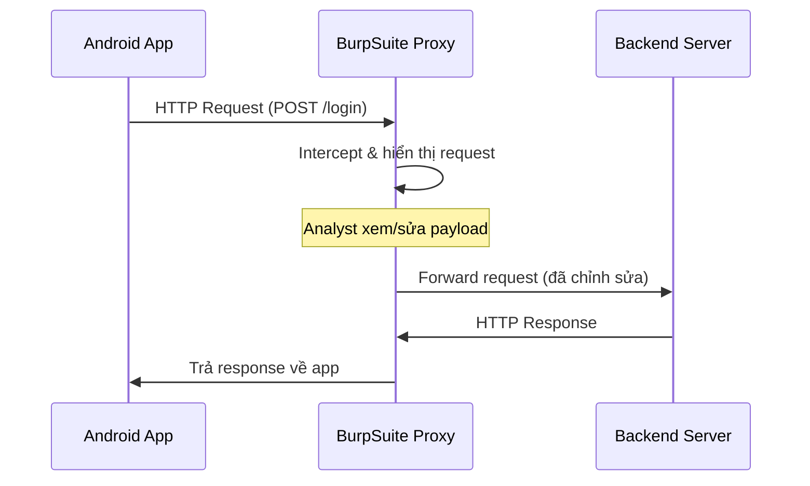

# L3: Android Mobile Pentest 101

## Bài 5 – Phân Tích Động với BurpSuite 

---

## 1. Giới Thiệu Phân Tích Động

Phân tích động (Dynamic Analysis) là quá trình kiểm thử và đánh giá ứng dụng **trong thời gian thực** — tức là ta chạy ứng dụng lên, tương tác với nó, rồi quan sát hành vi, dữ liệu gửi/nhận thay vì chỉ đọc source code như phân tích tĩnh.

!!! note "So sánh phân tích tĩnh và động"
    | Tiêu chí | Phân tích tĩnh | Phân tích động |
    |---|---|---|
    | Chạy ứng dụng? | Không | Có |
    | Xem source code? | Có | Không bắt buộc |
    | Quan sát traffic? | Không | Có |
    | Phát hiện lỗi runtime? | Khó | Dễ |
    | Công cụ phổ biến | jadx, apktool | BurpSuite, Frida |

---

## 2. BurpSuite là gì?

**BurpSuite** là một ứng dụng Java dùng để kiểm thử xâm nhập (penetration testing) ứng dụng web và mobile, được sử dụng rộng rãi bởi các chuyên gia bảo mật trên toàn thế giới.

Trong ngữ cảnh Android pentest, BurpSuite đóng vai trò như một **proxy trung gian (Man-in-the-Middle proxy)**: mọi HTTP/HTTPS request từ điện thoại ảo đều bị BurpSuite bắt lại trước khi gửi lên server.

```
[Điện thoại ảo] --> [BurpSuite Proxy] --> [Server]
                 <--                  <--
```

!!! info "Tải BurpSuite"
    Truy cập: [https://portswigger.net/burp/communitydownload](https://portswigger.net/burp/communitydownload)

    Phiên bản Community (miễn phí) đủ dùng cho hầu hết các tính năng cơ bản. Phiên bản Pro có thêm Scanner tự động.

---

## 3. Cấu Hình BurpSuite Proxy cho Điện Thoại Ảo

### Bước 1 – Tạo Proxy Listener trên BurpSuite

Vào **Proxy > Options > Proxy Listeners**, click **Add**:

- **Bind to port:** `8080`
- **Bind to address:** Chọn IP nằm cùng dải mạng với điện thoại ảo (ví dụ `192.168.56.1`)

Sau khi tạo xong, tick vào ô **Running** để bật listener.

!!! tip "Tại sao phải chọn đúng dải IP?"
    Điện thoại ảo (thường dùng VirtualBox network) có IP dạng `192.168.56.x`. BurpSuite phải lắng nghe trên interface `192.168.56.1` thì điện thoại ảo mới kết nối được. Nếu chọn `127.0.0.1` thì chỉ máy host tự kết nối được, điện thoại ảo sẽ không thấy.

### Bước 2 – Cấu Hình Proxy trên Điện Thoại Ảo

Vào **Settings > Wi-Fi**, giữ (long-press) vào mạng WiFi đang kết nối, chọn **Modify network**:

1. Tick **Advanced options**
2. Ở mục **Proxy**, chọn **Manual**
3. Điền:
   - **Proxy hostname:** `192.168.56.1` (IP của máy host mà BurpSuite đang chạy)
   - **Proxy port:** `8080`
4. Nhấn **Save**

### Bước 3 – Kiểm Tra

Mở trình duyệt trên điện thoại ảo, truy cập bất kỳ trang HTTP nào. Nếu cấu hình đúng, BurpSuite sẽ hiển thị request bị bắt lại trong tab **Intercept**.

```
Ví dụ request bị bắt:
GET / HTTP/1.1
Host: tsug0d.com
User-Agent: Mozilla/5.0 (Linux; Android 5.1; ...)
Accept-Encoding: gzip, deflate
Connection: close
```

---

## 4. Các Tính Năng Quan Trọng của BurpSuite

### 4.1 Intercept

Tab **Proxy > Intercept** là nơi BurpSuite bắt và giữ request lại trước khi gửi đi. Tại đây bạn có thể:

- **Xem** toàn bộ nội dung request (headers, body, params)
- **Sửa** payload trước khi forward lên server
- **Drop** (hủy) request nếu muốn

!!! example "Ví dụ thực tế"
    Khi ứng dụng InsecureBankv2 gửi request đăng nhập:
    ```
    POST /devlogin HTTP/1.1
    Host: 192.168.56.1:8888
    Content-Type: application/x-www-form-urlencoded

    username=devadmin&password=intercepted
    ```
    Ta có thể sửa `password=intercepted` thành bất kỳ giá trị nào trước khi forward.

---

### 4.2 Repeater

**Repeater** cho phép bạn **gửi lại một request nhiều lần** mà không cần phải thao tác lại trên app. Rất hữu ích khi:

- Test nhiều giá trị khác nhau cho một tham số
- Kiểm tra response thay đổi như thế nào

**Cách dùng:**

1. Ở tab Intercept hoặc HTTP history, chuột phải vào request
2. Chọn **Send to Repeater**
3. Chuyển sang tab **Repeater**, sửa request tùy ý, nhấn **Go**
4. Response hiển thị ngay bên phải

```
Request (sửa tay):                  Response:
POST /devlogin HTTP/1.1             HTTP/1.1 200 OK
...                                 Content-Type: text/html
username=devadmin&password=test     {"message": "Correct Credentials", "user": "devadmin"}
```

---

### 4.3 Intruder – Tấn Công Vét Cạn (Brute Force)

**Intruder** dùng để tự động hóa việc gửi nhiều request với payload thay đổi, điển hình là brute force mật khẩu.

**Cách dùng:**

1. Chuột phải vào request > **Send to Intruder**
2. Vào tab **Intruder > Positions**: đánh dấu vùng cần vét cạn bằng ký tự `§`

    ```
    username=dinesh&password=§dkm§
    ```

3. Chuyển sang tab **Payloads**: nhập danh sách mật khẩu cần thử, ví dụ:

    ```
    1234
    abcde
    Dinesh@123$
    haha
    jack@123
    ```

4. Nhấn **Start attack**

**Đọc kết quả:**

Khi tấn công xong, cột **Length** là manh mối quan trọng nhất. Request nào có **độ dài response khác** với các request còn lại thường là request đăng nhập thành công.

!!! example "Ví dụ kết quả"
    Trong danh sách kết quả, tất cả request trả về Length = 201, riêng một request với payload `Dinesh@123$` trả về Length = 206 → đó là mật khẩu đúng, response trả về `{"message": "Correct Credentials", "user": "dinesh"}`.

---

### 4.4 HTTP History

Tab **Proxy > HTTP history** lưu lại **toàn bộ lịch sử** các request đã đi qua proxy, kể cả những request không bị intercept. Rất hữu ích để:

- Xem lại các API endpoint mà app đã gọi
- Tìm endpoint ẩn không hiển thị trên UI
- Phân tích flow xác thực

---

### 4.5 Scanner (Chỉ BurpSuite Pro)

Scanner tự động phân tích request và phát hiện các lỗ hổng phổ biến như:

- **XSS** (Cross-Site Scripting)
- **CSRF** (Cross-Site Request Forgery)
- **SQL Injection**
- **Input reflected in response**

**Cách dùng:**

Trong HTTP history, chuột phải vào request > **Do an active scan**.

!!! warning "Lưu ý"
    Scanner chỉ có trong phiên bản **BurpSuite Pro** (trả phí). Phiên bản Community chỉ có passive scan hạn chế.

---

## 5. Sơ Đồ Luồng Hoạt Động



---

## 6. Kiến Thức Mở Rộng

### 6.1 Intercept HTTPS (SSL Pinning Bypass)

Trong thực tế, hầu hết ứng dụng dùng **HTTPS**. Để BurpSuite bắt được HTTPS, cần:

1. **Cài CA Certificate của BurpSuite** lên điện thoại ảo (truy cập `http://burp` trên trình duyệt điện thoại để tải cert)
2. Nếu app có **SSL Pinning** (chỉ tin tưởng cert cụ thể), cần bypass bằng:
   - **Frida** + script bypass SSL pinning
   - **objection** (wrapper của Frida, dễ dùng hơn)
   - Patch APK với **apktool** để xóa logic pinning

!!! tip "Tham khảo thêm"
    - [https://portswigger.net/burp/documentation/desktop/mobile/config-android-device](https://portswigger.net/burp/documentation/desktop/mobile/config-android-device)
    - [https://redfoxsec.com/blog/ssl-pinning-bypass-android-frida/](https://redfoxsec.com/blog/ssl-pinning-bypass-android-frida/)

### 6.2 Các Attack Type trong Intruder

=== "Sniper"
    Thử từng payload vào **một vị trí** duy nhất. Dùng khi brute force một tham số (ví dụ password).

=== "Battering Ram"
    Đưa **cùng một payload** vào tất cả vị trí cùng lúc. Dùng khi username và password cần giống nhau.

=== "Pitchfork"
    Dùng **nhiều danh sách payload** song song, mỗi vị trí dùng một danh sách. Dùng khi có sẵn cặp username:password.

=== "Cluster Bomb"
    Thử **tổ hợp tất cả** các payload ở mọi vị trí. Dùng khi cần brute force cả username lẫn password cùng lúc (tốn nhiều request nhất).

### 6.3 Công Cụ Thay Thế / Bổ Sung

| Công cụ | Mục đích |
|---|---|
| **mitmproxy** | Proxy mã nguồn mở, hỗ trợ scripting bằng Python |
| **Charles Proxy** | Proxy có GUI thân thiện, phổ biến trên macOS |
| **Frida** | Dynamic instrumentation, hook vào runtime của app |
| **objection** | CLI tool dựa trên Frida, bypass SSL pinning nhanh |
| **Drozer** | Framework kiểm thử bảo mật Android toàn diện |

### 6.4 Ứng Dụng Thực Hành

Bài này sử dụng **InsecureBankv2** — một ứng dụng Android có chủ đích chứa lỗ hổng, dùng để luyện tập:

- GitHub: [https://github.com/dineshshetty/Android-InsecureBankv2](https://github.com/dineshshetty/Android-InsecureBankv2)

!!! info "Các lab thực hành khác"
    - **DIVA Android** – Damn Insecure and Vulnerable App
    - **OWASP MSTG** – Mobile Security Testing Guide (tài liệu chuẩn của OWASP)
    - **HackTheBox / TryHackMe** – Các challenge mobile thực tế
