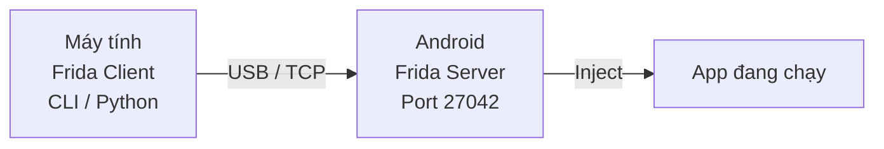
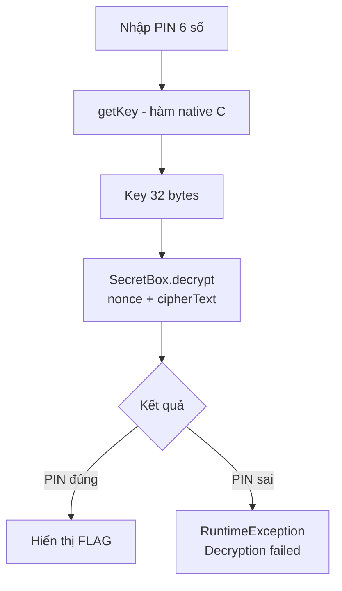
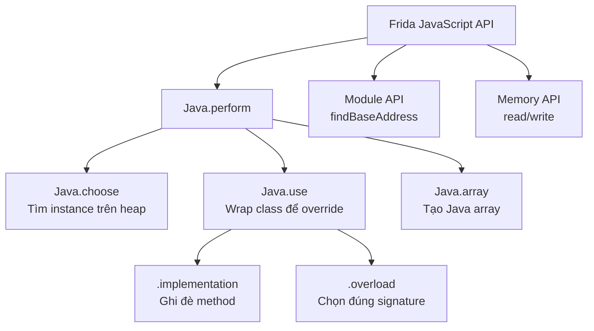

# L5: Android Mobile Pentest 101

## Bài 7 – Hooking Với Frida 

Đây là tài liệu giáo dục về **Dynamic Instrumentation** trên Android, sử dụng Frida để phân tích và kiểm thử bảo mật ứng dụng. Nội dung thuộc phạm vi học thuật/nghiên cứu bảo mật hợp pháp (CTF, pentesting).

---

## 1. Frida Là Gì?

Frida là một **Dynamic Instrumentation Toolkit** — công cụ cho phép bạn can thiệp vào một ứng dụng đang chạy mà **không cần mã nguồn**, không cần biên dịch lại, không cần khởi động lại app.

Đối tượng sử dụng chính:

- Developers (debug, profiling)
- Reverse engineers
- Security researchers / Pentesters

### Đặc điểm nổi bật

| Tính năng | Mô tả |
|---|---|
| **Scriptable** | Inject script JavaScript vào process đang chạy |
| **Portable** | Hỗ trợ Windows, macOS, Linux, iOS, Android, QNX |
| **Free** | Mã nguồn mở, miễn phí hoàn toàn |
| **Battle-tested** | Được NowSecure dùng để phân tích app di động ở quy mô lớn |
| **No recompile** | Hook bất kỳ function nào, không cần source code |

> **Tài liệu chính thức:** [https://frida.re/docs/javascript-api/](https://frida.re/docs/javascript-api/)

---

## 2. Cài Đặt Frida

### 2.1 Phía Client (máy thật — máy tính của bạn)

```bash
# Cài Frida CLI tools (frida-ps, frida-trace, ...)
pip3 install frida-tools

# Cài Python bindings để dùng trong script Python
pip3 install frida
```

Kiểm tra cài thành công:

```bash
frida
# Output: Usage: frida [options] target ...
```

```python
python3 -c "import frida; print('OK')"
```

### 2.2 Phía Server (thiết bị Android / máy ảo)

Frida hoạt động theo mô hình **client–server**:



**Bước cài đặt frida-server:**

1. Tải `frida-server` từ [https://github.com/frida/frida/releases](https://github.com/frida/frida/releases) — chọn đúng kiến trúc (`x86`, `arm`, `arm64`, `x86_64`)
2. **Lưu ý quan trọng:** Version frida-server phải **khớp** với version frida trên máy client

```bash
# Đẩy binary lên thiết bị
adb push frida-server-12.1.2-android-x86 /data/local/tmp/frida-server

# Cấp quyền thực thi và chạy
adb shell
chmod 755 /data/local/tmp/frida-server
/data/local/tmp/frida-server &
```

**Kiểm tra kết nối:**

```bash
frida-ps -U
# -U = USB device
# Nếu thành công sẽ thấy danh sách PID và tên process
```

---

## 3. Python Bindings — Cơ Bản

### 3.1 Cấu trúc script tổng quát

Một Frida Python script có cấu trúc gồm 2 phần rõ ràng:

=== "Python (host)"

    ```python
    import frida
    import time

    # 1. Lấy thông tin thiết bị qua USB
    device = frida.get_usb_device()

    # 2. Spawn (khởi động) app — trả về PID
    pid = device.spawn("com.android.insecurebankv2")
    device.resume(pid)

    # 3. Đợi một chút để app khởi động xong
    time.sleep(1)

    # 4. Attach vào process
    session = device.attach(pid)

    # 5. Inject JavaScript hook vào process
    script = session.create_script(hook_script)
    script.load()

    input("Nhấn Enter để thoát...")
    ```

=== "JavaScript (inject vào app)"

    ```javascript
    // hook_script là chuỗi JavaScript
    hook_script = """
    Java.perform(function () {
        // Toàn bộ code Frida API nằm trong Java.perform()
        // Đây là bắt buộc — nó đảm bảo JVM đã sẵn sàng
        console.log("Hook đã được inject!");
    });
    """
    ```

!!! info "Tại sao cần `Java.perform()`?"
    `Java.perform()` đảm bảo Frida đợi cho đến khi Dalvik/ART Virtual Machine sẵn sàng trước khi thực thi code. Nếu bỏ qua, bạn sẽ gặp lỗi vì JVM chưa khởi động xong.

---

## 4. Ví Dụ 1 — Gọi Hàm Decrypt (Java.choose)

### 4.1 Tình huống

Trong app `InsecureBankv2`, class `CryptoClass` có hàm `aesDeccryptedString(String)` nhận vào ciphertext và trả về plaintext. Thay vì phải hiểu toàn bộ thuật toán mã hóa bên trong, ta có thể **gọi thẳng hàm đó** thông qua Frida.

### 4.2 Java.choose() là gì?

`Java.choose(className, callbacks)` **quét trên Java heap** để tìm các instance đang tồn tại của một class. Khi tìm thấy, callback `onMatch` được gọi với instance đó — bạn có thể dùng instance này để gọi bất kỳ method nào.

```
Java.choose(className, {
    onMatch: function(instance) { ... },  // Gọi với mỗi instance tìm thấy
    onComplete: function() { ... }         // Gọi sau khi quét xong
})
```

### 4.3 Script hoàn chỉnh

```python
import frida, time

device = frida.get_usb_device()
pid = device.spawn("com.android.insecurebankv2")
device.resume(pid)
time.sleep(1)
session = device.attach(pid)

hook_script = """
Java.perform(function () {
    console.log("Bắt đầu hook...");

    Java.choose('com.android.insecurebankv2.CryptoClass', {
        onMatch: function(instance) {
            console.log("Tìm thấy instance: " + instance);

            // Gọi hàm decrypt với ciphertext cần giải mã
            var result = instance.aesDeccryptedString('DTrW2VXjSoFdgOe6lfHxJg==');
            console.log("Kết quả decrypt: " + result);
        },
        onComplete: function() {
            console.log("Quét heap xong.");
        }
    });
});
"""

script = session.create_script(hook_script)
script.load()
input("...")
```

**Kết quả:**
```
Bắt đầu hook...
Tìm thấy instance: com.android.insecurebankv2.CryptoClass@zaec3a8b
Kết quả decrypt: Dinesh@123$
```

!!! success "Nhận xét"
    Không cần reverse engineer thuật toán AES, không cần tìm key — chỉ cần tìm instance class đang tồn tại trên heap và gọi hàm như bình thường. Đây là sức mạnh của Dynamic Instrumentation.

---

## 5. Ví Dụ 2 — Override Hàm (Java.use + implementation)

### 5.1 Tình huống

App có hàm `doesSuperuserApkExist()` kiểm tra xem thiết bị có bị root không. Mục tiêu: **bắt buộc hàm này trả về `true`** để app hiển thị "Rooted Device".

### 5.2 Java.use() là gì?

`Java.use(className)` trả về một **JavaScript wrapper** của Java class. Từ đó bạn có thể:

- Tạo instance mới: `ClassName.$new()`
- **Override implementation** của bất kỳ method nào

```javascript
var MyClass = Java.use("com.example.MyClass");

// Override method
MyClass.someMethod.implementation = function(arg1, arg2) {
    // Code này chạy THAY VÌ code gốc
    console.log("Method bị hook với arg: " + arg1);
    return "giá trị giả";
};
```

### 5.3 Script hoàn chỉnh

```python
hook_script = """
Java.perform(function () {
    console.log("Hook root detection...");

    var PostLogin = Java.use('com.android.insecurebankv2.PostLogin');

    // Override hàm kiểm tra root — luôn trả về true
    PostLogin.doesSuperuserApkExist.implementation = function(path) {
        console.log("doesSuperuserApkExist bị hook! Trả về true.");
        return true;
    };
});
"""
```

**So sánh trước và sau khi hook:**

| Trạng thái | Kết quả hiển thị |
|---|---|
| Bình thường | "Device not Rooted!" |
| Đã hook | "Rooted Device!!" |

---

## 6. Ví Dụ 3 — Bypass Client-Side Validation (overload)

### 6.1 Tình huống

App `InsecureBankv2` kiểm tra độ phức tạp của password khi đổi mật khẩu bằng regex:

```
((?=.*\d)(?=.*[a-z])(?=.*[A-Z])(?=.*[@#$%]).{6,20})
```

Regex này yêu cầu: có số, chữ thường, chữ hoa, ký tự đặc biệt, độ dài 6–20 ký tự. Nếu nhập "1234" sẽ bị từ chối.

### 6.2 Vấn đề với overload

Class `java.util.regex.Pattern` có **nhiều phiên bản** của hàm `compile`:

- `compile(String regex)`
- `compile(String regex, int flags)`

Nếu ghi đè trực tiếp `Pattern.compile.implementation`, Frida không biết phải hook version nào → lỗi. Giải pháp: dùng `.overload()` để chỉ định chính xác.

```javascript
// Sai — ambiguous
Pattern.compile.implementation = function(x) { ... }

// Đúng — chỉ định rõ signature
Pattern.compile.overload("java.lang.String").implementation = function(x) { ... }
```

### 6.3 Script hoàn chỉnh

```python
hook_script = """
Java.perform(function () {
    var Pattern = Java.use('java.util.regex.Pattern');

    // Hook đúng overload compile(String)
    Pattern.compile.overload("java.lang.String").implementation = function(regex) {
        console.log("Regex gốc bị chặn: " + regex);
        // Thay regex phức tạp bằng ".*" — chấp nhận mọi input
        return this.compile(".*");
    };
});
"""
```

**Kết quả:** Password "1234" được chấp nhận và đổi thành công.

!!! warning "Lưu ý"
    Kỹ thuật này chứng minh tại sao **client-side validation không phải là biện pháp bảo mật**. Server PHẢI validate độc lập với client.

---

## 7. Lab — CTF Challenge: Brute Force PIN

### 7.1 Mô tả bài toán

App `challenge2_release.apk` (từ HackerOne H1-702 2018 CTF) yêu cầu nhập một PIN 6 chữ số chính xác để giải mã flag. Cần:

1. Reverse engineer app
2. Hiểu cơ chế mã hóa
3. Dùng Frida brute-force PIN

### 7.2 Phân tích tĩnh

Từ code decompile của `MainActivity`:

```java
// Ciphertext cố định được hardcode trong app
this.cipherText = new Hex().decode(
    "9646D13EC8F8617D1CEA1CF4334940824C700ADF6A7A..." 
);

// Hàm native — được implement trong C/C++ (libnative-lib.so)
public native byte[] getKey(String pin);
public native void resetCoolDown();
```

Trong `onComplete` (khi nhập đủ 6 số):

```java
public void onComplete(String pin) {
    byte[] key = this.getKey(pin);          // Tính key từ PIN
    SecretBox box = new SecretBox(key);
    byte[] nonce = "aabbccddeeffgghhaabbccdd".getBytes();
    try {
        byte[] decrypted = box.decrypt(nonce, this.cipherText);
        Log.d("DECRYPTED", new String(decrypted, StandardCharsets.UTF_8));
    } catch (RuntimeException e) {
        Log.d("PROBLEM", "Unable to decrypt text");
    }
}
```

**Luồng xử lý:**



### 7.3 Vấn đề Anti-Brute-Force

Khi phân tích `libnative-lib.so` bằng IDA Pro, phát hiện trong hàm `getKey` có một **biến đếm** tại địa chỉ `dword_2004`:

```c
// Pseudo-code từ IDA
int getKey(JNIEnv* env, jobject thiz, jstring pin) {
    counter++;                    // Tăng biến đếm mỗi lần gọi
    if (counter >= 51) {
        // Dừng lại — chống brute force
        JUMPOUT(dword_2004, 51, loc_A79);
    }
    // Tính toán key...
    return sub_A20(...);
}
```

→ Sau 51 lần gọi `getKey`, hàm bị block. Giải pháp: gọi `resetCoolDown()` sau mỗi 50 lần.

### 7.4 Script Brute Force

```python
import frida, time, sys

device = frida.get_usb_device()
pid = device.spawn("com.hackerone.mobile.challenge2")
device.resume(pid)
time.sleep(1)
session = device.attach(pid)

hook_script = """
// Padding số thành chuỗi 6 chữ số: 918 -> "000918"
function rpad(width, string, padding) {
    return (width <= string.length) ? string : rpad(width, padding + string, padding);
}
function genPin(pin) {
    return rpad(6, pin.toString(), '0');
}

setTimeout(function() {
    Java.perform(function() {
        // Ciphertext (hardcoded trong app)
        var cipherText = Java.array('byte', [
            (byte)0x96, (byte)0x46, (byte)0xD1, (byte)0x3E, ...
        ]);
        // Nonce
        var nonce = Java.array('byte', [
            97,97,98,98,99,99,100,100,101,101,102,102,
            103,103,104,104,97,97,98,98,99,99,100,100
        ]);

        var SecretBox = Java.use("org.libsodium.jni.crypto.SecretBox");

        Java.choose("com.hackerone.mobile.challenge2.MainActivity", {
            onMatch: function(instance) {
                console.log("[*] Found instance: " + instance);
                var counter = 0;
                var flag = false;

                for (var i = 999999; i >= 0; i--) {
                    var pin = genPin(i.toString());
                    var key = instance.getKey(pin);
                    console.log("Trying PIN: " + pin + " | Key: " + instance.bytesToHex(key));

                    // Thử decrypt với key này
                    try {
                        var result = SecretBox.$new(key).decrypt(nonce, cipherText);
                        // Nếu không throw exception -> decrypt thành công!
                        flag = true;
                    } catch(err) {
                        // PIN sai -> tiếp tục
                    } finally {
                        if (flag) {
                            console.log("[!!!] FOUND PIN: " + pin);
                            break;
                        }
                    }

                    // Reset cooldown sau mỗi 50 lần để tránh bị block
                    counter++;
                    if (counter == 50) {
                        instance.resetCoolDown();
                        counter = 0;
                    }
                }
            },
            onComplete: function() {
                console.log("Done.");
            }
        });
    });
}, 0);
"""

script = session.create_script(hook_script)
script.load()
input("...")
```

**Kết quả tìm thấy:**
```
[!!!] FOUND PIN: 918264
```

Nhập PIN `918264` vào app → logcat hiển thị:
```
D DECRYPTED: flag{wow_yall_called_a_lot_of_func$}
```

---

## 8. Bonus — Ghi Đè Memory Trực Tiếp (Không Dùng resetCoolDown)

### 8.1 Ý tưởng

Thay vì gọi `resetCoolDown()` để reset biến đếm, ta có thể **trực tiếp ghi giá trị vào bộ nhớ** tại địa chỉ của biến đếm đó.

### 8.2 Các bước

**Bước 1:** Tìm base address của thư viện native

```javascript
var libnative = Module.findBaseAddress("libnative-lib.so");
console.log("Base address: " + libnative);
```

**Bước 2:** Tính địa chỉ của biến đếm

Từ IDA biết biến đếm ở offset `0x2004` trong file:

```javascript
// Virtual address = base address + offset
var counter_address = libnative.add(ptr("0x2004"));
```

**Bước 3:** Ghi giá trị 0 vào địa chỉ đó

```javascript
Memory.writeInt(counter_address, 0);
// Biến đếm bị reset về 0 mà không cần gọi hàm resetCoolDown()
```

### 8.3 Một số Memory API hữu dụng

| API | Mô tả |
|---|---|
| `Memory.readInt(address)` | Đọc số nguyên 32-bit |
| `Memory.writeInt(address, value)` | Ghi số nguyên 32-bit |
| `Memory.readByteArray(address, length)` | Đọc mảng byte |
| `Memory.writeByteArray(address, bytes)` | Ghi mảng byte |
| `Module.findBaseAddress(name)` | Tìm base address của module |

---

## 9. Tổng Kết Các API Quan Trọng



| API | Mục đích | Use case |
|---|---|---|
| `Java.perform(fn)` | Wrapper bắt buộc | Mọi Frida script |
| `Java.choose(class, cb)` | Tìm instance đang chạy | Gọi method của instance có sẵn |
| `Java.use(class)` | Wrap class | Override method |
| `.implementation` | Ghi đè method | Bypass check, fake return value |
| `.overload(sig)` | Chọn overload cụ thể | Khi có nhiều hàm cùng tên |
| `Module.findBaseAddress` | Tìm địa chỉ module | Memory manipulation |
| `Memory.writeInt` | Ghi vào memory | Patch biến native |

---

## 10. Kiến Thức Mở Rộng

### 10.1 Frida vs các công cụ tương tự

| Công cụ | Loại | Ưu điểm | Nhược điểm |
|---|---|---|---|
| **Frida** | Dynamic | Realtime, scriptable, cross-platform | Bị detect bởi một số app |
| **Xposed Framework** | Static hook | Persistent | Cần root, chỉ Android |
| **JADX + patch smali** | Static | Không cần root | Phức tạp, cần rebuild APK |
| **objection** | CLI wrapper của Frida | Dễ dùng | Ít linh hoạt hơn |

### 10.2 Phát hiện Frida (Frida Detection)

Nhiều app banking và game hiện tại cố detect Frida. Các kỹ thuật phổ biến:

- Kiểm tra port 27042 đang mở
- Kiểm tra tên process `/proc/*/maps` có `frida`
- Kiểm tra string `FRIDA` trong memory

Để bypass: dùng Frida với custom server port, hoặc dùng các fork như **Gadget mode** (inject Frida như một shared library thay vì standalone server).

### 10.3 Frida Gadget — Không Cần Root

Frida Gadget cho phép embed Frida vào APK mà không cần root thiết bị:

1. Decompile APK
2. Thêm `frida-gadget.so` vào thư mục `lib/`
3. Chèn lệnh load library vào smali
4. Rebuild và sign APK

### 10.4 Tài nguyên học thêm

- **Frida Docs:** [https://frida.re/docs/](https://frida.re/docs/)
- **Objection (wrapper CLI):** [https://github.com/sensepost/objection](https://github.com/sensepost/objection)
- **InsecureBankv2:** [https://github.com/dineshshetty/Android-InsecureBankv2](https://github.com/dineshshetty/Android-InsecureBankv2)
- **Mobile Security Framework (MobSF):** [https://github.com/MobSF/Mobile-Security-Framework-MobSF](https://github.com/MobSF/Mobile-Security-Framework-MobSF)
- **OWASP Mobile Top 10:** [https://owasp.org/www-project-mobile-top-10/](https://owasp.org/www-project-mobile-top-10/)
