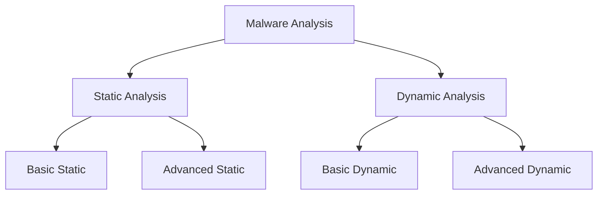
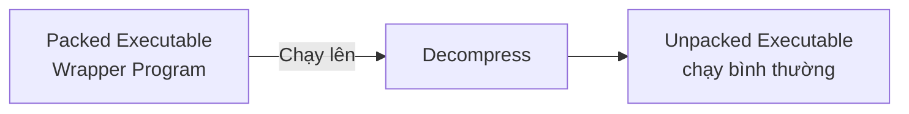
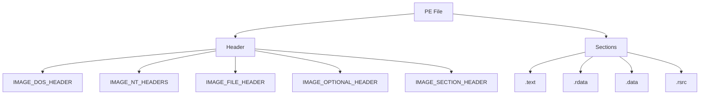
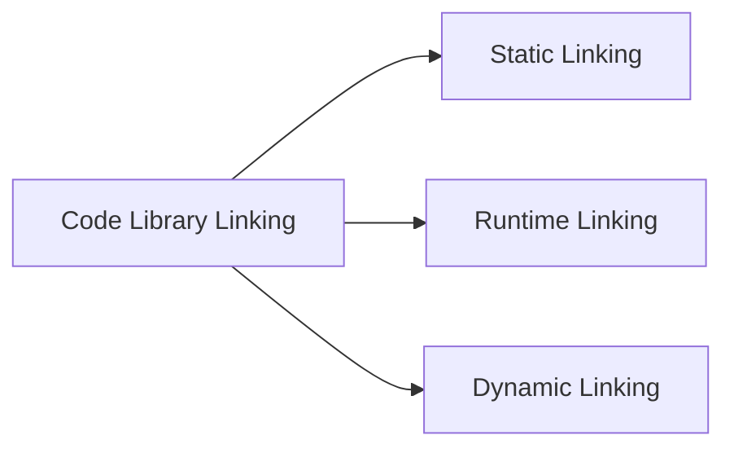

# Chương 0: Malware Analysis Primer

### Malware là gì?

Bất kỳ phần mềm nào gây hại cho người dùng, máy tính hoặc mạng đều được gọi là **malware**, bao gồm: virus, trojan horse, worm, rootkit, scareware, spyware.

---

### Mục tiêu phân tích Malware

Phân tích malware nhằm cung cấp thông tin để phản hồi một vụ xâm nhập mạng:

- Xác định chính xác điều gì đã xảy ra
- Tìm ra tất cả máy và file bị nhiễm
- Xác định **malware có thể làm gì**, **cách phát hiện** nó trên mạng, và **cách đo lường / kiểm soát thiệt hại**

Sau khi có signatures, mục tiêu cuối cùng là hiểu **malware hoạt động như thế nào** — câu hỏi thường được ban lãnh đạo cấp cao đặt ra nhất sau một vụ xâm nhập lớn.

#### Host-based vs Network Signatures

| Loại | Mô tả |
|---|---|
| **Host-based signatures** | Phát hiện mã độc trên máy nạn nhân. Tập trung vào **hành vi** của malware (file tạo ra, thay đổi registry), không phải đặc điểm của chính malware → hiệu quả hơn với malware thay hình hoặc đã bị xóa |
| **Network signatures** | Phát hiện mã độc qua giám sát lưu lượng mạng. Có thể tạo mà không cần phân tích malware, nhưng **kết hợp phân tích** cho tỉ lệ phát hiện cao hơn, false positive thấp hơn |

---

### Các kỹ thuật phân tích Malware

```
Static Analysis  ──► Không chạy malware
Dynamic Analysis ──► Chạy malware thực tế
```

Mỗi loại lại chia thành **Basic** và **Advanced**:



#### Basic Static Analysis
- Kiểm tra file thực thi **mà không xem instruction thực tế**
- Xác nhận file có độc hại không, cung cấp thông tin chức năng, tạo network signature đơn giản
- Nhanh, dễ thực hiện, nhưng **không hiệu quả với malware phức tạp** và có thể bỏ sót hành vi quan trọng

#### Basic Dynamic Analysis
- Chạy malware, quan sát hành vi để gỡ nhiễm hoặc tạo signature
- Phải thiết lập môi trường an toàn trước khi chạy
- Không cần kiến thức lập trình sâu, nhưng không hiệu quả với mọi malware

#### Advanced Static Analysis
- **Reverse-engineering** nội dung malware bằng disassembler
- Xem program instruction trực tiếp → biết **chính xác** chương trình làm gì
- Yêu cầu kiến thức về disassembly, code constructs, Windows OS concepts

#### Advanced Dynamic Analysis
- Dùng **debugger** để kiểm tra trạng thái nội bộ của malware đang chạy
- Hữu ích nhất khi cần thông tin khó thu thập bằng kỹ thuật khác
- Thường kết hợp với Advanced Static Analysis để phân tích toàn diện

---

### Các loại Malware

| Loại | Mô tả |
|---|---|
| **Backdoor** | Cài lên máy để attacker truy cập, thực thi lệnh với ít/không xác thực |
| **Botnet** | Như backdoor, nhưng tất cả máy bị nhiễm nhận lệnh từ một C&C server duy nhất |
| **Downloader** | Chỉ tồn tại để tải malware khác về; thường được cài đầu tiên khi attacker xâm nhập |
| **Information-stealing malware** | Thu thập thông tin từ máy nạn nhân (sniffer, keylogger, password hash grabber) |
| **Launcher** | Dùng kỹ thuật phi truyền thống để khởi chạy malware khác nhằm ẩn mình |
| **Rootkit** | Che giấu sự tồn tại của malware khác; thường ghép với backdoor |
| **Scareware** | Làm người dùng hoảng sợ để mua "phần mềm" giả mạo AV |
| **Spam-sending malware** | Dùng máy nạn nhân để gửi spam, tạo thu nhập cho attacker |
| **Worm / Virus** | Tự sao chép và lây nhiễm các máy khác |

> **Lưu ý:** Malware thường **kết hợp nhiều loại** — ví dụ: có cả keylogger lẫn worm component.

#### Mass vs Targeted Malware

| | Mass Malware | Targeted Malware |
|---|---|---|
| Ví dụ | Scareware | Backdoor tùy chỉnh |
| Mục tiêu | Nhiều máy nhất có thể | Một tổ chức cụ thể |
| Mức độ phổ biến | Phổ biến nhất | Ít phổ biến |
| Độ tinh vi | Thấp hơn | Rất cao |
| Khả năng phát hiện bởi AV | Cao | Thấp (không có trong database) |

!!! warning "Targeted malware nguy hiểm hơn"
    Vì không phổ biến rộng rãi, các sản phẩm bảo mật thông thường sẽ **không bảo vệ** được bạn. Không có phân tích chi tiết, gần như không thể bảo vệ mạng hay gỡ nhiễm.

---

### Quy tắc chung khi phân tích Malware

!!! tip "Rule 1 — Đừng sa lầy vào chi tiết"
    Malware thường rất lớn và phức tạp. Tập trung vào **tính năng chính**. Khi gặp phần khó, hãy nắm tổng quan trước rồi mới đào sâu.

!!! tip "Rule 2 — Không có một cách duy nhất"
    Mỗi tình huống khác nhau. Nếu một tool không hiệu quả, thử tool khác. Bí thì chuyển sang vấn đề khác, phân tích từ góc độ khác.

!!! tip "Rule 3 — Malware analysis là cuộc chơi mèo vờn chuột"
    Khi kỹ thuật phân tích mới được phát triển, tác giả malware phản hồi bằng kỹ thuật mới để cản trở phân tích. Analyst phải nhận biết, hiểu và vô hiệu hóa các kỹ thuật đó.

---

## Chương 1 — Basic Static Techniques

### Tổng quan

**Static analysis** = phân tích code hoặc cấu trúc chương trình để xác định chức năng **mà không chạy chương trình**.

Các kỹ thuật chính trong chương:

- Dùng antivirus tools xác nhận tính độc hại
- Dùng hashes để nhận dạng malware
- Trích xuất thông tin từ strings, functions, headers của file

---

### Antivirus Scanning

**Bước đầu tiên tốt**: chạy qua nhiều chương trình antivirus.

AV tools hoạt động dựa trên:

- **File signatures** — database chứa đoạn code đáng ngờ đã biết
- **Heuristics** — phân tích hành vi và pattern-matching

**Hạn chế của AV:**

- Malware writer dễ dàng sửa code → thay đổi signature → bypass AV
- Malware hiếm gặp không có trong database
- Heuristics có thể bị bypass bởi malware mới, độc đáo

!!! info "VirusTotal"
    [virustotal.com](https://www.virustotal.com) cho phép upload file để quét bằng **nhiều engine AV cùng lúc**. Báo cáo gồm: số engine phát hiện, tên malware, và thông tin bổ sung nếu có.

---

### Hashing — Dấu vân tay của Malware

**Hashing** là phương pháp phổ biến để **nhận dạng duy nhất** một mẫu malware.

- **MD5** — phổ biến nhất trong malware analysis
- **SHA-1** — cũng hay được dùng

```bash
# Ví dụ dùng md5deep
md5deep c:\WINDOWS\system32\sol.exe
# Output: 373e7a863a1a345c60edb9e20ec3231  c:\WINDOWS\system32\sol.exe
```

**Ứng dụng của hash:**

- Dùng làm **nhãn** nhận dạng malware
- **Chia sẻ** với analyst khác
- **Tìm kiếm online** xem file đã được phân tích chưa

---

### Finding Strings

**String** trong chương trình = chuỗi ký tự như URL, thông báo lỗi, registry key, IP address...

Tìm strings là cách đơn giản để **đoán chức năng** của chương trình.

Tool: **Strings** (Sysinternals)

#### ASCII vs Unicode

| | ASCII | Unicode |
|---|---|---|
| Bytes/ký tự | 1 byte | 2 bytes |
| Kết thúc | 1 byte `0x00` | 2 bytes `0x00 0x00` |

```
ASCII "BAD":  42 41 44 00
Unicode "BAD": 42 00 41 00 44 00 00 00
```

Strings tool tìm chuỗi **từ 3 ký tự trở lên**, bất kể context. Một số byte có thể bị nhận diện nhầm là string → người dùng phải tự lọc.

#### Ví dụ phân tích strings thực tế

```
C:> strings bp6.ex_

VP3          ← vô nghĩa (ignore)
VW3          ← vô nghĩa (ignore)
99.124.22.1  ← IP address → malware sẽ kết nối tới đây
GetLayout    ← Windows function từ GDI32.DLL
GDI32.DLL    ← tên DLL phổ biến
SetLayout    ← Windows function
Mail system DLL is invalid.!Send Mail failed to send message.
             ← error message → malware gửi email, phụ thuộc vào mail DLL
```

!!! tip "Error messages thường chứa thông tin hữu ích nhất"
    Ví dụ trên cho biết: malware gửi tin nhắn qua email và phụ thuộc vào một mail system DLL khác.

---

### Packed & Obfuscated Malware

| Kỹ thuật | Mô tả |
|---|---|
| **Obfuscated** | Malware cố ẩn quá trình thực thi |
| **Packed** | Subset của obfuscated — chương trình bị **nén lại** và không thể phân tích trực tiếp |

**Dấu hiệu nhận biết:**

- Legitimate programs → **rất nhiều strings**
- Packed/obfuscated → **rất ít strings**
- Packed code thường chứa ít nhất: `LoadLibrary` và `GetProcAddress`



Khi phân tích static, chỉ thấy được **wrapper program** nhỏ, không thấy code thật.

#### Phát hiện Packer với PEiD

**PEiD** — tool phát hiện loại packer/compiler được dùng để build ứng dụng.

!!! warning
    PEiD đã ngừng phát triển từ tháng 4/2011, nhưng vẫn là tool tốt nhất hiện tại cho packer detection. Một số plug-in của PEiD có thể **chạy malware mà không cảnh báo** — luôn dùng trong môi trường an toàn!

#### Unpack với UPX

UPX là packer phổ biến nhất. Unpack rất đơn giản:

```bash
upx -d PackedProgram.exe
```

---

### Portable Executable (PE) File Format

PE format được dùng bởi Windows executables, object code, và DLLs. Gần như **mọi file executable trên Windows** đều dùng định dạng PE.



#### PE File Sections

| Section | Nội dung |
|---|---|
| `.text` | **Code thực thi** — CPU chạy code ở đây; section duy nhất nên có quyền execute |
| `.rdata` | Import/export info (read-only data); đôi khi tách thành `.idata` và `.edata` |
| `.data` | Global data của chương trình, truy cập được từ mọi nơi |
| `.rsrc` | Resources: icon, image, menu, string — không phải là code |
| `.pdata` | Chỉ có trong 64-bit executable; chứa exception-handling info |
| `.reloc` | Thông tin để relocation của library files |

!!! note "Section names có thể khác nhau giữa các compiler"
    Visual Studio dùng `.text`, Borland Delphi dùng `CODE`. Windows dùng thông tin khác trong PE header (không phải tên) để xác định cách dùng section. Section names đôi khi bị obfuscate → gây khó phân tích.

---

### Linked Libraries và Functions

**Imports** = các function mà một chương trình sử dụng nhưng được lưu trong chương trình khác (code library).

#### 3 loại linking



| Loại | Đặc điểm | Relevance với malware |
|---|---|---|
| **Static linking** | Toàn bộ code library được copy vào executable → file to lên; phổ biến trong UNIX/Linux | Khó phân biệt library code với code gốc; không có dấu hiệu trong PE header |
| **Runtime linking** | Chỉ kết nối đến library khi cần dùng function, không phải lúc khởi động | **Rất phổ biến trong malware**, nhất là packed/obfuscated; dùng `LoadLibrary` + `GetProcAddress` → không biết statically functions nào được link |
| **Dynamic linking** | Host OS tìm library khi load chương trình; phổ biến và dễ phân tích nhất | **Thú vị nhất với analyst** — PE header lưu rõ mọi library và function được dùng |

!!! danger "Runtime linking với LoadLibrary/GetProcAddress"
    Khi malware dùng `LoadLibrary` + `GetProcAddress`, bạn **không thể biết statically** function nào đang được gọi — đây là lý do tại sao runtime linking được malware ưa dùng.

#### Công cụ: Dependency Walker

Liệt kê **dynamically linked functions** trong executable.

Ví dụ phân tích `SERVICES.EX_`:
- Import `KERNEL32.DLL` → có `CreateProcessA` → **sẽ tạo process khác** → cần theo dõi khi chạy
- Import `WS2_32.DLL` → **networking** → kết nối mạng

#### Common DLLs — ý nghĩa

| DLL | Ý nghĩa |
|---|---|
| `Kernel32.dll` | Core Windows: memory, file, hardware |
| `Advapi32.dll` | Service Manager, Registry |
| `User32.dll` | UI: buttons, scroll bars, user input |
| `Gdi32.dll` | Graphics |
| `Ntdll.dll` | Interface trực tiếp với Windows kernel; nếu import trực tiếp → có thể đang làm gì đó không bình thường (ẩn process, v.v.) |
| `WSock32.dll` / `Ws2_32.dll` | Networking |
| `Wininet.dll` | High-level networking: FTP, HTTP, NTP |

!!! info "Function naming conventions"
    - Suffix `Ex` (vd: `CreateWindowEx`) → phiên bản cập nhật của function cũ
    - Suffix `A` hoặc `W` (vd: `CreateDirectoryW`) → `A` = ASCII string, `W` = Wide (Unicode) string; **bỏ suffix này khi tra MSDN**

---

### Static Analysis in Practice

#### Case 1: PotentialKeylogger.exe (Unpacked)

Có rất nhiều imports → **không bị packed**.

Phân tích imports tiết lộ:

| DLL | Clues |
|---|---|
| `Kernel32.dll` | `OpenProcess`, `ReadFile`, `WriteFile` → thao tác process và file; `FindFirstFile`/`FindNextFile` → duyệt thư mục |
| `User32.dll` | Nhiều GUI functions → có UI; **`SetWindowsHookEx`** → keylogging! **`RegisterHotKey`** → hotkey toàn hệ thống |
| `Advapi32.dll` | Registry functions → kiểm tra strings tìm registry key |

Tìm thấy string: `Software\Microsoft\Windows\CurrentVersion\Run` → **tự động chạy khi Windows khởi động**

Exports: `LowLevelKeyboardProc`, `LowLevelMouseProc` → xác nhận keylogging qua `SetWindowsHookEx`

!!! success "Kết luận từ static analysis"
    - Keylogger cục bộ dùng `SetWindowsHookEx` để ghi lại keystroke
    - Có GUI, chỉ hiện với attacker qua hotkey (`RegisterHotKey`)
    - Tự chạy khi Windows boot qua registry key `CurrentVersion\Run`

#### Case 2: PackedProgram.exe (Packed — Dead End)

Chỉ có vài imports:

```
Kernel32.dll:        User32.dll:
GetModuleHandleA     MessageBoxA
LoadLibraryA
GetProcAddress
ExitProcess
VirtualAlloc
VirtualFree
```

→ Quá ít imports, không có strings → **bị packed**. Basic static analysis không thể tiến xa hơn. Cần dynamic analysis (Chapter 3) hoặc unpacking (Chapter 18).

---

### Phân tích PE Header chi tiết

#### IMAGE_FILE_HEADER

Chứa **Time Date Stamp** — thời điểm compile:

- Compile time cũ → có thể đã có AV signature
- Compile time mới → malware mới, AV chưa có signature
- **Tất cả Delphi programs đều có compile time: June 19, 1992** — nếu thấy ngày này, đây là Delphi program
- Competent malware writer có thể **fake compile time** — nếu thấy ngày vô lý, có thể đã bị giả mạo

#### IMAGE_OPTIONAL_HEADER

- `IMAGE_SUBSYSTEM_WINDOWS_CUI` → **console** program (chạy trong command window)
- `IMAGE_SUBSYSTEM_WINDOWS_GUI` → **GUI** program

#### IMAGE_SECTION_HEADER — Phát hiện Packing

| Trường | Ý nghĩa |
|---|---|
| **Virtual Size** | Dung lượng trong memory khi load |
| **Size of Raw Data** | Dung lượng trên disk |

Bình thường: hai giá trị gần bằng nhau.

!!! danger "Dấu hiệu packed"
    Nếu **Virtual Size >> Size of Raw Data** (đặc biệt ở `.text` section) → section chiếm nhiều RAM hơn trên disk → **dấu hiệu của packed code**

**PotentialKeylogger.exe** (bình thường):

| Section | Virtual Size | Raw Size |
|---|---|---|
| .text | 7AF5 | 7C00 |
| .rdata | 1AF5 | 1C00 |
| .rsrc | 72B8 | 7400 |

**PackedProgram.exe** (packed):

| Section | Virtual Size | Raw Size |
|---|---|---|
| .text | A000 | **0000** ← bất thường! |
| .data | 3000 | 0000 |
| .rdata | 4000 | 0000 |
| Dijfpds | 20000 | 0000 |
| .sdfuok | 34000 | 3313F |

Section names lạ (`Dijfpds`, `Kijijl`) + `.text` Raw Size = 0 → packer sẽ giải nén code vào `.text` section khi chạy.

---

### Resource Section với Resource Hacker

Tool **Resource Hacker** dùng để duyệt `.rsrc` section.

Các subsection hữu ích cho malware analysis:

| Subsection | Thông tin |
|---|---|
| **Icon** | Icon hiện trong file listing |
| **Menu** | Tên và nội dung tất cả menus → gợi ý chức năng |
| **Dialog** | UI dialogs → nhìn là biết chương trình làm gì |
| **String Table** | Strings bổ sung |
| **Version Info** | Version, company name, copyright |

!!! note
    Malware đôi khi **nhúng executable hoặc driver** vào `.rsrc` section và giải nén trước khi chạy. Resource Hacker cho phép extract các file này để phân tích riêng.

---

### Tổng kết thông tin từ PE Header

| Field | Thông tin |
|---|---|
| Imports | Functions từ library khác mà malware sử dụng |
| Exports | Functions của malware được thiết kế để gọi từ ngoài |
| Time Date Stamp | Thời điểm compile |
| Sections | Tên sections, kích thước trên disk và trong memory |
| Subsystem | Console hay GUI |
| Resources | Strings, icons, menus, thông tin khác |

---

## Câu hỏi ôn tập

??? question "1. Sự khác nhau giữa static và dynamic analysis là gì?"
    - **Static analysis**: Kiểm tra malware **mà không chạy** nó. Phân tích cấu trúc file, strings, imports, exports.
    - **Dynamic analysis**: **Chạy malware thực tế** trong môi trường kiểm soát và quan sát hành vi.

??? question "2. Tại sao malware dùng runtime linking thay vì dynamic linking?"
    Với runtime linking (`LoadLibrary` + `GetProcAddress`), analyst **không thể biết statically** function nào được gọi vì chúng không xuất hiện trong PE header. Đây là kỹ thuật để che giấu chức năng.

??? question "3. Làm sao nhận biết một file bị packed?"
    Có 3 dấu hiệu chính:
    - **Rất ít strings** khi dùng Strings tool
    - **Rất ít imports** (chỉ có `LoadLibrary`, `GetProcAddress`, v.v.)
    - **Virtual Size >> Size of Raw Data** ở `.text` section trong PE header (hoặc Raw Size = 0)

??? question "4. SetWindowsHookEx có ý nghĩa gì trong malware analysis?"
    `SetWindowsHookEx` là function **phổ biến nhất** mà keyloggers dùng để nhận keyboard input. Khi thấy function này trong imports, có khả năng cao malware đang **thực hiện keylogging**.

??? question "5. Tại sao targeted malware nguy hiểm hơn mass malware?"
    - Targeted malware được **thiết kế riêng** cho một tổ chức cụ thể
    - **Không phổ biến rộng** → AV và security products không có signature
    - Thường **rất tinh vi**
    - Không có phân tích chi tiết, gần như **không thể phát hiện và gỡ bỏ**

??? question "6. Sự khác biệt giữa host-based signatures và network signatures?"
    - **Host-based**: Tập trung vào **hành vi** malware làm với hệ thống (file tạo ra, registry thay đổi). Không phụ thuộc vào đặc điểm file → hiệu quả với malware thay hình.
    - **Network signatures**: Phát hiện qua **giám sát traffic mạng**. Kết hợp với malware analysis cho kết quả tốt hơn (detection rate cao, false positive thấp).

??? question "7. Tại sao compile time trong PE header không hoàn toàn đáng tin cậy?"
    - **Delphi programs** luôn có compile time cố định: June 19, 1992 — không phản ánh thời điểm thực
    - Malware writer có thể **fake compile time** dễ dàng
    - Nếu compile time vô lý → nhiều khả năng đã bị giả mạo
