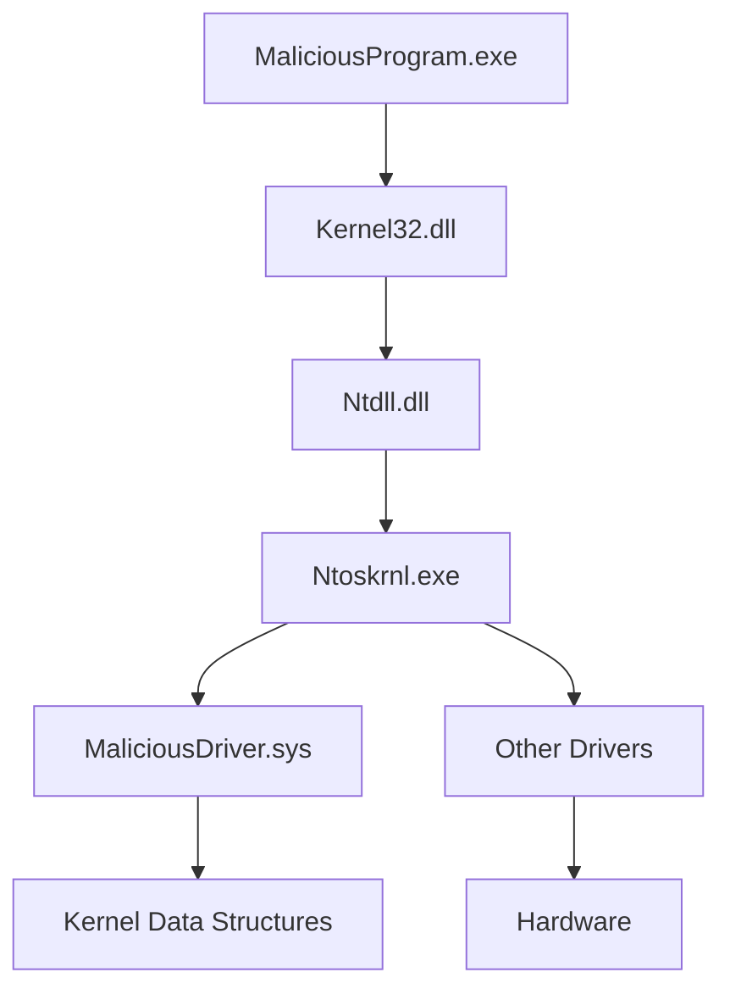

# Chương 10: Kernel Debugging với WinDbg

---

## 1. Tổng quan

WinDbg là debugger miễn phí từ Microsoft, phát âm là *"Windbag"*. Điểm mạnh lớn nhất so với OllyDbg là khả năng **kernel debugging** — debug trực tiếp nhân hệ điều hành Windows, phục vụ phân tích rootkit và malware kernel-mode.

---

## 2. Drivers và Kernel Code

### 2.1 Windows Device Driver là gì?

Driver cho phép third-party developer chạy code trong **Windows kernel**. Khác với DLL (chạy trong user space), driver tồn tại thường trực trong kernel và phản hồi các yêu cầu từ ứng dụng.

> **Lưu ý quan trọng:** Ứng dụng user-space **không giao tiếp trực tiếp** với driver, mà thông qua **device objects**.

**Ví dụ USB Flash Drive:**

```
App (user space)
    → gửi request đến "F: drive" (device object)
        → kernel định tuyến đến USB driver
            → driver xử lý phần cứng
```

Cắm thêm USB thứ hai → Windows tạo thêm device object "G: drive", cùng driver xử lý nhưng qua device object khác.

---

### 2.2 Cơ chế hoạt động của Driver



**Vòng đời của một driver:**

1. Driver được load vào kernel (giống DLL load vào process)
2. `DriverEntry` được gọi đầu tiên (tương đương `DLLMain` cho DLL)
3. `DriverEntry` nhận **driver object structure** từ Windows, đăng ký các **callback functions**
4. Driver tạo ra một **device** có thể truy cập từ user space
5. User-space app tương tác với driver qua device đó

**Khác biệt DLL vs Driver:**

| | DLL | Driver |
|---|---|---|
| Expose chức năng qua | Export table | Callback functions (đăng ký trong DriverEntry) |
| Chạy trong | Process (user space) | Kernel |
| Entry point | `DLLMain` | `DriverEntry` |

---

### 2.3 Các loại request phổ biến

**`DeviceIoControl`** — request phổ biến nhất từ malicious kernel component:
- User-space gửi buffer đầu vào tùy ý
- Nhận buffer đầu ra tùy ý
- Đây là cơ chế giao tiếp generic nhất giữa user space và kernel driver

**`ReadFile` / `WriteFile`** — cũng có thể định tuyến đến driver, khi app đọc/ghi file handle của device.

!!! warning "Khó trace"
    Calls từ user-mode đến kernel-mode driver rất khó trace vì toàn bộ OS code ở giữa đều tham gia vào quá trình xử lý.

!!! note "Malicious driver không cần user-mode component"
    Một số kernel malware không tạo device object — driver tự chạy độc lập hoàn toàn.

---

### 2.4 Malicious Driver tương tác với gì?

Malicious driver thường **không** điều khiển phần cứng, mà tương tác với:

- **`ntoskrnl.exe`** — code cho các core OS functions
- **`hal.dll`** — code tương tác với phần cứng chính

Malware import function từ một hoặc cả hai file này để thao túng kernel.

---

## 3. Thiết lập Kernel Debugging

### 3.1 Tại sao dùng VMware?

Khi debug kernel, **toàn bộ OS bị freeze** → không thể chạy debugger trên cùng máy. Giải pháp: dùng **VMware** với hai máy:

- **Guest VM** — máy bị debug (chạy malware)
- **Host** — máy chạy WinDbg

Giao tiếp qua **virtual serial port (named pipe)**.

---

### 3.2 Cấu hình boot.ini trên Guest VM (Windows XP)

```ini
[boot loader]
timeout=30
default=multi(0)disk(0)rdisk(0)partition(1)\WINDOWS

[operating systems]
; Entry bình thường
multi(0)disk(0)rdisk(0)partition(1)\WINDOWS="Microsoft Windows XP Professional"
/noexecute=optin /fastdetect

; Entry thêm vào để enable kernel debugging
multi(0)disk(0)rdisk(0)partition(1)\WINDOWS="Microsoft Windows XP Professional with Kernel Debugging"
/noexecute=optin /fastdetect /debug /debugport=COM1 /baudrate=115200
```

**Ý nghĩa các flag:**

| Flag | Ý nghĩa |
|---|---|
| `/debug` | Bật kernel debugging |
| `/debugport=COM1` | Cổng kết nối với debugger |
| `/baudrate=115200` | Tốc độ kết nối |

!!! tip
    Trước khi sửa `boot.ini`, **snapshot VM** lại để rollback nếu hỏng file.

!!! note
    Boot với debug-enabled không bắt buộc phải attach debugger. OS vẫn chạy bình thường nếu không có debugger nào kết nối.

---

### 3.3 Cấu hình VMware Serial Port (Named Pipe)

**Các bước:**

1. VM → Settings → Add → Serial Port
2. Chọn **Output to Named Pipe**
3. Nhập `\\.\pipe\com_1` làm tên pipe
4. Chọn **This end is the server** và **The other end is an application**
5. Tick **Yield CPU on poll**

---

### 3.4 Kết nối WinDbg từ Host

1. Mở WinDbg
2. **File → Kernel Debug → Tab COM**
3. Baud Rate: `115200`
4. Port: `\\.\pipe\com_1`
5. Tick checkbox **Pipe** → OK

!!! tip "Verbose output"
    Sau khi kết nối, bật verbose output để nhận thông báo mỗi khi driver được load/unload — rất hữu ích để phát hiện malicious driver.

---

## 4. Sử dụng WinDbg

WinDbg dùng **command-line interface** cho hầu hết chức năng.

### 4.1 Đọc Memory — lệnh `d`

```
dx addressToRead
```

| Option | Mô tả |
|---|---|
| `da` | Hiển thị dưới dạng ASCII text |
| `du` | Hiển thị dưới dạng Unicode text |
| `dd` | Hiển thị dưới dạng 32-bit double words |

**Ví dụ:**
```
da 0x401020
```
Đọc và hiển thị chuỗi ASCII tại địa chỉ `0x401020`.

---

### 4.2 Ghi Memory — lệnh `e`

```
ex addressToWrite dataToWrite
```
Dùng cùng ký tự `x` như lệnh `d`.

---

### 4.3 Arithmetic Operators

Có thể tính toán trực tiếp trên memory/register:

```
du dwo(esp+4)
```

- `esp+4` → địa chỉ của argument đầu tiên
- `dwo(...)` → dereference con trỏ 32-bit tại địa chỉ đó
- `du` → hiển thị wide character string tại địa chỉ đó

Hỗ trợ: `+`, `-`, `*`, `/`

---

### 4.4 Đặt Breakpoint — lệnh `bp`

```
bp GetProcAddress "da dwo(esp+8); g"
```

- Đặt breakpoint tại `GetProcAddress`
- Mỗi khi hit: tự động in argument thứ hai (tên function), rồi tiếp tục (`g` = go)
- **Không dừng chương trình** → nhanh hơn nhiều so với manual

Command string hỗ trợ:
- `.if` statements
- `.while` loops
- Scripts phức tạp

!!! warning "Gotcha với GetProcAddress"
    Argument thứ hai có thể là **string** hoặc **ordinal number**. Nếu là ordinal, WinDbg sẽ cố dereference địa chỉ không hợp lệ → in ra `????` (nhưng không crash).

**Deferred breakpoint — lệnh `bu`:**

```
bu newModule!exportedFunction
```

Đặt breakpoint trên code **chưa được load** — sẽ kích hoạt khi module tương ứng được load.

```
bu $iment(driverName)
```

Đặt breakpoint tại **entry point của driver** trước khi bất kỳ code nào của driver chạy.

---

### 4.5 Liệt kê Modules — lệnh `lm`

```
lm
```

Liệt kê tất cả modules được load (executables, DLLs ở user space, kernel drivers). Hiển thị địa chỉ bắt đầu và kết thúc mỗi module.

---

### 4.6 Tìm kiếm Symbols — lệnh `x`

**Format của symbol trong WinDbg:**
```
moduleName!symbolName
```

!!! note
    `ntoskrnl.exe` là trường hợp đặc biệt — module name là `nt`, không phải `ntoskrnl`.

**Ví dụ tìm tất cả function liên quan đến CreateProcess trong ntoskrnl:**

```
x nt!*CreateProcess*
```

Output:
```
805c736a nt!NtCreateProcessEx
805c7420 nt!NtCreateProcess
805c6a8c nt!PspCreateProcess
804fe144 nt!ZwCreateProcess
804fe158 nt!ZwCreateProcessEx
8055a300 nt!PspCreateProcessNotifyRoutineCount
805c5e0a nt!PsSetCreateProcessNotifyRoutine
8050f1a2 nt!MmCreateProcessAddressSpace
8055a2e0 nt!PspCreateProcessNotifyRoutine
```

**Tìm symbol gần nhất cho một địa chỉ — lệnh `ln`:**

```
ln 805717aa
```

Output:
```
(805717aa) nt!NtReadFile | (80571d38) nt!NtReadFileScatter
Exact matches:
  nt!NtReadFile = <no type information>
```

- Dòng đầu: hai match gần nhất
- Dòng cuối: exact match (chỉ có nếu địa chỉ khớp chính xác)

---

### 4.7 Xem cấu trúc dữ liệu — lệnh `dt`

```
dt nt!_DRIVER_OBJECT
```

Output (một phần):
```
+0x000 Type            : Int2B
+0x002 Size            : Int2B
+0x00c DriverStart     : Ptr32 Void    ← địa chỉ load trong memory
+0x010 DriverSize      : Uint4B
+0x018 DriverExtension : Ptr32 _DRIVER_EXTENSION
+0x01c DriverName      : _UNICODE_STRING
+0x02c DriverInit      : Ptr32 long    ← entry point (DriverEntry)
+0x030 DriverStartIo   : Ptr32 void
+0x034 DriverUnload    : Ptr32 void
+0x038 MajorFunction   : [28] Ptr32 long  ← bảng callback functions
```

**Overlay dữ liệu thực lên structure:**

```
dt nt!_DRIVER_OBJECT 828b2648
```

Output có giá trị thực:
```
+0x00c DriverStart  : 0xf7adb000
+0x01c DriverName   : _UNICODE_STRING "\Driver\Beep"
+0x02c DriverInit   : 0xf7adb66c long Beep!DriverEntry+0
+0x030 DriverStartIo: 0xf7adb51a void Beep!BeepStartIo+0
+0x034 DriverUnload : 0xf7adb620 void Beep!BeepUnload+0
+0x038 MajorFunction: [28] 0xf7adb46a long Beep!BeepOpen+0
```

!!! tip
    `DriverInit` là function **duy nhất** luôn được gọi khi driver load. Malware thường đặt toàn bộ payload vào đây.

---

### 4.8 Cấu hình Microsoft Symbols

Symbol cung cấp tên cho các địa chỉ memory (function name, variable name) giúp đọc assembly dễ hơn nhiều.

**Cấu hình online symbol server:**

```
File → Symbol File Path:
SRV*c:\websymbols*http://msdl.microsoft.com/download/symbols
```

| Phần | Ý nghĩa |
|---|---|
| `SRV` | Dùng symbol server |
| `c:\websymbols` | Local cache |
| URL | Microsoft symbol server |

WinDbg sẽ tự động tải đúng symbols cho version OS đang debug.

---

## 5. Kernel Debugging thực tế — Phân tích FileWriter Driver

### 5.1 Phân tích User-Space Code

Malware dùng các bước sau để tương tác với kernel driver:

**Bước 1: Tạo kernel driver service:**
```asm
push 1          ; dwServiceType = 0x01 → Kernel Driver
push 0F01FFh    ; dwDesiredAccess
call CreateServiceA
```

**Bước 2: Lấy handle đến device object:**
```asm
push edi        ; lpFileName = "\\.\FileWriterDevice"
call CreateFileA
```

**Bước 3: Gửi data đến driver:**
```asm
push 9C402408h  ; dwIoControlCode
push [ebp+hObject]
call DeviceIoControl
```

---

### 5.2 Tìm Driver trong Kernel

Với verbose output bật, WinDbg thông báo khi driver load:
```
ModLoad: f7b0d000 f7b0e780 FileWriter.sys
```

**Tìm driver object:**
```
!drvobj FileWriter
```

Output:
```
Driver object (827e3698) is for:
\Driver\FileWriter
Device Object list: 826eb030
```

**Xem cấu trúc driver object:**
```
dt nt!_DRIVER_OBJECT 0x827e3698
```

```
+0x00c DriverStart    : 0xf7b0d000
+0x01c DriverName     : "\Driver\FileWriter"
+0x02c DriverInit     : 0xf7b0dfcd
+0x034 DriverUnload   : 0xf7b0da2a
+0x038 MajorFunction  : [28] 0xf7b0da06
```

---

### 5.3 Tìm Function xử lý DeviceIoControl

**Major Function Table:**
- Mỗi index = một loại request (IRP_MJ_*)
- `IRP_MJ_DEVICE_CONTROL` = index `0xe`
- `IRP_MJ_READ` = index `0x3`
- Mỗi entry là pointer 4 bytes

**Tính địa chỉ function xử lý DeviceIoControl:**

```
dd 827e3698+0x38+e*4 L1
```

- `827e3698` → địa chỉ driver object
- `+0x38` → offset đến MajorFunction table
- `+e*4` → index 0xe × 4 bytes/pointer
- `L1` → chỉ hiển thị 1 DWORD

Output:
```
827e3708  f7b0da66
```

**Kiểm tra code tại địa chỉ đó:**
```
u f7b0da66
```

```
FileWriter+0xa66:
f7b0da66  push 68h
f7b0da68  push offset FileWriter+0x938
f7b0da6d  call FileWriter+0x494
```

---

### 5.4 Phân tích Kernel-Mode Code (IDA Pro + WinDbg)

Code trong driver dùng kernel equivalents thay vì Win32 API:

| User space | Kernel equivalent |
|---|---|
| `CreateFile` | `NtCreateFile` / `ZwCreateFile` |
| `WriteFile` | `NtWriteFile` / `ZwWriteFile` |
| `GetProcAddress` | `MmGetSystemRoutineAddress` |

**Đặc điểm:**
- String trong kernel dùng `UNICODE_STRING` structure (khác wide char thông thường)
- Dùng `RtlInitUnicodeString` để tạo kernel strings
- Filename phải có dạng: `\DosDevices\C:\secretfile.txt` (fully qualified object name)

---

### 5.5 Tìm Driver Object từ Device Object

```
!devobj FileWriterDevice
```

Output:
```
Device object (826eb030) is for:
  Rootkit \Driver\FileWriter DriverObject 827e3698
```

**Tìm user-space app đang dùng device:**
```
!devhandles 826eb030
```

Output (abbreviated):
```
PROCESS 82752da0 ... Image: FileWriterApp.exe
07b8: Object: 826eb0e8 GrantedAccess: 0012019f
```

!!! note "Alternative nếu !drvobj thất bại"
    ```
    !object \Driver
    ```
    Liệt kê tất cả objects trong `\Driver` namespace.

---

## 6. Rootkits

### 6.1 Rootkit là gì?

Rootkit **sửa đổi nội bộ OS** để ẩn sự tồn tại của mình:
- Ẩn files
- Ẩn processes
- Ẩn network connections
- Ẩn resources khác

Hầu hết rootkit hoạt động bằng cách sửa đổi kernel.

---

### 6.2 SSDT Hooking — Kỹ thuật phổ biến nhất

**System Service Descriptor Table (SSDT)** — còn gọi là System Service Dispatch Table:
- Dùng nội bộ bởi Microsoft để tra cứu function calls vào kernel
- Không được truy cập bởi third-party apps/drivers bình thường

**Cơ chế SYSENTER (từ user space vào kernel):**

```asm
; ntdll.dll - NtCreateFile implementation
7C90D682  mov eax, 25h        ; function number cho NtCreateFile
7C90D687  mov edx, 7FFE0300h
7C90D68C  call dword ptr [edx] ; → sysenter
7C90D68E  retn 2Ch
```

```asm
; Code tại 7FFE0300:
7c90eb8b  mov edx, esp
7c90eb8d  sysenter            ; chuyển sang kernel mode
```

- `EAX = 0x25` → index vào SSDT
- Kernel gọi function tại `SSDT[0x25]`

**SSDT entries (ví dụ):**
```
SSDT[0x23] = 80603be0  (NtCreateEvent)
SSDT[0x24] = 8060be48  (NtCreateEventPair)
SSDT[0x25] = 8056d3ca  (NtCreateFile)      ← index 0x25
SSDT[0x26] = 8056bc5c  (NtCreateIoCompletion)
```

---

### 6.3 Cách rootkit hook SSDT

```
SSDT[0x25] = 8056d3ca  (NtCreateFile gốc)
    ↓ Rootkit thay đổi
SSDT[0x25] = f7ad94a4  (Hook function của rootkit)
```

**Hook function hoạt động:**
```asm
; Rootkit hook function
000104A4  mov edi, edi
000104A6  push ebp
000104A7  mov ebp, esp
000104A9  push [ebp+arg_8]     ; ObjectAttributes
000104AC  call sub_10486       ; kiểm tra file có cần ẩn không
000104B1  test eax, eax
000104B3  jz short loc_104BB
000104B5  pop ebp
000104B6  jmp NtCreateFile     ; cho phép → gọi function gốc
000104BB  ;---
000104BB  mov eax, 0C0000034h  ; STATUS_OBJECT_NAME_NOT_FOUND
000104C0  pop ebp
000104C1  retn 2Ch             ; chặn → báo file không tồn tại
```

- `sub_10486` kiểm tra ObjectAttributes (filename) → trả về non-zero nếu cho phép, zero nếu chặn
- User-space app nhận lỗi "file không tồn tại"

---

### 6.4 Phân tích Rootkit thực tế

**Kiểm tra SSDT để tìm hook:**

```
lm m nt       ; lấy địa chỉ bắt đầu/kết thúc của ntoskrnl
```

ntoskrnl: `804d7000` → `806cd580`

```
; Xem SSDT
8050128c  8060be48  f7ad94a4  8056bc5c  805ca3ca
                    ↑
                    Địa chỉ này NẰMN NGOÀI range của ntoskrnl!
                    → Bị hook bởi rootkit
```

**Tìm driver chứa hook address `f7ad94a4`:**

```
lm
```

```
f7ac7000 f7ac8580 intelide
f7ac9000 f7aca700 dmload
f7ad9000 f7ada680 Rootkit     ← f7ad94a4 nằm trong range này!
f7aed000 f7aee280 vmmouse
```

---

### 6.5 Code cài đặt SSDT hook

```asm
; Tạo strings cho NtCreateFile và KeServiceDescriptorTable
00010D0D  push offset aNtcreatefile        ; "NtCreateFile"
00010D12  lea eax, [ebp+NtCreateFileName]
00010D16  call RtlInitUnicodeString        ; ① tạo kernel string

00010D1E  push offset aKeservicedescr     ; "KeServiceDescriptorTable"
00010D27  call RtlInitUnicodeString        ; ② tạo kernel string

; Lấy địa chỉ runtime
00010D2C  push eax  ; NtCreateFileName
00010D33  call MmGetSystemRoutineAddress   ; ③ địa chỉ NtCreateFile
00010D35  mov ebx, eax

00010D3A  push eax  ; KeServiceDescriptorTableString
00010D3B  call MmGetSystemRoutineAddress   ; ④ địa chỉ SSDT

; Loop tìm entry NtCreateFile trong SSDT
00010D41  add ecx, 4
00010D44  cmp [ecx], ebx                  ; ⑤ so sánh với địa chỉ NtCreateFile
00010D46  jz short loc_10D51
00010D48  inc edx
00010D49  cmp edx, 11Ch                   ; ⑥ giới hạn vòng lặp

; Ghi đè địa chỉ hook
00010D57  mov dword_10A08, ebx
00010D5D  mov dword ptr [ecx], offset sub_104A4  ; ⑦ overwrite SSDT entry!
```

!!! info "Tại sao dùng MmGetSystemRoutineAddress?"
    Trong kernel mode không có `GetProcAddress`. `MmGetSystemRoutineAddress` là tương đương, nhưng chỉ lấy được exports từ **hal** và **ntoskrnl** — không phải tất cả modules.

---

### 6.6 Interrupt Descriptor Table (IDT)

Rootkit đôi khi dùng interrupts để can thiệp vào system events.

**Xem IDT:**
```
!idt
```

Output bình thường:
```
37: 806cf728 hal!PicSpuriousService37
3d: 806d0b70 hal!HalpApcInterrupt
62: 8298b7e4 atapi!IdePortInterrupt
63: 826ef044 NDIS!ndisMIsr
93: 826c315c i8042prt!I8042KeyboardInterruptService
...
```

!!! warning "Dấu hiệu rootkit qua IDT"
    Interrupts trỏ đến **unnamed, unsigned, hoặc suspicious drivers** → có thể là rootkit.

---

## 7. Load Driver thủ công (không có user-space component)

Dùng **OSR Driver Loader** (miễn phí, cần đăng ký):

1. Chỉ định đường dẫn driver (`.sys` file)
2. Click **Register Service**
3. Click **Start Service**

---

## 8. Lưu ý cho Windows Vista/7 và x64

### 8.1 Thay thế boot.ini

Từ Vista trở đi, `boot.ini` không còn dùng nữa → thay bằng **BCDEdit**:

```cmd
bcdedit /debug on
bcdedit /dbgsettings serial debugport:1 baudrate:115200
```

---

### 8.2 PatchGuard (Kernel Patch Protection)

Áp dụng từ Windows XP x64 trở đi:
- Ngăn third-party code sửa đổi kernel
- Bảo vệ: kernel code, SSDT, IDT, các patching technique khác
- Gây tranh cãi vì ảnh hưởng cả security products hợp lệ (antivirus, firewall)

!!! danger "PatchGuard + Debugger"
    - Nếu attach kernel debugger **lúc boot** → PatchGuard không chạy (an toàn)
    - Nếu attach kernel debugger **sau khi boot** → PatchGuard gây **system crash (BSOD)**

---

### 8.3 Driver Signing (x64 Vista+)

Driver phải được **digitally signed** mới load được. Malware thường không có chữ ký → rào cản hiệu quả.

**Bypass (test/lab):**
```cmd
bcdedit /set nointegritychecks on
```

!!! note
    Kernel malware cho x64 gần như không tồn tại hiện tại — nhưng sẽ phát triển khi x64 trở nên phổ biến hơn.

---

## 9. Tóm tắt các lệnh WinDbg quan trọng

| Lệnh | Chức năng |
|---|---|
| `da addr` | Đọc ASCII string tại địa chỉ |
| `du addr` | Đọc Unicode string tại địa chỉ |
| `dd addr` | Đọc 32-bit double words |
| `du dwo(esp+4)` | Dereference pointer và hiển thị Unicode string |
| `bp addr "cmd; g"` | Breakpoint với auto-command |
| `bu module!func` | Deferred breakpoint |
| `bu $iment(driver)` | Breakpoint tại entry point driver |
| `lm` | Liệt kê tất cả loaded modules |
| `x nt!*Pattern*` | Tìm symbol theo wildcard |
| `ln addr` | Symbol gần nhất với địa chỉ |
| `dt nt!_STRUCT addr` | Overlay structure lên địa chỉ |
| `!drvobj DriverName` | Xem driver object |
| `!devobj DeviceName` | Xem device object |
| `!devhandles handle` | Tìm process đang dùng device |
| `!idt` | Xem Interrupt Descriptor Table |
| `u addr` | Disassemble tại địa chỉ |
| `dd base+0x38+e*4 L1` | Tìm IRP_MJ_DEVICE_CONTROL handler |
