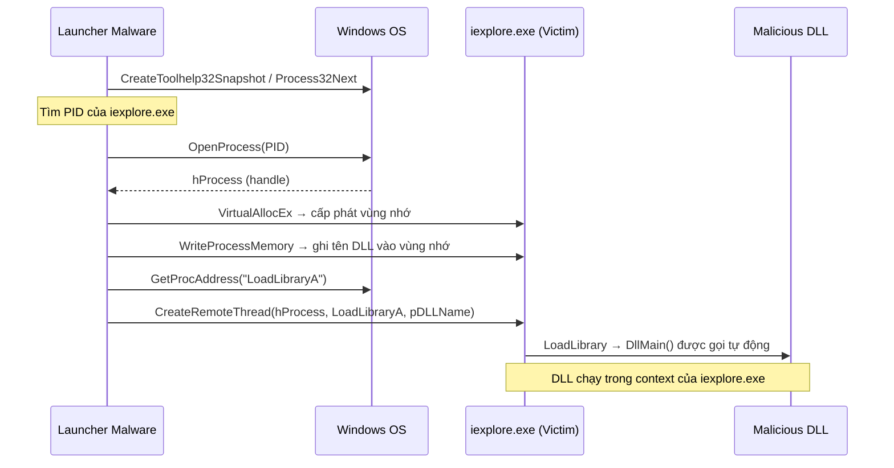
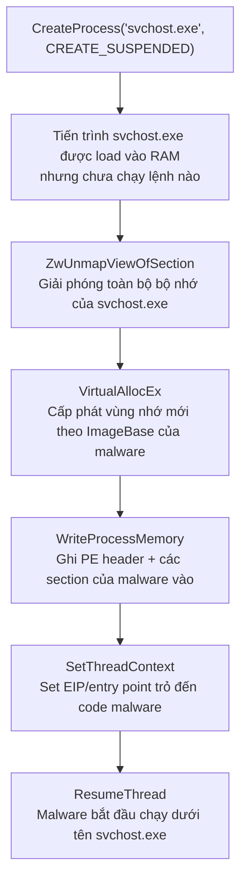
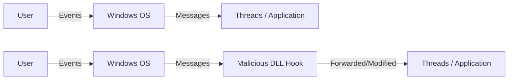
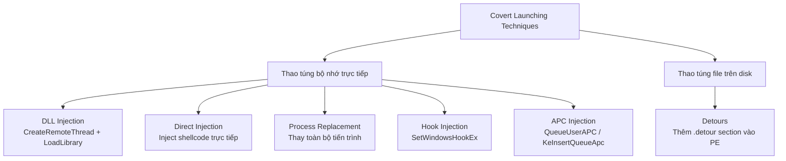

# Chương 12: Các Kỹ Thuật Khởi Chạy Malware Bí Mật (Covert Malware Launching)

---

## Tổng quan

> Khi người dùng ngày càng tinh vi hơn (biết dùng Task Manager để xem tiến trình), malware cũng tiến hóa theo — tìm cách **ẩn mình vào môi trường Windows bình thường** để tránh bị phát hiện.

**Covert launching techniques** = các kỹ thuật giúp malware khởi chạy mà không bị người dùng hoặc hệ thống bảo mật phát hiện.

---

## 1. Launchers (Loader)

**Launcher** là loại malware chuyên dùng để thiết lập việc thực thi — ngay lập tức hoặc trong tương lai — cho chính nó hoặc một malware khác, một cách bí mật.

### Cách hoạt động

- Launcher thường **chứa sẵn malware** bên trong nó, phổ biến nhất là nhúng một file `.exe` hoặc `.dll` trong **resource section** của file thực thi.
- Resource section bình thường chứa: icon, hình ảnh, menu, string — malware lợi dụng vùng này để ẩn payload.
- Khi launcher chạy → **giải nén/giải mã** payload từ resource section → khởi chạy payload đó.

### Dấu hiệu nhận biết khi phân tích

```
FindResource      ; tìm resource trong file
LoadResource      ; load resource vào bộ nhớ
SizeofResource    ; lấy kích thước resource
```

!!! warning "Lưu ý"
    Launcher thường cần **quyền Administrator** hoặc có cơ chế **privilege escalation** để thực hiện các kỹ thuật tiếp theo. Đây cũng là dấu hiệu để nhận diện launcher.

---

## 2. Process Injection

**Process injection** = kỹ thuật **tiêm code vào một tiến trình đang chạy**, khiến tiến trình đó vô tình thực thi code độc hại.

### Mục đích

- Che giấu hành vi độc hại (code chạy dưới danh nghĩa tiến trình hợp lệ)
- Bypass host-based firewall và các cơ chế bảo mật theo tiến trình

### Hai API nền tảng dùng trong hầu hết mọi kỹ thuật injection

```
VirtualAllocEx      ; cấp phát vùng nhớ trong tiến trình đích
WriteProcessMemory  ; ghi dữ liệu vào vùng nhớ vừa cấp phát
```

---

## 3. DLL Injection

### Nguyên lý

Ép tiến trình nạn nhân **tự load một DLL độc hại** bằng cách gọi `LoadLibrary` trong context của tiến trình đó. Khi DLL được load, OS tự động gọi `DllMain` — hàm chứa toàn bộ code độc hại.



### Chuỗi API đặc trưng (trademark pattern)

```c
// Bước 1: Lấy handle tiến trình nạn nhân
hVictimProcess = OpenProcess(PROCESS_ALL_ACCESS, 0, victimProcessID);

// Bước 2: Cấp phát vùng nhớ trong tiến trình nạn nhân
pNameInVictimProcess = VirtualAllocEx(hVictimProcess, ..., sizeof(maliciousLibraryName), ...);

// Bước 3: Ghi tên DLL độc hại vào vùng nhớ đó
WriteProcessMemory(hVictimProcess, ..., maliciousLibraryName, sizeof(maliciousLibraryName), ...);

// Bước 4: Lấy địa chỉ của LoadLibrary trong Kernel32.dll
GetModuleHandle("Kernel32.dll");
GetProcAddress(..., "LoadLibraryA");

// Bước 5: Tạo thread trong tiến trình nạn nhân để gọi LoadLibrary
CreateRemoteThread(hVictimProcess, ..., LoadLibraryAddress, pNameInVictimProcess, ...);
```

!!! tip "Mẹo phân tích"
    - Tìm chuỗi **tên DLL độc hại** và **tên tiến trình nạn nhân** trong disassembly
    - Tên tiến trình nạn nhân thường xuất hiện trong lệnh `strncmp` khi launcher duyệt danh sách tiến trình
    - Đặt breakpoint tại `WriteProcessMemory` và dump stack để xem tên DLL được ghi vào

!!! info "Điểm quan trọng"
    Launcher **không bao giờ gọi trực tiếp hàm độc hại**. Toàn bộ logic độc hại nằm trong `DllMain` của DLL, được OS gọi tự động khi DLL load xong.

---

## 4. Direct Injection

### So sánh với DLL Injection

| Đặc điểm | DLL Injection | Direct Injection |
|---|---|---|
| Payload | File DLL riêng biệt | Code/shellcode trực tiếp |
| Linh hoạt | Thấp hơn | Cao hơn |
| Độ phức tạp | Thấp hơn | Cao hơn |
| Yêu cầu | DLL có sẵn trên disk | Code tự chứa (self-contained) |

### Chuỗi API đặc trưng

```c
// Thường có 2 lần gọi VirtualAllocEx + WriteProcessMemory:

// Lần 1: Ghi DATA cho remote thread
VirtualAllocEx(hProcess, ..., sizeOfData, ...);
WriteProcessMemory(hProcess, pData, data, sizeOfData, ...);

// Lần 2: Ghi CODE của remote thread
VirtualAllocEx(hProcess, ..., sizeOfCode, ...);
WriteProcessMemory(hProcess, pCode, code, sizeOfCode, ...);

// Chạy thread với code và data vừa inject
CreateRemoteThread(hProcess, ..., pCode, pData, ...);
```

### Khó khăn khi phân tích

- Code inject phải **self-contained**: không dùng được `.data` section bình thường, phải tự gọi `LoadLibrary`/`GetProcAddress` để dùng các hàm cần thiết
- Payload thường là **shellcode** → cần kỹ năng phân tích shellcode (xem Chương 19)
- Cần debug và **dump buffer** ngay trước khi `WriteProcessMemory` được gọi

---

## 5. Process Replacement

### Nguyên lý

Thay vì tiêm code vào tiến trình, malware **tạo một tiến trình hợp lệ ở trạng thái suspended**, rồi **xóa toàn bộ code gốc** và **thay bằng code độc hại**.



### Assembly code thực tế

```asm
; Tạo tiến trình ở trạng thái suspended
push CREATE_SUSPENDED    ; dwCreationFlags = 0x4
...
call ds:CreateProcessA

; Sau đó thực hiện replacement:
; ZwUnmapViewOfSection  → giải phóng bộ nhớ gốc
; VirtualAllocEx        → cấp phát lại cho malware
; WriteProcessMemory    → ghi malware vào (header + từng section)
; SetThreadContext      → chỉnh entry point
; ResumeThread          → tiến trình "svchost.exe" chạy malware
```

### Tại sao nguy hiểm

!!! danger "Mức độ nguy hiểm cao"
    - Người dùng thấy `svchost.exe` trong Task Manager → **không nghi ngờ**
    - Malware có **đúng quyền** của tiến trình bị thay thế
    - Firewall và IPS thấy traffic từ `svchost.exe` → **cho qua**
    - Malware **không cần ghi file DLL** ra disk → khó detect hơn

---

## 6. Hook Injection

### Windows Hook là gì?

Windows Hook là cơ chế cho phép một ứng dụng **chặn và xử lý các message** trước khi chúng đến tiến trình đích.



### Phân loại hook

| Loại | Mô tả | Yêu cầu |
|---|---|---|
| **Local hook** | Quan sát/thao túng message trong cùng tiến trình | Hook procedure nằm trong tiến trình |
| **Remote hook (high-level)** | Quan sát message của tiến trình khác | Hook procedure phải là **exported function trong DLL** |
| **Remote hook (low-level)** | Nhận notification trước cả OS | Hook procedure nằm trong tiến trình cài hook |

### Keylogger dùng Hook

```
WH_KEYBOARD     → high-level hook, chạy trong context tiến trình bị hook
WH_KEYBOARD_LL  → low-level hook, event gửi thẳng về tiến trình cài hook
```

Cả hai đều có thể:
- **Ghi lại phím gõ** vào file
- **Thay đổi phím** trước khi chuyển tiếp

### API chính: `SetWindowsHookEx`

```c
SetWindowsHookEx(
    idHook,      // Loại hook: WH_KEYBOARD, WH_CBT, v.v.
    lpfn,        // Con trỏ đến hàm hook
    hMod,        // Handle DLL chứa hàm hook (high-level) hoặc module local (low-level)
    dwThreadId   // Thread ID cụ thể, hoặc 0 = tất cả threads (bắt buộc = 0 với low-level)
);
```

!!! warning "Quy tắc bắt buộc"
    Hàm hook **phải gọi `CallNextHookEx`** để đảm bảo message được chuyển tiếp đến hook tiếp theo trong chain và hệ thống hoạt động bình thường.

### Assembly code ví dụ

```asm
push offset LibFileName   ; "hook.dll"
call LoadLibraryA
; eax = handle của hook.dll

push offset ProcName      ; "MalwareProc"
push eax                  ; hModule = hook.dll
call GetProcAddress
; eax = địa chỉ của MalwareProc

call GetNotepadThreadId   ; hàm tự định nghĩa → lấy thread ID của notepad.exe

push eax                  ; dwThreadId
push hModule              ; hmod
push edi                  ; lpfn = MalwareProc
push WH_CBT               ; idHook (ít dùng → ít bị IPS phát hiện)
call SetWindowsHookExA
```

!!! tip "Chiến thuật tránh IPS"
    Malware thường dùng **WH_CBT** (computer-based training hook) thay vì WH_KEYBOARD vì WH_CBT ít được trigger hơn → ít bị IPS phát hiện hơn.

    Nếu mục tiêu chỉ là **load DLL vào tiến trình** (không phải keylog), malware chỉ inject vào **một thread duy nhất** để tránh làm chậm hệ thống.

### Sau khi hook.dll được inject

```
DllMain của hook.dll chạy → thực thi toàn bộ code độc hại
↓
Gọi ngay LoadLibrary + UnhookWindowsHookEx trong DllMain
→ Đảm bảo message flow không bị ảnh hưởng
→ Hook tự gỡ bỏ sau khi DLL đã được load
```

---

## 7. Detours

### Giới thiệu

Detours là thư viện của **Microsoft Research (1999)**, ban đầu dùng để instrument và extend chức năng OS/ứng dụng. Malware tái sử dụng nó để:

- Modify import table
- Đính kèm DLL vào file thực thi có sẵn **trên disk**
- Thêm function hook vào tiến trình đang chạy

### Cách malware dùng Detours

```
1. Malware chọn một binary hợp lệ (vd: notepad.exe)
2. Sửa PE structure → thêm section mới tên ".detour"
   - Đặt giữa export table và debug symbols
   - Chứa PE header gốc + import address table mới
3. Dùng setdll tool (có trong Detours SDK) để:
   - Sửa PE header → trỏ đến import table mới
   - Import table mới có thêm evil.dll
4. Kết quả: mỗi lần notepad.exe khởi động → evil.dll tự động được load
```

!!! info "Dấu hiệu nhận biết"
    Khi dùng PEview hoặc công cụ phân tích PE: tìm section có tên **`.detour`** — đây là dấu hiệu rõ ràng của kỹ thuật này.

---

## 8. APC Injection

### APC là gì?

**Asynchronous Procedure Call (APC)** = cơ chế cho phép thực thi một hàm trong context của một thread cụ thể, **bất đồng bộ**.

- Mỗi thread có một **APC queue**
- APC được xử lý khi thread ở **alertable state** (trạng thái chờ có thể bị ngắt)
- Các hàm đưa thread vào alertable state: `WaitForSingleObjectEx`, `WaitForMultipleObjectsEx`, `SleepEx`

### Hai loại APC

| Loại | Nguồn gốc | Dùng bởi |
|---|---|---|
| Kernel-mode APC | Kernel / Driver | OS, drivers |
| User-mode APC | Application | Malware (từ user space hoặc kernel space) |

---

### 8.1 APC Injection từ User Space

```c
// Bước 1: Tìm tiến trình và thread mục tiêu
CreateToolhelp32Snapshot → Process32First/Next   // tìm tiến trình
Thread32First/Next                               // tìm thread trong tiến trình đó

// Bước 2: Mở handle đến thread
OpenThread(dwDesiredAccess, bInheritHandle, dwThreadId)

// Bước 3: Queue APC vào thread đó
QueueUserAPC(
    pfnAPC,    // Hàm sẽ được gọi (vd: LoadLibraryA)
    hThread,   // Handle của thread mục tiêu
    dwData     // Tham số truyền vào pfnAPC (vd: "dbnet.dll")
)
```

```asm
; Ví dụ thực tế - inject dbnet.dll vào svchost.exe
push [dwThreadId]
push 0
push 10h
call OpenThread             ; Mở handle thread
mov  esi, eax

push "dbnet.dll"            ; dwData = tên DLL cần load
push esi                    ; hThread
push ds:LoadLibraryA        ; pfnAPC
call QueueUserAPC
```

!!! tip "Tại sao nhắm vào svchost.exe?"
    Các thread của `svchost.exe` **thường xuyên ở alertable state** → APC được thực thi nhanh hơn. Malware đôi khi inject vào **tất cả thread** của svchost.exe để đảm bảo thực thi.

---

### 8.2 APC Injection từ Kernel Space (Rootkit)

Driver/rootkit dùng hai hàm kernel:

```c
KeInitializeApc(
    PKAPC Apc,           // KAPC structure (ESI trong ví dụ)
    PKTHREAD Thread,     // Thread mục tiêu (arg_0)
    ...
    PKNORMAL_ROUTINE NormalRoutine,  // ≠ 0 → user-mode APC
    KPROCESSOR_MODE ApcMode,         // = 1 → user-mode
    PVOID NormalContext              // Tham số cho NormalRoutine
);

KeInsertQueueApc(
    PKAPC Apc,           // KAPC structure đã init
    ...
);
```

```asm
; Rootkit example
push ebx
push 1                   ; ApcMode = 1 → user-mode ← dấu hiệu quan trọng
push [ebp+arg_4]
push ebx
push offset sub_11964    ; NormalRoutine ≠ 0 ← dấu hiệu quan trọng
push 2
push [ebp+arg_0]         ; Thread mục tiêu (svchost.exe thread)
push esi                 ; KAPC structure
call ds:KeInitializeApc

push [ebp+arg_C]
push [ebp+arg_8]
push esi
call edi                 ; KeInsertQueueApc
```

!!! tip "Cách phân biệt user-mode APC trong kernel"
    Kiểm tra hai tham số của `KeInitializeApc`:
    - **NormalRoutine** ≠ 0 **VÀ**
    - **ApcMode** = 1
    
    → Đây là **user-mode APC** → rootkit đang inject code vào user space

---

## Tổng kết so sánh các kỹ thuật



| Kỹ thuật | API đặc trưng | Payload | Mục đích chính |
|---|---|---|---|
| **DLL Injection** | `CreateRemoteThread`, `VirtualAllocEx`, `WriteProcessMemory` | DLL file | Ẩn trong tiến trình hợp lệ |
| **Direct Injection** | `VirtualAllocEx` (×2), `WriteProcessMemory` (×2), `CreateRemoteThread` | Shellcode | Không cần DLL trên disk |
| **Process Replacement** | `CreateProcess(SUSPENDED)`, `ZwUnmapViewOfSection`, `SetThreadContext`, `ResumeThread` | Full PE | Giả mạo tiến trình hợp lệ hoàn toàn |
| **Hook Injection** | `SetWindowsHookEx` | DLL | Keylog hoặc load DLL vào tiến trình |
| **Detours** | `setdll` tool | DLL | Persistence — chạy mỗi khi app khởi động |
| **APC Injection (user)** | `QueueUserAPC`, `OpenThread` | DLL/shellcode | Inject không cần tạo thread mới |
| **APC Injection (kernel)** | `KeInitializeApc`, `KeInsertQueueApc` | Shellcode | Rootkit inject vào user space |

---

!!! summary "Kết luận chương"
    Tất cả các kỹ thuật trên đều hướng đến **một mục tiêu duy nhất**: làm cho malware chạy được mà không bị phát hiện. Chúng khác nhau ở phương thức thực hiện, nhưng giống nhau ở kết quả.

    Là một malware analyst, bạn cần:
    1. **Nhận diện chuỗi API đặc trưng** của từng kỹ thuật trong disassembly
    2. **Biết cách tìm payload** (tên DLL, shellcode buffer) thông qua debug và dump memory
    3. **Hiểu bối cảnh** — malware launcher chỉ là phương tiện; code độc hại thật sự nằm ở payload được launch

    Chương tiếp theo sẽ đề cập đến cách malware **mã hóa dữ liệu** và **giao tiếp qua mạng**.
