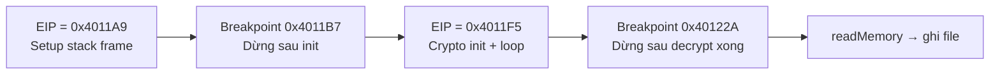
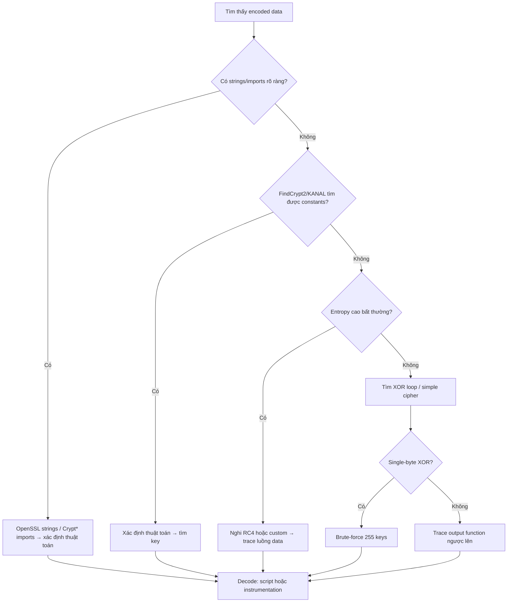

# Chương 13: Mã Hóa Dữ Liệu trong Phân Tích Malware

---

## Tổng quan

**Data Encoding** trong ngữ cảnh phân tích malware là tất cả các hình thức biến đổi nội dung nhằm **che giấu ý định**. Malware dùng encoding để:

- Mã hóa giao tiếp qua mạng (C2 communication)
- Ẩn thông tin cấu hình (domain C2, credentials)
- Lưu dữ liệu vào staging file trước khi đánh cắp
- Lưu trữ strings độc hại và giải mã ngay trước khi dùng
- Giả mạo thành công cụ hợp lệ

> **Mục tiêu của analyst luôn gồm 2 phần:** (1) xác định hàm encoding, (2) giải mã bí mật của attacker.

---

## 1. Simple Ciphers (Mã Hóa Đơn Giản)

### Tại sao malware dùng simple ciphers?

Simple ciphers vẫn phổ biến dù máy tính hiện đại rất mạnh, vì:

- Kích thước nhỏ → dùng được trong shellcode không gian hạn hẹp
- Ít "đập vào mắt" hơn các cipher phức tạp
- Overhead thấp, ít ảnh hưởng hiệu năng
- Không cần miễn nhiễm hoàn toàn — chỉ cần qua được phân tích cơ bản

---

### 1.1 Caesar Cipher

Dịch mỗi ký tự 3 vị trí sang phải trong bảng chữ cái.

```
Plaintext:  ATTACK AT NOON
Ciphertext: DWWDFN DW QRRQ
```

Biến thể hiện đại dùng trong malware là **ROT cipher** — xoay vòng trên tập ký tự ASCII in được (94 ký tự) hoặc chỉ A–Z / a–z.

---

### 1.2 XOR Cipher

XOR là phép toán logic: mỗi byte plaintext được XOR với một byte key cố định.

**Ví dụ:** Encode `ATTACK AT NOON` với key `0x3C`:

```
A (0x41) XOR 0x3C = 0x7D  →  }
T (0x54) XOR 0x3C = 0x68  →  h
...
```

!!! info "Tính chất quan trọng của XOR"
    XOR là **reversible cipher**: để decode, chỉ cần XOR lại với cùng key.
    `ciphertext XOR key = plaintext`
    `plaintext XOR key = ciphertext`
    → Cùng một hàm dùng cho cả encode lẫn decode.

**Single-byte XOR**: key là một byte duy nhất, áp dụng cho mọi byte trong file.

---

### 1.3 Brute-Force XOR Encoding

Vì chỉ có **256 giá trị** có thể cho key, ta hoàn toàn có thể brute-force.

**Kịch bản thực tế:**
Tìm thấy file `a.gif` không có GIF header — nghi là XOR-encoded PE file. Thử tất cả 255 key:

| XOR key | Bytes đầu file | Tìm thấy MZ? |
|---|---|---|
| Original | `5F 48 42 12 10 12...` | No |
| XOR 0x01 | `5E 49 43 13 11 13...` | No |
| ... | ... | No |
| **XOR 0x12** | **`4D 5A 50 00 02 00...`** | **Yes!** |

`4D 5A` = `MZ` → đây là PE file header.

Sau khi decode tiếp, thấy chuỗi `This program mus` — đây là DOS stub, xác nhận là PE file.

**Brute-force nhiều file:** Tạo 255 signatures cho mỗi XOR permutation của chuỗi đặc trưng như `This program must be run under Win32`.

---

### 1.4 NULL-Preserving Single-Byte XOR

**Điểm yếu của single-byte XOR:** Nếu plaintext có nhiều NULL bytes, thì phần lớn bytes trong ciphertext sẽ bằng key → key lộ ngay khi nhìn bằng hex editor.

**Giải pháp: NULL-Preserving XOR** — bỏ qua 2 trường hợp đặc biệt:

```python
# Original XOR
buf[i] ^= key

# NULL-preserving XOR
if buf[i] != 0x00 and buf[i] != key:
    buf[i] ^= key
# Nếu là NULL hoặc chính key → giữ nguyên không encode
```

Kết quả: các NULL bytes giữ nguyên, key không bị lộ khi nhìn hex dump.

!!! tip "Ứng dụng"
    NULL-preserving XOR đặc biệt phổ biến trong **shellcode** vì cần encode với rất ít code, và shellcode thường không được chứa NULL bytes.

---

### 1.5 Xác Định XOR Loop trong IDA Pro

XOR loop trong disassembly là một **vòng lặp nhỏ chứa lệnh XOR**.

**Cách tìm trong IDA Pro:**

1. Đảm bảo đang ở cửa sổ "IDA View"
2. Chọn **Search → Text**
3. Nhập `xor`, tick **Find all occurrences**, nhấn OK

**Phân biệt 3 dạng lệnh XOR:**

| Dạng | Ví dụ | Ý nghĩa |
|---|---|---|
| Register XOR chính nó | `xor edx, edx` | Zero register — **bỏ qua** |
| Register XOR constant | `xor edx, 12h` | **Likely encoding** — biết key ngay |
| Register XOR register khác | `xor ebx, eax` | Có thể encoding với dynamic key |

```
; Ví dụ XOR loop điển hình
loc_4011FA:
    mov ecx, [ebp+counter]
    cmp ecx, [ebp+nNumberOfBytesToWrite]
    jnb short loc_40122A          ; thoát loop khi hết bytes
    mov edx, [ebp+lpBuffer]
    add edx, [ebp+counter]
    movsx ebx, byte ptr [edx]     ; lấy byte hiện tại
    xor eax, 12h                  ; XOR với key 0x12
    mov ecx, [ebp+counter]
    add ecx, 1                    ; tăng counter
    jmp short loc_4011FA
```

---

### 1.6 Các Simple Encoding Schemes Khác

| Scheme | Mô tả |
|---|---|
| ADD, SUB | Tương tự XOR nhưng không reversible → cần dùng cặp (ADD encode, SUB decode) |
| ROL, ROR | Xoay bits trong byte trái/phải — cũng không reversible, dùng cặp |
| ROT | Caesar cipher hiện đại, dùng với A–Z / a–z hoặc 94 ký tự ASCII |
| Multibyte XOR | Key dài 4 hoặc 8 bytes thay vì 1 byte |
| Chained/Loopback | Dùng output của byte trước làm key cho byte tiếp theo |

---

## 2. Base64 Encoding

### 2.1 Base64 là gì?

Base64 biểu diễn **binary data** dưới dạng **ASCII string**, chỉ dùng 64 ký tự in được.

**MIME Base64 alphabet (phổ biến nhất):**
```
ABCDEFGHIJKLMNOPQRSTUVWXYZabcdefghijklmnopqrstuvwxyz0123456789+/
```
Ký tự padding: `=`

**Trade-off:** Cứ 3 bytes binary → 4 bytes Base64 (tăng ~33% kích thước).

---

### 2.2 Cơ chế hoạt động

Base64 xử lý từng **chunk 3 bytes (24 bits)**:

```
Plaintext:   A        T        T
Hex:         0x41     0x54     0x54
Bits:        01000001 01010100 01010100
             |      ||      ||      |
6-bit groups:010000 | 010101 | 010001 | 010100
Decimal:       16       21       17       20
Base64:        Q        V        R        U
```

Decode: mỗi Base64 char → 6 bits, ghép lại → đọc từng 8 bits.

---

### 2.3 Nhận diện Base64

**Dấu hiệu:**
- Chuỗi ký tự "ngẫu nhiên" chỉ gồm alphanumeric + 2 ký tự đặc biệt
- Độ dài **chia hết cho 4** (sau khi thêm padding)
- Kết thúc bằng `=` hoặc `==` (padding)

**Tìm trong malware:**
- Tìm chuỗi 64-byte indexing string: `ABCDEFGHIJKLMNOPQRSTUVWXYZ...`
- Tìm ký tự `=` được hard-code trong hàm encode
- **KANAL plugin** cho PEiD tự động nhận diện Base64 tables

---

### 2.4 Custom Base64 — Substitution Cipher

Malware thường thay đổi **indexing string** để tạo custom Base64:

```
Standard: ABCDEFGHIJKLMNOPQRSTUVWXYZabcdefghijklmnopqrstuvwxyz0123456789+/
Custom:   aABCDEFGHIJKLMNOPQRSTUVWXYZbcdefghijklmnopqrstuvwxyz0123456789+/
```
(Ở đây chỉ cần dịch chữ `a` lên đầu)

**Kết quả:** Chuỗi trông giống Base64 nhưng giải mã bằng tool thông thường sẽ ra rác.

**Ví dụ thực tế từ traffic malware:**
```
GET /X29tbVEuYC8=/index.htm
Cookie: Ym90NTQxNjQ
```

Dùng standard Base64: `X29tbVEuYC8=` → `_ommQ./` (vô nghĩa)
Dùng custom indexing string: `X29tbVEuYC8=` → `command?` ✓

**Script decode custom Base64:**

```python
import base64
import string

custom = "9ZABCDEFGHIJKLMNOPQRSTUVWXYabcdefghijklmnopqrstuvwxyz012345678+/"
standard = "ABCDEFGHIJKLMNOPQRSTUVWXYZabcdefghijklmnopqrstuvwxyz0123456789+/"

ciphertext = 'TEgobxZobxZgGFPkb2O='
s = ""
for ch in ciphertext:
    if ch in custom:
        s += standard[string.find(custom, ch)]
    elif ch == '=':
        s += '='

result = base64.decodestring(s)
```

---

## 3. Common Cryptographic Algorithms

### 3.1 Tại sao malware không luôn dùng strong crypto?

| Vấn đề | Giải thích |
|---|---|
| Library lớn | Phải statically link hoặc phụ thuộc host → tăng kích thước |
| Giảm portability | Link đến code trên host → không chạy được mọi nơi |
| Dễ bị phát hiện | Crypto functions có tên rõ ràng, constants đặc trưng |
| Vấn đề key management | Phải ẩn key ở đâu đó trong malware |

!!! warning
    Dù vậy, một số malware vẫn dùng strong crypto (AES, DES, RC4...) khi cần bảo vệ C2 communication.

---

### 3.2 Nhận diện Cryptography

#### Cách 1: Tìm Strings và Imports

Nếu malware statically link OpenSSL:
```
OpenSSL 1.0.0a
SSLv3 part of OpenSSL 1.0.0a
TLSv1 part of OpenSSL 1.0.0a
```

Microsoft CryptoAPI functions trong IDA Pro imports:
```
CryptAcquireContextA
CryptCreateHash
CryptHashData
CryptDeriveKey
CryptDestroyHash
CryptDecrypt
CryptEncrypt
```
> Prefix nhận diện: `Crypt`, `CP` (Cryptographic Provider), `Cert`

---

#### Cách 2: FindCrypt2 (IDA Pro plugin)

Tìm **magic constants** — các hằng số cố định đặc trưng của từng thuật toán crypto.

```
100062A4: found const array DES_ip   (used in DES)
100062E4: found const array DES_fp   (used in DES)
10006324: found const array DES_e1   (used in DES)
10006354: found const array DES_p321 (used in DES)
...
Found 7 known constant arrays in total.
```

!!! note "Ngoại lệ quan trọng"
    **IDEA** và **RC4** không dùng magic constants — chúng xây cấu trúc on-the-fly nên FindCrypt2 **không phát hiện được**. RC4 đặc biệt phổ biến trong malware vì nhỏ, dễ implement, không có constants.

---

#### Cách 3: Krypto ANALyzer (KANAL — PEiD plugin)

Tương tự FindCrypt2 nhưng rộng hơn:
- Nhiều constants hơn (có thể nhiều false positive hơn)
- Nhận diện được **Base64 tables**
- Nhận diện **crypto-related function imports**

---

#### Cách 4: High-Entropy Content Analysis

Tìm vùng có **entropy cao** trong file — dấu hiệu của encrypted/compressed content.

**Công thức tư duy:**
- 64-byte string với 64 giá trị phân biệt → entropy = 6 (tối đa cho chunk 64 bytes)
- 256-byte string với ~256 giá trị → entropy ≈ 8

**Settings thực dụng cho IDA Entropy Plugin:**
- Chunk 64, max entropy 5.95 → tìm được constants + Base64 strings
- Chunk 256, entropy > 7.9 → tìm encrypted blobs

!!! warning "Hạn chế"
    Ảnh, video, audio, file nén cũng có entropy cao → **nhiều false positive**. Dùng làm biện pháp cuối cùng.

**Entropy graph phân tích:** Code thường tạo "plateau" entropy ổn định. Spike đột ngột tách biệt = crypto constants hoặc encrypted data.

---

## 4. Custom Encoding

Malware tự chế encoding:
- **Layer nhiều methods:** XOR → Base64 → kết quả
- **Thuật toán hoàn toàn tự phát minh**, không có constants

### 4.1 Nhận diện Custom Encoding

Khi không có strings đặc trưng, không có constants, không có entropy bất thường → **trace theo luồng dữ liệu:**

```
Input (network/file) → [decode] → plaintext xử lý
plaintext xử lý → [encode] → Output (network/file)
```

**Nguyên tắc:**
- Nếu output chứa encoded data → encoding function nằm **trước** output call
- Nếu input là encoded data → decoding function nằm **sau** input call

**Ví dụ thực tế:** Tìm thấy nhiều file ~700KB bị encrypt. Không có crypto constants. Chỉ có `xor ebx, eax` đơn lẻ. Tìm trong imports: `CreateFileA`, `WriteFile` → cả hai trong `sub_4011A9` → đây chính là hàm encrypt.

```
sub_4011A9:
    call encrypt_Init       ; khởi tạo stream cipher
    loop:
        call encrypt_Byte   ; lấy pseudo-random byte
        xor ebx, eax        ; XOR với byte hiện tại của buffer
        write bl to buffer
        counter++
    WriteFile(buffer)       ; ghi ra file
```

→ Đây là **stream cipher**: sinh pseudorandom byte stream, XOR với plaintext.

---

## 5. Decoding Strategies

### 5.1 Self-Decoding (Để malware tự decode)

Để malware chạy bình thường trong debugger, dừng lại **sau** khi nó decode xong.

**Ưu điểm:** Không cần hiểu thuật toán.

**Nhược điểm:**
- Phải đặt breakpoint đúng chỗ sau decryption routine
- Nếu malware không tự decode phần cần → không lấy được
- Ít control

---

### 5.2 Manual Programming

#### Decode Standard Base64:
```python
import base64
example_string = 'VGhpcyBpcyBhIHRlc3Qgc3RyaW5n'
print(base64.decodestring(example_string))
```

#### Decode NULL-Preserving XOR:
```python
def null_preserving_xor(input_char, key_char):
    if input_char == key_char or input_char == chr(0x00):
        return input_char
    else:
        return chr(ord(input_char) ^ ord(key_char))
```

#### Decode DES bằng PyCrypto:
```python
from Crypto.Cipher import DES

obj = DES.new('password', DES.MODE_ECB)
with open('encrypted_file', 'rb') as f:
    cbuf = f.read()
print(obj.decrypt(cbuf))
```

> **ECB mode** (Electronic Code Book): mode đơn giản nhất — áp dụng block cipher cho từng block riêng lẻ. Phải chỉ định đúng mode khi dùng library.

---

### 5.3 Instrumentation — Dùng Malware Chống Lại Chính Nó

Khi thuật toán quá phức tạp hoặc không standard → **instrument malware** để nó tự decrypt file tùy ý.

**Dùng Immunity Debugger (ImmDbg) với Python:**

```python
import immlib

def main():
    imm = immlib.Debugger()

    # Mở files
    cfile = open("C:\\encrypted_file", "rb")
    pfile = open("decrypted_file", "w")

    buffer = cfile.read()
    sz = len(buffer)

    # Cấp phát memory trong process của malware
    membuf = imm.remoteVirtualAlloc(sz)
    imm.writeMemory(membuf, buffer)   # Copy encrypted data vào

    # Setup stack frame của encryption function
    imm.Run()                          # Chạy function header (setup stack)
    regs = imm.getRegs()
    imm.writeLong(regs["EBP"] + 16, sz)      # nNumberOfBytesToWrite
    imm.writeLong(regs["EBP"] + 8, membuf)   # lpBuffer

    # Chạy encryption loop (XOR reversible → cùng hàm decode luôn)
    imm.setReg("EIP", 0x004011F5)     # Điểm bắt đầu crypto
    imm.setBreakpoint(0x0040122A)     # Điểm kết thúc
    imm.Run()

    # Đọc và ghi output
    output = imm.readMemory(membuf, sz)
    pfile.write(output)
```

**Hai giai đoạn thực thi:**



!!! tip "Khi nào dùng instrumentation?"
    - Không biết thuật toán chính xác
    - Thuật toán custom/phức tạp
    - Key được nhúng trong code (không explicit)
    - Nhanh hơn reverse-engineer và reimpliment thuật toán

---

## 6. Tổng kết — Quy trình phân tích Encoding



| Kỹ thuật | Phát hiện bằng | Decode bằng |
|---|---|---|
| Single-byte XOR | Hex editor / brute-force | Python script |
| NULL-preserving XOR | Hex editor | Python script |
| Standard Base64 | KANAL, indexing string | `base64.decodestring()` |
| Custom Base64 | Output không decode được | Tìm custom string + script |
| Standard crypto (AES, DES) | FindCrypt2, imports | PyCrypto library |
| RC4 | Không có constants — trace data flow | Instrumentation / reimpliment |
| Custom encoding | Không có dấu hiệu rõ | Instrumentation (ImmDbg) |
