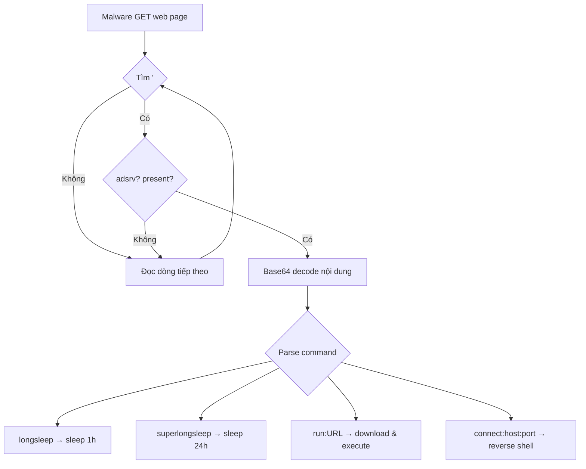
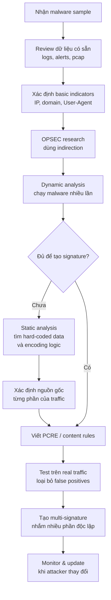

# Chương 14: Chữ Ký Mạng Tập Trung Vào Malware

---

## 1. Tổng Quan Về Countermeasures Mạng

**Countermeasures** (biện pháp đối phó) là các hành động được thực hiện để phát hiện hoặc ngăn chặn hoạt động độc hại.

Các thuộc tính cơ bản của lưu lượng mạng được dùng để phòng thủ:

| Thuộc tính | Công cụ sử dụng |
|---|---|
| IP address, Port | Firewall, Router |
| Domain name | DNS Sinkhole, Proxy Server |
| Nội dung traffic | IDS/IPS, Email/Web Proxy |

> **IDS vs IPS:**
> - **IDS** (Intrusion Detection System): chỉ **phát hiện** traffic độc hại
> - **IPS** (Intrusion Prevention System): phát hiện **và ngăn chặn** traffic độc hại

---

## 2. Quan Sát Malware Trong Môi Trường Thực

### Tại sao nên review dữ liệu thực trước?

Bước đầu tiên **không** phải là chạy malware trong lab hay disassemble code, mà là **khai thác dữ liệu đã có sẵn**: logs, alerts, packet captures từ mạng thực.

**Ưu điểm của dữ liệu từ mạng thực so với lab:**

- **Minh bạch hơn**: Malware có thể phát hiện môi trường lab và thay đổi hành vi.
- **Thông tin 2 chiều**: Thấy được cả client và server, trong khi lab thường chỉ thấy 1 phía. Phân tích parsing routine (phía nhận) thường khó hơn phân tích phía gửi.
- **Không rò rỉ thông tin**: Passive review không để lộ hoạt động điều tra cho attacker.

---

## 3. Các Chỉ Số Malicious Activity

Ví dụ: malware gửi HTTP GET đến IP từ DNS record, 30 giây sau beacon đến một IP khác không qua DNS.

**Bảng chỉ số thu thập được:**

| Loại thông tin | Ví dụ |
|---|---|
| Domain (kèm IP) | `www.badsite.com (123.123.123.10)` |
| IP độc lập | `123.64.64.64` |
| HTTP GET request | `GET /index.htm HTTP/1.1` với `User-Agent: Wefa7e` |

---

## 4. OPSEC – Operations Security

!!! warning "Nguy Hiểm Khi Nghiên Cứu Online"
    Attacker có thể **biết bạn đang điều tra** qua các dấu hiệu như: DNS request từ IP ngoài vùng công ty, truy cập link từ vị trí địa lý bất thường.

**Cách attacker theo dõi analyst:**

- Gửi spear-phishing email có link đặc biệt, theo dõi IP nào truy cập.
- Nhúng encoded link trong blog comment để tạo "infection audit trail" công khai nhưng bí mật.

### Chiến thuật Indirection

**Mục tiêu:** Ẩn danh tính và vị trí khi nghiên cứu online.

```
Các cách indirection:
1. Dùng Tor, open proxy, web anonymizer
   → Nhược: có thể gây nghi ngờ vì rõ ràng đang ẩn danh

2. Dùng máy ảo (VM) riêng biệt + kết nối ẩn:
   - Cellular connection
   - SSH tunnel / VPN qua remote infrastructure
   - Ephemeral cloud machine (Amazon EC2)

3. Search engine (khá an toàn, nhưng lưu ý):
   - Query có domain mới → có thể trigger crawler
   - Click kết quả → activate links của site đó
```

---

## 5. Thu Thập Thông Tin IP và Domain

### Các loại thông tin có thể khai thác

```
Domain Registry → Whois records (tên, email, ngày đăng ký, nameserver)
IP Registry     → RIR records (tổ chức, contact)
DNS Records     → Mapping domain ↔ IP
Blacklists      → IP/Domain blacklist
Geo Info        → Vị trí địa lý của IP
```

### Công cụ tra cứu nổi bật

| Công cụ | Tính năng |
|---|---|
| **DomainTools** | Historical whois, reverse IP lookup, reverse whois |
| **RobTex** | Nhiều domain trỏ về 1 IP, tích hợp blacklist |
| **BFK DNS Logger** | Passive DNS monitoring (miễn phí hiếm có) |

> **Lợi thế dùng website thay CLI:** tự động follow-on lookup, có anonymity, có metadata bổ sung (blacklist, geo).

---

## 6. Content-Based Countermeasures

### Tại sao Content-Based tốt hơn IP/Domain?

- IP/Domain: attacker dễ dàng chuyển sang địa chỉ khác → **giá trị ngắn hạn**
- Content-based: dựa trên đặc trưng cơ bản của malware → **bền vững hơn**

### Signature-Based IDS (Snort)

**Cấu trúc Snort rule:**

```
<rule_header> (<rule_options>)
```

**Ví dụ rule cơ bản:**

```snort
alert tcp $HOME_NET any -> $EXTERNAL_NET $HTTP_PORTS (
    msg:"TROJAN Malicious User-Agent";
    content:"|0d 0a|User-Agent\: Wefa7e";
    classtype:trojan-activity;
    sid:2000001;
    rev:1;
)
```

**Giải thích từng phần:**

| Thành phần | Ý nghĩa |
|---|---|
| `alert` | Hành động: tạo alert |
| `tcp` | Giao thức |
| `$HOME_NET any -> $EXTERNAL_NET $HTTP_PORTS` | Traffic outbound đến HTTP ports |
| `msg` | Thông điệp khi rule kích hoạt |
| `content` | Tìm kiếm nội dung trong payload |
| `\|0d 0a\|` | Hex cho ký tự xuống dòng HTTP (CR LF) |
| `classtype` | Phân loại chung |
| `sid` | ID duy nhất của rule |
| `rev` | Phiên bản revision |

---

## 7. Phân Tích Sâu: Từ Dynamic Đến Static

### Vấn đề với surface analysis

Dừng ở IP, domain, và signature đơn giản là **sai lầm** — chỉ tạo ra ảo giác bảo mật.

### Dynamic Analysis: Chạy Malware Nhiều Lần

Chạy malware nhiều lần để nhận biết phần tử **ngẫu nhiên** vs **cố định**:

```
Lần 1: User-Agent: Wefa7e
Lần 2: User-Agent: Wee6a3
Lần 3: User-Agent: We4b58
...
```

**Nhận xét:** Prefix `We` cố định, 4 ký tự sau là alphanumeric ngẫu nhiên → regex: `We[a-z0-9]{4}`

**Rule nâng cấp với PCRE:**

```snort
alert tcp $HOME_NET any -> $EXTERNAL_NET $HTTP_PORTS (
    msg:"ET TROJAN WindowsEnterpriseSuite FakeAV Dynamic User-Agent";
    flow:established,to_server;
    content:"|0d 0a|User-Agent\: We";
    isdataat:6,relative;
    content:"|0d 0a|";
    distance:0;
    pcre:"/User-Agent\: We[a-z0-9]{4}\x0d\x0a/";
    classtype:trojan-activity;
    sid:2010262;
    rev:1;
)
```

**Các keyword mới:**

| Keyword | Mô tả |
|---|---|
| `flow` | Chiều của TCP session (established, to_server/to_client) |
| `isdataat` | Kiểm tra dữ liệu tồn tại tại vị trí tương đối |
| `distance` | Số byte bỏ qua sau pattern match trước |
| `pcre` | Perl Compatible Regular Expression |
| `reference` | Tham chiếu đến nguồn bên ngoài |

**PCRE notation trong Snort:**

```
[ ]   → tập ký tự có thể
{ }   → số lần lặp
\xHH  → ký tự hex
!     → NOT (phủ định)
```

### Xử lý False Positive

!!! example "Ví dụ thực tế"
    Rule ban đầu match cả Webmin software (User-Agent hợp lệ bắt đầu bằng `We`).
    
    **Giải pháp:** Thêm điều kiện NOT:

```snort
content:!"User-Agent|3a| Webmin|0d 0a|";
```

Ký hiệu `!` trước `content` = **NOT** → rule chỉ fire khi **không có** Webmin.

---

## 8. Kết Hợp Dynamic và Static Analysis

### Mục tiêu của phân tích sâu

```
1. Full coverage of functionality
   → Tăng code coverage trong dynamic analysis (Chapter 3)
   → Dùng INetSim hoặc custom scripts để giả lập server

2. Understanding inputs & outputs
   → Static analysis: thấy HOW content được tạo ra
   → Dynamic analysis: xác nhận kết quả dự đoán từ static
```

### Bảng cấp độ phân tích malware

| Cấp độ | Mô tả |
|---|---|
| **Surface analysis** | Chỉ nhìn initial indicators (sandbox output) |
| **Communication method coverage** | Hiểu code của từng kỹ thuật giao tiếp |
| **Operational replication** | Tạo được tool điều khiển malware hoàn toàn |
| **Code coverage** | Hiểu từng block code |

> **Mức tối thiểu cần đạt:** giữa "communication method coverage" và "operational replication" để tạo signature hiệu quả.

---

## 9. Malware Ẩn Mình Trong Traffic Thông Thường

### Kỹ thuật 1: Mimicking Popular Protocols

- **Thập niên 90s:** IRC phổ biến → malware dùng IRC → defenders chú ý → attackers bỏ
- **Hiện tại:** HTTP, HTTPS, DNS là phổ biến nhất → malware dùng những giao thức này

**DNS tunneling:**
```
Malware muốn gửi password "flapjack"
→ DNS query: www.thepasswordisflapjack.maliciousdomain.com
```

**HTTP abuse:**
```
GET method (dành cho request, ~2KB)
→ Malware nhét dữ liệu vào URI hoặc User-Agent thay vì body

POST method:
→ Dữ liệu trong User-Agent của nhiều GET request liên tiếp
```

### Kỹ thuật 2: Sử dụng Legitimate Resources

Attacker có thể nhúng lệnh vào web page hợp lệ đã bị compromise:

```html
<!-- adsrv?bG9uZ3NsZWVw -->
```

- `bG9uZ3NsZWVw` = Base64 của `longsleep`
- Malware đọc trang web, tìm comment, decode lệnh → sleep 1 giờ
- Từ góc độ defender: không phân biệt được request thực vs malware request

### Tiến hóa của User-Agent trong Malware

```
Thế hệ 1: User-Agent hoàn toàn giả (Wefa7e)
          → Dễ detect

Thế hệ 2: User-Agent phổ biến nhưng cố định
          Mozilla/4.0 (compatible; MSIE 6.0; Windows NT 5.0)
          → Vẫn có thể dùng làm signature

Thế hệ 3: Multiple-choice scheme (nhiều UA, xoay vòng)
          Mozilla/4.0 (compatible; MSIE 6.0; Windows NT 5.1; SV1)
          Mozilla/4.0 (compatible; MSIE 6.0; Windows NT 5.2)
          → Khó hơn nhưng vẫn detect được pattern

Thế hệ 4: Native library call (dùng code của browser thật)
          → Không thể phân biệt với browser thật
```

### Leveraging Client-Initiated Beaconing

NAT và proxy làm mọi request trông như từ cùng IP → attacker khó biết máy nào đang kết nối.

**Giải pháp của attacker:** Nhúng **unique host identifier** vào beacon:
- Encoded string chứa thông tin máy
- Hash của các thuộc tính host đặc trưng

**Lợi cho defender:** Nếu biết cách malware tạo ID này → có thể track infected machines.

---

## 10. Tìm Networking Code Trong Malware

### Windows Networking APIs

```
WinSock API (low-level):
  WSAStartup, getaddrinfo, socket, connect
  send, recv, WSAGetLastError

WinINet API (high-level, dễ blend với traffic bình thường):
  InternetOpen, InternetConnect, InternetOpenURL
  HTTPOpenRequest, HTTPQueryInfo, HTTPSendRequest
  InternetReadFile, InternetWriteFile

COM Interface (hiếm nhưng ẩn nhất):
  CoInitialize, CoCreateInstance, Navigate
  URLDownloadToFile
```

!!! tip "API cao cấp = blend tốt hơn nhưng ít hard-coded hơn"
    WinSock cần nhiều content thủ công → nhiều hard-coded data → dễ tìm lỗi để làm signature.
    COM dùng code browser thật → khó detect nhất.

---

## 11. Phân Tích URI: Kết Hợp Static + Dynamic

### Ví dụ phân tích URI malware

**URI từ traffic thực:**
```
/1011961917758115116101584810210210256565356
/14586205865810997108584848485355525551
/7911554172581099710858484848535654100102
```

**Dấu hiệu:** `5848` xuất hiện lặp lại → đây là dấu phân cách (`:` = ASCII 58)

**Static analysis phát hiện:** URI = `<4 random bytes>:<3 bytes hostname>:<GetTickCount hex>`

**Encoding:** mỗi byte → ASCII decimal (ví dụ: `a` = 97)

### Phân tích từng phần

```
1458620586  58  10997108  58  4848485355525551
   ↑              ↑              ↑
4 bytes ngẫu nhiên  3 bytes hostname  GetTickCount (hex → decimal)
```

**Regular expression cuối cùng:**

```regex
/\/([12]{0,1}[0-9]{1,2}){4}58[0-9]{6,9}58(4[89]|5[0-7]|9[789]|11[012]){8}/
```

**Giải thích từng phần:**

| Phần | PCRE | Ý nghĩa |
|---|---|---|
| 4 random bytes | `([12]{0,1}[0-9]{1,2}){4}` | Giá trị 0-255 × 4 |
| Dấu phân cách | `58` | Ký tự `:` cố định |
| Hostname | `[0-9]{6,9}` | 3 ký tự, mỗi ký tự ≥ 2 chữ số decimal |
| Dấu phân cách | `58` | Ký tự `:` cố định |
| GetTickCount | `(4[89]\|5[0-7]\|9[789]\|11[012]){8}` | 8 hex chars → decimal ASCII |

---

## 12. Nguồn Gốc Dữ Liệu Trong Network Traffic

### 5 nguồn cơ bản

```
1. Random data          → không thể predict, phải dùng wildcard
2. Standard library     → GET từ HTTPSendRequest, Header chuẩn
3. Hard-coded data      → User-Agent cố định, colon ký tự → GIÁ TRỊ NHẤT
4. Host configuration   → hostname, uptime, CPU speed → cố định theo host
5. External data        → từ server, file system, keylogger → khó predict
```

!!! info "Hard-coded data là vàng cho signature"
    Đây là nguồn ổn định nhất. Cần tìm hard-coded content và xác định xem nó đi qua encoding nào trước khi ra network.

### Lỗi phổ biến của Malware Authors

- Sai chính tả: `Mozila` thay vì `Mozilla`
- Sai khoảng trắng, sai case: `MoZilla`
- **Ví dụ trong chapter:** `Accept: * / *` thay vì `Accept: */*`
- Thiếu `Referer` header (thường có trong browsing thực)

---

## 13. Tối Ưu Hóa Signature

### Các kỹ thuật tối ưu

```snort
-- Kết hợp User-Agent + URI để regex chỉ chạy khi cần
content:"User-Agent: ...";
pcre:"/GET \/.../"

-- Dùng content expressions + within để giới hạn tìm kiếm
content:"58"; content:"58"; distance:6; within:5;

-- Khai thác upper bits cố định của GetTickCount
content:"584";  -- covers ~1 tháng uptime đầu tiên
```

### Signature tổng hợp hoàn chỉnh

```snort
alert tcp $HOME_NET any -> $EXTERNAL_NET $HTTP_PORTS (
    msg:"TROJAN Malicious Beacon";
    content:"User-Agent: Mozilla/4.0 (compatible\; MSIE 7.0\; Windows NT 5.1)";
    content:"Accept: * / *";
    uricontent:"58";
    content:!"|0d0a|referer:"; nocase;
    pcre:"/GET \/([12]{0,1}[0-9]{1,2}){4}58[0-9]{6,9}58(4[89]|5[0-7]|9[789]|10[012]){8} HTTP/";
    classtype:trojan-activity;
    sid:2000002;
    rev:1;
)
```

---

## 14. Phân Tích Traffic Nhận Từ Server

### Ví dụ: Command qua HTML Comment

Malware đọc web page, tìm lệnh trong HTML comment:

```html
<!-- adsrv?bG9uZ3NsZWVw -->
```

**Parsing flow:**



**Bảng lệnh và Base64:**

| Lệnh | Base64 | Hành động |
|---|---|---|
| `longsleep` | `bG9uZ3NsZWVw` | Sleep 1 giờ |
| `superlongsleep` | `c3VwZXJsb25nc2xlZXA=` | Sleep 24 giờ |
| `shortsleep` | `c2hvcnRzbGVlcA==` | Sleep 1 phút |
| `run:www.example.com/fast.exe` | `cnVuOnd3dy5leG...` | Download & execute |
| `connect:www.example.com:80` | `Y29ubmVjdDp3d3...` | Reverse shell |

### Signatures cho server-side commands

```snort
-- Generic: bắt bất kỳ lệnh Base64 nào
pcre:"/<!-- adsrv\?([a-zA-Z0-9+\/=]{4})+ -->/"

-- Specific commands
content:"<!-- "; content:"bG9uZ3NsZWVw -->"; within:100;
content:"<!-- "; content:"c3VwZXJsb25nc2xlZXA= -->"; within:100;
content:"<!-- "; content:"cnVu"; within:100; content:"-->"; within:100;
content:"<!-- "; content:"Y29ubmVj"; within:100; content:"-->"; within:100;
```

---

## 15. Chiến Lược Multi-Signature

### Tại sao cần nhiều signature?

Một signature bắt tất cả → attacker thay đổi 1 chỗ → **toàn bộ signature vô hiệu**

**Giải pháp:** Tách thành nhiều signature nhắm vào các phần khác nhau:

```snort
-- Target 1: User-Agent + Accept anomaly (không cần URI cụ thể)
alert tcp $HOME_NET any -> $EXTERNAL_NET $HTTP_PORTS (
    msg:"TROJAN Malicious Beacon UA with Accept Anomaly";
    content:"User-Agent: Mozilla/4.0 (compatible\; MSIE 7.0\; Windows NT 5.1)";
    content:"Accept: * / *";
    content:!"|0d0a|referer:"; nocase;
    classtype:trojan-activity; sid:2000004; rev:1;
)

-- Target 2: URI pattern (không phụ thuộc User-Agent)
alert tcp $HOME_NET any -> $EXTERNAL_NET $HTTP_PORTS (
    msg:"TROJAN Malicious Beacon URI";
    uricontent:"58";
    content:!"|0d0a|referer:"; nocase;
    pcre:"/GET \/([12]{0,1}[0-9]{1,2}){4}58[0-9]{6,9}58(4[89]|5[0-7]|9[789]|10[012]){8} HTTP/";
    classtype:trojan-activity; sid:2000005; rev:1;
)
```

---

## 16. Hiểu Góc Nhìn Của Attacker

### 3 nguyên tắc tạo signature bền vững

!!! tip "Nguyên tắc 1: Focus vào elements cần thay đổi ở CẢ HAI đầu"
    Thay đổi client code hoặc server code riêng lẻ dễ hơn nhiều so với thay đổi cả hai. Nhắm vào elements dùng code ở cả 2 endpoints → attacker phải nỗ lực gấp đôi.

!!! tip "Nguyên tắc 2: Focus vào elements là một phần của key/authentication"
    Ví dụ: User-Agent dùng như authentication key. Attacker muốn bypass phải thay cả client lẫn server.

!!! tip "Nguyên tắc 3: Tìm elements không rõ ràng trong traffic"
    Nếu nhiều defender dùng cùng signature → attacker update để bypass → tất cả signature đó vô hiệu. Hãy tìm góc độ ít người chú ý hơn để signature độc lập với các defender khác.

---

## Tóm Tắt Flow Phân Tích


