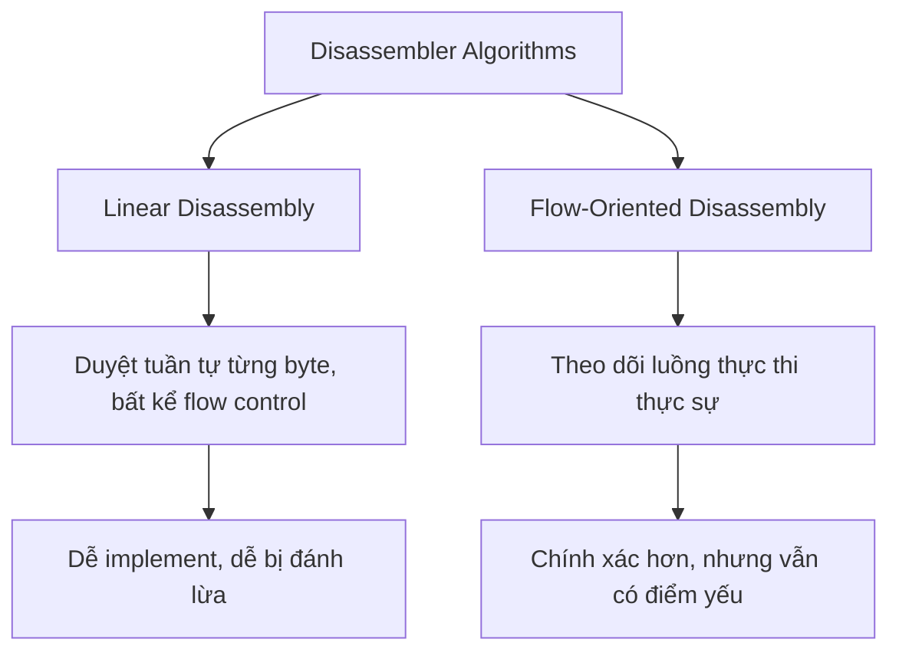
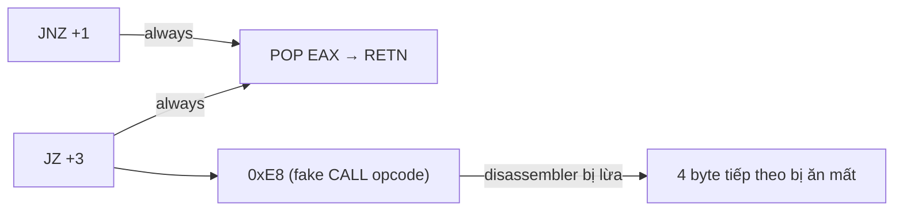
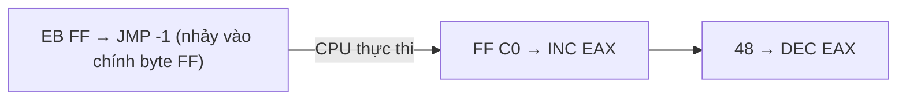
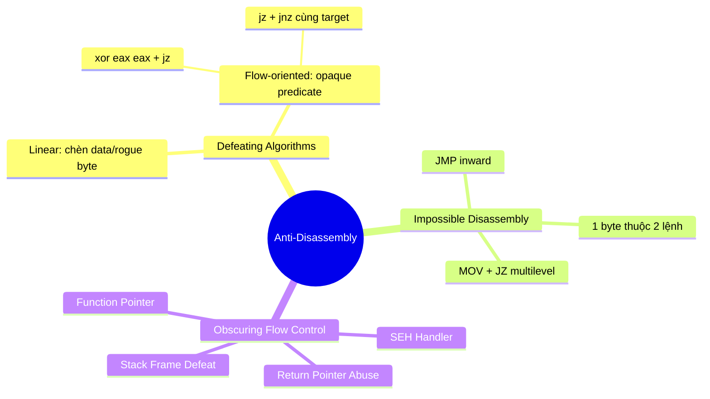

# Chương 15: Anti-Disassembly

---

## 1. Giới thiệu

**Anti-disassembly** là kỹ thuật tạo ra mã hoặc dữ liệu đặc biệt khiến công cụ phân tích disassembly tạo ra danh sách lệnh **sai** so với những gì thực sự được thực thi.

> **Mục tiêu của kỹ thuật này:**
> - Làm chậm hoặc ngăn chặn quá trình phân tích mã độc
> - Vô hiệu hóa các công cụ phát hiện tự động (antivirus heuristic, similarity detection)
> - Tăng độ khó yêu cầu kỹ năng cao hơn từ phía analyst

---

## 2. Hiểu về Disassembly

Disassembly **không đơn giản**: cùng một chuỗi byte có thể cho ra nhiều cách diễn giải lệnh khác nhau. Malware author lợi dụng điều này để tạo ra chuỗi lệnh *trông khác* với những gì CPU thực sự chạy.

### 2.1. Hai loại thuật toán Disassembler



---

## 3. Linear Disassembly

### Nguyên lý

Duyệt tuần tự qua từng byte, disassemble từng lệnh một mà **không quan tâm đến flow control**.

```c
// Ví dụ implement Linear Disassembly bằng libdisasm
char buffer[BUF_SIZE];
int position = 0;
while (position < BUF_SIZE) {
    x86_insn_t insn;
    int size = x86_disasm(buf, BUF_SIZE, 0, position, &insn);

    if (size != 0) {
        char disassembly_line[1024];
        x86_format_insn(&insn, disassembly_line, 1024, intel_syntax);
        printf("%s\n", disassembly_line);
        position += size;       // (1) Tiến theo kích thước lệnh hợp lệ
    } else {
        position++;             // (2) Lệnh không hợp lệ → tiến 1 byte
    }
}
```

!!! warning "Nhược điểm"
    - Không phân biệt được **code** và **data** lẫn trong section `.text`
    - Tiếp tục disassemble cả sau `retn`, `jmp` — bao gồm cả pointer table của switch statement
    - Malware author chỉ cần chèn byte `0xE8` (opcode của `call`) vào cuối data table → disassembler sẽ "nuốt" thêm 4 byte tiếp theo làm operand, che giấu lệnh thật

---

## 4. Flow-Oriented Disassembly

### Nguyên lý

Theo dõi luồng thực thi thực sự: khi gặp `jmp`, `jz`, `call` — disassembler thêm target vào **danh sách chờ** để disassemble sau.

!!! example "Ví dụ so sánh"
    Cùng một đoạn byte, Linear cho ra:
    ```asm
    jz  short near ptr loc_15+5
    push Failed_string
    call printf
    jmp short loc_15+9
    Failed_string:
        inc esi
        popa
    loc_15:
        imul ebp, [ebp+64h], 0C3C03100h   ; ← sai, đây là data bị disassemble nhầm
    ```

    Flow-oriented cho ra kết quả **đúng**:
    ```asm
    test eax, eax
    jz   short loc_1A
    push Failed_string
    call printf
    jmp  short loc_1D
    Failed_string: db 'Failed', 0
    loc_1A:
        xor eax, eax
    loc_1D:
        retn
    ```

!!! info "Quy tắc của Flow-Oriented Disassembler"
    - Với **conditional branch** (`jz`/`jnz`): hầu hết disassembler xử lý **false branch trước**, trust nó hơn
    - Với **`call`**: xử lý byte ngay sau `call` trước, target của `call` sau → đây là điểm yếu bị khai thác

---

## 5. Các kỹ thuật Anti-Disassembly cụ thể

### 5.1. Jump cùng Target (Opaque Predicate kép)

**Cơ chế:** Hai lệnh nhảy có điều kiện ngược nhau, cùng trỏ đến một địa chỉ → thực chất là `jmp` vô điều kiện, nhưng disassembler không nhận ra.

```asm
74 03   jz  short loc_4011C5     ; nếu ZF=1 → nhảy
75 01   jnz short loc_4011C5     ; nếu ZF=0 → nhảy
; → luôn nhảy, KHÔNG BAO GIỜ rơi vào byte dưới
E8      db  0E8h                 ; ← rogue byte, disassembler bị lừa đọc đây là CALL
; ---------------------
loc_4011C5:
58      pop  eax
C3      retn
```



!!! tip "Cách phát hiện"
    Trong IDA Pro, cross-reference tại `loc_4011C4` sẽ hiển thị màu **đỏ** thay vì xanh — vì reference trỏ vào **giữa** một lệnh, không phải đầu lệnh.

**Fix trong IDA Pro:**
- Đặt cursor lên byte `0xE8`, nhấn **`D`** → chuyển thành data
- Đặt cursor lên `loc_4011C5`, nhấn **`C`** → chuyển thành code

---

### 5.2. Điều kiện Hằng (Single False Conditional)

**Cơ chế:** Dùng một conditional jump mà điều kiện **luôn luôn đúng** tại runtime, nhưng disassembler không biết điều đó.

```asm
33 C0   xor eax, eax     ; ZF luôn = 1 sau lệnh này
74 01   jz  loc_4011C5   ; điều kiện luôn đúng → luôn nhảy
; disassembler xử lý false branch trước:
E9      db  0E9h          ; ← rogue byte (opcode JMP 5-byte), che 4 byte tiếp theo
; ---------------------
loc_4011C5:
58      pop  eax
C3      retn
```

!!! note "Byte rogue phổ biến"
    | Byte | Opcode tương ứng | Kích thước |
    |------|-----------------|-----------|
    | `0xE8` | `CALL` | 5 bytes |
    | `0xE9` | `JMP` (near) | 5 bytes |

    → Chèn 1 byte này → disassembler "nuốt" thêm 4 byte operand → **che giấu 4 byte lệnh thật**

---

### 5.3. Impossible Disassembly (Byte dùng chung cho nhiều lệnh)

**Cơ chế nâng cao:** Một byte là một phần của **hai lệnh khác nhau** đều được thực thi. Không có disassembler nào hiện tại biểu diễn được điều này.

#### Ví dụ đơn giản (4 byte):

```
EB FF C0 48
```



- `EB FF`: `JMP -1` → nhảy đến byte `FF` (byte thứ 2 của chính lệnh JMP)
- `FF C0`: `INC EAX`
- `48`: `DEC EAX`
- Kết quả thực tế: EAX tăng rồi giảm = **NOP phức tạp**
- Disassembler không thể biểu diễn `FF` vừa thuộc `JMP` vừa thuộc `INC EAX`

#### Ví dụ phức tạp hơn:

```asm
66 B8 EB 05   mov ax, 5EBh       ; ← byte EB 05 vừa là operand, vừa là lệnh JMP +5
31 C0         xor eax, eax       ; → ZF luôn = 1
74 F9         jz  -7             ; nhảy về byte EB 05 (giữa lệnh MOV ở trên!)
E8 ...        call <fake>        ; ← KHÔNG BAO GIỜ thực thi, nhưng disassembler thấy
; --- Thực ra nhảy đến:
EB 05         jmp +5             ; từ byte EB 05 trong operand của MOV
58            pop eax
C3            retn
```

**Fix bằng IDAPython:**

```python
def NopBytes(start, length):
    for i in range(0, length):
        PatchByte(start + i, 0x90)
    MakeCode(start)

NopBytes(0x004011C0, 4)   # NOP phần MOV ax bị dùng chung
NopBytes(0x004011C6, 3)   # NOP jz + E8 rogue
```

Kết quả sau khi fix:
```asm
90          nop
90          nop
90          nop
90          nop
31 C0       xor eax, eax
90          nop
90          nop
90          nop
58          pop eax
C3          retn
```

**Script NOP tiện lợi với hotkey ALT-N trong IDA Pro:**

```python
import idaapi
idaapi.CompileLine('static n_key() { RunPythonStatement("nopIt()"); }')
AddHotkey("Alt-N", "n_key")

def nopIt():
    start = ScreenEA()
    end   = NextHead(start)
    for ea in range(start, end):
        PatchByte(ea, 0x90)
    Jump(end)
    Refresh()
```

---

## 6. Obscuring Flow Control (Che giấu luồng điều khiển)

### 6.1. Function Pointer

**Vấn đề:** IDA Pro có thể phát hiện khi địa chỉ hàm được load vào biến, nhưng **không phát hiện** được tất cả các chỗ gọi qua pointer đó.

```asm
mov [ebp+var_4], offset sub_4011C0  ; IDA thấy reference này
call [ebp+var_4]                     ; ← IDA Pro KHÔNG thêm cross-ref
call [ebp+var_4]                     ; ← IDA Pro KHÔNG thêm cross-ref
```

**Fix bằng IDC:**
```c
AddCodeXref(0x004011DE, 0x004011C0, fl_CF);
AddCodeXref(0x004011EA, 0x004011C0, fl_CF);
```

---

### 6.2. Return Pointer Abuse

**Cơ chế:** Dùng `retn` như một `jmp` tùy ý bằng cách thao túng giá trị trên stack.

```asm
004011C0  call $+5          ; push địa chỉ 004011C5 lên stack
004011C5  add [esp+0], 5    ; cộng thêm 5 → stack top = 004011CA
004011C9  retn              ; pop và nhảy đến 004011CA
; ← IDA Pro kết thúc hàm ở đây, nghĩ rằng hàm đã xong

004011CA  push ebp          ; ← hàm THẬT bắt đầu ở đây, IDA không biết
004011CB  mov ebp, esp
...
004011D6  retn
```

!!! warning "Hậu quả"
    - IDA Pro **kết thúc hàm sớm** tại `retn` giả
    - Phần code thật sau đó **không được gán vào hàm nào** → analyst bỏ sót
    - Không có cross-reference đến hàm thật

**Fix:**
- NOP 3 lệnh đầu (`call $+5`, `add [esp]`, `retn`)
- Nhấn **ALT-P** trong IDA Pro → điều chỉnh lại function boundary

---

### 6.3. Structured Exception Handling (SEH) Abuse

**Cơ chế:** Dùng SEH để chuyển flow đến một hàm mà disassembler **không thấy bất kỳ cross-reference nào**.

#### Cấu trúc SEH chain:
```c
struct _EXCEPTION_REGISTRATION {
    DWORD prev;     // con trỏ đến record trước
    DWORD handler;  // con trỏ đến hàm xử lý exception
};
```

SEH chain được trỏ bởi `fs:[0]` → là linked list trên stack, grows upward.

#### Thêm handler vào đầu chain:
```asm
push ExceptionHandler   ; địa chỉ hàm handler
push fs:[0]             ; record hiện tại (prev)
mov  fs:[0], esp        ; đặt record mới lên đầu chain
```

#### Kích hoạt exception để trigger handler:
```asm
xor ecx, ecx    ; ECX = 0
div ecx         ; divide by zero → exception! → gọi ExceptionHandler
```

#### Khôi phục stack trong handler:
```asm
mov esp, [esp+8]    ; lấy lại ESP ban đầu (OS thêm 1 handler nữa → +8)
mov eax, fs:[0]
mov eax, [eax]
mov eax, [eax]
mov fs:[0], eax     ; unlink cả 2 handler
add esp, 8
; → tiếp tục code thật
```

!!! example "Ví dụ thực tế"
    ```asm
    00401050  mov  eax, (offset loc_40106B+1)
    00401055  add  eax, 14h               ; EAX = 401080 (địa chỉ hàm ẩn)
    00401058  push eax                    ; push ExceptionHandler
    00401059  push large dword ptr fs:0
    00401060  mov  large fs:0, esp        ; đăng ký handler
    00401067  xor  ecx, ecx
    00401069  div  ecx                    ; kích hoạt exception
    0040106B  call Sleep                  ; ← KHÔNG BAO GIỜ thực thi
    ; IDA Pro không biết hàm tại 401080 được gọi
    ```

    Nhấn **`C`** tại `401080` để lộ ra code ẩn:
    ```asm
    00401080  mov  esp, [esp+8]
    00401094  add  esp, 8
    00401097  push offset aMysteryCode
    0040109C  call printf                 ; ← code thật ở đây
    ```

---

### 6.4. Defeating Stack-Frame Analysis

**Cơ chế:** Tạo conditional branch với điều kiện hằng liên quan đến ESP → disassembler chọn sai nhánh → phân tích stack frame sai → IDA Pro báo hàm có 62 tham số thay vì 0.

```asm
sub esp, 8
sub esp, 4
cmp esp, 1000h       ; ESP luôn > 0x1000 trong Windows process bình thường
jl  short loc_less   ; false branch: IDA xử lý trước, tin tưởng hơn
add esp, 4           ; true path: chỉ undo lệnh sub esp, 4 ở trên
jmp short loc_done
loc_less:
add esp, 104h        ; IDA bị lừa tin đây là path thật → stack offset sai
loc_done:
; ... code thật với ESP-based frame ...
```

!!! tip "Fix"
    - **ALT-K** trong IDA Pro → điều chỉnh thủ công giá trị stack pointer tại một dòng
    - Hoặc NOP toàn bộ đoạn manipulation bằng script IDAPython

---

## 7. Tổng kết



| Kỹ thuật | Tấn công vào | Fix trong IDA Pro |
|----------|-------------|-------------------|
| jz + jnz cùng target | Flow-oriented false branch | `D` trên rogue byte, `C` trên target |
| xor + jz hằng | False branch trust | `D` + `C` |
| Byte dùng chung | Giới hạn biểu diễn của disassembler | `PatchByte` NOP |
| Function pointer | Cross-reference tracking | `AddCodeXref` |
| `retn` abuse | Function boundary detection | NOP + ALT-P |
| SEH handler | Không có cross-ref | `C` trên vùng data ẩn |
| Stack frame defeat | ESP analysis | ALT-K hoặc NOP |

!!! quote "Nguyên tắc cốt lõi"
    Mọi kỹ thuật anti-disassembly đều khai thác một **giả định** hoặc **lựa chọn** mà disassembler buộc phải đưa ra. Hiểu được disassembler đưa ra giả định gì → biết cách bẫy nó → biết cách phát hiện và vô hiệu hóa bẫy đó.
