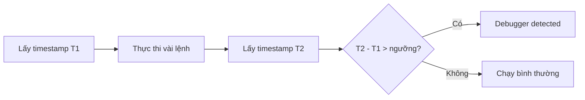
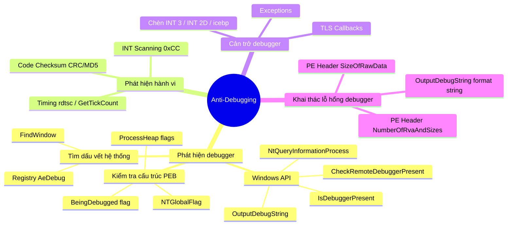

# Chương 16: Anti-Debugging — Kỹ thuật chống gỡ lỗi trong Malware

---

## Tổng quan

**Anti-debugging** là kỹ thuật malware dùng để phát hiện hoặc cản trở debugger, nhằm làm chậm quá trình phân tích. Khi phát hiện debugger, malware có thể:

- Thay đổi luồng thực thi
- Tự crash
- Ẩn payload độc hại

---

## 1. Phát hiện Debugger qua Windows API

### 1.1 `IsDebuggerPresent`

Hàm đơn giản nhất. Kiểm tra trường `IsDebugged` trong **Process Environment Block (PEB)**.

- Trả về `0` → không có debugger
- Trả về khác `0` → có debugger đang gắn vào

### 1.2 `CheckRemoteDebuggerPresent`

Tương tự `IsDebuggerPresent` nhưng nhận thêm **process handle** → có thể kiểm tra tiến trình khác (hoặc chính nó).

> **Lưu ý:** Tên hàm gây nhầm lẫn — nó **không** kiểm tra máy từ xa, mà kiểm tra tiến trình trên máy cục bộ.

### 1.3 `NtQueryInformationProcess`

Hàm native trong `Ntdll.dll`. Tham số thứ hai quan trọng:

| Giá trị | Ý nghĩa |
|---|---|
| `0x7` (ProcessDebugPort) | Nếu đang debug → trả về port number; không debug → trả về `0` |

### 1.4 `OutputDebugString` — Kỹ thuật phát hiện qua lỗi

```c
DWORD errorValue = 12345;
SetLastError(errorValue);
OutputDebugString("Test for Debugger");
if (GetLastError() == errorValue) {
    ExitProcess();       // Có debugger → hàm thành công → error code không đổi
} else {
    RunMaliciousPayload(); // Không có debugger → hàm thất bại → error code thay đổi
}
```

**Logic:** Nếu không có debugger, `OutputDebugString` thất bại và ghi đè `GetLastError`. Nếu có debugger, nó thành công và giá trị lỗi giữ nguyên.

---

## 2. Kiểm tra cấu trúc bộ nhớ thủ công (Manual Structure Checks)

Malware ưa dùng phương pháp này hơn Windows API vì **khó hook hơn**.

### 2.1 Cấu trúc PEB

```
typedef struct _PEB {
    BYTE Reserved1[2];
    BYTE BeingDebugged;    // offset 0x02
    ...
    ULONG SessionId;
} PEB, *PPEB;
```

PEB luôn truy cập được qua: `fs:[30h]`

### 2.2 Kiểm tra `BeingDebugged` flag

| Phương pháp | Assembly |
|---|---|
| mov method | `mov eax, dword ptr fs:[30h]` → `mov ebx, byte ptr [eax+2]` → `test ebx, ebx` → `jz NoDebuggerDetected` |
| push/pop method | `push dword ptr fs:[30h]` → `pop edx` → `cmp byte ptr [edx+2], 1` → `je DebuggerDetected` |

**Bypass:**
- Dùng OllyDbg plugin: **Hide Debugger**, **Hidedebug**, **PhantOm**
- Tay sửa `BeingDebugged = 0` trong bộ nhớ
- Sửa Zero Flag ngay trước lệnh `jmp`

### 2.3 Kiểm tra `ProcessHeap` (Heap Flags)

`ProcessHeap` nằm ở offset `0x18` trong PEB. Heap header của debug process có các flag đặc biệt:

| Field | Offset (XP) | Offset (Win7 32-bit) |
|---|---|---|
| `ForceFlags` | `0x10` | `0x44` |
| `Flags` | `0x0C` | `0x40` |

```asm
mov eax, large fs:30h
mov eax, dword ptr [eax+18h]   ; trỏ đến ProcessHeap
cmp dword ptr ds:[eax+10h], 0  ; kiểm tra ForceFlags
jne DebuggerDetected
```

**Bypass:** Dùng WinDbg với flag `-hd` để tắt debug heap:
```
windbg -hd notepad.exe
```

### 2.4 Kiểm tra `NTGlobalFlag`

Nằm tại offset `0x68` trong PEB. Khi process được khởi chạy từ debugger, giá trị này = `0x70`:

```
FLG_HEAP_ENABLE_TAIL_CHECK     (0x10)
| FLG_HEAP_ENABLE_FREE_CHECK   (0x20)
| FLG_HEAP_VALIDATE_PARAMETERS (0x40)
= 0x70
```

```asm
mov eax, large fs:30h
cmp dword ptr ds:[eax+68h], 70h
jz DebuggerDetected
```

---

## 3. Tìm kiếm dấu vết debugger trên hệ thống

### 3.1 Registry Key

```
HKEY_LOCAL_MACHINE\SOFTWARE\Microsoft\Windows NT\CurrentVersion\AeDebug
```

Nếu key này trỏ đến OllyDbg thay vì Dr. Watson (mặc định) → malware biết đang bị phân tích.

### 3.2 FindWindow — Tìm cửa sổ debugger

```c
if (FindWindow("OLLYDBG", 0) == NULL) {
    // Debugger Not Found
} else {
    // Debugger Detected
}
```

Malware tìm cửa sổ có tên đặc trưng của debugger đang chạy.

---

## 4. Phát hiện hành vi Debugger

### 4.1 INT Scanning — Quét opcode `0xCC`

INT 3 (`0xCC`) là opcode dùng để đặt **software breakpoint**. Malware tự quét code của mình:

```asm
call $+5
pop edi
sub edi, 5          ; EDI = địa chỉ đầu code
mov ecx, 400h
mov eax, 0CCh
repne scasb         ; quét tìm byte 0xCC
jz DebuggerDetected
```

**Bypass:** Dùng **hardware breakpoints** thay vì software breakpoints (hardware breakpoints không chèn `0xCC` vào code).

### 4.2 Code Checksum

Malware tính **CRC** hoặc **MD5** trên đoạn code của chính nó rồi so với giá trị chuẩn. Nếu lệch → có breakpoint đã chèn `0xCC`.

**Bypass:** Dùng hardware breakpoints hoặc sửa tay kết quả so sánh.

### 4.3 Timing Checks — Phát hiện qua độ trễ

Process chạy **chậm hơn đáng kể** khi bị debug (đặc biệt khi single-step).



#### `rdtsc` — Đọc timestamp counter CPU

```asm
rdtsc               ; lần 1 → kết quả vào EDX:EAX
xor ecx, ecx
add ecx, eax
rdtsc               ; lần 2
sub eax, ecx        ; delta
cmp eax, 0xFFF
jb NoDebuggerDetected
rdtsc
push eax
ret                 ; nhảy đến địa chỉ ngẫu nhiên nếu bị debug
```

#### `QueryPerformanceCounter` và `GetTickCount`

```c
a = GetTickCount();
MaliciousActivityFunction();
b = GetTickCount();
delta = b - a;
if (delta > 0x1A) {
    // Debugger Detected
} else {
    // Debugger Not Found
}
```

**Bypass timing checks:** Đặt breakpoint **sau** cả 2 lần gọi → không bị phát hiện. Hoặc sửa kết quả so sánh tại runtime.

---

## 5. Cản trở hoạt động Debugger

### 5.1 TLS Callbacks

**Thread Local Storage (TLS)** callback cho phép chạy code **trước** entry point của chương trình. Debugger thường pause tại entry point → bỏ qua TLS callback.

```
PE Header → .tls section → TLS callback functions
                            ↓
                   Chạy TRƯỚC main entry point
```

**Phát hiện:** Xem `.tls` section trong PEview hoặc nhấn `Ctrl+E` trong IDA Pro để xem tất cả entry points.

**Bypass trong OllyDbg:** Options → Debugging Options → Events → chọn **System breakpoint** làm điểm dừng đầu tiên.

> **Lưu ý:** OllyDbg 2.0 và WinDbg luôn dừng trước TLS callback.

### 5.2 Exceptions

Debugger mặc định **bắt exception** và không truyền cho process. Malware lợi dụng điều này: nếu exception handler của nó không được gọi → biết đang bị debug.

**Bypass:** Trong OllyDbg: Options → Debugging Options → Exceptions → tick **pass all exceptions to program**.

### 5.3 Chèn Interrupts

#### INT 3 (`0xCC`) giả

```asm
push offset continue
push dword fs:[0]
mov fs:[0], esp
int 3               ; nếu có debugger → debugger bắt, không nhảy đến continue
continue:           ; nếu không có debugger → SEH xử lý, nhảy đến đây
```

#### INT 2D (Kernel Debugger)

`INT 0x2D` là cơ chế kernel debugger dùng để đặt breakpoint → malware chèn vào gây rối.

#### ICE Breakpoint (`0xF1` — `icebp`)

Lệnh không có tài liệu của Intel. Khi single-stepping, debugger **tưởng** đây là exception bình thường của single-step → không gọi exception handler của malware → luồng thực thi bị gián đoạn.

**Bypass:** Không single-step qua lệnh `icebp`.

---

## 6. Khai thác lỗ hổng của Debugger

### 6.1 PE Header — `NumberOfRvaAndSizes`

Trường này chỉ số phần tử trong `DataDirectory`. Giá trị hợp lệ tối đa = `0x10`.

- OllyDbg dùng giá trị này trực tiếp → đặt thành `0x99` → OllyDbg crash với lỗi *"Bad or Unknown 32-bit Executable File"*
- Windows loader bỏ qua giá trị > `0x10` → chạy bình thường ngoài debugger

**Bypass:** Dùng hex editor sửa `NumberOfRvaAndSizes = 0x10`, hoặc dùng WinDbg / OllyDbg 2.0.

### 6.2 PE Header — `SizeOfRawData`

- `VirtualSize`: kích thước section khi load vào bộ nhớ
- `SizeOfRawData`: kích thước trên disk

Windows loader dùng giá trị **nhỏ hơn**. OllyDbg dùng `SizeOfRawData` → đặt thành `0x77777777` → crash với lỗi *"File contains too much data"*.

**Bypass:** Sửa `SizeOfRawData` về gần bằng `VirtualSize` bằng hex editor hoặc PE Explorer.

### 6.3 `OutputDebugString` Format String

```
OutputDebugString("%s%s%s%s%s%s%s%s%s%s%s%s%s%s")
```

Khai thác lỗ hổng format string trong **OllyDbg 1.1** → crash debugger.

**Bypass:** Dùng OllyDbg 2.0 hoặc WinDbg.

---

## Tổng kết — Phân loại kỹ thuật



---

## Chiến lược bypass tổng quát

| Tình huống | Hành động |
|---|---|
| API check (`IsDebuggerPresent`...) | Patch lệnh gọi hoặc sửa giá trị trả về |
| PEB flag check | Sửa tay flag trong bộ nhớ; dùng plugin Hide Debugger |
| Timing check | Đặt breakpoint sau cả 2 lần gọi; sửa kết quả so sánh |
| INT scanning | Dùng hardware breakpoints |
| TLS callback | Đặt debugger dừng tại system breakpoint |
| Exception-based | Pass all exceptions to program trong settings |
| PE Header crash | Sửa bằng hex editor hoặc PE Explorer |
| `icebp` | Không single-step qua lệnh đó |

> **Nguyên tắc vàng:** Khi thấy code kết thúc sớm bất thường tại một conditional jump → nghi ngờ ngay đây là anti-debugging. Theo dõi các lệnh đọc `fs:[30h]`, gọi Windows API timing, hoặc so sánh timestamp.
