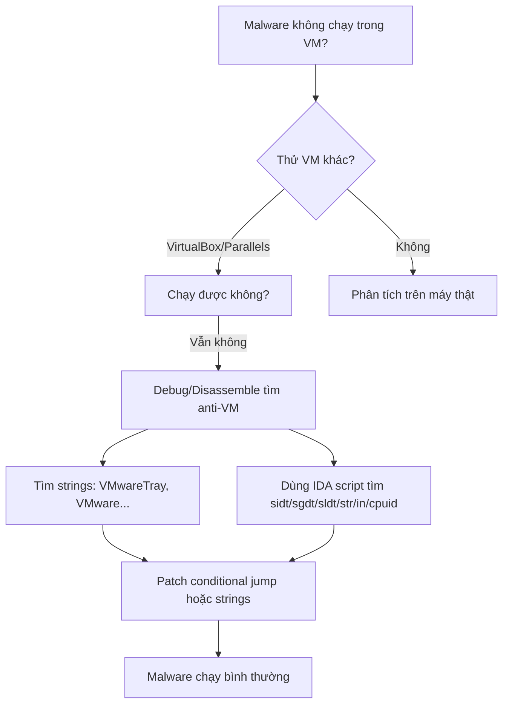

# Chương 17: Kỹ Thuật Anti-Virtual Machine (Anti-VM)

---

## Tổng quan

> **Anti-VM** là kỹ thuật malware dùng để phát hiện môi trường máy ảo. Nếu phát hiện VM, malware sẽ hoạt động khác đi hoặc không chạy — gây khó khăn cho analyst.

**Tại sao anti-VM phổ biến trong bot, scareware, spyware?**
Vì honeypot thường dùng VM, và malware nhắm vào máy người dùng thông thường — vốn hiếm khi chạy VM. Tuy nhiên, xu hướng này đang **giảm dần** do virtualization ngày càng phổ biến (cả admin lẫn user đều dùng VM để snapshot/rollback).

---

## 1. VMware Artifacts

VMware để lại nhiều "dấu vết" trên hệ thống, đặc biệt khi **VMware Tools** được cài.

### 1.1 Process Artifacts

Malware có thể quét process listing để tìm chuỗi `VMware`:

| Process | Vai trò |
|---|---|
| `VMwareService.exe` | VMware Tools Service (con của `services.exe`) |
| `VMwareTray.exe` | System tray icon |
| `VMwareUser.exe` | User-level VMware Tools component |

Kiểm tra bằng lệnh:

```cmd
net start | findstr VMware
```

Output trả về:
```
VMware Physical Disk Helper Service
VMware Tools Service
```

### 1.2 Registry Artifacts

Tìm kiếm `VMware` trong registry sẽ thấy các key như:

```registry
[HKEY_LOCAL_MACHINE\HARDWARE\DEVICEMAP\Scsi\Scsi Port 0\Scsi Bus 0\Target Id 0\Logical Unit Id 0]
"Identifier"="VMware Virtual IDE Hard Drive"

[HKEY_LOCAL_MACHINE\SOFTWARE\Microsoft\Windows\CurrentVersion\Reinstall\0000]
"DeviceDesc"="VMware Accelerated AMD PCNet Adapter"
"Mfg"="VMware, Inc."

[HKEY_LOCAL_MACHINE\SYSTEM\ControlSet001\Control\Class\{4D36E96F-...}\0000]
"ProviderName"="VMware, Inc."
"InfSection"="VMMouse"
```

### 1.3 MAC Address Artifacts

VMware phải tạo **virtual MAC address** cho VM. Ba byte đầu MAC address xác định vendor:

!!! warning "MAC Address VMware"
    MAC address bắt đầu bằng `00:0C:29` → xác định là VMware.
    Malware chỉ cần check 3 byte đầu của MAC address là đủ để phát hiện VM.

### 1.4 Cách vô hiệu hóa VMware Artifacts

```cmd
net stop "VMware Tools Service"
```

Hoặc gỡ hoàn toàn VMware Tools. Sau đó nếu malware vẫn check string như `VMwareTray.exe` → tìm cross-reference trong IDA Pro và **patch** đoạn code đó.

---

## 2. Phân tích Case Study: vmt.exe

Ví dụ thực tế: chạy `strings` lên `vmt.exe`, phát hiện chuỗi `VMwareTray.exe`. Theo cross-reference đến `0x401098`:

```asm
; Tạo snapshot toàn bộ process list
0040102D  call  ds:CreateToolhelp32Snapshot
00401033  lea   ecx, [ebp+processentry32]
00401047  call  ds:Process32FirstW

; Vòng lặp qua từng process
00401060  loc_401060:
...
; Convert tên process từ Unicode sang ASCII
0040107D  call  esi ; WideCharToMultiByte

; So sánh với chuỗi "VMwareTray.exe"
00401098  push  offset Str2 ; "VMwareTray.exe"
0040109E  call  edi ; strncmp

; Nếu khớp → exit ngay
004010A5  jz    short loc_4010C0
...
004010C2  call  ds:exit
```

**Logic:** Duyệt process list → convert Unicode → so sánh với `VMwareTray.exe` → nếu tìm thấy thì `exit()`.

### Cách bypass:

???+ success "3 cách bypass phát hiện process"
    1. **Patch jump** tại `0x4010A5`: sửa `jz` thành `jnz` hoặc `nop` để jump không bao giờ được thực thi.
    2. **Hex editor**: đổi chuỗi `VMwareTray.exe` → `XXXareTray.exe` trong binary để `strncmp` luôn fail.
    3. **Gỡ VMware Tools**: `VMwareTray.exe` sẽ không còn tồn tại trong process list.

---

## 3. Memory Artifacts

VMware để lại dấu vết trong **physical memory** do quá trình virtualization. Một kỹ thuật đơn giản là quét physical memory tìm chuỗi `VMware` — có thể trả về hàng trăm kết quả.

---

## 4. Vulnerable Instructions (Lệnh x86 bị khai thác)

!!! info "Bối cảnh"
    VMware dùng **binary translation** ở kernel mode để emulate privileged instructions. Ở user mode, code chạy trực tiếp trên CPU. Để tránh performance hit khi emulate toàn bộ lệnh, VMware **bỏ qua** một số lệnh — dẫn đến kết quả khác nhau giữa VM và máy thật.

### Các cấu trúc bộ nhớ quan trọng:

| Register | Bảng | Mô tả |
|---|---|---|
| IDTR | IDT (Interrupt Descriptor Table) | Xác định response cho interrupt/exception |
| GDTR | GDT (Global Descriptor Table) | Chứa segment descriptors |
| LDTR | LDT (Local Descriptor Table) | Tương tự GDT, ít dùng hơn |

!!! note
    Windows dùng **flat memory model**, chỉ dùng GDT, không dùng LDT theo mặc định.

---

## 5. Kỹ Thuật Red Pill (sidt)

**Nguyên lý:** VMware phải **relocate** IDTR của guest để tránh xung đột với host. Khi malware chạy lệnh `sidt` (không bị trap bởi VMware), nó nhận được IDTR của guest — khác với giá trị trên máy thật. Red Pill kiểm tra sự khác biệt này.

```asm
lea  eax, [ebp+Dst]
sidt fword ptr [eax]      ; Lưu IDTR vào bộ nhớ (6 bytes)
mov  al, [eax+5]          ; Lấy byte thứ 5 (base address cao)
cmp  al, 0FFh             ; So sánh với VMware signature
jnz  short loc_401E19     ; Không khớp → không phải VMware
```

**IDTR structure (6 bytes):**
- Byte 0-1: Limit
- Byte 2-5: Base address (byte 5 = byte cao nhất)
- VMware signature: byte thứ 5 = `0xFF`

!!! warning "Hạn chế của Red Pill"
    Chỉ hoạt động trên **single-processor**. Với multicore, mỗi CPU có IDT riêng → kết quả `sidt` không ổn định → không đáng tin cậy.

**Bypass:** Chạy trên máy multicore, hoặc NOP lệnh `sidt`.

---

## 6. Kỹ Thuật No Pill (sgdt / sldt)

**Nguyên lý:** Windows không dùng LDT. VMware cung cấp virtual LDT support. Do đó:
- Máy thật: LDT location = **0**
- Trong VMware: LDT location = **khác 0**

Chỉ cần `sldt` rồi kiểm tra kết quả có bằng 0 không.

**Bypass:** Trong VMware, vào **VM → Settings → Processors** → tick **"Disable Acceleration"**.

No Pill còn dùng thêm `smsw` để kiểm tra các undocumented high-order bits khi `sldt` fail (do acceleration đã bị disable).

---

## 7. I/O Communication Port (Phổ biến nhất)

!!! danger "Kỹ thuật phổ biến nhất hiện tại"
    Được dùng trong nhiều worm/bot nổi tiếng: **Storm worm**, **Phatbot/Agobot**.

VMware dùng **virtual I/O port** để giao tiếp giữa guest và host (ví dụ: copy-paste). Port này có thể được query để detect VMware.

### Các magic values:

| Register | Giá trị | Ý nghĩa |
|---|---|---|
| EAX | `0x564D5868` (`VMXh`) | Magic number |
| ECX | `0x0A` | "Get VMware version type" |
| ECX | `0x14` | "Get memory size" |
| DX | `0x5668` (`VX`) | VMware I/O communication port |

### Phatbot implementation:

```asm
004014FE  mov eax, 'VMXh'       ; EAX = magic number 0x564D5868
00401503  mov ebx, [ebp+var_1C] ; EBX = địa chỉ nhận reply
00401506  mov ecx, 0xA          ; ECX = get version type
00401509  mov dx, 'VX'          ; DX  = I/O port 0x5668
0040150E  in  eax, dx           ; Thực thi I/O query

; Kiểm tra kết quả
00401541  cmp eax, 'VMXh'       ; Nếu VMware → echo lại VMXh
00401546  jnz short loc_40155C  ; Không khớp → không phải VMware
```

**Cơ chế:** Nếu đang trong VMware và magic value khớp, VMware monitor sẽ echo `VMXh` vào EBX. ECX sau đó chứa loại VMware: `1=Express`, `2=ESX`, `3=GSX`, `4=Workstation`.

**Bypass:** Patch conditional jump tại `0x401546` để bỏ qua kết quả so sánh.

---

## 8. Kỹ Thuật str Instruction

Lệnh `str` lấy segment selector từ **task register**, trỏ đến TSS (Task State Segment). Giá trị này khác nhau giữa VM và máy thật.

Trong `SNG.exe` tại `0x401224`:
```asm
00401224  str word ptr [ebp+var_1]   ; Lưu TSS selector
...
0040125A  cmp ecx, ecx               ; So sánh lần 1
00401262  cmp edx, 40h               ; So sánh lần 2 → detect VMware
00401267  push "Result: VMware detected\n\n"
```

!!! warning
    Kỹ thuật `str` cũng **không hoạt động** trên multiprocessor hardware.

---

## 9. Tổng hợp các Anti-VM Instructions

```
sidt   → Red Pill: đọc IDTR
sgdt   → No Pill: đọc GDTR  
sldt   → No Pill: đọc LDTR (LDT = 0 trên Windows thật)
smsw   → Kiểm tra high-order bits
str    → Đọc Task State Segment selector
in     → I/O port query (dx = 'VX', eax = 'VMXh')
cpuid  → Đọc thông tin CPU (có thể tiết lộ hypervisor)
```

!!! tip "Quy tắc vàng"
    Các lệnh này **vô dụng** trong user mode nếu không dùng để detect VM. Thấy chúng trong disassembly → **nghi ngờ anti-VM ngay**.

---

## 10. IDA Pro Script tìm Anti-VM Instructions

```python
from idautils import *
from idc import *

heads = Heads(SegStart(ScreenEA()), SegEnd(ScreenEA()))
antiVM = []

for i in heads:
    if (GetMnem(i) == "sidt" or GetMnem(i) == "sgdt" or 
        GetMnem(i) == "sldt" or GetMnem(i) == "smsw" or 
        GetMnem(i) == "str"  or GetMnem(i) == "in"   or 
        GetMnem(i) == "cpuid"):
        antiVM.append(i)

print "Number of potential Anti-VM instructions: %d" % (len(antiVM))

for i in antiVM:
    SetColor(i, CIC_ITEM, 0x0000ff)  # Highlight màu đỏ trong IDA
    Message("Anti-VM: %08x\n" % i)
```

Script này: duyệt toàn bộ instruction → tìm các lệnh nguy hiểm → **highlight màu đỏ** + in địa chỉ ra output window.

---

## 11. ScoopyNG — Tool Kiểm Tra VM

ScoopyNG (trapkit.de) implement **7 checks** khác nhau:

| Check | Kỹ thuật |
|---|---|
| 1 | `sidt` (Red Pill) |
| 2 | `sgdt` (No Pill) |
| 3 | `sldt` (No Pill) |
| 4 | `str` |
| 5 | I/O backdoor port `0xA` (get version) |
| 6 | I/O backdoor port `0x14` (get memory size) |
| 7 | Bug trong VMware cũ chạy emulation mode |

---

## 12. Tweaking VMware Settings (.vmx file)

Thêm vào file `.vmx` của VM để giảm khả năng bị phát hiện:

```ini
isolation.tools.getPtrLocation.disable = "TRUE"
isolation.tools.setPtrLocation.disable = "TRUE"
isolation.tools.setVersion.disable = "TRUE"
isolation.tools.getVersion.disable = "TRUE"
monitor_control.disable_directexec = "TRUE"
monitor_control.disable_chksimd = "TRUE"
monitor_control.disable_ntreloc = "TRUE"
monitor_control.disable_selfmod = "TRUE"
monitor_control.disable_reloc = "TRUE"
monitor_control.disable_btinout = "TRUE"
monitor_control.disable_btmemspace = "TRUE"
monitor_control.disable_btpriv = "TRUE"
monitor_control.disable_btseg = "TRUE"
```

**Giải thích quan trọng:**
- `disable_directexec`: buộc user-mode code phải emulate thay vì chạy thẳng trên CPU → chặn nhiều kỹ thuật detection
- 4 `isolation.tools.*`: chặn VMware backdoor commands, guest không lấy được info về host

!!! warning "Lưu ý"
    Các settings này **vô hiệu hóa VMware Tools** và có thể ảnh hưởng nặng đến performance. Chỉ dùng khi đã confirm malware dùng anti-VM. Bảo vệ được 6/7 check của ScoopyNG (trừ check 6 nếu không dùng multiprocessor).

---

## 13. VM Escape (Thoát khỏi VM)

???+ danger "VMware Vulnerabilities"
    - **Shared Folders**: từng có lỗ hổng cho phép guest ghi file tùy ý lên host. → **Tắt shared folders** nếu không cần.
    - **Cloudburst**: exploit trong display function của VMware, available trong Canvas pentest tool (đã được patch).
    - Tools hỗ trợ exploit VM sau khi escape: `VMchat`, `VMcat`, `VMftp`, `VMdrag-n-hack`, `VMdrag-n-sploit`.

---

## Tổng kết & Best Practices



| Bước | Hành động |
|---|---|
| 1 | Luôn dùng VM cho dynamic analysis |
| 2 | Nếu malware không chạy → thử gỡ VMware Tools |
| 3 | Thử VM khác (VirtualBox, Parallels) hoặc máy thật |
| 4 | Debug chậm, chú ý jump bất thường → có thể là anti-VM |
| 5 | Dùng IDA script tìm các instruction nghi ngờ |
| 6 | Patch jump/NOP instruction hoặc sửa string trong hex editor |
