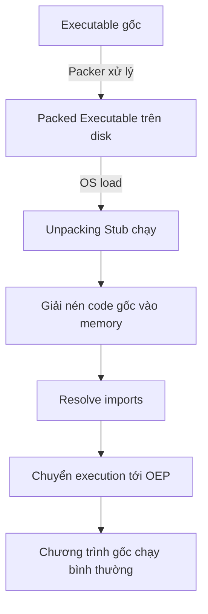
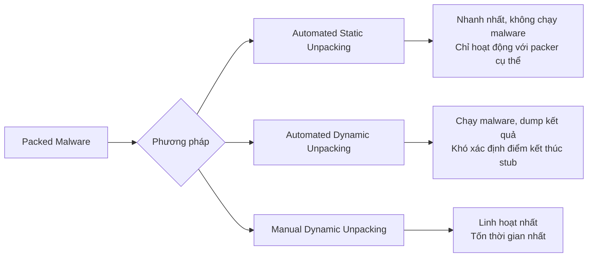
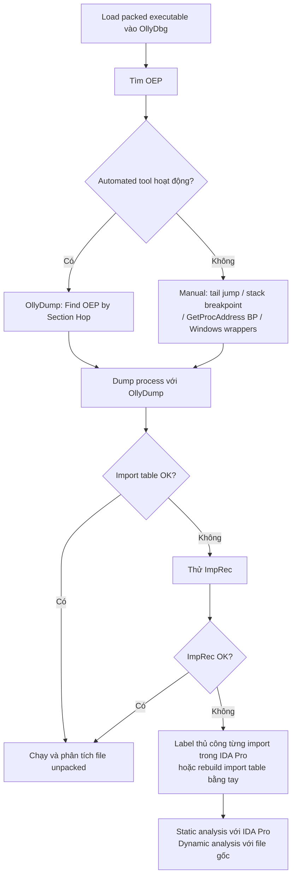

# Chương 18: Packers và Unpacking

## Tags
`malware-analysis` `reverse-engineering` `packing` `unpacking` `OEP` `static-analysis` `dynamic-analysis`

---

## 1. Packers là gì và tại sao malware dùng?

**Packer** là chương trình biến đổi một executable thành một executable mới, trong đó:

- Executable gốc được **nén, mã hóa hoặc biến đổi** và lưu dưới dạng data
- Executable mới chứa một **unpacking stub** được OS gọi thay vì code gốc

**Mục đích sử dụng:**

- Giảm kích thước file
- Qua mặt phần mềm diệt virus
- Cản trở phân tích (anti-reverse-engineering)

> **Lưu ý quan trọng:** Static analysis thông thường **hoàn toàn vô dụng** với packed executable — bạn chỉ đang phân tích unpacking stub, không phải chương trình thật.

---

## 2. Cơ chế hoạt động của Packer



### 2.1 Unpacking Stub

Stub là phần code nhỏ, duy nhất có thể nhìn thấy trong packed file. Nó thực hiện **3 bước**:

1. **Unpack** executable gốc vào memory
2. **Resolve imports** của chương trình gốc
3. **Transfer execution** tới OEP (Original Entry Point)

### 2.2 Các chiến lược xử lý Import Table

| Chiến lược | Mô tả | Độ stealth |
|---|---|---|
| Chỉ import `LoadLibrary` + `GetProcAddress` | Stub tự resolve toàn bộ | Cao |
| Giữ nguyên import table gốc | Windows loader tự xử lý | Thấp — lộ hết imports |
| Giữ 1 import/DLL | Stub resolve phần còn lại | Trung bình |
| Xóa hoàn toàn mọi import | Stub phải tự tìm functions | Rất cao, stub rất phức tạp |

---

## 3. Nhận diện Packed Program

### Dấu hiệu nhận biết

!!! warning "Indicators of Packed Malware"
    - Rất ít imports, đặc biệt chỉ có `LoadLibrary` và `GetProcAddress`
    - IDA Pro chỉ nhận diện được một lượng nhỏ code
    - OllyDbg cảnh báo chương trình có thể bị pack
    - Section names bất thường (vd: `UPX0`, `UPX1`)
    - `.text` section có **Raw Size = 0** nhưng **Virtual Size ≠ 0**

### Entropy Calculation

- **Entropy** đo mức độ "hỗn loạn" của dữ liệu
- File bị nén/mã hóa → entropy **rất cao**
- File thường → entropy thấp hơn
- Tool: **Mandiant Red Curtain** — tính threat score dựa trên entropy

---

## 4. Các phương pháp Unpacking



!!! danger "Lưu ý an toàn"
    Automated **dynamic** unpacking **chạy malware thật**. Luôn thực hiện trong môi trường sandbox/VM cô lập.

### 4.1 Automated Static Unpacking

- Không chạy executable
- Nhanh và hiệu quả nhất khi hoạt động
- Ví dụ tool: **PE Explorer** (hỗ trợ NSPack, UPack, UPX mặc định)
- Nhược điểm: chỉ hoạt động với packer đã biết, không qua được anti-analysis packers

### 4.2 Automated Dynamic Unpacking

- Chạy executable, để stub tự unpack, sau đó dump ra disk
- Khó khăn: xác định đúng điểm kết thúc stub (nếu sai → unpacking thất bại)

### 4.3 Manual Dynamic Unpacking

Quy trình chuẩn:

```
1. Load packed executable vào OllyDbg
2. Tìm OEP
3. Dump process ra memory (dùng OllyDump plugin)
4. Rebuild import table (dùng ImpRec nếu OllyDump thất bại)
```

---

## 5. Tìm OEP (Original Entry Point)

!!! info "Tại sao OEP quan trọng?"
    OEP là điểm bắt đầu thực sự của chương trình gốc. Toàn bộ quá trình manual unpacking xoay quanh việc tìm và nhảy đến OEP này.

### 5.1 Dùng Automated Tool — OllyDump "Find OEP by Section Hop"

- Unpacking stub thường nằm ở **section khác** với executable gốc
- OllyDbg phát hiện khi có transfer giữa 2 sections và dừng lại
- Có 2 chế độ:

| Chế độ | Ưu điểm | Nhược điểm |
|---|---|---|
| Step-over | Tránh false positive khi call sang section khác | Bỏ sót nếu call không return |
| Step-into | Tìm được OEP trong mọi trường hợp hơn | Nhiều false positive hơn |

> **Thực hành:** Thử cả hai, bắt đầu với step-over.

### 5.2 Tìm Tail Jump thủ công

**Tail jump** là lệnh nhảy cuối cùng từ stub sang OEP. Đây là kỹ thuật thủ công cơ bản nhất.

```asm
; Ví dụ tail jump của UPX (Listing 18-1)
00416C31 PUSH EDI
00416C32 CALL EBP
00416C34 POP EAX
00416C35 POPAD
00416C36 LEA EAX, DWORD PTR SS:[ESP-80]
00416C3A PUSH 0
00416C3C CMP ESP, EAX
00416C3E JNZ SHORT Sample84.00416C3A
00416C40 SUB ESP, -80
00416C43 JMP Sample84.00401000   ; <-- ĐÂY LÀ TAIL JUMP
00416C48 DB 00
00416C49 DB 00
; ... nhiều 0x00 bytes tiếp theo
```

**Đặc điểm nhận diện tail jump:**

- Là **lệnh cuối** trước một chuỗi bytes `0x00` dài (padding)
- Nhảy đến địa chỉ **rất xa** (hàng chục nghìn bytes) — không bình thường với loop/conditional
- Trong IDA Pro graph view: tail jump được **tô màu đỏ** vì IDA không thể resolve target
- Sau tail jump, code tại OEP chứa `ADD BYTE PTR DS:[EAX],AL` (toàn `0x00`) trước khi unpack, và code hợp lệ sau khi unpack

!!! tip "Biến thể của tail jump"
    Malware authors thường ngụy trang tail jump bằng:
    - `RET` thay vì `JMP`
    - `CALL` instruction
    - OS functions: `NtContinue`, `ZwContinue`
    - Pattern `PUSH <địa chỉ OEP>` + `RETN` (thấy nhiều trong UPack)

### 5.3 Breakpoint trên Stack

```
1. Ghi nhớ địa chỉ stack nơi giá trị đầu tiên được PUSH
2. Đặt hardware breakpoint READ tại địa chỉ đó
3. Mọi thứ sau đó push lên stack cao hơn (địa chỉ thấp hơn)
4. Chỉ khi stub hoàn tất, địa chỉ gốc mới được POP → trigger breakpoint
5. Tail jump thường ngay sau lệnh POP đó
```

!!! warning
    Không thể set breakpoint trực tiếp trong stack window của OllyDbg. Phải xem địa chỉ stack trong **memory dump window** rồi set breakpoint ở đó.

### 5.4 Breakpoint sau mỗi Loop

- Scan qua code, đặt breakpoint **sau mỗi vòng lặp** (kể cả loop lồng nhau)
- Tránh phải trace qua cùng một code lặp đi lặp lại
- Nhược điểm: tốn thời gian, dễ đặt sai chỗ khiến program chạy đến completion

### 5.5 Breakpoint trên `GetProcAddress`

- Hầu hết unpackers dùng `GetProcAddress` để resolve imports
- Đặt breakpoint tại đây → bypass phần đầu phức tạp nhất của stub
- Vẫn còn một đoạn code trước tail jump sau khi break

### 5.6 Breakpoint trên Windows wrapper functions

Dựa vào pattern: chương trình Windows luôn gọi một số functions nhất định ngay sau OEP.

| Loại chương trình | Function cần break |
|---|---|
| Command-line | `GetVersion`, `GetCommandLineA` |
| GUI | `GetModuleHandleA` |

```
1. Đặt breakpoint tại instruction đầu tiên của GetModuleHandleA (không phải call đến nó)
2. Khi break, xem stack frame trước → tìm function đã call GetModuleHandleA
3. Scroll lên tìm đầu function đó (thường bắt đầu bằng PUSH EBP / MOV EBP, ESP)
4. Đó rất có thể là OEP
```

### 5.7 OllyDbg Run Trace

- Cho phép đặt breakpoint trên **một vùng địa chỉ rộng**
- OEP luôn nằm trong `.text` section của file gốc
- Đặt break khi bất kỳ instruction nào trong `.text` section được thực thi → bắt được OEP

---

## 6. Dump và Rebuild Import Table

### 6.1 Quy trình cơ bản với OllyDump

```
1. Khi debugger đang ở OEP → ghi lại giá trị OEP
2. Plugins → OllyDump → Dump Debugged Process
3. OllyDump tự động:
   - Set entry point = current instruction pointer (= OEP)
   - Rebuild import table
4. Click Dump → xong
```

### 6.2 Khi OllyDump thất bại — Dùng Import Reconstructor (ImpRec)

```
1. Chạy ImpRec, mở dropdown → chọn packed executable đang chạy
2. Nhập RVA của OEP vào ô OEP
   Ví dụ: Image base = 0x400000, OEP = 0x403904 → nhập 0x3904
3. Click "IAT Autosearch" → ImpRec tìm Import Address Table
4. Click "Get Imports" → danh sách imports hiện ra bên trái
5. Kiểm tra: tất cả imports phải có "valid: YES"
6. Click "Fix Dump" → chọn file đã dump từ OllyDump
7. ImpRec xuất file mới với dấu underscore (_) ở tên file
```

### 6.3 Rebuild Import Table thủ công

Khi cả OllyDump lẫn ImpRec đều thất bại (packer xóa bảng tên imports):

```asm
; Ví dụ call đến imported function khi import table chưa được rebuild (Listing 18-4)
push eax
call dword_401244      ; call gián tiếp qua DWORD pointer
...
dword_401244: 0x7c4586c8   ; địa chỉ nằm ngoài loaded program
```

**Quy trình:**

```
1. Mở file trong IDA Pro (không có import info)
2. Khi gặp call đến imported function → navigate đến DWORD value
3. Mở OllyDbg → navigate đến địa chỉ đó → xem OllyDbg đã label gì
4. Label lại trong IDA Pro: vd imp_WriteFile
5. IDA Pro cross-reference sẽ tự label tất cả calls đến function đó
6. Lặp lại cho từng import gặp phải
```

!!! note "Hạn chế"
    Không thể chạy được file unpacked theo cách này. Nhưng vẫn dùng được cho **static analysis**, còn dynamic analysis vẫn dùng file packed gốc.

---

## 7. Phân tích khi không thể Unpack hoàn toàn

!!! info "Khi nào áp dụng?"
    Một số packers (như Themida) cực kỳ khó unpack. Trong trường hợp này, có thể phân tích hạn chế mà không cần unpack hoàn toàn.

- Dùng **IDA Pro** analyze từng section code cụ thể bằng cách navigate đến địa chỉ memory và mark làm code
- Chạy **Strings** trên file dump để tìm imported functions và thông tin hữu ích
- Dùng **ProcDump** (Microsoft tool) dump process từ memory **mà không cần debug** — rất hữu ích khi packer có anti-debugging mạnh
- Tập trung vào **dynamic analysis** hơn static analysis

---

## 8. Packed DLLs

DLL có thêm một số phức tạp so với EXE:

- DLL có OEP tại **đầu hàm `DllMain`**
- Unpacking stub được đặt vào `DllMain` thay vì main method
- Vấn đề: khi load DLL bằng `loadDll.exe` trong OllyDbg, `DllMain` được gọi **trước khi** OllyDbg break → stub đã chạy xong rồi

**Workaround:**

```
1. Mở PE file bằng hex editor
2. Tìm field "Characteristics" trong IMAGE_FILE_HEADER
3. Bit tại vị trí 0x2000 = 1 (DLL), đổi thành 0 → file được treat như EXE
4. OllyDbg mở như EXE → apply các kỹ thuật unpack bình thường
5. Sau khi tìm OEP xong → đổi bit 0x2000 trở về 1
```

---

## 9. Các Packer phổ biến và cách xử lý

### UPX (Ultimate Packer for eXecutables)

??? info "Chi tiết UPX"
    - **Loại:** Open source, miễn phí, phổ biến nhất
    - **Mục đích:** Nén để giảm kích thước, **không** tập trung bảo mật
    - **Unpack tự động:** `upx -d <file>` trực tiếp từ command line
    - **Tìm OEP:** Dùng "Find OEP by Section Hop" trong OllyDump, hoặc page down đến tail jump
    - **Lưu ý:** Nhiều malware giả vờ là UPX nhưng thực ra dùng packer khác hoặc UPX đã bị modify → `upx -d` sẽ thất bại

### PECompact

??? info "Chi tiết PECompact"
    - **Loại:** Commercial, có free student version
    - **Đặc điểm:** Anti-debugging exceptions, obfuscated code, plugin framework
    - **Tìm OEP:** Set OllyDbg để pass exceptions đến program → tìm tail jump dạng `JMP EAX` theo sau bởi nhiều `0x00` bytes

### ASPack

??? info "Chi tiết ASPack"
    - **Đặc điểm:** Self-modifying code, anti-debugging mạnh → setting breakpoint thường làm program terminate sớm
    - **Chiến lược:**
        1. Mở unpacking stub, tìm lệnh `PUSHAD` ở đầu
        2. Ghi nhớ stack addresses lưu registers
        3. Đặt **hardware breakpoint READ** tại một trong các địa chỉ đó
        4. Khi `POPAD` được gọi → breakpoint trigger → chỉ cách tail jump vài instructions

### Petite

??? info "Chi tiết Petite"
    - **Tương tự ASPack** về anti-debugging
    - Dùng **single-step exceptions** → pass exceptions to program
    - **Chiến lược:** Hardware breakpoint trên stack (giống ASPack)
    - **Điểm nhận biết OEP:** Code gốc trông "normal" hoàn toàn khác với Petite wrapper code
    - **Bonus:** Giữ ít nhất 1 import/DLL trong import table gốc → có thể thấy DLLs nào được dùng mà không cần unpack

### WinUpack / UPack

??? info "Chi tiết WinUpack/UPack"
    - **Mục đích:** Tối ưu nén, không tập trung bảo mật
    - **Vấn đề đặc biệt:** Tail jump nằm **ở giữa** unpacking stub (không phải cuối), OEP cùng section với stub → OllyDump section-hop thất bại

    ```asm
    ; Tail jump kiểu UPack (Listing 18-5)
    010103BA PUSH Sample_upac.01005F85   ; push địa chỉ OEP
    010103BF RETN                         ; <-- đây là tail jump thực sự
    ```

    - **Chiến lược:** Breakpoint trên `GetProcAddress` → single-step cẩn thận qua import resolution loops → eventually bắt được `RETN` là tail jump
    - **Thêm:** Thử `GetModuleHandleA` (GUI) hoặc `GetCommandLineA` (CLI)
    - **Lưu ý:** Có thể crash OllyDbg do PE header không chuẩn → dùng WinDbg thay thế

### Themida

??? info "Chi tiết Themida"
    - **Cực kỳ phức tạp:** Anti-VM, anti-debugger, anti-Process Monitor, kernel component
    - Code của Themida **tiếp tục chạy** trong suốt thời gian program gốc chạy
    - Packed file **rất lớn** do nhiều tính năng
    - **Chiến lược:** Thử automated tools trước (success tùy version/settings) → dùng **ProcDump** dump memory mà không cần debug

---

## 10. Double-Packed Malware

!!! warning "Khi gặp double-packed malware"
    Chiến lược đơn giản: **lặp lại quy trình**
    
    1. Unpack layer thứ nhất bằng bất kỳ kỹ thuật nào
    2. Nhận ra kết quả vẫn còn bị pack
    3. Unpack layer thứ hai
    
    Các kỹ thuật áp dụng giống hệt nhau, bất kể số lượng layers.

---

## Tổng kết quy trình Manual Unpacking


