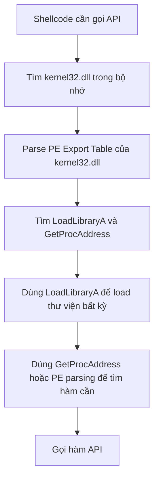
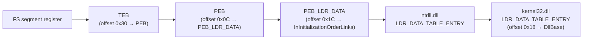
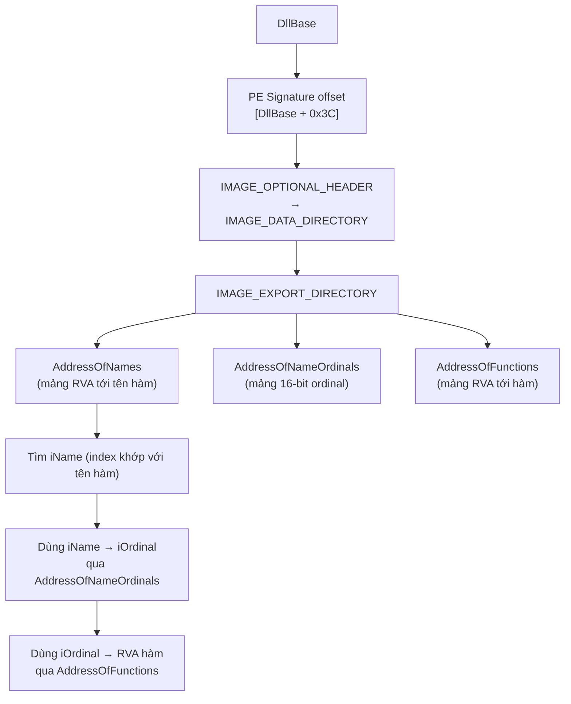
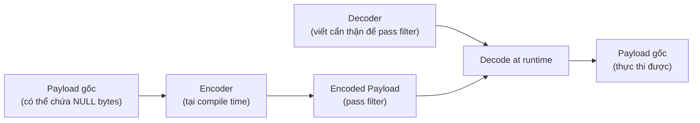
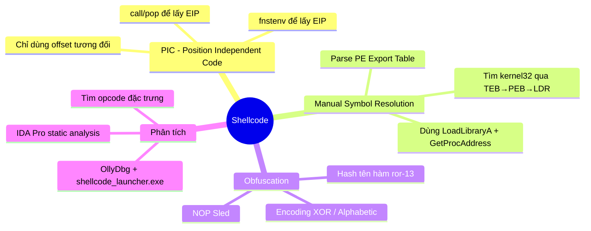

# Chương 19: Phân Tích Shellcode

## 1. Tổng Quan

**Shellcode** là một payload gồm mã thực thi thô (raw executable code). Tên gọi xuất phát từ việc kẻ tấn công thường dùng nó để chiếm quyền truy cập shell tương tác trên hệ thống bị xâm phạm. Hiện nay, thuật ngữ này mở rộng để chỉ bất kỳ đoạn mã thực thi độc lập nào.

> **Shellcode thường được dùng:**
> - Kết hợp với exploit để chiếm quyền điều khiển tiến trình đang chạy
> - Bởi malware để thực hiện **process injection**

---

## 2. Đặc Điểm Khác Biệt Của Shellcode

Shellcode **không thể dựa vào Windows Loader** như chương trình bình thường. Cụ thể, nó phải tự xử lý các tác vụ sau mà loader thường làm:

- Đặt chương trình vào vị trí bộ nhớ ưa thích
- Áp dụng address relocation nếu không load được ở vị trí mong muốn
- Load các thư viện cần thiết và giải quyết các external dependencies

---

## 3. Position-Independent Code (PIC)

### Định nghĩa

**Position-Independent Code (PIC)** là mã không sử dụng bất kỳ địa chỉ cứng (hard-coded address) nào cho code lẫn data. Shellcode **bắt buộc phải là PIC** vì khi runtime, các phiên bản khác nhau của chương trình dễ bị tấn công có thể load shellcode vào các vị trí bộ nhớ khác nhau.

### So Sánh Các Loại Truy Cập x86

| Instruction | Bytes | Position-Independent? |
|---|---|---|
| `call sub_401000` | `E8 C1 FF FF FF` | ✅ Có |
| `jnz short loc_401044` | `75 0E` | ✅ Có |
| `mov edx, dword_407030` | `8B 15 30 70 40 00` | ❌ Không |
| `mov eax, [ebp-4]` | `8B 45 FC` | ✅ Có |

!!! info "Giải thích"
    - **`call` và `jnz`**: Sử dụng offset tương đối so với EIP → PIC
    - **`mov edx, dword_407030`**: Chứa địa chỉ tuyệt đối `0x00407030` → Không phải PIC, shellcode phải tránh dạng này
    - **`mov eax, [ebp-4]`**: Truy cập qua register base + offset tương đối → PIC

---

## 4. Xác Định Vị Trí Thực Thi (Identifying Execution Location)

Shellcode cần biết mình đang ở đâu trong bộ nhớ để truy cập data theo kiểu PIC. Trên x86, **không thể đọc EIP trực tiếp** (không có lệnh `mov eax, eip`). Có hai kỹ thuật phổ biến:

---

### 4.1 Kỹ Thuật call/pop

**Nguyên lý:** Khi lệnh `call` được thực thi, CPU push địa chỉ của lệnh ngay sau `call` lên stack. Shellcode lợi dụng điều này bằng cách đặt `pop` ngay đầu hàm được gọi để lấy địa chỉ đó vào register.

```nasm
83 EC 20        sub esp, 20h
31 D2           xor edx, edx
E8 0D 00 00 00  call sub_17          ; push địa chỉ của chuỗi "Hello World!" lên stack

; Dữ liệu nhúng trong code (data embedded in code)
48 65 6C 6C 6F  db 'Hello World!',0
20 57 6F 72 6C
64 21 00

sub_17:
5F              pop edi              ; edi = con trỏ trỏ tới chuỗi "Hello World!"
52              push edx             ; uType: MB_OK
57              push edi             ; lpCaption
57              push edi             ; lpText
52              push edx             ; hWnd: NULL
B8 EA 07 45 7E  mov eax, 7E4507EAh   ; MessageBoxA (hard-coded)
FF D0           call eax
52              push edx             ; uExitCode
B8 FA CA 81 7C  mov eax, 7C81CAFAh   ; ExitProcess (hard-coded)
FF D0           call eax
```

!!! warning "Lưu ý quan trọng"
    Kỹ thuật trộn lẫn code và data (intermingling code and data) **rất dễ làm disassembler bị nhầm lẫn**, tự diễn giải vùng data sau `call` là code, dẫn đến kết quả disassembly vô nghĩa hoặc bị dừng hoàn toàn. Đây cũng là kỹ thuật **anti-reverse-engineering**.

---

### 4.2 Kỹ Thuật fnstenv

**Nguyên lý:** FPU (x87 Floating-Point Unit) lưu trữ con trỏ đến lệnh FPU cuối cùng đã thực thi trong cấu trúc `FpuSaveState` tại offset 12. Lệnh `fnstenv` lưu trạng thái FPU ra bộ nhớ, cho phép shellcode đọc giá trị `fpu_instruction_pointer`.

```c
// Cấu trúc FpuSaveState (28 bytes)
struct FpuSaveState {
    uint32_t control_word;
    uint32_t status_word;
    uint32_t tag_word;
    uint32_t fpu_instruction_pointer;  // offset 12 (0x0C) — đây là thứ cần lấy
    uint16_t fpu_instruction_selector;
    uint16_t fpu_opcode;
    uint32_t fpu_operand_pointer;
    uint16_t fpu_operand_selector;
    uint16_t reserved;
};
```

```nasm
D9 EE           fldz                        ; push 0.0 lên FPU stack, cập nhật fpu_instruction_pointer
D9 74 24 F4     fnstenv byte ptr [esp-0Ch]  ; lưu FpuSaveState vào stack
5B              pop ebx                     ; ebx = địa chỉ của lệnh fldz
8D 7B F3        lea edi, [ebx-0Dh]          ; edi = con trỏ tới chuỗi "Hello World!"
```

!!! tip "So sánh hai kỹ thuật"
    | Kỹ thuật | Ưu điểm | Nhược điểm |
    |---|---|---|
    | call/pop | Đơn giản, phổ biến | Dễ bị disassembler nhầm lẫn |
    | fnstenv | Ít gây nhầm lẫn hơn | Phức tạp hơn một chút |

---

## 5. Manual Symbol Resolution (Tự Giải Quyết Symbol)

Vì shellcode không có Windows Loader hỗ trợ, nó phải **tự tìm địa chỉ các hàm API**. Hard-coded address là cách fragile (chỉ hoạt động trên đúng phiên bản OS/SP). Cách đúng đắn là dùng **`LoadLibraryA`** và **`GetProcAddress`** — cả hai đều export từ `kernel32.dll`.



---

### 5.1 Tìm kernel32.dll Trong Bộ Nhớ

Shellcode đi theo chuỗi các undocumented Windows structures:



```nasm
findKernel32Base:
    push esi
    xor eax, eax
    mov eax, [fs:eax+0x30]   ; eax = con trỏ tới PEB (từ TEB qua FS register)
    test eax, eax
    js .kernel32_9x           ; nếu bit cao nhất set = Win9x (không hỗ trợ)
    mov eax, [eax + 0x0c]    ; eax = con trỏ tới PEB_LDR_DATA
    mov esi, [eax + 0x1c]    ; esi = Flink của InInitializationOrderLinks (entry đầu = ntdll)
    lodsd                     ; eax = Flink tiếp theo (entry 2 = kernel32, trên Vista trở về trước)
    mov eax, [eax + 8]       ; eax = DllBase của kernel32.dll
    jmp near .finished
.kernel32_9x:
    jmp near .kernel32_9x    ; Win9x: vòng lặp vô tận (không hỗ trợ)
.finished:
    pop esi
    ret
```

!!! warning "Lưu ý về Windows 7+"
    Từ Windows 7 trở đi, `kernel32.dll` **không còn là module thứ hai** được khởi tạo nữa. Shellcode portable cần kiểm tra trường `UNICODE_STRING FullDllName` để xác nhận đúng là `kernel32.dll` thay vì chỉ lấy entry thứ hai.

---

### 5.2 Parse PE Export Table

Sau khi có `DllBase` của `kernel32.dll`, shellcode parse cấu trúc PE để tìm hàm cần:



**Thuật toán tìm địa chỉ export:**

1. Duyệt `AddressOfNames`, so sánh từng chuỗi với tên hàm cần tìm → tìm được index `iName`
2. Dùng `iName` để index vào `AddressOfNameOrdinals` → lấy `iOrdinal`
3. Dùng `iOrdinal` để index vào `AddressOfFunctions` → lấy RVA của hàm
4. Cộng `DllBase` vào RVA → địa chỉ thực tế

---

## 6. Hashed Exported Names (Tên Hàm Được Hash)

### Vấn đề

Nếu shellcode lưu tên hàm dạng ASCII (`"MessageBoxA"`, `"LoadLibraryA"`...) thì sẽ tốn không gian và dễ bị phân tích.

### Giải pháp: Hash 32-bit xoay phải (ror-13-additive)

```nasm
hashString:
    push esi
    push edi
    mov esi, dword [esp+0x0c]  ; load con trỏ chuỗi
.calc_hash:
    xor edi, edi               ; hash = 0
    cld
.hash_iter:
    xor eax, eax
    lodsb                      ; load byte tiếp theo của chuỗi
    cmp al, ah
    je .hash_done              ; nếu NULL byte → kết thúc
    ror edi, 0x0d              ; xoay phải hash 13 bit
    add edi, eax               ; cộng byte hiện tại vào hash
    jmp near .hash_iter
.hash_done:
    mov eax, edi               ; trả về hash trong EAX
    pop edi
    pop esi
    retn 4
```

!!! note "Ví dụ hash values"
    | Hàm | Hash (ror-13) |
    |---|---|
    | `LoadLibraryA` | `0xEC0E4E8E` |
    | `MessageBoxA` | `0xBC4DA2A8` |
    | `ExitProcess` | `0x73E2D87E` |

!!! tip "Lợi ích kép"
    - Tiết kiệm không gian (4 bytes thay vì cả chuỗi ASCII)
    - **Khó reverse-engineer hơn** vì che giấu tên API khỏi việc kiểm tra thông thường

---

### 6.1 Triển Khai findSymbolByHash

```nasm
findSymbolByHash:
    pushad
    mov ebp, [esp + 0x24]       ; arg1: dllBase
    mov eax, [ebp + 0x3c]       ; offset tới PE signature
    mov edx, [ebp + eax + 4+20+96] ; DataDirectories (giả định PE32)
    add edx, ebp                ; edx = địa chỉ IMAGE_EXPORT_DIRECTORY
    mov ecx, [edx + 0x18]       ; ecx = NumberOfNames
    mov ebx, [edx + 0x20]       ; ebx = RVA của AddressOfNames
    add ebx, ebp                ; RVA → VA
.search_loop:
    jecxz .error_done           ; hết mảng → lỗi
    dec ecx
    mov esi, [ebx+ecx*4]        ; esi = RVA của tên tiếp theo
    add esi, ebp                ; RVA → VA
    push esi
    call hashString             ; tính hash của tên hiện tại
    cmp eax, [esp + 0x28]       ; so sánh với arg2: symHash
    jnz .search_loop
    ; Tìm được! Lấy ordinal
    mov ebx, [edx+0x24]
    add ebx, ebp
    mov cx, [ebx+ecx*2]         ; cx = ordinal
    mov ebx, [edx+0x1c]
    add ebx, ebp
    mov eax, [ebx+ecx*4]        ; eax = RVA của hàm
    add eax, ebp                ; RVA → VA
    jmp near .done
.error_done:
    xor eax, eax
.done:
    mov [esp + 0x1c], eax       ; ghi đè EAX đã lưu bởi pushad
    popad
    retn 8
```

---

## 7. Shellcode Encodings (Mã Hóa Shellcode)

### Tại Sao Cần Mã Hóa?

Shellcode phải "qua mặt" bộ lọc của chương trình bị khai thác. Ví dụ:

- Hàm `strcpy`/`strcat` dừng khi gặp byte `0x00` → shellcode không được chứa NULL byte ở giữa
- Một số chương trình chỉ chấp nhận ký tự printable ASCII (< 0x80) hoặc alphanumeric

### Kỹ Thuật Phổ Biến



**Các kỹ thuật mã hóa thông dụng:**

- **XOR mask**: XOR toàn bộ payload với một byte cố định. Vì `(a XOR b) XOR b == a` nên decoder chỉ cần XOR lại là ra payload gốc.
- **Alphabetic transform**: Tách mỗi byte thành 2 nibble 4-bit, cộng với ký tự ASCII printable (như `A` hoặc `a`).

!!! info "Lợi ích phụ của encoding"
    - Che giấu các chuỗi đọc được (URL, địa chỉ IP...)
    - Giúp né tránh các hệ thống phát hiện xâm nhập mạng (Network IDS)

---

## 8. NOP Sled

**NOP Sled** (hay NOP slide) là một chuỗi dài các lệnh `NOP` (0x90) đặt trước shellcode trong exploit.

```
[  NOP Sled  ][  Decoder  ][  Encoded Payload  ]
      ↑
  Jump có thể trỏ vào bất kỳ đâu trong vùng này
```

**Mục đích:** Tăng xác suất exploit thành công. Miễn là execution được redirect vào đâu đó trong NOP sled, cuối cùng shellcode vẫn chạy.

!!! warning "Biến thể tránh phát hiện"
    Các opcode phổ biến thay thế NOP thường nằm trong range `0x40`–`0x4F` (các lệnh increment/decrement register 1 byte). NOP sled phải pass cùng bộ lọc với phần còn lại của shellcode.

---

## 9. Tìm Shellcode Để Phân Tích

### Các Nguồn Shellcode

- Network traffic
- Web pages (thường dùng JavaScript `unescape()`)
- Media files
- Malware (process injection)

### Shellcode Trong JavaScript (Web Exploits)

Hàm `unescape()` decode chuỗi theo quy tắc:

- `%uXXYY` → byte sequence `YY XX` (little-endian trên x86)
- `%41%42%43` → bytes `41 42 43`

**Ví dụ:**
```
Input:  %u1122%u3344%u5566%u7788%u99aa%ubbcc%uddee
Output: 22 11 44 33 66 55 88 77 aa 99 cc bb ee dd
```

### Shellcode Trong Malware (Process Injection)

Nhận biết qua các API call đặc trưng:

```
VirtualAllocEx → WriteProcessMemory → CreateRemoteThread
```

Nếu malware launch remote thread mà **không** áp dụng relocation fix-ups hay resolve external dependencies → buffer được inject **rất có thể là shellcode**.

### Tìm Shellcode Trong File Nhị Phân (IDA Pro)

Tìm kiếm các opcode đặc trưng thường xuất hiện ở đầu shellcode:

| Loại lệnh | Opcode phổ biến |
|---|---|
| Call | `0xE8` |
| Unconditional jumps | `0xEB`, `0xE9` |
| Loops | `0xE0`, `0xE1`, `0xE2` |
| Short conditional jumps | `0x70` – `0x7F` |

!!! tip "Lưu ý khi phân tích"
    Payload thường được mã hóa, nên chỉ có phần **decoder** hiển thị dưới dạng code có thể đọc được lúc đầu. Hãy tìm và phân tích decoder trước, sau đó giải mã payload.

---

## 10. Tổng Kết



> **Điểm mấu chốt:** Shellcode phải tự xử lý mọi thứ mà OS loader thường làm. Hiểu được các kỹ thuật PIC, manual symbol resolution, và encoding là nền tảng để phân tích bất kỳ shellcode nào trong thực tế.
