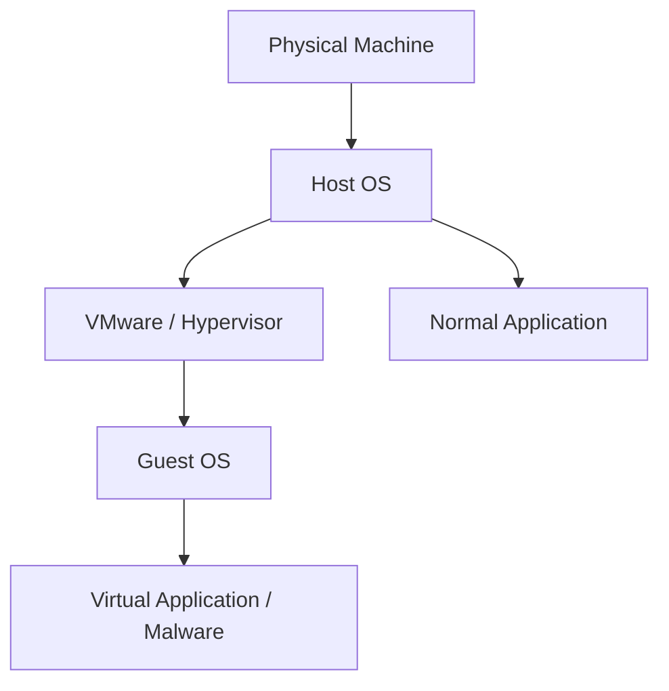
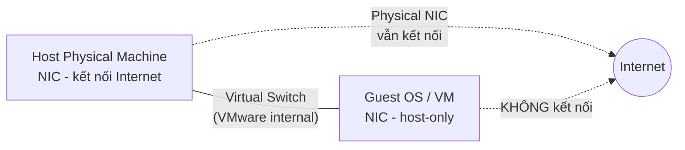
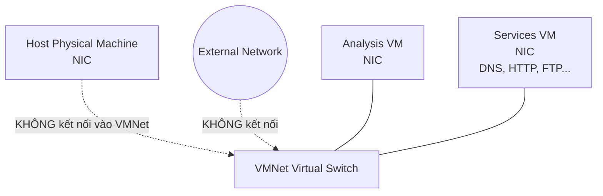
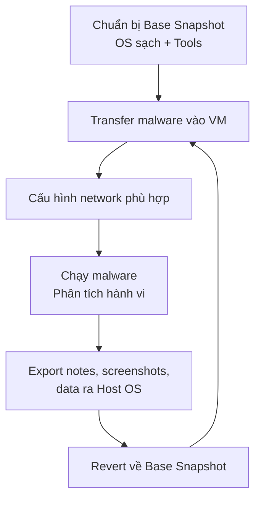

# Chương 2: Phân Tích Malware Trong Máy Ảo

## Tại Sao Cần Môi Trường An Toàn?

Khi thực hiện dynamic analysis, malware có thể:

- Lây lan sang các máy khác trong mạng
- Gây hại không thể phục hồi cho hệ thống thật
- Kết nối C2 server và tải thêm payload

!!! danger "Không bao giờ chạy malware trên máy production"
    Malware tươi (fresh malware) có thể làm những điều không lường trước. Luôn dùng môi trường cô lập.

---

## Các Phương Pháp Cô Lập

### Physical Machine + Air-Gapped Network

Máy vật lý trên mạng cô lập, hoàn toàn không kết nối Internet.

**Ưu điểm:** Môi trường thật, malware không thể phát hiện đang bị phân tích.

**Nhược điểm:**

- Không có Internet → malware phụ thuộc C2/update sẽ không hoạt động đầy đủ
- Khó dọn dẹp sau phân tích → phải dùng tool như Norton Ghost để restore image OS

### Virtual Machine (Phổ biến nhất)

```
Physical Machine
├── Host OS
│   └── VMware / Hypervisor
│       └── Guest OS (VM)
│           └── Malware chạy tại đây
```

**Ưu điểm:**

- Snapshot → khôi phục trạng thái sạch trong vài giây
- Malware không thể hại Host OS
- Clone VM dễ dàng

**Nhược điểm chính:** Một số malware có khả năng **phát hiện môi trường VM** và thay đổi hành vi để né phân tích (anti-VM techniques — đề cập chi tiết Chapter 17).

---

## Cấu Trúc Máy Ảo



!!! info "Nguyên lý cô lập"
    Malware chạy trong Guest OS **không thể tác động** lên Host OS. Nếu Guest bị hỏng → reinstall hoặc revert snapshot.

---

## Tạo Máy Ảo Phân Tích Malware

### Lựa chọn phần mềm

| Tool | Giá | Phù hợp |
|---|---|---|
| VMware Player | Free | Cơ bản, thiếu tính năng |
| VMware Workstation | ~$200 | **Khuyến nghị** cho malware analysis |
| Parallels, Hyper-V, Xen | Varies | Thay thế được |

VMware Workstation có các tính năng quan trọng:

- Snapshot / Snapshot Manager
- Clone VM
- Record/Replay
- Shared Folders
- Drag-and-drop file transfer

### Cấu hình khi tạo VM

- Dùng **default hardware config** trừ khi có yêu cầu đặc biệt
- Ổ cứng **20GB** là điểm khởi đầu tốt (VMware tự co giãn theo dữ liệu thực)
- Cài **Windows XP** (tại thời điểm sách viết, đây là target phổ biến nhất của malware)
- Cài **VMware Tools** sau khi cài OS: `VM → Install VMware Tools`

!!! tip "VMware Tools"
    Cải thiện trải nghiệm: mouse/keyboard responsive hơn, cho phép shared folders, drag-and-drop, v.v.

---

## Cấu Hình Mạng Cho Malware Analysis

Đây là phần **quan trọng nhất** khi setup môi trường. Mục tiêu: cho malware đủ network activity để quan sát, nhưng không để nó lây lan ra ngoài.

### Option 1: Disconnect Network

Tắt hoàn toàn network adapter.

!!! warning "Không khuyến nghị"
    Không có network → không quan sát được network activity → mất rất nhiều thông tin phân tích.

Cách làm: `VM → Removable Devices` → remove network adapter, hoặc bỏ check **"Connect at power on"**.

---

### Option 2: Host-Only Networking ✅ (Phổ biến)

Tạo một private LAN chỉ giữa Host OS và Guest OS, **không kết nối Internet**.



**Đặc điểm:**

- VMware tạo virtual NIC trên cả Host và Guest
- Hai NIC này kết nối qua virtual switch nội bộ
- Host's physical NIC vẫn lên Internet bình thường
- Malware bị giữ trong VM, có network nhưng không ra ngoài được

!!! warning "Rủi ro vẫn tồn tại"
    Malware có thể khai thác zero-day để thoát sang Host OS. Nên bật **Windows Firewall** (XP SP2+) trên Host để hạn chế.

---

### Option 3: Multiple VMs + Custom VMNet ✅ (Tốt nhất)

Setup hai VM kết nối với nhau qua VMNet riêng, hoàn toàn tách biệt Host và Internet.



**Tại sao cần VM thứ hai (Services VM)?**

Malware thường cần các dịch vụ mạng để hoạt động đầy đủ:

- **DNS** để resolve domain C2
- **HTTP server** để download payload
- **FTP, SMTP**, v.v.

VM Services chạy các dịch vụ giả lập này (INetSim, ApateDNS, v.v. — đề cập Chapter 3).

!!! tip "Virtual Machine Team"
    Khi dùng nhiều VM, tạo **VM Team** (`File → New → Team`) để quản lý power và network settings của tất cả VMs cùng lúc.

---

### Option 4: Kết nối Internet Thật (Rủi ro cao)

Đôi khi cần môi trường realistic hơn. Hai cách:

**Bridged Adapter:** VM kết nối trực tiếp vào cùng network interface với Host. VM có IP riêng trên mạng vật lý.

**NAT Mode:** Host đóng vai router, chia sẻ IP của Host cho VM. Hữu ích khi:

- Host dùng wireless adapter (WPA/WEP)
- Mạng chỉ cho phép một số MAC nhất định kết nối

!!! danger "Cảnh báo khi kết nối Internet"
    Trước khi connect, phải phân tích sơ bộ malware để biết nó sẽ làm gì. Rủi ro:

    - Lây malware sang host khác trên Internet
    - Tham gia DDoS botnet
    - Spam email
    - Malware author phát hiện bạn đang phân tích

---

## Snapshot — Tính Năng Cốt Lõi

### Snapshot là gì?

Lưu lại **toàn bộ trạng thái** của VM tại một thời điểm (RAM, disk, config). Có thể revert về bất kỳ snapshot nào bất kỳ lúc nào.

```
Timeline:
08:00         08:30          10:00
  |             |              |
[SNAPSHOT]  [Run Malware]  [REVERT]
              ←──────────────→
              Toàn bộ thay đổi bị xóa
              VM quay về trạng thái 08:00
```

### Workflow chuẩn

```
1. Cài OS + Tools → Take Base Snapshot (clean slate)
2. Chạy malware → Phân tích
3. Lưu data/notes ra Host
4. Revert về Base Snapshot
5. Lặp lại với sample tiếp theo
```

### Snapshot Manager — Branching

VMware cho phép tạo snapshot theo dạng cây:

```
Base
 └── Sample1_Analysis
      ├── Sample1_Snapshot2  ← tiếp tục sample 1
      └── Sample2_Analysis   ← chuyển sang sample 2
```

Hai nhánh hoàn toàn độc lập. Số lượng snapshot chỉ giới hạn bởi dung lượng disk.

---

## Transfer File Giữa VM và Host

| Phương pháp | Yêu cầu | Ghi chú |
|---|---|---|
| Drag-and-drop | VMware Tools, cả hai chạy Windows | Đơn giản nhất |
| Shared Folder | VMware Tools | Giống Windows shared folder |

!!! warning "USB Devices"
    Nếu VM window đang active và bạn cắm USB, VMware **tự động** kết nối USB vào Guest (không phải Host). Để tắt: `VM → Settings → USB Controller` → bỏ check **"Automatically connect new USB devices"**.

    Lý do quan trọng: nhiều worm lây lan qua USB storage.

---

## Rủi Ro Khi Dùng VMware

### 1. Anti-VM Detection

Malware có thể phát hiện đang chạy trong VM và:

- Không thực thi payload thật
- Hành xử "hiền" để qua phân tích
- Tự terminate

VMware **không coi đây là vulnerability** và không có biện pháp ẩn VM. → Chi tiết kỹ thuật anti-VM xem **Chapter 17**.

### 2. VMware Vulnerabilities

- Lỗ hổng trong **shared folders feature**
- Exploit **drag-and-drop functionality**
- Có thể gây crash Host OS hoặc chạy code trên Host

!!! tip "Luôn cập nhật VMware"
    Patch đầy đủ để giảm thiểu rủi ro này.

### 3. Rủi ro còn lại

Dù đã áp dụng mọi biện pháp, rủi ro **không bao giờ bằng 0**. Không phân tích malware trên máy chứa dữ liệu quan trọng/nhạy cảm.

---

## Record/Replay

Tính năng đặc biệt của VMware Workstation: ghi lại **toàn bộ** hoạt động CPU/OS, không chỉ video.

**Khác với screen recording:**

- Ghi lại từng CPU instruction thực thi
- Replay có thể **interrupt** tại bất kỳ điểm nào để tương tác
- 100% fidelity — kể cả race condition hiếm gặp

**Ứng dụng trong malware analysis:**

- Replay lại đúng hành vi malware nhiều lần
- Dừng tại thời điểm cụ thể để kiểm tra state
- Phân tích sau khi malware đã chạy xong mà không cần chạy lại

→ Chi tiết xem **Chapter 8**.

---

## Tổng Kết — Workflow Phân Tích Malware Với VM



!!! summary "5 bước cốt lõi"
    1. Start với clean snapshot
    2. Transfer malware vào VM
    3. Phân tích trong VM
    4. Lưu notes/data ra máy vật lý
    5. Revert về clean snapshot
