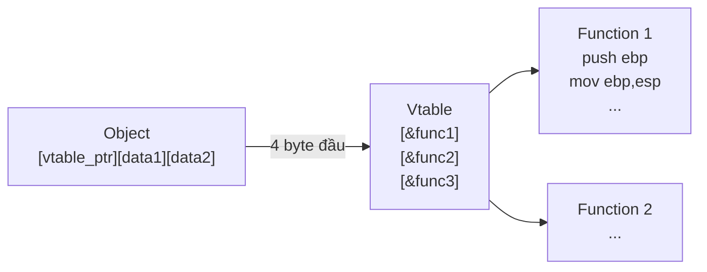

# Chương 20: Phân Tích C++ trong Malware

---

## 1. Tổng Quan

Phân tích malware viết bằng C++ khó hơn C thuần vì C++ có nhiều cấu trúc đặc thù ảnh hưởng trực tiếp đến assembly. Các khái niệm cần nắm: **OOP**, **this pointer**, **name mangling**, **vtable**, **constructor/destructor**.

---

## 2. Lập Trình Hướng Đối Tượng (OOP)

C++ tổ chức code theo **class** — tương tự `struct` trong C nhưng chứa thêm hàm (method). Một class là bản thiết kế; khi chạy, ta tạo ra **instance** (object) từ class đó.

```cpp
class SimpleClass {
public:
    int x;
    void HelloWorld() {
        printf("Hello World\n");
    }
};

int _tmain(int argc, _TCHAR* argv[]) {
    SimpleClass myObject;
    myObject.HelloWorld();
}
```

> **Lưu ý phân tích:** `public` là cơ chế kiểm soát truy cập của compiler — **không ảnh hưởng gì đến assembly**.

---

## 3. Con Trỏ `this`

### Khái niệm

Khi một method được gọi, nó cần biết đang thao tác trên object nào. `this` là con trỏ ẩn trỏ đến object hiện tại, được truyền ngầm vào mọi method call.

```cpp
class SimpleClass {
public:
    int x;
    void HelloWorld() {
        if (x == 10) printf("X is 10.\n"); // x ngầm là this->x
    }
};

int _tmain(...) {
    SimpleClass myObject;
    myObject.x = 9;
    myObject.HelloWorld(); // this = &myObject

    SimpleClass myOtherObject;
    myOtherObject.x = 10;
    myOtherObject.HelloWorld(); // this = &myOtherObject → in ra "X is 10."
}
```

### Trong Assembly (Microsoft compiler)

`this` thường được truyền qua **register ECX** (đôi khi ESI). Calling convention này gọi là **`thiscall`**.

```nasm
; Main Function
00401110  mov [ebp+var_C], 9          ; myObject.x = 9
00401117  lea ecx, [ebp+var_10]       ; ECX = &myObject (this pointer)
0040111A  call sub_4115D0             ; gọi HelloWorld

; HelloWorld Function
004115DC  mov [ebp+var_4], ecx        ; lưu this vào stack
004115DF  mov eax, [ebp+var_4]        ; eax = this
004115E2  cmp dword ptr [eax+4], 0Ah  ; so sánh this->x với 10
004115E6  jnz short loc_4115F6
004115E8  push offset aXIs10_         ; "X is 10.\n"
004115ED  call ds:__imp__printf
```

!!! tip "Mẹo nhận diện"
    Thấy `LEA ECX, [địa_chỉ_object]` rồi `CALL` → đây là object-oriented code dùng `thiscall`.

---

## 4. Overloading & Name Mangling

### Function Overloading

C++ cho phép nhiều hàm cùng tên nhưng khác tham số. Compiler tự chọn hàm phù hợp tại compile time.

```cpp
LoadFile(String filename) { ... }
LoadFile(String filename, int Options) { ... }

Main() {
    LoadFile("c:\\myfile.txt");              // → gọi hàm 1
    LoadFile("c:\\myfile.txt", GENERIC_READ); // → gọi hàm 2
}
```

### Name Mangling

PE format chỉ lưu tên hàm, không lưu signature. Để phân biệt các overload, compiler **mã hóa thông tin tham số vào tên hàm**.

| Hàm gốc | Tên sau mangling |
|---|---|
| `SimpleClass::TestFunction(int, int)` | `?TestFunction@SimpleClass@@QAEXHH@Z` |

!!! info "IDA Pro"
    IDA Pro tự động **demangle** tên hàm, hiển thị: `public: void __thiscall SimpleClass::TestFunction(int, int)`
    
    Malware thường strip symbols → mangled name chỉ xuất hiện ở **imported/exported functions**.

---

## 5. Kế Thừa (Inheritance)

Child class tự động có toàn bộ method và data của parent class.

```cpp
class Socket {
public:
    void setDestinationAddr(INetAddr* addr) { ... }
};

class UDPSocket : public Socket {
public:
    void sendData(char* buf, INetAddr* addr) {
        setDestinationAddr(addr); // gọi method của parent
        // ...
    }
};
```

!!! note "Ảnh hưởng đến assembly"
    Inheritance **không tạo ra runtime data structure** đặc biệt → thường **không nhìn thấy rõ ràng** trong assembly. Tuy nhiên vtable (xem bên dưới) gián tiếp tiết lộ inheritance.

---

## 6. Virtual Functions & Vtable

### Virtual vs Non-virtual

| | Non-virtual | Virtual |
|---|---|---|
| Quyết định hàm nào gọi | Compile time | Runtime |
| Kết quả ví dụ | In "Class A" | In "Class B" |
| Cấu trúc hỗ trợ | Không cần | Vtable |

```cpp
// Non-virtual → luôn gọi A::foo dù object thực là B
class A { public: void foo() { printf("Class A\n"); } };
class B : public A { public: void foo() { printf("Class B\n"); } };

// Virtual → gọi đúng hàm theo object thực tại runtime
class A { public: virtual void foo() { printf("Class A\n"); } };
class B : public A { public: virtual void foo() { printf("Class B\n"); } };

void g(A& arg) { arg.foo(); }

int main() {
    B b;
    g(b); // non-virtual → "Class A"; virtual → "Class B"
}
```

### Assembly So Sánh

```nasm
; NON-VIRTUAL: địa chỉ hàm cố định tại compile time
00401003  mov ecx, [ebp+arg_0]
00401006  call sub_401030          ; địa chỉ rõ ràng

; VIRTUAL: địa chỉ hàm tra qua vtable tại runtime
00401003  mov eax, [ebp+arg_0]    ; eax = con trỏ object
00401006  mov edx, [eax]          ; edx = vtable pointer (4 byte đầu của object)
00401008  mov ecx, [ebp+arg_0]    ; ecx = this
0040100B  mov eax, [edx]          ; eax = địa chỉ hàm đầu tiên trong vtable
0040100D  call eax                ; gọi gián tiếp → không biết đích trực tiếp!
```

!!! warning "Thách thức phân tích"
    Virtual call dùng `call eax` → **không thấy địa chỉ đích trực tiếp**. Phải truy ngược vtable để xác định hàm nào được gọi.

### Cấu Trúc Vtable



- **4 byte đầu** của mỗi object chứa virtual functions → là **con trỏ đến vtable**
- Vtable là **mảng function pointer**, mỗi virtual function chiếm 1 entry 4 byte
- Mỗi class có **vtable riêng**

### Nhận Diện Vtable trong IDA Pro

```nasm
; Vtable của class với 3 virtual functions
004020F0  off_4020F0  dd offset sub_4010A0   ; virtual func 1
004020F4              dd offset sub_4010C0   ; virtual func 2
004020F8              dd offset sub_4010E0   ; virtual func 3
```

!!! tip "Dấu hiệu nhận biết vtable"
    - Dãy liên tiếp các `dd offset sub_XXXXXX`
    - **Chỉ entry đầu tiên** có cross-reference trực tiếp; các entry còn lại được truy cập qua offset
    - Virtual functions **không có `call` instruction** trong cross-reference — chỉ có `offset` references

### Phát Hiện Quan Hệ Kế Thừa qua Vtable

```nasm
; Vtable class CON (lớn hơn → đây là child)
004020DC  off_4020DC  dd offset sub_401100   ; riêng của child
004020E0              dd offset sub_4010C0   ; riêng của child
004020E4              dd offset sub_4010E0   ← ; CHUNG với parent
004020E8              dd offset sub_401120   ; riêng của child
004020EC              dd offset unk_402198

; Vtable class CHA (nhỏ hơn → đây là parent)
004020F0  off_4020F0  dd offset sub_4010A0
004020F4              dd offset sub_4010C0
004020F8              dd offset sub_4010E0   ← ; CHUNG với child
```

!!! info "Quy tắc xác định parent/child"
    - Hàm **xuất hiện trong cả 2 vtable** → thuộc parent class (child kế thừa lại)
    - Vtable **lớn hơn** → child class (child có nhiều function hơn hoặc bằng parent)

---

## 7. Constructor & Destructor

| | Constructor | Destructor |
|---|---|---|
| Khi nào gọi | Lúc object được tạo | Lúc object bị hủy |
| Mục đích | Khởi tạo dữ liệu | Dọn dẹp tài nguyên |

### Object trên Stack vs Heap

- **Stack:** Compiler tự cấp phát, không cần `new`
- **Heap:** Dùng toán tử `new` → gọi `operator new` + constructor

```nasm
; new operator trong IDA Pro
0040108B  push 4
0040108D  call ??2@YAPAXI@Z     ; operator new(uint) — IDA tự nhận diện
```

```nasm
; Compiler gán vtable vào object vừa tạo
00401076  mov [ebp+var_10], offset off_4020F0  ; vtable parent (bị ghi đè)
0040107D  mov [ebp+var_10], offset off_4020DC  ; vtable child (vtable thực sự)
```

!!! note "Tại sao gán vtable 2 lần?"
    Constructor của parent gán vtable parent trước, sau đó constructor của child **ghi đè** bằng vtable child. Dòng đầu **vô nghĩa** (bị overwrite ngay), nhưng đây là hành vi bình thường của compiler C++.

!!! tip "Mẹo phân tích"
    Tìm `operator new` → nhìn gần đó sẽ thấy địa chỉ vtable được gán → biết class nào đang được tạo → trace được toàn bộ virtual function calls.

---

## 8. Tổng Kết — Checklist Phân Tích C++ Malware

```
✅ Thấy LEA ECX + CALL → thiscall → có object, tìm class
✅ Thấy CALL EAX/EDX → virtual call → truy vtable tìm đích thực
✅ Thấy dãy dd offset sub_XXXX → đây là vtable
✅ Vtable lớn hơn → child class
✅ Function xuất hiện 2 vtable → kế thừa từ parent
✅ operator new (??2@YAPAXI@Z) → object heap-allocated, vtable gần đó
✅ Mangled name trong import/export → IDA demangle để đọc
```
