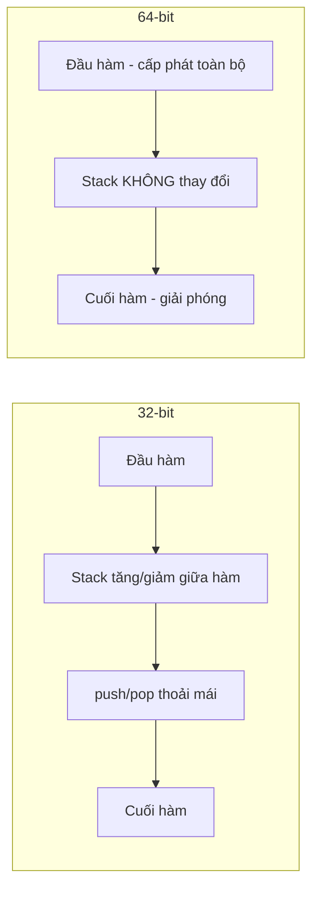
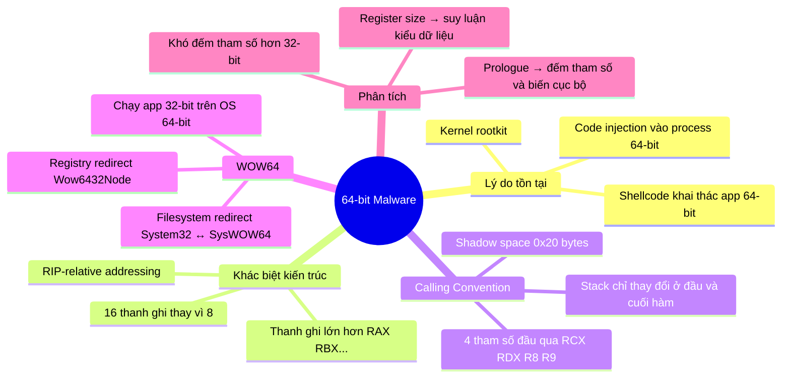

# Chương 21: Mã độc 64-bit (64-Bit Malware)

---

## 1. Tại sao cần viết mã độc 64-bit?

Mã độc 32-bit có thể chạy trên cả hệ điều hành 32-bit và 64-bit. Tuy nhiên, **không thể chạy mã 32-bit bên trong tiến trình 64-bit**. Khi processor đang ở chế độ 32-bit, nó không thể thực thi mã 64-bit, và ngược lại.

> **Nguyên tắc cốt lõi:** Nếu mã độc cần chạy *bên trong* không gian tiến trình của một ứng dụng 64-bit, nó **bắt buộc phải là 64-bit**.

### Các trường hợp bắt buộc phải dùng 64-bit

??? note "Kernel Code (Mã nhân)"
    - Toàn bộ mã kernel của OS nằm trong một không gian bộ nhớ duy nhất.
    - Mọi mã kernel chạy trên OS 64-bit **phải là 64-bit**.
    - Rootkit nhắm vào OS 64-bit phải được biên dịch thành mã máy 64-bit.
    - Phần mềm diệt virus cũng có thành phần kernel → mã độc muốn can thiệp phải có thành phần 64-bit.
    - Microsoft áp dụng các biện pháp bảo vệ trên Windows 64-bit: phát hiện sửa đổi trái phép kernel, chặn driver không có chữ ký số.

??? note "Plug-in và Injected Code (Mã tiêm vào tiến trình)"
    - Mã tiêm vào tiến trình 64-bit **phải là 64-bit**.
    - Ví dụ: plug-in độc hại cho Internet Explorer 64-bit phải là 64-bit.
    - Kỹ thuật code injection (xem Chapter 12) cũng phụ thuộc kiến trúc của tiến trình đích.

??? note "Shellcode"
    - Shellcode thường chạy bên trong tiến trình bị khai thác.
    - Khai thác lỗ hổng trên IE 64-bit → cần viết shellcode 64-bit.
    - Khi người dùng chạy hỗn hợp ứng dụng 32-bit và 64-bit, kẻ tấn công phải duy trì **hai phiên bản shellcode** riêng biệt.

---

## 2. Sự khác biệt kiến trúc x64 so với x86

### 2.1. Thanh ghi (Registers)

| Đặc điểm | x86 (32-bit) | x64 (64-bit) |
|---|---|---|
| Thanh ghi đa năng | EAX, EBX, ECX... (32-bit) | RAX, RBX, RCX... (64-bit) |
| Số lượng thanh ghi | 8 | 16 (thêm R8–R15) |
| Instruction pointer | EIP | RIP |
| Truy cập thanh ghi mới theo kích thước | — | R8D (32-bit), R8W (16-bit), R8L (8-bit) |
| Truy cập byte thấp nhất của RSP/RBP/RDI/RSI | Không có | SPL, BPL, DIL, SIL |

> **Tóm tắt:** RAX là phiên bản 64-bit của EAX. Vẫn có thể truy cập EAX (32-bit thấp) trong môi trường 64-bit.

---

### 2.2. RIP-Relative Addressing (Địa chỉ tương đối so với Instruction Pointer)

Đây là **khác biệt quan trọng nhất** giữa x64 và x86 liên quan đến shellcode và PIC (Position-Independent Code).

**Trong x86 (absolute addressing):**
```asm
; Địa chỉ tuyệt đối được mã hóa cứng vào lệnh
00401004  A1 74 33 40 00    mov eax, dword_403374
; Bytes 74 33 40 00 = địa chỉ 0x00403374
; Nếu file load ở địa chỉ khác → lệnh này SAI, phải sửa lại
```

**Trong x64 (RIP-relative addressing):**
```asm
; Địa chỉ được lưu dưới dạng OFFSET so với RIP hiện tại
0000000140001058  8B 05 A2 D3 00 00    mov eax, dword_14000E400
; Bytes A2 D3 00 00 = offset 0x0000D3A2 tính từ RIP
; File load ở bất kỳ đâu → lệnh vẫn trỏ đúng → Position-Independent
```

!!! tip "Ý nghĩa với phân tích mã độc"
    - x64 làm **giảm số địa chỉ cần relocation** khi DLL load vào bộ nhớ.
    - Viết shellcode 64-bit **dễ hơn** vì không cần trick `call/pop` để lấy địa chỉ EIP.
    - Nhưng cũng **khó phát hiện shellcode hơn** vì các dấu hiệu đặc trưng (`call/pop`) không còn xuất hiện.

---

## 3. Calling Convention và Stack Usage trong x64

### 3.1. Quy ước truyền tham số

x64 Windows dùng convention gần giống **fastcall** của 32-bit:

| Tham số | Thanh ghi |
|---|---|
| Tham số 1 | RCX |
| Tham số 2 | RDX |
| Tham số 3 | R8 |
| Tham số 4 | R9 |
| Tham số 5+ | Stack |

!!! warning "Lưu ý quan trọng"
    Đây là convention của **compiler-generated code** trên Windows. Mã assembly viết tay hoặc mã độc có thể **không tuân theo** quy ước này. Luôn điều tra kỹ khi gặp code bất thường.

---

### 3.2. Sự khác biệt về Stack



- **32-bit:** Stack có thể tăng/giảm tự do bằng `push`/`pop` ở giữa hàm.
- **64-bit:** Stack **chỉ được thay đổi ở đầu và cuối hàm**. Không có `push`/`pop` ở giữa.

> Quy tắc này không được processor bắt buộc, nhưng **model xử lý exception của Microsoft 64-bit phụ thuộc vào nó**. Vi phạm có thể gây crash khi có exception.

---

### 3.3. Phân biệt Leaf và Nonleaf Function

| Loại | Định nghĩa | Đặc điểm |
|---|---|---|
| **Leaf function** | Không gọi hàm nào khác | Stack đơn giản hơn |
| **Nonleaf function** | Có gọi ít nhất một hàm khác | Phải cấp phát thêm **0x20 bytes** shadow space |

**Shadow space (0x20 bytes):** Cho phép hàm được gọi lưu lại 4 thanh ghi tham số (RCX, RDX, R8, R9) nếu cần.

---

### 3.4. So sánh disassembly: printf call

**32-bit — rõ ràng, dễ đếm tham số:**
```asm
004113C0  mov eax, [ebp+arg_0]
004113C3  push eax              ; tham số 4
004113C4  mov ecx, [ebp+arg_C]
004113C7  push ecx              ; tham số 3
004113C8  mov edx, [ebp+arg_8]
004113CB  push edx              ; tham số 2
004113CC  mov eax, [ebp+arg_4]
004113CF  push eax              ; tham số 1
004113D0  push offset aDDDD_    ; format string
004113D5  call printf
004113DB  add esp, 14h          ; 0x14 = 5 tham số × 4 bytes → rõ ràng!
```

**64-bit — khó đếm tham số hơn:**
```asm
0000000140002C96  mov ecx, [rsp+38h+arg_0]
0000000140002C9A  mov eax, [rsp+38h+arg_0]
0000000140002C9E  mov [rsp+38h+var_18], eax   ; local var hay tham số? Khó biết!
0000000140002CA2  mov r9d, [rsp+38h+arg_18]   ; tham số 4
0000000140002CA7  mov r8d, [rsp+38h+arg_10]   ; tham số 3
0000000140002CAC  mov edx, [rsp+38h+arg_8]    ; tham số 2
0000000140002CB0  lea rcx, aDDDD_              ; tham số 1 (format string)
0000000140002CB7  call cs:printf
```

!!! question "Tại sao 64-bit khó phân tích hơn?"
    Trong 32-bit, `push` trước lệnh `call` và `add esp, N` sau đó giúp ta **đếm tham số chính xác**.
    
    Trong 64-bit, không có `push`/`pop` ở giữa hàm. Việc `mov` vào thanh ghi không thể phân biệt ngay là "chuẩn bị tham số" hay "xử lý biến cục bộ". Phải tra format string hoặc phân tích ngữ nghĩa.

---

## 4. Prologue và Epilogue trong 64-bit

Mã 64-bit có cấu trúc **prologue** (đầu hàm) và **epilogue** (cuối hàm) rõ ràng:

```asm
; === PROLOGUE ===
00000001400010A5  mov [rsp+arg_0], ecx   ; lưu tham số 1 (32-bit → ECX)
00000001400010A9  push rdi               ; lưu thanh ghi được callee bảo toàn
00000001400010AA  sub rsp, 20h           ; cấp phát shadow space (nonleaf)
```

!!! tip "Phân tích prologue"
    - Các lệnh `mov` đầu tiên trong prologue **luôn là lưu tham số** được truyền vào hàm.
    - Nếu chỉ có `sub rsp, 20h` (không hơn) → **không có biến cục bộ trên stack**.
    - `sub rsp, 40h` = 0x20 shadow space + 0x20 biến cục bộ → hàm có biến cục bộ.

---

## 5. Exception Handling trong x64

| | 32-bit | 64-bit |
|---|---|---|
| Cơ chế | Dùng stack (`fs:[0]` trỏ đến handler frame) | Dùng **bảng tĩnh** trong PE file |
| Nguy cơ | Exploit có thể ghi đè exception info trên stack | An toàn hơn, không lưu trên stack |
| Cấu trúc | — | `_IMAGE_RUNTIME_FUNCTION_ENTRY` trong `.pdata` section |

> **Hệ quả:** Kỹ thuật khai thác SEH overwrite (phổ biến trong 32-bit) **không áp dụng được** trong 64-bit.

---

## 6. WOW64 — Windows 32-bit on Windows 64-bit

### 6.1. WOW64 là gì?

Subsystem cho phép **ứng dụng 32-bit chạy trên OS 64-bit**, xử lý các vấn đề tương thích về filesystem và registry.

### 6.2. Filesystem Redirection

!!! warning "Điểm dễ nhầm lẫn"
    Tên thư mục có vẻ ngược:
    
    - **64-bit binaries** → `C:\Windows\System32`
    - **32-bit binaries** → `C:\Windows\SysWOW64`

Khi ứng dụng 32-bit truy cập `C:\Windows\System32`, WOW64 **tự động redirect** sang `C:\Windows\SysWOW64`.

Để ứng dụng 32-bit truy cập thư mục System32 thật:
```
C:\Windows\Sysnative   ← bypass redirect
```

Hoặc gọi API:
```c
Wow64DisableWow64FsRedirection()  // tắt redirect cho thread hiện tại
```

### 6.3. Registry Redirection

```
HKEY_LOCAL_MACHINE\Software
        ↓ (32-bit app tự động redirect sang)
HKEY_LOCAL_MACHINE\Software\Wow6432Node
```

Các API registry có flag để chỉ định rõ muốn truy cập view 32-bit hay 64-bit:
```c
RegCreateKeyEx(..., KEY_WOW64_64KEY, ...)  // truy cập view 64-bit
RegCreateKeyEx(..., KEY_WOW64_32KEY, ...)  // truy cập view 32-bit
```

!!! danger "Khai thác WOW64 trong mã độc"
    Mã độc 32-bit có thể dùng các cơ chế này để:
    - Thoát khỏi sandbox WOW64 và **sửa đổi registry/file 64-bit**.
    - Kiểm tra môi trường bằng `IsWow64Process()` để biết đang chạy trên OS 64-bit.

---

## 7. Gợi ý phân tích mã độc 64-bit

### 7.1. Phân biệt Pointer và Data Value

Trong 64-bit, dễ hơn để nhận biết kiểu dữ liệu:

| Thanh ghi | Kích thước | Ý nghĩa |
|---|---|---|
| RDX, RCX, R8, R9 (64-bit) | 64-bit | **Rất có thể là pointer** |
| ECX, EDX, R8D (32-bit) | 32-bit | **Không phải pointer** (pointer phải 64-bit) |

**Ví dụ so sánh:**

```asm
; 32-bit: không biết tham số nào là pointer
004114F5  push eax    ; 32-bit, pointer hay integer?
004114F9  push ecx    ; 32-bit, pointer hay integer?
004114FA  call sub_411186

; 64-bit: có thể suy luận kiểu
140001148  mov rdx, [rsp+38h+var_18]  ; RDX = 64-bit → rất có thể là POINTER
14000114D  mov ecx, [rsp+38h+var_10]  ; ECX = 32-bit → KHÔNG phải pointer
140001151  call sub_14000100A
```

!!! tip "Ứng dụng thực tế"
    Khi phân tích hàm chưa biết, việc xác định tham số nào là pointer giúp thu hẹp nhanh chức năng của hàm đó.

---

## 8. Công cụ hỗ trợ phân tích 64-bit

| Công cụ | Hỗ trợ 64-bit |
|---|---|
| OllyDbg | Không hỗ trợ |
| WinDbg | Hỗ trợ |
| IDA Pro (Standard) | Không hỗ trợ x64 |
| IDA Pro (Advanced) | Hỗ trợ x64 |

---

## 9. Tổng kết



!!! summary "Kết luận"
    - Phân tích mã độc 64-bit **không khác nhiều** so với 32-bit vì tập lệnh rất tương đồng.
    - Điểm khó nhất: **đếm tham số hàm** do không có `push`/`pop` ở giữa hàm.
    - Cần hiểu **WOW64** để phân tích mã độc 32-bit có tương tác với hệ thống 64-bit.
    - Xu hướng: mã độc 64-bit ngày càng **tăng** theo mức độ phổ biến của OS 64-bit.
