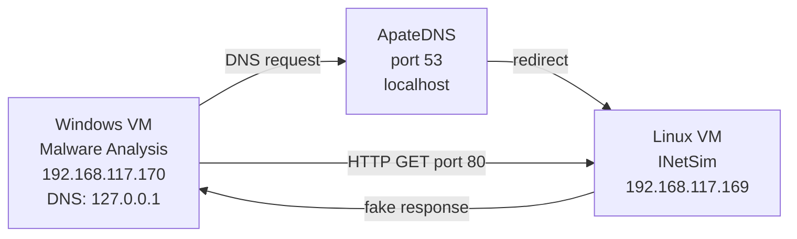

# Chương 3: Basic Dynamic Analysis

## Tổng quan

**Dynamic analysis** là kỹ thuật phân tích malware bằng cách **thực thi** nó và quan sát hành vi thực tế, trái ngược với static analysis (chỉ đọc code mà không chạy).

!!! info "Khi nào dùng Dynamic Analysis?"
    Dynamic analysis thường được thực hiện **sau** khi static analysis đã đến giới hạn — ví dụ khi malware bị obfuscate, packed, hoặc analyst đã khai thác hết các kỹ thuật static.

!!! warning "Rủi ro"
    Dynamic analysis có thể **gây hại** cho mạng và hệ thống thực. Luôn thực hiện trong **môi trường cô lập (VM)**.

**Ưu điểm so với static analysis:**

- Quan sát được **hành vi thực tế** (không phải chỉ chuỗi string tồn tại trong binary mà là liệu nó có thực sự chạy không)
- Nhanh hơn để xác định chức năng — ví dụ với keylogger: tìm ra log file ở đâu, ghi gì, gửi đi đâu

**Hạn chế:**

- Không phải tất cả code path đều được thực thi (malware dạng command-line cần đúng argument mới kích hoạt đủ chức năng)

---

## 1. Sandbox — Phân tích nhanh

### Sandbox là gì?

!!! quote "Định nghĩa"
    **Sandbox** là cơ chế bảo mật cho phép chạy chương trình không tin cậy trong môi trường **ảo hóa an toàn**, thường mô phỏng cả các dịch vụ mạng để malware hoạt động bình thường.

**Các sandbox phổ biến:** Norman SandBox, GFI Sandbox (CWSandbox), Anubis, Joe Sandbox, ThreatExpert, BitBlaze, Comodo Instant Malware Analysis.

### GFI Sandbox Report — Cấu trúc

Một báo cáo GFI Sandbox điển hình gồm 6 sections:

| Section | Nội dung |
|---|---|
| **Analysis Summary** | Thông tin static + tổng quan kết quả dynamic |
| **File Activity** | Các file được mở/tạo/xóa bởi từng process |
| **Created Mutexes** | Mutex do malware tạo ra |
| **Registry Activity** | Thay đổi trong registry |
| **Network Activity** | Hoạt động mạng: listening port, DNS request |
| **VirusTotal Results** | Kết quả scan VirusTotal |

### Hạn chế của Sandbox

!!! danger "Sandbox Drawbacks"

    1. **Không có command-line args** — malware cần argument sẽ không chạy hết chức năng
    2. **Thiếu C2 response** — nếu malware chờ lệnh từ C2 server mới mở backdoor, sandbox sẽ bỏ lỡ
    3. **Time-based evasion** — malware sleep vài ngày trước khi hoạt động; sandbox không chờ đủ lâu
    4. **VM detection** — malware detect môi trường ảo → dừng lại hoặc đổi hành vi
    5. **Thiếu registry key/file** — một số malware cần file/key cụ thể trên hệ thống mới chạy
    6. **DLL không chạy như EXE** — exported functions có thể không được gọi đúng
    7. **OS version mismatch** — malware có thể crash trên Windows XP nhưng chạy đúng trên Windows 7
    8. **Sandbox không "hiểu" malware** — chỉ báo cáo hành vi, không thể kết luận đây là SAM hash dumper hay encrypted keylogger backdoor — **analyst phải tự suy luận**

---

## 2. Chạy Malware

### EXE

Đơn giản: double-click hoặc chạy từ command line.

### DLL — Dùng `rundll32.exe`

Windows không tự chạy DLL, cần dùng `rundll32.exe`:

```cmd
rundll32.exe DLLname, Export [arguments]
```

**Ví dụ:**

```cmd
rundll32.exe rip.dll, Install
```

**Gọi bằng ordinal (nếu không có tên export):**

```cmd
rundll32.exe xyzzy.dll, #5
```

!!! tip "DLLMain trick"
    Vì malicious DLL thường chạy phần lớn code trong `DLLMain` (được gọi mỗi khi DLL load), việc load DLL qua `rundll32.exe` với bất kỳ export nào cũng có thể kích hoạt payload.

**Chuyển DLL thành EXE (cách khác):**

Xóa flag `IMAGE_FILE_DLL (0x2000)` trong `Characteristics` của `IMAGE_FILE_HEADER`. Điều này sẽ trigger `DLLMain` nhưng không gọi imported functions — malware có thể crash nhưng vẫn đủ để thu thập thông tin.

**DLL cần cài làm service:**

```cmd
rundll32.exe ipr32x.dll, InstallService ServiceName
net start ServiceName
```

!!! note "Cài service thủ công"
    Nếu không có export `InstallService`, dùng `sc` command hoặc sửa registry tại:
    `HKLM\SYSTEM\CurrentControlSet\Services`

---

## 3. Process Monitor (Procmon)

### Giới thiệu

**Procmon** là công cụ monitor nâng cao, theo dõi: registry, file system, network, process, thread activity. Kế thừa từ **FileMon** và **RegMon**.

!!! warning "Giới hạn của Procmon"
    - Không capture device driver activity (rootkit via device I/O controls)
    - Không capture một số GUI calls như `SetWindowsHookEx`
    - **Không nên dùng để log network activity** — không nhất quán trên các Windows version

### Sử dụng Procmon

```
1. Mở Procmon → Edit → Clear Display (xóa events cũ)
2. Chạy malware
3. Sau vài phút → File → Capture Events (dừng capture)
```

!!! danger "Memory Warning"
    Procmon log vào RAM. Trên Windows có thể >50,000 events/phút → có thể crash VM nếu để quá lâu. **Chỉ capture trong khoảng thời gian ngắn.**

### Procmon Display

Các cột quan trọng:

| Cột | Ý nghĩa |
|---|---|
| Sequence | Số thứ tự event |
| Time | Timestamp |
| Process Name | Tên process gây event |
| Operation | Loại thao tác (CreateFile, RegSetValue,...) |
| Path | Đường dẫn |
| Result | SUCCESS / NAME NOT FOUND / ... |

### Filtering trong Procmon

!!! tip "Lọc theo malware name"
    Đặt filter `Process Name is mm32.exe` → chỉ hiển thị events của malware đó.

**Cách đặt filter:**
`Filter → Filter → chọn Column → chọn Comparator (is/contains/less than) → Include/Exclude`

**4 quick-filter buttons trên toolbar:**

```
🗂️ Registry    — xem malware cài persistence thế nào
📁 File System  — xem file nào được tạo/dùng
⚙️ Process      — xem malware spawn process nào
🌐 Network      — xem port nào đang listen
```

!!! note
    Filter chỉ ảnh hưởng **display**, không ảnh hưởng capture. Mọi event vẫn được lưu đầy đủ.

**Ví dụ thực tế:** Với `mm32.exe`, filter `Process Name = mm32.exe` + `Operation = RegSetValue` → từ 39,351 events còn 11 events → phát hiện malware ghi persistence tại:
`HKLM\SOFTWARE\Microsoft\Windows\CurrentVersion\Run\Sys32V2Controller`

---

## 4. Process Explorer

### Giới thiệu

**Process Explorer** (Sysinternals/Microsoft) là task manager cực mạnh, hiển thị process theo dạng **cây cha-con**.

**Chức năng chính:**
- List active processes, DLLs loaded, process properties, system info
- Kill process, launch/validate processes, log out users

### Display

**Màu sắc mặc định:**

| Màu | Ý nghĩa |
|---|---|
| 🩷 Pink | Services |
| 🔵 Blue | Normal processes |
| 🟢 Green (tạm thời) | Process mới khởi động |
| 🔴 Red (tạm thời) | Process vừa terminate |

**Cửa sổ Properties** (double-click vào process):

- **Threads tab** — active threads
- **TCP/IP tab** — active connections / listening ports
- **Image tab** — đường dẫn đến file executable trên disk
- **Strings tab** — so sánh strings trên disk vs trong memory
- **Handles tab** — file handles, mutexes, events,...

### Verify Option

!!! info "Tính năng Verify"
    Nút **Verify** trong Image tab kiểm tra xem file trên disk có phải **Microsoft signed binary** không — phát hiện malware thay thế file hệ thống Windows.

!!! danger "Process Replacement Attack"
    Verify kiểm tra **file trên disk**, không phải trong memory. Nếu attacker dùng **process replacement** (overwrite memory của một process hợp lệ bằng malicious code), Verify sẽ báo hợp lệ nhưng thực ra là malware.
    
    **Dấu hiệu nhận biết:** Strings trên disk ≠ Strings trong memory.

### So sánh Strings — Phát hiện Process Replacement

Trong **Strings tab** của Process Properties:

```
Image (on disk)  ←→  Memory (running)
```

Nếu hai danh sách **khác nhau nhiều** → có thể xảy ra process replacement.

**Ví dụ:** `svchost.exe` được Verify pass nhưng trong memory có string `FAVORITES.DAT` không tồn tại trong file trên disk → đây là malware giả dạng svchost.

### Dependency Walker (depends.exe)

Từ Process Explorer: chuột phải → **Launch Depends** → xem DLL dependencies của process đang chạy.

**Find DLL option:** Tìm xem process nào đang load một DLL malicious cụ thể.

!!! tip "Phát hiện runtime DLL injection"
    So sánh DLL list trong Process Explorer (runtime) với imports trong Dependency Walker (static) → DLL nào có ở runtime nhưng không có trong import table → bị inject sau khi load.

### Phân tích Malicious Documents

Mở Process Explorer → mở document nghi ngờ (PDF, Word) → nếu document spawn process → thấy ngay trong Process Explorer → locate malware qua Image tab.

!!! warning
    Cần dùng **phiên bản cũ/unpatched** của viewer (Adobe Reader, Word) để exploit thành công trong môi trường lab.

---

## 5. Regshot — So sánh Registry Snapshot

### Giới thiệu

**Regshot** là công cụ open-source so sánh 2 registry snapshots.

**Quy trình:**

```
1st Shot → [Chạy malware] → 2nd Shot → Compare
```

### Đọc kết quả Regshot

```
Keys added: 0
Values added: 3
  HKLM\SOFTWARE\Microsoft\Windows\CurrentVersion\Run\ckr: C:\WINDOWS\system32\ckr.exe
Values modified: 2
  HKLM\SOFTWARE\Microsoft\Cryptography\RNG\Seed: [hex data]
Total changes: 5
```

!!! tip "Đọc kết quả"
    - `HKLM\...\Run\ckr` → persistence mechanism (autorun khi boot)
    - `RNG\Seed` bị modified → **noise bình thường** vì Windows liên tục cập nhật seed này → bỏ qua

---

## 6. Faking a Network — Mô phỏng mạng

Malware thường beacon ra ngoài và liên lạc với **C2 server**. Mục tiêu: thu thập **network indicators** (DNS names, IP, packet signatures) mà **không cần kết nối Internet thật**.

### ApateDNS

**ApateDNS** spoof DNS responses, redirect mọi DNS query về một IP do analyst chỉ định.

```
Hoạt động: listen trên UDP port 53 → trả về IP bạn cấu hình
```

**Sử dụng:**
```
1. Nhập IP muốn redirect đến
2. Chọn network interface
3. Start Server → DNS tự động chuyển về localhost
4. Chạy malware → xem DNS requests xuất hiện
```

**NXDOMAIN option:** Trả về "không tồn tại" cho domain đầu tiên → malware sẽ thử domain tiếp theo → **lộ ra thêm domain** trong config của nó.

### Netcat

**Netcat** — "TCP/IP Swiss Army knife", dùng làm fake server để bắt kết nối từ malware.

```cmd
nc -l -p 80
```

`-l` = listen mode, `-p` = port

**Ví dụ thực tế với RShell:**

```
ApateDNS redirect evil.malwar3.com → 127.0.0.1
Netcat lắng nghe port 80
→ RShell kết nối, gửi HTTP POST fake tới www.google.com để ngụy trang
→ Sau đó cung cấp reverse shell
```

!!! info "Tại sao malware dùng port 80/443?"
    Port 80 (HTTP) và 443 (HTTPS) thường **không bị block** trên outbound traffic → malware ẩn C2 communication trong đó.

### Wireshark

**Wireshark** — open-source packet sniffer, capture và phân tích toàn bộ network traffic.

**4 phần giao diện:**

| Phần | Chức năng |
|---|---|
| Filter box | Lọc packets hiển thị |
| Packet listing | Danh sách packets thỏa filter |
| Packet detail | Nội dung packet được chọn |
| Hex window | Hex dump của packet (liên kết với detail) |

**Follow TCP Stream:** Chuột phải vào TCP packet → Follow TCP Stream → xem toàn bộ cuộc hội thoại 2 chiều.

!!! warning
    Wireshark có nhiều security vulnerabilities → chỉ chạy trong môi trường an toàn.

### INetSim

**INetSim** — Linux-based suite mô phỏng **toàn bộ Internet services**, là công cụ tốt nhất để cung cấp fake services.

**Services mặc định được emulate:**

```
dns     53/udp+tcp
http    80/tcp
https   443/tcp
smtp    25/tcp
ftp     21/tcp
pop3    110/tcp
irc     6667/tcp
ntp     123/udp
...và nhiều hơn
```

**Tính năng nổi bật:**

- Trả về đúng format file được yêu cầu (malware hỏi JPEG → trả JPEG → malware tiếp tục chạy)
- Record toàn bộ inbound requests
- Cấu hình được response cụ thể (nếu malware cần web page X mới tiếp tục)
- **Dummy service**: log tất cả data từ client bất kể port → bắt được mọi kết nối

---

## 7. Tổng hợp — Setup phân tích thực tế

### Sơ đồ Virtual Network



### Quy trình chuẩn

```
1. Chạy procmon → set filter theo tên malware → clear events
2. Mở Process Explorer
3. Regshot → 1st Shot
4. Cấu hình INetSim + ApateDNS
5. Bật Wireshark
6. Chạy malware
7. Sau vài phút: dừng procmon capture, Regshot 2nd Shot → Compare
```

### Case Study: `msts.exe`

??? example "Phân tích từng bước msts.exe"

    **Bước 1 — ApateDNS:**
    DNS request cho `www.malwareanalysisbook.com` → malware cần kết nối domain này

    **Bước 2 — Procmon (file system):**
    
    ```
    Seq 141: CreateFile  C:\WINDOWS\system32\winhlp2.exe  SUCCESS
    Seq 142: WriteFile   C:\WINDOWS\system32\winhlp2.exe  SUCCESS
    ```
    
    → Malware **tự copy** mình đến `winhlp2.exe`

    **Bước 3 — Regshot:**
    
    ```
    HKLM\SOFTWARE\Microsoft\Windows\CurrentVersion\Run\winhlp: C:\WINDOWS\system32\winhlp2.exe
    ```
    
    → Persistence: autorun khi boot

    **Bước 4 — Process Explorer:**
    Mutex `\BaseNamedObjects\Evil1` → malware đảm bảo chỉ 1 instance chạy; mutex này có thể dùng làm **fingerprint** để nhận dạng malware family

    **Bước 5 — INetSim logs:**
    
    ```
    [https 443/tcp] connect
    Error: SSL accept attempt failed - unknown protocol
    disconnect
    ```
    
    → Malware dùng port 443 nhưng **không phải SSL chuẩn** → custom protocol

    **Bước 6 — Wireshark TCP stream (port 443):**
    Random ASCII data → **custom encrypted protocol** → cần reverse-engineer để hiểu thêm

---

## Câu hỏi ôn tập

??? question "1. Dynamic analysis khác static analysis ở điểm gì?"
    **Static analysis** phân tích binary mà không chạy (đọc code, strings, imports). **Dynamic analysis** thực thi malware và quan sát hành vi thực tế. Dynamic cho phép thấy chức năng thật — ví dụ một string trong binary không đảm bảo code đó sẽ chạy, nhưng dynamic analysis sẽ xác nhận điều đó.

??? question "2. Tại sao không nên dùng sandbox để phân tích toàn diện?"
    Sandbox có nhiều hạn chế: không cung cấp command-line args, không có C2 server thật để malware hoàn thiện flow, malware có thể detect VM và đổi hành vi, sandbox chỉ báo cáo hành vi cơ bản chứ không thể suy luận chức năng thực sự — analyst phải tự kết luận.

??? question "3. Làm thế nào để chạy một DLL malware?"
    Dùng `rundll32.exe DLLname, ExportName` hoặc gọi bằng ordinal `rundll32.exe dll.dll, #5`. Cách khác: xóa flag `IMAGE_FILE_DLL (0x2000)` trong PE header để Windows load DLL như EXE, trigger DLLMain. Nếu DLL là service, dùng `rundll32.exe dll.dll, InstallService Name` rồi `net start Name`.

??? question "4. Process replacement là gì? Phát hiện thế nào?"
    Process replacement: attacker chạy một process hợp lệ rồi overwrite memory của nó bằng malicious code. File trên disk vẫn hợp lệ (Verify pass) nhưng code trong memory là malware. **Phát hiện:** dùng Strings tab trong Process Explorer, so sánh strings on-disk vs in-memory — nếu khác nhau nhiều → process replacement.

??? question "5. ApateDNS và INetSim bổ sung cho nhau thế nào?"
    **ApateDNS** xử lý DNS layer — redirect mọi DNS query về IP cụ thể (thường là Linux VM). **INetSim** chạy trên Linux VM đó, cung cấp fake HTTP/HTTPS/FTP/SMTP/... servers. Kết hợp: malware resolve domain → ApateDNS trả về IP của INetSim → INetSim giả vờ là server thật → malware tiếp tục chạy → analyst quan sát toàn bộ.

??? question "6. Tại sao filter trong Procmon không giảm memory usage?"
    Vì Procmon filter chỉ ảnh hưởng **display**, không ảnh hưởng capture. Tất cả events vẫn được ghi vào RAM. Để giảm memory: dừng capture sau vài phút (`File → Capture Events`).

??? question "7. Mutex trong malware analysis có ý nghĩa gì?"
    Mutex (mutual exclusion object) thường được malware tạo ra để đảm bảo chỉ một instance đang chạy (tránh lây nhiễm lại). Mutex name thường là **unique string** đặc trưng cho malware family → có thể dùng làm **fingerprint** để phát hiện và phân loại malware.
