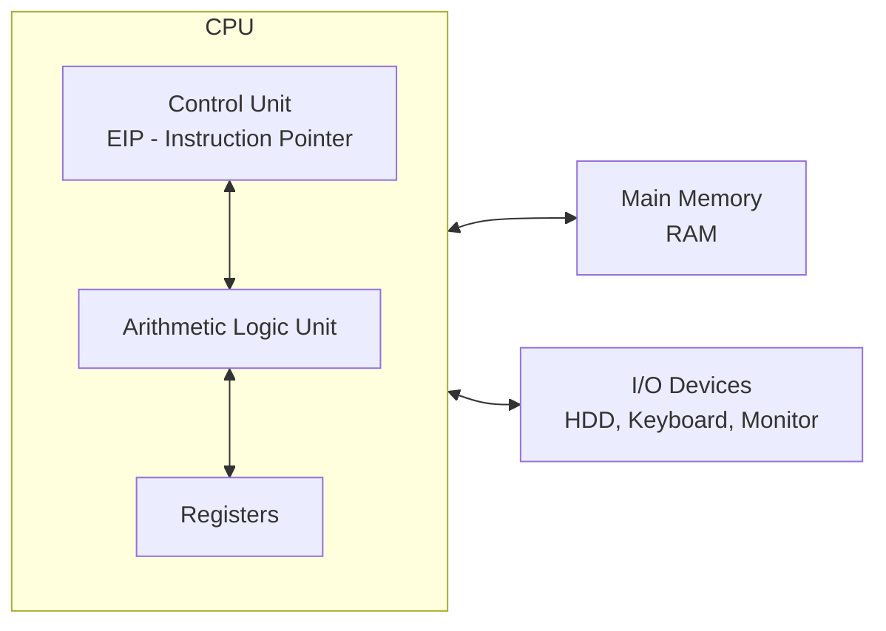
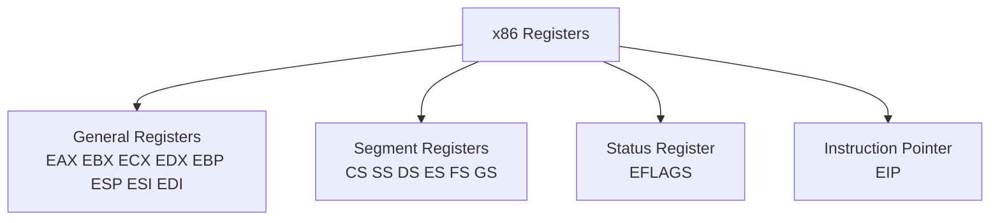
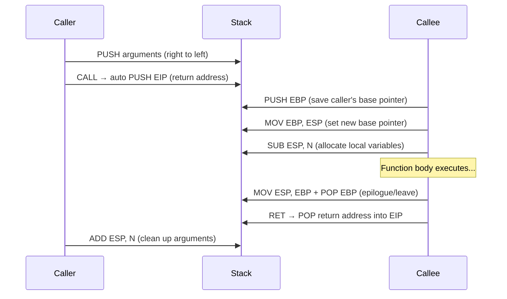

# Chương 4: Crash Course in x86 Disassembly

---

## Tại sao cần Disassembly?

Phân tích tĩnh cơ bản (static analysis) chỉ như nhìn bên ngoài xác chết trong buổi khám nghiệm tử thi — bạn thấy được cấu trúc nhưng không hiểu cơ chế hoạt động bên trong. Phân tích động cơ bản (dynamic analysis) có thể cho biết malware phản ứng thế nào, nhưng không thể tiết lộ *format* của gói tin hay *logic* xử lý.

**Disassembly** lấp đầy khoảng trống đó: chuyển đổi machine code → assembly code để analyst đọc và phân tích.

---

## Các tầng trừu tượng (Levels of Abstraction)

```
Interpreted Languages   (C#, Java, .NET, Perl) → Bytecode → Interpreter
         ↑
High-level Languages    (C, C++) → Compiler → Machine Code
         ↑
Low-level Languages     (Assembly) ← Disassembler ← Machine Code
         ↑
Machine Code            (Opcodes / hex)
         ↑
Microcode               (Firmware - gắn với phần cứng cụ thể)
         ↑
Hardware                (Digital logic: XOR, AND, OR, NOT gates)
```

> **Lưu ý quan trọng:** Assembly là ngôn ngữ cấp cao nhất có thể được khôi phục **đáng tin cậy và nhất quán** từ machine code khi không có source code.

| Tầng | Mô tả | Liên quan đến malware analysis? |
|------|-------|----------------------------------|
| Hardware | Mạch điện vật lý | Không |
| Microcode/Firmware | Vi lệnh cho phần cứng cụ thể | Hiếm khi |
| Machine Code | Opcodes (hex) | Đây là dạng lưu trên disk |
| Low-level (Assembly) | Human-readable, mnemonics | **Analyst làm việc tại đây** |
| High-level (C/C++) | Logic trừu tượng | Malware author viết tại đây |
| Interpreted | Bytecode + interpreter | Một số malware dùng |

---

## Kiến trúc Von Neumann & x86



- **Control Unit**: Lấy lệnh từ RAM qua register EIP (instruction pointer)
- **ALU**: Thực thi lệnh, lưu kết quả vào registers hoặc memory
- **Registers**: Bộ nhớ nhỏ trong CPU, truy cập nhanh hơn RAM nhiều

> **Tại sao malware chủ yếu là x86?** 32-bit Windows được thiết kế chạy trên x86. AMD64/Intel 64 cũng hỗ trợ chạy binary x86 32-bit. → Hầu hết malware được compile cho x86.

---

## Memory Layout

```
High Memory Address
┌─────────────┐
│    Data     │  ← Static/global values, loaded khi program khởi động
├─────────────┤
│    Code     │  ← Instructions CPU fetch để execute
├─────────────┤
│    Heap     │  ← Dynamic memory (malloc/free), thay đổi liên tục
├─────────────┤
│    Stack    │  ← Local variables, function parameters, return addresses
└─────────────┘
Low Memory Address
```

!!! warning "Lưu ý"
    Thứ tự trên chỉ là mô hình logic. Trên thực tế, các vùng này có thể nằm bất kỳ đâu trong không gian địa chỉ — không có đảm bảo stack sẽ thấp hơn code.

| Vùng nhớ | Đặc điểm | Ghi chú |
|----------|----------|---------|
| **Data** | Static/global, set khi load | Ít thay đổi khi chạy |
| **Code** | CPU instructions | Readonly (thường) |
| **Heap** | Dynamic allocation | `malloc`/`free` trong C |
| **Stack** | LIFO, local vars + params | Tăng về phía địa chỉ thấp |

---

## Instructions — Cấu trúc lệnh Assembly

Mỗi lệnh gồm: `mnemonic [destination_operand], [source_operand]`

```asm
mov ecx, 0x42    ; mnemonic=mov, dest=ecx, src=0x42
```

### Opcodes và Endianness

```
Instruction:  mov ecx, 0x42
Opcodes:      B9 42 00 00 00
              ^  ^-----------^
              |  0x42 dạng little-endian (0x42000000 → đọc là 0x42)
              mov ecx
```

!!! info "Little-endian vs Big-endian"
    - x86 dùng **little-endian**: byte ít có nghĩa nhất lưu ở địa chỉ thấp nhất
    - Network data dùng **big-endian**
    - IP `127.0.0.1`:
        - Big-endian (network): `0x7F000001`
        - Little-endian (x86 memory): `0x0100007F`

    **Tại sao quan trọng?** Malware khi giao tiếp mạng phải đổi endianness. Nếu analyst không chú ý, dễ đọc sai IP address hoặc các indicator quan trọng.

### Ba loại Operands

| Loại | Ví dụ | Ý nghĩa |
|------|-------|---------|
| **Immediate** | `0x42` | Giá trị cố định (literal) |
| **Register** | `ecx` | Tham chiếu đến register |
| **Memory address** | `[eax]`, `[ebx+8]` | Giá trị tại địa chỉ memory, dùng dấu `[]` |

---

## Registers — Thanh ghi x86

### Bốn nhóm register



### General Registers — Chi tiết

| 32-bit | 16-bit | 8-bit High | 8-bit Low | Convention phổ biến |
|--------|--------|------------|-----------|---------------------|
| EAX | AX | AH | AL | **Return value** của function call |
| EBX | BX | BH | BL | Base pointer (dữ liệu) |
| ECX | CX | CH | CL | **Counter** (vòng lặp, rep) |
| EDX | DX | DH | DL | Kết hợp với EAX cho mul/div |
| EBP | BP | — | — | **Base pointer** của stack frame |
| ESP | SP | — | — | **Stack pointer** (top of stack) |
| ESI | SI | — | — | **Source index** (string ops) |
| EDI | DI | — | — | **Destination index** (string ops) |

**Ví dụ phân rã EAX** (giá trị `0xA9DC81F5`):

```
EAX  [A9][DC][81][F5]   32-bit = 0xA9DC81F5
AX        [81][F5]      16-bit = 0x81F5
AH        [81]           8-bit = 0x81
AL            [F5]       8-bit = 0xF5
```

!!! tip "Convention quan trọng"
    EAX thường chứa **return value** của function. Nếu thấy code thao tác EAX ngay sau một `call`, khả năng cao đó là xử lý kết quả trả về.

### EFLAGS — Status Register

32-bit, mỗi bit là một flag. Các flag quan trọng nhất:

| Flag | Tên | Khi nào được set (=1)? |
|------|-----|------------------------|
| **ZF** | Zero Flag | Kết quả operation = 0 |
| **CF** | Carry Flag | Kết quả quá lớn/quá nhỏ cho destination |
| **SF** | Sign Flag | Kết quả âm, hoặc MSB được set sau arithmetic |
| **TF** | Trap Flag | Debug mode: CPU chỉ execute 1 lệnh/lần |

### EIP — Instruction Pointer

EIP lưu **địa chỉ của lệnh tiếp theo** sẽ được thực thi.

!!! danger "EIP control = Code execution control"
    Nếu attacker kiểm soát được EIP → kiểm soát được CPU thực thi gì. Đây là nguyên lý cơ bản của buffer overflow exploitation:
    
    1. Đặt shellcode vào memory
    2. Ghi đè EIP để trỏ đến shellcode
    3. CPU sẽ execute shellcode

---

## Các lệnh thông dụng

### `mov` — Di chuyển dữ liệu

Format: `mov destination, source`

```asm
mov eax, ebx          ; EAX = giá trị của EBX
mov eax, 0x42         ; EAX = 0x42 (immediate)
mov eax, [0x4037C4]   ; EAX = 4 bytes tại địa chỉ 0x4037C4
mov eax, [ebx]        ; EAX = 4 bytes tại địa chỉ chứa trong EBX
mov eax, [ebx+esi*4]  ; EAX = 4 bytes tại địa chỉ (EBX + ESI*4)
```

!!! note "Tính toán trong brackets"
    `mov eax, [ebx+esi*4]` — hợp lệ vì tính trong `[]` là tính địa chỉ memory.  
    `mov eax, ebx+esi*4` — **VÔ HIỆU**, không thể tính ngoài brackets.

### `lea` — Load Effective Address

```asm
lea eax, [ebx+8]   ; EAX = địa chỉ (EBX+8) — KHÔNG phải giá trị tại đó
mov eax, [ebx+8]   ; EAX = GIÁ TRỊ tại địa chỉ (EBX+8)
```

**Tại sao dùng `lea`?** Còn dùng để tính toán hiệu quả hơn:

```asm
lea ebx, [eax*5+5]   ; ebx = (eax+1)*5  — chỉ 1 lệnh
; Thay vì:
inc eax
mov ecx, 5
mul ecx
mov ebx, eax         ; 4 lệnh
```

---

### Arithmetic — Số học

```asm
add eax, ebx      ; EAX = EAX + EBX
sub eax, 0x10     ; EAX = EAX - 0x10  (set ZF nếu = 0, CF nếu underflow)
inc edx           ; EDX = EDX + 1
dec ecx           ; ECX = ECX - 1

mul 0x50          ; EDX:EAX = EAX * 0x50  (kết quả 64-bit!)
div 0x75          ; EAX = EDX:EAX / 0x75, EDX = remainder
```

!!! warning "mul/div dùng EDX:EAX"
    Kết quả nhân 64-bit: **EDX** chứa 32 bit cao, **EAX** chứa 32 bit thấp.  
    Phép chia: chia **EDX:EAX** cho value → EAX = kết quả, EDX = số dư (modulo).

### Logical & Shift

```asm
xor eax, eax       ; EAX = 0  (trick tối ưu: 2 bytes thay vì 5 bytes của mov eax,0)
or  eax, 0x7575    ; EAX = EAX OR 0x7575
and eax, 0xFF      ; EAX = EAX AND 0xFF

shl eax, 1         ; EAX << 1 = EAX * 2
shl eax, 2         ; EAX << 2 = EAX * 4
shr eax, 1         ; EAX >> 1 = EAX / 2

ror bl, 2          ; Rotate right: bits "rơi ra" bên phải quay lại bên trái
rol bl, 2          ; Rotate left
```

!!! tip "Nhận diện mã hóa/nén"
    Nếu gặp một hàm chứa dày đặc các lệnh `xor`, `or`, `and`, `shl`, `ror`, `shr`, `rol` liên tục và có vẻ ngẫu nhiên → **rất có thể là encryption hoặc compression routine**. Đánh dấu và bỏ qua, không cần phân tích từng lệnh.

### `nop` — No Operation

```asm
nop   ; Opcode: 0x90 — không làm gì cả, nhảy sang lệnh kế
; Thực ra là bí danh của: xchg eax, eax
```

**Dùng để làm gì?** NOP sled trong buffer overflow: tạo vùng đệm để shellcode không bị execute từ giữa:

```
[NOP][NOP][NOP]...[NOP][SHELLCODE]
     ↑ Jump vào đây cũng sẽ trượt đến shellcode
```

---

## Stack — Ngăn xếp

### Cơ chế LIFO

```
PUSH 1 → PUSH 2 → PUSH 3
POP → 3  POP → 2  POP → 1
```

Stack **phát triển từ địa chỉ cao xuống thấp**:

```
High Address  ←── Stack base
              [   ...   ]
              [   arg2  ]
              [   arg1  ]
              [ret addr ]  ← CALL tự push EIP vào đây
              [ old EBP ]  ← PUSH EBP
              [ local 1 ]
              [ local 2 ]
ESP ────────→ [ local N ]  ← Top of stack (địa chỉ thấp nhất đang dùng)
Low Address
```

| Register | Vai trò |
|----------|---------|
| **ESP** | Stack pointer — trỏ đến đỉnh stack (thay đổi liên tục) |
| **EBP** | Base pointer — cố định trong suốt 1 function, dùng làm mốc tham chiếu |

### Function Call Flow (cdecl convention)



**Prologue** (đầu hàm):
```asm
push ebp          ; lưu EBP của caller
mov  ebp, esp     ; thiết lập frame mới
sub  esp, 0x40    ; cấp phát local variables
```

**Epilogue** (cuối hàm):
```asm
leave             ; = mov esp, ebp + pop ebp
ret               ; pop return address → EIP
```

---

## Conditionals & Branching

### So sánh: `cmp` và `test`

```asm
cmp dst, src    ; giống SUB nhưng không lưu kết quả, chỉ set flags
test eax, eax   ; giống AND nhưng không lưu kết quả — check NULL nhanh
```

| `cmp dst, src` | ZF | CF |
|----------------|----|----|
| dst == src | 1 | 0 |
| dst < src | 0 | 1 |
| dst > src | 0 | 0 |

### Conditional Jumps (Jcc)

```asm
jz  loc   ; jump nếu ZF=1 (bằng 0)
jnz loc   ; jump nếu ZF=0 (khác 0)
je  loc   ; jump nếu bằng nhau (sau cmp)
jne loc   ; jump nếu khác nhau
jg  loc   ; jump nếu dst > src (signed)
jl  loc   ; jump nếu dst < src (signed)
ja  loc   ; jump nếu dst > src (unsigned)
jb  loc   ; jump nếu dst < src (unsigned)
jo  loc   ; jump nếu overflow flag set
js  loc   ; jump nếu sign flag set
jecxz loc ; jump nếu ECX = 0
```

---

## REP Instructions — Thao tác data buffer

ESI = source, EDI = destination, ECX = counter

| Instruction | C equivalent | Mô tả |
|-------------|-------------|-------|
| `rep movsb` | `memcpy()` | Copy ECX bytes từ ESI → EDI |
| `repe cmpsb` | `memcmp()` | So sánh 2 buffer, dừng khi khác nhau hoặc ECX=0 |
| `rep stosb` | `memset()` | Ghi giá trị AL vào ECX bytes tại EDI |
| `repne scasb` | `strchr()`-like | Tìm byte AL trong buffer tại EDI |

```asm
; Ví dụ memset - zero out buffer
xor  eax, eax      ; AL = 0
mov  ecx, 100      ; 100 bytes
lea  edi, [buffer]
rep stosb          ; fill 100 bytes with 0
```

**Prefix termination:**

| Prefix | Dừng khi |
|--------|----------|
| `rep` | ECX = 0 |
| `repe`/`repz` | ECX = 0 **hoặc** ZF = 0 |
| `repne`/`repnz` | ECX = 0 **hoặc** ZF = 1 |

---

## C main() trong Assembly

```c
int main(int argc, char** argv)
```

Trên hệ thống 32-bit, mỗi pointer = 4 bytes:

```asm
; Kiểm tra argc == 3
cmp [ebp+argc], 3
jz  loc_continue

; Truy cập argv[1] = argv + 4 (offset 4)
mov eax, [ebp+argv]   ; eax = argv (base pointer của array)
mov ecx, [eax+4]      ; ecx = argv[1]  (offset +4)
push ecx
push offset "-r"
push 2
call strncmp

; Truy cập argv[2] = argv + 8 (offset 8)
mov eax, [ebp+argv]
mov ecx, [eax+8]      ; ecx = argv[2]  (offset +8)
push ecx
call DeleteFileA
```

!!! info "Tại sao offset là 4 và 8?"
    argv là array of pointers. Trên 32-bit, mỗi pointer = 4 bytes.  
    - `argv[0]` = `argv + 0`  
    - `argv[1]` = `argv + 4`  
    - `argv[2]` = `argv + 8`

---

## Tổng kết — Checklist phân tích

??? summary "Các pattern quan trọng cần nhớ"
    - `xor eax, eax` → zero EAX (tối ưu hóa)
    - `test eax, eax` + `jz/jnz` → kiểm tra NULL/zero
    - `push ... ; call` → function call với arguments
    - `[ebp-N]` → local variable
    - `[ebp+N]` (N ≥ 8) → function argument
    - `[ebp+4]` → return address
    - `[ebp+0]` → saved EBP của caller
    - Nhiều `xor/shl/ror/rol` → mã hóa/nén
    - `rep movsb` → copy memory (như memcpy)
    - `rep stosb` với `xor eax,eax` → zero out buffer
