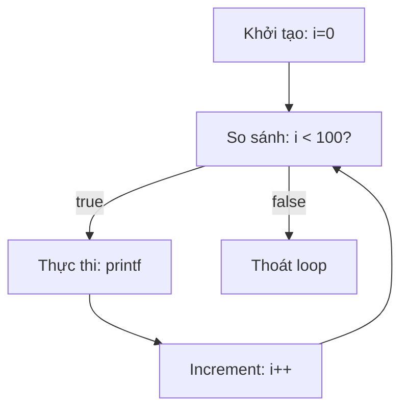
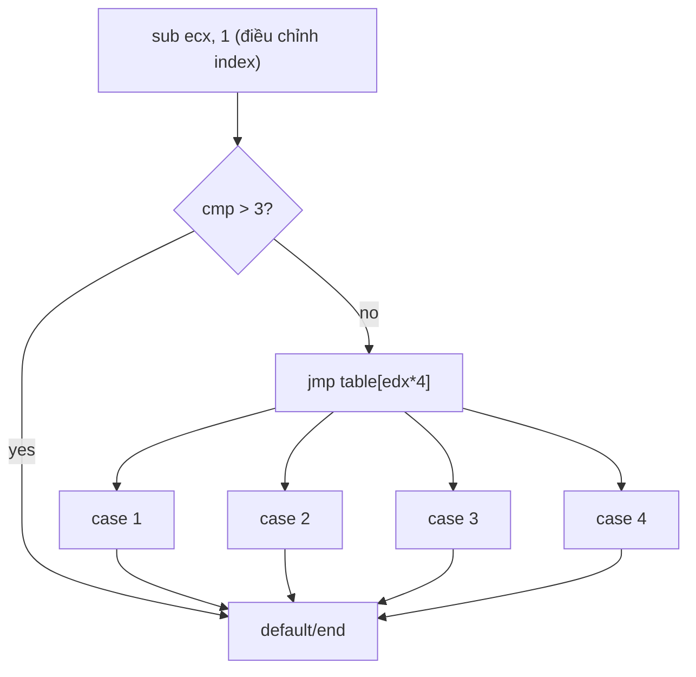

# Chương 6: Nhận Diện Các Cấu Trúc Code C Trong Assembly

---

## Tổng quan

> **Mục tiêu:** Không phân tích từng lệnh assembly riêng lẻ — mà nhận diện **nhóm lệnh** để hiểu chức năng ở mức cao.

Malware thường được viết bằng C. Mỗi chương trình C được tạo từ các **code construct** (cấu trúc code): loop, if, switch, struct, linked list,... Khi nhận diện được các construct này trong assembly, ta có thể hiểu chương trình nhanh hơn nhiều.

---

## 1. Biến Global vs Local

### So sánh C code

```c
// Global — khai báo ngoài hàm
int x = 1;
int y = 2;
void main() { x = x + y; printf("Total = %d\n", x); }

// Local — khai báo trong hàm
void main() {
    int x = 1;
    int y = 2;
    x = x + y;
    printf("Total = %d\n", x);
}
```

### Assembly: Global Variable

```asm
mov eax, dword_40CF60      ; load x từ địa chỉ bộ nhớ cố định
add eax, dword_40C000      ; cộng y
mov dword_40CF60, eax      ; ghi lại vào bộ nhớ → ảnh hưởng toàn chương trình
mov ecx, dword_40CF60
push ecx
push offset aTotalD        ; "total = %d\n"
call printf
```

### Assembly: Local Variable

```asm
mov dword ptr [ebp-4], 0   ; x = 0 (trên stack)
mov dword ptr [ebp-8], 1   ; y = 1 (trên stack)
mov eax, [ebp-4]
add eax, [ebp-8]
mov [ebp-4], eax
mov ecx, [ebp-4]
push ecx
push offset aTotalD        ; "total = %d\n"
call printf
```

!!! note "IDA Pro đặt tên dummy"
    IDA Pro tự đặt tên `var_4`, `var_8` thay cho offset `-4`, `-8`. Nên **rename** chúng thành tên có nghĩa (`x`, `y`) để phân tích nhanh hơn.

???+ tip "Quy tắc nhận diện"
    - **Global variable** → tham chiếu bằng **địa chỉ bộ nhớ cố định** (vd: `dword_40CF60`)
    - **Local variable** → tham chiếu bằng **offset từ `ebp`** trên stack (vd: `[ebp-4]`, `[ebp+var_4]`)

---

## 2. Arithmetic Operations (Phép toán số học)

### C code ví dụ

```c
int a = 0;
int b = 1;
a = a + 11;
a = a - b;
a--;
b++;
b = a % 3;
```

### Assembly tương ứng

```asm
mov [ebp+var_4], 0          ; a = 0
mov [ebp+var_8], 1          ; b = 1
mov eax, [ebp+var_4]
add eax, 0Bh                ; a = a + 11 (0x0B = 11)
mov [ebp+var_4], eax
mov ecx, [ebp+var_4]
sub ecx, [ebp+var_8]        ; a = a - b
mov [ebp+var_4], ecx
mov edx, [ebp+var_4]
sub edx, 1                  ; a-- (compiler dùng sub thay vì dec)
mov [ebp+var_4], edx
mov eax, [ebp+var_8]
add eax, 1                  ; b++ (compiler dùng add thay vì inc)
mov [ebp+var_8], eax
mov eax, [ebp+var_4]
cdq                         ; mở rộng eax sang edx:eax (chuẩn bị chia)
mov ecx, 3
idiv ecx                    ; edx:eax / ecx → eax = thương, edx = dư
mov [ebp+var_8], edx        ; b = a % 3 (lấy phần dư)
```

!!! warning "Phép modulo (`%`) trong assembly"
    Lệnh `idiv` chia `edx:eax` cho operand:
    - `eax` = **thương**
    - `edx` = **số dư** (đây là kết quả của `%`)
    
    Lệnh `cdq` dùng để sign-extend `eax` vào `edx` trước khi chia.

---

## 3. If Statements

### C code

```c
int x = 1;
int y = 2;
if (x == y) {
    printf("x equals y.\n");
} else {
    printf("x is not equal to y.\n");
}
```

### Assembly

```asm
mov [ebp+var_8], 1
mov [ebp+var_4], 2
mov eax, [ebp+var_8]
cmp eax, [ebp+var_4]           ; so sánh x và y
jnz short loc_40102B           ; nếu KHÔNG bằng → nhảy sang else
push offset aXEqualsY_         ; "x equals y.\n"
call printf
add esp, 4
jmp short loc_401038           ; nhảy qua else
loc_40102B:
push offset aXIsNotEqualToY    ; "x is not equal to y.\n"
call printf
```

???+ info "Đọc graph trong IDA Pro"
    IDA Pro hiển thị `false` / `true` tại điểm quyết định. Hai nhánh dẫn đến cuối hàm. Rất hữu ích để thấy ngay cấu trúc if-else.

### Nested If Statement

```c
int x = 0, y = 1, z = 2;
if (x == y) {
    if (z == 0) printf("z is zero and x = y.\n");
    else        printf("z is non-zero and x = y.\n");
} else {
    if (z == 0) printf("z zero and x != y.\n");
    else        printf("z non-zero and x != y.\n");
}
```

```asm
cmp eax, [ebp+var_4]
jnz short loc_401047       ; if x != y → else branch
cmp [ebp+var_C], 0
jnz short loc_401038       ; if z != 0 → inner else
push offset ...            ; "z is zero and x = y."
...
loc_401047:
cmp [ebp+var_C], 0
jnz short loc_40105C       ; if z != 0 → inner else
...
```

!!! note "Dấu hiệu nhận biết"
    Nested if → **nhiều conditional jump liên tiếp**, mỗi jump kiểm tra một điều kiện khác nhau.

---

## 4. Loops (Vòng lặp)

### 4.1 For Loop

**4 thành phần bắt buộc:** khởi tạo → so sánh → thực thi → tăng/giảm

```c
int i;
for (i = 0; i < 100; i++) {
    printf("i equals %d\n", i);
}
```

```asm
mov [ebp+var_4], 0          ; [1] Khởi tạo: i = 0
jmp short loc_401016        ; nhảy qua phần increment (lần đầu)

loc_40100D:                 ; [4] Increment
mov eax, [ebp+var_4]
add eax, 1
mov [ebp+var_4], eax

loc_401016:                 ; [2] So sánh
cmp [ebp+var_4], 64h        ; i < 100?
jge short loc_40102F        ; nếu i >= 100 → thoát loop

                            ; [3] Thực thi
mov ecx, [ebp+var_4]
push ecx
push offset aID             ; "i equals %d\n"
call printf
add esp, 8
jmp short loc_40100D        ; quay lại increment
```



!!! tip "Nhận diện for loop"
    Trong IDA Pro graph: có **mũi tên ngược** (back edge) từ cuối loop về điểm so sánh. Thấy back edge = có loop.

---

### 4.2 While Loop

```c
int status = 0;
int result = 0;
while (status == 0) {
    result = performAction();
    status = checkResult(result);
}
```

```asm
mov [ebp+var_4], 0          ; status = 0
mov [ebp+var_8], 0          ; result = 0

loc_401044:
cmp [ebp+var_4], 0
jnz short loc_401063        ; nếu status != 0 → thoát

call performAction
mov [ebp+var_8], eax        ; result = performAction()
mov eax, [ebp+var_8]
push eax
call checkResult
add esp, 4
mov [ebp+var_4], eax        ; status = checkResult(result)
jmp short loc_401044        ; lặp lại
```

???+ tip "While vs For trong assembly"
    - **For loop**: có phần **increment riêng biệt**, lần đầu nhảy qua increment
    - **While loop**: **không có** phần increment riêng, chỉ có conditional jump và unconditional jump quay đầu

---

## 5. Calling Conventions (Quy ước gọi hàm)

> Calling convention quy định: thứ tự push tham số, ai dọn stack sau khi gọi, return value ở đâu.

### Pseudocode tham chiếu

```c
int test(int x, int y, int z);
int a, b, c, ret;
ret = test(a, b, c);
```

### 5.1 cdecl

- Tham số push từ **phải sang trái**
- **Caller** dọn stack (`add esp, N`)
- Return value trong **EAX**

```asm
push c
push b
push a
call test
add esp, 12        ; caller dọn stack (3 tham số × 4 bytes)
mov ret, eax       ; lấy return value
```

### 5.2 stdcall

- Tham số push từ **phải sang trái**
- **Callee** dọn stack (dùng `ret N` ở cuối hàm)
- Không có `add esp` ở phía caller
- **Đây là convention chuẩn của Windows API**

### 5.3 fastcall

- **2 tham số đầu** truyền qua register **ECX, EDX** (Microsoft convention)
- Tham số còn lại push từ phải sang trái
- Nhanh hơn vì ít dùng stack

### So sánh Visual Studio vs GCC (push vs move)

| Visual Studio (push) | GCC (move) |
|---|---|
| `push eax` (var_8) | `mov [esp+4], eax` |
| `push ecx` (var_4) | `mov [esp], eax` |
| `call adder` | `call adder` |
| `add esp, 8` ← **có dòng này** | ← **không có dòng này** |

!!! warning "Lưu ý thực tế"
    GCC dùng `mov [esp+N], val` thay vì `push`. Vì vậy không có lệnh `add esp` để restore stack pointer sau call — stack pointer không bị thay đổi khi dùng `mov`.

---

## 6. Switch Statements

### 6.1 If-Style Switch (≤ 3-4 case)

```c
switch (i) {
    case 1: printf("i = %d", i+1); break;
    case 2: printf("i = %d", i+2); break;
    case 3: printf("i = %d", i+3); break;
    default: break;
}
```

```asm
cmp [ebp+var_8], 1
jz short loc_401027        ; case 1
cmp [ebp+var_8], 2
jz short loc_40103D        ; case 2
cmp [ebp+var_8], 3
jz short loc_401053        ; case 3
jmp short loc_401067       ; default

loc_401027:                ; case 1
    mov ecx, [ebp+var_4]
    add ecx, 1
    push ecx
    push offset unk_40C000
    call printf
    jmp short loc_401067   ; break

loc_40103D:                ; case 2
    ...
```

!!! warning "Switch vs If-else"
    Compiled switch statement **trông giống hệt** chuỗi if-else trong assembly (đều là `cmp` + `jcc`). Không thể phân biệt chắc chắn từ disassembly — cả hai đều hợp lệ.

---

### 6.2 Jump Table Switch (≥ 4 case liên tiếp)

Compiler tối ưu bằng cách tạo **bảng địa chỉ** — thay vì so sánh tuần tự, dùng index để nhảy thẳng.

```c
switch (i) {
    case 1: ... break;
    case 2: ... break;
    case 3: ... break;
    case 4: ... break;  // thêm case 4 → compiler chuyển sang jump table
    default: break;
}
```

```asm
mov ecx, [ebp+var_8]
sub ecx, 1                      ; điều chỉnh range 1-4 → 0-3
mov [ebp+var_8], ecx
cmp [ebp+var_8], 3
ja short loc_401082             ; nếu > 3 → default
mov edx, [ebp+var_8]
jmp ds:off_401088[edx*4]        ; nhảy theo jump table

; Jump table
off_401088 dd offset loc_40102C ; case 1
           dd offset loc_401042 ; case 2
           dd offset loc_401058 ; case 3
           dd offset loc_40106E ; case 4
```



???+ info "Tại sao nhân 4?"
    Mỗi entry trong jump table là một địa chỉ 32-bit = **4 bytes**. Nên `edx * 4` để tính đúng offset.

---

## 7. Arrays (Mảng)

```c
int b[5] = {123, 87, 487, 7, 978}; // global
void main() {
    int a[5];                        // local
    for (int i = 0; i < 5; i++) {
        a[i] = i;
        b[i] = i;
    }
}
```

```asm
; Local array a — truy cập qua stack + offset
mov ecx, [ebp+var_18]          ; i
mov edx, [ebp+var_18]          ; value = i
mov [ebp+ecx*4+var_14], edx    ; a[i] = i  (base = var_14)

; Global array b — truy cập qua địa chỉ bộ nhớ cố định
mov eax, [ebp+var_18]
mov ecx, [ebp+var_18]
mov dword_40A000[ecx*4], eax   ; b[i] = i  (base = 0x40A000)
```

!!! note "Xác định kích thước phần tử"
    Nhìn vào hệ số nhân của index:
    - `ecx*4` → mỗi phần tử **4 bytes** (int)
    - `ecx*2` → mỗi phần tử **2 bytes** (short)
    - `ecx*1` → mỗi phần tử **1 byte** (char)

---

## 8. Structs

```c
struct my_structure {
    int x[5];   // offset 0x00 - 0x10
    char y;     // offset 0x14
    double z;   // offset 0x18
};
```

```asm
; test(struct my_structure *q):
mov eax, [ebp+arg_0]
mov byte ptr [eax+14h], 61h    ; q->y = 'a' (0x61 = 'a' trong ASCII)
mov ecx, [ebp+arg_0]
fld ds:dbl_40B120
fstp qword ptr [ecx+18h]       ; q->z = 15.6 (floating-point instruction → double)

; for loop gán q->x[i]:
mov eax, [ebp+var_4]           ; i
mov ecx, [ebp+arg_0]           ; base pointer của struct
mov [ecx+eax*4], eax           ; q->x[i] = i
```

???+ tip "Cách nhận diện struct từ disassembly"
    - Cùng một base pointer (`arg_0`) được dùng với **nhiều offset khác nhau**
    - Offset `+0x14` → `char` (1 byte), offset `+0x18` dùng với `fstp` → `double`
    - Khó phân biệt struct với các biến liền kề — cần xem **ngữ cảnh** sử dụng

!!! tip "IDA Pro T hotkey"
    Nhấn `T` trong IDA Pro để gán struct type cho memory reference. `[eax+14h]` sẽ hiển thị thành `[eax + my_structure.y]` — dễ đọc hơn nhiều.

---

## 9. Linked List Traversal

```c
struct node {
    int x;
    struct node *next;  // offset +4
};

// Loop 1: tạo 10 node
for (i = 1; i <= 10; i++) {
    curr = malloc(sizeof(pnode));
    curr->x = i;
    curr->next = head;
    head = curr;
}

// Loop 2: duyệt và in
curr = head;
while (curr) {
    printf("%d\n", curr->x);
    curr = curr->next;
}
```

```asm
; Loop 1 — for loop tạo node
mov [esp], 8
call malloc
mov [ebp+var_4], eax           ; curr = malloc(8)
mov edx, [ebp+var_4]
mov eax, [ebp+var_C]
mov [edx], eax                 ; curr->x = i  (offset 0)
mov edx, [ebp+var_4]
mov eax, [ebp+var_8]
mov [edx+4], eax               ; curr->next = head  (offset +4)
mov eax, [ebp+var_4]
mov [ebp+var_8], eax           ; head = curr

; Loop 2 — while loop duyệt
loc_4010B1:
cmp [ebp+var_4], 0
jz short locret_4010D7         ; if curr == NULL → thoát
mov eax, [ebp+var_4]
mov eax, [eax]                 ; curr->x
push eax
call printf
mov eax, [ebp+var_4]
mov eax, [eax+4]               ; curr->next
mov [ebp+var_4], eax           ; curr = curr->next
jmp short loc_4010B1
```

???+ info "Cách nhận diện Linked List"
    `var_4` được gán giá trị từ `[eax+4]`, mà `eax` cũng lấy từ `var_4` trước đó.
    
    → **Struct trỏ đến struct cùng loại** tại offset cố định = linked list.
    
    Đây là dấu hiệu **đệ quy tự tham chiếu** (self-referential pointer).

---

## Tổng kết: Bảng nhận diện nhanh

| Construct | Dấu hiệu trong assembly |
|---|---|
| **Global var** | Địa chỉ cố định (`dword_XXXXXX`) |
| **Local var** | `[ebp - N]` hoặc `[ebp+var_N]` |
| **If statement** | `cmp` + conditional jump (`jz`, `jnz`, ...) |
| **For loop** | 4 phần: init + jmp qua increment + cmp + increment |
| **While loop** | `cmp` + conditional jump + unconditional jump quay đầu, không có increment riêng |
| **Switch (if-style)** | Chuỗi `cmp` + `jz` liên tiếp |
| **Switch (jump table)** | `sub` điều chỉnh index + `jmp [base + reg*4]` |
| **Array** | Base address + `index * element_size` |
| **Struct** | Cùng base pointer + nhiều offset khác nhau |
| **Linked list** | `[eax+N]` → gán lại cho chính pointer đó |

!!! success "Nguyên tắc cốt lõi"
    **Không phân tích từng lệnh** — hãy nhận diện **pattern của nhóm lệnh**. Kỹ năng này cần thời gian luyện tập nhưng là nền tảng của reverse engineering hiệu quả.
