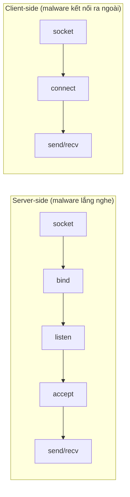
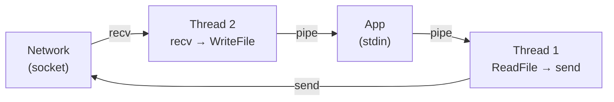
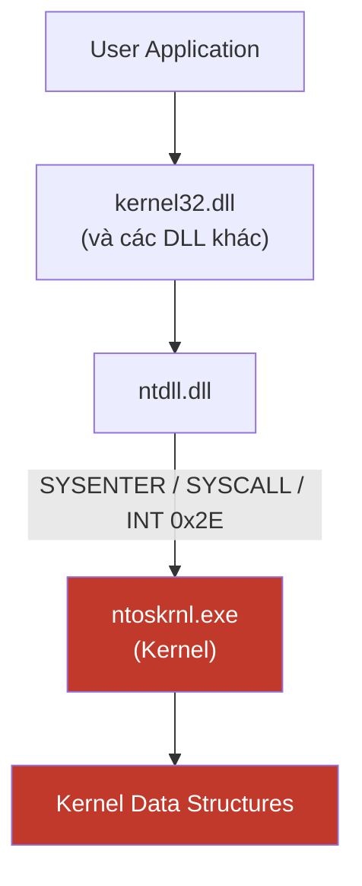
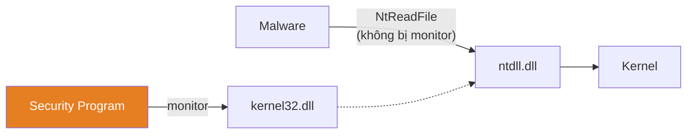

# Chương 7: Phân Tích Phần Mềm Độc Hại trên Windows

---

## 1. Windows API — Tổng quan

### 1.1 Kiểu dữ liệu & Hungarian Notation

Windows API không dùng kiểu C chuẩn (`int`, `short`) mà dùng kiểu riêng:

| Kiểu (prefix) | Mô tả |
|---|---|
| `WORD` (w) | Unsigned 16-bit |
| `DWORD` (dw) | Unsigned 32-bit |
| `Handle` (H) | Tham chiếu đến object (HWND, HKEY, ...) |
| `Long Pointer` (LP) | Con trỏ đến kiểu khác (LPBYTE, LPCSTR) |
| `Callback` | Hàm được Windows API gọi lại |

> **Hungarian Notation**: tiền tố biến chỉ rõ kiểu dữ liệu. Ví dụ: `dwSize` → DWORD, `lpData` → con trỏ.

**Handle** là tham chiếu đến object đang mở (window, file, process...). Không thể dùng trong phép toán số học, chỉ dùng để truyền vào API sau đó.

---

## 2. File System

### 2.1 Các hàm thao tác file phổ biến

**`CreateFile`** — Tạo hoặc mở file (cả pipe, stream, I/O device). Tham số `dwCreationDisposition` điều khiển tạo mới hay mở cũ.

**`ReadFile` / `WriteFile`** — Đọc/ghi tuần tự như stream. Mỗi lần gọi tiếp tục từ vị trí kết thúc lần trước.

**`CreateFileMapping` + `MapViewOfFile`** — Load file vào bộ nhớ, trả về con trỏ đến địa chỉ base của mapping. Malware dùng kỹ thuật này để:
- Parse PE header trong memory
- Thực thi PE file như thể được OS loader nạp
- Nhảy tự do giữa các vùng nhớ (không bị giới hạn tuần tự như ReadFile)

### 2.2 Special Files

??? note "Tại sao malware thích special files?"
    Special files không xuất hiện trong directory listing thông thường → khó phát hiện hơn.

**Shared Files**: `\\serverName\share` hoặc `\\?\serverName\share`. Prefix `\\?\` tắt string parsing, hỗ trợ tên file dài.

**Win32 Device Namespace** (`\\.\`): Truy cập thiết bị vật lý trực tiếp.
```
\\.\PhysicalDisk1   → đọc/ghi thẳng vào disk, bỏ qua filesystem
```
*Ví dụ thực tế*: Worm **Witty** dùng `\Device\PhysicalDisk1` (NT namespace) để ghi đè random sector → hệ thống không boot được.

**`\Device\PhysicalMemory`**: Cho phép user-space ghi vào kernel space → sửa kernel, ẩn process. *(Bị chặn từ Windows 2003 SP1 trở đi ở user space.)*

**Alternate Data Streams (ADS)** — NTFS feature cho phép gắn dữ liệu ẩn vào file:
```
normalFile.txt:HiddenStream:$DATA
```
Không hiện trong `dir`, không hiện khi đọc file thông thường. Malware dùng để giấu payload.

---

## 3. Windows Registry

### 3.1 Cấu trúc

```
Root Key
└── Subkey
    └── Key
        └── Value / Data
```

**5 Root Keys:**

| Key | Mục đích |
|---|---|
| `HKEY_LOCAL_MACHINE` (HKLM) | Cài đặt toàn hệ thống |
| `HKEY_CURRENT_USER` (HKCU) | Cài đặt theo user hiện tại |
| `HKEY_CLASSES_ROOT` | Định nghĩa loại file/object |
| `HKEY_CURRENT_CONFIG` | Cấu hình phần cứng hiện tại |
| `HKEY_USERS` | Cài đặt mặc định và tất cả user |

> HKCU thực ra là alias của `HKEY_USERS\<SID của user đang login>`.

### 3.2 Persistence qua Registry

Key quan trọng nhất với malware:
```
HKLM\SOFTWARE\Microsoft\Windows\CurrentVersion\Run
```
Bất kỳ value nào ở đây đều được thực thi **tự động khi user login**.

**Ví dụ .reg file độc hại:**
```reg
Windows Registry Editor Version 5.00

[HKLM\SOFTWARE\Microsoft\Windows\CurrentVersion\Run]
"MaliciousValue"="C:\Windows\evil.exe"
```
Double-click file `.reg` → tự động merge vào registry → `evil.exe` chạy mỗi lần boot.

### 3.3 Registry API Functions

| Hàm | Chức năng |
|---|---|
| `RegOpenKeyEx` | Mở key để đọc/ghi |
| `RegSetValueEx` | Thêm/sửa value trong registry |
| `RegGetValue` | Đọc data từ một value |

**Phân tích assembly thực tế:**
```asm
push offset SubKey   ; "Software\\Microsoft\\Windows\\CurrentVersion\\Run"
push HKEY_LOCAL_MACHINE
call RegOpenKeyExW   ; mở key

; ... chuẩn bị data ...

push ecx             ; lpValueName (tên value)
push edx             ; hKey
call RegSetValueExW  ; ghi value mới vào registry
```

!!! tip "Khi thấy các hàm này trong malware"
    Xác định ngay registry key đang được truy cập. Đó thường là indicator persistence.

**Công cụ phân tích:**
- **Regedit**: Xem/sửa registry thủ công
- **Autoruns** (Microsoft Sysinternals): Liệt kê ~25-30 vị trí registry có code tự chạy khi boot

---

## 4. Networking APIs

### 4.1 Berkeley Compatible Sockets (Winsock)

Implemented trong `ws2_32.dll`. Gần như giống hệt UNIX sockets.

| Hàm | Chức năng |
|---|---|
| `socket` | Tạo socket |
| `bind` | Gắn socket vào port |
| `listen` | Lắng nghe kết nối đến |
| `accept` | Chấp nhận kết nối từ xa |
| `connect` | Kết nối đến remote socket |
| `send` | Gửi data |
| `recv` | Nhận data |

**Pattern nhận diện:**



> `WSAStartup` phải được gọi trước mọi Winsock function. Khi debug, **đặt breakpoint tại `WSAStartup`** để theo dõi từ đầu quá trình network.

**Assembly ví dụ server socket:**
```asm
call ds:WSAStartup   ; khởi tạo Winsock
call ds:socket       ; tạo socket (af=2, type=1)
call ds:bind         ; gắn vào port
call esi ; listen    ; lắng nghe
call ds:accept       ; chờ kết nối
```

### 4.2 WinINet API (Higher-level)

Implemented trong `Wininet.dll`. Hỗ trợ HTTP, FTP ở application layer.

| Hàm | Chức năng |
|---|---|
| `InternetOpen` | Khởi tạo kết nối Internet |
| `InternetOpenUrl` | Kết nối đến URL (HTTP/FTP) |
| `InternetReadFile` | Đọc file từ Internet |

Malware dùng WinINet để nhận lệnh từ C2 server.

---

## 5. DLL — Dynamic Link Libraries

### 5.1 Tại sao malware dùng DLL?

**3 cách malware sử dụng DLL:**

1. **Lưu code độc hại trong DLL** — Một process chỉ có 1 `.exe`, nhưng có thể load nhiều DLL. Malware inject DLL vào process hợp lệ.

2. **Dùng Windows DLL có sẵn** — Mọi malware đều dùng Windows DLL để tương tác với OS (`kernel32.dll`, `ntdll.dll`, ...). Import table của malware tiết lộ nhiều về hành vi.

3. **Dùng third-party DLL** — Ví dụ: dùng Firefox DLL để kết nối C2 thay vì dùng Windows API trực tiếp → vượt qua một số firewall rule.

### 5.2 Cấu trúc DLL

- DLL dùng **PE file format**, chỉ khác `.exe` ở một flag duy nhất
- Entry point là **`DllMain`** (không exported, chỉ khai trong PE header)
- `DllMain` được gọi khi: process load/unload DLL, thread mới tạo/kết thúc

```c
BOOL WINAPI DllMain(HINSTANCE hinstDLL, DWORD fdwReason, LPVOID lpvReserved) {
    switch(fdwReason) {
        case DLL_PROCESS_ATTACH: // process load DLL
        case DLL_THREAD_ATTACH:  // thread mới
        case DLL_THREAD_DETACH:  // thread kết thúc
        case DLL_PROCESS_DETACH: // process unload DLL
    }
}
```

---

## 6. Processes & Threads

### 6.1 Process

Mỗi process có:
- Memory space riêng (địa chỉ `0x00400000` ở process A ≠ `0x00400000` ở process B về mặt vật lý)
- Handle riêng
- 1 hoặc nhiều thread

### 6.2 CreateProcess — Tạo Remote Shell

Malware dùng `CreateProcess` để tạo shell từ xa bằng cách redirect stdin/stdout/stderr vào socket:

```asm
mov eax, [esp+58h+SocketHandle]    ; lấy socket handle
mov [esp+60h+StartupInfo.hStdError],  eax  ; stderr → socket
mov [esp+60h+StartupInfo.hStdOutput], eax  ; stdout → socket
mov [esp+60h+StartupInfo.hStdInput],  eax  ; stdin  → socket
; ...
call ds:CreateProcessA             ; spawn process (vd: cmd.exe)
```

Kết quả: attacker gõ lệnh qua socket → vào stdin của `cmd.exe` → output trả về qua socket.

!!! warning "Kỹ thuật phổ biến"
    Malware thường **nhúng executable vào resource section** của PE file, giải nén ra disk, rồi gọi `CreateProcess` để chạy. Dùng **Resource Hacker** để extract payload ẩn.

### 6.3 Threads

- Thread chia sẻ memory space của process, nhưng có **stack và registers riêng**
- **Thread Context**: toàn bộ trạng thái CPU của thread, được lưu/restore khi OS switch giữa các thread

**`CreateThread`** — tạo thread mới, chỉ định `lpStartAddress` (hàm sẽ chạy):

```asm
push offset ThreadFunction1  ; lpStartAddress
call ds:CreateThread

push offset ThreadFunction2  ; lpStartAddress
call ds:CreateThread
```

**Pattern 2 thread malware (pipe + socket):**



- Thread 1: `ReadFile` từ pipe → `send` qua network
- Thread 2: `recv` từ network → `WriteFile` vào pipe

### 6.4 Mutexes

Mutex (kernel: *mutant*) — object đồng bộ hóa, chỉ 1 thread sở hữu tại một thời điểm.

**Malware dùng mutex để đảm bảo chỉ chạy 1 instance:**

```asm
push offset Name    ; "HGL345"  ← hard-coded name = host-based indicator
call OpenMutexW     ; thử mở mutex đã tồn tại
test eax, eax
jz   continue       ; NULL → chưa có instance nào → tiếp tục
call exit           ; đã có instance → thoát

continue:
call CreateMutexW   ; tạo mutex mới
```

!!! tip "Indicator pháp y"
    Tên mutex hard-coded (ví dụ `HGL345`) là **host-based indicator** tốt để detect malware.

---

## 7. Services

### 7.1 Lý do malware cài service

- Chạy với quyền **SYSTEM** (cao hơn Administrator)
- **Persistence**: tự chạy khi boot
- Không hiện trong Task Manager như process thông thường

### 7.2 Service API

| Hàm | Chức năng |
|---|---|
| `OpenSCManager` | Lấy handle đến Service Control Manager |
| `CreateService` | Cài service mới, chọn auto/manual start |
| `StartService` | Khởi động service (nếu manual) |

### 7.3 Loại service malware dùng

| Loại | Đặc điểm |
|---|---|
| `WIN32_SHARE_PROCESS` | Code trong DLL, chia sẻ process `svchost.exe` |
| `WIN32_OWN_PROCESS` | Code trong `.exe`, process riêng |
| `KERNEL_DRIVER` | Load code vào kernel |

**Thông tin service lưu trong registry:**
```
HKLM\SYSTEM\CurrentControlSet\Services\<ServiceName>
```

**Kiểm tra bằng SC tool:**
```cmd
sc qc "VMware NAT Service"
```
```
TYPE   : 10  WIN32_OWN_PROCESS
START  : 2   AUTO_START
BINARY : C:\Windows\system32\vmnat.exe
```

---

## 8. Component Object Model (COM)

### 8.1 Khái niệm

COM là interface standard cho phép các software component gọi nhau mà không cần biết implementation chi tiết. Mọi thread dùng COM phải gọi `OleInitialize` hoặc `CoInitializeEx` trước.

**Các identifier:**
- **CLSID** (Class ID): GUID định danh class (implementation)
- **IID** (Interface ID): GUID định danh interface (contract)

### 8.2 Sử dụng COM trong malware

**Ví dụ: Navigate function (Internet Explorer)**

```asm
push eax                      ; ppv (output pointer)
push offset IID_IWebBrowser2  ; IID: D30C1661-CDAF-11D0-...
push 4                        ; dwClsContext
push 0                        ; pUnkOuter
push offset stru_40211C       ; CLSID: 0002DF01-... (IE)
call CoCreateInstance
```

Sau đó gọi function qua vtable offset:
```asm
mov eax, [PointerToComObject]
mov edx, [eax]        ; vtable pointer
mov edx, [edx+0x2C]   ; offset 0x2C = Navigate function
call edx
```

> Offset 0x2C = function thứ 12 trong vtable (mỗi entry 4 bytes). Tra trong header file SDK để biết tên hàm.

**COM Server Malware (Browser Helper Objects):**
Malware implement COM server chạy trong process của IE, export các hàm:
- `DllCanUnloadNow`, `DllGetClassObject`, `DllRegisterServer`, `DllUnregisterServer`

---

## 9. Exception Handling (SEH)

**Structured Exception Handling** — cơ chế Windows xử lý exception. SEH frame lưu trên stack, trỏ bởi `fs:0`.

```asm
push offset ExceptionHandler  ; địa chỉ handler
mov  eax, large fs:0          ; lấy handler cũ
push eax
mov  large fs:0, esp          ; đăng ký handler mới
```

**Exception chain**: nếu handler hiện tại không xử lý được → chuyển lên handler của caller → ... → top-level handler → crash.

!!! danger "Lợi dụng trong exploit"
    Stack overflow có thể ghi đè pointer đến SEH frame. Attacker chỉ định exception handler giả → chiếm quyền thực thi khi exception xảy ra.

---

## 10. Kernel Mode vs User Mode



| | User Mode | Kernel Mode |
|---|---|---|
| Memory | Riêng từng process | Chia sẻ toàn hệ thống |
| Crash | Chỉ process đó bị kill | **Blue Screen (BSOD)** |
| Hardware access | Qua Windows API | Trực tiếp |
| Security check | Đầy đủ | Ít hơn |
| Malware phổ biến | Phần lớn malware | Rootkit phức tạp |

**Chỉ thị gọi vào kernel:** `SYSENTER`, `SYSCALL`, `INT 0x2E`

---

## 11. Native API

### 11.1 Là gì?

Native API = các hàm trong `ntdll.dll` — tầng thấp nhất user-space có thể gọi trực tiếp, bypassing `kernel32.dll`.

Ví dụ:
```
Windows API:  ReadFile  (kernel32.dll)
              ↓
Native API:   NtReadFile (ntdll.dll)  ← malware gọi thẳng vào đây
              ↓
              Kernel
```

> Hàm prefix `Nt` và `Zw` (ví dụ `NtReadFile` vs `ZwReadFile`) **hoạt động giống hệt nhau** ở user space.

### 11.2 Tại sao malware dùng?

1. **Functionality ẩn**: Nhiều tính năng không expose qua Win32 API
2. **Tránh detection**: Security product kém chỉ monitor `kernel32.dll` → không thấy Native API call



**Một số Native API quan trọng:**
- `NtQuerySystemInformation` — thông tin hệ thống chi tiết
- `NtQueryInformationProcess` — thông tin process
- `NtQueryInformationThread` — thông tin thread
- `NtContinue` — trả về từ exception, **malware dùng để transfer execution phức tạp**, gây khó debug

!!! warning "Native Application"
    Program không dùng Win32 subsystem, chỉ gọi Native API → **cực kỳ hiếm ở phần mềm hợp lệ** → gần như chắc chắn là malicious. Kiểm tra trường `Subsystem` trong PE header.

---

## Tổng kết: Bảng tra cứu nhanh

| Kỹ thuật | API/Indicator | Mục đích của malware |
|---|---|---|
| File persistence | `CreateFile`, `WriteFile` | Lưu payload |
| Ẩn dữ liệu | ADS (`file.txt:stream`) | Giấu file |
| Registry persistence | `RegSetValueEx` + Run key | Autorun |
| Remote shell | `CreateProcess` + socket redirect | C2 access |
| Process injection | `CreateThread` + `LoadLibrary` | Code injection |
| Single instance | `OpenMutex` + `CreateMutex` | Anti-duplicate |
| Stealth service | `CreateService` (svchost) | Persistence ẩn |
| Kernel access | `KERNEL_DRIVER` service | Rootkit |
| AV bypass | Native API (`NtReadFile`) | Evasion |
| IE abuse | COM + `IWebBrowser2.Navigate` | Browser control |
