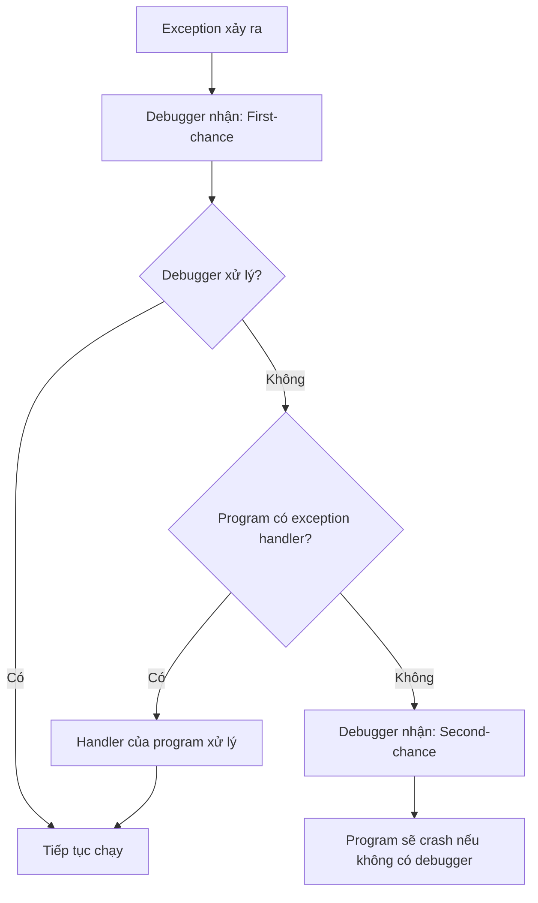

# Chương 8 – DEBUGGING (Gỡ Lỗi Chương Trình)

---

## 1. Debugger là gì?

**Debugger** là phần mềm (hoặc phần cứng) dùng để kiểm tra và điều khiển quá trình thực thi của một chương trình khác.

- Disassembler → chỉ cho ảnh tĩnh (snapshot) của chương trình *trước khi* chạy.
- Debugger → cho cái nhìn **động** trong khi chương trình đang chạy: giá trị thanh ghi, bộ nhớ, đối số hàm thay đổi theo thời gian thực.

> **Tại sao quan trọng với malware analyst?**
> Nhiều thứ không thể suy luận qua disassembly tĩnh: dữ liệu được mã hóa/giải mã tại runtime, tên file tạo ra, chuỗi bị XOR... Debugger tiết lộ tất cả.

---

## 2. Phân loại Debugger

### 2.1 Source-Level vs Assembly-Level

| Loại | Hoạt động trên | Dùng khi nào |
|---|---|---|
| Source-Level | Mã nguồn (C, C++...) | Lập trình viên bình thường, có source |
| Assembly-Level | Mã assembly | Malware analyst — **không có source** |

> Assembly-level debugger vẫn cho phép: đặt breakpoint, step từng lệnh, xem bộ nhớ.

### 2.2 User-Mode vs Kernel-Mode Debugging

```
User-mode debugging:
  [Debugger] ←→ [Process đang debug]   ← cùng một máy, OS cô lập từng process

Kernel-mode debugging:
  [Máy A: chạy code debug] ←→ [Máy B: chạy debugger]   ← cần 2 máy
```

**Lý do cần 2 máy cho kernel debugging:** chỉ có một kernel duy nhất; nếu kernel dừng tại breakpoint, toàn bộ hệ thống đứng, không có gì chạy được.

!!! note "Công cụ"
    - **OllyDbg** → phổ biến nhất cho malware analyst (user-mode)
    - **WinDbg** → hỗ trợ cả user-mode lẫn kernel-mode
    - SoftICE từng hỗ trợ kernel debug trên cùng một máy nhưng **ngừng hỗ trợ từ 2007**

---

## 3. Cách gắn Debugger vào chương trình

Có hai cách:

1. **Khởi chạy chương trình qua debugger** → dừng ngay trước instruction đầu tiên (entry point), toàn quyền kiểm soát từ đầu.
2. **Attach vào process đang chạy** → dừng tất cả thread, debug từ giữa chừng. Dùng khi muốn debug sau khi chương trình đã chạy một thời gian hoặc process bị malware tác động.

---

## 4. Single-Stepping

**Single-stepping** = chạy từng lệnh một, sau mỗi lệnh trả quyền kiểm soát về cho debugger.

!!! warning "Lưu ý thực tế"
    Không nên single-step toàn bộ chương trình phức tạp — quá chậm. Hãy dùng để phân tích **đoạn code cụ thể** đáng ngờ.

**Ví dụ thực tế:** đoạn code XOR để decode chuỗi:

```asm
mov edi, DWORD_00406904   ; địa chỉ dữ liệu cần decode
mov ecx, 0x0d             ; đếm 13 vòng lặp
LOC_040106B2:
    xor [edi], 0x9C       ; XOR từng byte với key 0x9C
    inc edi
    loopw LOC_040106B2
```

Dữ liệu ban đầu tại `0x00406904`: `F8 FD F3 D0` — không có ý nghĩa rõ ràng.

Sau khi single-step qua từng vòng lặp:

```
4CF3FDF8 D0F5FEEE FDEEE5DD 9C   →  (L............)
4C6FFDF8 D0F5FEEE FDEEE5DD 9C   →  (Lo...........)
4C6F61F8 D0F5FEEE FDEEE5DD 9C   →  (Loa..........)
...
4C6F6164 4C696272 61727941 00   →  (LoadLibraryA.)
```

→ Hàm đang **decode chuỗi `LoadLibraryA`** bằng XOR đơn giản — điều không thể thấy qua static analysis.

---

## 5. Step-Over vs Step-Into

| Hành động | Ý nghĩa | Khi nào dùng |
|---|---|---|
| **Step-Over** | Bỏ qua lời gọi hàm, nhảy tới lệnh tiếp sau khi hàm return | Hàm không quan trọng (vd: `LoadLibrary`) |
| **Step-Into** | Đi vào bên trong hàm được gọi | Hàm nghi ngờ cần phân tích sâu |
| **Step-Out** | Chạy đến khi hàm hiện tại return | Đã step-into rồi muốn thoát ra nhanh |

!!! danger "Cạm bẫy với Step-Over"
    Nếu step-over một hàm **không bao giờ return** (vd: hàm vòng lặp vô tận hoặc exit), debugger mất kiểm soát mãi mãi.

    **Giải pháp:** Dùng tính năng **Record/Replay của VMware**:
    - Bắt đầu record khi debug.
    - Khi phát hiện hàm không return → stop record → replay lại đến trước điểm đó → lần này step-into thay vì step-over.

---

## 6. Breakpoints

**Breakpoint** = điểm dừng để kiểm tra trạng thái chương trình (thanh ghi, bộ nhớ, tham số hàm) tại một thời điểm cụ thể.

> Khi chương trình dừng tại breakpoint → gọi là **"broken"**.

### 6.1 Software Execution Breakpoints

**Cơ chế hoạt động:**

```
Debugger ghi đè byte đầu tiên của instruction bằng 0xCC (INT 3)
  → Khi CPU thực thi 0xCC → OS sinh exception → chuyển điều khiển về debugger
  → Debugger hiển thị instruction gốc (restore 0x55 trở lại trên giao diện)
```

```
Memory dump thực tế:    CC 8B EC 83 E4 F8 ...   ← 0xCC là breakpoint
Debugger hiển thị:      55 8B EC 83 E4 F8 ...   ← push ebp (instruction gốc)
```

**Ưu điểm:** Đặt được **số lượng không giới hạn** (user-mode).

**Nhược điểm:**
- Nếu code tự sửa đổi (self-modifying code) → breakpoint bị xóa mất.
- Code đọc bộ nhớ của chính nó sẽ thấy `0xCC` thay vì byte gốc → có thể dùng để **anti-debug**.

---

### 6.2 Hardware Execution Breakpoints

**Cơ chế:** CPU có 4 debug register chuyên dụng (`DR0`–`DR3`), CPU phần cứng so sánh instruction pointer với địa chỉ breakpoint sau **mỗi lệnh**.

**Ưu điểm so với software breakpoint:**
- Không cần sửa byte nào trong bộ nhớ → hoạt động ngay cả với **self-modifying code**.
- Có thể đặt breakpoint trên **truy cập bộ nhớ** (đọc/ghi), không chỉ thực thi.

```
Ví dụ: breakpoint khi có ghi vào địa chỉ 0x00403000
  → dù instruction ở đâu, debugger vẫn break ngay khi ghi xảy ra
```

**Nhược điểm:**
- Chỉ có **4 hardware breakpoint** cùng lúc.
- Malware có thể sửa các debug register (`DR0`–`DR3`, `DR7`) để phá breakpoint.

!!! tip "Bảo vệ debug register"
    Đặt **General Detect flag** trong `DR7` → CPU sinh breakpoint trước khi thực thi bất kỳ lệnh `mov` nào truy cập debug register → phát hiện được khi malware cố sửa register.

---

### 6.3 Conditional Breakpoints

**Cơ chế:** Là software breakpoint nhưng debugger **tự động evaluate điều kiện**; nếu điều kiện không thỏa → tiếp tục chạy mà không thông báo.

**Ví dụ:** Chỉ dừng khi `GetProcAddress` được gọi với tham số `"RegSetValue"`:

```python
# Điều kiện pseudo-code
if stack[esp+4] == "RegSetValue":
    BREAK
else:
    CONTINUE
```

!!! warning "Hiệu năng"
    Conditional breakpoint **chậm hơn nhiều** so với unconditional breakpoint — mỗi lần hit phải evaluate điều kiện. Nếu đặt trên instruction được gọi thường xuyên, chương trình có thể chạy cực kỳ chậm hoặc không bao giờ hoàn thành.

---

### So sánh 3 loại Breakpoint

| Tiêu chí | Software | Hardware | Conditional |
|---|---|---|---|
| Số lượng | Không giới hạn | **Tối đa 4** | Không giới hạn |
| Self-modifying code | ❌ Không hoạt động | ✅ Hoạt động | ❌ Không hoạt động |
| Break on memory access | ❌ Không | ✅ Có | ❌ Không |
| Tốc độ | Nhanh | Nhanh | **Chậm** |
| Anti-debug risk | Cao (0xCC bị detect) | Cao (DR register bị sửa) | Trung bình |

---

## 7. Exceptions (Ngoại lệ)

**Exception** là cơ chế chính để debugger giành quyền kiểm soát chương trình đang chạy. Breakpoint thực ra cũng là exception (INT 3).

### Các nguồn sinh exception thường gặp:

| Exception | Nguyên nhân |
|---|---|
| `INT 3` | Breakpoint — phổ biến nhất |
| Trap flag | Single-stepping — CPU sinh exception sau mỗi lệnh |
| Memory access violation | Truy cập địa chỉ không hợp lệ hoặc không được phép |
| Privileged instruction | Chạy lệnh kernel-mode trong user-mode |
| Division by zero | Phép chia cho 0 |

### First-chance vs Second-chance Exception



!!! info "Malware analysis"
    - **First-chance exception** → thường có thể bỏ qua (malware có thể dùng để chống debug).
    - **Second-chance exception** → **không thể bỏ qua** — program không thể tiếp tục. Thường gặp khi malware không thích môi trường đang chạy (sandbox, VM).

---

## 8. Modify Execution – Sửa đổi luồng thực thi

Debugger không chỉ quan sát mà còn cho phép **thay đổi** cách chương trình chạy:

| Kỹ thuật | Cách làm | Dùng để |
|---|---|---|
| Skip function call | Đặt breakpoint tại `call`, sau đó đặt `EIP` nhảy qua lệnh `call` | Bỏ qua hàm anti-debug |
| Thay đổi return value | Đặt breakpoint sau `call`, sửa `EAX` | Giả lập điều kiện khác |
| Gọi hàm thủ công | Đặt `ESP+4` = tham số mong muốn, đặt `EIP` = địa chỉ hàm | Phân tích một hàm độc lập |
| Sửa thanh ghi cờ | Flip bit trong `EFLAGS` | Thay đổi kết quả điều kiện nhảy |

### Ví dụ thực tế: Virus phụ thuộc ngôn ngữ hệ thống

```asm
call GetSystemDefaultLCID      ; trả về Locale ID trong EAX
mov  [ebp+var_4], eax
cmp  [ebp+var_4], 409h         ; English?
jnz  short loc_411360
call sub_411037                ; → hành vi với English

loc_411360:
cmp  [ebp+var_4], 411h         ; Japanese?
jz   short loc_411372
cmp  [ebp+var_4], 421h         ; Indonesian?
jnz  short loc_411377

loc_411372:
call sub_41100F                ; → hành vi với Japanese/Indonesian

loc_411377:
cmp  [ebp+var_4], 0C04h        ; Chinese?
jnz  short loc_411385
call sub_41100A                ; → tự gỡ cài đặt
```

**Vấn đề:** Máy đang dùng English (`EAX = 0x0409`). Muốn phân tích nhánh Japanese mà không đổi language setting hệ thống.

**Giải pháp:** Đặt breakpoint ngay sau `GetSystemDefaultLCID` → sửa `EAX` từ `0x0409` thành `0x0411` → tiếp tục chạy → chương trình đi vào nhánh Japanese.

!!! danger "Cảnh báo"
    Chỉ thực hiện kỹ thuật này trong **VM có thể xóa/reset** vì virus sẽ thực sự thực thi payload.

---

## 9. Ứng dụng Breakpoint trong thực tế

??? example "Xác định tên file được tạo ra"
    ```asm
    00401050 push edx          ; lpFileName  ← tham số cần xem
    00401055 call CreateFileW
    ```
    → Đặt breakpoint tại `call CreateFileW` → khi break, xem `[esp+4]` (tham số đầu tiên) → đọc được tên file, ví dụ: **`LogFile.txt`**

??? example "Xem dữ liệu trước khi mã hóa"
    ```asm
    004010E7 call GetData
    004010EF call EncryptData   ; ← đặt breakpoint TẠI ĐÂY
    004010F4 mov ecx, s
    00401107 call ds:Send
    ```
    → Đặt breakpoint tại `call EncryptData` → xem buffer trong memory dump trước khi mã hóa → đọc được plaintext, ví dụ: **`Secret Message`**

??? example "Xác định hàm được gọi qua con trỏ"
    ```asm
    0040100B mov eax, [edx]
    0040100D call eax           ; không biết gọi hàm nào!
    ```
    → Đặt breakpoint tại `call eax` → khi break, xem giá trị `EAX` → biết địa chỉ hàm đích.

---

## 10. Tóm tắt

```
Debugger
├── Loại
│   ├── Source-level  (IDE, có source code)
│   └── Assembly-level (malware analysis, không cần source)
├── Môi trường
│   ├── User-mode  (cùng máy, OllyDbg)
│   └── Kernel-mode (2 máy, WinDbg)
├── Kỹ thuật chính
│   ├── Single-stepping
│   ├── Step-over / Step-into / Step-out
│   └── Breakpoints
│       ├── Software  (0xCC, không giới hạn)
│       ├── Hardware  (DR0-DR3, tối đa 4, hỗ trợ access break)
│       └── Conditional (software + điều kiện, chậm)
├── Exceptions
│   ├── First-chance → có thể bỏ qua
│   └── Second-chance → bắt buộc xử lý
└── Modify Execution
    ├── Sửa EIP (nhảy qua/vào hàm)
    ├── Sửa thanh ghi (thay đổi return value)
    └── Sửa bộ nhớ (thay đổi data)
```
