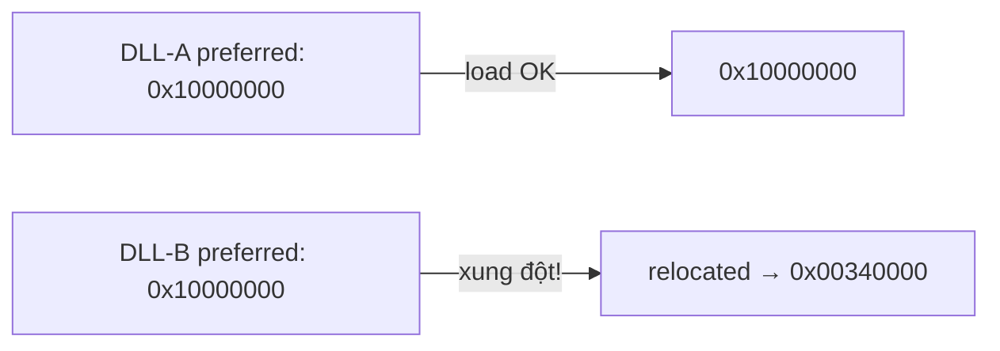
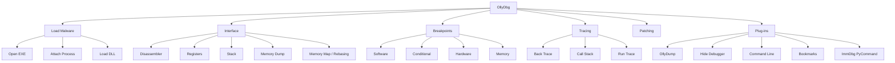

# Chương 9: OllyDbg

## Tổng quan

OllyDbg là **x86 debugger** do Oleh Yuschuk phát triển, dùng để phân tích malware trong khi nó đang chạy (dynamic analysis). Đây là công cụ phổ biến nhất cho malware analyst và reverse engineer vì: miễn phí, dễ dùng, hỗ trợ nhiều plug-in.

> **Lịch sử:** OllyDbg ban đầu được dùng để crack phần mềm. Sau đó Immunity security mua lại codebase 1.1 và tạo ra **Immunity Debugger (ImmDbg)** — về cơ bản giống OllyDbg 1.1 nhưng bổ sung Python interpreter với API. Lưu ý: nhiều plug-in của OllyDbg không chạy được trực tiếp trên ImmDbg. Version 2.0 ra mắt tháng 6/2010 nhưng ít được dùng rộng rãi.

---

## 1. Nạp Malware vào OllyDbg

### 1.1 Mở Executable

```
File → Open → chọn file .exe
```

- Có thể truyền command-line arguments trong ô **Arguments** (chỉ lúc load mới được truyền).
- Sau khi load, OllyDbg dùng loader riêng tương tự Windows OS.
- Mặc định dừng tại **WinMain** (entry point của developer). Nếu không xác định được thì dừng tại entry point trong PE header.
- Thay đổi startup behavior: `Options → Debugging Options` → chọn **System Breakpoint** để break trước khi bất kỳ code nào chạy.

!!! note "OllyDbg 2.0"
    Version 2.0 hỗ trợ dừng tại **TLS callback** — thứ mà version 1.1 không làm được. TLS callback cho phép malware chạy code *trước khi* OllyDbg pause, thường dùng cho anti-debugging (xem Chapter 16).

### 1.2 Attach vào Process đang chạy

```
File → Attach → chọn process
```

- Hữu ích khi malware đã chạy sẵn trên hệ thống.
- OllyDbg sẽ break vào và pause toàn bộ thread.
- **Vấn đề hay gặp:** Có thể pause ngay trong system DLL (không phải code malware). Giải pháp: set breakpoint on access lên toàn bộ code section → chương trình sẽ break lần tiếp theo code section được truy cập.

### 1.3 Load DLL

OllyDbg dùng chương trình dummy `loaddll.exe` để load DLL (vì DLL không chạy trực tiếp được).

- Mặc định break tại **DllMain** (hàm initialization khi DLL được load).
- Gọi exported function: `Debug → Call DLL Export`
- Ví dụ: load `ws2_32.dll`, gọi hàm `ntohl` với argument `0x7F000001` (127.0.0.1 network byte order) → kết quả EAX = `0x0100007F`.

---

## 2. Giao diện OllyDbg

Khi load chương trình, OllyDbg hiển thị **4 cửa sổ chính:**

```
┌─────────────────────┬──────────────────┐
│  Disassembler       │  Registers       │
│  (code + EIP)       │  (EAX,EBX,...) ② │
│                   ① │                  │
├─────────────────────┼──────────────────┤
│  Memory Dump        │  Stack           │
│  (live memory)    ④ │  (stack top)   ③ │
└─────────────────────┴──────────────────┘
```

| Cửa sổ | Chức năng | Thao tác quan trọng |
|---|---|---|
| **Disassembler** | Hiển thị code, EIP hiện tại | Spacebar = sửa instruction/thêm assembly |
| **Registers** | Trạng thái thanh ghi | Register đổi màu đỏ khi vừa bị modify; right-click → Modify |
| **Stack** | Stack của thread đang debug | Right-click → Modify; OllyDbg tự comment tên argument API |
| **Memory Dump** | Dump live memory | Ctrl+G = nhảy đến địa chỉ; right-click → Binary Edit |

---

## 3. Memory Map

```
View → Memory
```

Hiển thị toàn bộ memory block được cấp phát, bao gồm executable, code/data sections, tất cả DLL.

- Double-click row → xem memory dump của section đó.
- Right-click → **View in Disassembler** để đẩy vào disassembler window.

### 3.1 Rebasing — Tại sao địa chỉ thay đổi?

Mọi PE file có **preferred base address** (image base) định nghĩa trong PE header. Hầu hết executable dùng `0x00400000` (default của nhiều compiler).

**Vấn đề xung đột DLL:**



Khi relocation xảy ra, Windows phải cập nhật tất cả **absolute address** references trong DLL đó. Các instruction dùng relative address thì không cần sửa, nhưng instruction như:

```asm
0040120c    mov eax, dword_40CF60    ; absolute address → phải sửa khi reloc
```

phải được cập nhật. DLL thường có section `.reloc` chứa danh sách các địa chỉ cần fix-up.

!!! warning "IDA Pro vs OllyDbg"
    Nếu dùng IDA Pro song song với OllyDbg, địa chỉ trong IDA Pro sẽ **khác** với runtime address vì IDA không biết rebasing đã xảy ra. Dùng manual load process (Chapter 5) để tránh vấn đề này.

### 3.2 Xem Threads và Stacks

```
View → Threads
```

- Hiển thị memory location và trạng thái của từng thread (active/paused/suspended).
- OllyDbg là **single-threaded debugger** → cần pause tất cả thread, set breakpoint, rồi resume để debug thread cụ thể.
- Mỗi thread có stack riêng — xem trong memory map (label "stack of main thread").

---

## 4. Thực thi Code

| Function | Hotkey | Ghi chú |
|---|---|---|
| Run/Play | F9 | Chạy chương trình |
| Pause | F12 | Ít dùng (hay dừng ở library code) |
| Run to Selection | F4 | Chạy đến instruction được chọn |
| Run until Return | Ctrl+F9 | Dừng trước khi hàm hiện tại return |
| Run until User Code | Alt+F9 | Thoát khỏi library code, về malware code |
| Step Into (single-step) | F7 | Thực thi 1 instruction, nhảy vào call |
| Step Over | F8 | Thực thi 1 instruction, bỏ qua call |

**Step Over hoạt động thế nào dưới hood:**

```asm
010073a4    call 01007568
010073a9    xor ebx, ebx        ← OllyDbg đặt hidden breakpoint ở đây
```

OllyDbg tự đặt breakpoint tại `010073a9`, resume execution, chờ subroutine `ret` → pause tại `010073a9`.

!!! warning "Rủi ro Step Over"
    Malware có thể lợi dụng: nếu subroutine không bao giờ `ret` hoặc là **get-EIP operation** (pop return address khỏi stack), step-over có thể khiến chương trình chạy mãi không dừng.

---

## 5. Breakpoints

OllyDbg hỗ trợ đầy đủ các loại breakpoint:

| Loại | Cách set | Hotkey |
|---|---|---|
| Software breakpoint | Breakpoint → Toggle | F2 |
| Conditional breakpoint | Breakpoint → Conditional | Shift+F2 |
| Hardware breakpoint | Breakpoint → Hardware, on Execution | — |
| Memory breakpoint (access) | Breakpoint → Memory, on Access | F2 (chọn memory) |
| Memory breakpoint (write) | Breakpoint → Memory, on Write | — |

Xem active breakpoints: `View → Breakpoints` hoặc click icon **B** trên toolbar. OllyDbg lưu breakpoint sau khi đóng chương trình.

### 5.1 Software Breakpoints — Ứng dụng với String Decoder

Malware hay obfuscate strings và dùng string decoder function. Ví dụ:

```asm
push offset "4NNpTNHLKIXoPm7iBhUAjvRKNaUVBlr"
call String_Decoder
...
push offset "ugKLdNlLT6emldCeZi72mUjieuBqdfZ"
call String_Decoder
```

**Chiến lược:** Set breakpoint tại **cuối** hàm String_Decoder → mỗi lần nhấn Play, chương trình chạy và dừng khi vừa decode xong 1 string → nhìn stack để thấy string thực.

### 5.2 Conditional Breakpoints — Ví dụ Poison Ivy

**Tình huống:** Poison Ivy backdoor gọi `VirtualAlloc` rất nhiều lần, nhưng chỉ quan tâm đến lần alloc shellcode lớn (> 100 bytes).

**Cách set:**

```
1. Đặt breakpoint tại VirtualAlloc
2. Khi dừng, xem stack: Size nằm ở [ESP+8]
3. Right-click instruction đầu VirtualAlloc → Breakpoint → Conditional
4. Nhập điều kiện: [ESP+8] > 100
5. Click Play
```

```
Stack layout tại VirtualAlloc:
[ESP+0]  = return address
[ESP+4]  = Address
[ESP+8]  = Size        ← cần kiểm tra
[ESP+C]  = AllocationType
[ESP+10] = Protect
```

!!! warning
    Conditional breakpoint làm chậm chương trình đáng kể. Nếu điều kiện không bao giờ đúng, chương trình chạy mãi.

### 5.3 Hardware Breakpoints

- Dùng hardware register chuyên dụng → **không thay đổi code**, không làm chậm execution.
- Giới hạn: **chỉ 4 breakpoint** cùng lúc.
- Set: Right-click instruction → `Breakpoint → Hardware, on Execution`
- Dùng hardware breakpoint mặc định để chống **software breakpoint scanning** (anti-debugging technique).

### 5.4 Memory Breakpoints — Theo dõi DLL

Dùng để phát hiện khi nào một DLL loaded được thực thi:

```
1. View → Memory (mở Memory Map)
2. Right-click .text section của DLL
3. Set Memory Breakpoint on Access
4. F9 để resume
→ Chương trình dừng khi execution vào .text section của DLL đó
```

!!! note
    Chỉ set được **1 memory breakpoint** tại một thời điểm. Memory breakpoint có overhead lớn — dùng tiết kiệm.

---

## 6. Tracing

Ghi lại thông tin thực thi chi tiết để phân tích sau.

### 6.1 Standard Back Trace

Khi đang step through code:
- Phím `-` → quay về instruction đã thực thi trước đó
- Phím `+` → tiến tới

### 6.2 Call Stack

```
View → Call Stack
```

Hiển thị chuỗi function call dẫn đến vị trí hiện tại. Click Address/Called From để navigate. Lưu ý: register/stack không phản ánh state tại điểm đó **trừ khi** đang dùng run trace.

### 6.3 Run Trace

Ghi lại toàn bộ instruction được thực thi + mọi thay đổi register/flag.

**Ba cách kích hoạt:**

**Cách 1:** Chọn code trong disassembler → right-click → `Run Trace → Add Selection` → sau đó `View → Run Trace`

**Cách 2:** Dùng **Trace Into** (step into + ghi lại tất cả) hoặc **Trace Over** (chỉ ghi trong hàm hiện tại)

**Cách 3:** `Debug → Set Condition` → trace cho đến khi điều kiện xảy ra

!!! warning
    Trace Into/Over không có breakpoint sẽ trace toàn bộ chương trình → rất chậm, tốn nhiều RAM.

### 6.4 Ứng dụng: Tracing Poison Ivy tìm Shellcode

**Mục tiêu:** Bắt được thời điểm Poison Ivy nhảy vào execute shellcode trên heap.

```
Điều kiện: EIP is in range [0x00000000 - 0x003FFFFF]
(dưới 0x400000 = vùng heap/stack, không phải executable image thông thường)
```

1. Set condition: EIP < `0x400000`
2. Chọn Trace Into
3. Chương trình pause khi EIP = `0x142A88` (start của shellcode)
4. Dùng phím `-` để back trace xem shellcode được gọi như thế nào

---

## 7. Exception Handling

Khi exception xảy ra, OllyDbg được kiểm soát trước, có thể:

| Hotkey | Hành động |
|---|---|
| Shift+F7 | Step into exception |
| Shift+F8 | Step over exception |
| Shift+F9 | Chạy exception handler |

Cấu hình tự động bỏ qua exception: `Options → Debugging Options → Exceptions`

!!! tip "Trong malware analysis"
    Nên **ignore tất cả exceptions** và pass thẳng cho chương trình xử lý — vì mục tiêu là quan sát behavior, không phải fix bug.

---

## 8. Patching

### 8.1 Patch trong Live Memory

OllyDbg cho phép sửa bất kỳ instruction hay data nào đang chạy:

```
Right-click region → Binary → Edit    (sửa opcodes/data)
Right-click region → Binary → Fill with NOPs   (xóa logic)
Right-click region → Binary → Fill with 00's
```

**Ví dụ bypass password check:**

```asm
; Code gốc:
CMP  DWORD PTR SS:[EBP-24], 0
JNZ  password.00401177        ; ← nếu sai key → "Bad key"
; ...in "Key Accepted!"

; Patch: thay JNZ bằng 2x NOP
NOP
NOP
; → luôn in "Key Accepted!" bất kể key nhập vào
```

### 8.2 Lưu Patch ra Disk (2 bước)

```
Bước 1: Right-click disassembler → Copy to Executable → All Modifications
Bước 2: Trong cửa sổ mới → Save File
```

Kết quả: file executable trên disk được thay đổi vĩnh viễn.

---

## 9. Phân tích Shellcode

OllyDbg có cách undocumented để load và debug shellcode trực tiếp:

```
1. Copy shellcode từ hex editor vào clipboard
2. View → Memory → chọn region có Type = "Priv" (private memory, vùng zero bytes)
3. Double-click → xem hex dump, tìm vùng có vài trăm zero bytes liên tiếp
4. Right-click region → Set Access → Full Access (cấp RWX permissions)
5. Trong Memory Dump: highlight vùng đủ lớn → right-click → Binary → Binary Paste
6. Set EIP = địa chỉ vừa paste:
   - Right-click instruction trong disassembler → New Origin Here
7. Debug bình thường bằng F7/F8
```

---

## 10. Assistance Features

| Feature | Cách dùng | Tác dụng |
|---|---|---|
| **Logging** | View → Log | Xem history: DLL loaded, breakpoint hit,... |
| **Watches** | View → Watches → Spacebar | Theo dõi giá trị expression liên tục, ví dụ `[EAX+ESP+4]` |
| **Help** | Help → Contents → Evaluation of Expressions | Hướng dẫn viết expression |
| **Labeling** | Right-click address → Label | Đặt tên symbolic cho địa chỉ (giống IDA Pro), ví dụ `password_loop` |

---

## 11. Plug-ins

Plug-in là DLL đặt trong thư mục root của OllyDbg, tự động nhận diện vào menu Plugins.

Nguồn plug-in: `http://www.openrce.org/downloads/browse/OllyDbg_Plugins`

### 11.1 OllyDump

Dump process đang debug ra PE file — dùng khi **unpacking** malware (Chapter 18). OllyDump phục hồi lại trạng thái các section (code, data) như chúng tồn tại trong memory.

### 11.2 Hide Debugger

Ẩn sự hiện diện của OllyDbg khỏi malware. Bảo vệ chống:
- `IsDebuggerPresent` check
- `FindWindow` check
- Unhandled exception tricks
- `OutputDebugString` exploit

### 11.3 Command Line

Tạo trải nghiệm giống WinDbg. Các lệnh phổ biến:

```
bp gethostbyname        ; set software breakpoint
bp [ESP+8]>100          ; conditional breakpoint
bc expression           ; remove breakpoint
hw expression           ; hardware breakpoint on execution
bpx label               ; breakpoint mỗi call đến label
g 0x401000              ; run until address
s                       ; step into
so                      ; step over
d expression            ; dump memory
```

**Ví dụ thực tế:** Malware obfuscate strings nhưng có import `gethostbyname`:
```
bp gethostbyname
→ Play → pause tại start của gethostbyname
→ Xem stack/register → thấy hostname: malwareanalysisbook.com
```

### 11.4 Bookmarks

Đặt bookmark tại địa chỉ memory để quay lại nhanh mà không cần nhớ địa chỉ.

```
Right-click disassembler → Bookmark → Insert Bookmark
Plugins → Bookmarks → Bookmarks → click để navigate
```

---

## 12. Scriptable Debugging với ImmDbg

Khi cần mở rộng OllyDbg, dùng **ImmDbg** với Python API thay vì viết plug-in DLL.

Loại script phổ biến nhất: **PyCommand** — đặt trong thư mục `PyCommands\`, chạy bằng `!scriptname`.

**Cấu trúc PyCommand:**

```python
import immlib          # (1) import module ImmDbg

def do_something(imm): # (2) helper function
    addr = imm.getAddress("kernel32.SomeFunction")
    # ...

def main(args):        # (3) entry point, nhận args từ command line
    imm = immlib.Debugger()
    do_something(imm)
    return "Done!"     # (4) string hiển thị trên status bar
```

**Ví dụ thực tế — Vô hiệu hóa DeleteFile:**

```python
import immlib

def Patch_DeleteFileA(imm):
    delfileAddress = imm.getAddress("kernel32.DeleteFileA")
    if (delfileAddress <= 0):
        imm.log("No DeleteFile to patch")
        return
    imm.log("Patching DeleteFileA")
    # Patch = XOR EAX, EAX / RET 4
    # → DeleteFile luôn return 0 (fail) → malware không xóa được file
    patch = imm.assemble("XOR EAX, EAX \n Ret 4")
    imm.writeMemory(delfileAddress, patch)

def main(args):
    imm = immlib.Debugger()
    Patch_DeleteFileA(imm)
    return "DeleteFileA is patched..."
```

**Ứng dụng phổ biến của Python scripts:**
- Anti-debugger patching
- Inline function hooking
- Function parameter logging

---

## Tóm tắt



> **Giới hạn của OllyDbg:** Chỉ debug được **user-mode** malware. Với kernel-mode malware (rootkits, device drivers) → cần dùng **WinDbg** (Chapter 10).
