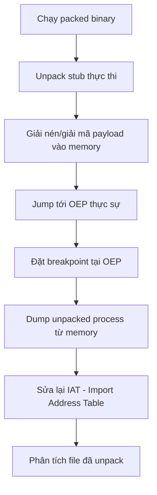
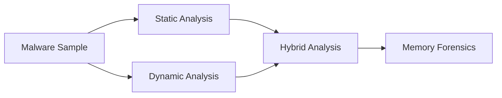

# Bài 1: Introduction to Malware Analysis

## 1. Mục tiêu của Phân tích Malware

Phân tích malware nhằm cung cấp thông tin cần thiết để phản ứng với các sự cố xâm nhập mạng. Các mục tiêu cụ thể bao gồm:

- Xác định chính xác điều gì đã xảy ra và đảm bảo đã tìm ra tất cả máy/file bị nhiễm.
- Xác định binary đáng ngờ có thể làm gì, cách phát hiện nó trên mạng, và cách đo lường/kiềm chế thiệt hại.
- Phát triển **signatures** (chữ ký) để phát hiện nhiễm malware trên mạng.

Malware analysis tạo ra hai loại signature chính:

=== "Host-based Signatures"
    - Phát hiện mã độc trên máy nạn nhân.
    - Nhận dạng file được tạo/chỉnh sửa bởi malware, hoặc thay đổi trong registry.
    - Tập trung vào **hành vi của malware** (những gì nó làm với hệ thống), không phải đặc điểm của malware.
    - Hiệu quả hơn trong việc phát hiện malware biến đổi hình dạng hoặc đã bị xóa khỏi ổ cứng.

=== "Network Signatures"
    - Phát hiện mã độc bằng cách giám sát traffic mạng.
    - Có thể tạo mà không cần phân tích malware, nhưng khi kết hợp với phân tích malware thì:
        - Tỷ lệ phát hiện cao hơn.
        - Ít false positive hơn.

---

## 2. Tại sao Malware Analysis quan trọng?

!!! warning "Thực tế đáng lo ngại"
    > "70–90% mẫu malware là duy nhất đối với từng tổ chức." — Verizon Data Breach Report 2015

- Antivirus **không thể tin tưởng hoàn toàn**.
- 50–97% các vụ breach có liên quan đến malware.
- Khi xảy ra breach, có ba mức độ phản ứng:

```
Cơ bản:       Reimage máy bị nhiễm
Nâng cao:     Incident Response – phân tích log, network traffic, tiến trình lạ
              → Malware còn ở đâu nữa không? Nó vào từ đâu?
Trưởng thành: Thu thập Intelligence – đánh giá impact, rủi ro, động cơ tấn công
              (Tài chính? Hacktivism? Cơ hội? APT?)
```

---

## 3. Malware là gì?

**Malware** (Malicious Software) là phần mềm thực thi mà không có sự cho phép hoặc hiểu biết của người dùng.

Giống như phần mềm thông thường, malware cũng có:

- Vấn đề tương thích
- Bug
- Hỗ trợ "khách hàng" (nạn nhân)
- Quản lý phiên bản / cập nhật
- Phát triển theo nhóm / kiểm soát source code

---

## 4. PE File (Portable Executable)

PE là định dạng file thực thi trên Windows (`.exe`, `.dll`, ...). Cấu trúc gồm:

```
PE FILE (on disk)         MEMORY (khi load)
──────────────────        ──────────────────
MS-DOS Header      →      MS-DOS Header (0x00400000)
PE File Header     →      PE File Header
Optional Header    →      Optional Header
Section Header     →      Section Header
  .text            →        .text  (OEP – Original Entry Point)
  .rdata           →        .rdata
  .data            →        .data
  .rsrc            →        .rsrc
```

!!! info "Tại sao cần hiểu PE file?"
    Khi phân tích malware, analyst cần đọc PE header để hiểu các section, imports/exports, entry point – rất quan trọng trong reverse engineering và unpacking.

---

## 5. Packed/Unpacked Malware

### 5.1. Packing là gì?

**Packing** là kỹ thuật nén/mã hóa malware để che giấu mã thực sự, chống lại phân tích tĩnh và antivirus.

```
Normal PE File          Packed PE File
──────────────          ──────────────────────
PE Header               PE Header
.text (OEP)             Packed original section (nén/mã hóa)
.data                   Unpack stub (new OEP) ← chạy đầu tiên
.rsrc
```

### 5.2. Quy trình Unpacking



!!! tip "Các công cụ hỗ trợ unpacking"
    - x64dbg / OllyDbg: đặt breakpoint, trace execution
    - Scylla / ImportREC: sửa IAT sau khi dump
    - Themida unpacker (Viettel Cybersecurity blog)

---

## 6. Phân loại Malware

### 6.1. Các loại chung

| Loại | Mô tả |
|---|---|
| **Virus** | Tự sao chép bằng cách gắn vào file khác |
| **Worm** | Tự sao chép qua mạng mà không cần file host |
| **Trojan** | Giả dạng phần mềm hợp lệ để đánh lừa người dùng |
| **Bot** | Máy bị nhiễm chờ lệnh từ C&C server |
| **Rootkit** | Ẩn sự tồn tại của mã độc khác trong hệ thống |
| **RAT** | Remote Access Trojan – kiểm soát từ xa |

### 6.2. Các loại chuyên biệt

| Loại | Mô tả |
|---|---|
| **Backdoor** | Cho phép attacker điều khiển hệ thống bí mật |
| **Botnet** | Tập hợp máy bị nhiễm, nhận lệnh từ C&C server chung |
| **Downloader** | Chỉ tồn tại để tải malware khác về – thường dùng khi mới xâm nhập |
| **Launcher** | Dùng để khởi chạy malware khác, thường có kỹ thuật stealth |
| **Information Stealer** | Sniffer, keylogger, password hash grabber |
| **Scareware** | Dọa người dùng để mua phần mềm giả mạo |
| **Spyware** | Thu thập thông tin bí mật |
| **Adware** | Hiển thị quảng cáo không mong muốn |
| **Spam-sending malware** | Attacker cho thuê máy để gửi spam |
| **Credential Stealer** | Đánh cắp thông tin đăng nhập |

### 6.3. Phần mềm độc hại khác

- **Builder**: Công cụ tạo malware tùy chỉnh.
- **Exploit Kit**: Bộ công cụ khai thác lỗ hổng tự động.
- **Packer/Crypter**: Nén/mã hóa malware để tránh bị phát hiện.

---

## 7. Phân loại Payload độc hại

=== "Shellcode"
    - Tập hợp các instruction được inject vào chương trình bị khai thác và thực thi.
    - Thường là mã máy nhỏ gọn, không phụ thuộc vào môi trường cụ thể.

=== "Staged Payload"
    - Sử dụng nhiều payload kết hợp để thực hiện nhiệm vụ mà một payload đơn không làm được.
    - Ví dụ: stager nhỏ → tải stage chính → thực thi.

=== "Stageless Payload"
    - Chứa tất cả mọi thứ cần thiết để thiết lập reverse shell trong một payload duy nhất.
    - Lớn hơn staged payload nhưng đơn giản hơn về triển khai.

---

## 8. Mass vs. Targeted Malware

| Tiêu chí | Mass Malware | Targeted Malware |
|---|---|---|
| Mục tiêu | Lây nhiễm càng nhiều máy càng tốt | Nhắm vào mục tiêu cụ thể |
| Phổ biến | Loại phổ biến nhất | Ít phổ biến hơn |
| Khó phát hiện | Thấp – trung bình | Rất cao |
| Phân tích | Đơn giản hơn | Yêu cầu phân tích nâng cao |
| Ví dụ | Ransomware lan tràn, spam malware | APT, malware gián điệp nhà nước |

---

## 9. Các loại Phân tích Malware



=== "Static Analysis"
    - Kiểm tra malware mà **không chạy** nó.
    - Ưu điểm: An toàn, phân tích sâu.
    - Nhược điểm: Chậm, cần kỹ thuật cao, malware có thể bị obfuscate.
    - Công cụ: VirusTotal, `strings`, IDA Pro, Ghidra.

=== "Dynamic Analysis"
    - **Chạy malware** và quan sát hành vi.
    - Ưu điểm: Nhanh, đơn giản.
    - Nhược điểm: Có thể bỏ sót hành vi ẩn, cần môi trường cô lập.
    - Công cụ: RegShot, Process Monitor, Process Hacker, CaptureBAT, Wireshark.

=== "Hybrid Analysis"
    - Kết hợp cả hai: tìm gợi ý từ disassembly, sau đó xác nhận khi chạy.
    - Thực tế, hầu hết phân tích là hybrid.
    - Memory Forensics: Mandiant Redline, Volatility.

---

## 10. Nguyên tắc chung khi phân tích Malware

!!! note "Nguyên tắc 1: Không sa đà vào chi tiết"
    Malware thường rất lớn và phức tạp. Tập trung vào **các tính năng chính**. Khi gặp đoạn phức tạp, hãy nắm tổng quan trước, sau đó đi sâu.

!!! note "Nguyên tắc 2: Dùng đúng công cụ cho đúng việc"
    Không có một phương pháp duy nhất. Nếu một công cụ không hiệu quả, hãy thử công cụ khác. Nếu bị stuck, chuyển sang vấn đề khác rồi quay lại.

!!! note "Nguyên tắc 3: Malware analysis là trò chơi mèo vờn chuột"
    Khi kỹ thuật phân tích mới ra đời, tác giả malware sẽ phát triển kỹ thuật mới để chống lại. Analyst phải liên tục cập nhật và thích nghi.

---

## 11. Công cụ cơ bản

| Nhóm | Công cụ |
|---|---|
| System Internals | SysInternals Suite (Process Monitor, Autoruns, ...) |
| Hex Editor | 010 Editor |
| PE Viewer | CFF Explorer, PE Explorer, PE View, PE Studio |
| Disassembler / Debugger | IDA Pro, x64dbg, Ghidra, WinDbg, Hopper |
| Network Monitor | Wireshark, CaptureBAT |
| Process Monitor | Process Hacker, Process Monitor |
| Registry | RegShot |
| RAM Analysis | Mandiant Redline, Volatility |
| Tiện ích | Cygwin (md5sum, strings, xxd), Notepad++, 7zip |

---

## 12. One Minute Triage (Phân loại nhanh)

Quy trình phân loại nhanh một mẫu malware trong vài phút:

```
1. Lấy MD5 Hash của file (dùng MAP hoặc md5sum)
2. Tra cứu trên VirusTotal
   → Tên phổ biến của malware
   → Indicators of Compromise (IoC)
3. Chạy "strings" để xem chuỗi ký tự đáng ngờ
   (URL, IP, tên API, registry key,...)
4. Mở bằng Hex Editor để xem cấu trúc thô
```

---

## 13. Nguồn lấy mẫu Malware

| Nguồn | Ghi chú |
|---|---|
| Contagio Malware Dump | Miễn phí, cần password |
| KernelMode.info | Miễn phí, cần đăng ký |
| VirusShare | Miễn phí |
| MalwareBazaar (abuse.ch) | Miễn phí, cập nhật thường xuyên |
| theZoo | Miễn phí |
| Malshare | Miễn phí |

---

## 14. Tài liệu tham khảo & Luyện tập

- **Sách:** *Practical Malware Analysis* – Michael Sikorski, Andrew Honig
- **Sách:** *Virus Research and Defense* – Peter Szor
- **Luyện tập RE:** reversing.kr, tuts4you (Lena's Reversing for Newbies)
- **Thư viện:** MOSSE Institute Reverse Engineering Library

---

# Câu hỏi Trắc nghiệm

**Câu 1.** Mục tiêu chính của malware analysis là gì?

- A. Viết lại phần mềm bị nhiễm
- B. Cung cấp thông tin để phản ứng với xâm nhập mạng và xác định toàn bộ máy/file bị nhiễm
- C. Chỉ xóa malware khỏi hệ thống
- D. Cài đặt lại hệ điều hành

??? info "Đáp án & Giải thích"
    **Đáp án: B**
    
    Mục tiêu của malware analysis là cung cấp thông tin cần thiết để phản ứng với sự cố, xác định chính xác điều đã xảy ra, tìm tất cả máy/file bị nhiễm, và phát triển signature để phát hiện malware.

---

**Câu 2.** Host-based signature khác network signature ở điểm nào?

- A. Host-based signature chỉ dùng trên server
- B. Host-based signature phát hiện malware dựa trên hành vi trên máy nạn nhân; network signature dựa trên traffic mạng
- C. Network signature chính xác hơn host-based signature
- D. Cả hai đều giống nhau

??? info "Đáp án & Giải thích"
    **Đáp án: B**
    
    Host-based signature phát hiện qua thay đổi file/registry trên máy. Network signature phát hiện qua giám sát lưu lượng mạng.

---

**Câu 3.** Tại sao host-based signature hiệu quả hơn antivirus signature thông thường?

- A. Vì chúng nhanh hơn
- B. Vì chúng dựa trên hành vi malware, không phải đặc điểm của file, nên vẫn phát hiện được malware đã biến đổi hoặc đã bị xóa
- C. Vì chúng dùng AI
- D. Vì chúng miễn phí

??? info "Đáp án & Giải thích"
    **Đáp án: B**
    
    Antivirus truyền thống dựa trên hash/đặc điểm file, dễ bị bypass bằng cách thay đổi nhỏ. Host-based signature tập trung vào hành vi (file tạo ra, key registry thay đổi) nên vẫn phát hiện được dù malware thay đổi hình dạng.

---

**Câu 4.** Theo Verizon Data Breach Report 2015, bao nhiêu phần trăm mẫu malware là duy nhất với từng tổ chức?

- A. 10–20%
- B. 30–50%
- C. 70–90%
- D. 100%

??? info "Đáp án & Giải thích"
    **Đáp án: C**
    
    70–90% malware samples là duy nhất đối với tổ chức bị tấn công, nghĩa là antivirus thông thường khó phát hiện vì chưa có signature.

---

**Câu 5.** "Mature" (trưởng thành) trong phản ứng sự cố malware có nghĩa là gì?

- A. Reimage máy bị nhiễm
- B. Phân tích log và network traffic
- C. Thu thập intelligence: đánh giá impact, rủi ro, động cơ tấn công
- D. Cài thêm antivirus

??? info "Đáp án & Giải thích"
    **Đáp án: C**
    
    Ba mức phản ứng: Cơ bản (reimage), Nâng cao (incident response), Trưởng thành (gather intelligence).

---

**Câu 6.** PE file là gì?

- A. Private Executable – định dạng file bí mật
- B. Portable Executable – định dạng file thực thi chuẩn trên Windows
- C. Packed Executable – file đã được nén
- D. Protected Executable – file được mã hóa

??? info "Đáp án & Giải thích"
    **Đáp án: B**
    
    PE (Portable Executable) là định dạng chuẩn cho file thực thi trên Windows (.exe, .dll, .sys,...).

---

**Câu 7.** OEP trong context của PE file và unpacking là gì?

- A. Optional Entry Point
- B. Original Entry Point – địa chỉ lệnh đầu tiên của chương trình gốc trước khi bị pack
- C. Obfuscated Entry Point
- D. Output Entry Point

??? info "Đáp án & Giải thích"
    **Đáp án: B**
    
    OEP (Original Entry Point) là điểm vào thực sự của malware gốc. Khi packed, chương trình chạy unpack stub trước, rồi jump tới OEP.

---

**Câu 8.** Mục đích của Packing/Packer trong malware là gì?

- A. Làm file nhỏ hơn để tiết kiệm băng thông
- B. Nén/mã hóa malware để che giấu mã thực, qua mặt antivirus và chống phân tích tĩnh
- C. Tăng tốc độ thực thi
- D. Tương thích với nhiều hệ điều hành hơn

??? info "Đáp án & Giải thích"
    **Đáp án: B**
    
    Packer chủ yếu dùng để evasion – qua mặt antivirus và làm khó reverse engineering.

---

**Câu 9.** Sau khi dump unpacked process từ memory, bước tiếp theo cần làm là gì?

- A. Chạy lại file dump ngay
- B. Sửa lại IAT (Import Address Table)
- C. Xóa file gốc
- D. Tải lên VirusTotal

??? info "Đáp án & Giải thích"
    **Đáp án: B**
    
    Sau khi dump, IAT thường bị hỏng vì các địa chỉ trong memory khác với giá trị cần thiết cho file disk. Cần dùng công cụ như Scylla để sửa IAT.

---

**Câu 10.** Loại malware nào tự sao chép qua mạng mà không cần gắn vào file host?

- A. Virus
- B. Trojan
- C. Worm
- D. Rootkit

??? info "Đáp án & Giải thích"
    **Đáp án: C**
    
    Worm tự sao chép và lây lan qua mạng độc lập. Virus cần gắn vào file host để lây lan.

---

**Câu 11.** Rootkit có chức năng chính là gì?

- A. Mã hóa file của nạn nhân
- B. Che giấu sự tồn tại của mã độc khác trong hệ thống
- C. Đánh cắp thông tin đăng nhập
- D. Gửi spam

??? info "Đáp án & Giải thích"
    **Đáp án: B**
    
    Rootkit ẩn các tiến trình, file, kết nối mạng của malware khác. Thường đi kèm với backdoor.

---

**Câu 12.** Downloader malware thường được dùng khi nào?

- A. Khi cần gửi spam
- B. Khi attacker lần đầu tiên xâm nhập vào hệ thống, dùng để tải malware thực sự về
- C. Khi cần mã hóa file
- D. Khi cần khai thác lỗ hổng

??? info "Đáp án & Giải thích"
    **Đáp án: B**
    
    Downloader nhỏ gọn, chỉ có nhiệm vụ duy nhất là tải payload chính về và thực thi. Thường được dùng như foothold ban đầu.

---

**Câu 13.** Botnet hoạt động dựa trên mô hình nào?

- A. Peer-to-peer giữa các máy bị nhiễm
- B. Tất cả máy bị nhiễm nhận lệnh từ cùng một C&C (Command-and-Control) server
- C. Mỗi máy tự hoạt động độc lập
- D. Thông qua email

??? info "Đáp án & Giải thích"
    **Đáp án: B**
    
    Botnet truyền thống dùng mô hình C&C tập trung. (Lưu ý: botnet hiện đại đôi khi dùng P2P để tránh single point of failure.)

---

**Câu 14.** Scareware là loại malware nào?

- A. Malware ẩn trong hệ thống
- B. Malware dọa người dùng để ép mua phần mềm giả mạo
- C. Malware theo dõi hoạt động người dùng
- D. Malware gửi spam

??? info "Đáp án & Giải thích"
    **Đáp án: B**
    
    Scareware hiển thị cảnh báo giả (như "máy bạn bị nhiễm virus nghiêm trọng") để ép người dùng mua phần mềm "diệt virus" giả, thực ra là malware.

---

**Câu 15.** Information-stealing malware bao gồm các loại công cụ nào?

- A. Firewall, IDS, IPS
- B. Sniffer, keylogger, password hash grabber
- C. Packer, crypter, builder
- D. Rootkit, backdoor, RAT

??? info "Đáp án & Giải thích"
    **Đáp án: B**
    
    Information stealer thu thập thông tin bằng cách chặn traffic (sniffer), ghi phím gõ (keylogger), hoặc lấy hash mật khẩu từ memory/registry.

---

**Câu 16.** Sự khác biệt giữa Targeted Malware và Mass Malware là gì?

- A. Targeted malware rẻ hơn để phát triển
- B. Mass malware nhắm vào mục tiêu cụ thể; targeted malware lây lan rộng
- C. Targeted malware được tùy chỉnh cho mục tiêu cụ thể và rất khó phát hiện; mass malware cố gắng lây nhiễm càng nhiều máy càng tốt
- D. Không có sự khác biệt

??? info "Đáp án & Giải thích"
    **Đáp án: C**
    
    Mass malware ưu tiên số lượng. Targeted malware (như APT) ưu tiên bí mật và hiệu quả trên mục tiêu cụ thể, thường được nhà nước/tổ chức tội phạm chuyên nghiệp đứng sau.

---

**Câu 17.** Static Analysis là gì?

- A. Phân tích malware trong khi nó đang chạy
- B. Phân tích malware mà không thực thi nó – kiểm tra code, cấu trúc file
- C. Phân tích log hệ thống sau khi nhiễm
- D. Phân tích network traffic

??? info "Đáp án & Giải thích"
    **Đáp án: B**
    
    Static analysis không chạy malware, an toàn hơn nhưng cần kiến thức kỹ thuật cao và malware có thể dùng obfuscation để cản trở.

---

**Câu 18.** Dynamic Analysis có ưu điểm và nhược điểm gì?

- A. Ưu: an toàn tuyệt đối; Nhược: chậm
- B. Ưu: nhanh, đơn giản; Nhược: có thể bỏ sót hành vi, cần môi trường cô lập
- C. Ưu: không cần công cụ; Nhược: không chính xác
- D. Ưu: phân tích sâu nhất; Nhược: đắt tiền

??? info "Đáp án & Giải thích"
    **Đáp án: B**
    
    Dynamic analysis nhanh nhưng malware có thể phát hiện môi trường ảo (VM detection) và không thực hiện hành vi độc hại, dẫn đến bỏ sót.

---

**Câu 19.** Hybrid Analysis là gì?

- A. Phân tích trên cả Windows lẫn Linux
- B. Kết hợp static và dynamic analysis – tìm manh mối từ disassembly rồi xác nhận khi chạy thực
- C. Phân tích bằng hai người
- D. Phân tích cả malware lẫn phần mềm hợp lệ

??? info "Đáp án & Giải thích"
    **Đáp án: B**
    
    Thực tế hầu hết analyst dùng hybrid: static để hiểu code, dynamic để xác nhận hành vi thực tế.

---

**Câu 20.** Volatility là công cụ dùng để làm gì?

- A. Phân tích PE file
- B. Phân tích RAM dump (memory forensics)
- C. Theo dõi registry
- D. Phân tích network traffic

??? info "Đáp án & Giải thích"
    **Đáp án: B**
    
    Volatility là framework memory forensics mã nguồn mở, cho phép phân tích RAM dump để tìm tiến trình ẩn, malware trong memory, kết nối mạng, v.v.

---

**Câu 21.** Công cụ nào dưới đây dùng để so sánh trạng thái registry trước và sau khi chạy malware?

- A. Wireshark
- B. IDA Pro
- C. RegShot
- D. Ghidra

??? info "Đáp án & Giải thích"
    **Đáp án: C**
    
    RegShot chụp snapshot registry trước và sau, sau đó so sánh để tìm thay đổi do malware gây ra.

---

**Câu 22.** Shellcode được định nghĩa như thế nào?

- A. Script shell dùng để quản lý hệ thống
- B. Tập hợp các instruction được inject và thực thi bởi chương trình bị khai thác
- C. Mã nguồn của rootkit
- D. Payload mã hóa trong botnet

??? info "Đáp án & Giải thích"
    **Đáp án: B**
    
    Shellcode là machine code nhỏ gọn, thường là payload của exploit, được inject vào process đang chạy để thực thi.

---

**Câu 23.** Sự khác biệt giữa Staged và Stageless payload là gì?

- A. Staged lớn hơn; Stageless nhỏ hơn
- B. Staged dùng nhiều payload kết hợp; Stageless chứa tất cả mọi thứ trong một payload duy nhất
- C. Staged chỉ dùng cho Linux; Stageless chỉ dùng cho Windows
- D. Không có sự khác biệt

??? info "Đáp án & Giải thích"
    **Đáp án: B**
    
    Staged payload nhỏ gọn hơn (phù hợp khi bandwidth hạn chế) nhưng cần kết nối về C&C để tải stage tiếp theo. Stageless tự chứa hoàn toàn.

---

**Câu 24.** IAT trong PE file là gì?

- A. Internal Architecture Table
- B. Import Address Table – bảng chứa địa chỉ các hàm được import từ DLL bên ngoài
- C. Instruction Analysis Tool
- D. Integrated Analysis Table

??? info "Đáp án & Giải thích"
    **Đáp án: B**
    
    IAT là cấu trúc quan trọng trong PE file, liệt kê các hàm từ DLL mà chương trình sử dụng. Khi unpack malware từ memory, IAT thường bị hỏng và cần sửa.

---

**Câu 25.** Công cụ nào được dùng để phân tích tĩnh PE file?

- A. Wireshark
- B. RegShot
- C. CFF Explorer / PE Studio
- D. Process Monitor

??? info "Đáp án & Giải thích"
    **Đáp án: C**
    
    CFF Explorer, PE Studio, PE View là các công cụ xem cấu trúc PE file (headers, sections, imports, exports) mà không cần chạy file.

---

**Câu 26.** VirusTotal được dùng trong bước nào của phân tích malware?

- A. Memory forensics
- B. One Minute Triage – tra cứu hash để xem malware đã biết chưa và tên gọi phổ biến
- C. Unpacking
- D. Reverse engineering

??? info "Đáp án & Giải thích"
    **Đáp án: B**
    
    VirusTotal là bước đầu tiên trong triage: upload hash hoặc file để biết có engine antivirus nào phát hiện không, tên malware là gì, và các IoC liên quan.

---

**Câu 27.** IoC (Indicator of Compromise) là gì?

- A. Mật khẩu hệ thống
- B. Các dấu hiệu cho thấy hệ thống đã bị xâm phạm (IP độc hại, hash file, domain, registry key bất thường)
- C. Tên file thực thi
- D. Tên người dùng bị compromised

??? info "Đáp án & Giải thích"
    **Đáp án: B**
    
    IoC là bằng chứng kỹ thuật giúp phát hiện và điều tra breach: hash file độc hại, địa chỉ IP/domain của C&C, registry key, mutex name,...

---

**Câu 28.** Tại sao cần dùng Virtual Machine khi phân tích malware động?

- A. VM chạy nhanh hơn máy thật
- B. Để cô lập malware, bảo vệ máy thật, và có thể snapshot/restore trạng thái
- C. Vì malware chỉ chạy được trên VM
- D. Để tiết kiệm điện

??? info "Đáp án & Giải thích"
    **Đáp án: B**
    
    VM tạo môi trường cô lập an toàn. Snapshot cho phép restore về trạng thái sạch sau mỗi phân tích.

---

**Câu 29.** Công cụ nào dưới đây là disassembler/debugger?

- A. RegShot
- B. Process Monitor
- C. IDA Pro
- D. Wireshark

??? info "Đáp án & Giải thích"
    **Đáp án: C**
    
    IDA Pro là disassembler/decompiler hàng đầu. Các lựa chọn khác: x64dbg (debugger), Ghidra (disassembler mã nguồn mở của NSA).

---

**Câu 30.** Lệnh `strings` được dùng để làm gì trong malware analysis?

- A. Đọc PE header
- B. Trích xuất chuỗi ký tự có thể đọc được từ file binary (URL, IP, tên hàm, registry key,...)
- C. Phân tích network traffic
- D. Dump memory

??? info "Đáp án & Giải thích"
    **Đáp án: B**
    
    `strings` là công cụ đơn giản nhưng hiệu quả trong triage: tìm URL C&C hardcoded, tên API Windows, mutex name, và các artifact có thể đọc được trong binary.

---

**Câu 31.** RAT là gì trong context malware?

- A. Registry Analysis Tool
- B. Remote Access Trojan – phần mềm cho phép attacker điều khiển máy từ xa
- C. Rapid Attack Technique
- D. Random Access Tracker

??? info "Đáp án & Giải thích"
    **Đáp án: B**
    
    RAT cung cấp full remote control: upload/download file, chụp màn hình, keylog, truy cập webcam/mic, thực thi lệnh.

---

**Câu 32.** Exploit Kit là gì?

- A. Bộ công cụ để viết malware
- B. Bộ công cụ tự động khai thác lỗ hổng trên trình duyệt/plugin để lây nhiễm malware
- C. Phần mềm diệt virus
- D. Công cụ phân tích PE file

??? info "Đáp án & Giải thích"
    **Đáp án: B**
    
    Exploit Kit (như Angler, Nuclear) tự động kiểm tra lỗ hổng trình duyệt/Flash/Java của victim khi họ truy cập trang web độc hại, rồi deliver malware.

---

**Câu 33.** Nguyên tắc "malware analysis là trò chơi mèo vờn chuột" có nghĩa gì?

- A. Analyst và attacker không bao giờ tương tác
- B. Khi kỹ thuật phân tích mới phát triển, tác giả malware tạo kỹ thuật chống phân tích mới, và ngược lại
- C. Malware analysis là trò chơi
- D. Chỉ có một người thắng

??? info "Đáp án & Giải thích"
    **Đáp án: B**
    
    Ví dụ: sandbox evasion (malware phát hiện VM và không hoạt động), anti-debugging, code obfuscation,... phát triển liên tục để chống lại công cụ phân tích.

---

**Câu 34.** APT là viết tắt của gì và đặc điểm là gì?

- A. Automated Protection Technique – kỹ thuật bảo vệ tự động
- B. Advanced Persistent Threat – mối đe dọa dai dẳng nâng cao, thường được nhà nước bảo trợ, nhắm mục tiêu cụ thể trong thời gian dài
- C. Active Process Tracking – theo dõi tiến trình
- D. Anti-Phishing Technology – công nghệ chống phishing

??? info "Đáp án & Giải thích"
    **Đáp án: B**
    
    APT là loại targeted malware tinh vi nhất, thường do nhà nước/tổ chức tội phạm chuyên nghiệp thực hiện, ở ẩn trong hệ thống rất lâu.

---

**Câu 35.** Section `.text` trong PE file chứa gì?

- A. Dữ liệu người dùng
- B. Tài nguyên (icon, string, dialog)
- C. Code thực thi (machine code)
- D. Import/Export table

??? info "Đáp án & Giải thích"
    **Đáp án: C**
    
    Các section PE: `.text` = code, `.data` = dữ liệu đọc/ghi, `.rdata` = dữ liệu chỉ đọc (strings, import table), `.rsrc` = tài nguyên.

---

**Câu 36.** Tại sao không nên quá tập trung vào chi tiết khi phân tích malware?

- A. Vì chi tiết không quan trọng
- B. Vì malware thường rất lớn và phức tạp, analyst cần tập trung vào tính năng chính để không bị sa lầy
- C. Vì công cụ không đủ mạnh
- D. Vì mất nhiều thời gian

??? info "Đáp án & Giải thích"
    **Đáp án: B**
    
    Đây là nguyên tắc thực hành quan trọng: first, get the big picture, rồi mới đi sâu vào phần thực sự quan trọng.

---

**Câu 37.** Process Monitor trong SysInternals dùng để làm gì?

- A. Giám sát network traffic
- B. Giám sát hoạt động filesystem, registry, process/thread trong real-time
- C. Phân tích PE file
- D. Dump memory

??? info "Đáp án & Giải thích"
    **Đáp án: B**
    
    Process Monitor là công cụ dynamic analysis mạnh mẽ: cho thấy malware đọc/ghi file gì, truy cập registry key nào, tạo/kết thúc process nào.

---

**Câu 38.** MalwareBazaar (abuse.ch) là gì?

- A. Chợ bán malware
- B. Cơ sở dữ liệu malware miễn phí để nghiên cứu bảo mật
- C. Công cụ phân tích động
- D. Sandbox online

??? info "Đáp án & Giải thích"
    **Đáp án: B**
    
    MalwareBazaar là repository công khai của abuse.ch, cung cấp mẫu malware để researcher phân tích.

---

**Câu 39.** Crypter khác Packer như thế nào?

- A. Hoàn toàn giống nhau
- B. Packer nén payload; Crypter mã hóa payload để ẩn hoàn toàn khỏi antivirus
- C. Crypter chỉ dùng cho ransomware
- D. Packer chỉ dùng cho rootkit

??? info "Đáp án & Giải thích"
    **Đáp án: B**
    
    Về cơ bản Packer = nén (có thể xác định cấu trúc), Crypter = mã hóa (khó nhận ra hơn). Trong thực tế nhiều tool kết hợp cả hai.

---

**Câu 40.** Backdoor khác RAT ở điểm nào?

- A. Không khác gì
- B. Backdoor chủ yếu tạo entry point bí mật để attacker vào lại; RAT cung cấp khả năng điều khiển toàn diện từ xa
- C. RAT chỉ nhắm Windows; Backdoor nhắm Linux
- D. Backdoor nguy hiểm hơn RAT

??? info "Đáp án & Giải thích"
    **Đáp án: B**
    
    Backdoor đơn giản hơn, chỉ mở cửa hậu. RAT phức tạp hơn, cung cấp full control interface cho attacker.

---

**Câu 41.** Ghidra là công cụ của tổ chức nào?

- A. Microsoft
- B. Google
- C. NSA (National Security Agency) – mã nguồn mở
- D. Kaspersky

??? info "Đáp án & Giải thích"
    **Đáp án: C**
    
    Ghidra được NSA phát triển và mã nguồn mở vào 2019, là disassembler/decompiler miễn phí thay thế cho IDA Pro.

---

**Câu 42.** Trong quy trình unpacking, tại sao cần đặt breakpoint tại OEP?

- A. Để dừng malware
- B. Để bắt đúng thời điểm toàn bộ payload đã được giải nén vào memory nhưng chưa thực thi, cho phép dump trạng thái sạch
- C. Để ghi log
- D. Để phân tích network

??? info "Đáp án & Giải thích"
    **Đáp án: B**
    
    Đây là kỹ thuật cổ điển trong unpacking: để unpack stub hoàn thành công việc, breakpoint tại OEP để dump ngay trước khi malware thực thi.

---

**Câu 43.** Phần mềm nào sau đây KHÔNG phải là PE viewer?

- A. CFF Explorer
- B. PE Studio
- C. Wireshark
- D. PE View

??? info "Đáp án & Giải thích"
    **Đáp án: C**
    
    Wireshark là công cụ phân tích network traffic (packet analyzer), không phải PE viewer.

---

**Câu 44.** Launcher malware khác Downloader như thế nào?

- A. Launcher tải malware về; Downloader khởi chạy malware
- B. Downloader tải malware về; Launcher dùng kỹ thuật đặc biệt để khởi chạy malware khác (thường để đạt stealth hoặc leo thang đặc quyền)
- C. Cả hai đều giống nhau
- D. Launcher chỉ dùng cho virus; Downloader cho worm

??? info "Đáp án & Giải thích"
    **Đáp án: B**
    
    Downloader = fetch từ internet. Launcher = khởi chạy payload đã có, thường dùng kỹ thuật như process injection, hollowing để ẩn.

---

**Câu 45.** Adware khác Spyware như thế nào?

- A. Hoàn toàn giống nhau
- B. Adware hiển thị quảng cáo không mong muốn; Spyware bí mật thu thập thông tin người dùng
- C. Spyware hiển thị quảng cáo; Adware thu thập thông tin
- D. Cả hai đều mã hóa file

??? info "Đáp án & Giải thích"
    **Đáp án: B**
    
    Adware = advertising software (quảng cáo). Spyware = spying software (theo dõi, thu thập thông tin bí mật).

---

**Câu 46.** Tại sao network signature tạo với sự hỗ trợ của malware analysis hiệu quả hơn?

- A. Vì chúng miễn phí hơn
- B. Vì analyst hiểu rõ giao thức C&C, traffic pattern thực sự → tỷ lệ phát hiện cao hơn, ít false positive hơn
- C. Vì chúng nhỏ hơn
- D. Vì chúng dễ viết hơn

??? info "Đáp án & Giải thích"
    **Đáp án: B**
    
    Network signature không dựa trên malware analysis thường dùng heuristic chung, dẫn đến nhiều false positive. Signature từ phân tích thực tế chính xác hơn.

---

**Câu 47.** Khi bị stuck khi phân tích một đoạn malware, nên làm gì?

- A. Xóa malware và bỏ cuộc
- B. Tiếp tục cố gắng mãi cho đến khi hiểu
- C. Không dành quá nhiều thời gian vào một vấn đề, chuyển sang phần khác hoặc thử góc nhìn/công cụ khác
- D. Nhờ antivirus xử lý

??? info "Đáp án & Giải thích"
    **Đáp án: C**
    
    Đây là nguyên tắc thực hành quan trọng: linh hoạt, không bám víu một cách tiếp cận.

---

**Câu 48.** MS-DOS Header trong PE file có vai trò gì ngày nay?

- A. Chứa code chính của chương trình
- B. Chỉ còn là legacy – chứa stub nhỏ in thông báo "This program cannot be run in DOS mode" và pointer đến PE header thực sự
- C. Chứa digital signature
- D. Chứa icon chương trình

??? info "Đáp án & Giải thích"
    **Đáp án: B**
    
    MS-DOS Header là di sản từ thời DOS. Trường quan trọng nhất trong nó là `e_lfanew` – offset đến PE header.

---

**Câu 49.** Tại sao Antivirus không thể hoàn toàn tin tưởng trong phát hiện malware?

- A. Vì antivirus quá đắt
- B. Vì hầu hết malware (70–90%) là unique với từng tổ chức, chưa có signature; malware mới và biến thể liên tục xuất hiện nhanh hơn khả năng cập nhật signature
- C. Vì antivirus chạy chậm
- D. Vì antivirus chiếm nhiều RAM

??? info "Đáp án & Giải thích"
    **Đáp án: B**
    
    Signature-based detection có giới hạn cơ bản: không phát hiện được zero-day và malware tùy chỉnh chưa có trong database.

---

**Câu 50.** Cuốn sách nào được khuyến nghị cho việc học malware analysis trong bài giảng?

- A. *The Art of Computer Programming* – Knuth
- B. *Practical Malware Analysis* – Michael Sikorski & Andrew Honig
- C. *Clean Code* – Robert Martin
- D. *Network Security Essentials* – Stallings

??? info "Đáp án & Giải thích"
    **Đáp án: B**
    
    *Practical Malware Analysis* là tài liệu kinh điển trong lĩnh vực, bao gồm cả static/dynamic analysis, anti-analysis techniques, và nhiều lab thực hành. Cùng với *Virus Research and Defense* của Peter Szor cũng được đề cập.