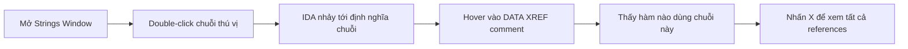

# Bài 3: Static Analysis với IDA Pro

## 1. Tổng quan về các công cụ Reverse Engineering

### 1.1 Bức tranh toàn cảnh

Reverse engineering (dịch ngược) là quá trình phân tích một chương trình đã được biên dịch để hiểu logic, cấu trúc, và hành vi của nó mà không có source code gốc. Đây là kỹ năng cốt lõi trong phân tích malware, CTF, và nghiên cứu bảo mật.

Các công cụ RE phổ biến được chia theo chức năng:

=== "Disassembler / Debugger"
    - IDA Pro
    - Ghidra
    - Cutter
    - Radare2
    - x32dbg / x64dbg
    - GDB

=== "Editor / Hex Editor"
    - VSCode
    - Sublime Text
    - Notepad++
    - HxD
    - 010 Editor

=== "PE / Resource Editor"
    - CFF Explorer
    - Resource Hacker

=== "Chuyên dụng"
    - dnSpy, dotPeek (cho .NET)
    - jadx, Android Studio (cho Android APK)
    - UPX (unpacker)

---

### 1.2 So sánh các công cụ chính

#### IDA Pro

IDA Pro (Interactive Disassembler) ra đời vào giữa những năm 1990, được phát triển chủ yếu bởi Ilfak Guilfanov tại công ty Hex-Rays. Đây được xem là chuẩn vàng trong ngành reverse engineering.

- **Điểm mạnh:**
    - Hỗ trợ số lượng khổng lồ các kiến trúc CPU (x86, x64, ARM, MIPS, cell phone processors, v.v.)
    - Vừa là disassembler vừa là debugger
    - Cộng đồng và tài liệu phong phú
    - Tính năng FLIRT (Fast Library Identification and Recognition Technology) giúp nhận diện các hàm thư viện
    - SDK cho phép viết plugin bằng Python (dành cho khách hàng trả phí)
    - Phiên bản cũ được cung cấp miễn phí

- **Điểm yếu:**
    - Giá rất cao: IDA Starter từ 589 USD, IDA Professional từ 1129 USD
    - Đường cong học tập dốc

- **Ứng dụng thực tế:** ESET Labs sử dụng IDA Pro để phân tích ngược malware cho phần mềm AV của họ.

#### x64dbg

x64dbg được phát triển từ năm 2013 bởi cộng đồng, ra đời để lấp đầy khoảng trống mà các công cụ cũ để lại khi x64 ngày càng phổ biến. Nó được xây dựng trên cùng nguyên tắc với OllyDbg và WinDbg.

- **Điểm mạnh:**
    - Mã nguồn mở
    - Tập trung vào x64
    - Tương thích plugin với nhiều công cụ khác
    - Có SDK riêng để phát triển plugin

- **Điểm yếu:**
    - Vẫn đang trong giai đoạn phát triển sớm

#### OllyDbg

OllyDbg ra đời khoảng năm 2000 bởi Oleh Yuschuk, ban đầu là freeware khi các đối thủ như SoftICE và IDA Pro có giá rất cao. Nó nhanh chóng được cộng đồng đón nhận và phát triển thêm nhiều plugin.

- **Điểm mạnh:**
    - Freeware
    - Nhiều tutorial, plugin, extension
    - Được mô tả là "cánh cửa vào thế giới reversing" — dễ học cho người mới

- **Điểm yếu:**
    - Phát triển chậm, gần như đình trệ
    - Không hỗ trợ .NET tốt
    - Không hỗ trợ x64

#### Radare2

Radare2 ra đời năm 2006, mã nguồn mở, được xây dựng theo nguyên tắc tương tự IDA Pro nhưng hoàn toàn miễn phí.

- **Điểm mạnh:**
    - Mã nguồn mở
    - Cross-platform (Linux, Windows, macOS, thậm chí iOS và Android)
    - Hỗ trợ nhiều kiến trúc (Linux ELF, ARM, v.v.)
    - Cộng đồng sôi nổi

- **Điểm yếu:**
    - Đường cong học tập rất dốc

---

## 2. IDA Pro Chi Tiết

### 2.1 Các phiên bản

| Phiên bản | Giá | x86 | x64 | Kiến trúc khác | FLIRT |
|---|---|---|---|---|---|
| Free (cũ) | Miễn phí | Có | Không | Không | Có |
| IDA Starter | Từ 589 USD | Có | Có | Hạn chế | Có |
| IDA Professional | Từ 1129 USD | Có | Có | Đầy đủ | Có |

**FLIRT** (Fast Library Identification and Recognition Technology) là công nghệ giúp IDA Pro tự động nhận diện và gán tên cho các hàm thư viện phổ biến, giúp analyst tập trung vào code thực sự do lập trình viên viết thay vì code thư viện.

---

### 2.2 Chế độ hiển thị

IDA Pro có hai chế độ xem chính, chuyển đổi bằng phím `Space`:

=== "Graph Mode"
    - Hiển thị luồng điều khiển (control flow) dưới dạng đồ thị các khối lệnh (basic blocks)
    - Các mũi tên màu có ý nghĩa:

    | Màu | Ý nghĩa |
    |---|---|
    | Đỏ | Conditional jump — nhánh KHÔNG được thực thi (ZF=0 hoặc điều kiện sai) |
    | Xanh lá | Conditional jump — nhánh ĐƯỢC thực thi (điều kiện đúng) |
    | Xanh dương | Unconditional jump (nhảy vô điều kiện) |

    - Mũi tên hướng **lên** chỉ vòng lặp (loop)

=== "Text Mode"
    - Hiển thị disassembly dạng tuyến tính truyền thống
    - Mũi tên đặc (solid) = unconditional jump
    - Mũi tên nét đứt (dashed) = conditional jump
    - Mũi tên hướng lên = loop
    - Có thêm các cột: Section, Address, Comment tự động sinh bởi IDA

```
; Ví dụ Text Mode
text:00401050    cmp    [ebp+var_4], 0Ah    ; So sánh biến với 10
text:00401054    jnz    short loc_401056    ; Nhánh nếu không bằng
text:00401056    mov    eax, eax
text:00401058    jmp    short loc_40105B
```

---

### 2.3 Highlighting

Khi bạn click chọn một tên biến, thanh ghi, hay hàm trong Graph Mode, IDA Pro sẽ tô sáng **toàn bộ** các vị trí khác trong view có cùng tên đó. Tính năng này cực kỳ hữu ích để nhanh chóng xác định tất cả nơi một biến được sử dụng.

---

### 2.4 Navigation Band

Thanh điều hướng phía trên màn hình IDA (Navigation Band) dùng màu sắc để phân biệt loại code:

| Màu | Loại code | Hành động |
|---|---|---|
| Xanh nhạt (light blue) | Library code — code từ thư viện | Thường bỏ qua |
| Đỏ | Compiler-generated code — code do compiler sinh ra | Thường bỏ qua |
| Xanh đậm (dark blue) | User-written code — code do lập trình viên viết | Ưu tiên phân tích |

---

## 3. Các Cửa Sổ Phân Tích Quan Trọng

### 3.1 Functions Window

Liệt kê tất cả các hàm đã được IDA Pro nhận diện, kèm theo:
- **Tên hàm** (IDA tự đặt hoặc từ debug symbol)
- **Segment** chứa hàm
- **Địa chỉ bắt đầu** (Start address)
- **Độ dài** (Length) tính bằng byte
- **Flags** — trong đó flag `L` đánh dấu Library function

!!! tip "Mẹo phân tích"
    Các hàm có kích thước lớn thường quan trọng hơn và chứa nhiều logic nghiệp vụ hơn. Khi bắt đầu phân tích, hãy sắp xếp theo độ dài giảm dần để tìm những hàm đáng phân tích nhất.

---

### 3.2 Names Window

Liệt kê mọi địa chỉ đã được đặt tên trong chương trình, bao gồm:
- Tên hàm (functions)
- Named code (code có nhãn)
- Named data (dữ liệu có nhãn)
- Chuỗi ký tự (strings)

---

### 3.3 Strings Window

Hiển thị tất cả các chuỗi ký tự tìm thấy trong binary. Đây là một trong những điểm khởi đầu phân tích hiệu quả nhất vì malware thường chứa các chuỗi như URL, registry key, tên file, thông báo lỗi,...

```
; Ví dụ từ Strings Window
rdata:00403090    "Error 1.1: No Internet\n"
rdata:004030A0    "Success Internet Connection\n"
data:00403078     "KERNEL32.dll"
```

---

### 3.4 Imports & Exports Window

- **Imports:** Danh sách các hàm mà binary gọi từ thư viện ngoài (DLL). Đây là cách nhanh nhất để đoán chức năng của một chương trình — ví dụ thấy `InternetGetConnectedState` là biết chương trình kiểm tra kết nối internet.
- **Exports:** Danh sách các hàm mà binary cung cấp cho các module khác gọi vào (thường thấy trong DLL).

---

### 3.5 Structures Window

Hiển thị tất cả các cấu trúc dữ liệu (struct) đang hoạt động. Hover chuột vào sẽ thấy popup màu vàng với chi tiết cấu trúc. Có thể tạo, xóa, sửa cấu trúc để giúp IDA hiểu đúng cách interpret dữ liệu trong bộ nhớ.

---

## 4. Điều Hướng trong IDA Pro

### 4.1 Các phím tắt và thao tác cơ bản

| Thao tác | Phím tắt |
|---|---|
| Chuyển đổi Graph/Text Mode | `Space` |
| Nhảy tới địa chỉ hoặc tên | `G` |
| Xem tất cả cross-references | `X` hoặc `Ctrl+X` |
| Forward / Back | Nút mũi tên (như trình duyệt web) |

### 4.2 Jump to Location

Nhấn `G` để mở hộp thoại nhảy tới vị trí bất kỳ. Có thể nhập:
- Địa chỉ hex: `0x401000`
- Tên hàm: `main`, `WinMain`

### 4.3 Double-click để điều hướng

- Double-click vào bất kỳ entry nào trong Imports/Strings Window → nhảy tới vị trí đó trong disassembly
- Double-click vào bất kỳ địa chỉ/tên nào trong disassembly view → nhảy tới địa chỉ đó

### 4.4 Tìm kiếm

Vào menu `Search` để truy cập nhiều tùy chọn:

| Tùy chọn | Phím tắt | Mô tả |
|---|---|---|
| Text | `Alt+T` | Tìm kiếm chuỗi văn bản |
| Next Text | `Ctrl+T` | Tìm tiếp |
| Immediate value | `Alt+I` | Tìm giá trị hằng số |
| Sequence of bytes | `Alt+B` | Tìm chuỗi byte cụ thể |

---

## 5. Cross-References (XREF)

Cross-reference là một trong những tính năng mạnh nhất của IDA Pro, cho phép tìm tất cả nơi một hàm được gọi, hoặc một dữ liệu được sử dụng.

### 5.1 Code Cross-References

Trong disassembly, IDA tự động thêm comment `CODE XREF` ở đầu hàm cho biết hàm đó được gọi từ đâu. Tuy nhiên mặc định chỉ hiển thị vài XREF đầu tiên.

Để xem **toàn bộ** cross-references: click vào tên hàm rồi nhấn `X` (hoặc `Ctrl+X`).

```
text:00401440    main proc near    ; CODE XREF: start+DE↓p
```

### 5.2 Data Cross-References

Workflow phân tích qua strings và XREF:



!!! example "Ví dụ thực tế"
    Nếu thấy chuỗi `"C:\Windows\System32\kernel32.dll"` trong Strings Window, double-click → thấy DATA XREF → biết được hàm nào đang tham chiếu tới đường dẫn này → phát hiện hành vi copy/replace file hệ thống.

---

## 6. Phân Tích Hàm

### 6.1 Function và Argument Recognition

IDA Pro tự động:
- Nhận diện ranh giới hàm (function boundary)
- Đặt tên hàm (vd: `sub_401040` nếu không có symbol)
- Đặt tên biến cục bộ (vd: `var_4`, `arg_0`)
- Nhận diện calling convention (cdecl, stdcall, fastcall,...)

```
; Trước khi đổi tên
text:00401040    sub_401040 proc near
text:00401040    arg_0    dword ptr  4h
text:00401040    arg_4    dword ptr  8h

; Sau khi đổi tên
text:00401040    ParsePortString proc near
text:00401040    port_str    dword ptr  4h
text:00401040    port        dword ptr  8h
```

!!! warning "Lưu ý"
    IDA Pro không phải lúc nào cũng nhận diện đúng. Cần kết hợp với ngữ cảnh để xác minh.

### 6.2 Function Call Convention

Khi một hàm được gọi:
1. Các tham số được push vào stack (theo thứ tự phụ thuộc calling convention)
2. Lệnh `CALL` được thực thi để nhảy vào đầu hàm

```nasm
; Ví dụ gọi RegWriteString
push    [ebp+lpData]         ; tham số 3: con trỏ data
push    [ebp+lpValueName]    ; tham số 2: tên value
push    [ebp+hKey]           ; tham số 1: registry key
call    RegWriteString@12    ; gọi hàm
```

---

## 7. Tùy Chọn Đồ Thị (Graphing Options)

Vào menu `View → Graphs` để truy cập các tùy chọn đồ thị (đây là "Legacy Graphs"):

| Tùy chọn | Phím tắt | Chức năng |
|---|---|---|
| Flow chart | `F12` | Tạo flow chart của hàm hiện tại |
| Function calls | `Ctrl+F12` | Đồ thị lời gọi hàm cho toàn bộ chương trình |
| Xrefs to | — | Đồ thị tất cả đường dẫn DẪN TỚI hàm được chọn |
| Xrefs from | — | Đồ thị tất cả đường dẫn ĐI RA từ hàm được chọn |
| User xrefs chart | — | Tùy chỉnh đồ thị: độ sâu đệ quy, ký hiệu, hướng,... |

!!! note "Lưu ý về Legacy Graphs"
    Legacy Graphs không thể tương tác trực tiếp trong IDA. `User xrefs chart` là cách duy nhất để tùy chỉnh các đồ thị này.

---

## 8. Tăng Cường Khả Năng Đọc Disassembly

!!! danger "Cảnh báo quan trọng"
    IDA Pro **không có chức năng Undo**. Mọi thay đổi là vĩnh viễn. Nếu làm hỏng, bạn có thể phải load lại file từ đầu. Hãy thận trọng và cân nhắc backup database (file .idb) thường xuyên.

### 8.1 Đổi tên (Renaming)

Nhấn `N` để đổi tên bất kỳ địa chỉ, hàm, hay biến. IDA sẽ tự động cập nhật tên đó ở **toàn bộ** các vị trí khác trong database.

```
; Trước
sub_401000   proc near

; Sau khi đổi tên
ReverseBackdoorThread   proc near
```

Đổi tên biến giúp code dễ đọc hơn rất nhiều, như bảng so sánh dưới đây:

| Trước khi đổi tên | Sau khi đổi tên |
|---|---|
| `mov eax, [ebp+arg_4]` | `mov eax, [ebp+port_str]` |
| `mov [ebp+var_598], eax` | `mov [ebp+port], eax` |

### 8.2 Thêm Comment

| Phím | Tác dụng |
|---|---|
| `:` (colon) | Thêm comment tại dòng hiện tại |
| `;` (semicolon) | Thêm repeatable comment — comment này sẽ hiện ở tất cả XREF của địa chỉ đó |

### 8.3 Định dạng Operands

Mặc định IDA hiển thị các giá trị dạng hexadecimal. Có thể right-click để chuyển sang:
- Decimal
- Octal
- Binary
- Named constant (hằng số có tên)

### 8.4 Sử dụng Named Constants

IDA Pro có thể thay thế các giá trị số ma thuật bằng tên hằng số Windows API, giúp code rõ nghĩa hơn đáng kể:

| Trước | Sau |
|---|---|
| `push 80h` | `push FILE_ATTRIBUTE_NORMAL` |
| `push 3` | `push OPEN_EXISTING` |
| `push 1` | `push FILE_SHARE_READ` |
| `push 0` | `push NULL` |

### 8.5 Auto Comments

Vào `Options → General → Auto comments` để bật tính năng IDA tự động thêm chú thích mô tả tác dụng của từng lệnh assembly:

```nasm
text:00401021    jz    short loc_40102B    ; Jump if Zero (ZF=1)
text:00401024    call  sub_40105F         ; Call Procedure
text:00401029    add   esp, eax           ; Add
text:0040102B    xor   eax, eax           ; Logical Exclusive OR
```

---

## 9. Mở Rộng IDA với Plugin

IDA Pro hỗ trợ mở rộng qua:
- **IDC** — ngôn ngữ scripting riêng của IDA (tương tự C)
- **Python (IDAPython)** — phổ biến hơn, mạnh hơn

Các script phổ biến giúp tự động hóa:
- Giải mã dữ liệu bị obfuscate
- Parse cấu trúc Delphi RTTI
- Export toàn bộ hàm ra file `.lib`
- Phát hiện format string vulnerability

---

## 10. Các Lỗi/Bug Phổ Biến Cần Nhận Biết khi Phân Tích

Khi phân tích binary, analyst cần nhận biết các loại lỗi/bug mà chương trình có thể khai thác:

| Loại bug | Mô tả ngắn |
|---|---|
| Buffer overflow | Ghi vượt ranh giới buffer, ghi đè dữ liệu khác |
| Command Injection | Chèn lệnh hệ thống qua input không được validate |
| Use-after-free | Dùng con trỏ sau khi bộ nhớ đã được giải phóng |
| Race condition | Hai luồng cạnh tranh tài nguyên gây ra trạng thái không nhất quán |
| TOCTOU | Time-of-check Time-of-use: trạng thái thay đổi giữa lúc kiểm tra và lúc dùng |
| Unsafe deserialization | Deserialize dữ liệu không tin cậy dẫn tới thực thi code tùy ý |

---

## 11. Thực hành — Wargame và CTF

Để thành thạo reverse engineering, thực hành là không thể thiếu:

- [picoCTF](https://play.picoctf.org) — dành cho người mới
- [reversing.kr](http://reversing.kr/) — crackme tổng hợp
- [crackmes.one](https://crackmes.one/) — cộng đồng crackme
- [challenges.re](https://challenges.re) — thách thức RE đa dạng
- [pwnable.kr](http://pwnable.kr/) — pwn + RE
- [root-me.org](https://www.root-me.org/en/Challenges/Cracking/)

---

---

## Câu Hỏi Trắc Nghiệm

**Câu 1.** IDA Pro là viết tắt của?
- A. Intelligent Disassembly Application
- B. Interactive Disassembler
- C. Integrated Debugging Architecture
- D. Internal Data Analyzer

??? info "Đáp án & Giải thích"
    **Đáp án: B**
    IDA Pro = Interactive Disassembler, được phát triển bởi Hex-Rays.

---

**Câu 2.** Phím tắt nào dùng để chuyển đổi giữa Graph Mode và Text Mode trong IDA Pro?
- A. `Tab`
- B. `G`
- C. `Space`
- D. `Enter`

??? info "Đáp án & Giải thích"
    **Đáp án: C**
    Phím `Space` chuyển đổi qua lại giữa hai chế độ xem Graph và Text.

---

**Câu 3.** Trong Graph Mode của IDA Pro, mũi tên màu xanh lá (green) biểu thị điều gì?
- A. Unconditional jump
- B. Conditional jump — nhánh không được thực thi
- C. Conditional jump — nhánh được thực thi (điều kiện đúng)
- D. Vòng lặp

??? info "Đáp án & Giải thích"
    **Đáp án: C**
    Xanh lá = nhánh được thực thi khi điều kiện đúng. Đỏ = nhánh không được thực thi. Xanh dương = unconditional jump.

---

**Câu 4.** Mũi tên màu đỏ trong IDA Pro Graph Mode có nghĩa là?
- A. Lỗi trong disassembly
- B. Conditional jump — nhánh không được thực thi
- C. Unconditional jump
- D. Call tới hàm bên ngoài

??? info "Đáp án & Giải thích"
    **Đáp án: B**
    Mũi tên đỏ chỉ nhánh của conditional jump khi điều kiện sai (không được thực thi).

---

**Câu 5.** Trong Navigation Band của IDA Pro, màu xanh đậm (dark blue) đại diện cho loại code nào?
- A. Library code
- B. Compiler-generated code
- C. User-written code
- D. Dead code

??? info "Đáp án & Giải thích"
    **Đáp án: C**
    Dark blue = code do lập trình viên viết, đây là phần cần tập trung phân tích nhất.

---

**Câu 6.** Trong Navigation Band, màu xanh nhạt (light blue) đại diện cho?
- A. User-written code
- B. Library code
- C. Compiler-generated code
- D. Data segment

??? info "Đáp án & Giải thích"
    **Đáp án: B**
    Light blue = Library code, thường bỏ qua khi phân tích.

---

**Câu 7.** FLIRT trong IDA Pro là viết tắt của?
- A. Fast Library Identification and Recognition Technology
- B. Function Linking and Internal Reference Tracker
- C. File Layout Inspection and Reverse Tool
- D. Fast Loading of Import Resolution Tables

??? info "Đáp án & Giải thích"
    **Đáp án: A**
    FLIRT = Fast Library Identification and Recognition Technology, giúp nhận diện các hàm thư viện phổ biến tự động.

---

**Câu 8.** Phím tắt nào trong IDA Pro dùng để xem tất cả cross-references của một hàm/biến?
- A. `C`
- B. `R`
- C. `X`
- D. `F`

??? info "Đáp án & Giải thích"
    **Đáp án: C**
    Nhấn `X` (hoặc `Ctrl+X`) để mở cửa sổ xrefs to, liệt kê tất cả nơi hàm/biến được tham chiếu.

---

**Câu 9.** Để nhảy tới một địa chỉ hoặc tên hàm cụ thể trong IDA Pro, nhấn phím nào?
- A. `F5`
- B. `G`
- C. `J`
- D. `N`

??? info "Đáp án & Giải thích"
    **Đáp án: B**
    Phím `G` mở hộp thoại "Jump to address", cho phép nhập địa chỉ hex hoặc tên symbol.

---

**Câu 10.** Trong Functions Window, flag `L` bên cạnh tên hàm có nghĩa gì?
- A. Large function
- B. Linked function
- C. Library function
- D. Local function

??? info "Đáp án & Giải thích"
    **Đáp án: C**
    Flag `L` đánh dấu đây là Library function — hàm đến từ thư viện, thường không cần phân tích sâu.

---

**Câu 11.** Tại sao các hàm có kích thước lớn thường được ưu tiên phân tích trước?
- A. Vì chúng chạy nhanh hơn
- B. Vì chúng thường chứa nhiều logic nghiệp vụ quan trọng hơn
- C. Vì chúng dễ đọc hơn
- D. Vì IDA Pro phân tích chúng chính xác hơn

??? info "Đáp án & Giải thích"
    **Đáp án: B**
    Hàm lớn hơn thường đồng nghĩa với nhiều logic phức tạp hơn, dễ chứa code thú vị liên quan đến mục đích của malware.

---

**Câu 12.** Phím nào dùng để đổi tên một hàm hoặc biến trong IDA Pro?
- A. `R`
- B. `N`
- C. `E`
- D. `F2`

??? info "Đáp án & Giải thích"
    **Đáp án: B**
    Phím `N` mở hộp thoại rename. Khi đổi tên, IDA tự động cập nhật ở tất cả vị trí liên quan.

---

**Câu 13.** Khi đổi tên một symbol trong IDA Pro, điều gì xảy ra?
- A. Chỉ đổi tên tại vị trí hiện tại
- B. IDA cập nhật tên đó ở toàn bộ database
- C. Cần đổi tên thủ công tại từng vị trí
- D. IDA hỏi xác nhận từng vị trí một

??? info "Đáp án & Giải thích"
    **Đáp án: B**
    IDA Pro tự động cập nhật tên mới ở tất cả vị trí trong database, đây là lợi thế lớn giúp tiết kiệm thời gian.

---

**Câu 14.** Phím `:` (colon) trong IDA Pro dùng để?
- A. Thêm repeatable comment
- B. Thêm single comment tại dòng hiện tại
- C. Tìm kiếm text
- D. Đổi tên symbol

??? info "Đáp án & Giải thích"
    **Đáp án: B**
    `:` thêm comment chỉ hiển thị tại dòng đó. `;` thêm repeatable comment hiển thị ở tất cả XREF.

---

**Câu 15.** Phím `;` (semicolon) trong IDA Pro dùng để thêm loại comment nào?
- A. Single comment
- B. Inline comment
- C. Repeatable comment — hiển thị ở tất cả XREF của địa chỉ đó
- D. Block comment

??? info "Đáp án & Giải thích"
    **Đáp án: C**
    Repeatable comment sẽ tự động xuất hiện ở tất cả nơi tham chiếu tới địa chỉ đó, giúp lan truyền thông tin phân tích.

---

**Câu 16.** IDA Pro mặc định hiển thị các giá trị operand ở hệ?
- A. Decimal
- B. Binary
- C. Octal
- D. Hexadecimal

??? info "Đáp án & Giải thích"
    **Đáp án: D**
    IDA Pro mặc định dùng hexadecimal. Có thể right-click để chuyển sang decimal, binary, octal, hoặc named constant.

---

**Câu 17.** Tính năng "Named Constants" trong IDA Pro giúp ích gì?
- A. Tự động đổi tên tất cả hàm
- B. Thay các giá trị số ma thuật bằng tên hằng số Windows API có nghĩa
- C. Tạo cấu trúc dữ liệu tự động
- D. Phát hiện string ẩn

??? info "Đáp án & Giải thích"
    **Đáp án: B**
    Thay `push 80h` bằng `push FILE_ATTRIBUTE_NORMAL` giúp đọc code dễ hiểu hơn rất nhiều.

---

**Câu 18.** Cảnh báo quan trọng nhất khi sửa đổi disassembly trong IDA Pro là?
- A. IDA sẽ crash nếu đổi tên quá nhiều
- B. Không có chức năng Undo
- C. Phải save thủ công sau mỗi thay đổi
- D. Cần quyền admin để sửa đổi

??? info "Đáp án & Giải thích"
    **Đáp án: B**
    IDA Pro không có Undo. Mọi thay đổi là vĩnh viễn trong database, do đó cần backup file .idb thường xuyên.

---

**Câu 19.** Trong Text Mode của IDA Pro, mũi tên dạng đường nét đứt (dashed) chỉ điều gì?
- A. Unconditional jump
- B. Conditional jump
- C. Function call
- D. Loop

??? info "Đáp án & Giải thích"
    **Đáp án: B**
    Trong Text Mode: nét đứt = conditional jump, nét đặc (solid) = unconditional jump.

---

**Câu 20.** Mũi tên hướng lên trong cả Graph Mode và Text Mode của IDA Pro biểu thị?
- A. Recursive call
- B. Loop (vòng lặp)
- C. Unconditional jump tới địa chỉ cao hơn
- D. Exception handler

??? info "Đáp án & Giải thích"
    **Đáp án: B**
    Mũi tên hướng lên = nhảy về địa chỉ thấp hơn trong code, đây là dấu hiệu của vòng lặp.

---

**Câu 21.** Tính năng Highlighting trong Graph Mode của IDA Pro hoạt động như thế nào?
- A. Tô sáng các lệnh nguy hiểm
- B. Chọn text sẽ tô sáng tất cả instances của text đó trong view
- C. Tô sáng library function
- D. Tô sáng dead code

??? info "Đáp án & Giải thích"
    **Đáp án: B**
    Click chọn một tên/từ trong Graph Mode sẽ highlight toàn bộ các vị trí khác có cùng tên đó.

---

**Câu 22.** Để reset về giao diện mặc định trong IDA Pro, dùng menu nào?
- A. File → Reset
- B. View → Default
- C. Windows → Reset Desktop
- D. Options → Reset Layout

??? info "Đáp án & Giải thích"
    **Đáp án: C**
    `Windows → Reset Desktop` để về giao diện mặc định, `Windows → Save Desktop` để lưu layout hiện tại.

---

**Câu 23.** x64dbg được phát triển để giải quyết vấn đề gì chính?
- A. Thay thế IDA Pro với chi phí thấp hơn
- B. Hỗ trợ debug và reverse x64 binaries khi các công cụ cũ thiếu hỗ trợ x64
- C. Phân tích malware Android
- D. Debug kernel-mode code

??? info "Đáp án & Giải thích"
    **Đáp án: B**
    x64dbg ra đời năm 2013 khi x64 ngày càng phổ biến nhưng các công cụ cũ (OllyDbg) không hỗ trợ x64.

---

**Câu 24.** OllyDbg chủ yếu hỗ trợ kiến trúc nào?
- A. x64
- B. ARM
- C. 32-bit (x86)
- D. MIPS

??? info "Đáp án & Giải thích"
    **Đáp án: C**
    OllyDbg là debugger 32-bit (x86). Đây là một trong những hạn chế lớn khiến cộng đồng cần x64dbg.

---

**Câu 25.** Công cụ nào được mô tả là "cánh cửa vào thế giới reversing" dành cho người mới?
- A. IDA Pro
- B. Radare2
- C. x64dbg
- D. OllyDbg

??? info "Đáp án & Giải thích"
    **Đáp án: D**
    OllyDbg thường được mô tả như vậy vì dễ dùng, miễn phí, và có nhiều tutorial.

---

**Câu 26.** Điểm khác biệt lớn nhất giữa Radare2 và IDA Pro là?
- A. Radare2 nhanh hơn
- B. Radare2 là mã nguồn mở còn IDA Pro là proprietary
- C. Radare2 hỗ trợ nhiều kiến trúc hơn
- D. Radare2 có giao diện đẹp hơn

??? info "Đáp án & Giải thích"
    **Đáp án: B**
    Cả hai đều mạnh và hỗ trợ nhiều platform, nhưng Radare2 miễn phí và open source, IDA Pro thì trả phí.

---

**Câu 27.** Radare2 có thể chạy trên thiết bị nào sau đây?
- A. Chỉ Linux
- B. Linux và Windows
- C. Linux, Windows, macOS, iOS, Android
- D. Chỉ desktop, không hỗ trợ mobile

??? info "Đáp án & Giải thích"
    **Đáp án: C**
    Radare2 có thể chạy trên nhiều platform kể cả iPhone và thiết bị Android.

---

**Câu 28.** Strings Window trong IDA Pro hữu ích nhất cho mục đích gì trong phân tích malware?
- A. Tìm lỗi disassembly
- B. Xác định kiến trúc CPU
- C. Nhanh chóng tìm các chỉ số (IoC) như URL, tên file, registry key
- D. Đo hiệu suất chương trình

??? info "Đáp án & Giải thích"
    **Đáp án: C**
    Strings là một trong những điểm khởi đầu phân tích tốt nhất, cho phép tìm nhanh các artifact của malware.

---

**Câu 29.** Imports Window hữu ích vì lý do gì?
- A. Liệt kê tất cả string trong binary
- B. Cho phép đoán nhanh chức năng của chương trình dựa trên các API nó gọi
- C. Hiển thị cấu trúc file PE
- D. Cho biết ngôn ngữ lập trình được dùng

??? info "Đáp án & Giải thích"
    **Đáp án: B**
    Ví dụ: thấy `InternetGetConnectedState` → biết chương trình kiểm tra internet; thấy `CreateFile`, `WriteFile` → biết chương trình thao tác file.

---

**Câu 30.** Trong Imports Window, nếu thấy `InternetGetConnectedState` từ thư viện WININET, điều đó gợi ý điều gì?
- A. Chương trình là trình duyệt web
- B. Chương trình có khả năng kiểm tra trạng thái kết nối internet
- C. Chương trình download file
- D. Chương trình gửi email

??? info "Đáp án & Giải thích"
    **Đáp án: B**
    `InternetGetConnectedState` kiểm tra xem máy có đang kết nối internet không — dấu hiệu malware cần kiểm tra môi trường mạng.

---

**Câu 31.** Graphing option "Xrefs to" trong IDA Pro cho phép xem điều gì?
- A. Tất cả hàm mà hàm được chọn gọi tới
- B. Tất cả đường dẫn code DẪN TỚI hàm được chọn
- C. Tất cả biến cục bộ trong hàm
- D. Tất cả import của chương trình

??? info "Đáp án & Giải thích"
    **Đáp án: B**
    Xrefs to vẽ đồ thị tất cả caller — hữu ích để hiểu ngữ cảnh nào gọi hàm này.

---

**Câu 32.** Graphing option "Xrefs from" cho phép xem điều gì?
- A. Tất cả đường dẫn DẪN TỚI hàm
- B. Tất cả đường dẫn ĐI RA từ hàm — các hàm mà hàm này gọi tới
- C. Tất cả cross-reference của data
- D. Flow chart của hàm

??? info "Đáp án & Giải thích"
    **Đáp án: B**
    Xrefs from vẽ đồ thị các callee — hữu ích để hiểu hàm này sử dụng những API/hàm nào.

---

**Câu 33.** Cách duy nhất để tùy chỉnh Legacy Graphs trong IDA Pro là?
- A. Flow chart option
- B. Function calls option
- C. User xrefs chart
- D. Không thể tùy chỉnh

??? info "Đáp án & Giải thích"
    **Đáp án: C**
    `User xrefs chart` cho phép tùy chỉnh độ sâu đệ quy, ký hiệu, hướng đồ thị, v.v.

---

**Câu 34.** IDA Pro hỗ trợ scripting qua ngôn ngữ nào? (Chọn tất cả đúng)
- A. IDC (ngôn ngữ scripting riêng của IDA)
- B. Python (IDAPython)
- C. Ruby
- D. JavaScript

??? info "Đáp án & Giải thích"
    **Đáp án: A và B**
    IDA hỗ trợ IDC (ngôn ngữ riêng, cú pháp tương tự C) và Python qua IDAPython plugin.

---

**Câu 35.** Giá khởi điểm của IDA Starter License là bao nhiêu?
- A. 89 USD
- B. 299 USD
- C. 589 USD
- D. 1129 USD

??? info "Đáp án & Giải thích"
    **Đáp án: C**
    IDA Starter từ 589 USD, IDA Professional từ 1129 USD.

---

**Câu 36.** Công ty nào phát triển IDA Pro?
- A. NSA
- B. Hex-Rays
- C. Mandiant
- D. Rapid7

??? info "Đáp án & Giải thích"
    **Đáp án: B**
    IDA Pro được phát triển bởi Hex-Rays, với Ilfak Guilfanov là nhà phát triển chính.

---

**Câu 37.** Điểm yếu chung của cả IDA Pro lẫn Radare2 là?
- A. Không hỗ trợ x64
- B. Đường cong học tập dốc (steep learning curve)
- C. Không có cộng đồng hỗ trợ
- D. Chỉ chạy trên Windows

??? info "Đáp án & Giải thích"
    **Đáp án: B**
    Cả hai đều được đánh giá là khó học, đặc biệt với người mới bắt đầu reverse engineering.

---

**Câu 38.** OllyDbg gặp vấn đề gì khi phân tích chương trình .NET?
- A. Không thể load file .NET
- B. Gặp khó khăn với .NET, không hỗ trợ tốt
- C. Crash ngay khi mở file .NET
- D. Không hiển thị được IL code

??? info "Đáp án & Giải thích"
    **Đáp án: B**
    OllyDbg "struggles with .NET" — đây là một trong những hạn chế được liệt kê. Để RE .NET nên dùng dnSpy hoặc dotPeek.

---

**Câu 39.** Công cụ nào phù hợp nhất để reverse engineer một file APK Android?
- A. IDA Pro Free
- B. OllyDbg
- C. jadx / Android Studio
- D. x64dbg

??? info "Đáp án & Giải thích"
    **Đáp án: C**
    Slide liệt kê jadx và Android Studio dưới mục "Android" trong bảng công cụ RE.

---

**Câu 40.** Công cụ nào phù hợp để RE file .NET?
- A. x64dbg
- B. OllyDbg
- C. dnSpy hoặc dotPeek
- D. Radare2

??? info "Đáp án & Giải thích"
    **Đáp án: C**
    dnSpy và dotPeek chuyên dụng cho .NET, có khả năng decompile ra C# code.

---

**Câu 41.** Trong IDA Pro, Auto Comments (bật trong Options → General) thêm gì vào disassembly?
- A. Tự động đổi tên hàm
- B. Tự động thêm chú thích mô tả tác dụng của từng lệnh assembly
- C. Tự động tìm bug
- D. Tự động tạo flow chart

??? info "Đáp án & Giải thích"
    **Đáp án: B**
    Ví dụ: `jz` sẽ được thêm comment "Jump if Zero (ZF=1)", `xor` được thêm "Logical Exclusive OR".

---

**Câu 42.** Bug "Use-after-free" xảy ra khi nào?
- A. Truy cập bộ nhớ ngoài giới hạn buffer
- B. Dùng con trỏ sau khi vùng nhớ đã được giải phóng
- C. Hai luồng cạnh tranh cùng tài nguyên
- D. Deserialize dữ liệu không tin cậy

??? info "Đáp án & Giải thích"
    **Đáp án: B**
    Use-after-free (UAF) là khi chương trình tiếp tục dùng con trỏ trỏ tới vùng nhớ đã được `free()`, dẫn tới hành vi không xác định hoặc có thể bị khai thác.

---

**Câu 43.** TOCTOU là viết tắt của?
- A. Time-of-Check Time-of-Use
- B. Type-of-Code Type-of-Update
- C. Token-of-Context Token-of-Usage
- D. Table-of-Contents Table-of-Users

??? info "Đáp án & Giải thích"
    **Đáp án: A**
    TOCTOU (Time-of-Check Time-of-Use): tình trạng race condition khi trạng thái thay đổi giữa thời điểm kiểm tra và thời điểm sử dụng.

---

**Câu 44.** Phím tắt nào tạo Flow chart của hàm hiện tại trong IDA Pro?
- A. `F11`
- B. `F12`
- C. `Ctrl+F12`
- D. `Shift+F12`

??? info "Đáp án & Giải thích"
    **Đáp án: B**
    `F12` = Flow chart của hàm hiện tại. `Ctrl+F12` = Function calls graph cho toàn bộ chương trình.

---

**Câu 45.** Phím `Ctrl+F12` trong IDA Pro tạo đồ thị gì?
- A. Flow chart của hàm hiện tại
- B. Function calls graph cho toàn bộ chương trình
- C. Xrefs to graph
- D. Xrefs from graph

??? info "Đáp án & Giải thích"
    **Đáp án: B**
    `Ctrl+F12` tạo đồ thị lời gọi hàm (function call graph) cho toàn bộ chương trình, cho thấy mối quan hệ giữa các hàm.

---

**Câu 46.** Khi double-click vào tên hàm trong Functions Window, IDA Pro sẽ làm gì?
- A. Mở hộp thoại rename
- B. Nhảy tới định nghĩa hàm trong disassembly view
- C. Hiển thị cross-references
- D. Xóa hàm khỏi danh sách

??? info "Đáp án & Giải thích"
    **Đáp án: B**
    Double-click trong bất kỳ cửa sổ nào (Functions, Names, Imports, Strings) đều nhảy tới vị trí tương ứng trong disassembly.

---

**Câu 47.** Names Window trong IDA Pro liệt kê những gì?
- A. Chỉ tên hàm
- B. Chỉ import/export
- C. Mọi địa chỉ đã được đặt tên: hàm, named code, named data, và strings
- D. Chỉ các biến toàn cục

??? info "Đáp án & Giải thích"
    **Đáp án: C**
    Names Window là cái nhìn tổng quan về tất cả symbol có tên trong binary.

---

**Câu 48.** Workflow phân tích qua Data XREF thường theo thứ tự nào?
- A. Imports → XREF → Strings
- B. Strings → double-click → xem DATA XREF → nhấn X để xem tất cả references
- C. Functions → XREF → Strings
- D. Code → XREF → Data

??? info "Đáp án & Giải thích"
    **Đáp án: B**
    Đây là workflow phổ biến: mở Strings Window, tìm chuỗi thú vị, double-click, hover vào DATA XREF comment, nhấn X để xem toàn bộ.

---

**Câu 49.** IDA Pro phiên bản free (cũ) thiếu tính năng gì so với bản trả phí?
- A. Không có Strings Window
- B. Không hỗ trợ x64 và các kiến trúc khác như ARM
- C. Không có Graph Mode
- D. Không có Import/Export Window

??? info "Đáp án & Giải thích"
    **Đáp án: B**
    Phiên bản free cũ chỉ hỗ trợ x86. Bản trả phí hỗ trợ x64 và nhiều kiến trúc khác (ARM, cell phone processors, v.v.).

---

**Câu 50.** Công ty ESET Labs sử dụng IDA Pro để làm gì?
- A. Phát triển phần mềm antivirus
- B. Reverse engineer malware để phát triển signature cho phần mềm AV
- C. Debug kernel Windows
- D. Phân tích hiệu suất ứng dụng

??? info "Đáp án & Giải thích"
    **Đáp án: B**
    Slide đề cập ESET Labs dùng IDA Pro khi reverse engineer malware để phát triển phần mềm AV của họ, đây là minh chứng thực tế cho sức mạnh của IDA Pro.

---

**Câu 51.** Structures Window trong IDA Pro cho phép làm gì?
- A. Chỉ xem các cấu trúc dữ liệu đã được nhận diện tự động
- B. Xem, tạo, sửa, và xóa các cấu trúc dữ liệu để giúp IDA interpret bộ nhớ chính xác hơn
- C. Hiển thị layout của file PE
- D. Quản lý các plugin

??? info "Đáp án & Giải thích"
    **Đáp án: B**
    Structures Window cho phép tương tác đầy đủ với struct: tạo mới (Ins/Del), tạo member (D/a/*), đổi tên, xóa member.

---

**Câu 52.** Phím tắt `Alt+T` trong IDA Pro dùng để?
- A. Tìm kiếm theo địa chỉ
- B. Tìm kiếm text trong disassembly
- C. Mở Strings Window
- D. Bật/tắt auto comments

??? info "Đáp án & Giải thích"
    **Đáp án: B**
    `Alt+T` mở hộp thoại tìm kiếm text. `Ctrl+T` tiếp tục tìm kiếm kết quả tiếp theo.

---

**Câu 53.** Khi IDA Pro tự đặt tên hàm dạng `sub_401040`, điều này có nghĩa là?
- A. Hàm thuộc thư viện chuẩn
- B. IDA không tìm thấy debug symbol hoặc FLIRT signature, nên đặt tên theo địa chỉ
- C. Hàm là compiler-generated code
- D. Hàm là entry point

??? info "Đáp án & Giải thích"
    **Đáp án: B**
    `sub_XXXXXX` là tên mặc định IDA đặt khi không có thông tin tên hàm. Analyst cần tự đổi tên sau khi hiểu chức năng.

---

**Câu 54.** Để tìm kiếm một chuỗi byte cụ thể trong binary qua IDA Pro, dùng phím tắt nào?
- A. `Alt+T`
- B. `Alt+I`
- C. `Alt+B`
- D. `Ctrl+F`

??? info "Đáp án & Giải thích"
    **Đáp án: C**
    `Alt+B` (sequence of bytes) cho phép tìm kiếm chuỗi byte cụ thể — hữu ích khi tìm shellcode hoặc magic bytes.

---

**Câu 55.** Race condition khác gì so với TOCTOU?
- A. Không có sự khác biệt, chúng là cùng một loại lỗi
- B. Race condition là tổng quát (hai luồng cạnh tranh tài nguyên), TOCTOU là trường hợp đặc biệt của race condition liên quan đến check rồi use
- C. TOCTOU xảy ra ở kernel, race condition xảy ra ở user space
- D. Race condition chỉ xảy ra trong ngôn ngữ C

??? info "Đáp án & Giải thích"
    **Đáp án: B**
    TOCTOU là một dạng cụ thể của race condition: kiểm tra điều kiện (check), sau đó điều kiện thay đổi, rồi mới sử dụng (use) — lúc này assumption từ lúc check không còn đúng nữa.