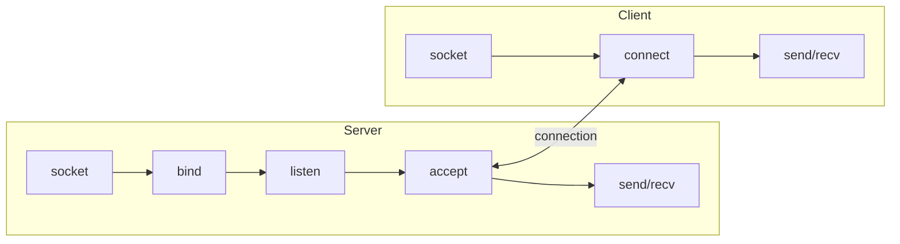
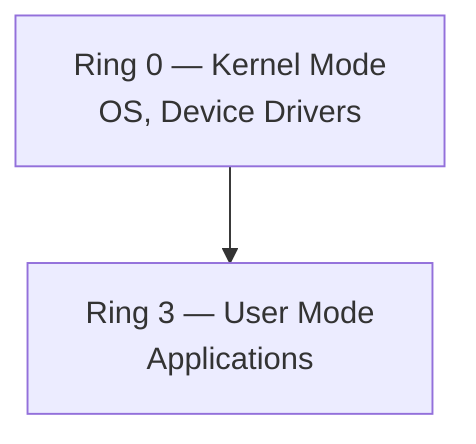
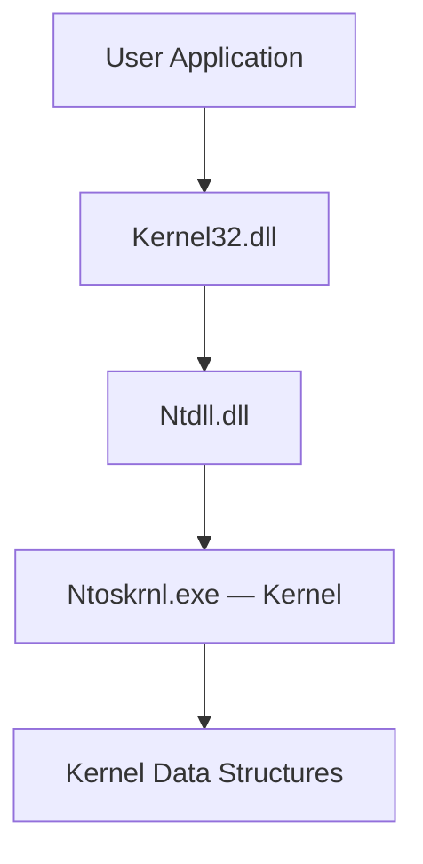
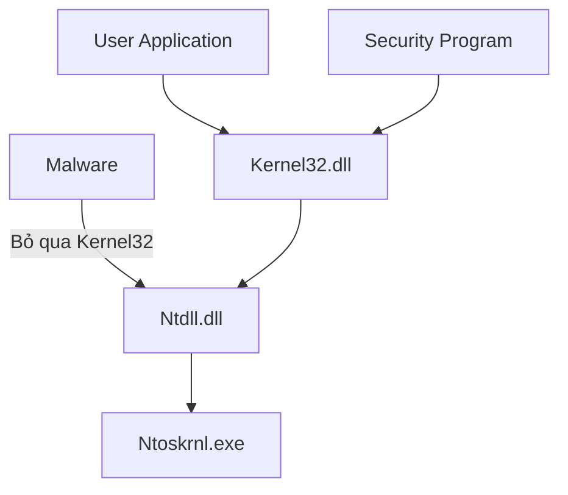

# Bài 4: Phân Tích Chương Trình Độc Hại Windows

## 1. Windows API (Application Programming Interface)

### 1.1 API là gì?

Windows API là một tập hợp chức năng rộng lớn điều phối cách thức mà phần mềm độc hại (malware) tương tác với các thư viện của Microsoft. API này đủ mạnh đến mức các lập trình viên Windows thuần túy gần như không cần dùng đến thư viện bên thứ ba.

Trước khi đi vào các hàm cụ thể, cần nắm vững các khái niệm nền tảng:

- **Types và Hungarian Notation**
- **Handles**
- **File System Functions**
- **Special Files**

---

### 1.2 Types và Hungarian Notation

Windows API không dùng trực tiếp tên kiểu dữ liệu của C mà định nghĩa lại với tên riêng để tăng tính rõ ràng.

| Kiểu (Type) | Tiền tố (Prefix) | Mô tả |
|---|---|---|
| WORD | w | Giá trị unsigned 16-bit |
| DWORD | dw | Giá trị unsigned 32-bit |
| Handle | H | Tham chiếu đến một đối tượng |
| Long Pointer | LP | Con trỏ trỏ đến kiểu dữ liệu khác |

**Hungarian Notation** là quy ước đặt tên biến bằng cách thêm tiền tố chỉ rõ kiểu dữ liệu. Ví dụ: nếu tham số thứ ba của hàm `VirtualAllocEx` có tên là `dwSize`, ta biết ngay nó là kiểu `DWORD`. Quy ước này giúp đọc code nhanh hơn nhưng đôi khi trở nên cồng kềnh.

---

### 1.3 Handles

Handle là một định danh (identifier) đại diện cho một tài nguyên đã được mở hoặc tạo trong hệ điều hành, ví dụ: cửa sổ (window), tiến trình (process), module, menu, file,...

**So sánh Handle với Con trỏ (Pointer):**

- Giống pointer ở chỗ: đều tham chiếu đến một đối tượng hoặc vùng nhớ ở nơi khác.
- Khác pointer ở chỗ:
    - Không thể dùng trong phép tính số học.
    - Không nhất thiết biểu diễn địa chỉ bộ nhớ thực của đối tượng.
    - Chỉ có một việc duy nhất: lưu trữ và truyền vào các hàm API sau để tham chiếu đến đối tượng đó.

**Ví dụ:** Hàm `CreateWindowEx` trả về `HWND` — một handle đến cửa sổ vừa tạo. Để thực hiện bất kỳ thao tác nào trên cửa sổ đó (ví dụ `DestroyWindow`), bạn phải truyền handle này vào.

---

### 1.4 File System Functions

Một trong những cách phổ biến nhất mà malware tương tác với hệ thống là tạo hoặc chỉnh sửa file. Hoạt động file có thể tiết lộ mục đích của malware (ví dụ: nếu malware tạo file lưu thói quen duyệt web, đây nhiều khả năng là spyware).

**Các hàm thao tác file thông dụng:**

=== "I/O Thông thường"
    - `CreateFile` — Tạo hoặc mở file
    - `ReadFile` — Đọc dữ liệu từ file
    - `WriteFile` — Ghi dữ liệu vào file

=== "File Mapping (hay dùng bởi Malware)"
    - `CreateFileMapping` — Nạp file từ đĩa vào bộ nhớ
    - `MapViewOfFile` — Trả về con trỏ đến địa chỉ gốc của vùng ánh xạ trong RAM

**Tại sao malware ưa dùng File Mapping?**

File mapping cho phép nạp file vào bộ nhớ và thao tác trực tiếp. Sau khi có con trỏ từ `MapViewOfFile`, malware có thể đọc/ghi bất kỳ vị trí nào trong file, dễ dàng nhảy đến các địa chỉ khác nhau. Quan trọng hơn, kỹ thuật này có thể **mô phỏng chức năng của Windows loader**: malware phân tích PE header trong bộ nhớ và thực hiện tất cả thay đổi cần thiết, khiến file PE được thực thi như thể đã được OS loader nạp — mà không cần gọi loader thực sự.

---

### 1.5 Special Files

#### Shared Files & Long Paths

```
\\server\share          → Truy cập file chia sẻ trên mạng
\\?\server\share        → Tắt phân tích chuỗi (string parsing), cho phép tên file dài hơn
```

#### Namespaces

| Namespace | Ý nghĩa |
|---|---|
| `\` | NT namespace — namespace gốc, chứa mọi thứ, có quyền truy cập tất cả thiết bị |
| `\\.\` | Device namespace — dùng để truy cập I/O ổ đĩa trực tiếp |

**Tại sao `\\.\` nguy hiểm?**

Malware có thể dùng `\\.\PhysicalDisk1` để truy cập trực tiếp vào đĩa vật lý, bỏ qua hoàn toàn hệ thống file. Điều này cho phép đọc/ghi vào sector chưa được cấp phát mà không tạo/truy cập file nào — giúp **tránh bị phát hiện bởi antivirus**. Ví dụ lịch sử: sâu Witty đã ghi vào `\\.\PhysicalDisk1` để làm hỏng ổ đĩa.

#### Alternate Data Streams (ADS)

ADS là luồng dữ liệu thứ hai gắn vào một tên file, ẩn hoàn toàn khi dùng lệnh `dir` thông thường.

```
File.txt:otherfile.txt
```

```cmd
echo 7777777 > foo
echo 7777777 > foo:bar.txt    ← ghi vào ADS, dir không hiển thị
notepad foo:bar.txt           ← mở ADS bằng Notepad
```

#### Windows Mark of the Web (MOTW)

MOTW là cơ chế đánh dấu file tải từ Internet bằng một Zone Identifier lưu trong ADS.

```powershell
Get-Item payload.doc -Stream *
Get-Content payload.doc -Stream Zone.Identifier
```

Nội dung Zone Identifier:

```ini
[ZoneTransfer]
ZoneId=3
ReferrerUrl=https://www.outflank.nl/demo/...
HostUrl=blob:www.outflank.nl/...
```

| ZoneId | Vùng bảo mật |
|---|---|
| 0 | Local computer zone |
| 1 | Local intranet zone |
| 2 | Trusted site zone |
| 3 | Internet zone (MOTW mặc định) |
| 4 | Restricted site zone |

!!! warning "Kỹ thuật MOTW Bypass"
    Malware hiện đại thường tìm cách vượt qua MOTW để không kích hoạt cảnh báo bảo mật của Windows khi file được mở.

---

## 2. Windows Registry

### 2.1 Mục đích của Registry

Registry là cơ sở dữ liệu phân cấp lưu trữ cấu hình hệ điều hành và ứng dụng. Trước đây Windows dùng file `.ini` để lưu cấu hình, nhưng Registry ra đời để cải thiện hiệu suất và khả năng mở rộng.

**Malware dùng Registry để:**

- **Persistence (Duy trì):** Đăng ký để tự khởi động lại sau khi hệ thống reboot.
- **Lưu dữ liệu cấu hình:** Lưu key mã hóa, địa chỉ C2 server,...

### 2.2 Thuật ngữ Registry

| Thuật ngữ | Giải thích |
|---|---|
| Root Key / HKEY / Hive | 5 phần cấp cao nhất của Registry |
| Subkey | Thư mục con bên trong key |
| Key | Thư mục, có thể chứa key hoặc value |
| Value Entry | Gồm hai phần: tên (name) và dữ liệu (data) |
| Value / Data | Dữ liệu thực tế được lưu |
| REGEDIT | Công cụ xem/chỉnh sửa Registry |

### 2.3 Năm Root Keys

| Root Key | Viết tắt | Mục đích |
|---|---|---|
| HKEY_LOCAL_MACHINE | HKLM | Cài đặt toàn cục cho máy |
| HKEY_CURRENT_USER | HKCU | Cài đặt cho người dùng hiện tại |
| HKEY_CLASSES_ROOT | | Định nghĩa kiểu file và COM |
| HKEY_CURRENT_CONFIG | | Cấu hình phần cứng hiện tại |
| HKEY_USERS | | Cài đặt cho tất cả người dùng |

### 2.4 Run Key — Kỹ thuật Persistence phổ biến nhất

```
HKLM\SOFTWARE\Microsoft\Windows\CurrentVersion\Run
HKCU\SOFTWARE\Microsoft\Windows\CurrentVersion\Run
```

Bất kỳ executable nào được đăng ký tại đây sẽ **tự động chạy khi người dùng đăng nhập**. Đây là vị trí đầu tiên cần kiểm tra khi điều tra malware.

### 2.5 Autoruns (Sysinternals)

Công cụ Autoruns liệt kê **tất cả code tự động chạy** khi hệ thống khởi động, bao gồm:

- Executables
- DLL nạp vào IE và các chương trình khác
- Driver nạp vào Kernel

Autoruns kiểm tra 25–30 vị trí registry khác nhau, nhưng không đảm bảo tìm được mọi code tự chạy.

### 2.6 Các hàm Registry thông dụng

| Hàm | Chức năng |
|---|---|
| `RegOpenKeyEx` | Mở một registry key để đọc/ghi |
| `RegSetValueEx` | Thêm value mới và đặt dữ liệu |
| `RegGetValue` | Lấy dữ liệu của một value entry |

!!! note "Lưu ý về hậu tố W và A"
    Tài liệu Microsoft thường bỏ hậu tố `W` (Wide/Unicode) hoặc `A` (ASCII). Ví dụ: `RegOpenKeyExW` trong code thực tế, nhưng trong tài liệu chỉ ghi `RegOpenKeyEx`. Tương tự, hậu tố `Ex` xuất hiện khi Microsoft cập nhật hàm không tương thích ngược với phiên bản cũ.

### 2.7 File .REG

File `.REG` là định dạng văn bản có thể export/import trực tiếp vào Registry, thường dùng để phân tích hoặc tái tạo cấu hình malware.

```ini
Windows Registry Editor Version 5.00

[HKEY_LOCAL_MACHINE\SOFTWARE\Microsoft\Windows\CurrentVersion\Run]
"VMware User Process"="c:\\Program Files\\VMware\\VMware Tools\\vmtoolsd.exe"
"SunJavaUpdateSched"="c:\\Program Files\\Common Files\\Java\\Java Update\\jusched.exe"
```

---

## 3. Networking APIs

### 3.1 Berkeley Compatible Sockets (Winsock)

Thư viện Winsock (`ws2_32.dll`) gần như giống hệt socket API trên Unix/Linux, giúp lập trình viên quen thuộc dễ dàng chuyển đổi.

| Hàm | Mô tả |
|---|---|
| `socket` | Tạo socket |
| `bind` | Gắn socket vào port cụ thể (trước `accept`) |
| `listen` | Đặt socket ở chế độ lắng nghe kết nối đến |
| `accept` | Chấp nhận kết nối từ xa |
| `connect` | Kết nối đến socket từ xa đang chờ |
| `recv` | Nhận dữ liệu từ socket từ xa |
| `send` | Gửi dữ liệu đến socket từ xa |

!!! info "WSAStartup"
    Hàm `WSAStartup` **bắt buộc phải gọi trước** bất kỳ hàm mạng nào để cấp phát tài nguyên cho thư viện networking. Khi debug, đặt breakpoint tại `WSAStartup` để tìm điểm bắt đầu của hoạt động mạng.

### 3.2 Luồng hoạt động Server vs Client



### 3.3 WinINet API

WinINet (`wininet.dll`) là API cấp cao hơn Winsock, triển khai sẵn các giao thức tầng ứng dụng như HTTP và FTP.

| Hàm | Chức năng |
|---|---|
| `InternetOpen` | Khởi tạo kết nối Internet |
| `InternetOpenURL` | Kết nối đến một URL cụ thể |
| `InternetReadFile` | Đọc dữ liệu từ file đã tải về |

---

## 4. Theo dõi Malware đang chạy

### 4.1 Các cơ chế chuyển giao thực thi (Transferring Execution)

Ngoài `jmp` và `call`, malware còn dùng nhiều cơ chế khác để chuyển luồng thực thi:

- DLLs
- Processes
- Threads
- Mutexes
- Services
- Component Object Model (COM)
- Exceptions

---

### 4.2 DLLs (Dynamic Link Libraries)

DLL là thư viện chia sẻ code giữa nhiều ứng dụng. Trước DLL, lập trình viên dùng **static libraries** — nhưng static library không thể chia sẻ bộ nhớ giữa các tiến trình đang chạy và chiếm nhiều RAM hơn.

**Malware dùng DLL để:**

- Lưu trữ code độc hại trong DLL rồi inject vào tiến trình khác.
- Sử dụng Windows DLL sẵn có (gần như mọi malware đều dùng).
- Dùng DLL của ứng dụng bên thứ ba (ví dụ: dùng DLL của Firefox để kết nối server, thay vì Windows API — khó bị phát hiện hơn).

**Cấu trúc DLL:**

- DLL rất giống EXE về mặt cấu trúc PE.
- Chỉ một flag trong PE header phân biệt DLL với EXE.
- DLL có nhiều export hơn và ít import hơn so với EXE.
- Hàm chính của DLL là `DllMain` — không được export nhưng được chỉ định là entry point trong PE Header.

```cpp
BOOL APIENTRY DllMain(HANDLE hModule,
                      DWORD  ul_reason_for_call,
                      LPVOID lpReserved) {
    switch (ul_reason_for_call) {
        case DLL_PROCESS_ATTACH: break; // Tiến trình nạp DLL
        case DLL_THREAD_ATTACH:  break; // Tiến trình tạo thread mới
        case DLL_THREAD_DETACH:  break; // Thread kết thúc bình thường
        case DLL_PROCESS_DETACH: break; // Tiến trình gỡ tải DLL
    }
    return TRUE;
}
```

---

### 4.3 Processes (Tiến trình)

Mỗi chương trình đang chạy trên Windows là một tiến trình. Mỗi tiến trình có:

- Tài nguyên riêng (handles, bộ nhớ)
- Một hoặc nhiều thread

Malware cũ thường chạy như một tiến trình độc lập. Malware mới hơn thường **inject code vào tiến trình đã có** để tránh bị phát hiện.

#### Memory Management (Quản lý bộ nhớ)

Mỗi tiến trình có **không gian địa chỉ ảo** (virtual address space) riêng. Hai tiến trình truy cập cùng một địa chỉ ảo thực ra đang truy cập hai vùng RAM vật lý khác nhau.

#### CreateProcess — Tạo tiến trình mới

`CreateProcess` là hàm mạnh mẽ, có thể tạo một **remote shell** chỉ với một lần gọi hàm bằng cách:

1. Lấy socket handle.
2. Đặt socket handle vào `hStdInput`, `hStdOutput`, `hStdError` trong cấu trúc `STARTUPINFO`.
3. Đặt `CommandLine` là `cmd.exe`.
4. Gọi `CreateProcessA`.

```asm
mov  eax, [esp+58h+SocketHandle]
mov  [esp+60h+StartupInfo.hStdError],  eax
mov  [esp+60h+StartupInfo.hStdOutput], eax
mov  [esp+60h+StartupInfo.hStdInput],  eax
; ...
call ds:CreateProcessA
```

---

### 4.4 Threads (Luồng)

Tiến trình là **container**, còn thread mới là thứ Windows thực sự thực thi. Một tiến trình có thể có một hoặc nhiều thread chạy song song.

**Đặc điểm của thread:**

- Các thread trong cùng tiến trình **chia sẻ không gian bộ nhớ**.
- Mỗi thread có **register và stack riêng**.
- Khi OS chuyển sang thread khác, nó lưu toàn bộ giá trị CPU vào cấu trúc gọi là **thread context**.

**`CreateThread`** — dùng để tạo thread mới, caller chỉ định địa chỉ bắt đầu (start function).

**Malware dùng thread để:**

- Nạp DLL độc hại vào tiến trình khác.
- Tạo hai thread — một cho input, một cho output — để giao tiếp với ứng dụng đang chạy.

---

### 4.5 Mutexes

Mutex (Mutual Exclusion) là đối tượng toàn cục dùng để **điều phối truy cập** giữa nhiều tiến trình/thread vào tài nguyên chung. Trong kernel, chúng được gọi là **mutants**.

**Malware thường dùng tên mutex cố định (hard-coded)** — đây là một **chỉ số nhận dạng (indicator)** quan trọng khi điều tra.

| Hàm | Chức năng |
|---|---|
| `CreateMutex` | Tạo mutex mới |
| `OpenMutex` | Lấy handle đến mutex của tiến trình khác |
| `WaitForSingleObject` | Cho thread truy cập mutex; thread khác phải chờ |
| `ReleaseMutex` | Giải phóng mutex sau khi dùng xong |

**Kỹ thuật Anti-Duplication (chỉ chạy một bản):**

```asm
push    1F0001h          ; dwDesiredAccess
call    OpenMutexW       ; Kiểm tra mutex "HGL345" đã tồn tại chưa?
test    eax, eax         ; Nếu eax = 0 → mutex chưa tồn tại
jz      short loc_40101E ; Nhảy qua nếu chưa tồn tại
push    0                ; Nếu đã tồn tại → thoát
call    _exit
loc_40101E:
push    offset Name "HGL345"
push    bInitialOwner
push    lpMutexAttributes
call    CreateMutexW     ; Tạo mutex → malware biết đây là bản đầu tiên
```

---

### 4.6 Services (Dịch vụ)

Services chạy ngầm trong nền mà không cần input từ người dùng.

**Tại sao malware dùng Services?**

- Services thường chạy dưới tài khoản **SYSTEM** — quyền cao hơn cả Administrator.
- Services có thể **tự động khởi động** khi Windows boot — đây là cơ chế **persistence** (duy trì) lý tưởng cho malware.

**Service API:**

| Hàm | Chức năng |
|---|---|
| `OpenSCManager` | Trả về handle đến Service Control Manager |
| `CreateService` | Thêm service mới; có thể đặt tự khởi động lúc boot |
| `StartService` | Chỉ dùng khi service được đặt khởi động thủ công |

**Các loại service phổ biến:**

| Loại | Mô tả |
|---|---|
| `WIN32_SHARE_PROCESS` | Phổ biến nhất với malware; lưu code trong DLL; ghép nhiều service vào `svchost.exe` |
| `WIN32_OWN_PROCESS` | Chạy EXE trong tiến trình độc lập |
| `KERNEL_DRIVER` | Nạp code vào Kernel |

**Service trong Registry:**

```
HKLM\System\CurrentControlSet\Services
```

- `Start = 0x03` → Load on Demand (khởi động thủ công)
- `Type = 0x20` → WIN32_SHARE_PROCESS

**Lệnh SC (Windows built-in):**

```cmd
sc qc Browser
```

---

### 4.7 Component Object Model (COM)

COM là cơ chế cho phép các thành phần phần mềm khác nhau chia sẻ code.

- Mọi thread dùng COM phải gọi `OleInitialize` hoặc `CoInitializeEx` trước khi gọi các thư viện COM khác.
- COM objects được truy cập qua **Globally Unique Identifiers (GUIDs)**.

| Loại GUID | Vị trí trong Registry |
|---|---|
| Class Identifiers (CLSIDs) | `HKEY_CLASSES_ROOT\CLSID` |
| Interface Identifiers (IIDs) | `HKEY_CLASSES_ROOT\Interface` |

---

### 4.8 Exceptions

Exception xảy ra do lỗi như chia cho 0 hoặc truy cập bộ nhớ không hợp lệ. Khi exception xảy ra, thực thi chuyển đến **Structured Exception Handler (SEH)**. Malware đôi khi lạm dụng SEH để làm phức tạp quá trình phân tích và debug.

---

## 5. Kernel vs User Mode

### 5.1 Hai mức đặc quyền

Windows sử dụng kiến trúc phân quyền dựa trên CPU rings:



Ring 1 và Ring 2 tồn tại về mặt lý thuyết nhưng **Windows không sử dụng**.

### 5.2 User Mode

- Hầu hết code chạy ở User Mode.
- **Không thể truy cập phần cứng trực tiếp** — phải thông qua Windows API.
- Bị giới hạn tập lệnh CPU.
- Mỗi tiến trình có bộ nhớ, quyền bảo mật, và tài nguyên riêng biệt.
- Nếu một tiến trình crash, Windows có thể thu hồi tài nguyên và kết thúc tiến trình đó mà không ảnh hưởng đến hệ thống.

### 5.3 Kernel Mode

- OS và hardware drivers chạy ở Kernel Mode.
- Tất cả tiến trình kernel **chia sẻ tài nguyên và địa chỉ bộ nhớ**.
- Ít kiểm tra bảo mật hơn.
- Nếu code kernel thực thi lệnh không hợp lệ → **Blue Screen of Death (BSOD)**.
- Antivirus và firewall chạy ở Kernel Mode để có quyền kiểm soát cao nhất.

### 5.4 Gọi từ User Mode lên Kernel

Không thể nhảy trực tiếp từ User Mode vào Kernel. Phải dùng các lệnh đặc biệt:

```
SYSENTER   (x86)
SYSCALL    (x64)
INT 0x2E   (cũ)
```

Các lệnh này sử dụng bảng tra cứu (lookup tables) để định vị các hàm kernel được định sẵn.

### 5.5 Malware trong Kernel Mode

- Mạnh hơn malware User Mode.
- Audit (kiểm toán) không áp dụng cho kernel.
- Hầu hết **rootkits** dùng code kernel.
- Tuy nhiên, đại đa số malware **không** dùng Kernel Mode vì độ phức tạp cao.

---

## 6. Native API

### 6.1 Kiến trúc tổng quan



**Ntdll.dll** quản lý tương tác giữa user space và kernel. Các hàm trong Ntdll.dll tạo thành **Native API**.

### 6.2 Đặc điểm của Native API

- **Không có tài liệu chính thức** (undocumented) — dành cho Windows nội bộ.
- Ít được dùng bởi các chương trình thông thường.
- **Phổ biến trong malware** vì:
    - Mạnh hơn và ẩn hơn so với Windows API thông thường.
    - Có thể **bỏ qua Security Program** đang monitor ở tầng Kernel32 — gọi thẳng xuống Ntdll, vượt qua lớp giám sát.



### 6.3 Native API phổ biến trong Malware

| Hàm | Mục đích |
|---|---|
| `NtQuerySystemInformation` | Lấy thông tin hệ thống chi tiết hơn Win32 |
| `NtQueryInformationProcess` | Thông tin tiến trình |
| `NtQueryInformationThread` | Thông tin thread |
| `NtQueryInformationFile` | Thông tin file |
| `NtQueryInformationKey` | Thông tin registry key |
| `NtContinue` | Trả về từ exception; dùng để chuyển thực thi theo cách phức tạp, gây khó debug |

### 6.4 Direct vs Indirect SYSCALLs

=== "Direct SYSCALL"
    Malware gọi trực tiếp lệnh `syscall` trong code của mình, bỏ qua hoàn toàn Ntdll.dll.

    ```
    Malware.exe → [mov r10,rcx; mov eax,SSN; syscall] → KiSystemCall64 → SSDT → NtCreateFile()
    ```

    Ưu điểm: Bỏ qua hoàn toàn Ntdll, vô hiệu hóa hook đặt trong Ntdll.

=== "Indirect SYSCALL"
    Malware chuẩn bị tham số rồi `jmp` đến địa chỉ `syscall` trong Ntdll.dll thay vì tự gọi.

    ```
    Malware.exe → [mov r10,rcx; mov eax,SSN; jmp syscall@ntdll] → KiSystemCall64 → SSDT → NtCreateFile()
    ```

    Ưu điểm: Trông giống lời gọi hợp lệ hơn, khó phát hiện hơn Direct SYSCALL.

### 6.5 API Hashing

Kỹ thuật dùng để ẩn tên các API mà malware gọi, tránh bị phát hiện qua import table.

```
"CreateThread" → calculateHash("CreateThread") → 0x005422304
→ Duyệt export table, so sánh hash từng hàm
→ Khi tìm được hash khớp → lấy địa chỉ hàm thực
→ Gọi hàm qua địa chỉ đó
```

Thay vì import `CreateThread` trực tiếp (bị công cụ như PEiD phát hiện), malware lưu hash và giải mã runtime — khiến static analysis khó nhận ra API nào đang được dùng.

---

## Câu hỏi Trắc nghiệm

**Câu 1.** Windows API sử dụng kiểu dữ liệu `DWORD` tương ứng với kiểu nào trong C?

- A. 16-bit signed integer
- B. 32-bit unsigned integer
- C. 64-bit unsigned integer
- D. 8-bit unsigned integer

??? info "Đáp án & Giải thích"
    **Đáp án: B**
    
    DWORD (Double WORD) là kiểu 32-bit unsigned integer trong Windows API. Tiền tố trong Hungarian Notation là `dw`.

**Câu 2.** Hungarian Notation trong Windows API có mục đích chính là gì?

- A. Mã hóa tên biến để bảo mật
- B. Đặt tiền tố tên biến để nhận biết kiểu dữ liệu
- C. Giúp compiler tối ưu code nhanh hơn
- D. Đặt hậu tố để phân biệt phiên bản hàm

??? info "Đáp án & Giải thích"
    **Đáp án: B**
    
    Hungarian Notation dùng tiền tố (prefix) trước tên biến để cho biết kiểu dữ liệu. Ví dụ: `dw` cho DWORD, `lp` cho Long Pointer.

**Câu 3.** Handle trong Windows API khác con trỏ (pointer) ở điểm nào?

- A. Handle luôn trỏ đến địa chỉ bộ nhớ thực của đối tượng
- B. Handle có thể dùng trong phép tính số học
- C. Handle không thể dùng trong phép tính số học và không nhất thiết là địa chỉ bộ nhớ thực
- D. Handle chỉ dùng cho file, không dùng cho đối tượng khác

??? info "Đáp án & Giải thích"
    **Đáp án: C**
    
    Handle chỉ có thể được lưu trữ và truyền vào các hàm API sau này. Không thể cộng, trừ handle như con trỏ, và giá trị của handle không nhất thiết là địa chỉ thực của đối tượng trong RAM.

**Câu 4.** Hàm `CreateWindowEx` trả về kiểu dữ liệu gì?

- A. DWORD
- B. HWND
- C. HANDLE
- D. LPVOID

??? info "Đáp án & Giải thích"
    **Đáp án: B**
    
    `CreateWindowEx` trả về `HWND` — một handle đến cửa sổ vừa tạo. HWND là viết tắt của Handle to WiNDow.

**Câu 5.** Tại sao malware thường dùng `CreateFileMapping` và `MapViewOfFile` thay vì `ReadFile`/`WriteFile`?

- A. Vì hai hàm này nhanh hơn
- B. Vì có thể nạp file vào RAM và thao tác như thể đây là Windows loader, tránh gọi loader thực sự
- C. Vì hai hàm này không bị Windows ghi log
- D. Vì chúng cho phép đọc file mà không cần quyền admin

??? info "Đáp án & Giải thích"
    **Đáp án: B**
    
    File mapping cho phép malware phân tích PE header trong bộ nhớ và thực hiện các thay đổi cần thiết, mô phỏng chức năng Windows loader mà không gọi loader thực — giúp thực thi file mà không bị một số cơ chế kiểm soát phát hiện.

**Câu 6.** Namespace `\\.\` trong Windows được dùng để làm gì?

- A. Truy cập file chia sẻ trên mạng
- B. Truy cập trực tiếp thiết bị vật lý, bỏ qua hệ thống file
- C. Cho phép tên file dài hơn
- D. Truy cập các file hệ thống được bảo vệ

??? info "Đáp án & Giải thích"
    **Đáp án: B**
    
    `\\.\` là Win32 device namespace. Malware dùng đường dẫn như `\\.\PhysicalDisk1` để đọc/ghi trực tiếp vào đĩa vật lý mà không thông qua file system, giúp tránh bị phát hiện.

**Câu 7.** Alternate Data Streams (ADS) có đặc điểm nào sau đây?

- A. Hiển thị bình thường khi dùng lệnh `dir`
- B. Là luồng dữ liệu thứ hai gắn vào file, ẩn với lệnh `dir` thông thường
- C. Chỉ áp dụng cho file hệ thống
- D. Tự động mã hóa dữ liệu bên trong

??? info "Đáp án & Giải thích"
    **Đáp án: B**
    
    ADS là luồng dữ liệu ẩn của NTFS. Cú pháp là `File.txt:hidden.txt`. Lệnh `dir` không hiển thị ADS, khiến nó trở thành nơi lý tưởng để malware ẩn dữ liệu.

**Câu 8.** Windows Mark of the Web (MOTW) với `ZoneId=3` có nghĩa là gì?

- A. File đến từ mạng nội bộ
- B. File đến từ Internet
- C. File đến từ trang tin cậy
- D. File đến từ máy tính cục bộ

??? info "Đáp án & Giải thích"
    **Đáp án: B**
    
    ZoneId=3 là Internet zone — mặc định được áp dụng cho file tải từ Internet. Đây là lý do Windows hiện cảnh báo "File này đến từ Internet" khi mở file có MOTW.

**Câu 9.** MOTW (Mark of the Web) được lưu trữ ở đâu trong file?

- A. Trong metadata của file hệ thống NTFS
- B. Trong Alternate Data Stream có tên `Zone.Identifier`
- C. Trong registry dưới khóa HKCU
- D. Trong phần header của file

??? info "Đáp án & Giải thích"
    **Đáp án: B**
    
    MOTW được lưu trong ADS `Zone.Identifier`. Có thể đọc bằng: `Get-Content file.doc -Stream Zone.Identifier`.

**Câu 10.** Mục đích chính của Windows Registry đối với malware là gì?

- A. Lưu trữ các file thực thi của malware
- B. Persistence (tự khởi động lại) và lưu dữ liệu cấu hình
- C. Giao tiếp với C2 server
- D. Bypass UAC

??? info "Đáp án & Giải thích"
    **Đáp án: B**
    
    Malware dùng Registry chủ yếu để: (1) đăng ký tại Run Key để tự chạy sau reboot (persistence), và (2) lưu cấu hình như key mã hóa, địa chỉ máy chủ C2.

**Câu 11.** Root key nào lưu cài đặt áp dụng cho tất cả người dùng trên máy?

- A. HKEY_CURRENT_USER
- B. HKEY_USERS
- C. HKEY_LOCAL_MACHINE
- D. HKEY_CLASSES_ROOT

??? info "Đáp án & Giải thích"
    **Đáp án: C**
    
    HKEY_LOCAL_MACHINE (HKLM) lưu cài đặt toàn cục cho máy, áp dụng cho tất cả người dùng. Đây là lý do Run Key trong HKLM quan trọng hơn trong HKCU từ góc độ malware muốn ảnh hưởng toàn hệ thống.

**Câu 12.** Đường dẫn Run Key nào được malware dùng để tự khởi động khi bất kỳ người dùng nào đăng nhập?

- A. `HKCU\SOFTWARE\Microsoft\Windows\CurrentVersion\Run`
- B. `HKLM\SOFTWARE\Microsoft\Windows\CurrentVersion\Run`
- C. `HKLM\System\CurrentControlSet\Services`
- D. `HKEY_CLASSES_ROOT\CLSID`

??? info "Đáp án & Giải thích"
    **Đáp án: B**
    
    HKLM Run Key áp dụng cho toàn máy — khi bất kỳ người dùng nào đăng nhập. HKCU chỉ áp dụng cho người dùng hiện tại.

**Câu 13.** Hàm Registry nào được dùng để thêm một entry mới và đặt dữ liệu cho nó?

- A. `RegOpenKeyEx`
- B. `RegGetValue`
- C. `RegSetValueEx`
- D. `RegCreateKey`

??? info "Đáp án & Giải thích"
    **Đáp án: C**
    
    `RegSetValueEx` thêm value mới vào registry và đặt dữ liệu. `RegOpenKeyEx` chỉ mở key, `RegGetValue` chỉ đọc.

**Câu 14.** Hậu tố `W` và `A` trong tên hàm Windows API (ví dụ `CreateDirectoryW`) có ý nghĩa gì?

- A. W = Windows version, A = Advanced version
- B. W = Wide (Unicode), A = ASCII — hai phiên bản xử lý chuỗi khác nhau
- C. W = 64-bit, A = 32-bit
- D. W = Wrapper, A = API

??? info "Đáp án & Giải thích"
    **Đáp án: B**
    
    `W` là Wide character (Unicode/UTF-16), `A` là ASCII. Khi tra cứu tài liệu Microsoft, bỏ hậu tố này. Ví dụ: `RegOpenKeyExW` → tìm `RegOpenKeyEx`.

**Câu 15.** Hậu tố `Ex` trong tên hàm (như `CreateWindowEx`) có nghĩa là gì?

- A. Hàm dùng cho Extended (64-bit) architecture
- B. Phiên bản cập nhật không tương thích ngược với hàm gốc
- C. Hàm chỉ dùng trong kernel mode
- D. Hàm được export từ DLL bên ngoài

??? info "Đáp án & Giải thích"
    **Đáp án: B**
    
    Khi Microsoft cập nhật hàm không tương thích ngược, phiên bản mới có thêm hậu tố `Ex`. Phiên bản cũ vẫn được giữ lại. Nếu cập nhật hai lần, sẽ có `ExEx`.

**Câu 16.** Hàm `WSAStartup` trong Winsock cần được gọi khi nào?

- A. Sau khi tạo socket
- B. Trước bất kỳ hàm networking nào khác
- C. Chỉ khi dùng giao thức UDP
- D. Sau khi gọi `connect`

??? info "Đáp án & Giải thích"
    **Đáp án: B**
    
    `WSAStartup` phải được gọi đầu tiên để cấp phát tài nguyên cho thư viện Winsock. Đặt breakpoint tại `WSAStartup` khi debug để tìm điểm bắt đầu hoạt động mạng của malware.

**Câu 17.** Thứ tự gọi hàm đúng cho phía Server trong Winsock là gì?

- A. socket → connect → send/recv
- B. socket → bind → listen → accept → send/recv
- C. socket → accept → listen → bind → send/recv
- D. WSAStartup → connect → bind → listen

??? info "Đáp án & Giải thích"
    **Đáp án: B**
    
    Server: socket → bind (gắn vào port) → listen (chờ kết nối) → accept (chấp nhận kết nối) → send/recv. Client chỉ cần: socket → connect → send/recv.

**Câu 18.** WinINet API khác Winsock ở điểm nào?

- A. WinINet chỉ hỗ trợ UDP
- B. WinINet là API cấp cao hơn, triển khai sẵn HTTP/FTP
- C. WinINet chạy trong Kernel Mode
- D. WinINet không thể dùng để tải file

??? info "Đáp án & Giải thích"
    **Đáp án: B**
    
    WinINet (wininet.dll) là API cấp cao triển khai sẵn các giao thức tầng ứng dụng như HTTP và FTP. Winsock là API cấp thấp hơn, làm việc trực tiếp với socket.

**Câu 19.** Hàm nào trong WinINet dùng để kết nối đến một URL cụ thể?

- A. `InternetOpen`
- B. `InternetConnect`
- C. `InternetOpenURL`
- D. `InternetReadFile`

??? info "Đáp án & Giải thích"
    **Đáp án: C**
    
    `InternetOpenURL` kết nối đến URL cụ thể. `InternetOpen` chỉ khởi tạo kết nối Internet nói chung. `InternetReadFile` đọc dữ liệu sau khi đã kết nối.

**Câu 20.** DLL khác Static Library ở điểm quan trọng nào sau đây?

- A. DLL không thể được sử dụng bởi nhiều ứng dụng cùng lúc
- B. DLL có thể chia sẻ bộ nhớ giữa các tiến trình đang chạy, static library không thể
- C. Static library mới hơn và hiệu quả hơn DLL
- D. DLL chỉ chứa code, không chứa dữ liệu

??? info "Đáp án & Giải thích"
    **Đáp án: B**
    
    DLL có thể được chia sẻ giữa nhiều tiến trình, tiết kiệm RAM. Static library được nhúng vào mỗi EXE riêng biệt — nếu 10 ứng dụng dùng cùng static library, code đó tồn tại trong RAM 10 lần.

**Câu 21.** Hàm `DllMain` trong DLL được gọi khi nào?

- A. Chỉ khi DLL lần đầu được nạp vào hệ thống
- B. Khi DLL được nạp hoặc gỡ tải bởi tiến trình/thread
- C. Khi xuất (export) hàm từ DLL
- D. Khi DLL gặp lỗi

??? info "Đáp án & Giải thích"
    **Đáp án: B**
    
    `DllMain` được gọi với 4 lý do: `DLL_PROCESS_ATTACH`, `DLL_THREAD_ATTACH`, `DLL_THREAD_DETACH`, `DLL_PROCESS_DETACH`.

**Câu 22.** Sự khác biệt chính giữa DLL và EXE trong PE format là gì?

- A. DLL không có PE header
- B. Chỉ một flag trong PE header phân biệt; DLL có nhiều export hơn, ít import hơn
- C. DLL sử dụng định dạng file hoàn toàn khác
- D. DLL không có entry point

??? info "Đáp án & Giải thích"
    **Đáp án: B**
    
    DLL và EXE đều dùng PE format. Chỉ một flag (Characteristics trong PE header) phân biệt. DLL thường có nhiều exported functions và ít imports hơn EXE.

**Câu 23.** Tại sao malware mới hơn thường inject code vào tiến trình đang chạy thay vì tạo tiến trình mới?

- A. Vì tạo tiến trình mới cần quyền Admin
- B. Để tránh bị phát hiện — tiến trình hợp lệ ít bị nghi ngờ hơn
- C. Vì inject vào tiến trình nhanh hơn
- D. Vì tiến trình mới không thể truy cập mạng

??? info "Đáp án & Giải thích"
    **Đáp án: B**
    
    Malware cũ chạy như tiến trình độc lập — dễ bị phát hiện. Malware mới inject code vào tiến trình hợp lệ (như `explorer.exe`) để hoạt động dưới danh nghĩa tiến trình đó, tránh bị phát hiện bởi các công cụ giám sát.

**Câu 24.** Virtual address space có ý nghĩa gì trong quản lý bộ nhớ Windows?

- A. Địa chỉ bộ nhớ được ảo hóa bằng hypervisor
- B. Hai tiến trình truy cập cùng địa chỉ ảo thực ra truy cập hai vùng RAM vật lý khác nhau
- C. Bộ nhớ ảo lưu trên ổ đĩa thay vì RAM
- D. Tất cả tiến trình chia sẻ một không gian địa chỉ duy nhất

??? info "Đáp án & Giải thích"
    **Đáp án: B**
    
    Virtual address space cô lập các tiến trình. Địa chỉ `0x00400000` trong tiến trình A và tiến trình B trỏ đến hai vùng RAM vật lý khác nhau — tránh tiến trình này ảnh hưởng bộ nhớ tiến trình kia.

**Câu 25.** Hàm `CreateProcess` có thể tạo remote shell như thế nào?

- A. Bằng cách gọi PowerShell với lệnh đặc biệt
- B. Bằng cách đặt socket handle vào hStdInput, hStdOutput, hStdError trong STARTUPINFO
- C. Bằng cách dùng WinINet kết hợp CreateProcess
- D. Bằng cách tạo pipe kết nối đến socket

??? info "Đáp án & Giải thích"
    **Đáp án: B**
    
    `CreateProcess` cho phép redirect stdin/stdout/stderr của tiến trình con đến một handle tùy chọn — trong trường hợp này là socket. Khi gọi `cmd.exe` với cấu hình này, mọi input/output của shell đều đi qua socket mạng.

**Câu 26.** Thread khác Process ở điểm cơ bản nào?

- A. Thread có bộ nhớ riêng, process thì không
- B. Process là container; thread là đơn vị thực thi thực sự; các thread trong cùng process chia sẻ bộ nhớ
- C. Mỗi process chỉ có đúng một thread
- D. Thread có thể chạy trên nhiều CPU, process thì không

??? info "Đáp án & Giải thích"
    **Đáp án: B**
    
    Process là container chứa tài nguyên. Thread là đơn vị CPU thực sự thực thi. Các thread trong cùng process chia sẻ heap, data segment, handles — nhưng mỗi thread có stack và registers riêng.

**Câu 27.** Thread context là gì?

- A. Ngữ cảnh bảo mật mà thread đang chạy
- B. Cấu trúc lưu toàn bộ giá trị CPU khi OS chuyển sang thread khác
- C. Danh sách các hàm mà thread đã gọi
- D. Bộ nhớ stack của thread

??? info "Đáp án & Giải thích"
    **Đáp án: B**
    
    Khi OS thực hiện context switch (chuyển CPU từ thread này sang thread khác), nó lưu toàn bộ trạng thái CPU (registers, instruction pointer,...) của thread hiện tại vào thread context để sau này có thể tiếp tục.

**Câu 28.** Malware thường dùng thread để làm gì?

- A. Tăng tốc độ mã hóa file
- B. Nạp DLL độc hại vào tiến trình khác và tạo cặp thread input/output để giao tiếp
- C. Ẩn khỏi Task Manager
- D. Bypass UAC

??? info "Đáp án & Giải thích"
    **Đáp án: B**
    
    Malware dùng `CreateThread` để (1) nạp DLL độc hại vào tiến trình khác (thường là bước trong process injection), và (2) tạo hai thread riêng cho input và output để giao tiếp với ứng dụng đang chạy.

**Câu 29.** Tại sao malware dùng Mutex với tên cố định (hard-coded)?

- A. Vì Mutex cần tên cố định mới hoạt động
- B. Để đảm bảo chỉ một bản malware chạy trên máy tại một thời điểm
- C. Để giao tiếp với C2 server
- D. Để bypass Windows Defender

??? info "Đáp án & Giải thích"
    **Đáp án: B**
    
    Malware kiểm tra Mutex tồn tại chưa bằng `OpenMutex`. Nếu đã tồn tại → đã có bản khác đang chạy → tự thoát. Nếu chưa → tạo Mutex bằng `CreateMutex` và tiếp tục chạy. Tên Mutex cố định cũng là indicator giúp điều tra.

**Câu 30.** Trong kernel, Mutex được gọi là gì?

- A. Semaphore
- B. Mutant
- C. CriticalSection
- D. Event

??? info "Đáp án & Giải thích"
    **Đáp án: B**
    
    Trong NT kernel, Mutex được gọi là **Mutant**. Đây là tên nội bộ, thường thấy khi phân tích ở cấp độ kernel hoặc dùng WinObj.

**Câu 31.** Hàm nào cho phép lấy handle đến mutex của một tiến trình khác?

- A. `CreateMutex`
- B. `WaitForSingleObject`
- C. `OpenMutex`
- D. `ReleaseMutex`

??? info "Đáp án & Giải thích"
    **Đáp án: C**
    
    `OpenMutex` mở và trả về handle đến một mutex đã tồn tại (tạo bởi tiến trình khác). Đây là hàm malware dùng để kiểm tra xem bản thân nó đã chạy chưa.

**Câu 32.** Services trong Windows thường chạy dưới tài khoản nào và tại sao điều này quan trọng với malware?

- A. Administrator — vì cho phép cài driver
- B. SYSTEM — vì SYSTEM mạnh hơn cả Administrator, giúp malware có quyền cao nhất
- C. Guest — vì khó bị phát hiện hơn
- D. Network Service — vì cần kết nối mạng

??? info "Đáp án & Giải thích"
    **Đáp án: B**
    
    Tài khoản SYSTEM có quyền cao hơn Administrator trên hầu hết tác vụ hệ thống. Malware chạy như service có thể thực hiện các tác vụ mà tài khoản người dùng thông thường không thể.

**Câu 33.** Service loại `WIN32_SHARE_PROCESS` có đặc điểm gì?

- A. Chạy như một EXE độc lập
- B. Lưu code trong DLL; nhiều service chia sẻ một tiến trình `svchost.exe`
- C. Chạy trực tiếp trong Kernel Mode
- D. Chỉ có thể khởi động thủ công

??? info "Đáp án & Giải thích"
    **Đáp án: B**
    
    `WIN32_SHARE_PROCESS` là loại phổ biến nhất được malware dùng. Code của service nằm trong DLL, và nhiều service cùng loại này được gộp vào một tiến trình `svchost.exe` — khó phân biệt với service hợp lệ.

**Câu 34.** Giá trị nào trong Registry chỉ định service loại `WIN32_SHARE_PROCESS`?

- A. Start = 0x03
- B. Type = 0x20
- C. Type = 0x10
- D. Start = 0x02

??? info "Đáp án & Giải thích"
    **Đáp án: B**
    
    Trong `HKLM\System\CurrentControlSet\Services\[ServiceName]`: `Type = 0x20` là `WIN32_SHARE_PROCESS`. `Start = 0x03` là "Load on Demand" (khởi động thủ công).

**Câu 35.** Hàm nào trong Service API dùng để thêm service mới vào hệ thống?

- A. `OpenSCManager`
- B. `StartService`
- C. `CreateService`
- D. `RegisterService`

??? info "Đáp án & Giải thích"
    **Đáp án: C**
    
    `CreateService` thêm service mới vào Service Control Manager và có thể cấu hình tự động khởi động lúc boot. `OpenSCManager` lấy handle đến SCM. `StartService` chỉ dùng khi service đặt ở chế độ manual start.

**Câu 36.** COM (Component Object Model) yêu cầu gọi hàm nào trước khi sử dụng?

- A. `RegisterCOMObject`
- B. `OleInitialize` hoặc `CoInitializeEx`
- C. `CreateCOMObject`
- D. `InitializeCOM`

??? info "Đáp án & Giải thích"
    **Đáp án: B**
    
    Mọi thread sử dụng COM phải gọi `OleInitialize` hoặc `CoInitializeEx` trước khi gọi bất kỳ thư viện COM nào khác để khởi tạo COM cho thread đó.

**Câu 37.** CLSID trong COM được lưu trong Registry ở đâu?

- A. `HKLM\SOFTWARE\COM`
- B. `HKEY_CLASSES_ROOT\CLSID`
- C. `HKLM\System\COM\Objects`
- D. `HKCU\COM\Classes`

??? info "Đáp án & Giải thích"
    **Đáp án: B**
    
    Class Identifiers (CLSIDs) nằm tại `HKEY_CLASSES_ROOT\CLSID`. Interface Identifiers (IIDs) nằm tại `HKEY_CLASSES_ROOT\Interface`.

**Câu 38.** Windows sử dụng bao nhiêu CPU rings và Windows dùng ring nào?

- A. 4 rings; dùng cả 4
- B. 4 rings; chỉ dùng Ring 0 (Kernel) và Ring 3 (User)
- C. 2 rings; dùng cả 2
- D. 8 rings; dùng Ring 0 và Ring 7

??? info "Đáp án & Giải thích"
    **Đáp án: B**
    
    CPU x86 có 4 rings (0-3). Windows chỉ dùng Ring 0 (Kernel Mode) và Ring 3 (User Mode). Ring 1 và 2 không được sử dụng trong thiết kế của Windows.

**Câu 39.** Điều gì xảy ra nếu code trong User Mode thực thi lệnh không hợp lệ?

- A. Hệ thống bị Blue Screen of Death
- B. Windows có thể thu hồi tài nguyên và kết thúc tiến trình đó
- C. CPU bị treo hoàn toàn
- D. Tất cả tiến trình khác cũng bị kết thúc

??? info "Đáp án & Giải thích"
    **Đáp án: B**
    
    User Mode có sự cô lập tốt. Khi một tiến trình crash, Windows chỉ kết thúc tiến trình đó và thu hồi tài nguyên — không ảnh hưởng đến hệ thống hoặc tiến trình khác.

**Câu 40.** Lệnh nào dùng để chuyển từ User Mode lên Kernel Mode?

- A. `INT 0x80` (Linux)
- B. `SYSENTER`, `SYSCALL`, hoặc `INT 0x2E`
- C. `CALL [kernel_address]`
- D. `JMP [ring0_entry]`

??? info "Đáp án & Giải thích"
    **Đáp án: B**
    
    Không thể nhảy trực tiếp vào kernel. Phải dùng: `SYSENTER` (x86), `SYSCALL` (x64), hoặc `INT 0x2E` (cũ hơn). Các lệnh này dùng SSDT (System Service Descriptor Table) để tìm hàm kernel tương ứng.

**Câu 41.** Tại sao malware kernel-mode nguy hiểm hơn user-mode?

- A. Vì chạy nhanh hơn
- B. Vì có thể truy cập tất cả bộ nhớ, bỏ qua audit, và antivirus thông thường không kiểm soát được
- C. Vì khó phát hiện bằng mắt thường hơn
- D. Vì có thể tự phát tán qua mạng

??? info "Đáp án & Giải thích"
    **Đáp án: B**
    
    Kernel mode không có sự cô lập bộ nhớ giữa các tiến trình, audit không áp dụng, và security software ở user mode không thể can thiệp. Hầu hết rootkits dùng kernel mode vì lý do này.

**Câu 42.** `Ntdll.dll` đóng vai trò gì trong kiến trúc Windows?

- A. Thay thế cho Kernel32.dll
- B. Quản lý tương tác giữa user space và kernel; các hàm của nó tạo thành Native API
- C. Cung cấp GUI cho ứng dụng
- D. Quản lý bộ nhớ ảo

??? info "Đáp án & Giải thích"
    **Đáp án: B**
    
    Ntdll.dll là ranh giới cuối cùng giữa user mode và kernel mode. Kernel32.dll → Ntdll.dll → Ntoskrnl.exe (kernel). Các hàm exported của Ntdll.dll tạo thành Native API.

**Câu 43.** Tại sao malware dùng Native API thay vì Windows API thông thường?

- A. Vì Native API nhanh hơn
- B. Để bỏ qua security software đang monitor ở tầng Kernel32, gọi thẳng Ntdll
- C. Vì Native API được document đầy đủ hơn
- D. Vì Native API miễn phí sử dụng

??? info "Đáp án & Giải thích"
    **Đáp án: B**
    
    Security software thường hook các hàm trong Kernel32.dll để monitor. Nếu malware gọi thẳng Ntdll.dll (bỏ qua Kernel32), các hook đó không được kích hoạt, giúp malware hoạt động ẩn hơn.

**Câu 44.** Hàm Native API nào thường được dùng để gây khó khăn cho việc debug?

- A. `NtQuerySystemInformation`
- B. `NtContinue`
- C. `NtQueryInformationProcess`
- D. `NtQueryInformationFile`

??? info "Đáp án & Giải thích"
    **Đáp án: B**
    
    `NtContinue` dùng để trả về từ exception handler. Malware lạm dụng nó để chuyển thực thi theo những cách phức tạp không tự nhiên, khiến analyst và debugger khó theo dõi luồng thực thi.

**Câu 45.** Direct SYSCALL khác với gọi API thông thường như thế nào?

- A. Direct SYSCALL gọi qua Kernel32 thay vì Ntdll
- B. Malware tự thực thi lệnh `syscall` trực tiếp, bỏ qua hoàn toàn Ntdll.dll
- C. Direct SYSCALL chỉ hoạt động trong Kernel Mode
- D. Direct SYSCALL cần quyền Administrator

??? info "Đáp án & Giải thích"
    **Đáp án: B**
    
    Trong Direct SYSCALL, malware tự chứa các lệnh assembly `mov eax, SSN; syscall` và thực thi chúng trực tiếp — bỏ qua hoàn toàn Ntdll.dll. Điều này vô hiệu hóa bất kỳ hook nào đặt trong Ntdll.

**Câu 46.** Indirect SYSCALL khác Direct SYSCALL như thế nào?

- A. Indirect SYSCALL không cần System Service Number (SSN)
- B. Malware chuẩn bị tham số rồi nhảy đến địa chỉ `syscall` trong Ntdll thay vì tự thực thi
- C. Indirect SYSCALL chạy trong kernel mode
- D. Indirect SYSCALL chỉ dùng với Windows XP

??? info "Đáp án & Giải thích"
    **Đáp án: B**
    
    Indirect SYSCALL dùng `jmp` đến địa chỉ `syscall` bên trong Ntdll.dll thay vì tự thực thi lệnh `syscall`. Điều này làm cho call stack trông có vẻ đến từ Ntdll (hợp lệ hơn), khó phát hiện hơn Direct SYSCALL.

**Câu 47.** API Hashing được dùng trong malware để làm gì?

- A. Mã hóa dữ liệu giao tiếp với C2 server
- B. Ẩn tên API được gọi khỏi import table, giải mã runtime bằng hash
- C. Tăng tốc độ gọi API
- D. Bypass UAC bằng cách hash tên tiến trình

??? info "Đáp án & Giải thích"
    **Đáp án: B**
    
    Thay vì import `CreateThread` trực tiếp (dễ bị phát hiện qua PE import table), malware lưu hash của tên hàm. Khi chạy, nó tính hash của từng exported function trong DLL mục tiêu, so sánh với hash lưu sẵn, và gọi hàm qua địa chỉ tìm được — không để lại dấu vết trong import table.

**Câu 48.** Công cụ Sysinternals nào được dùng để kiểm tra tất cả các vị trí tự động chạy trong hệ thống?

- A. Process Explorer
- B. Autoruns
- C. Procmon
- D. WinObj

??? info "Đáp án & Giải thích"
    **Đáp án: B**
    
    Autoruns kiểm tra 25–30 vị trí registry và file system nơi code có thể tự động chạy — bao gồm Run Keys, services, drivers, browser extensions, scheduled tasks, và nhiều hơn nữa.

**Câu 49.** Khi phân tích malware sử dụng Winsock, điểm nào nên đặt breakpoint đầu tiên?

- A. `socket`
- B. `connect`
- C. `WSAStartup`
- D. `recv`

??? info "Đáp án & Giải thích"
    **Đáp án: C**
    
    `WSAStartup` là hàm bắt buộc phải gọi trước khi sử dụng bất kỳ hàm mạng nào. Đặt breakpoint tại đây giúp tìm điểm bắt đầu của toàn bộ hoạt động mạng của malware.

**Câu 50.** Sâu Witty (Witty worm) nổi tiếng với kỹ thuật nào?

- A. Dùng ADS để ẩn payload
- B. Ghi vào `\\.\PhysicalDisk1` để làm hỏng ổ đĩa vật lý
- C. Inject vào `svchost.exe` để persistence
- D. Dùng API hashing để ẩn import table

??? info "Đáp án & Giải thích"
    **Đáp án: B**
    
    Sâu Witty (2004) sử dụng device namespace `\\.\PhysicalDisk1` để ghi dữ liệu ngẫu nhiên trực tiếp vào đĩa vật lý, bỏ qua file system, gây hỏng dữ liệu trên máy bị nhiễm — đây là ví dụ kinh điển về lạm dụng Win32 device namespace.

**Câu 51.** Lệnh Windows nào dùng để xem thông tin chi tiết về một service?

- A. `net services`
- B. `sc qc [ServiceName]`
- C. `tasklist /svc`
- D. `reg query services`

??? info "Đáp án & Giải thích"
    **Đáp án: B**
    
    `sc qc [ServiceName]` (QueryConfig) hiển thị cấu hình đầy đủ của service: loại, cách khởi động, đường dẫn binary, tài khoản chạy, dependency,...

**Câu 52.** Tại sao malware thường không dùng Kernel Mode dù nó mạnh hơn?

- A. Vì cần phải mua license đặc biệt
- B. Vì độ phức tạp cao — lỗi trong kernel gây BSOD, và cần vượt qua Driver Signing
- C. Vì kernel mode không thể kết nối mạng
- D. Vì Windows Defender chặn hoàn toàn kernel mode

??? info "Đáp án & Giải thích"
    **Đáp án: B**
    
    Lập trình kernel cực kỳ phức tạp. Một lỗi nhỏ gây BSOD — làm lộ sự hiện diện của malware. Ngoài ra, Windows yêu cầu driver phải được ký số (Driver Signing) từ phiên bản 64-bit. Vì vậy đại đa số malware hoạt động ở User Mode.

**Câu 53.** Trong file `.REG` xuất từ Registry, cú pháp nào biểu diễn đúng một String value?

- A. `"ValueName"=DWORD:data`
- B. `"ValueName"="string data"`
- C. `[ValueName]=string data`
- D. `ValueName=REG_SZ:data`

??? info "Đáp án & Giải thích"
    **Đáp án: B**
    
    Trong file .REG, String value (REG_SZ) được biểu diễn dạng `"Tên"="Giá trị"`. DWORD được biểu diễn dạng `"Tên"=dword:0000XXXX`.

**Câu 54.** Prefix `\\?\` trong đường dẫn file Windows có tác dụng gì?

- A. Cho phép truy cập file hệ thống bảo vệ
- B. Tắt string parsing của Windows và cho phép tên file dài hơn giới hạn MAX_PATH
- C. Kết nối đến share trên mạng
- D. Chuyển sang mode Unicode

??? info "Đáp án & Giải thích"
    **Đáp án: B**
    
    `\\?\` tắt quá trình phân tích chuỗi (string parsing) thông thường của Windows, cho phép đường dẫn dài hơn giới hạn 260 ký tự (MAX_PATH) và các ký tự đặc biệt trong tên file/thư mục.

**Câu 55.** Native API calls như `NtQuerySystemInformation` vượt trội so với Win32 API ở điểm nào?

- A. Chạy nhanh hơn gấp đôi
- B. Cung cấp nhiều thông tin chi tiết hơn bất kỳ Win32 call tương đương nào
- C. Không cần xác thực người dùng
- D. Có thể gọi trực tiếp mà không cần import DLL

??? info "Đáp án & Giải thích"
    **Đáp án: B**
    
    Các hàm `Nt*QueryInformation*` trả về cấu trúc dữ liệu chi tiết hơn nhiều so với Win32 API tương đương. Đây là lý do malware dùng chúng để thu thập thông tin hệ thống mà Win32 API không cung cấp.