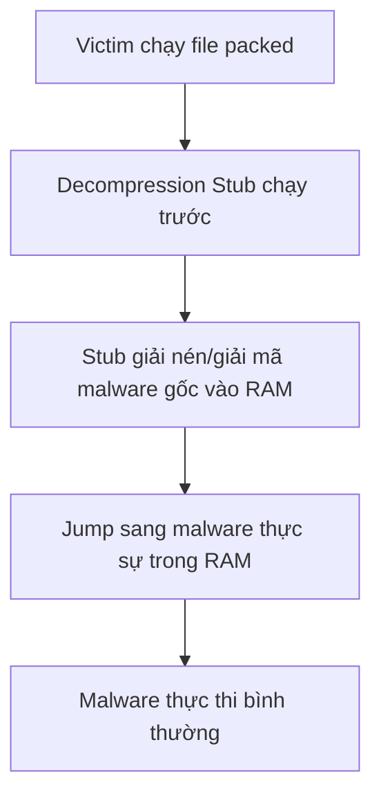
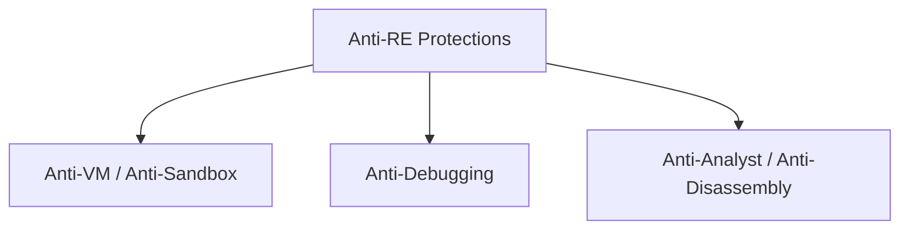
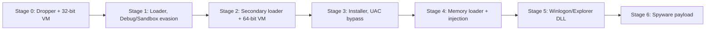

# Bài 6: Anti-Reverse Engineering (Anti-RE)

## Bài học: Software Reverse Engineering – Chống phân tích mã độc

---

## 1. Tổng quan

Anti-RE là tập hợp các kỹ thuật mà tác giả phần mềm (đặc biệt là tác giả malware) sử dụng để cản trở quá trình phân tích, dịch ngược (reverse engineering) chương trình của họ.

Đây là cuộc chiến "mèo vờn chuột" liên tục giữa:

- **Attackers**: Tác giả malware, muốn phần mềm độc hại của họ không bị phát hiện và phân tích.
- **Defenders**: Malware analyst, AV engine, sandbox, researcher.

!!! note "Lưu ý quan trọng"
    Các kỹ thuật Anti-RE không chỉ được dùng cho mục đích xấu. Chúng còn được dùng hợp pháp trong:

    - Bảo vệ bản quyền phần mềm thương mại, audio/video
    - Chống gian lận trong game (anti-cheat)
    - License management

---

## 2. Packers

### 2.1. Khái niệm

**Packer** là một chương trình hậu xử lý (post-processing) được áp dụng lên file thực thi sau khi biên dịch xong, nhằm làm cho file đó khó bị phát hiện hoặc phân tích hơn.

Các phương pháp biến đổi phổ biến:

- **Nén** (compress) file gốc
- **Mã hóa** file gốc – gọi là *crypter*
- **XOR hoặc biến đổi byte** file gốc

Mục tiêu cuối cùng: **FUD – Fully UnDetectable** (hoàn toàn không bị phát hiện bởi AV).

!!! tip "Tại sao packer dễ dùng?"
    Packer hoạt động như một bước post-processing: bạn viết malware xong, chạy packer lên file `.exe`, ra file mới đã được bảo vệ. Không cần sửa code gốc. Malware "pro" thường tự viết packer riêng và không phân phối cho ai khác.

### 2.2. Quá trình đóng gói (Packing Process)

```
[File gốc]                         [File đã packed]
+-----------------+                 +-----------------+
| PE Header       |    Packer       | PE Header (mới) |
| .text (code)    |  =========>     | Packed section 1|
| .data           |                 | Packed section 2|
+-----------------+                 | Decompression   |
                                    |   Stub (.text)  |
                                    +-----------------+
```

Packer thực hiện 3 thay đổi chính:

| Thành phần | Thay đổi |
|---|---|
| Program sections | Tạo section mới, đổi tên section |
| Entry point | Trỏ sang đầu decompression stub, không phải code gốc |
| Import Address Table (IAT) | Giấu IAT gốc, chỉ cung cấp IAT cho stub |

### 2.3. Quá trình giải nén khi thực thi (Unpacking at Runtime)

Khi victim chạy file packed:



!!! warning "Lưu ý"
    Malware thực sự **chỉ tồn tại trong RAM**, không nằm trên disk. AV quét file trên disk sẽ chỉ thấy decompression stub vô hại.

### 2.4. Các loại Packer đặc biệt

=== "API Obfuscation Packer"

    Thay thế các lời gọi Win32 API trực tiếp (ví dụ: `CreateFile()`, `ReadFile()`) bằng các lời gọi được che giấu qua một stub trung gian. Tại runtime, stub mới dịch lời gọi về API thực.

    ```
    Code gốc: call CreateFile()
                    |
                    v (qua packer)
    Code mới: call ObfuscatedStub_0x4A2F
                    |
                    v (tại runtime)
              call kernel32.CreateFile()
    ```

=== "Code Virtualization Packer"

    Toàn bộ code gốc được chuyển đổi thành **bytecode** của một kiến trúc máy ảo (VM) tùy chỉnh. VM interpreter đi kèm trong file packed sẽ thực thi bytecode này tại runtime.

    - Static analysis tools (IDA Pro) sẽ chỉ thấy bytecode vô nghĩa
    - AV engine không nhận ra pattern độc hại
    - Cần dynamic analysis để quan sát VM hoạt động

=== "UPX"

    UPX (Ultimate Packer for eXecutables) là packer mã nguồn mở phổ biến:
    
    - Tỉ lệ nén tốt hơn WinZip/gzip
    - Hỗ trợ nhiều định dạng executable
    - **Vấn đề**: AV engines có thể tự động unpack UPX. Chỉ kẻ tấn công thiếu kinh nghiệm mới dùng UPX nguyên bản.

### 2.5. Nhận biết file đã được pack

Khi phân tích một file thực thi, các dấu hiệu cho thấy file có thể đã bị pack:

- **Ít chuỗi đọc được** (few readable strings)
- **IAT rất ít import** – chỉ có những hàm cần cho decompression stub
- **Entropy cao bất thường** trong các section:
    - Code thông thường: **5–6 bits/byte**
    - Code đã packed: **> 7 bits/byte** (dữ liệu "quá ngẫu nhiên")
- Section name hoặc embedded string chứa tên packer (nếu tác giả lười)

---

## 3. Kỹ thuật Unpacking thủ công

Vì mỗi packer khác nhau, công cụ tự động thường không hiệu quả. Analyst cần unpack thủ công.

**Mục tiêu**: Tìm đoạn code chuyển quyền điều khiển từ decompression stub sang malware thực sự đã giải nén.

### Shortcut hữu ích – Hardware Breakpoint trên Stack

**Giả thuyết nền tảng**:

- Malware gốc không biết nó sẽ bị packed.
- Packer không biết cụ thể malware nào sẽ được packed.
- Do đó, unpacking stub phải dọn dẹp stack (restore stack frame) trước khi jump sang malware thực.

**Kỹ thuật**:

1. Đặt hardware breakpoint tại địa chỉ của phần tử đầu tiên trong stack
2. Chạy chương trình
3. Khi breakpoint triggered, bạn đang ở cuối unpacking stub, ngay trước lệnh JMP/CALL sang malware thực

---

## 4. Các kỹ thuật bảo vệ (Protections)

### 4.1. Phân loại



### 4.2. Evade Virtual Machines

Malware kiểm tra môi trường để biết có đang chạy trong VM không:

- **MAC Address check**: Kiểm tra registry `HKEY_LOCAL_MACHINE\SYSTEM\CurrentControlSet\Control\Class\{GUID}\0000\NetworkAddress`. Các VM vendor có dải MAC đặc trưng. Dùng `GetAdaptersInfo()`.
- **Process enumeration**: Tìm tiến trình đặc trưng của VM tools: `VmwareService.exe`, `VBoxService.exe`, v.v.
- **Timing analysis**: Một số tác vụ chạy chậm hơn trong VM so với bare metal. Nếu timing bất thường → đang bị quan sát.
- **Hardware device list**: Kiểm tra vendor ID của thiết bị ảo hóa.

!!! info "Tại sao VM dễ bị phát hiện?"
    VM vendors không cố ý thiết kế VM để không bị phát hiện. Phần mềm ảo hóa để lại nhiều "dấu vết" có thể kiểm tra được.

### 4.3. Evade Analysis Sandboxes

Sandbox phân tích malware thường là môi trường tự động, thiếu dấu hiệu của "người dùng thực". Malware kiểm tra:

| Kiểm tra | Ý nghĩa |
|---|---|
| Clipboard có trống không? | Người dùng thực thường có dữ liệu trong clipboard |
| Mouse cursor có di chuyển không? | Máy sandbox thường không có tương tác chuột |
| CPU có hơn 1 core không? | Sandbox thường dùng 1 core |
| Disk đủ lớn không? | Sandbox thường có disk nhỏ |
| Hệ thống chạy bao lâu rồi? | Sandbox thường boot lên và phân tích ngay |
| Foreground window có thay đổi không? | Người dùng thực thường chuyển cửa sổ |

### 4.4. Evade Debuggers qua API Calls

**Cách dễ nhất**: Gọi trực tiếp Windows API.

```c
// Kiểm tra debugger đơn giản nhất
if (IsDebuggerPresent()) {
    ExitProcess(0); // hoặc thay đổi hành vi
}

// Kiểm tra remote debugger
BOOL bDebugger = FALSE;
CheckRemoteDebuggerPresent(GetCurrentProcess(), &bDebugger);
```

**Các API nâng cao hơn**:

- `NtQueryObject()` / `NtQuerySystemInformation()` – kiểm tra debug object handle
- `NtSetInformationThread(ThreadHideFromDebugger)` – ngăn debugger nhận events từ thread
- Enumerate processes/windows – tìm tên file của debugger (x64dbg.exe, ollydbg.exe, IDA.exe...)

### 4.5. Cơ chế hoạt động của Breakpoints

!!! question "Breakpoint hoạt động như thế nào?"

=== "Software Breakpoint (Type 1)"

    - Debugger thay thế byte đầu tiên của instruction bằng `0xCC` (lệnh `INT 3`)
    - Khi CPU thực thi đến `0xCC`, raise interrupt, debugger handle
    - **Phát hiện**: Malware scan memory tìm byte `0xCC` trong code region của chính nó

=== "Hardware Breakpoint (Type 2)"

    - Sử dụng debug registers DR0–DR3 (4 địa chỉ)
    - Khi CPU fetch/access địa chỉ trong DR, raise `INT 1`
    - **Phát hiện**: Đọc thread context, kiểm tra debug registers; hoặc dùng custom Structured Exception Handler (SEH)

=== "Memory Breakpoint (Type 3)"

    - Đánh dấu page là "guard page"
    - Khi code thực thi vào guard page, exception handler được gọi
    - **Phát hiện**: Kiểm tra memory protection flags

### 4.6. Evade Analysts (Anti-Disassembly)

**Checksum/Hash kiểm tra tính toàn vẹn**:

Malware tính hash (MD5, CRC) trên vùng code của chính nó. Nếu hash thay đổi → có người đặt breakpoint hoặc patch code → tự hủy.

**Timing attack**:

```c
UINT64 t1 = __rdtsc();
// Thực thi hàm
UINT64 t2 = __rdtsc();
if ((t2 - t1) > THRESHOLD) {
    // Đang bị debug → hành động khác
}
```

Nếu analyst đang step qua từng lệnh trong debugger, thời gian thực thi sẽ lớn bất thường.

**API Obfuscation**:

- Không import DLL theo function name, mà import theo **ordinal number**
- Không dùng Import Address Table – thay vào đó **load DLL tại runtime** (`LoadLibrary` + `GetProcAddress`)
- Không hardcode string tên DLL/function – **ghép chuỗi từng ký tự tại runtime** theo pattern ngẫu nhiên

**Junk Code & Spaghetti Code**:

- Chèn các lệnh vô nghĩa (dead code) không bao giờ được thực thi nhưng làm rối disassembler
- Dùng nhiều JMP để tạo "mã spaghetti" – luồng điều khiển cực kỳ khó đọc

---

## 5. Case Study: FinFisher / FinSpy (2017)

FinFisher là spyware thương mại cấp chính phủ, được bán cho các chính phủ trên thế giới. Đây là ví dụ thực tế về malware áp dụng cực kỳ nhiều lớp bảo vệ Anti-RE.

```
MD5:    a7b990d5f57b244dd17e9a937a41e7f5
SHA-1:  c217d48c4ac1555491348721cc7cfd1143fe0b16
SHA-256: b035ca2d174e5e4fd2d66fd3c8ce4ae5c1e75cf3290af872d1adb2658852afb8
```

### Kiến trúc nhiều lớp (Multi-Stage)



### Stage 0 – Dropper với Custom VM 32-bit

- Implement một VM dispatcher loop với **32 opcode handler**
- Đây là một kiến trúc máy ảo đơn giản tùy chỉnh, với 32 lệnh khác nhau
- Code thực sự được biên dịch thành bytecode của VM này, không phải x86
- Static analyzer như IDA chỉ thấy VM interpreter, không thấy logic thực

### Stage 1 – Loader (Evade Debuggers/Sandboxes)

Stage này thực hiện một danh sách kiểm tra dài:

- Load key DLLs (`ntdll.dll`, `kernel32.dll`, `advapi32.dll`, `version.dll`) từ disk, **remap lại trong memory** → phá vỡ software breakpoints của debugger đang hook vào các DLL đó
- Kiểm tra modules không mong muốn đã bị inject bởi security software
- Kiểm tra các security solution cụ thể qua "tells": registry keys, mutexes, DLLs, directory info
- **Thậm chí kiểm tra MD5 string của chính malware có nằm trong directory path không!**
- Kiểm tra VM (VMWare, Hyper-V): inspect hardware device list tìm vendor ID ảo hóa
- Destroy debugger connections:

```c
// Ẩn thread khỏi debugger
ZwSetInformationThread(GetCurrentThread(), ThreadHideFromDebugger, NULL, 0);

// Phá soft breakpoint tại DbgBreakPoint
VirtualProtectEx(CurProc, &DbgBreakPoint, 1, PAGE_RWX, &oldProtect);
DbgBreakPoint[0] = 0x90; // NOP thay cho INT 3
```

- Nếu môi trường "sạch": Extract bytecode từ **fake bitmap images** trong resources

### Stage 1 → Stage 2: Heaven's Gate

Malware switch từ 32-bit sang 64-bit code execution bằng kỹ thuật **"Heaven's Gate"**:

```nasm
; Switch sang 64-bit mode
push 33h           ; CS selector cho 64-bit
push offset Stage2_64BitRoutine
retf               ; Far return → load CS:EIP mới, switch sang 64-bit
```

### Stage 2 – Secondary Loader với Custom VM 64-bit

- Một VM khác, lần này 64-bit, interpret bytecode ẩn trong image resources
- Bytecode tương tự nhưng không giống hệt VM 32-bit ở Stage 0
- Extract Stage 3 từ encrypted resources (giả dạng fake dialog boxes)

### Bảng Opcode của VM (FinFisher)

| Index | Mnemonic | Mô tả |
|---|---|---|
| 0x0 | EXEC | Execute machine code |
| 0x1 | JG | Jump if greater |
| 0x2 | WRITE | Write vào dereferenced pointer |
| 0x3 | JNO | Jump if not overflow |
| 0x7 | PUSH | Push VM value lên stack |
| 0xB | ADD | Add register vào VM value |
| 0x12 | MOV | Move VM value vào register |
| 0x13 | JZ | Jump if zero |
| 0x1E | CALL | Call external/internal function |
| 0x1D | JNE | Jump if not equal |
| ... | ... | ... |

### Stage 3 – Installer (UAC Bypass)

=== "Use Case 1: Môi trường UAC (quyền hạn chế)"

    - Chụp screenshot màn hình, hiển thị lên để che thông báo cài đặt Windows
    - Extract DLL, set `\Run` registry key để persistence
    - Xóa system event logs, chạy Stage 4, terminate

=== "Use Case 2: Quyền Admin đầy đủ"

    Kỹ thuật DLL hijacking tinh vi:

    1. Enumerate `KnownDlls` object directory, scan section objects của system DLLs
    2. Tìm file `.exe` trong `%System%` là Windows binary hợp lệ (signed) mà import từ ít nhất một KnownDll **và** từ một DLL không có trong KnownDlls
    3. Copy file `.exe` đó vào malware installation folder (ví dụ: `C:\ProgramData`)
    4. Extract và decrypt stub DLL từ resources, tạo fake export table giả mạo DLL hệ thống (`aepic.dll`, `sspisrv.dll`, `ftllib.dll`, `userenv.dll`)
    5. Tạo Windows service mới trỏ đến `.exe` + DLL giả trong folder mới

    Kết quả: Khi service chạy lúc boot, Windows executable hợp lệ load DLL độc hại thay vì DLL thật.

### Stage 4 – Memory Loader (Injection)

=== "Use Case 1: UAC"
    Inject Stage 5 vào tiến trình `explorer.exe` giả

=== "Use Case 2: Admin"
    Tìm `svchost.exe` hosting Plug and Play service → inject malware vào đó → `svchost.exe` map và execute Stage 5 vào `winlogon.exe`

### Stage 5 – Final Loader (Winlogon/Explorer)

- Lại dùng bytecode + VM
- VM extract và map payload cuối cùng (không còn obfuscated) vào `explorer.exe` (Case 1) hoặc `winlogon.exe` (Case 2)
- Gọi DLL entry point và `RunDll()` để thực thi malware

### Stage 6 – Spyware Payload

- Framework spyware theo module, hỗ trợ plugins
- Khác nhau tùy target (customized per deployment)
- Các khả năng đã biết: giám sát internet connection, điều hướng SSL traffic, MBR Rootkit

!!! quote "Turducken of Malware"
    "Malicious payload bên trong nhiều lớp obfuscation" – giống như món gà nhồi vịt nhồi gà tây (turducken).

---

## 6. Câu hỏi & Trả lời trong bài

**Câu hỏi: Breakpoint hoạt động như thế nào?**

Đã trả lời chi tiết ở mục 4.5 phía trên.

---

## Câu hỏi trắc nghiệm

**Câu 1.** Mục tiêu chính của Packer trong bối cảnh malware là gì?

- A. Tăng hiệu năng thực thi của malware
- B. Giảm kích thước file để truyền nhanh hơn
- C. Che giấu malware khỏi bị phát hiện và phân tích
- D. Mã hóa dữ liệu đánh cắp từ nạn nhân

??? info "Đáp án & Giải thích"
    **Đáp án: C**

    Packer được dùng để làm malware khó bị phát hiện bởi AV engine và khó bị phân tích bởi researcher. Mục tiêu là FUD (Fully UnDetectable).

---

**Câu 2.** Khi file executable bị pack, entry point của file mới trỏ về đâu?

- A. Hàm `main()` của malware gốc
- B. Đầu của decompression stub
- C. Import Address Table
- D. Địa chỉ ngẫu nhiên trong heap

??? info "Đáp án & Giải thích"
    **Đáp án: B**

    Packer thay đổi entry point sang đầu của decompression stub. Stub này chạy trước, giải nén/giải mã malware thực vào RAM, rồi mới jump sang malware thực.

---

**Câu 3.** FUD trong ngữ cảnh malware có nghĩa là gì?

- A. File Update Delivery
- B. Fully UnDetectable
- C. Fast Universal Deployment
- D. Firmware Unsigned Driver

??? info "Đáp án & Giải thích"
    **Đáp án: B**

    FUD = Fully UnDetectable – mục tiêu của tác giả malware là tạo ra phần mềm độc hại không bị phát hiện bởi bất kỳ AV engine nào.

---

**Câu 4.** Điều gì xảy ra với malware thực sự (sau khi được giải nén) trong quá trình thực thi file packed?

- A. Nó được ghi ra disk trước khi thực thi
- B. Nó được thực thi trực tiếp từ Internet
- C. Nó chỉ tồn tại trong RAM, không được ghi ra disk
- D. Nó được lưu vào registry

??? info "Đáp án & Giải thích"
    **Đáp án: C**

    Decompression stub giải nén malware thực vào memory (RAM) và thực thi tại đó. File trên disk chỉ chứa stub và dữ liệu compressed/encrypted. Đây là lý do tại sao AV quét file trên disk không phát hiện được.

---

**Câu 5.** Software breakpoint (INT 3) hoạt động bằng cách nào?

- A. Set cờ trong CPU register đặc biệt
- B. Thay thế byte đầu tiên của instruction bằng `0xCC`
- C. Đánh dấu memory page là "guard page"
- D. Hook hàm trong kernel

??? info "Đáp án & Giải thích"
    **Đáp án: B**

    Software breakpoint thay thế byte đầu của instruction bằng `0xCC` (lệnh `INT 3`). Khi CPU thực thi, raise interrupt, debugger bắt lấy và dừng thực thi.

---

**Câu 6.** Hardware breakpoint sử dụng thành phần nào của CPU?

- A. Thanh ghi EAX, EBX, ECX, EDX
- B. Flag register (EFLAGS)
- C. Debug registers DR0–DR3
- D. Segment registers CS, DS, ES, SS

??? info "Đáp án & Giải thích"
    **Đáp án: C**

    Hardware breakpoint dùng debug registers DR0–DR3 (tối đa 4 địa chỉ đồng thời). Khi CPU access địa chỉ được chỉ định, raise `INT 1`.

---

**Câu 7.** Memory breakpoint (guard page) hoạt động theo cơ chế nào?

- A. Ghi đè opcode trong memory
- B. Set thuộc tính đặc biệt cho memory page, khi bị access sẽ raise exception
- C. Dùng hardware register theo dõi địa chỉ
- D. Hook system call trong kernel

??? info "Đáp án & Giải thích"
    **Đáp án: B**

    Guard page là memory page được đánh dấu đặc biệt. Khi code thực thi vào hoặc đọc/ghi vào guard page, Windows raise một exception, debugger bắt lấy exception đó.

---

**Câu 8.** Malware có thể phát hiện software breakpoint bằng cách nào?

- A. Đọc debug registers DR0–DR3
- B. Scan vùng code của chính nó để tìm byte `0xCC`
- C. Gọi `IsDebuggerPresent()`
- D. Kiểm tra MAC address

??? info "Đáp án & Giải thích"
    **Đáp án: B**

    Vì software breakpoint chèn `0xCC` vào memory, malware có thể scan vùng code của chính nó (so sánh với checksum ban đầu, hoặc tìm byte `0xCC`) để phát hiện breakpoint.

---

**Câu 9.** Kỹ thuật "shortcut" nào hữu ích khi unpack thủ công dựa trên đặc điểm của stack?

- A. Đặt breakpoint tại hàm `CreateProcess`
- B. Đặt hardware breakpoint tại phần tử đầu tiên của stack
- C. Dùng memory breakpoint tại địa chỉ entry point
- D. Hook hàm `VirtualAlloc`

??? info "Đáp án & Giải thích"
    **Đáp án: B**

    Unpacking stub phải restore stack trước khi jump sang malware thực. Đặt hardware breakpoint tại phần tử đầu stack sẽ trigger ngay trước lệnh JMP/CALL cuối cùng của stub, cho phép analyst bắt đúng thời điểm malware thực bắt đầu chạy.

---

**Câu 10.** Entropy của section code thông thường và section đã packed lần lượt là bao nhiêu?

- A. Thông thường: 3–4 bits/byte; Packed: 5–6 bits/byte
- B. Thông thường: 5–6 bits/byte; Packed: > 7 bits/byte
- C. Thông thường: 7–8 bits/byte; Packed: < 5 bits/byte
- D. Thông thường: 1–2 bits/byte; Packed: 4–5 bits/byte

??? info "Đáp án & Giải thích"
    **Đáp án: B**

    Code thực thi bình thường có entropy khoảng 5–6 bits/byte. Code đã được compress/encrypt có entropy > 7 bits/byte vì dữ liệu gần như ngẫu nhiên.

---

**Câu 11.** Tại sao UPX vanilla (không sửa đổi) không phù hợp cho malware "chuyên nghiệp"?

- A. UPX nén quá tệ
- B. UPX chỉ hỗ trợ Windows
- C. AV engines có thể tự động nhận diện và unpack UPX
- D. UPX làm chậm quá trình thực thi

??? info "Đáp án & Giải thích"
    **Đáp án: C**

    UPX là open source và rất phổ biến. AV engines đã có signature và logic để nhận diện và unpack file UPX. Chỉ kẻ tấn công thiếu kinh nghiệm mới dùng UPX nguyên bản.

---

**Câu 12.** Trong API Obfuscation Packer, lời gọi API gốc được xử lý như thế nào?

- A. Bị xóa hoàn toàn khỏi code
- B. Được thay thế bằng lời gọi đến stub trung gian, stub sẽ dịch về API thực tại runtime
- C. Được mã hóa AES và giải mã trước khi gọi
- D. Được thay thế bằng syscall trực tiếp

??? info "Đáp án & Giải thích"
    **Đáp án: B**

    API Obfuscation Packer thay thế lời gọi trực tiếp (ví dụ: `call CreateFile`) bằng lời gọi đến một obfuscated stub. Tại runtime, stub dịch lời gọi về Win32 API mong muốn.

---

**Câu 13.** Code Virtualization Packer hoạt động khác gì so với packer thông thường?

- A. Nó compress code bằng thuật toán tốt hơn
- B. Nó chuyển đổi code x86 thành bytecode của VM tùy chỉnh, VM interpreter thực thi bytecode này
- C. Nó mã hóa code bằng khóa asymmetric
- D. Nó tách code thành nhiều DLL

??? info "Đáp án & Giải thích"
    **Đáp án: B**

    Code được "compile" sang bytecode của một VM kiến trúc tùy chỉnh. VM interpreter (đi kèm trong file) thực thi bytecode này lúc runtime. Static analyzer chỉ thấy bytecode vô nghĩa.

---

**Câu 14.** Malware kiểm tra clipboard trống để làm gì?

- A. Đánh cắp dữ liệu từ clipboard
- B. Phát hiện môi trường sandbox – người dùng thực thường có dữ liệu trong clipboard
- C. Ghi dữ liệu giả vào clipboard để đánh lạc hướng
- D. Kiểm tra xem có phần mềm antivirus nào đang monitor clipboard không

??? info "Đáp án & Giải thích"
    **Đáp án: B**

    Sandbox phân tích thường chạy trong môi trường sạch không có tương tác người dùng. Clipboard rỗng là dấu hiệu của môi trường sandbox, không phải máy victim thực.

---

**Câu 15.** Hàm Windows API nào là cách đơn giản nhất để kiểm tra debugger?

- A. `GetCurrentProcess()`
- B. `NtQuerySystemInformation()`
- C. `IsDebuggerPresent()`
- D. `OpenProcess()`

??? info "Đáp án & Giải thích"
    **Đáp án: C**

    `IsDebuggerPresent()` là API đơn giản nhất, trả về TRUE nếu có debugger attach. Tuy nhiên nó cũng là API dễ bypass nhất (patch return value).

---

**Câu 16.** `NtSetInformationThread(ThreadHideFromDebugger)` có tác dụng gì?

- A. Ẩn thread khỏi Task Manager
- B. Ngăn debugger nhận events từ thread đó
- C. Set priority của thread lên cao nhất
- D. Vô hiệu hóa hardware breakpoint cho thread

??? info "Đáp án & Giải thích"
    **Đáp án: B**

    `NtSetInformationThread` với `ThreadHideFromDebugger` khiến Windows không gửi debug events (như exceptions) từ thread này đến debugger, làm cho debugger không thể theo dõi thread.

---

**Câu 17.** Kỹ thuật timing attack trong anti-debug dùng để phát hiện điều gì?

- A. Máy victim đang offline
- B. Analyst đang step qua từng lệnh trong debugger khiến thời gian thực thi bất thường dài
- C. CPU đang bị throttle vì nhiệt độ cao
- D. Hệ thống đang chạy trong cloud

??? info "Đáp án & Giải thích"
    **Đáp án: B**

    Khi analyst step-by-step trong debugger, thời gian thực thi một đoạn code tăng vọt so với thực thi bình thường. Malware đo thời gian (dùng `rdtsc`, `GetTickCount`) và nếu vượt ngưỡng thì abort.

---

**Câu 18.** Tại sao malware có thể load DLL tại runtime thay vì dùng IAT?

- A. Để tăng tốc độ load
- B. Để giấu tên DLL và function khỏi static analyzer kiểm tra IAT
- C. Vì IAT không hỗ trợ 64-bit
- D. Để tránh address conflict

??? info "Đáp án & Giải thích"
    **Đáp án: B**

    Nếu import qua IAT, tên DLL và function được lưu rõ ràng trong PE header. Static analyzer có thể đọc và suy ra hành vi malware. Load tại runtime (dùng `LoadLibrary`/`GetProcAddress`) ẩn thông tin này.

---

**Câu 19.** Junk code (dead code) ảnh hưởng đến phân tích như thế nào?

- A. Làm chậm thực thi malware
- B. Làm rối disassembler và gây khó khăn cho analyst đọc code
- C. Gây crash debugger
- D. Vô hiệu hóa AV engine

??? info "Đáp án & Giải thích"
    **Đáp án: B**

    Junk code là các lệnh không bao giờ được thực thi (bị nhảy qua bởi JMP) nhưng làm cho listing trong disassembler dài và phức tạp hơn, khiến analyst mất thời gian phân tích.

---

**Câu 20.** FinFisher được phân loại là loại phần mềm gì?

- A. Ransomware bán cho tội phạm
- B. Adware thương mại
- C. Spyware cấp chính phủ (government-grade surveillance spyware)
- D. Botnet client

??? info "Đáp án & Giải thích"
    **Đáp án: C**

    FinFisher/FinSpy là spyware được bán cho các chính phủ trên thế giới để theo dõi mục tiêu. Đây là "commercial spyware" hay "lawful interception" tool, mặc dù bị lạm dụng nhiều.

---

**Câu 21.** FinFisher Stage 0 implement một VM với bao nhiêu opcode handler?

- A. 16
- B. 24
- C. 32
- D. 64

??? info "Đáp án & Giải thích"
    **Đáp án: C**

    Stage 0 dropper implement VM dispatcher loop với 32 opcode handler – một kiến trúc máy ảo đơn giản với 32 lệnh khác nhau.

---

**Câu 22.** "Heaven's Gate" trong FinFisher Stage 1 được dùng để làm gì?

- A. Bypass UAC
- B. Switch từ 32-bit execution sang 64-bit execution
- C. Inject code vào kernel
- D. Bypass Windows Firewall

??? info "Đáp án & Giải thích"
    **Đáp án: B**

    Heaven's Gate là kỹ thuật dùng far return (`retf`) với CS selector 64-bit để switch từ 32-bit mode sang 64-bit mode trong quá trình thực thi. FinFisher dùng nó để switch từ Stage 1 (32-bit) sang Stage 2 (64-bit).

---

**Câu 23.** FinFisher Stage 1 làm gì với DLLs hệ thống (ntdll, kernel32...) để phá debugger?

- A. Xóa các DLL này khỏi disk
- B. Load DLL từ disk và remap chúng vào memory riêng, phá breakpoints đang hook vào bản DLL gốc
- C. Patch các hàm trong DLL để trả về giá trị sai
- D. Unload toàn bộ DLL hệ thống

??? info "Đáp án & Giải thích"
    **Đáp án: B**

    Debugger và security software thường hook vào các hàm trong DLL đang được load. Bằng cách load một bản DLL "sạch" từ disk và map riêng, malware bypass toàn bộ hooks này.

---

**Câu 24.** Trong Stage 3 Use Case 2 (admin permissions), FinFisher giả mạo DLL hệ thống nào để persistence?

- A. `user32.dll`, `gdi32.dll`
- B. `aepic.dll`, `sspisrv.dll`, `ftllib.dll`, `userenv.dll`
- C. `ntdll.dll`, `kernel32.dll`
- D. `ws2_32.dll`, `wininet.dll`

??? info "Đáp án & Giải thích"
    **Đáp án: B**

    FinFisher tạo stub DLL giả mạo export table của `aepic.dll`, `sspisrv.dll`, `ftllib.dll`, hoặc `userenv.dll` – các DLL ít phổ biến hơn, dễ bị bỏ qua hơn.

---

**Câu 25.** Trong Stage 3 Use Case 1 (UAC), FinFisher dùng trick gì để ẩn thông báo cài đặt?

- A. Tắt màn hình
- B. Chụp screenshot màn hình và hiển thị lên trên
- C. Disable Windows notification
- D. Fake crash screen

??? info "Đáp án & Giải thích"
    **Đáp án: B**

    FinFisher chụp screenshot màn hình hiện tại và display nó lên (giống hình nền tĩnh), che đi các thông báo cài đặt Windows hiện ra bên dưới.

---

**Câu 26.** Trong Stage 4, khi có full admin permissions, FinFisher inject Stage 5 vào process nào?

- A. `explorer.exe` trực tiếp
- B. `svchost.exe` hosting Plug and Play service, sau đó svchost inject vào `winlogon.exe`
- C. `lsass.exe`
- D. `csrss.exe`

??? info "Đáp án & Giải thích"
    **Đáp án: B**

    Với admin privileges, FinFisher tìm `svchost.exe` đang host Plug and Play service, inject malware vào đó. `svchost.exe` sau đó map và execute Stage 5 vào `winlogon.exe`.

---

**Câu 27.** Malware kiểm tra số CPU core để làm gì?

- A. Tối ưu hóa hiệu năng mã hóa
- B. Phát hiện môi trường sandbox thường chỉ có 1 core
- C. Quyết định số thread worker sẽ tạo
- D. Check khả năng hardware để khai thác cryptocurrency

??? info "Đáp án & Giải thích"
    **Đáp án: B**

    Sandbox phân tích malware thường được cấu hình với 1 CPU core để tiết kiệm tài nguyên. Hệ thống người dùng thực thường có nhiều core hơn.

---

**Câu 28.** Malware kiểm tra "foreground window có thay đổi không" để phát hiện điều gì?

- A. Xem user có đang dùng máy không
- B. Kiểm tra môi trường sandbox tự động không có tương tác cửa sổ
- C. Tìm cửa sổ của debugger
- D. Kiểm tra xem màn hình có bị capture không

??? info "Đáp án & Giải thích"
    **Đáp án: B**

    Người dùng thực liên tục chuyển giữa các cửa sổ. Sandbox tự động thường không có sự thay đổi foreground window, đây là dấu hiệu của môi trường phân tích.

---

**Câu 29.** Anti-RE techniques được dùng cho mục đích hợp pháp nào?

- A. Tăng tốc độ biên dịch code
- B. Bảo vệ bản quyền phần mềm và chống gian lận trong game
- C. Cải thiện bảo mật mạng
- D. Phát triển phần mềm mã nguồn mở

??? info "Đáp án & Giải thích"
    **Đáp án: B**

    Kỹ thuật Anti-RE được dùng hợp pháp trong bảo vệ DRM (Digital Rights Management) cho phần mềm thương mại, audio/video, và trong hệ thống anti-cheat của game.

---

**Câu 30.** Tại sao việc tự viết packer riêng và không phân phối nó là chiến lược tốt cho attacker?

- A. Packer tự viết sẽ nén tốt hơn
- B. AV engines không có signature cho packer chưa từng thấy
- C. Packer tự viết tuân thủ luật bản quyền
- D. Giúp tiết kiệm thời gian phát triển

??? info "Đáp án & Giải thích"
    **Đáp án: B**

    AV engines nhận diện packer dựa vào signature (pattern của packer đã biết). Packer tùy chỉnh chưa bao giờ được công bố sẽ không có signature trong AV database.

---

**Câu 31.** Checksums/hash trên code region của malware được dùng để phát hiện điều gì?

- A. Lỗi truyền dữ liệu qua mạng
- B. Sự thay đổi trong code do analyst đặt breakpoint hoặc patch
- C. Virus khác đang lây nhiễm lên malware
- D. Phiên bản Windows của victim

??? info "Đáp án & Giải thích"
    **Đáp án: B**

    Malware tính hash/checksum trên code của chính nó lúc startup và định kỳ. Nếu giá trị thay đổi (do analyst chèn `0xCC` hoặc patch), malware biết đang bị phân tích và abort.

---

**Câu 32.** Instruction `rdtsc` được dùng trong anti-debug để làm gì?

- A. Reset timestamp counter
- B. Đọc giá trị timestamp counter – đo thời gian thực thi để phát hiện step-by-step debugging
- C. Mã hóa dữ liệu bằng timestamp
- D. Ghi log thời gian vào registry

??? info "Đáp án & Giải thích"
    **Đáp án: B**

    `rdtsc` (Read Time-Stamp Counter) đọc số chu kỳ CPU. Malware đo thời gian thực thi một đoạn code bằng hai lần `rdtsc`. Nếu khoảng cách quá lớn (do analyst debug chậm), phát hiện debugger.

---

**Câu 33.** Spaghetti code trong FinFisher được tạo ra như thế nào?

- A. Dùng thuật toán mã hóa phức tạp
- B. Cố tình tạo code với nhiều JMP ngẫu nhiên và chèn junk instruction bị nhảy qua tại runtime
- C. Compile code bằng nhiều compiler khác nhau
- D. Dùng nhiều ngôn ngữ lập trình khác nhau

??? info "Đáp án & Giải thích"
    **Đáp án: B**

    Tác giả FinFisher cố tình tạo code với junk instructions và nhiều JMP, khiến luồng điều khiển trong disassembler cực kỳ khó đọc. Tại runtime, các JMP nhảy qua junk code.

---

**Câu 34.** Microsoft đã phải làm gì để normalize code của FinFisher trong IDA?

- A. Dùng công cụ có sẵn trên GitHub
- B. Tự viết plugin IDA bằng Python vì không có công cụ nào có sẵn
- C. Dùng Ghidra thay vì IDA
- D. Thuê team chuyên biệt để làm thủ công

??? info "Đáp án & Giải thích"
    **Đáp án: B**

    Không có công cụ có sẵn nào có thể normalize code flow của FinFisher. Microsoft phải tự viết IDA plugin bằng Python để xử lý vấn đề này.

---

**Câu 35.** Bytecode của FinFisher VM được ẩn trong loại resource nào của PE file?

- A. String table
- B. Icon resources
- C. Fake bitmap images và fake dialog boxes
- D. Version information

??? info "Đáp án & Giải thích"
    **Đáp án: C**

    FinFisher ẩn bytecode trong fake bitmap images (Stage 1) và encrypted resources giả dạng fake dialog boxes (Stage 2). Đây là kỹ thuật steganography trong PE resources.

---

**Câu 36.** Trong phân tích FinFisher VM, Microsoft phải làm gì để hiểu bytecode?

- A. Chạy malware nhiều lần với input khác nhau
- B. Nghiên cứu VM architecture (instruction set, format) và viết opcode interpreter để recover output
- C. Submit lên VirusTotal để phân tích
- D. Yêu cầu FinFisher cung cấp documentation

??? info "Đáp án & Giải thích"
    **Đáp án: B**

    Microsoft nghiên cứu toàn bộ VM: instruction set, instruction format, obfuscating tricks, rồi viết opcode interpreter riêng để "decompile" bytecode về logic thực sự.

---

**Câu 37.** Tại sao malware dùng VM riêng lại khó phân tích bằng static tools như IDA?

- A. IDA không hỗ trợ Windows binary
- B. IDA chỉ hiểu x86/x64 assembly; bytecode của VM tùy chỉnh không có nghĩa trong IDA
- C. Bytecode được mã hóa quá mạnh
- D. IDA chỉ hỗ trợ Linux binary

??? info "Đáp án & Giải thích"
    **Đáp án: B**

    IDA disassemble theo instruction set x86/x64. Bytecode của VM tùy chỉnh không tuân theo bất kỳ ISA nào IDA biết, nên IDA chỉ hiển thị nó như data vô nghĩa.

---

**Câu 38.** Trong kỹ thuật DLL hijacking của FinFisher Stage 3, điều kiện để chọn file `.exe` target là gì?

- A. File `.exe` phải lớn hơn 1MB
- B. File `.exe` phải là Windows binary signed, import từ ít nhất một KnownDll và từ một DLL không trong KnownDlls
- C. File `.exe` phải đang chạy trong memory
- D. File `.exe` phải nằm trong `C:\Windows\System32`

??? info "Đáp án & Giải thích"
    **Đáp án: B**

    FinFisher tìm Windows binary hợp lệ (signed) trong `%System%` mà import từ ít nhất một KnownDll (được cache) VÀ từ một DLL không có trong KnownDlls – đây là DLL sẽ bị "giả mạo".

---

**Câu 39.** FinFisher xóa gì sau khi cài đặt để xóa dấu vết?

- A. Registry keys
- B. System event logs
- C. Prefetch files
- D. Recent documents

??? info "Đáp án & Giải thích"
    **Đáp án: B**

    Sau khi cài đặt, FinFisher Stage 3 xóa system event logs để xóa dấu vết hoạt động của malware trước khi chạy Stage 4 và terminate.

---

**Câu 40.** Tại sao "malware author không bao giờ nên phân phối custom packer" của mình?

- A. Vì packer có thể bị dùng lại bởi malware author khác
- B. Vì nếu packer bị phân phối, researcher sẽ phân tích nó và AV sẽ có signature
- C. Vì packer chứa thông tin cá nhân của tác giả
- D. Vì phân phối packer là bất hợp pháp ở mọi quốc gia

??? info "Đáp án & Giải thích"
    **Đáp án: B**

    Khi packer được phân phối (dù có phí), researcher có thể mua/lấy và phân tích, từ đó tạo signature để AV nhận diện. Packer chỉ dùng riêng thì không có public sample để phân tích.

---

**Câu 41.** IAT (Import Address Table) trong PE file chứa thông tin gì?

- A. Danh sách các process đang chạy
- B. Pointer đến các hàm trong external DLLs
- C. Danh sách registry keys cần đọc
- D. Thông tin về memory layout

??? info "Đáp án & Giải thích"
    **Đáp án: B**

    IAT lưu trữ pointer đến các hàm trong DLL bên ngoài mà chương trình cần gọi. Khi malware packed, IAT gốc bị ẩn và IAT mới chỉ chứa những hàm cần cho decompression stub.

---

**Câu 42.** Malware kiểm tra thời gian hệ thống đã chạy (uptime) để phát hiện điều gì?

- A. Xem victim có online không
- B. Sandbox thường boot và phân tích ngay → uptime rất ngắn; máy thực thường chạy nhiều giờ/ngày
- C. Kiểm tra múi giờ của victim
- D. Tìm thời điểm tối ưu để tấn công

??? info "Đáp án & Giải thích"
    **Đáp án: B**

    Sandbox thường restart VM và phân tích ngay, nên uptime rất ngắn (vài phút). Máy của người dùng thực thường chạy nhiều giờ hoặc vài ngày.

---

**Câu 43.** Kỹ thuật import theo ordinal number thay vì function name che giấu điều gì?

- A. Địa chỉ bộ nhớ của DLL
- B. Tên hàm API được gọi, khiến analyst khó biết malware dùng API nào
- C. Số lượng API calls
- D. Phiên bản DLL được dùng

??? info "Đáp án & Giải thích"
    **Đáp án: B**

    Import theo ordinal number chỉ lưu một số (ví dụ: ordinal 0x1A4) thay vì string tên hàm ("CreateFileA"). Static analyzer phải tra ordinal table của DLL mới biết đó là hàm gì.

---

**Câu 44.** `CheckRemoteDebuggerPresent()` kiểm tra gì khác so với `IsDebuggerPresent()`?

- A. Kiểm tra debugger trên máy remote qua mạng
- B. Kiểm tra debugger trong process khác (remote debugger attach), không chỉ local
- C. Kiểm tra kernel debugger
- D. Kiểm tra debugger trong VM

??? info "Đáp án & Giải thích"
    **Đáp án: B**

    `IsDebuggerPresent()` kiểm tra PEB flag của process hiện tại. `CheckRemoteDebuggerPresent()` có thể kiểm tra process khác (hoặc chính nó) xem có remote debugger attach không.

---

**Câu 45.** Trong FinFisher, tại sao dùng VM 64-bit ở Stage 2 thay vì tiếp tục dùng VM 32-bit?

- A. 64-bit VM nhanh hơn
- B. Switch sang 64-bit để tránh các hook và restriction của 32-bit WOW64 layer, tăng thêm lớp phức tạp
- C. 64-bit bytecode compact hơn
- D. Stage 2 cần dùng API chỉ có trên 64-bit

??? info "Đáp án & Giải thích"
    **Đáp án: B**

    Việc switch từ 32-bit sang 64-bit (Heaven's Gate) giúp bypass nhiều hook đang monitor 32-bit WOW64 layer. Ngoài ra, dùng VM 64-bit khác biệt thêm lớp phức tạp cho analyst.

---

**Câu 46.** Malware có thể phát hiện virtual machine thông qua danh sách hardware devices bằng cách nào?

- A. Đọc file BIOS
- B. Kiểm tra vendor ID của các thiết bị ảo hóa (network card, disk controller...) trong hardware device list
- C. Ping default gateway
- D. Kiểm tra resolution màn hình

??? info "Đáp án & Giải thích"
    **Đáp án: B**

    VM drivers và virtual hardware có vendor ID đặc trưng (ví dụ: VMware SCSI controller, VirtualBox network adapter). Malware enumerate hardware devices và kiểm tra các vendor ID này.

---

**Câu 47.** FinFisher Stage 6 có kiến trúc như thế nào?

- A. Một binary monolithic
- B. Framework modular với hỗ trợ plugins, payload khác nhau tùy target
- C. Script Python
- D. Macro Office

??? info "Đáp án & Giải thích"
    **Đáp án: B**

    Stage 6 là modular spyware framework với plugin support. FinFisher của từng target deployment có thể khác nhau về capabilities.

---

**Câu 48.** Malware "compose DLL name và function name từng ký tự một tại runtime" để làm gì?

- A. Tránh lỗi encoding
- B. Không để lại string rõ ràng trong binary, tránh static analyzer phát hiện tên DLL/API độc hại
- C. Hỗ trợ Unicode
- D. Tương thích với nhiều phiên bản Windows

??? info "Đáp án & Giải thích"
    **Đáp án: B**

    Nếu string "kernel32.dll" hay "CreateRemoteThread" nằm trong binary, string search/static analysis ngay lập tức gợi lên hành vi đáng ngờ. Ghép từng ký tự tại runtime tránh để lại string này trong file.

---

**Câu 49.** Tại sao malware "pro" thường kết hợp cả packer lẫn protection trong code?

- A. Packer đủ để bảo vệ; protection trong code là thừa
- B. Packer chỉ bảo vệ khi chưa bị unpack; protection trong code tiếp tục chống phân tích ngay cả sau khi bị unpack
- C. Protection trong code nhanh hơn packer
- D. AV yêu cầu cả hai để bypass

??? info "Đáp án & Giải thích"
    **Đáp án: B**

    Packer bảo vệ file trên disk và cản ban đầu. Nhưng khi analyst unpack được, malware vẫn cần protection trong code (anti-debug, anti-VM, obfuscation) để cản tiếp tục phân tích.

---

**Câu 50.** Sau khi đọc toàn bộ về FinFisher, điều nào mô tả chính xác nhất chiến lược của nó?

- A. Dùng một kỹ thuật obfuscation rất mạnh duy nhất
- B. Dùng nhiều lớp bảo vệ kết hợp (multiple stages, multiple VMs, anti-debug, anti-VM, DLL hijacking, injection) để tăng chi phí phân tích lên tối đa
- C. Dựa hoàn toàn vào mã hóa mạnh để bảo vệ
- D. Dùng zero-day exploit để tránh phân tích

??? info "Đáp án & Giải thích"
    **Đáp án: B**

    Chiến lược cốt lõi của FinFisher là "defense in depth" cho obfuscation: 6 stages, nhiều VM tùy chỉnh, anti-debug toàn diện, anti-VM, DLL hijacking, process injection. Mỗi lớp bảo vệ tiêu tốn thời gian của analyst. Tổng cộng, attacker có thể có nhiều tuần/tháng trước khi malware bị phân tích đầy đủ.